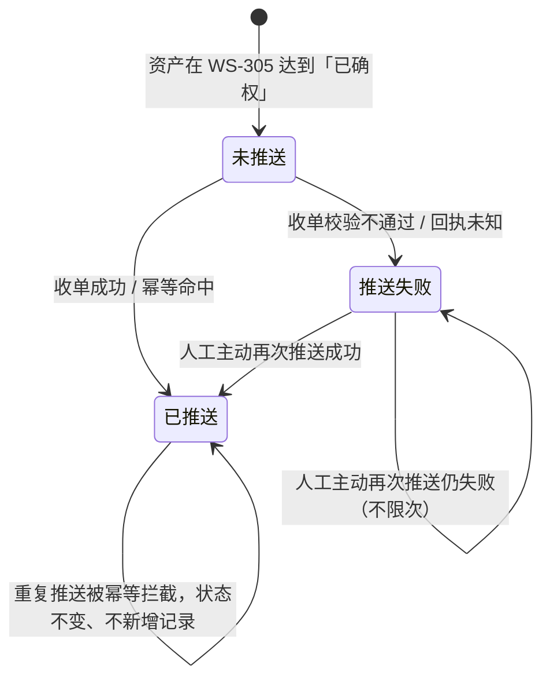

# 可信数据同步 · 分册一：模块详情与状态机

> 本文件是《可信数据同步 PRD》的分册一，入库后文件名为 `01-模块详情与状态机.md`，与主文档 `v1.0-可信数据同步-PRD.md` 同目录。
> 包含第 7～9 章。标记约定、角色与权限、功能清单见主文档；字段与接口见分册二 `02-数据字段与接口契约.md`；验收标准见分册三 `03-依赖风险与验收标准.md`。

---

## 7. 模块详情 · 资产管理端推送侧

### 7.1 F-DS-01 待推送资产列表（P-M-DS-01）

| 项 | 规则 |
| --- | --- |
| 数据范围 | 全部企业中**状态为「已确权」**（WS-305 S3）的应收账款。非「已确权」状态的资产不出现在本页 |
| 默认筛选 | 「未推送」，即同步状态为空的资产 |
| 列 | 应收账款编号、资产方（债权方企业名称）、资产类型、金额 + 币种、到期日、确权时间、同步状态、最近推送时间、操作 |
| 筛选 | 同步状态（未推送 / 已推送 / 推送失败）、币种、资产方、确权时间区间、关键词（应收账款编号 / 任一合同号 / 资产方名称） |
| 排序 | 默认按确权时间倒序；**金额排序仅在已选定单一币种时开放**（继承 WS-305 CU-03） |
| 已推送条目 | 保留在列表中且**勾选框禁用**，hover 提示「该资产已推送，重复推送不会在运营端新增记录」 |
| 失败条目 | 以「推送失败」标签呈现，行内直接给出失败原因与重推入口——**本期失败的可见性只在这一端**（口径 5） |
| 时间展示 | 以 UTC 存储，按账户时区渲染并带时区标注（WS-302 13.4） |

### 7.2 F-DS-02 金额展示与不做汇率折算的连锁约束

本模块**继承 WS-305 6.3 的 CU-01～CU-06，不做任何放宽**，两端同时适用：

| 约束 | 内容 |
| --- | --- |
| CU-01 | 任何列表、详情、汇总区**不得跨币种求和**，不得给出单一「总金额」 |
| CU-02 | 金额汇总一律按币种分组，每组给「笔数 + 该币种合计」，例 `1,200,000.00 CNY · 3 笔` |
| CU-03 | 金额排序仅在筛选条件已选定单一币种时开放，否则控件禁用并提示 |
| CU-04 | 金额与币种代码必须同屏相邻，数值在前、代码在后、千分位、法币 2 位小数；任何位置不得出现无币种的裸金额 |
| CU-05 | 两端的任何汇总区、导出内容同样受 CU-01～CU-04 约束，不得出具跨币种的单一口径报表 |
| CU-06 | 金额比对按该币种最小单位精度进行，`1000` 与 `1000.00` 视为相同 |

> 运营端的金额格式化按其自持基线（WS-308 `01-国际化基线.md` 第 5 节）执行，与上表不冲突：CU 约束管「能不能加总、能不能排序」，基线管「怎么显示一个数」。

### 7.3 F-DS-03 / F-DS-04 勾选、批量上限与推送前校验

**批量上限**：单批最多 500 条 `[假设-待确认 Q-DS-03]`。勾选超过上限时提交按钮禁用，并提示「单次最多推送 500 条，请分批处理」。跨页勾选保留已选项，页面顶部常驻「已选 N 条」与清空入口。

**推送前校验**（提交前在资产管理端本地执行，逐条判定）：

| 编号 | 校验项 | 判定 | 未通过的处置 |
| --- | --- | --- | --- |
| V-DS-01 | 资产状态 | 必须为「已确权」 | 剔除该条并提示「资产状态已变化，不可推送」 |
| V-DS-02 | 必填字段完整 | D-DS-01～D-DS-19 中标必填的字段均非空 | 列出缺失字段，该条不可提交 |
| V-DS-03 | 资产方主体存在 | 债权方企业在平台存在且认证通过 | 该条不可提交，提示「资产方主体不可用」 |
| V-DS-04 | 未重复推送 | 同步状态不为「已推送」 | 勾选框禁用（7.1） |
| V-DS-05 | 钱包地址 | **只做格式提示，不阻断**：缺失或非 `0x` + 40 位十六进制时，在确认弹层给出黄色提示「该资产方钱包地址缺失或格式异常，本期不影响推送」 | 允许继续提交 |

> V-DS-05 是本期唯一「校验但不阻断」的项，直接落实需求方口径 7：钱包地址本期只存不用，缺失不阻断推送，也不产生任何额外状态。

### 7.4 F-DS-05 二次确认与提交（C-M-DS-01）

- 确认弹层展示：待推条数、按币种分组的金额合计、V-DS-05 命中的条目数、批量上限校验结果。
- 提交为**一次性阻塞操作**：前端进入 loading 态直至拿到逐条回执。「推送中」**不是持久状态**，不落库、不在列表展示（第 9 章）。
- 提交请求超时或网络中断：该批次全部条目按「推送失败 · 原因码 E-DS-06 回执未知」落状态，提示「结果未知，请稍后刷新或直接重推——重推受幂等保护，不会重复入库」。

### 7.5 F-DS-06 逐条结果反馈（C-M-DS-02）

| 回执类型 | 资产管理端落的同步状态 | 展示 |
| --- | --- | --- |
| 新入库 | 已推送 | 绿色成功标记 |
| 幂等命中（运营端已存在同一资产） | 已推送 | 绿色成功标记 + 「运营端已存在，未重复入库」说明 |
| 收单失败 | 推送失败 | 红色标记 + 原因码与原因文案（10.4） |
| 回执未知（超时 / 中断） | 推送失败 | 红色标记 + E-DS-06 |

批量**逐条独立处理、部分成功不整体回滚**；结果面板按「成功 N 条 / 失败 M 条」聚合，并可展开逐条明细、跳转 P-M-DS-03。

### 7.6 F-DS-07 主动再次推送（本期唯一重推入口）

| 项 | 规则 |
| --- | --- |
| 入口 | **只在资产管理端**：P-M-DS-01 列表行操作列、P-M-DS-03 批次详情行操作列，均支持单条与批量重推。运营端不提供任何重推入口（口径 5） |
| 可重推范围 | **仅「推送失败」的资产**。「已推送」的条目不提供重推入口 |
| 重推行为 | 生成**新的推送批次号**，重新走 7.3 校验与幂等；成功后同步状态转「已推送」 |
| 批量重推 | 支持在 P-M-DS-03 对某批次的全部失败条目一键重推，应对运营端短时不可用导致的批量失败（R-DS-03） |
| 重推次数 | 不限次，每次留痕；列表展示「重推次数」列 |
| 自动化 | **无自动重试、无补偿队列、无定时扫描**（需求方口径 4） |

### 7.7 F-DS-08 推送记录（P-M-DS-02 / P-M-DS-03）

- P-M-DS-02 按批次倒序展示：推送批次号、操作人、推送时间、总条数、成功 / 失败条数、来源（人工推送 / 人工重推）。
- P-M-DS-03 展示该批次逐条结果：应收账款编号、资产方、金额 + 币种、结果类型、原因码与原因、重推入口。
- 推送记录**只增不改**，任何条目不可编辑与删除。**失败的完整原因只在这里可查**——运营端不留失败痕迹，因此本页是本期排查同步问题的唯一现场。

---

## 8. 模块详情 · 运营端收单与资产清单

> **本章的总口径**：运营端只承接成功的结果。收单失败的条目不写入运营端任何数据、不在运营端任何页面出现、运营管理员不承担同步失败的处置职责（需求方 2026-09-09 第三轮拍板）。

### 8.1 F-DS-10 收单校验与入库

收单按**逐条**处理，顺序如下，任一步失败即终止该条并返回对应原因码：

| 顺序 | 校验 | 失败原因码 |
| --- | --- | --- |
| 1 | 来源可信性：调用方身份与来源系统标识合法（第 12 章） | E-DS-01 |
| 2 | 报文结构完整：必填字段齐全、类型与长度合规 | E-DS-02 |
| 3 | 枚举合法：币种在 WS-305 6.2 枚举内，资产类型在 D-DS-06 枚举内 | E-DS-03 |
| 4 | 数值合规：金额 > 0 且精度符合该币种最小单位；日期格式与先后关系合规 | E-DS-04 |
| 5 | 幂等判定：按「来源系统标识 + 来源资产 ID」查重（8.2） | 不算失败，返回「幂等命中」 |
| 6 | 写入资产清单，同步状态置 **S-DS-1 已推送**，记录收单时间与来源批次 | E-DS-05（服务内部异常） |

**收单失败的处置（本版重点变化）**：

| 项 | 规则 |
| --- | --- |
| 数据 | **不写入资产清单、不写入任何失败记录表**。运营端不因一次失败的收单产生任何可查询数据 |
| 展示 | 运营端**任何页面、任何筛选项都不出现该条资产**，包括清单、详情与空态提示 |
| 回执 | 逐条返回原因码与原因文案给资产管理端（F-DS-11），失败的可见性与处置全部落在资产管理端 P-M-DS-01 / P-M-DS-03 |
| 服务端日志 | 收单失败仍须记入运营端服务日志用于排障（第 12 章可追溯），但**日志不是产品功能**，不提供运营端页面入口、不对运营管理员开放查询 |

> **为什么失败不落运营端**：运营端本期没有任何处置手段（不能改数据、不能重推、不能驳回）。让运营管理员看到一条自己动不了的失败记录，只会制造「这条我要不要管」的判断负担，并让清单的条数统计出现两种口径。失败的现场统一收在资产管理端，那里既有原因也有动作。

### 8.2 F-DS-09 幂等控制（本期红线）

| 项 | 规则 |
| --- | --- |
| 幂等键 | **来源系统标识 + 来源资产 ID**（D-DS-01 + D-DS-02）。来源资产 ID 沿用资产管理端的资产主键，即 WS-305 D-01 应收账款编号 `[假设-待确认 Q-DS-01]` |
| 约束位置 | 运营端资产清单对该组合建**唯一约束**，不依赖应用层判重作为唯一防线 |
| 命中行为 | **不新增记录、不更新已有记录、不重复计数**，直接返回「幂等命中」回执，并在该资产的同步链路时间线追加一条「重复推送已忽略」事件 |
| 并发 | 同一资产被并发推送时，唯一约束冲突同样按「幂等命中」返回成功，不得返回失败 |
| 与重推的关系 | 重推同一资产：若运营端已存在 → 幂等命中 → 资产管理端转「已推送」；若不存在 → 正常入库 |
| 红线 | 清单中同一资产出现两条记录，即为本期验收不通过（AC-DS-27） |

### 8.3 F-DS-12 资产清单与详情

**P-O-DS-01 资产清单**

| 项 | 规则 |
| --- | --- |
| 数据范围 | **只有收单成功的资产**（同步状态 S-DS-1）。清单中不存在失败、半成品或重复记录 |
| 列 | 来源资产 ID、资产方名称、资产类型、金额 + 币种、到期日、确权时间、收单时间、来源批次 |
| 筛选 | 币种、资产方、资产类型、确权时间区间、收单时间区间、关键词（来源资产 ID / 资产方名称 / 批次号）。**不设「同步状态」筛选项**——清单内只有一种状态，给筛选项反而暗示这里能看到失败 |
| 状态呈现 | 列表可展示「已推送」标签用于说明数据来源，但它是恒定值，不作为筛选维度 |
| 汇总 | 按币种分组的笔数与合计，受 CU-01～CU-05 约束 |
| 编辑能力 | **无**。本期不提供新增、编辑、删除、状态修改、重推；服务端拒绝运营端账号的一切写请求 |
| 空态 | 尚无资产时展示空态文案「暂无已同步的资产」，不提示失败与异常 |
| 展示基线 | 时间、金额、链上地址、脱敏一律按 WS-308 `01-国际化基线.md` 第 4 / 5 / 8 节 |

**P-O-DS-02 资产详情**

- 展示全量业务字段（分册二 D-DS-01～D-DS-19）与确权信息快照。
- **钱包地址按脱敏基线缩略展示**（前 6 位 + `…` + 后 4 位），提供复制按钮取完整值，hover 展示完整地址；缺失时展示「未提供」，不报错、不作为异常。
- **同步链路时间线**：按时间正序展示「资产管理端 X 于 T1 在批次 B 推送 → 运营端 T2 收单成功 →（若有）重复推送已忽略」。时间线只增不改，且**只记录与本条已入库资产相关的事件**，不出现失败事件。

### 8.4 运营端本期明确不做的三件事

| 项 | 说明 |
| --- | --- |
| 重推入口 | 运营端无「再次推送」「请求重推」等任何入口与接口，不登记 `asset_inventory.repush` 权限点 |
| 失败资产展示 | 运营端不展示任何「推送失败」的资产，不提供失败筛选、失败列表、失败计数 |
| 同步对账视图 | 本期不提供两端条数与金额的比对页面；两端核对若有需要，走线下与推送记录（P-M-DS-02） |

> 这三项的反向验收见分册三 AC-DS-59。

---

## 9. 状态机

### 9.1 状态定义（本期只有两态）

| 编号 | 状态 | 含义 | 呈现端 | 是否终态 |
| --- | --- | --- | --- | --- |
| S-DS-1 | 已推送 | 运营端收单成功并已入清单（含幂等命中） | 两端（资产管理端的同步状态 + 运营端清单内的恒定值） | **是** |
| S-DS-2 | 推送失败 | 收单校验不通过，或回执未知（超时 / 中断） | **仅资产管理端** | 否，可人工重推转 S-DS-1 |

> 状态模型本身是两态，但**两态的呈现端不同**：S-DS-1 两端都有，S-DS-2 只在资产管理端呈现。运营端不存在处于 S-DS-2 的数据——不是「有但不显示」，是**根本没有写入**（8.1）。
> 资产管理端另有一个**非状态**的初始形态：「未推送」＝同步状态字段为空，它不是状态机中的一态，仅作为列表筛选项。
> **「推送中」不作为持久状态存在**，只是提交请求期间的前端 loading 态；请求结束必落 S-DS-1 或 S-DS-2。这是「只有两态」口径的直接结果，实现时不得为了展示方便新增中间态。

### 9.2 状态流转（资产管理端视角）

**流转约束**

- 「已推送」为终态：本期没有任何动作可以让它离开该状态（无作废、无驳回、无撤回、无删除）。
- 「推送失败」→「已推送」的唯一路径是**资产管理人员主动再次推送**，无自动重试、无定时补偿、无运营端触发。
- 状态变更一律由回执驱动，不允许人工直接改状态。
- 运营端不参与状态流转：它只产生回执，不持有 S-DS-2，也不能改变任何资产的同步状态。
- 服务端须对状态流转做强制校验：对「已推送」资产的推送请求，回执一律为「幂等命中」，不得产生新记录，也不得改变任何已有数据。
