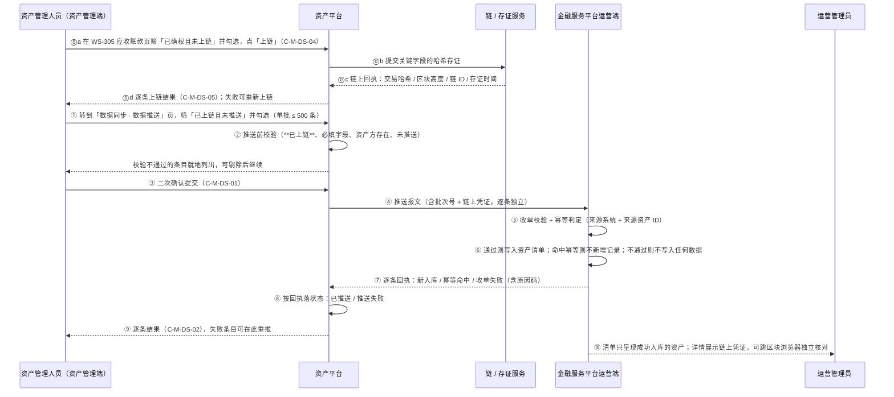
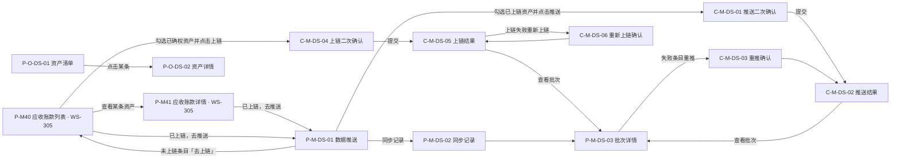

# 可信数据同步 · 产品需求文档（PRD）

> **本 PRD 由 4 个文件组成，编号体系（F / D / E / I / S / AC / DEP / R / Q）跨文件连续唯一。**

| 分册 | 文件 | 包含章节 |
| --- | --- | --- |
| 主文档（本文件） | `v1.0-可信数据同步-PRD.md` | 1 文档信息、2 背景与目标、3 已确定口径与关键决策、4 用户与角色、5 页面结构与流程、6 功能清单 |
| 分册一 | `01-模块详情与状态机.md` | 7 资产管理端上链与推送侧、8 运营端收单与资产清单、9 状态机 |
| 分册二 | `02-数据字段与接口契约.md` | 10 数据与字段、11 接口契约要点、12 非功能需求 |
| 分册三 | `03-依赖风险与验收标准.md` | 13 依赖与风险、14 验收标准、15 待确认清单、16 入库说明 |

---

## 1. 文档信息

| 项 | 内容 |
| --- | --- |
| 文档名称 | 跨境链融 · 可信数据同步产品需求文档 |
| 对应需求 | WS-313「可信数据同步」 |
| 文档版本 | V1.4 |
| 阶段 | Phase 2 · PRD |
| 编写人 | 许楚清（需求分析师） |
| 上游输入 | 《可信数据同步 需求诊断简报 v0.2》（需求诊断师）+ 需求方 2026-09-09 的三轮口径拍板 + **需求方 2026-09-10 的两条业务规则变更：①「推送前必须先上链，只有已上链数据才能推给金融平台」；②「钱包地址改必填，缺失即不允许推送成功，取该企业最初完成企业认证的成员地址」；③「上链动作合进 WS-305 资产管理端应收账款页，底层数据上链不单独开菜单」** + 产品工坊总控的范围裁定 |
| 覆盖端 | **资产平台 · 资产管理端 Web**（上链侧落在 WS-305 应收账款页、推送侧在本模块「数据同步」菜单，含失败可见与人工重试） + **金融服务平台 · 运营端 Web**（收单与资产清单侧，只呈现推送成功的资产，可查看链上凭证）。不涉及资产端（面客）与金融服务端（面客） |
| 平台规范依据 | 资产管理端展示口径引用 WS-302 `asset-platform/prd/v1.0-账户与登录/02-页面字段与双语文案.md` 13.4 / 13.5 与 WS-305 的 CU-01～CU-06；运营端展示与脱敏口径引用 WS-308 `financial-service-platform/prd/v1.0-账户与登录/01-国际化基线.md` 第 4 / 5 / 8 节；页面与组件编号遵循 `docs/notification-contract/接入指南.md` 4.2 |
| 数据来源模块 | WS-305《应收账款录入与确权》——本模块推送的「已确权资产」即该模块状态 S3「已确权」的应收账款 |
| 归属目录 | 资产平台（需求方 2026-09-09 指定）。拟入库路径见第 16 章 |
| 适用读者 | 设计、前端、开发、测试、业务方 |
| 交付边界 | 本文档只描述「做什么」与「验收什么」，不指定数据库、语言、框架与实现方案 |

**标记约定**

- `[假设-待确认 Q-DS-xx]`：需求方或上游尚未给出定义，本文档按写明的默认取值定稿，**开发按默认取值实现**；答复到位后只改取值、不改结构。全部条目在第 15 章汇总。
- 未标记的规则均为需求方已拍板或由已定稿模块继承的口径，实现时不得自行调整。
- **作废编号一律保留为空位、不再复用**（与 WS-305 对 D-17 / D-18 的处置同一手法）：需求方拍板删除的功能项，其编号在原表中以删除线保留一行，正文其他位置不再引用，避免与前一版本的引用产生歧义。
- 本文档是**跨两个平台**的模块，凡规则只适用于一端的，均在句首标明「资产管理端」或「运营端」。

---

## 2. 背景与目标

### 2.1 业务背景

WS-305 已经把「应收账款录入 → 买方在线确权」跑通，资产在资产平台达到「已确权」终态。但确权完成之后，这些数据要进入金融服务平台运营端的资产清单，目前只能靠线下表格、邮件或口头搬运，由此产生三个问题：

1. **慢且无凭证**：运营端拿到数据的时间不可控，也答不出「这条资产是谁、什么时候、从哪推过来的」。
2. **易错**：人工搬运会漏条、错录金额与币种，出问题时无从追溯。
3. **无重复控制**：同一笔资产被搬两次，运营端清单里会出现两条，直接污染条数与金额统计，并在下游被重复处理。
4. **数据可信只靠"我说是真的"**：金融服务平台收到一条资产后，没有任何独立于资产平台的手段去核查这条数据在同步之前有没有被改过。

第 4 条正是 2026-09-10 业务规则变更要解决的问题：**资产在推送之前必须先上链存证，推送报文带上链上凭证，运营端据凭证核查**。上链不是一个内部技术动作，它是本模块"可信"二字的落点——没有它，"可信数据同步"只是"数据同步"。

### 2.2 本期目标

建成「资产管理端推送已确权资产 → 金融服务平台运营端收单入资产清单」这一条可信同步链路：

- 资产管理人员可在资产管理端勾选已确权资产，**先上链存证**，再单条或批量推送到运营端；两个动作共用同一套勾选与二次确认习惯。
- **未上链、或钱包地址缺失 / 格式非法的资产一律不允许推送**：前端置灰或剔除，服务端同样拦截。
- 推送报文携带链上凭证，运营端资产详情可查看凭证并据此核查数据可信性。
- 运营端收单后写入资产清单，来源、确权信息、推送批次全程可追溯。
- **同一资产重复推送不产生第二条清单记录、不重复计数**（幂等，本期红线）。
- **失败的可见性与处置全部收在资产管理端**：上链失败与推送失败都有明确状态与原因，由资产管理人员主动重试即可补齐，不需要开数据库。
- **运营端资产清单只呈现推送成功的资产**，运营人员看到的每一条都是可信、完整、唯一的。

### 2.3 本期不做（范围边界）

| # | 不做项 | 说明 |
| --- | --- | --- |
| 1 | **代币铸造相关全部能力** | 资产方＋资产类型 → 代币合约映射、自动/人工铸造、铸造数量计算、代币发放至钱包地址、铸造失败与链上超时处理、minter 权限与合约部署、铸造类状态、资产方侧代币页面——**全部由后续「代币铸造发放」issue 承接，本文档不写任何相关规则** |
| 2 | 「待铸造 / 待补充」等为下游预留的终态 | 需求方 2026-09-09 明确删除。本期状态只有「已推送 / 推送失败」两态（第 9 章） |
| 3 | 「作废 / 标记不处理 / 驳回 / 退回」等运营端处置动作 | 需求方 2026-09-09 明确不做。已确权即视同审核通过，运营端本期无业务判断职责 |
| 4 | **运营端的重推入口** | 需求方 2026-09-09 明确不做。重推动作只在资产管理端（7.6） |
| 5 | **运营端展示「推送失败」的资产** | 需求方 2026-09-09 明确不做。收单失败的条目不写入运营端清单、不在运营端任何页面出现（8.1） |
| 6 | **两端同步对账视图** | 需求方 2026-09-09 明确不做。两端条数与金额的核对本期不提供系统性手段 |
| 7 | 自动重试、补偿队列、失败告警 | 失败只支持资产管理人员主动再次推送 |
| 8 | 定时 / 事件驱动的自动推送 | 本期只做人工触发（需求原文即「经资产管理端人员同意后推送」） |
| 9 | 推送撤回、已推送资产的删除 | 推送提交后不可撤回 |
| 10 | 资产数据变更后的增量同步 / 更新推送 | 本期只做首次同步 `[假设-待确认 Q-DS-08]` |
| 11 | 贸易背景材料原件的跨平台传输 | 本期推送报文不含附件原件与下载链接，只带材料份数 `[假设-待确认 Q-DS-06]` |
| 12 | 站内信与邮件通知 | 本期不产出任何通知，不申请 `biz_type`；结果通过页面与推送记录呈现 |
| 13 | 资产方（企业客户）侧的同步状态查询 | 资产方本期无操作、无感知 |
| 14 | 资产确权流程本身的改造、二次审核环节 | 确权仍在 WS-305 既有流程完成 |
| 15 | 代币相关的链上交互、合约调用、钱包签名 | 本期的链上动作**只有存证上链**（F-DS-17）。铸币、转账、授权、钱包签名等一概不做；钱包地址仍只作为透传字段存储 |
| 16 | **上链的自动触发** | 本期只做人工触发（勾选后点「上链」），确权完成不自动上链 `[假设-待确认 Q-DS-11]` |
| 17 | **上链失败的自动重试** | 与推送失败同口径：只支持人工主动重新上链，无自动重试、无补偿队列 |
| 18 | **运营端对链上凭证做真伪校验** | 运营端本期**只存储与展示凭证、提供区块浏览器跳转，不调链验证**。链上真伪核查由人工借助区块浏览器完成（8.1、R-DS-10） |
| 19 | **运营端展示「上链中 / 上链失败」** | 上链状态是资产管理端的状态位。运营端只可能看到已上链且推送成功的资产，不因上链新增任何状态标签或筛选项 |
| 20 | **「待补充地址」一类状态与运营端的地址补录入口** | 钱包地址改必填后，缺地址的资产在收单即被拒、不入库，因此**不需要**也**不允许**新增状态或补录界面。存量脏数据走上线前一次性体检（DEP-DS-07），不是运行时兜底 |

> **关于下游衔接**：本期不预留铸造相关的数据字段与状态，避免写入无口径的下游语义。唯一的衔接约束是 **D-DS-31 同步状态必须实现为可扩展枚举**，下游 issue 追加状态时不需要重构清单数据结构。

### 2.4 后续迭代（本期不做但已规划）

自动推送、自动重试与补偿队列、失败告警通知、增量同步与更新推送、推送撤回、资产方侧同步状态查询、材料原件跨平台流转。

**同步链路的收口迭代（需求方 2026-09-09 定案，承接 R-DS-07）**：针对「漏推在运营侧不可发现」，**不做完整的两端对账视图**，改为在资产管理端 P-M-DS-01 增加一个默认视图「已确权且未推送 / 推送失败」并配条数角标，让欠账一眼可见。理由是它不需要跨平台拉数、不需要新接口，成本远低于对账视图，却能堵住「漏推没人知道」这个真实缺口。**排期定在代币铸造 issue 之后**，作为同步链路的收口迭代。真正的两端对账留到平台出现多个数据来源系统时再评估。

### 2.5 成功标准

- 一批已确权资产能在资产管理端完成「上链 → 推送」两步，并在运营端资产清单中按条可见、来源可追溯。
- 运营端看到的每一条资产都带链上凭证与合法的资产方钱包地址：凭证可凭 tx hash 到区块浏览器独立核对，地址可直接作为下游铸币的收币地址，不需要二次补录。
- 任一资产在运营端清单中**有且只有一条**记录，无论被推送多少次。
- 上链失败或推送失败的资产，在资产管理端都能看到失败原因，并能由人工重试后转为成功态，无需研发介入。
- 运营端清单中不出现任何失败、半成品或重复的资产记录。

---

## 3. 已确定口径与关键决策

| # | 口径 | 来源 |
| --- | --- | --- |
| 1 | 本期范围＝「资产管理端推送已确权资产 → 运营端收单进资产清单」，终点是资产在清单可见、状态可查 | 需求方 2026-09-09 |
| 2 | 已确权即视同审核通过，推送前后均不增加审核环节 | 需求方 |
| 3 | **状态只有「已推送 / 推送失败」两态**，无中间态、无其他终态 | 需求方 2026-09-09 |
| 4 | 推送失败**只支持人工主动发起再次推送**，无自动重试、无补偿队列 | 需求方 2026-09-09 |
| 5 | **失败态只归资产管理端**：运营端不提供重推入口、不展示推送失败的资产，清单里只有推送成功的资产 | 需求方 2026-09-09（第三轮） |
| 6 | **本期不做两端对账视图** | 需求方 2026-09-09（第三轮） |
| 7 | 推送报文**包含资产方钱包地址，且为必填**：缺失或格式非法即拒收、不允许推送成功；**取值取该资产方企业下最初完成企业认证的那位成员的地址**；但**不因此产生额外状态**（拦截发生在收单之前，不新增「待补充地址」态） | 需求方 2026-09-10 覆盖 09-09 的「只存不用」口径 |
| 8 | **幂等必做**：同一资产重复推送不得在运营端重复入库、重复计数 | 需求方 + 简报 |
| 9 | 推送为人工触发，支持单条与批量勾选；批量逐条独立处理，部分成功不整体回滚 | 简报场景 A |
| 10 | 本模块归属资产平台目录，入库分支 `cly-V1.0.0` | 需求方 2026-09-09 |
| 11 | **推送前置：链路为「已确权 → 上链 → 推送 → 运营端收单」，未上链的资产一律不允许推送**（前端置灰 + 服务端拦截） | 需求方 2026-09-10 |
| 12 | **上链动作落在 WS-305 资产管理端「应收账款」列表 / 详情页**（P-M40 / P-M41），**不单独开「底层数据上链」菜单、不新建页面编号**；「数据同步」菜单只保留「数据推送」与「同步记录」。上链支持单条与批量，与推送共用勾选与二次确认习惯 | 需求方 2026-09-10（合页裁定，覆盖同日早先的「并入数据同步菜单」口径） |
| 15 | **运营端与资产管理端是两个独立平台、互不互通属正常**：`P-O-DS-01` / `P-O-DS-02` 维持登记在运营端（`fs_ops`）段位，资产平台侧栏看不到运营端页面、反之亦然，**不作为待确认项**，也不调整 registry 归属 | 需求方 2026-09-10 |
| 13 | 上链失败按推送失败的既有口径处理：失败状态 + 原因码 + **人工主动重新上链**，不自动重试；失败资产不允许推送 | 需求方 2026-09-10 |
| 14 | 推送报文新增链上凭证字段，**运营端资产详情须展示凭证供核查**——这是本次变更的业务目的，不是内部状态 | 需求方 2026-09-10 |

### 3.1 决策：与 WS-305「资产管理端全量只读」的冲突，按经裁定的例外处理

WS-305 第 12 章（F-18）已定稿「资产管理端对应收账款**全量只读**，服务端对资产管理端账号的一切写请求直接拒绝」。本模块给资产管理端引入了两个写动作，与这条口径正面冲突，且**需求方 2026-09-10 的合页裁定把其中一个直接放到了 WS-305 的页面上**。处置如下：

| 写动作 | 落点 | 权限点 | 与 F-18 的关系 |
| --- | --- | --- | --- |
| **上链存证**（F-DS-17～F-DS-20） | **WS-305 应收账款列表 / 详情页（P-M40 / P-M41）** | `data_sync.chain` | **经需求方裁定的例外**：在 305 已定稿的只读页面上新增写动作 |
| **推送 / 重推**（F-DS-03～F-DS-08） | 本模块「数据同步」菜单（P-M-DS-01～03） | `data_sync.push` | 独立页面，不触碰 305 的页面 |

例外的边界写死为三条，**实现与安全评审都以此为准**：

1. **只开这两个权限点**，不因此放宽 F-18 的整体表述。除 `data_sync.chain` / `data_sync.push` 覆盖的动作外，资产管理端对应收账款的任何写请求（新增、编辑、删除、改业务状态）服务端仍一律拒绝。
2. **可审计**：两个权限点覆盖的每一次操作都留痕（操作人、时间、对象、结果，F-DS-15）。
3. **可单独回收**：回收 `data_sync.chain` 即回到「305 页面纯只读」，不影响推送；回收 `data_sync.push` 同理。两个权限点不得合并成一个「数据同步」大权限。

> **为什么早先的写法要改**：V1.3.1 及之前写的是「新建独立入口、不改 305 只读语义」，那是在上链也走独立菜单的前提下成立的。合页裁定之后，上链的按钮就在 305 的页面上，再说「不改 305 只读语义」就是自欺——所以这里改成明写例外与边界，而不是继续声称没有例外。WS-305 文档侧需补一句对应说明，见 DEP-DS-03。

### 3.2 决策：页面与组件编号采用模块字母子段

本模块取 `DS`（Data Sync）作模块字母，资产管理端用 `P-M-DS-xx` / `C-M-DS-xx`，运营端用 `P-O-DS-xx` / `C-O-DS-xx`。不取十位数字段的原因是：`docs/notification-contract/接入指南.md` 4.2 的登记表里资产管理端只登记到 `P-M33`，但 WS-305 的原型注册表已实际使用 `P-M40` / `P-M41`（`#/admin/receivables`），**登记表已落后于仓库现状**。再取数字段有撞号风险，而模块字母子段与 `P-K` / `C-M` / `P-O-AG` 同一手法，天然不撞。

> 入库时须同批补登两件事（DEP-DS-04）：4.2 登记表新增 `DS` 模块字母行与本模块段位；同时把 WS-305 已在用的 `P-M40` / `P-M41` 补进「已分配 · 资产管理端页面」一行。

---

## 4. 用户与角色

### 4.1 角色

| 角色 | 所在端 | 说明 | 本期诉求 |
| --- | --- | --- | --- |
| 资产管理人员 | 资产平台 · 资产管理端 Web | 平台侧运营 / 风控人员，业务背景、非技术人员。账号模型与登录沿用 WS-302 7.7，**本期管理端不做角色区分**（WS-303 DK-38）。**不装钱包、不接触私钥**——上链由平台侧服务代为发起，人员只按业务按钮 | 把已确权资产先存证上链、再准确可追溯地送到金融服务平台；**上链或推送失败时自己看得到、自己能重试** |
| 运营管理员 | 金融服务平台 · 运营端 Web | 运营端本期唯一角色（WS-308 定稿），工作邮箱 + 密码登录，**不装钱包、无链上操作能力**，账号与资产管理端完全不互通；技术背景不确定，未必读得懂链上术语 | 清单里的资产完整、可追溯、不重复，**且能凭链上凭证独立核查数据没被改过**；不承担同步失败的处置职责 |
| 资产方（企业客户） | — | 资产的实际持有方，即 WS-305 中该笔应收账款的**债权方（卖方）主体** | 本期无操作、无感知 |

### 4.2 权限矩阵

| 能力 | 资产管理人员 | 运营管理员 |
| --- | --- | --- |
| 查看「数据推送」页与「同步记录」（含上链与推送状态） | ✅ `data_sync.view` | ❌ |
| 发起上链 / 重新上链（在 WS-305 应收账款列表 / 详情页） | ✅ `data_sync.chain` | ❌ |
| 发起推送 / 再次推送 | ✅ `data_sync.push` | ❌ **本期运营端无任何推送与重推能力** |
| 查看上链与推送记录、批次结果（含失败原因） | ✅ `data_sync.view` | ❌ |
| 查看运营端资产清单与详情（含链上凭证） | ❌ | ✅ `asset_inventory.view` |
| 修改、删除清单中的资产 | ❌ | ❌ 本期运营端无任何写能力 |

> 所有禁止项均须服务端强制，前端路由守卫与按钮置灰不得作为唯一防线。两端账号不互通，跨端调用走服务间鉴权（第 12 章）。**运营端本期只有一个权限点 `asset_inventory.view`，不登记任何写权限点。**

### 4.3 用户故事

| # | 用户故事 | 对应功能 |
| --- | --- | --- |
| US-01 | 作为资产管理人员，我想在「数据推送」页筛出「已上链且未推送」的资产并批量勾选推送，这样我不用再逐条整理表格发邮件 | F-DS-01～F-DS-05 |
| US-02 | 作为资产管理人员，我想在推送后逐条看到成功与失败原因，这样我知道哪几条要处理 | F-DS-06 |
| US-03 | 作为资产管理人员，我想对失败的条目直接重推，这样不用找研发 | F-DS-07 |
| US-04 | 作为资产管理人员，我想查到某条资产是哪个批次、谁、什么时候推的，这样出问题时能追溯 | F-DS-08 |
| US-05 | 作为运营管理员，我想在资产清单里看到新到达的资产及其确权信息与来源，这样我知道平台现在有哪些合格资产 | F-DS-10、F-DS-12 |
| US-06 | 作为运营管理员，我想确认同一笔资产不会在清单里出现两条，这样统计结果可信 | F-DS-09 |
| ~~US-07~~ | ~~运营端对失败条目发起重推~~ | **已随需求方 2026-09-09 第三轮拍板删除，编号保留为空位不再复用** |
| ~~US-08~~ | ~~两端按币种核对条数与金额~~ | **已随对账视图删除，编号保留为空位不再复用** |
| US-09 | 作为资产管理人员，我想**就在看资产的那张应收账款页上**把已确权资产批量上链存证，不用先跳到另一个菜单，这样送出去的数据是可被独立核验的 | F-DS-17～F-DS-19 |
| US-10 | 作为资产管理人员，我想在应收账款列表与数据推送页都能一眼看出哪些资产还没上链、哪些上链失败，这样我知道下一步该点哪个按钮 | F-DS-20 |
| US-11 | 作为运营管理员，我想在资产详情里看到这条资产的链上凭证并能跳去区块浏览器核对，这样我不必只靠资产平台的一面之词 | F-DS-22 |

---

## 5. 页面结构与流程

### 5.1 页面与组件清单（线框级信息架构）

**资产管理端 · 上链侧**（落在 WS-305 已有页面，**本模块不新建页面编号**）

| 编号 | 页面 / 组件 | 归属 | 本模块在其上新增的内容 |
| --- | --- | --- | --- |
| P-M40（WS-305 既有） | 应收账款列表 | WS-305 | 勾选列（仅「已确权」行可勾）、**上链状态列与筛选**、常驻选择条与「上链 / 重新上链」按钮、已上链行的交易哈希缩略、上链失败行内原因码与文案 |
| P-M41（WS-305 既有） | 应收账款详情 | WS-305 | 上链状态标签、**链上凭证区**（五项凭证 + 区块浏览器入口）、「上链 / 重新上链」操作、已上链后指向「数据推送」的入口 |
| C-M-DS-04 | 上链二次确认弹层 | **挂在 P-M40** | 展示待上链条数、按币种分组的金额、校验未通过条目摘要 |
| C-M-DS-05 | 上链结果面板 | **挂在 P-M40** | 逐条上链结果与凭证摘要，可跳批次详情 |
| C-M-DS-06 | 重新上链确认弹层 | **挂在 P-M40 / P-M41** | 展示将被重新上链的条目与存证幂等提示 |

> **本模块只往 P-M40 / P-M41 上加东西，不改 WS-305 既有的列、筛选、流程与文案**；这两个页面编号仍归 WS-305，本模块不申请新页面编号。资产端（面客）的应收账款页面不涉及。
> 在这两个页面上**不得引入推送入口与运营端能力**——推送始终在「数据同步」菜单里。

**资产管理端 · 推送侧**（路由前缀 `/admin`，一级菜单新增「数据同步」，**只有「数据推送」与「同步记录」两项，没有「底层数据上链」**）

| 编号 | 页面 / 组件 | 路由 | 形态 | 内容要点 |
| --- | --- | --- | --- | --- |
| P-M-DS-01 | 数据推送 | `/admin/data-sync/assets` | 整页 | 资产列表、筛选区、批量勾选、按币种分组汇总、**只有「推送 / 重推」一个动作**；同时展示上链状态与同步状态两列（上链状态在此**只读**，用于推送前置判断与跳转，不提供上链动作） |
| P-M-DS-02 | 同步记录 | `/admin/data-sync/batches` | 整页 | 按批次列出**上链与推送两类批次**：批次类型、批次号、操作人、时间、总条数、成功 / 失败条数；支持按批次类型筛选 |
| P-M-DS-03 | 批次详情 | `/admin/data-sync/batches/{batch_no}` | 整页，支持深链 | 该批次逐条结果：资产编号、结果类型、失败原因、重试入口；上链批次额外展示每条的链上凭证 |
| C-M-DS-01 | 推送二次确认弹层 | — | 弹层 | 展示待推条数、按币种分组的金额、校验未通过的条目摘要，确认后提交 |
| C-M-DS-02 | 推送结果面板 | — | 弹层 / 抽屉 | 提交后展示逐条结果，可直接跳批次详情 |
| C-M-DS-03 | 重推确认弹层 | — | 弹层 | 展示将被重推的条目与幂等提示 |

**运营端**（路由前缀 `/ops`，一级菜单新增「资产清单」）

| 编号 | 页面 / 组件 | 路由 | 形态 | 内容要点 |
| --- | --- | --- | --- | --- |
| P-O-DS-01 | 资产清单 | `/ops/asset-inventory` | 整页 | 已成功入库的资产列表、筛选区、按币种分组汇总 |
| P-O-DS-02 | 资产详情 | `/ops/asset-inventory/{source_asset_id}` | 整页，支持深链 | 资产全量字段、确权信息快照、**链上凭证区（含区块浏览器跳转）**、同步链路时间线 |
| ~~P-O-DS-03~~ | ~~同步对账~~ | — | — | **已随对账视图删除，编号保留为空位不再复用** |
| ~~C-O-DS-01~~ | ~~重推请求确认弹层~~ | — | — | **已随运营端重推入口删除，编号保留为空位不再复用** |

> 未登录访问上述路由：资产管理端按 WS-302 口径落管理端登录页；运营端按 WS-308 口径跳 `/ops/login?redirect=<URL 编码后的原路径>`，登录成功后回跳。
> **两端互不可见是正常形态**（需求方 2026-09-10，口径 15）：运营端与资产管理端分属两个平台、账号不互通，资产平台的侧栏看不到 `P-O-DS-01` / `P-O-DS-02`，运营端侧栏也看不到资产管理端页面。这两个页面编号维持登记在 `fs_ops` 段位，**不再作为待确认项**，也不调整 registry 归属。

### 5.2 主流程

### 5.3 页面流

---

## 6. 功能清单

| 编号 | 所属端 | 功能 | 描述 | 优先级 | 验收 |
| --- | --- | --- | --- | --- | --- |
| F-DS-01 | 资产管理端 | 数据推送列表（P-M-DS-01） | 默认展示「已上链且未推送」的资产，**同时展示上链状态与同步状态两列**（上链状态在此只读），支持按上链状态、同步状态、币种、资产方、确权时间区间、关键词筛选 | P0 | AC-DS-01～04、AC-DS-61 |
| F-DS-02 | 资产管理端 | 按币种分组汇总 | 列表顶部按币种分组给出「笔数 + 该币种合计」，不得跨币种求和 | P0 | AC-DS-05～06 |
| F-DS-03 | 资产管理端 | 单条与批量勾选 | 上链（在 P-M40）与推送（在 P-M-DS-01）均支持单条与多选，单批上限各 500 条 `[假设-待确认 Q-DS-03]`，超限时阻止提交并提示 | P0 | AC-DS-07～09 |
| F-DS-04 | 资产管理端 | 推送前校验 | 提交前校验**该资产已上链**、必填字段完整、资产方主体存在、未处于「已推送」 | P0 | AC-DS-10～13、AC-DS-66～68 |
| F-DS-05 | 资产管理端 | 二次确认与提交 | C-M-DS-01 展示条数与分币种金额，确认后提交；提交过程为一次性阻塞操作，不落中间状态 | P0 | AC-DS-14～16 |
| F-DS-06 | 资产管理端 | 逐条结果反馈 | 批量按逐条独立处理，部分成功不整体回滚；结果区分「新入库 / 幂等命中 / 失败 + 原因」 | P0 | AC-DS-17～19 |
| F-DS-07 | 资产管理端 | 主动再次推送 | 对「推送失败」条目单条或批量重推，走同一套校验与幂等，无自动重试；**这是本期唯一的重推入口** | P0 | AC-DS-20～23 |
| F-DS-08 | 资产管理端 | 推送记录与批次追溯 | 按批次留存推送时间、操作人、条数与逐条结果，可深链查看 | P0 | AC-DS-24～26 |
| F-DS-09 | 两端 | 幂等控制 | 以「来源系统标识 + 来源资产 ID」为幂等键，运营端加唯一约束；重复推送不新增记录、不重复计数 | **P0 红线** | AC-DS-27～31 |
| F-DS-10 | 运营端 | 收单校验与入库 | 校验报文完整性与来源可信性，通过则写入资产清单并置「已推送」；**不通过则不写入任何数据、不在运营端留痕，仅回执给资产管理端** | P0 | AC-DS-32～36 |
| F-DS-11 | 运营端 | 逐条回执 | 对每条资产返回处理结果与原因码，供资产管理端落状态与失败处置 | P0 | AC-DS-37～38 |
| F-DS-12 | 运营端 | 资产清单与详情 | 列表展示资产基本信息、资产方、资产类型、金额与币种、确权信息、来源与收单时间；详情展示全量字段与同步链路时间线 | P0 | AC-DS-39～43 |
| ~~F-DS-13~~ | ~~运营端~~ | ~~失败条目可见与重推请求~~ | **已随需求方 2026-09-09 第三轮拍板删除，编号保留为空位不再复用** | — | — |
| ~~F-DS-14~~ | ~~两端~~ | ~~同步对账视图~~ | **已随需求方 2026-09-09 第三轮拍板删除，编号保留为空位不再复用** | — | — |
| F-DS-15 | 两端 | 操作日志与审计留痕 | 推送、重推、收单逐次留痕，含操作人、时间、对象、结果 | P0 | AC-DS-50～51 |
| F-DS-16 | 两端 | 权限点 | 资产管理端 `data_sync.view` / `data_sync.chain`（挂 305 页面）/ `data_sync.push`，三者不得合并；运营端 `asset_inventory.view`（**运营端无写权限点**） | P0 | AC-DS-52～53、AC-DS-72 |
| **F-DS-17** | 资产管理端 | **资产上链存证（在 WS-305 应收账款页）** | 在 P-M40 / P-M41 上对「已确权且未上链」资产单条或批量发起上链：把关键字段的哈希存证写上链 `[假设-待确认 Q-DS-13]`，回执含交易哈希、区块高度、链 ID、存证时间。人工触发，不自动上链 `[假设-待确认 Q-DS-11]` | **P0** | AC-DS-62～64、AC-DS-70 |
| **F-DS-18** | 资产管理端 | **上链前校验** | 提交前校验资产状态为「已确权」、参与存证的字段完整、该资产未处于「已上链」 | P0 | AC-DS-65 |
| **F-DS-19** | 资产管理端 | **上链结果与人工重新上链** | 逐条返回成功 / 失败及原因码；失败条目可单条或批量重新上链，无自动重试；**上链失败的资产不允许推送** | P0 | AC-DS-69 |
| **F-DS-20** | 资产管理端 | **上链状态与凭证展示** | P-M40 与 P-M-DS-01 两张列表都展示上链状态列与筛选项，P-M41 详情与批次详情展示链上凭证（哈希按平台基线缩略，可复制、可跳区块浏览器） | P0 | AC-DS-61、AC-DS-71 |
| **F-DS-21** | 两端 | **推送前置拦截** | 未上链或上链失败的资产：前端勾选框禁用 / 推送按钮不可用，**服务端同样拒绝**，前端不得作为唯一防线 | **P0 红线** | AC-DS-66～68、AC-DS-76 |
| **F-DS-22** | 运营端 | **链上凭证展示与核查入口** | 资产详情展示链上凭证并提供区块浏览器跳转，供运营管理员独立核对；**本期不调链验证真伪** | P0 | AC-DS-71、AC-DS-74 |
