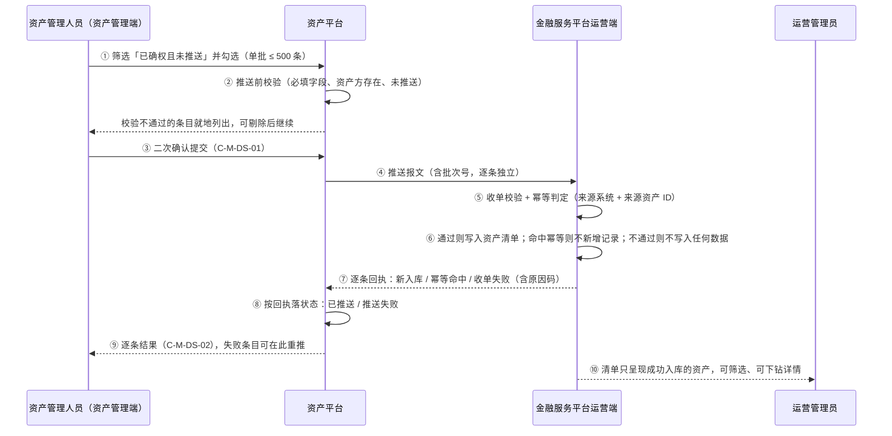
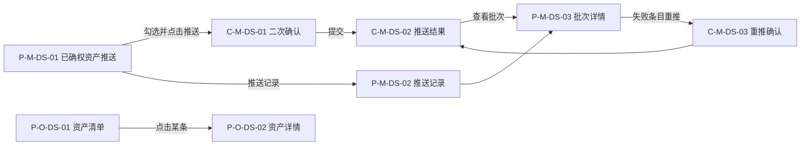

# 可信数据同步 · 产品需求文档（PRD）

> **本 PRD 由 4 个文件组成，编号体系（F / D / E / I / S / AC / DEP / R / Q）跨文件连续唯一。**

| 分册 | 文件 | 包含章节 |
| --- | --- | --- |
| 主文档（本文件） | `v1.0-可信数据同步-PRD.md` | 1 文档信息、2 背景与目标、3 已确定口径与关键决策、4 用户与角色、5 页面结构与流程、6 功能清单 |
| 分册一 | `01-模块详情与状态机.md` | 7 资产管理端推送侧、8 运营端收单与资产清单、9 状态机 |
| 分册二 | `02-数据字段与接口契约.md` | 10 数据与字段、11 接口契约要点、12 非功能需求 |
| 分册三 | `03-依赖风险与验收标准.md` | 13 依赖与风险、14 验收标准、15 待确认清单、16 入库说明 |

---

## 1. 文档信息

| 项 | 内容 |
| --- | --- |
| 文档名称 | 跨境链融 · 可信数据同步产品需求文档 |
| 对应需求 | WS-313「可信数据同步」 |
| 文档版本 | V1.1 |
| 阶段 | Phase 2 · PRD |
| 编写人 | 许楚清（需求分析师） |
| 上游输入 | 《可信数据同步 需求诊断简报 v0.2》（需求诊断师）+ 需求方 2026-09-09 的三轮口径拍板 + 产品工坊总控的范围裁定 |
| 覆盖端 | **资产平台 · 资产管理端 Web**（推送侧，含失败可见与人工重推） + **金融服务平台 · 运营端 Web**（收单与资产清单侧，只呈现推送成功的资产）。不涉及资产端（面客）与金融服务端（面客） |
| 平台规范依据 | 资产管理端展示口径引用 WS-302 `asset-platform/prd/v1.0-账户与登录/02-页面字段与双语文案.md` 13.4 / 13.5 与 WS-305 的 CU-01～CU-06；运营端展示与脱敏口径引用 WS-308 `financial-service-platform/prd/v1.0-账户与登录/01-国际化基线.md` 第 4 / 5 / 8 节；页面与组件编号遵循 `docs/notification-contract/接入指南.md` 4.2 |
| 数据来源模块 | WS-305《应收账款录入与确权》——本模块推送的「已确权资产」即该模块状态 S3「已确权」的应收账款 |
| 归属目录 | 资产平台（需求方 2026-09-09 指定）。拟入库路径见第 16 章 |
| 适用读者 | 设计、前端、开发、测试、业务方 |
| 交付边界 | 本文档只描述「做什么」与「验收什么」，不指定数据库、语言、框架与实现方案 |

**标记约定**

- `[假设-待确认 Q-DS-xx]`：需求方或上游尚未给出定义，本文档按写明的默认取值定稿，**开发按默认取值实现**；答复到位后只改取值、不改结构。全部条目在第 15 章汇总。
- 未标记的规则均为需求方已拍板或由已定稿模块继承的口径，实现时不得自行调整。
- **作废编号一律保留为空位、不再复用**（与 WS-305 对 D-17 / D-18 的处置同一手法）：需求方拍板删除的功能项，其编号在原表中以删除线保留一行，正文其他位置不再引用，避免与前一版本的引用产生歧义。
- 本文档是**跨两个平台**的模块，凡规则只适用于一端的，均在句首标明「资产管理端」或「运营端」。

---

## 2. 背景与目标

### 2.1 业务背景

WS-305 已经把「应收账款录入 → 买方在线确权」跑通，资产在资产平台达到「已确权」终态。但确权完成之后，这些数据要进入金融服务平台运营端的资产清单，目前只能靠线下表格、邮件或口头搬运，由此产生三个问题：

1. **慢且无凭证**：运营端拿到数据的时间不可控，也答不出「这条资产是谁、什么时候、从哪推过来的」。
2. **易错**：人工搬运会漏条、错录金额与币种，出问题时无从追溯。
3. **无重复控制**：同一笔资产被搬两次，运营端清单里会出现两条，直接污染条数与金额统计，并在下游被重复处理。

### 2.2 本期目标

建成「资产管理端推送已确权资产 → 金融服务平台运营端收单入资产清单」这一条可信同步链路：

- 资产管理人员可在资产管理端勾选已确权资产，单条或批量推送到运营端，推送前有校验、推送后有逐条结果。
- 运营端收单后写入资产清单，来源、确权信息、推送批次全程可追溯。
- **同一资产重复推送不产生第二条清单记录、不重复计数**（幂等，本期红线）。
- **失败的可见性与处置全部收在资产管理端**：推送失败有明确状态与原因，由资产管理人员主动发起再次推送即可补齐，不需要开数据库。
- **运营端资产清单只呈现推送成功的资产**，运营人员看到的每一条都是可信、完整、唯一的。

### 2.3 本期不做（范围边界）

| # | 不做项 | 说明 |
| --- | --- | --- |
| 1 | **代币铸造相关全部能力** | 资产方＋资产类型 → 代币合约映射、自动/人工铸造、铸造数量计算、代币发放至钱包地址、铸造失败与链上超时处理、minter 权限与合约部署、铸造类状态、资产方侧代币页面——**全部由后续「代币铸造发放」issue 承接，本文档不写任何相关规则** |
| 2 | 「待铸造 / 待补充」等为下游预留的终态 | 需求方 2026-09-09 明确删除。本期状态只有「已推送 / 推送失败」两态（第 9 章） |
| 3 | 「作废 / 标记不处理 / 驳回 / 退回」等运营端处置动作 | 需求方 2026-09-09 明确不做。已确权即视同审核通过，运营端本期无业务判断职责 |
| 4 | **运营端的重推入口** | 需求方 2026-09-09 明确不做。重推动作只在资产管理端（7.6） |
| 5 | **运营端展示「推送失败」的资产** | 需求方 2026-09-09 明确不做。收单失败的条目不写入运营端清单、不在运营端任何页面出现（8.1） |
| 6 | **两端同步对账视图** | 需求方 2026-09-09 明确不做。两端条数与金额的核对本期不提供系统性手段 |
| 7 | 自动重试、补偿队列、失败告警 | 失败只支持资产管理人员主动再次推送 |
| 8 | 定时 / 事件驱动的自动推送 | 本期只做人工触发（需求原文即「经资产管理端人员同意后推送」） |
| 9 | 推送撤回、已推送资产的删除 | 推送提交后不可撤回 |
| 10 | 资产数据变更后的增量同步 / 更新推送 | 本期只做首次同步 `[假设-待确认 Q-DS-08]` |
| 11 | 贸易背景材料原件的跨平台传输 | 本期推送报文不含附件原件与下载链接，只带材料份数 `[假设-待确认 Q-DS-06]` |
| 12 | 站内信与邮件通知 | 本期不产出任何通知，不申请 `biz_type`；结果通过页面与推送记录呈现 |
| 13 | 资产方（企业客户）侧的同步状态查询 | 资产方本期无操作、无感知 |
| 14 | 资产确权流程本身的改造、二次审核环节 | 确权仍在 WS-305 既有流程完成 |
| 15 | 任何链上交互、合约调用、钱包签名 | 钱包地址只作为透传字段存储 |

> **关于下游衔接**：本期不预留铸造相关的数据字段与状态，避免写入无口径的下游语义。唯一的衔接约束是 **D-DS-31 同步状态必须实现为可扩展枚举**，下游 issue 追加状态时不需要重构清单数据结构。

### 2.4 后续迭代（本期不做但已规划）

自动推送、自动重试与补偿队列、失败告警通知、增量同步与更新推送、推送撤回、资产方侧同步状态查询、材料原件跨平台流转。

**同步链路的收口迭代（需求方 2026-09-09 定案，承接 R-DS-07）**：针对「漏推在运营侧不可发现」，**不做完整的两端对账视图**，改为在资产管理端 P-M-DS-01 增加一个默认视图「已确权且未推送 / 推送失败」并配条数角标，让欠账一眼可见。理由是它不需要跨平台拉数、不需要新接口，成本远低于对账视图，却能堵住「漏推没人知道」这个真实缺口。**排期定在代币铸造 issue 之后**，作为同步链路的收口迭代。真正的两端对账留到平台出现多个数据来源系统时再评估。

### 2.5 成功标准

- 一批已确权资产能在资产管理端一次操作内完成推送，并在运营端资产清单中按条可见、来源可追溯。
- 任一资产在运营端清单中**有且只有一条**记录，无论被推送多少次。
- 推送失败的资产在资产管理端能看到失败原因，并能由人工再次推送后转为「已推送」，无需研发介入。
- 运营端清单中不出现任何失败、半成品或重复的资产记录。

---

## 3. 已确定口径与关键决策

| # | 口径 | 来源 |
| --- | --- | --- |
| 1 | 本期范围＝「资产管理端推送已确权资产 → 运营端收单进资产清单」，终点是资产在清单可见、状态可查 | 需求方 2026-09-09 |
| 2 | 已确权即视同审核通过，推送前后均不增加审核环节 | 需求方 |
| 3 | **状态只有「已推送 / 推送失败」两态**，无中间态、无其他终态 | 需求方 2026-09-09 |
| 4 | 推送失败**只支持人工主动发起再次推送**，无自动重试、无补偿队列 | 需求方 2026-09-09 |
| 5 | **失败态只归资产管理端**：运营端不提供重推入口、不展示推送失败的资产，清单里只有推送成功的资产 | 需求方 2026-09-09（第三轮） |
| 6 | **本期不做两端对账视图** | 需求方 2026-09-09（第三轮） |
| 7 | 推送报文**包含资产方钱包地址**，本期只存不用：不校验业务有效性、缺失不阻断推送、不因此产生额外状态 | 需求方 2026-09-09 |
| 8 | **幂等必做**：同一资产重复推送不得在运营端重复入库、重复计数 | 需求方 + 简报 |
| 9 | 推送为人工触发，支持单条与批量勾选；批量逐条独立处理，部分成功不整体回滚 | 简报场景 A |
| 10 | 本模块归属资产平台目录，入库分支 `cly-V1.0.0` | 需求方 2026-09-09 |

### 3.1 决策：新建独立入口，不改 WS-305 管理端的只读语义

WS-305 第 12 章（F-18）已定稿「资产管理端对应收账款**全量只读**，服务端对资产管理端账号的一切写请求直接拒绝」。推送是资产管理端的第一个写操作，两者存在正面冲突。本期的处置是：

- **新建独立菜单「数据同步」**（P-M-DS-01～03），推送能力全部落在新页面与新权限点 `data_sync.push` 上；
- **不改动** WS-305 的 P-M40 / P-M41 应收账款列表与详情，其只读语义与「拒绝一切写请求」的表述保持原样，仅在 WS-305 文档中补一句「`data_sync.push` 为例外」的说明（DEP-DS-03，由 WS-305 的维护方执行，不在本次改动内）。

理由：把写能力挤进一个已定稿的只读页面，会让「管理端只读」这条平台级安全口径变成一句需要逐处例外的模糊话；而独立入口 + 独立权限点，例外只有一个、可审计、可单独回收。

### 3.2 决策：页面与组件编号采用模块字母子段

本模块取 `DS`（Data Sync）作模块字母，资产管理端用 `P-M-DS-xx` / `C-M-DS-xx`，运营端用 `P-O-DS-xx` / `C-O-DS-xx`。不取十位数字段的原因是：`docs/notification-contract/接入指南.md` 4.2 的登记表里资产管理端只登记到 `P-M33`，但 WS-305 的原型注册表已实际使用 `P-M40` / `P-M41`（`#/admin/receivables`），**登记表已落后于仓库现状**。再取数字段有撞号风险，而模块字母子段与 `P-K` / `C-M` / `P-O-AG` 同一手法，天然不撞。

> 入库时须同批补登两件事（DEP-DS-04）：4.2 登记表新增 `DS` 模块字母行与本模块段位；同时把 WS-305 已在用的 `P-M40` / `P-M41` 补进「已分配 · 资产管理端页面」一行。

---

## 4. 用户与角色

### 4.1 角色

| 角色 | 所在端 | 说明 | 本期诉求 |
| --- | --- | --- | --- |
| 资产管理人员 | 资产平台 · 资产管理端 Web | 平台侧运营 / 风控人员，业务背景、非技术人员。账号模型与登录沿用 WS-302 7.7，**本期管理端不做角色区分**（WS-303 DK-38） | 把已确权资产准确、可追溯地送到金融服务平台；**失败时自己看得到、自己能重推** |
| 运营管理员 | 金融服务平台 · 运营端 Web | 运营端本期唯一角色（WS-308 定稿），工作邮箱 + 密码登录，**不装钱包、无链上操作能力**，账号与资产管理端完全不互通 | 清单里的资产完整、可追溯、不重复；**不承担同步失败的处置职责** |
| 资产方（企业客户） | — | 资产的实际持有方，即 WS-305 中该笔应收账款的**债权方（卖方）主体** | 本期无操作、无感知 |

### 4.2 权限矩阵

| 能力 | 资产管理人员 | 运营管理员 |
| --- | --- | --- |
| 查看待推送的已确权资产列表 | ✅ `data_sync.view` | ❌ |
| 发起推送 / 再次推送 | ✅ `data_sync.push` | ❌ **本期运营端无任何推送与重推能力** |
| 查看推送记录与批次结果（含失败原因） | ✅ `data_sync.view` | ❌ |
| 查看运营端资产清单与详情 | ❌ | ✅ `asset_inventory.view` |
| 修改、删除清单中的资产 | ❌ | ❌ 本期运营端无任何写能力 |

> 所有禁止项均须服务端强制，前端路由守卫与按钮置灰不得作为唯一防线。两端账号不互通，跨端调用走服务间鉴权（第 12 章）。**运营端本期只有一个权限点 `asset_inventory.view`，不登记任何写权限点。**

### 4.3 用户故事

| # | 用户故事 | 对应功能 |
| --- | --- | --- |
| US-01 | 作为资产管理人员，我想筛出「已确权且未推送」的资产并批量勾选推送，这样我不用再逐条整理表格发邮件 | F-DS-01～F-DS-05 |
| US-02 | 作为资产管理人员，我想在推送后逐条看到成功与失败原因，这样我知道哪几条要处理 | F-DS-06 |
| US-03 | 作为资产管理人员，我想对失败的条目直接重推，这样不用找研发 | F-DS-07 |
| US-04 | 作为资产管理人员，我想查到某条资产是哪个批次、谁、什么时候推的，这样出问题时能追溯 | F-DS-08 |
| US-05 | 作为运营管理员，我想在资产清单里看到新到达的资产及其确权信息与来源，这样我知道平台现在有哪些合格资产 | F-DS-10、F-DS-12 |
| US-06 | 作为运营管理员，我想确认同一笔资产不会在清单里出现两条，这样统计结果可信 | F-DS-09 |
| ~~US-07~~ | ~~运营端对失败条目发起重推~~ | **已随需求方 2026-09-09 第三轮拍板删除，编号保留为空位不再复用** |
| ~~US-08~~ | ~~两端按币种核对条数与金额~~ | **已随对账视图删除，编号保留为空位不再复用** |

---

## 5. 页面结构与流程

### 5.1 页面与组件清单（线框级信息架构）

**资产管理端**（路由前缀 `/admin`，一级菜单新增「数据同步」）

| 编号 | 页面 / 组件 | 路由 | 形态 | 内容要点 |
| --- | --- | --- | --- | --- |
| P-M-DS-01 | 已确权资产推送 | `/admin/data-sync/assets` | 整页 | 待推送与已处理资产列表、筛选区、批量勾选、按币种分组汇总、推送按钮 |
| P-M-DS-02 | 推送记录 | `/admin/data-sync/batches` | 整页 | 按批次列出推送历史：批次号、操作人、推送时间、总条数、成功 / 失败条数 |
| P-M-DS-03 | 推送批次详情 | `/admin/data-sync/batches/{batch_no}` | 整页，支持深链 | 该批次逐条结果：资产编号、同步状态、失败原因、重推入口 |
| C-M-DS-01 | 推送二次确认弹层 | — | 弹层 | 展示待推条数、按币种分组的金额、校验未通过的条目摘要，确认后提交 |
| C-M-DS-02 | 推送结果面板 | — | 弹层 / 抽屉 | 提交后展示逐条结果，可直接跳批次详情 |
| C-M-DS-03 | 重推确认弹层 | — | 弹层 | 展示将被重推的条目与幂等提示 |

**运营端**（路由前缀 `/ops`，一级菜单新增「资产清单」）

| 编号 | 页面 / 组件 | 路由 | 形态 | 内容要点 |
| --- | --- | --- | --- | --- |
| P-O-DS-01 | 资产清单 | `/ops/asset-inventory` | 整页 | 已成功入库的资产列表、筛选区、按币种分组汇总 |
| P-O-DS-02 | 资产详情 | `/ops/asset-inventory/{source_asset_id}` | 整页，支持深链 | 资产全量字段、确权信息快照、同步链路时间线 |
| ~~P-O-DS-03~~ | ~~同步对账~~ | — | — | **已随对账视图删除，编号保留为空位不再复用** |
| ~~C-O-DS-01~~ | ~~重推请求确认弹层~~ | — | — | **已随运营端重推入口删除，编号保留为空位不再复用** |

> 未登录访问上述路由：资产管理端按 WS-302 口径落管理端登录页；运营端按 WS-308 口径跳 `/ops/login?redirect=<URL 编码后的原路径>`，登录成功后回跳。

### 5.2 主流程

### 5.3 页面流

---

## 6. 功能清单

| 编号 | 所属端 | 功能 | 描述 | 优先级 | 验收 |
| --- | --- | --- | --- | --- | --- |
| F-DS-01 | 资产管理端 | 待推送资产列表 | 展示全部已确权资产，默认筛选「已确权且未推送」，支持按同步状态、币种、资产方、确权时间区间、关键词筛选 | P0 | AC-DS-01～04 |
| F-DS-02 | 资产管理端 | 按币种分组汇总 | 列表顶部按币种分组给出「笔数 + 该币种合计」，不得跨币种求和 | P0 | AC-DS-05～06 |
| F-DS-03 | 资产管理端 | 单条与批量勾选 | 支持单条推送与多选推送，单批上限 500 条 `[假设-待确认 Q-DS-03]`，超限时阻止提交并提示 | P0 | AC-DS-07～09 |
| F-DS-04 | 资产管理端 | 推送前校验 | 提交前校验必填字段完整、资产方主体存在、该资产未处于「已推送」 | P0 | AC-DS-10～13 |
| F-DS-05 | 资产管理端 | 二次确认与提交 | C-M-DS-01 展示条数与分币种金额，确认后提交；提交过程为一次性阻塞操作，不落中间状态 | P0 | AC-DS-14～16 |
| F-DS-06 | 资产管理端 | 逐条结果反馈 | 批量按逐条独立处理，部分成功不整体回滚；结果区分「新入库 / 幂等命中 / 失败 + 原因」 | P0 | AC-DS-17～19 |
| F-DS-07 | 资产管理端 | 主动再次推送 | 对「推送失败」条目单条或批量重推，走同一套校验与幂等，无自动重试；**这是本期唯一的重推入口** | P0 | AC-DS-20～23 |
| F-DS-08 | 资产管理端 | 推送记录与批次追溯 | 按批次留存推送时间、操作人、条数与逐条结果，可深链查看 | P0 | AC-DS-24～26 |
| F-DS-09 | 两端 | 幂等控制 | 以「来源系统标识 + 来源资产 ID」为幂等键，运营端加唯一约束；重复推送不新增记录、不重复计数 | **P0 红线** | AC-DS-27～31 |
| F-DS-10 | 运营端 | 收单校验与入库 | 校验报文完整性与来源可信性，通过则写入资产清单并置「已推送」；**不通过则不写入任何数据、不在运营端留痕，仅回执给资产管理端** | P0 | AC-DS-32～36 |
| F-DS-11 | 运营端 | 逐条回执 | 对每条资产返回处理结果与原因码，供资产管理端落状态与失败处置 | P0 | AC-DS-37～38 |
| F-DS-12 | 运营端 | 资产清单与详情 | 列表展示资产基本信息、资产方、资产类型、金额与币种、确权信息、来源与收单时间；详情展示全量字段与同步链路时间线 | P0 | AC-DS-39～43 |
| ~~F-DS-13~~ | ~~运营端~~ | ~~失败条目可见与重推请求~~ | **已随需求方 2026-09-09 第三轮拍板删除，编号保留为空位不再复用** | — | — |
| ~~F-DS-14~~ | ~~两端~~ | ~~同步对账视图~~ | **已随需求方 2026-09-09 第三轮拍板删除，编号保留为空位不再复用** | — | — |
| F-DS-15 | 两端 | 操作日志与审计留痕 | 推送、重推、收单逐次留痕，含操作人、时间、对象、结果 | P0 | AC-DS-50～51 |
| F-DS-16 | 两端 | 权限点 | 资产管理端 `data_sync.view` / `data_sync.push`；运营端 `asset_inventory.view`（**运营端无写权限点**） | P0 | AC-DS-52～53 |
