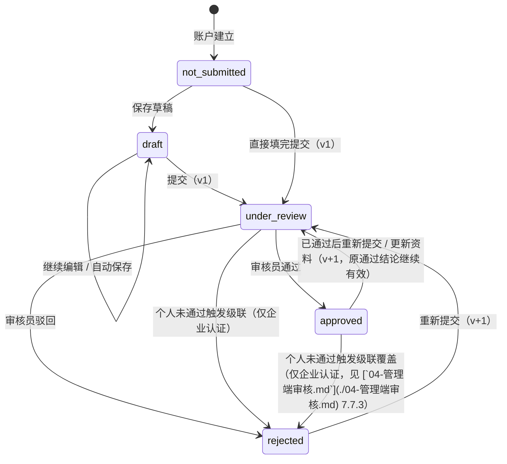
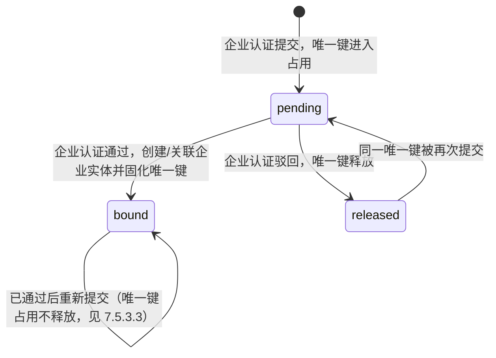

# 实名认证与审核 PRD · 03 流程与状态机

> 本文件是《资产端 / 资产管理端 · 实名认证与审核 PRD（个人认证 + 企业认证）》拆分后的分册。**章节号与编号沿用拆分前，未做重排。**
> 入口与全文导航见主文档 [`v1.0-实名认证与审核-PRD.md`](./v1.0-实名认证与审核-PRD.md)。

**本文件讲什么**：7.4 草稿与分步保存、7.5 状态展示 / 驳回回显 / 重新提交 / 提交限频、第 10 章主流程与异常流程（含 E-01～E-25）、第 11 章状态机（单条认证、综合认证状态、企业实体）、第 15 章数据对象与字段。

**本文件不讲什么**：

| 你在找 | 去这里 |
| --- | --- |
| 个人认证字段与校验 | [`01-个人认证.md`](./01-个人认证.md) 7.2、8.1～8.3 |
| 企业模板与唯一键 | [`02-企业认证与模板.md`](./02-企业认证与模板.md) 7.3、8.4、8.5、第 9 章 |
| 管理端的审核动作与级联规则 | [`04-管理端审核.md`](./04-管理端审核.md) 7.6～7.8 |
| 状态变化触发哪些通知 | [`05-通知.md`](./05-通知.md) 第 14 章 |
| 状态与提示的中英文案 | [`06-双语文案与线框.md`](./06-双语文案与线框.md) 8.7.4 |
| 验收标准 | [`07-验收标准.md`](./07-验收标准.md) 第 19 章 |
| 权限矩阵、非功能要求、指标、风险 | 主文档 [`v1.0-实名认证与审核-PRD.md`](./v1.0-实名认证与审核-PRD.md) |

---

### 7.4 M4 · 草稿与分步保存（F-K14、F-K15）

#### 7.4.1 步骤条

- 三步：`1 个人信息 → 2 企业信息 → 3 核对提交`，顶部常驻步骤条。
- 已完成的步骤可点击回改；未开始的步骤不可跳入（必须顺序推进）。
- 每一步的「下一步」按钮触发**本步骤内**的前端校验；校验不通过时定位到第一个出错字段并聚焦。
- 步骤 3 为只读核对页，逐项展示步骤 1 与步骤 2 的内容，每个区块右上角提供「编辑」回到对应步骤。

#### 7.4.2 草稿保存规则

| 项 | 规则 |
| --- | --- |
| 保存范围 | 一份草稿同时包含个人段与企业段，两段不拆开保存 |
| 自动保存 | 字段失焦后自动保存；文件上传成功后立即保存；切换步骤时保存 |
| 手动保存 | 每一步提供「保存草稿 / Save draft」按钮，保存成功以 Toast 提示 |
| 存储位置 | **服务端**（跟随 `account_id`），换设备、换浏览器登录后可继续填写 |
| 草稿校验 | 保存草稿**不做必填与格式校验**，允许存半成品；校验只在「下一步」与「提交」时执行 |
| 保留期 | 提交前长期保留，不设自动清理；提交成功后草稿冻结（转为已提交内容的第 1 版） |
| 驳回后 | 以上一版已提交内容为基础生成新草稿，用户在其上修改 |
| 并发编辑 | 同一账号多端同时编辑时，以**最后一次保存**为准；检测到服务端草稿版本较新时提示 `This draft was updated elsewhere. Reload to get the latest version. / 草稿已在其他设备更新，请刷新获取最新内容。` |
| 丢失保护 | 未保存变更时离开页面 / 关闭标签页，浏览器原生二次确认 |

#### 7.4.3 提交（F-K17 起点）

- 提交入口只在步骤 3。
- 点击「提交」先弹 C-K04 确认弹窗，告知：`Once submitted, your information cannot be edited until a review decision is made. / 提交后在审核出结论前不可修改。`
- 确认后执行**服务端完整校验**：必填、格式、影像必传、企业唯一键查重（[`02-企业认证与模板.md`](./02-企业认证与模板.md) 9.4）。
- 校验通过 → 一次提交动作**同时创建两份申请**：个人认证申请与企业认证申请，二者共享同一个提交批次号与版本号，随后各自独立流转。
- 提交成功 → P-K02 提交结果页，展示两条审核任务已创建与「返回用户中心」。**页面不出现任何审核时长、预计完成时间或倒计时文案**（DK-33）。
- 校验失败 → 停留在步骤 3，将错误定位回对应步骤的对应字段，并在页面顶部汇总错误项。

---

### 7.5 M5 · 状态展示、驳回回显与重新提交

#### 7.5.1 提交后的状态展示

- 用户中心状态区（[`01-个人认证.md`](./01-个人认证.md) 7.1.1）展示两条轨道的当前状态。
- P-K03 认证详情页展示：提交内容（只读，字段顺序与填写时一致）、每条认证的状态、提交时间、结论时间、审核结论、驳回原因全文。
- **本期不对外承诺审核时长（DK-33）**：界面不出现「预计 N 个工作日」「排在第几位」「预计还剩多久」等任何时限文案，也不做超时提醒、超时预警或倒计时；只展示提交时间与当前状态。审核产能由内部指标监控（17 章），不转化为对用户的承诺。
- 所有时间按 WS-302 13.4 展示：本地时间 + 时区标注。

#### 7.5.2 驳回原因的字段级回显（F-K18）

驳回原因不是一段自由文本，而是**结构化问题项的集合**：

```
驳回结论 = [问题项1, 问题项2, …] + 审核员补充说明（可选，对用户可见）
问题项   = { 目标（字段或材料的标识）, 原因分类, 原因文案（中英双语，系统预置） }
```

| 展示位置 | 呈现方式 |
| --- | --- |
| 用户中心状态卡 | 展示问题项条数与第一条摘要 + 「查看全部原因」 |
| P-K03 详情页 | 顶部展示完整问题项列表（含补充说明）；同时在对应字段 / 材料旁就地标红并展示该项原因 |
| P-K01 重提表单 | 被驳回的字段与材料**高亮标注**「需修改 / Needs update」，并在其下展示原因；页面顶部提供「跳到下一个问题项」 |

预置的原因分类与文案见 [`06-双语文案与线框.md`](./06-双语文案与线框.md) 8.7.4。

#### 7.5.3 重新提交（F-K19）

重新提交有**两个触发场景**：被驳回后的修正，以及已通过后的资料更新。两者共用同一套表单、版本与流转机制，差别只在入口条件与「重提期间原结论是否仍然有效」。

##### 7.5.3.1 通用规则（两种场景共用）

| 项 | 规则 |
| --- | --- |
| 预填 | 以上一版已提交内容预填全部字段与材料 |
| 可改范围 | **全部字段与材料均可修改**，不限于被驳回项（用户可能主动更正未被指出的错误） |
| 提交范围 | **个人段与企业段一并提交**（保持「一次填完」的一致体验）；未发生变更的一方按原内容重新入队，审核端标注「与上一版一致 / Unchanged」 |
| 版本 | 每次重新提交，两份申请的版本号同步 +1；历史版本与其结论全部保留可查 |
| 状态流转 | 提交后两条认证均进入「审核中」，按新的提交时间排到各自队列队尾 |
| 限频 | 见 7.5.4 |
| 进行中的审核 | **同一时间只允许存在一轮进行中的审核**：任一条认证处于「审核中」时，重新提交入口不可用（前端置灰并说明原因，服务端同样拒绝） |

> 为什么未变更的一方也要一起重提：两份申请共享同一个提交批次与版本号，是「同一份材料的同一次陈述」。若允许只重提一半，就会出现个人是第 2 版、企业是第 1 版的错配状态，级联判定与审计追溯都会变得含糊。代价是审核员多点一次通过，收益是版本关系始终清晰。

##### 7.5.3.2 场景一：被驳回后的重新提交

| 项 | 规则 |
| --- | --- |
| 入口 | 用户中心主按钮「重新提交 / Resubmit」，或 P-K03 详情页底部按钮；**存在驳回**时可用 |
| 表单表现 | 被驳回的字段与材料高亮标注「需修改」，并展示对应问题项（7.5.2） |
| 期间的对外状态 | 综合状态为 `action_required`（业务功能本就未放行），提交后转为「审核中」 |
| 企业唯一键 | 驳回时已释放（[`02-企业认证与模板.md`](./02-企业认证与模板.md) 9.4.3）；重新提交时**重新执行查重**，若该唯一键此间已被他人占用，提交被拦截（[`02-企业认证与模板.md`](./02-企业认证与模板.md) 9.4.1） |

##### 7.5.3.3 场景二：已通过后的重新提交（更新认证资料）

管理端不提供改判 / 撤销（DK-27），需求方明确「误判通过由用户重新提交修正」——因此 **`approved` 不是终态**，用户在已通过状态下仍可主动发起重新提交（证件换发、企业改名、材料到期、纠正误判等场景同样走这条路径）。

| 项 | 规则 |
| --- | --- |
| 入口 | 用户中心主按钮「更新认证资料 / Update details」，或 P-K03 详情页按钮；**两条认证均为已通过**时可用 |
| 表单表现 | 预填现行有效版本的全部内容；**无「需修改」高亮**（没有问题项） |
| **原结论的对外效力** | **原通过结论继续有效，直到新一次审核出结论为止**：重提期间综合状态保持 `verified`，业务功能不中断，落地页仍为总览页 |
| 用户可见的表达 | 状态卡展示「已认证 · 更新审核中（第 N 次提交）/ Verified · update under review (resubmission N)」，明确告知当前认证仍然有效 |
| **企业唯一键** | **占用不释放**：企业实体已绑定（`bound`），重提期间唯一键持续占用，不允许他人在此空档提交同一家企业 |
| 新结论为通过 | 新版本内容成为现行有效版本；企业实体信息随之更新，`unique_key` 不变（[`02-企业认证与模板.md`](./02-企业认证与模板.md) 9.5.1） |
| **新结论为驳回** | 认证状态转为 `rejected`，综合状态转为 `action_required`，**业务功能被收回**；用户须再次重新提交修正。界面须在提交前就把这一后果讲清楚（见下方提示文案） |
| 提交前告知 | C-K04 确认弹窗追加一句：`Your current verification stays valid while the update is reviewed. If the update is rejected, your verified status will be revoked. / 更新审核期间当前认证仍然有效；若更新被驳回，已认证状态将被收回。` |
| 唯一键变更 | 若更新中把企业换成了另一家（主注册号变化），按**新提交**处理：新唯一键须通过查重；原唯一键在新结论为通过时释放，新结论为驳回时维持原绑定不变 |

> 为什么原结论继续有效：用户更新资料是被鼓励的行为（证件换发、企业改名都属正常业务），如果一点「更新」就立刻失去已认证状态、业务被掐断，用户就会选择不更新——那才是真正的风险。把风险收敛在「新结论为驳回时才收回」这一点上，既保住了业务连续性，也保住了审核的最终裁量。

##### 7.5.4 提交限频（N-K05）

需求方口径：提交次数**不设总量上限**，但同一账号 24 小时内最多提交 5 次。

| 项 | 规则 |
| --- | --- |
| 总量上限 | **不设**。用户可以无限次重新提交，只要不触碰下面的窗口限制 |
| 窗口口径 | **24 小时滑动窗**，不是自然日：判定时点向前回溯 24 小时，统计该区间内的成功提交次数；不存在「零点清零」 |
| 阈值 | 滑动窗内 ≤ 5 次（N-K05） |
| **计数对象** | **按「提交动作」计数，个人与企业认证合并计一次**，不分别计数 |
| 计数对象的理由 | 一次提交动作本来就同时创建个人与企业两份申请、共享同一批次号与版本号（7.4.3、7.5.3.1）。若分别计数，同一次点击会消耗两个额度，阈值 5 实际只允许提交 2 次半，与需求方「24 小时内 5 次」的字面口径不符 |
| 计入范围 | **仅成功创建申请的提交计数**；被前端校验拦下、被服务端校验拦下、被企业唯一键冲突拦截（[`02-企业认证与模板.md`](./02-企业认证与模板.md) 9.4.1）的尝试**不计数**——用户不该为一次没有产生审核成本的失败尝试付出额度 |
| 草稿保存 | 不计数 |
| 触发时的行为 | 服务端拒绝本次提交，**不创建申请、草稿完整保留**；停留在步骤 3，以 Toast + 页内提示展示下方文案 |
| **解除时间的展示** | 展示**具体可再次提交的时间点**（滑动窗内最早那一次提交的时间 + 24 小时），按 WS-302 13.4 展示为本地时间并带时区标注，例如 `2026-09-09 14:30 (UTC+8)`；**不使用「还剩 N 小时」这类模糊表述**，跨时区用户容易算错 |
| 提示文案 | `You have reached the submission limit (5 submissions per 24 hours). You can submit again after {time}. / 24 小时内最多提交 5 次，已达上限。你可以在 {time} 之后再次提交。` |
| 用户中心的表现 | 达到上限期间，主操作按钮置灰并在其下展示同一句说明与可提交时间；按钮不隐藏（隐藏会让用户以为功能没了） |
| 与审核的关系 | 限频只约束用户侧提交，**不影响管理端对已入队申请的审核** |

---

## 10. 主流程与异常流程

### 10.1 首次认证提交（主流程）

1. 用户登录 → 按 WS-302 落地规则进入用户中心（P-A17）。
2. 点击「开始认证」→ 执行凭据完备性校验（[`01-个人认证.md`](./01-个人认证.md) 7.1.2）：邮箱与钱包同时具备则继续；否则弹 C-09 就地补齐，补齐后原地继续。
3. 进入 P-K01 步骤 1，按固定顺序填写六项个人信息，上传影像（身份证 2 张 / 护照 1 张）。
4. 点「下一步」→ 前端校验（必填、格式、影像必传）→ 保存草稿 → 进入步骤 2。
5. 步骤 2 先选企业注册地 → 加载对应模板 → 填写公共段与模板段，上传材料。
6. 点「下一步」→ 前端校验 → 保存草稿 → 进入步骤 3 核对页。
7. 点「提交」→ C-K04 确认弹窗 → 服务端校验（必填 / 格式 / 影像 / **企业唯一键查重**）。
8. 校验通过 → 同一批次创建两份申请（个人 v1、企业 v1），状态均为 `under_review` → 进入 P-K02 提交结果页。
9. 两条申请分别进入管理端的两个队列，可并行审核。

### 10.2 审核通过（主流程）

1. 个人审核员在 P-M31 比对证件号码与影像 → 点「通过」→ 个人认证 `approved`。
2. 企业审核员在 P-M33 按模板要点核对材料 → 点「通过」→ 服务端二次唯一键查重通过 → 企业认证 `approved`，创建 / 关联 `Enterprise` 实体并固化唯一键。
3. 两条均 `approved` → 认证完成 → 业务功能放行；用户下次登录按 WS-302 D-04 落到总览页。
4. 触发通知事件（第 14 章：N-02 / N-04 / N-06，站内信 + 邮件）。

### 10.3 驳回与重新提交（主流程）

1. 审核员点「驳回」→ C-M01 弹窗选择问题项（≥1 项）+ 补充说明 → 该条认证 `rejected`。
2. 若被驳回的是**个人认证** → 触发级联（[`04-管理端审核.md`](./04-管理端审核.md) 7.7.3）：企业认证一律置为 `rejected` 并标记级联。
3. 资产端用户中心展示驳回态与原因摘要；P-K03 展示完整问题项并在对应字段就地标注。
4. 用户点「重新提交」→ P-K01 预填上一版内容，被驳回项高亮「需修改」→ 修改后重新走步骤 1→3 提交。
5. 提交成功 → 两份申请版本号同步 +1，状态回到 `under_review`，重新入队。

### 10.4 已通过后的资料更新（主流程）

1. 双认证已通过的用户在用户中心点「更新认证资料」（或 P-K03 详情页入口）→ 弹出确认，告知「更新审核期间当前认证仍然有效；若更新被驳回，已认证状态将被收回」。
2. 进入 P-K01，预填现行有效版本的全部内容，无「需修改」高亮 → 修改后走步骤 1→3 提交。
3. 提交成功 → 两份申请版本号 +1、状态转为审核中；**综合状态仍为 `verified`，业务功能不中断**；状态卡展示「已认证 · 更新审核中（第 N 次提交）」。
4. 企业唯一键在此期间**持续占用不释放**；若本次更新更换了企业主体（主注册号变化），新唯一键须通过查重。
5. 新结论为通过 → 新版本成为现行有效版本，企业实体信息更新、`unique_key` 不变。
6. 新结论为驳回 → 认证转为驳回，综合状态转 `action_required`，业务功能被收回，用户须再次重新提交修正。

### 10.5 异常流程总表

| # | 场景 | 系统行为 |
| --- | --- | --- |
| E-01 | 未登录访问认证页面 | 重定向到登录页（WS-302） |
| E-02 | 认证过程中会话失效 | 按 WS-302 12.1：Toast 提示并跳登录页；**已保存的草稿不丢失**，重新登录后可继续 |
| E-03 | 缺邮箱或钱包点击开始认证 | 不跳走，弹 C-09 就地补齐（[`01-个人认证.md`](./01-个人认证.md) 7.1.2） |
| E-04 | 证件号码格式不符 | 失焦即提示，聚焦该字段，不可进入下一步 |
| E-05 | 身份证只传了一面 | 缺失槽位标红，「下一步」不可用 |
| E-06 | 上传文件超过大小或格式不支持 | 上传前拦截并提示具体原因，其他内容不受影响 |
| E-07 | 上传中断 / 网络失败 | 展示失败态与「重试」；已填字段与其他文件保留 |
| E-08 | 未选注册地就想填企业信息 | 模板段不渲染，展示引导文案 |
| E-09 | 切换注册地 / 证件类型 | C-K03 二次确认，逐条列出将被清空的内容；取消则不变 |
| E-10 | 企业唯一键与他人冲突 | 提交被拦截，展示 [`02-企业认证与模板.md`](./02-企业认证与模板.md) 9.4.1 文案，草稿保留，不创建申请 |
| E-11 | 企业唯一键与本账号已有申请冲突 | 提示已提交过并引导查看状态 |
| E-12 | 提交时服务端校验失败 | 停在步骤 3，顶部汇总错误项，点击可跳转到对应步骤的对应字段 |
| E-13 | 提交后再次点击提交（重复提交） | 服务端幂等：同一草稿版本只生成一次申请，重复请求返回既有申请 |
| E-14 | 24 小时滑动窗内提交已达 5 次 | 服务端拒绝，不创建申请、草稿保留；提示上限与**具体可再次提交的时间点**（带时区），主操作按钮置灰不隐藏（7.5.4） |
| E-15 | 审核期间用户尝试修改内容 | 入口不可用；P-K03 为只读态并说明原因 |
| E-16 | 两位审核员同时对同一申请出结论 | 后提交者被拒绝，提示已被他人审核并刷新（F-K29） |
| E-17 | 企业审核员在个人已驳回后点「通过」 | 「通过」按钮禁用；即使绕过前端，服务端拒绝并返回级联规则说明 |
| E-18 | 企业审核员点「通过」时唯一键已被他人占用 | 拒绝通过，提示审核员按重复注册驳回（[`02-企业认证与模板.md`](./02-企业认证与模板.md) 9.4.2） |
| E-19 | 材料文件在预览时加载失败 | 展示错误态与「重试」；不得因加载失败而让审核员在看不到材料的情况下做结论（提示「材料不可读时请勿出具结论」） |
| E-20 | 模板配置加载失败 | 注册地可选但模板段展示错误态，禁止提交（[`02-企业认证与模板.md`](./02-企业认证与模板.md) 8.4.2） |
| E-21 | 国家 / 地区清单加载失败 | 国籍与注册地选择器展示错误态并可重试，禁止提交 |
| E-22 | 用户在驳回后长期不重提 | 保持驳回态，不自动关闭、不自动删除草稿 |
| E-23 | 已通过后发起更新，中途放弃（存了草稿但没提交） | 认证维持已通过、业务不受影响；草稿长期保留，用户可随时继续或丢弃 |
| E-24 | 任一条认证正在审核中时点击「重新提交 / 更新认证资料」 | 入口置灰并说明「当前有一轮审核正在进行」；服务端同样拒绝（7.5.3.1） |
| E-25 | 已通过后的更新被驳回 | 已认证状态被收回、业务功能暂停，用户中心展示驳回原因与「重新提交」；该后果已在提交前告知 |

---

## 11. 状态机

### 11.1 单条认证的状态机（个人与企业各自独立走一套）



| 状态 | 定义 | 用户可做的事 | 是否占用企业唯一键 |
| --- | --- | --- | --- |
| `not_submitted` | 从未填写 | 开始填写 | — |
| `draft` | 有草稿未提交 | 继续填写、提交 | 否 |
| `under_review` | 已提交，等待结论 | 只读查看 | 是（企业） |
| `approved` | 审核通过 | 只读查看、**发起重新提交（更新认证资料）** | 是（企业；已通过后重提期间**不释放**） |
| `rejected` | 审核驳回（含级联驳回） | 查看原因、重新提交 | 否 |

**关于「重新提交」**

需求方列出的状态含「重新提交」。在本设计中，**「重新提交」是一个动作而非稳定状态**：它把认证从 `rejected` 送回 `under_review`，并把版本号 +1。界面上通过版本号表达这一语义——列表与状态卡展示为「审核中（第 2 次提交）/ Under review (resubmission 2)」，管理端列表另有「重提件」筛选项。

这样处理的理由：如果把「重新提交」建成第五个稳定状态，它与「审核中」在行为上完全一致（都在队列里等结论），却要在每一处判断逻辑里多写一个分支，日后极易出现两个状态处理不一致的缺陷。用「审核中 + 版本号」表达，用户看到的信息一点不少，系统只维护一套流转规则。需求方已确认**不建立独立的第五个状态**（DK-23），本节即为定稿口径。

**关于 `approved → under_review`**

管理端不提供改判 / 撤销（DK-27），"审核员误判通过"只能由用户重新提交来修正，因此 **`approved` 不是终态**：已通过的用户仍可发起重新提交（更新认证资料）。这条路径与被驳回后的重提共用同一套流转，唯一的差别是**原通过结论在新结论出来前继续有效**，且企业唯一键占用不释放——完整规则见 7.5.3.3。

### 11.2 账户的综合认证状态（对外输出给 WS-302 与业务模块）

| 综合状态 | 判定条件 | 输出给谁 | 用途 |
| --- | --- | --- | --- |
| `unverified` | 两条均未达 `approved`，且不存在驳回 | WS-302 / 业务模块 | 落地到用户中心；业务功能不放行 |
| `partially_verified` | 个人 `approved`、企业未 `approved` | 同上 | 同上（业务仍不放行） |
| `action_required` | 任一条为 `rejected` | 同上 | 落地到用户中心，展示驳回；业务不放行 |
| `verified` | 个人 `approved` **且** 企业 `approved` | 同上 | 落地到总览页；**业务功能放行** |

- 综合状态由本模块计算并输出，业务模块**只消费 `verified` 这一个信号**，不自行拼装子状态。
- WS-302 D-04 所需的「个人认证是否完成」「企业认证是否完成」两个布尔位一并输出。
- **已通过后重新提交期间，综合状态保持 `verified`**：原通过结论在新一次审核出结论前继续有效，业务功能不中断、落地页仍为总览页（7.5.3.3）。只有新结论为驳回时，综合状态才转为 `action_required` 并收回业务放行。因此 `verified` 的判定条件应表述为「两条认证的**现行有效结论**均为 `approved`」，而不是「当前状态均为 `approved`」。

### 11.3 企业实体状态



---

## 15. 数据对象与字段

> 只定义业务字段与口径，不指定存储实现。

### 15.1 个人认证申请 PersonalVerification

| 字段 | 口径 | 类型 | 必填 | 说明 |
| --- | --- | --- | --- | --- |
| `personal_verification_id` | 申请唯一标识 | string | 是 | 展示编号建议形如 `KYC-YYYYMMDD-NNNNNN` |
| `account_id` | 所属账户 | string | 是 | 来自 WS-302 |
| `batch_id` | 提交批次号 | string | 是 | 与同次提交的企业申请共享 |
| `version` | 版本号 | int | 是 | 首次提交为 1，每次重新提交 +1 |
| `status` | 状态 | enum | 是 | `not_submitted` / `draft` / `under_review` / `approved` / `rejected` |
| `id_type` | 证件类型 | enum | 是 | `id_card` / `passport` |
| `name` | 姓名 | string | 是 | 原样存储 |
| `name_en` | 英文姓名 | string | 是 | 原样存储 |
| `nationality` | 国籍 | string | 是 | ISO 3166-1 alpha-2 |
| `id_number` | **证件号码（原样）** | string | 是 | **用户原始输入，不做任何改写** |
| `id_number_normalized` | 证件号码（归一化） | string | 是 | 仅内部用于校验判定、精确搜索比对；**不对外展示** |
| `id_documents` | 证件影像 | file[] | 是 | 身份证 2 份（front / back）、护照 1 份（bio_page）；每份见 15.4 |
| `submitted_at` | 提交时间 | datetime | 否 | UTC |
| `decided_at` | 结论时间 | datetime | 否 | UTC |
| `decided_by` | 结论人 | string | 否 | `admin_id`；级联时为 `system` |
| `reject_reasons` | 驳回问题项 | object[] | 否 | 每项 `{ code, target, note_visible }` |
| `reviewer_note` | 审核补充说明 | string | 否 | ≤ 500 字，**对用户可见** |
| `created_at` / `updated_at` | 创建 / 更新时间 | datetime | 是 | UTC |

### 15.2 企业认证申请 EnterpriseVerification

| 字段 | 口径 | 类型 | 必填 | 说明 |
| --- | --- | --- | --- | --- |
| `enterprise_verification_id` | 申请唯一标识 | string | 是 | 展示编号建议形如 `KYB-YYYYMMDD-NNNNNN` |
| `account_id` / `batch_id` / `version` / `status` | 同 15.1 | | 是 | 与个人申请同批次、同版本号 |
| `registration_region` | 企业注册地 | string | 是 | ISO 3166-1 alpha-2 |
| `template_code` | 适用模板 | enum | 是 | `T1_CN` / `T2_HK` / `T3_US` / `T4_KY` / `T5_NG` / `T6_GENERIC` |
| `company_name` | 企业名称 | string | 是 | 原样存储 |
| `company_name_en` | 企业英文名称 | string | 视模板 | |
| `registered_address` | 注册地址 | string | 是 | |
| `applicant_role` | 与企业的关系 | enum | 是 | 见 [`02-企业认证与模板.md`](./02-企业认证与模板.md) 8.4.1 |
| `template_fields` | 模板段字段值 | object | 是 | 键为模板定义的字段标识（如 `uscc`、`hk_cr_number`），值为**原样输入** |
| `primary_registration_number` | 主注册号（原样） | string | 是 | 由模板决定取哪个字段 |
| `unique_key` | 企业唯一键 | string | 是 | 按 [`02-企业认证与模板.md`](./02-企业认证与模板.md) 9.2 / [`02-企业认证与模板.md`](./02-企业认证与模板.md) 9.3 计算，形如 `HK:3012345` |
| `unique_key_secondary` | 第二唯一键 | string | 否 | 仅美国模板：`US-EIN:{EIN}` |
| `documents` | 材料文件 | file[] | 是 | 按模板必填集合校验；每份见 15.4 |
| `enterprise_id` | 关联的企业实体 | string | 否 | **审核通过时**写入 |
| `rejected_by_cascade` | 是否级联驳回 | bool | 是 | 默认 false；个人未通过导致的驳回为 true |
| `submitted_at` / `decided_at` / `decided_by` / `reject_reasons` / `reviewer_note` | 同 15.1 | | | |
| `created_at` / `updated_at` | | datetime | 是 | UTC |

### 15.3 企业实体 Enterprise

| 字段 | 口径 | 类型 | 必填 | 说明 |
| --- | --- | --- | --- | --- |
| `enterprise_id` | 企业实体唯一主键 | string | 是 | 不可变 |
| `unique_key` | 企业唯一键 | string | 是 | **全局唯一约束**；一经固化不可变 |
| `unique_key_secondary` | 第二唯一键 | string | 否 | 美国 EIN；同样参与唯一约束 |
| `registration_region` | 注册地 | string | 是 | |
| `us_state` | 注册州 | string | 否 | 仅美国 |
| `template_code` | 模板 | enum | 是 | |
| `company_name` / `company_name_en` | 名称 | string | 是 / 否 | 随最新通过版本更新 |
| `primary_registration_number` | 主注册号（原样） | string | 是 | |
| `status` | 状态 | enum | 是 | `pending` / `bound` / `released`（11.3） |
| `bound_account_id` | 绑定账户 | string | 否 | **本期 1:1**；扩展多企业时迁移到关系对象（[`02-企业认证与模板.md`](./02-企业认证与模板.md) 9.5.2） |
| `created_at` / `updated_at` | | datetime | 是 | UTC |

### 15.4 材料文件 VerificationDocument

| 字段 | 说明 |
| --- | --- |
| `document_id` | 文件唯一标识 |
| `owner_type` / `owner_id` | 归属的申请（个人 / 企业）与其 ID |
| `slot` | 槽位标识（如 `id_card_front`、`business_license`、`hk_nar1`） |
| `original_filename` | 原始文件名（展示用） |
| `content_type` / `size_bytes` | 类型与大小 |
| `storage_ref` | 私有存储引用（不可作为公开 URL） |
| `uploaded_at` | 上传时间（UTC） |
| `version` | 所属申请版本 |

### 15.5 审核记录 ReviewRecord

| 字段 | 说明 |
| --- | --- |
| `record_id` | 记录唯一标识 |
| `target_type` / `target_id` | 目标申请（个人 / 企业）与其 ID |
| `version` | 目标申请的版本号 |
| `action` | `submitted` / `resubmitted` / `approved` / `rejected` / `cascade_rejected` / `duplicate_blocked` |
| `actor_type` / `actor_id` | `admin` + `admin_id`，或 `user` + `account_id`，或 `system` |
| `reason_codes` | 驳回问题项编号列表 |
| `reviewer_note` | 补充说明 |
| `snapshot_ref` | 该版本提交内容的快照引用（保证事后可复现当时审的是什么） |
| `created_at` | UTC；**只增不改不删** |

### 15.6 敏感访问日志 SensitiveAccessLog

| 字段 | 说明 |
| --- | --- |
| `log_id` | 唯一标识 |
| `admin_id` | 操作人 |
| `action` | `view_detail` / `view_document` / **`download_document`** / `copy_id_number` / `search_by_id_number` |
| `target_account_id` / `target_application_id` / `document_id` | 目标对象 |
| `id_number_hash` | 仅精确搜索场景记录，**存哈希不存原文** |
| `ip` / `user_agent` | 来源 |
| `created_at` | UTC |

### 15.7 配置对象（部署下发）

| 对象 | 内容 |
| --- | --- |
| `CountryRegionList` | ISO 3166-1 国家 / 地区清单，含中英文名称与代码 |
| `UsStateList` | 美国州与属地清单，含代码 |
| `VerificationTemplate` | 六套模板的字段、材料、必填标记、校验规则、中英文案、唯一键构成与归一化规则 |
| `RejectReasonCatalog` | 预置驳回问题项（[`06-双语文案与线框.md`](./06-双语文案与线框.md) 8.7.4），含编号、中英文案、定位目标 |

---
