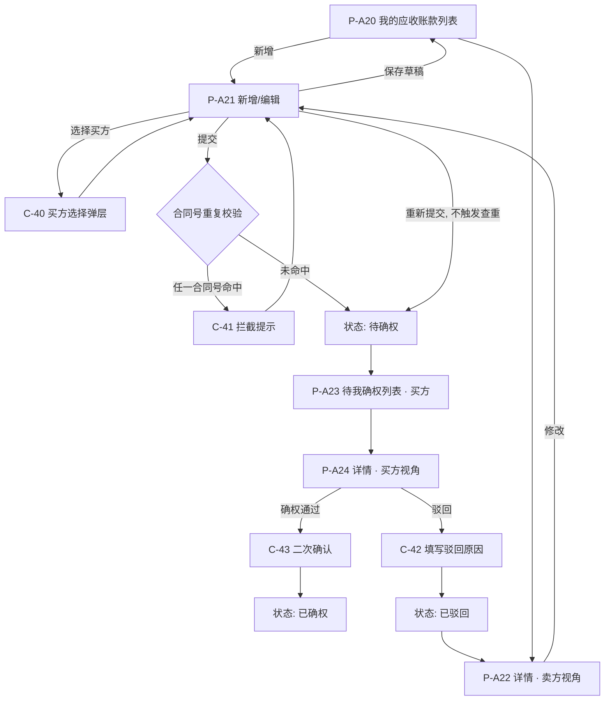
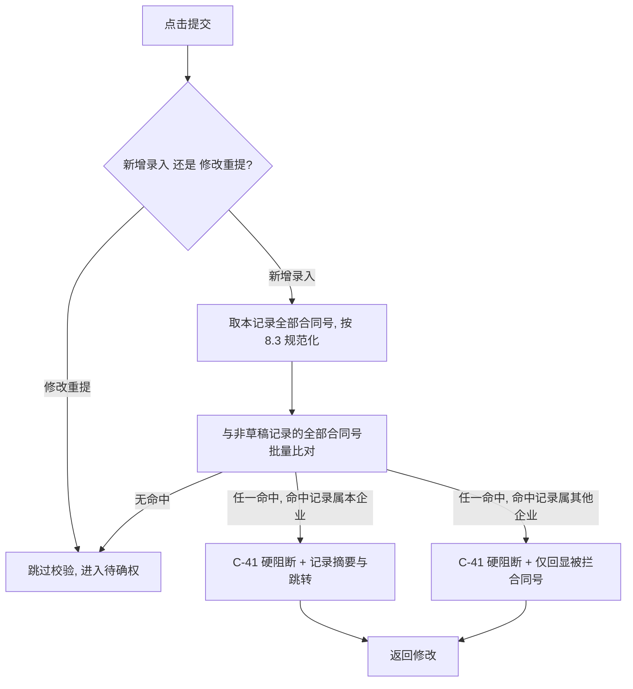
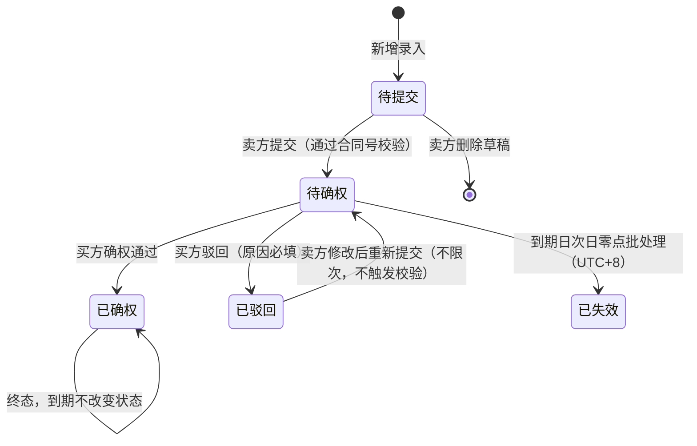

# 应收账款录入与确权 · 产品需求文档（PRD）

## 0. 文档信息

| 项 | 内容 |
| --- | --- |
| 产品/模块 | 跨境链融（Chain-Financing）· 资产端 · 应收账款录入与确权 |
| 关联 issue | WS-305「应收账款录入、确权」 |
| 文档版本 | v1.1 |
| 阶段 | Phase 2 · PRD |
| 撰写人 | 需求分析师 许楚清 |
| 输入依据 | 《应收账款录入与确权 · 需求诊断简报 v2 定稿》（诊断师 程功立）、业务方对该简报全部推荐意见的批准、业务方 2026-09-08 对 PRD v1.0 的四项修改意见 |
| 平台规范依据 | 仓库分支 `cly-V1.0.0`：WS-302 `asset-platform/prd/v1.0-账户与登录/05-消息通知与邮件模板.md`（邮件模板结构、双语排版、占位符体系、页脚）、WS-302 `02-页面字段与双语文案.md` 13.4/13.5（时间与金额格式基线）、WS-304 `asset-platform/prd/v1.0-消息通知/02-数据契约与字段.md` 第 9 章（站内信数据契约、`category` / `biz_type` / `dedupe_key` / `biz_ref` / 页面编号唯一性） |
| 入库路径 | `asset-platform/prd/v1.0-应收账款录入与确权/v1.0-应收账款录入与确权-PRD.md`（单文档形态，遵循 `asset-platform/prd/README.md` 命名约定：模块目录 + 与目录同名的入口文件） |
| 适用读者 | 设计、前端、后端、测试、业务方 |
| 交付范围 | 本文档只描述"做什么"与"验收什么"，不指定技术选型、数据库设计与框架实现 |

**标记约定**

- `[待确认]`：尚未获得业务方或平台维护方答复的问题，文中已给出默认取值，按默认取值实现。全部标记项在第 14 章汇总。
- 未标记的规则均为已拍板的既定口径，实现时不得自行调整。第 14.1 节列出的口径已由业务方确认，**不再重开**。
- 部分编号（D-17、D-18、AC-44）随「待人工核对」处置的删除而作废，**编号保留为空位不再复用**，避免与 v1.0 的引用产生歧义。

---

## 1. 背景与目标

### 1.1 业务背景

跨境链融平台面向跨境贸易场景提供供应链金融服务。应收账款要成为可融资的合格底层资产，前提是**债务方（买方）对该笔债权的真实性做出在线签认**。当前该确权动作依赖线下纸质流程，存在三个问题：

1. 确权凭证分散在线下，平台无法实时掌握资产状态，也无法追溯"谁在什么时间确认了什么"。
2. 材料（合同、发票、单据）无统一归集，买方核验成本高、周期长。
3. 无系统性的重复录入控制，同一笔真实债权存在被重复录入、进而重复用作融资底层资产（一票多押）的风险。

### 1.2 本期目标

在资产端建设"应收账款录入 → 买方在线确权"的完整闭环：

- 已认证企业用户可录入自身持有的应收账款、上传贸易背景材料，并指定平台内已认证的买方企业。
- 买方企业用户在线完成**整笔确权通过**或**驳回（必填原因）**，卖方可修改后不限次数重提。
- 系统以**合同号**为唯一判定依据做重复录入拦截，把一票多押风险在提交环节直接挡住。
- 系统在 6 个关键节点通知双方，邮件按平台既有模板规范中英双语同封发出。
- 资产管理端可全量只读查看、下载全部资产与材料。

### 1.3 本期不做（范围边界）

| # | 不做项 | 说明 |
| --- | --- | --- |
| 1 | 融资、放款、额度计算、风控评分 | 本模块只产出合格底层资产，不含任何下游资金能力 |
| 2 | 移动端 / 小程序 | 本期仅 Web 端（资产端 + 资产管理端） |
| 3 | 汇率记录与本位币折算、跨币种统计报表 | 连锁约束见 6.3 |
| 4 | 买方未入驻时的邀请入驻、"待认领"中间态 | 买方搜不到即硬阻断 |
| 5 | 材料分类目、确权时材料快照 / 版本留存 | 材料统一为一个上传区，不留快照 |
| 6 | 确权超时策略与催办 | 「待确权」可一直等待，直至到期失效 |
| 7 | 「已撤回」状态、卖方提交后撤回 | 提交后不可撤回 |
| 8 | 部分金额确权 | 买方只能整笔通过或整笔驳回 |
| 9 | 已确权后的修改与撤销 | 买方、卖方、平台均不可撤销 |
| 10 | 报关单号、物流/提单、装箱单、进出口方向、原产地等跨境合规字段 | 移入后续迭代 |
| 11 | 回款 / 结清状态机 | 「已确权且到期」的业务语义由后续迭代承接 |
| 12 | 短信通知 | 通知渠道仅站内信与邮件 |
| 13 | **重复录入的管理端人工审核 / 例外放行** | 本期只有"拦截"一档处置，无申诉与例外通道（见 1.4） |
| 14 | 线下纸质确权流程的数字化归档 | 只处理线上新增的应收账款 |

### 1.4 后续迭代（本期不做但已规划）

- **重复录入的管理端人工审核与例外放行**：承接被硬阻断但确属合法的场景（分批开票、同一合同多期账款）。
- 未注册买方的邀请入驻与「待认领」闭环。
- 跨境合规字段：报关单、物流/提单、装箱单、进出口方向等。
- 汇率记录与本位币折算、跨币种统计报表。
- 材料分类目与确权时材料快照。
- 部分金额确权、确权撤销、卖方撤回、确权超时催办。
- 回款 / 结清状态机。
- 短信通知渠道、移动端 / 小程序确权。

### 1.5 成功标准

- 一笔真实应收账款能在双方在线操作下，于到期前完成从录入到「已确权」的闭环，并留下完整可审计的操作时间线。
- 任一合同号在平台内的非草稿记录上只存在一次，重复录入在提交环节即被拦截。
- 资产管理端能实时只读看到每笔资产的最新状态、全部材料与确权/驳回记录。

---

## 2. 用户与角色

### 2.1 核心原则：不区分买卖方角色

平台**不按「卖方角色 / 买方角色」划分账号**。每个已认证通过的企业用户默认同时具备「录入应收账款」和「确权应收账款」两项权限；一个账号在某笔单据中的身份由该单据的主体关系动态决定：

- 该笔应收账款的**录入方** = 债权方（业务语义上的**卖方**）
- 该笔应收账款上被选中的**买方主体** = 债务方（业务语义上的**买方 / 确权方**）

因此本文档中的「卖方」「买方」均为**单据维度的身份**，不是账号维度的角色，不得在权限系统里建成两个角色。

### 2.2 用户角色

| 角色 | 所在端 | 说明 |
| --- | --- | --- |
| 企业用户 | 资产端（Web） | 已完成企业认证且认证通过的企业下的操作账号。同时拥有录入与确权两项权限。 |
| 资产管理人员 | 资产管理端（Web） | 平台侧运营/风控人员，对全部应收账款**全量只读**，可下载材料，**不脱敏**，不可做任何写操作。 |

**准入约束**：未完成企业认证或认证未通过的企业用户，不可进入本模块的任何功能入口，入口置灰并提示前往企业认证。

### 2.3 功能入口

| 入口 | 名称 | 数据集 | 可执行动作 |
| --- | --- | --- | --- |
| 入口 A | 我的应收账款 / 发起录入 | 本企业作为**债权方（卖方）录入**的全部记录 | 新增录入、编辑草稿、删除草稿、提交、被驳回后修改重提、查看详情与材料 |
| 入口 B | 待我确权 | 其他企业录入、**买方主体为本企业**的记录 | 查看详情与材料（预览/下载）、确权通过、驳回（填原因） |

**入口互斥约束**：两个入口的数据集按"本企业在该单据中是债权方还是债务方"划分，**互斥**，同一条记录不得同时出现在两个入口。由于买方不能选中自身企业（见 5.2），该约束在数据上恒成立。

### 2.4 权限矩阵

| 能力 | 卖方（入口 A） | 买方（入口 B） | 资产管理端 |
| --- | --- | --- | --- |
| 新增录入 | ✅ | ❌ | ❌ |
| 编辑草稿 / 删除草稿 | ✅ | 不可见 | ❌ |
| 提交 | ✅ | ❌ | ❌ |
| 查看详情 | ✅ | ✅（提交后） | ✅（全量） |
| 预览 / 下载材料 | ✅ | ✅ | ✅（不脱敏） |
| 确权通过 | ❌ | ✅（仅「待确权」） | ❌ |
| 驳回 | ❌ | ✅（仅「待确权」） | ❌ |
| 修改重提 | ✅（仅「已驳回」） | ❌ | ❌ |
| 撤回 / 撤销确权 / 部分确权 | ❌（本期不做） | ❌（本期不做） | ❌ |
| 查看完整操作时间线 | ✅（本方可见范围） | ✅（本方可见范围） | ✅（全量，含驳回原因、操作人、操作时间） |

> 越权控制不能只做前端隐藏：所有写操作与详情读取均需服务端按"当前企业是否为该单据的债权方/债务方"二次校验，越权请求返回明确拒绝。

### 2.5 用户故事

| # | 角色 | 用户故事 |
| --- | --- | --- |
| US-01 | 卖方企业用户 | 作为债权方，我希望把已有的应收账款连同贸易材料录入平台，以便让买方在线确认，形成可用于后续融资的合格资产。 |
| US-02 | 卖方企业用户 | 作为债权方，我希望能先存草稿、材料齐了再提交，避免一次填不完就丢失内容。 |
| US-03 | 卖方企业用户 | 作为债权方，我希望在被驳回时清楚看到驳回原因，并能修改后重新提交，不限次数。 |
| US-04 | 卖方企业用户 | 作为债权方，我希望一笔应收账款能关联多个合同号，覆盖一笔账款跨多份合同的真实场景。 |
| US-05 | 买方企业用户 | 作为债务方，我希望在「待我确权」里集中看到需要我处理的应收账款，并能预览下载材料后再决定通过还是驳回。 |
| US-06 | 买方企业用户 | 作为债务方，我希望驳回时必须写明原因，让卖方知道要改什么，减少反复。 |
| US-07 | 买方企业用户 | 作为债务方，我希望收到新提交和重提的通知，避免漏处理导致资产到期失效；我可能是境外企业，希望邮件我能读懂。 |
| US-08 | 资产管理人员 | 作为平台风控，我希望全量只读查看所有资产、材料和完整操作时间线，并能下载原件用于人工核查。 |

---

## 3. 页面结构与流程

### 3.1 页面与组件清单（线框级信息架构）

> **编号遵循平台级唯一性规则**（WS-304 `02-数据契约与字段.md` 9.4.4 / D-N40：页面与组件编号在全平台唯一、按十位段分配）。本模块申请段位：资产端页面 `P-A20`～`P-A29`、管理端页面 `P-M40`～`P-M49`、组件 `C-40`～`C-49`，需由消息模块维护方合入 `docs/notification-contract/接入指南.md` 4.2 段位表 `[待确认-Q27]`（该表已记录本申请为「待批」，批复前其他模块不占用这三段）。

| 编号 | 页面/组件 | 端/入口 | 核心内容 |
| --- | --- | --- | --- |
| P-A20 | 我的应收账款列表 | 资产端 · 入口 A | 筛选区（状态、币种、买方、到期日区间、关键词）＋列表＋「新增应收账款」按钮＋按币种分组的金额汇总区 |
| P-A21 | 新增/编辑应收账款 | 资产端 · 入口 A | 基本信息表单 ＋ 买方选择 ＋ 多值合同号输入 ＋ 材料上传区 ＋「保存草稿」「提交」 |
| P-A22 | 应收账款详情（卖方视角） | 资产端 · 入口 A | 只读字段区 ＋ 材料区（预览/下载）＋ 状态与操作时间线（含每次驳回原因）＋ 状态相关操作按钮 |
| P-A23 | 待我确权列表 | 资产端 · 入口 B | 筛选区（状态、币种、卖方、到期日区间、关键词）＋列表＋按币种分组汇总 |
| P-A24 | 应收账款详情（买方视角） | 资产端 · 入口 B | 只读字段区 ＋ 材料区（预览/下载）＋「确权通过」「驳回」 |
| C-40 | 买方选择弹层 | 组件（P-A21 内） | 搜索框 ＋ 结果列表（企业名称、所属国家/地区、认证状态）＋ 选中 |
| C-41 | 重复录入拦截提示弹层 | 组件（P-A21 提交时） | 命中合同号提示、处置文案与（仅本企业命中时的）跳转链接 |
| C-42 | 驳回弹层 | 组件（P-A24 内） | 驳回原因输入（必填）＋ 确认 |
| C-43 | 确权二次确认弹层 | 组件（P-A24 内） | 二次确认文案（确权后不可撤销、不可修改）＋ 确认 |
| P-M40 | 资产管理端 · 应收账款列表 | 管理端 | 全量列表 ＋ 筛选 ＋ 按币种分组汇总 |
| P-M41 | 资产管理端 · 应收账款详情 | 管理端 | 全量只读字段 ＋ 双方主体 ＋ 材料下载 ＋ 完整操作时间线 |

### 3.2 页面流

### 3.3 主流程（正常流）

1. 企业用户在**入口 A** 点击「新增应收账款」，填写应收账款要素字段（第 6 章），其中合同号可填写多个。
2. 通过买方选择弹层全局搜索并选定买方（第 5 章），上传贸易背景材料（第 7 章，至少 1 份）。
3. 点击「提交」→ 系统执行合同号重复校验（第 8 章）→ 校验通过后状态变为「待确权」，通知买方（E-AR-01）。
4. 买方在**入口 B**「待我确权」查看该笔应收账款及材料（可预览/下载），选择**确权通过**或**驳回（必填原因）**。
5. 确权通过 → 「已确权」（终态，不可撤销、不可修改），通知卖方（E-AR-02）。
6. 驳回 → 「已驳回」，通知卖方并携带驳回原因（E-AR-03）。
7. 卖方在入口 A 修改信息 / 增删材料后**重新提交** → 回到「待确权」，再次通知买方（E-AR-04）。重提次数不限，重提**不触发**重复校验。
8. 「待确权」记录到期未完成确权 → 次日零点批处理转「已失效」（终态），双方各收一条站内信（E-AR-05 / E-AR-06）。

---

## 4. 功能清单

| 功能编号 | 模块 | 功能点 | 验收口径（详见第 13 章） |
| --- | --- | --- | --- |
| F-01 | 入口 A | 我的应收账款列表（筛选、排序、按币种分组汇总） | AC-01、AC-02、AC-24～AC-26 |
| F-02 | 入口 A | 新增应收账款（字段录入、校验） | AC-03、AC-04 |
| F-03 | 入口 A | 买方全局搜索与选择（仅已认证、排除自身企业） | AC-05～AC-07 |
| F-04 | 入口 A | 贸易背景材料上传（多份、格式/大小/数量限制） | AC-08～AC-12 |
| F-05 | 入口 A | 保存草稿 / 编辑草稿 / 删除草稿 | AC-13 |
| F-06 | 入口 A | 多值合同号录入与展示 | AC-46 |
| F-07 | 入口 A | 提交（触发合同号重复校验与状态流转） | AC-14、AC-19～AC-22 |
| F-08 | 入口 A | 被驳回后的修改与重新提交（不限次、不触发查重） | AC-16、AC-17、AC-23 |
| F-09 | 入口 A | 应收账款详情（卖方视角）与操作时间线 | AC-18 |
| F-10 | 入口 B | 待我确权列表 | AC-01、AC-02 |
| F-11 | 入口 B | 应收账款详情（买方视角）与材料预览/下载 | AC-09、AC-10 |
| F-12 | 入口 B | 确权通过（整笔、终态、二次确认） | AC-15、AC-28 |
| F-13 | 入口 B | 驳回（原因必填、无分类） | AC-16 |
| F-14 | 系统 | 合同号重复录入硬阻断校验 | AC-19～AC-23、AC-45、AC-46 |
| F-15 | 系统 | 状态机与动作约束 | AC-27～AC-30 |
| F-16 | 系统 | 到期失效批处理（UTC+8，次日零点） | AC-31～AC-34 |
| F-17 | 系统 | 关键节点通知：站内信（模板 key，按当前语言）+ 邮件（中英双语同封） | AC-35～AC-40、AC-47～AC-50 |
| F-18 | 资产管理端 | 全量只读列表与详情、材料下载、时间线 | AC-41～AC-43 |

---

## 5. 模块详情 · 入口 A：我的应收账款 / 发起录入

### 5.1 F-01 我的应收账款列表（P-A20）

**列表字段**：应收账款编号、买方企业名称、合同号（首个 + 「等 N 个」）、金额+币种（同屏展示，格式见 6.3）、账期起始日、到期日、状态、最近更新时间、操作（查看详情 / 编辑 / 提交 / 删除，按状态可用性变化）。

**筛选项**：状态（多选）、币种（单选，作为金额排序的前置条件）、买方企业、到期日区间、关键词（应收账款编号 / **任一合同号** / 发票号 / 买方企业名称，模糊匹配）。

**排序**：默认按最近更新时间倒序。到期日可排序。**金额排序仅在筛选了单一币种时可用**，未选币种时排序控件禁用并给出提示（见 6.3）。

**汇总区**：按币种分组展示，每组独立给出「笔数 + 该币种合计金额」，**不得出现跨币种的单一"总金额"数字**。

**数据范围**：仅本企业作为债权方录入的记录，含草稿。

### 5.2 F-03 买方全局搜索与选择（C-40）

| 规则 | 内容 |
| --- | --- |
| 搜索范围 | **仅平台内已认证通过的企业**；未入驻或认证未通过的企业搜索不到 |
| 未入驻处理 | **硬阻断**——搜不到即无法选中，该笔应收账款无法提交确权；本期不做邀请入驻、不做「待认领」中间态 |
| 唯一键 | 买方主体以**企业认证时生成的平台唯一标识**为唯一键，落库存该标识；该标识同时用于通知路由与权限判定 |
| 匹配字段 | 企业名称（中文/英文，模糊）＋ 企业认证唯一标识（精确） |
| 自我选择约束 | 搜索结果**排除当前登录用户所属企业**；若通过其他路径提交，**服务端二次校验并拒绝**，提示"不能选择本企业作为买方" |
| 结果展示 | 企业名称（中/英）＋ 所属国家/地区 ＋ 认证状态，便于同名企业区分 |
| 结果上限 | 单次搜索返回前 20 条，提示"结果过多请补充关键词" |
| 空结果文案 | "未找到该企业。本期仅支持已在平台完成企业认证的买方。" |

### 5.3 F-02 / F-05 新增与草稿（P-A21）

- 「保存草稿」不做业务完整性校验（仅做格式类校验，如金额为数字、日期格式合法），允许字段缺失。
- 「提交」做全量必填与业务规则校验，并触发合同号重复校验。
- 草稿仅本企业可见；买方不可见；资产管理端不展示草稿。
- 草稿可删除，删除后不得出现在任何列表中，也不参与重复校验。
- 草稿**不参与重复校验比对**（避免用户自己的草稿阻断自己正式录入）。

### 5.4 F-06 多值合同号的录入交互（P-A21）

| 项 | 规则 |
| --- | --- |
| 输入形态 | 标签（chip）式输入：输入后回车或点击「添加」生成一个标签，标签可单独删除；也支持粘贴后按逗号/换行批量拆分为多个标签 |
| 数量 | **至少 1 个**（必填），最多 **10 个** `[待确认-Q22]` |
| 单值约束 | 每个合同号 ≤ 64 字符，字符集见 D-08 |
| 单笔内自去重 | 同一笔内规范化（8.3）后相同的合同号视为同一个，添加时即时提示"该合同号已添加"并不重复入列 |
| 展示 | 列表页展示首个 + 「等 N 个」，hover 展示全部；详情页与资产管理端逐个完整展示 |
| 校验时机 | 单值格式校验在添加时即时执行；跨记录的重复校验在**提交时**执行（见第 8 章） |

### 5.5 F-08 被驳回后的修改与重新提交

- 「已驳回」状态下卖方可编辑全部业务字段（含买方主体、合同号集合）与材料（增删）。
- 重新提交后状态回到「待确权」，通知买方（E-AR-04）。
- **重提次数不设上限**。
- **修改重提是同一条记录的状态流转，不是新建记录**，因此**不参与、也不触发重复校验**——包括该记录自身已占用的合同号不得与自身冲突。系统须在写入路径上区分"新增录入"与"修改重提"。
- 每次驳回的原因、驳回人、驳回时间全部保留，形成历史列表；详情页默认展示最近一次驳回原因，操作时间线展示全部历史。

### 5.6 F-09 详情与操作时间线（P-A22）

详情页分四区：基本信息（只读）、买卖双方主体、材料区、状态与操作时间线。

**操作时间线记录项**（每条含操作时间、操作人所属企业、操作人账号、动作、备注）：

| 动作 | 备注内容 |
| --- | --- |
| 创建草稿 | — |
| 提交 / 重新提交 | 第 N 次提交 |
| 确权通过 | — |
| 驳回 | 驳回原因全文 |
| 到期失效 | 批处理执行时间、判定基准日期 |

时间线在卖方、买方、资产管理端三处均可见（买方不可见草稿期动作；资产管理端可见全部）。时间展示遵循 9.4 的时区口径。

---

## 6. 数据与字段

### 6.1 应收账款字段表

| 编号 | 字段名 | 页面/模块 | 类型 | 必填 | 长度/精度 | 校验规则 | 默认值 | 业务意义 |
| --- | --- | --- | --- | --- | --- | --- | --- | --- |
| D-01 | 应收账款编号 | 系统生成 | 文本 | 系统 | 16 位 | 平台内唯一；规则 `AR`+`yyyyMMdd`+6 位序列（如 `AR20260908000001`） | 系统生成 | 全局唯一追溯键，作为站内信 `progress.biz_no` 与邮件 `{ar_no}` |
| D-02 | 卖方（债权方）主体 | 自动带出 | 企业唯一标识 | 是 | — | 取当前登录用户所属企业，不可编辑 | 当前企业 | 债权方 |
| D-03 | 买方（债务方）主体 | C-40 选择 | 企业唯一标识 | 是 | — | 仅已认证通过企业；**不得等于 D-02**（服务端二次校验） | 空 | 债务方 / 确权方 |
| D-04 | 币种 | P-A21 | 枚举 | 是 | 3 位 ISO 4217 | 取值见 6.2；与金额强绑定 | 空 | 金额计价单位 |
| D-05 | 应收账款金额 | P-A21 | 金额 | 是 | 小数 2 位；整数位 ≤ 15 位（输入容量约束，非业务上限） | > 0；**本期不设业务金额上限**（已确认） | 空 | 债权金额 |
| D-06 | 账期起始日 | P-A21 | 日期 | 是 | yyyy-MM-dd | ≤ 到期日（D-07） | 空 | 账期起点 |
| D-07 | 到期日 | P-A21 | 日期 | 是 | yyyy-MM-dd | ≥ 账期起始日；**不得早于当前日期（UTC+8）**；「已失效」判定的时间基准 | 空 | 应当回款日 |
| **D-08** | **合同号** | P-A21 | **文本数组（多值）** | **是，至少 1 个，最多 10 个** `[待确认-Q22]` | 每个 ≤ 64 字符 | 允许字母、数字及 `-` `/` `.` `#` 等常见分隔符；比对前按 8.3 规范化；**任一合同号与库中非草稿记录的任一合同号重合即拦截**（第 8 章） | 空 | 贸易合同标识；**本期唯一的重复判定键** |
| D-09 | 发票号 | P-A21 | 文本 | 否 | ≤ 64 字符 | 同 D-08 的字符规则；**不参与重复判定** | 空 | 仅作业务信息留存与检索；部分国家无发票制度 `[待确认-Q21]` |
| D-10 | 贸易类型 | P-A21 | 枚举 | 是 | — | 取值见 6.4 | 空 | 贸易性质 |
| D-11 | 结算方式 | P-A21 | 枚举 | 是 | — | 取值见 6.4 | 空 | 结算安排 |
| D-12 | 贸易背景描述 | P-A21 | 多行文本 | 否 | ≤ 500 字符 | — | 空 | 交易内容简述，辅助买方核验 |
| D-13 | 贸易背景材料 | P-A21 | 附件（多份） | **是（至少 1 份）** | 1～20 份；单份 < 10M | 见第 7 章 | 空 | 确权的核验依据 |
| D-14 | 备注 | P-A21 | 多行文本 | 否 | ≤ 500 字符 | — | 空 | 补充说明 |
| D-15 | 状态 | 系统 | 枚举 | 系统 | — | 取值与流转见第 9 章 | 待提交 | 单据生命周期 |
| D-16 | 驳回原因 | C-42 | 多行文本 | 驳回时必填 | 1～500 字符 | 自由文本，**无原因分类**；不允许全空白 | 空 | 卖方修改依据，永久留痕；作为站内信/邮件的 `{reject_reason}` 原样传入、不翻译 |
| ~~D-17~~ | ~~去重命中标记~~ | — | — | — | — | **已随「待人工核对」处置删除，编号保留为空位不再复用** | — | — |
| ~~D-18~~ | ~~去重确认留痕~~ | — | — | — | — | **已随软提醒处置删除，编号保留为空位不再复用** | — | — |
| D-19 | 提交次数 | 系统 | 整数 | 系统 | — | 首次提交为 1，每次重提 +1 | 0 | 重提统计；作为 `dedupe_key` 的版本位与邮件 `{submit_count}` |
| D-20 | 创建时间 / 最近更新时间 | 系统 | 时间 | 系统 | 秒级 | 以 UTC 存储，展示遵循 9.4 | 系统 | 排序与审计 |

### 6.2 币种枚举（D-04）

| 国家/地区 | 币种名称 | ISO 4217 代码 | 小数位 |
| --- | --- | --- | --- |
| 中国大陆 | 人民币 | CNY | 2 |
| 中国香港 | 港元 | HKD | 2 |
| 美国 | 美元 | USD | 2 |
| 开曼群岛 | 开曼群岛元 | KYD | 2 |
| 尼日利亚 | 奈拉 | NGN | 2 |

> 离岸人民币 CNH 本期不纳入（已确认）。

### 6.3 金额展示与不做汇率折算的连锁约束（前端强制执行）

本期不记录汇率、不做本位币折算。以下为前端与后端必须照做的可执行约束：

| 约束编号 | 约束 |
| --- | --- |
| CU-01 | 任何列表页、详情页、统计区**不得出现跨币种求和**，不得给出"总金额"单一数字。 |
| CU-02 | 金额汇总一律**按币种分组**展示，每组独立给出「笔数 + 该币种合计」，例：`1,200,000.00 CNY · 3 笔` / `240,000.00 USD · 2 笔`。分组顺序按 6.2 的币种顺序固定。 |
| CU-03 | **金额排序仅在筛选条件已选定单一币种时开放**；未选币种或选了多个币种时，金额排序控件置为禁用态，并提示"请先选择单一币种后再按金额排序"。 |
| CU-04 | 金额展示必须**数值与币种代码同屏且相邻**，格式遵循平台基线（WS-302 `02-页面字段与双语文案.md` 13.5）：**数值在前、币种代码在后**、千分位、法币 2 位小数、币种代码大写不翻译、中英文语序统一，例 `120,000.00 USD`。任何位置不得出现无币种的裸金额，包括列表、详情、站内信、邮件与导出内容。 |
| CU-05 | 资产管理端的全局概览同样受 CU-01～CU-04 约束，不得出具跨币种的单一口径报表。 |
| CU-06 | 金额比对按该币种的最小单位精度进行，`1000` 与 `1000.00` 视为相同。 |

### 6.4 贸易类型与结算方式枚举

**贸易类型（D-10）**：货物贸易 / 服务贸易 / 其他（工程承包、技术贸易等归入"其他"）。

**结算方式（D-11）**：电汇（T/T） / 信用证（L/C） / 托收 - 付款交单（D/P） / 托收 - 承兑交单（D/A） / 赊销（O/A） / 其他。

---

## 7. 模块详情 · F-04 贸易背景材料上传

### 7.1 规则

| 项 | 规则 |
| --- | --- |
| 分类目 | **不分类目**，统一为「贸易背景材料」一个上传区 |
| 份数 | **至少 1 份，最多 20 份**；未传材料不允许提交 |
| 格式 | JPG、PNG、PDF、ZIP |
| 单份大小 | **< 10M**（超出即拒绝上传并提示具体文件名与大小） |
| 预览 | JPG / PNG / PDF **支持在线预览**；**ZIP 仅下载、不预览** |
| 下载 | 全部格式支持下载，保留原始文件名 |
| 快照 / 版本留存 | **不做** |
| 可增删范围 | 「待提交（草稿）」可自由增删；「待确权」不可增删；「已驳回」重新编辑时可增删，重提后固化；「已确权」「已失效」不可增删 |
| 安全 | 服务端做真实内容类型白名单校验（不只看后缀）、病毒扫描；扫描未通过的文件拒绝入库并提示 |
| 权限 | 材料的预览与下载均需鉴权：仅该单据的卖方企业、买方企业、资产管理端可访问；下载链接不得可被未授权者猜测或复用；**材料不得以附件或直链形式出现在任何邮件中**（见 11.5） |

### 7.2 交互要点

- 上传区展示：文件名、大小、上传时间、预览按钮（ZIP 置灰并 hover 提示"压缩包仅支持下载"）、下载按钮、删除按钮（按状态可用）。
- 支持一次选择多个文件批量上传；单个文件失败不影响其余文件，失败项就地提示原因（超限 / 格式不支持 / 扫描未通过）。
- 已达 20 份时上传按钮置灰并提示"单笔最多上传 20 份材料"。
- 提交时若材料为 0 份，阻断并提示"请至少上传 1 份贸易背景材料"。

---

## 8. 模块详情 · F-14 重复录入校验（v1.1 重写）

### 8.1 触发时机

- **仅在「新增录入」的提交动作上触发**。
- **「已驳回 → 修改后重新提交」不触发、不参与校验**（同一条记录的状态流转），该记录自身已占用的合同号不得与自身冲突。
- 保存草稿不触发。

### 8.2 判定键：合同号单键判定

| 项 | 规则 |
| --- | --- |
| 判定键 | **合同号（规范化后）**，且仅此一项。币种、金额、到期日、发票号、买卖方主体**均不参与**判定 |
| 多值语义 | 一笔应收账款可关联 1～10 个合同号。**新录入记录的任一合同号，与库中任一参与校验记录的任一合同号重合，即视为命中** |
| 命中范围 | **全平台**，不区分卖方、不区分买方。同一卖方命中与跨卖方命中的处置完全一致 |
| 处置 | **硬阻断**，不允许提交。本期只有这一档处置，没有软提醒、没有"确认非重复"继续通道、没有人工核对标记 |

### 8.3 字段规范化规则（比对前统一处理）

1. 去除首尾及中间的空格；
2. 全角字符转半角；
3. 英文字母统一转大写；
4. 去除常见分隔符 `-`、`/`、`.`、`#` 后再比对。

> 规范化仅用于比对与唯一性约束，**不改写用户录入的原始值**；页面、详情、导出与通知中均展示用户录入的原值。

### 8.4 命中后的提示与信息面约束

**统一文案（不区分命中方是谁）**：

> 该合同号已存在应收账款记录，无法重复录入。请核对合同号；如需修改已有记录，请前往「我的应收账款」。

| 情形 | 提示 | 附加内容 |
| --- | --- | --- |
| 命中记录属于**本企业** | 上述统一文案 | 追加命中的合同号、已有记录的编号与状态摘要，并提供跳转链接 |
| 命中记录属于**其他企业** | 上述统一文案 | **仅回显本次被拦截的合同号**。不得回显对方企业名称、记录编号、金额、状态、时间等任何对方信息，也不提供跳转 |

**必须写明的信息面代价**：即便文案统一，卖方仍可从"我自己名下没有这条记录却被拦截"推断出**该合同号已被其他企业录入**。这是"直接拦截"方案不可消除的固有泄漏面；本设计只能把泄漏限制在**存在性**层面（知道有，不知道是谁、多少钱、什么状态）。若业务方认为存在性泄漏也不可接受，则必须回到"不阻断 + 后台标记"的模式——两者不可兼得。

### 8.5 参与校验的状态范围

| 状态 | 是否参与 | 说明 |
| --- | --- | --- |
| 待提交（草稿） | **不参与** | 否则用户自己的草稿会阻断自己正式录入 |
| 待确权 | **参与，硬阻断** | 在途记录 |
| 已确权 | **参与，硬阻断** | 一票多押的直接来源 |
| 已驳回 | **参与，硬阻断** | 正确路径是修改重提；命中记录属于本企业时，提示中追加"你已有一条被驳回的相同合同号记录，请前往修改重提"并提供跳转 |
| 已失效 | **参与，硬阻断** `[待确认-Q24]` | 默认按业务方"直接拦截"口径全量参与；展期后重新签约的合法场景会被误伤，见 8.7 |

### 8.6 多值合同号的实现注意点

| 项 | 要求 |
| --- | --- |
| 存储结构 | 合同号不能作为主表的单值列存储。需以"一条记录对应多行合同号"的关联结构承载，并额外保存**规范化值**列供比对与索引使用 |
| 唯一性约束 | 由于处置只有硬阻断一档，**规范化合同号在"非草稿记录"范围内全平台唯一**这一约束成立，可直接落为条件唯一索引（草稿状态必须排除在索引条件之外，否则草稿会自我阻断） |
| 校验查询 | 提交时取本记录全部合同号的规范化值，对参与校验状态集合做一次批量匹配（`IN` 查询），**任一命中即整体拒绝**，不做部分放行 |
| 并发竞态 | 两笔含相同合同号的记录同时提交时，仅靠"先查后写"会双双通过。必须依赖上述唯一约束（或等价的行锁/串行化）在写入时兜底，冲突方返回与前台一致的拦截提示 |
| 重提排除 | 校验时必须排除记录自身（按记录 ID），否则重提会被自己已占用的合同号拦下 |
| 状态流转的索引维护 | 记录由草稿转为非草稿、或被删除时，唯一索引的生效范围随之变化，需保证流转过程中的约束一致 |
| 检索 | 列表关键词检索需能命中**任一**合同号；命中后列表按记录去重，不得因多个合同号命中而重复出现同一条记录 |

### 8.7 判定键收窄到合同号的影响分析

**结论：不保留 v1.0 中"金额 + 币种 + 到期日"的组合判定。**

理由：这些字段在组合键里的作用是**收窄命中范围**（条件越多越难命中），而不是兜底。把它们加回判定键，会让"同一合同号落到不同卖方、金额或到期日略有差异"的情形从"必拦"退回"不拦"——这恰恰是一票多押最典型的形态，与业务方"直接拦截"的意图相反。同时合同号已为必填多值字段，不存在需要降级兜底的缺失场景，v1.0 的 L1/L2/L3 三级降级结构失去前提，整体删除。

| 维度 | 相对 v1.0 的变化 | 说明 |
| --- | --- | --- |
| **漏判（该拦没拦）** | **显著下降** | 跨卖方同合同号从"不阻断、仅后台标记"升级为"硬阻断"；不再依赖发票号是否填写 |
| 残留漏判 | 仍存在 | 蓄意规避者可改写合同号（增删字符、拆分合同、另签补充协议）绕开判定。合同号判定拦的是**重复录入**，不是**伪造**；识别伪造需要材料内容比对，本期不具备 |
| **误判（不该拦却拦）** | **显著上升，是本方案的主要代价** | 分批开票、同一合同多期账款、框架合同下的多笔账款，在跨境贸易中都是合法且常见的场景。纯合同号判定下，同一合同的**第二笔起全部无法录入**，且本期无管理端例外审核、无申诉通道，用户没有任何自助出路 |

**建议的缓解方案（供业务方选择，本 PRD 默认不采用，见 `[待确认-Q23]`）**：

| 方案 | 规则 | 评价 |
| --- | --- | --- |
| A | 判定键改为「合同号 + 币种 + 金额 + 到期日」 | 能容纳分批开票，但跨卖方一票多押只要金额不同就漏拦，防护力回退 |
| B | 维持纯合同号拦截 + 管理端例外审核放行 | 防护力最强，但依赖后续迭代的管理端能力，本期落不了地 |
| **C（推荐）** | **同一卖方 + 同一买方 + 同一合同号允许存在多笔；合同号落到不同卖方或不同买方时一律硬阻断** | 分批开票恒定发生在"同一对贸易伙伴、同一合同"下，而一票多押恒定发生在"同一合同号落到不同主体"。C 精确切开这两类，误伤接近归零、防护不降。代价是同一卖方仍可对同一合同重复录入，需要靠 B 的管理端审核在后续迭代补上 |

### 8.8 校验流程

---

## 9. 状态机

### 9.1 状态定义

| 编号 | 状态 | 含义 | 待办归属 | 是否终态 |
| --- | --- | --- | --- | --- |
| S1 | 待提交（草稿） | 已创建但未提交 | 卖方 | 否 |
| S2 | 待确权 | 已提交，等待买方处理 | 买方 | 否 |
| S3 | 已确权 | 买方确权通过 | — | **是** |
| S4 | 已驳回 | 买方驳回，待卖方修改重提 | 卖方 | 否 |
| S5 | 已失效 | 「待确权」记录到期未确权 | — | **是** |

> 本期**无「已撤回」状态**，**无确权超时自动流转**。

### 9.2 状态流转

**流转约束**：

- 「已确权」为终态，**到期后不转「已失效」**（口径 a）。确权是买方对贸易背景真实性的事实签认，不因时间流逝被抹除；到期的业务语义是"应当回款"，由后续迭代的回款/结清状态机承接。
- 无「撤回」路径；无超时自动流转；已确权不可回退。
- 「已失效」为终态，买方不可再确权，卖方不可再重提，也不可编辑。

### 9.3 各状态下的可做与禁止动作

| 状态 | 卖方（入口 A） | 买方（入口 B） | 资产管理端 |
| --- | --- | --- | --- |
| S1 待提交 | ✅ 编辑、增删材料、删除、提交 | 不可见 | 不可见 |
| S2 待确权 | ✅ 仅查看、预览/下载材料 ❌ **不可编辑、不可增删材料、不可撤回、不可删除** | ✅ 确权通过、驳回（原因必填）、预览/下载材料 ❌ 不可编辑单据内容、不可部分金额确权 | 只读 + 下载 |
| S3 已确权 | ✅ 仅查看 ❌ **不可修改、不可撤销** | ✅ 仅查看 ❌ **不可撤销** | 只读 + 下载 |
| S4 已驳回 | ✅ 查看驳回原因、修改、增删材料、重新提交（不限次） | ✅ 仅查看 ❌ 不可再操作 | 只读 + 下载 |
| S5 已失效 | ✅ 仅查看 ❌ 不可编辑、不可重提 | ✅ 仅查看 ❌ **不可再确权** | 只读 + 下载 |

> 所有"禁止"项均须服务端强制：即便前端按钮被绕过，服务端也必须按当前状态拒绝并返回明确错误。

### 9.4 F-16 到期失效批处理与时区口径

| 项 | 规则 |
| --- | --- |
| **判定时区** | **失效判定固定以 UTC+8 为基准**，与买卖双方各自所在时区无关（业务口径，已确认） |
| **展示时区** | 时间的**存储与展示**遵循平台基线（WS-302 `02-页面字段与双语文案.md` 13.4）：以 UTC 存储，按接收者账户时区渲染并带时区标注，格式为英文 `Sep 7, 2026, 14:30 (UTC+8)` / 中文 `2026-09-07 14:30 (UTC+8)`，日期为英文 `Sep 7, 2026` / 中文 `2026-09-07` |
| **两者叠加的界面要求** | 到期日、失效说明、失效倒计时等**与判定相关**的展示，除按账户时区渲染外，还须在同屏明确标注"以 UTC+8 判定"，避免境外账户按本地时区误判还剩多少时间 `[待确认-Q29]` |
| 可确权截止时刻 | **到期日当日 23:59:59（UTC+8）** 仍可确权 |
| 批处理时刻 | **次日 00:00（UTC+8）** 定时任务批量执行 |
| 处理对象 | 状态 = 「待确权」且 到期日 < 批处理执行日（自然日，UTC+8）的全部记录 |
| 结果 | 状态置为「已失效」，写入操作时间线（记录批处理执行时间与判定基准日期），触发 E-AR-05、E-AR-06 |
| 幂等与补偿 | 批处理按条件扫描而非按固定日期扫描，须**幂等**；若某日执行失败或跳过，下次执行必须覆盖此前遗漏的全部记录 |
| 边界防护 | 买方确权/驳回请求在服务端受理时，须**二次判定**当前时刻是否已超过该记录的到期日 23:59:59（UTC+8）；超过则拒绝并提示"该应收账款已到期失效，无法继续操作"，堵住 23:59:59 至批处理执行之间的窗口 |
| 已确权记录 | **不参与**批处理，到期后保持「已确权」终态 |

---

## 10. 模块详情 · 入口 B：待我确权

### 10.1 F-10 待我确权列表（P-A23）

- **数据范围**：其他企业录入、买方主体为本企业、且状态 ∈ {待确权、已确权、已驳回、已失效} 的记录；**不含对方的草稿**。
- 默认筛选：状态 = 待确权（待办优先）；用户可切换查看历史。
- 列表字段：应收账款编号、卖方企业名称、合同号（首个 + 「等 N 个」）、金额+币种、账期起始日、到期日、状态、提交时间、操作。
- 汇总与排序：同样受 CU-01～CU-04 约束。
- 到期日临近的「待确权」记录在列表中做视觉强调（剩余天数标签，按 9.4 标注判定时区），不发额外通知。

### 10.2 F-11 详情（买方视角，P-A24）

- 全量业务字段只读展示（含全部合同号）；材料区可预览（JPG/PNG/PDF）与下载（含 ZIP）。
- 操作区：仅「待确权」状态展示「确权通过」「驳回」按钮；其余状态不展示。

### 10.3 F-12 确权通过（C-43）

- 二次确认弹层文案必须明确不可逆："确权通过后该应收账款不可撤销、不可修改，请确认贸易背景真实。"
- 确权为**整笔通过**，**不允许部分金额确权**，界面上不得提供金额调整入口。
- 确权成功 → 状态置「已确权」（终态），写入时间线，触发 E-AR-02。
- 并发与幂等：同一记录被重复提交确权请求时只生效一次；若记录已不在「待确权」（例如已被批处理失效），返回明确错误并刷新页面状态。

### 10.4 F-13 驳回（C-42）

- 驳回原因（D-16）**必填**，自由文本 1～500 字符，**不设原因分类**，不允许全空白字符。
- 驳回成功 → 状态置「已驳回」，原因全文写入时间线并在卖方侧完整展示，触发 E-AR-03。
- 每次驳回均新增一条历史记录，不覆盖此前记录。

---

## 11. 模块详情 · F-17 通知（v1.1 重写，对齐平台既有规范）

**总则**

- 只在 6 个关键节点通知；渠道限**站内信 / 邮件**；本期不做短信。
- **站内信**：由本模块产出事件，交消息通知模块（WS-304）投递与展示，数据契约遵循 WS-304 `02-数据契约与字段.md` 第 9 章。**站内信不是同封双语**——按 WS-302 `05-消息通知与邮件模板.md` 12.5.8 与 WS-304 9.5.1 的既有口径，站内信使用**模板 key + params**，展示时按用户**当前语言**渲染，切换语言后历史消息随之变化。因此本模块须提供中英两套文案资源，但一条消息只呈现一种语言。
- **邮件**：由本模块自行发送，**一封信内同时含中英两份**，不依赖账户语言偏好，排版与结构遵循 WS-302 `05-消息通知与邮件模板.md` 12.6.1（英文在前、`
` 分隔、主题行与预览文本双语、HTML + 纯文本双版本、统一页脚）。
- 编号约定：本模块事件用 `E-AR-01`～`E-AR-06`、邮件模板用 `M-AR-01`～`M-AR-03`，与 WS-302 已占用的 `E-xx` / `M-xx` 区分 `[待确认-Q28]`。

### 11.1 通知矩阵总表

| 编号 | 事件 | 触发时点（某一步成功之后） | 接收方 | 渠道 | 邮件模板 |
| --- | --- | --- | --- | --- | --- |
| E-AR-01 | 卖方**首次提交**，状态 → 待确权 | 状态落库、合同号校验通过之后 | 买方企业 | **邮件 + 站内信** | M-AR-01 |
| E-AR-02 | 买方**确权通过** | 状态置「已确权」落库之后 | 卖方企业 | **邮件 + 站内信** | M-AR-02 |
| E-AR-03 | 买方**驳回** | 状态置「已驳回」、驳回原因落库之后 | 卖方企业 | **邮件 + 站内信** | M-AR-03 |
| E-AR-04 | 卖方**修改后重新提交** | 状态回到「待确权」落库之后 | 买方企业 | **仅站内信** | — |
| E-AR-05 | 「待确权」到期 → 已失效 | 批处理置「已失效」落库之后 | 卖方企业 | **仅站内信** | — |
| E-AR-06 | 「待确权」到期 → 已失效 | 同上 | 买方企业 | **仅站内信** | — |

> **E-AR-04 不发邮件的理由**：重提次数不设上限，全量发邮件易造成打扰甚至被判为垃圾邮件。这与 WS-302 12.5.1 的判断依据一致——重提时买方通常仍在处理流程中，站内信足以触达。

**明确不通知的场景**（列出以免被当作遗漏）：保存草稿、编辑草稿、删除草稿、提交被合同号校验拦截、查看/预览/下载材料、资产管理端的只读浏览与下载。

### 11.2 站内信接入契约（WS-304 9.4.3 要求的五项）

**① `biz_type`**（三段式 `{domain}.{object}.{action}`，全小写）：

| 事件 | `biz_type` |
| --- | --- |
| E-AR-01 | `receivable.confirmation.submitted` |
| E-AR-02 | `receivable.confirmation.approved` |
| E-AR-03 | `receivable.confirmation.rejected` |
| E-AR-04 | `receivable.confirmation.resubmitted` |
| E-AR-05 / E-AR-06 | `receivable.confirmation.expired` |

> **一级域 `receivable` 为本模块申请新增** `[待确认-Q26]`。WS-304 9.3.2 的规划表中，`invoice` 指票据/发票/单据、`financing` 指融资申请与授信，均装不下"应收账款资产本身的形成与确权"——本模块产出的是融资的**底层资产**，且后续的回款/结清另有 `repayment` 域。申请流程按 9.3.2「新增 `biz_type` 的申请流程」执行：本 PRD 声明全集 → 消息模块维护方合入 `docs/notification-contract/接入指南.md` 登记表 → 研发加代码层常量。

**② `category`**：全部取 `business_progress`（WS-304 9.3.1 资产端枚举：任意业务线的办理进度更新，必须带 `progress` 结构；不可退订，`subscribable = false`）。

**③ `progress` 结构**（WS-304 9.6）：

| 事件 | `biz_name_key` | `node_key` | `node_status` |
| --- | --- | --- | --- |
| E-AR-01 | `biz.receivable_confirmation` | `node.receivable.pending_confirmation` | `action_required` |
| E-AR-02 | `biz.receivable_confirmation` | `node.receivable.approved` | `succeeded` |
| E-AR-03 | `biz.receivable_confirmation` | `node.receivable.rejected` | `action_required` |
| E-AR-04 | `biz.receivable_confirmation` | `node.receivable.pending_confirmation` | `action_required` |
| E-AR-05 / E-AR-06 | `biz.receivable_confirmation` | `node.receivable.expired` | `failed` |

- `biz_no` 取应收账款编号（D-01）。
- **不提供 `node_index` / `node_total`**：重提次数不设上限，总步数不固定，按 9.6 的口径两者缺一即不展示，故一律不填。
- E-AR-03 的 `node_status` 取 `action_required` 而非 `failed`：驳回对卖方而言不是流程终止，而是"需要你修改后重提"，`failed` 会让用户误以为该笔资产已作废。

**④ `dedupe_key`**（WS-304 9.1.3；`business_progress` 下**必须包含节点标识**）：

| 事件 | `dedupe_key` |
| --- | --- |
| E-AR-01 | `receivable.confirmation.submitted:{ar_id}:pending_confirmation` |
| E-AR-02 | `receivable.confirmation.approved:{ar_id}:approved` |
| E-AR-03 | `receivable.confirmation.rejected:{ar_id}:rejected:v{submit_count}` |
| E-AR-04 | `receivable.confirmation.resubmitted:{ar_id}:pending_confirmation:v{submit_count}` |
| E-AR-05 / E-AR-06 | `receivable.confirmation.expired:{ar_id}:expired` |

> E-AR-03 与 E-AR-04 **必须带 `v{submit_count}` 版本位**：这两个节点在一条记录的生命周期里会重复发生（重提不限次），若复用同一个 key，后一次会**就地覆盖**前一次且不报错，用户永久丢失中间的驳回记录（WS-304 9.6 硬约束）。

**⑤ `biz_ref` 与跳转**（WS-304 9.4.1 / 9.4.2）：

| 登记项 | 取值 |
| --- | --- |
| `resource_type` | `receivable.record` |
| `resource_id` | 应收账款编号（D-01） |
| `extra` | `{ "entry": "seller" \| "buyer" }`——决定跳转到卖方视角详情（P-A22）还是买方视角详情（P-A24） |
| `route_template` | `/receivables/{resource_id}?entry={extra.entry}`（最终路由以前端登记表为准，本 PRD 只声明取值口径） |
| `require_precheck` | **否**。详情页在任何状态下均可只读访问，草稿不发通知因而不存在资源被删除的情形，不需要预检 |
| `cta_label_key` | 缺省（「查看详情 / View details」） |
| `end` | `asset` |

### 11.3 站内信文案（中英两套，展示时择一）

变量占位符见 11.5。文案以模板 key 承载，`{reject_reason}` 按 WS-304 9.5.3 的混合模式作为参数原样传入、**不翻译**。

| 事件 | 文案 key | 标题（EN / 中文） | 正文（EN / 中文） |
| --- | --- | --- | --- |
| E-AR-01 | `msg.receivable.confirmation.submitted.*` | A receivable needs your confirmation 有一笔应收账款待你确权 | {counterparty_name} submitted a receivable of {amount} {currency} due {due_date} (No. {ar_no}) for your confirmation. {counterparty_name} 提交了一笔金额 {amount} {currency}、到期日 {due_date} 的应收账款（编号 {ar_no}），等待你确权。 |
| E-AR-02 | `msg.receivable.confirmation.approved.*` | Receivable confirmed 应收账款已确权 | {counterparty_name} confirmed your receivable of {amount} {currency} (No. {ar_no}). It can no longer be changed. {counterparty_name} 已确权你提交的应收账款 {amount} {currency}（编号 {ar_no}）。该记录不可再修改。 |
| E-AR-03 | `msg.receivable.confirmation.rejected.*` | Receivable rejected 应收账款已驳回 | {counterparty_name} rejected your receivable (No. {ar_no}). Reason: {reject_reason} You can edit and resubmit it. {counterparty_name} 驳回了你提交的应收账款（编号 {ar_no}）。驳回原因：{reject_reason} 你可以修改后重新提交。 |
| E-AR-04 | `msg.receivable.confirmation.resubmitted.*` | A receivable was resubmitted 应收账款已重新提交 | {counterparty_name} resubmitted the receivable of {amount} {currency} due {due_date} (No. {ar_no}). This is submission #{submit_count}. {counterparty_name} 重新提交了金额 {amount} {currency}、到期日 {due_date} 的应收账款（编号 {ar_no}），这是第 {submit_count} 次提交。 |
| E-AR-05 | `msg.receivable.confirmation.expired.seller.*` | Receivable expired 应收账款已失效 | The receivable of {amount} {currency} (No. {ar_no}) was not confirmed before its due date {due_date} and has expired. It can no longer be confirmed or resubmitted. 金额 {amount} {currency} 的应收账款（编号 {ar_no}）在到期日 {due_date} 前未完成确权，现已失效，不可再确权或重提。 |
| E-AR-06 | `msg.receivable.confirmation.expired.buyer.*` | A pending confirmation was closed 一笔待确权已关闭 | The receivable of {amount} {currency} from {counterparty_name} (No. {ar_no}) expired on {due_date} and no longer awaits your action. 来自 {counterparty_name} 的应收账款 {amount} {currency}（编号 {ar_no}）已于 {due_date} 到期失效，无需你再处理。 |

> 按 WS-304 9.5.2：**禁止拼接句子片段作为参数**，措辞不同一律用不同的模板 key（E-AR-05 与 E-AR-06 因此拆成两个 key，而不是共用一个 key 传一个"角色"变量）。

### 11.4 邮件模板（M-AR-01～M-AR-03）

**通用结构与规范**：完全沿用 WS-302 `05-消息通知与邮件模板.md` 12.6.1，本节只写差异部分，不另起约定——

- 发件人显示名 `{product_name}`；主题行格式 `{product_name} · <English phrase> / <中文短语>`（English ≤ 32 字符、中文 ≤ 10 字、总长 ≤ 50 字符）；预览文本同样双语一行（English ≤ 45 字符、中文 ≤ 15 字）。
- 正文**英文块在前、中文块在后**，两块之间插浅色分隔线（HTML `
`；纯文本用空行 + `----------` + 空行），不使用「English」「中文」小标题。
- 每个模板必须同时提供 **HTML 版**与**纯文本兜底版**，以 `multipart/alternative` 发送；纯文本版同样含中英两份，链接写成 `文字（完整 URL）`。
- **页脚沿用 12.6.5 的统一页脚结构与品牌占位符**（`{company_legal_name}`、`{company_address}`、`{privacy_policy_url}`、`{terms_url}`、`{support_email}`），中英两份上下排列、英文在前。页脚首句在 WS-302 写作"自动安全通知邮件 / automated security message"，本模块邮件为业务通知而非安全通知，措辞需要一处中性化调整 `[待确认-Q25]`。
- 不含退订链接：本模块邮件为事务性业务通知，与营销邮件无关，沿用 12.6.5 的口径。

**M-AR-01 待你确权（E-AR-01）**

| 部分 | 内容 |
| --- | --- |
| 主题行 | `{product_name} · Confirmation needed / 待你确权` |
| 预览文本 | `A new receivable is waiting for you. / 有一笔应收账款待你确权。` |

正文（英文块）

> {counterparty_name} submitted a receivable for your confirmation on {time}.
>
> **No. {ar_no} · {amount} {currency} · due {due_date}**
>
> Sign in to review the trade documents and confirm or reject it. If it is not confirmed before the due date, it expires automatically and can no longer be confirmed.
>
> **If you don't recognise this transaction**, do not confirm it — check with {counterparty_name} directly, and contact us at {support_email}.

正文（中文块）

> {counterparty_name} 已于 {time} 提交一笔应收账款，等待你确权。
>
> **编号 {ar_no} · {amount} {currency} · 到期日 {due_date}**
>
> 请登录平台查看贸易背景材料，并选择确权通过或驳回。若在到期日前未完成确权，该笔应收账款将自动失效且不可再确权。
>
> **如果你不认识这笔交易**，请不要确权——先与 {counterparty_name} 核实，并通过 {support_email} 联系我们。

**M-AR-02 应收账款已确权（E-AR-02）**

| 部分 | 内容 |
| --- | --- |
| 主题行 | `{product_name} · Receivable confirmed / 应收账款已确权` |
| 预览文本 | `Your receivable was confirmed by the buyer. / 买方已确权你的应收账款。` |

正文（英文块）

> {counterparty_name} confirmed your receivable on {time}.
>
> **No. {ar_no} · {amount} {currency} · due {due_date}**
>
> Confirmation is final: this record can no longer be modified, withdrawn or revoked by either side.
>
> **If this doesn't look right**, sign in to review the record and contact us at {support_email}.

正文（中文块）

> {counterparty_name} 已于 {time} 确权你提交的应收账款。
>
> **编号 {ar_no} · {amount} {currency} · 到期日 {due_date}**
>
> 确权为终态：该记录双方均不可再修改、撤回或撤销。
>
> **如果与你了解的情况不符**，请登录平台查看记录，并通过 {support_email} 联系我们。

**M-AR-03 应收账款已驳回（E-AR-03）**

| 部分 | 内容 |
| --- | --- |
| 主题行 | `{product_name} · Receivable rejected / 应收账款已驳回` |
| 预览文本 | `Your receivable was rejected. See the reason. / 买方已驳回，请查看原因。` |

正文（英文块）

> {counterparty_name} rejected your receivable on {time}.
>
> **No. {ar_no} · {amount} {currency} · due {due_date}**
>
> Reason given by the buyer: {reject_reason}
>
> You can edit the record and resubmit it — there is no limit on resubmissions. Note that the receivable still expires on its due date if it is not confirmed by then.
>
> **If the reason is unclear**, contact {counterparty_name} directly, or reach us at {support_email}.

正文（中文块）

> {counterparty_name} 已于 {time} 驳回你提交的应收账款。
>
> **编号 {ar_no} · {amount} {currency} · 到期日 {due_date}**
>
> 买方填写的驳回原因：{reject_reason}
>
> 你可以修改后重新提交，重提次数不限。请注意，若到期日前仍未完成确权，该笔应收账款仍会失效。
>
> **如果对驳回原因有疑问**，请直接与 {counterparty_name} 沟通，或通过 {support_email} 联系我们。

### 11.5 变量占位符与安全约束

**占位符取值**（沿用 WS-302 12.5.5 的 `{snake_case}` 命名体系，不另起一套）：

| 占位符 | 取值 | 中英两份是否相同 |
| --- | --- | --- |
| `{time}` | 事件发生时间。站内信传 UTC 原值由展示层渲染；邮件按 12.6.1.4 在两块中分别渲染 | **不同**（英文 `Sep 7, 2026, 14:30 (UTC+8)`，中文 `2026-09-07 14:30 (UTC+8)`） |
| `{due_date}` | 到期日（D-07），日期格式按 WS-302 13.4 | **不同**（英文 `Sep 7, 2026`，中文 `2026-09-07`） |
| `{ar_no}` | 应收账款编号（D-01） | 相同 |
| `{amount}` / `{currency}` | 金额与币种代码，格式遵循 CU-04（数值在前、币种在后、千分位、2 位小数） | 相同（语言无关字面值，两份必须完全一致） |
| `{counterparty_name}` | 对方企业名称。收件方为买方时取卖方企业名，反之取买方企业名 | 相同（企业名称不翻译；企业有英文名时两份均取同一个展示名） |
| `{reject_reason}` | 驳回原因全文（D-16），用户原文**原样传入、不翻译、按纯文本转义** | 相同 |
| `{submit_count}` | 第几次提交（D-19），仅站内信 E-AR-04 使用 | 相同 |
| `{product_name}` / `{support_email}` / `{company_legal_name}` / `{company_address}` / `{privacy_policy_url}` / `{terms_url}` | 品牌与合规占位符，取值由需求方统一提供（WS-302 12.6.5，目前**仍无实际值**） | 相同 |

**安全与隐私约束**（在 WS-302 12.6.1.3 之上补充本模块的差异项）：

| 项 | 规则 |
| --- | --- |
| 材料 | **邮件不得附带任何材料文件，也不得包含材料下载直链**；材料一律要求登录后在平台内访问（第 7 章鉴权规则） |
| 一键登录 | **不得放置免登录直达链接**（沿用 WS-302 12.6.4.1 ② 的判断：可被转发、可被企业邮箱网关预取，等于开一条绕过鉴权的旁路）。邮件中的链接指向平台页面，需登录后访问 |
| 合同号与发票号 | **邮件正文不出现合同号与发票号**。应收账款编号已足以定位记录，而合同号/发票号是可被转发外泄的贸易凭据标识 |
| 驳回原因 | 按纯文本渲染并转义，不支持富文本/HTML（WS-304 9.5.4 同口径） |
| 发送失败 | 邮件发送失败（含地址缺失）**静默跳过、不阻断业务状态流转**，记录审计日志并可重试；站内信不受影响。硬退信不改变账户状态、不影响本模块记录 |
| 站内信语言 | 站内信按**展示时**的当前语言渲染，用户切换语言后历史消息随之变化；不得在发送时固定语言 |

---

## 12. 模块详情 · F-18 资产管理端

| 项 | 规则 |
| --- | --- |
| 数据范围 | **全量只读**：全部企业的全部应收账款（不含草稿） |
| 可见内容 | 列表（P-M40）、详情（P-M41）、双方主体（企业名称与认证唯一标识）、全部合同号、金额与币种、全部材料、状态、**完整操作时间线**（含每次驳回原因、操作人、操作时间） |
| 材料 | **可下载原件，无需脱敏** |
| 筛选 | 状态、币种、卖方企业、买方企业、到期日区间、关键词（编号 / 任一合同号 / 发票号） |
| 汇总 | 受 CU-01～CU-05 约束，按币种分组，不得跨币种求和 |
| 禁止动作 | **不可**新增、编辑、提交、确权、驳回、删除、修改状态；服务端对资产管理端账号的一切写请求直接拒绝 |
| 重复录入的人工介入 | **本期不做**。重复录入在提交环节即被硬阻断，不产生需要人工核对的标记、列表或待办；管理端审核与例外放行移入后续迭代（见 1.4） |
| 通知 | 资产管理端本期**不产生任何通知**（与 WS-302 管理端同口径） |

---

## 13. 验收标准

> 每条均为可测条件。AC-44 编号随「待人工核对」删除，保留为空位不再复用。

### 13.1 列表与汇总

| 编号 | 验收条件 |
| --- | --- |
| AC-01 | 入口 A 只显示本企业作为债权方录入的记录；入口 B 只显示买方主体为本企业的记录；同一条记录不同时出现在两个入口。 |
| AC-02 | 入口 B 列表与资产管理端均不包含任何草稿记录。 |
| AC-24 | 列表汇总区按币种分组展示"笔数 + 该币种合计"，页面任何位置不出现跨币种的单一总金额。 |
| AC-25 | 未选择币种筛选或选择多个币种时，金额排序控件为禁用态并给出提示；选定单一币种后可正常排序。 |
| AC-26 | 列表、详情、站内信、邮件、导出中的每一处金额均为「数值在前、币种代码在后」且相邻（如 `120,000.00 USD`），千分位与 2 位小数生效，不存在裸金额。 |

### 13.2 录入与提交（正常流）

| 编号 | 验收条件 |
| --- | --- |
| AC-03 | 必填字段（买方、币种、金额、账期起始日、到期日、**至少 1 个合同号**、贸易类型、结算方式、至少 1 份材料）任一缺失时，提交被阻断并逐项高亮提示。 |
| AC-04 | 金额 ≤ 0、账期起始日晚于到期日、到期日早于当前日期（UTC+8）三种输入均被阻断并给出对应提示。 |
| AC-05 | 买方搜索结果只包含已认证通过的企业；未认证/认证未通过的企业搜索不到。 |
| AC-06 | 买方搜索结果不包含当前登录用户所属企业；构造请求绕过前端提交本企业为买方时，服务端拒绝并返回"不能选择本企业作为买方"。 |
| AC-07 | 选中买方后，落库的买方标识为该企业认证时生成的平台唯一标识。 |
| AC-13 | 保存草稿时不校验业务必填项，可缺字段保存；草稿仅本企业可见，可再次编辑或删除；删除后不出现在任何列表且不参与重复校验。 |
| AC-14 | 提交成功后状态由「待提交」变为「待确权」，触发 E-AR-01，时间线新增"提交（第 1 次）"记录。 |
| AC-15 | 买方点击确权通过并二次确认后，状态变为「已确权」，触发 E-AR-02，时间线新增确权记录；确权页无任何金额调整入口。 |
| AC-18 | 详情页时间线按时间完整展示全部动作，每条含操作时间（按账户时区渲染并带时区标注）、操作人所属企业、动作、备注。 |

### 13.3 材料上传

| 编号 | 验收条件 |
| --- | --- |
| AC-08 | 上传 JPG/PNG/PDF/ZIP 成功；上传其他格式被拒绝并提示不支持的格式。 |
| AC-09 | JPG/PNG/PDF 可在线预览；ZIP 的预览按钮不可用并提示"压缩包仅支持下载"；ZIP 可正常下载。 |
| AC-10 | 材料下载保留原始文件名；未授权账号（非该单据卖方/买方/资产管理端）访问材料被拒绝。 |
| AC-11 | 单份 ≥ 10M 的文件上传被拒绝并提示具体文件名；批量上传时单个文件失败不影响其余文件。 |
| AC-12 | 已上传 20 份后上传入口置灰并提示上限；材料 0 份时提交被阻断并提示"请至少上传 1 份贸易背景材料"。 |

### 13.4 驳回与重提流

| 编号 | 验收条件 |
| --- | --- |
| AC-16 | 驳回时原因为空或全空白字符则不可提交；填写后状态变为「已驳回」，触发 E-AR-03，卖方详情页可见驳回原因全文。 |
| AC-17 | 「已驳回」状态下卖方可编辑全部业务字段（含合同号集合）与增删材料，重新提交后状态回到「待确权」，触发 E-AR-04（仅站内信，不发邮件），提交次数 +1。 |
| AC-23 | 同一条记录连续重提 3 次以上不受任何次数限制；每次重提均**不触发**重复校验——包括该记录自身已占用的合同号不会把自己拦下；每次驳回原因均被保留，时间线可见全部历史。 |

### 13.5 合同号重复校验

| 编号 | 验收条件 |
| --- | --- |
| AC-19 | **同卖方硬阻断**：本企业已有一条非草稿记录使用合同号 X，再次新增录入含 X 的记录时提交被阻断，弹层给出统一文案并追加已有记录摘要与跳转链接。 |
| AC-20 | **跨卖方硬阻断且不泄漏对方信息**：企业 B 新增录入的合同号 X 已被企业 A 的非草稿记录占用时，B 的提交被阻断；提示中只出现被拦截的合同号 X，**不出现**对方企业名称、记录编号、金额、状态、时间，且不提供跳转。 |
| AC-21 | **多值任一命中即拦截**：新记录含合同号 [X, Y, Z]，其中仅 Y 与库中记录重合，提交整体被拒绝（不做部分放行），提示中指明命中的是 Y。 |
| AC-22 | **状态范围**：命中记录处于草稿时不阻断（自己的草稿不阻断自己提交）；处于待确权、已确权、已驳回、已失效时均硬阻断；命中本企业的已驳回记录时，提示追加"请前往修改重提"并提供跳转。 |
| AC-45 | **规范化生效**：`HT-2026/001`、`ht 2026 001`、`ＨＴ２０２６００１`（全角）之间互相判为同一合同号并触发拦截。 |
| AC-46 | **多值录入**：同一笔内添加规范化后相同的合同号时即时提示且不重复入列；添加到第 11 个时被阻止并提示上限；列表页展示"首个 + 等 N 个"，详情页展示全部；关键词检索任一合同号均可命中该记录且结果不重复。 |
| AC-51 | **并发竞态**：两笔含相同合同号的新增录入并发提交时，只有一笔成功，另一笔返回与前台一致的拦截提示，且库中不出现两条占用同一合同号的非草稿记录。 |

### 13.6 状态与动作约束

| 编号 | 验收条件 |
| --- | --- |
| AC-27 | 「待确权」状态下卖方无编辑、撤回、删除入口；构造请求直接调用编辑/撤回接口时服务端拒绝。 |
| AC-28 | 「已确权」状态下买卖双方与资产管理端均无撤销、修改入口；构造请求调用相应接口时服务端拒绝。 |
| AC-29 | 「已失效」状态下买方无确权/驳回入口；构造确权请求时服务端拒绝并提示已到期失效。 |
| AC-30 | 资产管理端账号对任何写接口（新增/编辑/提交/确权/驳回/删除）的请求均被服务端拒绝。 |

### 13.7 到期失效批处理

| 编号 | 验收条件 |
| --- | --- |
| AC-31 | 到期日当日 23:59:59（UTC+8）之前，「待确权」记录仍可被正常确权或驳回。 |
| AC-32 | 到期日次日 00:00（UTC+8）批处理执行后，到期日已过且仍为「待确权」的记录状态变为「已失效」，时间线新增失效记录，并触发 E-AR-05、E-AR-06 两条站内信。 |
| AC-33 | 「已确权」记录在到期日之后仍保持「已确权」，不被批处理改写。 |
| AC-34 | 批处理重复执行不产生重复流转与重复通知（幂等）；模拟某日批处理失败后，下次执行能补齐此前遗漏的记录。 |
| AC-52 | 账户时区设为 UTC-5 时，到期日与失效相关展示按该时区渲染并带时区标注，同屏另有"以 UTC+8 判定"的说明；实际失效时刻仍以 UTC+8 判定为准。 |

### 13.8 通知

| 编号 | 验收条件 |
| --- | --- |
| AC-35 | E-AR-01 触发时买方同时收到站内信与邮件；站内信 `category = business_progress`、带 `progress` 结构、`biz_type = receivable.confirmation.submitted`、可跳转到买方视角详情。 |
| AC-36 | E-AR-02 触发时卖方同时收到站内信与邮件，跳转落在卖方视角详情。 |
| AC-37 | E-AR-03 触发时卖方同时收到站内信与邮件，且两者均包含驳回原因全文、原文未被翻译或截断。 |
| AC-38 | E-AR-04 触发时买方只收到站内信，**不产生邮件**。 |
| AC-39 | E-AR-05 / E-AR-06 触发时买卖双方各收到一条站内信，不产生邮件。 |
| AC-40 | 保存草稿、删除草稿、提交被合同号拦截、预览/下载材料、资产管理端只读浏览均不产生任何通知。 |
| AC-47 | **邮件双语单封**：M-AR-01～M-AR-03 的主题行、预览文本、正文、行动指引、页脚均在同一封邮件中含中英两份，英文在前，两块之间有分隔线；HTML 与纯文本两个版本都满足该要求，纯文本版用 `----------` 分隔。 |
| AC-48 | **站内信语言随当前语言**：同一条历史站内信在用户把语言从中文切到英文后，立即以英文展示；邮件已投递内容不受语言切换影响。 |
| AC-49 | **邮件安全约束**：邮件不含任何材料附件与材料直链、不含免登录直达链接、不含合同号与发票号；点击邮件中的链接在未登录时先跳登录再回到目标详情页。 |
| AC-50 | **`dedupe_key` 版本位生效**：同一条记录被连续驳回两次后，站内信列表中存在两条独立的驳回消息，前一条未被后一条覆盖；重复投递同一次事件（模拟重试）则合并为一条。 |
| AC-53 | 主题行长度符合规范：`{product_name}` 前缀 + English phrase + 中文短语总长 ≤ 50 字符，English ≤ 32 字符、中文 ≤ 10 字；预览文本 English ≤ 45 字符、中文 ≤ 15 字。 |

### 13.9 资产管理端

| 编号 | 验收条件 |
| --- | --- |
| AC-41 | 资产管理端可看到全部企业的非草稿应收账款列表与详情，字段与材料不脱敏，合同号完整展示。 |
| AC-42 | 资产管理端可下载任意记录的全部材料原件。 |
| AC-43 | 资产管理端详情展示完整操作时间线，含每次驳回原因、操作人与操作时间；页面上不存在任何写操作入口，也不存在"待人工核对"类标记或待办。 |

---

## 14. 确认状态与待确认清单

### 14.1 已确认口径（不再重开）

| # | 口径 | 结论 |
| --- | --- | --- |
| 1 | 单笔金额上限 | **本期不设**（原 Q01） |
| 2 | 未认证企业能否进入本模块 | 不可进入，录入与确权均要求企业认证通过 |
| 3 | 买方搜索匹配字段 | 企业名称（中/英，模糊）+ 企业认证唯一标识（精确） |
| 4 | 买方搜索结果条数 | 单次返回前 20 条 |
| 5 | 资产管理端是否展示草稿 | 不展示 |
| 6 | 驳回原因历史 | 保留全部历史，详情页展示最近一次、时间线展示全部 |
| 7 | 应收账款编号规则 | `AR` + `yyyyMMdd` + 6 位序列 |
| 8 | 到期日已过是否允许录入 | 阻断（到期日不得早于当前日期，UTC+8） |
| 9 | 离岸人民币 CNH | 本期不纳入 |
| 10 | 贸易类型与结算方式枚举 | 按 6.4 取值 |
| 11 | 买方主体注销/认证失效 | 不自动流转状态，页面提示主体异常，主体异常期间不可确权 |
| 12 | 买方与合同债务人一致性 | 不做系统校验，确权页提示人工核对 |
| 13 | 成功指标口径 | 按第 15 章 |
| 14 | 合同号必填、账期起始日必填 | 是；合同号本轮进一步改为多值 |
| 15 | 「已失效」作用范围 | 口径 (a)：仅待确权到期失效，已确权保持终态 |
| 16 | 失效时间基准与时区 | 到期日当日 23:59:59 仍可确权、次日零点批处理，判定基准 UTC+8 |
| 17 | 材料规则 | 上限 20 份、ZIP 仅下载不预览、至少必传 1 份 |
| 18 | 通知节点与渠道 | 6 个关键节点，重提仅站内信 |
| 19 | 去重处置 | 直接硬阻断，删除"待人工核对"，管理端审核移入后续迭代 |
| 20 | 邮件语言 | **中英双语同封**（推翻 v1.0 的"仅中文模板"），按 WS-302 12.6 规范实现 |

### 14.2 本轮待确认项

| 编号 | 问题 | 默认取值（本 PRD 已采用） | 影响面 | 需谁确认 |
| --- | --- | --- | --- | --- |
| **Q21** | **发票号字段是否整个从表单删除**？业务方"发票号无需填写"紧跟在去重口径之后，可能指"退出判定"也可能指"删除字段" | **保留字段、非必填、不参与重复判定**（D-09） | 字段表、录入表单、检索项；若要删除，改动为移除 D-09 与相关检索 | 业务方 |
| **Q22** | **单笔合同号数量上限** | **10 个** | 录入交互、字段校验、AC-46 | 业务方 |
| **Q23** | **纯合同号拦截会误伤分批开票 / 同一合同多期账款**，是否需要例外通道？ | **不设例外，全量硬阻断**（按业务方"直接拦截"口径） | 见 8.7：合法业务场景第二笔起无法录入，本期无自助出路。分析师推荐方案 C（同卖方+同买方+同合同号允许多笔，跨主体一律拦截） | 业务方 |
| **Q24** | **「已失效」记录是否继续参与拦截** | **参与，硬阻断** | 展期后重新签约的合法场景会被误伤；若排除，则该合同号可被重新录入 | 业务方 |
| **Q25** | 邮件页脚首句在 WS-302 写作"自动安全通知邮件"，本模块为业务通知，措辞是否中性化为"自动通知邮件 / automated message" | **中性化**，其余页脚结构与占位符完全沿用 WS-302 12.6.5 | 邮件页脚文案；另：品牌与合规占位符（`{product_name}`、`{support_email}`、`{company_legal_name}` 等）**至今仍无实际值**，上线前必须提供 | 业务方 / WS-302 需求负责人 |
| **Q26** | `biz_type` 一级域 **`receivable`** 需登记 | **申请新增一级域 `receivable`**（备选：复用预留域 `invoice`） | 站内信投递与跳转映射；未登记不影响投递，但跳转按钮不渲染 | 消息模块（WS-304）维护方 |
| **Q27** | 页面与组件编号段位 **P-A20～P-A29 / P-M40～P-M49 / C-40～C-49** 需登记 | 按上述段位使用 | 平台级编号唯一性（WS-304 D-N40）；未登记可能与后续模块重号 | 消息模块（WS-304）维护方 |
| **Q28** | 事件与邮件模板编号前缀 **E-AR-xx / M-AR-xx** | 采用带模块前缀的编号，避免与 WS-302 的 `E-03`～`E-11`、`M-02`～`M-12` 重号 | 文档交叉引用可读性 | WS-302 / WS-304 需求负责人 |
| **Q29** | 判定时区固定 UTC+8 与平台"按账户时区展示"叠加后的界面表达 | **展示按账户时区并带标注；到期与失效相关展示同屏加注"以 UTC+8 判定"** | 境外账户对剩余时间的理解、AC-52 | 业务方 |

---

## 15. 成功指标

| 指标 | 口径 | 说明 |
| --- | --- | --- |
| **北极星：确权成功率** | 已确权笔数 / 已提交笔数 | 衡量闭环是否跑通 |
| 平均确权时长 | 提交时刻 → 确权通过时刻的均值 | 衡量买方响应效率 |
| 驳回率 | 发生过驳回的笔数 / 已提交笔数 | 衡量录入质量 |
| 重提后确权成功率 | 重提后达成已确权的笔数 / 发生过驳回的笔数 | 衡量驳回原因是否有效指导修改 |
| 材料一次通过率 | 未因材料问题被驳回的笔数 / 已提交笔数 | 衡量材料规则合理性 |
| 到期失效率 | 已失效笔数 / 已提交笔数 | 衡量买方漏处理程度 |
| **合同号拦截率** | 被拦截的提交次数 / 提交尝试总次数 | 衡量重复录入规模 |
| **拦截后放弃率** | 被拦截后 7 日内未产生任何成功录入的用户占比 | **误伤的观测指标**：该值偏高说明 8.7 的误判代价正在真实发生，是启动 Q23 例外通道的触发信号 |

> 受 CU-01 约束，涉及金额的指标只能**按币种分组**统计，不得给出跨币种总额。

---

## 16. 非功能需求

| 类别 | 要求 |
| --- | --- |
| **性能** | 列表页首屏（20 条/页）P95 < 2s；买方搜索响应 P95 < 1s；10M 单文件上传在 10Mbps 上行下 < 30s；合同号重复校验在提交动作中同步完成，P95 < 1s（多值合同号需一次批量比对，不得逐个串行查询） |
| **安全** | 材料上传做真实内容类型白名单校验与病毒扫描；材料访问与下载须鉴权，链接不可被未授权者猜测复用；所有写操作服务端做主体归属与状态双重校验；拦截提示不得回显对方企业任何信息（8.4）；邮件不含材料、不含免登录链接（11.5）；全量操作写审计日志 |
| **数据一致性** | 确权/驳回/提交/批处理均需并发安全与幂等；合同号唯一性靠数据库级约束兜底，不依赖"先查后写"（8.6） |
| **兼容性** | Chrome / Edge / Safari 最近两个大版本；最小适配分辨率 1366×768；本期不适配移动端浏览器 |
| **可用性** | 所有阻断类校验必须给出可操作的错误文案（说明"错在哪、怎么改"）；表单离开前有未保存提示；批量上传有进度反馈 |
| **可访问性** | 金额与币种同屏（CU-04）；关键操作按钮有明确文字标签；错误提示与字段一一对应可被读屏识别 |
| **国际化** | 界面与站内信文案提供中英两套，按用户当前语言实时渲染、切换即时生效；**邮件一律中英双语同封**，不依赖语言偏好；时间与金额格式遵循 WS-302 13.4 / 13.5 基线 |
| **可维护性** | 币种枚举、合同号数量上限、材料份数与大小上限、批处理执行时刻应为可配置项，调整不需改代码发版 |

---

## 17. 依赖与风险

### 17.1 外部依赖

| 依赖 | 用途 | 风险点 |
| --- | --- | --- |
| 企业认证模块（WS-303） | 提供企业认证唯一标识、认证状态、企业中英文名称、所属国家/地区 | 唯一标识或认证状态口径变化会直接影响买方搜索与权限判定 |
| 消息通知模块（WS-304） | 站内信投递、展示、已读、跳转 | 本模块需完成 `biz_type` / 段位登记（Q26、Q27），否则跳转按钮不渲染 |
| 账户与登录模块（WS-302） | 邮件发送能力、模板规范、双语排版基线、品牌与合规占位符 | 品牌占位符至今无实际值（Q25）；邮件送达率依赖 SPF/DKIM/DMARC 配置 |
| 文件存储与病毒扫描服务 | 材料上传、预览、下载、安全扫描 | ZIP 允许上传后，扫描能力是主要安全依赖 |
| 定时任务调度 | 每日 00:00（UTC+8）失效批处理 | 调度漏跑需有补偿机制（AC-34） |
| 资产管理端框架 | 承载 P-M40、P-M41 | 只读权限须在框架层强制 |

### 17.2 风险与应对

| 风险 | 影响 | 应对 |
| --- | --- | --- |
| **合法业务被误伤**（分批开票、同一合同多期账款） | 用户无法录入真实资产，且本期无申诉与例外通道，可能直接放弃使用 | 8.7 已量化说明；以「拦截后放弃率」指标观测；Q23 给出三个候选方案，管理端审核已列后续迭代 |
| 一票多押（同一债权重复录入） | 后续融资资产池污染 | 合同号全平台唯一 + 数据库级约束（第 8 章） |
| 蓄意改写合同号绕开拦截 | 仍可重复录入 | 合同号判定拦重复不拦伪造；后续迭代靠管理端审核与材料比对补足 |
| 拦截提示的存在性泄漏 | 卖方可推断某合同号已被他人录入 | 8.4 已写明这是"直接拦截"不可消除的固有代价，只能限制在存在性层面 |
| 买方长期不处理导致资产到期失效 | 卖方资产白录 | 本期不做超时催办（既定口径），靠列表剩余天数强调 + E-AR-01/E-AR-04 通知缓解 |
| ZIP 内含恶意文件 | 下载方安全风险 | 真实类型白名单 + 病毒扫描 + ZIP 不在线解压预览 |
| 邮件被判为垃圾邮件 | 买方漏处理 | 重提只发站内信降低发信频次；关键节点保留站内信兜底；双语单封避免因语言错配被忽略 |
| 跨时区对失效时刻的理解分歧 | 争议 | 判定固定 UTC+8 + 展示按账户时区并同屏加注（9.4、Q29） |

---

*本文档为 Phase 2 PRD v1.1。第 14.1 节口径已确认、不再重开；第 14.2 节 `[待确认]` 项不阻塞开发启动，按默认取值实现即可。*
