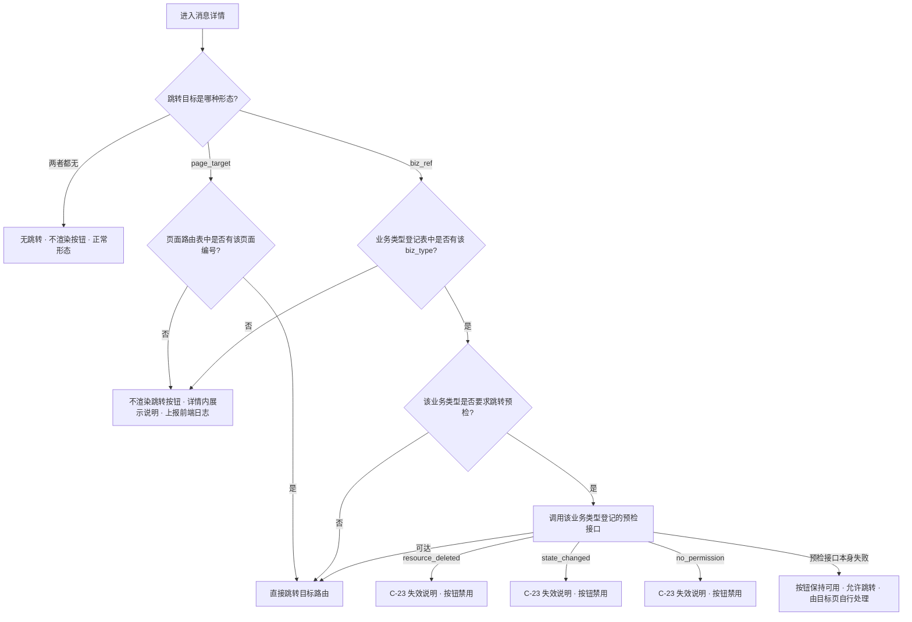
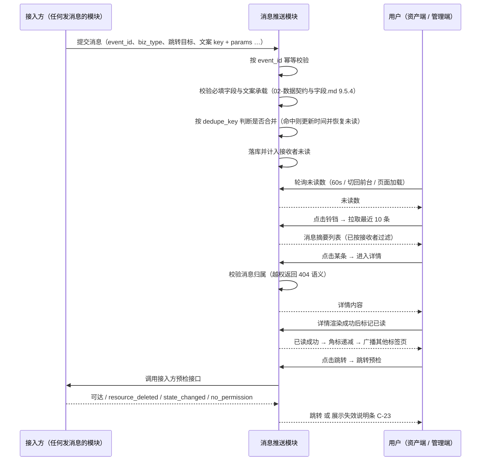
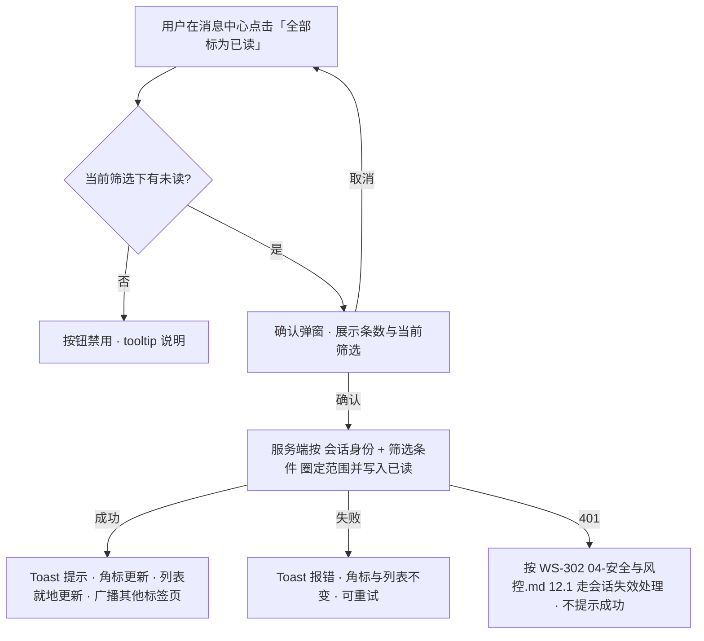
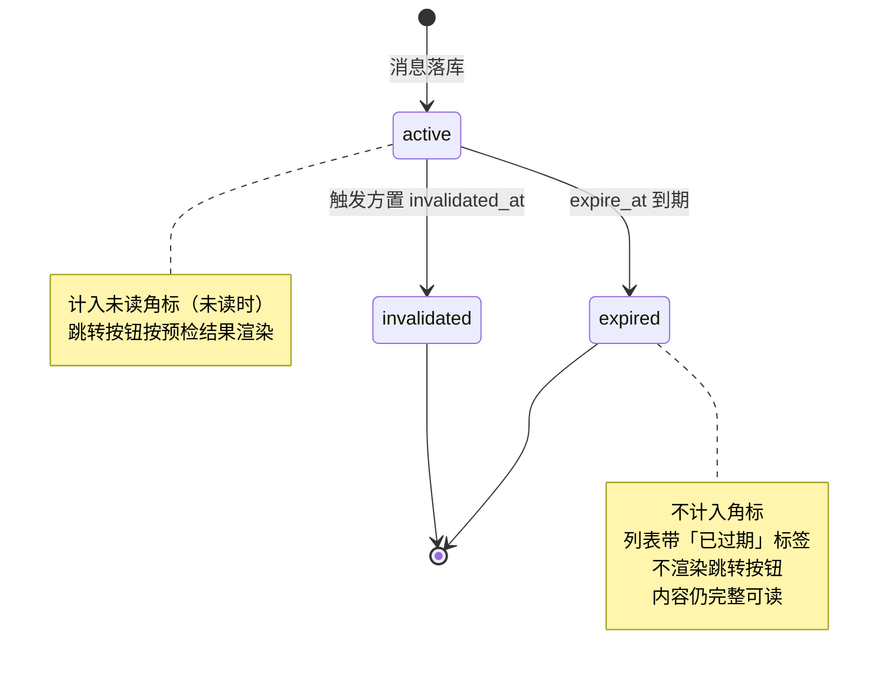
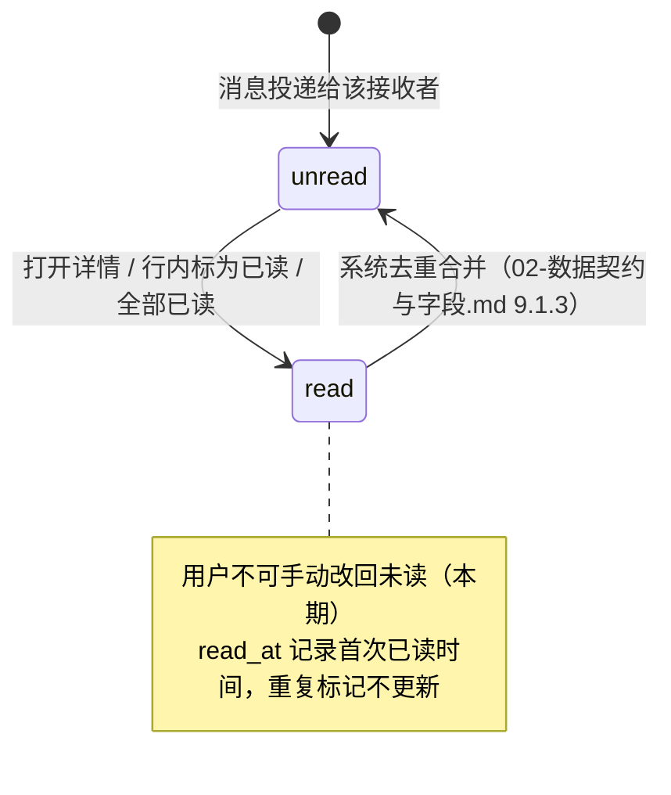

# 平台消息推送能力 PRD · 01 页面与展示

> 本文件是《平台消息推送能力 PRD》的分册。章节号与编号沿用拆分前，未做重排。
> 入口与全文导航见主文档 [`v1.0-消息通知-PRD.md`](./v1.0-消息通知-PRD.md)。

**本文件讲什么**：第 7 章模块详情（两个入口与未读角标、铃铛快捷面板、消息中心列表、消息详情、已读语义、跳转机制、过期与失效、业务办理进度、管理端消息中心、消息的保留与清理）、第 10 章主流程与异常流程、第 11 章状态机、第 12 章页面与字段定义（含中英双语文案对照）。

**本文件不讲什么**：

| 你在找 | 去这里 |
| --- | --- |
| 谁能看到哪些消息、越权校验点 | [`v1.0-消息通知-PRD.md`](./v1.0-消息通知-PRD.md) 第 8 章 |
| 消息字段、业务类型命名、跳转字段约定、多语言承载 | [`02-数据契约与字段.md`](./02-数据契约与字段.md) 第 9 章 |
| 页面清单、组件编号、两个入口的落点 | [`v1.0-消息通知-PRD.md`](./v1.0-消息通知-PRD.md) 5.1、5.2 |
| 验收标准 | [`03-验收标准.md`](./03-验收标准.md) 第 16 章 |
| 通知触发口径、具体消息文案、邮件与站外渠道 | 不在本 PRD 范围内，见主文档 2.3、2.4 |

---

## 7. 模块详情

### 7.1 M1 · 入口与未读角标（F-N01～F-N05）

#### 7.1.1 铃铛与角标的呈现

| 项 | 规则 |
| --- | --- |
| 位置 | 顶部导航栏右侧，**语言切换器 C-04 左侧**、账号下拉 C-11 之前；双端一致 |
| 无未读时 | 铃铛为常规图标，**不展示角标**，不展示 `0` |
| 有未读时 | 铃铛右上角展示角标，数字为未读条数 |
| 上限展示 | 超过 **N-N03（默认 99）** 时展示 `99+`；`99+` 状态下不展示精确数字 |
| 角标形态 | 圆角实心底 + 数字；数字为 1 位时圆形，2 位及以上为胶囊形，不裁切数字 |
| 无障碍 | 铃铛按钮带 `aria-label`（`Notifications, {n} unread` / `通知，{n} 条未读`）；角标数值变化时通过 `aria-live="polite"` 播报，不抢占焦点 |

#### 7.1.2 角标计数口径（强制条款）

未读数由**服务端**计算并返回，前端不自行统计。计数口径：

| 项 | 是否计入未读数 | 理由 |
| --- | --- | --- |
| 当前接收者未读的消息 | ✅ 计入 | 基本口径 |
| 已读的消息 | ❌ 不计入 | — |
| **已过期的消息**（`expire_at` 已到且仍未读） | ❌ **不计入** | 角标表达的是「还有几件事需要你知晓」；已过期的消息已无行动价值，让它持续闪红点只会训练用户忽略角标。消息本身仍在列表中可见并带失效标记，不是被隐藏 |
| 被触发方主动置为失效的消息（`invalidated_at` 有值） | ❌ 不计入 | 同上 |
| 目标资源已删除 / 状态已流转 / 无权限的消息 | ✅ **计入** | 这三种失效是**跳转时才能判定**的动态状态，不能为了算未读数而对每条消息做一次业务预检；且这类消息本身的告知价值仍在（例如「你的申请已被处理」） |
| 其他管理员已读、本管理员未读的管理端消息 | ✅ 计入 | 已读状态个人独立，见 `v1.0-消息通知-PRD.md` 8.2 |

**计数范围**：当前接收者的**可见集**中未读的条数。可见集按 `recipient_scope` 计算（`02-数据契约与字段.md` 9.1.1）——资产端为投递给该 `account_id` 的消息，管理端为共享池消息与该管理员的个人消息之并集；将来的企业维度与广播消息按同一算法自然纳入，**角标逻辑不需要为新的接收方范围改动**。

**角标不区分分类**，是全分类合计——分类维度的未读分布在列表筛选器上体现（见 7.3.2），不做多个角标。

#### 7.1.3 实时性：刷新时机与轮询

本期**不引入长连接推送**，采用轮询 + 事件触发的组合。理由：站内消息以过程性告知为主，不存在秒级时效要求——真正需要即时触达的事件，接入方本就应当同时走自己的站外渠道（归其自持，见主文档 2.4），不该指望站内信兜底。长连接会在管理端与资产端各引入一套连接保活与重连的复杂度，收益不匹配。

| 触发时机 | 行为 |
| --- | --- |
| 页面首次加载 / 路由切换到新页面 | 立即拉取一次未读数 |
| 定时轮询 | 每 **N-N01（默认 60 秒）** 拉取一次未读数（只拉计数，不拉列表） |
| **页面从后台切回前台** | 立即拉取一次，并重置轮询计时器。用户切走一段时间后回来，看到的必须是最新的数 |
| 页面处于后台（不可见） | **暂停轮询**，避免长期挂着的标签页持续打接口 |
| 执行已读操作后 | 前端**乐观更新**角标（本地立即减），同时以服务端下一次返回的数值为准对账；对账不一致时静默以服务端为准，不提示用户 |
| 未读数接口请求失败 | **静默保留上一次的数值**，不弹错误提示、不清零。角标属于辅助信息，为它弹 Toast 是噪音 |

#### 7.1.4 多标签页一致性

同一浏览器打开多个标签页时，任一标签页发生已读变更（单条已读、全部已读），须通过**浏览器本地事件广播**同步给其他标签页，其他标签页立即更新角标与已读态，不必等下一次轮询。该机制与 WS-302 `04-安全与风控.md` 12.1.3 第 6 条的会话失效跨标签页同步机制一致，实现上应复用同一套广播通道。

| 场景 | 期望表现 |
| --- | --- |
| 标签页 A 打开某条消息详情（自动已读） | 标签页 B 的角标立即减 1；B 若正停留在列表页，该条列表项立即变为已读样式 |
| 标签页 A 执行「全部标为已读」 | 标签页 B 的角标立即更新；B 的列表在下次拉取或就地刷新后与 A 一致 |
| 标签页 B 处于后台不可见 | 仍接收广播并更新本地状态，切回前台时不出现「先旧后新」的闪变 |
| 广播机制不可用（浏览器限制 / 隐私模式） | 降级为轮询同步，最长滞后 N-N01（60 秒），不报错 |

---

### 7.2 M1 · 铃铛快捷面板（C-21，F-N03）

| 项 | 规则 |
| --- | --- |
| 展开方式 | 点击铃铛展开，再次点击、点击面板外区域、按 Esc 均收起 |
| 内容范围 | **最近 N-N02（默认 10）条消息**，按创建时间倒序，**不区分已读未读** |
| 为什么不只展示未读 | 用户点铃铛的诉求是「刚才发生了什么」，只展示未读会让刚读过的消息立刻消失，用户想再看一眼时找不到，反而被迫进整页 |
| 单条内容 | 分类标签、标题（单行截断）、摘要（单行截断）、相对时间；未读项左侧带未读圆点 |
| 进度型消息 | 在面板内同样展示节点状态标签（见 7.8.2），但省略业务名称之外的次要信息 |
| 空态 | 面板内展示空态插画位与文案 `No notifications yet / 暂无消息`，底部仍保留「查看全部」 |
| 加载态 | 展开时展示 3 行骨架屏；面板每次展开都重新拉取一次，不用缓存 |
| 失败态 | 面板内展示 `Failed to load. Retry / 加载失败，重试`，点击重试 |
| 底部操作 | 「查看全部 / View all」进入消息中心（P-A18 / P-M20），不带任何筛选条件 |
| **面板内不提供「全部已读」** | 全部已读是影响面广、不可撤销的操作，应在能看清作用范围（当前筛选条件）的消息中心内执行，不放在一个只展示 10 条的浮层里 |
| 已读行为 | 在面板内**仅展开不算已读**；点击某条进入详情后按 7.5 标记已读 |
| 无障碍 | 面板为受控浮层，展开后焦点进入面板，Tab 循环限制在面板内，Esc 关闭并把焦点还给铃铛 |

---

### 7.3 M2 · 消息中心列表（P-A18 / P-M20，F-N06～F-N09）

#### 7.3.1 页面结构（线框级）

```
┌──────────────────────────────────────────────────────────────┐
│ 面包屑：消息中心                                （WS-302 C-10）│
├──────────────────────────────────────────────────────────────┤
│  消息中心                                    [全部标为已读]    │
├──────────────────────────────────────────────────────────────┤
│  [分类：全部 ▾]  [状态：全部 / 未读 / 已读]                    │
├──────────────────────────────────────────────────────────────┤
│  ● [安全] 登录密码已修改                     2 小时前   [标为已读]│
│      你的密码已于 …… 修改，所有设备均已退出登录。               │
├──────────────────────────────────────────────────────────────┤
│    [认证与合规] 企业认证已通过                2026-09-06        │
│      你的企业认证已通过审核。                                  │
├──────────────────────────────────────────────────────────────┤
│  ● [业务办理进度] 实名认证 · 审核中           2026-09-05        │
│      当前节点：材料复核                                        │
├──────────────────────────────────────────────────────────────┤
│                     [ 加载更多 ]                              │
└──────────────────────────────────────────────────────────────┘
```

#### 7.3.2 筛选

| 筛选器 | 取值 | 规则 |
| --- | --- | --- |
| **分类筛选** | 「全部」+ **当前接收者实际拥有消息的分类**（由服务端返回，不写死） | 选项由 `02-数据契约与字段.md` 第 9 章的业务类型契约驱动动态渲染；接入新分类不需要改前端。**只渲染该接收者名下已有消息的分类**——给一个从没收到过进度消息的用户展示「业务办理进度」筛选项，点进去只会是空结果 |
| 分类选项文案 | 取分类的多语言展示名（契约字段 `category_label_key`），按当前语言渲染 | 缺失翻译时按 WS-302 `02-页面字段与双语文案.md` 13.7 回落英文，不展示键名 |
| **状态筛选** | 全部 / 未读 / 已读，单选，默认「全部」 | 与分类筛选**可叠加**，两者是与关系 |
| 筛选后的 URL | 筛选条件写入 URL 查询参数 | 支持刷新保持、支持把某个筛选态的链接分享给自己的另一台设备 |
| 筛选变化时 | 重置到第一页 / 重新从头加载，滚动位置回到顶部 | — |
| 管理端差异 | 分类固定为管理端消息池的分类集合（同样由服务端返回），其余规则一致 | — |

#### 7.3.3 排序（强制条款）

| 项 | 规则 |
| --- | --- |
| 排序字段 | **消息创建时间（`created_at`）倒序**，最新在最上 |
| 已读状态是否参与排序 | **不参与**。未读不置顶、已读不沉底 |
| 为什么不把未读置顶 | 若未读参与排序，用户在列表里读完一条消息后该行会立刻跳位，正在阅读的上下文被打乱，是明确的体验损伤。用户需要「只看未读」时，用状态筛选器即可，那是显式的、可预期的 |
| 同一时间戳 | 以消息 ID 作为稳定次级排序键，保证分页不重复、不漏项 |
| 分类之间 | 不做分类分组，不做优先级排序 |

#### 7.3.4 分页

| 端 | 形态 | 参数 |
| --- | --- | --- |
| 资产端 P-A18 | **「加载更多」按钮**（非无限滚动） | 每页 **N-N04（默认 20）** 条 |
| 管理端 P-M20 | **分页器**（页码 + 每页条数切换） | 每页默认 20，可选 20 / 50 / 100 |

- 资产端选择「加载更多」而不是无限滚动：消息列表存在「读到某条后点进详情再返回」的高频往返，无限滚动在返回时的位置恢复不可靠，且没有页脚可用作操作落点。选择按钮式加载更多而不是分页器：资产端消息的浏览行为是「从新往旧扫一遍」，分页器会强迫用户记住自己看到第几页。
- 管理端沿用分页器：与 WS-301 协议列表等管理端列表形态保持一致，管理端存在「跳到某一页复查」的诉求。
- **分页游标必须基于 `created_at + message_id` 的稳定游标**，不使用 offset。理由：列表期间可能有新消息插入顶部，offset 分页会导致翻页时重复或漏项。

#### 7.3.5 空态、加载态与失败态

| 状态 | 触发条件 | 展示 | 可用操作 |
| --- | --- | --- | --- |
| **首次空态** | 无任何筛选条件且结果为 0 | 插画位 + `No notifications yet / 暂无消息` + 副文案 `Notifications about your account and business will appear here. / 与你的账户和业务相关的消息会显示在这里。` | 无额外操作 |
| **筛选空态** | 有筛选条件且结果为 0 | `No messages match these filters / 没有符合筛选条件的消息` | **「清除筛选 / Clear filters」**按钮，点击后回到无筛选状态 |
| 首屏加载态 | 首次请求进行中 | 5 行骨架屏（保持与列表项相同高度，避免加载完成后的跳动） | 无 |
| 加载更多进行中 | 点击加载更多后 | 按钮变为加载中态并禁用，已加载内容保持不动 | 无 |
| **首屏失败** | 首次请求失败 | 内容区错误态：`Failed to load notifications / 消息加载失败` + 原因（网络 / 服务异常） | 「重试 / Retry」 |
| **加载更多失败** | 分页请求失败 | 底部错误条，**已加载内容不清空** | 「重试 / Retry」 |
| 部分渲染失败 | 单条消息内容异常（如文案模板 key 缺失） | 该行降级为「标题 + 时间」的最小形态，不影响其他行，见 `02-数据契约与字段.md` 9.5.4 | 可正常进入详情 |

- 两种空态必须区分：首次空态是「一切正常，只是还没有消息」，筛选空态是「你把结果筛没了，可以退回去」。用同一套文案会让用户以为消息全丢了。

---

### 7.4 M4 · 消息详情（P-A19 / P-M21，F-N12、F-N13）

#### 7.4.1 详情的形态选择

**结论：整页，独立路由，支持深链。** 不采用抽屉或弹窗。

理由：① 消息详情是深链的落点——邮件、其他消息、外部渠道都可能直接指向某条消息，抽屉形态在直接打开时没有「背后的列表」可依附，刷新与回退行为割裂；② 详情内可能包含较长的正文与业务上下文（尤其进度类），抽屉宽度受限；③ 与 WS-302 的形态口径一致——弹窗只用于「在当前页内完成一个短流程」（如 P-A12 修改邮箱），详情浏览用整页。

#### 7.4.2 详情内容结构

| 区块 | 内容 | 规则 |
| --- | --- | --- |
| 面包屑 | `消息中心 / {消息标题}` | 遵循 WS-302 C-10，上级可点击返回列表 |
| 头部 | 分类标签、消息标题 | 标题过长时换行不截断 |
| 元信息行 | 创建时间（绝对时间 + 时区标注）、业务名称（进度类消息） | 时间格式遵循 WS-302 `02-页面字段与双语文案.md` 13.4；详情页**一律用绝对时间**，不用相对时间 |
| 进度区块 | 仅进度类消息：业务名称、当前节点、节点状态标签 | 见 7.8.3 |
| 正文 | 渲染后的消息正文 | 纯文本 + 有限的换行与强调；**不支持富文本 / HTML 注入**，见 `v1.0-消息通知-PRD.md` 13.2 |
| 失效说明条（C-23） | 消息失效时展示，说明失效原因 | 四种原因四套文案，见 7.7 |
| 主操作 | 跳转按钮（有 `biz_ref` 且映射存在时） | 文案由业务类型登记表提供（`cta_label_key`），缺省为「查看详情 / View details」 |
| 次操作 | 「返回列表 / Back to list」 | — |

#### 7.4.3 进入详情即已读

**结论：打开详情即标记为已读**，不需要用户再点一次「标记已读」。理由与冲突处理见 7.5.1。

| 项 | 规则 |
| --- | --- |
| 标记时机 | 详情内容**请求成功并渲染之后**发起已读请求，不在路由进入时就发 |
| 为什么不在进入路由时标记 | 若详情加载失败（网络异常、消息不存在），用户实际上没有看到内容，此时标记已读会让这条消息从未读里消失且用户毫不知情 |
| 已读请求失败 | **不阻断详情展示**，不弹错误；下次进入或下次同步时重试标记。已读是可最终一致的状态，为它打断阅读不值得 |
| 已读的幂等性 | 重复标记同一条消息为已读不报错、不改变 `read_at`（保留首次已读时间） |

#### 7.4.4 返回列表的状态同步

| 项 | 规则 |
| --- | --- |
| 返回方式 | 面包屑上级、「返回列表」按钮、浏览器后退，三者行为一致 |
| 筛选条件 | **保留进入详情前的筛选条件**（从 URL 查询参数恢复） |
| 滚动位置 | **恢复到进入详情前的滚动位置**，不回到顶部 |
| 已加载页数 | 恢复到进入详情前已加载的页数，不重新只加载第一页 |
| 已读状态 | 刚读过的那条列表项**就地变为已读样式**（未读圆点消失、标题字重回落），**不重排、不从列表中移除** |
| 「只看未读」筛选下返回 | 刚读过的消息**仍留在列表中**并显示为已读样式，直到用户主动刷新或切换筛选才消失 |
| 为什么不立即移除 | 用户在「只看未读」下读完一条返回，若该行立刻消失，下面的行会整体上移，用户接下来点的那一行很可能不是他想点的那条。保留到下次刷新是更安全的行为 |
| 角标 | 返回时角标已反映已读结果（乐观更新已在详情页发生） |

---

### 7.5 M3 · 已读语义（F-N10、F-N11）

#### 7.5.1 单条已读的触发方式

**结论：以「打开详情即已读」为主，同时在列表行内提供显式的「标为已读」操作。两者并存，不是二选一。**

| 触发方式 | 是否标记已读 | 说明 |
| --- | --- | --- |
| 在列表中点击整行 → 进入详情 | ✅ 已读 | 主路径 |
| 在铃铛面板中点击某条 → 进入详情 | ✅ 已读 | 与列表一致 |
| 在铃铛面板 / 列表中**仅展开、仅滚动经过** | ❌ 不已读 | 诊断简报 8.2 明确要求：仅展开列表不自动批量已读 |
| 列表行悬浮出现的「标为已读」按钮 | ✅ 已读 | 不进入详情，就地标记 |
| 在详情页点击跳转按钮直接跳到业务页 | ✅ 已读（详情打开时已标记） | — |
| **在铃铛面板内直接点击跳转**（若面板提供该快捷操作） | ✅ 已读 | 消息已被消费，未读语义已完成 |
| 手动标记为未读 | ❌ 本期不提供 | 见 D-N08；系统侧的去重合并可恢复未读，属系统行为 |

**理由**：
- 只做「显式点击才算已读」会让未读数长期虚高——用户读完内容后不会再回头点一次按钮，未读数最终失去参考价值，角标变成永远的红点。
- 只做「进详情才算已读」则无法处理「我看标题就知道是什么事，不想点开」的情况，这类消息会永久堆在未读里。
- 因此两者并存：默认路径零操作，同时给用户一个不打开也能清掉的出口。

#### 7.5.2 全部已读的作用范围

**结论：作用于「当前筛选条件命中的全部消息」，不限于当前页，也不是全库无差别。**

| 场景 | 「全部标为已读」的实际作用范围 | 按钮文案 |
| --- | --- | --- |
| 无任何筛选 | 该接收者名下**全部**未读消息 | `Mark all as read / 全部标为已读` |
| 分类筛选 = 安全 | **仅**「安全」分类下的未读消息 | `Mark all as read / 全部标为已读`，确认弹窗内说明范围 |
| 状态筛选 = 未读 | 与无筛选时等价（已读的本来就不需要标） | 同上 |
| 分类 + 状态叠加 | 两个条件同时命中的未读消息 | 同上 |
| 当前只加载了 20 条，实际有 300 条命中 | **300 条全部标记**，不是只标记已加载的 20 条 | — |

**理由**：用户在筛选态下点「全部已读」，心理预期是「把我眼前这一堆清掉」。若无视筛选直接清空全库，会把用户特意留着未读的另一类消息（例如他打算稍后处理的认证驳回）一并清掉，且**不可撤销**。反过来，若只标记「当前已加载的 20 条」，用户点一次发现角标只减了 20，必须反复点，同样不符合预期。

| 交互项 | 规则 |
| --- | --- |
| 按钮位置 | 消息中心页头右侧；铃铛面板内不提供（见 7.2） |
| 按钮禁用条件 | 当前筛选条件下**没有未读消息**时禁用，并 tooltip 说明 `No unread messages / 没有未读消息` |
| **二次确认** | 必须。确认弹窗需**明确说明作用范围与条数**：`Mark {n} notifications as read? / 将 {n} 条消息标为已读？`；有筛选条件时追加一行说明当前筛选，例如 `Filter: Security · Unread / 当前筛选：安全 · 未读` |
| 为什么要确认 | 该操作影响面广且**本期不可撤销**（无「标为未读」），一次误点无法回退 |
| 执行反馈 | 成功后 Toast（WS-302 C-12）：`{n} notifications marked as read / 已将 {n} 条消息标为已读`；角标与列表立即更新 |
| 执行失败 | Toast 报错，**列表与角标不做任何变更**（不做乐观更新），用户可重试 |
| 并发一致性 | 以服务端执行时刻的筛选结果为准；执行期间新到达的消息不被标记，保持未读 |

#### 7.5.3 已读后的即时反馈

| 位置 | 反馈 |
| --- | --- |
| 角标 | 立即递减（乐观更新），以下一次服务端返回对账 |
| 列表项 | 未读圆点消失；标题字重由加粗回落为常规；**行位置不变、不移除** |
| 铃铛面板 | 若面板同时开着，同步更新 |
| 其他标签页 | 通过本地事件广播同步，见 7.1.4 |
| 服务端失败时 | 回滚本地的乐观更新，角标与列表恢复原状，Toast 提示失败 |

#### 7.5.4 已读状态的唯一性

已读状态存储在服务端，按「接收者 + 消息」唯一。两个入口（铃铛面板、消息中心）、两个页面（列表、详情）读取的是同一份已读状态，不存在各自维护的本地已读。**这是本模块合并两个入口的根本原因**，实现上不得为快捷面板另建一套已读缓存。

> **例外：系统可将已读消息恢复为未读。** 按 `02-数据契约与字段.md` 9.1.3 的去重规则——`dedupe_key` 命中时消息合并为一条并更新时间；若该条此前已被读过，**恢复为未读**，因为它承载的是一次新发生的事件。实现上：接收到命中消息时清除其已读记录并更新 `created_at`，该消息重新回到列表顶部并计入角标。

---

### 7.6 M5 · 跳转机制（F-N14）

> 本节定义的是**跳转契约**，不是「每类消息跳哪」。每类消息的具体目标由各业务需求在业务类型登记表（`02-数据契约与字段.md` 9.4.3）中补齐。

#### 7.6.1 跳转的构成

跳转目标有**三种合法形态**，一条消息只能是其中之一：

| # | 形态 | 携带字段 | 落地方式 | 典型来源 |
| --- | --- | --- | --- | --- |
| 1 | **业务资源目标** | `biz_type` + `biz_ref`（`resource_type` + `resource_id`） | 按 `biz_type` 查前端业务类型登记表得到路由模板，用 `resource_id` 填充参数 | 认证驳回、业务进度更新等指向某一条具体记录的消息 |
| 2 | **静态页面目标** | `biz_type` + `page_target`（页面编号，如 `P-A11`） | 按页面编号查**页面路由表**直达该页面，**不需要资源参数、不需要预检** | WS-302 的账户与安全类站内信——其 `05-消息通知与邮件模板.md` 12.5.2 定义的跳转目标全部是页面编号（`P-A11` / `P-A17` / `P-M05`） |
| 3 | **无跳转** | 两者都不填 | 详情页不渲染跳转按钮，这是**正常形态而非缺失** | 纯告知类消息 |

> **形态 2 的由来。** 本契约首版只定义了「业务资源目标」，而 WS-302 的站内信**没有一条指向业务资源**——它们全部指向账户设置这类静态页面。若不承认这一形态，它的每条消息都会走「映射缺失」的降级路径，跳转按钮全部消失，这显然不是设计意图。（WS-302 精简后现存 3 条站内信，跳转目标均为 `P-A11`，结论不变。）
>
> 静态页面目标不需要预检：页面本身恒久存在，不存在「被删除」「状态已流转」的可能。若某静态页面因权限不可达（例如管理端页面被资产端消息引用），属于接入错误，在 9.4.3 的登记环节拦截。

**三种形态共同的强制约定：消息实体中不存放 URL。** URL 会随前端路由重构失效，而历史消息不可能回头批量改写。消息只存结构化的业务类型、资源标识或页面编号，落地路径由前端在展示时解析。该口径与诊断简报 8.2 的建议一致。

**优先级**：`biz_ref` 存在时按形态 1 处理；否则 `page_target` 存在时按形态 2；两者都无则为形态 3。两者同时存在属于接入错误，服务端在接收时拒绝（见 `02-数据契约与字段.md` 9.5.4 的同类处理）。

#### 7.6.2 跳转执行流程



- **静态页面目标（形态 2）一律不预检**，直接跳转。
- **业务资源目标（形态 1）的预检是否必需，由业务类型登记表声明**。跳转到一个可能已被处理掉的审核单需要预检。默认值为「需要预检」，业务方可显式声明为不需要。
- **预检接口失败时放行**：预检本身的可用性不应成为跳转的门槛。此时跳转到目标页，由目标页按自己的规则处理不存在或无权限（这是目标页本来就必须具备的能力）。
- 预检应在**进入详情页时**执行一次（而非点击时才执行），使失效状态能在按钮上提前体现，避免用户点了才被告知。列表页**不做预检**（会对每行触发一次业务查询，成本不可接受）。

#### 7.6.3 映射缺失时的降级表现（强制条款）

映射缺失指：消息携带了 `biz_type`，但当前前端版本的业务类型登记表中没有对应条目。这在灰度期与多端版本不一致时必然发生（服务端已开始发新类型消息，某些客户端还是旧版本）。

| 位置 | 降级表现 |
| --- | --- |
| **详情页** | **不渲染跳转按钮**（既不展示可点的、也不展示置灰的按钮）；正文正常展示；正文下方以次要文案说明 `This notification has no available action in the current version. / 当前版本暂不支持该消息的跳转操作。` |
| **列表页 / 铃铛面板** | 正常展示该条消息，点击正常进入详情。列表项不因映射缺失而隐藏或置灰 |
| 分类筛选 | 该消息仍归入其 `category`，不因映射缺失而被过滤掉 |
| 日志 | 前端上报一次「未知业务类型」事件（含 `biz_type`），用于发现登记遗漏 |
| 禁止的做法 | ❌ 跳到 404 页；❌ 跳到首页；❌ 展示一个点了没反应的按钮；❌ 隐藏整条消息 |

> **消息内容本身永远优先于跳转能力。** 即使跳不过去，用户也应能读到「发生了什么」——跳转是增强，不是消息的存在前提。

#### 7.6.4 「无跳转」是合法状态，不是缺失

一条既无 `biz_ref` 也无 `page_target` 的消息是**完全合法**的，展示层按正常消息渲染，只是详情页不出现跳转按钮，**也不展示任何「暂不支持跳转」之类的说明文案**——那句说明只用于 7.6.3 的映射缺失（那是异常），用在这里会让用户以为系统出了问题。

| 情形 | 是否合法 | 详情页表现 |
| --- | --- | --- |
| 无跳转目标（形态 3） | ✅ 合法 | 不渲染按钮，无任何额外说明 |
| 有 `biz_type` 但映射表缺失（7.6.3） | ❌ 接入 / 版本异常 | 不渲染按钮 + 说明文案 + 上报日志 |
| 有目标但已失效（7.7 第 2～4 类） | ✅ 业务正常状态 | 按钮禁用 + C-23 失效说明条 |

> WS-302 现存的 3 条站内信全部带页面目标（均为 `P-A11`）；其 `05-消息通知与邮件模板.md` 12.5.2 里标为「跳转：无」的 E-09、E-11 只走邮件、不产出站内信，因此在本模块内不存在。但后续接入方仍可能产出无跳转的站内信，本节的口径为此保留。

---

### 7.7 M5 · 过期 / 失效消息（F-N14）

失效分四类，判定时机与落地表现各不相同。**不使用一句笼统的「该消息已失效」**。

| # | 失效类型 | 判定方式 | 判定时机 | 列表表现 | 详情表现 | 点击表现 |
| --- | --- | --- | --- | --- | --- | --- |
| 1 | **已过期** `expired` | 消息自带 `expire_at`，服务端返回时标记 | 列表与详情均可判定 | 列表项整体降低视觉权重（正文与时间转为次级色），标题右侧带 `Expired / 已过期` 标签；**不计入未读角标** | C-23 说明条：`This notification has expired. / 该消息已过期。` | 跳转按钮**不渲染** |
| 2 | **目标资源已删除** `resource_deleted` | 跳转预检返回 | 仅进入详情时判定 | 列表**无特殊表现**（未做预检） | C-23 说明条：`The related record is no longer available. / 相关记录已不存在。` | 跳转按钮**禁用**，hover tooltip 说明原因 |
| 3 | **状态已流转、不可再操作** `state_changed` | 跳转预检返回 | 仅进入详情时判定 | 列表无特殊表现 | C-23 说明条：`This has already been handled — no action is needed. / 该业务状态已变更，无需再处理。` 预检可附带**当前状态描述**（由业务方提供），一并展示 | 跳转按钮**禁用**，hover tooltip 说明原因 |
| 4 | **当前账户无权限** `no_permission` | 跳转预检返回 | 仅进入详情时判定 | 列表无特殊表现 | C-23 说明条：`You no longer have access to this record. / 你当前无权访问该记录。` | 跳转按钮**禁用** |

**三条共同规则**：

1. **失效不删除消息、不隐藏内容**。四种情况下，消息的标题、正文、时间都必须完整展示——用户仍有权知道当时发生过什么。失效只影响「能不能跳过去」。
2. **禁用而不是隐藏**（第 2～4 类）。跳转按钮以禁用态保留，并通过 tooltip 说明原因。理由：若直接隐藏按钮，用户会以为这条消息本来就没有跳转，无法区分「本来就没有」与「有但现在不能用」——前者不需要解释，后者需要。
   与之相对，**映射缺失（7.6.3）是不渲染按钮**：那种情况下问题出在客户端版本，与这条消息本身的状态无关，展示一个禁用按钮只会让用户以为业务出了问题。
3. **失效说明条 C-23 的形态统一**：详情页正文上方的浅底说明条，左侧信息图标，纯文本，不可关闭，不使用错误红色（失效是正常的业务状态，不是错误）。

**无权限（第 4 类）的补充口径**：这里的「无权限」指**跳转目标资源的业务权限**（例如企业上下文变更后无法再访问某条企业记录），**不是消息本身的归属权限**。消息本身的归属越权在服务端就已被拦截（见 `v1.0-消息通知-PRD.md` 8.1.2），用户根本拿不到别人的消息，不会走到这一步。

---

### 7.8 M6 · 业务办理进度消息（资产端，F-N15、F-N16）

> **本节只定义展示层如何承载进度类消息，不定义有哪些业务节点、也不定义推送时机**——那由各业务需求定义。

#### 7.8.1 定位

「业务办理进度」是资产端的一个**独立消息分类**（`category = business_progress`），与安全、账户、认证与合规、系统公告并列。它的特殊之处在于：消息本身携带**结构化的进度信息**（业务名称、当前节点、节点状态），展示层因此可以给出比通用消息更有信息量的形态，而不是让用户点进去读一段文字才知道办到哪一步。

**本期覆盖范围（已定稿）**：本期只接入 **WS-303 的实名认证审核进度**一条业务线。链融主业务（融资申请、放款等）的进度消息，等对应业务需求定义了自己的节点与推送时机后，按 `02-数据契约与字段.md` 第 9 章契约直接接入——**本模块届时不需要任何改动**，这正是把进度信息结构化进契约（`02-数据契约与字段.md` 9.6）而不是写死认证专用字段的原因。展示层不因本期只有一条业务线而做任何简化：分类筛选、进度型列表项、节点状态标签全部按通用形态实现。

#### 7.8.2 列表中的进度型列表项（C-22 进度变体）

```
┌──────────────────────────────────────────────────────────────┐
│ ● [业务办理进度]  实名认证                    2026-09-05 14:30 │
│   当前节点：材料复核            [审核中]                        │
│   我们正在复核你提交的材料，预计 1-2 个工作日。                  │
└──────────────────────────────────────────────────────────────┘
```

| 元素 | 取值来源（契约字段） | 规则 |
| --- | --- | --- |
| 分类标签 | `category` | 固定为「业务办理进度 / Business progress」 |
| **业务名称** | `progress.biz_name_key` | 作为列表项的**标题位**展示，例如「实名认证」「融资申请 FA-20260905-001」。业务名称由触发方提供，展示层不拼接 |
| **当前节点** | `progress.node_key` | 以「当前节点：{节点名}」的形式展示在标题下方 |
| **节点状态标签** | `progress.node_status` | 四态枚举，映射四种视觉，见下表 |
| 更新时间 | `created_at` | 24 小时内相对时间，超过则绝对时间（遵循 WS-302 `02-页面字段与双语文案.md` 13.4） |
| 摘要 | 正文渲染后截断 | 单行截断 |
| 未读圆点 | 已读状态 | 与通用列表项一致 |

**节点状态标签（`node_status`）的四态**：

| 枚举值 | 中文 / English | 视觉 | 语义 |
| --- | --- | --- | --- |
| `in_progress` | 处理中 / In progress | 中性色（蓝/灰） | 平台侧正在处理，用户无需动作 |
| `action_required` | 待你处理 / Action required | 警示色（橙） | **需要用户做点什么**（补件、确认、签署） |
| `succeeded` | 已完成 / Completed | 成功色（绿） | 该节点或整笔业务已完成 |
| `failed` | 未通过 / Not approved | 失败色（红） | 该节点未通过或业务终止 |

- 四态是**封闭枚举**，由本契约定义，业务方只能从中选取，不得自行扩展。理由：状态标签是展示层的视觉语言，若开放扩展，不同业务线会各造一套颜色语义，用户无法建立一致的认知（「橙色=要我动手」这条心智一旦被破坏就不再可信）。业务侧真实的节点名称由 `node_key` 自由承载，颗粒度不受此限制。
- 状态**不以颜色为唯一提示**，标签始终带文本（WS-301 12.5 可访问性基线的同一要求）。

#### 7.8.3 详情中的进度区块

进度类消息在详情页的正文之上增加一个进度区块：

| 元素 | 规则 |
| --- | --- |
| 业务名称 | 作为详情页标题（替代通用消息的 `title`） |
| 业务标识 | 若 `biz_ref.resource_id` 有对外可展示的业务编号（由触发方通过 `progress.biz_no` 提供），展示在标题下方，支持复制 |
| 当前节点 + 状态标签 | 单行展示，标签形态与列表一致 |
| 更新时间 | 绝对时间 + 时区标注 |
| 正文 | 该次更新的说明文字 |
| 跳转 | 跳到该笔业务的详情页，按 7.6 的契约执行；按钮文案默认「查看业务详情 / View business details」 |
| **不做完整进度条 / 步骤条** | 见 7.8.5 |

#### 7.8.4 同一笔业务多次更新的表现

**结论：每次进度更新在列表中是一条独立消息，不做同业务合并。**

| 方案 | 取舍 |
| --- | --- |
| ✅ **每次一条（采用）** | 时间线完整可回溯；已读语义清晰（每次更新各自独立已读）；实现简单，不需要跨消息的更新逻辑 |
| ❌ 同一业务合并为一条、原地更新 | ① 丢失中间节点的历史——用户看不到「什么时候进的复核、什么时候被驳回」；② 已读语义混乱——一条已读的消息因为新更新又变未读，用户在列表里看到的还是同一行，很容易被忽略；③ 合并需要判断「什么算同一笔业务的同一条线」，而展示层没有业务节点的顺序知识（节点定义在各业务需求里），无法安全判定 |

**配套规则**：

| 项 | 规则 |
| --- | --- |
| 排序 | 与通用消息一致，按 `created_at` 倒序，同一业务的多条消息自然按时间相邻或分散 |
| 未读 | 每条独立计入未读；读了最新一条不会自动把旧的几条标为已读 |
| 重复推送的去重 | 由 `dedupe_key` 机制处理（构造规范见 `02-数据契约与字段.md` 9.1.3）——**去重针对的是「同一事件被重复触发」，不是「同一业务的不同节点」** |
| **进度类消息的 `dedupe_key` 硬约束** | 进度类消息的 `dedupe_key` **必须同时包含业务标识与节点标识**（建议形如 `{biz_type}:{resource_id}:{node_key}`）。**本模块只以 `dedupe_key` 为唯一去重依据，不会自行按「事件类型 + 时间窗」推导去重键**——若触发方对同一业务的不同节点复用同一个 key，第二个节点的更新会把第一条就地覆盖，用户会永久丢失中间进度。这一条与「每次一条不合并」不冲突：不合并说的是不同节点，去重说的是同一节点被重复推送（例如触发方重试） |
| 频次控制 | 属于触发方的责任（推送时机由业务需求定义）。本模块不做「同一业务每天最多 N 条」这类限流，那会静默丢弃业务方认为必要的通知 |

#### 7.8.5 本期不做的进度能力

| 不做的能力 | 理由 |
| --- | --- |
| 完整进度条 / 步骤条（展示全部节点与已完成节点） | 需要业务方提供**全量节点定义与顺序**，而本轮明确不定义业务节点。等业务需求定义了节点模型，这属于业务详情页的能力，不是消息模块的 |
| 同一业务的消息聚合视图（点进去看这笔业务的全部消息） | 依赖业务侧的业务详情页，跳过去看业务详情本身就能得到更完整的信息，在消息模块内再造一个聚合视图是重复建设 |
| 进度类消息的单独角标 / 单独入口 | 角标不分分类（见 7.1.2），分类维度通过列表筛选表达 |

---

### 7.9 M7 · 管理端消息中心（P-M20 / P-M21，F-N17）

管理端与资产端**同构**，只在以下几点存在差异：

| 项 | 资产端 | 管理端 | 说明 |
| --- | --- | --- | --- |
| 消息归属 | 按 `account_id` 严格隔离 | **共享池为主**（`admin_all`）+ **个人消息**（`admin_account`，只对本人可见） | 见 `v1.0-消息通知-PRD.md` 8.2；列表返回两者并集，混排不分区 |
| 已读状态 | 按账户 | **按管理员账号个人独立** | 见 `v1.0-消息通知-PRD.md` 8.2.2 |
| 入口 | 铃铛 + 账号下拉 | 铃铛 + 账号下拉（WS-302 P-M05 所在的同一个下拉） | 一致 |
| 列表分页 | 加载更多 | **分页器** | 见 7.3.4 |
| 进度类消息 | 有（业务办理进度） | **本期无** | 进度类消息面向业务办理方（资产端用户）。管理端的对应形态是「审核待办」，其分类与触发由 WS-303 等需求定义 |
| 分类集合 | 由资产端消息的分类构成 | 由管理端消息的分类构成 | 两端的分类集合互相独立，同一个 `category` 值不跨端复用 |
| 全部已读 | 有 | 有，作用范围口径相同 | 只影响当前管理员自己的已读状态 |
| 失效表现 | 四类失效口径相同 | 相同 | — |

> **管理端消息不与资产端消息混池**：一条消息通过 `end` 字段明确归属某一端，管理端接口只返回 `end = admin` 的消息，资产端只返回 `end = asset`。不存在「一条消息同时投递到两端」的形态——需要两端都知晓的事件，由触发方产出两条消息。

---

### 7.10 消息的保留与清理（本期口径）

**结论：本期不设保留期、不做自动清理，消息长期保留。**（用户 2026-09-08 批复，原 Q-N02）

| 项 | 本期口径 |
| --- | --- |
| 保留期 | 无上限，消息不因时间流逝被删除或隐藏 |
| 自动清理 / 归档 | 不做 |
| 用户手动删除 | 不提供（D-N09） |
| 已过期消息（`expire_at` 已到） | **仍然保留并可在列表中查到**，只是不计入未读角标、带「已过期」标签。过期只影响角标与跳转，不影响留存 |
| 已读消息 | 与未读同等保留 |

**这样定的理由**：安全与合规类消息是用户事后回查「我的账户什么时候发生过什么」的唯一站内通道（WS-302 `05-消息通知与邮件模板.md` 12.5.4 第①条正是把站内信当作可回查记录来设计的），设一个保留期就等于给这条记录设了个静默的失效日期。在本期还没有通知偏好中心、没有按分类退订能力的前提下，清理与删除都会变成用户逃避通知的出口，掩盖「消息过载」这个真正该解决的问题。

**代价与监控**：消息量长期累积会推高列表与未读数的查询成本（风险 15.2 第 5 项）。因此本期虽不清理，但要求：① 分页游标与索引按 `v1.0-消息通知-PRD.md` 13.1 的性能目标设计；② 持续监控列表与未读数接口的响应时间；③ 当性能指标出现退化趋势时，再由需求方决定保留期策略——**届时的默认建议是「保留 365 天后归档、安全与合规类不参与」**，归档指不在列表默认展示但可通过筛选查到，仍然不是物理删除。

---

---

## 10. 主流程与异常流程

### 10.1 消息从产生到被消费（主流程）



### 10.2 全部已读（主流程）



### 10.3 异常流程总表

| # | 异常场景 | 表现 | 用户可做什么 |
| --- | --- | --- | --- |
| 1 | 列表首屏请求失败 | 内容区错误态 + 重试按钮 | 重试 |
| 2 | 加载更多失败 | 底部错误条，已加载内容保留 | 重试 |
| 3 | 未读数接口失败 | **静默**保留上次数值，无提示 | 无需操作 |
| 4 | 详情请求失败 | 详情页错误态 + 重试；**不标记已读** | 重试 / 返回列表 |
| 5 | 详情返回 404（不存在或越权） | 「消息不存在」页 + 返回消息中心 | 返回列表 |
| 6 | 标记已读失败 | 不打断阅读，不弹错；下次进入时重试 | 无需操作 |
| 7 | 全部已读失败 | Toast 报错，状态不变 | 重试 |
| 8 | 跳转映射缺失 | 不渲染跳转按钮 + 说明文案（7.6.3） | 阅读消息内容 |
| 9 | 跳转预检返回失效（三类） | C-23 说明条 + 按钮禁用（7.7） | 阅读消息内容 |
| 10 | 跳转预检接口本身失败 | 按钮保持可用，放行跳转，由目标页处理 | 正常跳转 |
| 11 | 文案模板 key 缺失 | 降级为最小形态，不展示键名（`02-数据契约与字段.md` 9.5.4） | 仍可打开详情 |
| 12 | `category` 未登记 | 分类标签展示「其他 / Other」，消息正常展示 | 正常阅读 |
| 13 | 会话在消息模块内过期 | 走 WS-302 `04-安全与风控.md` 12.1.3 统一处理 | 重新登录后回跳 |
| 14 | 多标签页广播不可用 | 降级为轮询同步（最长滞后 60 秒） | 无感知 |
| 15 | 触发方提交的消息缺必填字段 | 服务端拒收并返回明确错误给触发方；**不产生半成品消息** | 用户无感知 |
| 16 | 同一 `event_id` 重复提交 | 丢弃，不产生第二条 | 用户无感知 |

---

## 11. 状态机

### 11.1 消息的可用性状态



> 「目标资源已删除 / 状态已流转 / 无权限」**不是消息的状态**，而是**跳转预检的实时结果**，不落在消息实体上。理由：这三者是业务侧的动态状态，会随时间变化（一条今天不可操作的记录，明天可能因为业务重开而再次可操作），把它固化到消息上会产生永久性的错误标记。

### 11.2 单个接收者对单条消息的已读状态



---

## 12. 页面与字段定义

### 12.1 列表项展示字段

| 字段 | 通用型列表项 | 进度型列表项 | 取值 |
| --- | --- | --- | --- |
| 未读圆点 | ✅ | ✅ | 未读时展示 |
| 分类标签 | ✅ | ✅ | `category` 的展示名 |
| 标题 | ✅ 消息标题 | ✅ **业务名称** | 单行截断 |
| 副行 | — | ✅ 当前节点 + 状态标签 | 见 7.8.2 |
| 摘要 | ✅ | ✅ | 单行截断 |
| 时间 | ✅ | ✅ | 24 小时内相对时间，超过则绝对时间 |
| 「已过期」标签 | ✅ 条件展示 | ✅ 条件展示 | `expire_at` 已到或已主动失效 |
| 行内「标为已读」 | ✅ 悬浮出现 | ✅ 悬浮出现 | 已读项不展示 |

### 12.2 详情页展示字段

| 字段 | 是否必现 | 取值 |
| --- | --- | --- |
| 面包屑 | ✅ | `消息中心 / {标题}` |
| 分类标签 | ✅ | `category` 展示名 |
| 标题 | ✅ | 渲染后的 `title`（进度类为业务名称） |
| 业务编号 | 条件 | `progress.biz_no`，可复制 |
| 进度区块 | 条件 | 进度类消息必现 |
| 时间 | ✅ | 绝对时间 + 时区标注 |
| 失效说明条 C-23 | 条件 | 四类失效之一时展示 |
| 正文 | ✅ | 渲染后的 `body`，纯文本 |
| 跳转按钮 | 条件 | 有 `biz_ref` 且映射存在时；失效时禁用 |
| 返回列表 | ✅ | — |

### 12.3 界面文案中英对照

> 本表只包含**消息模块自身的界面文案**（导航、按钮、状态、空态、提示）。**具体消息的标题与正文文案不在此表，由各触发方需求定义。**

**导航与标题**

| 位置 | English | 中文 |
| --- | --- | --- |
| 铃铛 aria-label | Notifications, {n} unread | 通知，{n} 条未读 |
| 账号下拉条目 | Notifications | 消息中心 |
| 页面标题 / 面包屑 | Notifications | 消息中心 |
| 详情页面包屑上级 | Notifications | 消息中心 |
| 快捷面板底部 | View all | 查看全部 |

**筛选与列表**

| 位置 | English | 中文 |
| --- | --- | --- |
| 分类筛选标签 | Category | 分类 |
| 分类「全部」 | All categories | 全部分类 |
| 状态筛选：全部 | All | 全部 |
| 状态筛选：未读 | Unread | 未读 |
| 状态筛选：已读 | Read | 已读 |
| 加载更多 | Load more | 加载更多 |
| 未登记分类的兜底 | Other | 其他 |
| 已过期标签 | Expired | 已过期 |

**操作与反馈**

| 位置 | English | 中文 |
| --- | --- | --- |
| 行内标为已读 | Mark as read | 标为已读 |
| 全部已读按钮 | Mark all as read | 全部标为已读 |
| 全部已读按钮禁用 tooltip | No unread messages | 没有未读消息 |
| 全部已读确认标题 | Mark {n} notifications as read? | 将 {n} 条消息标为已读？ |
| 全部已读确认 · 筛选说明 | Filter: {category} · {status} | 当前筛选：{category} · {status} |
| 全部已读确认 · 说明 | This can't be undone. | 该操作不可撤销。 |
| 全部已读成功 Toast | {n} notifications marked as read | 已将 {n} 条消息标为已读 |
| 全部已读失败 Toast | Couldn't mark notifications as read. Try again. | 标记已读失败，请重试。 |
| 详情跳转按钮（缺省） | View details | 查看详情 |
| 进度类跳转按钮（缺省） | View business details | 查看业务详情 |
| 返回列表 | Back to list | 返回列表 |

**空态、加载态与错误态**

| 场景 | English | 中文 |
| --- | --- | --- |
| 首次空态 · 主文案 | No notifications yet | 暂无消息 |
| 首次空态 · 副文案 | Notifications about your account and business will appear here. | 与你的账户和业务相关的消息会显示在这里。 |
| 筛选空态 · 主文案 | No messages match these filters | 没有符合筛选条件的消息 |
| 筛选空态 · 操作 | Clear filters | 清除筛选 |
| 快捷面板空态 | No notifications yet | 暂无消息 |
| 列表加载失败 | Failed to load notifications | 消息加载失败 |
| 通用重试 | Retry | 重试 |
| 详情加载失败 | Failed to load this notification | 消息加载失败 |
| 消息不存在 | This notification is not available. | 该消息不存在或已不可访问。 |
| 消息不存在 · 操作 | Back to notifications | 返回消息中心 |
| 文案缺失兜底标题 | Notification | 消息 |

**失效说明（C-23）与跳转降级**

| 失效原因 | English | 中文 |
| --- | --- | --- |
| `expired` | This notification has expired. | 该消息已过期。 |
| `resource_deleted` | The related record is no longer available. | 相关记录已不存在。 |
| `state_changed` | This has already been handled — no action is needed. | 该业务状态已变更，无需再处理。 |
| `state_changed` + 业务方补充 | This has already been handled. Current status: {status}. | 该业务状态已变更，当前状态：{status}。 |
| `no_permission` | You no longer have access to this record. | 你当前无权访问该记录。 |
| 映射缺失 | This notification has no available action in the current version. | 当前版本暂不支持该消息的跳转操作。 |
| 禁用按钮 tooltip | This action is no longer available. | 该操作已不可用。 |

**进度状态标签**

| `node_status` | English | 中文 |
| --- | --- | --- |
| `in_progress` | In progress | 处理中 |
| `action_required` | Action required | 待你处理 |
| `succeeded` | Completed | 已完成 |
| `failed` | Not approved | 未通过 |

| 其他进度文案 | English | 中文 |
| --- | --- | --- |
| 当前节点前缀 | Current step: {node} | 当前节点：{node} |
| 步骤计数 | Step {i} of {n} | 第 {i}/{n} 步 |
| 业务编号 | Reference: {biz_no} | 业务编号：{biz_no} |

> 中英文案的回落规则、术语一致性、变量插值规范、长度适配，全部遵循 WS-302 `02-页面字段与双语文案.md` 13.7，本文档不重复定义。

### 12.4 时间与国际化

| 项 | 口径 | 来源 |
| --- | --- | --- |
| 存储 | 全部 UTC | WS-302 `02-页面字段与双语文案.md` 13.4 |
| 展示时区 | 按接收者账户时区渲染，带时区标注 | WS-302 `02-页面字段与双语文案.md` 13.4 |
| 列表时间 | 24 小时内相对时间（hover 展示绝对时间），超过 24 小时展示绝对时间 | WS-302 `02-页面字段与双语文案.md` 13.4 |
| 详情时间 | **一律绝对时间 + 时区标注**，不用相对时间 | 本文档：详情是回查场景，需要精确时间 |
| 日期格式 | `Sep 7, 2026, 14:30 (UTC+8)` / `2026-09-07 14:30 (UTC+8)` | WS-302 `02-页面字段与双语文案.md` 13.4 |
| 语言默认 | 英文 `en`，中英可切换 | WS-302 D-23 |
| 消息语言 | **展示时**按当前语言渲染，历史消息随语言切换实时改变 | WS-302 D-39 + 本文档 9.5 |
| 文案回落 | 缺失翻译回落英文，绝不展示键名 | WS-302 `02-页面字段与双语文案.md` 13.7 |
| 地址 / 哈希 | 若消息参数含链上地址或哈希，按 C-07 组件规则缩略展示 | WS-302 `02-页面字段与双语文案.md` 13.5 |

---
