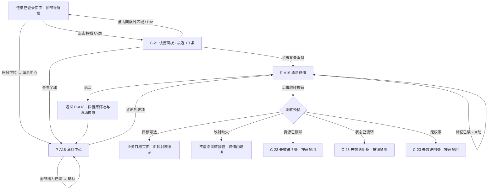

# 平台消息推送能力 PRD（通用数据契约 + 站内信展示层）

> **本模块是平台级的通用消息推送能力，不是某一个业务模块的配套功能。** 任何需要向用户或管理员推送消息的模块——账户与登录、协议、认证，以及尚未立项的融资、放款、还款、额度、票据、结算、运营——都按同一份契约接入。接入方只需读 [`docs/notification-contract/接入指南.md`](../../../docs/notification-contract/接入指南.md)，**不需要回头修改本模块**。
>
> **本 PRD 由 4 个文件组成**（接入指南已迁至 `docs/notification-contract/`，见 0.1）。拆分只改文件归属：**所有章节号与各系列编号保持原值，未做任何重排**——原来的「9.3.4」拆分后仍叫「9.3.4」，只是搬到了另一个文件里。跨文件引用一律标注「文件名 + 章节号」。

## 0. 导航索引

### 0.1 文件清单

| 文件 | 装了哪些章节 | 给谁看 |
| --- | --- | --- |
| ** `v1.0-消息通知-PRD.md`**（本文件） | 1 文档信息、2 背景与目标、3 范围与边界、4 用户角色与场景、5 信息架构与页面流、6 功能清单、8 通用权限、13 非功能要求、14 指标、15 依赖与风险、17 已确认口径与确认汇总、18 交付说明 | 所有人的入口。产品、项目、新加入的成员先读这一份 |
| [`01-页面与展示.md`](./01-页面与展示.md) | 7 模块详情（入口、列表、详情、已读、跳转、失效、业务办理进度、管理端、保留与清理）、10 主流程与异常流程、11 状态机、12 页面与字段定义 | 前端与设计。页面怎么长、交互怎么走 |
| [`02-数据契约与字段.md`](./02-数据契约与字段.md) | 9 通知消息通用数据契约（消息实体、已读状态、分类与业务类型、跳转字段、多语言承载、进度结构、职责分界、接入 Checklist） | **其他 issue 的接入方**。要对接站内消息，只需读这一份 |
| [`03-验收标准.md`](./03-验收标准.md) | 16 验收标准 AC-N01～AC-N88 | 测试。全部验收条目 |
| [`docs/notification-contract/接入指南.md`](../../../docs/notification-contract/接入指南.md) | **不在本目录**，已迁至仓库 `docs/` 顶层。独立成册、不占章节号：接入 Checklist、`biz_type` 与页面 / 组件编号的申请与登记表、`dedupe_key` 构造规范与反例、文案与多语言、跳转三形态、禁止事项、最小完整接入示例 | **任何要发消息的模块**（含金融服务平台）。可独立阅读，接入只需读这一份 |

### 0.2 编号索引

| 编号 | 含义 | 定义位置 |
| --- | --- | --- |
| `F-N01`～`F-N22` | 功能点 | 本文件 第 6 章 |
| `AC-N01`～`AC-N86` | 验收标准 | [`03-验收标准.md`](./03-验收标准.md) 第 16 章 |
| `D-N01`～`D-N45` | 已确认口径 | 本文件 17.1（D-N45 已撤销，编号保留） |
| `N-N01`～`N-N06` | 可调参数 | 本文件 17.2 |
| `P-A18`～`P-A19` | 资产端页面 | 本文件 5.1 |
| `P-M20`～`P-M21` | 管理端页面 | 本文件 5.1 |
| `C-20`～`C-23` | 全局组件 | 本文件 5.1 |

### 0.3 章节 → 文件对照

| 章节 | 所在文件 |
| --- | --- |
| 1、2、3、4、5、6 | 本文件 |
| 7 | [`01-页面与展示.md`](./01-页面与展示.md) |
| 8 | 本文件 |
| 9 | [`02-数据契约与字段.md`](./02-数据契约与字段.md) |
| 10、11、12 | [`01-页面与展示.md`](./01-页面与展示.md) |
| 13、14、15 | 本文件 |
| 16 | [`03-验收标准.md`](./03-验收标准.md) |
| 17、18 | 本文件 |
| （无章节号）接入指南 | [`docs/notification-contract/接入指南.md`](../../../docs/notification-contract/接入指南.md)（**已迁出本目录**） |

---

## 1. 文档信息

| 项目 | 内容 |
| --- | --- |
| 文档名称 | 平台消息推送能力产品需求文档 |
| 对应需求 | WS-304（父需求 WS-296「资产端、资产管理端-登录和认证」） |
| 上游输入 | 《Carloha 资产端与资产管理端登录、认证及通知需求诊断简报》V1.0（第 8 章「站内消息通知」） |
| 编写人 | 许楚清（需求分析师） |
| 文档语言 | 中文（界面文案给出中英对照） |
| 覆盖端 | 资产端 Web、资产管理端 Web |
| **文档定位** | **平台通用的站内消息能力**：定义全平台统一的消息数据契约、可见范围与权限口径，并实现站内信的展示层。业务模块只提供「什么时候发、发什么」，其余由本模块承担。**邮件等站外触达不在本模块范围内**，见 2.4 |
| **首批接入方** | WS-302「账户与登录」、WS-301「协议管理」、WS-303「实名认证与审核」。三者是**本契约的首批使用者，不是本契约的出发点**——规则按平台通用制定，不围绕这三个模块裁剪 |
| **后续接入方** | 链融主业务（融资申请、放款、还款、额度、票据、结算）、运营公告、系统维护通知等尚未立项的模块。按 [`docs/notification-contract/接入指南.md`](../../../docs/notification-contract/接入指南.md) 自助接入，**无需修改本 PRD** |
| 基础能力依赖 | WS-302 提供账户主体 `account_id`、登录态与会话失效口径、国际化基线（语言 / 时区 / 文案回落）。这三项是平台基础设施，本文档直接引用、不重复定义 |
| 文档地位 | **本文档是平台站内消息通用规则的唯一定义方**（用户 2026-09-08 裁定），全部接入方按本文档适配，见 3.5 |
| 一致性核对基线 | WS-302：仓库 `wxblockchain/Chain-Financing` 分支 `cly-V1.0.0` 目录 `asset-platform/prd/v1.0-账户与登录/`（commit `3d66ced`，7 个文件）。WS-303：该 issue 2026-09-08 03:33 交付的修订版 `chain-financing-kyc-kyb-prd.md`。WS-301：该 issue 2026-09-08 02:21 交付的定稿版 `v1.0-协议管理-PRD.md`（**当时尚未入库**，彼时仓库 PRD 目录下只有账户与登录一个目录；现已入库为 `asset-platform/prd/v1.0-协议管理/`）。引用形式见 3.4；逐条结论与适配项见随附的《首批接入方适配清单》 |

> **本文档定义平台通用的消息规则，并实现站内信展示层。**
> 本文档**不定义任何通知触发口径**——不列事件清单、不写「某某操作后发某某消息」、不定义具体消息的文案内容。这些永远归各接入方自己的 PRD，无论是首批三个模块还是以后的任何模块。
> 第 8 章的越权校验条款与 `02-数据契约与字段.md` 第 9 章的数据契约为强制条款，不可省略、不可降级。第 17 章汇总全部已确认口径、可调参数与确认结论。
> 文中性能类目标值（接口响应时间、首屏时间）标注为「目标值」，需在联调与灰度阶段校准，不影响功能逻辑与验收通过与否。

---

## 2. 背景与目标

### 2.1 背景

平台消息有一个结构性特点：**生产方是分散的，消费方是统一的**。用户看到的是一个消息列表、一个未读角标；而消息的来源会随着平台成长不断增加——今天是账户安全、协议更新、认证审核，明天是融资申请进度、放款到账、还款提醒、额度变动、票据状态、结算完成，再往后还有运营公告与系统维护通知。

如果每个模块各自决定「消息长什么样、字段叫什么、跳到哪里、文案怎么存、谁能看到」，同一个列表里会出现几套互不兼容的形态：有的能跳转有的不能，有的能随语言切换有的不能，有的过期了还在闪红点，有的把别人的消息也推给了你。更麻烦的是，这些差异不会在第一个模块接入时暴露，而是在第五个模块接入时集中爆发，那时改动成本已经不可控。

因此本模块是**平台级的通用推送能力**，不是任何一个业务模块的配套功能。它承担三件事：

| 承担 | 内容 |
| --- | --- |
| **一份契约** | 消息实体、业务类型命名空间、分类枚举、接收方范围、跳转字段、多语言承载——所有模块共用一套，见 `02-数据契约与字段.md` |
| **一套权限与展示** | 谁能看到、未读怎么算、列表与详情怎么呈现、已读语义、跳转与失效表现——站内信这一层由本模块实现 |
| **一份接入规范** | 新模块照着接，不需要找本模块的负责人、也不需要修改本 PRD，见 `docs/notification-contract/接入指南.md` |

**衡量本模块是否合格的标准只有一条**：半年后有人做「放款进度通知」，他只读接入指南就能接进来，不需要回头改这份 PRD。本轮的全部规则都按这个标准检验过——凡是只能覆盖现有三个模块的地方，都已经扩到通用（第 9 章的命名空间、分类枚举、接收方范围均属此列）。

**基础能力依赖**：账户主体（`account_id`）、登录态与会话失效、语言与时区展示基线由 WS-302 作为平台基础设施定义，本模块直接引用，不重复定义、不另起一套。这是**依赖关系，不是从属关系**——本模块服务的对象是全平台，不是 WS-302。

### 2.2 本期目标

**通用性目标（本轮的核心）**

1. **任何模块零改动接入**：新模块只读 `docs/notification-contract/接入指南.md` 即可完成接入，不需要修改本 PRD、不需要改本模块的页面逻辑与数据模型。
2. **命名空间能装下未立项的业务**：`biz_type` 给出一级域规划与保留段，链融主业务（融资、放款、还款、额度、票据、结算）与横向域（运营、系统）都已留位，见 `02-数据契约与字段.md` 9.3.2。
3. **分类枚举按平台通用制定**：不从现有三个模块反推，资金财务、运营公告、系统维护等尚无接入方的分类先行定义，见 9.3.1。
4. **接收方范围覆盖五种形态**：单账户、单管理员、全体管理员、企业维度、全平台广播；本期不实现的也在契约中留位并写明新增要改什么，见 9.1.1。
5. **去重规范面向任意业务**：`dedupe_key` 的构造规范与反例独立成规则，任何业务线照着构造即可，见 `02-数据契约与字段.md` 9.1.3。

**站内信展示层目标（本模块实际实现的部分）**

6. **一个数据源，两个入口**：账户下拉菜单与顶部通知铃铛指向同一份消息数据与同一套已读状态，不出现两处未读数不一致。
7. **权限口径不留缺口**：消息严格按接收方范围隔离；所有读写接口均在服务端做归属校验，前端不做安全边界。
8. **展示层能承载任意业务类型**：分类筛选、列表形态、详情形态、跳转机制均由数据契约驱动，新增一类业务消息不需要改本模块的页面逻辑。
9. **失效消息有确定的落地表现**：目标资源已删除、状态已流转、无权限、已过期四种情况分别给出展示与点击表现，不出现空白页与死链接。
10. **进度类消息有通用形态**：「业务办理进度」是面向所有业务线的分类，展示层承载业务名称、当前节点状态与更新时间，与具体是哪条业务线无关。

### 2.3 范围边界

以下内容明确不在本模块覆盖范围内：

| 边界项 | 归属 |
| --- | --- |
| **通知触发口径**——什么事件触发、什么时点触发、触发几条 | **永远归接入方**。首批为 WS-301 / WS-302 / WS-303，后续模块同理 |
| **具体消息的文案内容**——标题、正文、变量语义 | 同上。本模块只定义文案的**承载方式**（9.5），不定义任何一条消息的实际文案 |
| **邮件及其他站外触达**——模板、触发时点、投递、退信、退订 | **全部归各业务模块自持**（用户 2026-09-08 裁定）。本模块**不定义规则、不消费字段、不承担送达责任**，见 2.4 |
| **各业务类型跳到哪个页面**——具体的路由映射条目 | 各接入方在登记表中补齐。本模块只定义**跳转契约**与映射表的形式、缺失时的降级（7.6） |
| **业务办理进度有哪些节点、何时推送** | 对应业务模块。本模块只保证展示层能承载任意业务线的进度（7.8） |
| 会话有效期、会话失效的触发与表现 | WS-302 `04-安全与风控.md` 12.1。本模块只定义消息模块在失效态下的落地 |
| 语言判定、时区、日期格式、文案回落 | WS-302 `02-页面字段与双语文案.md` 第 13 章国际化基线。本模块直接引用 |
| 管理端角色体系 | WS-302 D-19：本期只有「管理员」一种角色。本模块不另起角色体系 |
| 站内消息的偏好中心、按分类退订、免打扰 | **规则在本文档定义，本期不实现**，见 2.5.1。站外渠道的退订归各业务模块 |
| 运营公告 / 广播类消息的运营后台 | **契约与展示层已能承载，本期无接入方、不实现**，见 2.5.2 |
| 消息的物理删除 | 本期不做，见 D-N09 |
| 消息的保留期与自动清理 | 本期不做，见 `01-页面与展示.md` 7.10 与 D-N31 |

### 2.4 本模块的边界：只做站内信

**用户 2026-09-08 裁定：邮件不算在消息通知内。** 边界声明如下，全文只此一句，不再展开：

> **本模块 = 站内信。** 邮件及其他站外触达（模板、触发时点、投递、退信、退订）**归各业务模块自持**，本模块**不定义、不消费、不承担**。

**这句话的三层含义**，避免被读成「本模块管一部分邮件」：

| 层 | 含义 |
| --- | --- |
| 不定义 | 本文档**不出任何渠道规则**——渠道怎么选、跨渠道怎么去重、站内已读是否影响其他渠道、投递失败与降级怎么处理，一概不在本文档。上一轮曾定义过这些（原 9.9 与 D-N45），**本轮整节删除并撤销**，不留附录、不留尾巴 |
| 不消费 | 契约中**不再有 `channels` / `channel_targets` 字段**（移除理由见 `02-数据契约与字段.md` 9.1 与本节下方）。接入方交给本模块的就是一条**站内消息**，没有「这条要不要也发邮件」这个维度 |
| 不承担 | 邮件是否送达、退信怎么记、用户能不能退订邮件，与本模块无关，也不出现在本模块的验收标准里 |

**为什么不再保留「通知投递服务」这个角色。** 上一轮引入它，是因为当时邮件的**执行方**无人认领，需要有个名字接住那个空档。本轮用户把邮件整体划给各业务模块，**空档已由归属裁定关闭**。此时若仍在本文档里保留一个「本文档不定义其规则」的角色，等于再造一个没人拥有的名词——正是上一轮要解决的问题。因此本文档**不再提及该角色**：既不主张平台必须建统一投递层，也不主张不能建，那是邮件归属方的决定，与本模块无关。

**`channels` / `channel_targets` 字段：结论是移除。** 与产品工坊的倾向一致，理由有三条：

| # | 理由 |
| --- | --- |
| 1 | **唯一合法值退化为常量。** 本模块只处理站内消息，`channels` 只能是 `["in_app"]`——一个只有一种取值的字段不携带任何信息 |
| 2 | **它是一个会静默失效的假接口。** 留着它，接入方几乎必然会填 `["in_app","email"]` 并以为邮件也发了，而实际上什么都不会发生。**没有字段**会让人去问「邮件谁发」，**有字段但无效果**只会让人以为已经发了——后者危险得多 |
| 3 | **`channel_targets` 会把邮箱地址带进一个用不到它的契约。** 本模块已明令完整邮箱不得进入 `params`（`02-数据契约与字段.md` 9.5.2 脱敏要求），却保留一个专门承载完整邮件地址的字段，自相矛盾且平白扩大隐私面 |

**WS-302 侧现有的 `channels` / `channel_targets` 怎么办**：其 `03-流程图与状态机.md` 14.8 的 `NotificationEvent` 目前带这两个字段。**本模块侧一律忽略**——不校验、不存储、不透传，收到也当没有。WS-302 若要保留它们用于自己的邮件路径，是它自己的事，本契约不关心。该项已同步到适配清单 A-04，**本轮不执行**（等本边界收口后与 WS-302 其余适配一并处理）。

### 2.5 两项本期取舍评估

平台通用推送能力迟早需要这两项，本节给出本期做不做的结论、理由，以及**不做的话以后加进来会不会推翻现有契约**。

#### 2.5.1 站内消息的偏好 / 订阅开关

**结论：本期不实现，但规则与契约位在本文档定义。**

> **范围提示**：本节只讲**站内消息**的退订。邮件等站外渠道的退订归各业务模块自持（2.4），不在本文档。

| 项 | 内容 |
| --- | --- |
| 是什么 | 用户可以关掉某一类**站内消息**（例如「不再接收运营公告」） |
| 为什么本期不做 | ① **本期没有可关的东西**——现有全部消息都是安全、账户、认证与合规、业务办理进度四类，按诊断简报 8.1 的口径它们**默认不可退订**（关掉安全通知等于让用户在账户被接管时失去唯一告警）。本期做出来会是一个所有选项都是灰的开关面板；② 真正可退订的 `announcement`（运营公告）与部分 `finance`（资金财务）本期一条消息都没有；③ 偏好中心的价值随消息量增长，本期消息量还不构成打扰 |
| 什么时候该做 | 出现第一个 `announcement` 或高频 `finance` 接入方时，与该模块同期做 |
| **退订的最小粒度** | **`category`，不是 `biz_type`。** 理由：`biz_type` 是系统标识、颗粒度太细（用户不该面对「`financing.application.rejected`」这种选项），而 `category` 本来就是面向用户的分类维度，与列表筛选器同一套语言 |
| **契约位（本期就留）** | 消息实体新增 `subscribable`（bool，缺省 `false` = 不可退订），由接入方在提交消息时声明。见 `02-数据契约与字段.md` 9.1 |
| **以后加进来会不会推翻现有契约** | **不会。** 偏好过滤发生在**消息落库之前**：本模块在接收消息时查用户偏好，命中则不产生这条站内信。对展示层而言，被过滤掉的消息等同于「从未产生」——列表、未读计数、已读、跳转全部不需要改动。需要新增的只有「用户偏好表 + 落库前查询」，以及一个偏好设置页面（挂在 WS-302 的账户设置 P-A11 下，属该模块的页面扩展） |
| 唯一的注意点 | `subscribable = true` 的消息**不得**用于安全、账户、认证与合规类。这条写进 `docs/notification-contract/接入指南.md` 的禁止事项 |

#### 2.5.2 运营公告 / 广播类消息

**结论：本期不实现（无接入方），但契约与展示层必须现在就能承载。**

| 项 | 内容 |
| --- | --- |
| 是什么 | 无 `biz_ref`、面向全体用户或某一人群的消息（平台公告、维护通知、活动通知） |
| 为什么本期不做 | 本期没有运营后台，也没有人群圈选能力；没有接入方的功能做出来没有验收对象 |
| **为什么契约现在就要能承载** | 广播对 `recipient_scope`、未读计数、去重键的影响是**结构性的**——它不是「多一种消息」，而是「一条消息对应 N 个接收者」。等到要做时再改，动的是数据模型（已读表、未读计数口径），代价远大于现在留位 |
| 已完成的承载 | ① `recipient_scope` 增加 `broadcast` 取值并写明语义（9.1.1）；② 广播消息**不为每个账户物化一条记录**，已读表只记录「读过的人」（9.2）；③ 用 `visible_from` 界定受众起算点，与 8.2.4「新管理员的未读起算点」是同一套机制；④ `dedupe_key` 在广播范围内唯一（不含账户标识）；⑤ 「无跳转目标」已是合法形态（`01-页面与展示.md` 7.6.4）；⑥ `announcement` 已登记进分类枚举（9.3.1） |
| **现有契约会不会挡住它** | **不会**，逐项确认见 `02-数据契约与字段.md` 9.1.2 的「广播消息的连带影响确认表」 |
| 本期的实现边界 | 展示层**不需要为广播写任何特殊逻辑**：广播消息进入列表后与普通消息完全一致（同样的排序、筛选、已读、角标）。差异全部在「谁能看到」这一层，由服务端的可见集计算承担 |

---

## 3. 范围与边界

### 3.1 已确认的产品决策（直接作为约束）

| # | 决策 | 来源 |
| --- | --- | --- |
| 1 | 本 PRD 不定义任何通知触发口径与具体文案内容 | 需求方本轮指令 |
| 2 | 本模块只做站内信；邮件及其他站外触达**完全不在本模块范围内**，归各业务模块自持 | 用户 2026-09-08 裁定，落地见 2.4 |
| 3 | 资产端消息按账户维度严格隔离，用户只能读到发给自己 `account_id` 的消息 | 需求方本轮指令 |
| 4 | 管理端本期只有「管理员」一种角色，所有管理员权限等同 | WS-302 D-19 |
| 5 | 管理端消息为全量管理员共享同一消息池，已读状态个人独立 | 需求方本轮指令，可调整点见 8.2.3 |
| 6 | 资产端新增「业务办理进度」消息分类，展示层按进度类形态单独设计 | 需求方本轮指令 |
| 7 | 通知业务类型在代码层定义，新增一类需研发适配；管理端不提供业务类型配置界面 | 需求方本轮指令，与 WS-301 协议类型口径一致 |
| 8 | 语言默认英文，中英可即时切换；时间、日期、文案回落遵循 WS-302 `02-页面字段与双语文案.md` 第 13 章 | WS-302 D-23 |
| 9 | 站内信的语言在**展示时**按用户当前语言选取，不在发送时固定 | WS-302 D-39 |
| 10 | 消息入口为账户下拉菜单与顶部通知铃铛，两者指向同一数据源与同一已读状态 | 本 issue 描述 + 诊断简报 8.1 |
| 11 | Toast 为全站唯一轻提示载体，位置顶部居中，双端通用 | WS-302 D-25 |
| 12 | **管理端消息不按认领 / 分配区分可见性**：全量管理员共享同一消息池，已读状态个人独立 | 用户 2026-09-08 批复「按照默认值进行」（原 Q-N01），落地见 8.2 |
| 13 | **本期不做消息保留期与自动清理**，消息长期保留 | 用户 2026-09-08 批复「按照默认值进行」（原 Q-N02），落地见 `01-页面与展示.md` 7.10 |
| 14 | **「业务办理进度」本期只接入 WS-303 的实名认证审核进度**，其余业务线按 `02-数据契约与字段.md` 第 9 章契约后接，本模块不改动 | 用户 2026-09-08 批复「按照默认值进行」（原 Q-N03），落地见 `01-页面与展示.md` 7.8.1 |
| 15 | **本 issue 是站内消息通用规则的唯一定义方**，其余 issue 按本文档规则适配；冲突不在本文档做迁就性妥协 | 用户 2026-09-08 裁定，落地见 3.5 |
| 16 | **邮件不算消息通知**：本模块 = 站内信；邮件的模板、触发与投递归各业务模块自持 | 用户 2026-09-08 裁定，落地见 2.4 与 D-N37 |

### 3.2 与其他需求的接口

| 依赖方向 | 内容 | 归属 |
| --- | --- | --- |
| 本模块 ← WS-302 | `account_id`、登录态与会话、账户状态、语言与时区偏好、会话失效口径（`04-安全与风控.md` 12.1）、国际化基线（`02-页面字段与双语文案.md` 第 13 章）、管理端单角色模型（D-19） | WS-302 定义，本模块消费 |
| 本模块 ← WS-302（首批接入方） | 账户与登录类通知事件。**WS-302 已完成适配**（`cly-V1.0.0` commit `5601e00`，并在 `8e18350` / `46e1d59` 精简了事件集）：其 `03-流程图与状态机.md` 14.8 现在直接提供三段式 `biz_type`、`end`、`recipient_scope`、`page_target`，**产出站内信的为 3 条**——`account.wallet.linked`、`account.password.changed`、`account.email.changed`，全部 `end = asset`、`category = security`、跳转 `P-A11`。本模块无需任何转换 | WS-302 定义事件，本模块展示 |
| 本模块 ← WS-301（触发方） | 协议版本相关事件（其 12.3：`agreement.version.published` / `activated` / `activation_failed` / `scheduled_cancelled`）。接入时需按 `02-数据契约与字段.md` 第 9 章补齐 `biz_type`、`biz_ref`、文案模板 key | WS-301 定义事件与文案，本模块投递与展示 |
| 本模块 ← WS-303（触发方） | 认证与审核事件（其 12.4：`verification.submitted` / `personal.approved` / `personal.rejected` / `business.approved` / `business.rejected` / `completed` / `duplicate_blocked`）。其中审核进度类事件按「业务办理进度」分类接入 | WS-303 定义事件与文案，本模块投递与展示 |
| 本模块 → 所有触发方 | **通知消息通用数据契约**（`02-数据契约与字段.md` 第 9 章）：消息字段、业务类型命名规范、跳转目标字段约定、多语言承载方式、职责分界表 | 本文档定义 |
| 本模块 → WS-301 / WS-302 / WS-303（适配项） | 三个 issue 与本文档通用规则的差异，逐条登记在随附的《首批接入方适配清单》，含目标文件、章节、现状、应改成什么、必改还是建议。**本轮只出清单，未改动这三个 issue 的任何文件** | 本文档定义规则，对方适配 |
| 本模块 → 各业务需求 | 跳转映射表的登记要求（`02-数据契约与字段.md` 9.4.3）：新增业务类型时必须同时登记 `biz_type`、目标路由模板、失效判定接口 | 本文档定义形式，各业务需求补齐条目 |
| 本模块 → 技术 | 未读数轮询、多标签页同步机制的能力要求；本文档不约束具体实现方案 | 本文档只写能力要求 |

### 3.3 编号空间

**本文档自身的编号**（各类自成一套，与其他模块不重叠）：

| 类别 | 编号空间 |
| --- | --- |
| 功能编号 | `F-N01` 起 |
| 资产端页面 | `P-A18`～`P-A19` |
| 管理端页面 | `P-M20`～`P-M21` |
| 组件编号 | `C-20`～`C-23` |
| 已确认口径 | `D-N01` 起 |
| 可调参数 | `N-N01` 起 |
| 待确认项 | `Q-N01` 起 |
| 验收标准 | `AC-N01` 起 |

**页面编号与组件编号的全平台唯一性，已升格为平台级规则**（D-N40）：不再只是「本文档避开别人」，而是**所有模块共同遵守的分配规则**——因为 `page_target` 跳转（`02-数据契约与字段.md` 9.4.4）要求页面编号在全平台可唯一解析。段位分配表与申请方式见 `docs/notification-contract/接入指南.md` 第 4 章。

### 3.4 引用接入方文档的形式

本文档引用接入方文档时一律按「文件名 + 章节号」，避免悬空引用。当前唯一已拆分为多文件的接入方是 WS-302（7 个文件，**章节号与各系列编号在拆分前后完全一致，未做重排**），对照如下：

| WS-302 章节 | 所在文件 | 本文档引用到的内容 |
| --- | --- | --- |
| 3.1、3.2、5.1、5.3、6、11、19（D-xx / N-xx） | `v1.0-账户与登录-PRD.md`（主文档） | 已确认口径 D-xx、可调参数 N-xx、页面清单 P-xx、全局组件 C-xx、权限矩阵 |
| 7.x | `01-模块详情.md` | 账户设置与凭据规则（本文档仅间接引用） |
| 8.x、13.x | `02-页面字段与双语文案.md` | 国际化基线 13.1 / 13.2 / 13.4 / 13.5 / 13.7、全局控件 8.7.2 |
| 9.x、10.x、14.x | `03-流程图与状态机.md` | 通知事件负载 14.8 |
| 12.1～12.4 | `04-安全与风控.md` | 会话失效 12.1 / 12.1.3 / 12.1.4、脱敏要求 12.4 |
| 12.5、12.6 | `05-消息通知与邮件模板.md` | 通知矩阵 12.5.1～12.5.8、邮件模板 12.6 |
| 18.x（AC-xx） | `06-验收标准.md` | 通知验收 18.14、邮件模板验收 18.15 |

> **编号类引用**（`D-xx`、`N-xx`、`C-xx`、`P-xx`、`F-xx`、`E-xx`、`M-xx`、`AC-xx`）在 WS-302 全库唯一，其定义位置见其主文档 0.2 编号索引；本文档引用这些编号时不再重复标注文件名。**章节号类引用一律带文件名。**

### 3.5 本文档是平台通用规则的唯一定义方

**用户 2026-09-08 裁定：站内消息的通用规则由本模块唯一定义，其余模块按本文档的规则做适配调整。** 口径如下：

| 原则 | 含义 |
| --- | --- |
| 规则在本文档 | 消息字段、命名空间、分类枚举、接收方范围、跳转形态、已读语义、权限口径、职责分界，一律以本文档第 8 章与 `02-数据契约与字段.md` 第 9 章为准 |
| 冲突登记为对方的适配项 | 与任何模块冲突时，**不在本文档做迁就性妥协**；差异登记进《首批接入方适配清单》，由对方修改 |
| 例外：通用规则本身该升级时就升级 | 若冲突暴露的是本文档规则考虑不周（而非对方写错），则修订本文档的规则——但这是**规则升级**，不是妥协，且升级后对所有模块一体生效 |
| 过渡兼容层要有收敛时点 | 为不阻塞开发而保留的兼容层必须在正文写明「这是过渡」以及何时移除，不得沉淀为永久设计（D-N39） |
| **规则不围绕接入方裁剪** | 规则按平台通用制定。「现有模块用不到」不构成不定义的理由——命名空间、分类枚举、接收方范围都必须能装下尚未立项的模块（D-N41） |

**适配清单只针对首批三个接入方。** 后续模块按 `docs/notification-contract/接入指南.md` 自助接入，**不再逐个出适配清单**——需要出清单本身就说明规则不够通用。

已按此方向重审首批接入方的四处差异：

| # | 差异 | 处理方向 | 本文档的位置 | 对方的适配项 |
| --- | --- | --- | --- | --- |
| 1 | WS-302 的 `link_target` 与本契约的跳转字段不一致 | **规则升级 + 对方适配**：跳转三形态是通用规则的合理升级（安全类消息本就没有业务资源可跳，「无跳转」必须合法），保留；但**字段名与取值格式以本契约为准** | 7.6.1、7.6.4、9.4.4 | WS-302 · A-02：`link_target` → `page_target` |
| 2 | 当时的 E-08 是发给单个管理员的个人消息 | **规则扩展**：`recipient_scope` 增加 `admin_account`、管理端补 `security` 分类，**保留**（规则本身与 WS-302 是否还有该事件无关，见 8.2.2） | 9.1、9.3.1、8.2.2 | WS-302 · A-03：**已完成**（`5601e00`）；该模块随后在 `46e1d59` 删除了 E-08，管理端本期不再产生通知 |
| 3 | WS-302 的 `event_type` 是单段 snake_case | **对方适配**：三段式 `biz_type` 是通用规则，不让步。转换表曾作为过渡兼容层保留并写明收敛时点，**收敛条件已满足，整节已移除** | 9.3.2、9.3.4（墓碑） | WS-302 · A-01：**已完成**（`5601e00`） |
| 4 | 邮件投递职责笼统写给「通知模块」 | **边界收口**：邮件整体移出本模块（2.4），本模块不再定义任何渠道规则 | 2.4、9.7、D-N37 | WS-302 · A-04：表述改为「站内信归消息模块，邮件归 WS-302 自持」 |

> **关于第 3 条，首版的判断依据被实测推翻，此处更正。** 首版给出的「不改 WS-302」理由是「`event_type` 已长进它的正文、AC-193～AC-235 与邮件模板对应关系里，改动面远大于加一张转换表」。本轮对 commit `3d66ced` 全库检索后确认：**那 11 个 snake_case 取值在 WS-302 全部 7 个文件中只出现 1 次**，即 `03-流程图与状态机.md` 第 391 行 `NotificationEvent.event_type` 的一个表格单元格；AC-193～AC-235 与邮件模板全部用 `E-xx` 编号引用，**不含任何 snake_case 取值**。改动面是一行，不是一片。首版的理由不成立，按裁定方向执行也正是更省的做法。（同名的 `SecurityAuditLog.event_type` 在第 376 行，属另一个对象，不在适配范围内。）

各 issue 的完整适配项见随附的《首批接入方适配清单》。**本轮未修改 WS-301 / WS-302 / WS-303 的任何文件。**

---

## 4. 用户角色与场景

### 4.1 角色

| 角色 | 所在端 | 描述 | 本模块内的核心诉求 |
| --- | --- | --- | --- |
| 资产端用户 | 资产端 | 已登录的账户持有人，接收安全、账户、认证、业务进度类消息 | 一眼看到有没有新消息；点进去知道发生了什么；需要处理的能一键跳到该处理的地方 |
| 资产端办理中的用户 | 资产端 | 有一笔或多笔业务正在办理，关心进度 | 在消息里看到「办到哪一步了」，而不是只看到「有更新」 |
| 资产管理端管理员 | 管理端 | 本期唯一的管理端角色，处理审核待办与系统消息 | 待办不遗漏；自己处理过的消息不再占用自己的未读数，也不影响其他管理员 |
| 触发方需求的产品与研发 | — | WS-301 / WS-303 及后续业务需求的实现方 | 有一份明确的接口契约，知道自己该提供什么、本模块保证什么，不必逐个模块重新对齐 |

### 4.2 用户故事

| # | 角色 | 用户故事 | 关联功能 |
| --- | --- | --- | --- |
| US-01 | 资产端用户 | 作为用户，我希望在任何页面的顶部都能看到自己有几条未读，这样我不必主动去翻消息中心 | F-N01、F-N02 |
| US-02 | 资产端用户 | 作为用户，我希望点铃铛能直接看到最近几条消息的摘要，不必先跳整页，这样处理临时消息更快 | F-N03 |
| US-03 | 资产端用户 | 作为用户，我希望消息列表能按分类和已读状态筛选，这样积压时我能先看安全类的 | F-N06、F-N07 |
| US-04 | 资产端用户 | 作为用户，我希望打开一条消息就自动算已读，不必再点一次「标记已读」，这样未读数能真实反映我还没看的量 | F-N10 |
| US-05 | 资产端用户 | 作为用户，我希望积压很久的消息能一次性清空未读，但不要把我特意留着的那一类也清掉 | F-N11 |
| US-06 | 资产端用户 | 作为用户，我希望消息里说「你的认证被驳回了」时能直接点进认证页面，而不是让我自己去菜单里找 | F-N12 |
| US-07 | 资产端用户 | 作为用户，我希望一条已经没用了的消息能明确告诉我「这条已失效」以及为什么，而不是点了跳到一个空白页或报错页 | F-N14 |
| US-08 | 资产端办理中的用户 | 作为办理中的用户，我希望进度消息能直接显示是哪笔业务、办到哪一步、什么状态，不用点进去才知道 | F-N15 |
| US-09 | 管理端管理员 | 作为管理员，我希望我读过的消息不再计入我的未读，但不影响同事的未读数 | F-N17 |
| US-10 | 管理端管理员 | 作为管理员，我希望在两个标签页里同时开着管理端时，一边读了另一边的角标也跟着变 | F-N05 |
| US-11 | 触发方研发 | 作为触发方研发，我希望有一份字段契约，照着填就能让我的消息正确展示、正确跳转、正确切语言 | `02-数据契约与字段.md` 第 9 章 |

### 4.3 典型场景

| 场景 | 描述 | 期望表现 |
| --- | --- | --- |
| S-01 一次安全变更 | 用户改了密码，被强制退出，重新登录后进入平台 | 铃铛出现 1 条未读；点开是密码变更记录，含时间与设备；点进详情即已读，角标归零 |
| S-02 认证驳回后的处理 | 用户提交认证被驳回 | 消息中心出现一条「认证与合规」分类消息，详情内提供「去查看驳回原因」跳转，落到用户中心认证页 |
| S-03 一笔业务的连续进度 | 同一笔业务在两天内推了 3 次进度更新 | 列表出现 3 条独立消息，各自带节点状态标签与更新时间，按时间倒序排列，各自独立已读 |
| S-04 迟到的点击 | 用户一周后才点开一条「请补充材料」的消息，但该认证已重新提交并通过 | 详情正常展示历史内容，跳转按钮置为不可用并说明「该业务状态已变更，无需再处理」，点击不跳转 |
| S-05 深链回跳 | 用户在会话过期后点击一条消息详情的深链 | 按 WS-302 `04-安全与风控.md` 12.1 落到登录页并携带原路径，登录成功后回到该条消息详情 |
| S-06 管理端并行处理 | 两名管理员同时在线，A 读了一条审核待办 | A 的未读数减 1，B 的未读数不变；消息本身不消失，B 仍可读 |
| S-07 新业务线接入 | 后续融资业务需求接入进度通知 | 只需按 `02-数据契约与字段.md` 第 9 章登记业务类型与路由映射，本模块页面逻辑不改动 |

---

## 5. 信息架构与页面流

### 5.1 页面与组件清单

**资产端**

| 编号 | 页面 / 组件 | 形态 | 说明 |
| --- | --- | --- | --- |
| P-A18 | 消息中心 | 整页 | 完整列表、分类与已读筛选、加载更多、全部已读。路由 `/messages` |
| P-A19 | 消息详情 | 整页 | 单条消息的完整内容与跳转操作。路由 `/messages/{message_id}`，**支持深链** |

**资产管理端**

| 编号 | 页面 | 形态 | 说明 |
| --- | --- | --- | --- |
| P-M20 | 管理端消息中心 | 整页 | 与 P-A18 同构，列表改为管理端惯用的分页器形态 |
| P-M21 | 管理端消息详情 | 整页 | 与 P-A19 同构。路由 `/admin/messages/{message_id}`，支持深链 |

**全局组件（双端复用）**

| 编号 | 组件 | 说明 |
| --- | --- | --- |
| C-20 | 通知铃铛 | 顶部导航栏内，位于语言切换器 C-04 **左侧**；铃铛本体承载未读角标 |
| C-21 | 铃铛快捷面板 | 点击 C-20 展开的下拉面板，展示最近 N-N02（默认 10）条消息摘要，底部「查看全部」进入消息中心 |
| C-22 | 消息列表项 | 列表行组件，含**通用型**与**进度型**两种变体（见 `01-页面与展示.md` 7.8.2） |
| C-23 | 失效说明条 | 详情页内的失效原因说明条，四种失效原因对应四套文案 |

> **不新增左侧菜单项。** WS-302 D-10 已定「左侧菜单只承载业务导航」，消息中心属于账户维度的功能，入口收敛在右上角账号下拉与顶部铃铛，与账户设置的处理方式一致。管理端同理。

### 5.2 两个入口的落点

| 入口 | 位置 | 点击落点 | 理由 |
| --- | --- | --- | --- |
| **顶部通知铃铛（C-20）** | 顶部导航栏右侧，语言切换器左侧 | **展开快捷面板 C-21**，不直接跳页 | 铃铛是高频、轻量的查看入口，多数情况下用户只想确认「是什么事」，直接跳整页会打断当前任务 |
| **账户下拉 → 消息中心** | 右上角账号下拉（WS-302 C-11）内，「账户设置」之上 | **直接进入 P-A18 消息中心** | 从账户菜单进入代表用户要「集中处理消息」，直达整页是符合预期的落点 |
| 快捷面板底部「查看全部」 | C-21 面板底部 | 进入 P-A18 消息中心，不带筛选条件 | — |
| 快捷面板内单条消息 | C-21 面板内 | 进入 P-A19 消息详情 | 与列表点击行为一致，保证两个入口的交互心智统一 |

> **两个入口共用同一数据源与同一已读状态**：快捷面板的消息、未读数与消息中心列表来自同一套服务端数据，任一处的已读操作在另一处立即生效（见 `01-页面与展示.md` 7.5.4）。这是诊断简报 8.1 的明确要求，也是本模块存在的核心理由之一。

### 5.3 页面流

### 5.4 会话与登录态下的入口可见性

| 状态 | 铃铛 C-20 | 账号下拉「消息中心」 | 深链 `/messages/{id}` |
| --- | --- | --- | --- |
| 未登录 | **不展示**（未登录态无顶部账号区） | 不展示 | 跳登录页并携带原路径，登录成功后回跳该详情 |
| 已登录 `incomplete`（凭据未齐） | ✅ 展示 | ✅ 展示 | ✅ 正常访问 |
| 已登录 `active` | ✅ 展示 | ✅ 展示 | ✅ 正常访问 |
| 会话失效 / 过期 | 按 WS-302 `04-安全与风控.md` 12.1.3 立即清除登录态并跳登录页 | 同左 | 同左，登录后回跳 |
| 账户 `locked` / `disabled` | 无法登录，不涉及 | — | 跳登录页，按 WS-302 的锁定 / 停用提示处理 |

> 消息模块**不对认证状态设门槛**：`incomplete` 状态的账户同样可以查看消息。理由与 WS-302 D-03 一致——查看消息属于诊断简报 5.2 明确要求保留的基础能力，不应被认证进度阻断；用户恰恰经常需要通过消息了解自己为什么被卡住。

---
## 6. 功能清单

| 模块 | 编号 | 功能点 | 端 | 优先级 | 验收口径 |
| --- | --- | --- | --- | --- | --- |
| M1 入口与角标 | F-N01 | 顶部通知铃铛入口 | 双端 | P0 | 已登录任意页面顶部导航栏均展示铃铛，位置固定 |
| M1 入口与角标 | F-N02 | 未读角标计数 | 双端 | P0 | 角标数等于服务端口径的未读条数；超过 99 展示 `99+` |
| M1 入口与角标 | F-N03 | 铃铛快捷面板 | 双端 | P0 | 展示最近 10 条，点击单条进详情，底部可进消息中心 |
| M1 入口与角标 | F-N04 | 账户下拉「消息中心」入口 | 双端 | P0 | 账号下拉内新增条目，点击直达消息中心 |
| M1 入口与角标 | F-N05 | 角标刷新与多标签页一致性 | 双端 | P0 | 轮询 + 焦点触发 + 本地事件广播三者共同保证角标一致 |
| M2 列表 | F-N06 | 分类筛选 | 双端 | P0 | 筛选项由业务类型契约驱动动态渲染，不写死清单 |
| M2 列表 | F-N07 | 已读 / 未读筛选 | 双端 | P0 | 三档：全部 / 未读 / 已读，与分类筛选可叠加 |
| M2 列表 | F-N08 | 分页加载与排序 | 双端 | P0 | 资产端加载更多，管理端分页器；均按创建时间倒序 |
| M2 列表 | F-N09 | 空态、加载态、失败重试 | 双端 | P0 | 首次无消息与筛选无结果两种空态文案与操作不同 |
| M3 已读 | F-N10 | 单条已读 | 双端 | P0 | 打开详情即已读；列表行内提供显式「标为已读」 |
| M3 已读 | F-N11 | 全部已读 | 双端 | P0 | 作用于当前筛选命中的全部消息，执行前二次确认 |
| M4 详情 | F-N12 | 消息详情展示 | 双端 | P0 | 标题、正文、分类、时间、跳转操作、失效说明 |
| M4 详情 | F-N13 | 返回列表的状态同步 | 双端 | P0 | 返回后保留筛选与滚动位置，已读状态就地更新 |
| M5 跳转 | F-N14 | 跳转契约与降级 | 双端 | P0 | 三种跳转形态各自落地；四种不可达情况各有落地表现 |
| M5 跳转 | F-N21 | 静态页面目标 | 双端 | P0 | `page_target` 按页面路由表直达，不预检，端不一致时服务端拒收 |
| M6 进度消息 | F-N15 | 业务办理进度消息形态 | 资产端 | P0 | 列表与详情展示业务名称、节点状态标签、更新时间 |
| M6 进度消息 | F-N16 | 同一业务多次更新的展示 | 资产端 | P0 | 每次更新一条独立消息，不合并 |
| M7 管理端 | F-N17 | 管理端共享消息池与个人已读 | 管理端 | P0 | 全量管理员可见同一份消息，已读状态互不影响 |
| M7 管理端 | F-N22 | 管理端个人消息 | 管理端 | P0 | `admin_account` 投递的消息只对指定管理员可见，其他管理员按 404 语义拒绝 |
| M8 权限 | F-N18 | 服务端归属校验 | 双端 | P0 | 六个接口全部做归属校验，越权返回 404 语义 |
| M9 契约 | F-N19 | 通用数据契约 | — | P0 | 触发方按 `02-数据契约与字段.md` 第 9 章接入即可正确展示、跳转、切语言 |
| M9 契约 | F-N20 | 业务类型登记表 | — | P0 | 新增业务类型需同时登记标识、路由模板与失效判定 |

---

---

## 8. 通用权限（强制条款）

### 8.1 资产端：账户维度严格隔离

#### 8.1.1 隔离口径

| 项 | 规则 |
| --- | --- |
| 隔离维度 | **`account_id`**（WS-302 定义的不可变账户主键） |
| 可见范围 | 一个账户只能读到 `recipient_account_id` 等于自己 `account_id` 的消息，**没有任何例外** |
| 已读状态 | 按账户独立，只影响本人 |
| 未读数 | 只统计本人的消息 |
| 删除 | 本期不提供删除（见 D-N09）；若后续开放，同样只影响本人，且必须是逻辑删除 |
| 管理端能否查看资产端用户的消息 | **不能**。管理端界面不提供任何「查看某用户收到了哪些消息」的功能。排障诉求走服务端日志与数据层，按 WS-303 13.2 的同类要求做访问审计 |
| 企业上下文 | 本期一个账户只对应一家企业（WS-302 多企业为后续迭代），消息隔离**只按 `account_id`**，不引入企业维度。数据契约预留 `biz_ref` 承载企业标识，后续开放多企业时再补企业维度的可见性规则，不影响本期结构 |

#### 8.1.2 服务端必须做的越权校验点（强制条款）

**前端不是安全边界。** 以下每一个接口都必须在服务端独立做归属校验，不得依赖前端只传自己的 ID、不得依赖列表接口已经过滤过。

| # | 接口 | 校验内容 | 越权时的返回 |
| --- | --- | --- | --- |
| 1 | **列表接口** | 强制以会话中的 `account_id` 作为查询条件；**忽略请求参数中任何形式的接收者标识**（即使前端传了 `account_id`，也不采信） | 不适用（结果集天然为空） |
| 2 | **详情接口** | 校验 `message.recipient_account_id == 会话.account_id`；管理端消息还需校验 `end` 与调用端一致 | **404 语义**，见 8.1.3 |
| 3 | **标记单条已读接口** | 同详情：先校验消息归属，再写已读；不得只按 `message_id` 写入 | 404 语义 |
| 4 | **全部已读接口** | 服务端按会话 `account_id` + 请求中的筛选条件自行圈定范围；**不接受前端传入的消息 ID 列表** | 400（参数不合法） |
| 5 | **未读数接口** | 强制以会话 `account_id` 统计 | 不适用 |
| 6 | **跳转预检接口** | ① 校验消息归属；② 再校验该账户对**目标业务资源**的访问权限（后者由业务方的预检实现负责） | 消息不属于本人 → 404 语义；消息属于本人但目标无权 → 返回 `no_permission`，走 7.7 第 4 类 |

#### 8.1.3 越权返回口径

**越权访问一律返回「不存在」的语义（404），不返回「无权限」（403）。**

理由：403 会泄漏「这条消息 ID 确实存在」这一事实，攻击者可通过遍历 ID 探测系统内的消息规模与分布。这与 WS-302 D-17 的账户枚举防护是同一条原则的延续——**不可区分是默认，凡是能被外部枚举的标识都适用**。

| 场景 | 服务端返回 | 前端表现 |
| --- | --- | --- |
| 消息 ID 不存在 | 404 | 消息不存在页：`This notification is not available. / 该消息不存在或已不可访问。` + 「返回消息中心」 |
| 消息存在但不属于当前账户 | 404（与上一行**完全一致**，不可区分） | 同上 |
| 消息属于当前账户但已被逻辑删除（后续能力） | 404 | 同上 |
| 未登录访问详情深链 | 401 → 前端跳登录页并携带原路径 | 见 8.3 |

#### 8.1.4 其他服务端要求

| 项 | 要求 |
| --- | --- |
| 消息 ID 的形态 | 使用不可枚举的标识（如 UUID），不使用自增序号。即使有 404 兜底，也不应把「猜测下一条消息 ID」变成一件成本极低的事 |
| 批量接口 | 不提供「按 ID 列表批量取消息」的接口。若后续需要，必须逐条做归属校验，且部分越权时整体拒绝，不做部分返回 |
| 日志 | 越权访问（消息存在但归属不符）须记入安全审计日志，字段遵循 WS-302 `04-安全与风控.md` 12.4 的脱敏要求 |
| 已读写入的幂等 | 重复标记不报错、不更新 `read_at` |

---

### 8.2 管理端：可见范围

#### 8.2.1 角色基线

本期管理端**只有「管理员」一种角色，所有管理员权限等同**（WS-302 D-19）。本模块**不另起角色体系**，也不定义「消息查看权限」这类模块级权限项。

#### 8.2.2 共享消息池 + 个人独立已读

| 项 | 规则 |
| --- | --- |
| 可见范围 | **所有管理员看到同一份全量管理端消息**（`end = admin` 的全部消息），不按人分发 |
| 已读状态 | **每个管理员账号独立**。A 读过的消息，对 B 仍然是未读 |
| 未读数 | 按管理员账号各自计算 |
| 全部已读 | 只清空**当前管理员自己**的未读，不影响其他管理员 |
| 消息本身 | 不因任何管理员的已读而消失、归档或从列表移除 |
| 新增管理员 | 新管理员登录后，**存量的历史消息对他而言全部是未读**。见 8.2.4 的处理 |

**实现要点**：消息实体与已读状态必须分表建模（见 `02-数据契约与字段.md` 9.2）——消息一条、已读记录按「消息 × 管理员」多条。不得把已读做成消息实体上的一个布尔字段，那种结构无法支撑个人独立已读，后续拆分需要数据迁移。

**例外：管理端的个人消息（本轮核对新增）**

管理端并非只有共享池。**管理员本人的账号安全事件**（密码被重置、账号被停用、他被指派的任务）是发给某一个人的消息，不能进共享池：

> **本期无接入方，规则仍然保留。** 这条规则最初的来源是 WS-302 的 E-08「管理端首登强制重置完成」，该事件已于 `46e1d59` 删除，WS-302 现在不产生任何管理端通知。**规则不随之撤销**——它是平台通用规则（D-N41：不因现有模块用不到就不定义），且判断标准与具体是谁的事件无关，见下方「怎么判断」。

| 项 | 共享池消息（`recipient_scope = admin_all`） | 个人消息（`recipient_scope = admin_account`） |
| --- | --- | --- |
| 典型内容 | 审核待办、系统公告 | 管理员本人的账号安全事件 |
| 可见范围 | 全部管理员 | **仅 `recipient_admin_id` 指定的那一个管理员** |
| 已读状态 | 各自独立 | 仅本人 |
| 越权访问 | — | 其他管理员访问按 8.1.3 返回 404 语义，与资产端同一口径 |
| 未读计数 | 计入全部管理员 | 只计入本人 |

**为什么必须分开**：把「某管理员刚重置了密码」这条消息推给全体管理员，既泄漏了同事的账号安全动作，又会让每个人的未读数被与自己无关的事件污染。

**怎么判断该用哪个**（这条判断标准与具体是哪个模块的哪个事件无关）：**这件事任何一个管理员都可以去处理吗？** 可以 → `admin_all`；只跟某个人有关 → `admin_account`。判断错的代价不对称——错发成 `admin_all` 会泄漏个人信息并污染所有人的未读数，错发成 `admin_account` 只是少几个人看到，**拿不准时选 `admin_account`**。

因此 9.1 的 `recipient_scope` 增加 `admin_account` 取值，并新增 `recipient_admin_id` 字段。管理端列表接口在返回时取「共享池消息 ∪ 本人的个人消息」的并集，两者在列表中混排，不做分区展示——对管理员而言它们都是「发给我的消息」。

#### 8.2.3 这条口径已定稿，并注明后续调整的触发条件

**结论（已定稿）**：所有管理员共享全量消息池，已读各自独立，**本期不按认领 / 分配区分可见性**。来源：用户 2026-09-08 批复「按照默认值进行」（原 Q-N01）。个人消息的例外见 8.2.2。

**为什么这样定**：
1. 本期管理端只有单一角色，没有「谁负责哪一块」的组织结构可依附。任何按人分发的规则都需要先有分配模型，而本期没有。
2. 审核类待办**不能漏**。共享池的失败模式是「多人重复看到同一条」，按人分发的失败模式是「分给了一个不在线的人，没人处理」——前者是效率问题，后者是业务事故。在没有认领与转派机制的本期，共享池是更安全的选择。
3. 已读个人独立是共享池的必要配套。若已读也共享，A 点开一条待办就会让 B 的未读消失，B 会误以为已经有人处理完了。

**在什么情况下需要改**：若后续管理端引入**认领 / 分配机制**（一条审核待办被指派给某个管理员），可见性口径应随之调整为「全量可见 + 指派人高亮」或「仅指派人可见」，此时需要同步定义：未认领消息的可见范围、认领后其他人的可见性、转派与释放的表现、以及认领状态与已读状态的关系。这属于管理端权限模型的扩展，应在管理端账户管理需求中统一定义，不在本模块单开一套。

> 数据结构上已为这次可能的扩展留好位置：`recipient_scope` 是枚举而非布尔，增加 `admin_group` / `admin_assignee` 这类取值不需要改动消息实体的其他字段，也不影响已读状态的建模。

#### 8.2.4 历史消息对新管理员的表现

| 项 | 规则 |
| --- | --- |
| 默认 | 新管理员账号首次登录时，**只将其创建时间之后产生的消息计为未读**；创建时间之前的历史消息对他默认视为已读 |
| 理由 | 否则一个新入职的管理员一登录就面对几千条未读，角标失去意义，他也不可能真的去逐条读完历史 |
| 历史消息是否可见 | ✅ **可见**。列表中仍能查到、能筛选、能打开，只是不计入他的未读 |
| 实现口径 | 以管理员账号的创建时间作为其「未读起算点」，服务端在计数与列表已读态渲染时应用该基线 |

---

### 8.3 未登录态与会话失效态

> 会话失效的**规则本身**（何时失效、失效范围、跳转与提示）由 WS-302 `04-安全与风控.md` 12.1 定义，本节**不重复定义**，只说明消息模块在这些状态下的落地表现。

| 场景 | 表现 |
| --- | --- |
| **未登录访问 `/messages`（列表）** | 跳转登录页并携带原路径（`/messages`），登录成功后回跳消息中心 |
| **未登录访问 `/messages/{id}`（详情深链）** | 跳转登录页并携带原路径（含消息 ID），登录成功后**回跳到该条详情**。若该消息不属于登录成功的这个账户，按 8.1.3 落到「消息不存在页」——不提示「你登错账号了」，那同样会泄漏消息归属 |
| **未登录访问管理端 `/admin/messages/{id}`** | 同上，落到管理端登录页 P-M01 |
| **会话过期后停留在消息中心** | 按 WS-302 `04-安全与风控.md` 12.1.3：清除本地登录态 → 中止进行中的请求（含未读数轮询）→ Toast 提示 → 跳登录页并携带原路径 |
| **会话在详情页过期** | 同上，原路径为该条详情，登录后回跳 |
| **会话在「全部已读」执行中过期** | 请求返回 401 → 触发统一的会话失效处理；**不展示「操作成功」**；重新登录后未读数以服务端为准（该操作是否已生效由服务端结果决定，前端不做假设） |
| **未读数轮询遇到 401** | 与其他接口一视同仁，触发统一的会话失效处理。**不得静默忽略 401** ——轮询是常驻请求，若它对 401 免疫，会出现「页面还在、角标还在刷、但登录态其实已经没了」的假活状态 |
| 账户被停用 / 锁定 | 无法登录，消息模块不可达；提示文案走 WS-302 `04-安全与风控.md` 12.1.4 |
| 多标签页同时失效 | 由 WS-302 `04-安全与风控.md` 12.1.3 第 6 条的跨标签页同步机制统一处理，消息模块不另做一套 |

---

### 8.4 数据可见范围汇总

| 数据 | 谁可见 |
| --- | --- |
| 资产端某账户的消息内容 | **仅该账户本人**（管理端与其他账户均不可见） |
| 资产端某账户的已读状态与未读数 | 仅该账户本人 |
| 管理端消息内容 | 全部管理员 |
| 管理端某管理员的已读状态与未读数 | **仅该管理员本人**（其他管理员看不到「谁读过这条」） |
| 消息中引用的业务资源详情 | 由目标业务模块的权限规则决定，本模块不放宽 |
| 越权访问日志 | 不在任何前台界面展示，供合规按流程调阅 |

> **「谁读过这条管理端消息」本期不展示**：它看起来像个有用的协作信息，但在没有认领机制的前提下会产生误导——A 读过不代表 A 在处理。等有了认领 / 分配机制，「谁在处理」应由认领状态表达，而不是由已读状态推断。

---

---

## 13. 非功能要求

### 13.1 性能（目标值）

| 指标 | 目标值 | 说明 |
| --- | --- | --- |
| 未读数接口响应 | P95 < 300ms | 高频轮询接口，必须轻量；只返回计数，不返回列表 |
| 列表首屏 | P95 < 1s（20 条） | — |
| 铃铛面板展开到内容可见 | P95 < 800ms（10 条） | 展开时展示骨架屏，不阻塞面板动画 |
| 详情加载 | P95 < 800ms | — |
| 全部已读 | P95 < 2s（1000 条内） | 超过时服务端应异步处理并立即返回，前端按乐观更新展示，以下一次轮询对账 |
| 跳转预检 | P95 < 500ms | 超时（N-N05，默认 3 秒）按「预检失败」处理，放行跳转（`01-页面与展示.md` 7.6.2） |
| 轮询开销 | 页面不可见时为 0 | 见 `01-页面与展示.md` 7.1.3 |

### 13.2 安全

| 项 | 要求 |
| --- | --- |
| 越权校验 | 六个接口全部在服务端做归属校验（8.1.2），越权返回 404 语义（8.1.3） |
| 消息 ID | 不可枚举（UUID 类），不使用自增序号 |
| **内容渲染** | 消息标题、正文、参数一律按**纯文本**渲染并转义，**不支持 HTML / 富文本 / 外链自动识别**。消息内容部分来自用户提交的原文（如审核意见），富文本渲染会直接构成存储型 XSS 入口 |
| 参数脱敏 | 完整邮箱、完整钱包地址、完整 IP、证件号码不得进入 `params`；由触发方脱敏后传入（WS-302 `04-安全与风控.md` 12.4、WS-303 13.1 的既有脱敏口径） |
| 深链 | 未登录访问详情深链只能落到登录页，不得在登录前泄漏任何消息内容或消息是否存在 |
| 审计 | 越权访问、全部已读操作记入安全审计日志；保留期遵循 WS-302 N-21（180 天） |
| 管理端消息 | 不含资产端用户的敏感个人信息明文；需要查看时跳转到 WS-303 定义的审核详情页，由该页的权限与审计规则约束 |
| 接口限流 | 未读数接口按账户与 IP 限流，防止被当作探活接口滥用 |

### 13.3 兼容性与可用性

| 项 | 要求 |
| --- | --- |
| 浏览器 | Chrome / Edge / Firefox / Safari 最新两个大版本（与 WS-301 12.4 一致） |
| 桌面断点 | 1280 / 1440 / 1920px 无水平溢出；铃铛面板不被导航栏裁切 |
| 低于 1280px | 列表项副信息（摘要）可折行或省略，标题、状态标签与时间不得隐藏 |
| 文案扩展 | 中英文案预留约 30% 扩展空间；分类标签与状态标签宽度自适应，不截断 |
| 长内容 | 超长标题在列表截断（tooltip 展示完整），详情页换行不截断；超长正文详情页完整展示 |
| 离开确认 | 消息模块无表单，不需要离开确认 |

### 13.4 可访问性

| 项 | 要求 |
| --- | --- |
| 键盘可达 | 铃铛、面板内每条消息、列表项、行内「标为已读」、筛选器、加载更多、跳转按钮全部可 Tab 到达，具备可见的 `focus-visible` |
| 铃铛面板 | 展开后焦点进入面板，Tab 循环限制在面板内，Esc 关闭并把焦点还给铃铛 |
| 角标 | 通过 `aria-live="polite"` 播报未读数变化，不抢焦点、不打断屏幕阅读器当前朗读 |
| 状态不以颜色为唯一提示 | 未读用圆点 + 字重，不只用颜色；进度状态标签始终带文本 |
| 图标按钮 | 全部具备 `aria-label` |
| 列表语义 | 列表使用语义化列表结构，每项可被逐项导航；未读状态对屏幕阅读器可感知 |
| 动效 | 支持 `prefers-reduced-motion`，面板展开与角标变化的动效可减弱 |
| 确认弹窗 | 焦点受限在弹窗内，Esc 取消，默认焦点落在「取消」上（破坏性操作不默认聚焦确认） |

---

## 14. 指标

| 层级 | 指标 | 说明 |
| --- | --- | --- |
| 触达 | 站内信阅读率（已读数 / 投递数，按分类拆分） | 衡量消息是否真的被消费；安全类与认证类应显著高于系统公告 |
| 触达 | 消息投递到首次已读的中位时长 | 反映用户对角标的响应速度 |
| 入口 | 铃铛点击率、账号下拉入口点击率 | 验证两个入口的分工假设是否成立 |
| 入口 | 铃铛面板 → 详情的转化率 | 若极低，说明摘要信息量不足或用户只是想清红点 |
| 跳转 | **跳转成功率** = 成功跳转 / 有 `biz_ref` 的详情浏览数 | 核心健康指标 |
| 跳转 | **跳转降级率**（按四类失效 + 映射缺失拆分） | 映射缺失率若不为 0，说明有业务类型未登记，需要推动补齐 |
| 已读 | 全部已读使用率、单次全部已读的平均条数 | 平均条数持续偏高说明消息过载，应反馈给触发方收敛推送 |
| 已读 | 行内「标为已读」使用率 | 若极高，说明标题信息量足够、正文价值低，可反馈触发方精简 |
| 稳定性 | 未读数接口错误率、列表接口错误率 | — |
| 稳定性 | 文案模板 key 缺失告警数 | 应长期为 0 |
| 管理端 | 管理端消息平均未读停留时长 | 待办积压的早期信号 |

---

## 15. 依赖与风险

### 15.1 外部依赖

| 依赖 | 内容 | 影响 |
| --- | --- | --- |
| WS-302 | 账户主体、会话与失效口径、国际化基线、管理端单角色模型 | 强依赖，全部直接引用 |
| WS-301 / WS-303 及后续业务需求 | 作为触发方按 `02-数据契约与字段.md` 第 9 章接入；补齐跳转映射与预检接口 | 未接入时消息模块可独立上线，但列表会是空的 |
| 前端路由 | 跳转映射表依赖各业务页面的路由稳定 | 路由重构时需同步更新登记表（消息实体不存 URL，因此不需要数据迁移） |
| 浏览器本地事件广播能力 | 多标签页同步 | 不可用时降级为轮询，不阻断功能 |

### 15.2 风险

| # | 风险 | 影响 | 应对 |
| --- | --- | --- | --- |
| 1 | **跳转映射表补齐依赖各业务需求**，本模块无法自行补全 | 用户看到消息但跳不过去，体验割裂 | ① 降级表现已明确定义（`01-页面与展示.md` 7.6.3），不会出错页；② 埋点统计「未知业务类型」，作为推动补齐的依据；③ 9.4.3 把登记列为业务需求的硬性交付项 |
| 2 | 触发方各自定义文案，风格与详略程度不一致 | 同一个列表里消息质量参差 | 契约要求模板 key + 参数，文案集中在文案资源里，便于统一审校；第 14 章的「行内标为已读使用率」可作为文案质量的间接信号 |
| 3 | 轮询的实时性上限为 60 秒 | 用户可能晚 1 分钟看到新消息 | 本期站内消息无秒级时效要求。**需要更强时效的事件，接入方本就应当同时走自己的站外渠道**（邮件归其自持，见 2.4），不依赖站内信兜底。若后续出现强实时诉求，再评估长连接 |
| 4 | 管理端共享池 + 个人已读，**已读记录随管理员数量线性增长** | 数据量与查询成本上升 | 本期管理员数量有限，风险可接受；新管理员的未读起算点机制（8.2.4）已避免历史消息全量生成已读记录 |
| 5 | 消息量长期累积，列表与未读数查询变慢 | 性能退化 | 本期不做自动清理（见 Q-N02）；需要在索引与分页游标设计上预留，并监控 13.1 的性能指标 |
| 6 | 「全部已读」不可撤销，误操作无法恢复 | 用户丢失未读标记 | 二次确认 + 明确说明作用范围与条数（`01-页面与展示.md` 7.5.2）；若后续投诉集中，再评估「标为未读」（D-N08） |
| 7 | 业务方滥用 `business_progress` 分类高频推送 | 用户被进度消息淹没，安全类消息被埋 | 频次控制归触发方；本模块通过第 14 章的「单次全部已读平均条数」暴露过载信号，作为反馈依据 |
| 8 | 触发方误用 `dedupe_key`，把不同节点的进度合并 | 用户丢失中间进度 | 9.8 接入 Checklist 第 10 项显式检查；契约文档明确 `dedupe_key` 针对「同一事件重复触发」而非「同一业务不同节点」 |

---

---

## 17. 已确认口径、可调参数与确认汇总

### 17.1 已确认口径

| 编号 | 口径 | 结论 |
| --- | --- | --- |
| D-N01 | 本 PRD 的范围 | **只做站内消息**：通用数据契约 + 通用权限 + 站内信展示层；不定义任何触发口径、具体文案内容，也不定义任何邮件 / 站外渠道规则 |
| D-N02 | 两个入口的落点 | **铃铛展开快捷面板**（不直接跳页）；**账号下拉「消息中心」直达整页**；两者共用同一数据源与同一已读状态 |
| D-N03 | 角标计数口径 | 服务端计算；全分类合计、不分类；**已过期与已主动失效的消息不计入**；上限展示 `99+` |
| D-N04 | 实时性方案 | **轮询（默认 60 秒）+ 页面切回前台立即拉取 + 页面不可见时暂停**；本期不引入长连接 |
| D-N05 | 多标签页一致性 | 通过浏览器本地事件广播同步，复用 WS-302 `04-安全与风控.md` 12.1.3 的同一套通道；不可用时降级为轮询 |
| D-N06 | 列表排序 | 创建时间倒序；**已读状态不参与排序**，标记已读后行位置不变 |
| D-N07 | 单条已读的触发 | **打开详情即已读**（详情渲染成功后标记），**并**在列表行内提供显式「标为已读」；仅展开列表不产生已读 |
| D-N08 | 手动标为未读 | **本期不提供**。系统侧的去重合并可恢复未读，属系统行为 |
| D-N09 | 消息删除与归档 | **本期均不提供**。安全与合规类消息需可回查（诊断简报 8.2），且在没有分类退订能力前，删除会成为用户逃避通知的唯一出口，掩盖消息过载的真实问题 |
| D-N10 | 全部已读的作用范围 | **当前筛选条件命中的全部消息**（不限当前页，也不是全库无差别）；执行前二次确认并说明条数与筛选 |
| D-N11 | 详情形态 | **整页 + 独立路由 + 支持深链**，不用抽屉或弹窗 |
| D-N12 | 返回列表的同步 | 保留筛选、已加载页数与滚动位置；已读项就地更新样式，不移除、不重排 |
| D-N13 | 跳转契约 | 消息只存 `biz_type` + `biz_ref`，**不存 URL**；路由由前端登记表解析；登记由各业务需求补齐 |
| D-N14 | 映射缺失的降级 | **不渲染跳转按钮** + 说明文案 + 上报日志；消息内容正常展示，不跳 404、不跳首页 |
| D-N15 | 失效消息的四类表现 | `expired` / `resource_deleted` / `state_changed` / `no_permission` 四类各有独立文案；后三类**按钮禁用而非隐藏**；四类均完整展示消息内容 |
| D-N16 | 失效的判定归属 | `expired` 与主动失效落在消息实体上；其余三类是**跳转预检的实时结果**，不落库 |
| D-N17 | 资产端隔离 | 严格按 `account_id`；管理端不可查看资产端用户的消息 |
| D-N18 | 越权返回 | 一律 **404 语义**，与「不存在」不可区分，延续 WS-302 D-17 的枚举防护原则 |
| D-N19 | 管理端可见范围 | **全量管理员共享同一消息池，已读状态个人独立**；理由与调整条件见 8.2.3 |
| D-N20 | 新管理员的历史消息 | 以账号创建时间为未读起算点；更早的消息可见但不计入其未读 |
| D-N21 | 业务办理进度的展示形态 | 独立分类；列表与详情展示业务名称、当前节点、**四态封闭枚举**的状态标签、更新时间 |
| D-N22 | 同一业务多次更新 | **每次一条独立消息，不合并**；理由见 `01-页面与展示.md` 7.8.4 |
| D-N23 | 业务类型的扩展方式 | **代码层定义，新增一类需研发适配；管理端不提供类型配置界面**，与 WS-301 协议类型口径一致 |
| D-N24 | 多语言承载方式 | **主口径为模板 key + 参数**（展示时渲染）；成品双语快照为兼容通道，WS-302 现有负载无需改造即可接入 |
| D-N25 | 文案缺失的兜底 | **回落到该端的默认语言** → 最小形态；**任何情况下不展示文案键名**。回落语言是参数不是常量，逐端取值见 `02-数据契约与字段.md` 9.5.4（四端当前均为英文） |
| D-N26 | 内容渲染 | 纯文本 + 转义，**不支持富文本 / HTML** |
| D-N27 | 分页形态 | 资产端「加载更多」，管理端分页器；均使用基于时间 + ID 的稳定游标，不用 offset |
| D-N28 | 消息模块的准入 | 不设认证状态门槛，`incomplete` 账户同样可查看消息 |
| D-N29 | 各端消息池 | 按 `end` **严格区分、不混池**；`end` 为四值枚举（`asset` / `admin` / `fs` / `fs_ops`，见 `02-数据契约与字段.md` 9.1），多个端都需知晓的事件由接入方**每端产出一条消息**。隔离与账号体系是否互通无关 |
| D-N30 | 管理端可见范围（原 Q-N01） | **不按认领 / 分配区分**：全量管理员共享同一消息池、已读个人独立；管理员本人的账号安全消息走 `admin_account` 个人投递（8.2） |
| D-N31 | 消息保留期与清理（原 Q-N02） | **本期不设保留期、不做自动清理、不做归档**，消息长期保留；已过期消息仍保留可查（`01-页面与展示.md` 7.10） |
| D-N32 | 业务办理进度的本期覆盖（原 Q-N03） | **展示层通用承载，本期只接入 WS-303 实名认证审核进度**；其余业务线按 `02-数据契约与字段.md` 第 9 章契约后接，本模块不改动（`01-页面与展示.md` 7.8.1） |
| D-N33 | 跳转目标的三种形态 | **业务资源（`biz_ref`）/ 静态页面（`page_target`）/ 无跳转**，三选一互斥；静态页面不预检；无跳转是合法状态而非缺失（`01-页面与展示.md` 7.6.1、7.6.4） |
| D-N34 | 管理端个人消息 | `recipient_scope = admin_account` 的消息**只对指定管理员可见**，其他管理员访问按 404 语义拒绝（8.2.2）。**本期无接入方**——WS-302 曾有的 E-08 已于 `46e1d59` 删除；规则保留，判断标准见 8.2.2 |
| D-N35 | ~~WS-302 事件的命名转换~~ | **已完成并撤销**：WS-302 已于 `5601e00` 直接提供三段式 `biz_type`，`02-数据契约与字段.md` 9.3.4 的过渡转换表按其收敛条件整节移除。**本模块现无任何转换层** |
| D-N36 | 邮件的归属（本轮改写） | **邮件的模板、触发时点、投递执行、退信与退订全部归各业务模块自持**（WS-302 已自带 12 个邮件模板）。本模块不定义、不消费、不承担（2.4） |
| D-N37 | 本模块的边界（本轮改写，取代原两层分工） | **本模块 = 站内信。** 上一轮为解决邮件执行无人认领而引入的「通知投递服务」分层**本轮撤销**——邮件已整体划归各业务模块，空档由归属裁定关闭，不需要再设一个本文档不定义的角色。WS-302 中笼统写给「通知模块」的表述改指「消息通知模块（站内信）」，其邮件部分归其自持，见适配项 A-04 |
| D-N38 | 本文档的规则地位 | **本 issue 是站内消息通用规则的唯一定义方**，其余 issue 按本文档适配；冲突登记为对方的适配项，不在本文档做迁就性妥协（3.5） |
| D-N39 | 过渡兼容层 | 允许存在，但**必须在正文写明是过渡并给出收敛时点**，且不对新接入方开放。唯一存在过的过渡层是 9.3.4，其收敛条件（WS-302 完成 A-01）已满足并**已按约移除**——**当前本模块无任何过渡层** |
| D-N40 | 页面编号与组件编号的全平台唯一性 | **平台级规则**：全平台唯一，按十位段分配，段位表与申请方式见 `docs/notification-contract/接入指南.md` 4.2；冲突由冲突方调整，**不引入模块前缀绕开** |
| D-N41 | 规则不围绕接入方裁剪 | 命名空间、分类枚举、接收方范围一律按平台通用制定；「现有模块用不到」不构成不定义的理由（3.5） |
| D-N42 | `biz_type` 命名空间 | 一级域按**业务域**划分（不按模块 / issue 编号），已规划平台基础、链融主业务、横向域三段并设保留段；集中登记表在 `docs/notification-contract/接入指南.md` 3.4，随 PRD 入库，改动与代码层枚举同批合入（`02-数据契约与字段.md` 9.3.2） |
| D-N43 | `category` 按平台通用制定 | 补齐 `finance` / `announcement` / `system` / `ops_alert` 等本期无接入方的分类；先定义后使用不会产生空筛选项（`01-页面与展示.md` 7.3.2），而等到有接入方再加就要改本模块 |
| D-N44 | 站内消息偏好与广播 | **本期均不实现**；偏好的退订粒度为 `category`、字段位 `subscribable` 已留（**只作用于站内消息**）；广播的 `recipient_scope`、`visible_from`、去重键规则已留位，展示层无需为其写特殊逻辑（2.5） |
| ~~D-N45~~ | ~~渠道通用规则的归属~~ | **本轮撤销**（用户裁定邮件不算消息通知）。原 `02-数据契约与字段.md` 9.9「渠道抽象与投递通用规则」整节已删除，渠道选择原则、跨渠道去重、站内已读是否影响其他渠道、投递失败与降级语义**不再由本文档定义**。编号保留为墓碑，避免被后续条目复用 |

### 17.2 可调参数

| 编号 | 参数 | 取值 |
| --- | --- | --- |
| N-N01 | 未读数轮询间隔 | **60 秒** |
| N-N02 | 铃铛快捷面板展示条数 | **10 条** |
| N-N03 | 角标数字上限（超出展示 `99+`） | **99** |
| N-N04 | 列表每页条数 | **20 条**（管理端可切换 20 / 50 / 100） |
| N-N05 | 跳转预检超时时间 | **3 秒**（超时按预检失败处理，放行跳转） |
| N-N06 | 列表标题 / 摘要的截断行数 | 标题 1 行、摘要 1 行 |

### 17.3 确认汇总表

首版交付时标注的三项待确认已全部定稿，**正文中不再有 `[待确认]` 标记**。

| 原编号 | 内容 | 结论 | 来源 | 落地位置 |
| --- | --- | --- | --- | --- |
| Q-N01 | 管理端是否按认领 / 分配区分可见性 | **不区分**：全量管理员共享同一消息池，已读状态个人独立 | 用户 2026-09-08 批复「按照默认值进行」 | 8.2.2、8.2.3、D-N30 |
| Q-N02 | 消息保留期与自动清理 | **本期不做**：不设保留期、不清理、不归档，消息长期保留 | 用户 2026-09-08 批复「按照默认值进行」 | 7.10、D-N31 |
| Q-N03 | 「业务办理进度」本期覆盖哪些业务线 | **只接入 WS-303 实名认证审核进度**；其余业务线按契约后接，本模块不改动 | 用户 2026-09-08 批复「按照默认值进行」 | 7.8.1、D-N32 |

### 17.4 待确认项

**无。** 首版的 Q-N01～Q-N03 与上一轮的 Q-N04 已全部定稿（见 17.3 与 D-N37），本文档正文中没有任何 `[待确认]` 标记。

本文档现存的开放事项都不是本模块的待确认，而是**其他 issue 的适配项**，全部登记在随附的《首批接入方适配清单》中：

| 类别 | 内容 | 影响 |
| --- | --- | --- |
| WS-302 适配（A-01～A-06） | 命名、跳转字段名、接收者标识、投递职责表述、入口组件、一处措辞笔误 | A-05（入口组件）不改则铃铛与消息中心入口无处挂载；其余不改则本模块需保留过渡层或推导逻辑 |
| WS-303 适配（B-01～B-07） | 认证审核事件接入本契约所需的 `biz_type` / `biz_ref` / `dedupe_key` / 分类归属 / 进度四态映射 / 跳转目标 | 不改则认证类消息无法作为「业务办理进度」展示 |
| WS-301 适配（C-01～C-04） | 协议事件的接收方、分类、跳转目标；以及 WS-302 留下的「重新同意」挂载点在本期是否为空 | 不改则协议类事件无法投递 |
| 跨 issue 编号冲突（X-01、X-02） | WS-301 与 WS-303 的页面编号重号；WS-301 与 WS-302 的组件编号重号 | 不消解则管理端 `page_target` 无法唯一解析 |

### 17.5 确认汇总（本轮新增）

| 事项 | 结论 | 来源 |
| --- | --- | --- |
| 通用规则的定义方 | **本 issue（WS-304）唯一定义**，其余 issue 适配 | 用户 2026-09-08 裁定 |
| 原 Q-N04 邮件投递归属 | **已被本轮裁定取代**：邮件整体移出本模块，归各业务模块自持（D-N36、D-N37） | 用户 2026-09-08 裁定 |
| 9.3.4 转换表的定位 | **过渡兼容层**，WS-302 完成 A-01 后整节移除；**该条件已于 `5601e00` 满足，本轮入库前已移除** | 用户 2026-09-08 裁定 + 实测 |

---

## 18. 交付说明

| 项 | 内容 |
| --- | --- |
| 本文档覆盖 | **规则层**：平台通用数据契约、命名空间、分类枚举、接收方范围、权限口径；**实现层**：站内信展示层 |
| 本文档不覆盖 | 通知触发口径、具体消息文案、**邮件与其他站外渠道（规则与实现都不含）**、各业务类型的跳转目标、业务进度节点定义 |
| **新模块怎么接入** | **只读 [`docs/notification-contract/接入指南.md`](../../../docs/notification-contract/接入指南.md)**：Checklist、`biz_type` 与页面编号的申请与登记表、`dedupe_key` 构造规范与反例、文案与多语言、跳转三形态、禁止事项、最小完整示例。**不需要修改本 PRD，也不需要单独出适配清单** |
| 首批接入方 | WS-301 / WS-302 / WS-303 的 PRD 写在通用契约成型之前，差异见随附的《首批接入方适配清单》（文件名 `chain-financing-notification-adaptation-checklist.md`），按模块分组（A / B / C 系列 + 跨模块编号冲突 X 系列），可直接当派工单用。**这是最后一份适配清单** |
| 本 PRD 的文件构成 | **4 个文件**，入库路径 `asset-platform/prd/v1.0-消息通知/`：`v1.0-消息通知-PRD.md`（主文档）、`01-页面与展示.md`、`02-数据契约与字段.md`、`03-验收标准.md`。**接入指南连同 `biz_type` 登记表与编号段位表已迁至 `docs/notification-contract/接入指南.md`**——它是四个端共用的资料，按仓库 `README.md` 的约定应放 `docs/` 顶层，与 `docs/design-system/` 同一处置。章节号与编号未重排，跨文件引用均标注「文件名 + 章节号」 |
| 通用性的验收方式 | 见 `03-验收标准.md` 16.9：拿一个**未在本 PRD 中出现过的虚构模块**走一遍接入（接入指南第 9 章给了完整示例），全程不修改本模块任何内容即为通过 |
| 未改动他人文件 | **本轮未修改 WS-301 / WS-302 / WS-303 的任何文件**，只出清单 |
| 待确认 | 本模块无。两处**跨模块编号冲突**（X-01 / X-02）需要第三方裁定谁改，本模块只给建议 |
