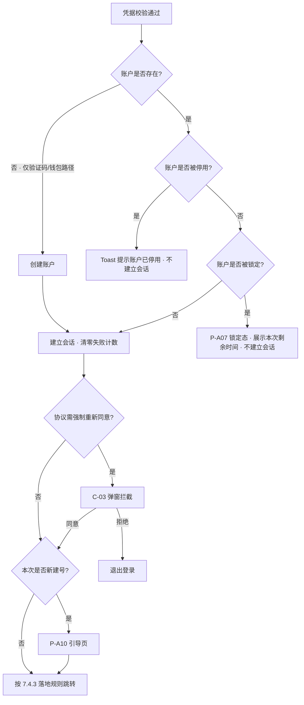

# 账户与登录 PRD · 01 模块详情

> 本文件是《资产端 / 资产管理端 · 账户与登录 PRD》拆分后的第 1 分册。章节号与编号沿用拆分前，未做重排。
> 入口与全文导航见主文档 [`v1.0-账户与登录-PRD.md`](./v1.0-账户与登录-PRD.md)。

**本文件讲什么**：第 7 章模块详情——每个功能模块的业务逻辑、规则与边界，包括首次登录自动建号、三种登录方式、协议前台交互、引导与落地规则、凭据完备性、账户设置、资产管理端。

**本文件不讲什么**：

| 你在找 | 去这里 |
| --- | --- |
| 功能清单、页面清单、权限矩阵 | 主文档 [`v1.0-账户与登录-PRD.md`](./v1.0-账户与登录-PRD.md) 第 5、6、11 章 |
| 字段校验规则、界面文案、线框 | [`02-页面字段与双语文案.md`](./02-页面字段与双语文案.md) 第 8 章 |
| 时序图、异常流程表、状态机 | [`03-流程图与状态机.md`](./03-流程图与状态机.md) 第 9、10 章 |
| 会话失效、账户锁定、滑块与限频 | [`04-安全与风控.md`](./04-安全与风控.md) 12.1～12.4 |
| 通知触发时点、站内信与邮件文案 | [`05-消息通知与邮件模板.md`](./05-消息通知与邮件模板.md) 12.5、12.6 |
| 验收标准 | [`06-验收标准.md`](./06-验收标准.md) 第 18 章 |

---

## 7. 模块详情

### 7.1 M1 · 首次登录即注册（自动建号）

> 平台不存在独立的注册流程、注册页与注册按钮；开户是登录的副作用。

#### 7.1.1 自动建号的适用范围

| 登录路径 | 是否自动建号 | 判定条件 |
| --- | --- | --- |
| 邮箱验证码登录 | ✅ 是 | 验证码校验通过 **且** 该邮箱未绑定任何账户 |
| 钱包签名登录 | ✅ 是 | 验签通过、**签名恢复地址与手填地址一致** **且** 该地址未绑定任何账户 |
| 邮箱密码登录 | ❌ 否 | 见 7.1.2 |
| 设置 / 重置密码 | ❌ 否 | 该入口是找回/补设意图，不是开户意图 |
| 管理端登录 | ❌ 否 | 管理端账号一律由技术直接提供 |

**为什么只有验证码与签名两条路径可以建号**

这两条路径在建号那一刻，用户已完成对该凭据的**所有权证明**：能收到并输入验证码即证明控制该邮箱；能对服务端下发的一次性消息签名即证明控制该钱包私钥。有了所有权证明，自动建号就不会造成「替别人抢注」。没有所有权证明的路径，一律不得建号。

#### 7.1.2 邮箱密码登录为什么不建号

密码**不构成对邮箱的所有权证明**：任何人都可以对一个从未见过的邮箱地址编造一个密码。如果密码路径也能建号，攻击者只要输入受害者的邮箱和任意密码，就能把这个邮箱抢注成自己的账户。因此：

- 邮箱不存在 → **不建号**；
- 邮箱存在但从未设置过密码 → **不建号**，也不放行；
- 邮箱存在且有密码但密码错误 → 拒绝。

上述三种情况**返回完全相同的、不可区分的提示**，见 7.2.2。

#### 7.1.3 建号时写入的内容

| 建号路径 | 写入 | 未写入 |
| --- | --- | --- |
| 邮箱验证码 | `email`、`email_verified_at`（当前时间）、`created_via = email_code`、协议同意记录、语言与时区偏好 | `wallet_address`、密码 |
| 钱包签名 | `wallet_address`、`wallet_bound_at`、`created_via = wallet_signature`、协议同意记录、语言与时区偏好 | `email`、密码 |

- 建号后账户状态为 `incomplete`（邮箱与钱包未同时具备）。
- 建号与登录在同一次提交内完成，用户感知上只有「登录成功」这一个动作。
- **验证码邮件文案不区分是否首次**：无论该邮箱是否已有账户，邮件都是同一套「登录验证码」文案。既避免新用户困惑，也避免邮件内容泄漏该邮箱是否已注册。
- **建号成功后不设独立的确认页**：直接进入引导页 P-A10，确认表达是引导页顶部的一个区块，见 7.4.1。

### 7.2 M2 · 资产端登录

三种方式在同一登录页内切换，页面顶部为方式切换器，底部为协议勾选。

#### 7.2.1 邮箱验证码登录（含首次建号，F-01）

1. 输入邮箱 → 点「Send code」→ 滑块校验 → 限频校验 → 发码 → 60 秒倒计时。
2. 输入验证码 → 勾选协议 → 提交。
3. 服务端校验验证码：
   - 通过 **且** 邮箱已绑定账户 → 进入 7.2.5 的登录后处理顺序；
   - 通过 **且** 邮箱未绑定任何账户 → **创建账户并登录**，邮箱标记为已验证；
   - 不通过 → Toast 提示 `Invalid or expired code. / 验证码不正确或已过期。`

> **枚举防护说明**：未注册邮箱走本路径会直接建号成功，用户看到的都是「登录成功」，界面上不存在「该邮箱未注册」这种信号，因此「已注册 / 未注册」在本路径上**天然不可区分**。

#### 7.2.2 邮箱密码登录（不建号，F-03）

1. 输入邮箱 + 密码（密码框右侧提供**眼睛图标**切换显示/隐藏）→ 勾选协议 → 提交。
2. 以下三种情况**返回完全相同的提示**，从响应文案到响应时间均不可区分：邮箱未绑定账户 / 已绑定但从未设密码 / 已绑定且有密码但密码错误。
3. 统一提示：

| English | 中文 |
| --- | --- |
| Incorrect email or password. If you haven't set a password, sign in with an email verification code instead. | 邮箱或密码不正确。如果你尚未设置密码，请改用邮箱验证码登录。 |

4. 只有第三种情况计入登录失败计数，但**计数与否不得体现在响应上**。
5. 密码 Tab 下常驻**三条静态入口**（静态文案，与是否失败无关，不泄漏任何信息）：

| 入口 | English | 中文 | 去向 |
| --- | --- | --- | --- |
| 忘记密码 | Forgot password? | 忘记密码？ | P-A03 |
| **没有密码** | **No password? Set one** | **没有密码？设置密码** | P-A03（同一流程，见 7.4） |
| 改用验证码 | Sign in with an email code → | 改用邮箱验证码登录 → | 切到验证码 Tab 并带上已填邮箱 |

#### 7.2.3 钱包签名登录（链接外部钱包，含首次建号，F-02 / F-06）

界面上统一称为**「链接外部钱包」**（Link external wallet）。

**流程**

1. **先手工填写钱包地址**：用户在输入框中填入要登录的 EVM 地址，前端做格式校验。
2. 点「Link external wallet / 链接外部钱包」→ 通过钱包连接 SDK 连接钱包。
3. 前端请求一次性签名消息 → 用户在钱包中签名 → 服务端验签。
4. **服务端校验签名恢复出的地址与手填地址是否一致**：
   - 不一致 → **直接拒绝**，Toast 提示，不建号、不登录；
   - 一致且该地址已绑定账户 → 进入 7.2.5 的登录后处理顺序；
   - 一致且该地址未绑定任何账户 → **创建账户并登录**。

**手填地址的语义**

| 项 | 口径 |
| --- | --- |
| 手填地址的作用 | **仅用于指定要登录哪个账户**，它是一个"账户选择器"，不具备任何身份证明效力 |
| 真正的身份证明 | **仍然是钱包消息签名**。签名不通过，填对地址也不放行 |
| 一致性校验 | 服务端从签名中恢复出签名者地址，与手填地址做**大小写不敏感的严格比对**，不一致一律拒绝 |
| 校验位置 | **服务端**。前端可先行比对以便快速反馈，但不构成防线 |
| 填错地址的后果 | 签名恢复出的地址必然与之不符，请求被直接拒绝——既不会登录到错误账户，也不会用错误地址建出新账户。填错只需重填 |

**手填地址的格式校验与提示**

| 校验项 | 规则 | English | 中文 |
| --- | --- | --- | --- |
| 必填 | 不可为空 | Enter your wallet address. | 请输入钱包地址。 |
| 前缀与长度 | `0x` + 40 位十六进制 | Enter a valid EVM wallet address (0x followed by 40 hexadecimal characters). | 请输入有效的 EVM 钱包地址（0x 开头，后跟 40 位十六进制字符）。 |
| 字符集 | 仅 `0-9a-fA-F` | 同上 | 同上 |
| 校验和 | 若填入带大小写校验和的地址，按 EIP-55 校验；不通过时提示但**不阻断**（允许填全小写地址） | This address has an invalid checksum. Check it carefully before continuing. | 该地址的校验和不正确，请仔细核对后再继续。 |
| 空格 | 前后空格自动去除 | — | — |
| 签名地址不一致 | 服务端校验失败 | The signed address doesn't match the address you entered. Check the account selected in your wallet. | 签名地址与你填写的地址不一致，请检查钱包中选择的账户。 |

**所有钱包状态提示统一走 Toast（C-12）**

连接、签名、切换账户、切换网络、拒签、验签失败等**全部状态提示一律通过顶部居中的 Toast 呈现**，钱包面板内不使用内嵌文案或页内提示条。

| 状态 | Toast 文案（English / 中文） |
| --- | --- |
| 未检测到钱包 | No wallet detected. Install a supported wallet to continue. / 未检测到可用钱包，请先安装受支持的钱包。 |
| 连接成功 | Wallet linked. / 钱包已链接。 |
| 用户拒绝连接 | Connection request was rejected in your wallet. / 你在钱包中拒绝了链接请求。 |
| 请求签名中 | Check your wallet to sign the message. / 请在钱包中确认签名。 |
| 用户拒绝签名 | Signature request was rejected in your wallet. / 你在钱包中拒绝了签名请求。 |
| 签名消息过期 | The signature request expired. Please try again. / 签名请求已过期，请重试。 |
| 验签失败 | Signature verification failed. / 签名验证失败。 |
| 地址不一致 | The signed address doesn't match the address you entered. Check the account selected in your wallet. / 签名地址与你填写的地址不一致，请检查钱包中选择的账户。 |
| 钱包内切换了账户 | The account in your wallet changed. Link the wallet again. / 钱包中的账户已切换，请重新链接。 |
| 网络不受支持 | Switch your wallet to a supported EVM network. / 请将钱包切换到受支持的 EVM 网络。 |
| 切换网络成功 | Network switched. / 网络已切换。 |
| SDK 加载失败 | Wallet service is unavailable. Please retry or sign in with your email. / 钱包服务暂不可用，请重试或改用邮箱登录。 |

**钱包连接的能力要求（不锁定具体 SDK 与钱包清单）**

具体 SDK 与支持的钱包清单由技术选型决定，PRD 不约束。所选方案必须覆盖：连接、断开、感知账户切换、感知与切换网络、链上消息签名。断开只影响前端连接态，**不解绑账户绑定关系**，需在文案中说明。

#### 7.2.4 三方式同账户（F-05）

- 账户主键为不可变的 `account_id`；邮箱与钱包地址均为登录标识（钱包地址绑定后不可改）。
- 任一入口登录后，会话中承载的都是同一个 `account_id`，账户数据、语言偏好、认证状态完全一致。
- 邮箱建号的用户后续绑定钱包后即可用钱包登录同一账户；反之亦然。

#### 7.2.5 登录后的处理顺序

> **锁定判定位于凭据校验之后**，这一顺序对防枚举至关重要，见 [12.2.4](./04-安全与风控.md)。

### 7.3 M3 · 用户协议前台交互（仅资产端）

> 协议正文、版本号、生效时间、语种、是否「强制重新同意」的判定，全部由 **WS-301** 定义。
> **管理端不适用本节全部内容**：管理端登录不以同意用户协议为前置，登录页无协议勾选，首登重置页无任何勾选项，全程没有协议同意环节。

#### 7.3.1 勾选（C-02）

- 位置：**资产端登录页提交按钮上方，全站仅此一处**。
- 形态：单个复选框 + 内联链接文本。默认**不勾选**。
- 文案：`I have read and agree to the <Terms of Service> and <Privacy Policy>. / 我已阅读并同意《服务条款》和《隐私政策》。`
- 链接点击后在新窗口/弹层打开当前生效版本正文，不打断表单填写状态。
- 未勾选时提交按钮置灰；点击置灰按钮时在复选框下方显示红色提示并使复选框抖动一次。
- **协议区只有这一个复选框**，不提供任何其他可选勾选项。

#### 7.3.2 同意提交

- 提交时随请求带上当前展示的协议版本号与语种。
- 服务端记录一条同意记录（账户、协议类型、版本、语种、时间、IP/设备摘要）。
- **自动建号场景**：协议同意记录与账户在同一次提交内一并写入，保证「不存在没有同意记录的账户」。

#### 7.3.3 强制重新同意弹窗（C-03）

- 触发时机：资产端登录成功、建立会话之后、进入引导页或落地页之前。
- 模态弹窗，不可点击遮罩关闭，无关闭按钮；正文未滚动到底时主按钮置灰。
- 「Agree and continue / 同意并继续」→ 提交同意记录 → 继续登录后流程；「Sign out / 退出登录」→ 销毁会话回登录页。
- 弹窗展示期间仍可切换语言、查看协议、退出登录。

### 7.4 M4 · 建号后引导与落地规则

#### 7.4.1 引导页（P-A10，F-04）

**触发**：仅在本次登录**新建了账户**时展示一次；老用户登录不进此页。**不设独立的建号确认页**——建号确认是本页顶部的一个区块。

**内容结构**

1. **顶部建号确认区块**：`Welcome! Your account has been created. / 欢迎！你的账户已创建。` 下方展示本次建号所用的凭据（邮箱地址或钱包地址缩略），让用户当场核对是不是自己预期的那个。这是用户唯一能感知到「我刚开了户」的地方，必须显著。
2. **主引导（必要，但不强制此刻完成）**：

| 建号路径 | 引导内容 | 说明文案 |
| --- | --- | --- |
| 邮箱验证码建号 | 绑定 EVM 钱包 | `Link an EVM wallet. You'll need both an email and a wallet to start identity verification. / 绑定 EVM 钱包。发起个人认证时需要同时具备邮箱与钱包。` |
| 钱包签名建号 | 绑定邮箱 | `Add an email address. You'll need both an email and a wallet to start identity verification, and we'll use it for security notifications. / 绑定邮箱。发起个人认证时需要同时具备邮箱与钱包，我们也会用它发送安全通知。` |

3. **可选项**：`Set a login password (optional) / 设置登录密码（可选）`，附说明 `You can always sign in with an email code or your wallet. / 你随时可以用邮箱验证码或钱包登录。`
4. **凭据保管须知**（重要，不可省略）：

| English | 中文 |
| --- | --- |
| Keep both your email and wallet accessible. Neither can be replaced if you lose access to it. | 请妥善保管你的邮箱与钱包，任何一项一旦无法访问都将无法更换。 |

> 这条须知是产品事实的准确表达，其依据见 7.5.4。文案不得弱化为"建议保管"，也不得删除。

5. 底部「Later / 稍后」按钮，与主操作等权重呈现，不置灰、不隐藏。

#### 7.4.2 点「稍后」的行为

- **整页收回**：引导页整体退出，不停留在引导页的任何残留态。
- 随后按 7.4.3 的落地规则跳转。
- 引导页**只展示一次**，后续通过常驻补全提示条（C-08）与账户设置补全，不再强制进入。

#### 7.4.3 登录后的落地规则（F-07）

无论是新建号走完引导页，还是老用户直接登录，最终都按以下规则决定落地页：

| 认证状态 | 落地页 |
| --- | --- |
| 个人认证或企业认证**未完成** | **P-A17 用户中心**（个人认证与企业认证页） |
| 企业认证**已通过** | **P-A16 总览页** |

- 认证状态由 WS-303 提供（见 [3.2](./v1.0-账户与登录-PRD.md) 接口表）。本模块只消费状态位、决定跳转。
- **总览页本期只出壳子**：作为落地目标与左侧菜单项存在，页面内容归后续需求。
- 若认证状态因接口异常暂时取不到，**默认落到用户中心**（保守选择：引导用户去完成认证，比落到一个空壳总览页更有意义）。

### 7.5 M5 · 凭据完备性与受限态收敛

#### 7.5.1 凭据的三种角色

| 凭据 | 角色 | 是否作为门槛 | 可否更换 |
| --- | --- | --- | --- |
| 邮箱 | 身份标识 + 安全通知通道 + 密码找回通道 | **是**——发起个人认证时必须具备 | 可修改，但**须验证旧邮箱**（见 7.6.3） |
| 钱包地址 | 身份标识 + 链上业务主体 | **是**——发起个人认证时必须具备 | **不可修改**（见 7.6.5） |
| 登录密码 | 便利性登录方式 | **否**——任何时候都不作为门槛 | 可随时设置或修改（P-A13 弹窗） |

> 文档中任何位置都不存在「密码必须补全」的要求。

#### 7.5.2 硬门槛：发起个人认证的前置校验（F-12）

- **校验时点**：用户点击「发起个人认证 / Start identity verification」按钮时（该按钮位于 P-A17 用户中心，功能归 WS-303）。
- **校验内容**：账户的 `email` 与 `wallet_address` 是否**同时非空**。密码不参与判定。
- **未通过时**：**不跳走**，在当前页面弹出就地补齐弹层（C-09）：

| 缺失项 | 弹层内容 |
| --- | --- |
| 缺钱包 | 标题 `Link your wallet to continue / 绑定钱包后继续`；「链接外部钱包」按钮，走连接 + 签名；成功后弹层关闭并**原地继续** |
| 缺邮箱 | 标题 `Add your email to continue / 绑定邮箱后继续`；邮箱输入 + 滑块 + 验证码；成功后原地继续 |
| 两项都缺 | 分两步在同一弹层内依次完成，带步骤指示（1/2、2/2） |

- 弹层可关闭，关闭后回到原页面，不改变任何状态。
- 补齐成功后账户状态由 `incomplete` 变为 `active`，常驻提示条消失。
- **服务端必须同样校验**，前端弹层不是唯一防线。

#### 7.5.3 受限态收敛：跳过引导不做全局封锁（F-11）

- 跳过引导后，用户**不进入任何全局受限态**：可正常浏览、进入账户设置、使用不依赖认证的功能。
- 唯一的凭据硬卡点是 7.5.2 的「发起个人认证」。
- 凭据未齐时全局展示常驻补全提示条（C-08）：
  - 缺钱包：`Link a wallet to be ready for identity verification. / 绑定钱包后即可发起个人认证。`
  - 缺邮箱：`Add an email to be ready for identity verification and to receive security notifications. / 绑定邮箱后即可发起个人认证，并接收安全通知。`
  - 可折叠为小图标，但**不可永久关闭**，直到凭据补齐；带「Complete now / 立即补全」按钮，点击进入 P-A11 账户设置对应区块。

**为什么这样设计**：业务功能本来就以「个人认证通过」为前置条件——凭据不全的用户即使不做全局封锁，也照样做不了业务，因为他连认证都发起不了。把封锁提前到进门处并没有多挡住任何真正的业务操作，代价却是新用户刚建号就撞墙。

**边界声明**：各业务模块的功能放行，**以认证状态为准，不以本模块的凭据完备状态为准**。业务模块不应自行读取 `account_status == incomplete` 做拦截。

#### 7.5.4 凭据一旦丢失即无法更换（须明确告知用户）

本模块的两项身份凭据在丢失后**都没有自助更换途径**，这是本期的产品事实，必须在界面上向用户讲清楚，不能让用户事后才发现：

| 情形 | 后果 |
| --- | --- |
| **失去邮箱访问权** | 修改邮箱须先验证旧邮箱（7.6.3），旧邮箱进不去则该流程走不通，**邮箱无法更换**。此时若账户已绑定钱包，用户仍可用钱包签名登录、账户继续可用，但邮箱将永久停留在旧地址；若账户只有邮箱、且未设密码，则将无法再登录 |
| **失去钱包私钥** | 钱包地址绑定后不可修改（7.6.5），**钱包无法更换**。此时用户仍可用邮箱验证码或密码登录，个人认证的凭据完备性判定也不受影响（地址仍绑定在账户上），但将永久无法再用钱包签名登录 |

**告知方式**（两处，均不可省略）：

1. **引导页凭据保管须知**（7.4.1 第 4 条）：`Keep both your email and wallet accessible. Neither can be replaced if you lose access to it. / 请妥善保管你的邮箱与钱包，任何一项一旦无法访问都将无法更换。`
2. **账户设置页**：邮箱与钱包地址条目下方各展示一行说明，见 7.6.1 与 7.6.5。

> 这是**用户须知**，不是功能描述——它描述的是现有功能的边界，用于让用户在还来得及的时候采取保管措施。相关风险见 [17.2](./v1.0-账户与登录-PRD.md)。

### 7.6 M6 · 账户设置（P-A11 单页）

#### 7.6.1 页面结构与进入方式

- **进入方式**：右上角账号下拉（C-11）→「账户设置」。**左侧菜单不提供入口**。
- **形态**：单页 + 顶部 tab 锚点。点击 tab 后**整页平滑滚动**到对应区块，不切换路由、不重新加载。

| tab | 区块 | 内容 |
| --- | --- | --- |
| 账号信息 | 账号信息 | 邮箱、登录密码、钱包地址、账户状态 |
| 偏好信息 | 偏好信息 | 界面语言、时区 |

- 页面同时渲染两个区块的全部内容（不是切换显示），tab 只控制滚动位置。

**账号信息区块的条目**

| 条目 | 展示 | 操作 |
| --- | --- | --- |
| 邮箱 | 当前邮箱；未绑定时展示 `Not linked / 未绑定`。已绑定时下方展示一行说明：`Changing your email requires verifying the current one. Keep it accessible. / 更换邮箱需要验证当前邮箱，请妥善保管。` | 「修改」/「绑定」→ 唤起 P-A12 弹窗 |
| 登录密码 | `Set / 已设置` 或 `Not set / 未设置`（**不带警示色或感叹号图标**，它是可选项，不是缺陷） | 「修改」/「设置」→ 唤起 P-A13 弹窗 |
| 钱包地址 | 当前地址（缩略 + 复制 + 区块浏览器跳转）；未绑定时展示 `Not linked / 未绑定` 与「链接外部钱包」按钮 | **已绑定时只读，无任何修改入口**，见 7.6.5 |
| 账户状态 | `凭据未齐` / `正常` 等状态标签 | 只读 |

**偏好信息区块的条目**

| 条目 | 操作 |
| --- | --- |
| 界面语言 | 下拉选择 `English` / `简体中文`，即时生效并持久化（见 [13.3](./02-页面字段与双语文案.md)） |
| 时区 | 下拉选择 IANA 时区，保存后全站时间展示随之变化 |

#### 7.6.2 再认证（Re-authentication）

修改邮箱、修改/设置密码前，先要求用户证明当前登录态是本人。再认证在**对应弹窗内**完成，不跳页。

| 账户已有凭据 | 可用的再认证因子（任选其一） |
| --- | --- |
| 有密码 | 输入当前密码 |
| 有钱包 | 钱包签名（用途声明为「Re-authenticate」） |
| 有邮箱 | 邮箱验证码（发送前同样过滑块与限频） |

- 弹窗内展示该账户可用的全部因子，用户自选；只有一种可用因子时直接进入该因子。
- 再认证通过后 10 分钟内不重复要求；超时后需重新认证。
- 再认证失败计入登录失败计数。

#### 7.6.3 修改邮箱（P-A12 弹窗，F-17）

在 P-A11 点「邮箱」条目唤起弹窗，弹窗内分步完成：

1. 再认证。
2. **验证旧邮箱**：向当前邮箱发送验证码（滑块 + 限频），校验通过后进入下一步。**本步骤不可跳过**——这意味着失去旧邮箱访问权的用户无法完成本流程，见 7.5.4。
3. 输入新邮箱 → 滑块 → 新邮箱验证码 → 校验通过。
4. 提交 → 邮箱替换 → **全部会话失效** → 关闭弹窗并跳登录页，提示用新邮箱登录。
5. 向旧邮箱与新邮箱各发安全通知。

> 账户原本无邮箱（钱包建号且未补）时，本流程即「绑定邮箱」，跳过第 2 步，标题变为 `Add email / 绑定邮箱`；**首次绑定不触发会话失效**（见 [12.1.1](./04-安全与风控.md) 例外）。

#### 7.6.4 修改 / 设置密码（P-A13 弹窗，F-18）

1. 再认证。
2. 输入新密码 + 确认新密码（密码框带**眼睛图标**），按 [8.4](./02-页面字段与双语文案.md) 校验全部规则并展示实时复杂度提示清单，包含**与原密码比对**。
3. 提交 → **全部会话失效** → 关闭弹窗并跳登录页。
4. 向绑定邮箱发安全通知（无邮箱时跳过）。
5. 账户原本无密码时，本流程即「设置密码」，标题变为 `Set password / 设置登录密码`，此时无原密码可比对。

#### 7.6.5 钱包地址只读（F-19）

**钱包地址绑定后不支持修改。**

| 状态 | 展示 |
| --- | --- |
| 未绑定 | `Not linked / 未绑定` + 「Link external wallet / 链接外部钱包」按钮（走连接 + 签名绑定） |
| 已绑定 | 地址（缩略 + 复制按钮 + 区块浏览器跳转），**无「修改」「解绑」「更换」任何按钮** |

已绑定时在地址下方展示只读说明：

| English | 中文 |
| --- | --- |
| Your wallet address can't be changed after it's linked. Keep this wallet accessible. | 钱包地址绑定后不可修改，请妥善保管该钱包。 |

**连带影响**：见 7.5.4 与 17.2。服务端必须拒绝任何修改钱包地址的请求，不能只靠前端隐藏入口。

### 7.7 M7 · 资产管理端

> **资产管理端的账户管理归后期其他 issue 实现，本模块不覆盖。** 本期管理端共四块：登录、首登强制重置密码、忘记密码、账户设置。

#### 7.7.1 账号来源

| 项 | 口径 |
| --- | --- |
| 账号来源 | **由技术直接提供**：通过部署脚本 / 数据初始化写入，应用层**不提供任何增删改入口** |
| 初始密码 | 由技术生成并**线下交付**给本人；系统不通过邮件、站内信或任何在线渠道下发 |
| 初始密码有效期 | 7 天。过期后需联系技术重新发放 |
| 界面约束 | 管理端不提供任何绕过登录的初始化页面、安装向导或首次配置页；未登录状态下除登录页与忘记密码页外无任何可达页面 |
| 部署前置条件 | 「初始化管理员账号」是系统可用的**部署前置条件**，须写入部署清单；未执行则管理端无人可登录，且系统不提供任何自救入口 |

#### 7.7.2 登录（F-28）

- 登录字段：**工作邮箱** + 密码（密码框带眼睛图标）。仅此一种方式，管理端**不提供**验证码登录、钱包登录、第三方登录与自动建号。
- **登录页无用户协议勾选行**，不提供「记住我」。
- 登录失败计入登录失败计数，锁定规则与资产端一致（阶梯锁定，见 [12.2](./04-安全与风控.md)）。
- 失败提示统一为 `Incorrect email or password. / 邮箱或密码不正确。`（防枚举）。
- 初始密码已过期时：提示 `Your initial password has expired. Contact technical support to have it reissued. / 初始密码已过期，请联系技术人员重新发放。` 并不建立会话。

#### 7.7.3 首次登录强制重置密码（F-29）

- 判定：账户字段 `must_reset_password = true`。
- 登录成功后**立即**跳转 P-M02，且：前端路由守卫拦截所有其他管理端路由；**服务端对所有管理端业务接口做同样拦截**，前端拦截不可作为唯一防线。
- P-M02 页面元素：当前（初始）密码、新密码、确认新密码、密码规则实时校验清单。**页面上无任何勾选项。**
- 新密码需通过 8.4 全部规则，包含与原（初始）密码的比对。
- 重置成功 → `must_reset_password = false`，状态置 `active` → **全部会话失效** → 跳回登录页。
- P-M02 上只保留「退出登录」和语言切换两个逃生出口。

#### 7.7.4 管理端忘记密码（F-30）

1. 登录页点「Forgot password?」→ P-M03，输入工作邮箱。
2. 滑块校验 → 限频校验 → 向该工作邮箱发送验证码。**不透露该邮箱是否为有效管理端账号**：`If this email belongs to an admin account, a verification code has been sent. / 若该邮箱为管理端账号，验证码已发送。`
   > 管理端忘记密码的验证码**走工作邮箱**；线下交付只针对初始密码。
3. 输入验证码 → 校验通过 → P-M04 设置新密码。
4. 新密码需通过 8.4 全部规则，包含与原密码、与初始密码的比对。
5. 成功 → 全部会话失效 → 跳登录页。
6. 向工作邮箱发安全通知。

> **账户锁定期间本流程同样不可用**，见 [12.2.4](./04-安全与风控.md)。

#### 7.7.5 管理端账户设置（P-M05，F-31）

- **进入方式**：右上角账号下拉 →「账户设置」，与资产端结构一致。
- **形态**：单页 + tab 锚点滚动。

| tab | 条目 | 操作 |
| --- | --- | --- |
| 账号信息 | 工作邮箱 | 只读（登录账号，不可自助修改） |
| 账号信息 | 姓名 | 只读 |
| 账号信息 | 登录密码 | 「修改」→ 弹窗内完成再认证（当前密码）+ 设置新密码，规则同 8.4 |
| 账号信息 | 账号状态 | 只读 |
| 偏好信息 | 界面语言 | 下拉选择，即时生效并持久化 |
| 偏好信息 | 时区 | 下拉选择 |

---
