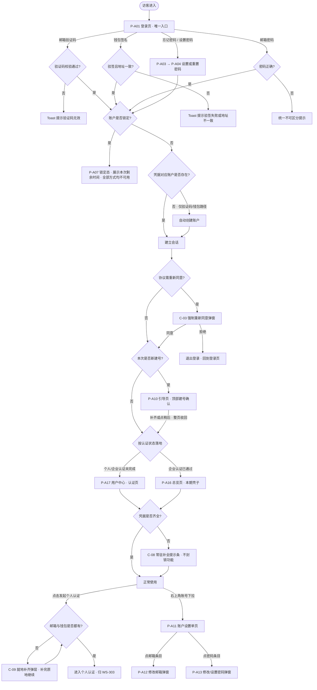

# 资产端 / 资产管理端 · 账户与登录 PRD（含全局国际化基线）

> **本 PRD 已拆分为 7 个文件，本文件是主文档与入口。** 拆分只改文件归属：**所有编号与章节号保持原值，未做任何重排**——原来的「12.5.3」拆分后仍叫「12.5.3」，只是搬到了另一个文件里；`F` / `AC` / `N` / `D` / `M` / `E` / `P` / `C` 各系列编号与拆分前逐一对应。

## 0. 导航索引

### 0.1 文件清单

| 文件 | 装了哪些章节 | 给谁看 |
| --- | --- | --- |
| **`v1.0-账户与登录-PRD.md`**（本文件） | 1 文档信息、2 背景与目标、3 范围与边界、4 用户角色与场景、5 信息架构与页面流、6 功能清单、11 权限、15 非功能要求、16 指标、17 依赖与风险、19 已确认口径与可调参数 | 所有人的入口。产品、项目、新加入的成员先读这一份 |
| [`01-模块详情.md`](./01-模块详情.md) | 7 模块详情 | 开发与测试。每个功能模块的业务逻辑与规则 |
| [`02-页面字段与双语文案.md`](./02-页面字段与双语文案.md) | 8 页面与字段定义（含 8.5 中英双语文案、8.6 线框、8.7 全局交互规范）、13 国际化基线 | 前端与设计。字段校验、界面文案、线框、国际化口径 |
| [`03-流程图与状态机.md`](./03-流程图与状态机.md) | 9 主流程与异常流程、10 状态机、14 数据对象与字段 | 开发与测试。时序图、状态流转、数据字段 |
| [`04-安全与风控.md`](./04-安全与风控.md) | 12.1 会话失效、12.2 阶梯锁定、12.3 滑块与限频、12.4 其他安全要求 | 开发与安全。三条强制安全条款都在这里 |
| [`05-消息通知与邮件模板.md`](./05-消息通知与邮件模板.md) | 12.5 通知矩阵（站内信）、12.6 邮件模板 | 开发与运营。站内信讲「什么时候发、发什么内容」，字段与展示归 WS-304；**邮件的模板、触发与投递由本模块自持** |
| [`06-验收标准.md`](./06-验收标准.md) | 18 验收标准 | 测试。全部验收条目 |

### 0.2 编号索引

拿到一个编号想知道去哪查，对照下表。**这些编号在拆分前后完全一致。**

| 编号 | 含义 | 定义位置 | 说明 |
| --- | --- | --- | --- |
| `F-01`～`F-37` | 功能点 | 本文件 第 6 章 | 各功能的详细规则见 [`01-模块详情.md`](./01-模块详情.md) |
| `AC-01`～`AC-268` | 验收标准 | [`06-验收标准.md`](./06-验收标准.md) 第 18 章 | 按主题分组 |
| `D-01`～`D-46` | 已确认口径 | 本文件 19.1 | 每条给出最终结论 |
| `N-01`～`N-23` | 可调参数 | 本文件 19.2 | 可改数值、不改逻辑 |
| `E-03`、`E-05`、`E-09`～`E-11` | 通知事件 | [`05-消息通知与邮件模板.md`](./05-消息通知与邮件模板.md) 12.5.2 | 站内信文案见同文件 12.5.3 |
| `M-02`、`M-04`、`M-07`～`M-12` | 邮件模板 | [`05-消息通知与邮件模板.md`](./05-消息通知与邮件模板.md) 12.6 | 与 E 系列的对应关系标在各模板标题上 |
| `P-A01`～`P-A17` | 资产端页面 | 本文件 5.1 | 页面内的业务规则见 [`01-模块详情.md`](./01-模块详情.md) |
| `P-M01`～`P-M05` | 管理端页面 | 本文件 5.1 | 同上 |
| `C-01`～`C-12`、`C-20` | 全局组件 | 本文件 5.1 | 交互规范见 [`02-页面字段与双语文案.md`](./02-页面字段与双语文案.md) 8.7。`C-20` 通知铃铛的形态与行为归 WS-304 |
| `P-A18` / `P-M20` | 消息中心页面 | **WS-304《消息通知》** | 本模块只在账号下拉中登记入口，页面本身不在本 PRD |

### 0.3 章节 → 文件对照

| 章节 | 所在文件 |
| --- | --- |
| 1、2、3、4、5、6 | 本文件 |
| 7 | [`01-模块详情.md`](./01-模块详情.md) |
| 8、13 | [`02-页面字段与双语文案.md`](./02-页面字段与双语文案.md) |
| 9、10、14 | [`03-流程图与状态机.md`](./03-流程图与状态机.md) |
| 11 | 本文件 |
| 12.1 ～ 12.4 | [`04-安全与风控.md`](./04-安全与风控.md) |
| 12.5、12.6 | [`05-消息通知与邮件模板.md`](./05-消息通知与邮件模板.md) |
| 15、16、17 | 本文件 |
| 18 | [`06-验收标准.md`](./06-验收标准.md) |
| 19 | 本文件 |

---
## 1. 文档信息

| 项目 | 内容 |
| --- | --- |
| 文档名称 | 资产端 / 资产管理端 · 账户与登录产品需求文档（含全局国际化基线） |
| 对应需求 | WS-302（父需求 WS-296「资产端、资产管理端-登录和认证」） |
| 上游输入 | 《Carloha 资产端与资产管理端登录、认证及通知需求诊断简报》V1.0 |
| 编写人 | 许楚清（需求分析师） |
| 文档语言 | 中文（界面文案给出中英对照） |
| 覆盖端 | 资产端 Web、资产管理端 Web |
| 关联需求 | WS-301「资产管理端 · 协议管理模块」——协议正文、版本、生效与重新同意规则由该需求定义，本文档只消费其「当前生效版本」口径；WS-303 个人认证与企业认证——本文档只定义发起认证前的凭据完备性校验、引导挂载点与登录后的落地规则，不展开认证流程 |

> 说明：本文中的功能口径与安全口径均已由需求方确认，作为正文规则直接执行。第 19 章给出全部已确认口径与可调参数的汇总。
> 文中个别性能与体验类目标值（如接口响应时间、可用性、滑块一次通过率）标注为「目标值」，需在联调与灰度阶段校准，不影响功能逻辑与验收通过与否。
> 第 12 章的三条安全条款（会话失效、登录锁定、验证码人机校验与限频）为强制条款，不可省略、不可降级。

---

## 2. 背景与目标

### 2.1 背景

平台面向国际资产参与方，资产端用户同时持有邮箱与 EVM 钱包两类身份凭据，资产管理端由平台运营。当前需要先把「账户如何建立、如何登录、如何找回、如何变更」这条最底层的链路定义清楚，其余业务模块（实名认证、消息通知、资产业务）都依赖本模块产出的账户主体与登录态。

在开户环节，平台采取**无独立注册流程**的设计：用户首次用邮箱验证码或钱包签名登录时，系统自动为其建立账户。这两条路径本身已经完成了凭据所有权的证明（能收到验证码即证明控制该邮箱，能签名即证明控制该钱包私钥），再让用户走一遍「注册」表单只是重复劳动。

同时，中英双语与国际化展示口径是全平台的基线能力，若不在本模块一次性定义，后续每个模块都会各自实现一套语言/时区/金额/地址展示口径，造成割裂。因此国际化基线在本文档统一定义，其他需求直接引用。

### 2.2 本期目标

1. **开户零门槛**：不存在独立的注册流程与注册页；用户首次用邮箱验证码或钱包签名登录即自动建号，其余信息在引导页按需补齐。
2. 三种登录方式（邮箱验证码、邮箱密码、钱包签名）指向**同一个账户**。
3. **凭据门槛只设一道**：邮箱与钱包地址两项在**发起个人认证时**必须同时具备；**密码是可选凭据**，任何时候都不阻塞用户。
4. 用户忘记密码或从未设过密码，都能通过邮箱验证身份后自助设置。
5. 账户与偏好的查看与设置收敛到**一个账户设置单页**，通过右上角账号下拉进入；左侧菜单只承载业务导航。
6. 敏感变更（密码、邮箱）具备再认证与会话失效保护，凭据泄露不等于账户被接管。
7. 连续凭据校验失败按**阶梯时长**锁定账户，锁定期间所有登录方式均不可用。
8. 全平台**默认英文**、中英可即时切换、偏好在未登录态与已登录态均持久化；时间、数字、金额、链上地址与哈希有统一展示口径。

### 2.3 范围边界

以下内容不在本模块覆盖范围内，归属如下：

| 边界项 | 归属 |
| --- | --- |
| 个人认证与企业认证的流程内容 | WS-303。本模块只定义发起认证前的凭据完备性校验、就地补齐引导，以及登录后按认证状态落地的跳转规则 |
| 协议正文维护、版本管理、生效与重新同意的判定规则 | WS-301。本模块只消费「当前生效版本」与「是否强制重新同意」两个口径 |
| 站内消息与通知中心 | 对应子需求。本模块**定义账户与登录类通知的触发时点与消息内容**（见 [12.5](./05-消息通知与邮件模板.md)），**不定义展示形态**——通知中心页面、铃铛入口、未读角标、已读语义、列表交互均归该子需求 |
| 资产管理端的账户管理 | 后期其他 issue 实现，本模块不覆盖（见 3.2） |
| 一个账号管理多家企业 | 后期迭代。本模块的数据模型预留扩展位，不出功能与界面 |
| **总览页的页面内容** | 本模块只出**页面壳子**（作为登录后的落地目标与左侧菜单项存在），页面内容归后续需求 |

---

## 3. 范围与边界

### 3.1 已确认的产品决策（直接作为约束）

| # | 决策 |
| --- | --- |
| 1 | 账户模型：邮箱与钱包地址均全局唯一，且与账户一对一绑定。 |
| 2 | 支持链：EVM 系列。 |
| 3 | 钱包登录采用链上消息签名验证（链下签名消息，不发起交易）；**登录时需先手工填写钱包地址**，签名恢复出的地址必须与之一致，不一致直接拒绝。 |
| 4 | **首次用邮箱验证码或钱包签名登录即自动建号**，不存在独立注册流程；其余信息在引导页补齐，可跳过。 |
| 5 | **邮箱密码登录不参与自动建号**（密码不构成邮箱所有权证明）。 |
| 6 | **邮箱 + 钱包地址两项是发起个人认证的前置条件**；**密码为可选凭据**，任何时候都不作为门槛。 |
| 7 | **钱包地址绑定后不支持修改**。 |
| 8 | **修改邮箱须验证旧邮箱**。 |
| 9 | 管理端账号由技术直接提供，界面不提供任何增删改入口；首次登录直接进入密码重置。 |
| 10 | 退出登录、修改密码、重置密码、设置密码、修改邮箱成功后，旧会话全部失效（含当前设备与其他所有设备）。 |
| 11 | 密码登录失败或钱包签名验证失败连续 5 次进入账户锁定；**锁定时长为阶梯：首次 10 分钟，再次 30 分钟**；锁定期间任何登录方式与设置/重置密码均不可用，只能等待到期。 |
| 12 | 所有发送邮箱验证码的入口，发送前统一先过滑块人机校验弹窗，并施加发送限频。 |
| 13 | 密码复杂度：8–20 字符，至少包含 1 个英文字母和 1 个数字。 |
| 14 | 新密码不得与原密码相同，管理端账号另不得与初始密码相同。 |
| 15 | 管理端登录不以同意用户协议为前置，管理端登录页无协议勾选，首登重置页无任何勾选项。 |
| 16 | 管理端登录账号采用工作邮箱；初始密码线下交付，不通过邮件下发。 |
| 17 | 管理端本期只有「管理员」一种角色，所有管理员权限等同。 |
| 18 | 滑块人机校验自研；钱包连接走三方 SDK 服务，具体选型由技术决定。 |
| 19 | **语言默认英文**；中英可切换，切换即时生效并持久化。 |
| 20 | **Toast 是全站统一的轻提示载体，位置固定在顶部居中**，双端通用。 |

### 3.2 与其他需求的接口

| 依赖方向 | 内容 | 归属 |
| --- | --- | --- |
| 本模块 → 其他模块 | `account_id`（不可变账户主键）、登录态与会话、账户状态、语言与时区偏好 | 本文档定义 |
| 本模块 ← WS-301 | 「当前生效协议版本」「是否强制重新同意」两个口径 | WS-301 定义，本模块消费 |
| 本模块 → WS-303 认证 | ① 发起个人认证时的凭据完备性前置校验与就地补齐引导；② 登录后按认证状态决定落地页的跳转规则；③ 「用户中心」作为认证功能的承载入口 | 本文档定义校验、引导与跳转；认证流程内容归 WS-303 |
| 本模块 ← WS-303 认证 | 「个人认证是否完成」「企业认证是否完成」两个状态位，用于 7.4.3 的落地判定 | WS-303 提供，本模块消费 |
| 本模块 → 各业务模块 | 业务功能的放行**以认证状态为准**，不以本模块的凭据完备状态为准 | 边界声明，见 [7.5.3](./01-模块详情.md) |
| 本模块 → 消息通知模块（WS-304） | 账户与登录类**站内信**的事件负载（见 [14.8](./03-流程图与状态机.md)）：业务类型、触发时间、分类、标题与正文、跳转目标、去重键 | 本文档定义**发什么、何时发**；**消息通知模块**只做站内信的展示层（可见范围、未读计数、列表与详情、已读语义、跳转与失效表现） |
| 本模块 → 自身邮件投递 | 邮件的模板、触发时点、发送、判空跳过与退信处理 | **本模块自持**（用户 2026-09-08 裁定：邮件不属于消息通知模块）。WS-304 不定义、不消费、不承担 |
| 本模块 ← WS-304 消息通知 | ① 消息数据契约（字段名与取值格式，见其 `02-数据契约与字段.md` 第 9 章）；② 站内信的展示、已读与未读口径（其 `01-页面与展示.md`）；③ 消息中心页面 `P-A18` / `P-M20` 与铃铛快捷面板等组件 | 站内消息的通用规则以 WS-304 为准，本模块不再自定义；本模块只提供事件与内容。**渠道与邮件规则不再从 WS-304 取**——其原 9.9 已随「邮件不属于消息通知」的裁定删除，邮件规则由本模块自持 |
| **本模块 ← WS-301 / WS-303（通知挂载点）** | 「协议版本更新需重新同意」「实名认证审核结果」两类站内信的**触发源不在本模块**，其触发时点与文案由各自需求定义 | 本文档只留挂载点，不定义这两类的文案，避免与 WS-301 / WS-303 重复定义 |
| **资产管理端的账户管理** | **归后期其他 issue 实现，本模块不覆盖。** 本期管理端账号全部由技术直接提供，应用层不提供任何增删改入口 | 后期 issue |
| 本模块 → 技术选型 | 钱包连接 SDK 与支持钱包清单 | PRD 只写能力要求，不约束具体选型 |
| 本模块 → 技术 / 运维 | 管理端账号的创建、停用、初始密码发放与重置，均由技术在数据层直接维护 | 见 [7.7.1](./01-模块详情.md) |
| 本模块 → 部署 | 管理端账号初始化、区块浏览器映射表配置 | 见 [7.7.1](./01-模块详情.md) 与 13.6 |

---

## 4. 用户角色与场景

### 4.1 角色

| 角色 | 所在端 | 描述 | 本模块内的核心诉求 |
| --- | --- | --- | --- |
| 资产端首次到访用户 | 资产端 | 尚无账户，从登录页进入 | 用手上已有的一种凭据直接进门，不必先填注册表 |
| 资产端已有账户用户 | 资产端 | 日常登录与维护 | 三种入口都能进同一个账户；账户与偏好设置集中在一处 |
| 资产端准备做认证的用户 | 资产端 | 要发起个人认证 | 清楚知道还差哪项凭据，并能在当前页面就地补齐 |
| 资产端忘记密码 / 未设密码的用户 | 资产端 | 想用密码登录但没有密码或忘了密码 | 在登录页就能看到出路，用邮箱验证身份后设置或重置密码 |
| 管理员 | 管理端 | 使用技术直接提供的工作邮箱账号，本期唯一的管理端角色 | 拿到账号后顺利改密上岗；忘记密码能自助重置；能查看和设置自己的账号信息与偏好 |
| 技术 / 运维 | 数据层 | 直接维护管理端账号 | 有明确的账号字段与状态口径可依循 |
| 国际用户（跨语言 / 跨时区） | 双端 | 默认看到英文，按需切中文 | 语言切换即时生效并被记住；时间与金额按本地口径展示 |

### 4.2 用户故事

| # | 角色 | 用户故事 | 对应功能 |
| --- | --- | --- | --- |
| US-01 | 首次到访用户 | 作为只有邮箱的新用户，我希望在登录页填邮箱、收一次验证码就直接进去，系统自动帮我建好账户 | 邮箱验证码首次登录自动建号 |
| US-02 | 首次到访用户 | 作为 Web3 用户，我希望填上自己的钱包地址、连钱包签个名就直接进去 | 钱包签名首次登录自动建号 |
| US-03 | 首次到访用户 | 作为刚被自动建号的用户，我希望进门后就看到"账户已创建"并知道还缺什么 | 引导页与建号确认区块 |
| US-04 | 已有账户用户 | 作为已有账户的用户，我希望无论用哪种方式登录，进的都是同一个账户 | 三方式统一登录 |
| US-05 | 未设密码的用户 | 作为没设过密码的用户，我希望在登录页就能看到"没有密码？设置密码"，用邮箱验证一下就能设上 | 设置密码入口 |
| US-06 | 忘记密码的用户 | 作为忘记密码的用户，我希望用邮箱自助重置密码 | 忘记密码（与设置密码同一套流程） |
| US-07 | 准备做认证的用户 | 作为要发起个人认证的用户，我希望缺凭据时能在当前位置直接补上，补完就继续 | 认证前置校验与就地引导 |
| US-08 | 跳过引导的用户 | 作为暂时不想补全信息的用户，我希望能直接进到该去的页面，只在真的要做认证时才被拦住 | 引导页跳过与落地规则 |
| US-09 | 已有账户用户 | 作为想改邮箱或密码的用户，我希望在账户设置页里点一下就能在弹窗里改完 | 账户设置单页 + 弹窗 |
| US-10 | 已有账户用户 | 作为要找账户设置的用户，我希望在右上角我的账号那里就能进去 | 右上角账号下拉 |
| US-11 | 已有账户用户 | 作为在多层页面里的用户，我希望顶部有面包屑能点回上一级 | 面包屑 |
| US-12 | 已有账户用户 | 作为改了密码的用户，我希望其他设备上的登录立刻失效 | 会话全局失效 |
| US-13 | 已有账户用户 | 作为账户被人尝试爆破的用户，我希望系统在连续失败后锁住账户并通知我 | 阶梯锁定 |
| US-14 | 任意用户 | 作为收验证码的用户，我不希望别人拿我的邮箱地址无限刷验证码轰炸我 | 滑块人机校验 + 发送限频 |
| US-15 | 管理员 | 作为拿到技术交付的账号的管理员，我希望第一次登录就被引导改掉初始密码，改完才能干活 | 首登强制重置 |
| US-16 | 管理员 | 作为忘记管理端密码的管理员，我希望通过工作邮箱自助重置 | 管理端忘记密码 |
| US-17 | 国际用户 | 作为国际用户，我希望打开就是英文；切成中文后下次换台电脑登录还是中文 | 国际化基线 |
| US-18 | 国际用户 | 作为跨时区用户，我希望所有时间都带时区标注 | 时区展示口径 |
| US-19 | 已有账户用户 | 作为查看钱包地址的用户，我希望能一键跳到区块浏览器核对 | 区块浏览器跳转 |

---

## 5. 信息架构与页面流

### 5.1 页面清单

**资产端（未登录）**

| 编号 | 页面 | 说明 |
| --- | --- | --- |
| P-A01 | 登录页 | **资产端唯一入口**。三种登录方式在同一页面切换；验证码与钱包两条路径承担首次建号。密码 Tab 下提供「忘记密码」与「没有密码？设置密码」两个入口 |
| P-A03 | 设置 / 重置密码 - 提交邮箱 | 输入邮箱 → 滑块 → 发验证码。**「忘记密码」与「设置密码」两个入口复用本页**，见 [7.4](./01-模块详情.md) |
| P-A04 | 设置 / 重置密码 - 设置密码 | 验证码校验通过后设置密码，带复杂度实时提示 |
| P-A07 | 账户锁定提示态 | 锁定状态下的统一提示，展示本次锁定的剩余等待时间（作为登录页内的状态态） |

**资产端（已登录）**

| 编号 | 页面 | 形态 | 说明 |
| --- | --- | --- | --- |
| P-A10 | 建号后引导页 | 整页 | 自动建号后**直接进入**（不设独立的建号确认页），顶部即为建号确认区块；引导补另一项凭据（必要）与设置密码（可选）；点「稍后」**整页收回**并按 [7.4.3](./01-模块详情.md) 落地 |
| P-A11 | **账户设置（单页）** | 整页 + tab 锚点 | 页内分「账号信息」与「偏好信息」两个区块，顶部 tab 点击后整页锚点滚动到对应区块。承载邮箱、密码、钱包地址、账户状态的查看与设置，以及语言、时区的设置 |
| P-A12 | 修改邮箱 | **弹窗** | 在 P-A11 内点「邮箱」条目唤起，弹窗内完成再认证 → 旧邮箱验证 → 新邮箱验证 |
| P-A13 | 修改 / 设置密码 | **弹窗** | 在 P-A11 内点「密码」条目唤起，弹窗内完成再认证 → 设置新密码 |
| P-A16 | 总览页 | 整页 | **本期只出壳子**，作为左侧菜单项与企业认证通过后的落地目标存在，页面内容归后续需求 |
| P-A17 | 用户中心 | 整页 | 承载个人认证与企业认证，**内容归 WS-303**；本文档只定义它作为左侧菜单项与未完成认证时的落地目标 |

**全局组件（双端复用）**

| 编号 | 组件 | 说明 |
| --- | --- | --- |
| C-01 | 滑块人机校验弹窗 | 所有发送邮箱验证码的入口前置，自研 |
| C-02 | 协议勾选行 | **仅资产端登录页**，全站仅此一处 |
| C-03 | 强制重新同意弹窗 | **仅资产端**，登录后拦截 |
| C-04 | 语言切换器 | **下拉形态**：语言图标 + 当前语言缩写（`EN` / `中文`），点击展开选项 |
| C-05 | 会话失效提示 | 走 Toast（C-12） |
| C-06 | 链接外部钱包面板 | 连接 / 签名 / 切换账户 / 切换网络；**所有状态提示统一走 Toast** |
| C-07 | 地址 / 哈希展示组件 | 缩略、复制、区块浏览器跳转 |
| C-08 | 常驻补全提示条 | 凭据未齐时全局展示，可折叠、不可永久关闭 |
| C-09 | 凭据补齐弹层 | 发起个人认证时缺凭据的就地补齐，补完原地继续 |
| C-10 | 顶部面包屑 | 位于顶部导航栏**下方**，展示当前页面层级，上级可点击返回 |
| C-11 | 右上角账号下拉 | 悬浮展开，展示当前账号标识与账户状态，提供「消息中心」「账户设置」与「退出登录」三项操作（顺序见 5.3） |
| C-12 | Toast 轻提示 | **全站唯一的轻提示载体，位置固定顶部居中**，双端通用 |
| C-20 | 通知铃铛 | 顶部导航栏内，位于语言切换器 C-04 左侧；承载未读角标，点击展开快捷面板。**本模块只负责入口位置与承载**，形态与行为规则见 WS-304《消息通知》`01-页面与展示.md` 7.1、7.2 |

**资产管理端**

本期管理端共四块页面：

| 编号 | 页面 | 说明 |
| --- | --- | --- |
| P-M01 | 管理端登录页 | 工作邮箱 + 密码；无协议勾选、无「记住我」 |
| P-M02 | 首登强制重置密码页 | 未完成不得跳转任何其他页面；**无任何勾选项** |
| P-M03 | 管理端忘记密码 - 提交工作邮箱 | |
| P-M04 | 管理端忘记密码 - 设置新密码 | |
| P-M05 | **管理端账户设置（单页）** | 整页 + tab 锚点，展示并设置账号信息与偏好信息；修改密码在本页内以弹窗完成；通过右上角账号下拉进入 |

### 5.2 资产端主页面流



### 5.3 已登录态的信息架构

```
┌────────────────────────────────────────────────────────────┐
│  Logo    顶部导航栏              [铃铛] [语言下拉] [账号下拉] │  ← C-20 / C-04 / C-11
├────────────────────────────────────────────────────────────┤
│  面包屑：用户中心 / 个人认证                                 │  ← C-10（导航栏下方）
├──────────────┬─────────────────────────────────────────────┤
│ 左侧菜单      │                                             │
│  · 总览       │              页面主体区域                    │
│  · 用户中心   │                                             │
└──────────────┴─────────────────────────────────────────────┘
```

**左侧菜单**只保留两项：

| 菜单项 | 指向 | 说明 |
| --- | --- | --- |
| 总览 | P-A16 | 本期壳子 |
| 用户中心 | P-A17 | 承载个人认证与企业认证（内容归 WS-303） |

> 左侧菜单只承载业务导航，不承载账户维护入口；账户与偏好的设置统一收敛到右上角账号下拉 → 账户设置单页（P-A11）。

**右上角账号下拉（C-11）**

| 区块 | 内容 |
| --- | --- |
| 账号标识 | 当前账号的邮箱（无邮箱时展示钱包地址缩略） |
| 账户状态 | `凭据未齐` / `正常` 等状态标签 |
| 操作 | 「**消息中心**」→ `P-A18`（管理端为 `P-M20`，页面归 WS-304）；「账户设置」→ P-A11；「退出登录」。**「消息中心」排在「账户设置」之上**——前者高频查看，后者低频维护 |

**面包屑（C-10）规则**

| 项 | 规则 |
| --- | --- |
| 位置 | 顶部导航栏下方，通栏左对齐 |
| 层级 | 最多三级：`一级菜单 / 二级页面 / 当前页`；层级由左侧菜单归属推导 |
| 可点击范围 | **除最后一级（当前页）外，其余各级均可点击**，点击回到该级页面；当前页为纯文本不可点击 |
| 单层页面 | 只有一级时仍展示该级名称，不隐藏面包屑，保证各页面顶部结构一致 |
| 弹窗与弹层 | 弹窗（P-A12 / P-A13）与弹层（C-09）**不产生面包屑层级**，关闭后仍在原页 |

---

## 6. 功能清单

| 模块 | 编号 | 功能点 | 优先级 | 验收口径 |
| --- | --- | --- | --- | --- |
| 首次登录建号 | F-01 | 邮箱验证码首次登录自动建号 | P0 | 验证码通过且邮箱未绑定 → 建号并登录，邮箱视为已验证 |
| 首次登录建号 | F-02 | 钱包签名首次登录自动建号 | P0 | 手填地址 + 验签通过且地址一致且未绑定 → 建号并登录 |
| 首次登录建号 | F-03 | 邮箱密码登录不参与建号 | P0 | 邮箱不存在或未设密码时不建号，返回不可区分的统一提示 |
| 首次登录建号 | F-04 | 建号后引导页 | P0 | 直接进入引导页，顶部为建号确认区块；点「稍后」整页收回 |
| 登录 | F-05 | 三方式指向同一账户 | P0 | 同一 `account_id` 下任一凭据登录后数据一致 |
| 登录 | F-06 | 钱包地址手填 + 签名一致性校验 | P0 | 服务端校验签名恢复地址与手填地址一致，不一致拒绝 |
| 登录 | F-07 | 登录后按认证状态落地 | P0 | 认证未完成 → 用户中心；企业认证通过 → 总览页 |
| 密码 | F-08 | 设置 / 重置密码（同一套流程，两个入口） | P0 | 邮箱 → 滑块 → 验证码 → 设置密码；带复杂度实时提示 |
| 密码 | F-09 | 密码为可选凭据 | P0 | 任何流程都不因未设密码而阻塞 |
| 密码 | F-10 | 新密码与原密码 / 初始密码比对 | P0 | 相同则拒绝，双端全部设密码入口生效 |
| 凭据管理 | F-11 | 常驻补全提示条 | P0 | 凭据未齐时全局展示，可折叠、不可永久关闭，不封锁功能 |
| 凭据管理 | F-12 | 发起个人认证的凭据完备性前置校验与就地引导 | P0 | 邮箱与钱包缺任一项则拦截，弹层就地补齐，补完原地继续 |
| 协议交互 | F-13 | 资产端登录页协议勾选与同意提交 | P0 | 未勾选不可提交；全站只此一处；**管理端不适用** |
| 协议交互 | F-14 | 资产端强制重新同意弹窗 | P0 | 登录后拦截；同意后放行，拒绝则退出登录 |
| 账户设置 | F-15 | 账户设置单页 + tab 锚点滚动 | P0 | 账号信息与偏好信息同页；tab 点击整页滚动到对应区块 |
| 账户设置 | F-16 | 右上角账号下拉 | P0 | 展示账号标识与状态，提供账户设置与退出登录 |
| 账户设置 | F-17 | 修改邮箱（弹窗） | P0 | 弹窗内完成再认证 + 旧邮箱验证 + 新邮箱验证 |
| 账户设置 | F-18 | 修改 / 设置密码（弹窗） | P0 | 弹窗内完成再认证 + 设置新密码 |
| 账户设置 | F-19 | 钱包地址只读展示 | P0 | 绑定后不可修改，展示说明文案，无任何修改入口 |
| 导航 | F-20 | 顶部面包屑 | P1 | 位于导航栏下方，非当前级可点击返回 |
| 导航 | F-21 | 左侧菜单（总览 / 用户中心） | P0 | 只保留两项业务导航，不承载账户维护入口 |
| 安全与风控 | F-22 | 会话全局失效 | P0 | 触发操作成功后该账户所有会话（含当前设备）失效 |
| 安全与风控 | F-23 | **阶梯登录锁定** | P0 | 连续 5 次失败锁定；首次 10 分钟、再次 30 分钟；锁定期间所有方式不可用 |
| 安全与风控 | F-24 | 滑块人机校验（自研） | P0 | 所有邮箱验证码发送入口前置滑块，服务端校验票据与轨迹 |
| 安全与风控 | F-25 | 验证码发送限频 | P0 | 邮箱 / IP / 设备三维度限频 |
| 通知 | F-26 | 邮件通知与邮件模板 | P1 | 按 [12.5](./05-消息通知与邮件模板.md) 矩阵在指定触发时点发出邮件，模板按 [12.6](./05-消息通知与邮件模板.md) 的 12 个模板实现（含验证码邮件）；中英双语 + HTML 与纯文本双版本；退信不阻断业务操作 |
| 通知 | F-27 | 账户与登录类站内信 | P1 | 按 [12.5](./05-消息通知与邮件模板.md) 矩阵产出站内信事件（触发时点、标题正文、分类、跳转、去重），展示形态归**消息通知模块**（WS-304） |
| 管理端 | F-28 | 管理端工作邮箱 + 密码登录 | P0 | 无协议勾选、无验证码/钱包登录、无自动建号 |
| 管理端 | F-29 | 首登强制重置密码 | P0 | 未完成重置不得访问任何其他管理页面；无勾选项 |
| 管理端 | F-30 | 管理端忘记密码 | P0 | 工作邮箱验证码 → 设置新密码 |
| 管理端 | F-31 | 管理端账户设置单页 | P0 | 右上角下拉进入；含修改密码与偏好设置 |
| 国际化 | F-32 | 中英语言切换与即时生效（下拉形态） | P0 | 切换后当前页面不刷新即变更 |
| 国际化 | F-33 | 语言判定优先级与双态持久化 | P0 | 手动偏好 > 账户偏好 > 英文默认 |
| 国际化 | F-34 | 时区偏好与时间展示口径 | P0 | 存 UTC，展示本地并带时区标注 |
| 国际化 | F-35 | 数字 / 金额 / 地址 / 哈希展示口径 | P0 | 按第 13 章规则统一渲染 |
| 国际化 | F-36 | 区块浏览器跳转 | P1 | 地址与哈希提供跳转入口，无对应浏览器时降级 |
| 全局交互 | F-37 | Toast 统一轻提示（顶部居中） | P0 | 全站唯一轻提示载体，双端通用；钱包所有状态提示走此通道 |

---
## 11. 权限

### 11.1 资产端

| 能力 | 未登录 | `incomplete` | `active` | `locked` | `disabled` |
| --- | --- | --- | --- | --- | --- |
| 访问登录页 | ✅ | — | — | ✅（展示锁定态） | ✅ |
| 切换语言 | ✅ | ✅ | ✅ | ✅ | ✅ |
| 查看协议与隐私政策 | ✅ | ✅ | ✅ | ✅ | ✅ |
| 联系客服 | ✅ | ✅ | ✅ | ✅ | ✅ |
| 登录（验证码 / 钱包 / 密码任一） | ✅ | ✅ | ✅ | **❌ 全部不可用** | ❌ |
| 设置 / 重置密码 | ✅ | ✅ | ✅ | **❌ 不可用** | ❌ |
| 浏览平台内容与不依赖认证的功能 | — | ✅ | ✅ | ❌ | ❌ |
| 左侧菜单：总览 / 用户中心 | — | ✅ | ✅ | ❌ | ❌ |
| 右上角账号下拉 → 账户设置 | — | ✅ | ✅ | ❌ | ❌ |
| 补全凭据（绑邮箱 / 绑钱包） | — | ✅ | — | ❌ | ❌ |
| 修改邮箱（须验证旧邮箱） | — | ✅（已绑定时） | ✅ | ❌ | ❌ |
| 设置 / 修改密码 | — | ✅ | ✅ | ❌ | ❌ |
| 修改钱包地址 | — | ❌ | ❌ | ❌ | ❌ |
| **发起个人认证** | — | ❌（弹层就地补齐） | ✅ | ❌ | ❌ |
| 退出登录 | — | ✅ | ✅ | — | — |
| 业务功能 | ❌ | **由各业务模块按认证状态放行**，不按本模块凭据状态拦截 | 同左 | ❌ | ❌ |

### 11.2 管理端

管理端只有「管理员」一种角色，所有管理员权限完全等同。权限差异只来自账号状态：

| 能力 | `pending_reset` | `active` | `locked` / `disabled` |
| --- | --- | --- | --- |
| 登录管理端 | ✅（初始密码未过期时；登录后强制跳 P-M02） | ✅ | ❌ |
| 访问 P-M02 重置密码页 | ✅ | — | ❌ |
| 访问其他任何管理端页面与接口 | ❌（前端与服务端双重拦截） | ✅ | ❌ |
| 忘记密码 | ✅ | ✅ | ❌（锁定期间不可用） |
| 右上角账号下拉 → 账户设置（P-M05） | ❌ | ✅ | ❌ |
| 修改自己的密码 | 通过 P-M02 完成 | ✅（P-M05 内弹窗） | ❌ |
| 设置自己的语言与时区偏好 | ❌ | ✅ | ❌ |
| 查看管理端业务功能 | ❌ | ✅ | ❌ |

---

## 15. 非功能要求

| 维度 | 要求 |
| --- | --- |
| 性能 - 页面 | 登录页首屏可交互 ≤ 2s（正常网络，目标值） |
| 性能 - 接口 | 登录（含建号）、发码、验签、滑块校验接口 P95 ≤ 800ms（目标值） |
| 性能 - 邮件 | 验证码邮件 P90 在 30s 内送达（目标值） |
| 性能 - 语言切换 | 切换后界面完成重渲染 ≤ 300ms，不出现整页白屏 |
| 性能 - tab 锚点滚动 | 账户设置页 tab 点击后滚动动画 ≤ 400ms，滚动结束时目标区块标题贴合视口顶部安全区 |
| 可用性 | 登录相关服务可用性 ≥ 99.9%（目标值） |
| 浏览器兼容 | Chrome / Edge / Firefox / Safari 最近两个大版本 |
| 响应式 | 桌面优先；≥ 768px 完整布局，< 768px 单列布局；登录、建号、引导、找回、账户设置全流程在移动端可完成；滑块弹窗适配触屏拖动；面包屑在窄屏折叠为「返回上级」 |
| 弱网 | 请求超时后按钮恢复可点、已填内容不丢失；倒计时以服务端剩余秒数为准 |
| 国际化完整性 | 界面上不得出现未翻译的硬编码文案；构建期检查文案键完整性 |
| 安全 | 见第 12 章 |
| 可观测 | 登录成功率、自动建号量、签名地址不一致的拒绝率、发码成功率、邮件送达率、**锁定触发量与档位分布**、滑块通过率、凭据补全率需可监控 |
| **部署前置** | **初始化管理员账号是系统可用的部署前置条件**，须写入部署清单并在上线检查中确认 |
| 运维前置 | 管理端账号的维护由技术在数据层操作，需在运维手册中明确操作方式与审批要求 |

### 15.1 可访问性

| 项 | 要求 |
| --- | --- |
| 表单 | 所有控件有关联 label；错误提示与输入框程序化关联并可被屏幕阅读器朗读 |
| 键盘 | 登录、验证码输入、钱包地址输入与链接、引导页、账户设置、弹窗全流程键盘可达；焦点顺序合理；焦点可见；弹窗打开时焦点移入、关闭后返回触发元素 |
| 对比度 | 符合 WCAG AA |
| 图标按钮 | 密码眼睛图标、复制、区块浏览器跳转、语言下拉均需 `aria-label` |
| 动态提示 | **Toast 通过 live region 播报**（失败用 assertive，成功与信息用 polite）；锁定倒计时、密码规则清单、常驻补全提示条的状态变化同样播报 |
| tab 锚点 | 账户设置页的 tab 需实现为语义化的锚点导航，键盘可操作，滚动后焦点落到目标区块 |
| 面包屑 | 使用语义化导航结构，当前页标记为 `aria-current` |
| 滑块弹窗 | 支持键盘操作（Tab 聚焦、方向键位移、Enter 提交） |

### 15.2 已知无障碍缺口（明确记录）

**缺口**：滑块人机校验**不提供无障碍替代校验方案**（不提供音频验证码或其他非视觉、非拖拽的校验通道）。

**影响范围**

- 受影响人群：依赖屏幕阅读器的视障用户；因运动功能障碍无法完成精确拖拽且无法用键盘方向键微调的用户。
- 受影响功能：12.3.1 列出的 **8 个入口**全部——邮箱验证码登录（含建号）、设置/重置密码、引导页与账户设置绑邮箱、认证前置弹层绑邮箱、修改邮箱的新旧两次验证、邮箱再认证、管理端忘记密码。
- 影响程度：上述用户**无法通过邮箱路径自助开户或登录**，只能通过客服人工协助。
- 部分缓解：滑块弹窗支持键盘方向键，可覆盖「不能用鼠标但能用键盘且能看见画面」的用户；无法覆盖视障用户。
- **未受影响的路径**：**链接外部钱包登录与建号不经过滑块**，受影响用户仍有一条完整可用的开户与登录路径（填地址 → 连接钱包 → 签名）。手填地址是标准文本输入框，对屏幕阅读器友好。

**处置**：列入后续需求候选；本期在客服支持流程中准备人工协助通道，并在滑块弹窗内提供「联系客服」入口，**不静默失败**。

---

## 16. 指标

| 层级 | 指标 | 目标值 |
| --- | --- | --- |
| 开户转化 | 登录页到建号成功的完成率（分验证码路径与钱包路径） | 由业务设定 |
| 开户转化 | 两条建号路径的分布（`created_via`） | 观测指标 |
| 凭据补全 | 建号后 7 日内补齐另一项凭据的比例 | 由业务设定 |
| 凭据补全 | 引导页当场补全率 vs 跳过后经提示条补全率 vs 认证前置弹层补全率 | 观测指标 |
| 凭据补全 | 密码设置率（可选项，低不代表有问题） | 观测指标 |
| 登录体验 | 各方式登录成功率（验证码 / 密码 / 钱包） | 由业务设定 |
| 登录体验 | **签名地址与手填地址不一致的拒绝率** | 观测指标；若持续偏高说明手填地址这一步给用户造成了实质困扰，需要复盘该设计 |
| 登录体验 | 「没有密码？设置密码」与「忘记密码」两个入口的使用分布 | 观测指标 |
| 认证前置 | 发起个人认证时被凭据校验拦截的比例、拦截后当场补齐的比例 | 观测指标 |
| 落地规则 | 登录后落到用户中心 vs 总览页的分布 | 观测指标 |
| 安全 | 锁定触发量 | 观测指标 |
| 安全 | **锁定档位分布**（第 1 档 vs 第 2 档的占比） | 观测指标；若第 2 档占比偏高，说明 10 分钟的第一档不足以让用户停下来核对凭据，需复盘阶梯参数 |
| 安全 | **锁定后用户的后续行为**（锁定期间重复尝试次数、解除后是否成功登录、是否流失） | 观测指标；锁定期间无任何解除通道，需重点关注该指标是否引发投诉 |
| 安全 | 滑块一次通过率 | ≥ 90%（目标值） |
| 安全 | 验证码轰炸拦截量、IP 层强制人机校验触发量、异常建号速率 | 观测指标 |
| 国际化 | 语言切换成功率、中英用户占比 | 观测指标 |
| 管理端 | 首登改密完成率、因初始密码过期需技术重新发放的次数、管理端账户锁定发生次数 | 观测指标；后两项直接反映技术侧的运维负担 |

---

## 17. 依赖与风险

### 17.1 外部依赖

| 依赖 | 说明 | 风险 |
| --- | --- | --- |
| 邮件服务商 | 验证码与安全通知通道 | 国际邮件送达不稳定。缓解：可信发件域 + SPF/DKIM/DMARC、提示查看垃圾箱、支持重发、监控送达率 |
| 钱包连接 SDK（三方） | 连接、断开、感知账户与网络切换、签名 | 选型未定、地区可达性未知。缓解：PRD 只定义能力要求，选型时按 [7.2.3](./01-模块详情.md) 验收；不可用时 Toast 降级提示并引导改用邮箱路径 |
| 钱包插件（终端用户侧） | 用户本机的钱包 | 未安装、版本差异、弹窗被拦截。缓解：明确的未安装引导、拒签的友好处理 |
| 区块浏览器 | 地址与哈希的外部跳转目标 | 域名变更、某些链无可用浏览器。缓解：映射表随部署配置下发，无映射时降级隐藏入口 |
| **技术 / 运维（管理端账号）** | 管理端账号的创建、停用、初始密码发放与重置 | 应用层无入口，全部依赖技术手工操作；响应速度取决于技术人员在岗情况。缓解：操作方式与审批要求写入运维手册 |
| 部署环节 | 管理员账号初始化、区块浏览器映射表配置 | 未执行则管理端不可用且无自救入口。缓解：写入部署清单强制前置项 + 上线检查单列一项 |
| WS-301 协议管理 | 当前生效版本与是否强制重新同意 | 未就绪时协议交互无法联调。缓解：约定接口口径，联调阶段打桩 |
| **WS-303 认证** | 个人认证与企业认证的完成状态位，用于 7.4.3 的落地判定；用户中心页面的实际内容 | 未就绪时落地规则无法联调，用户中心为空壳。缓解：状态位先打桩；接口异常时按 [7.4.3](./01-模块详情.md) 默认落到用户中心 |

### 17.2 风险

| 风险 | 影响 | 缓解 |
| --- | --- | --- |
| **失去邮箱访问权即无法更换邮箱** | 修改邮箱须先验证旧邮箱，旧邮箱进不去则流程走不通。若账户已绑钱包，用户仍可用钱包登录、账户继续可用，但邮箱永久停留在旧地址；若账户只有邮箱且未设密码，将无法再登录 | 已在 **7.5.4** 完整写明，并落到两处用户可见的告知：引导页的凭据保管须知、账户设置页邮箱条目下的说明文案。这是产品事实，缓解手段只能是**提前告知**，让用户在还来得及时采取保管措施 |
| **失去钱包私钥即无法更换钱包地址** | 钱包地址绑定后不可修改，用户将永久无法再用钱包签名登录 | 同上，见 [7.5.4](./01-模块详情.md) 与 7.6.5 的只读说明文案。邮箱路径不受影响，个人认证的凭据完备性判定也不受影响 |
| **两项凭据都失去后账户不可恢复** | 无任何自助或人工的找回途径 | 引导页的凭据保管须知同时覆盖两项凭据，文案明确「任何一项一旦无法访问都将无法更换」 |
| **锁定期间无任何解除通道** | 真实用户被误锁后只能等待，客服无法介入 | **阶梯设计本身就是主要缓解**：首次只锁 10 分钟，误锁代价明显低于固定 30 分钟；第 3 次失败起提示剩余次数以尽量避免误锁；第 1 档锁定提示中告知"再次触发时间会更长"，促使用户停下来核对而非继续试；锁定通知邮件告知预计解除时间 |
| **锁定可被用于骚扰他人（拒绝服务）** | 攻击者知道受害者邮箱后，用错误密码连提 5 次即可锁其账户；且阶梯会让第二次起锁定 30 分钟，骚扰效果比固定时长更强 | 密码登录不需要发码，滑块与限频不构成阻碍，这条路径客观存在。现有缓解：IP 层累计失败 20 次后强制人机校验，可抬高单 IP 的攻击成本，但换 IP 即可绕过。**阶梯设计在防爆破上更强，但在抗骚扰上反而放大了影响**，这一取舍需要知悉；若要根治需引入「锁定来源而非锁定账户」等策略，本期不做 |
| **阶梯归零窗口内的正常用户被升档** | 用户在 24 小时内两次忘记密码，第二次就要等 30 分钟 | 24 小时窗口是常规做法；配合"第 1 档提示会更长"的预警与"设置/重置密码"入口的显著性，正常用户通常在第一次锁定后就会改用邮箱验证码登录而非继续试密码 |
| 自动建号被滥用产生垃圾账户 | 数据污染、发信成本 | 建号必须以验证码通过或（验签通过且地址一致）为前提；滑块 + 三维度限频约束速率；监控异常建号速率 |
| 手填钱包地址增加操作步骤与出错机会 | 用户可能填错地址导致反复失败 | 签名一致性校验保证填错**不会造成错误后果**（不会登错账户、不会误建号），只会当场被拒；错误提示明确指出检查钱包中选择的账户；监控不一致拒绝率 |
| 用户误用错误钱包账户签名建出非预期账户 | 以为在登录旧账户，实际建了新号 | 手填地址 + 一致性校验大幅降低该风险；引导页顶部展示本次建号所用凭据供当场核对 |
| 自研滑块强度不足被绕过 | 验证码轰炸与建号约束同时失效 | 严格执行 12.3.3 的 12 条服务端要求；监控异常通过率、发码量与建号速率 |
| 自研滑块难度过高误伤真实用户 | 开户与登录转化下降 | 监控滑块一次通过率（目标 ≥ 90%），低于阈值时调低容差 |
| 跳过引导后凭据长期不齐 | 大量账户停留 `incomplete` | 常驻提示条 + 认证前置就地补齐；监控三处补全率 |
| 业务模块误用 `account_status` 做拦截 | 同一件事两处判断、口径漂移 | 7.5.3 的边界声明需写入各业务模块对接说明 |
| 密码路径统一提示导致老用户困惑 | 输错密码的用户看到「如果你尚未设置密码」会疑惑 | 前半句仍是明确的「邮箱或密码不正确」；密码 Tab 下另有两条静态入口承担主要引导 |
| 账户设置合并为单页后内容过长 | 用户找不到目标设置项 | tab 锚点滚动 + 区块标题；两个区块全部渲染，用户也可直接滚动浏览 |
| 总览页本期为空壳 | 企业认证通过的用户落地后看到空页面 | 建议壳子中给出简短说明而非完全空白，避免用户以为页面出错 |
| 管理端账号维护依赖技术 | 新增或停用管理员需技术介入，响应慢 | 操作方式与审批要求写入运维手册 |
| 部署时忘记初始化管理员账号 | 管理端完全不可用，无自举入口 | 写入部署清单强制前置项 + 上线检查单列一项 |
| 国际化文案漏翻 | 界面中英混杂 | 构建期文案完整性检查 + 缺失回落英文且不显示键名 |

---

## 19. 已确认口径与可调参数

### 19.1 已确认口径

| 编号 | 口径 | 结论 |
| --- | --- | --- |
| D-01 | 注册与登录的关系 | **取消独立注册**：首次用邮箱验证码或钱包签名登录即自动建号；邮箱密码登录不参与建号 |
| D-02 | 凭据门槛 | **邮箱 + 钱包**是发起个人认证的前置；**密码为可选**，任何时候都不阻塞 |
| D-03 | 跳过引导后是否封锁业务功能 | **不做全局封锁**：硬卡点只在发起个人认证，另配常驻补全提示条 |
| D-04 | 登录后的落地规则 | 个人/企业认证未完成 → 用户中心；企业认证已通过 → 总览页；状态取不到时默认落到用户中心 |
| D-05 | 钱包地址的输入方式 | **由用户手工填写**；手填地址仅用于指定登录哪个账户，身份证明仍是钱包签名；**服务端必须校验签名恢复地址与手填地址一致，不一致直接拒绝** |
| D-06 | 钱包地址能否修改 | **绑定后不可修改**，账户设置中只读展示 |
| D-07 | 修改邮箱的前置 | **须验证旧邮箱**，该步骤不可跳过 |
| D-08 | 设置密码与忘记密码的关系 | **复用同一套流程**（同页面、同接口、同验证码用途），仅入口文案与验证码校验通过后的标题/提示不同；中性标题约束见 [9.3](./03-流程图与状态机.md) |
| D-09 | 账户设置的形态 | **单页 + tab 锚点滚动**，账号信息与偏好信息同页；邮箱与密码的修改为**弹窗** |
| D-10 | 导航结构 | 左侧菜单只保留「总览」「用户中心」；账号信息在右上角下拉；面包屑在顶部导航栏下方且非当前级可点击 |
| D-11 | 锁定范围 | **锁定期间所有登录方式与设置/重置密码流程全部不可用**，只能等待本次锁定到期，无提前解除通道 |
| D-12 | **锁定时长** | **阶梯：首次 10 分钟，再次 30 分钟，第 3 次及以后维持 30 分钟；距上次触发满 24 小时未再触发则回到首档** |
| D-13 | 密码失败与签名失败是否共用计数器 | **共用同一计数器**，相加满 5 次锁定 |
| D-14 | IP 维度计数 | 实现「强制人机校验」档（1 小时 20 次失败触发），不做 IP 封禁 |
| D-15 | 会话失效的触发与例外 | 退出、改密码/设密码/重置密码、改邮箱、账号停用触发；**首次绑定凭据（从无到有）不触发** |
| D-16 | 变更后当前设备是否也退出 | **当前设备也退出**，口径统一 |
| D-17 | 账户枚举防护 | 验证码登录路径天然不可区分；密码登录、设置/重置密码、管理端登录与找回四处保持不可区分；**锁定判定必须置于凭据校验之后** |
| D-18 | 密码规则 | 8–20 字符，至少 1 个英文字母 + 1 个数字；不得与原密码相同，管理端另不得与初始密码相同 |
| D-19 | 管理端角色 | 只有「管理员」一种，所有管理员权限等同 |
| D-20 | 管理端账号来源 | **由技术直接提供**，界面不提供任何增删改入口；初始密码线下交付 |
| D-21 | 管理端页面范围 | 登录、首登强制重置密码、忘记密码两步、账户设置，共五个页面 |
| D-22 | 管理端协议与勾选 | 登录不以同意协议为前置，登录页无协议勾选，首登重置页无任何勾选项 |
| D-23 | 语言默认与判定 | **默认英文**；判定三级：手动偏好 > 账户偏好 > 英文默认 |
| D-24 | 语言切换器形态 | **下拉选择**，收起态展示语言图标 + `EN` / `中文` 缩写 |
| D-25 | Toast | **顶部居中**，全站唯一的操作反馈载体，双端通用；钱包全部状态提示走此通道 |
| D-26 | 密码显示/隐藏 | 统一使用**眼睛图标** |
| D-27 | 滑块人机校验 | **自研**；服务端校验要求见 [12.3.3](./04-安全与风控.md) |
| D-28 | 滑块无障碍替代方案 | 本期不提供；缺口记录在 15.2，钱包路径不过滑块仍完整可用 |
| D-29 | 钱包连接 SDK 与支持钱包清单 | 走三方 SDK，具体选型由技术决定；PRD 只写能力要求 |
| D-30 | 区块浏览器跳转 | 提供；映射表由部署配置文件维护 |
| D-31 | 会话失效跳转时的表单草稿 | 不做暂存，仅在 Toast 中提示内容未保存 |
| D-32 | 通知的渠道分工 | **登录前事件走邮件、登录后事件走站内信、敏感变更两者都发**；不做全事件双发。理由见 [12.5.1](./05-消息通知与邮件模板.md) |
| D-33 | 账户被锁定的通知渠道 | **只发邮件，不产出站内信**——用户正因被锁而登不进来，站内信在此无意义 |
| D-34 | 自动建号的通知 | **不发邮件**（会泄漏该邮箱此前是否已有账户）、**但发站内信**（只有本人登录后可见，无泄漏通道）。该差异是有意为之，见 [12.5.4](./05-消息通知与邮件模板.md) |
| D-35 | 锁定自动解除的通知 | **不发任何通知**：属时间到期的自动事件，无告警价值；锁定邮件中已告知预计解除时间；且对攻击者构成"可以继续试了"的提示 |
| D-36 | 其他设备被强制退出的通知 | **不单独发送**，并入触发它的敏感变更事件正文，避免一次改密码连收两条重叠消息 |
| D-37 | 站内信的展示形态 | **不在本模块定义**：通知中心、铃铛、未读角标、已读语义、列表交互均归消息通知子需求；本模块只定义触发时点与消息内容 |
| D-38 | 协议重新同意与实名认证结果的站内信 | **触发源不在本模块**，只在 3.2 留挂载点，文案由 WS-301 / WS-303 各自定义 |
| D-39 | 通知的语言 | **站内信**：负载携带中英两份，**展示时**按用户当前语言选取，切换语言后历史消息随之变化。**邮件**：一封信里同时给出中英两份，**不依赖账户语言偏好**——邮件投递后无法改写，且收件人未必设置过语言（旧邮箱告警、未登录时的验证码皆属此列）。排版口径见 [12.6.1.4](./05-消息通知与邮件模板.md) |
| D-40 | 邮件与站内信的文案关系 | **不一致、不复用**，同一事件两种写法。邮件必须自解释（含时间、地区摘要、处置指引、主题行、页脚），站内信可短。理由见 [12.5.8](./05-消息通知与邮件模板.md) |
| D-41 | 邮件模板范围 | 12.6 定义 12 个模板：敏感变更类 7 个、只有邮件的 2 个（账户被锁定、通知旧邮箱）、验证码类 3 个 |
| D-42 | 验证码邮件是否按用途区分 | **按用途分三个模板，但同一用途内文案恒定**。跨用途不同不构成枚举泄漏（用户自己知道点的是哪个入口），同用途内因账户状态而异才是泄漏。理由见 [12.6.4.1](./05-消息通知与邮件模板.md) |
| D-43 | 验证码邮件是否放一键链接 | **不放**，只给验证码数字。一键链接被转发或被邮箱网关预取会造成账户接管，且绕过滑块与限频的整套防护 |
| D-44 | 验证码是否出现在主题行 | **不出现**，只在正文。主题行与预览文本会显示在锁屏通知与邮件列表中，构成肩窥面 |
| D-45 | 邮件退信处理 | 软退信不额外重试；硬退信记录审计但不解绑邮箱、不改账户状态；**任何送达失败都不阻断业务操作**；累计达 N-23 后在账户设置展示告知性提示 |
| D-46 | 邮件是否可退订 | **不可退订**，页脚不含退订链接——本模块邮件均为安全与事务性邮件，退订会让用户失去账户被接管时唯一的外部告警通道 |

### 19.2 可调参数

以下参数可在不改变功能逻辑的前提下调整数值。

| 编号 | 参数 | 取值 |
| --- | --- | --- |
| **N-01** | **首次锁定时长（第 1 档）** | **10 分钟** |
| **N-02** | **再次锁定时长（第 2 档，上限）** | **30 分钟** |
| **N-03** | **锁定档位归零窗口** | **24 小时**（距上次锁定触发） |
| N-04 | 触发锁定的连续失败次数 | 5 次 |
| N-05 | 开始提示剩余次数的失败次数 | 第 3 次 |
| N-06 | IP 维度：1 小时失败次数 → 强制人机校验 | 20 次 |
| N-07 | 同一邮箱验证码发送最小间隔 | 60 秒 |
| N-08 | 同一邮箱 1 小时 / 24 小时发送上限 | 5 次 / 10 次 |
| N-09 | 同一 IP 1 小时 / 24 小时发送上限 | 20 次 / 100 次 |
| N-10 | 同一设备 1 小时 / 24 小时发送上限 | 10 次 / 30 次 |
| N-11 | 验证码有效期 | 10 分钟 |
| N-12 | 单个验证码最大错误验证次数 | 5 次 |
| N-13 | 滑块连续失败进入冷却的次数 / 冷却时长 | 5 次 / 60 秒 |
| N-14 | 滑块票据有效期 | 2 分钟 |
| N-15 | 签名消息（nonce）有效期 | 5 分钟 |
| N-16 | 再认证有效期 | 10 分钟 |
| N-17 | 资产端会话有效期 / 「记住我」有效期 | 4 小时 / 30 天 |
| N-18 | 管理端会话有效期 / 无操作登出 | 2 小时 / 30 分钟 |
| N-19 | 管理端初始密码有效期 | 7 天 |
| N-20 | 密码长度 / 复杂度 | 8–20 字符 / 至少 1 个英文字母 + 1 个数字 |
| N-21 | 安全审计日志保留期 | 180 天 |
| **N-22** | **通知去重窗口** | **5 分钟**（同一账户同一事件类型，窗口内不重复推送；E-11 与 E-03 另有专用去重键，见 [12.5.6](./05-消息通知与邮件模板.md)） |
| **N-23** | **硬退信提示阈值** | **3 次**（同一邮箱累计硬退信达此次数后，在账户设置中展示送达失败提示，见 [12.6.1.5](./05-消息通知与邮件模板.md)） |
