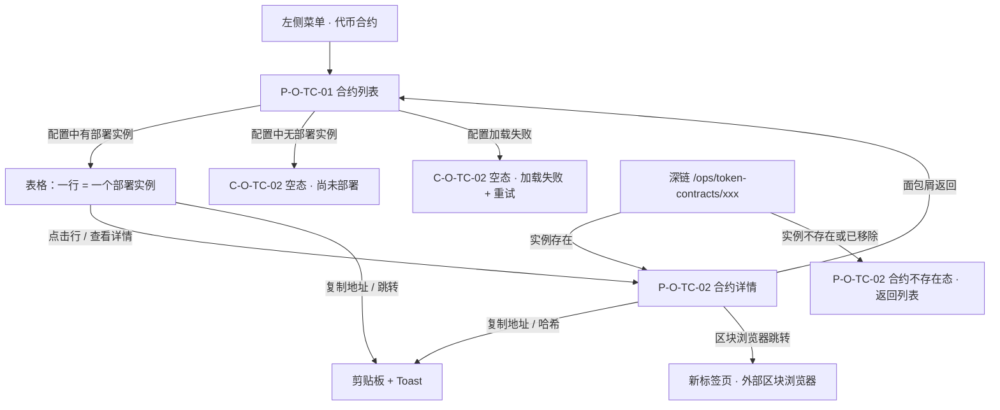
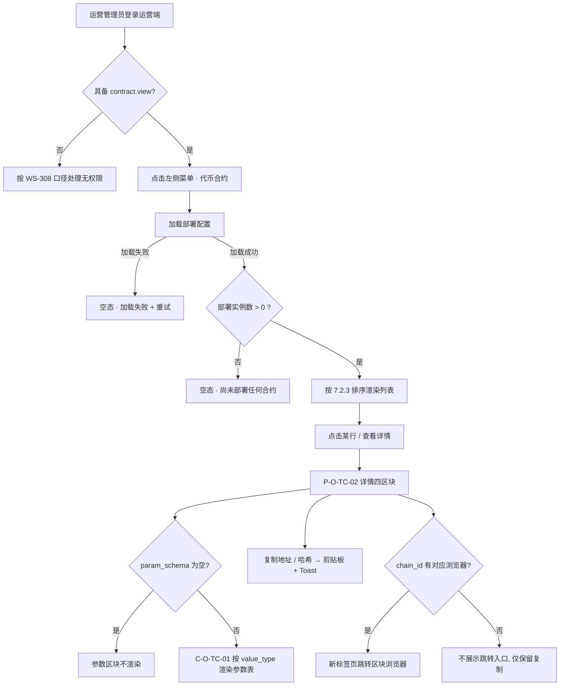

# 金融服务平台 · 运营端 · 代币合约 PRD

## 1. 文档信息

| 项目 | 内容 |
| --- | --- |
| 文档名称 | 金融服务平台 · 运营端 · 代币合约产品需求文档 |
| 对应需求 | WS-312「金融平台-运营端-代币合约」 |
| 上游输入 | 《金融服务平台 · 运营端 · 代币合约 需求诊断简报》V1.0（程功立，D-01～D-14 + G-01～G-12 + Q1～Q12）+ 用户 2026-09-09 补充「还没有部署到链上，只是做个框架，能看到已经部署的智能合约信息；其他交互后期再做」+ 产品工坊总控同日的口径拍板 |
| 诊断基线 | **无同构基线**。仓库 `asset-platform/` 与 `financial-service-platform/` 下没有任何一份文档涉及智能合约、代币、铸币、质押或销毁（简报第 1 章已全仓核实）。本文档是从零构建，不继承任何模块的功能口径，只复用平台级基线（国际化、脱敏、设计系统、编号契约） |
| 编写人 | 许楚清（需求分析师） |
| 文档语言 | 中文（运营端界面文案给出中英对照；**合约名称、类型说明、参数标签要求配置提供中英两份**，见 3.1 决策 8） |
| 覆盖端 | 金融服务平台**运营端** Web。本期不涉及金融服务端（面客端），不涉及资产平台 |
| 交付边界 | 代币合约 PRD + 页面框架（线框级，见第 6 章）。**本期为只读展示框架**：结构、字段、渲染规则、空态与异常口径全部定义完毕，具体合约数据待实际部署后由配置下发 |
| 关联需求 | **WS-308**「金融平台-运营端-账号与登录」——引用其运营端登录态、运营管理员身份、单角色权限模型、路由前缀 `/ops`、国际化基线与全局组件；**WS-310**「金融平台-运营端-协议管理」——只在编号体例与「配置下发 + 运营端只读」分工模型上同构，**无运行时依赖** |
| 落库路径 | `financial-service-platform/prd/v1.0-代币合约/v1.0-代币合约-PRD.md`，目标分支 `cly-V1.0.0`（用户 2026-09-09 批准入库） |
| 版本 | V1.0 |

> 本文档只定义「做什么」与「验收什么」，不指定数据库、框架与实现方案。
> 文中标注「目标值」的性能指标需在联调阶段校准，不影响功能逻辑与验收通过与否。
> 本版的 `[待确认]` 项集中在第 16.1 节，**全部是数据内容而非结构**：三类合约尚未部署，名称、标识、链、地址、标准、符号、精度、参数取值都还不存在。**这些不阻塞开发启动**——本文档定义的是承接这些数据的结构与渲染规则，数据到位后按配置下发即可，不需要改页面。

---

## 2. 背景与目标

### 2.1 背景

金融服务平台的业务链路上会出现多份链上智能合约（现阶段规划三类：应收账款铸币合约、质押合约、代币销毁合约）。运营人员不装钱包、不做链上操作，但在核对链上动作、对外沟通、新人上手这三件事上，需要一个地方能确切回答「本平台跑在链上的是哪几份合约、部署在哪条链、地址是什么、各自管什么事」。这件事今天只能靠问研发或翻部署文档，本模块就是要把它变成一个页面。

**本模块的起点与仓库里其他模块都不同：三类合约目前一份都还没有部署到链上。**

> **用户批复（2026-09-09）：还没有部署到链上，只是做个框架，能看到已经部署的智能合约信息；其他交互后期再做。**

这条批复决定了本文档的形态，而且它比字面上更微妙——它同时要求两件看起来相反的事：

1. **现在没有数据**，所以本期页面上大概率一行都没有；
2. **要能看到已经部署的合约信息**，所以页面必须是一个能承接真实部署数据的框架，而不是先做一个假的、等有数据了再重做。

因此本文档采取的落法是：**按「已部署的合约实例」建模（一行 = 一个部署实例，合约类型降为字段），结构、字段、渲染规则、排序、空态、异常一次定死；本期数据可以为空。** 空数据不是这个页面的失败态，是它的正常起始状态，所以「尚未部署」在本文档里是一个**一等状态**（第 7.4 节），有自己的文案、自己的验收项，不是「顺便加个空页面」。

**明确不采纳的两种做法**：

- **不做成三张静态说明卡片**（简报 D-01 方案 A）。三条写死的文字说明既承载不了地址与链，也无法在真实部署后自然生长——第一份合约上链的那天，整个页面要重写。用户要的是「框架」，框架的价值恰恰在于它能接住未来的数据。
- **不引入任何实时读链依赖**。总发行量、当前质押量、累计销毁量本期一律不展示（3.1 决策 3），页面的每一个字段都来自部署配置这一静态事实。要看余额与流水，用区块浏览器跳转把人送过去。

### 2.2 本期目标

1. 金融服务平台运营端新增一级菜单「代币合约 / Token Contracts」，成为本平台链上合约信息的唯一查看入口。
2. 合约信息**由研发以部署配置下发，运营端只读展示**；运营端不提供任何新增、编辑、启用、停用、上下架、删除入口。
3. 列表按**部署实例**粒度呈现（一行 = 一条链上的一份合约），合约类型是行上的一个字段与未来的筛选维度，不是行本身。
4. 详情页用**三层字段模型**（通用身份层 / 类型语义层 / 实例参数层）统一表达三类语义差异很大的合约；其中实例参数层是**通用键值对渲染槽**，新增一类合约只补配置、前端零改动。
5. **「尚未部署 / 空数据」是一等状态**：空列表、类型已定义但无实例、详情深链不可达、配置加载失败，四种情况各有确定的界面表现与文案，且彼此可区分。
6. 链上地址与哈希的展示、复制、区块浏览器跳转**整段引用平台国际化基线**（`01-国际化基线.md` 第 5 / 6 / 8 节），本模块不重新定义一个字。
7. 状态字段保留枚举、本期数据全部落 `active`，界面只读；「有效」的**业务定义**在本文档写死，不留给实现推断。
8. 登记一个权限点 `contract.view`；本期不产出任何站内信、不申请任何 `biz_type`。
9. 给出「新增一类合约需要提供什么」的定义清单模板（16.2），后续每新增一类照填即可，不需要重开需求。

### 2.3 本期不做（明确剔除，留待后续扩展）

| 不做项 | 说明 | 本文档的预留 |
| --- | --- | --- |
| **任何写操作** | 新增 / 编辑 / 删除 / 启用 / 停用 / 上下架 / 导入导出，一个都没有。用户口径「当前仅展示」 | 状态字段保留三值枚举（8.2），将来引入状态操作时有落点；本期界面不出任何入口，见反向验收 15.8 |
| **任何需要实时链上查询的字段** | 总发行量、当前质押总量、累计销毁量、实时余额、持有人数 | 无。这类需求会把纯配置驱动的只读页变成绑定 RPC 可用性的页面，需要另行定义超时、降级、缓存与刷新，属独立排期。见 17 章 |
| 合约调用流水与链上事件 | 「某次铸币 / 某次质押 / 某次销毁」是链上业务流水模块，不是合约模块，且依赖索引服务 | 无。详情页的区块浏览器跳转已能把运营送到链上查流水 |
| ABI、合约源码、审计报告的展示与下载 | 本期不做（简报 G-09 / Q12） | 无。若后续需要，详情页增加一个文件区与下载权限点 |
| 筛选、搜索、分页 | 本期数据为空或极少，三条数据配一套筛选器是过度设计，且会在界面上留下一堆无数据可筛的空控件 | **触发条件写死**（7.3.4）：部署实例数超过 15 条，或出现两条及以上链，即补「类型 / 链 / 状态」三个筛选项 |
| 合约地址可达性巡检与告警 | 需要主动探链，属实时依赖 | 通知位置有意留白，见 11.6 |
| 站内信与邮件 | 只读模块没有状态变化，也就没有「什么时候该通知」 | 边界声明见 11.6，**本期不申请 `biz_type`、不占用 `category`** |
| 面客端（金融服务端）展示合约信息 | 本期只做运营端 | 无。见 17 章 |
| 合约与具体业务单据的关联查询 | 「这笔应收账款是被哪次铸币铸上链的」属业务流水，且依赖 WS-305 的断点先解决（3.6） | 无 |
| 跨平台（资产平台）合约的统一视图 | 两平台完全独立、账号不互通 | 无 |

---

## 3. 范围与边界

### 3.1 已确认的产品决策（直接作为约束，不再论证）

| # | 决策 | 来源 |
| --- | --- | --- |
| 1 | 模块用途是**展示平台已支持的全部智能合约**，现阶段规划三类：应收账款铸币合约、质押合约、代币销毁合约 | WS-312 issue + 用户 2026-09-09 07:43 补充 |
| 2 | **本期尚未上链**。页面按「已部署的合约实例」建模（一行 = 一个部署实例，合约类型降为字段），**本期数据可以为空**；空数据/尚未部署作为一等状态写入 PRD | **用户批复 2026-09-09 08:08** + 总控拍板（简报 D-01 取方案 B、D-02 取实例粒度） |
| 3 | **不展示任何需要实时读链的动态数值**（总发行量、当前质押量、累计销毁量）；余额与流水一律走区块浏览器跳转 | 总控拍板（简报 D-03 / Q3） |
| 4 | **本期零写操作**：无启用/停用/上下架/新增/编辑/删除。状态字段保留枚举，本期数据全部落 `active`，界面只读，**不出任何状态操作入口**，并写反向验收项 | 用户「当前仅展示，默认有效」+ 总控拍板（简报 D-06 / Q4） |
| 5 | **「有效」的业务定义 = 平台后端当前配置为调用这份合约**，在本文档写死，不留给实现推断 | 总控拍板（简报 D-06 / Q5，倾向 ②） |
| 6 | 合约定义与部署信息**由研发以配置随部署下发，运营端只读**，不做成运营端可自助新增的字典 | 简报 D-07 / Q6 建议值，未被否决 |
| 7 | **本期只做运营端**，权限点只登记 `contract.view`；**本期不发任何站内信、不申请 `biz_type`** | 总控拍板（简报 D-10 / D-11 / Q11） |
| 8 | 运营端界面**默认英文 + 中英切换**；合约名称、类型说明、L3 参数标签要求配置提供中英两份；地址、哈希、链 ID、数值**不翻译** | WS-308 国际化基线（C-6）+ 简报 D-08 |
| 9 | 时区、日期、数字、金额、链上地址与哈希、区块浏览器跳转、脱敏口径，全部引用 `financial-service-platform/prd/v1.0-账户与登录/01-国际化基线.md` 第 4 / 5 / 6 / 8 节，**本模块不重新定义** | WS-308 已定稿，该文件自述适用于本平台全部模块 |
| 10 | 运营端本期只有「**运营管理员**」一种角色，账号与资产管理端完全不互通 | WS-308 已定稿 + 用户对 WS-310 的批复第 2 条 |
| 11 | 两个平台（资产平台 / 金融服务平台）**完全独立**，本模块产物只落 `financial-service-platform/`，**不回改 `asset-platform/` 任何已定稿内容** | 用户对 WS-310 的批复第 1 条 |
| 12 | **编号体例采用「端 + 模块」双段字母前缀**：`P-O-TC-xx` / `C-O-TC-xx` / `F-O-TC-xx` / `AC-O-TC-xx`（`O` = Operations 运营端，`TC` = Token Contract），并把 WS-310 的 `AG` 段与本模块的 `TC` 段一并补登进 `docs/notification-contract/接入指南.md` 4.2 登记表 | **总控对简报 Q7 的裁定** |
| 13 | 详情走**独立页面**而非抽屉 | 简报 D-13 / Q8 建议值，未被否决 |
| 14 | 模块与菜单命名：中文「代币合约」，英文 `Token Contracts` | 简报 Q9 建议值，未被否决 |
| 15 | 简报中标 `[待确认]` 的合约名称、标识、标准、符号、精度、参数取值等**数据内容**，本文档继续保留 `[待确认]`，**不编造**；详情页「关联业务模块」在应收账款铸币合约上填 `[待确认]` | 总控拍板（简报 G-02 / G-04 / G-06 / G-08 / D-14） |

### 3.2 与其他需求的接口

| 依赖方向 | 内容 | 归属 |
| --- | --- | --- |
| 本模块 ← 研发 / 部署配置 | 合约类型定义（类型标识、中英名称与说明、关联业务模块、L3 参数模式、排序）与部署实例数据（实例标识、类型、链 ID 与链名、合约地址、合约标准、版本、状态、部署时间、部署交易哈希、参数取值） | 配置层定义，随部署下发；本模块只读消费，见 7.1 |
| 本模块 ← 部署配置 | **链 ID → 区块浏览器基址映射表**（`01-国际化基线.md` 第 6 节已定义其维护方式：由部署配置文件维护，新增链只补配置） | 平台级既有配置，本模块直接消费，不新增维护界面 |
| 本模块 ← **WS-308** | 运营端登录态、运营管理员身份、单角色权限模型、路由前缀 `/ops` 与未登录回跳规则、国际化基线（语言、时区、数字、地址与哈希、脱敏）、全局组件（Toast / Table / Tag / Empty state） | WS-308 定义，本模块消费 |
| 本模块 → 设计 / 前端 | 运营端为**控制台画布形态**，组件与布局遵循 `docs/design-system/harbour-credit-admin-components.md`（Table / Cell / Tag / Empty state / Code-hash token / Filter bar），**本模块不新设计组件** | 既有规范，本文档不重复定义视觉 |
| 本模块 → 消息通知（WS-309） | **无。本期不产出任何站内信**，不申请 `biz_type`、不占用 `category` | 边界声明见 11.6 |
| 本模块 ↔ WS-310 协议管理 | **无运行时依赖**。仅在编号体例、「配置下发 + 运营端只读」分工模型、反向验收写法上同构 | 见 3.5 |
| 本模块 ↔ WS-305 应收账款录入与确权 | **存在一处业务断点，本期不解决**，见 3.6 | — |
| 本模块 → 部署 | 无新增部署配置项，复用平台既有的链 ID → 浏览器映射表；合约数据随部署配置下发 | 见 11.2 |

### 3.3 本文档的编号空间

按总控对简报 Q7 的裁定执行：采用「端 + 模块」双段字母前缀（`O` = Operations 运营端，`TC` = Token Contract）。

| 编号族 | 本文档取值 | 说明 |
| --- | --- | --- |
| 页面编号 | **P-O-TC-01**～**P-O-TC-02** | 与 WS-308 的 `P-O` 数字段、WS-310 的 `P-O-AG` 子段均不冲突 |
| 组件编号 | **C-O-TC-01**～**C-O-TC-02** | 同上 |
| 功能编号 | **F-O-TC-01**～**F-O-TC-10** | 本文档内自成一套 |
| 验收编号 | **AC-O-TC-01**～ | 本文档内自成一套 |
| 用户故事 | **US-01**～ | 数字段，**文档内部引用** |
| 风险 | **R-01**～ | 数字段，**文档内部引用** |
| 异常 | **E-01**～ | 数字段，**文档内部引用** |

**为什么用带模块字母的子段**：数字十位段是先到先得的约定，靠人记住「哪一段是谁的」来维持，资产平台已经因此撞过一次号并整体迁移（`P-M10` / `C-10`）。模块字母把归属写进编号本身，`page_target` 跨端解析时也更好认。该形态与 `docs/notification-contract/接入指南.md` 4.2「需要另开子段时用带模块字母的形式（如 `P-K01`）」的既有口径一致，不属于被禁止的「模块前缀」。

> **必须一并办掉的一件事**：`docs/notification-contract/接入指南.md` 4.2 是全平台编号的唯一登记表，但 WS-310 已入库使用的 `P-O-AG-xx` / `C-O-AG-xx` **没有登记进去**。仓库里现在同时存在两套运营端体例而登记表只记了一套，本模块是下一个取号的模块，若不消解就会长出第三套。**本文档附录 A 给出 4.2 登记表的完整补登内容**（`AG` 段 + `TC` 段 + 模块字母登记行），**已与本 PRD 同一次提交落地**。

### 3.4 「尚未上链」的落地口径（决策 2 的展开）

这一节把「还没部署、只做框架」从一句话拆成可验收的约束，避免实现阶段自行发挥成静态页面或假数据页面。

| 项 | 本模块的口径 |
| --- | --- |
| 数据来源 | 全部来自部署配置。**本期配置里可以一条部署实例都没有**，这是合法状态，不是错误 |
| 页面形态 | 列表 + 详情的完整结构一次做完。**不因为本期无数据就简化为静态说明卡片、写死文案页或「敬请期待」页** |
| 空态语义 | 「尚未部署任何合约」与「配置加载失败」是**两种不同的界面表现**，文案必须可区分（7.4.1 / 7.4.2），否则运营无法判断是没数据还是页面坏了 |
| 假数据 | **任何情况下不展示伪造的示例合约、示例地址、示例哈希**。空就是空，见反向验收 15.8 |
| 类型定义 | 合约类型定义（L2）本期可以先行下发（三类已知），**但类型不产生列表行**——列表行只由部署实例产生。类型名称可在空态说明区以只读文本形式出现，见 7.4.1 |
| 数据到位后 | 研发补一条部署实例配置，该合约**自动出现在列表**，无需任何页面改动、无需发版、无需运营录入。这是本期「框架」二字的验收口径（AC-O-TC-40） |
| 详情可达性 | 详情页只对**配置中存在的部署实例**可达；深链指向不存在的实例时进入「合约不存在」态（7.4.3），不展示空壳详情 |

### 3.5 与 WS-310 的关系：同构的是分工模型，不是功能

WS-310（协议管理）和本模块都采用「定义由研发配置下发、运营端只读」的分工，也都用 `*_key` 作稳定标识、都写反向验收项。**但两者的功能集合几乎不重叠**：WS-310 有版本状态机、文件上传、发布与回溯、操作留痕——那些能力建立在「运营端有写操作」之上，本模块**一个写操作都没有**，因此整块不适用。

引用 WS-310 的只有三样：编号体例（3.3）、「为什么不做成运营端自助字典」的论证结构（7.1.4）、反向验收项的写法（15.8）。**本模块与 WS-310 之间不存在任何运行时依赖、数据依赖或字段共享。**

### 3.6 与 WS-305（应收账款录入与确权）的断点——本期明确不解决

「应收账款铸币合约」按字面理解，是把已确权的应收账款铸成链上代币。但 `asset-platform/prd/v1.0-应收账款录入与确权/v1.0-应收账款录入与确权-PRD.md`（已入库定稿）**全文没有出现铸币、上链、代币、token 中的任何一个**——该模块的产出终点是「确权」这个业务状态，没有任何链上动作。

这意味着两者之一：铸币发生在一条尚未写进任何 PRD 的业务链路上；或者「应收账款铸币合约」与 WS-305 的应收账款并非同一业务对象。

**本模块的处理**：只读展示不需要知道铸币何时被触发，因此这个断点**不阻塞本期交付**。但它影响详情页 L2 说明区的「关联业务模块」字段——该字段在应收账款铸币合约上**现在填不出可信的值**，因此：

- 该合约的 `related_business_module` 配置值本期为 **`[待确认]`**，界面按 7.4.4 的「配置值缺失」规则展示为 `—` 并附一行说明，**不编造模块名**；
- 本条记入风险 R-05，**后期做合约相关交互（尤其是铸币触发链路）之前必须先解决**。

---

## 4. 用户角色与场景

### 4.1 角色

| 角色 | 特征 | 在本模块的诉求 | 使用频率 |
| --- | --- | --- | --- |
| 运营管理员（Operations Administrator） | 金融服务平台运营端本期唯一角色（决策 10）；工作邮箱 + 密码登录；**不装钱包、无链上操作能力**；技术背景不确定，未必读得懂链上术语 | 知道平台跑着哪几份合约、地址是什么、各自管什么；出问题时能快速拿到完整地址去区块浏览器核对 | **低频**：不是日常作业页面，属于「需要时来查一次」。这条判断是本期不做筛选、不做分页、不建埋点体系的依据 |

> **本期不覆盖其他角色。** 金融服务端（面客端）目前没有任何已定稿模块，也没有消费本模块数据的口径；资产平台两端与本平台账号不互通（决策 11）。面客端是否展示合约地址列入后续扩展（17 章）。
>
> 「运营管理员未必读得懂链上术语」这一点直接落在设计上：详情页的 L2 说明区（7.3.6）存在的全部理由，就是让不懂链上概念的人也能说清这份合约在业务里的位置。因此 L2 的说明文案要求用业务语言写，**不是把合约注释抄一遍**。

### 4.2 用户故事

| # | 用户故事 | 对应功能 |
| --- | --- | --- |
| US-01 | 作为运营管理员，我想在一个页面看到平台当前部署了哪些链上合约，这样我不用问研发或翻部署文档 | F-O-TC-01 / F-O-TC-02 |
| US-02 | 作为运营管理员，我想快速拿到某份合约的完整地址并去区块浏览器核对，这样我能确认某笔链上动作打到的是不是平台的合约 | F-O-TC-05 |
| US-03 | 作为运营管理员，我想看懂某类合约是干什么的、在业务链路的哪一环，这样我在跨团队沟通时能说清楚 | F-O-TC-03 |
| US-04 | 作为新入职的运营，我想在不读代码、不看链上 ABI 的前提下理解平台的合约构成 | F-O-TC-03 / F-O-TC-04 |
| US-05 | 作为运营管理员，当平台还没有部署任何合约时，我想在页面上明确知道「是还没部署」而不是「页面坏了」 | F-O-TC-07 |
| US-06 | 作为研发，我想新增一类合约时只补一条配置就能让它出现在运营端，不需要改前端代码 | F-O-TC-04 / F-O-TC-10 |

### 4.3 典型场景

| # | 场景 | 触发条件 | 流程 | 成功标准 |
| --- | --- | --- | --- | --- |
| S-1 | **核对合约地址** | 运营需要确认某笔链上动作打到的是不是平台的合约 | 进入模块 → 按类型/名称定位 → 复制地址，或点区块浏览器跳转 | 不需要问研发、不需要翻部署文档，即可拿到正确且完整的地址 |
| S-2 | **了解某类合约是干什么的** | 新入职运营 / 跨团队沟通 | 进入模块 → 打开详情 → 读 L2 类型说明与 L3 参数 | 无需阅读代码或链上 ABI 即可说清这份合约在业务里的位置 |
| S-3 | **确认平台当前支持哪些合约能力** | 对外沟通、内部汇报 | 进入模块 → 看列表 | 列表即答案，无需二次汇总 |
| S-4 | **本期的实际首屏：还没有任何合约** | 本期常态 | 进入模块 → 看到空态面板 | 一眼看懂「平台尚未部署任何链上合约，合约信息由部署配置下发，部署后自动出现在此」，且**不误以为页面出错或权限不足** |
| S-5 | **第一份合约上链后** | 研发完成部署并发布配置 | 无需任何运营动作，刷新页面即出现该合约 | 页面未改一行代码、未发一次版，合约自动出现且各字段渲染正确 |
| S-6 | **合约升级换地址后确认新旧** | 研发升级合约、换了地址（后续场景） | 进入模块 → 同类型下两条实例，按部署时间与状态分辨 | 能分辨哪份是当前在用的。**本期状态恒为 `active`，该场景在引入 `deprecated` 后才完整成立**，实例粒度建模已为它预留 |

---

## 5. 信息架构与页面流

### 5.1 菜单结构

运营端左侧新增一级菜单：

```text
代币合约 / Token Contracts   → P-O-TC-01（单页，无二级菜单）
```

- WS-308 已明确「运营端左侧菜单本期只有『总览』一项，业务菜单项由后续业务模块各自登记」，因此本模块自行登记这一项。
- **本期不设「合约类型」维护页**：类型由配置下发，运营端没有可维护的字典，多一个只读字典页只会让人误以为可以编辑。类型信息以列表列、详情说明区、空态说明文本三种形式呈现。
- 一级菜单图标沿用运营端图标体系，激活态遵循 `harbour-credit-admin-components.md` 第 3 节导航项规则。
- 菜单与页面文案随运营端界面语言切换即时生效（引用 WS-308 国际化基线，默认英文）。
- **菜单项在本期无数据时照常展示**，不因为列表为空而隐藏——菜单隐藏会让运营以为功能没上线。

### 5.2 页面清单

| 编号 | 页面 / 组件 | 形态 | 说明 |
| --- | --- | --- | --- |
| **P-O-TC-01** | 合约列表页 | 整页 | 本模块主入口。表格卡片一张，**页面上没有任何新增/导入按钮**——合约由配置下发。本期常态为空态 |
| **P-O-TC-02** | 合约详情页 | 整页 | 四区块：页头 / 链上身份卡 / 说明区 / 参数表。独立页面而非抽屉（决策 13），理由见 5.3 |
| **C-O-TC-01** | 合约参数表（L3 通用 KV 渲染槽） | 页内组件 | 详情页第四区块。按 `param_schema` 的 `order` 遍历、按 `value_type` 决定渲染方式。**这是本模块唯一有设计含量的组件** |
| **C-O-TC-02** | 空态面板 | 页内组件 | 承载「尚未部署」「配置加载失败」两种形态，两者文案与可用操作不同（7.4） |

> 本模块**不提供**任何新增 / 编辑 / 删除合约或合约类型的页面、弹窗、抽屉与按钮，也不提供确认弹窗——没有需要确认的动作。

**为什么详情用独立页面而不是抽屉**：详情要承载 L3 的不定长参数表、地址与哈希的完整展示与跳转，抽屉宽度下这些内容会被迫二次截断（地址已经缩略过一次，再截断就失去核对价值）；且独立页面才有可分享的 URL，运营之间传「你看这份合约」时有东西可发。

### 5.3 页面流



### 5.4 路由

沿用 WS-308 已定稿的运营端路由前缀 `/ops`：

| 路由 | 页面 | 归属 | 访问条件 |
| --- | --- | --- | --- |
| `/ops/token-contracts` | P-O-TC-01 合约列表 | WS-312 | 需登录且 `status = active`，且具备 `contract.view` |
| `/ops/token-contracts/{contract_key}` | P-O-TC-02 合约详情（**支持深链**） | WS-312 | 同上 |

- 详情路由用 `contract_key`（部署实例的稳定唯一标识，见 8.2）而不是内部主键：`contract_key` 由配置定义、上线后不可变更，因此分享出去的链接长期有效。
- 未登录访问上述任一路由，按 WS-308 口径跳 `/ops/login?redirect=<URL 编码后的原路径>`，登录成功后回跳（E-11）。
- `{contract_key}` 在配置中不存在时，进入「合约不存在」态（7.4.3），**不落到全站 404**——全站 404 会让运营以为路由错了，而实际原因是该合约不在配置里。

---

## 6. 页面框架（线框级）

> 本节给出线框级的信息架构与区块划分，供页面设计直接落地；不含视觉稿，视觉遵循运营端（控制台画布）设计规范 `docs/design-system/harbour-credit-admin-components.md`。

### 6.1 P-O-TC-01 合约列表（有数据形态）

```text
┌ 顶栏：面包屑「代币合约」 ───────────────── 语言切换 · 账号下拉 ┐
├ 页面标题「代币合约 / Token Contracts」
│  + 说明「合约信息由部署配置下发，此处仅供查看」
│                                （标题区右侧无任何主操作按钮）
├ 表格卡片
│  ├ 卡片标题「合约列表」 + 次级说明「共 N 份已部署合约」
│  ├ （本期无 Filter bar，触发条件见 7.3.4）
│  ├ Table
│  │   合约名称 │ 类型 │ 所属链 │ 合约地址 │ 状态 │ 部署时间 │ 操作
│  │   ├ 合约名称 Cell：主文本 = 名称；辅助文本 = contract_key（等宽小字）
│  │   ├ 类型：Tag，一类一色
│  │   ├ 所属链：链名 + 链 ID（等宽小字）
│  │   ├ 合约地址：缩略（前6后4）+ [复制] + [↗ 区块浏览器]
│  │   ├ 状态：Tag（本期恒「有效 / Active」）
│  │   ├ 部署时间：带时区标注
│  │   └ 操作：[查看详情]（唯一入口；行整体亦可点击）
│  └ 空态 / 加载 skeleton / 错误面（按状态替换 → C-O-TC-02）
└ （本期无分页器）
```

### 6.2 P-O-TC-01 合约列表（本期常态：空态）

```text
├ 页面标题「代币合约 / Token Contracts」+ 同上说明
├ 表格卡片
│  ├ 卡片标题「合约列表」 + 次级说明「共 0 份已部署合约」
│  └ C-O-TC-02 空态面板
│     ├ 轻量图标
│     ├ 主文案「平台尚未部署任何链上合约」
│     ├ 辅助文案「合约信息由部署配置下发，部署完成后将自动出现在此。」
│     ├ 只读说明行（可选，非表格行、不可点击）：
│     │   「平台已规划的合约类型：应收账款铸币 · 质押 · 代币销毁」
│     └ （无任何修复性入口——运营做不了任何事来改变这个状态）
```

> 空态面板里**没有按钮**。`harbour-credit-admin-components.md` 允许 Empty state 带「一个修复性入口（可选）」，但本模块的空态成因是「研发还没部署」，运营端不存在任何能改变它的动作，放一个按钮反而制造错觉。

### 6.3 P-O-TC-02 合约详情

```text
┌ 顶栏：面包屑「代币合约 / {合约名称}」
├ 页头
│   {合约名称}   [类型 Tag]   [状态 Tag]
│   {contract_key}（等宽小字）
│   右侧操作区：空（无任何操作按钮）
│
├ 区块 1 · 链上身份卡（L1）
│   描述列表两列：
│     所属链          {链名} · Chain ID {chain_id}（等宽）
│     合约地址        {完整地址，EIP-55 渲染，等宽} [复制] [↗]
│     合约标准        {ERC-20 / ERC-721 / ERC-1155 / 自定义}
│     版本            {version}
│     部署时间        {带时区标注}
│     部署交易哈希    {前10后8 缩略，等宽} [复制] [↗]
│
├ 区块 2 · 说明区（L2，随类型下发，同类型实例共享）
│   ├ 「这类合约是干什么的」段落
│   ├ 「在业务链路的哪一环」段落
│   └ 关联业务模块：{related_business_module}
│      （应收账款铸币合约本期为 [待确认] → 展示 `—` + 一行说明，见 7.4.4）
│
└ 区块 3 · 参数表（L3 → C-O-TC-01）
    ├ 区块标题「合约参数 / Contract Parameters」
    ├ 按 param_schema 的 order 逐行渲染：
    │    {label}（带 hint tooltip）   {value 按 value_type 渲染}
    └ 该类型未定义任何参数时：整个区块不渲染（见 7.4.5）
```

**详情页明确不出现的**：任何操作按钮（复制与外链跳转不算操作，它们不改变任何数据）、任何链上实时数值、ABI 全文与源码、审计报告、调用流水、任何形态的启用/停用/编辑/删除入口（含禁用态）。

### 6.4 P-O-TC-02 合约不存在态

```text
┌ 顶栏：面包屑「代币合约 / —」
├ C-O-TC-02 空态面板（不存在形态）
│   ├ 轻量图标
│   ├ 主文案「未找到该合约」
│   ├ 辅助文案「该合约不在当前部署配置中，可能尚未部署或已从配置移除。」
│   └ [返回合约列表]（唯一入口）
```

---

## 7. 功能清单与模块详情

### 7.0 功能清单

| 编号 | 功能 | 描述 | 验收口径 |
| --- | --- | --- | --- |
| **F-O-TC-01** | 一级菜单与页面壳 | 运营端左侧新增「代币合约」，指向合约列表页；路由 `/ops/token-contracts` | AC-O-TC-01～03 |
| **F-O-TC-02** | 合约实例列表 | 按部署实例粒度展示 7 列；无筛选、无搜索、无分页；排序规则写死 | AC-O-TC-04～12 |
| **F-O-TC-03** | 合约详情 | 四区块结构（页头 / 链上身份卡 / 说明区 / 参数表） | AC-O-TC-13～20 |
| **F-O-TC-04** | L3 通用 KV 参数槽（C-O-TC-01） | 按 `param_schema` 渲染任意合约类型的参数，前端不认具体字段名，只认 `value_type` | AC-O-TC-21～28 |
| **F-O-TC-05** | 地址 / 哈希展示与区块浏览器跳转 | 整段引用 `01-国际化基线.md` 第 5 / 6 节，本模块不新增规则 | AC-O-TC-29～33 |
| **F-O-TC-06** | 状态只读展示 | 状态枚举三值，本期数据恒 `active`；界面只读、无任何操作入口 | AC-O-TC-34～36 |
| **F-O-TC-07** | 空数据与尚未部署（一等状态） | 四种空/异常形态各有确定表现与文案，且彼此可区分 | AC-O-TC-37～44 |
| **F-O-TC-08** | 中英双语 | 界面文案 + 配置下发的名称 / 类型说明 / 参数标签双语；地址、哈希、链 ID、数值不翻译 | AC-O-TC-45～48 |
| **F-O-TC-09** | 权限 | 单权限点 `contract.view` | AC-O-TC-49～50 |
| **F-O-TC-10** | 配置自检 | 配置加载时校验必填项、地址格式、`value_type` 合法性，异常项记明确错误并按既定规则降级 | AC-O-TC-51～56 |

### 7.1 M0 · 合约定义与部署实例（配置层，运营端只读）

#### 7.1.1 三层字段模型

三类合约的业务语义差别很大（铸造 / 锁仓赎回 / 销毁），但它们的**链上身份是同构的**：都是「某条链上某个地址上的一份合约」。据此把字段分三层：

| 层 | 内容 | 是否随合约类型变化 | 承载对象 | 渲染方式 |
| --- | --- | --- | --- | --- |
| **L1 通用身份层** | 名称、合约标识、类型、链、地址、合约标准、版本、状态、部署时间、部署交易哈希 | **不变**，所有类型必有 | 部署实例（8.2） | 固定字段。列表 7 列与详情第一区块都取自这一层 |
| **L2 类型语义层** | 这类合约是干什么的、在业务链路的哪一环、关联哪个业务模块 | 随类型变，**同类型的所有实例共享** | 类型定义（8.1） | 详情页说明区，纯文本段落 |
| **L3 实例参数层** | 该合约特有的配置参数 | 每个类型定义一套参数模式，每个实例给出各自的取值 | 模式在类型定义、取值在实例（8.1 / 8.2） | **通用 KV 渲染槽（C-O-TC-01）** |

#### 7.1.2 L3 为什么必须是通用 KV 槽

这是本模块唯一有设计含量的取舍，也是「后续新增合约类型」这条要求的全部落点。

- 做成**每类合约一张专属字段表**：新增一类合约 → 前端要加一段渲染代码 → 要排期、要发版、要测试。「合约清单可扩展」就成了一句空话。
- 做成**通用 KV 槽**：前端只认「一组带标签、带类型、带说明、带排序的键值对」，**不认任何具体字段名**。新增一类合约 → 研发补一条类型定义（含 `param_schema`）+ 一条部署实例 → 合约当天出现在运营端，前端零改动。

**因此本文档把 `value_type` 的完整枚举与每个取值的渲染规则在 8.4 一次定死。** 这不是实现细节：`value_type` 定义不清，前端就只能退化成按字段名写 `if-else`，通用槽当场失效，本模块的全部扩展性归零。

#### 7.1.3 三类合约的 L3 参数：本期为 `[待确认]`

三类合约尚未部署，其参数模式与取值都还不存在。**本文档不编造参数清单。**

| 合约类型 | 本期 `param_schema` | 说明 |
| --- | --- | --- |
| 应收账款铸币合约 | `[待确认]` | 待实际部署方案确定后按 16.2 的清单提供 |
| 质押合约 | `[待确认]` | 同上 |
| 代币销毁合约 | `[待确认]` | 同上 |

> 简报 D-04 中给过一张「三类合约可能有哪些参数」的推断表，那张表在简报里的作用是**证明槽位够用**，不是需求。本文档不把它写进正文——它是行业常识推断，不是从任何文档或代码读到的事实，写进 PRD 会被实现当成字段清单去建表。
>
> **参数模式缺失不阻塞开发**：C-O-TC-01 的渲染逻辑与 `param_schema` 的内容无关，只与 8.4 的 `value_type` 规则有关。参数模式为空时该区块不渲染（7.4.5），有了就自动出现。

#### 7.1.4 边界：合约定义不做成运营端可自助维护的字典

**由研发以配置随部署下发，运营端只读**（决策 6）。

理由比 WS-310 的同类结论更强：协议管理至少还是「上传一个文件」，配错了改一版重发即可；而一份链上合约的地址或参数配错，后果是**平台的资金链路指向一个错误的合约**——这不是运营能在后台自助承担的风险。而且合约地址天然伴随部署产生，让它随部署配置下发才能保证「页面上的地址 = 实际部署的地址」，人工录入必然产生第二个真相来源。

对应的代价：新增一类合约必须等一次配置发布。这是本期明确接受的代价（见 R-07）。

#### 7.1.5 配置自检（F-O-TC-10）

配置加载时对每条部署实例与类型定义做一次自检，异常项记明确错误日志，并按下表降级——**自检不通过的实例不静默消失，也不让整个页面挂掉**：

| 检查项 | 不通过时的处理 |
| --- | --- |
| 缺 `contract_key` / `contract_type_key` / `chain_id` / `contract_address` 任一必填项 | 该实例**不进入列表**，记错误日志（E-13）。缺主键的行既无法定位也无法进详情，展示它只会制造困惑 |
| `contract_address` 格式非法 | 实例**仍进入列表**，地址列展示原始值 + 「地址格式异常」标记，**不渲染地址组件、不提供区块浏览器跳转**，记错误日志（E-06） |
| `contract_type_key` 在类型定义中不存在 | 实例**仍进入列表**，类型列展示原始 key 并标注异常；详情页 L2 说明区展示「类型定义缺失」，L1 区块正常展示，记错误日志（E-04） |
| `param_schema` 中出现 8.4 枚举外的 `value_type` | 该参数行**按 `text` 渲染**，记错误日志（E-09）。降级到 `text` 永远是安全的：它不做任何解析 |
| 实例的参数取值里出现 `param_schema` 未定义的 key | **不展示**（以模式为准），记 warning 日志（E-08） |
| `status` 为 8.2 枚举外的值 | 状态列展示原始值 + 未知态样式，记错误日志（E-14） |

### 7.2 M1 · 合约列表（P-O-TC-01，F-O-TC-02）

#### 7.2.1 列表粒度：一行 = 一个部署实例

**合约类型是行上的一个字段，不是行本身。** 同一类合约在两条链上各部署一份，就是两行；合约升级换了地址，就是新增一行。

代价不对称，这是选它的全部理由：现在按实例建模、实际只有单链单实例，界面上看不出任何区别；现在按类型建模、后来出现多链部署或合约升级，第二个地址无处安放，等于重写列表、详情与数据对象。**本期数据为空，正是把这层结构立对的最便宜的时刻。**

#### 7.2.2 列表字段（7 列）

字段选择原则：**只放「用来定位与识别」的字段，不放「用来理解」的字段**——后者归详情。运营在这张列表上真正要完成的动作只有两个：找到我要的那份合约、确认它是不是我以为的那一份。

| # | 列 | 取值 | 渲染 |
| --- | --- | --- | --- |
| 1 | 合约名称 | `name_zh` / `name_en`（按界面语言） | Cell 主/辅两层：主文本 = 名称（620 字重），辅助文本 = `contract_key`（10.5px 等宽 faint） |
| 2 | 合约类型 | 类型定义的中英名称 | Tag，一类一色；类型定义缺失时展示原始 key + 异常标记（E-04） |
| 3 | 所属链 | `chain_name` + `chain_id` | 链名主文本 + Chain ID 等宽辅助文本；**单链时也不删这一列**——链名缺失是链上运维事故的高频起点 |
| 4 | 合约地址 | `contract_address` | 缩略前 6 后 4 + 等宽 + 复制 + 区块浏览器跳转，全部引用国际化基线第 5 / 6 节（7.5） |
| 5 | 状态 | `status` | Tag。本期恒「有效 / Active」（7.6） |
| 6 | 部署时间 | `deployed_at` | 按国际化基线第 4 节格式化，**带时区标注**，不出现裸时间；为空展示 `—` |
| 7 | 操作 | — | 「查看详情 / View」单入口。行整体亦可点击进入详情。`docs/design-system` 的 Table 规范要求最后一列固定为操作区，1280px 下必须可达 |

**明确不放进列表的**：版本号、合约标准、部署交易哈希、任何 L3 参数、L2 说明。列表宽度有限，设计系统的 Table 规范要求「长值截断前提供完整值机制」，地址已经占了一个长值列，再塞一列哈希会让两个长值互相挤压、截断更狠，识别效率反而下降。

#### 7.2.3 排序规则（必须写死）

无筛选、无分页的前提下，**顺序是这张表唯一的可预期性来源**。因此排序规则在此完全定死，不留任何由实现决定的空间：

1. 第一优先级：**合约类型定义的 `sort_order` 升序**（配置下发）。`sort_order` 相同或缺失时，按 `contract_type_key` 字典序升序。
2. 第二优先级：同类型内按 **`deployed_at` 倒序**（新部署的在前）。
3. 第三优先级：`deployed_at` 相同时，按 **`contract_key` 字典序升序**。
4. **空值口径**：`deployed_at` 为空的实例排在**同类型的末尾**（而不是最前）；同为空时仍按 `contract_key` 升序。

> 第 3、4 条是兜底，作用是保证**任意两次加载得到的顺序完全一致**。没有兜底键的排序在等值时顺序由数据源决定，运营每次刷新看到的顺序可能不同——在一个连筛选都没有的页面上，这会直接摧毁可用性。

#### 7.2.4 筛选、搜索与分页：本期不做，触发条件写死

本期**不做筛选器、不做搜索框、不做分页**。理由：本期数据为空或极少，三条数据配一套筛选器是过度设计，且会在界面上留下一排无数据可筛的空控件，反而像是功能没做完。

**触发条件（满足任一即补做，不需要重开需求）**：

- 部署实例数**超过 15 条**；或
- 列表中出现**两条及以上不同的链**。

届时补「类型 / 链 / 状态」三个筛选项，用 `docs/design-system` 的 Filter bar 组件，位置在表格卡片内、表头下方；筛选条件写入 URL query，刷新与前进后退后保持。分页在实例数超过 50 条时再评估。

### 7.3 M2 · 合约详情（P-O-TC-02，F-O-TC-03）

#### 7.3.1 页头

合约名称 + 类型 Tag + 状态 Tag + `contract_key`（等宽小字）。面包屑「代币合约 › {合约名称}」。**右侧操作区为空**——本模块没有任何针对合约的动作。

#### 7.3.2 区块 1 · 链上身份卡（L1）

字段：所属链（链名 + Chain ID）、合约地址、合约标准、版本、部署时间、部署交易哈希。

- **合约地址在详情页展示完整值**（按 EIP-55 校验和大小写渲染、等宽字体），而不是列表上的缩略形态——详情页正是运营来核对完整地址的地方。复制按钮复制完整地址，区块浏览器跳转拼 `{基址}/address/{完整地址}`。
- 部署交易哈希按缩略（前 10 后 8）展示，复制完整值，跳转拼 `{基址}/tx/{完整哈希}`；`deploy_tx_hash` 为空时整行展示 `—`，**不展示跳转入口**。
- 合约标准、版本为空时展示 `—`（本期三类合约的这两项均为 `[待确认]`，因此本期详情页大概率是 `—`）。

> **脱敏基线的硬约束**：`01-国际化基线.md` 第 8.2 节规定「链上地址在展示、传输、日志中一律用缩略形态，完整值仅在用户主动复制时进入剪贴板」。本模块整页都是地址，这条是硬约束而不是建议。**详情页展示完整地址是本模块对该基线的一处显式例外**，例外范围严格限定为：仅详情页链上身份卡的「合约地址」这一个字段，且仅在界面渲染层——**列表、日志、任何对外传输一律仍用缩略形态**。理由：合约地址是平台自己的公开部署地址，不是用户资产地址，其核对价值恰恰要求完整可读；缩略形态下运营无法完成 S-1 场景。该例外记入 11.3，**已由产品工坊于 2026-09-09 裁定采纳**，范围维持上述边界。

#### 7.3.3 区块 2 · 说明区（L2）

三段内容，全部随**类型定义**下发，同类型的所有实例共享：

| 项 | 内容要求 |
| --- | --- |
| 这类合约是干什么的 | 用业务语言写，面向不懂链上术语的运营（4.1）。**不是把合约注释或 ABI 说明抄一遍** |
| 在业务链路的哪一环 | 说清它被谁调用、在什么业务动作之后发生 |
| 关联业务模块 | 供运营顺着往下查。**应收账款铸币合约本期为 `[待确认]`**（3.6），按 7.4.4 展示 `—` + 一行说明 |

类型定义缺失时（E-04），本区块整体替换为一行提示「该合约的类型定义缺失，请联系研发核对部署配置」，L1 区块与 L3 区块照常渲染。

#### 7.3.4 区块 3 · 参数表（L3 → C-O-TC-01）

见 7.4 与 8.4。

### 7.4 M3 · 空数据与尚未部署（F-O-TC-07）

> **本节是本期最重要的一节。** 三类合约都还没上链，因此下面这几种形态才是运营在本期实际会看到的界面，而「有数据的列表」本期几乎不会出现。它们不是异常处理的边角料，是本期的主界面。

四种形态**必须彼此可区分**——运营需要能一眼判断「是还没部署」「是页面坏了」还是「是我点错了」，这三件事的后续动作完全不同。

#### 7.4.1 形态 A · 尚未部署任何合约（本期常态）

**成因**：配置加载成功，但部署实例数为 0。

| 项 | 规则 |
| --- | --- |
| 界面 | 表格卡片保留，卡片次级说明展示「共 0 份已部署合约」，表体替换为 C-O-TC-02 空态面板 |
| 主文案 | 「平台尚未部署任何链上合约 / No contracts deployed yet」 |
| 辅助文案 | 「合约信息由部署配置下发，部署完成后将自动出现在此。/ Contract information is delivered via deployment configuration and will appear here automatically once deployed.」 |
| 只读说明行 | 可展示「平台已规划的合约类型：应收账款铸币 · 质押 · 代币销毁」（取自已下发的类型定义，按界面语言）。**该行是纯文本，不是表格行、不可点击、不进入排序、不产生详情页**（`AC-O-TC-62` 锁死这一点）——它的作用是让运营知道框架已经就位，而不是把类型伪装成数据。类型定义也未下发时，本行不展示。**本条已由产品工坊于 2026-09-09 裁定保留** |
| 操作入口 | **无**。空态面板内不放任何按钮 |
| 明确禁止 | 不展示任何伪造的示例合约、示例地址、示例哈希；不展示「敬请期待」「功能建设中」这类与事实不符的文案——功能已经上线了，只是还没有数据 |

#### 7.4.2 形态 B · 配置未下发或加载失败

**成因**：配置读取失败、格式非法整体不可解析。

| 项 | 规则 |
| --- | --- |
| 界面 | C-O-TC-02 空态面板的**失败形态**，与形态 A 视觉与文案均不同 |
| 主文案 | 「合约信息加载失败 / Failed to load contracts」 |
| 辅助文案 | 「请稍后重试；若持续失败，请联系研发核对部署配置。/ Please try again later. If the problem persists, contact engineering to check the deployment configuration.」 |
| 操作入口 | **[重试 / Retry]**（这是本模块界面上唯一的按钮，且它不改变任何数据） |
| 明确禁止 | **不得复用形态 A 的文案**。把加载失败显示成「尚未部署」，会让运营在合约实际已部署时误判为「研发没配」，这是本节存在的根本原因 |

#### 7.4.3 形态 C · 详情深链不可达

**成因**：直接访问 `/ops/token-contracts/{contract_key}`，但该 `contract_key` 在当前配置中不存在（尚未部署、拼写错误、或已从配置移除）。

| 项 | 规则 |
| --- | --- |
| 界面 | P-O-TC-02 的不存在态（6.4），面包屑「代币合约 / —」 |
| 主文案 | 「未找到该合约 / Contract not found」 |
| 辅助文案 | 「该合约不在当前部署配置中，可能尚未部署或已从配置移除。/ This contract is not in the current deployment configuration. It may not be deployed yet, or has been removed.」 |
| 操作入口 | **[返回合约列表 / Back to contracts]** |
| 明确禁止 | 不展示字段全为 `—` 的空壳详情页——那会让人以为合约存在但数据坏了；不落到全站 404 页——那会让人以为路由错了 |

#### 7.4.4 形态 D · 单个字段值缺失或为 `[待确认]`

**成因**：实例存在，但某个字段配置里没有值（本期常态：合约标准、版本、部署交易哈希、关联业务模块都可能为空）。

| 项 | 规则 |
| --- | --- |
| 展示 | 该字段值位展示 **`—`**（与国际化基线第 5 节「无数据展示 `—`」一致），**字段行不隐藏** |
| 为什么不隐藏行 | 「有栏无值」比「行消失」更可预期：字段行在，运营知道这项存在只是还没有；行消失，运营会以为这类合约根本没有这一项 |
| 配置值字面为 `[待确认]` | **按缺失处理**，展示 `—`。同时在该字段下方展示一行 faint 说明「该项待业务确认 / Pending confirmation」。**界面上不出现 `[待确认]` 这个字面量**——它是 PRD 的记法，不是给运营看的文案 |
| 关联业务模块 | 应收账款铸币合约本期即走这条规则（3.6） |

#### 7.4.5 形态 E · 该类型未定义任何 L3 参数

**成因**：类型定义的 `param_schema` 为空（本期三类合约均如此，见 7.1.3）。

| 项 | 规则 |
| --- | --- |
| 展示 | **整个参数表区块不渲染**——区块标题也不出现 |
| 为什么这里反而隐藏 | 与形态 D 的取舍相反，因为语义不同：形态 D 缺的是「一个已知字段的值」，这里缺的是「有没有字段」这件事本身。渲染一个只有标题、下面空空如也的区块，除了让页面看起来坏掉之外没有任何信息量 |
| 一旦配置补上 | 区块自动出现，**前端零改动**（F-O-TC-04 的验收点之一） |

### 7.5 M4 · 地址、哈希与区块浏览器跳转（F-O-TC-05）

**本模块不重新定义任何一条规则，整段引用 `financial-service-platform/prd/v1.0-账户与登录/01-国际化基线.md`：**

| 项 | 引用位置 | 本模块的落点 |
| --- | --- | --- |
| 地址：全小写存储、EIP-55 渲染、缩略前 6 后 4、等宽字体、复制 + Toast、hover 完整值 tooltip | 第 5 节 | 列表第 4 列、详情链上身份卡、L3 中 `value_type = address` 的每一个参数 |
| 哈希：缩略前 10 后 8，复制、tooltip、等宽规则同地址 | 第 5 节 | 详情的部署交易哈希、L3 中 `value_type = hash` 的参数 |
| 数字：千分位、小数点 `.`、不做大数缩写；无数据展示 `—` | 第 5 节 | L3 中 `value_type = number` 的参数 |
| 时间：UTC 存储、展示带时区标注 | 第 4 节 | 部署时间、L3 中 `value_type = datetime` 的参数 |
| 区块浏览器：按**链 ID** 查映射表；地址拼 `{基址}/address/{完整地址}`、哈希拼 `{基址}/tx/{完整哈希}`；映射表由部署配置维护；新标签页 `target="_blank" + rel="noopener noreferrer"`；**链 ID 缺失或映射表无对应项时不展示跳转入口，不展示置灰按钮或死链**；图标按钮需 `aria-label`、键盘可聚焦可回车触发 | 第 6 节 | 列表与详情的每一处地址与哈希 |
| 脱敏：地址与哈希在展示、传输、日志中一律用缩略形态，完整值仅在主动复制时进剪贴板 | 第 8.2 节 | 全模块。**唯一例外见 7.3.2**（详情页合约地址完整展示） |

**本模块自己要定的只有一条**：L3 参数中 `value_type = address` 的值，其区块浏览器跳转按**所属部署实例的 `chain_id`** 查映射表——参数值本身不携带链信息，若不写死这条，实现会不知道该拿哪个链 ID 去查。

### 7.6 M5 · 状态字段与「有效」的业务定义（F-O-TC-06）

#### 7.6.1 「有效」的业务定义（必须写死）

> **`active`（有效）= 平台后端当前配置为调用这份合约。**

这条不留给实现推断。候选语义至少有三种——①合约在链上已成功部署且可调用；②平台后端当前配置为调用这份合约；③合约通过审计且业务上批准使用——取 ②，理由：

- ① 需要实时查链才能确认，与决策 3「不引入实时读链依赖」直接冲突；
- ③ 是流程外的事实，运营端拿不到，也没有任何数据源能证明它；
- ② 是运营端**唯一能确切知道**的事实：合约信息本身就随部署配置下发，「在配置里且被标为使用中」就是这个字段的全部含义。

界面上「有效」这个 Tag 的含义因此是确定的：**平台现在会调用它**。不是「它在链上活着」，也不是「它被批准了」。

#### 7.6.2 状态枚举

| 值 | 中 / 英 | 含义 | 本期是否有产生路径 |
| --- | --- | --- | --- |
| `active` | 有效 / Active | 平台后端当前配置为调用这份合约 | **有。本期所有实例恒为此值** |
| `deprecated` | 已弃用 / Deprecated | 被新版本合约取代，平台不再调用 | **无。本期无产生路径** |
| `paused` | 暂停使用 / Paused | 平台暂时停止调用，未被取代 | **无。本期无产生路径** |

**为什么本期还要定义后两个值**：定义它们不是为了本期展示，是为了让状态列在本文档里有确定语义。两种极端都不对——

- 只做一个写死的文字「有效」、数据模型里没有状态字段：将来第一次合约升级（旧合约弃用、新合约接管）就没有任何地方能表达「这份已经不用了」，等于重写；
- 顺手把启用/停用按钮做出来：违背用户口径，而且「停用一份链上合约」在业务上根本没有定义——链上合约不会因为后台点一下就停止运行，能停的只是平台是否继续调用它，而那是配置层的事，不是运营端的按钮。

#### 7.6.3 界面口径：只读，且不出任何入口

- 状态在列表与详情各以一个 Tag 展示，**只读**。
- **界面上不存在启用 / 停用 / 上下架 / 编辑 / 删除的任何入口，包括禁用态（disabled）按钮、右键菜单项、批量操作栏。**
- 这一条写成**反向验收项**（15.8）。反向验收是防止实现阶段「顺手加一个」的唯一有效手段——一个 disabled 的「停用」按钮，会让运营认为这个能力存在只是暂时不可用，从而反复询问何时开放。

---

## 8. 数据对象与字段

> 仅定义业务字段与口径，不约束存储实现。本章三个对象**全部来自部署配置，运营端只读**，本模块不提供任何写入路径。

### 8.1 合约类型定义 ContractTypeDefinition（配置层，只读 · 承载 L2 + L3 模式）

| 字段 | 类型 | 必填 | 说明 |
| --- | --- | --- | --- |
| `contract_type_key` | string | 是 | 类型标识，**本平台内唯一，一经上线不得变更**。与 WS-310 的 `agreement_key` 同一手法 |
| `name_zh` / `name_en` | string | 是 | 类型中英文名称，列表「合约类型」列的 Tag 文本 |
| `description_zh` / `description_en` | text | 是 | **这类合约是干什么的**（L2）。用业务语言写，面向不懂链上术语的运营 |
| `business_stage_zh` / `business_stage_en` | text | 是 | **在业务链路的哪一环**（L2） |
| `related_business_module` | string | 否 | **关联业务模块**（L2）。应收账款铸币合约本期为 `[待确认]`，按 7.4.4 展示 |
| `param_schema` | list | 否 | **L3 参数模式**，元素结构见 8.3。为空时详情页参数区块不渲染（7.4.5） |
| `sort_order` | number | 否 | 列表排序第一优先级（7.2.3）。缺失时按 `contract_type_key` 字典序兜底 |

> **L3 的模式放在类型上、取值放在实例上**（而不是把 label / 类型 / 说明 / 排序都塞进每条实例的参数记录）。这样同类型的多个实例参数标签一定一致，且新增一个部署实例时研发只需要填值、不需要重复描述结构——这正是「新增一类合约只补一条配置」能成立的前提。

### 8.2 部署实例 ContractDeployment（配置层，只读 · 承载 L1 + L3 取值）

**一条记录 = 列表上的一行 = 一份链上已部署的合约。**

| 字段 | 类型 | 必填 | 说明 |
| --- | --- | --- | --- |
| `contract_key` | string | **是** | 部署实例的稳定唯一标识，**本平台内唯一、上线后不可变更**。详情页路由取值（5.4），列表名称列的辅助文本 |
| `contract_type_key` | string | **是** | 所属类型，关联 8.1。类型定义缺失时按 E-04 降级 |
| `name_zh` / `name_en` | string | 否 | 实例名称。**缺省时回落为类型名称**（单链单实例时二者通常一致，不强制研发重复填写） |
| `chain_id` | number | **是** | 链 ID。区块浏览器映射表的查表键（7.5） |
| `chain_name` | string | 否 | 链名称。缺失时列表「所属链」列只展示 Chain ID |
| `contract_address` | string | **是** | 合约地址，**全小写存储**，展示按 EIP-55 渲染。格式非法时按 E-06 降级 |
| `contract_standard` | enum | 否 | 合约标准：`erc20` / `erc721` / `erc1155` / `custom`。**三类合约本期均为 `[待确认]`**，展示 `—` |
| `version` | string | 否 | 合约版本。本期 `[待确认]` |
| `status` | enum | **是** | `active` / `deprecated` / `paused`，见 7.6.2。**本期数据恒为 `active`** |
| `deployed_at` | datetime(UTC) | 否 | 部署时间。展示带时区标注；为空时排序进同类型末尾（7.2.3 第 4 条） |
| `deploy_tx_hash` | string | 否 | 部署交易哈希。缩略前 10 后 8 展示；为空时该行展示 `—` 且无跳转入口 |
| `param_values` | map | 否 | **L3 参数取值**：`key → value` 的映射。渲染时以所属类型的 `param_schema` 为准遍历（7.1.5） |

> **本对象不含任何需要实时读链才能得到的字段**（决策 3）：没有总发行量、没有当前质押量、没有累计销毁量、没有余额、没有持有人数。这一条同时是反向验收项 AC-O-TC-58。
>
> **本对象也不含平台维度字段**（`platform` / `tenant`）：两平台完全独立，不会有第二个平台的数据进入本模块的配置，加一个恒定值的字段只会让人以为它可变。

### 8.3 L3 参数模式项 ContractParamSchemaItem（`param_schema` 的元素）

| 字段 | 类型 | 必填 | 说明 |
| --- | --- | --- | --- |
| `key` | string | 是 | 参数键，类型内唯一。与 `param_values` 的键对应 |
| `label_zh` / `label_en` | string | 是 | 参数标签，界面展示用（双语，决策 8） |
| `value_type` | enum | 是 | 决定渲染方式，**完整枚举与规则见 8.4**。枚举外取值按 `text` 降级（E-09） |
| `hint_zh` / `hint_en` | text | 否 | 参数说明。有值时在标签旁提供 tooltip（图标需 `aria-label`） |
| `options` | list | 条件必填 | 仅 `value_type = enum` 时必填。元素为 `{ value, label_zh, label_en }` |
| `order` | number | 是 | 参数表内的展示顺序，升序。相同时按 `key` 字典序兜底 |

### 8.4 `value_type` 完整枚举与渲染规则（必须写死）

> **这张表是 L3 通用槽能否成立的全部。** 写不清，前端就会退回按字段名写 `if-else`，扩展性归零（7.1.2）。前端**只认下表 8 个取值**，不认任何具体参数名。

| `value_type` | 渲染规则 | 空值 | 备注 |
| --- | --- | --- | --- |
| `text` | 纯文本按原样展示；长文本换行不截断，**不做省略号截断**（参数值往往是配置项，截断即失去意义）。**值本身不翻译**（它是配置数据不是界面文案） | `—` | 所有未知 `value_type` 一律降级到本类型（E-09），因为它不做任何解析，永远安全 |
| `number` | 按国际化基线第 5 节：千分位 `1,234,567.89`、小数点 `.`、**不做大数缩写**。不附带任何币种或单位——需要单位就写进 `label` | `—` | 不做金额格式化：本模块没有金额语义，附加币种会造成误读 |
| `address` | 引用基线第 5 节地址组件：全小写存储、EIP-55 渲染、**缩略前 6 后 4**、等宽字体、复制 + Toast、hover tooltip 完整值；并挂第 6 节区块浏览器跳转，拼 `{基址}/address/{完整地址}`，**链 ID 取所属部署实例的 `chain_id`**（7.5） | `—` | 格式非法时按 `text` 渲染并加「地址格式异常」标记，不提供跳转（E-06） |
| `hash` | 缩略前 10 后 8、等宽、复制、tooltip；区块浏览器跳转拼 `{基址}/tx/{完整哈希}`，链 ID 同上 | `—` | 同上的格式校验与降级 |
| `datetime` | UTC 存储，按基线第 4 节格式化展示，**必须带时区标注**，不出现裸时间 | `—` | 不做「3 天前」这类相对时间：核对场景需要绝对时间 |
| `url` | 文本可点击，新标签页打开（`target="_blank" + rel="noopener noreferrer"`）。**只允许 `https://` 开头的值可点击**；其余（含 `http://`、`javascript:`、`data:`）**一律按 `text` 渲染为不可点击的纯文本**，并记 warning 日志 | `—` | 这条是安全约束不是样式偏好：配置是研发下发的，但仍不应让任意字符串成为可执行的跳转 |
| `boolean` | 展示「是 / 否」「Yes / No」文本。**不使用 ✓ / ✗ 图标**——图标在只读参数表里容易被误读为「校验通过 / 失败」 | `—` | 值非严格布尔时按 `text` 渲染并记 warning |
| `enum` | 在 `options` 中按 `value` 匹配，展示对应的 `label_zh` / `label_en` | `—` | 匹配不到时**原样展示原始值**并记 warning，**不报错、不展示空白**——配置多出一个未登记的取值，不应让整行渲染失败 |

**跨类型的统一规则**：

- 任何 `value_type` 的值为空、为 `null`、为空字符串或字面为 `[待确认]` 时，一律展示 `—`（7.4.4），**行不隐藏**。
- 参数表按 `order` 升序渲染，`order` 相同按 `key` 字典序兜底——理由与列表排序相同：确定的顺序是可预期性的来源。
- **渲染逻辑与参数名无关**：任何新增的参数只要给出合法的 `value_type`，就自动获得正确的展示形态，前端零改动（AC-O-TC-28）。

### 8.5 字段总表（运营端页面）

| 字段 | 所在页面 | 类型 | 可编辑 | 校验 / 口径 | 默认值 |
| --- | --- | --- | --- | --- | --- |
| 合约名称 `name_zh` / `name_en` | P-O-TC-01 / P-O-TC-02 | string | **否（只读）** | 配置下发；按界面语言展示对应一项；缺省回落类型名称 | — |
| 合约标识 `contract_key` | P-O-TC-01 / P-O-TC-02 | string | **否（只读）** | 配置下发；本平台内唯一、不可变更；详情路由取值 | — |
| 合约类型 `contract_type_key` | P-O-TC-01 / P-O-TC-02 | string | **否（只读）** | 配置下发；类型定义缺失时展示原始 key + 异常标记 | — |
| 所属链 `chain_id` / `chain_name` | P-O-TC-01 / P-O-TC-02 | number / string | **否（只读）** | 配置下发；`chain_id` 必填，是浏览器映射表查表键 | — |
| 合约地址 `contract_address` | P-O-TC-01 / P-O-TC-02 | string | **否（只读）** | 配置下发；全小写存储、EIP-55 渲染；列表缩略、详情完整（7.3.2） | — |
| 合约标准 `contract_standard` | P-O-TC-02 | enum | **否（只读）** | 配置下发；`erc20` / `erc721` / `erc1155` / `custom`。**本期 `[待确认]`** | 空 → `—` |
| 版本 `version` | P-O-TC-02 | string | **否（只读）** | 配置下发。**本期 `[待确认]`** | 空 → `—` |
| 状态 `status` | P-O-TC-01 / P-O-TC-02 | enum | **否（只读）** | `active` / `deprecated` / `paused`；**本期恒 `active`**；「有效」= 平台已配置调用（7.6.1） | `active` |
| 部署时间 `deployed_at` | P-O-TC-01 / P-O-TC-02 | datetime(UTC) | **否（只读）** | 配置下发；展示带时区标注 | 空 → `—` |
| 部署交易哈希 `deploy_tx_hash` | P-O-TC-02 | string | **否（只读）** | 配置下发；缩略前 10 后 8 | 空 → `—` |
| 类型说明 / 业务环节 | P-O-TC-02 | text | **否（只读）** | 类型定义下发，双语 | — |
| 关联业务模块 `related_business_module` | P-O-TC-02 | string | **否（只读）** | 类型定义下发。**应收账款铸币合约本期 `[待确认]`**（3.6） | 空 → `—` |
| L3 参数（`param_schema` × `param_values`） | P-O-TC-02 | KV list | **否（只读）** | 按 8.4 渲染；模式为空时区块不渲染 | 空 → `—` |

> **全表「可编辑」列无一为「是」。** 这不是巧合，是本模块的定义：运营端在本模块没有任何写入路径（决策 4、6）。

---

## 9. 主流程与异常流程

### 9.1 主流程



### 9.2 异常流程总表

| # | 异常 | 触发条件 | 界面表现 | 是否记日志 |
| --- | --- | --- | --- | --- |
| E-01 | 配置加载失败 | 网络失败 / 配置不可解析 | 空态失败形态 + [重试]（7.4.2） | 是（错误） |
| E-02 | 无部署实例 | 配置加载成功但实例数为 0 | 空态「尚未部署」形态（7.4.1） | 否，**这是正常状态** |
| E-03 | 详情深链不可达 | `contract_key` 不在配置中 | 「未找到该合约」+ [返回列表]（7.4.3） | 否 |
| E-04 | 类型定义缺失 | 实例的 `contract_type_key` 无对应定义 | 列表类型列展示原始 key + 异常标记；详情说明区展示「类型定义缺失，请联系研发核对部署配置」，L1 / L3 照常渲染 | 是（错误） |
| E-05 | 链 ID 缺失或映射表无对应浏览器 | `chain_id` 为空 / 映射表未加载 | **不展示跳转入口**，只保留复制按钮；不展示置灰按钮或死链（基线第 6 节降级口径） | 否 |
| E-06 | 合约地址格式非法 | 地址不符合链上地址格式 | 展示原始值 + 「地址格式异常」标记，不渲染地址组件、不提供跳转；该实例仍在列表中 | 是（错误） |
| E-07 | 参数模式定义了 key 但实例无取值 | `param_values` 缺该 key | 该行展示 `—`，**行不隐藏**（7.4.4） | 否 |
| E-08 | 实例有取值但模式未定义该 key | `param_values` 多出的键 | **不展示**（以模式为准） | 是（warning） |
| E-09 | `value_type` 为 8.4 枚举外的值 | 配置写错 | 该参数行**按 `text` 渲染** | 是（错误） |
| E-10 | 双语内容缺一 | 只给了中文或只给了英文 | 缺哪一侧就回落到另一侧；两侧都缺展示 `—`。**任何情况下不展示文案键名**（基线第 7 节） | 是（warning） |
| E-11 | 未登录访问 | 直接访问 `/ops/token-contracts*` | 跳 `/ops/login?redirect=<原路径>`，登录成功后回跳（WS-308） | 按 WS-308 |
| E-12 | 无 `contract.view` 权限 | 越权访问 | 按 WS-308 的无权限口径处理；菜单项不展示。**本期单角色恒具备该权限，此路径为将来角色分离预留** | 是（安全审计） |
| E-13 | 实例缺必填项 | 缺 `contract_key` / `contract_type_key` / `chain_id` / `contract_address` 任一 | 该实例**不进入列表**（无法定位也无法进详情） | 是（错误） |
| E-14 | `status` 为枚举外的值 | 配置写错 | 状态列展示原始值 + 未知态样式，**不猜测、不默认按 `active` 处理** | 是（错误） |
| E-15 | `url` 参数值非 `https://` 开头 | 配置写入非法或不安全的链接 | **按 `text` 渲染为不可点击纯文本**（8.4） | 是（warning） |

---

## 10. 权限

### 10.1 本期口径：单权限点

依赖 WS-308 的运营端登录态与单角色模型（决策 10），本模块**不定义任何账号体系**，只登记一个权限点：

| 权限点 | 含义 | 本期归属 |
| --- | --- | --- |
| `contract.view` | 查看合约列表与详情 | 运营管理员 |

- 本期**无写操作**，因此不需要 `edit` / `manage` / `publish` 类权限点。命名保留独立形态（`contract.*`），将来若引入合约配置维护能力，按此切分即可。
- 无 `contract.view` 时：左侧菜单不展示该项；直接访问路由按 WS-308 的无权限口径处理（E-12）。
- 本期单角色恒具备该权限，因此本条在本期**没有实际分叉**，登记它是为了让将来的角色分离有确定的切分点。

### 10.2 后续扩展（本期不实施）

运营端角色分离（只读审计 / 合约配置维护）需要在引入写操作时一并设计，届时新增 `contract.manage` 类权限点，与 `contract.view` 形成读写切分。见 17 章。

---

## 11. 非功能要求

### 11.1 性能（均为目标值）

| 场景 | 目标 | 说明 |
| --- | --- | --- |
| 列表首屏可交互 | ≤ 1.5s（P95） | 数据来自部署配置，**无任何外部实时依赖**（决策 3），本模块不会因链节点抖动而变慢或不可用 |
| 详情页首屏 | ≤ 1.0s（P95） | 同上 |
| 复制操作反馈 | ≤ 100ms 出 Toast | 引用基线第 5 节 |
| 空态与失败态渲染 | 与有数据形态同一量级 | 空态不是慢路径，本期它就是主路径 |

> 本模块**没有可用性依赖链**：不依赖 RPC 节点、不依赖索引服务、不依赖任何第三方接口。区块浏览器是外部站点，但它只是一个新标签页跳转的目标，其可用性不影响本模块任何页面的渲染。这是决策 3 换来的最直接的好处。

### 11.2 安全

| 项 | 要求 |
| --- | --- |
| 只读 | 本模块**不提供任何写接口**。即使将来出现，绕过界面调用写入合约配置的请求，服务端必须拒绝 |
| 配置为唯一真相来源 | 合约地址随部署配置下发，**不提供人工录入路径**——人工录入会立刻产生第二个真相来源，而这里配错的后果是资金链路指向错误的合约（7.1.4） |
| 外链安全 | 所有外链（区块浏览器、`value_type = url` 的参数）一律 `target="_blank" + rel="noopener noreferrer"`；`url` 参数只有 `https://` 开头才可点击（8.4 / E-15） |
| 内容渲染 | 配置下发的名称、说明、参数值一律**按纯文本渲染并转义**，不支持 HTML / 富文本 / 外链自动识别（基线 8.3「内容渲染」条） |
| 越权审计 | 越权访问记入安全审计日志，日志字段按 11.3 脱敏 |

### 11.3 脱敏

引用 `01-国际化基线.md` 第 8 节，本模块涉及的字段：

| 字段 | 展示 | 传输 | 日志 |
| --- | --- | --- | --- |
| 链上地址 | 缩略前 6 后 4；完整值仅在用户主动复制时进入剪贴板。**唯一例外：详情页链上身份卡的「合约地址」完整展示**（7.3.2，例外范围仅限该字段、仅限界面渲染层） | 缩略形态 | **缩略形态**（例外不延伸到日志） |
| 交易哈希 | 缩略前 10 后 8 | 缩略形态 | 缩略形态 |
| 通知 `params` | **本模块不产出任何通知**，该口径在本期无适用场景 | — | — |

> 本模块**不涉及**邮箱、姓名、密码、验证码、令牌、IP、证件号码、银行账号、手机号等任何个人敏感字段——合约地址是平台自身的公开部署信息。因此除上表两项外，本模块无需向基线 8.2 的字段清单回登任何新字段。

### 11.4 兼容性与可用性

| 项 | 要求 |
| --- | --- |
| 最小宽度 | 1280px。该宽度下列表 7 列完整可见，**操作列必须可达**（设计系统 Table 规范） |
| 长值处理 | 地址与哈希在列表中缩略；缩略与完整两处都提供复制。**参数表中的 `text` 值换行不截断**（8.4） |
| 浏览器 | 沿用 WS-308 的运营端浏览器支持口径，本模块不额外收窄 |
| 语言切换 | 切换后当前页面不刷新即完成全部文案替换，含面包屑、左侧菜单、表头、Tag、空态文案、Toast |
| 组件 | 全部使用 `docs/design-system/harbour-credit-admin-components.md` 既有组件（Table / Cell / Tag / Empty state / Code-hash token / Timeline 不涉及），**本模块不新设计组件** |

### 11.5 可访问性

| 项 | 要求 |
| --- | --- |
| 图标按钮 | 复制、区块浏览器跳转、参数说明 tooltip 的图标按钮均需 `aria-label`，键盘可聚焦、可回车触发（基线第 6 节） |
| 表格 | 表头与数据列语义关联；行可点击时提供键盘可达的等效入口（操作列的「查看详情」） |
| 状态 Tag | 不以颜色作为唯一区分手段，Tag 内必须有文本 |
| 空态 | 空态文案是可读文本而非图片内嵌文字 |

### 11.6 通知边界：本期零站内信

**本模块本期不产出任何站内信，也不产出任何邮件。**

- 不申请 `biz_type`、不占用 `category`、不与 WS-309 产生任何接入关系。
- 理由：只读展示模块没有状态变化，也就没有「什么时候该通知」这件事。
- 这一条写成**反向验收项**（15.8），用来检验没有人在实现阶段「顺手加了个通知」。

> **有意留白，不是漏了**：将来若引入「合约地址可达性巡检」或「合约被弃用 / 升级」，才会出现 `ops_alert` 类告警（`end` 取运营端值、`recipient_scope` 取共享池值，因为「哪个运营都可以去处理」）。届时按 `docs/notification-contract/接入指南.md` 走完整接入流程并回填 4.1 登记表。本期不预占。

---

## 12. 运营端界面文案中英对照

> 运营端默认英文 + 中英切换（决策 8），下表以英文为主语言列。
> **表中只列界面文案。** 合约名称、类型名称与说明、参数标签由配置下发（要求提供中英两份），不在本表。

### 12.1 菜单与页面标题

| 位置 | English | 中文 |
| --- | --- | --- |
| 一级菜单 | Token Contracts | 代币合约 |
| 列表页标题 | Token Contracts | 代币合约 |
| 列表页说明 | Contract information is delivered via deployment configuration and is read-only here. | 合约信息由部署配置下发，此处仅供查看。 |
| 表格卡片标题 | Contracts | 合约列表 |
| 表格卡片次级说明 | {n} deployed contract(s) | 共 {n} 份已部署合约 |
| 面包屑 · 列表 | Token Contracts | 代币合约 |
| 面包屑 · 详情 | Token Contracts / {name} | 代币合约 / {name} |

### 12.2 列表与详情字段标签

| 字段 | English | 中文 |
| --- | --- | --- |
| 合约名称 | Contract | 合约名称 |
| 合约标识 | Contract key | 合约标识 |
| 合约类型 | Type | 合约类型 |
| 所属链 | Chain | 所属链 |
| 链 ID | Chain ID | 链 ID |
| 合约地址 | Contract address | 合约地址 |
| 合约标准 | Token standard | 合约标准 |
| 版本 | Version | 版本 |
| 状态 | Status | 状态 |
| 部署时间 | Deployed at | 部署时间 |
| 部署交易哈希 | Deployment tx hash | 部署交易哈希 |
| 说明区标题 | About this contract | 合约说明 |
| 「这类合约是干什么的」 | What it does | 用途 |
| 「在业务链路的哪一环」 | Where it fits | 业务环节 |
| 关联业务模块 | Related module | 关联业务模块 |
| 参数区标题 | Contract parameters | 合约参数 |
| 操作列 | Actions | 操作 |
| 无数据占位 | — | — |
| 待业务确认说明 | Pending confirmation | 该项待业务确认 |

### 12.3 状态与标签

| 取值 | English | 中文 |
| --- | --- | --- |
| `active` | Active | 有效 |
| `deprecated` | Deprecated | 已弃用 |
| `paused` | Paused | 暂停使用 |
| 未知状态（E-14） | Unknown | 未知 |
| `boolean` = true / false | Yes / No | 是 / 否 |
| 类型异常标记（E-04） | Type definition missing | 类型定义缺失 |
| 地址异常标记（E-06） | Invalid address format | 地址格式异常 |

### 12.4 操作与提示

| 位置 | English | 中文 |
| --- | --- | --- |
| 查看详情 | View | 查看详情 |
| 复制按钮 tooltip | Copy | 复制 |
| 复制成功 Toast · 地址 | Address copied | 地址已复制 |
| 复制成功 Toast · 哈希 | Hash copied | 哈希已复制 |
| 区块浏览器跳转 tooltip | View on explorer | 在区块浏览器中查看 |
| 重试按钮 | Retry | 重试 |
| 返回列表按钮 | Back to contracts | 返回合约列表 |

> 复制 Toast 的地址文案沿用国际化基线第 5 节的既有取值（`Address copied / 地址已复制`），不另起一套。

### 12.5 空态与异常文案

| 形态 | English | 中文 |
| --- | --- | --- |
| A · 尚未部署（主） | No contracts deployed yet | 平台尚未部署任何链上合约 |
| A · 尚未部署（辅） | Contract information is delivered via deployment configuration and will appear here automatically once deployed. | 合约信息由部署配置下发，部署完成后将自动出现在此。 |
| A · 已规划类型说明行 | Planned contract types: {types} | 平台已规划的合约类型：{types} |
| B · 加载失败（主） | Failed to load contracts | 合约信息加载失败 |
| B · 加载失败（辅） | Please try again later. If the problem persists, contact engineering to check the deployment configuration. | 请稍后重试；若持续失败，请联系研发核对部署配置。 |
| C · 合约不存在（主） | Contract not found | 未找到该合约 |
| C · 合约不存在（辅） | This contract is not in the current deployment configuration. It may not be deployed yet, or has been removed. | 该合约不在当前部署配置中，可能尚未部署或已从配置移除。 |
| 类型定义缺失说明 | The type definition for this contract is missing. Contact engineering to check the deployment configuration. | 该合约的类型定义缺失，请联系研发核对部署配置。 |

> **A 与 B 的文案必须不同**，这是 7.4.2 的核心约束，也是验收项 AC-O-TC-38。

---

## 13. 指标

> 只读展示模块没有转化漏斗，「点击率」「停留时长」类指标在这里是噪声。以下为建议值，**本期不建埋点体系**（低频页面，投入产出不成立），验证方式以抽样访谈与配置演练为主。

| 类型 | 指标 | 目标 | 验证方式 |
| --- | --- | --- | --- |
| **北极星** | 运营人员定位一份合约完整地址所需时间 | ≤ 30 秒，且**无需询问研发或翻部署文档** | 有数据后做一次抽样访谈或可用性测试 |
| 驱动 | **新增一类合约时的前端改动量** | **0 行前端代码**（只补配置） | **本期即可验证**：用一条测试配置演练一次（AC-O-TC-40） |
| 驱动 | 因合约地址取错导致的运营事故数 | 0 | 长期口径 |
| 驱动 | 合约信息与实际部署的一致性 | 100% | 由「地址随部署配置下发、无人工录入」在结构上保证（7.1.4） |
| 反向 | 本模块产生的站内信数量 | **0（本期）** | 检验没有人「顺手加了个通知」（11.6） |
| 反向 | 本模块发起的链上实时查询次数 | **0（本期）** | 检验没有人「顺手加了个总量字段」（决策 3） |

---

## 14. 依赖与风险

### 14.1 依赖

| # | 依赖 | 归属 | 缺失时的影响 |
| --- | --- | --- | --- |
| DEP-1 | 运营端登录态、运营管理员身份、单角色权限模型、路由前缀 `/ops` 与回跳规则 | WS-308（已定稿） | 无法进入本模块页面 |
| DEP-2 | 国际化基线：语言、时区、数字、地址与哈希展示、区块浏览器跳转、脱敏 | WS-308 `01-国际化基线.md`（已定稿） | 本模块 80% 的展示规则来自这里，缺失即无法实现 |
| DEP-3 | 管理端组件规范（Table / Cell / Tag / Empty state / Code-hash token） | `docs/design-system/harbour-credit-admin-components.md`（已定稿） | 需另行设计组件 |
| DEP-4 | **链 ID → 区块浏览器基址映射表** | 部署配置（基线第 6 节已定义维护方式） | 跳转入口不展示，只保留复制（E-05）——**功能降级但不阻塞上线** |
| DEP-5 | **合约类型定义与部署实例配置** | 研发 / 部署 | **本期必然缺失**，页面进入空态 A。这是预期状态，不阻塞上线 |
| DEP-6 | 编号段位登记表回填 | `docs/notification-contract/接入指南.md` 4.2 | 不回填将长出第三套编号体例。**本文档附录 A 已备好补登内容** |

### 14.2 风险

| # | 风险 | 影响 | 缓解 |
| --- | --- | --- | --- |
| R-01 | **配置里的地址与实际部署不一致**（填错一位） | 运营照着错误地址去核对，得出错误结论；后期若引入交互，资金链路可能指向错误合约 | 地址随部署配置下发、无人工录入路径（7.1.4）；配置自检校验地址格式（E-06）；`chain_id` 必填以保证跳转指向正确的链 |
| R-02 | **本期页面长期为空，被误认为功能坏了或没上线** | 运营反复询问、对模块失去信任 | 空态 A 的文案明确说明成因与后续路径（7.4.1）；空态 A 与加载失败态 B 严格区分（7.4.2）；菜单项不因无数据而隐藏（5.1） |
| R-03 | **L3 被实现成每类合约一张专属字段表** | 扩展性归零，新增一类合约要改前端、要发版，本模块最大的设计价值消失 | `value_type` 枚举与渲染规则在 8.4 一次写死；验收项 AC-O-TC-28 / AC-O-TC-40 直接检验「新增一类合约零前端改动」 |
| R-04 | **「有效」被实现与运营各自理解** | 状态列语义含糊，出事故时对同一个 Tag 得出不同结论 | 业务定义在 7.6.1 写死为「平台后端当前配置为调用这份合约」，并列出被排除的两种候选语义与排除理由 |
| R-05 | **应收账款铸币合约与 WS-305 的断点未解决** | L2 说明区「关联业务模块」不可信；后期做铸币相关交互时会发现链路根本没定义 | 本期该字段填 `[待确认]` 并按 7.4.4 展示 `—` + 说明，**不编造模块名**；本条列为「后期做交互前必须先解决」（3.6） |
| R-06 | **仓库长出第三套编号体例** | `page_target` 跨端解析失效，后续模块取号无据 | 决策 12 + 附录 A：`AG` 与 `TC` 两段一并补登进 4.2 登记表，与本 PRD 同一次提交落地 |
| R-07 | 新增一类合约必须等一次配置发布 | 无法当天上线新合约 | 本期明确接受的代价（7.1.4）。合约本来就伴随部署产生，配置发布与部署天然同一节奏 |
| R-08 | 配置只给了单语内容 | 切到另一种语言时表格里最显眼的列仍是原语言，语言切换形同虚设 | 双语为配置必填项（决策 8）；缺失时按 E-10 回落且记 warning，**不展示文案键名** |
| R-09 | 详情页展示完整地址是对脱敏基线的一处例外 | 若范围失控，会扩散成「本模块整体不脱敏」 | 例外范围严格限定为详情页链上身份卡「合约地址」一个字段的界面渲染层（7.3.2 / 11.3），列表、日志、传输一律仍缩略；**已于 2026-09-09 裁定采纳**。范围一旦被扩大即视为回归缺陷（`AC-O-TC-33`） |
| R-10 | 后续引入实时链上数值时被当作「加两个字段」 | 会连带引入 RPC 配置、超时、降级、缓存、刷新入口五章内容，且页面可用性从此绑定链节点 | 本期在 2.3 与 17 章显式声明该能力需独立排期，不做为字段级增量 |

---

## 15. 验收标准

### 15.1 菜单、路由与列表（F-O-TC-01 / F-O-TC-02）

| # | 验收项 |
| --- | --- |
| AC-O-TC-01 | 运营端左侧存在一级菜单「代币合约 / Token Contracts」，进入即为合约列表页 |
| AC-O-TC-02 | 列表路由为 `/ops/token-contracts`，详情路由为 `/ops/token-contracts/{contract_key}` 且支持深链 |
| AC-O-TC-03 | 未登录访问上述路由跳 `/ops/login?redirect=<原路径>`，登录成功后回跳原路径 |
| AC-O-TC-04 | 列表**一行 = 一个部署实例**；同一类合约在两条链上的两份部署占两行，合约类型以字段形式出现在行上 |
| AC-O-TC-05 | 列表展示且仅展示 7 列：合约名称、合约类型、所属链、合约地址、状态、部署时间、操作 |
| AC-O-TC-06 | 合约名称列为主/辅两层结构：主文本为名称，辅助文本为 `contract_key`（等宽小字） |
| AC-O-TC-07 | 所属链列同时展示链名与 Chain ID；`chain_name` 缺失时只展示 Chain ID，不留空 |
| AC-O-TC-08 | 排序严格按 7.2.3 执行：类型 `sort_order` 升序 → 同类型内 `deployed_at` 倒序 → `contract_key` 字典序升序；`deployed_at` 为空的实例排在同类型末尾 |
| AC-O-TC-09 | **连续两次加载同一份配置，列表顺序完全一致**（含存在等值字段的情况） |
| AC-O-TC-10 | 列表页**不存在**筛选栏、搜索框与分页器 |
| AC-O-TC-11 | 全部时间展示带时区标注，不出现裸时间 |
| AC-O-TC-12 | 1280px 宽度下 7 列完整可见，操作列可达 |

### 15.2 详情页（F-O-TC-03）

| # | 验收项 |
| --- | --- |
| AC-O-TC-13 | 详情为**独立整页**，不是抽屉；有可分享的 URL |
| AC-O-TC-14 | 详情包含四区块：页头、链上身份卡、说明区、参数表（参数区块的例外见 AC-O-TC-27） |
| AC-O-TC-15 | 页头展示合约名称、类型 Tag、状态 Tag 与 `contract_key`；**右侧操作区为空** |
| AC-O-TC-16 | 链上身份卡展示所属链、合约地址、合约标准、版本、部署时间、部署交易哈希六项，缺值展示 `—` 且**字段行不隐藏** |
| AC-O-TC-17 | 详情页合约地址展示**完整值**（EIP-55 渲染、等宽），复制按钮复制完整地址 |
| AC-O-TC-18 | 说明区展示类型说明、业务环节、关联业务模块三项，内容随类型下发且同类型实例一致 |
| AC-O-TC-19 | 应收账款铸币合约的「关联业务模块」展示 `—` 并附「该项待业务确认」说明，**界面上不出现 `[待确认]` 字面量**，也不出现任何编造的模块名 |
| AC-O-TC-20 | 详情页面包屑为「代币合约 / {合约名称}」，可返回列表 |

### 15.3 L3 通用参数槽（F-O-TC-04，C-O-TC-01）

| # | 验收项 |
| --- | --- |
| AC-O-TC-21 | 参数表按 `param_schema` 的 `order` 升序渲染，`order` 相同时按 `key` 字典序兜底 |
| AC-O-TC-22 | `value_type = address` 的参数按地址组件渲染（缩略前 6 后 4、等宽、复制、tooltip），并按**所属实例的 `chain_id`** 提供区块浏览器跳转 |
| AC-O-TC-23 | `value_type = hash` 的参数缩略为前 10 后 8，跳转拼 `/tx/{完整哈希}` |
| AC-O-TC-24 | `value_type = datetime` 的参数带时区标注；`number` 按千分位格式化且不做大数缩写 |
| AC-O-TC-25 | `value_type = url` 且值非 `https://` 开头时，**渲染为不可点击的纯文本**（`javascript:` / `data:` / `http://` 均不可点击） |
| AC-O-TC-26 | `value_type = enum` 在 `options` 中匹配到时展示对应语言的 label；匹配不到时原样展示原始值且不报错 |
| AC-O-TC-27 | 类型的 `param_schema` 为空时，**整个参数区块不渲染（含区块标题）** |
| AC-O-TC-28 | **在配置中新增一个此前不存在的参数 key（任意合法 `value_type`），无需修改任何前端代码，该参数即按对应规则正确渲染** |

### 15.4 地址、哈希与区块浏览器（F-O-TC-05）

| # | 验收项 |
| --- | --- |
| AC-O-TC-29 | 地址在列表缩略为前 6 后 4、等宽字体展示，hover 显示完整值，复制按钮复制完整地址并出 Toast |
| AC-O-TC-30 | 区块浏览器跳转按 `chain_id` 查映射表，地址拼 `/address/{完整地址}`、哈希拼 `/tx/{完整哈希}`，**新标签页**打开且带 `rel="noopener noreferrer"` |
| AC-O-TC-31 | `chain_id` 缺失或映射表无对应项时，**不展示跳转入口**；页面上不出现置灰的跳转按钮，也不出现指向无效地址的链接 |
| AC-O-TC-32 | 复制与跳转的图标按钮均有 `aria-label`，可键盘聚焦并回车触发 |
| AC-O-TC-33 | 地址与哈希在**列表、日志、任何对外传输**中均为缩略形态；完整地址只在详情页链上身份卡展示与用户主动复制时出现 |

### 15.5 状态（F-O-TC-06）

| # | 验收项 |
| --- | --- |
| AC-O-TC-34 | 状态以 Tag 展示，Tag 内有文本（不以颜色作为唯一区分手段） |
| AC-O-TC-35 | 状态枚举为 `active` / `deprecated` / `paused` 三值；**本期全部数据为 `active`**，界面显示「有效 / Active」 |
| AC-O-TC-36 | `status` 为枚举外的值时展示原始值 + 未知态样式，**不被默认按 `active` 处理** |

### 15.6 空数据与异常（F-O-TC-07 / F-O-TC-10）

| # | 验收项 |
| --- | --- |
| AC-O-TC-37 | 配置中无部署实例时，列表展示空态 A，卡片次级说明为「共 0 份已部署合约」 |
| AC-O-TC-38 | **空态 A（尚未部署）与空态 B（加载失败）的文案与可用操作不同**，可被运营一眼区分 |
| AC-O-TC-39 | 空态 A 内**不存在任何按钮**；空态 B 提供且仅提供 [重试] |
| AC-O-TC-40 | **在配置中新增一条部署实例并重新加载，该合约自动出现在列表且各字段渲染正确，全过程未修改任何前端代码、未发版、未经任何运营端录入** |
| AC-O-TC-41 | 深链指向配置中不存在的 `contract_key` 时进入「未找到该合约」态并提供 [返回合约列表]；**不展示字段全为 `—` 的空壳详情，也不落到全站 404** |
| AC-O-TC-42 | 实例的类型定义缺失时，该实例仍在列表中（类型列展示原始 key + 异常标记），详情说明区展示「类型定义缺失」提示，链上身份卡与参数表照常渲染 |
| AC-O-TC-43 | 地址格式非法的实例仍在列表中，地址展示原始值 + 异常标记且不提供跳转 |
| AC-O-TC-44 | 缺必填项（`contract_key` / `contract_type_key` / `chain_id` / `contract_address`）的实例不进入列表，并在配置自检中记录明确错误 |

### 15.7 双语、权限与非功能（F-O-TC-08 / F-O-TC-09）

| # | 验收项 |
| --- | --- |
| AC-O-TC-45 | 菜单、页面标题、表头、Tag、空态文案、Toast 随界面语言切换即时生效，默认语言为英文 |
| AC-O-TC-46 | 合约名称、类型名称与说明、参数标签按界面语言展示对应一份 |
| AC-O-TC-47 | 配置只提供单语内容时回落到另一语言；两者都缺展示 `—`，**任何情况下不展示文案键名** |
| AC-O-TC-48 | 地址、哈希、链 ID、数值**不做翻译**，两种语言下形态一致 |
| AC-O-TC-49 | 具备 `contract.view` 的运营管理员可访问列表与详情；不具备时菜单项不展示、直接访问路由按 WS-308 无权限口径处理 |
| AC-O-TC-50 | 本模块**未定义除 `contract.view` 外的任何权限点** |
| AC-O-TC-51 | 配置加载失败时页面进入空态 B，**不出现白屏、不抛出未捕获错误** |
| AC-O-TC-52 | 单条实例配置异常不导致整页不可用：其余实例照常展示 |
| AC-O-TC-53 | 配置自检对 E-04 / E-06 / E-09 / E-13 / E-14 各记录一条可定位的错误日志（含 `contract_key` 或类型 key） |
| AC-O-TC-54 | 列表首屏 P95 ≤ 1.5s、详情首屏 P95 ≤ 1.0s（目标值） |
| AC-O-TC-55 | 配置下发的名称、说明与参数值按纯文本渲染并转义，**HTML / 富文本不被解析** |
| AC-O-TC-56 | 语言切换后当前页面不刷新即完成全部文案替换，含面包屑、左侧菜单、表头与空态 |

### 15.8 反向验收项（防止实现阶段「顺手加一个」）

> 本节每一条都是**必须不存在**的东西。反向验收是防止只读模块在实现阶段悄悄长出写操作、通知和链上依赖的唯一有效手段。

| # | 验收项 |
| --- | --- |
| AC-O-TC-57 | **列表页与详情页不存在启用 / 停用 / 上下架 / 新增 / 编辑 / 删除的任何入口**，包括禁用态（disabled）按钮、下拉菜单项、右键菜单、批量操作栏、行内快捷操作 |
| AC-O-TC-58 | **页面上不存在任何需要实时链上查询才能得到的字段**：无总发行量、无当前质押量、无累计销毁量、无实时余额、无持有人数；本模块运行期间**不发起任何链上 RPC 请求** |
| AC-O-TC-59 | **本模块不产出任何站内信与邮件**；未申请任何 `biz_type`、未占用任何 `category`；`docs/notification-contract/接入指南.md` 4.1 登记表中不因本模块新增任何行 |
| AC-O-TC-60 | **任何状态下都不展示伪造的示例合约、示例地址或示例哈希**；空态中不出现「敬请期待」「功能建设中」这类与事实不符的文案 |
| AC-O-TC-61 | 页面上**不存在合约类型的维护入口**，也不存在只读的类型字典页；类型只作为列表字段、详情说明与空态说明文本出现 |
| AC-O-TC-62 | 空态 A 的「已规划的合约类型」说明行为**纯文本**：不可点击、不产生表格行、不产生详情页、不参与排序 |
| AC-O-TC-63 | 页面上**不存在平台切换器**，也不存在指向资产平台的任何入口 |
| AC-O-TC-64 | 详情页除复制按钮与外链跳转按钮外，**没有任何其他按钮** |
| AC-O-TC-65 | 界面上**不出现 `[待确认]` 字面量**，也不出现任何文案键名（如 `token_contract.list.title`） |

---

## 16. 本版结论与新增合约时的输入清单

### 16.1 待确认项

本版待确认项 5 项（第 6 项已于 2026-09-09 关闭）。**这 5 项全部是数据内容而非结构，不阻塞开发启动**——三类合约尚未部署，这些值现在不存在；本文档定义的结构与渲染规则不依赖它们，数据到位后按配置下发即可，页面无需改动。

| # | 待确认项 | 归属 | 本文档的处理 | 补齐后受影响的范围 |
| --- | --- | --- | --- | --- |
| 1 | 三类合约的**准确中英文名称与 `contract_key` / `contract_type_key`** | 业务方 + 研发 | 不编造。本文档正文只在必要处沿用需求原文的中文名 | 配置内容，页面零改动 |
| 2 | **合约标准**（ERC-20 / ERC-721 / ERC-1155 / 自定义）、**代币符号与精度** | 研发（随部署确定） | 字段已定义（8.2 / 8.4），值留空 → 展示 `—` | 详情页链上身份卡与 L3 参数的取值 |
| 3 | 三类合约各自的 **L3 参数模式 `param_schema`** | 业务方 + 研发 | 不编造（7.1.3）。为空时参数区块不渲染 | 详情页参数区块，页面零改动 |
| 4 | **部署链、`chain_id`、合约地址、版本、部署时间、部署交易哈希** | 部署 | 本期无部署实例 → 空态 A | 列表与详情的全部 L1 取值 |
| 5 | **「应收账款铸币合约」的关联业务模块**，以及它与 WS-305《应收账款录入与确权》的关系（3.6） | 业务方 | 该字段填 `[待确认]`，界面展示 `—` + 说明，**不编造** | L2 说明区一栏。**后期做铸币相关交互前必须先解决**（R-05） |
| 6 | ~~入库目标分支~~ **已确认** | 用户 / 总控 | 仓库 `wxblockchain/Chain-Financing`、分支 `cly-V1.0.0`（用户 2026-09-09 批准入库）。本项不再是待确认项，保留一行用于对照 | — |

**已在本版定稿、不再是待确认项的**（对照简报第 12 章的 Q 清单）：

| 简报编号 | 结论 | 所在章节 |
| --- | --- | --- |
| Q1 / D-01 「合约」指什么 | **已部署的合约实例**（方案 B）。本期尚未上链，数据可以为空，但结构按实例建 | 3.1 决策 2、3.4 |
| Q2 / D-02 列表粒度 | **一个部署实例一行**，合约类型降为字段 | 7.2.1 |
| Q3 / D-03 链上实时数值 | **本期不展示**，不引入任何 RPC 依赖，余额与流水走区块浏览器跳转 | 3.1 决策 3、2.3、AC-O-TC-58 |
| Q4 / D-06 是否零写操作 | **是**。只读列表 + 详情，写成反向验收项 | 7.6.3、15.8 |
| Q5 / D-06 「有效」的业务定义 | **平台后端当前配置为调用这份合约** | 7.6.1 |
| Q6 / D-07 定义的承载形态 | **研发配置下发、运营端只读**，不做自助字典 | 7.1.4 |
| Q7 / D-12 编号体例 | **`P-O-TC-xx` / `C-O-TC-xx` / `F-O-TC-xx` / `AC-O-TC-xx`**，并把 `AG` 与 `TC` 两段补登进 4.2 登记表 | 3.3、附录 A |
| Q8 / D-13 详情形态 | **独立页面**，非抽屉 | 5.2 |
| Q9 命名 | 中文「代币合约」/ 英文 `Token Contracts` | 12.1 |
| Q10 / D-14 铸币合约与 WS-305 | 断点确认存在，**本期不解决**；关联业务模块填 `[待确认]` | 3.6、待确认第 5 项 |
| Q11 角色范围 | **本期只做运营端**，面客端展示列入后续扩展 | 4.1、17 章 |
| Q12 ABI / 源码 / 审计报告 | **本期不做** | 2.3、17 章 |
| D-04 三类合约差异的统一表达 | **三层字段模型 + L3 通用 KV 槽**；`value_type` 枚举与渲染规则一次写死 | 7.1.1、8.4 |
| D-05 列表字段与筛选 | 7 列；本期无筛选无分页，**触发条件写死**（>15 条或 ≥2 条链） | 7.2.2、7.2.4 |
| D-09 地址与浏览器跳转 | **整段引用国际化基线第 5 / 6 / 8 节**，一个字不重写 | 7.5 |
| D-11 通知 | **本期零站内信**，不申请 `biz_type` | 11.6、AC-O-TC-59 |

### 16.2 新增一类合约时，研发需要提供的定义清单

> 这不是待确认项，而是一份**操作清单**：后续每新增一类合约照填一次即可，**不需要重开需求、不需要改前端**。三类已知合约的这张表，就是 16.1 第 1～3 项待确认的具体内容。

**A. 类型级（一类合约填一次，对应 8.1）**

| # | 需要提供 | 说明 |
| --- | --- | --- |
| 1 | `contract_type_key` | 本平台内唯一、上线后不可变更 |
| 2 | 类型中英文名称 | 列表「合约类型」Tag 文本 |
| 3 | 类型说明（中 / 英） | **用业务语言写**，面向不懂链上术语的运营 |
| 4 | 业务环节说明（中 / 英） | 它被谁调用、在什么业务动作之后发生 |
| 5 | 关联业务模块 | 供运营顺着往下查；确实无法确定时留空，**不要编一个模块名** |
| 6 | `param_schema` | 每个参数给出 `key` / 中英 label / `value_type` / 中英 hint / `order`；`value_type = enum` 时补 `options`。**`value_type` 必须取自 8.4 的 8 个值** |
| 7 | `sort_order` | 列表排序第一优先级 |

**B. 实例级（每部署一份合约填一次，对应 8.2）**

| # | 需要提供 | 说明 |
| --- | --- | --- |
| 8 | `contract_key` | 本平台内唯一、上线后不可变更；详情页 URL 取值 |
| 9 | `contract_type_key` | 指向 A 中已定义的类型 |
| 10 | 实例中英文名称 | 可缺省，缺省回落类型名称 |
| 11 | `chain_id` + `chain_name` | **`chain_id` 必填**——它是区块浏览器跳转的查表键，缺了跳转入口就不展示 |
| 12 | `contract_address` | 全小写。**随部署产生，不得人工誊写**（7.1.4 / R-01） |
| 13 | `contract_standard` / `version` | 可缺省，缺省展示 `—` |
| 14 | `status` | 本期一律 `active` |
| 15 | `deployed_at` / `deploy_tx_hash` | 可缺省；`deployed_at` 缺省时该实例排在同类型末尾 |
| 16 | `param_values` | 按该类型 `param_schema` 的 key 给值；缺的展示 `—`，多的不展示 |

> 第 11、12 项缺失时该实例**不进入列表**（E-13）；第 6 项的 `value_type` 写错会导致该参数降级为纯文本（E-09）。这两条是配置自检里最值得先看的两项。

---

## 17. 后续扩展

以下能力已在本轮明确剔除，待业务需要时另行立项。本模块的数据模型已预留承载位：

- **合约状态操作**（启用 / 停用 / 弃用 / 恢复）。状态枚举与 `deprecated` / `paused` 两个值已定义（7.6.2），届时补的是入口、二次确认、操作留痕与权限点 `contract.manage`，而不是数据模型。**注意**：「停用一份链上合约」在业务上的定义必须先明确——能停的只是平台是否继续调用它。
- **链上实时数值展示**（总发行量、当前质押总量、累计销毁量、实时余额）。**这不是加两个字段**：需要一并定义 RPC 节点配置、超时、失败降级（显示 `—` 还是上次缓存值并标时间）、缓存窗口与手动刷新入口，且页面可用性从此绑定链节点可用性。按独立需求排期（R-10）。
- **合约调用流水与链上事件**（某次铸币 / 某次质押 / 某次销毁）。依赖链上事件订阅或索引服务，工作量与依赖高出一个量级。
- **合约地址可达性巡检与告警**。届时才会出现本模块的第一条站内信（11.6 已留白，按接入指南走完整流程）。
- **ABI、合约源码、审计报告的展示与下载**。详情页增加文件区与下载权限点。
- **类型 / 链 / 状态筛选与分页**。触发条件已写死（7.2.4），满足即补，不需重开需求。
- **合约配置的运营端自助维护**。当前明确不做，理由见 7.1.4；若将来要做，必须先解决「配错地址 = 资金链路指向错误合约」的风险控制。
- **面客端（金融服务端）展示合约信息**。部分链上金融产品会公开合约地址以增强信任，本期只做运营端。
- **合约与业务单据的关联查询**（「这笔应收账款是被哪次铸币铸上链的」）。前置条件是先解决 3.6 的 WS-305 断点。
- **运营端角色分离**（只读审计 / 合约配置维护），与写操作一并设计（10.2）。

---

## 附录 A · `docs/notification-contract/接入指南.md` 4.2 登记表补登内容

> **已与本 PRD 同一次提交落地**（决策 12、R-06、DEP-6）。以下为实际写入 `docs/notification-contract/接入指南.md` 4.2 的内容，保留在此作为本模块取号的依据存档。
>
> 补登解决的问题：4.2 是全平台编号的唯一登记表，但 WS-310 已入库使用的 `P-O-AG-xx` / `C-O-AG-xx` 没有登记进去，仓库里同时存在两套运营端体例而表里只记了一套。本模块是下一个取号的模块，不补登就会长出第三套。

**A.1 替换「已分配 · 运营端页面（`fs_ops`）」一行为：**

```text
| **已分配 · 运营端页面（`fs_ops`）** | **`P-O01`～`P-O19`（WS-308 运营端登录）、`P-O20` 起（WS-309 运营端消息通知）、`P-O-AG-01`～`P-O-AG-04`（WS-310 运营端协议管理，模块字母子段）、`P-O-TC-01`～`P-O-TC-02`（WS-312 运营端代币合约，模块字母子段）** |
```

**A.2 替换「已分配 · 组件」一行为（仅在末尾追加两段，其余保持原样）：**

```text
| 已分配 · 组件 | `C-01`～`C-12`（WS-302）、`C-20`～`C-23`（消息模块）、**`C-30` 起（WS-301 协议管理）**、`C-K01`～`C-K04` / `C-M01`～`C-M03`（WS-303，子段）、**`C-O01`～`C-O19`（WS-308）、`C-O20` 起（WS-309）**、**`C-O-AG-01`～`C-O-AG-02`（WS-310）、`C-O-TC-01`～`C-O-TC-02`（WS-312）** |
```

**A.3 在「可用段位」一行后新增一行「运营端模块字母子段登记」：**

```text
| **运营端模块字母子段登记** | `AG` = Agreement（WS-310 协议管理）、`TC` = Token Contract（WS-312 代币合约）。运营端后续模块**优先采用带模块字母的子段** `P-O-<模块字母>-xx` / `C-O-<模块字母>-xx`；模块字母全平台唯一，申请时在本行登记。`P-O40` / `C-O40` 起的十位数字段保留备用，暂不分配 |
```

**A.4 说明（可作为 4.2 表下的一条引注）：**

```text
> **两套运营端体例的消解（产品工坊 2026-09-09 裁定）**：WS-308 / WS-309 使用 `P-O` 数字十位段，WS-310 起改用带模块字母的子段 `P-O-AG-xx`，但未登记。本次一并补登 `AG` 与 `TC` 两段，并确定运营端后续模块统一采用模块字母子段。带模块字母的子段与 `P-K` / `C-K` / `C-M` 同一手法，不属于被禁止的「模块前缀」。
```

> **本模块不在 4.1 `biz_type` 登记表中新增任何行**——本期零站内信（11.6、AC-O-TC-59）。
