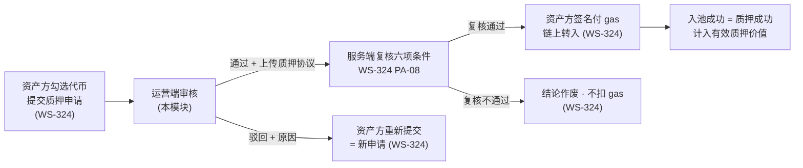
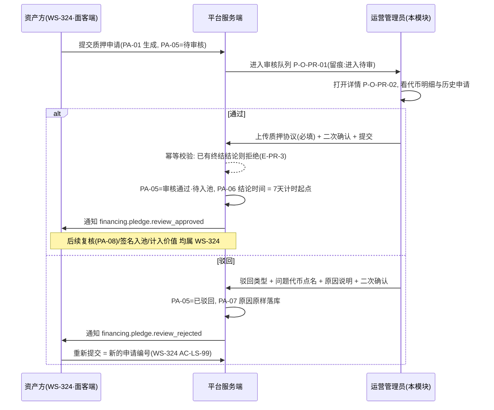
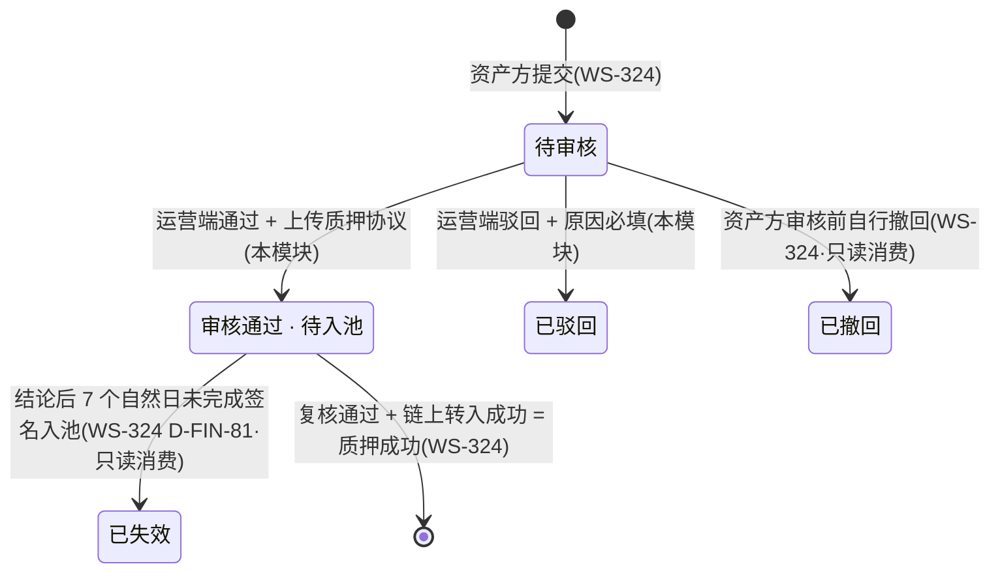

# 金融服务平台 · 运营端 · 代币质押审核 PRD **V1.0**

> **本模块承接 WS-324 V9.4 留下的外部缺口第 1 条**（分册 10.4 / 10.5 第 11 项）：需求方 2026-09-17 裁定「代币质押增加运营管理端审核环节，审核通过才是质押成功」，面客侧口径已在 WS-324 V9.4 定稿入库（`cly-V1.0.0` / `329b193`），**审核动作本身此前没有任何模块承接**。本 PRD 即该承接方。
>
> **本 PRD 只写运营端这一侧**：谁来审、看到什么、怎么裁定、结果怎么回写。WS-324 V9.4 已定稿的业务规则（先审后上链、通过≠质押成功、7 天失效、审核期不计入有效质押价值、审核态挂 `PA-*`）**一律引用编号、不重新推导、不改写**。

**本模块为两册**（编号连续、同一编号只在一处定义）：

| 文件 | 内容 | 读者 |
| --- | --- | --- |
| `v1.0-代币质押审核-PRD.md`（本册） | 第 1～8 章：文档信息、背景与目标、范围与边界、角色与场景、信息架构与页面、功能清单、模块详情、流程与状态 | 需求方、设计、实现 |
| [`01-数据字段与对外契约.md`](01-数据字段与对外契约.md) | 第 9～16 章：数据与字段、通知契约与 `biz_type`、非功能、指标、依赖与风险、验收标准、对上游的修订请求与登记申请、待确认项 | 实现方、测试、WS-324／WS-329／WS-304 的负责人 |

---

## 1. 文档信息

| 项 | 内容 |
| --- | --- |
| 文档名称 | 金融服务平台 · 运营端 · 代币质押审核产品需求文档 |
| 对应需求 | WS-337「运营端 · 代币质押审核（PRD + 原型）」 |
| 所属平台 / 端 | 金融服务平台 · **运营端**（`.app` 控制台，消息池 `end = fs_ops`） |
| 覆盖端 | 金融服务平台 · **运营端** Web（单端）。**不含金融服务端（面客端）任何界面**，不含资产平台任何页面 |
| 上游输入 | WS-337 issue 描述（需求方 2026-09-17 裁定 + 五条待定项 + 红线）；WS-324《借贷广场 · 融资需求与代币质押 PRD》**V9.4**（主册 6.3.8 `D-FIN-80`～`D-FIN-84`、分册 6.10 `C-RV-01`～`C-RV-06`、7.2.1 `PA-*`、8.1 通知矩阵） |
| 依赖文档 | WS-308《运营端账户与登录 PRD》（登录态、运营管理员身份、单角色模型 `D-O02`、权限表体例）、WS-308『01-国际化基线.md』（平台级展示与脱敏基线）、WS-309《运营端消息通知 PRD》、`docs/design-system/harbour-credit-admin-components.md`（管理端组件规范）、`docs/notification-contract/接入指南.md`（四端共用的通知契约） |
| 编写人 | 许楚清（需求分析师） |
| 文档语言 | 中文；界面文案给中英对照（第 7.9 节），展示口径引用平台级国际化基线，**本册不重新定义** |
| 落库路径 | `financial-service-platform/prd/v1.0-代币质押审核/` |
| 版本 | **V1.0**（首版；五条待定项已全部给出结论，见 2.4） |

### 1.1 编号段位申请

本模块是运营端新模块，按 `docs/notification-contract/接入指南.md` 4.2「运营端后续模块优先采用带模块字母的子段」，申请模块字母 **`PR` = Pledge Review**（全平台未占用；现有运营端字母为 `AG` / `TC` / `TI` / `FX` / `DS`）。

| 类别 | 本模块段位 | 实际用到 |
| --- | --- | --- |
| 页面 | `P-O-PR-01`～`P-O-PR-09` | `P-O-PR-01`～`P-O-PR-02` |
| 组件 | `C-O-PR-01`～`C-O-PR-09` | `C-O-PR-01`～`C-O-PR-04` |
| 功能点 | `F-PR-01`～ | `F-PR-01`～`F-PR-16` |
| 本模块口径 | `D-PR-01`～ | `D-PR-01`～`D-PR-16` |
| 字段 | `RV-01`～ | `RV-01`～`RV-14` |
| 参数常量 | `N-PR-01`～ | `N-PR-01`～`N-PR-03` |
| 异常分支 | `E-PR-1`～ | `E-PR-1`～`E-PR-8` |
| 验收标准 | `AC-PR-01`～ | `AC-PR-01`～`AC-PR-35` |
| 指标 / 风险 / 依赖 / 待确认 | `M-PR-*` / `R-PR-*` / `DEP-PR-*` / `Q-PR-*` | 见分册 12～13、16 |

> **段位合入登记表是另一件事**：本节是**申请**，`接入指南.md` 4.2 的登记表由 WS-304／WS-329 的负责人合入（分册 15 `REV-06`）。本模块避开了 `P-O40` / `C-O40` 起的数字段与 WS-305 待批的 `P-M4x` 段位。
>
> **引用外部编号一律写全称**：`WS-324 D-FIN-81`、`WS-324 PA-07`、`WS-308 D-O02`。本册自有编号不带模块前缀。

---

## 2. 背景与目标

### 2.1 背景

质押是平台放贷的抵押物入口。V9.4 之前，资产方勾选代币即可自行发起链上转入，代币进池、计入有效质押价值，平台在资产进池这一步**没有任何准入把关**。需求方 2026-09-17 裁定加入运营管理端审核环节，并明确「审核通过才是质押成功」。

WS-324 V9.4 已把面客侧的口径定死：提交申请 → 运营端审核 → 通过后资产方回来签名付 gas 入池；审核期内代币留在资产方自己地址、**驳回零 gas**（`WS-324 D-FIN-80`）。但那份 PRD 同时如实记下：**审核动作没有任何模块承接**（分册 10.4 第 1 条）——面客端只能做到「提交审核 + 看结果」，中间那一步在产品上是断的。本模块补上这一段。

### 2.2 本期目标

| # | 目标 | 对应 |
| --- | --- | --- |
| 1 | 运营管理员能在控制台看到全部待审的质押申请，按提交时间 / 资产方 / 项目筛出要处理的那几条 | `F-PR-01`～`F-PR-05`，落 `WS-324 C-RV-01` |
| 2 | 详情页一屏给全裁定所需信息：申请信息、代币明细、资产方主体、提交时间、历史申请 | `F-PR-06`～`F-PR-08`，落 `WS-324 C-RV-01` |
| 3 | 两个结论：**通过必须上传质押协议**、**驳回必须填原因**，一次申请只有一个终结结论 | `F-PR-09`～`F-PR-11`，落 `WS-324 C-RV-02`／`C-RV-03` |
| 4 | 结论回写面客端，驱动 `WS-324 PA-05` 与两条通知；重复回写幂等 | `F-PR-12`，落 `WS-324 C-RV-03` |
| 5 | 提交、结论、协议上传全留痕，可按申请编号回溯 | `F-PR-13`，落 `WS-324 C-RV-04` |
| 6 | 给出对外可承诺的审核时限并在运营端呈现等待时长与超时 | `F-PR-14`～`F-PR-15`，落 `WS-324 C-RV-05` |
| 7 | 两条审核通知的 `biz_type` 一次定名，构造与去重键写死 | 分册 10 |

### 2.3 本期不做

| # | 不做项 | 归属 / 理由 |
| --- | --- | --- |
| 1 | 面客侧的提交入口、审核结果呈现、7 天倒计时展示、重新提交 | **WS-324**。本模块只回写结论，不碰面客端任何文件 |
| 2 | 链上转入本身、质押合约、签名 SDK | WS-312 / WS-318 已有合约；链上转入**必须由资产方签名付 gas**（`WS-324 D-FIN-80`），运营端**不得代发**（`WS-324 C-RV-06`） |
| 3 | 通过后入池前的六项条件复核（`WS-324 PA-08`） | **服务端自动执行**，不是人工动作。运营端只读呈现复核结果，不提供人工复核入口（`D-PR-15`） |
| 4 | 撤回质押、失效代币清出的审核 | `WS-324 D-FIN-83`：**撤回不走审核**。本模块的审核对象只有「建池首笔」与「追加质押」两类申请 |
| 5 | 双人复核 / 审核工作量分配 / 转派与升级 | `D-PR-05`，本期单角色，无第二审角色可分离 |
| 6 | 审核人绩效看板、审核量报表 | 本期只出 `M-PR-*` 指标口径，不出页面 |
| 7 | 「要求补正」这类中间结论 | `D-PR-10`：会造出第三个结论并破坏 `WS-324 PA-05` 的终态定义 |
| 8 | 运营端主动发起的质押、代币清单修改 | `WS-324 C-RV-06`【反向】 |

### 2.4 五条待定项的结论速查

issue 描述提出五条待定项，全部在本 PRD 给出结论，逐条正文见第 7 章。

| # | 待定项 | 结论 | 正文 |
| --- | --- | --- | --- |
| **1** | 一次申请含多张代币时能否**部分通过** | ❌ **不支持部分通过。** 申请是原子对象，结论是申请级的；审核人认为个别代币不合格时**整单驳回并在原因里点名问题代币**，资产方剔除后重新提交（零 gas、零链上成本） | `D-PR-01`、`D-PR-02`（7.1、7.5） |
| **2** | 协议文件的格式 / 大小 / 替换 / 版本 / 驳回后旧协议 | PDF / JPG / PNG，单文件 ≤ 10 MB，**1～5 个**（沿用 WS-305 第 6 节基线，不另定一套）；**结论提交前可反复替换，提交后不可替换不可删除**；不做版本化；**驳回单上不存在协议**（协议只在通过时上传），失效 / 复核不通过单上的协议随原申请归档并标注「已失效 · 仅存档」 | `D-PR-03`、`D-PR-04`（7.4） |
| **3** | 审核人身份与权限、自审自批、双人复核 | 沿用 `WS-308 D-O02` **单角色「运营管理员」**，不新造角色；**自审自批在系统内不可能**（申请人是金融服务端资产方账号、审核人是运营端账号，两套账号体系不互通），但结论必须留痕到人；**本期不做双人复核** | `D-PR-05`～`D-PR-07`（7.7） |
| **4** | 审核时效 / SLA / 超时呈现 | 设 **2 个工作日**的对外承诺时限（`N-PR-01`，可配置）；**超时只呈现、不自动流转**——不自动通过（审核形同虚设）也不自动驳回（伤害资产方）。列表出「已等待」列与超时标记，统计卡出超时计数 | `D-PR-08`、`D-PR-09`（7.6） |
| **5** | 驳回后能否改一改再提交 | 必须**重新提交一条新申请**（新申请编号，`WS-324 AC-LS-99` 已定），走完整审核；运营端不提供「退回修改」的中间态。运营端详情提供**同项目历史申请时间线**，识别反复提交 | `D-PR-10`（7.5、7.2） |

### 2.5 不可削弱的红线（逐条落到验收）

| # | 红线 | 本模块落点 |
| --- | --- | --- |
| 1 | **审核期内绝不计入有效质押价值**（`WS-324 D-FIN-82`，属 `D-FIN-54` 保守原则第 ④ 项） | 运营端不产生、不修改任何质押价值；通过结论**不触发任何计入动作**（`AC-PR-24`） |
| 2 | **通过 ≠ 质押成功** | 通过弹层与结论条的文案必须明写「审核通过不等于质押成功，资产方还需在 7 个自然日内签名入池」（`D-PR-13`、`AC-PR-11`） |
| 3 | 术语沿用 WS-324：`质押覆盖状态` / `覆盖有余·覆盖持平·覆盖不足` / `覆盖缺口`；**全文不得出现「担保」二字** | `D-PR-13`、`AC-PR-30` |
| 4 | 运营端不得代发链上转入、不得改代币清单、不得部分通过 | `WS-324 C-RV-06` → `D-PR-11`、`D-PR-01`，界面无入口 + 服务端拒绝双侧落实（`AC-PR-27`） |

---

## 3. 范围与边界

### 3.1 本模块在链路中的位置



**本模块只占图中 B 这一格。** 左边（提交）与右边（复核、签名、入池、计入）全部属 WS-324，本 PRD 一律引用、不重写、不改其文件。

### 3.2 与 WS-324 的接口（`WS-324 C-RV-01`～`C-RV-06` 的逐条落实）

| WS-324 的要求 | 本模块落点 | 状态 |
| --- | --- | --- |
| `C-RV-01` 审核队列与详情（筛选 + 七类必见信息） | `P-O-PR-01` / `P-O-PR-02`，7.1 / 7.2 | ✅ 全部落实，并**超出要求**补了历史申请时间线与复核结果呈现 |
| `C-RV-02` 两个结论 + 驳回原因必填 | `F-PR-09`～`F-PR-11`，7.3 / 7.4 | ✅ 落实，并补「通过必须上传质押协议」这一本模块新增的必填项 |
| `C-RV-03` 结论回写契约 + 一次申请一个终结结论 + 幂等 | `F-PR-12`，7.5 / 9.3（分册） | ✅ 落实，并补并发裁定的处理（`D-PR-07`） |
| `C-RV-04` 留痕可按申请编号回溯 | `F-PR-13`，7.8 | ✅ 落实 |
| `C-RV-05` 给出可承诺的审核时限 | `N-PR-01` = **2 个工作日**，7.6 | ✅ 给出。面客端据此展示预期等待属 WS-324，登记为 `REV-02` |
| `C-RV-06`【反向】不代发链上、不改代币清单、不部分通过 | `D-PR-01`、`D-PR-11` | ✅ 界面无入口 + 服务端拒绝 |

### 3.3 边界声明

- 本模块**不新增、不修改任何业务状态**。`WS-324 PA-05` 的五个取值（`待审核` / `审核通过 · 待入池` / `已驳回` / `已失效` / `已撤回`）是 WS-324 定义的，本模块只**写入其中两个**（`审核通过 · 待入池`、`已驳回`），另外两个（`已失效`、`已撤回`）由 WS-324 侧产生，本模块**只读消费**（`D-PR-12`）。
- 代币三态 `PS-*` 与链上轴 `CT-*` **一律不动**（`WS-324 D-FIN-84`）。本模块界面不出现这两根轴的写操作。
- 本模块**不触达链上、不消耗 gas**。

---

## 4. 用户角色与场景

### 4.1 角色

| 角色 | 所在端 | 描述 | 本模块内的核心诉求 |
| --- | --- | --- | --- |
| **运营管理员**（Operations Administrator） | 运营端 | `WS-308 D-O02` 定义的本期运营端唯一角色，使用工作邮箱账号登录 | 一眼看出哪些申请在等、哪条快超时；点进去能判断这批代币该不该进池；裁定动作不出错、出错能追溯 |
| 资产方（企业用户） | 金融服务端（面客） | 申请的提交方 | **不是本模块的用户**——他不进运营端。本模块只保证结论与原因原样传达到他那边 |

> **资产平台的管理端管理员不是本模块的角色。** 两平台账号不互通，资产管理端的人不会出现在本模块的任何权限、留痕或通知收件范围里（与 WS-310 同口径）。

### 4.2 用户故事

| # | 角色 | 用户故事 | 对应功能 |
| --- | --- | --- | --- |
| `US-PR-01` | 运营管理员 | 我上班打开控制台，想**一眼看到有多少笔在等我审**、其中几笔已经超时，而不用自己翻列表数 | `F-PR-02` |
| `US-PR-02` | 运营管理员 | 我想按**资产方、项目、提交时间**筛，把同一家企业这几天提的申请一起处理掉 | `F-PR-03` |
| `US-PR-03` | 运营管理员 | 点进一笔申请，我要在**同一页**看全代币明细、企业主体和提交时间，不用跳到别的模块拼信息 | `F-PR-06`、`F-PR-07` |
| `US-PR-04` | 运营管理员 | 我发现这家企业**前两周被驳回过两次**，想知道这次是不是同样的问题 | `F-PR-08` |
| `US-PR-05` | 运营管理员 | 这批 5 张代币里只有 1 张有问题，我需要知道**该怎么处理**——是只放另外 4 张，还是整单退回 | `D-PR-01`、`F-PR-11` |
| `US-PR-06` | 运营管理员 | 我裁定通过时要**把签好的质押协议传上去**，传错了要能在提交前换掉 | `F-PR-09`、`D-PR-03` |
| `US-PR-07` | 运营管理员 | 我驳回时要能**点名是哪几张代币有问题**，而不是让资产方对着一句「资料不符」猜 | `F-PR-11`、`D-PR-02` |
| `US-PR-08` | 运营管理员 | 我点了通过之后，要清楚这笔**还没有质押成功**，资产方还得回来签名 | `D-PR-13`、`AC-PR-11` |
| `US-PR-09` | 运营管理员 | 同事和我同时打开了同一笔，我提交结论时要知道**他是不是已经裁过了** | `D-PR-07`、`E-PR-3` |
| `US-PR-10` | 运营管理员 | 三个月后有争议，我要能**按申请编号把当时是谁、几点、凭什么裁的翻出来** | `F-PR-13` |

### 4.3 典型场景

| # | 场景 | 走向 |
| --- | --- | --- |
| `S-PR-1` | **常规通过**：代币归属清晰、底层账期正常、与池内类型一致 | 详情页 →「通过」→ 上传质押协议 → 二次确认（含「通过≠质押成功」提示）→ 提交 → `PA-05 = 审核通过 · 待入池`、推 `financing.pledge.review_approved` |
| `S-PR-2` | **整单驳回**：申请里某张代币底层应收账款临近到期，不宜进池 | 详情页 →「驳回」→ 选驳回类型 + 勾选问题代币 + 填原因 → 二次确认 → 提交 → `PA-05 = 已驳回`、原因原样透传、推 `financing.pledge.review_rejected` |
| `S-PR-3` | **进详情时申请已不在待审**：资产方已自行撤回，或并发同事已裁定 | 详情页转只读，顶部出 `C-O-PR-03` 说明条讲清当前状态与由谁裁定，结论区不渲染（`E-PR-2`／`E-PR-3`） |
| `S-PR-4` | **通过后服务端复核不通过**：代币已被别处占用 / 底层已失效 | 结论作废由 WS-324 侧执行；运营端详情的复核结果区只读展示 `WS-324 PA-08` 的结论与原因，**不提供人工复核入口**（`D-PR-15`） |
| `S-PR-5` | **通过后 7 天未入池而失效** | `PA-05 = 已失效` 由 WS-324 侧置位，运营端只读消费；该单上的质押协议标注「已失效 · 仅存档」（`D-PR-04`） |
| `S-PR-6` | **追加质押申请**：`WS-324 PA-04 = 追加质押` | 与首笔走同一条审核链路（`WS-324 D-FIN-83`），详情页用申请类型标签区分，规则不分叉 |

---

## 5. 信息架构与页面（线框级）

### 5.1 画布形态

运营端 `.app` 控制台骨架：**固定侧栏 + 紧凑顶栏 + 白色卡片 + 清晰表格边界**，按 `docs/design-system/harbour-credit-admin-components.md` 第 3 章 shell layout 与第 7 章组合示例。**不套面客端 portal 的页面结构。** token 与公共组件取 `asset-platform/prototypes/_shared/`，页面在 `financial-service-platform/prototypes/_shared/registry.js` 登记（画布端别 `admin`，消息池 `fs_ops`，两者都对，见接入指南 2.3 的提醒）。

### 5.2 菜单位置

新增一级菜单**「质押审核」**，置于既有菜单树（总览 / 资产清单 / 汇率管理 / 代币管理 / 协议管理，WS-318 PRD V1.1 5.1）中**「代币管理」与「协议管理」之间**——它消费的是代币，产出的是协议，位置上贴着这两者；不放在总览下、不做成代币管理的子页（它是独立的工作队列，不是代币的只读视图）。

### 5.3 页面清单

| 编号 | 页面 | 形态 | 入口 |
| --- | --- | --- | --- |
| `P-O-PR-01` | **质押审核列表** | `app` 画布：页面标题 + Statistic card × 3 + 表格卡片（Filter bar + Table） | 侧栏「质押审核」 |
| `P-O-PR-02` | **质押审核详情** | `app` 画布：面包屑 + 申请概览卡 + 代币明细表 + 历史申请时间线 + 结论区 | 列表行「查看详情」；消息中心 `biz_ref` 跳转 |

> **两页而不是三页**：不单开「已审结列表」页——已通过 / 已驳回只是同一张表的筛选值，拆成两页会让「同一家企业这几天提了什么」要在两个页面之间来回对（与 WS-318 `T-01`「同一个页面不另取编号」同一原则）。

### 5.4 组件清单

| 编号 | 组件 | 说明 |
| --- | --- | --- |
| `C-O-PR-01` | **通过结论弹层** | Modal（宽变体）：申请编号与代币张数只读回显 → 质押协议上传区（必填）→ 备注（选填）→ **「通过≠质押成功」说明条** → 二次确认 |
| `C-O-PR-02` | **驳回结论弹层** | Modal（宽变体）：驳回类型（必选）→ 问题代币勾选（选填，勾选后自动写入原因文本首段、可编辑）→ 原因说明（必填）→ 原因全文预览（明示将原样发给资产方）→ 二次确认 |
| `C-O-PR-03` | **已裁定 / 不可裁定说明条** | 复用管理端 Inline alert 的信息变体：申请已被裁定、已撤回、已失效、已超时未入池时置于详情正文上方，**说明当前状态与原因，不用错误红色**（失效是正常业务状态，与 `C-23` 同口径） |
| `C-O-PR-04` | **时效标记** | Tag/Badge：`待审 · 已等待 {N}` / `已超时 {N}`；颜色 + **文本**双重表达，不得只用颜色（管理端规范第 4 章） |

### 5.5 线框（仅信息架构，不含视觉）

**`P-O-PR-01` 质押审核列表**

```text
质押审核 / Pledge review
待处理的质押申请；通过后资产方仍需签名入池才算质押成功
┌ 待审核 12 ┐┌ 已超时 2 ┐┌ 近 7 日审结 34 ┐        ← Statistic card ×3
└──────────┘└─────────┘└───────────────┘
┌ 表格卡片 ─────────────────────────────────────────────────┐
│ Filter bar: [审核状态 ▾][资产方 ▾][目标项目 ▾][申请类型 ▾]  │
│             [提交时间 起—止][搜索 申请编号/企业名]  [重置]  │
│ Table:                                                     │
│  申请编号 | 资产方企业 | 目标项目 | 类型 | 代币张数 |        │
│  代币价值合计 | 提交时间 | 已等待/超时 | 状态 | 操作         │
│  …                                                         │
│ 分页（常规分页，筛选与分页状态在详情往返中保留）             │
└────────────────────────────────────────────────────────────┘
```

**`P-O-PR-02` 质押审核详情**

```text
质押审核 / PA-20260917-0012                                  ← breadcrumb
[C-O-PR-03 说明条：仅在不可裁定时出现]
┌ 申请概览 ───────────────────────────────────────────────┐
│ 申请编号 · 申请类型 · 审核状态 · 提交时间 · 已等待        │
│ 资产方企业（主体名称 / 统一标识）· 目标项目（编号·名称·   │
│ 代币类型）· 代币张数 · 代币价值合计                       │
└──────────────────────────────────────────────────────────┘
┌ 代币明细 ───────────────────────────────────────────────┐
│ 代币编号 | 数量/币种 | 代币价值 | 底层账期 | 买方企业 |    │
│ 代币有效状态                        （只读表格，可分页）  │
└──────────────────────────────────────────────────────────┘
┌ 历史申请（同一项目）─────────────────────────────────────┐
│ Timeline：申请编号 · 结论 · 结论时间 · 审核人 · 原因摘要   │
└──────────────────────────────────────────────────────────┘
┌ 结论区 ─────────────────────────────────────────────────┐
│ 待审核：[通过] [驳回]                                     │
│ 已裁定：结论 · 结论时间 · 审核人 · 质押协议（可下载）/     │
│         驳回原因全文 · 复核结果（若已复核，只读）          │
└──────────────────────────────────────────────────────────┘
```

> 线框只表达信息架构与层级，**不构成视觉稿**；具体栅格、间距与组件取值由设计按管理端组件规范决定。

---

## 6. 功能清单

| 编号 | 模块 | 功能点 | 描述 | 验收 |
| --- | --- | --- | --- | --- |
| `F-PR-01` | M1 列表 | 审核队列 | 展示全部质押申请，默认视图为「待审核 + 按提交时间正序」（先提交的先处理） | `AC-PR-01` |
| `F-PR-02` | M1 列表 | 统计卡 | 待审核数、已超时数、近 7 日审结数三个数，与表格筛选结果口径一致 | `AC-PR-02` |
| `F-PR-03` | M1 列表 | 筛选 | 审核状态、资产方企业、目标项目、申请类型、提交时间区间、关键词（申请编号 / 企业名） | `AC-PR-03` |
| `F-PR-04` | M1 列表 | 排序与分页 | 提交时间、已等待时长、代币价值合计三列可排序；常规分页；**筛选与分页状态在详情往返中保留** | `AC-PR-04`、`AC-PR-05` |
| `F-PR-05` | M1 列表 | 行内跳转 | 每行「查看详情」进 `P-O-PR-02`；列表不提供任何裁定入口 | `AC-PR-06` |
| `F-PR-06` | M2 详情 | 申请概览 | 申请编号、类型、状态、提交时间、已等待、资产方企业主体、目标项目、代币张数与价值合计 | `AC-PR-07` |
| `F-PR-07` | M2 详情 | 代币明细 | 代币编号、数量 / 币种、代币价值、底层账期、买方企业、代币有效状态；**只读** | `AC-PR-08` |
| `F-PR-08` | M2 详情 | 历史申请时间线 | 同一目标项目下该资产方的历史申请与结论（编号、结论、时间、审核人、原因摘要） | `AC-PR-09` |
| `F-PR-09` | M3 裁定 | 通过 | 打开 `C-O-PR-01`：**必须上传质押协议**，二次确认后提交 | `AC-PR-10`～`AC-PR-13` |
| `F-PR-10` | M3 裁定 | 质押协议上传 | PDF / JPG / PNG、单文件 ≤ 10 MB、1～5 个；提交前可增删替换，提交后锁定 | `AC-PR-14`～`AC-PR-16` |
| `F-PR-11` | M3 裁定 | 驳回 | 打开 `C-O-PR-02`：驳回类型必选、原因说明必填、问题代币可勾选；二次确认后提交 | `AC-PR-17`～`AC-PR-20` |
| `F-PR-12` | M4 回写 | 结论回写与幂等 | 回写申请编号、结论、结论时间、审核人标识、驳回原因；一次申请只允许一个终结结论，重复回写幂等 | `AC-PR-21`～`AC-PR-23` |
| `F-PR-13` | M5 留痕 | 操作记录 | 提交（消费）、结论、协议上传、重新提交各留一条，按申请编号可回溯；记录不可编辑不可删除 | `AC-PR-25`、`AC-PR-26` |
| `F-PR-14` | M6 时效 | SLA 计时 | 以提交时间为起点计算已等待时长，超过 `N-PR-01` 标记超时 | `AC-PR-28` |
| `F-PR-15` | M6 时效 | 超时呈现 | 列表出超时标记与超时计数；**不自动流转任何状态** | `AC-PR-29` |
| `F-PR-16` | M7 通知 | 两条结论通知 | 结论落库成功后按分册 10 的契约投递给资产方（`end = fs`） | `AC-PR-31`、`AC-PR-32` |

---

## 7. 模块详情

### 7.1 `D-PR-01` 不支持部分通过（本 PRD 最需要定死的一条）

**结论：一次申请只有一个申请级结论，不支持部分通过。**

| 项 | 内容 |
| --- | --- |
| **规则** | 审核人对一条申请只能给出 `通过` 或 `驳回`，**作用于申请内的全部代币**。界面不提供按代币勾选通过的控件，服务端拒绝任何携带代币子集的结论回写 |
| **上游依据** | `WS-324 C-RV-06`【反向】已定稿：运营端**不得部分通过**，理由是「部分通过会让『申请』这个对象失去原子性，后续对账无法自洽」。本模块落实，不重新论证 |
| **为什么这条不能松** | ① `WS-324 PA-05` 是**申请级**枚举，`审核通过 · 待入池` 没有「部分」这一档——支持部分通过就要给申请加子状态或再造一个「批次」对象，`PA-*` 整套定义要重写；② `WS-324 D-FIN-81` 的复核对象是「这一次申请的代币清单」，部分通过后复核范围变成一个子集，**复核不通过时作废的是半张结论**，作废语义无法自洽；③ 7 天失效计时的对象同样是申请（`PA-06` 结论时间起算），部分通过会出现「同一条申请里有的代币在计时、有的从未开始计时」；④ 留痕与对账按申请编号回溯（`C-RV-04`），一单两结论会让回溯出现二义 |
| **代价** | 5 张代币里 1 张有问题，另外 4 张也要跟着重来一次 |
| **为什么代价可接受** | 重来的**成本是零**：审核期内代币留在资产方自己地址、**一分 gas 都不花，驳回 = 零 gas**（`WS-324 D-FIN-80`）；重新提交不设冷却、即时可提。资产方付出的只是一次重新勾选，换来的是「申请」这个对象在全链路口径一致 |
| **必须配套的缓解**（否则整单驳回会退化成盲目重提） | `D-PR-02`：驳回原因**必须能点名问题代币**。没有这一条，资产方拿到「整单驳回」后不知道该剔哪张，只能整批换或反复试——那才是这条决策真正的风险 |

### 7.2 M1 审核列表（`P-O-PR-01`）

| 项 | 口径 |
| --- | --- |
| **数据范围** | 全部质押申请（`WS-324 PA-*`），不按运营管理员分配过滤（本期单角色、无认领机制） |
| **默认视图** | 审核状态 = `待审核`，按提交时间**正序**（先提交先处理）。这与大多数列表「最新在前」相反，是刻意的：审核队列的公平性取决于先来先审，最新在前会让早提交的申请越沉越深 |
| `D-PR-14` **状态筛选取值** | 直接用 `WS-324 PA-05` 的五个取值，**不另造一套运营端叫法**：`待审核` / `审核通过 · 待入池` / `已驳回` / `已失效` / `已撤回`。运营端能裁定的只有第一个，其余四个是只读视图 |
| **列** | 申请编号 · 资产方企业 · 目标项目 · 申请类型 · 代币张数 · 代币价值合计 · 提交时间 · 已等待 / 超时（`C-O-PR-04`）· 审核状态 · 操作 |
| **代币价值合计** | **只读展示**，取 WS-324 侧的代币价值口径（`RV-09`）。运营端**不重算、不换算、不打折**——质押率 80% 是项目层的常量（`WS-324` 7.3），与单条申请的价值合计不是一回事，列表不出质押率、不出覆盖相关的任何数 |
| **排序** | 提交时间、已等待时长、代币价值合计三列；默认按提交时间正序 |
| **分页** | 常规分页；**从详情返回时保留筛选与分页状态**，浏览器后退同样保留（与 WS-318 `T-03` 同一原则：任何跳转都不许把人的上下文丢掉） |
| **空态** | 待审为空时给正向空态「当前没有待审核的质押申请」，不画伪数据（管理端规范第 5 章 Empty state） |

### 7.3 M2 审核详情（`P-O-PR-02`）

`WS-324 C-RV-01` 要求详情至少可见七项，本模块全部落实并补两块：

| 区块 | 内容 | 来源 |
| --- | --- | --- |
| 申请概览 | 申请编号、申请类型、审核状态、提交时间、已等待 | `WS-324 PA-01`/`PA-04`/`PA-05`/`PA-06` |
| 资产方主体 | 企业主体名称与唯一标识（脱敏按平台级基线） | WS-311 `entity_id` 契约 |
| 目标项目 | 项目编号、项目名称、池内代币类型 | `WS-324 PA-02` |
| 代币明细 | 代币编号、数量 / 币种、代币价值、底层账期、买方企业、代币有效状态 | `WS-324 PA-03` + WS-318 |
| **历史申请**（本模块补充） | 同一目标项目下该资产方的全部历史申请：编号、结论、结论时间、审核人、原因摘要 | `D-PR-10` 的配套 |
| **复核结果**（本模块补充，只读） | 通过后服务端复核的结论与原因 | `WS-324 PA-08` |
| 结论区 | 待审核时出两个按钮；已裁定时出结论、时间、审核人、质押协议或驳回原因全文 | 7.5 |

| 编号 | 口径 |
| --- | --- |
| `D-PR-15` | **复核（`WS-324 PA-08`）不是人工动作。** 它是通过后、发起链上转入前由服务端重新校验六项可质押条件（`WS-324 D-FIN-81`），运营端**只读呈现结果、不提供人工复核入口、不能改判**。把它做成人工按钮会凭空造出第二道审核，而 `D-FIN-81` 的设计意图正是用机器兜住「审核期内代币可能被转走」这个已知代价 |
| `D-PR-16` | **详情页不出现代币三态与链上轴的任何写操作**，也不出现「有效质押价值」「融资上限」「可融金额」「覆盖状态」这些项目层派生量——审核期内它们本就不含这批代币（`WS-324 D-FIN-82`），在审核页展示只会诱导审核人以为通过会立刻改变这些数 |

### 7.4 M3-① 通过（`F-PR-09`、`F-PR-10`，`C-O-PR-01`）

**动作序列**：详情页「通过」→ `C-O-PR-01` 弹层 → 上传质押协议（必填）→ 备注（选填，≤ 200 字，**仅运营端内部可见、不透传给资产方**）→ 勾选确认「我已知悉审核通过不等于质押成功」→ 提交 → Toast + 详情页转已裁定态。

| 编号 | 口径 |
| --- | --- |
| `D-PR-03`【协议文件规格】 | **PDF / JPG / PNG，单文件 ≤ 10 MB，1～5 个**——沿用 WS-305 第 6 节基线，与 `WS-324 FD-09` 盖章件、`WS-326 LN-07` 转账凭证、`WS-327 RM-07` 银行支付凭证**完全一致，不另定一套**。给 1～5 个而不是恰好 1 个：协议正文与附件（代币清单页、签署页扫描件）常常是分开的几个文件，硬限一个会逼运营先去合并 PDF。**结论提交前**可任意增删替换；**结论提交后不可替换、不可删除**——它是 `C-RV-04` 留痕的组成部分，争议时是唯一证据 |
| `D-PR-04`【协议与申请的对应关系】 | **协议只在「通过」时上传，一次申请至多一份（一组）协议，不做版本化。**由此：① **驳回单上不存在协议**——issue 待定项 2 的「驳回后重新提交时旧协议怎么处理」在本设计下不成立，因为被驳回的申请从来没有协议；② 真正会留下协议的失败路径是**复核不通过**与**7 天失效**，这两类单上的协议**随原申请归档并标注「已失效 · 仅存档」**，不带到新申请，新申请通过时重新上传；③ 不做版本化的理由：版本化的前提是「同一份协议被反复修订」，而这里每次重新提交都是**新的申请编号**（`WS-324 AC-LS-99`），一单一协议天然就是终稿 |
| `D-PR-13`【通过≠质押成功】 | 弹层内必须有一条不可关闭的说明条：**「审核通过不等于质押成功。资产方还需在结论后 7 个自然日内完成签名入池，逾期结论自动失效（`WS-324 D-FIN-81`）。」** 提交成功的 Toast 与详情页结论区同样带这句话的短版。**界面不得出现「质押成功」「已质押」「已入池」来描述通过这个动作**；也不得出现「担保」二字（红线 3） |
| `AC-PR-24` 对应口径 | **通过结论不触发任何计入动作。** 运营端不写、不改有效质押价值、融资上限、可融金额、覆盖状态中的任何一个数——计入的充要条件是「审核通过 + 链上转入成功」两者同时满足（`WS-324 D-FIN-82`） |

> **为什么协议必填而不是选填**：这是需求方 2026-09-17 的原始裁定（issue 描述「通过时必须上传协议」）。产品上它也是这条链路唯一的书面凭据——通过之后代币要进合约、要为放款背书，而合同本期线下签订（`WS-325`），平台侧若不在此处收口，整条链上就没有任何一处存有这份协议。

### 7.5 M3-② 驳回与结论回写（`F-PR-11`、`F-PR-12`，`C-O-PR-02`）

| 编号 | 口径 |
| --- | --- |
| `D-PR-02`【驳回原因的结构】 | 驳回原因由三部分组成，**合成一段文本**写入 `WS-324 PA-07`：① **驳回类型**（必选，枚举见 `RV-11`）；② **问题代币点名**（选填，从本申请的代币清单勾选，勾选结果自动生成一行文本插入原因开头，审核人可编辑）；③ **原因说明**（必填，10～500 字，禁止只填标点或纯空白）。弹层底部给**原因全文预览**，并明示「以下内容将原样发送给资产方」。之所以合成文本而不是新增结构化字段：`WS-324 PA-07` 是文本字段且要求**原样透传、不做二次加工**（`AC-LS-99`），新增结构化字段会要求面客端同步改渲染，而本模块不改 WS-324 任何文件 |
| `D-PR-07`【一次申请一个终结结论 · 并发裁定】 | 结论**只允许写入一次**（`WS-324 C-RV-03`）。两名运营管理员同时打开同一笔时，**先落库者生效**；后提交者被服务端拒绝，界面给 `C-O-PR-03` 说明条：「该申请已于 {时间} 由 {审核人} 裁定为 {结论}」，并刷新为只读态。**不做悲观锁 / 认领机制**：本期审核量小、单角色，锁会带来「谁忘了释放锁谁就卡住队列」的新问题，而幂等 + 乐观拒绝已经能保证结论唯一（`E-PR-3`） |
| `D-PR-10`【驳回后没有「就地修改」】 | 驳回是**终结结论**。资产方不能在原申请上改一改再提交，只能**重新提交一条新申请**（新申请编号，`WS-324 AC-LS-99` 已定，本模块不改）；运营端也**不提供「退回修改 / 要求补正」这类中间结论**——那会造出第三个终态，`WS-324 PA-05` 要重新定义，且「补正中」的申请该不该占用代币、该不该计时都要再定一遍规则。代价是资产方要重走一遍提交，而重走的成本是零 gas（`D-FIN-80`）。缓解是 `F-PR-08` 的历史申请时间线：审核人能看到这家企业在同一项目上提过几次、被驳回过什么，识别「同一个问题反复提交」 |
| **回写内容** | 申请编号、结论、结论时间、审核人标识、驳回原因（驳回时）、质押协议引用（通过时）。**重复回写按幂等处理**（同一申请编号 + 同一结论视为同一次，不重复推送通知） |
| **二次确认** | 通过与驳回都要二次确认。驳回的确认文案必须复述原因全文的首行，避免「点错按钮 + 原因写给别人」这类不可撤销的错误 |

### 7.6 M6 审核时效（`F-PR-14`、`F-PR-15`）

| 编号 | 口径 |
| --- | --- |
| `N-PR-01` | **审核时限 = 2 个工作日**（自提交时间起算）。这是 `WS-324 C-RV-05` 要的「对外可承诺的处理时限」。取 2 个工作日而不是 24 小时或 3 天：`WS-324 R-LS-13` 已记下「覆盖不足时想靠追加质押自救，最快也要一个审核周期」——审核周期越长，这条自救路径越不可用；而 1 个工作日在跨时区与节假日下承诺不住。**该值可配置**，调整不改任何业务逻辑 |
| `N-PR-02` | 「已等待」的展示粒度：< 1 小时按分钟，< 24 小时按小时，≥ 24 小时按天 + 小时。时区与时间格式引用平台级国际化基线 |
| `D-PR-08`【超时只呈现、不自动流转】 | 超过 `N-PR-01` 的待审申请标记为**已超时**并计入统计卡，**但状态不变、不自动通过、不自动驳回**。自动通过会让审核这道准入形同虚设（只要拖过 2 天就能进池，风控归零）；自动驳回则让资产方为平台的处理不及时买单，还会白白作废一批本来合格的代币。超时是**运营的管理信号**，不是业务状态 |
| `D-PR-09`【两个计时器必须分得清】 | 本链路上有两个方向相反的计时器，界面任何位置都必须带限定词，不得出现无限定词的「剩余时间」「倒计时」：① **审核时限**（`N-PR-01`，起点 = 提交时间，对象 = 待审申请，责任方 = 运营）；② **入池有效期**（常量 **7 个自然日**，`WS-324 D-FIN-81`，起点 = 结论时间，对象 = 已通过待入池的申请，责任方 = 资产方）。运营端列表的「已等待 / 超时」只表达①；已通过申请在详情页展示②时必须写全「资产方签名入池剩余 {N} 天」 |
| 不做 | 不做超时自动升级、自动转派、自动提醒他人——本期只有一个角色，没有第二个人可以升级给谁（`D-PR-05`） |

### 7.7 权限、身份与自审自批（`F-PR-13` 的前提）

| 编号 | 口径 |
| --- | --- |
| `D-PR-05`【角色】 | 沿用 `WS-308 D-O02` 的**单角色「运营管理员 / Operations Administrator」**，**不新造角色、不新造权限点**。权限表按「角色 → 能力」组织（与 WS-308 第 10 章同体例），本期只有一列，后续引入审核员 / 复核员时在右侧加列即可，不改本模块结构。**本期不做双人复核**：① 没有第二个角色可供职责分离，硬造两个权限相同的角色只会得到两个空壳；② 双人复核会把审核周期直接翻倍，与 `WS-324 R-LS-13` 的缓解方向相反；③ 这道审核把的是「资产能不能进池」，通过之后还有服务端对六项条件的自动复核（`WS-324 D-FIN-81`）兜底，不是单点裁量 |
| `D-PR-06`【自审自批】 | **在系统内不可能发生，因而不需要额外的互斥规则。** 申请的提交方是**金融服务端的资产方企业账号**（`end = fs`），审核方是**运营端账号**（`end = fs_ops`），两套账号体系不互通、不存在同一个账号既能提交又能裁定的路径。本模块要做的是**把结论落到人**：`RV-07` 审核人标识 + `RV-08` 审核人姓名快照必填且随留痕永久保存，线下的关联关系由留痕支撑事后追责，不靠系统前置拦截 |
| **权限点** | 查看审核列表与详情、提交结论、下载质押协议、查看操作记录——本期对运营管理员**全部开放**。**服务端鉴权是唯一有效的校验**：界面隐藏或禁用按钮不构成校验，越权直调写接口一律拒绝且响应不含业务数据 |
| `F-PR-13`【留痕】 | 记录对象、动作、操作人（标识 + 姓名快照）、时间、前后状态、关联对象（申请编号）、变更摘要、IP。**四类动作必留**：申请进入待审（消费提交事件）、结论提交、质押协议上传、资产方重新提交（新申请与旧申请的关联）。记录**不可编辑、不可删除**，按申请编号可完整回溯（`WS-324 C-RV-04`） |

### 7.8 异常分支

| # | 异常 | 处理 |
| --- | --- | --- |
| `E-PR-1` | 进入详情时申请**已被资产方撤回**（`PA-05 = 已撤回`） | 详情转只读，`C-O-PR-03` 说明「资产方已撤回该申请，无需裁定」，结论区不渲染 |
| `E-PR-2` | 进入详情时申请**已被他人裁定** | 同上，说明条给出结论、结论时间与审核人（`D-PR-07`） |
| `E-PR-3` | 提交结论时**并发冲突**（服务端已有终结结论） | 拒绝本次提交，不产生第二条结论、不推第二条通知；界面刷新为只读并给说明条。**本地未提交的协议文件不落库、不残留** |
| `E-PR-4` | 协议上传失败（网络 / 超限 / 格式不符） | 弹层内就地报错并指明原因（「单个文件不得超过 10 MB」「仅支持 PDF / JPG / PNG」「最多 5 个文件」），**不关闭弹层、不丢失已填内容**；结论**不提交** |
| `E-PR-5` | 通过已提交但通知投递失败 | **结论以落库为准，不因通知失败回滚**；按 WS-329 / WS-304 契约重试，`event_id` 不变（幂等）。面客端的页面标记始终保底，不依赖推送（`WS-324 DEP-08`） |
| `E-PR-6` | 代币明细中某张代币在审核期间**底层资产已失效** | 明细行标注「已失效 · 不计入覆盖」（沿用 WS-324 展示口径），审核人据此决定是否驳回。**本模块不自动驳回**——是否因此整单退回是人的判断 |
| `E-PR-7` | 申请引用的目标项目已关闭 / 已结清 | 详情正常展示，`C-O-PR-03` 提示项目当前状态；是否驳回由审核人判断（通过后的六项条件复核会再拦一次，`WS-324 D-FIN-81`） |
| `E-PR-8` | 列表 / 详情数据加载失败 | 按管理端规范给 skeleton → 失败态 + 重试入口，**不出现空白页**；失败不得表现为「没有待审申请」 |

### 7.9 关键界面文案（中英对照，最终以文案评审为准）

| 位置 | 中文 | English |
| --- | --- | --- |
| 菜单 / 页面标题 | 质押审核 | Pledge review |
| 列表副标题 | 待处理的质押申请；**通过后资产方仍需签名入池才算质押成功** | Pending pledge applications; an approval still requires the asset holder to sign and stake before the pledge takes effect |
| 通过按钮 | 通过 | Approve |
| 驳回按钮 | 驳回 | Reject |
| 通过弹层说明条 | **审核通过不等于质押成功。**资产方还需在结论后 7 个自然日内完成签名入池，逾期结论自动失效 | **Approval is not a completed pledge.** The asset holder must sign and stake within 7 calendar days, otherwise the decision expires |
| 协议上传提示 | 上传质押协议（必填）：PDF / JPG / PNG，单个不超过 10 MB，1～5 个 | Upload pledge agreement (required): PDF / JPG / PNG, up to 10 MB each, 1–5 files |
| 驳回原因提示 | 以下内容将**原样发送给资产方**，请写清楚问题出在哪几张代币 | The text below is sent to the asset holder **verbatim**; state which tokens are at issue |
| 超时标记 | 已超时 {N} | Overdue by {N} |
| 已裁定说明条 | 该申请已于 {时间} 由 {审核人} 裁定为 {结论} | Decided as {结论} by {审核人} at {时间} |
| 空态 | 当前没有待审核的质押申请 | No pledge applications awaiting review |

---

## 8. 流程与状态

### 8.1 审核主流程



### 8.2 `WS-324 PA-05` 的运营端视角

**这张图不是新状态机**——`PA-05` 由 WS-324 定义，本图只标出哪一段由本模块驱动。



| 转移 | 驱动方 | 本模块的角色 |
| --- | --- | --- |
| `→ 待审核` | WS-324（资产方提交） | 消费，入队列并留痕 |
| `待审核 → 审核通过 · 待入池` | **本模块** | **写入方** |
| `待审核 → 已驳回` | **本模块** | **写入方** |
| `待审核 → 已撤回` | WS-324（资产方） | 只读消费（`D-PR-12`） |
| `审核通过 → 已失效` | WS-324（7 天届满） | 只读消费（`D-PR-12`） |
| 复核 `PA-08`、链上转入、计入价值 | WS-324 | 只读呈现，无写能力 |

> **代币三态 `PS-*` 与链上轴 `CT-*` 在本图上一个都没有**——这正是 `WS-324 D-FIN-84` 的设计：审核态挂在申请上，代币的业务态与链上态不受审核影响。本模块不写这两根轴。

---

**下一册**：[`01-数据字段与对外契约.md`](01-数据字段与对外契约.md) — 数据与字段、通知契约与两条 `biz_type`、非功能、指标、依赖与风险、验收标准、对上游的修订请求与登记申请、待确认项。
