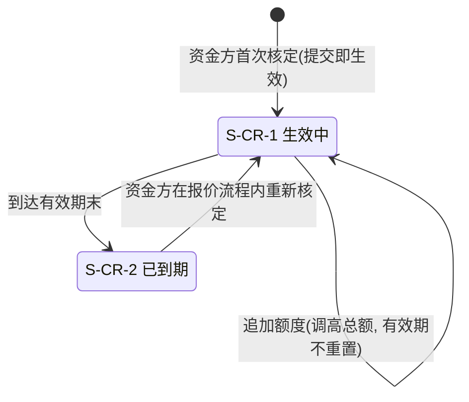

# 借贷广场 · 授信、报价与接受/拒绝 — 分册：数据字典与对外契约 **V2.0**

> 本册是 [`v1.0-借贷广场-授信报价与接受拒绝-PRD.md`](v1.0-借贷广场-授信报价与接受拒绝-PRD.md) 的分册，装 **6.4～6.6 与第 7～11 章**：页面增量、异常分支、深链契约增量、**授信额度对象的状态机与字段**、数据与字段、非功能需求、指标、依赖与风险、**消息事件登记**、**全模块验收标准汇总**。
>
> **读者**：设计、我的控制台（WS-328）、WS-326 / WS-327、面客消息中心（WS-329）、后端实现方、测试。
> **编号与主册连续**：同一个编号只在一处定义；本册引用主册条款时直接写编号，不复述。业务口径以主册为准。
> **与 WS-324 分册的关系**：深链契约 `H-01`～`H-05`、链上章节、非功能基线**已在 WS-324 分册定稿，本册不重写**，只写本模块的增量与新增取值。

---

## 6.4 页面与游客可见度（对 WS-324 已入库页面的增量）

> 本节是主册第 6 章的一部分，因读者是设计与测试而随本册交付。页面的业务口径以主册 6.1～6.3 为准。

> 本节**只写增量**。`P-LS-01`/`P-LS-02` 的分层结构、游客可见度、卡片与分区规格**已在 WS-324 6.5 定稿，不重写**。

#### 6.4.1 `P-LS-01` / `P-LS-02` 的增量

| 位置 | 增量内容 |
| --- | --- |
| `P-LS-01` 卡片 | ① 状态为 `S-FP-3 已锁定` 时展示**锁定信息**（机构名称 + 已锁定时长 + **剩余有效期倒计时**，`D-LS-13`）；② 「立即报价」入口按 6.2.1 的五个条件渲染，**`⊘` 时必须附原因**；③ 筛选项增加「可报价 / 已被锁定」；④ 项目处于**失效缓冲期**时以中性样式标注担保缺口（5.7） |
| `P-LS-02` L5 商务条款 | ① 在途报价的公开商务条款：机构名称、报价金额、年化利率、结算币种、**报价提交时间**、**已锁定时长**、**剩余有效期倒计时与到期时刻**；② 报价时的**池快照**与当前池况并列（`AC-CR-14`）；③ 历史报价进入时间线，**按终结方式分别标注**（已拒绝 + 原因 / 已失效 + 失效原因：超时或需求失效） |
| `P-LS-02` L6 操作区 | 新增「立即报价」（资金方）、「接受 / 拒绝」（资产方本人）两个入口，**可用性一律由服务端 `available_actions` 决定**（`H-03`），前端不自行按状态推断；**失效缓冲期内「接受」以 `⊘` + 原因返回，「拒绝」照常可用**（`AC-CR-17`） |
| 全页 | **倒计时是必备项**（`D-LS-13`）：不足 24 小时时加强提示。`X-LS-10` 已作废，V1.0 那条"不得出现倒计时"的反向要求**随之撤销** |

| 编号 | 条款 |
| --- | --- |
| `AC-LS-84`（**V2.0 升级**） | **锁定必须可解释、可预期**：`S-FP-3` 状态下，广场列表、广场详情、资产方控制台三处**都能看到**"被谁锁定 / 何时起 / 已多久 / **还剩多久**"，且资产方侧同时给出两条出路（随时可拒绝、到期自动失效）。**不存在只显示"已锁定"而不说被谁锁、还剩多久的页面**；倒计时与服务端返回的到期时刻一致，跨时区展示按 WS-308 基线标注 |
| `AC-LS-85`（**新**） | **两道闸门的 `⊘` 原因可区分**：担保不足、已被他人报价、已过项目有效期、资产方本人、未登录五种情形**各自给出不同文案**；**不存在只说"暂不可操作"的兜底文案** |
| `AC-LS-88`（**V2.0 修订，反向**） | **界面上不存在**：**报价有效期的输入或可编辑控件**（7 天是常量，只读展示倒计时）、展期/续期/延长入口、撤回报价入口、修改报价入口、授信调低/冻结/解冻入口、授信审批入口、**"下载合同""合同模板"等字样**（本期平台不生成合同，`D-FIN-86`）、合同"平台已审核"字样、收款账户的自由新建入口、数币地址的可编辑控件 |
| `AC-CR-17`（**新**） | **失效缓冲期内「接受」不可用、「拒绝」可用**：构造"担保跌破 `INV-FIN-01` 但尚未届满缓冲期"的用例，`available_actions` 中 `respond_quote` 仍返回但接受动作以 `⊘` + 缺口原因呈现，拒绝照常成功并释放占用 |

#### 6.4.2 `P-LS-04` / `P-LS-05` / `P-LS-06` 的线框级信息架构

> 只给线框级建议，不产出视觉稿。

| 页面 | 建议结构 |
| --- | --- |
| `P-LS-04` 授信核定 | 顶部：为什么走到这里（三个数或空额度说明）→ 授信对象（只读）→ 额度输入（新建填总额 / 追加填增加额，旁显 `当前 → 调整后`）→ 有效期（只读）→ 备注 → 「提交并继续报价」。**页脚常驻**："本步骤不产生链上操作与费用" |
| `P-LS-05` 报价 | 左区：项目与抵押物摘要（复用 `P-LS-02` L3/L4 的只读呈现）+ **本次报价占用后的授信余量**；右区：报价表单（金额只读 → 结算币种 → 结算金额与汇率快照 → 利率 → 还款账户）→ 「提交报价」→ 二次确认弹窗 |
| `P-LS-06` 接受 / 拒绝 | 顶部：报价摘要 + 锁定信息（含**剩余有效期倒计时**）+ 担保状态；中部：三步进度（① 确认收款账户 → ② **查看商务条款摘要**（可复制/可打印，供线下拟约）→ ③ **上传盖章件 + 勾选条款一致性声明**），**可中断可续做**；底部并列「确认接受」与「拒绝报价」，拒绝弹窗内必填原因。**本期没有"下载合同"** |

| 编号 | 条款 |
| --- | --- |
| `AC-LS-89`（**V2.0 修订**） | **接受的三步可中断可续做**：资产方填到第二步离开页面，再次进入时已确认的账户与已完成的步骤保留，**不要求从头再来**；**任何一步都不得改变融资业务状态**（`D-FIN-77`）。**但计时不因中断而暂停**——页面须在进度区常驻倒计时（`D-CR-28`） |
| `AC-LS-87`（**V2.0 重写**） | **商务条款摘要与业务记录逐项一致**：摘要上的九项数据与 `QT-*`/`FD-*` 的存值完全相同；摘要页面明确标注"本摘要不是合同、不产生法律效力"；**页面不存在"下载合同"入口**；未勾选条款一致性声明时「确认接受」不可提交（`D-FIN-93`） |

---

## 6.5 异常分支与边界

> 本节是主册第 6 章的一部分，因读者是实现方与测试而随本册交付。异常处理的业务口径以主册 5.1～5.5 为准。

| # | 异常 | 处理 |
| --- | --- | --- |
| `E-CR-01` | **授信提交成功但报价提交失败** | 额度**保留**（`D-CR-15` 解耦），页面回到报价表单并展示失败原因；不回滚额度、不产生业务编号 |
| `E-CR-02` | **授信步骤完成后重跑 `AC-CR-03` 仍不通过**（期间别处产生了新的在途报价） | 回到授信步骤（追加模式），展示**新的差额**；不报错、不踢出流程（`AC-CR-04`） |
| `E-CR-03` | **两家机构并发提交报价** | 串行结算，先落库者成功；后到者提示"该需求已被其他机构报价"，**不产生占用、不生成编号**（`AC-CR-13`） |
| `E-CR-04` | **提交瞬间项目跌入担保不足 / 已到期 / 已被撤下** | 终检拒绝，返回当前状态与原因，前端刷新；**不允许残留过期数字** |
| `E-CR-05` | **资产方接受时，机构的授信额度已到期** | **照常接受**：占用在报价时已产生，额度到期不释放占用（`D-CR-13`）。页面不提示，机构侧在其授信视图中可见该额度已到期 |
| `E-CR-06` | **资产方接受时，项目已落入担保不足预警** | 不拦截，但**必须在接受前呈现**当前担保状态、缺口与追加指引（`D-CR-16`）；机构侧同步可见 |
| `E-CR-07` | **收款账户户名与企业主体不一致** | 拒绝提交并说明，**不提供绕过项**（`D-FIN-84`） |
| ~~`E-CR-08`~~ | ~~协议管理中尚无生效版本的融资合同模板~~ | **本版作废**：本期平台不生成合同（`D-FIN-86`），不存在"取不到模板"这个异常。编号保留占位、不复用 |
| `E-CR-09` | **盖章件上传失败 / 超出格式或大小限制** | 就地提示具体原因（格式 / 大小 / 数量），已上传的其他文件保留 |
| `E-CR-10` | **拒绝提交的同一时刻项目状态已变**（例如被运营或其他路径改动） | 服务端按提交时刻的权威状态结算；若业务已不在 `S-FD-1`，落详情页 + Toast 说明，**不报错、不白屏**（承接 `H-02` 三条边界） |
| `E-CR-11` | **`INV-CR-01` 被打破**（数据异常导致授信已用额超过额度） | 立即**禁止该二元组的一切新增占用**，生成运营待办并告警；**不自动调整额度、不自动释放占用**——两者都会掩盖数据问题 |
| `E-CR-12` | **同一机构对同一资产方存在多条授信记录** | 数据异常。二元组上**有且只有一条**授信记录（`D-CR-10`），发现多条时按最早生效的一条计算并告警 |
| `E-CR-13`（**新**） | **报价到期时刻与资产方提交接受/拒绝撞在一起** | 以**服务端落库时刻**为准并**串行结算**：先落库者生效。若接受先落库则业务已离开 `S-FD-1`，失效任务读到后**直接跳过**（`D-CR-28` 计时终止）；若失效先落库，资产方的提交返回"该报价已于 {时刻} 失效"并落详情页，**不报错、不白屏**。**任何情况下占用只释放一次** |
| `E-CR-14`（**新**） | **失效任务延迟执行**（调度堆积、服务重启） | **到期即失效的效力以到期时刻为准，不以任务实际执行时刻为准**：补跑时按到期时刻记录失效时间。延迟期间页面倒计时已归零，此时「接受」入口即刻不可用（服务端按到期时刻判定），**不允许出现"倒计时已结束但还能接受"的窗口** |
| `E-CR-15`（**新**） | **失效结算部分失败**（状态已改、占用未释放，或反之） | 该结算必须整体成功或整体不发生；落库失败时保持 `S-FD-1` 并重试，**禁止出现"报价已失效但额度没回"或"额度回了但需求仍显示被锁定"**。重试期间对外仍按未失效呈现 |
| `E-CR-16`（**新**） | **需求进入失效缓冲期后，资产方仍点「确认接受」** | 服务端拒绝并说明当前担保缺口与需追加金额（`AC-CR-17`）；**「拒绝」照常可用**。缓冲期内追加质押使 `INV-FIN-01` 重新成立后，接受入口自动恢复，**不要求资产方重新进入页面** |

---

## 6.6 深链契约增量（**照 `AC-LS-07` 消费，不新开一套跳转约定**）

`H-01`～`H-05` 已由 WS-324 分册 6.6 定稿并对本模块生效。本模块**不新增契约条款**，只按 `AC-LS-07` 的要求补充 `available_actions` 取值与锚点。

### 6.6.1 新增锚点（长在 `H-02` 既有体系上）

| 锚点 | 落到哪个页面 | 谁可用 | 说明 |
| --- | --- | --- | --- |
| `project/{id}?action=quote` | `P-LS-05` 报价（**含授信前置判定**） | 资金方 | **已在附册 A0 预留，本模块正式交付**。授信步骤是否出现由服务端判定后在页面内插入，**不另开锚点** |
| `deal/{id}` | 融资业务详情（在 `P-LS-02` 内以业务区块呈现） | 双方本人 + 游客（公开字段） | 融资业务 `FD` 是本模块首次产生的对象，编号规则沿用 `H-01`（前缀 + 日期 + 序号） |
| `deal/{id}?action=respond_quote` | `P-LS-06` 接受 / 拒绝 | 资产方本人 | **已在附册 A0 预留**，本模块正式交付 |

| 编号 | 条款 |
| --- | --- |
| `D-LS-15` | **「去授信」不单独占一个动作值、不单独占一个锚点。** 授信是报价流程内的一步（`D-MC-91`），给它一个独立锚点等于把它做成独立模块，与需求方裁定的形态冲突，也会让控制台出现一个"去授信"按钮——而授信没有独立的待办来源。**服务端在返回 `quote` 动作时一并给出本机构对该资产方的授信判定结果（充足 / 不足 / 无额度 / 已到期）与差额**，页面据此决定进入表单前是否插入授信步骤 |
| `D-LS-16` | **不新增 `credit/{id}` 这一层锚点**（同 `H-02` 对 `demand/{id}` 的处置）。授信额度在本期没有需要被深链直达的独立页面：两侧控制台的授信视图是只读的（`X-LS-17`），写入口只有报价流程一个 |

### 6.6.2 新增 `available_actions` 取值

| 取值 | 含义 | 出现条件 | 不满足时 |
| --- | --- | --- | --- |
| `quote` | 去报价（含授信前置） | 项目 `S-FP-2`、未被报价、未到期、担保闸门通过、当前用户为资金方且非本项目资产方 | 按 6.2.1 的五种情形分别以 `⊘` + 原因返回，**或不返回**（未登录、非资金方时不可见）；**担保不足时必须以 `⊘` + 原因返回而不是隐藏**（同 `H-03` 对"撤回质押"的处置） |
| `respond_quote` | 去接受 / 拒绝 | 融资业务 `S-FD-1` 且当前用户为该项目资产方 | 业务已终结（`S-FD-2`/`S-FD-3`/`S-FD-11`）时不返回。**处于失效缓冲期时照常返回**，但其中的"接受"以 `⊘` + 担保缺口原因呈现、"拒绝"可用（`AC-CR-17`/`FD-18`） |

| 编号 | 条款 |
| --- | --- |
| `AC-LS-90` | **新增的两个动作必须出现在服务端返回的 `available_actions` 中**，前端**不得自行依据状态推断**是否显示报价与接受/拒绝入口（承接 `H-03`） |
| `AC-LS-91` | **`⊘` 必须附原因且原因可区分**（承接 `AC-LS-85`）：担保不足、已被他人报价、已过有效期、资产方本人、未登录五种情形文案各异 |
| `AC-LS-92` | **落地三条边界照 `H-02` 执行**：① 服务端重新判权；② 状态已变时落详情页 + Toast（"该需求已被其他机构报价""该报价已被处理"**"该报价已于 {时刻} 失效"**），**不报 404、不白屏、不静默跳首页**；③ 游客深链直达照常全量可见，操作入口 `⊘` |
| `AC-LS-93` | **`H-04` 数据回流**：本模块权威输出 `授信占用额`、`在途报价金额`、授信额度与其状态、融资业务状态与商务条款、锁定信息、**报价到期时刻与剩余有效期**；控制台（WS-328）**只读引用**，不得自行计算或另存一份。**倒计时必须由服务端给出到期时刻、前端只负责渲染**——前端自行按本地时间推算会在跨时区与时钟偏差下与服务端判定不一致 |

---

## 7. 数据与字段

> 以下为产品口径（字段含义、类型、枚举、必填、校验、默认值），不涉及存储设计。时间、金额、链上地址与哈希的展示口径整段引用 WS-308『01-国际化基线.md』第 4/5/6/8 节，本模块不另定义。

### 7.0 授信额度 CreditLine 的状态机与生命周期

| 编号 | 条款 |
| --- | --- |
| `D-CR-10`（**需求方 08:17 裁定 3 已确认**） | **授信额度是「机构 × 资产方」企业二元组上的一条独立记录，与任何单个融资项目无关。** "机构 × 资产方 × 项目"三元组读法**正式作废**，`D-MC-106`～`D-MC-108`「有效期跟随融资项目有效期」的原表述随之作废（修订请求见分册 10.3）。理由：三元组会让机构对单一资产方的**总敞口失去上限控制**，而总敞口控制正是授信这个概念存在的目的，且与 `AC-CR-03`（授信已用额跨项目累加）直接冲突。需求方 2026-09-10 08:31 的原话是"**机构对资产方**的授信额度"，08:17 裁定 3 再次确认 |
| `D-CR-11` | **本期无审批流**：资金方在报价流程内自行录入额度，**提交即生效**（`S-CR-1`），无平台审核、无多级风控（`X-LS-16`）。授信是机构自己的风险决策，平台本期不介入 |
| `D-CR-12` | **本期只允许调高，不允许调低、冻结、解冻**（`D-MC-93`/`X-LS-15`）。追加的输入是**增加额**而不是新的总额——填"新总额"会让机构一次手滑就把额度改小，而调低本期根本不该发生 |
| `D-CR-13` | **到期不释放已有占用，只关闭新增**：`S-CR-2 已到期` 的额度**不接受新报价**，但其名下所有在途报价与未偿本金**照常存续、照常按各自的释放点释放**（同 `D-MC-109` 的理由：钱还没还，债务就还在）。若强行在额度到期时释放占用，机构对该资产方的敞口统计会凭空缩水，`AC-MC-10` 的自洽性校验立刻不成立 |
| `D-CR-14` | **到期后要报价须重新核定**，走的是**同一个授信步骤**（`AC-CR-05`），表单为"重新核定"，默认带出上一版额度供修改。重新核定生成**新的有效期**，`S-CR-2 → S-CR-1`；历史留痕不覆盖 |

### 7.1 授信额度 CreditLine 的字段（`CR-*`）

| 编号 | 字段 | 页面 | 类型 | 必填 | 口径 / 校验 / 默认值 |
| --- | --- | --- | --- | --- | --- |
| `CR-01` | 授信额度编号 | `P-LS-04` | 文本 | 系统 | 首次核定时生成，全局唯一且终身稳定（`H-01`） |
| `CR-02` | 资金方企业主体 | 全部 | 引用 | 系统 | 取当前会话的企业主体标识（依赖 WS-311 `entity_id`） |
| `CR-03` | 资产方企业主体 | 全部 | 引用 | 系统 | 由进入时的融资项目决定，**不可选择、不可修改** |
| `CR-04` | 额度状态 | 全部 | 枚举 | 系统 | `S-CR-1 生效中` / `S-CR-2 已到期`（7.0）。**无"冻结""停用"取值**（`X-LS-15`） |
| `CR-05` | 授信额度 | `P-LS-04` | 金额 | 是 | USD，> 0，2 位小数。新建填总额，追加填增加额后由系统累加（`D-CR-12`）；**本期只增不减** |
| `CR-06` | 首次核定时间 | `P-LS-04` | 时间 | 系统 | 首次核定成功的服务端时间；追加不覆盖 |
| `CR-07` | 有效期至 | 全部 | 日期 | 系统 | = `CR-06` + **1 年**（`[假设值，Q-CR-01]`，常量见 7.4），**只读、不可编辑、不可延期**（`D-CR-19`）；追加不重置；重新核定后按新的核定时间重算并写入本字段，历史值随留痕保留 |
| `CR-08` | **授信占用额** | 全部 | 金额（派生） | 系统 | Σ(该二元组下未结清融资业务的未偿本金)（`D-FIN-06`）。**不含在途报价**（`D-CR-16`）。**术语不得简写为"融资余额"**（`D-FIN-06`） |
| `CR-09` | **在途报价金额** | 全部 | 金额（派生） | 系统 | Σ(该二元组下处于 `S-FD-1`/`S-FD-3`/`S-FD-4`/`S-FD-5` 的融资业务金额)（主册 5.1） |
| `CR-10` | **授信已用额** | 全部 | 金额（派生） | 系统 | = `CR-08` + `CR-09`。**是前两者的合称，不单独存储、不作为第四个量展示为一行"占用"**（`D-CR-18`） |
| `CR-11` | 可用授信 | `P-LS-04`/`P-LS-05` | 金额（派生） | 系统 | `max(0, CR-05 − CR-10)`；为负按 0 展示并禁止新增占用（同 `AC-FIN-18` 的处理） |
| `CR-12` | 备注 | `P-LS-04` | 文本 | 否 | ≤ 200 字，**仅机构本方可见**，不对资产方展示 |
| `CR-13` | 变更留痕 | 内部 | 列表 | 系统 | 每次核定/追加/重新核定/到期的动作人、企业主体、变更前后额度、有效期、时间、触发来源项目编号（`D-CR-23`） |

> **唯一性**：一个「资金方 × 资产方」二元组有且只有一条授信额度记录（`D-CR-10`）；发现多条按最早生效的一条计算并告警（`E-CR-12`）。

### 7.2 报价 Quote（`QT-*`，承接附册 `QT-01`～`QT-07` 并收口）

| 编号 | 字段 | 页面 | 类型 | 必填 | 口径 / 校验 / 默认值 |
| --- | --- | --- | --- | --- | --- |
| `QT-01` | 融资业务编号 | 全部 | 文本 | 系统 | **提交报价成功的同一时刻生成**（`D-FIN-03`），全局唯一、终身稳定（`H-01`），前缀 `FD`。**不预先占号**（`D-FIN-79`）；`S-FD-2 已拒绝` 后保留但作废、不回收（`D-FIN-78`） |
| `QT-02` | 融资币种（结算币种） | `P-LS-05` | 枚举 | 是 | `USD` / `USDT` / `USDC`。**只是结算币种，不改变记账口径**（`D-FIN-13`） |
| `QT-03` | 融资金额 | 全部 | 金额 | 系统 | **只读**，恒等于该需求的 `FP-06` 融资需求金额，USD（`D-FIN-19`）。界面须明示"本期不支持部分融资，金额不可修改" |
| `QT-04` | 汇率快照 | 全部 | 结构（派生） | 系统 | 四项：汇率值 / 生效时间 / 来源说明 / 版本标识。**报价提交时锁定，此后永不重算**（`D-FIN-80`）；来源为 WS-318 汇率模块（`D-FIN-17`）。报价终结时按 `QT-14` 作废 |
| `QT-05` | 结算金额 | 全部 | 金额 | 系统 | = `QT-03` ÷ `QT-04` 的汇率值，按 `QT-02` 展示；随报价固化，**进入商务条款摘要供线下合同抄录**（`D-FIN-87`），放款与还款按同一份快照折算 |
| `QT-06` | 融资利率 | 全部 | 数值 | 是 | 年化百分比，`0 < 利率 ≤ 100`，2 位小数。**计息口径（单复利、计息基数、起息日）由 WS-327 定义**（`X-LS-19`），表单标注"计息规则以双方签署的融资合同为准" |
| `QT-07` | 机构还款账户（法币） | `P-LS-05` | 结构 | 条件 | `QT-02 = USD` 时必填：开户行 / 账号 / **户名** / SWIFT / 国别。**户名须与机构企业主体名称一致**，不一致拒绝提交 |
| `QT-08` | 机构还款账户（数币） | `P-LS-05` | 结构 | 条件 | `QT-02 ∈ {USDT, USDC}` 时必填：链 + 地址。地址格式沿用 `D-TI-20`（`0x` + 40 位十六进制）；**链必须与币种匹配**；本期只做格式校验、不做链上核验（`D-FIN-22`） |
| `QT-09` | 报价提交时间 | 全部 | 时间 | 系统 | 服务端时间。**公开字段**，是锁定信息的起算点（`D-LS-13`） |
| `QT-10` | 报价机构名称 | 全部 | 引用 | 系统 | 机构企业主体全称。**公开字段**（`D-LS-14`） |
| `QT-11` | 池快照 | `P-LS-02` | 结构 | 系统 | 提交时刻的抵押物清单、有效质押价值、融资上限、可融金额、担保档位（`AC-CR-14`/`AC-LS-27`） |
| `QT-12`（**V2.0 启用**） | **有效期至** | 全部 | 时间 | 系统 | = `QT-09` + **168 小时**，精确到秒（`D-CR-26`）。**只读、不可编辑、不可延长**（`X-LS-24`）；按平台统一时区展示并标注（WS-308 第 4 节）。**公开字段**，是倒计时的终点（`D-LS-13`） |
| `QT-13`（**新**） | 剩余有效期 | `P-LS-01`/`P-LS-02`/`P-LS-06` | 时长（派生） | 系统 | = `QT-12` − 当前时间，下限 0。精确到小时；**不足 24 小时时精确到分钟并加强提示**。业务离开 `S-FD-1` 后不再展示（`D-CR-28`） |
| `QT-14`（**新**） | 汇率快照作废标记 | 内部 | 布尔 | 系统 | 报价终结（`S-FD-2` / `S-FD-11`）时置 `true`，`QT-04` 不再用于任何换算（`D-CR-27`）；重新报价取新的快照 |

### 7.3 融资业务 FinancingDeal（`FD-*`，本模块覆盖 `S-FD-1`～`S-FD-3` 段）

| 编号 | 字段 | 页面 | 类型 | 必填 | 口径 / 校验 / 默认值 |
| --- | --- | --- | --- | --- | --- |
| `FD-01` | 融资业务编号 | 全部 | 文本 | 系统 | 同 `QT-01`（报价与融资业务 1:1，`D-FIN-03`） |
| `FD-02` | 所属融资项目 | 全部 | 引用 | 系统 | 一笔业务只属于一个项目；一个项目**串行**承载多笔（`D-FIN-33`） |
| `FD-03` | 业务状态 | 全部 | 枚举 | 系统 | `S-FD-1`～`S-FD-11`，**沿用附册 A4.2 的唯一一套状态机**（`D-FIN-28`），本模块只新增终态 `S-FD-11`（`D-FIN-92`）。本模块只产生 `S-FD-1`/`S-FD-2`/`S-FD-3`/`S-FD-11` |
| `FD-04` | 接受填写进度 | `P-LS-06` | 枚举（派生） | 系统 | `未开始` / `已确认账户` / `已查看条款摘要` / `已上传盖章件`。**是 `S-FD-1` 内部的进度，不是状态**（`D-FIN-77`）；用于"可中断可续做"（`AC-LS-89`）。**本期无"已下载合同"取值**（`D-FIN-86`） |
| `FD-05` | 资产方收款账户（法币） | `P-LS-06` | 结构 | 条件 | 户名 / 账号 / 开户行 / SWIFT / 国别。来源为账户设置，**须逐笔显式确认**（`D-FIN-83`）；**户名须与资产方企业主体名称一致**，不一致拒绝且不提供绕过（`D-FIN-84`） |
| `FD-06` | 资产方收款地址（数币） | `P-LS-06` | 结构 | 条件 | 链 + 地址。**默认带出企业统一数币地址**（WS-313 `D-DS-05`），本期**只读不可改**（`D-FIN-85`） |
| `FD-07` | 合同模板标识 / 版本号 / 内容哈希 | — | 结构 | 系统 | **本期恒为空**（`D-FIN-88`）：协议管理本期不新增融资合同模板定义。字段保留定义，待 `DEP-13` 落地后启用 |
| ~~`FD-08`~~ | ~~融资合同（系统生成）~~ | — | — | — | **本版作废**：本期平台不生成合同（`D-FIN-86`）。编号保留占位、不复用 |
| `FD-16`（**新**） | **条款一致性声明** | `P-LS-06` | 布尔 + 时间 | 是 | 上传盖章件时资产方勾选"我确认所上传合同的商务条款与本页摘要一致"（`D-FIN-93`）；记录勾选时间与动作人。**未勾选时「确认接受」不可提交** |
| `FD-09` | 盖章件 | `P-LS-06` | 文件列表 | 条件 | 接受时必传。PDF / JPG / PNG，单文件 ≤ 10 MB，≤ 5 个（沿用 WS-305 第 6 节基线）。**平台不审核真伪与法律效力**（`D-FIN-90`） |
| `FD-10` | 接受时间 | 全部 | 时间 | 条件 | `S-FD-1 → S-FD-3` 的服务端时间 |
| `FD-11` | 拒绝原因 | 全部 | 文本 | 条件 | **仅 `S-FD-2` 必填**，1～200 字，自由文本不分类；**对报价机构可见**（主册 6.3.5）。`S-FD-11` 下**恒为空**——系统失效没有原因可填，这正是它不能复用 `S-FD-2` 的理由之一（`D-FIN-92`） |
| `FD-12` | 拒绝时间 | 全部 | 时间 | 条件 | `S-FD-1 → S-FD-2` 的服务端时间 |
| `FD-13` | 锁定时长 | `P-LS-01`/`P-LS-02` | 时长（派生） | 系统 | = 当前时间 − `QT-09`；`S-FD-1` 期间持续累计，业务终结时冻结为最终值。**公开字段**（`D-LS-13`/`D-LS-14`）。与 `QT-13` 剩余有效期**并列展示**，两者相加恒为 168 小时 |
| `FD-15`（**新**） | **失效原因** | 全部 | 枚举 | 条件 | 仅 `S-FD-11` 必填：`有效期届满` / `所属融资需求失效`。驱动双方的提示文案（主册 5.7、6.2.4）；**不是评价性标签**，对机构不产生任何负面记录（`D-CR-31`） |
| `FD-17`（**新**） | 失效时间 | 全部 | 时间 | 条件 | `S-FD-11` 时必填。**取到期时刻，不取任务实际执行时刻**（`E-CR-14`） |
| `FD-18`（**新**） | 失效缓冲期标记 | `P-LS-02`/`P-LS-06` | 布尔 + 起始时间（派生） | 系统 | 所属需求因担保不足进入缓冲期时为 `true`（主册 5.7）：接受入口 `⊘`、拒绝照常可用（`AC-CR-17`）；`INV-FIN-01` 恢复时自动清除 |
| `FD-14` | 未偿本金 | 全部 | 金额 | 系统 | 本模块内恒等于 `QT-03`，**尚未计入 `授信占用额`**；融资确认完成后才成为未偿本金并随还款递减（主册 5.4.2）。字段在此定义是为了让 WS-326/327 与本模块共用一处口径 |

### 7.4 枚举与常量

| 项 | 取值 |
| --- | --- |
| 授信额度状态 | `S-CR-1 生效中` / `S-CR-2 已到期`（7.0） |
| 融资业务状态 | `S-FD-1 待接受` / `S-FD-2 已拒绝` / **`S-FD-11 报价已失效`（V2.0 新增终态）** / `S-FD-3 待放款` / `S-FD-4 待融资确认` / `S-FD-5 放款异议处理中` / `S-FD-6 还款中` / `S-FD-8 已结清` / `S-FD-10 已终止`；`S-FD-9 逾期` 为**并行标记不是状态**（`D-FIN-09`） |
| 失效原因（`FD-15`） | `有效期届满` / `所属融资需求失效` |
| 接受填写进度 | `未开始` / `已确认账户` / `已查看条款摘要` / `已上传盖章件` |
| 融资币种（结算币种） | `USD` / `USDT` / `USDC` |
| 记账本位币 | `USD`（`D-FIN-13`），**全部额度类的量恒为 USD** |
| 授信有效期长度 | **常量 1 年**（`D-CR-19`），与项目有效期长度同值但**各自独立计算**。`[假设值，Q-CR-01]` |
| **报价有效期长度** | **常量 168 小时（7 个自然日）**（`D-CR-26`，需求方 08:17 裁定 1）。**不可配置、不可延长、无宽限期** |
| **需求失效缓冲期** | **3 个自然日** `[假设值，Q-CR-05]`；**约束：必须短于报价有效期**（主册 5.7 `D-CR-32`） |
| 质押率 | **常量 80%**（`D-MC-110`），本模块只消费不展示可调暗示 |
| 利率单位 | 年化百分比，2 位小数；**计息口径不在本模块定义** |
| 盖章件 | PDF / JPG / PNG，单文件 ≤ 10 MB，≤ 5 个 |
| 拒绝原因 | 自由文本 1～200 字，不分类 |
| **本期不存在的取值** | 报价撤回、报价修改、报价展期/续期、授信调低/冻结/解冻、授信审批状态、盖章件审核状态、合同模板版本（`FD-07` 恒为空） |

---

## 8. 非功能需求

| 项 | 要求 |
| --- | --- |
| **性能** | 点击「立即报价」到返回授信判定结果 ≤ 1 秒（它决定用户下一步看到什么）；报价提交的服务端终检与结算 ≤ 2 秒 |
| **失效的时效性**（**新**） | **报价到期与需求失效的判定延迟目标 ≤ 1 分钟**，最坏不超过 5 分钟。延迟只影响"额度什么时候真的回到池子里"，**不影响效力**——效力一律以到期时刻为准（`E-CR-14`）。补跑必须幂等：同一笔业务重复判定只产生一次释放 |
| **一致性** | ① 任一时刻 `INV-FIN-01` 与 `INV-CR-01` **必须同时成立**；② 额度的产生、保持、释放必须**原子无空档**（`AC-FIN-26`）；③ 并发报价基于同一份权威数据**串行结算**（`E-CR-03`）；④ 报价、接受、拒绝、**自动失效**四个动作的多项后果必须在**同一次结算内**一致生效（`AC-CR-12`/`AC-CR-15`/`E-CR-15`）；⑤ **自动失效与人工处理并发时以服务端落库时刻串行裁决，占用只释放一次**（`E-CR-13`） |
| **安全与鉴权** | ① 全部写动作服务端鉴权，`⊘` 与隐藏均不构成校验（`D-F77`）；② **跨主体隔离**：机构看不到该资产方在其他机构的授信（`D-FIN-26`），资产方看不到机构对其他资产方的授信；③ 收款账户户名一致性校验在服务端，**不提供绕过项**；④ 数币收款地址不接受人工指定（`D-FIN-85`）；⑤ **授信额度不属于全量公开范围**（`D-LS-10`） |
| **可用性** | 两道闸门的失败提示必须可区分且各自给出出路（`D-CR-21`）；额度类拒绝必须给出**三个数**（本次金额、可用授信、差额）；接受的三步必须可中断可续做（`AC-LS-89`）；**锁定状态必须可解释且可预期——倒计时是必备项**（`AC-LS-84`）；**失效不得表现为记录凭空消失**：终结的报价保留在时间线上并标注失效原因（`FD-15`） |
| **接口速率限制**（承接） | 广场公开页面与其数据接口的速率限制沿用 WS-324 分册第 8 章，本模块新增的公开字段（锁定信息、公开商务条款）同受其约束 |
| **国际化与展示基线** | 语言、时区、日期、数字、金额、链上地址与哈希的展示与脱敏，整段引用 WS-308『01-国际化基线.md』第 4/5/6/8 节，**本模块不重新定义**。锁定时长按平台统一时区计算并标注 |
| **留痕** | 授信核定/追加/重新核定/到期、报价提交、接受（含账户确认、条款摘要查看、条款一致性声明、盖章件上传）、拒绝、**自动失效（含失效原因与到期时刻）**、每一次占用的产生与释放，均留痕（动作人、企业主体、时间、前后状态、前后金额、关联对象、汇率快照标识）。**额度的每一次变化都必须能还原出"因为哪笔业务的哪个事件"** |

---

## 9. 指标

| 编号 | 指标 | 口径 |
| --- | --- | --- |
| `M-LS-14` | **报价转化漏斗** | 点击「立即报价」→ 进入表单 → 提交成功，三段各统计一次。用于判断机构在哪一步流失 |
| `M-LS-15` | **授信前置的分支分布** | 充足 / 不足 / 无额度 / 已到期四分支的占比。"不足"占比高说明机构普遍低估了额度需求 |
| `M-LS-16` | **授信不足出局率** | 因 `AC-CR-03` 未通过且未追加而放弃报价的占比——`D-FIN-19` 不支持部分融资的直接代价 |
| `M-LS-17` | **机构额度利用率** | `授信已用额 ÷ 授信额度`，按机构与二元组两个维度统计 |
| `M-LS-18` | **需求平均锁定时长** | 从 `QT-09` 到业务终结的时长，**分接受 / 拒绝 / 超时失效 / 需求失效四类**。上限已由 7 天有效期封住，该指标现在看的是"资产方一般多久做决定" |
| `M-LS-19`（**V2.0 重写**） | **报价超时失效率** | `S-FD-11`（失效原因＝有效期届满）笔数 ÷ 报价总数。**这是 7 天是否定得合适的唯一依据**：偏高说明资产方来不及处理（或通知没到），偏低说明 7 天绰绰有余。按资产方分组还能看出哪些企业长期不登录 |
| `M-LS-26`（**新**） | **临近失效提醒的挽回率** | 收到 `financing.quote.expiring` 后 24 小时内完成接受或拒绝的占比——衡量这条通知值不值得发 |
| `M-LS-27`（**新**） | **需求失效连带的报价失效数** | 失效原因＝`所属融资需求失效` 的笔数，及其在缓冲期内被救回的比例。**用于回答"缓冲期该设多久"** |
| `M-LS-28`（**新**） | **重复锁定次数** | 同一机构对同一项目在 30 天内的报价次数。`X-LS-20` 不设冷却，这是残余锁仓风险（`R-LS-12`）的观测口 |
| `M-LS-20` | 报价接受率 / 拒绝率 | 按机构、按资产方分别统计；拒绝原因做文本聚类。**分母不含 `S-FD-11`**——系统失效不是资产方的决策（`D-FIN-92`/`D-CR-31`） |
| `M-LS-21` | **接受环节的流失点分布** | 停在"确认账户""查看条款摘要""上传盖章件"各步的占比。**合同改线下后，停在第二步的占比反映的是线下签署这一段有多长** |
| `M-LS-22` | **接受耗时** | 从报价提交到接受完成的时长中位数 |
| `M-LS-23` | **户名一致性校验拦截率** | 被 `D-FIN-84` 拦下的提交占比——过高说明账户设置的引导没做好 |
| `M-LS-24` | **额度泄漏检测** | 已终结业务中 `在途报价金额` 或 `授信占用额` 未归零的笔数。**应恒为 0**（`AC-CR-09`） |
| `M-LS-25` | **`INV-CR-01` 破例次数** | 应恒为 0（`E-CR-11`） |

---

## 10. 依赖与风险

### 10.1 依赖

| # | 依赖 | 状态 | 说明 |
| --- | --- | --- | --- |
| `DEP-11` | **WS-324 借贷广场第一段**（额度口径、`INV-FIN-01`、担保档位、`H-01`～`H-05`、`S-FP-*`） | ✅ 已定稿入库 | 本模块的直接上游，全部引用不改写 |
| `DEP-12` | **WS-318 汇率管理模块**（`D-FX-01`～） | ✅ 已定稿 | 汇率快照的唯一来源（`D-FIN-17`）。**不为融资另建一套汇率源** |
| `DEP-13`（**V2.0 降级**） | **WS-310 协议管理：新增一条「融资合同模板」的协议定义** | 🔵 **后续接入项，不是本期前提** | 需求方 08:17 裁定 4：本期不新增模板定义、不派任务。**本期合同线下签订**（`D-FIN-86`），本模块不依赖协议管理即可跑通全流程。将来该定义落地后，本模块恢复"平台生成 + 版本留痕"（主册 6.3.3 末段），`FD-07` 随之启用 |
| `DEP-14` | **WS-326：盖章合同的核验与处置能力** | ⏳ **必须承接** | `D-FIN-89` 把审核承接方定为资金方，但其处置动作（暂不放款 / 要求重传 / 终止业务）在放款环节。**WS-326 不承接就没有任何人被要求去看这份文件**（`R-LS-13`），具体要求见 10.3 |
| `DEP-15` | **WS-326 / WS-327：两个维度的原子转移与逐期递减** | ⏳ | `AC-FIN-26`/`AC-FIN-27`：融资确认时 `在途报价金额 → 授信占用额`，还款确认时按已偿本金递减 |
| `DEP-16` | **WS-327：利率的计息口径**（`Q-FIN-17`） | ⏳ | 本模块只采集并固化利率数值（`X-LS-19`）。**合同上的计息条款依赖该口径**——WS-327 定稿前，合同模板的计息段落无法定稿 |
| `DEP-17` | **WS-329 面客消息中心** | ✅ **已确认走 WS-329**（需求方 08:17 裁定 7） | 本模块在 10.4 登记 **5 个** `biz_type` 与跳转目标，投递由 WS-329 承接；**"只在核心环节、信息不宜过多"是收敛约束**，本模块据此砍掉了全部 `credit.line.*`。页面标记（含倒计时）继续作保底。WS-324 `DEP-08` 的旧表述已在其 V6.0 修订 |
| `DEP-18` | **WS-328 我的控制台** | ⏳ | 消费本模块的只读输出：资产方「授信明细」tab、资金方授信汇总、我的报价、锁定信息（`AC-LS-93`） |
| `DEP-19` | **WS-311 `entity_id` 契约**（前置动作 P-2） | ⏳ 待执行 | 授信额度的二元组两端都取企业主体标识。不阻塞撰写，**上线验收前必须完成** |
| `DEP-20` | **WS-313 `D-DS-05` 企业统一数币地址** | ✅ 已定稿 | 资产方数币收款地址的唯一来源（`D-FIN-85`） |
| `DEP-21` | **WS-305 附件基线** | ✅ 已定稿 | 盖章件的格式与大小沿用其第 6 节，**不另定一套** |
| `DEP-22` | **`G-01` 运营端融资异议裁决台** | ❌ 无立项 | 本模块不直接依赖（异议在 WS-326/327）；但 5.4.1 第 3 条的释放路径（裁决终止）需要它。**这是 WS-326/327 的阻塞项，不是本模块的** |
| `DEP-23`（**新**） | **WS-324 V6.0：融资需求因担保不足自动失效** | ⏳ 并行修订中 | 本模块**消费**其判定结果（主册 5.7）：需求失效 → 在途报价一并失效并释放占用。**两处口径必须一致**：判定条件（`INV-FIN-01` 破）、是否有缓冲期、缓冲期长度。本模块对 WS-324 的三条要求见 10.3 |
| `DEP-24`（**新**） | **定时判定能力**（报价到期、缓冲期届满） | ⏳ 常规实现依赖 | 本模块有两个基于时间自动触发的动作，都不依赖任何人登录（`AC-CR-16`）。产品要求只有三条：延迟目标 ≤ 1 分钟、**效力以到期时刻为准**（`E-CR-14`）、**补跑幂等**（`E-CR-15`）。具体用什么机制由开发决定 |

### 10.2 风险

| 编号 | 风险 | 处理 |
| --- | --- | --- |
| `R-LS-12`（**V2.0 重估**） | **锁定的残余风险**：7 天有效期（`D-CR-25`～`D-CR-29`）已经把"无人值守时无法收敛"与"额度无法自动回收"两项**解决掉了**——任何一笔在途报价最迟 7 天必然释放。**仍然成立的只剩一条**：`X-LS-20` 不设冷却与次数限制，同一机构被拒或失效后可立即重新报价，理论上可以每 7 天重新锁一次，占用上限从"无限期"降为"7 天一轮" | 观测口 `M-LS-28`（30 天内同机构对同项目的报价次数）。出现实际投诉时的演进切入点是冷却期或次数上限，**不需要改额度口径**。⚠️ **V1.0 那份"恶意锁仓风险接受"清单已作废，不要再引用**；WS-324 分册 10.3 的同款条目已在其 V6.0 撤回 |
| `R-LS-13` | **盖章件无人审核**：`D-FIN-91` 下，错误或伪造的盖章件在 WS-326 承接前没有任何处置路径 | 已如实记录为**能力边界**（`D-FIN-90`）并列为 `DEP-14`。界面不得出现"平台已审核"的任何暗示（`AC-LS-88`） |
| `R-LS-14` | **额度泄漏**：任一释放点漏实现，机构额度就只出不进，最后谁都报不了价 | 主册 5.4 逐条枚举（含"明确不释放"的六条）+ `AC-CR-09` 反向验收 + `M-LS-24` 持续监测 |
| `R-LS-15` | **三个占用量被混用**：把在途报价计进 `授信占用额`，或把报价占用计进 `项目在途金额` | `D-CR-16`/`D-CR-18` 命名红线 + 主册 5.1 对照表 + `AC-LS-94` 界面全文检索验收 |
| `R-LS-16` | **汇率快照与实时取值混用**：部分环节按快照、部分按实时，会让同一笔业务折出两个 USD 值 | `D-FIN-80`/`D-FIN-81` 写死快照口径 + `D-FIN-17` 单一汇率源 + 合同上固化快照标识（`D-FIN-87`） |
| `R-LS-17` | **先到先得下的体验落差**：机构准备好报价才发现被别人锁了；资产方失去比价能力 | `D-FIN-18` 的代价已写进主册 2.6；入口按 6.2.1 实时判定并给出原因，不让机构填完才知道 |
| `R-LS-18` | **授信自核定无制衡**：本期无审批流（`D-CR-11`），任一机构员工都能给出任意大的额度 | 承接 `R-MC-22`（同企业员工不分级，需求方已接受）+ `D-CR-23` 全量留痕。演进切入点是 WS-311 的角色字段 |
| ~~`R-LS-19`~~ | ~~合同模板未落地会让接受流程卡住~~ | **本版作废**：本期平台不生成合同，接受流程不再依赖模板（`D-FIN-86`）。编号保留占位、不复用 |
| `R-LS-20`（**新**） | **平台手里没有合同正文**：合同线下签订，平台只有一份盖章件影像和一条勾选声明（`D-FIN-93`）。附册原先担心的"合同与平台数据没有绑定关系、纠纷时无法举证"**部分成立**——能举证的是商务条款摘要、报价快照（`QT-11`）与全程留痕，举证不了的是"双方签的那份纸上到底写了什么" | 需求方 08:17 裁定 5 的直接结果，**如实记录不掩饰**。本模块能做的两件事：① 商务条款摘要必须与业务记录逐项一致（`AC-LS-87`）；② 上传时的条款一致性声明留痕（`FD-16`）。根治要等 `DEP-13` |
| `R-LS-21`（**新**） | **7 天可能太短或太长**：跨境场景下资产方走内部审批 + 线下签合同，7 天未必够；对活跃企业又可能偏长 | 7 天是需求方裁定，本期照做。`M-LS-19` 超时失效率与 `M-LS-26` 提醒挽回率是调整它的依据；常量集中在 7.4 一处，改动成本低 |
| `R-LS-23`（**新**） | **失效触发线与裁定字面之间有一段真空**：WS-324 V6.0 把触发线定在档③（`融资上限 < 项目融资余额`），而裁定 2 的字面是"覆盖不了融资需求"即 `INV-FIN-01`（含在途）。落在两线之间的需求（例：上限 140、余额 50、在途 150）**不会自动失效**，其在途报价会一直挂到 7 天有效期把它冲掉 | **按 WS-324 V6.0 执行**（主体且已入库），差异提请裁决（`Q-CR-05`）。**兜底是存在的**：7 天有效期封住了上限，且 `AC-FIN-07` 担保闸门本来就会挡住这笔业务的放款——真空期内不会有钱真的放出去，代价只是额度多占几天 |
| `R-LS-22`（**新**） | **失效结算与人工处理并发**：到期瞬间资产方正好点接受，可能出现占用释放两次或状态与额度对不上 | `E-CR-13`（串行裁决、占用只释放一次）+ `E-CR-15`（结算整体成功或整体不发生）+ `AC-CR-18` 验收 |
| `R-MC-23`（承接） | 额度对资产方实时透明 ⇒ 机构不愿及时调额度 | `D-CR-22`：只展示当前额度与已用额；本期无调低动作 |

### 10.3 对上游的修订请求与对下游的接口要求

| # | 文档 | 需要改什么 | 原因 |
| --- | --- | --- | --- |
| 1 | **WS-324 分册 10.3 与 `X-LS-10`** | **撤回**「恶意锁仓本期不设防」的整段风险接受，以及其中"本期放弃了什么"的前两项（无人值守时的自动收敛、额度的自动回收）。改为：**报价 7 天自动失效已收敛该风险**，残余的只有"不设冷却、可反复重报"一条 | 需求方 08:17 裁定 1 **推翻** 07:01 的口径。不改就会留一条与本模块互相打架的已入库条款（WS-324 的 V6.0 修订已在并行进行） |
| 2 | **WS-323 简报 `D-MC-106`～`D-MC-108`** | 「授信额度（及其占用）的有效期跟随其所服务的融资项目的有效期」的**原表述作废**。改为：**额度是机构 × 资产方企业二元组、有自己独立的有效期；占用按其所属融资业务释放**（`D-CR-19`/`D-CR-20`） | 需求方 08:17 裁定 3。原表述在二元组模型下无法自洽（"一条额度 N 个到期日"，主册 5.2） |
| 3 | **WS-323 简报 `D-MC-109`** | 「项目关闭或到期时释放在途报价占用」在 WS-324 的到期两分支模型下**路径不可达**，应改为：**项目到期不终结在途业务**；后半句"已放款未偿的占用不随项目关闭而释放"继续成立 | `D-FIN-43`/`D-FIN-47`：有在途或未结清业务时项目不关闭。见主册 5.4.1 |
| 4 | **WS-323 附册 A4.2 状态机** | 图中「⚠️报价有效期到期也走这里（`Q-FIN-11`）」——**报价到期不再走 `S-FD-2 已拒绝`，改走新增终态 `S-FD-11 报价已失效`** | 拒绝原因在 `S-FD-2` 下必填，系统失效无原因可填；且双方文案、后续动作与统计口径都不同。四条理由见主册 `D-FIN-92` |
| 5 | **WS-323 附册 A6.2 控制台可见字段矩阵** | `S-FD-1 待接受` 行的「有效期倒计时」**现在是对的，保留**（V1.0 曾建议删除，因当时 `X-LS-10` 不做有效期）。**该建议撤回**；同时补上"被谁锁定 / 锁定起始时间"两列 | 裁定 1 之后倒计时成为必备项（`D-LS-13`） |
| 6 | **WS-324 V6.0 · 融资需求自动失效（`D-FIN-72`～`D-FIN-76`）** | **三条中的两条已自然对齐，无需修订**：缓冲期两段式 3 个自然日（`D-FIN-74`）、需求失效时在途报价一并失效（`D-FIN-75`）——与本模块 `D-CR-30`～`D-CR-34` 一致。**剩一条差异待裁决**：触发线 WS-324 取档③、裁定 2 的字面是 `INV-FIN-01`（含在途），中间的真空见主册 5.7 末段与 `R-LS-23`。**改判时两边各改一行判据即可**，本模块的消费规则一个字不用动 | 同一件事在两个模块各写一遍必然漂移，本轮两边独立写出了同一套口径，只剩判据这一处 |
| 6b | **WS-324 V6.0 分册 `FP-27`「本轮需求终结原因」** | **建议删掉新增的 `报价有效期届满` 取值。** 报价届满**不终结需求**：WS-324 自己的 4.3 状态机画的是 `S-FP-3 → S-FP-2 募集中`——项目回到募集中，说明那条需求还挂着、还能被别家报价；`AC-FIN-23` 与 `AC-LS-61` 也规定拒绝后 `项目在途金额` 仍为需求金额。**报价届满与报价被拒绝完全同构**（本册 `AC-CR-15`），而 `FP-27` 从来不收录"报价被拒绝"，届满同样不该收录。留着它会让下游读成"届满要释放 `项目在途金额`"，那正好是 `AC-FIN-23` 禁止的重复释放 | 本轮两边独立撰写时唯一漂移出来的一处。**不改的后果是具体的**：控制台按 `FP-27` 显示"需求已终结"，而广场同时显示该需求在募集中，同一笔需求两处结论相反 |
| 7 | **WS-326（放款与融资确认）** | ① **承接盖章合同的核验与处置**（`DEP-14`）：至少提供"暂不放款并要求重传"与"终止业务"两条路径——**合同改线下后这条更要紧，平台连合同正文都没有**；② 融资确认完成时**两个维度各做一次原子转移**（`AC-FIN-26`）；③ 业务终止时 `在途报价金额` 只出不进（`AC-FIN-27`）；④ 放款与还款一律按 `QT-04` 的汇率快照折算，**不得重新取汇率**；⑤ **`S-FD-3` 之后不受本模块 7 天有效期约束**，放款与确认各有自己的时限 | 额度口径与合同闭环跨模块共用 |
| 8 | **WS-327（还款与还款确认）** | ① 还款确认结清时 `授信占用额` **按已偿本金逐期递减**；② 业务结清时该二元组的占用归零；③ **定义利率的计息口径**（`Q-FIN-17`/`DEP-16`）——合同改线下后，这条口径是双方线下拟约时唯一的依据，缺了它两边会各算各的 | 同上 |
| 9 | **WS-328（我的控制台）** | ① 授信视图**只读**，消费 `CR-08`～`CR-11`，**不得自行计算**（`AC-LS-93`）；② 「我的报价」与「融资项目」tab 须展示锁定信息与**剩余有效期倒计时**，倒计时取服务端给的到期时刻、前端不自行推算；③ 待办深链用 `available_actions` 的新增取值，**不新开跳转约定**；④ **三档担保预警现在有终局后果**（不追加则需求失效、在途报价一并失效），预警文案须把这个后果说出来 | `AC-MC-12`～`AC-MC-14` 同源红线 |
| 10 | **WS-329（面客消息中心）** | 接收本模块 10.4 登记的 5 个 `biz_type` 与跳转目标；**`financing.quote.expiring` 是时效性最强的一条**（发晚了就没有意义），其投递时延要求高于其他四条 | 裁定 7 |

### 10.4 消息事件登记（需求方 08:17 裁定 7：**走 WS-329，只在核心环节，信息不宜过多**）

> 接入指南（`docs/notification-contract/接入指南.md` 3.3 第 1 步）要求**每个业务模块在自己的 PRD 里列出要用的 `biz_type` 全集**。以下为本模块产生的事件，`end = fs`（金融服务端），一级域取已规划的 `financing`。**投递由 WS-329 承接**（`DEP-17`）；投递未就绪时，同样的信息在页面上以状态、标记与倒计时呈现（**保底，不是替代**）。

**V1.0 的 6 条收敛为 5 条**，筛选判据只有一条：**收件人收到它之后，有没有一件他本来不会做的事要做。**

| `biz_type` | 触发时点 | 收件人 | `category` | 跳转目标 | `dedupe_key` |
| --- | --- | --- | --- | --- | --- |
| `financing.quote.submitted` | 报价提交成功 | **资产方** | `business_progress` | `biz_ref` → `deal/{id}?action=respond_quote` | `financing.quote.submitted:{deal_id}` |
| `financing.quote.expiring` | 到期前 **24 小时** | **资产方** | `business_progress` | `biz_ref` → `deal/{id}?action=respond_quote` | `financing.quote.expiring:{deal_id}` |
| `financing.quote.expired` | 报价失效落库 | **资产方 + 资金方各一条** | `business_progress` | `biz_ref` → `deal/{id}` | `financing.quote.expired:{deal_id}:{role}` |
| `financing.quote.accepted` | 资产方接受完成 | **资金方** | `business_progress` | `biz_ref` → `deal/{id}` | `financing.quote.accepted:{deal_id}` |
| `financing.quote.rejected` | 资产方拒绝完成 | **资金方** | `business_progress` | `biz_ref` → `deal/{id}` | `financing.quote.rejected:{deal_id}` |

**留下这五条的理由**：

| 事件 | 收件人拿到它要做什么 |
| --- | --- |
| `submitted` | 资产方要在 7 天内做决定。**不发这条，7 天就是在跟一个不知道自己在倒计时的人计时** |
| `expiring` | 资产方最后的挽回窗口。**这条是 7 天有效期的配套件**——没有它，超时失效就是把需求无声打回，而资产方可能只是没登录 |
| `expired` | 资产方：需求已解锁、可以重新等报价；资金方：额度已释放、可以重新报价或另投他处。双方都有后续动作 |
| `accepted` | 资金方要开始准备放款，且要去核验盖章件（`D-FIN-89`） |
| `rejected` | 资金方额度已释放，且拒绝原因（`FD-11`）是它调整下一次报价的唯一输入 |

**砍掉的三条与理由**：

| 砍掉 | 为什么是噪声 |
| --- | --- |
| `credit.line.created` | 机构**自己刚做完**的操作，页面即时可见，推送等于把用户三秒前的动作再念一遍。资产方侧虽然是新信息，但额度本身不触发资产方的任何动作——它只在报价发生时才有意义，而那一刻有 `quote.submitted` |
| `credit.line.increased` | 同上，且追加往往一天多次，更容易堆成噪声 |
| `credit.line.expired` | **信息在需要它的那一刻才出现比提前推送更有效**：额度到期不产生任何即时后果（占用照旧、只是下次报价要重新核定），而机构下次报价时授信步骤会当场把原到期日摆在它面前（`AC-CR-10`）。提前 push 一条"你有一条额度到期了"，收到的人多半什么也不做 |

| 编号 | 条款 |
| --- | --- |
| `D-LS-17`（**V2.0 修订**） | **本模块不再产生任何 `credit.*` 消息。** 授信的变动只在页面上呈现：资金方在授信步骤内即时可见，资产方在控制台「授信明细」tab（WS-328，只读）可查。跨主体隔离（`D-FIN-26`）在消息侧同样成立 |
| `D-LS-18`（**V2.0 修订**） | **不为"已锁定 N 天"发周期性提醒。** 时长类信息由页面倒计时承担（`D-LS-13`）；需要推送的只有**一次性的、带时限的**那一条 `expiring` |
| `D-LS-19`（**新**） | **`expiring` 的提前量固定为 24 小时**，不做多档提醒（不发 72 小时 + 24 小时 + 1 小时三轮）。理由：多档提醒是"信息不宜过多"的反面，且真正会行动的人收到一次就够；24 小时是一个完整工作日，足以让资产方登录处理 |
| `D-LS-20`（**新**） | **需求因担保不足失效导致的报价失效，复用 `financing.quote.expired`**，用消息内容里的失效原因（`FD-15`）区分，**不新登记一个 `biz_type`**。理由：对收件人而言"报价没了、额度回来了"是同一件事，后续动作也相同；担保缺口本身由 WS-324 侧的预警消息负责告知 |
| `AC-LS-95` | **同一事件只发一次**：`dedupe_key` 按上表构造；重复提交、页面刷新、**失效任务补跑**均不产生第二条消息（`E-CR-15` 幂等要求的消息侧体现） |

## 11. 验收标准汇总

> 与本模块相关的全部验收项集中在此；主册不再重复列举，只在条款处引用。

| 编号 | 验收标准 |
| --- | --- |
| `AC-CR-03` | **授信校验用修正式**：构造"`授信占用额 200` + `在途报价金额 250` + 本次 `80` vs 额度 `500`"的用例必被拒绝；若实现漏算在途报价（`200 + 80 ≤ 500`）则本条不通过。拒绝时须给出本次金额、可用授信、差额**三个数** |
| `AC-CR-04` | **授信后必须重跑**：授信步骤完成到回到报价之间，人为制造一笔新的在途报价，报价必被再次拦下并回到授信追加步骤 |
| `AC-CR-05` | **无额度与额度不足走同一步骤**：两种情形进入的是同一个页面与同一条流程，仅表单模式与文案不同；界面上不存在两条并列的授信入口 |
| `AC-CR-06` | **差额在进表单前就告知**：额度不足时，用户在填写任何报价字段之前即已看到差额并进入授信步骤 |
| `AC-CR-07` | **到期额度视同无额度**：`S-CR-2` 下报价走重新核定分支；不存在"到期还能顶一次"的用例 |
| `AC-CR-09` | **反向 · 额度不泄漏**：对拒绝、**超时失效**、**需求失效**、裁决终止、结清**五条**终结路径各跑一次完整链路，结束后 `授信占用额` 与 `在途报价金额` 双双归零、可用授信恢复原值 |
| `AC-CR-10` | 授信步骤必须显示"为什么走到这里"（无额度说明 / 三个数 / 原到期日），不存在空表单 |
| `AC-CR-11` | **不可逆告知**：报价二次确认讲清"锁定需求""占用授信""7 天后自动失效"三件事，并写明提前解除只能由资产方拒绝 |
| `AC-CR-12` | **拒绝的五个后果同次结算生效**：业务终态、项目回 `S-FP-2`、在途报价占用释放、`项目在途金额` 不变、质押不释放；不存在"已拒绝但仍显示被锁定"或"额度未回"的中间态 |
| `AC-CR-13` | **并发只有一笔成功**：两家机构同时提交，后到者被拒且**不产生占用、不生成编号** |
| `AC-CR-14` | **报价快照**：提交时留存池快照，详情页与实时池况并列展示 |
| `AC-CR-15`（**新**） | **届满释放与拒绝完全同构**：`在途报价金额` 减全额、`项目在途金额` 不变、质押不释放、项目回 `S-FP-2`。**唯一差别是状态落点与有无原因**（`S-FD-11` vs `S-FD-2`）。验收时对两条路径断言同一组数值 |
| `AC-CR-16`（**新**） | **失效必须无人值守**：构造"双方均不登录"的用例，提交后第 168 小时整，融资业务已落 `S-FD-11`、项目已回 `S-FP-2`、可用授信已恢复——**全程无人点击** |
| `AC-CR-17`（**新**） | **失效缓冲期内接受不可用、拒绝可用**：构造"担保跌破 `INV-FIN-01` 但未届满缓冲期"的用例，接受以 `⊘` + 担保缺口原因呈现，拒绝照常成功并释放占用；缓冲期内追加质押使 `INV-FIN-01` 恢复后，接受入口自动可用 |
| `AC-CR-18`（**新**） | **到期与人工处理并发只生效一个**：在到期时刻同时发起"系统失效"与"资产方接受"，最终只有一个生效，**占用只释放一次**，另一方得到可读的说明（`E-CR-13`）。重复跑失效任务不产生第二次释放、不发第二条消息 |
| `AC-CR-19`（**新**） | **效力以到期时刻为准**：人为延迟失效任务 10 分钟，业务的失效时间（`FD-17`）仍记到期时刻；延迟期间「接受」入口已不可用，**不存在"倒计时归零但还能接受"的窗口**（`E-CR-14`） |
| `INV-CR-01` | 任一时刻 `授信占用额 + 在途报价金额 ≤ 授信额度`；破例时禁止新增占用并告警（`E-CR-11`） |
| `AC-FIN-23`（承接） | **报价不改 `项目在途金额`**：报价前后该值不变；报价被拒后仍为需求金额 |
| `AC-FIN-07`（承接） | **两道闸门同时通过**：构造"授信够但担保不足"与"担保够但授信不足"两个用例，均必被拒且**提示可区分**（`D-CR-21`） |
| `AC-FIN-26` | **融资确认时两个维度各做一次原子转移**，四个量在同一次结算内一致变化，不存在中间态 |
| `AC-FIN-27` | **终止或拒绝时只出不进**：`在途报价金额` 减该笔金额且不进 `授信占用额` |
| `AC-LS-84` | **锁定可解释、可预期**：`S-FP-3` 下，广场列表、广场详情、资产方控制台三处均显示"被谁锁定 / 何时起 / 已多久 / **还剩多久**"，资产方侧同时给出两条出路（随时可拒绝、到期自动失效）。倒计时与服务端返回的到期时刻一致，跨时区按 WS-308 基线标注 |
| `AC-LS-85` | **`⊘` 原因可区分**：担保不足 / 已被他人报价 / 已过有效期 / 资产方本人 / 未登录五种文案各异，不存在只说"暂不可操作"的兜底 |
| `AC-LS-86` | 户名不一致、地址为空、账户与结算币种不匹配三类情形各自可区分；通过校验前不可提交；**不存在绕过项** |
| `AC-LS-87`（**V2.0 重写**） | **商务条款摘要与业务记录逐项一致**：摘要上的九项数据与 `QT-*`/`FD-*` 的存值完全相同；页面明确标注"本摘要不是合同、不产生法律效力"；**页面不存在"下载合同"入口**；未勾选条款一致性声明（`FD-16`）时「确认接受」不可提交 |
| `AC-LS-88`（**V2.0 修订，反向**） | **界面上不存在**：**报价有效期的输入或可编辑控件**（7 天是常量，只读展示）、展期/续期/延长入口、撤回报价入口、修改报价入口、授信调低/冻结/解冻入口、授信审批入口、**"下载合同""合同模板"字样**、"平台已审核"字样、收款账户自由新建入口、数币地址可编辑控件 |
| `AC-LS-89` | **接受三步可中断可续做**：中途离开再进入，已确认账户与已完成步骤保留；任何一步都不改变融资业务状态。**但计时不暂停**，进度区常驻倒计时 |
| `AC-LS-90` | 报价与接受/拒绝入口**必须来自服务端 `available_actions`**，前端不自行推断 |
| `AC-LS-91` | `⊘` 必须附原因（同 `AC-LS-85`） |
| `AC-LS-92` | 深链落地三条边界照 `H-02`：重新判权、状态已变落详情页 + Toast、游客全量可见且入口 `⊘`；**不报 404、不白屏、不静默跳首页** |
| `AC-LS-93` | 控制台与广场读到的授信额度、两个占用量、业务状态、锁定信息**完全一致**且同源（`H-04`） |
| `AC-LS-94` | **界面全文检索**：不存在无限定词的"占用""在途""冻结""融资余额"；三个量一律用全名；不存在"授信已用额"作为独立一行的"占用"展示 |
| `AC-LS-95` | 同一事件只发一条消息；`dedupe_key` 按 10.4 构造；失效任务补跑不产生第二条 |
| `AC-LS-96`（**新，反向**） | **不存在 `credit.*` 消息**：完成授信核定、追加、到期三个动作后，收件箱里没有任何与之对应的站内信（10.4） |
| `AC-LS-07`（承接） | **不得新开一套跳转约定**：本模块新增动作全部长在 `H-01`～`H-05` 上，未新增 `credit/{id}` 锚点、未为"去授信"单独设动作值（`D-LS-15`/`D-LS-16`） |
| `AC-MC-11`（承接） | **控制台零业务写操作无例外**：授信、报价、接受、拒绝四个动作在控制台内**不存在任何入口**；控制台只读展示状态、锁定信息与倒计时 |
| 承接 | `AC-FIN-01`～`AC-FIN-25`、`AC-LS-01`～`AC-LS-06`、`AC-LS-27`、`AC-LS-39`、`AC-MC-10`、`AC-MC-12`～`AC-MC-14`、`AC-MC-16`、`D-FIN-06`、`D-FIN-09`、`D-FIN-18`/`D-FIN-19`、`D-FIN-22`、`D-FIN-25`/`D-FIN-26`、`D-FIN-28`、`D-FIN-33`、`D-LS-04`～`D-LS-10`、`D-MC-91`～`D-MC-93`、`D-MC-105`、`D-MC-110`/`111` |

---

*本分册与主文档同属一次交付，编号连续，不可单独作为实现依据。本模块不触达链上、不消耗 gas；放款及之后的环节归 WS-326 / WS-327，本册只对齐口径并提出接口要求。本版承接需求方 2026-09-11 08:17 的七条裁定。*
