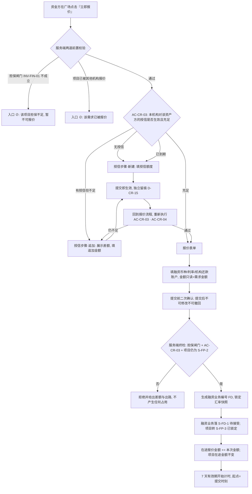
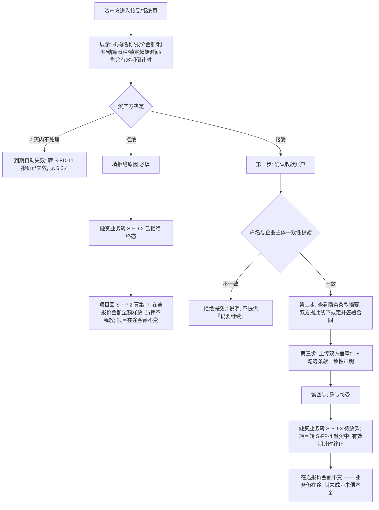
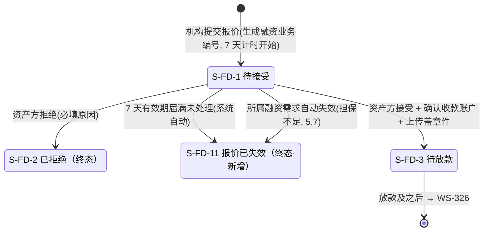

# 金融服务平台 · 金融服务端 · 借贷广场 — 授信、报价与接受/拒绝 PRD **V2.0**

> **本模块为两册。** 本册是**主文档 · 核心范围与功能规格**；页面增量、异常分支、数据字段、对外契约增量、非功能、指标、依赖与风险、验收标准汇总在分册。
>
> | 文件 | 内容 | 读者 |
> | --- | --- | --- |
> | `v1.0-借贷广场-授信报价与接受拒绝-PRD.md`（本册） | 第 1～5 章、6.0～6.3、第 12 章：背景与范围、角色与场景、流程与融资业务状态机、**三个占用量的口径对照与释放点全枚举**、**报价 7 天有效期**、功能清单、模块详情、待确认与遗留 | 需求方、设计、实现 |
> | [`01-数据字典与对外契约.md`](01-数据字典与对外契约.md) | 6.4～6.6、第 7～11 章：页面增量、异常分支、深链契约增量、**授信额度对象的状态机与字段**、数据与字段、非功能需求、指标、依赖与风险、**消息事件登记**、验收标准汇总 | 设计、我的控制台（WS-328）、WS-326/327、消息中心（WS-329）、实现方、测试 |
>
> **两册编号连续、不重复定义**：同一个编号只在一处定义，另一册引用。
> **本册与 WS-324 的关系**：WS-324《借贷广场 · 融资需求与代币质押》已定稿入库，是本模块的直接上游。**凡 WS-324 已定义的对象、公式、状态、契约，本册一律引用编号，不复述、不改写**；本册只写本模块新增的那一段。WS-324 已按需求方 2026-09-11 08:17 的裁定修订至 **V6.0**（新增 4.4「融资需求因担保不足自动失效」`D-FIN-72`～`D-FIN-76`、撤回恶意锁仓风险接受、`DEP-08` 改走 WS-329、授信额度企业维度对齐）。**本册按 V6.0 消费**，本模块承接的那一半在 5.7；两册的编号段位已错开（见 1.文档信息）。

## 1. 文档信息

| 项 | 内容 |
| --- | --- |
| 对应需求 | WS-325「借贷广场 · 授信与报价、接受/拒绝（PRD + 原型）」 |
| 所属平台 / 端 | 金融服务平台 · **金融服务端**（面客 Web，含游客态） |
| 模块定位 | 借贷广场第二段（WS-323 简报第 11 章 **M-2**） |
| 上游输入 | 《需求诊断简报 V6.0 定稿版》第 3.3 / 3.7 章与**第 4 章授信额度生命周期**、《附册 · 融资全生命周期 V5.0》A2 / A4.2 / A5.2 / A5.3 / A6.1（WS-323）；**WS-324 已入库 PRD 主册与分册（含分册 10.5 / 10.6）**；**需求方 2026-09-11 08:17 的七条裁定** |
| 依赖文档 | WS-324《借贷广场 · 融资需求与代币质押 PRD V5.0》、WS-318《资产清单与代币签发 PRD》（汇率模块）、WS-310《协议管理 PRD》、WS-313《可信数据同步 PRD》、WS-308『01-国际化基线.md』、`docs/notification-contract/接入指南.md` |
| 编写人 | 许楚清（需求分析师） |
| 文档状态 | **V2.0**（承接需求方 08:17 七条裁定；`Q-FIN-11`～`Q-FIN-15` 全部关闭，待确认项集中在第 12 章、共 2 条，均不阻塞开发启动） |
| 编号空间 | 沿用上游、不回收作废号，**并已避开 WS-324 V6.0 新占用的段位**：`D-CR-*`（10 起）/ `AC-CR-*`（06 起，`AC-CR-03～05` 定义在上游）/ `D-FIN-*`（**77 起**，72～76 已被 WS-324 V6.0 的需求自动失效条款占用）/ `AC-FIN-*`（26 起）/ `D-LS-*`（13 起）/ `AC-LS-*`（**83 起**）/ `F-LS-*`（**20 起**）/ `X-LS-*`（**15 起**）/ `M-LS-*`（**14 起**）/ `Q-CR-*`（新）。新增字段段位 `CR-*`（授信额度）、`QT-*`（报价，承接附册 `QT-01～07`）、`FD-*`（融资业务）；新增状态段位 `S-CR-*`（授信额度）与 `S-FD-11`（报价已失效）；异常编号 `E-CR-*` |

---

## 2. 背景与目标

### 2.1 背景

WS-324 已经把资产方那一侧做完：代币质押进资产池，池子撑起一个可用额度，资产方公开发布一条融资需求并占住相应额度。**接下来这条需求要变成一笔真实的债权关系，中间隔着三个动作**：资金方先要有对这家资产方的授信额度，然后提交报价，最后由资产方接受或拒绝。本模块就是这三个动作。

**授信不是一个独立模块**（`D-MC-91`）。需求方的形态是：资金方在广场上点「报价」，系统判这家机构对这家资产方有没有生效中且额度充足的授信——**没有就先走授信核定再回到报价，有就直接报价**。授信的写操作只发生在这里；两侧控制台上的授信视图（资产方的「授信明细」tab、资金方的授信汇总）**都是只读**（`D-MC-92`），不在本模块范围内。

**本模块最容易出事的地方是额度**。平台上同时存在三个都叫"占用"的量，分属两个不同的维度：项目维度的额度由资产方的质押撑着，机构维度的额度由授信撑着，两者互不替代、必须同时够。把它们混成一个量，轻则可融金额凭空少一半，重则单机构超额放贷。5.1 用一张对照表把三个量钉死，5.4 把每一个释放点枚举全——这两节是本模块的核心，正文其余部分都建立在它们之上。

### 2.2 本期目标

| # | 目标 | 达成口径 |
| --- | --- | --- |
| G-1 | 资金方在一条路径上完成"判授信 → 补授信 → 报价"，不被踢到别的模块再走回来 | 6.1 + 6.2，授信是报价流程内的一步（`D-MC-91`/`AC-CR-05`） |
| G-2 | **三个占用量在全平台只有一套口径**，任何模块读到的是同一个定义 | 5.1 对照表 + `D-CR-10`～`D-CR-12` |
| G-3 | **额度只出不进的口子一个都不留**：每一条占用都能说清什么时候释放、释放多少 | 5.4 释放点全枚举 + `AC-CR-09` |
| G-4 | 单机构超额放贷在服务端被挡住 | `AC-CR-03` 修正式（5.3）+ `AC-FIN-07` 两道闸门同时生效 |
| G-5 | 资产方永远知道自己的需求"被谁锁着、从什么时候开始、还剩多久"，并且随时能解锁 | `D-LS-13` + 分册 6.4.1，倒计时 + 随时可拒绝，不设冷却 |
| G-6 | **无人值守时锁定能自动收敛**：资产方不登录，需求也不会被永久挂住 | **报价 7 天自动失效**（6.2.4，`D-CR-25`～`D-CR-29`） |
| G-7 | 接受环节的收款账户与合同不留空 | 6.3，`Q-FIN-13`/`Q-FIN-14`/`Q-FIN-15` 在本模块给出结论 |
| G-8 | 本模块新增的跳转全部长在 WS-324 既有的契约上 | 分册 6.6，**不新开一套跳转约定**（`AC-LS-07`） |

### 2.3 范围（含）

- **授信核定（`P-LS-04`，报价的前置步骤）**：首次核定、额度不足时的追加；授信额度的有效期与到期处理
- **授信校验**：`AC-CR-03` 修正式、`AC-CR-04` 授信后重跑、`AC-CR-05` 无额度与额度不足同一流程
- **三个占用量的统一口径**：`授信占用额` / `在途报价金额` / `项目在途金额` 的定义、触发、释放与所参与的公式
- **机构报价（`P-LS-05`）**：融资币种/金额/利率/机构还款账户；提交即生成融资业务编号并把项目置为已锁定
- **报价有效期（`P-LS-05` / `P-LS-06`）**：**7 天自然日**，届满自动失效、需求解锁、`在途报价金额` 全额释放（6.2.4）
- **接受 / 拒绝（`P-LS-06`）**：收款账户确认、**商务条款摘要与线下合同的盖章件上传**、拒绝原因与需求放开
- **锁定信息的对外呈现**：被谁锁定、何时开始、已锁定多久、**还剩多久**（`D-LS-13`）
- **对「融资需求自动失效」的消费**：需求失效时在途报价如何处置（5.7，主体在 WS-324）
- **对已入库页面的增量要求**：`P-LS-01`/`P-LS-02` 上的报价入口与锁定信息展示（只写增量，不重写 WS-324 的页面规格）
- **对外契约增量**：`available_actions` 新增取值与锚点（分册 6.6）、本模块产生的消息事件登记（分册 10.4）

### 2.4 范围（不含）

| 编号 | 本期不做 | 归属 |
| --- | --- | --- |
| `X-LS-15` | **额度的主动调低、冻结、解冻，以及资金方的授信台账"管理"功能** | 需求方 2026-09-11 02:19 裁定本期不做（`D-MC-93`）；本模块只做顺流的核定与追加 |
| `X-LS-16` | **授信审批流、多级风控、授信评级** | 无承接模块；本期资金方自行核定、提交即生效 |
| `X-LS-17` | 两侧控制台的授信视图（资产方「授信明细」tab、资金方授信汇总） | WS-328（M-5），**只读**（`D-MC-92`） |
| `X-LS-18` | **放款及之后的全部环节**，含融资确认、还款计划、还款与确认 | WS-326（M-3）/ WS-327（M-4）。本模块只对齐口径，不写实现 |
| `X-LS-19` | **利率的计息口径**（年化/期内、单复利、计息基数、起息日，`Q-FIN-17`） | WS-327。本模块只采集并固化利率数值，**不自定口径** |
| ~~`X-LS-10`~~ | ~~报价有效期、占用超时自动释放等恶意锁仓防范机制~~ | **本版作废**（需求方 2026-09-11 08:17 裁定 1 推翻 07:01 的口径）：**报价有效期本期要做，7 天**（6.2.4）。编号保留占位、不复用 |
| `X-LS-20` | **报价的修改与撤回** | **继续成立**——7 天有效期解决的是"无人值守时的自动收敛"，与"机构能否主动反悔"是两件事。结论与代价见 6.2.3 |
| `X-LS-23`（**新**） | **平台按模板动态生成融资合同 PDF、带签章位** | 需求方 08:17 裁定 4 + 5：模板走协议管理但**本期不新增模板定义**，合同**线下签订**，平台只承接盖章件上传。否决理由与代价见 6.3.3 |
| `X-LS-24`（**新**） | **报价失效前的自动展期、宽限期、机构主动续期** | 7 天是硬期限；到期即失效，不提供任何延长手段（6.2.4） |
| `X-LS-21` | **多家机构同时报价、部分融资** | 需求方硬约束（`D-FIN-18`/`D-FIN-19`），代价见 2.6 |
| `X-LS-22` | **盖章合同的真伪审核与法律效力判定** | 平台不审核，承接方是资金方，动作在 WS-326（6.3.4） |
| `X-LS-01`（承接） | 融资项目的创建、发布、质押、撤回、提取、担保预警 | WS-324，**已定稿** |
| `X-LS-11`（承接） | 链上持仓查询与对账 | 后台自动进行，不在本模块 |

> **本模块不触达链上**：授信核定、报价、接受、拒绝**全部是平台侧的额度与状态动作，不产生任何链上转移、不消耗 gas**（承接 `D-FIN-67`）。本模块因此不重复 WS-324 分册 6.7 的链上章节。

### 2.5 上游口径声明（**原样保留，不得删改**）

> 本模块的额度口径、担保闸门、状态机、深链契约与**融资需求自动失效**以 **WS-324 已入库 V6.0**（主册 + 分册）为准；授信形态与授信校验以 **WS-323 简报 V6.0** 为准。两者冲突时以 WS-324 为准，并在分册 10.3 提出对上游的修订请求。

### 2.6 六条不可削弱的红线

| 编号 | 红线 |
| --- | --- |
| `AC-FIN-23`（承接） | **报价环节不产生任何新的 `项目在途金额` 占用**，只把该需求置为"已被报价"。报价产生的是**机构维度**的 `在途报价金额`，与项目维度的占用是两个量、两个维度（5.1）。混为一谈会在报价环节把同一笔钱扣两次，可融金额直接少一半 |
| `AC-CR-03`（修正式） | 授信校验一律用 **`授信占用额 + 在途报价金额 + 本次报价金额 ≤ 授信额度`**。**不得照抄"融资余额 + 本次报价"**——原式漏了该机构对同一资产方的其他在途报价，会导致单机构超额放贷（5.3） |
| `AC-CR-04`（承接） | 授信步骤完成后**必须重新跑一遍 `AC-CR-03`** 再放行报价。中间该机构可能在别处产生了新的在途报价 |
| `AC-FIN-07`（承接） | **担保闸门**（`INV-FIN-01`）与**授信校验**（`AC-CR-03`）是**两道独立校验，须同时通过**，缺一不可。前端隐藏或置灰不构成校验 |
| `D-CR-15` | **授信步骤的数据写入与报价表单解耦**：授信额度是独立于报价的对象，有自己的生命周期、自己的状态与自己的留痕；报价提交失败不得回滚已核定的额度，额度核定成功也不得隐含一次报价（WS-323 V6.0 4.2 演进备注） |
| `AC-FIN-25`（承接，口径对齐） | 融资确认完成时，该笔金额从 `项目在途金额` **原子**地转入 `项目融资余额`，同一时刻从 `在途报价金额` 原子地转入 `授信占用额`。**任何时刻一笔钱只能被计入其中一个，不得两边都不计**。动作发生在 WS-326，本模块只对齐口径（5.4.3） |

**两条本期硬约束及其代价（承接需求方裁定，写进验收、不得被优化掉）**：`D-FIN-18` **不支持多家机构同时报价**，一家报价即锁定 ⇒ **先到先得**，资产方**失去比价能力**（只能接受或拒绝，不能在三家里挑最低利率），界面必须如实呈现这一机制（分册 6.4.1）、不得让资产方误以为还会有第二家；`D-FIN-19` **不支持部分融资**，报价金额必须等于需求金额 ⇒ 授信不足的机构**直接出局**（哪怕它能出 80%），报价页必须在进入表单前就告知差额与出路（6.2.1）、不能让机构填完才发现报不了。

---

## 3. 用户与场景

### 3.1 角色

| 角色 | 在本模块的诉求 | 权限口径 |
| --- | --- | --- |
| **游客（未登录）** | 看这条需求现在什么状态、是不是已经被人报价了、被谁、报了多久、还剩多久 | L1～L5 全量可见（含在途报价的公开商务条款与锁定信息）；全部操作入口 `⊘` |
| **资金方（登录）** | 判断值不值得做这笔；额度不够时就地补上；提交一份确定的报价 | 授信核定、提交报价；**本模块内不可撤回、不可修改已提交的报价**（6.2.3） |
| **资产方（登录）** | 知道自己的需求被谁锁着、还剩多久；决定接受还是拒绝；拒绝后需求立刻放开 | 接受（确认收款账户 + 上传线下签署的盖章件）、拒绝（必填原因）；**随时可拒绝，不设冷却期、不做理由审核**；**7 天内不处理则报价自动失效**（6.2.4） |
| **平台运营** | 本模块内无业务动作 | 无面客写入口；接收额度异常一类待办 |

> 同一企业主体下的**任一登录员工均可代表企业执行上表全部动作**，本期不做企业内「查看 / 操作」分级（`D-MC-105`/`AC-MC-16`）。不要在验收用例里留"若分级则……"的分支。
> **跨主体隔离继续成立**（`D-LS-09`/`D-FIN-25`/`D-FIN-26`）：机构看不到该资产方在**其他机构**的授信额度与占用；资产方看不到机构对**其他资产方**的授信情况。全量公开的范围是广场上的融资需求与融资业务信息，**不含授信额度**（`D-LS-10`）。

### 3.2 用户故事

| 编号 | 故事 | 验收落点 |
| --- | --- | --- |
| `US-09` | 作为资金方，我看中一个池子想报价，系统应该直接告诉我"你对这家还差多少额度"，而不是让我填完表单才拒绝我 | `F-LS-20`、6.2.1、`AC-CR-06` |
| `US-10` | 作为资金方，我在报价流程里就能把额度补上，补完接着报，不用退出去找一个叫"授信管理"的地方 | `D-MC-91`、`AC-CR-05`、6.1 |
| `US-11` | 作为资金方，我要清楚自己对这家资产方的额度被什么占着——已经放出去的钱和还挂在那儿的报价，各是多少 | 5.1、`CR-08`～`CR-10` |
| `US-12` | 作为资金方，我提交报价前要知道这一步是不可逆的 | 6.2.3、`AC-CR-11` |
| `US-13` | 作为资产方，我的需求被锁了，我要知道是被谁、从什么时候开始、**还剩几天我不处理它就自动失效** | `D-LS-13`、`AC-LS-84` |
| `US-14` | 作为资产方，这个报价我不满意，我要能立刻拒绝，需求马上回到可被报价的状态 | 6.3.5、`AC-CR-12` |
| `US-15` | 作为资产方，我接受报价时，收款账户不能填错也不能被人改成别人的 | `Q-FIN-13` 结论（6.3.2） |
| `US-16` | 作为资产方，合同是我和机构线下签的，我要能在平台上一眼看全该写进合同的商务条款，别让两边对不上 | `Q-FIN-14` 结论（6.3.3）、`AC-LS-87` |
| `US-18`（**新**） | 作为资金方，我报的价挂了一周没人理，我的额度应该自动回来，而不是一直被占着 | 6.2.4、`D-CR-25`、`AC-CR-15` |
| `US-19`（**新**） | 作为资产方，我出差一周回来发现需求被锁着，平台应该已经替我把它放开了 | 6.2.4、`AC-CR-16` |
| `US-17` | 作为游客，我想看看这个平台上的需求一般多久会被人接走 | L5 公开商务条款与锁定信息 |

### 3.3 典型场景

- **S8 有额度直接报价**：机构甲对资产方 A 有 500 万 USD 授信，已用 299 万。甲在广场上看到 A 的一条 150 万需求，点「立即报价」→ 系统判授信充足（299 + 150 = 449 ≤ 500）→ **直接进报价表单**，不出现授信步骤。
- **S9 无额度先授信**：机构乙对 A 没有授信。乙点「立即报价」→ 进入授信核定步骤，填 300 万、提交即生效 → 自动回到报价表单 → **重新跑一遍 `AC-CR-03`**（`AC-CR-04`）→ 通过 → 提交报价。
- **S10 额度不足走同一步骤**：机构丙对 A 有 200 万授信、已用 180 万，需求是 150 万。点「报价」→ 提示"本次报价 150 万，当前可用授信 20 万，**还差 130 万**"→ 进入**同一个授信步骤**（表单是追加而非新建，文案不同，`AC-CR-05`）→ 追加 150 万 → 回报价 → 通过。
- **S11 授信够但担保不够**：机构甲额度充足，但 A 的项目因两张代币失效落入「担保不足预警」→ `INV-FIN-01` 不成立 → **报价入口 `⊘`**，说明"该项目当前担保不足，暂不可报价"（`AC-LS-39`）。两道闸门缺一不可（`AC-FIN-07`）。
- **S12 先到先得**：机构甲 10:00:00 提交报价成功，项目转 `S-FP-3 已锁定`；机构乙 10:00:01 提交 → 服务端拒绝，提示"该需求已被其他机构报价"。乙的额度**不产生任何占用**（提交失败不占用）。
- **S13 锁定与解锁**：甲的报价挂了 6 天，A 一直没登录。广场详情页与 A 的控制台**都显示**"已被 XX 银行锁定，自 2026-09-11 10:00 起，已 6 天 3 小时，**剩余 21 小时**"。A 登录后点拒绝、填原因 → 同一时刻：融资业务转 `S-FD-2 已拒绝`、项目回 `S-FP-2 募集中`、**甲的 150 万在途报价占用全额释放**、`项目在途金额` 不变（它从发布起就是 150 万，与报价无关）。
- **S14 结算币种**：需求金额 150 万 USD，甲选择用 USDT 结算 → 报价提交时锁定汇率快照，算出结算金额；此后**永不重算**，放款与还款按同一份快照折算，该快照同时出现在商务条款摘要里供线下合同抄录。
- **S15 报价自动失效（新）**：承 S13，A 始终没登录。2026-09-18 10:00:00 整（提交后 168 小时）系统判定到期 → 同一次结算内：融资业务转 `S-FD-11 报价已失效`（终态）、项目回 `S-FP-2 募集中`、**甲的 150 万在途报价占用全额释放**、汇率快照作废、双方各收到一条通知。A 的需求重新可被任何机构报价，**`项目在途金额` 仍是 150 万**（需求还挂着，从没被撤下）。
- **S16 需求因担保不足失效（新）**：A 的项目已放款 50 万、在途需求 150 万，融资上限 200 万。两张共 60 万的代币到期失效 → 有效质押价值降到 175 万、融资上限 140 万 < 50 + 150 = 200 万，`INV-FIN-01` 破 → 需求进入**失效缓冲期**：在途报价**冻结**（A 不能接受，但仍可拒绝），双方同时收到担保缺口提示。A 在缓冲期内追加质押把融资上限抬回 210 万 → 自动解冻，报价恢复可处理；若缓冲期届满仍未追加 → **需求自动失效，在途报价一并失效并释放占用**（5.7）。

---

## 4. 流程说明

### 4.1 授信嵌在报价流程内（`P-LS-04` → `P-LS-05`）

> **为什么终检要重跑一遍**：从页面加载到点击提交之间，这家机构可能在别的资产方那里产生了新的在途报价，这个项目也可能被别人抢先锁定或跌进担保不足。前端展示的数只是预览，**准入以提交时刻的服务端重算为准**（承接 `AC-FIN-06`）。

### 4.2 接受 / 拒绝（`P-LS-06`）

> **接受不重跑额度闸门**（`D-CR-16`）：接受动作**不新增任何占用**——金额早在发布时进了 `项目在途金额`，在报价时进了 `在途报价金额`。闸门管的是"能不能新增占用"，此处无新增，故不重跑。但若项目此刻处于担保不足预警，接受页**必须**把当前担保状态、缺口与追加指引一并呈现，由资产方知情后决定；机构侧同样可见（`D-FIN-56`）。**不得静默放行，也不得直接拦死**——拦死会让资产方既不能接受又无法自救，而它本来就有拒绝这条路。

### 4.3 融资业务状态机（本模块覆盖段，承接 `S-FD-*`，一套跨模块共用）

| 编号 | 条款 |
| --- | --- |
| `D-FIN-77`（**V2.0 修订**） | **本模块只新增一个终态 `S-FD-11 报价已失效`，其余一律沿用附册 A4.2 的唯一一套状态机**（`D-FIN-28`），控制台与广场一处定义两处引用。**接受动作的三个步骤（账户确认、条款核对、盖章件上传）是 `S-FD-1` 内部的填写进度，不升格为状态**——理由同 `D-FIN-63`：每多一个状态，下游的枚举与文案映射都要跟着改，而"填到第几步"用进度表达即可 |
| `D-FIN-92`（**新**） | **为什么失效必须是独立终态，而不是复用 `S-FD-2 已拒绝` + 一个原因码**（附册 A4.2 原图把有效期到期画进了 `S-FD-2`，本版据此提出修订，见分册 10.3）： ① **必填字段会打架**——拒绝原因（`FD-11`）在 `S-FD-2` 下是必填的，系统失效没有原因可填，复用会制造一批"必填字段为空"的记录； ② **双方看到的结论与下一步不同**——机构看到"被拒绝，原因是 X"与"因超时失效、额度已释放、可重新报价"是两件事； ③ **指标会被污染**——`M-LS-20` 的接受/拒绝率若把系统事件计进去就不再是资产方的决策统计； ④ **新增成本可控**——`S-FD-1` 段的终态只有控制台（WS-328）与消息中心（WS-329）两个消费方，WS-326/327 从不接触它 |
| `D-FIN-78` | **`S-FD-2 已拒绝` 与 `S-FD-11 报价已失效` 都是终态，融资业务编号保留但作废**，用于留痕与申诉举证，**编号不回收、不复用**（承接 `D-FIN-20`、`H-01`）。同一机构可在被拒或失效后立即对同一项目重新报价，**本期不设冷却期、不设次数上限**；重新报价是**一笔全新的融资业务**（新编号、新汇率快照、新的 7 天计时），不是原报价的续期（`X-LS-24`） |
| `D-FIN-79` | **报价提交失败不产生任何痕迹**：终检未通过时不生成融资业务编号、不产生占用、不改变项目状态。**编号只在提交成功的同一时刻生成**（`D-FIN-03`），不预先占号 |

> **授信额度自身的状态机（`S-CR-1` / `S-CR-2`）与其生命周期条款（`D-CR-10`～`D-CR-14`）在分册 7.0**，与 `CR-*` 字段字典放在一起——它是一个对象的完整定义，拆开看反而费劲。

---

## 5. 业务对象与核心口径

### 5.1 三个占用量的对照表（**本模块最容易翻车的地方，以本表为唯一口径**）

平台上有三个都会被口语称作"占用"的量。**它们分属两个维度、由不同动作触发、在不同时刻释放、参与不同的公式**。

| 对照项 | **`项目在途金额`** | **`在途报价金额`** | **`授信占用额`** |
| --- | --- | --- | --- |
| **计量维度** | **项目**（一个融资项目一个数） | **机构 × 资产方**（一个二元组一个数） | **机构 × 资产方**（一个二元组一个数） |
| **口径（定义）** | Σ(本项目下**已发布且未终结**的融资需求金额) | Σ(该机构对该资产方**已提交、尚未终结、尚未转为未偿本金**的融资业务金额)，即处于 `S-FD-1`/`S-FD-3`/`S-FD-4`/`S-FD-5` 的业务金额合计 | Σ(该机构对该资产方**所有未结清融资业务的未偿本金**)，即处于 `S-FD-6 还款中`（含 `S-FD-9 逾期` 标记）与已到期未结清的业务的未偿本金合计 |
| **触发点（占用产生）** | **资产方发布融资需求**成功的同一时刻 | **机构提交报价**成功的同一时刻 | **资产方完成融资确认**的同一时刻（动作在 WS-326） |
| **唯一来源** | **发布占用，且只有这一个来源**（`AC-FIN-23`）。报价不新增 | 报价提交 | 由 `在途报价金额` **原子转入**，不独立产生 |
| **释放点** | 需求撤下、项目关闭、项目到期关闭、**融资确认完成时转入 `项目融资余额`** | 见 5.4.1（六条，逐条枚举） | 见 5.4.2（四条，逐条枚举） |
| **参与哪条公式** | `可融金额 = max(0, 融资上限 − 项目融资余额 − 项目在途金额)`（`AC-FIN-11`）；不变式 `INV-FIN-01` | `授信已用额 = 授信占用额 + 在途报价金额`（`AC-CR-03`） | 同左；另参与 `AC-MC-10` 的自洽性校验 |
| **由谁的什么撑着** | 资产方的**质押物**（有效质押价值 × 80%） | 机构给该资产方的**授信额度** | 同左 |
| **谁写入** | WS-324（发布时）/ WS-326（确认时转出） | **本模块**（报价时）/ WS-326（确认时转出） | WS-326（确认时转入）/ WS-327（还款时递减） |
| **本模块动它吗** | **绝不**。报价、接受、拒绝都不改这个数 | **是**，本模块是它的产生方 | 否，只定义口径 |

| 编号 | 条款 |
| --- | --- |
| `D-CR-16`（**口径澄清，必须按此实现**） | **报价提交时占用的是 `在途报价金额`，不是 `授信占用额`。** 上游口语把两者统称为"报价时占用"（`D-CR-03`），但 `授信占用额` 的定义是**未偿本金**（`D-FIN-06`），报价时钱还没放出去，不存在本金。若把在途报价计进 `授信占用额`，`AC-MC-10` 的恒等式 **Σ授信占用额 ≡ Σ项目融资余额 ≡ 已融额度** 立刻不成立——等式两边一边含在途、一边不含。**两个量分开计、在 `AC-CR-03` 里相加，是唯一能同时满足 `D-FIN-06` 与 `AC-MC-10` 的写法** |
| `D-CR-17` | **三个量都不从"池值"里扣减**（承接 `AC-FIN-20`）：占用只出现在不等式的右边，绝不从 `有效质押价值` 或 `授信额度` 里扣掉。把占用做成"额度扣减"会同时减分子不减分母，闸门立刻假性不成立 |
| `D-CR-18`【命名红线】 | **PRD、界面、字段、提示文案中不得出现无限定词的"占用""在途""冻结"**。三个量一律用本表的全名；`授信已用额` 是前两者之和的合称，**不是第四个量**，不单独存储、不单独展示为一行"占用"。同时承接 `D-FIN-06`（不得出现无限定词的"融资余额"）与 `D-FIN-58`（不得出现"冻结金额/冻结额度/在途额度/待确认融资金额"） |

> **一句话记法**：`项目在途金额` 问的是"这个**池子**还能不能再借"，`在途报价金额 + 授信占用额` 问的是"这家**机构**还能不能再借给这家资产方"。**两个问题都要答是，才能报价。**

### 5.2 授信额度模型与有效期（解开「有效期跟随融资项目」的矛盾）

**矛盾在哪**：`D-MC-106` 的原话是"授信额度（及其占用）的有效期，跟随其所服务的融资项目的有效期"。但授信额度是**机构 × 资产方**二元组（`D-CR-10`），而一个资产方名下可以有多个融资项目、每个项目各有各的 1 年有效期（`D-FIN-37`）。一条二元组记录不可能同时跟随 N 个项目的有效期——**"一条额度 N 个到期日"是个悖论**。

| 编号 | 结论（**需求方 08:17 裁定 3 已确认方向**） |
| --- | --- |
| `D-CR-19` | **额度本身有独立的有效期，占用按各自所属的融资业务释放。** 拆成两句话读： · **额度的有效期** = **首次核定日 + 1 年** `[假设值，见 Q-CR-01]`，系统生成、只读、不可编辑、不可延期；**追加不重置**（同 `D-FIN-37`"再次发布不重置"） · **占用的存续期** = 跟随其所属的融资业务：在途报价随报价终结而释放，未偿本金随业务结清或终止而释放（5.4）。**这正是 `D-MC-108` 真正在说的事**——其原文即"有效期不挂在授信额度这条记录上，而是挂在每一笔占用上" |
| `D-CR-20` | **两个有效期各管各的，互不牵连**：额度到期不释放占用（`D-CR-13`）；项目到期也不作废额度。项目到期对本模块的唯一影响是**停止接受新报价**（`D-FIN-43` 分支①/②），这是项目侧的闸门，不是额度侧的事件 |

> **已作废的读法（`D-MC-106`～`D-MC-108` 的原表述，需求方 08:17 裁定 3 废止）**：把额度理解为"机构 × 资产方 × **融资项目**"三元组、有效期天然等于该项目。**正式作废**——见 `D-CR-10`，它会让机构对单一资产方的总敞口失去上限，与 `AC-CR-03` 直接冲突。修订请求见分册 10.3。
> **一并否决的第三种读法**：额度有效期 = 其名下**最晚到期的那个项目**的有效期。**不采纳**——额度的到期日会随着资产方每发一个新项目被动往后飘，机构无法预期自己的敞口什么时候关闭，且该日期不由机构自己控制。
>
> **`Q-CR-01` 现在只剩一件事：有效期的长度。** 裁定 3 废掉了"跟随项目"但没给替代值，本版取 **1 年**，理由是与 WS-324 `D-FIN-37` 的项目有效期长度对齐、便于双方记忆；**这是一个标注清楚的假设值，不是阻断问题**——它只影响一个常量（分册 7.4），改动不触及模型、不触及任何公式，需求方给出别的口径（例如跟随资金方的准入有效期）时替换该常量即可。

### 5.3 授信校验 `AC-CR-03` 的修正式与算例

| 编号 | 条款 |
| --- | --- |
| `AC-CR-03`（**修正式，唯一口径**） | **`授信占用额 + 在途报价金额 + 本次报价金额(折 USD) ≤ 授信额度`**，其中前两项之和即 `授信已用额`。 **服务端校验，不通过则拒绝提交，并明确给出三个数**：本次报价金额、当前可用授信（`授信额度 − 授信已用额`）、**差额**。只说"授信不足"不合格 |
| `AC-CR-06`（**新**） | **差额必须在进入报价表单之前就告知**（`US-09`）：点击「立即报价」的那一刻服务端已经算得出结论，不得让机构填完币种、利率、账户再拒绝他。额度不足时直接进入授信步骤（`AC-CR-05`），不是报错 |
| `AC-CR-07`（**新**） | **校验只认生效中的额度**：`S-CR-2 已到期` 视同无额度，走新建/重新核定分支（`D-CR-14`）；**不存在"到期额度还能顶一次"的宽限** |
| `AC-CR-04`（承接） | 授信步骤完成后**必须重新执行 `AC-CR-03`** 再放行报价 |
| `AC-CR-05`（承接） | **「额度不足」与「无额度」走同一个授信步骤**，区别只在表单是新建还是追加、以及文案，**不做成两条流程** |
| `INV-CR-01`（**新，不变式**） | **任何时刻 `授信占用额 + 在途报价金额 ≤ 授信额度` 必须成立。** 不成立即禁止该机构对该资产方的一切新增占用，并生成运营待办。与 `INV-FIN-01` 是**两条独立的不变式**，分属机构维度与项目维度 |

**汇率与"折 USD"（`Q-FIN-12` 在本模块的结论）**：

| 编号 | 结论 |
| --- | --- |
| `D-FIN-13`（承接） | **所有额度类的量统一以 USD 为记账本位币**：授信额度、授信占用额、在途报价金额、项目在途金额、项目融资余额、融资上限、可融金额、统计区四组指标，一律 USD。**融资币种只是结算币种，不改变记账口径** |
| `D-FIN-80`（**新**） | **汇率在报价提交时锁定为快照，此后永不重算。** 快照存四项：汇率值、生效时间、来源说明、版本标识（沿用 WS-318 `D-TI-14`～`D-TI-17` 的快照结构与第 12 章红线）。**校验时，既有的每一笔在途报价与每一笔未偿本金都用它自己那份快照汇率**，本次报价用提交瞬间取到的快照 |
| `D-FIN-81`（**新**） | **不采用"每次校验实时取汇率"。** 后果不一样，必须挑一个写死：实时取会让 `授信占用额` 与 `在途报价金额` 变成**随行情浮动的数**——同一笔业务今天占 100 万、明天占 103 万，机构在完全没有新动作的情况下可能突然超额，`INV-CR-01` 会在无人操作时被打破；`AC-MC-10` 的恒等式也会随汇率漂移。**快照锁定让每一笔的占用在存续期内是一个确定的数**，这正是 WS-318 对已签发记录采取同一做法的理由 |
| `D-FIN-17`（承接，红线） | **汇率源复用 WS-318 汇率管理模块**，不为融资另建一套。两套汇率会让同一天的同一笔钱在代币页和融资页折出两个 USD 值 |
| `D-FIN-82`（**新**） | **本期的简化与通用形态**：本期 `融资需求币种` 恒为 USD（`FP-07`）且报价金额只读等于需求金额（`D-FIN-19`），因此"折 USD"在本期取值上恒等于原值。**简化只写在"本期取值"说明里，不得写进公式本身**（同 `AC-FIN-24` 的处理手法）——将来支持外币计价的需求时，公式不必改。 **结算金额 = 融资金额(USD) ÷ 汇率快照**，按结算币种展示，随报价一同固化并写入融资合同；放款与还款均按同一份快照折算（口径对齐 WS-326/327） |

**带数字的算例（`AC-CR-03` 逐项演算）**：

> 机构甲 × 资产方 A，`授信额度 = 500 万 USD`。

| 步骤 | 事件 | 授信占用额 | 在途报价金额 | 授信已用额 | 可用授信 | 结果 |
| --- | --- | --- | --- | --- | --- | --- |
| ① | 初始：甲对 A 有一笔已放款并确认、未偿本金 200 万的业务 | 200 万 | 0 | 200 万 | 300 万 | — |
| ② | 甲对 A 的项目 P1 报价，需求金额 150 万 USD，**结算币种 USDT**，提交时锁汇率快照 `1 USD = 1.0002 USDT` ⇒ 结算金额 150.03 万 USDT | 200 万 | 0 | 200 万 | 300 万 | 校验：`200 + 0 + 150 = 350 ≤ 500` ✅ **通过**，提交成功 |
| ③ | ② 提交成功后 | 200 万 | **150 万** | **350 万** | **150 万** | 在途报价占用产生 |
| ④ | 甲想对 A 的另一个项目 P2 再报一笔 100 万 | 200 万 | 150 万 | 350 万 | 150 万 | 校验：`200 + 150 + 100 = 450 ≤ 500` ✅ **通过** |
| ⑤ | ④ 成功后，甲再想报第三笔 80 万 | 200 万 | **250 万** | **450 万** | **50 万** | 校验：`200 + 250 + 80 = 530 > 500` ❌ **拒绝**。提示：本次 80 万、当前可用授信 50 万、**差额 30 万**，并进入授信追加步骤 |
| ⑥ | 甲追加 100 万，额度变 600 万；**重跑 `AC-CR-03`**（`AC-CR-04`） | 200 万 | 250 万 | 450 万 | **150 万** | `200 + 250 + 80 = 530 ≤ 600` ✅ 放行 |
| ⑦ | ② 那笔 150 万被 A 拒绝 | 200 万 | **100 万**（250 − 150） | 300 万 | 300 万 | **全额释放**（5.4.1 第 1 条） |
| ⑧ | ④ 那笔 100 万走完放款并由 A 完成融资确认（动作在 WS-326） | **300 万**（+100） | **0**（−100） | 300 万 | 300 万 | **原子转移**，同一时刻一进一出（`AC-FIN-25`） |
| ⑨ | ⑧ 那笔业务还了 40 万本金并经机构确认（动作在 WS-327） | **260 万** | 0 | 260 万 | 340 万 | 按已偿本金**逐期递减**（5.4.2 第 2 条） |

> **如果照抄原式**（`融资余额 + 本次报价 ≤ 授信额度`，漏掉在途报价）：第 ⑤ 步会算成 `200 + 80 = 280 ≤ 500` ✅ 放行，第 ④ 步的 100 万也早已放行——甲对 A 的实际敞口变成 `200 + 150 + 100 + 80 = 530 万`，**超出授信额度 30 万**。这就是 `AC-CR-03` 必须写修正式的原因。

### 5.4 占用的释放点全枚举（**漏一条就是额度泄漏**）

#### 5.4.1 `在途报价金额` 的释放（本模块是主要写入方）

| # | 事件 | 释放多少 | 什么时候 | 状态迁移 | 谁执行 |
| --- | --- | --- | --- | --- | --- |
| 1 | **资产方拒绝报价** | 该笔**全额** | 拒绝提交成功的**同一时刻**，与状态迁移在同一次结算内完成 | `S-FD-1 → S-FD-2`；项目 `S-FP-3 → S-FP-2` | **本模块** |
| 2 | **融资确认完成** | 该笔**全额**，但这是**转移不是释放**——同一时刻等额转入 `授信占用额` | 融资确认成功的同一时刻，原子、无空档（`AC-FIN-25`） | `S-FD-4 → S-FD-6` | WS-326 |
| 3 | **放款异议裁决「终止业务」** | 该笔**全额** | 裁决落库的同一时刻 | `S-FD-5 → S-FD-10 已终止` | 运营端裁决台（`G-01`）+ WS-326 |
| 4 | **报价提交失败 / 终检未通过** | **不涉及**——占用从未产生（`D-FIN-79`） | — | 无迁移 | 本模块 |
| 5 | **报价 7 天有效期届满**（**V2.0 新增，本期主路径之一**） | 该笔**全额** | 届满时刻的**同一次结算内**，与状态迁移一起完成 | `S-FD-1 → S-FD-11 报价已失效`；项目 `S-FP-3 → S-FP-2` | **本模块**（系统自动，6.2.4） |
| 6 | **所属融资需求因担保不足自动失效**（**V2.0 新增**） | 该笔**全额** | 需求失效落库的同一时刻 | `S-FD-1 → S-FD-11`；项目侧按 WS-324 处理 | **本模块**消费 WS-324 的判定（5.7） |
| 7 | **机构撤回报价** | 该笔全额 | — | — | **本期不存在此路径**（`X-LS-20` 继续成立，见 6.2.3） |

**以下事件明确 _不_ 释放 `在途报价金额`，逐条写清以免被当成漏项**：

| # | 事件 | 为什么不释放 |
| --- | --- | --- |
| a | **资产方主动撤回/撤下融资需求** | **本期不可达**：需求一旦被报价，项目即转 `S-FP-3 已锁定`，而撤下需求只在 `S-FP-2` 且尚未被报价时允许（WS-324 6.1）。**注意这说的是"主动撤下"**；"因担保不足自动失效"是另一回事，走第 6 条 |
| b | **融资项目到期** | 到期**不终结在途业务**：`D-FIN-43` 分支②——有在途或未结清业务时项目**不关闭**，只停止接受新报价、不允许再次发布。`D-FIN-47` 明确这是常态路径 |
| c | **融资项目关闭** | **本期不可达**：主动关闭要求无在途、无未结清业务（WS-324 6.1） |
| d | **授信额度到期** | `D-CR-13`：到期只关新增，不动存量 |
| e | **放款异议裁决「驳回放款记录」** | 业务回 `S-FD-3 待放款`，仍在途 |
| f | **资产方接受报价** | 接受后业务进 `S-FD-3 待放款`，**仍属在途**，尚未成为未偿本金。此处若误释放，机构的额度会在放款前被凭空放开一次，等于同一笔钱可以被报两遍 |

> **⚠️ 与 `D-MC-109` 的口径统一**：简报 `D-MC-109` 写的是"项目关闭或到期时，只释放在途报价部分的占用"。在 WS-324 定稿的到期两分支模型下（`D-FIN-43`/`D-FIN-47`），**该路径不可达**——到期时若有在途业务，项目根本不关闭。**按 WS-324 执行**：到期不释放在途报价，该笔业务照常走完它自己的生命周期。`D-MC-109` 的"已放款未偿部分不随项目关闭而释放"这半句继续成立（5.4.2 第 4 条）。修订请求见分册 10.3。

#### 5.4.2 `授信占用额` 的释放（口径在本模块，动作在 WS-326/327）

| # | 事件 | 释放多少 | 什么时候 | 谁执行 |
| --- | --- | --- | --- | --- |
| 1 | **融资业务结清** `S-FD-8` | 该笔**剩余未偿本金全额**（归零） | 最后一期还款确认结清的同一时刻 | WS-327 |
| 2 | **单期还款经机构确认** | **按该期已偿本金逐期递减**（未偿本金是余额概念，不是全有或全无） | 还款确认 `S-RP-3 已结清` 的同一时刻 | WS-327 |
| 3 | **业务终止** `S-FD-10`（裁决终止） | 该笔**剩余未偿本金全额** | 裁决落库的同一时刻 | 运营端裁决台 + WS-326 |
| 4 | **融资项目到期 / 关闭 / 结清** | **不释放**（`D-MC-109`：钱还没还，债务就还在） | — | — |
| 5 | **授信额度到期** | **不释放**（`D-CR-13`） | — | — |
| 6 | **逾期标记** `S-FD-9` | **不释放**（逾期是并行标记不是状态，`D-FIN-09`） | — | — |

#### 5.4.3 对 WS-326 / WS-327 的口径要求（本模块只对齐，不写实现）

三条，完整表述见分册 11，接口请求见分册 10.3：

- **`AC-FIN-26`**：融资确认完成的同一时刻，**两个维度各做一次原子转移**——项目维度 `项目在途金额 → 项目融资余额`（`AC-FIN-25`），机构维度 `在途报价金额 → 授信占用额`。四个量在同一次结算内一致变化；分两次提交会出现"机构侧已转入未偿本金、项目侧还挂在在途"的窗口，该窗口内 `AC-MC-10` 不成立。
- **`AC-FIN-27`**：业务终止或拒绝时，两个维度**只出不进**。
- **`AC-CR-09`（反向验收）**：跑完任一条完整链路后，`授信占用额` 与 `在途报价金额` **双双归零**，可用授信恢复原值。对每条终结路径（拒绝、**超时失效**、**需求失效**、裁决终止、结清）各构造一个用例。

### 5.5 两道闸门：谁挡什么

| 闸门 | 判据 | 管什么 | 不通过时 |
| --- | --- | --- | --- |
| **担保闸门** | `INV-FIN-01`：`融资上限 ≥ 项目融资余额 + 项目在途金额`（`AC-FIN-12` 视角 B） | 这个**池子**的抵押物够不够 | 报价入口 `⊘`，说明"该项目当前担保不足"（`AC-LS-39`） |
| **授信闸门** | `AC-CR-03` / `INV-CR-01` | 这家**机构**给这家资产方的额度够不够 | 进入授信步骤（`AC-CR-05`），不是报错 |

| 编号 | 条款 |
| --- | --- |
| `AC-FIN-07`（承接） | **两道闸门相互独立、必须同时通过**，缺一不可；前端隐藏或置灰不构成校验（`D-F77`） |
| `D-CR-21`（**新**） | **两道闸门的失败提示必须能被用户区分开**：担保不足是**资产方**要解决的事（追加质押），授信不足是**机构**要解决的事（追加授信）。混成一句"不满足条件"会让双方各自等对方动作 |

**报价有效期对额度口径的影响**：

| 编号 | 条款 |
| --- | --- |
| `AC-CR-15`（**新**） | **有效期届满的释放与拒绝完全同构**：`在途报价金额` 减该笔全额、`项目在途金额` 不变、质押不释放、项目回 `S-FP-2 募集中`。**唯一的差别是状态落点与有没有原因**（`S-FD-11` vs `S-FD-2`，见 `D-FIN-92`）。实现上应当是同一段结算逻辑的两个入口，**不允许各写一套** |
| `AC-CR-16`（**新**） | **失效必须是无人值守的**：不依赖资产方或机构登录、不依赖任何人点击，到点即由系统完成。构造"双方均不登录"的用例，届满后额度与需求必须已经各自归位 |

### 5.7 消费 WS-324 V6.0 的「融资需求因担保不足自动失效」（需求方 08:17 裁定 2）

**口径主体在 WS-324 V6.0 的 4.4（`D-FIN-72`～`D-FIN-76`）**：判定分两步（先重算、后评档，不合并）、档③起算 **3 个自然日缓冲期**、期内可追加质押或主动撤下需求自救、期满仍不成立则需求自动失效并释放 `项目在途金额`、失效后可重新发布、不新增状态（只在项目上记 `FP-27` 终结原因 `自动失效 · 担保不足`）。

WS-324 `D-FIN-75` 已把跨模块边界划好：**"报价自身的状态流转与授信侧占用的释放由 WS-325 执行"**。本节就是它指向的那一半。

| 编号 | 本模块承接的条款 |
| --- | --- |
| `D-CR-30` | **需求失效，其在途报价一并失效**：融资业务 `S-FD-1 → S-FD-11 报价已失效`（失效原因＝`所属融资需求失效`），`在途报价金额` **全额释放**（5.4.1 第 6 条）。与 WS-324 `D-FIN-75` 同一判断：担保已经撑不起这笔需求，保住报价等于保住一份抵押物撑不起的要约，而 `AC-FIN-07` 的担保闸门本来就会挡住它的放款 |
| `D-CR-31` | **同一事件内完成，不得出现中间态**（WS-324 `D-FIN-75` 的硬要求）：需求侧释放 `项目在途金额`、机构侧释放 `在途报价金额`、业务状态落 `S-FD-11`，**三件事在同一次结算内一致生效**。**不允许用户看到"需求已失效、报价还在"或"报价已失效、额度没回"** |
| `D-CR-32` | **失效不是拒绝，机构不吃亏**：机构侧文案与超时失效一致（"额度已释放、可在资产方补足担保后重新报价"），**不计入 `M-LS-20` 的拒绝率**，不产生任何负面记录（平台本期没有信用评级能力）。消息复用 `financing.quote.expired`，用失效原因区分（分册 10.4 `D-LS-20`） |
| `D-CR-33` | **缓冲期内在途报价冻结：不能接受，但可以拒绝。** 这是本模块对 WS-324 缓冲期的界面落法——WS-324 `D-FIN-74` 规定期内"禁止一切新增占用"，而**接受不新增占用**（金额早在发布与报价时就占了），所以必须由本模块单独定这一条： · **禁止接受**——接受会把一笔担保不足的业务推进到 `S-FD-3 待放款`，而放款必然被 `AC-FIN-12` 挡住，业务会卡在"能接受、不能放款"的死状态（WS-324 `D-FIN-75` 点名要避免的正是这个）； · **允许拒绝**——拒绝是释放，任何时候都不该被挡；它还是资产方的第三条自救路径（另两条是追加质押、撤下需求）。 |
| `D-CR-34` | **两个计时器各自独立跑，先到者先生效，互不暂停**：报价的 7 天从提交时刻起算（`D-CR-25`），缓冲期 3 天从担保转档③起算。**3 天短于 7 天是 WS-324 `D-FIN-74` 刻意选的**，正是为了不出现"报价都超时失效了、需求还在缓冲"的错位。冻结期间报价**照常计时**——暂停计时会让页面倒计时停住不动，而倒计时是本期唯一对外解释锁定的手段（`D-LS-13`），停住会被读成"系统卡了" |

> **一处需要两边对齐的差异，已提请总控裁决（`Q-CR-05`）**：WS-324 V6.0 把失效的触发线定在**档③预警线**（`融资上限 < 项目融资余额`，其 6.4.1），而需求方裁定 2 的原话是"有效质押价值**覆盖不了融资需求**"，按字面读应该是 `INV-FIN-01`（`融资上限 < 项目融资余额 + 项目在途金额`，**含在途需求**）。两者不等价，中间有一段真空： **举例**：融资上限 140 万、项目融资余额 50 万、在途需求 150 万。此时 `140 ≥ 50`，**档③不触发**，需求不会失效；但 `140 < 200`，`INV-FIN-01` 已经破了——这笔 150 万的需求确实已经没有足额担保，报价却仍然挂着、机构的额度仍然被占着，直到 7 天有效期把它冲掉。 **本模块按 WS-324 V6.0 执行**（它是这条规则的主体、且已入库），但把这段真空如实记在分册 10.2 `R-LS-23`。**两边同时改成 `INV-FIN-01` 是更贴合裁定 2 字面的选项**，代价是触发面变大、缓冲期会更频繁地起算。

## 6. 功能清单与模块详情

### 6.0 功能清单

| 编号 | 模块 | 功能点 | 验收口径 |
| --- | --- | --- | --- |
| `F-LS-20` | 授信 | **报价前置的授信判定**（充足 / 不足 / 无额度 / 已到期四分支） | `D-MC-91`、`AC-CR-06`、`AC-CR-07` |
| `F-LS-21` | 授信 | **授信核定与追加**（同一步骤，提交即生效） | `AC-CR-05`、`D-CR-11`、`D-CR-12` |
| `F-LS-22` | 授信 | 授信额度的有效期与到期处理 | `D-CR-19`、`D-CR-13`、`D-CR-14` |
| `F-LS-23` | 授信 | **授信校验 `AC-CR-03`** 与授信后重跑 | `AC-CR-03`、`AC-CR-04`、`INV-CR-01` |
| `F-LS-24` | 报价 | 报价表单与提交（含不可逆二次确认） | 6.2.2、`AC-CR-11` |
| `F-LS-25` | 报价 | **融资业务编号生成与需求锁定** | `D-FIN-03`、`D-FIN-79`、`AC-CR-13` |
| `F-LS-26` | 报价 | **汇率快照锁定与结算金额固化** | `D-FIN-80`、`D-FIN-81` |
| `F-LS-27` | 额度 | **`在途报价金额` 的产生、保持与释放** | 5.4.1、`AC-CR-09` |
| `F-LS-28` | 接受/拒绝 | 收款账户确认与户名一致性校验 | 6.3.2、`AC-LS-86` |
| `F-LS-29` | 接受/拒绝 | **商务条款摘要与线下合同盖章件的上传**（平台不生成合同） | 6.3.3、`AC-LS-87` |
| `F-LS-30` | 接受/拒绝 | 拒绝与需求放开 | 6.3.5、`AC-CR-12` |
| `F-LS-31` | 展示 | **锁定信息**（被谁锁、何时起、已多久、**还剩多久**） | `D-LS-13`、`AC-LS-84` |
| `F-LS-34`（**新**） | 报价 | **报价 7 天有效期：计时、倒计时呈现、届满自动失效与释放** | 6.2.4、`D-CR-25`～`D-CR-29`、`AC-CR-15`/`AC-CR-16` |
| `F-LS-35`（**新**） | 额度 | **消费「融资需求自动失效」：在途报价一并失效并释放、缓冲期内冻结接受** | 5.7、`D-CR-30`～`D-CR-34` |
| `F-LS-32` | 契约 | `available_actions` 新增取值与锚点 | 分册 6.6、`AC-LS-07` |
| `F-LS-33` | 通知 | 本模块产生的消息事件与登记 | 分册 10.4 |

### 6.1 授信核定（`P-LS-04`，报价的前置步骤）

#### 6.1.1 形态与入口

**入口只有一个**：广场上的「立即报价」（`D-MC-91`）——不做独立菜单、不做广场专区、不在控制台开写入口（`AC-MC-11` 控制台零业务写操作无例外）。**谁能做**：已登录资金方企业主体下的任一员工（`D-MC-105`），额度归属机构企业主体。

**四个分支**：① 无额度 → 新建表单；② 额度不足 → 追加表单（展示差额）；③ 已到期 → 重新核定表单（带出上一版额度）；④ 充足 → **不出现授信步骤**，直接进报价表单。①②③ 走**同一个页面、同一条流程**，只有表单模式与文案不同（`AC-CR-05`），不做成三条流程。

**提交即生效**（`D-CR-11`），成功后**自动回到报价表单并重跑 `AC-CR-03`**（`AC-CR-04`），不要求用户手动返回。**与报价解耦**（`D-CR-15`）：授信成功后放弃报价，额度照常保留；报价提交失败不回滚额度。

#### 6.1.2 表单与规则

> **字段级口径（类型、必填、校验、默认值）在分册 7.1 `CR-*`，此处不重复。** 本节只写分册里装不下的那几条规则。

| 项 | 规则 |
| --- | --- |
| 授信对象 | **只读带出**，由进入时的项目决定，**不可选择、不可修改**（`CR-03`） |
| 新建 vs 追加 | 新建填**总额**，追加填**增加额**（`D-CR-12`），页面同时显示 `当前额度 → 调整后额度`。追加后若刚好够本次报价，给出正向提示（不强制，机构可以只追加一部分） |
| 有效期 | **只读**，= 首次核定日 + 1 年（`D-CR-19`，`Q-CR-01`）；追加不重置；重新核定生成新的有效期 |
| 备注 | 选填，**仅机构本方可见**——它是机构的内部风险判断，不对资产方展示（`CR-12`） |
| 费用提示 | **本步骤不产生任何链上操作、不消耗 gas**，页面须明示，避免机构误以为要签名付费 |

| 编号 | 条款 |
| --- | --- |
| `AC-CR-10` | **授信步骤必须显示"为什么会走到这里"**（完整表述见分册 11）：无额度、额度不足（给三个数）、已到期（给原到期日）三种情形各有说明，**不得只显示一个空表单** |
| `D-CR-22` | **额度对资产方的透明度**：资产方在控制台「授信明细」tab（WS-328，只读）可看到**各机构对本企业的当前额度与已用额**（`D-MC-82`）；**调低不推送**（本期没有调低动作）。机构**看不到**该资产方在其他机构的授信情况（`D-FIN-26`）。本模块只负责产生这些数据，展示归 WS-328 |
| `D-CR-23` | **留痕**：每一次核定、追加、重新核定、到期，均留痕（动作人、机构主体、资产方主体、变更前后额度、有效期、时间、触发来源项目）。这是将来发生额度纠纷时的唯一证据 |

### 6.2 机构报价（`P-LS-05`）

#### 6.2.1 进入条件（服务端判定，前端不得自行推断）

**四个条件决定入口可不可点**：① 已登录且为资金方、且不是本项目的资产方；② 项目处于 `S-FP-2 募集中` 且未被其他机构报价（`D-FIN-18` 先到先得）；③ 项目未到期（`FP-05`）；④ **担保闸门通过**——`INV-FIN-01` 成立且不处于担保不足预警或失效缓冲期。任一不满足即 `⊘` + **可区分的原因**（`AC-LS-85`），取值与文案分布见分册 6.6.2。

**第五个条件决定进去之后先走哪一步**：授信闸门 `AC-CR-03`。它**不是 `⊘`**——不通过时进入授信步骤（`AC-CR-05`/`AC-CR-06`），不是报错。

> 前四条与第五条不能混成一个置灰（`D-CR-21`）：前者是资产方或市场造成的，机构做什么都没用；后者是机构自己就能解决的。

#### 6.2.2 报价字段与提交

> **字段级口径在分册 7.2 `QT-*`，此处不重复。** 本节只写流程性规则。

| 项 | 规则 |
| --- | --- |
| **金额只读** | 恒等于需求金额（`D-FIN-19`）。页面须明示"本期不支持部分融资，金额不可修改"，否则机构会反复尝试 |
| **结算币种与汇率** | 选中币种后**即时展示结算金额与所用汇率快照**，让机构在提交前就看到自己实际要付出多少（`D-FIN-80`） |
| **利率** | 只采集数值；计息口径由 WS-327 定义（`X-LS-19`），表单须标注"计息规则以双方签署的融资合同为准" |
| **报价有效期** | **不是输入项**：7 天为常量，表单以只读方式告知"本报价将于 {到期时刻} 自动失效"（`D-CR-26`） |
| **提交前二次确认** | 弹窗明示五件事：① 提交后**不可修改、不可撤回**；② 提交即锁定该需求，其他机构无法再报价；③ 将占用本机构对该资产方 X 万 USD 的授信；④ **7 天内资产方未处理将自动失效、额度自动释放**；⑤ 提前解除只能由资产方拒绝。**必须显式确认**才可提交 |
| **提交后的原子结算** | 同一次结算内完成：生成融资业务编号 → 锁定汇率快照 → **7 天计时开始** → `在途报价金额 += 本次金额` → 融资业务落 `S-FD-1` → 项目转 `S-FP-3 已锁定`。**`项目在途金额` 不变**（`AC-FIN-23`） |

| 编号 | 条款 |
| --- | --- |
| `AC-CR-11`（**V2.0 修订**） | **不可逆动作必须有不可逆的告知**：二次确认须讲清"锁定需求""占用授信""7 天后自动失效"三件事 |
| `AC-CR-13` / `AC-CR-14` | **并发提交只有一笔成功**（后到者不产生占用、不生成编号）；**提交时留存池快照**供机构日后比对。完整表述见分册 11 |

#### 6.2.3 报价提交后能不能改、能不能撤：**本期都不能**（`X-LS-20`）

| 编号 | 结论 |
| --- | --- |
| `D-CR-24` | **报价一经提交不可修改、不可撤回。** 融资业务的商务条款在提交的同一时刻固化；机构侧唯一的后续动作是等待资产方处理 |

**理由**：

1. **与已入库上游一致**。WS-324 分册 10.3 明确写着"项目在 `S-FP-3 已锁定` 期间不接受新报价；机构报一个不合理高价又不撤回时，**唯一的解除手段是资产方主动拒绝**"。撤回若可用，解除手段就不止一个，那句话即失效。
2. **修改等于换一份要约**。金额只读、币种与利率是资产方判断的全部依据，允许改就等于允许在资产方看的过程中换条款，资产方点"接受"时无法确定接受的是哪一版。
3. **7 天有效期已经解决了它要解决的那个问题**。`Q-FIN-11` 原本问的是两件事：有没有有效期、机构能否撤回。需求方 08:17 裁定 1 答了前一件（7 天，6.2.4），后一件不必跟着放开——**有效期解决的是"无人值守时的自动收敛"，撤回解决的是"机构主动反悔"，两者不是同一个需求**。放开撤回反而会制造新的不对称：机构随时能退，资产方却要在 7 天里做决定，且资产方可能已经为这笔报价去准备合同了。

**代价（如实记录）**：机构报错了条款也退不掉，只能等资产方拒绝或等 7 天自然失效，期间自己的授信额度被自己占着。这是本期明确接受的代价，界面必须在提交前讲清楚（`AC-CR-11`）。

**因此本模块必须补上的两件事**：

| 编号 | 条款 |
| --- | --- |
| `D-LS-13`（**V2.0 升级**） | **锁定必须是可解释的、可预期的，不能表现为无解释的卡死。** 项目处于 `S-FP-3 已锁定` 时，`P-LS-01` 卡片、`P-LS-02` 详情、资产方控制台的对应位置**都必须展示四件事**：**被谁锁定**（机构企业名称）、**从什么时候开始**（报价提交时间）、**已锁定多久**、**还剩多久**（到期前的剩余时间倒计时，精确到小时；不足 24 小时时精确到分钟并加强提示）。同时明示两条出路："您可以随时拒绝该报价，需求将立即回到可被报价的状态"与"若 {剩余时间} 内未处理，该报价将自动失效、需求自动放开"。 **倒计时是本期唯一对外解释锁定的手段，不得省略、不得只显示"已锁定 N 天"** |
| `D-LS-14`（**新**） | **锁定信息属于公开信息**：对游客与全部资金方可见（承接 `D-LS-04`/`D-LS-10`，它本就是在途业务的公开商务条款的一部分）。**不做评价性措辞**——只陈述"已被 XX 锁定 N 天"，不写"长期占用""疑似恶意"等判断（承接 `D-FIN-56` 的中性披露原则） |

#### 6.2.4 报价有效期：**7 天**（需求方 08:17 裁定 1）

> 这条**推翻**了 2026-09-11 07:01「报价有效期本期不做、恶意锁仓作为风险接受」的口径。`X-LS-10` 作废；**WS-324 V6.0 已同步撤回**其分册 10.3 的风险接受条目，并在 4.3 状态机上补了 `S-FP-3 → S-FP-2`「报价失效（7 天未处理，WS-325）」这条边——两边已对齐。

| 编号 | 条款 |
| --- | --- |
| `D-CR-25` | **起算点 = 报价提交成功的服务端时间**（`QT-09`），与融资业务编号、汇率快照在同一次结算内产生。**不从资产方查看时起算、不从通知送达时起算**——那两个时点都不确定，且都由资产方单方面控制 |
| `D-CR-26` | **7 个自然日，精确为提交时刻 + 168 小时**，精确到秒。 · **用自然日不用工作日**：跨境业务双方的法定节假日不同，平台没有、也不应该维护一份工作日历；且 WS-324 的项目有效期（1 年）与附册的融资确认 7 天都是自然日口径，三处必须一致。 · **用"+168 小时"不用"第 7 天 23:59"**：后者会让 23:50 提交的报价实际只有 6 天零 10 分钟，同一条规则对不同提交时刻给出不同的实际时长。 · 到期时刻按平台统一时区展示并标注（引用 WS-308『01-国际化基线.md』第 4 节） |
| `D-CR-27` | **到点即失效，由系统自动执行，不依赖任何人登录**（`AC-CR-16`）。判定与执行在**同一次结算内**完成：融资业务 `S-FD-1 → S-FD-11 报价已失效`（终态）→ 项目 `S-FP-3 → S-FP-2 募集中` → **`在途报价金额` 全额释放** → **汇率快照作废**（`QT-04` 标记为已作废，不再用于任何换算）→ `项目在途金额` **不变**（需求还挂着，从没被撤下）→ **质押不释放**（项目还在） |
| `D-CR-28` | **计时在业务离开 `S-FD-1` 的那一刻终止**：资产方接受（转 `S-FD-3`）或拒绝（转 `S-FD-2`）后，有效期不再有任何意义，页面不再显示倒计时。**`S-FD-3` 之后的任何环节都不受本条约束**——放款、融资确认各有自己的时限口径（WS-326） |
| `D-CR-29` | **不提供任何延长手段**（`X-LS-24`）：无展期、无宽限期、无机构主动续期、无资产方"申请延长"。到期后机构若仍想做这笔，**重新报价**即可——那是一笔全新的融资业务，重新取汇率快照、重新计 7 天（`D-FIN-78`）。理由：给了延长手段，"自动收敛"就又变回"需要有人点一下"，这条裁定的意义就没了 |

**与其他计时的关系**：与担保不足的**失效缓冲期**（3 天）——两个计时器各自独立跑、先到者先生效、互不暂停（`D-CR-34`）；与**项目有效期**（1 年）——项目到期只停止接受*新*报价，已在途的照常走完 7 天；与**授信额度有效期**——额度在报价存续期内到期不释放占用、不影响该报价的处理（`E-CR-05`）。

**临近失效与已失效的提醒**：走 WS-329（分册 10.4 登记 `financing.quote.expiring` 与 `financing.quote.expired`）；投递未就绪时页面倒计时作保底。

**恶意锁仓风险的重估**：`X-LS-10` 作废后，WS-324 原分册 10.3 列出的三项"本期放弃的东西"中，**前两项（无人值守时的自动收敛、额度的自动回收）已由本条收敛**——7 天内必然释放，WS-324 V6.0 的 `R-LS-11` 已按此重估。**第三项仍然成立**：同一机构被拒或失效后可以立即重新报价，本期不设冷却与次数限制，理论上可以每 7 天重新锁一次。这一条残余风险记在分册 10.2 `R-LS-12`，**不夸大也不隐去**。

### 6.3 接受 / 拒绝（`P-LS-06`）

#### 6.3.1 页面结构与前置展示

资产方进入前必须先看到**判断依据**，再看到动作：机构企业名称与资质概况、融资业务编号、融资金额、利率、结算币种与结算金额、机构还款账户、报价提交时间、**剩余有效期倒计时**（`D-LS-13`）、报价时的池快照与当前池况对照、**当前担保状态档位与缺口**（若处于预警或处于失效缓冲期）。

#### 6.3.2 收款账户（`Q-FIN-13` 结论）

| 编号 | 结论 |
| --- | --- |
| `D-FIN-83` | **来源 = 账户设置维护 + 每笔显式确认。** 系统带出该企业主体在账户设置中维护的收款账户，资产方**必须逐笔显式确认**（默认不勾选、不自动带过），防止打错。未维护账户时给出补全引导，**不允许在本页新建一个从未登记过的账户** |
| `D-FIN-84` | **法币：户名必须与资产方企业主体名称一致**，服务端校验，不一致**直接拒绝提交并说明原因**，**不提供"仍要继续"的绕过项**。理由：融资款打给第三方就是挪用风险，它不是一个可以让用户自行承担的选项 |
| `D-FIN-85` | **数币：默认带出企业统一数币地址**（WS-313 `D-DS-05`，已定"币归公司"），**本期只读、不可改**。理由：允许填任意地址等于给了一条把融资款打进个人钱包的通道，而平台本期没有任何地址归属核验能力 |

#### 6.3.3 融资合同：**本期线下签订，平台不生成**（`Q-FIN-14` 结论，需求方 08:17 裁定 4 + 5）

**裁定**：模板走协议管理，**但本期不在协议管理新增模板定义、不向 WS-301/310 派任务**；**合同线下签订**，平台承接盖章件上传。

**这意味着 V1.0 的"平台按模板动态生成 PDF"整套落不了地**——模板本期根本不存在，平台没有任何可据以生成合同的内容来源。据此改写：

| 编号 | 结论 |
| --- | --- |
| `D-FIN-86`（**V2.0 重写**） | **本期平台不生成融资合同。** 合同由资产方与资金方**在平台外自行拟定与签署**，平台只负责两件事：① 提供一份**商务条款摘要**，让双方的线下合同与平台记录对得上（`D-FIN-87`）；② 承接**盖章件上传**（`FD-09`）。`P-LS-06` **本期没有"下载合同"这一步**，页面上不得出现该入口或任何"下载合同模板"的字样 |
| `D-FIN-87`（**V2.0 重写**） | **商务条款摘要（`P-LS-06` 必备，可复制、可打印）**：融资业务编号、双方企业主体全称、融资项目编号、融资金额（USD）、结算币种与结算金额、**所用汇率快照及其生效时间与来源**、年化利率、抵押物概况、报价提交时间。 **它不是合同，也不产生法律效力**，页面必须如此标注；它的作用是让线下合同里的数字与平台记录一致，避免放款和还款时两边对不上 |
| `D-FIN-88`（**V2.0 重写**） | **本期不记录合同模板标识与版本**（没有模板可记）。`FD-07` 三个字段保留定义但**本期恒为空**，待 `DEP-13` 落地后启用 |
| `D-FIN-93`（**新**） | **上传盖章件时须勾选一条条款一致性声明**："我确认所上传合同的商务条款与本页摘要一致。" 这是平台侧成本最低、唯一可得的"合同与业务数据相关联"的痕迹——线下合同平台看不见，没有这条声明，纠纷时平台连"双方是照着这组数字签的"都举证不出来 |
| 文件要求 | 盖章件：PDF / JPG / PNG，单文件 ≤ 10 MB，≤ 5 个（沿用 WS-305 第 6 节贸易背景材料的既有基线，**不另定一套**） |

**两条被否决的读法，写清理由以免下一版又绕回来**：

| 读法 | 为什么不采纳 |
| --- | --- |
| **平台仍按模板动态生成 PDF**（V1.0 的写法） | 裁定 4 明确本期不新增模板定义，也不派任务。没有模板就生成不出合同，硬留这条会让"接受"这一步的唯一路径变成 V1.0 的 `E-CR-08` 异常兜底（"模板尚未配置，请联系平台"）——等于**接受报价这个动作本期走不通**，整条链路在第三步断掉 |
| **前端内置一份固定模板**（不走协议管理） | 这正是 WS-310 立项要解决的那个坑，其 2.1 背景原文：协议文件散落在前端静态资源里、换一份文件就要发一次版、没有版本概念、事后无法还原用户当时同意的是哪一份。为了省一次配置而把这套问题重新引进来，代价远大于收益 |

**本期的代价（如实记录，不掩饰）**：平台手里**没有合同正文**，只有一份盖章件影像和一条勾选声明。附册原先担心的"合同与平台数据没有绑定关系、纠纷时无法举证"在本期**部分成立**——能举证的是商务条款摘要、报价快照（`QT-11`）与全程留痕，举证不了的是"双方签的那份纸上到底写了什么"。已登记为分册 10.2 `R-LS-20`。

> **`DEP-13` 降级为后续接入项，不作为本期前提**：将来在协议管理新增模板定义后，本模块按 V1.0 的设计恢复"平台生成 + 版本留痕"（`D-FIN-86`～`83` 的原文保留在本条备注里），`P-LS-06` 增加"下载合同"一步，**其余流程不变**。

#### 6.3.4 盖章件由谁审核（`Q-FIN-15` 结论）

| 编号 | 结论 |
| --- | --- |
| `D-FIN-89` | **承接方是资金方（机构），审核时点在放款前。** 理由：机构是出钱方，它有天然动机检查合同真伪与条款一致性；平台既无法律审查能力也无动机，运营审核只会变成一个橡皮图章 |
| `D-FIN-90` | **平台不审核、不担保合同的真伪与法律效力**（`X-LS-22`）。本模块的职责到"收下文件、校验格式与大小、置业务为 `S-FD-3 待放款`、对机构可见"为止。**这条能力边界必须写进 PRD 与界面**，否则会被按"平台已审核"验收 |
| `D-FIN-91` | **本模块内不存在审核动作**：资产方上传后业务直接进 `S-FD-3`，不设"待审核"中间态（`D-FIN-77`）。机构若认为合同有问题，其处置动作（暂不放款 / 要求重传 / 终止业务）发生在 **WS-326 的放款环节**，本模块把这条要求作为**明确的下游依赖**列出（`DEP-14`），**不默认"有人会审"**。需求方 08:17 裁定 6 已确认本条，且总控已把这三个动作回填进 WS-326 的描述 |

> **如实记录**：`D-FIN-91` 意味着在 WS-326 承接该处置能力之前，资产方上传一份错误或伪造的盖章件，系统层面不会有任何人被要求去看它——机构可以选择不放款，但平台不提供"打回重传"的动作。这是一条**已知的开口**，已列入分册 10.2 `R-LS-13`，并在分册 10.3 对 WS-326 提出明确的接口要求。**合同改为线下签订后这条更要紧**：平台连合同正文都没有，机构的核验是这条链路上唯一的检查点。

#### 6.3.5 拒绝

| 项 | 规则 |
| --- | --- |
| 拒绝原因 | **必填**，自由文本 1～200 字，不设分类（同构 WS-305 7.4 的驳回原因规则）；**对报价机构可见**——否则机构不知道为什么被拒，只能盲目重报 |
| 时限与冷却 | 资产方**随时可拒绝**，服务端**不设冷却期、不做理由审核**（承接 WS-324 分册 10.3） |
| 同一次结算内完成 | 业务 `S-FD-1 → S-FD-2`（终态，编号保留作废）→ 项目 `S-FP-3 → S-FP-2 募集中` → **`在途报价金额` 全额释放** → `项目在途金额` **不变**（需求还挂着）→ **质押不释放**（项目还在） |
| 重新报价 | 同一机构可在被拒后立即重新报价，**本期不设冷却与次数限制**（`D-FIN-78`） |
| 与自动失效的区别 | 拒绝是**资产方的意思表示**，有原因、对机构可见、计入 `M-LS-20`；7 天届满是**系统事件**，无原因、落 `S-FD-11`、不计入拒绝率（`D-FIN-92`）。两者对额度与项目的后果完全相同（`AC-CR-15`） |

| 编号 | 条款 |
| --- | --- |
| `AC-CR-12`（**新**） | **拒绝的五个后果必须在同一次结算内一致生效**：业务终态、项目回募集中、在途报价占用释放、`项目在途金额` 不变、质押不释放。构造用例逐项断言，**不允许出现"已拒绝但需求仍显示被锁定"或"额度未回"的中间态** |

## 11. 验收标准汇总

全模块的验收项（`AC-CR-*`、`AC-LS-*` 与承接的 `AC-FIN-*`）集中在分册 **第 11 章**，**页面规格**（`P-LS-01`～`P-LS-06` 的增量与线框级信息架构）在分册 **6.4**，**异常分支**在分册 **6.5**——它们的读者是设计、测试与实现方，与本册的口径主线不是同一批人。本册正文中标注的每个编号，都能在分册对应章节查到完整表述。

---

## 12. 待确认与遗留事项

### 12.1 本模块的待确认项（2 条，均不阻塞开发启动）

| 编号 | 待确认 | 现行取值 / 处理 | 改动代价 |
| --- | --- | --- | --- |
| `Q-CR-01` | **授信额度有效期的长度**（5.2）。需求方 08:17 裁定 3 废掉了"跟随融资项目有效期"，但未给替代值 | **首次核定日 + 1 年**（假设值，理由是与 WS-324 `D-FIN-37` 的项目有效期长度对齐、双方好记） | **只是一个常量**（分册 7.4）。换成别的口径（例如跟随资金方的准入有效期）只需替换该常量，不触及模型、不触及任何公式、不触及页面流程 |
| `Q-CR-05` | **融资需求自动失效的触发线**：WS-324 V6.0 取**档③预警线**（`融资上限 < 项目融资余额`），而裁定 2 的字面是"覆盖不了融资需求"即 `INV-FIN-01`（含在途）。两者之间有一段真空，带数字的例子见 5.7 末段 | **本模块按 WS-324 V6.0 执行**（它是主体且已入库），真空如实记在分册 10.2 `R-LS-23` | 若改判为 `INV-FIN-01`，**两边同时改一行判据**即可，本模块的消费规则（`D-CR-30`～`D-CR-34`）一个字都不用动 |

> **缓冲期长度不再是本模块的待确认项**：WS-324 V6.0 `D-FIN-74` 已定为 3 个自然日（并说明"短于 7 天报价有效期"的理由），其自身把该默认值列为待需求方确认。本模块只消费，不重复挂问题。

### 12.2 需求方 2026-09-11 08:17 已裁定关闭的事项（**不是待确认项**）

七条裁定的落点：**1** 报价 7 天自动失效 → 6.2.4（`D-CR-25`～`D-CR-29`）+ 5.4.1 第 5 条 + 新终态 `S-FD-11`，**推翻** 07:01 的 `X-LS-10`；**2** 需求因担保不足自动失效 → 5.7（`D-CR-30`～`D-CR-34`），主体在 WS-324；**3** 授信额度企业维度 → `D-CR-10`，三元组读法与 `D-MC-106`～`D-MC-108` 原表述作废；**4 + 5** 模板走协议管理但本期不新增、合同线下签订 → 6.3.3 重写 + `X-LS-23`，`DEP-13` 降级；**6** 盖章件由资金方审核 → 6.3.4 不变，处置动作在 WS-326（`DEP-14`）；**7** 通知走 WS-329 且只在核心环节 → 分册 10.4，事件由 6 个收敛到 5 个。

此前已关闭、本版承接不变：`Q-FIN-12` 汇率锁定时点（5.3）、`Q-FIN-13` 收款账户（6.3.2）、`Q-FIN-17` 利率口径不属本模块（`X-LS-19`）、`D-MC-93` / `D-MC-105` / `D-MC-110`。

### 12.3 外部缺口与上游/下游修订请求

集中在分册 **10.3**（对 WS-323 的三条修订请求 + 对 WS-326 / WS-327 / WS-328 / WS-329 的接口要求）。要紧的三条：**`D-MC-106`～`D-MC-109` 的原表述作废**（裁定 3 + 到期路径不可达）、**附册 A4.2 把报价到期画进 `S-FD-2` 需改为 `S-FD-11`**、**盖章件的核验与处置能力须由 WS-326 承接**——合同改线下后这条更要紧，平台连合同正文都没有，机构的核验是这条链路上唯一的检查点。

---

*本 PRD 由许楚清（需求分析师）基于《需求诊断简报 V6.0》《附册 · 融资全生命周期 V5.0》、WS-324 已入库版本与需求方 2026-09-11 08:17 的七条裁定产出。本模块不触达链上、不涉及放款；`AC-FIN-25` 的原子转移动作发生在 WS-326，本册只对齐口径。*
