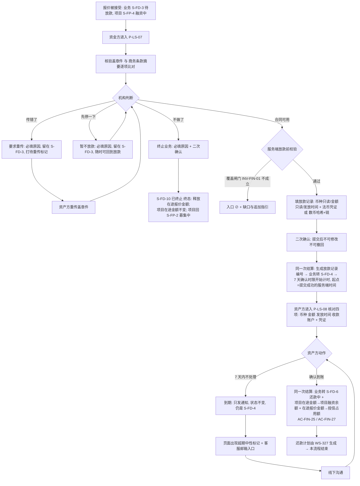
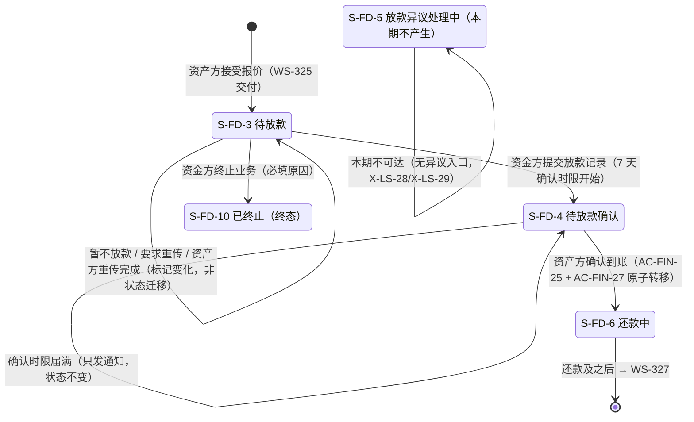

# 金融服务平台 · 金融服务端 · 借贷广场 — 放款与放款确认 PRD **V3.1**

> **本模块为两册。** 本册是**主文档 · 核心范围与功能规格**；页面规格、异常分支、数据字段、对外契约增量、非功能、指标、依赖与风险、消息事件、验收标准汇总在分册。
>
> | 文件 | 内容 | 读者 |
> | --- | --- | --- |
> | `v1.0-借贷广场-放款与放款确认-PRD.md`（本册） | 第 1～5 章、6.0～6.4、第 12 章：背景与范围、角色与场景、主流程与状态机覆盖段、**融资需求对外状态与承载形态（4.4／4.5）**、**盖章件核验的三个处置动作**、**`AC-FIN-25` 的触发点与四个量的原子转移**、**7 天确认时限与超期出口**、功能清单、模块详情、待确认与遗留 | 需求方、设计、实现 |
> | [`01-数据字典与对外契约.md`](01-数据字典与对外契约.md) | 6.5～6.7、第 7～11 章：承载单元规格（抽屉 / 弹窗）、异常分支、深链契约增量、放款记录与融资业务字段、非功能、指标、依赖与风险、消息事件登记、验收标准汇总 | 设计、我的控制台（WS-328）、WS-327、消息中心（WS-329）、实现方、测试 |
>
> **两册编号连续、不重复定义**：同一个编号只在一处定义，另一册引用。
> **与上游的关系**：WS-324（**V9.0**）与 WS-325（**V5.0**）是本模块的直接上游，两者均已入库 `cly-V1.0.0`。**凡上游已定义的对象、公式、状态、契约，本册一律引用编号，不复述、不改写**；本册只写本模块新增的那一段。

## 1. 文档信息

| 项 | 内容 |
| --- | --- |
| 对应需求 | WS-326「借贷广场 · 放款与放款确认（PRD + 原型）」 |
| 所属平台 / 端 | 金融服务平台 · **金融服务端**（面客 Web，含未登录访客态） |
| 模块定位 | 借贷广场第三段（WS-323 简报第 11 章 **M-3**） |
| 上游输入 | **需求方 09-15 三条裁定**（02:19 本环节改名「放款确认」；06:01 WS-325 环节改名「报价确认」⇒ 两者共用过的那个旧展示名全链路作废；09-15 承载形态＝做事走右侧抽屉 760px / 提示走居中弹窗 560px、同一时刻一层）；《需求诊断简报 V6.0》3.9 / 7.5、《附册 · 融资全生命周期 V5.0》A4.2 / A5.4 / A5.5 / A6.1（WS-323）；**WS-324 已入库 PRD V9.0**（`cly-V1.0.0` / `1f67971`，主册 + 分册，含 5.3.1 覆盖状态定名、分册 6.9／6.9.1 承载契约与对外状态、10.5 修订请求）；**WS-325 已入库 PRD V5.0**（`cly-V1.0.0` / `1cef278`，含其分册 10.3 第 7 条对本模块的六项接口要求）；**需求方 2026-09-11 09:02 对主流程的确认**（四步、不设中间态）与 **09-14 九条反馈**（承载形态、术语、对外状态） |
| 依赖文档 | WS-324《借贷广场 · 融资需求与代币质押 PRD V9.0》、WS-325《借贷广场 · 授信报价与接受拒绝 PRD V5.0》、WS-318《资产清单与代币签发 PRD》（汇率与哈希格式）、WS-313《可信数据同步 PRD》、WS-308『01-国际化基线.md』、`docs/notification-contract/接入指南.md` |
| 编写人 | 许楚清（需求分析师） |
| 文档状态 | **V3.1**（在 V3.0 基础上修分册承载表述缺陷、固化需求方 09-15 四条裁定、关闭 `Q-LN-02`；**主册只动版本号、1.3 说明、`D-LN-45` 与 12.1 三处**）。V3.0 为改名与承载对齐版（基线＝已入库的 V2.0，`cly-V1.0.0` / `86620bf`）。**业务规则一条未改**，本轮只做四项，见 1.2。`Q-FIN-16`（裁定 12）与 `Q-LN-03`（同名不同义）均已关闭；开放项 2 条，均不阻塞开发启动（12.1） |
| 编号空间 | 沿用上游、不回收作废号。**V2.0 按 `cly-V1.0.0` 现状重新选号**（WS-324 V9.0 与 WS-325 V5.0 实际占用：`AC-LS` ≤ 119、`D-LS` ≤ 32、`AC-FIN` ≤ 28、`D-FIN` ≤ 105、`F-LS` ≤ 36、`M-LS` ≤ 29、`R-LS` ≤ 27、`X-LS` ≤ 24、`DEP` ≤ 26、`US` ≤ 20、`FD` ≤ 21）：本模块占 `AC-LS-125`～`130`、`AC-FIN-35`、`F-LS-50`～`57`、`X-LS-28`～`38`、`M-LS-32`～`40`、`R-LS-35`～`44`、`DEP-35`～`46`、`US-24`～`32`、**`FD-30`～`38`**（融资业务字段增量）。本模块专属段位：条款 `D-LN-*`、验收 `AC-LN-*`、异常 `E-LN-*`、待定 `Q-LN-*`、字段 `LN-*`（放款记录）。**本模块不新增任何业务状态、不新增 `D-FIN-*`**（`D-LN-01`） |

---

## 1.1 V2.0 对齐说明（对齐 WS-324 V9.0，**业务规则未重写**）

本版**只改因上游变更而必须改的部分**：术语、对外状态、承载形态、编号、跨模块口径承接。放款两分支、三个处置动作、7 天确认时限与超期出口、额度转移触发点等本模块自有规则**一条未动**。

| 项 | 本模块的落点 |
| --- | --- |
| **A 术语改名**（WS-324 `D-LS-17`） | 全文替换完成，旧词根零残留（含本模块自造的三个搭配词：旧「⋯闸门」「⋯校验」「⋯档位」→ **覆盖闸门 / 覆盖校验 / 质押覆盖状态**），缺口一律写 **覆盖缺口**，提醒一律写 **覆盖不足提醒**。反向验收 `AC-LN-19` **不复写旧词根**、改为引用 `D-LS-17` 的裁定，以便 grep 自查归零 |
| **B 对外状态五值**（WS-324 `D-LS-18` / 分册 6.9.1） | 新增 **4.4**：一律引用、不重新定义、不另立第二套展示状态。本模块只负责一次跃迁（`放款中 → 已放款`）；**放款提交不产生对外跃迁**（`S-FD-3` 与 `S-FD-4` 同属 `放款中`）。业务终止的对外落点与本模块 `D-LN-24` ④ 存在冲突，**未自行取舍**，见 4.4 与 12.1 |
| **C 九条跨模块项** | 逐条核：① 借贷广场 —— 本册自始如此，无改动；② 合同号/发票号 —— 本册从未引用，无改动；③ **非登录态操作区只出「立即登录」** —— 已改（3.1、6.1、`D-LN-47`），与 WS-311 的偏离**只登记不改 WS-311**；④ 取消两段式创建发布 —— 不涉及；⑤ **操作区三段 + 当前环节出按钮 + 弹窗承载** —— **本版改动最大的一条**，见 4.5；⑥ 英文默认与术语表 —— 分册第 8 章新增一行，**不自造英文**；⑦ **需求编号 `FP-28`** —— 带进弹窗、商务条款摘要与全部消息（`D-LN-49`、分册 7.3／10.4） |
| **D 编号避让** | 按仓库现状重选，见 1. 编号空间。**本模块不再自定义 `AC-FIN-30`**——WS-325 V5.0 已把"两个维度各做一次原子转移"定为 `AC-FIN-27`、"终止或拒绝只出不进"定为 `AC-FIN-28`，本册改为引用（V1.0 提出的撞号问题已由 WS-325 V5.0 解决） |
| **E 同名不同义（V2.0 的 E 项）** | **V3.0 已关闭**：需求方 09-15 把 WS-325 的环节定名「报价确认」、本模块定名「放款确认」，**两条裁定作废的那个旧展示名全链路不再使用、不归属任何模块**。V2.0 的"写全称、不单方面改名"处置随之退役，`Q-LN-03` 关闭，详见 1.2 与 `D-LN-46` |
| **承接 WS-325 分册 10.3 第 7 条** | 六项逐项落位：① 盖章合同核验与处置（6.2，三条路径全落地）；② 放款确认两维度原子转移（5.1，`AC-FIN-25` + WS-325 `AC-FIN-27`）；③ 业务终止只出不进（6.2.3，WS-325 `AC-FIN-28`）；④ 放款与还款按 `QT-04` 快照折算、不重新取汇率（`D-LN-09`）；⑤ `S-FD-3` 之后不受报价 7 天有效期约束（4.3、5.4.2）；⑥ **放款确认不得要求到账金额等于融资金额**（6.3.2、6.4.2，新增字段 `FD-39` 实收金额只记录不计量） |

---

## 1.2 V3.0 改动说明（改名 + 承载对齐，**业务规则一条未改**）

基线是已入库的 V2.0（`cly-V1.0.0` / `86620bf`）。本轮只做四项，放款两分支、三个处置动作、168 小时时限与超期出口、额度转移触发点、跨境手续费口径**全部原样**。

| # | 改了什么 | 落点 |
| --- | --- | --- |
| **一 · 改名** | `S-FD-4` 环节展示名定为「**放款确认**」（需求方 09-15 02:19）。正文、字段名、枚举值（`S-FD-4 待放款确认`）、文案示意、通知正文全部改到位。**旧展示名全链路作废**——06:01 裁定把 WS-325 的环节定名「报价确认」之后，旧名不归任何模块（`D-LN-46`），本册连"作废记录"里也不复写它，`AC-LN-24` 反向验收只引用裁定，**grep 自查为零**（仅剩文件名/目录名/issue 标题三处路径类占用，见 12.4） | 全文；`D-LN-46`、`AC-LN-24`、分册 10.3 第 13 条 |
| **二 · 承载形态** | 对齐 WS-325 09-15 的两形态并行：**做事类走右侧抽屉 760px、提示类走居中弹窗 560px、同一时刻只有一层**。V2.0 `D-LN-48`「操作区内的两个弹窗」**整条重述**；判据写进条款，新增动作照判据归类 | **4.5**（`D-LN-48` 重述 + 新增 `D-LN-54`/`D-LN-55`）、6.1、6.3.1、6.4.2、6.4.3、分册 6.5／6.7、`AC-LN-25` |
| **三 · 核两条已有口径** | ① **跨境手续费**（09-11 09:12 裁定 12）——V2.0 已落地（6.3.2、`D-LN-51`～`D-LN-53`、`FD-39`、`AC-LN-22`），本轮**核对未改**；② **机构收款账户**已由 WS-325 09-15 06:10 撤下——本模块原先把数币放款的「链」锚在报价时的机构账户字段上，锚点失效，**改锚到资产方数币收款地址 `FD-06` 的链**（`D-LN-28` 重述、`LN-09`、`E-LN-05`）。这是本轮唯一一处**因上游撤字段而必须动的规则表述** | 6.3.1、`D-LN-28`、分册 7.1／6.6 |
| **四 · `Q-LN-02`** | 当时仍开着，建议口径写进了 `D-LN-45` 与 12.1。**该建议已于 09-15 被需求方采纳，`Q-LN-02` 在 V3.1 关闭**（见 1.3 第四项） | `D-LN-45`、12.1 |

---

## 1.3 V3.1 改动说明（修缺陷 + 固化裁定，**业务规则一条未改**）

| # | 改了什么 | 落点 |
| --- | --- | --- |
| **一 · 修分册缺陷** | V3.0 漏改了**分册 6.5 整章**（章标题、`P-LS-07`／`P-LS-08` 的单元名、"一律开弹窗"、滚动说明仍写弹窗），而同册 `AC-LN-21`、7.3 常量表与主册 4.5 已是抽屉——**照分册做会做成弹窗、照主册做会做成抽屉**。本版补齐为抽屉口径，分册版本号跟到 V3.1 | 分册 6.5 全章、6.7.1 锚点语义、分册册首版本说明 |
| **二 · 固化 09-15 四条裁定** | ① **抽屉宽度不分档、维持 760px**（提案轮的"放款单元放宽到 1040px"未采纳）；② **不做条款编号剥离、不加审阅模式**（⚠️ 与旧展示名清理是两件事，后者照清）；③ **核验区无任何勾选态**——左件右单的并排结构保留，右侧只作对照阅读；④ **「常驻 ≠ 同权重」**——三个处置动作落底部动作条次级位、就地展开填原因、终止多一层二次确认 | 分册新增 `D-LN-57`／`D-LN-58`／`D-LN-59`，6.5.1 两区改写，7.3 常量表核定，`AC-LN-08`／`AC-LN-21` 明确语 |
| **三 · `AC-LN-03` 补可实测判据** | 原文只写"同屏比对、不折叠"，验不出来：提案轮实测 760px 抽屉里两处待比对内容垂直相距 560px，**不折叠但仍不同屏**。本版把判定写成**"在 1440×860 可视区内两处对应项同时可见、无需滚动"**；宽度已定不改，因此要在 760 内解，穷尽后做不到则按**已知偏离**登记实测证据与最小代价方案，**不得悄悄改成折叠或上下排** | 分册 11 `AC-LN-03` |
| **四 · 两个决定写进文档** | **`Q-LN-02` 关闭**（采纳本模块建议口径：放款前终止 → 退回 `待报价`；放款后的异议裁决终止本期不可达 → `已失效／已关闭`）；**主册不拆册**（603 行、超门槛 3 行，为 3 行重排文件边界不划算，留待下次实质扩写） | 主册 `D-LN-45`、12.1、12.3；分册 10.3 第 1 条 |

---

## 2. 背景与目标

### 2.1 背景

WS-325 把一笔融资推到了 `S-FD-3 待放款`：双方的商务条款已经固化，线下合同已经签署并把盖章件传了上来，资产方的收款账户也确认过了。**但钱还没动。** 本模块就是让钱真正动起来的那一段，也是整条链路上**唯一一段平台记录与真实世界可能对不上**的地方——平台看不到银行流水，也不核验链上哈希（`D-FIN-22`），所以这一段的设计重心不是"怎么记账"，而是**在没有核验能力的前提下，怎么让两边对同一笔钱达成一致**。

需求方 2026-09-11 09:02 亲自确认了这条线只有四步：**报价被接受 → 资金方放款并上传放款凭证 → 资产方确认到账 → 结束**。本册严格按这四步写，不塞中间态。

**本模块最容易出事的地方有三处**，5.1、6.2、6.4 分别对应：

1. **额度转移的触发点错位**。`AC-FIN-25` 的触发点是**放款确认完成**（资产方确认到账），不是**放款提交完成**（资金方打完款）。按字面的"放款即释放"实现，`S-FD-4` 的 7 天窗口内这笔金额会既不在 `项目在途金额`、又已计入 `项目融资余额`，可融金额凭空多出一块，资产方可以拿同一份质押再发一笔需求。
2. **盖章件核验没人兜底**。WS-325 `D-FIN-89`～`D-FIN-91` 把合同核验的承接方定成了资金方、时点定在**放款前**，平台不审核真伪、不设平台侧审核态。这意味着机构的三个处置动作（暂不放款 / 要求重传 / 终止业务）**必须由本模块落地**，缺一个链路就断——`DEP-14` 就是这件事。
3. **7 天等待态没有出口**。本期没有异议入口、没有运营端裁决台、到期只发通知不改状态。"资产方始终不确认"因此不是一个异常，而是**一条必须走得通的正常路径**：客服邮箱线下沟通后，仍由当事方自己回广场点「确认」。6.4 把它当正常路径写完整。

### 2.2 本期目标

| # | 目标 | 达成口径 |
| --- | --- | --- |
| G-1 | 四步走完一笔融资，中间不出现第五个状态 | 4.1 + `D-LN-01`，本模块新增状态数 = 0 |
| G-2 | **额度在正确的时刻、以原子方式、在两个维度同时转移** | 5.1 + `AC-FIN-25` + WS-325 `AC-FIN-27`，四个量同一次结算内一致变化 |
| G-3 | **机构对盖章件的三个处置动作全部可执行，且各自的落点写死** | 6.2，`D-LN-10`～`D-LN-16`、`AC-LN-04`～`AC-LN-07` |
| G-4 | 平台的能力边界对用户是明示的，不被读成"平台已核验" | 5.3，`D-FIN-22` 承接 + `AC-LN-02` 反向验收 |
| G-5 | **资产方始终不确认时，这笔业务仍有一条走得通的路** | 6.4，客服邮箱 → 线下沟通 → 当事方自行回广场确认 |
| G-6 | 两侧都知道自己在等什么、还剩多久、卡在谁那儿 | `FD-37`/`FD-38` 倒计时 + `D-LN-21` 的中性呈现 |
| G-7 | 本模块新增的跳转全部长在 WS-324 既有的契约上 | 分册 6.7，**不新开一套跳转约定**（`AC-LS-07`） |

### 2.3 范围（含）

- **盖章件核验与三个处置动作（`P-LS-07` 内，放款前）**：暂不放款 / 要求重传 / 终止业务（`DEP-14` 的落地）
- **放款录入（`P-LS-07`）**：法币 USD 与数币 USDT·USDC 两分支的字段、校验、提交与留痕
- **放款确认（`P-LS-08`）**：资产方确认到账，确认完成即触发额度的两维度原子转移
- **7 天确认时限**：起算点、自然日口径、到期动作与**超期后的出口**（客服邮箱 → 线下 → 当事方自行确认）
- **`AC-FIN-25` 的执行**：`项目在途金额 → 项目融资余额`；同一时刻 `在途报价金额 → 授信占用额`（WS-325 `AC-FIN-27`）
- **业务终止的后果**：状态落点、两个维度各释放什么、项目回落到哪
- **覆盖不足与项目到期对本模块的影响**（5.4）：哪些业务受影响、哪些绝不受影响
- **融资需求对外状态的一次跃迁**（`放款中 → 已放款`）与承载形态（详情页操作区「融资放款」环节内的两个**右侧抽屉**），4.4／4.5
- **对外契约增量**：`available_actions` 新增取值与锚点（分册 6.7）、本模块产生的消息事件登记（分册 10.4）
- **对 WS-327 的交接口径**：还款计划的生成触发点、利息起算日可用的两个权威时间字段（5.5）

### 2.4 范围（不含）

| 编号 | 本期不做 | 归属 |
| --- | --- | --- |
| `X-LS-28` | **「提出异议」入口** | 本期确认环节只保留「确认」一个动作，异议走线下客服邮箱（6.4）。`Q-FIN-24`/`Q-FIN-25` 本期消解、不用答 |
| `X-LS-29` | **`S-FD-5 放款异议处理中` 及其裁决三值** | **本期不可达**：没有异议入口就产生不了这个状态。状态机条文保留、标注本期不产生（`D-LN-02`）；`D-FIN-10`（异议期冻结双方动作）本期不适用 |
| `X-LS-30` | **运营端融资异议裁决界面**（`G-01`） | 无立项。本期不因此阻塞——没有异议就没有待裁决对象 |
| `X-LS-31` | **分次放款 / 部分放款** | `D-FIN-19` 不支持部分融资的直接推论；一笔融资业务至多一条有效放款记录（`D-LN-29`） |
| `X-LS-32` | **放款记录的修改与撤回** | 承接附册 A6.1：`S-FD-4` 下机构不可撤回或修改已提交的放款记录。理由与代价见 6.3.4 |
| `X-LS-33` | **交易哈希的链上核验**（`Q-FIN-20` 结论：本期否） | 5.3。本期只做格式校验（`D-FIN-22`），不接索引服务，不做阻断式也不做告警式异步核验 |
| `X-LS-34` | **7 天到期的自动确认、自动改状态、自动视为到账** | 需求方裁定的红线（2.6）。到期只发通知（6.4） |
| `X-LS-35` | **平台侧的盖章件审核态与真伪判定** | 承接 WS-325 `X-LS-22`/`D-FIN-90`：平台不审核、不为合同真伪与法律效力背书，承接方是资金方 |
| `X-LS-36` | **催办能力**：资产方催机构放款、机构催资产方确认、平台代为催办 | 本期没有催办对象与催办通道；主动触达只有 WS-329 的那几条固定事件（分册 10.4）。资产方在 `S-FD-3` 的可见状态是 ⊘（附册 A6.1） |
| `X-LS-37` | **还款计划的期数、计息口径、还款方式与类型**（`Q-FIN-17`/`18`/`26`～`29`） | WS-327。本模块只定**生成触发点**与可用的权威时间字段（5.5），**不自定计息口径** |
| `X-LS-38` | **提前还款** | 承接 `X-LS-06`：还本发生在融资项目到期之后。「已到期 · 存量处理中」是常态路径（5.4.3） |
| `X-LS-06`（承接） | 提前还款 | WS-324 `D-FIN-47` |
| `X-LS-11`（承接） | 链上持仓查询与对账 | 后台自动进行，不在本模块 |

> **本模块不触达链上**：放款的链上转账发生在**平台之外**（机构自己的钱包或银行），平台只收下哈希与链的文本记录。**本模块不发起任何链上调用、不消耗 gas**（承接 `D-FIN-67`），因此不重复 WS-324 分册 6.7 的链上章节。质押的释放时点与项目终态绑定（`D-FIN-49`）、释放采用两段式（`D-FIN-57`），**本模块不释放任何质押**。

### 2.5 上游口径声明（**原样保留，不得删改**）

> 本模块的额度口径、覆盖闸门、状态机、深链契约、**融资需求对外状态**、**详情页操作区与承载形态**、**质押覆盖状态的定名**与**融资需求自动失效**，以 **WS-324 已入库 V9.0**（主册 + 分册）为准；报价、接受、收款账户、盖章件、汇率快照与授信侧口径以 **WS-325 已入库 V5.0** 为准。两者冲突时以 WS-324 为准，并在分册 10.3 提出修订请求。
> **本模块不改上游**：凡属 WS-324／WS-325 已定义的对象、公式、状态、契约，本册**一律引用编号**；发现冲突时**登记不取舍**（12.1、12.3）。

### 2.6 八条不可削弱的红线

| 编号 | 红线 |
| --- | --- |
| `AC-FIN-25`（承接，**本模块是执行方**） | **额度转移的触发点是「放款确认完成」（资产方确认到账），不是「放款提交完成」（资金方打完款）。** 同一时刻该笔金额从 `项目在途金额` 移出、计入 `项目融资余额`，**原子、无空档**。按"放款即释放"实现会让 `S-FD-4` 的 7 天窗口内额度凭空多出一块（5.1 有带数字的反例） |
| WS-325 `AC-FIN-27`（承接，与上条同一时刻） | **机构维度同时做一次原子转移**：`在途报价金额 → 授信占用额`。两个维度的四个量在**同一次结算内**一致变化；分两次提交会出现 `AC-MC-10` 恒等式不成立的窗口 |
| `D-FIN-22`（承接） | **交易哈希本期只做格式校验、不做链上核验。** 机构可以填一个格式正确但不存在的哈希；这个风险由确认环节的人工判断兜底。**界面与文案不得出现任何"已核验""已上链确认"的暗示**（`AC-LN-02`） |
| `D-FIN-21`（承接） | **7 天时效一律以放款记录提交成功的服务端时间为准**，不用提交方填写的发放时间。提交方填的时间只作业务参考与对账依据（`LN-05`）。利息起算日由 WS-327 定义，但它能用的也只有服务端时间（5.5） |
| `D-LN-03`（**完整表述在 6.4.1**） | **7 天到期不自动视为确认、不自动改状态。** 本期没有异议入口、没有运营端，这条更不能松——自动确认等于平台替资产方承认"钱已收到"，一旦实际没到账，责任落在平台。**这是法律风险不是产品风险**（承接附册 `Q-FIN-23` 的推荐口径并按本期能力收窄，6.4） |
| `DEP-14`（承接，**本模块是承接方**） | **机构的三个处置动作必须全部落地**：暂不放款 / 要求重传 / 终止业务。平台不审核真伪、不设平台侧审核态（`D-FIN-90`/`D-FIN-91`），**这三个动作没有任何人会替它兜底**，缺一个链路就断（6.2） |
| WS-325 `D-FIN-102`（承接，**裁定 12**） | **放款确认不得要求到账金额等于融资金额。** 跨境手续费（汇出行、中转行、收款行）由资产方承担 ⇒ **实收必然少于融资金额**；把"金额一致"做成确认的前置条件，会让 7 天确认窗口被一笔汇款手续费卡住。债务本金与一切额度计量**一律按 `QT-03` 融资金额**；实收金额若要记录是本模块自己的字段（`FD-39`），**不得反向修改 WS-325 的任何金额**（6.3.2、6.4.2） |
| `D-FIN-47`（承接） | **「已到期 · 存量处理中」是常态路径**，必须按正常状态呈现（中性样式 + "存量融资业务照常履约中"），**不得做成告警或红色警示**。本模块产生的每一笔成交业务几乎都会经过这一段（5.4.3） |

**一条本期硬约束及其代价（写进验收、不得被优化掉）**：`X-LS-28` **没有异议入口**——资产方发现金额不符、凭证有问题、钱根本没到时，**在平台上没有任何可以表达"我不认"的动作**。他唯一能做的是不点确认，然后走客服邮箱。这条路径必须在 PRD 与界面上完整存在（6.4），**不能写成一句风险提示了事**。

---

## 3. 用户与场景

### 3.1 角色

| 角色 | 在本模块的诉求 | 权限口径 |
| --- | --- | --- |
| **未登录访客** | 看这笔业务走到哪一步了、是不是已经放款、放了多久还没确认 | L1～L5 全量可见（含放款的公开商务字段与时间线）；**收款账户、放款凭证文件、交易哈希、盖章件一律不公开**（`D-LN-06`）；**操作区只出一个「立即登录」**，不再逐动作 `⊘` + 独立原因（`D-LN-47`，WS-324 `D-LS-14`） |
| **资金方（登录）** | 放款前先看清合同没问题；放完款让对方尽快确认；发现合同有问题时有处置手段 | 核验盖章件并执行三个处置动作、提交放款记录；**放款记录提交后不可修改、不可撤回**（`X-LS-32`）；`S-FD-4` 起无写动作 |
| **资产方（登录）** | 确认钱到了；钱没到或不对时找得到人 | 确认到账、按机构要求重传盖章件；**本期没有「提出异议」动作**（`X-LS-28`）；`S-FD-3` 期间不可催办（`X-LS-36`） |
| **平台运营** | 本模块内无业务动作 | 无面客写入口；**本期不产生任何裁决类待办**（`X-LS-30`）；客服邮箱的线下沟通不是系统动作（6.4） |

> 同一企业主体下的**任一登录员工均可代表企业执行上表全部动作**，本期不做企业内「查看 / 操作」分级（`D-MC-105`/`AC-MC-16`）。
> **跨主体隔离继续成立**（`D-FIN-25`/`D-FIN-26`）：放款凭证文件、交易哈希、收款账户、盖章件**只对该笔业务的双方可见**，不属于广场全量公开的范围（`D-LN-06`）。

### 3.2 用户故事

| 编号 | 故事 | 验收落点 |
| --- | --- | --- |
| `US-24` | 作为资金方，放款前我要先看清那份盖章合同；有问题时我要能停下来，而不是被迫二选一（要么放款要么放弃） | 6.2、`AC-LN-04` |
| `US-25` | 作为资金方，合同传错了我要能让对方重传，重传完我接着放款，不用把这笔业务作废重来 | 6.2.2、`AC-LN-05` |
| `US-26` | 作为资金方，这笔我不做了，我要能干净地终止：我的额度得回来，对方的需求得能重新去找别家 | 6.2.3、`AC-LN-06` |
| `US-27` | 作为资金方，我打完款要让对方知道，并且清楚他还有几天要确认 | 6.3、`FD-37`/`FD-38` |
| `US-28` | 作为资产方，我要一眼看出这笔钱是哪天、用什么方式、打到我哪个账户的，数币的还要能自己去链上查 | 6.4.1、`LN-13` |
| `US-29` | 作为资产方，钱确实到了，我点一下确认，还款计划就该出来了 | 6.4.2、`AC-FIN-25`/WS-325 `AC-FIN-27` |
| `US-30` | 作为资产方，钱没到或者金额不对，我不知道找谁——平台上没有「提异议」按钮，那至少要告诉我找谁 | 6.4.3、`D-LN-19` |
| `US-31` | 作为资产方，我出差两周回来，这笔业务应该还在那儿等我确认，而不是已经被系统替我确认掉了 | `D-LN-03`、`AC-LN-11` |
| `US-32` | 作为未登录访客，我想看看这个平台上从接受报价到真正放款一般要多久 | L5 公开字段 + `M-LS-33` |

### 3.3 典型场景

- **S17 合同没问题，直接放款**：机构甲在 `P-LS-07` 打开盖章件，条款与商务条款摘要一致 → 选法币 USD → 系统带出资产方收款账户（只读）→ 填发放时间、传转账凭证 → 二次确认 → 提交。同一次结算内：生成放款记录编号、业务转 `S-FD-4 待放款确认`、**7 天确认时限开始计时**（起点＝提交成功的服务端时间）。`项目在途金额` 与 `在途报价金额` **都不变**。
- **S18 数币放款**：甲选 USDT → 币种只读等于报价时的 `QT-02`、链只读等于 `FD-06` 的链 → 填哈希（`0x` + 64 位十六进制，只校验格式）→ 提交。页面给出区块浏览器链接，旁边明确标注"**平台未核验该交易，链接仅供自行查验**"。
- **S19 资产方确认到账**：A 在 `P-LS-08` 核对币种、金额、发放时间、收款账户与凭证，点「确认到账」+ 二次确认。同一次结算内：业务 `S-FD-4 → S-FD-6 还款中`、`项目在途金额 −150 万 / 项目融资余额 +150 万`、`在途报价金额 −150 万 / 授信占用额 +150 万`、**还款计划由 WS-327 生成**、项目保持 `S-FP-4 融资中`。
- **S20 合同盖错章，要求重传**：甲发现盖章件上的公章是资产方另一家关联公司的 → 点「要求重传盖章件」+ 填原因 → 业务**留在 `S-FD-3`**，打「待资产方重传盖章件」标记 → A 收到通知，回广场重传（旧件保留在留痕里，不覆盖）→ 标记自动清除，**无需机构再点一次"通过"**，甲的放款入口照常可用。
- **S21 甲决定先不放款**：甲对合同有疑虑但还没决定 → 点「暂不放款」+ 填原因 → 业务留在 `S-FD-3`，A 侧看到"资金方暂缓放款：{原因}"与客服邮箱 → 甲想清楚后随时可以直接放款，或改为要求重传、或终止。
- **S22 终止业务**：甲判定这份合同不可用且不打算继续 → 「终止业务」+ 必填原因 + 二次确认 → 同一次结算内：业务 `S-FD-3 → S-FD-10 已终止`（终态，编号保留作废）、**`在途报价金额` 全额释放**、**`项目在途金额` 不变**（需求还挂着）、项目 `S-FP-4 → S-FP-2 募集中`、质押不释放。A 的需求重新可被任何机构报价。
- **S23 资产方始终不确认**：甲 09-11 10:00 提交放款，A 一直不登录。09-18 10:00 整（+168 小时）系统判定超期 → **状态不变，仍是 `S-FD-4`** → 双方各收到一条超期通知 → 页面出现中性标记"已超过确认时限 N 天"与**客服邮箱**入口 → 线下沟通后 A 登录，点「确认到账」→ 走 S19 的完整结算，**和没超期时一模一样**。
- **S24 钱没到账**：A 查了银行流水没收到 → 平台上**没有「提出异议」按钮** → 页面引导他发客服邮箱并附业务编号 → 线下核实是甲填错了收款账户、款项被退回 → 甲重新打款；但**放款记录不可修改**（`X-LS-32`），双方线下达成一致后仍由 A 点「确认到账」，或由甲「终止业务」重来。代价已如实记在分册 `R-LS-36`。
- **S25 质押覆盖在放款前跌破**：A 池内两张代币失效，`INV-FIN-01` 破 → 甲的放款入口 `⊘` + 缺口金额 + 说明"该项目当前质押覆盖不足，暂不可放款"（`AC-FIN-12` 承接）→ 甲可选择「暂不放款」等 A 追加质押，或「终止业务」。**A 追加质押使判据重新成立后，放款入口自动恢复**。
- **S26 质押覆盖在放款后、确认前跌破**：钱已经打出去了。**放款确认照常可以完成**（`D-LN-08`）——转移不新增占用，拦住它会让这笔钱既不在在途也不在余额，正是 `AC-FIN-25` 禁止的空档。A 侧同时看到覆盖不足提醒与追加指引，甲侧可见（`D-FIN-56`）。

---

## 4. 流程说明

### 4.1 主流程四步（需求方 2026-09-11 09:02 确认口径）

> **为什么放款前要再跑一次覆盖闸门**：`AC-FIN-12` 视角 B 把放款列为需要校验的动作，且要求**每次校验都用服务端当场重算的数值、不吃缓存**。从接受到放款之间可能隔着好几天，池内代币可能已经失效（`D-FIN-59`）。**前端展示的数只是预览**。
> **为什么核验环节不是一个状态**：它是 `S-FD-3` 内部的判断与处置，不改变业务在链路上的位置。承接 `D-FIN-77` 的同一理由——每多一个状态，控制台（WS-328）与消息中心（WS-329）的枚举与文案映射都要跟着改，而"机构看到哪一步了"用标记表达即可（`FD-31`/`FD-32`）。

### 4.2 融资业务状态机（本模块覆盖段，承接 `S-FD-*`，一套跨模块共用）

| 编号 | 条款 |
| --- | --- |
| `D-LN-01` | **本模块新增状态数 = 0。** 放款、核验处置、确认全部落在附册 A4.2 已定义的 `S-FD-3` / `S-FD-4` / `S-FD-6` / `S-FD-10` 上（`D-FIN-28`：状态机一处定义两处引用）。"合同待重传""已暂缓放款""确认已超期"**一律是标记而不是状态**（`FD-31`/`FD-32`/`FD-36`），理由同 WS-325 `D-FIN-77` 与 WS-324 `D-FIN-63` |
| `D-LN-02` | **`S-FD-5 放款异议处理中` 本期不可达**：产生它的唯一入口是「提出异议」，而本期没有这个入口（`X-LS-28`）。**状态机条文保留、枚举保留**，控制台与消息中心**不得为它准备文案与筛选项**，避免出现一个永远为空的 tab。连带：`D-FIN-10`（异议期冻结双方动作）**本期不适用**；`Q-FIN-24`/`Q-FIN-25` 本期消解、不用答 |
| `D-LN-04` | **`S-FD-10 已终止` 在本期只有一个入口**：`S-FD-3` 段资金方的「终止业务」。附册原先画的"运营裁决终止"路径（`S-FD-5 → S-FD-10`）**本期不可达**。**`S-FD-4` 之后不可终止**——钱已经打出去了，此时作废业务等于让资产方收了钱却不欠债，平台无权也无力做这个决定（6.2.3） |
| `D-LN-05` | **融资业务编号在终态下保留但作废**，用于留痕与举证，**不回收、不复用**（承接 `D-FIN-20`、WS-325 `D-FIN-78`、`H-01`）。终止后同一机构可对该资产方的同一需求**立即重新报价**，那是一笔全新的融资业务（新编号、新汇率快照、新的 7 天报价有效期），不是原业务的续期 |

### 4.3 两个 7 天不是同一个 7 天

平台上现在有两个 168 小时，**起算点、约束对象、到期后果全不同**，必须分别呈现、分别命名：

| | **报价有效期**（WS-325 `D-CR-26`） | **放款确认时限**（本模块 `D-LN-17`） |
| --- | --- | --- |
| 约束谁 | 资产方处理报价 | 资产方确认到账 |
| 起算点 | 报价提交成功的服务端时间（`QT-09`） | **放款记录提交成功的服务端时间**（`LN-06`） |
| 长度 | 168 小时，自然日，精确到秒 | **168 小时，自然日，精确到秒**（同口径，`D-LN-18`） |
| 到期后果 | **自动失效**，报价终结、额度释放 | **只发通知，状态不变、额度不动**（`D-LN-03`） |
| 为什么不同 | 报价是一份**要约**，无人响应即自动收敛 | 确认是对**钱是否到账**的事实陈述，平台无权代为陈述 |

| 编号 | 条款 |
| --- | --- |
| `D-LN-18` | **两个时限的时间口径完全一致**（服务端提交时间起算、自然日、提交时刻 + 168 小时精确到秒、按平台统一时区展示并标注），**只有到期动作不同**。理由：两边口径不一致会很难向用户解释，而"为什么一个自动失效一个不自动"有清楚的业务理由可讲，"为什么一个算自然日一个算工作日"没有 |
| `D-LN-19`【命名红线】 | **界面、字段、文案中不得出现无限定词的"7 天""有效期""倒计时"**。一律写全称：「报价有效期」与「**放款确认时限**」。同一个业务的详情页上两者可能先后出现，混称会让资产方以为不确认就会像报价那样自动作废 |

---

### 4.4 融资需求对外状态：本模块负责的跃迁（对齐 WS-324 V9.0 `D-LS-18`）

**对外 5 值定义在 WS-324 分册 6.9.1，本模块一律引用、不重新定义、不另立第二套展示状态**（WS-324 `AC-LS-93`）。它是展示层的收敛视图，内部仍只有一套 `S-FD-*`（`D-FIN-28`）。

| 本模块的事件 | 内部迁移 | 对外状态 |
| --- | --- | --- |
| 资产方接受报价（上游交付） | `→ S-FD-3 待放款` | 进入 **`放款中`**（WS-325 侧驱动） |
| **资金方提交放款记录** | `S-FD-3 → S-FD-4 待放款确认` | **不跃迁**，仍是 `放款中` |
| 核验处置：暂不放款 / 要求重传 / 资产方重传 | 无迁移（仅标记） | **不跃迁**，仍是 `放款中` |
| **资产方确认到账** | `S-FD-4 → S-FD-6 还款中` | `放款中` → **`已放款`**（同一时刻按 `AC-FIN-25` 转入 `项目融资余额`） |
| 资金方终止业务 | `S-FD-3 → S-FD-10 已终止` | **退回 `待报价`**（需求方 09-15 裁定，`D-LN-45`）——需求仍挂在广场、可被任何机构重新报价 |

| 编号 | 条款 |
| --- | --- |
| `D-LN-44`（**新** · V2.0） | **对外状态由服务端派生下发，前端不得用 `S-FP-*`/`S-FD-*` 自行拼装**（WS-324 `AC-LS-93`）。本模块**不自建任何第二套展示状态**：`S-FD-3` 与 `S-FD-4` 的区别、核验处置的三个标记（`FD-31`/`FD-32`）、确认超期标记（`FD-36`）**都只在详情页的放款环节内呈现，不进对外状态、不做成广场列表的筛选标签**。理由：对外 5 值回答的是"这笔需求走到哪了"，而"钱打了没确认"是环节内的进度——把它升格成第六个值，广场列表会多出一个只有当事双方看得懂的标签 |
| `D-LN-45`（**V3.1 已裁定关闭**，原 V2.0 登记版作废） | **业务终止的对外状态按终止发生的时点分两种**（需求方 2026-09-15 采纳本模块建议口径，`Q-LN-02` 关闭）： · **放款前终止**（`S-FD-3` 段，本期唯一可达路径）⇒ 对外**退回 `待报价`**。理由：终止只终结这一笔融资业务，**需求从没被撤下**——项目回 `S-FP-2 募集中`、`项目在途金额` 不变、任何机构可立即重新报价（`D-LN-24` ③④），与拒绝报价、报价届满完全同构（WS-324 `AC-LS-94`）。 · **放款后的异议裁决终止**（`S-FD-5 → S-FD-10`，**本期不可达**，`D-LN-02`/`X-LS-29`）⇒ 落 **`已失效／已关闭`**。 ⚠️ **WS-324 V9.0 分册 6.9.1 现仍把 `S-FD-10` 整体映射为 `已失效／已关闭`**，需按上述两种时点拆行，修订请求见分册 10.3 第 1 条 |
| `D-LN-46`（**V3.0 已关闭**，原 V2.0 版本作废） | **09-15 两条改名裁定作废的那个旧展示名，已全链路停用、不再指任何环节。** 09-15 02:19 裁定把本模块 `S-FD-4` 的环节展示名定为「**放款确认**」；06:01 裁定把 WS-325 的对应环节定名为「**报价确认**」。两个环节各有自己的名字之后，旧名不是被转手而是被**腾空作废**——**本册、界面、字段、枚举、文案与通知正文一律不得再出现它**（本条刻意不复写该词，以便 grep 自查归零）（反向验收 `AC-LN-24`，该验收**不复写旧名**、只引用本条与 09-15 裁定，以便 grep 自查归零）。⚠️ 上游四份已入库 PRD 仍在用旧名（WS-324 18 处、WS-325 30 处、WS-327 26 处、WS-329 7 处，另 `prd/README.md` 1 处），**且两种含义混在一起**，不能整体替换，分类与请求见分册 10.3 第 13 条 |

> **本模块承载的是四环节里的「融资放款」环节**（WS-324 分册 6.9）。四环节的展示名在 09-15 之后是：融资需求 → 融资报价 → **报价确认**（WS-325）→ 融资放款（本模块，其中 `S-FD-4` 段的动作叫「**放款确认**」）。**旧名已作废，本册不再使用**（`D-LN-46`）。

### 4.5 承载形态：做事走右侧抽屉、提示走居中弹窗（**V3.0 对齐 WS-325**）

V2.0 把 `P-LS-07`／`P-LS-08` 从"页面"改成了"详情页操作区内的弹窗"。WS-325 在 09-15 把承载形态再拆了一层——**做事类与提示类用两种不同的承载，同一时刻只有一层**（其原型 v1.3 `86b9f64` / v1.3.1 `a3db764`）。本模块据此重述。

**判据（按这条分，不逐个列举）**：

| 类别 | 判据 | 承载 |
| --- | --- | --- |
| **做事类** | 用户要在里面**录入、上传、选择、分步走完一件事**，或需要一边看信息一边填 | **右侧抽屉，宽 760px** |
| **提示类** | **零录入控件**，只要求用户**表一次态或知悉一件事**后继续或退出 | **居中弹窗，宽 560px** |

**本模块按判据的落点**（判据在上，这里只是照判据推出来的结果，新增动作按判据自行归类、不必回来改这张表）：

| 承载单元 | 类别 | 落点 |
| --- | --- | --- |
| `P-LS-07` 放款（核验区 + 三个处置动作 + 放款表单） | 做事类 | **右侧抽屉 760px** |
| `P-LS-08` 确认到账（核对凭证 + 选填实收金额） | 做事类 | **右侧抽屉 760px** |
| 盖章件重传 | 做事类（要上传） | **右侧抽屉 760px** |
| 三个处置动作的原因填写 | 做事类 | 抽屉内的**二级区**，不另开层（`D-LN-55`） |
| 提交放款前 / 确认到账前 / 终止业务前的**二次确认** | 提示类（零录入、只要一次表态） | **居中弹窗 560px** |
| 覆盖不足 `⊘` 的原因（`AC-LN-09`）、状态已变的提示（`AC-LS-129`） | 都不是 | **内联在原位或 Toast，不开任何层** |

| 编号 | 条款 |
| --- | --- |
| `D-LN-48`（**V3.0 重述**，原 V2.0 版本作废） | **`P-LS-07`／`P-LS-08` 两个编号保留，语义是"承载单元"而不是"页面"**——它们是详情页操作区「融资放款」环节内的**右侧抽屉（760px）**，不是可独立寻址的页面。**编号不回收**（沿用"不回收作废号"），本册对它们的**全部字段、校验、文案与验收要求原样成立**，只是装在抽屉里。深链锚点语义随之为"落详情页 + 打开对应抽屉"（分册 6.7）。 **为什么做事类用抽屉不用弹窗**：本模块的两个承载单元都要**一边看一边填**——放款要对着盖章件与商务条款摘要填表单，确认要对着凭证与金额核对。760px 的抽屉能把"参照物"和"输入"并排放下，560px 的居中弹窗放不下，只能折叠或滚动，而折叠正是核验区最不该做的事（`AC-LN-03` 要求同屏比对） |
| `D-LN-54`（**新** · V3.0） | **同一时刻只有一层。** 提示类弹窗出现时，**其下方内容（含抽屉内容）整体被遮罩覆盖且不可交互**；关闭后回到原处继续，**不新开第三层、不出现抽屉套抽屉、不出现弹窗套弹窗**。二次确认弹窗是唯一会叠在抽屉之上的层，且它零录入、只有两个按钮（同 WS-325 对授信提示的处置） |
| `D-LN-55`（**新** · V3.0） | **三个处置动作的原因填写不另开层**：点「暂不放款」「要求重传」「终止业务」后，在**放款抽屉内就地展开二级区**填原因，确认后回到抽屉。**只有「终止业务」在提交前多一层二次确认弹窗**（它是终态、不可逆，`D-LN-27`）；另两个动作可逆、随时能回到可放款（`D-LN-21`/`D-LN-22`），不值得再打断一次 |
| `D-LN-50`（承接，V2.0 不变） | **非当前环节不出任何可点按钮**（WS-324 `AC-LS-85`）：对外状态为 `放款中` 时只有「融资放款」环节出按钮；`S-FD-3` 出「放款」（资金方）与「重传盖章件」（资产方，标记为真时），`S-FD-4` 出「确认到账」（资产方）。**不得同时出现两个环节的操作入口**，也不得在 `已放款` 后仍留着放款或确认按钮 |
| `D-LN-47`（承接，V2.0 不变） | **未登录时操作区只出「立即登录」**（WS-324 `D-LS-14`）：不再逐动作 `⊘` + 独立原因。⚠️ 与 WS-311 权限矩阵的 `⊘` 语义存在偏离，按 WS-324 `10.5` 第 9 条**只登记、不改 WS-311**；**服务端鉴权与跨主体隔离一条不减**（WS-324 `AC-LS-86`） |
| `D-LN-49`（承接，V2.0 不变） | **需求编号 `FP-28` 带进本模块的每一处**：两个抽屉的标题区、商务条款摘要、客服邮箱提示语、本模块产生的全部消息正文，一律带 `FP-28`，与融资业务编号（`FD-01`）并列。**不自造第二个需求标识** |

## 5. 业务对象与核心口径

### 5.1 额度转移：触发点是「放款确认完成」（**本模块最容易翻车的地方**）

四个量、两个维度、一个时刻。**这一节是本模块的核心，6.4 的确认动作建立在它之上。**

| 时刻 | `项目在途金额`（项目维度） | `项目融资余额`（项目维度） | `在途报价金额`（机构 × 资产方） | `授信占用额`（机构 × 资产方） |
| --- | --- | --- | --- | --- |
| 资产方发布需求（WS-324） | **+150 万** | — | — | — |
| 机构提交报价（WS-325） | 150 万（**不变**） | — | **+150 万** | — |
| 资产方接受（WS-325） | 150 万（**不变**） | — | 150 万（**不变**） | — |
| **资金方放款（本模块）** | **150 万（不变）** | **—（不变）** | **150 万（不变）** | **—（不变）** |
| **资产方确认完成（本模块）** | **−150 万** | **+150 万** | **−150 万** | **+150 万** |
| 还款并经机构确认（WS-327） | — | 按已偿本金递减 | — | 按已偿本金递减 |

| 编号 | 条款 |
| --- | --- |
| `AC-FIN-25`（承接，**本模块是执行方**） | **放款确认完成的同一时刻**，该笔金额从 `项目在途金额` 移出、计入 `项目融资余额`，**原子、无空档**。任何时刻一笔钱只能被计入其中一个，**不得两边都不计、也不得两边都计** |
| WS-325 `AC-FIN-27`（承接） | **同一时刻、同一次结算内**，机构维度做一次等额原子转移：`在途报价金额 → 授信占用额`。四个量一致变化。**分两次提交会出现"机构侧已转入未偿本金、项目侧还挂在在途"的窗口，该窗口内 `AC-MC-10` 的恒等式不成立**（`Σ授信占用额 ≡ Σ项目融资余额 ≡ 已融额度`） |
| `D-LN-07`（**反例，必须按此实现**） | **放款完成时四个量一个都不动。** 反例：需求金额 150 万、融资上限 200 万、余额 0。若按"放款即释放"实现，放款后 `项目在途金额` 归 0 而余额尚未计入 ⇒ `可融金额 = 200 − 0 − 0 = 200 万`，**资产方可以在这 7 天里拿同一份质押再发一笔 200 万的需求**，而那 150 万的钱已经打出去了。正确实现下放款后 `可融金额 = 200 − 0 − 150 = 50 万`，与放款前一致 |
| `D-LN-08` | **原子转移不受覆盖闸门约束。** `AC-FIN-12` 管的是"能不能**新增**占用"，而放款确认**不新增任何占用**——它只是把一笔已经存在的在途改记为余额（承接 WS-325 `D-CR-16` 对"接受不重跑闸门"的同一判断）。若在此处加一道覆盖校验，覆盖不足时这笔钱会卡成"既不在在途、也不在余额"，正是 `AC-FIN-25` 禁止的空档（S26） |
| `D-LN-09` | **转移金额恒等于 `QT-03` 融资金额（USD）**，不取放款记录里的数、也不重新取汇率。结算币种的金额（`QT-05`/`LN-04`）只用于展示与对账，记账本位币一律 USD（`D-FIN-13`）；折算一律用报价时锁定的汇率快照 `QT-04`（`D-FIN-80`/`D-FIN-81`），**放款与确认都不得重新取汇率** |

### 5.2 本模块对三个占用量的写入边界

| 量 | 本模块动它吗 | 什么时候 |
| --- | --- | --- |
| `项目在途金额` | **是**（唯一一次） | 放款确认完成时**转出**（`AC-FIN-25`）。放款不动、终止不动（需求还挂着，见 `D-LN-14`） |
| `项目融资余额` | **是**（唯一一次） | 放款确认完成时**转入** |
| `在途报价金额` | **是** | 放款确认完成时转出（WS-325 `AC-FIN-27`）；**业务终止时全额释放且不进 `授信占用额`**（`AC-FIN-27` 只出不进） |
| `授信占用额` | **是**（唯一一次） | 放款确认完成时转入。此后随还款递减（WS-327） |
| `授信额度`、`融资上限`、`有效质押价值` | **否** | 本模块不改任何"池值"类的量（承接 `AC-FIN-20`/`D-CR-17`：占用只出现在不等式右边，绝不从池值里扣减） |

> **命名红线承接 `D-CR-18`**：本册、界面、字段、提示文案中**不得出现无限定词的"占用""在途""冻结"**，一律用全名。

### 5.3 平台的能力边界：只校验格式，不核验事实（`Q-FIN-20` 结论）

| 编号 | 结论 |
| --- | --- |
| `D-FIN-22`（承接，红线） | **交易哈希本期只做格式校验（`0x` + 64 位十六进制，沿用 WS-318 `D-TI-06`），不做链上核验。** 依据：WS-312 决策 3「本期尚未上链」、WS-318 `N-06` 不做实时链上数据。这意味着机构**可以填一个格式正确但不存在的哈希** |
| `D-LN-10`（`Q-FIN-20` 结论：**本期否**） | **本期不接入链上核验**，既不做阻断式（校验不过不让提交），也不做告警式（提交后异步核验、异常推运营）。理由：① 告警式需要索引服务与一个能接收告警的运营端，两者本期都不存在（`G-01` 无立项），告警发出去没人处理；② 本期确认环节的人工判断**就是**兜底机制（附册 `D-FIN-22` 原话："这正是确认环节存在的意义"）；③ 阻断式在本期更不可行——平台判定失败就等于平台在裁定一笔真实转账无效，而平台没有这个能力 |
| `D-LN-11`（**新，成本最低的替代**） | **平台提供区块浏览器链接，但明确标注未核验。** 由 `LN-09` 链 + `LN-08` 哈希拼出可点击链接（`LN-13`），旁边常驻一句"**平台未核验该交易，链接仅供自行查验**"。这是本期成本最低、唯一可得的帮助——**把核验能力交给真正有判断力的那一方（资产方自己）**，而不是假装平台做过 |
| `AC-LN-02`（**反向验收**） | **界面上不存在**：哈希旁的"已核验 / 已确认上链 / 交易有效"标识、放款凭证的"平台已审核"字样、盖章件的"平台已审核"字样、任何暗示平台对转账真实性背书的措辞。**全文检索验收** |

> **同一条边界的另一半**：`D-FIN-90` 已定平台不审核盖章合同的真伪与法律效力。两条合起来是本模块必须对外讲清的一句话：**平台记录事实主张，不判定事实。** 判定权在双方——机构判合同，资产方判到账。

### 5.4 三个外部事件对本模块的影响

#### 5.4.1 融资需求因覆盖不足自动失效（WS-324 V7.0 `D-FIN-72`～`D-FIN-76`）

WS-324 V7.0 的逐笔判据（`AC-FIN-26`）与**判定即失效、无缓冲期**只描述了 `S-FD-1 待接受` 段；WS-325 `D-CR-30` 的实现也只写了 `S-FD-1 → S-FD-11`。**`S-FD-3` 之后没有任何一份上游文档回答过**。本节补上，并作为对 WS-324 的修订请求提出（分册 10.3）。

| 编号 | 条款 |
| --- | --- |
| `D-LN-12`【**自动失效只作用于 `S-FD-1` 段**】 | **一旦资产方接受报价（`S-FD-3` 起），该笔需求与其上的融资业务不再进入自动失效的候选集合。** 理由：① 接受之前那是一份**要约**，作废它只是收回一个尚未被承诺的报价；接受之后双方已经签署了线下合同（`FD-09`/`FD-16`），**平台单方面作废等于替双方解除一份它看不见的合同**，平台既没有这个能力也没有这个权力；② `S-FD-4` 段钱可能已经打出去了，作废会让资产方收了钱却不欠债；③ 覆盖不足在本期的处置手段是**预警 + 催追加 + 债权机构知情**（`D-FIN-56`），不是撤销已成立的业务 |
| `D-LN-13`【**代之以什么**】 | `S-FD-3` 段的替代路径是**闸门 + 人的决定**：覆盖不足时放款入口 `⊘`（`AC-FIN-12`），机构可以「暂不放款」等资产方追加质押，也可以「终止业务」——**终止是人做的决定，不是系统自动作废**，且必填原因、对双方可见。`S-FD-4` 段**不受任何影响**，放款确认照常完成（`D-LN-08`） |
| `AC-FIN-35`（**新，对 WS-324 的接口要求**） | **逐笔失效的候选集合须排除"其上存在 `S-FD-3` 或 `S-FD-4` 业务"的需求。** 该需求占用的 `项目在途金额` 继续挂着，直到放款确认转入余额或业务终止。**这不是漏判**：WS-324 `D-FIN-73` 的停止条件已经覆盖了这种情形——已无需求可作废而判据仍不成立时，停止动作、项目留在覆盖不足提醒档走催追加，**不得空转找失效对象** |
| `D-LN-14`【**不双不计的保证**】 | `AC-FIN-25` 的原子转移与自动失效的释放路径**互斥不重叠**（承接 `D-FIN-76` ①）：同一笔 `项目在途金额` 要么随放款确认转成 `项目融资余额`，要么随需求失效消失，**两条路径的入口条件互斥**（前者要求业务在 `S-FD-4`，后者按 `D-LN-12` 只取 `S-FD-1` 或无业务的需求）。业务终止（`S-FD-10`）**不释放 `项目在途金额`**，需求回到可被报价的状态，它后续要么被新报价接走、要么被自动失效路径释放——**两次释放同一笔金额的路径在本期不存在** |

#### 5.4.2 报价 7 天自动失效（WS-325 `D-CR-25`～`D-CR-29`）

**与本模块无交集。** 计时在业务离开 `S-FD-1` 的那一刻终止（`D-CR-28`）；`S-FD-3` 之后的任何环节都不受报价有效期约束。本模块的放款确认时限是**另一个计时**（4.3）。

#### 5.4.3 融资项目有效期届满（WS-324 `D-FIN-43` / `D-FIN-47`）

| 编号 | 条款 |
| --- | --- |
| `D-LN-15` | **项目到期不终结在途业务**（承接 `D-FIN-43` 分支②）：项目打「已到期 · 存量处理中」并行标记，停止接受新报价、不允许再次发布，**但 `S-FD-3` / `S-FD-4` 的业务照常走完**——机构照常放款、资产方照常确认。到期**不是**放款闸门的一部分（放款不是"新增占用"，而是履行一笔已成立的业务） |
| `D-FIN-47`（承接，红线） | **分支②是常态路径**：本期无提前还款、还本发生在项目到期之后，凡成交项目几乎必然经过这一段。该标记**必须按正常状态呈现**（中性样式 + "存量融资业务照常履约中"），**不得做成告警或红色警示**。`P-LS-07`/`P-LS-08` 与本模块产生的所有通知文案同受此约束（`AC-LN-13`） |

### 5.5 对 WS-327 的交接（本模块只定触发点，不定计息口径）

| 编号 | 条款 |
| --- | --- |
| `D-LN-16` | **还款计划的生成触发点 = 放款确认完成的同一次结算**（承接附册 `D-FIN-05`：确认前这笔钱可能被推翻，提前生成的计划要回滚）。**本模块只负责在该时刻发出"可以生成了"这一事实与本金口径（`QT-03`，USD）**；期数、还款方式、还款类型、逾期规则由 WS-327 定义（`X-LS-37`） |
| `D-LN-17` | **利息起算日可用的权威时间只有两个，都是服务端时间**（`D-FIN-21`）：`LN-06` 放款记录提交时间、`FD-35` 放款确认完成时间。`LN-05` 提交方填写的发放时间**不得**作为计息基准，它只是业务参考与对账依据。**具体取哪一个由 WS-327 拍**（附册 `Q-FIN-17` 建议取放款确认完成日，机构可能主张按实际打款日——这是一条商务条款，不是本模块能定的） |

---

## 6. 功能清单与模块详情

### 6.0 功能清单

| 编号 | 模块 | 功能点 | 验收口径 |
| --- | --- | --- | --- |
| `F-LS-45` | 核验 | **盖章件核验区**（与商务条款摘要并排比对，平台不审核） | 6.2.1、`AC-LN-03` |
| `F-LS-46` | 核验 | **处置动作一：暂不放款**（必填原因，留在 `S-FD-3`，随时可回到放款） | 6.2.2、`AC-LN-04` |
| `F-LS-47` | 核验 | **处置动作二：要求重传盖章件**（含资产方的重传入口与标记自动清除） | 6.2.2、`AC-LN-05` |
| `F-LS-48` | 核验 | **处置动作三：终止业务**（终态、两个维度的释放与项目回落） | 6.2.3、`AC-LN-06` |
| `F-LS-49` | 放款 | **放款记录录入与提交**（法币 / 数币两分支） | 6.3、`AC-LN-01` |
| `F-LS-50` | 放款 | 放款前的覆盖闸门重算与 `⊘` 原因 | `AC-FIN-12`、`AC-LN-08` |
| `F-LS-51` | 放款 | 交易哈希的格式校验与区块浏览器链接（**不核验**） | 5.3、`AC-LN-02` |
| `F-LS-52` | 确认 | **放款确认与四个量的原子转移** | 6.4.2、`AC-FIN-25`/WS-325 `AC-FIN-27` |
| `F-LS-53` | 确认 | **7 天确认时限：计时、倒计时呈现、到期通知（状态不变）** | 6.4.1、`D-LN-03`、`AC-LN-11` |
| `F-LS-54` | 确认 | **超期后的线下出口**（客服邮箱 → 线下沟通 → 当事方自行确认） | 6.4.3、`AC-LN-12` |
| `F-LS-55` | 交接 | 还款计划生成触发点与本金口径的输出 | 5.5、`D-LN-16` |
| `F-LS-56` | 契约 | `available_actions` 新增取值与锚点 | 分册 6.7、`AC-LS-07` |
| `F-LS-58`（**新 · V2.0**） | 确认 | **到账差额的告知与实收金额记录**（选填、不计量、不阻断确认） | 6.3.2、6.4.2、`D-LN-51`～`D-LN-53`、`AC-LN-22` |
| `F-LS-57` | 通知 | 本模块产生的消息事件与登记 | 分册 10.4 |

### 6.1 进入条件（服务端判定，前端不得自行推断）

> **入口一律在详情页操作区「融资放款」环节内**，按钮开**右侧抽屉**、不跳离详情页（4.5）；**非当前环节不出按钮**（`D-LN-50`）；**未登录时整个操作区只出「立即登录」**（`D-LN-47`），下表的角色与原因判定只在登录后生效。

| 承载单元 | 谁能点 | 服务端判定 |
| --- | --- | --- |
| `P-LS-07` 放款（含核验区与三个处置动作） | **该笔业务的报价机构**，登录态、资金方 | 业务处于 `S-FD-3`。**核验区与三个处置动作在 `S-FD-3` 下恒可用**；**放款提交**另需覆盖闸门 `INV-FIN-01` 成立（`AC-FIN-12`），不成立时抽屉内放款按钮 `⊘` + 覆盖缺口与追加指引，**三个处置动作照常可用** |
| `P-LS-08` 确认到账 | **该项目的资产方**，登录态 | 业务处于 `S-FD-4`。**超期后照常可用**（`D-LN-03`：超期不改变任何权限） |
| 盖章件重传 | **该项目的资产方**，登录态 | 业务处于 `S-FD-3` 且「待资产方重传盖章件」标记为 `true`（`FD-31`） |

| 编号 | 条款 |
| --- | --- |
| `AC-LN-08` | **覆盖闸门只挡放款，不挡处置。** 构造"覆盖不足 + `S-FD-3`"的用例：放款按钮 `⊘` 且给出缺口金额与追加指引，**「暂不放款」「要求重传」「终止业务」三个动作仍然可执行**。把三个动作一起置灰会制造死局——机构既放不了款也退不出来 |
| `AC-LN-09` | **`⊘` 必须附可区分的原因**（承接 `H-03`、WS-325 `AC-LS-98`）：**登录后**的三种情形——覆盖不足、业务状态已变、非本笔业务的当事方——文案各异，**不存在只说"暂不可操作"的兜底文案**。⚠️ **未登录不在此列**：操作区此时只有「立即登录」，不逐动作给原因（`D-LN-47`） |

### 6.2 盖章件核验与三个处置动作（`DEP-14` 的落地，**本模块的硬承接**）

#### 6.2.1 核验区：平台只做并排呈现

WS-325 `D-FIN-89`～`D-FIN-91` 已定：**承接方是资金方，时点在放款前，平台不审核真伪与法律效力，本模块不设"待审核"中间态。** 本模块能做的只有一件事——**把判断所需的东西放在一起**。

`P-LS-07` 顶部固定一个核验区，左右并排：**左为盖章件**（`FD-09`，在线预览 + 下载，含历史版本，`D-LN-23`）；**右为商务条款摘要**（`D-FIN-87` 的九项：融资业务编号、双方企业主体全称、融资项目编号、融资金额 USD、结算币种与结算金额、汇率快照及其生效时间与来源、年化利率、抵押物概况、报价提交时间）+ 资产方勾选的**条款一致性声明**及其时间（`FD-16`）。

| 编号 | 条款 |
| --- | --- |
| `AC-LN-03` | **核验区必须让两边可同屏比对**，不得要求机构下载后自行对照；商务条款摘要的九项与 `QT-*`/`FD-*` 的存值**逐项一致**（承接 WS-325 `AC-LS-100`）。页面须明示"**平台不审核合同真伪与法律效力，请自行核验**"（`D-FIN-90`） |
| `D-LN-20` | **不设"核验通过"这个动作。** 机构直接放款即视为它接受了这份合同——多加一个"通过"按钮会产生两个后果：① 它像一个平台侧审核态（`D-FIN-91` 明确不设）；② 它会让"点了通过但没放款"变成第四种中间态。**机构的意思表示由它实际做的那个动作表达** |

#### 6.2.2 暂不放款 与 要求重传：都留在 `S-FD-3`，都能回到可放款

| 编号 | 条款 |
| --- | --- |
| `D-LN-21`【**暂不放款**】 | **必填原因**（1～200 字，自由文本不分类），提交后：业务**留在 `S-FD-3`**（不迁移、不打终态）；打「已暂缓放款」标记（`FD-32`，记最新一条原因、动作人与时间）；**原因对资产方可见**——否则资产方只能干等，而本期他没有催办能力（`X-LS-36`）。**能不能回到可放款：能，随时。** 机构直接提交放款即自动清除该标记，不需要先点一次"恢复"。可重复登记，**以最新一条为准**（历史进留痕）。**呈现必须中性**：它是机构的商务决定，不是对资产方的负面评价（承接 `D-FIN-56` 的中性披露原则） |
| `D-LN-22`【**要求重传**】 | **必填原因**，提交后：业务**留在 `S-FD-3`**；打「待资产方重传盖章件」标记（`FD-31`）；资产方获得**重传入口**（`deal/{id}?action=reupload_contract`，这是 `S-FD-3` 段资产方唯一的写动作）。**重传成功即自动清除标记、自动回到可放款**，**不需要机构再点一次"通过"**（理由同 `D-LN-20`：平台不做审核态）。**历史盖章件保留、不覆盖**（`D-LN-23`），核验区可切换查看每一版及其上传时间——这是纠纷时唯一能还原"改了什么"的痕迹 |
| `D-LN-23`【**重传的三条边界**】 | ① **历史盖章件保留、不覆盖**：每次重传产生新版本，核验区可切换查看每一版及其上传时间与动作人——这是纠纷时唯一能还原"改了什么"的痕迹；② **重传期间放款入口照常可用。** 机构自己要求的重传，它中途改主意想直接放款，平台不该挡——挡住会制造"机构自己要求重传后反而放不了款"的死结，而**放不放款的判断权本来就在机构手里**（`D-FIN-89`）。③ 重传次数**不设上限、不设冷却**；反复重传的观测口是 `M-LS-36` |
| `AC-LN-04` | **暂不放款不改状态、不动任何额度**：构造用例断言业务仍为 `S-FD-3`、四个量一个不变、资产方侧能看到原因与客服邮箱、机构侧放款入口仍可点 |
| `AC-LN-05` | **重传闭环无需机构二次动作**：资产方重传成功后，标记自动清除、机构侧核验区立即出现新版本、放款入口可用；**历史版本一份不少**。构造"重传两次"的用例断言三个版本全部可查 |

#### 6.2.3 终止业务：终态，且只出不进

| 编号 | 条款 |
| --- | --- |
| `D-LN-24`【**终止的五个后果，同一次结算内一致生效**】 | ① 业务 `S-FD-3 → S-FD-10 已终止`（**终态**，编号保留作废不回收，`D-LN-05`）；② **`在途报价金额` 全额释放**，且**不进 `授信占用额`**（`AC-FIN-27` 只出不进）；③ **`项目在途金额` 不变**——需求从没被撤下，它还挂在广场上；④ 项目 `S-FP-4 融资中 → S-FP-2 募集中`，该需求**重新可被任何机构报价**；⑤ **质押不释放**（项目还在，`D-FIN-49`） |
| `D-LN-25`【**为什么不释放 `项目在途金额`**】 | 因为**释放它就等于替资产方把需求撤下来了**，而资产方没有做这个意思表示。终止与 WS-325 的「拒绝」「报价失效」**完全同构**（`AC-CR-15`）：都是一笔融资业务终结、需求回到可被报价的状态、`项目在途金额` 保持不变。若在此释放，资产方的需求还挂在广场上却不占额度，他可以用同一份质押再发一笔——**额度被计少了一次**，与 `D-LN-07` 是同一类错误的镜像 |
| `D-LN-26`【**边界**】 | **只有 `S-FD-3` 能终止。** `S-FD-4` 起不可终止（`D-LN-04`）：钱已经打出去了。若款项事后发现有问题，本期的出路是线下沟通（6.4.3），**不是在平台上作废这笔业务** |
| `D-LN-27` | **必填原因 + 二次确认。** 二次确认须讲清三件事：① 终止不可逆、不可恢复；② 本机构对该资产方的 X 万 USD 在途报价占用将被释放；③ 该需求将重新回到广场可被其他机构报价——**包括本机构自己重新报价**（新编号、新汇率快照）。原因对资产方可见 |
| `AC-LN-06` | **终止的五个后果逐项断言**，`AC-CR-09` 的反向验收增加一条终结路径：终止后 `在途报价金额` 归零、可用授信恢复原值、`项目在途金额` 仍等于需求金额、项目回 `S-FP-2`、质押状态不变。**不允许出现"已终止但额度没回"或"已终止但项目仍显示融资中"的中间态** |
| `AC-LN-07` | **三个动作缺一不可**（`DEP-14`）：界面上三个动作**同时存在**且各自可独立执行；不存在"只能放款或放弃"的二选一版本 |

### 6.3 放款录入（`P-LS-07`）

#### 6.3.1 字段与两分支

> **字段级口径（类型、必填、校验、默认值）在分册 7.1 `LN-*`，此处不重复。** 本节只写分册里装不下的规则。

| 项 | 规则 |
| --- | --- |
| **币种只读** | 恒等于报价时确定的 `QT-02`，**不可临时更换**——换币种等于改商务条款，而商务条款在报价提交时已固化（`D-CR-24`） |
| **金额只读** | 见 6.3.2（`Q-FIN-16` 结论）。法币展示 USD 金额，数币展示按 `QT-04` 快照折算的结算金额 `QT-05` |
| **发放时间** | 由提交方填写，**可以是过去的时间**，但**不得晚于提交时刻**。它只是业务参考与对账依据，**任何时效与计息都不用它**（`D-FIN-21`），页面须在字段旁明示这一点 |
| **收款账户** | **只读带出** `FD-05`（法币）/ `FD-06`（数币），资产方在接受环节已逐笔填写并显式确认过（WS-325 `D-FIN-94`/`FD-20`，八项子字段见其 `D-FIN-96`）。**机构不得在此修改或另填**——可改就等于给了把钱打去别处再声称已放款的口子 |
| **法币分支** | 必传转账凭证（PDF / JPG / PNG，单文件 ≤ 10 MB，1～5 个，沿用 WS-305 第 6 节基线，**不另定一套**） |
| **数币分支** | 必填交易哈希（`0x` + 64 位十六进制）**与链**（`LN-09`）。**链必须与资产方数币收款地址 `FD-06` 的链一致**，不一致拒绝提交——不一致意味着钱打到了另一条链，那不是这笔业务约定的交付方式。链是**本模块建议补为必填的字段**（附册 A5.4 第 6 项：没有链就拼不出区块浏览器 URL），本册据此把「链」落为必填并要求与 `FD-06` 的链一致，**本条即 `D-LN-28` 的定义**。补充材料（如转账截图）**选填**，≤ 5 个 |
| **提交前二次确认** | **居中弹窗 560px**（提示类，`D-LN-54`），明示三件事：① 提交后**不可修改、不可撤回**（`X-LS-32`）；② 资产方将在 **168 小时**内确认，**到期不会自动视为确认**；③ 平台不核验转账真伪（`D-FIN-22`）。**必须显式确认**才可提交 |
| **提交后的原子结算** | 同一次结算内：生成放款记录编号（`LN-01`）→ 业务 `S-FD-3 → S-FD-4` → **放款确认时限开始计时**（起点 = 提交成功的服务端时间 `LN-06`）→ 清除「已暂缓放款」「待重传」标记 → 通知资产方。**四个量一个都不动**（`D-LN-07`） |

| 编号 | 条款 |
| --- | --- |
| `D-LN-28`（**V3.0 重述**：锚点由机构账户改为资产方收款地址） | **数币分支的「链」必填**（附册 A5.4 第 6 项由"建议补"升级而来），取值**只读带出、必须等于资产方数币收款地址 `FD-06` 的链**，不一致拒绝提交（`E-LN-05`）。 **为什么 V3.0 要换锚点**：V2.0 把它锚在报价时的**机构收款账户**（`QT-08`）上，而需求方 09-15 06:10 已把机构收款账户从报价环节撤下——锚点本身没了。换到 `FD-06` **不只是找个替代，而是更正确**：钱是打给资产方的，链必须是**收款那一侧**的链；用付款方登记的链去约束一笔打给对方的转账，本来就隔了一层。 **理由不变**：① 没有链就拼不出区块浏览器 URL，而自行查验是本期唯一的核验手段（`D-LN-11`）；② USDT/USDC 是多链资产，链不同就是两笔完全不同的转账。⚠️ WS-325 已入库的 V7.0 里 `QT-07`/`QT-08` 两个字段仍在，撤字段动作未落库，已登记（分册 10.3 第 14 条） |

#### 6.3.2 金额口径：汇出等于融资金额，实收必然更少（`Q-FIN-16` **已由需求方裁定 12 关闭**）

这一节在 V2.0 里分成了**两个不同的量**，V1.0 把它们混在一个问题里问，正是 `Q-FIN-16` 当初难答的原因：

| 量 | 口径 | 谁的字段 |
| --- | --- | --- |
| **放款金额（汇出）** | **恒等于融资金额 `QT-03`，只读、不可改、不支持部分放款与尾差**（`X-LS-31`） | 本模块 `LN-04` |
| **到账金额（实收）** | **必然少于融资金额**——跨境手续费（汇出行、中转行、收款行入账费）由资产方承担（WS-325 `D-FIN-102`，需求方裁定 12） | 本模块 `FD-39`，**选填、只记录、不参与任何计量** |

**汇出金额只读的三条理由**（V1.0 结论保留）：

1. **额度口径要有唯一的锚。** `在途报价金额` 与 `项目在途金额` 都按 `QT-03` 记，若汇出金额可以不等，`AC-FIN-25`／WS-325 `AC-FIN-27` 转移的到底是哪个数就成了两可——多出或少掉的那部分**永远没有释放点**（额度泄漏，`R-LS-14`）。
2. **还款计划的本金口径会跟着两可**，而合同是线下签的（`D-FIN-86`），平台手里没有正文可以佐证（`R-LS-20`）。
3. **与 `D-FIN-19` 同源**：报价金额只读等于需求金额、不支持部分融资；放款允许尾差等于从后门把部分融资放了进来。

| 编号 | 条款 |
| --- | --- |
| WS-325 `D-FIN-102`（承接，**红线**） | **债务本金、`授信占用额`、`项目融资余额`、`项目在途金额`、`AC-FIN-25`／`AC-FIN-27` 的原子转移金额、还款计划本息——一律按 `QT-03` 融资金额计，不按实收计。** 手续费是资产方为了把钱拿到手付出的成本，**不是本金的减少**；按实收计本金会让机构凭空少收一笔债权 |
| `D-LN-51`（**新** · V2.0） | **确认环节不得要求到账金额等于融资金额**（WS-325 分册 10.3 第 7 条第 ⑥ 项）：金额差额**不是**确认的前置条件、不是校验项、不产生任何阻断或警示色。**把"金额一致"做成前置会让 7 天确认窗口被一笔汇款手续费卡住**——而本期没有异议入口、没有运营端，卡住就只能走线下（6.4.3） |
| `D-LN-52`（**新** · V2.0） | **实收金额（`FD-39`）选填、只记录、不计量、不校验、不对账。** 资产方愿意填就留个痕迹供双方线下对账，不填也能确认。**平台不预估、不代收、不垫付、不展示任何手续费金额**（WS-325 `D-FIN-104`）——中转行扣费逐笔发生且事前不告知，任何"预估手续费"都是平台在替银行做承诺。**界面不得出现预估手续费数字，也不得把实收做成必填**（`AC-LN-22`） |
| `D-LN-53`（**新** · V2.0） | **告知在上游已经做过一次，本模块再做一次。** WS-325 `D-FIN-103` 要求接受环节在确认接受前不折叠地告知"到账会少于融资金额、但本金仍按融资金额计"；本模块在**确认弹窗内**同样给这一句（6.4.2）——两次告知不是重复：接受时说的是"将来会少"，确认时说的是"你现在看到的少是正常的"，后者才是资产方真正对着银行流水犹豫的那一刻 |

#### 6.3.3 放款记录只能有一条，且提交后不可改（`X-LS-31` / `X-LS-32`）

| 编号 | 条款 |
| --- | --- |
| `D-LN-29` | **一笔融资业务至多一条有效放款记录**（`D-FIN-19` 不支持部分融资的推论）。业务离开 `S-FD-3` 后放款入口即不可用，**并发提交只有一笔成功**，后到者返回"该业务已提交放款记录"并落详情页 |
| `D-LN-30` | **提交后不可修改、不可撤回**（承接附册 A6.1）。理由：放款记录是机构对"我已经付款"的**事实陈述**，资产方正是据此判断要不要确认；允许改就等于允许在对方核对的过程中换一份陈述。**代价**：填错了（例如哈希抄错一位）只能靠线下沟通 + 资产方照常确认，或由机构在资产方确认前**没有**任何补救动作——本期确实没有"补充说明"入口，已记为分册 `R-LS-37`，演进切入点是给 `S-FD-4` 加一条只增不改的备注流水 |

### 6.4 放款确认（`P-LS-08`）与 7 天确认时限

#### 6.4.1 时限口径（`Q-FIN-21` / `Q-FIN-22` / `Q-FIN-23` 结论）

| 编号 | 结论 |
| --- | --- |
| `D-LN-31`（`Q-FIN-21`） | **起算点 = 放款记录提交成功的服务端时间**（`LN-06`），**不用提交方填写的发放时间**（`D-FIN-21`），也不从通知送达或资产方查看时起算——后两个时点都不确定，且分别由平台与资产方单方面控制 |
| `D-LN-32`（`Q-FIN-22`） | **7 个自然日，精确为提交时刻 + 168 小时，精确到秒。** 与 WS-325 报价有效期完全同一口径（`D-CR-26`）： · **用自然日不用工作日**——跨境双方的法定节假日不同，平台没有也不应该维护一份工作日历； · **用"+168 小时"不用"第 7 天 23:59"**——后者会让 23:50 提交的放款只给对方 6 天零 10 分钟； · 到期时刻按平台统一时区展示并标注（WS-308『01-国际化基线.md』第 4 节） |
| `D-LN-03`（`Q-FIN-23`，**红线**） | **到期只发通知提醒，不自动改状态、不自动视为确认、不自动释放或转移任何额度。** 附册原推荐的"仅生成运营待办 + 置『平台介入中』"在本期**收窄为只发通知**——因为本期没有运营端（`X-LS-30`），生成一个没人能处理的待办只会制造一条假的责任链。**自动确认这条路一开始就被排除**：它等于平台替资产方承认"钱已收到"，一旦实际没到账，责任落在平台 |
| `D-LN-33` | **超期不改变任何权限与任何数据**：`P-LS-08` 照常可用、确认动作照常可执行、四个量一个不动、业务仍是 `S-FD-4`。超期只产生**一个中性展示标记**（`FD-36`）与**一次通知**（分册 10.4） |

#### 6.4.2 确认动作

| 项 | 规则 |
| --- | --- |
| 确认前必须看到什么 | 放款记录全文：币种、金额、**发放时间（提交方填）与提交时间（服务端，时限起点）并列展示**、收款账户、法币凭证（在线预览 + 下载）或数币哈希 + 链 + 区块浏览器链接（含"平台未核验"标注）；以及商务条款摘要与**剩余确认时限倒计时**（`FD-38`） |
| **金额差额的告知** | **抽屉内**、动作按钮之前、**不折叠不做小字**：「到账金额会**少于**融资金额（跨境手续费由您承担）；**您需要偿还的本金仍按融资金额 {X} USD 计算**。」**不给任何预估手续费数字**（`D-LN-52`/`D-LN-53`，承接 WS-325 `D-FIN-103`/`D-FIN-104`） |
| **实收金额（选填）** | `FD-39`，资产方可填可不填；**填与不填都能确认**，不做校验、不做对账、不参与任何计量（`D-LN-52`） |
| 动作 | **只有「确认到账」一个**（`X-LS-28`）。**居中弹窗 560px** 的二次确认明示两件事：① 确认即表示**您已核实该笔款项确已到账**，平台不核验转账真伪；② 确认后**不可撤销**，还款义务随即成立、还款计划将生成。**金额与融资金额不一致不构成任何阻断**（`D-LN-51`） |
| 提交后的原子结算 | 同一次结算内：业务 `S-FD-4 → S-FD-6 还款中` → **`项目在途金额 → 项目融资余额`**（`AC-FIN-25`）→ **`在途报价金额 → 授信占用额`**（WS-325 `AC-FIN-27`）→ 记 `FD-35` 确认时间 → **通知 WS-327 生成还款计划**（`D-LN-16`）→ 通知资金方。项目**保持 `S-FP-4 融资中`** |
| 确认后 | 确认**不可撤销**（同 `D-LN-30` 的理由：它是事实陈述）。发现确认错了只能走线下，代价记为分册 `R-LS-38` |

| 编号 | 条款 |
| --- | --- |
| `AC-LN-10` | **五件事必须在同一次结算内一致生效**：业务状态、项目维度两个量、机构维度两个量、还款计划的生成触发、`FD-35` 落库。**不允许出现"已确认但额度未转"或"额度已转但还款计划没生成"的中间态**；结算整体成功或整体不发生 |
| `AC-LN-22`（**新 · V2.0，反向**） | **差额不阻断确认**：构造"融资金额 150 万 USD、实收 1 499 750 USD"的用例，确认必须可以正常完成，且结算金额一律按 150 万计（本金、两个维度的转移、还款计划本金）；**界面上不存在**：金额一致性校验、预估手续费数字、实收金额的必填标记、因差额产生的警示色或阻断提示 |
| `AC-LN-11`（**反向**） | **到期不自动确认**：构造"双方均不登录、时限届满后 30 天"的用例，业务必须仍为 `S-FD-4`、四个量与届满前完全一致、确认入口仍然可用。**界面上不存在**：自动确认的说明文案、"逾期视为确认"的提示、任何倒计时归零后状态自动变化的表现 |

#### 6.4.3 资产方始终不确认：**这是一条正常路径，不是风险提示**

本期没有异议入口、没有运营端、到期不改状态——所以"资产方一直不点确认"必须在 PRD 里走得通。完整路径如下，**界面须把每一段都做出来**：

| 段 | 谁 | 系统做什么 | 用户做什么 |
| --- | --- | --- | --- |
| ① 到期前 24 小时 | 资产方 | 发一条临近提醒（`financing.disbursement.confirm_expiring`）；页面倒计时进入加强提示 | 可正常确认 |
| ② 到期时刻 | 双方 | 发一条超期通知（`financing.disbursement.confirm_overdue`，**双方各一条**）；页面打中性标记「已超过确认时限 N 天」；**状态、额度、权限全不变** | 可正常确认 |
| ③ 超期之后 | 双方 | **确认抽屉（`P-LS-08`）与详情页的「融资放款」环节区**常驻客服邮箱入口，文案写明：平台不会代为确认、不会自动确认、也不会自动作废这笔业务；请与对方联系，需要平台协助核实时发邮件至 **`{平台客服邮箱}`** `[待确认 Q-LN-01]`，并附融资业务编号 | **线下沟通** |
| ④ 线下达成一致后 | 资产方 | 无——**平台没有任何后台动作** | **回广场点「确认到账」**，走 6.4.2 的完整结算，与没超期时**完全一致** |

| 编号 | 条款 |
| --- | --- |
| `D-LN-34` | **客服邮箱是本期异议的唯一入口，因此它不是一句提示而是一个功能点**（`F-LS-54`）：在**确认抽屉（`P-LS-08`）、详情页的「融资放款」环节区、超期通知**里**三处都必须出现**，可一键复制，附一句"请在邮件中注明需求编号 {`FP-28`} 与融资业务编号 {`FD-01`}"（`D-LN-49`）。**没有它，这条路径在产品上是断的** |
| `D-LN-35` | **平台不承诺处理时效、不承诺处理结果。** 客服邮箱通向的是线下人工沟通，不是一个有 SLA 的工单系统（本期没有工单系统）。文案必须如实，**不得写成"平台将在 X 个工作日内介入处理"** |
| `D-LN-36` | **超期通知只发一次，之后不再周期性推送。** 理由：重复推送不携带任何新信息，而收件人的行动入口（确认按钮、客服邮箱）在页面上一直都在；"只在核心环节通知、信息不宜过多"是对本模块的收敛约束（需求方 08:17 裁定 7）。长期未确认的观测交给 `M-LS-34`，**它是运营人工介入的依据，不是又一条推送** |
| `D-LN-37`【**后果必须写明**】 | **没有任何后台能推动这个状态。** 资产方始终不确认则：业务永久停在 `S-FD-4 待放款确认`；**还款计划不生成**（`D-LN-16`），机构拿不到任何应收安排；`项目在途金额` 与 `在途报价金额` **双双被占住**，资产方不能用这份质押再发需求、机构对这家资产方的额度也回不来；质押不释放；项目即使到期也不关闭（`D-FIN-43` 分支②）。**这些后果必须在超期通知与页面提示里对双方讲清楚**——它是促使双方去线下沟通的唯一动力 |
| `AC-LN-12` | **超期路径可走通**：构造"提交放款 → 不确认至超期 → 第 10 天登录 → 点确认"的完整用例，结算结果与第 1 天确认**完全相同**；客服邮箱在三处均可见且可复制；**界面上不存在**"申诉""提出异议""平台介入中"等本期不存在的入口或状态字样（`AC-LN-14`） |

---

## 11. 验收标准汇总

全模块的验收项（`AC-LN-*`、`AC-LS-*` 与承接的 `AC-FIN-*`）集中在分册 **第 11 章**，**页面规格**（`P-LS-07`/`P-LS-08` 与对已入库页面的增量）在分册 **6.5**，**异常分支**在分册 **6.6**。本册正文中标注的每个编号，都能在分册对应章节查到完整表述。

---

## 12. 待确认与遗留事项

### 12.1 本模块的开放项（1 条，不阻塞开发启动）

| 编号 | 开放项 | 现行处理 | 改动代价 |
| --- | --- | --- | --- |
| `Q-LN-01` | **确认环节要放的客服邮箱地址**（6.4.3）。本期异议全靠这一个入口 | 页面与文案按功能点 `F-LS-54` 做完，地址位置留占位 `{平台客服邮箱}` | **一个常量**（分册 7.3）。拿到地址替换即可，不触及流程、不触及承载形态 |
| ~~`Q-LN-02`~~ | ~~业务终止的对外状态落点~~ | **V3.1 关闭**（需求方 2026-09-15 采纳本模块建议口径）：放款前终止 → 退回 `待报价`；放款后的异议裁决终止（本期不可达）→ `已失效／已关闭`。已写进 `D-LN-45` 与 4.4；上游 WS-324 分册 6.9.1 的映射需按时点拆行，修订请求见分册 10.3 第 1 条 | — |
| ~~`Q-LN-03`~~ | ~~环节名同名不同义~~ | **V3.0 关闭**（需求方 09-15 两条改名裁定）：本模块＝「放款确认」，WS-325＝「报价确认」，旧名作废。本册已全文改到位；上游四份 PRD 的旧名清理见分册 10.3 第 13 条 | — |

> **`Q-FIN-16` 已关闭**（需求方裁定 12）：汇出金额恒等于融资金额、实收必然更少、确认不得要求一致，结论见 6.3.2。

### 12.2 本册给出结论的上游待定项（**不是待确认项**）

| 编号 | 结论落点 |
| --- | --- |
| `Q-FIN-19` **编号规则** | 分册 7.1 `LN-01` + `D-LN-38`：沿用 WS-305 既有模式「前缀 + 服务端日期 + 当日序号」，融资业务 `FD`（报价时生成，`D-FIN-03`）、放款记录 `LN`、还款计划 `RP`（WS-327）。全局唯一、终身稳定、终态保留不回收（`H-01`） |
| `Q-FIN-20` **是否上链核验哈希** | **本期否**（5.3 `D-LN-10`）：不接索引服务，不做阻断式也不做告警式；改为提供区块浏览器链接 + "平台未核验"标注（`D-LN-11`） |
| `Q-FIN-21` **7 天起算点** | 放款记录提交成功的服务端时间（`D-LN-31`） |
| `Q-FIN-22` **自然日还是工作日** | 自然日，提交时刻 + 168 小时精确到秒（`D-LN-32`），与 WS-325 报价有效期同口径 |
| `Q-FIN-23` **到期动作** | 只发通知、状态不变、不自动确认（`D-LN-03`）；原推荐里的"运营待办 + 平台介入中"因本期无运营端而收窄（`X-LS-30`） |
| `Q-FIN-24` / `Q-FIN-25` **异议状态与裁决三值** | **本期消解、不用答**（`X-LS-28`/`X-LS-29`）：没有异议入口就没有异议状态与裁决对象 |
| `Q-FIN-17` **利率计息口径** | **不属本模块**（`X-LS-37`）。本模块只交付两个权威时间字段供 WS-327 取用（`D-LN-17`） |

### 12.3 外部缺口与上游/下游修订请求

集中在分册 **10.3**。**V3.0 新增两条**：⑬ **旧展示名的全链路清理**——上游四份已入库 PRD 共 81 处仍在用 09-15 作废的那个旧名（WS-324 18、WS-325 30、WS-327 26、WS-329 7，另 `prd/README.md` 1），**且两种含义混在一起，不能整体替换**，分类规则与逐份请求见分册 10.3 第 13 条；⑭ **`QT-07`/`QT-08` 机构收款账户已于 09-15 06:10 撤下**，但 WS-325 已入库的 V7.0 里两个字段仍在，本模块的链锚点已改锚到 `FD-06`，请 WS-325 在下一版同步撤字段（第 14 条）。
V2.0 的四条：① **业务终止的对外状态落点**——本模块侧已由 09-15 裁定关闭（`D-LN-45`），仍需 WS-324 分册 6.9.1 按终止时点拆行；② **WS-324 的逐笔失效候选集合须排除 `S-FD-3`/`S-FD-4` 段的需求**（`AC-FIN-35`，本册 5.4.1）；③ **WS-324 状态机需补一条 `S-FP-4 → S-FP-2`「融资业务终止（WS-326）」的边**（`D-LN-24` ④）；④ **WS-324 分册 6.9 的「融资放款」承载行列了「确认收款 / 提出异议」两个入口，本期没有异议入口**（`X-LS-28`），该行应删去"提出异议"或标注本期不可达。
**V1.0 提出、现已解决的一条**：`AC-FIN-26` 撞号——WS-325 V5.0 已把两维度原子转移改为 `AC-FIN-27`、只出不进改为 `AC-FIN-28`，本册改为引用，不再自定义 `AC-FIN-30`。

### 12.4 改名的路径类收尾（**PRD 侧已随 V3.0 入库执行**）

| # | 对象 | 状态 |
| --- | --- | --- |
| 1 | PRD 目录与主册文件名 | ✅ **已改**（与 V3.0 同一次提交）：目录 `prd/v1.0-借贷广场-放款与放款确认/`、主册 `v1.0-借贷广场-放款与放款确认-PRD.md`；两处索引（`prd/README.md` 文档索引行、`financial-service-platform/README.md` 模块清单行）与分册开头的相对链接同步更新。**仓库内指向本目录的路径引用只有这两处，已全部跟上，无断链** |
| 2 | 原型目录与文件 | ⏳ **留给原型重构那一轮**：`prototypes/借贷广场-放款与融资确认/`（含 `ln-module.js`、原型 HTML、README）以及 `prototypes/_shared/registry.js` 里的登记项。那一轮本来就要重写这些文件（按 WS-325 v1.3.1 的抽屉/弹窗形态），**目录改名并进去做，比现在单独改一次少一次全量回归** |
| 3 | issue 标题 | ✅ 已改为「借贷广场 · 放款与放款确认（PRD + 原型）」 |

> **另外 81 处旧名在上游四份 PRD 里**（WS-324 18、WS-325 30、WS-327 26、WS-329 7，另 `prd/README.md` 1），**两种含义混在一起、必须先分类再改**，分类规则与逐份清单在分册 10.3 第 13 条——那是各模块自己那一轮的事，不在本模块范围内。

---

*本 PRD 由许楚清（需求分析师）基于《需求诊断简报 V6.0》《附册 · 融资全生命周期 V5.0》、WS-324 已入库 **V9.0**、WS-325 已入库 **V7.0**、需求方 2026-09-11 09:02 的主流程确认、09-14 九条反馈与 **09-15 三条裁定**（本环节改名、WS-325 环节改名、承载形态）产出。V2.0 为对齐版、V3.0 为改名与承载对齐版，**两版都没有重写业务规则**（改动范围见 1.1 与 1.2）。本模块不触达链上、不释放质押、不生成还款计划；`AC-FIN-25` 的原子转移动作在本模块执行，触发点是放款确认完成而不是放款完成。*
