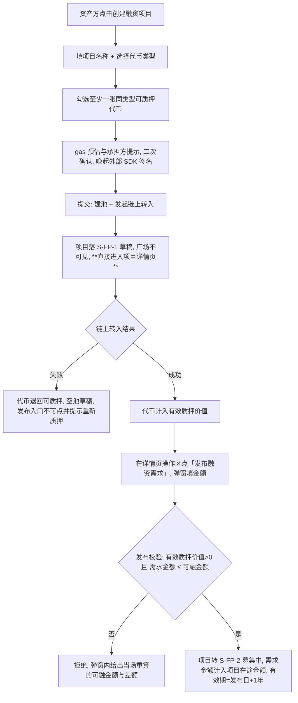
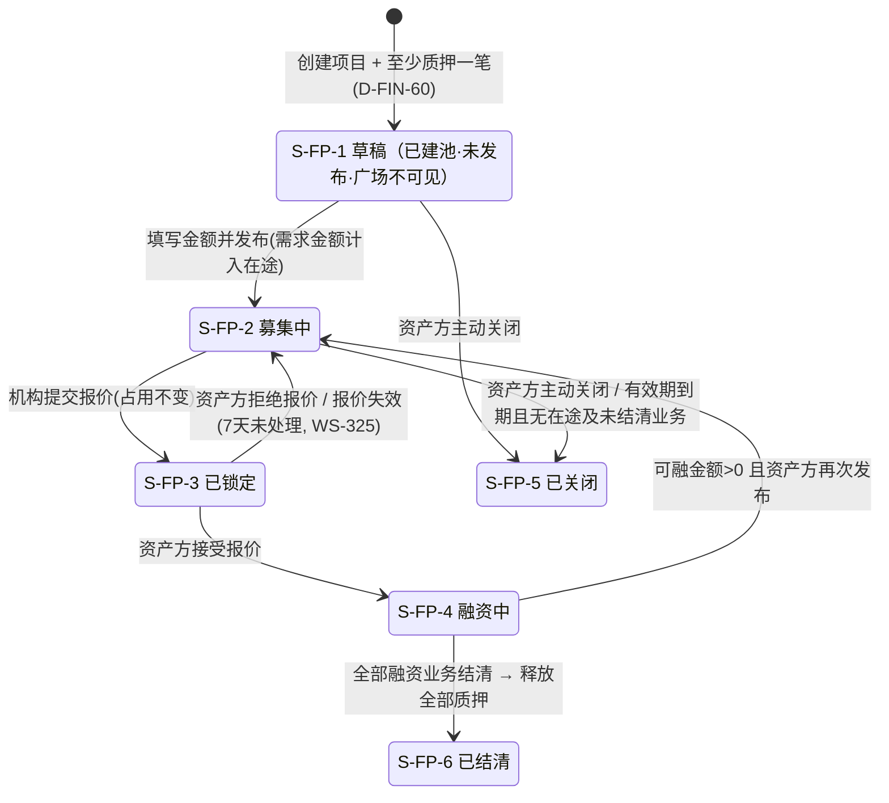
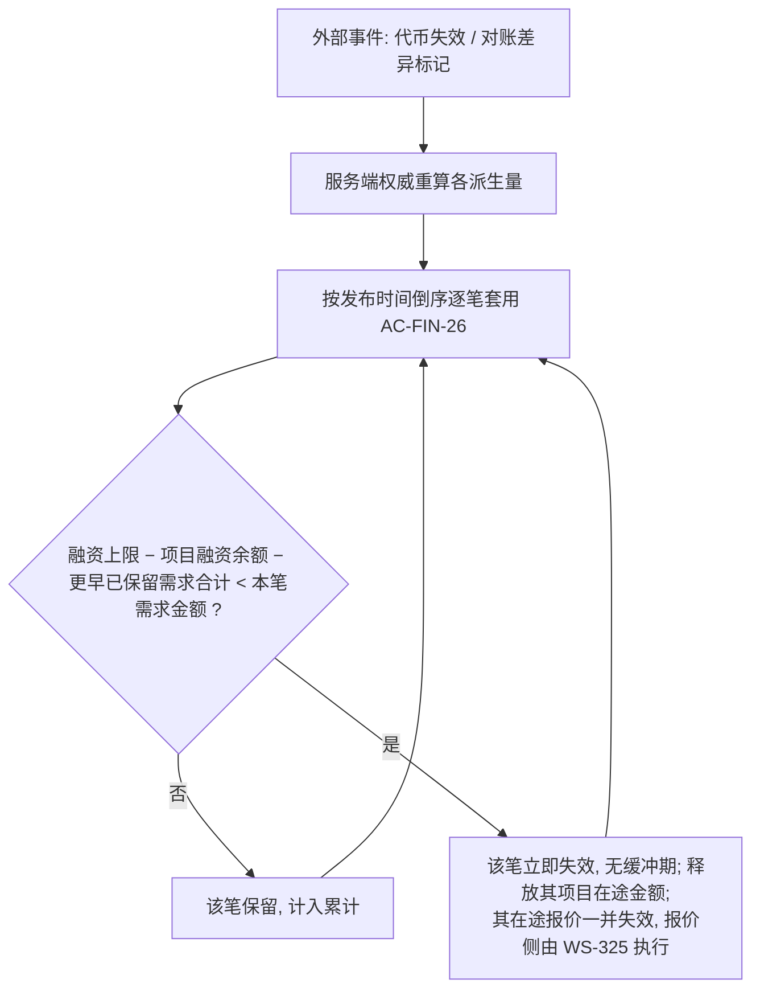
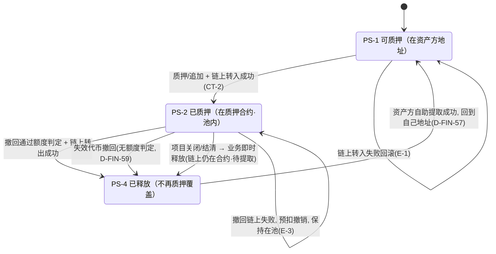

# 金融服务平台 · 金融服务端 · 借贷广场 — 融资需求与代币质押 PRD **V9.3**

> **版本指针（本册权威，下游按此跟版）**：本模块当前 **V9.3**（主册与分册同版），**下游 WS-325／326／327／328／329 引用 WS-324 时一律写 V9.3**；本册对齐的邻接版本是 **WS-325 V7.2 / WS-326 V3.2 / WS-327 V3.3**（`cly-V1.0.0`）。**V9.3 变更**：① 分册 8.1 的 5 个推送位**定名 `biz_type`**（6 个取值，分册 8.1.1）——此前无名字、在 WS-329 登记表里无行可落，这 5 类消息实际发不出去；② 回填分册 7.6 中英对照（取 WS-328 已产出的词，只收录不重译）；③ 分册 6.9.1 补「已放款需求在项目终态后对外状态不变」；④ 本条版本指针。**业务规则一条未改。** V9.2 变更：旧展示名清零（第三环「报价确认」、第四环「放款确认」）。

> **本模块为两册**（编号连续、同一编号只在一处定义）：
>
> | 文件 | 内容 | 读者 |
> | --- | --- | --- |
> | `v1.0-借贷广场-融资需求与代币质押-PRD.md`（本册） | 第 1～5 章、6.1～6.5、第 11 章：背景与范围、角色与场景、流程与状态机、口径与公式、功能清单、模块详情与页面、开放项与遗留 | 需求方、设计、实现 |
> | [`01-对外契约与数据字典.md`](01-对外契约与数据字典.md) | 6.6～6.9、第 7～11 章：深链契约、链上质押的产品要求与失败文案、异常分支、**融资流程四环节的承载契约与环节映射**、数据与字段（含两张清单的逐列口径、术语对照）、非功能、指标、依赖与风险、**验收标准汇总**、修订请求 | 我的控制台（M-5）、WS-325～WS-327、实现方、测试 |

## 1. 文档信息

| 项 | 内容 |
| --- | --- |
| 对应需求 | WS-324「借贷广场 · 融资需求与代币质押（PRD + 原型）」 |
| 所属平台 / 端 | 金融服务平台 · **金融服务端**（面客） |
| 模块定位 | 借贷广场第一段（WS-323 简报第 11 章 **M-1**） |
| 上游输入 | 《需求诊断简报 V6.0 定稿版》《附册 · 融资全生命周期 V5.0》（WS-323）；需求方 2026-09-11 七轮裁定 + **09-14 07:45 九条**（详见 5.1 ⑯）；原轮次（03:05 七条、03:39 八条、06:27 四条、07:01 六条、07:27 四条 · 链上范围纠正、WS-325 08:17 四条、**WS-325 08:51 失效判据与"直接失效"**） |
| 依赖文档 | WS-312《代币合约 PRD》、WS-318《资产清单与代币签发 PRD》、WS-313《可信数据同步 PRD》、WS-308『01-国际化基线.md』 |
| 编写人 | 许楚清（需求分析师） |
| 文档状态 | **V9.1**（V9.1 只补一行链范围常量：本期只支持 ETH，口径主体引用 WS-326 主册 5.6，见 5.1 第 ⑱ 行）（无开放项）（第 12 章仅余外部事项，非本模块待定） |
| 编号空间 | 沿用上游：`D-FIN-*`（33 起）/ `AC-FIN-*`（11 起）/ `Q-FIN-*` / `D-LS-*`（10 起）/ `AC-LS-*`（02 起）/ `P-LS-*`；本模块新增 `F-LS-*`、`H-*`、`FP-*`/`PL-*`。**不回收作废号**，作废清单见 12.2 |

---

## 2. 背景与目标

### 2.1 背景

资产方在资产平台完成应收账款确权、由运营端按 WS-318 签发代币后，代币直接进入该资产方的数币地址（**平台不托管**）。此时代币只是一张"已确权债权的凭证"，没有变现通道。借贷广场是融资需求的公开撮合场所，也是融资全生命周期八个业务动作的**唯一执行场所**。本模块是这条链路的第一段。

**心智模型（需求方 2026-09-11 03:39）**：**企业创建的每个融资项目就是一个资产池**——资产方往池里质押代币，平台算出池内资产价值，资金方看到的是"池内资产 + 融资信息"；借贷广场公开展示平台上所有入驻资产方创建的融资项目。

**额度模型（需求方 2026-09-11 06:27 + 07:01）**：池内资产撑起一个**可用额度**，额度被两类东西消耗——**已发生的债务**（项目融资余额）与**在途的占用**（发布融资需求时占用，报价环节不再新增）。**冻结的是额度，不是代币**：代币不会因为有人报价而被逐张锁死，池子始终是活的，能不能撤回由额度算式说了算。

### 2.2 本期目标

| # | 目标 | 达成口径 |
| --- | --- | --- |
| G-1 | 资产方能独立完成"建池 → 质押 → 填金额 → 发布"全过程 | 两段式（6.1），中途离开可续做 |
| G-2 | 各派生量在任何入口读到的都是同一个数 | 前端预览 + 服务端权威重算（`AC-FIN-06`） |
| G-3 | 抵押物充足性在任何时刻可判定、可追溯 | 全平台只有一套校验口径（4.3 `INV-FIN-01`），撤回、报价、放款、覆盖不足提醒全部挂在它上面 |
| G-4 | 质押是**链上事实**而不是账面标记 | 代币转入质押合约成功后才计入质押价值（`D-FIN-40`）；调用约定与缺口见分册 6.7 |
| G-5 | 资金方在一个页面内看全"池内资产 + 融资信息"，包括质押覆盖是否充足 | P-LS-02 分区按资金方决策路径（6.5.2）+ 质押覆盖状态公开（`D-FIN-56`） |
| G-6 | 游客不登录即可看完整的融资需求信息 | L1～L5 全量可见，操作入口 `⊘`（`D-LS-04`/`AC-LS-01`） |
| G-7 | 控制台（M-5）与后续环节（M-2～M-4）有稳定的对接契约 | 深链契约 H-01～H-05（分册 6.6） |

### 2.3 范围（含）

- 融资项目（资产池）的**创建（含首笔质押）**、**发布**、再次发布、主动关闭、到期处理
- **融资项目有效期**：发布时由系统按固定 1 年生成，不可编辑
- 代币质押：可质押代币筛选、质押入池、追加、**按额度判定的撤回**、释放与**自助提取**、转入/转出质押合约及失败回滚
- **在途额度占用**（唯一来源为发布占用）与覆盖充足性判定、**覆盖不足提醒**；**链上 gas 由资产方承担、平台不收费**的产品形态
- 派生量：池内资产总额、有效质押价值、融资上限、项目在途金额、可融金额、可撤回上限
- 页面：P-LS-01 借贷广场首页（需求列表）、P-LS-02 融资需求详情（统计区 + 两张清单 + 三段式操作区）、P-LS-03 创建融资项目
- 游客全量可见（L1～L5）与操作入口 `⊘` 的落地
- 对外契约：深链协议 H-01～H-05、**链上质押的调用说明与产品要求**（分册 6.7）

### 2.4 范围（不含）

| 编号 | 本期不做 | 归属 |
| --- | --- | --- |
| `X-LS-01` | 授信核定、报价、接受/拒绝报价及之后的全部环节 | WS-325（M-2）及之后 |
| `X-LS-02` | 我的控制台的页面与只读视图 | M-5 |
| `X-LS-03` | 代币的签发与代币自身字段 | WS-318（已定稿） |
| `X-MC-11` | 质押率的配置界面与差异化 | 本期硬编码 80% |
| `X-MC-08` | 逾期或失效后的质押处置 / 代币变现 / 清算 | 无承接模块（12.3） |
| `X-LS-04` | 质押代币的部分数量拆分 | 需求方裁定本期不做 |
| `X-LS-05` | 融资项目有效期的编辑、延期、提前终止 | 固定 1 年、不可编辑 |
| `X-LS-06` | **提前还款** | 本期不提供，还本金发生在融资项目到期后 |
| `X-LS-07` | **代币级的冻结、锁定、占用对应关系** | 冻结在额度层（`D-FIN-50`） |
| `X-LS-08` | **多个融资需求并发产生的在途额度** | 本期串行承载一笔，公式按通用形态写、简化只体现在取值上（`AC-FIN-24`） |
| `X-LS-09` | 平台对质押/撤回/提取**收取任何服务费**，以及平台代付 gas | gas 是链收的，平台不收费 |
| `X-LS-11` | **链上持仓查询与对账** | 需求方 2026-09-11 07:27：**后台自动进行**，不在本模块实现。本模块只消费其差异标记 |
| `X-LS-12` | **质押合约本身的设计、部署、接口、参数与权限模型；钱包连接组件** | 合约由开发负责（本 PRD 只说明"质押与解除质押需调用质押合约"以及本模块对这次调用的产品要求，分册 6.7）；签名与付费由页面**唤起外部 SDK 服务**完成，资产方侧已有该能力（`D-FIN-71`） |
| ~~`X-LS-10`~~ | ~~恶意锁仓的防范机制~~ | **作废**：需求方在 WS-325 08:17 裁定**报价 7 天未处理自动失效**，该风险已被收敛（分册 10.3） |
| `X-LS-14` | **报价对象自身的状态流转与 `授信占用额` 的释放** | 需求失效时报价一并失效（`D-FIN-75`），但报价的状态机与机构维度额度的释放由 **WS-325** 执行；本模块只输出"需求已失效"这一事实与项目维度的释放 |

### 2.5 上游口径声明（**原样保留，不得删改**）

> 本模块的质押能力与游客可见度口径以 WS-323 V6.0 简报为准；WS-318 `AC-TI-49`、WS-311 权限矩阵与跨功能约束 `X-2` 的相应条款待后续同步修订。

### 2.6 四条不可削弱的红线

| 编号 | 红线 |
| --- | --- |
| `D-MC-110`/`D-MC-111` | 质押率本期为**硬编码常量 80%**。页面**可以展示**这个数（6.5.4），但**不得以任何形式暗示可调**：无输入框、无下拉、无滑块、无"调整/设置质押率"入口与文案 |
| `D-FIN-06` | 术语一律用 **`项目融资余额`**，PRD、界面、字段、提示文案中**不得出现无限定词的"融资余额"**；**同一个量也不得有两个名字**（据此有 `D-FIN-58`、`D-LS-12` 两条术语合并条款） |
| `AC-FIN-06` | 派生量前端可即时预览，**提交时一律由服务端权威重算并校验**，不一致以服务端为准 |
| `D-LS-09` | **游客全量可见 ≠ 取消服务端过滤**。跨主体隔离、归属过滤、动作鉴权三类服务端校验全部继续成立 |

---

## 3. 用户与场景

### 3.1 角色

| 角色 | 在本模块的诉求 | 权限口径 |
| --- | --- | --- |
| **游客（未登录）** | 看市场上有哪些资产池、池里是什么抵押物、要融多少钱、质押覆盖是否充足 | L1～L5 全量可见；全部操作入口 `⊘` |
| **资产方（登录）** | 把代币变成可融资的额度，公开发布需求；随时能撤回额度允许范围内的代币 | 创建/发布/关闭项目、质押/追加/撤回/提取代币、承担 gas |
| **资金方（登录）** | 浏览资产池、评估质押覆盖是否充足，决定是否报价；作为债权人持续掌握覆盖状况 | 本模块内只读（报价在 WS-325）；覆盖不足提醒对其可见 |
| **平台运营** | 本模块内无业务动作；接收链上失败、对账不一致、覆盖不足三类异常待办 | 无面客写入口 |

> 同一企业主体下的**任一登录员工均可代表企业执行上表全部动作**，本期不做企业内「查看 / 操作」分级（`D-MC-105`/`AC-MC-16`）。不要在验收用例里留"若分级则……"的分支。

### 3.2 用户故事

| 编号 | 故事 | 验收落点 |
| --- | --- | --- |
| `US-01` | 作为资产方，我想先把代币质押进一个资产池把池子建起来，金额想好了再填再发布 | `F-LS-01`/`F-LS-02`、6.1 |
| `US-02` | 作为资产方，我想实时看到池子值多少、能融多少 | `F-LS-07`、`AC-FIN-06` |
| `US-03`/`US-04` | 作为资产方，**只要质押覆盖仍然够，我就该能把多余的代币撤回来**（不因一笔在途报价被整池锁死，`AC-FIN-13`）；已经失效的代币想随时清出池子，它反正也不顶用（`D-FIN-59`） | `F-LS-06` |
| `US-05`/`US-06` | 作为资产方，我想提前知道这一步要花多少 gas、失败了钱扣没扣、重试要不要再花（`F-LS-14`、`D-FIN-46`）；作为资金方，我想在报价前和放款后都能看到这个池的质押覆盖是否充足（6.4.1、`D-FIN-56`） | 见左 |
| `US-07` | 作为游客，我不登录也想看清楚需求金额、抵押物明细和商务条款 | `F-LS-10`、`D-LS-04` |
| `US-08` | 作为资产方，我在控制台点一下就能跳到广场对应位置继续操作 | 分册 6.6 |

### 3.3 典型场景

- **S1 建池与发布**：新建项目 → 填项目名、选代币类型 → 勾选 3 张同类型代币质押（共 100 万 USD）→ 确认 gas → 链上成功 → 项目落 `S-FP-1 草稿`（广场不可见）并**直达详情页** → 在操作区点「发布融资需求」填 50 万 → **项目在途金额 = 50 万**，可融金额 = 80 − 0 − 50 = 30 万，项目转 `S-FP-2 募集中`。机构随后报价 50 万时**项目在途金额仍是 50 万**（占用只有发布这一个来源），可融金额仍是 30 万。
- **S4 撤回还有空间**：承 S1，可撤回上限 = 可融金额 ÷ 80% = 37.5 万。撤回 30 万的代币后池值 70 万、融资上限 56 万 ≥ 0 + 50 万，**允许**；再想撤 10 万被拒，提示"最多还可撤回 7.5 万 USD"。
- **S5 失效代币**：池内一张 10 万的代币因底层应收账款失效 → 它**本来就不计入**有效质押价值，撤回**不做任何额度判定**，直接放行。
- **S6 覆盖不足提醒**：项目已放款 50 万（项目融资余额 50 万），随后两张代币失效，有效质押价值跌到 60 万 → 融资上限 48 万 < 50 万 → **触发覆盖不足提醒**，缺口 2 万，广场与双方页面同时可见，资产方收到"需追加 2.5 万 USD 资产"的指引。
- **S7 释放与提取**：项目结清 → 平台即时解除全部占用与质押占用关系，代币置「已释放 · 待提取」→ 资产方自行发起提取、自付 gas，可批量一次提完。

---

## 4. 流程说明

### 4.1 建池与发布（V8.0：创建成功直达详情页）



### 4.2 撤回质押的判定流程（`AC-FIN-13` 视角 C）

三步，顺序不可换：① **先看代币是否已失效**——已失效的**不做任何额度判定，直接放行**（`D-FIN-59`）；② 未失效的，由服务端权威重算 `可撤回上限 = 可融金额 ÷ 质押率`，拟撤回价值合计超过它即拒绝，并给出三个数（`AC-LS-37`）；③ 通过后发起链上转出，**处理中即按保守口径预扣**该部分价值（`D-FIN-54` ②），链上成功则移出池、失败则预扣撤销并保持在池（分册 6.8 `E-3`）。

### 4.3 融资项目状态机（承接 `S-FP-*`，一套跨模块共用）



| 编号 | 条款 |
| --- | --- |
| `D-FIN-63`（**新**） | **前段不新增状态**：`S-FP-1 草稿` 的语义收紧为"**已建池、已有至少一笔质押、尚未发布**"。理由：状态机跨模块共用（`D-FIN-28`），每多一个状态，控制台、WS-325～M-4 的枚举与文案映射都要跟着改；而"已建池未发布"与"草稿"在业务上本就是同一件事，用进度（是否已填金额）表达即可，不必升格为状态 |
| `D-FIN-64`（**新**） | **草稿项目不进广场**（承接 `AC-LS-05`）：不进列表、不可搜索、他人与游客深链直达返回"内容不存在或无权访问"，**不暴露该项目是否存在**。理由：未发布意味着资产方还没有对外要约的意思表示，提前曝光等于替他做决定；且草稿期金额未定，展示出去也无从判断 |
| `D-FIN-33` | **一个融资项目可串行承载多笔融资业务，不能并发**：同一时刻至多一笔在途融资业务；只有 `S-FP-2 募集中` 接受新报价 |
| `D-FIN-37` | **有效期 = 首次发布日 + 1 年**，系统生成、只读、不可编辑、不可延期；再次发布**不重置** |
| `D-FIN-43` | **到期两分支**：① 到期且无在途、无未结清业务 → 转 `S-FP-5`，释放全部质押；② 到期但存在在途或未结清业务 → **项目不关闭**，打「已到期 · 存量处理中」并行标记，停止接受新报价、不允许再次发布，存量走完后转 `S-FP-6` 并释放质押 |
| `D-FIN-47` | **分支②是常态路径**：本期无提前还款、还本发生在项目到期后，凡成交项目几乎必然经过这一段。该标记**必须按正常状态呈现**（中性样式 + "存量融资业务照常履约中"），**不得做成告警或红色警示** |

### 4.4 融资需求因覆盖不足自动失效（WS-325 08:17 裁定 2 + 08:51 口径细化）

`INV-FIN-01` 可能被**外部事件被动打破**——最常见的是池内代币因底层应收账款到期而失效（`D-FIN-59`），与资产方的任何操作无关。此前 PRD 只有"覆盖不足时禁止报价与放款"的闸门，没有回答**已经发布出去的融资需求怎么收场**。本节补上。

> **需求方 2026-09-11 08:51 原话**：「这里失效指的是**池内资产 − 融资余额小于本次融资需求额度**；**需求直接失效**；报价时也要进行判断，因为中间节点也可能存在失效的代币。」其中"池内资产"沿用需求方一贯用法，指**已乘质押率的 `融资上限`**（其最早给本模块的第 1 条即写作"池内有效质押代币（代币金额 × 质押率）"）。末句"报价时也要判断"本 PRD **早已覆盖**——`AC-FIN-12` 视角 B 要求每次新增占用都用服务端权威重算后的数值校验，不吃任何缓存；本轮只把判据形状与失效侧对齐。



| 编号 | 条款 |
| --- | --- |
| `D-FIN-72`【触发与时机】 | 收到代币失效、对账差异等外部事件后，服务端**先完成权威重算**（`AC-FIN-17` 已含该触发点；代币失效本身由 WS-318 按日判定），**再用重算后的数值逐笔判定**。顺序不可颠倒——用重算前的陈旧值判定会同时造成误杀与漏杀。**判定即失效，不设缓冲期**（需求方 08:51：「需求直接失效」），代价见分册 `R-LS-12` |
| `D-FIN-73`【粒度与顺序】 | **最小必要失效 + 按发布时间倒序**：逐笔套用 `AC-FIN-26`，**每作废一笔即重算**，直到**剩余需求全部满足判据**为止。顺序取**后发布的先失效**——后发布的那笔是最后占用额度的，撤销它等于回到它发布之前的状态，最可解释、也最符合"先到先得"的直觉。**否决两个替代方案**：「全部失效」是惩罚性的（缺口可能只差一点，却作废全部要约，资产方要重走发布、机构要重新报价）；「按金额从大到小失效」虽然作废笔数最少，但让"谁被作废"与"谁先来"无关，资产方无法预期。**停止条件**：若已无需求可作废而判据仍不成立（说明已放款的债务本身超了质押覆盖），**停止动作**、项目留在覆盖不足提醒档走催追加，不得空转找失效对象（`AC-LS-78`）。**本期取值**：串行承载一笔（`D-FIN-33`）⇒ 至多一笔需求，顺序与累计在本期不产生分歧，但规则按通用形态写（同 `AC-FIN-24`） |
| ~~`D-FIN-74`~~【缓冲期】 | **作废**（需求方 08:51「需求直接失效」）。原 3 个自然日缓冲期、期内"允许追加质押 / 主动撤下、禁止新增占用"的整套规则一并取消；**判定成立即失效，资产方没有自救窗口**。放弃了什么、为什么当初要缓冲，如实记在分册 `R-LS-12`，将来要恢复时理由与参数都在那里 |
| `D-FIN-75`【在途报价一并失效】 | 需求失效时，**其上的在途报价一并失效**。理由：覆盖已经不足，保住报价等于保住一笔池内价值撑不起的要约；且 `AC-FIN-12` 本来就禁止在覆盖不足时放款，保住它只会让业务卡在"能接受、不能放款"的死状态；需求是报价的载体（`D-FIN-02`），载体作废则报价无所依附。**跨模块边界**：本模块负责"需求失效"这一事实与 `项目在途金额` 的释放；**报价自身的状态流转与 `授信占用额`（机构 × 资产方）的释放由 WS-325 执行**（`X-LS-14`）。两者必须在**同一事件内**完成，不得出现"需求已失效、报价还在"的中间态被用户看到 |
| `D-FIN-76`【释放、复发布与状态落点】 | ① **失效即释放**该需求占用的 `项目在途金额`（承接 `AC-FIN-23`）；该路径与 `AC-FIN-25`「在途 → 余额」的原子转移**互斥不重叠**：同一笔金额要么转成债务、要么随需求作废消失。② **失效后可以重新发布**——失效是这一笔要约作废，不是惩罚；待判据重新成立（追加质押或还款降低余额）即可再次发布。③ **不新增任何状态**：需求本就不是独立对象（`D-LS-11`），项目按既有路径回落——无其他在途/未结清业务则回到"已建池未发布"的草稿语义（`D-FIN-63`），有存量业务则停留 `S-FP-4`；只在项目上记一个**本轮需求终结原因**（`FP-27`）的新枚举值 `自动失效 · 覆盖不足` |

---

## 5. 业务对象与核心口径

### 5.1 需求方四轮裁定的口径落点

| # | 裁定 | 落点 |
| --- | --- | --- |
| ①～⑨（03:05～07:01 四轮，均已落地） | 质押价值口径、防止多家无效报价、串行承载多笔、冻结即在途额度、失效代币解除无限制、覆盖不足提醒、gas 自付、创建时至少质押一笔 + 金额后补、页面展示三个数 | `D-FIN-08`／`D-FIN-33`／`D-FIN-58`+`AC-FIN-23`／`D-FIN-59`+`AC-FIN-13`／`D-FIN-55`+`D-FIN-56`／`D-FIN-46`+`D-FIN-57`／`D-FIN-60`～`D-FIN-64`／6.5.4（**V8.0 改为统计区五数**） |
| ⑩～⑭（WS-325 08:17） | 报价 7 天失效（`X-LS-10` 作废）、需求因覆盖不足自动失效、通知走 WS-329、授信企业维度（本模块无表述、不动） | 分册 10.3／4.4／分册 8.1／裁定表留痕 |
| ⑮（WS-325 08:51） | 「失效指的是池内资产 − 融资余额小于本次融资需求额度；需求直接失效」 | **逐笔判据** `AC-FIN-26` + **判定即失效**（`D-FIN-74` 作废），代价见分册 `R-LS-12` |
| ⑯（09-14 07:45 九条） | 广场改名、质押覆盖状态改名、统计区替代三数与额度尺、两张清单字段与分页、非登录态只留「立即登录」、创建即直达详情页、代币类型选择、操作区三段重构、原型默认英文 | 2.1／5.3.1 **命名开放项**／6.5.4 + `AC-LS-53`/`AC-LS-84`／分册 7.5／6.5.6／6.5.3／`D-FIN-77`／6.5.5 + 分册 6.9／6.5.7 + 分册 7.6 |
| **⑰（09-14 · 本版 V9.0）** | 质押覆盖状态定名（不含旧词根）、融资需求对外状态五值 | 5.3.1 `D-LS-17` 定稿 + 全文替换／`D-LS-18`/`D-LS-19` + 分册 6.9.1 映射 |
| **⑱（09-15 · 本版 V9.1）** | **链收敛：本期只支持 ETH** | 分册 7.3 常量表补一行，**口径主体引用 WS-326 主册 5.6，本册不重述**；质押与 gas 条款不受影响（它们说的是"链上操作"，与"哪条链"是两回事） |

> **质押率一律参与比较**（需求方 2026-09-11 确认）：所有覆盖充足性判断的比较对象都是打完 80% 的 `融资上限`，不是原始资产额。不打折会与提醒线自相冲突——若允许撤到"池内原值刚好等于余额"，此时融资上限已低于余额，项目当场落入覆盖不足提醒区。**表中「」内为需求方原话引用**，其中的"融资余额""冻结额度""有效代币资产"等说法**不作为本 PRD 的术语使用**，正式术语以 5.2 为准。

### 5.2 对象模型与术语

```
融资项目 FinancingProject ＝ 资产池（资产方创建，创建时至少一笔质押）
  ├── 质押记录 Pledge[]（一条 = 一张代币在一个项目中的一次有效质押）
  ├── 派生量：池内资产总额 / 有效质押价值 / 融资上限 / 项目在途金额 / 可融金额 / 可撤回上限
  └── 融资业务 FinancingDeal[]（串行承载多笔，本模块只读引用，写在 WS-325 及之后）
```

| 编号 | 术语红线 |
| --- | --- |
| **`D-LS-11`** | **「融资项目」=「资产池」=「广场上的一条融资需求」，三个说法指同一个对象**：同一个编号、同一套状态机、同一个深链锚点，**不得派生出第二个对象、第二套编号或第二套状态**（承接 `D-FIN-02`）。界面允许按语境换称呼——资产方侧与控制台称「融资项目」，广场公开展示称「融资需求」，池内资产区块称「资产池」 |
| **`D-FIN-58`** | 需求方的"冻结金额 / 在途额度"与附册的"待确认融资金额"**不是同一个量**（5.2.1），本模块统一为 **`项目在途金额`**。**PRD、界面、字段中不再出现"冻结金额""冻结额度""在途额度""待确认融资金额"这四个说法** |
| **`D-LS-12`（新）** | **需求方口语与本 PRD 术语的映射钉死，不新造第四个词**：「代币资产」→ 视语境为 `池内资产总额`（账面、含失效）或 `有效质押价值`（参与计算、排除失效）；「**有效代币资产**」→ **`融资上限`**（= 有效质押价值 × 80%）。**界面标签一律使用本 PRD 术语**，不得出现"有效代币资产"这一称呼 |

| 术语 | 口径 | 红线 |
| --- | --- | --- |
| **池内资产总额** | Σ(池内全部代币的 `D-TI-18`)，**含已失效代币**，仅用于展示"池子里有多少张、账面多少钱" | 不参与任何校验 |
| **有效质押价值** | Σ(池内代币的 `D-TI-18`)，需同时满足：① 链上转入成功（`CT-2`）；② **底层应收账款未失效**；③ 未处于对账差异或撤回预扣（`D-FIN-54`） | **一切校验只认这个数** |
| **融资上限** | 有效质押价值 × 质押率；**质押率本期为硬编码常量 80%** | 可展示、不得暗示可调 |
| **项目融资余额** | 该项目下状态为「已确认（还款中）」「已到期」「逾期」的融资业务未偿本金合计（`AC-FIN-03`） | 不得简写为"融资余额" |
| **项目在途金额** | Σ(本项目下**已发布且未终结**的融资需求金额)。**唯一来源是发布占用**，报价环节不新增占用项（`AC-FIN-23`） | 唯一名称（`D-FIN-58`） |
| **可融金额** | `max(0, 融资上限 − 项目融资余额 − 项目在途金额)` | 为负按 0 展示 |
| **可撤回上限** | `可融金额 ÷ 质押率`（`AC-FIN-22`） | 仅对未失效代币适用 |
| **融资需求金额** | 资产方本次公开发布、希望融到的金额（USD） | 本期报价金额必须等于它（`D-FIN-19`） |

#### 5.2.1 「冻结额度」与附册「待确认融资金额」的核对结论

**不是同一个量。** 附册 `AC-FIN-04` 从**机构提交报价**起算、只含融资业务金额；需求方的冻结额度从**资产方发布融资需求**起算（其原例"质押 100 万、发布 50 万、冻结 50 万"时一笔报价都还没有），且 2026-09-11 07:01 进一步收敛为"**报价与发布占用是同一个，统一以发布占用为准**"。

| 维度 | 附册 `AC-FIN-04` | 本 PRD `项目在途金额` |
| --- | --- | --- |
| 起点 | 机构提交报价 | **资产方发布融资需求** |
| 来源 | 融资业务金额 | **只有发布占用一个来源**；报价不新增 |
| 终点 | 放款确认完成或业务终结 | 同左（`AC-FIN-25` 精确化：**放款并经资产方放款确认后**才转入项目融资余额） |

按旧口径，发布到报价之间占用为 0，**同一份质押可以被连发两笔吃满额度的需求**——`AC-FIN-04` 的立意本是防重复占用，却漏了这个口子。修订请求见 12.4。

### 5.3 唯一的一套额度口径（**不存在第二套公式**）

| 编号 | 条款 |
| --- | --- |
| **`INV-FIN-01`【唯一口径】** | **融资上限 − 项目融资余额 − 项目在途金额 ≥ 0**，即 **有效质押价值 × 80% ≥ 项目融资余额 + 项目在途金额**。任何时刻必须成立；不成立即禁止一切增加占用的动作 |
| `AC-FIN-11` | **视角 A · 展示**：`可融金额 = max(0, 融资上限 − 项目融资余额 − 项目在途金额)` |
| `AC-FIN-12` | **视角 B · 准入**：新增占用（发布需求、机构报价、放款）校验 `可融金额 ≥ 本次金额`。报价与放款时该笔金额已在在途，故其校验式即"`INV-FIN-01` 当前是否成立"——对报价即等价于 `AC-FIN-26` 的逐笔判据。**每次校验都必须用服务端当场重算的数值**（`AC-FIN-06`），不吃缓存：需求方 08:51「报价时也要进行判断，因为中间节点也可能存在失效的代币」说的就是这一点 |
| `AC-FIN-13` | **视角 C · 撤回**：按撤回后的池重算——`(有效质押价值 − 拟撤回代币价值) × 80% ≥ 项目融资余额 + 项目在途金额`。**已失效代币不参与本判定**（`D-FIN-59`） |
| `AC-FIN-22` | **可撤回上限 = 可融金额 ÷ 质押率**。推导：`(V − w) × r ≥ B + P ⟺ w ≤ (V×r − B − P)/r = 可融金额 ÷ r`。**不是第二条公式，是 `AC-FIN-13` 的代数变形**，用途是把"能不能撤"翻译成用户看得懂的一个数 |
| `AC-FIN-23`（**V4.0 收紧**） | **`项目在途金额` 只有"发布占用"一个来源**：融资需求发布成功时按需求金额产生占用；**报价环节不新增任何占用项**（报价只是把该需求置为"已被报价"，金额不变）；报价被拒绝或失效后占用照旧（需求还挂着）；需求撤下、项目关闭/到期关闭时释放；放款确认完成时按 `AC-FIN-25` 转入项目融资余额 |
| `AC-FIN-26`（**新** · 视角 D · 失效） | **逐笔需求的失效判据**：按发布时间正序累计已保留的需求金额，对每一笔检验 `融资上限 − 项目融资余额 − 更早已保留需求金额合计 < 本笔需求金额` ⇒ **该笔失效**（需求方 08:51 口径）。**这不是第二套公式，是 `INV-FIN-01` 的逐笔视角**：把不变式右边的 `项目在途金额` 拆成逐笔累计后，"某笔放不下"与"不变式被破坏"是同一件事。**为什么要带累计项**：需求方原话是单笔口径，本期串行承载一笔（`D-FIN-33`）时两者完全等价；但若将来支持多笔并发，"每笔各自独立判"会出现**每笔都过、合计超池**的真空（两笔各 50、余量 60，逐笔都过而合计 100 > 60），那正是本条裁定要堵的那类真空。故按累计形态写死，本期取值与原话一致 |
| `AC-FIN-24` | **按通用形态定义（可容纳多笔并发在途），本期取值简化**：串行承载一笔 ⇒ 本期该值恒等于"当前那一笔已发布未终结需求的金额"或 0。**简化只写在"本期取值"说明里，不得写进公式本身**（`X-LS-08`） |
| `AC-FIN-25` | **额度在两个池子之间的转移必须原子、无空档**：放款确认完成的同一时刻，该笔金额从 `项目在途金额` 移出、计入 `项目融资余额`；业务终止/拒绝时从在途移出且不进余额。**任何时刻一笔钱只能被计入其中一个，且不得两边都不计** |
| `AC-FIN-14` | 各派生量与校验**单位统一为 USD**（`D-FIN-13`），界面须标注币种 |
| `AC-FIN-15` | 上述各条**只有服务端一个权威实现**；前端预览与控制台展示消费同一来源（`AC-MC-12`） |
| `AC-FIN-20` | **冻结/占用不参与质押价值的计算**：占用只出现在不等式右边，绝不从有效质押价值里扣减。若把占用当作"扣减池值"，会同时减分子不减分母，`INV-FIN-01` 立刻假性不成立 |

#### 5.3.1 三档质押覆盖状态（**V9.0 定稿，`D-LS-17` 关闭**）

> **`D-LS-17`【已定稿】**：V8.0 及以前的旧叫法不贴切——这个状态描述的是**池内质押代币价值与当前融资价值的比较关系**。本版直接定名；按需求方 09-14 的硬约束，**新名称与三个取值均不沿用旧词根**，旧的"不足预警"说法一并废止，全文（正文、字段名、枚举值、文案示意）已扫净、零残留。
>
> **候选与结论**：**A（采用）质押覆盖状态 / Pledge Coverage Status**，三档 `覆盖有余 Ample`／`覆盖持平 At Capacity`／`覆盖不足 Insufficient`——"覆盖"自带比较关系，谁覆盖谁一目了然，三档同词根可平行阅读，缺口字段顺势叫 `覆盖缺口 Coverage Gap`，整套词自洽。**B 质押覆盖率状态**否决：叫"率"就该展示比值，而统计区只有 5 个数、不展示比值（6.5.4），名实不符。**C 质押与融资比状态**否决：意思对但拗口，做不成短标签、中文列头会折行。
> **另一处名实对齐**：旧的「不足**预警**」改为「覆盖不足**提醒**」——V7.0 起判定即失效、没有缓冲期，它已经不是能救回需求的覆盖不足提醒，而是事后告知（`R-LS-12`），叫"提醒"更准。**只改名称，判据、阈值、三档划分逻辑一律未动。**

| 档 | 判据 | 含义 | 系统行为 |
| --- | --- | --- | --- |
| **① 覆盖有余** | `INV-FIN-01` 成立且可融金额 > 0 | 还有额度可用 | 正常展示与操作 |
| **② 覆盖持平** | `INV-FIN-01` 成立但可融金额 = 0 | **已借的被池子完全覆盖，但不能再借** | 报价/发布入口不可点并说明原因；可撤回上限为 0；**不提醒** |
| **③ 覆盖不足** | `融资上限 < 项目融资余额` | **已发生的债务本身没有被池内价值覆盖住** | 覆盖不足提醒（6.4.1）+ 禁止一切新增占用 + 运营待办 |

| 编号 | 条款 |
| `D-FIN-55` | **提醒线与准入闸门不是同一条线，提醒不是闸门的可视化。** 闸门比较 `项目融资余额 + 项目在途金额`（管"还能不能借"）；提醒只比较 `项目融资余额`（管"已借的还被覆盖得住吗"）。数学上档③ ⊂ 档②，但业务含义、受众与处置动作完全不同，**必须分别定义、分别呈现** |

---

## 6. 功能清单与模块详情

### 6.0 功能清单

| 编号 | 模块 | 功能点 | 验收口径 |
| --- | --- | --- | --- |
| `F-LS-01` | 融资项目 | **创建资产池**（项目名 + 至少一笔质押） | `D-FIN-60`、`AC-LS-54` |
| `F-LS-02` | 融资项目 | **发布融资需求**（填金额 + 发布，发布即占用） | `D-FIN-61`、`AC-FIN-23` |
| `F-LS-03` | 融资项目 | 再次发布 / 主动关闭 / 到期处理 | `D-FIN-33`、`D-FIN-43`、`D-FIN-47` |
| `F-LS-04` | 代币质押 | 可质押代币清单与筛选 | `D-FIN-38` |
| `F-LS-05` | 代币质押 | 追加质押（任何项目状态均允许，只增不减） | `D-FIN-48` |
| `F-LS-06` | 代币质押 | **按额度判定的撤回**（失效代币无限制） | `AC-FIN-13`、`AC-FIN-22`、`D-FIN-59` |
| `F-LS-07` | 派生量 | 六个派生量的前端预览与服务端权威重算 | `AC-FIN-06`、`AC-FIN-15` |
| `F-LS-08` | 链上 | 调用质押合约完成转入 / 转出、**唤起外部 SDK 完成签名与付费**、失败回滚与重试 | `D-FIN-36`、`D-FIN-71`、分册 6.7 |
| `F-LS-09` | 额度 | 在途占用的产生、保持与释放（对 WS-325 的契约） | `AC-FIN-23`、`AC-FIN-25` |
| `F-LS-10` | 页面 | P-LS-01 融资需求列表 | 游客全量可见、操作入口 `⊘` |
| `F-LS-11` | 页面 | P-LS-02 融资需求详情（池内资产 + 融资信息合一） | L1～L5 全量、不脱敏 |
| `F-LS-12` | 页面 | P-LS-03 创建融资项目（项目名 + 代币类型 + 首笔质押），成功后直达详情页 | 6.5.3、`D-FIN-77` |
| `F-LS-13` | 契约 | 深链协议 H-01～H-05 | 分册 6.6 |
| `F-LS-14` | 费用 | gas 预估、承担方提示、二次确认、重试扣费告知、批量降费 | `D-FIN-46` |
| `F-LS-16` | 提醒 | 覆盖不足提醒的触发、解除、呈现与通知 | 6.4.1 |
| `F-LS-17` | 提取 | 已释放代币的自助提取 | `D-FIN-57` |
| `F-LS-19` | 失效 | **融资需求因覆盖不足自动失效**（逐笔判据、最小必要、判定即失效、占用释放） | 4.4、`AC-FIN-26`、`D-FIN-72`～`D-FIN-76` |
| `F-LS-18` | 展示 | **详情页统计区**（一排 5 个：质押代币数量 / 质押代币价值 / 融资需求 / 已融资余额 / 质押率） | 6.5.4、`AC-LS-53`/`AC-LS-84` |
| `F-LS-20` | 操作区 | **三段式操作区**（全局操作 / 融资流程四环节 / 还款流程），当前环节出按钮、按角色可点、弹窗操作 | 6.5.5、`D-FIN-78`/`D-FIN-79`、`AC-LS-85` |

### 6.1 融资项目（资产池）的创建与发布

| 项 | 规则 |
| --- | --- |
| 谁能创建 | 已登录资产方企业主体下的任一员工（`D-MC-105`）。项目归属企业主体 |
| 创建与发布 | 两次提交、两套校验（`D-FIN-60`/`D-FIN-61`），中间可隔任意长时间；页面承载见 4.1 与 6.5.3/6.5.5。期间可追加、可解除质押（受 `AC-FIN-13` 约束，此时余额与在途均为 0，**允许解除到空池**，但空池不能发布） |
| 草稿可见性 | **对外完全不可见**（`D-FIN-64`）；仅本企业可见并可续做 |
| 发布后可改什么 | 需求金额**可在 `S-FP-2` 且该需求尚未被报价时修改**，改后重过 `AC-FIN-12`，在途占用同步调整；项目名称可改；**有效期不可改** |
| 撤下需求 | `S-FP-2` 且尚未被报价时可撤下，**释放对应的在途占用**，项目回到"已建池未发布"的草稿语义 |
| 主动关闭 | `S-FP-1`/`S-FP-2` 且无在途、无未结清业务时可关闭 → `S-FP-5`，触发全部质押释放（6.3.6） |
| 再次发布 | `S-FP-4 融资中` 且可融金额 > 0 且未到期时可再次发布剩余额度 → 回 `S-FP-2`，新需求金额计入在途 |

### 6.2 融资项目有效期

| 编号 | 规则 |
| --- | --- |
| `D-FIN-37` | 有效期 = **首次发布日 + 1 年**（自然日，按平台统一时区计算并标注，引用 WS-308『01-国际化基线.md』），系统生成，**只读、不可编辑、不可延期** |
| `AC-LS-02` | 界面**不得出现**有效期输入框、日期选择器或"修改有效期"入口 |
| `D-FIN-43`/`D-FIN-47` | 到期两分支，分支②为常态路径，按正常状态呈现（4.3） |
| `AC-LS-03` | 到期前 30 天 / 7 天在页面给出到期提醒标记；**主动推送只在届满前 7 天发一次**（走 WS-329，理由见分册 8.1） |
| `D-FIN-49` | **质押释放时点与项目终态绑定**：项目到期且从未成交 → `S-FP-5` 并释放全部；到期后存量全部结清 → `S-FP-6` 并释放全部。**不提供"某笔业务结清即释放对应代币"的部分释放**——额度语义下不存在"对应代币"；某笔结清的效果是 `项目融资余额` 下降，从而**提高可撤回上限**，由资产方自行决定撤哪几张 |

### 6.3 代币质押

#### 6.3.1 可质押代币的筛选条件（`D-FIN-38`）

| # | 条件 | 来源 |
| --- | --- | --- |
| 1 | 签发状态 = `S-TI-3 已签发` | WS-318 |
| 2 | 归属于当前登录的企业主体 | 服务端归属过滤 |
| 3 | **当前未被任何有效质押占用，且不在质押合约内**（含"已释放待提取"的代币——须先提取才能再质押） | `D-FIN-14` |
| 4 | 底层应收账款未处于「已失效」（WS-318 `D-TI-22`：失效＝对应应收账款已过到期日） | WS-305 / WS-318 |
| 5 | **代币类型 = 应收账款类**（本期实现只有该类型） | 需求方裁定 |
| 6 | **与本项目已质押代币为同一类型**（同一池内不混合类型） | 需求方裁定 |

> 条件 5 是本期能力边界，条件 6 是长期规则，**必须分开写**。
> `D-FIN-39`：**本期不支持按数量拆分，一张代币整张质押**，以"张"为单位勾选，无数量输入框。

#### 6.3.2 代币的状态模型

| 编号 | 状态 | 定义 |
| --- | --- | --- |
| `PS-1` | **可质押** | 满足 6.3.1 全部条件，未进入任何资产池，链上在资产方自己地址 |
| `PS-2` | **已质押（在池）** | 已入池、链上已转入质押合约。**是否被额度占用是项目层的事，与本状态无关** |
| `PS-4` | **已释放** | 业务上已移出资产池，不再为任何项目计入覆盖。链上位置由 `CT` 轴区分：已转回资产方地址（撤回路径）或**仍在合约内待提取**（系统释放路径，`D-FIN-57`） |
| ~~`PS-3`~~ | **作废** | 原「报价冻结中」。冻结在额度层不在资产层；编号保留占位、不再使用 |

**两根正交轴**（都不是第四态，参照 `D-FIN-09`「逾期是标记不是状态」）：

| 轴 | 取值 | 作用 |
| --- | --- | --- |
| **链上转移状态** | `CT-0 未发起` / `CT-1 处理中` / `CT-2 成功` / `CT-3 失败` | 回答"链上动作走到哪一步"。**只有 `CT-2` 计入有效质押价值**。该三态与 WS-318 签发状态机的 `S-TI-3 已签发`/`S-TI-4 签发失败`/`S-TI-5 结果待确认` 同构，口径直接沿用 |
| **底层资产失效标记** | `false` / `true` | 回答"这张代币还顶不顶用"。**`true` 时不计入有效质押价值**（`D-FIN-59`），界面标注「不计入覆盖」 |

| 编号 | 条款 |
| --- | --- |
| `D-FIN-50` | **平台不记录、不展示、不计算"哪几张代币被哪笔业务占用"。** 额度语义下占用发生在金额维度，代币之间没有区别 |
| `D-FIN-48` | **追加质押在任何项目状态下都允许**（`S-FP-1`～`S-FP-4`），池内资产只增不减地增强质押覆盖 |
| `D-FIN-59` | **底层资产已失效的代币不计入有效质押价值，其解除质押不做任何额度判定，直接放行。** 两件事互为因果：正因为它本来就不顶质押覆盖，移出它才不会削弱质押覆盖 |
| `D-FIN-54` | **估值保守原则**：① 入池处理中（`CT-1`）**不预先计入**质押价值；② 撤回处理中（`CT-1`）**立即预扣**该部分价值，失败回滚才恢复；③ 对账差异项不计入。**宁可低估不可高估**——高估会让不该通过的报价/放款通过，低估最多让资产方少借一点 |
| `D-FIN-40` | **质押是链上事实**：质押成立 = 代币转入质押合约成功；释放 = 代币从质押合约转回**质押前的原持有地址**，**不允许人工指定目的地址** |

#### 6.3.3 代币状态机



> 图中没有"冻结"这一步——**冻结发生在项目的额度维度，不发生在代币上**。

#### 6.3.4 四态 × 动作矩阵

| 动作 | `PS-1` 可质押 | `PS-2` 已质押 | `PS-4` 已释放 |
| --- | --- | --- | --- |
| **创建项目并首笔质押** | ✅ 至少一张，提交即建池（`D-FIN-60`） | ❌ | ✅ 须先提取回自己地址 |
| **追加质押** | ✅ 项目 `S-FP-1`～`S-FP-4` 均可 | ❌ 已在池中 | ✅ 同上 |
| **撤回质押** | ❌ 不在池中 | ✅ 未失效：过 `AC-FIN-13`；已失效：无限制 | ❌ |
| **转入质押合约** | ✅ 由质押/追加触发 | — 已完成 | — |
| **转出质押合约** | — | ✅ 由撤回触发（资产方付 gas） | ✅ 由**自助提取**触发（`D-FIN-57`） |
| **被额度占用** | — | **不适用**：占用在项目额度维度，不落到具体代币（`D-FIN-50`） | — |
| **释放** | — | ✅ 项目关闭/结清时 `PS-2 → PS-4`（业务即时，链上待提取） | — |

#### 6.3.5 撤回质押的规则

| 编号 | 规则 |
| --- | --- |
| `AC-FIN-13` | **未失效代币**：撤回后须满足 `(有效质押价值 − 拟撤回价值) × 80% ≥ 项目融资余额 + 项目在途金额`；等价的用户可读形式是 `拟撤回价值 ≤ 可撤回上限` |
| `D-FIN-59` | **已失效代币**：无限制，不做额度判定 |
| `AC-LS-36` | **撤回页面必须把两类代币分区展示**：「已失效 · 可随时撤回（不计入覆盖）」与「有效抵押物 · 受额度限制」，后者区顶部常驻显示"当前最多可撤回 X USD"，勾选时实时累计对照。不分区会让资产方以为失效代币也被限制，从而永远不去清理它们 |
| `AC-LS-37` | 撤回被拒绝时提示必须给出**三个数**：拟撤回价值、当前可撤回上限、差额，并给出两条出路（减少勾选 / 等待还款释放余额）。只说"不允许撤回"不合格 |
| 项目状态限制 | 撤回在 `S-FP-1`～`S-FP-4` 均开放，**不按项目状态一刀切**；是否放行完全由 `AC-FIN-13` 决定。`S-FP-5`/`S-FP-6` 已进入释放流程，不再有撤回动作 |

#### 6.3.6 释放与自助提取（`D-FIN-57`）

在"gas 由资产方钱包直接付链、平台不收费"的前提下，平台并不具备代付通道，因此系统触发的释放拆成两段：

| 段 | 动作 | 谁发起 / 谁付 gas |
| --- | --- | --- |
| **第一段 · 业务释放（即时、无链上动作、无费用）** | 项目进入 `S-FP-5`/`S-FP-6` 的同一时刻，平台解除该池全部占用与质押占用关系，池内代币置 `PS-4 已释放`，不再计入任何项目 | 平台自动，零成本 |
| **第二段 · 链上提取（异步、自助）** | 资产方在「可提取代币」入口发起提取，代币从质押合约转回原持有地址，**gas 由资产方承担**；支持**批量一次提取**；无时间限制、不过期 | 资产方发起并付费 |

| 编号 | 条款 |
| --- | --- |
| `D-FIN-57` | 释放采用上述两段式。**业务终态不依赖链上转回成功**；未提取的代币停留在质押合约内，**不属于任何池、不计入任何质押价值、也不能被再次质押** |
| `AC-LS-38`（**V8.0 改写**） | **可提取代币不再单独做提示块**（需求方第 9 条）：改为在操作区「解除质押」入口上以角标/副文案提示可提取张数与金额，点开后在同一弹窗内区分"从池中解除"与"提取已释放"两类；仍须说明需自付 gas、可批量一次提完，**不得让资产方以为代币会自动回到钱包** |

#### 6.3.7 异常分支与失败回滚

链上入池 / 撤回 / 提取的 12 条异常分支（`E-1`～`E-12`：失败回滚、部分成功、超时、重复提交、并发额度一致性、代币失效、对账差异、空池草稿等）见**分册 6.8**——它与分册 6.7.2 的失败文案表是同一批读者、同一件事，放在一起才不用两头翻。业务规则本身未变。

### 6.4 派生量的计算与覆盖监测

| 编号 | 规则 |
| --- | --- |
| `AC-FIN-06` | 勾选/取消勾选时**前端即时重算并预览**；**提交时服务端权威重算并校验**，不一致以服务端为准 |
| `AC-FIN-17` | 服务端重算触发点（至少）：创建 / 发布 / 修改或撤下需求 / 追加 / 撤回 / 提取 / 报价提交、拒绝、失效 / 接受报价 / 放款 / 放款确认 / 还款结清 / 项目关闭、到期、结清 / 链上结果回写 / **代币失效** / 对账差异处理 |
| `AC-FIN-18` | 展示精度统一为 **USD 保留 2 位小数**，计算过程不得提前四舍五入；可融金额为负按 0 展示并禁止新增占用 |
| `AC-FIN-19` | 质押率以常量 80% 参与计算，展示规则见 6.5.4 |

#### 6.4.1 覆盖不足提醒

| 项 | 定义 |
| --- | --- |
| **触发条件与来源** | `融资上限 < 项目融资余额`（5.3.1 档③），**每次派生量重算时评估**、不是撤回动作的副产品。常见来源：① **代币底层资产失效**（最常见，与资产方的任何操作无关）；② 对账差异导致的保守扣减；③ 数据异常。**正常撤回不会触发**——撤回闸门（含在途）比提醒线更严 |
| **与需求失效的关系** | **两条线，已彻底解耦**（V7.0 变更）：需求失效走 `AC-FIN-26` 的逐笔判据、**判定即失效**；本提醒走档③线、管的是**已放款债务本身**还有没有足额质押覆盖。失效判据比提醒线**更早触发**——一笔需求可能早已失效，而项目仍在"正常"档。不要再把覆盖不足提醒当作失效的前置步骤 |
| **缺口口径与解除** | `覆盖缺口 = 项目融资余额 − 融资上限`；**需追加资产价值 = 覆盖缺口 ÷ 80%**——两个数都要展示，只给缺口，资产方会误以为追加等额资产就够。条件反转即**自动解除**（追加质押抬高融资上限，或还款降低项目融资余额），无需人工确认；触发与解除均留痕，并按 WS-329 各推送一次（分册 8.1） |
| **受众** | **资产方**：项目页与控制台醒目提示 + 待办 + WS-329 推送，给出缺口、需追加金额、追加入口与失效代币清单；**本期它是事后告知**——需求已按 4.4 即时失效，它能起的作用只剩"把已放款债务的质押覆盖补回来"（分册 `R-LS-12`）。**债权机构**：必须可见，含缺口金额与触发时间，这是知情权不是可选项。**平台运营**：待办 + 监控清单（本模块不做处置，`X-MC-08`） |

| 编号 | 条款 |
| --- | --- |
| `D-FIN-56` | **覆盖不足状态在广场公开，对游客与全部资金方可见；但只公开事实字段，不做评价性标签。** 理由：① 覆盖不足提醒所依据的三个数全部在 L3 全量展示（`D-LS-04`），任何访客自己一减就能得出结论，**藏起标签只能制造"看起来没问题"的错觉，属于选择性披露**；② 资金方是潜在债权人，既有债权人更必须知情；③ 呈现克制：中性事实文案（"当前池内有效质押价值低于项目融资余额，缺口 X USD，自 YYYY-MM-DD 起"），**不使用"违约""风险企业""高危"等评价性措辞，不做排行榜或黑名单**——平台本期没有任何信用评级能力 |
| `AC-LS-39` | 覆盖不足状态下，广场的报价入口对全部资金方 `⊘` 并说明原因（与 `AC-FIN-12` 闸门同向） |
| `AC-LS-40` | 提醒的触发/解除**必须留痕并可回溯**（时间、触发时的三个数、诱因分类、解除时间）——这是将来发生纠纷时"平台有没有尽到告知义务"的唯一证据 |

### 6.5 页面与游客可见度

#### 6.5.0 信息架构：融资需求与资产池合一，广场只展示一层对象

**结论：合一，不分层。** 理由（判准是体验）：

| # | 理由 |
| --- | --- |
| 1 | **分层会制造一个永远只有一条有效记录的空层**：串行承载多笔 + 不支持部分融资 + 报价金额恒等于需求金额 ⇒ 任一时刻一个池对外只有一条能被报价的需求 |
| 2 | **分层把资金方最需要的信息推到第二跳**：资金方看的是"池内资产 + 融资信息"，这是一次决策的两个输入 |
| 3 | **合一是落实附册 `D-FIN-02`**（融资需求不是独立对象，是项目已发布态对机构呈现的那一面） |
| 4 | 分层会逼出第二套状态与第二套编号，违反 `AC-MC-14`「状态枚举一处定义、两处引用」 |
| 5 | 历史融资作为**项目详情页内的"历史融资记录"区块**呈现，属同一对象的时间线 |

> **演进备注**：将来若支持多家并发报价或部分融资，"一个池 N 条并存的有效需求"才会真实出现（`AC-FIN-24` 的通用形态正好接得住），切入点是在 `H-02` 增加 `demand/{id}` 锚点并为需求单独定义状态机。**本期不预留**。

#### 6.5.1 P-LS-01 借贷广场首页（融资需求列表）

| 项 | 内容 |
| --- | --- |
| 可见性 | **所有人**（含游客）全量可见；**草稿项目不在列表内**（`D-FIN-64`） |
| 卡片结构 | **一个项目一张卡片**。左区**池内资产**（质押代币数量、质押代币价值、资产类型、底层资产最近到期日）+ 右区**融资信息**（融资需求金额、已融资余额、有效期至、项目状态、**质押覆盖状态**、已收到报价数） |
| 筛选 | 池维度（资产类型、池内资产价值区间）+ 需求维度（需求金额区间、项目状态、是否可报价、有效期临近程度、是否覆盖不足） |
| 排序 | 默认按发布时间倒序；可切按需求金额、按池内资产价值 |
| 操作入口 | 「立即报价」：**未登录时按 6.5.5 收敛为「立即登录」**；资产方本人不可点并提示原因；已有在途报价或覆盖不足时对全部资金方不可点并说明原因 |
| 空态 | "暂无融资需求" + 指向资产平台/注册的引导 |
| 信息架构 | 线框级建议：顶部筛选条 + 卡片列表（左池右融资）+ 分页，单页 20 条 |

#### 6.5.2 P-LS-02 融资需求详情

分区顺序按资金方决策路径：**先看要融多少 → 再看池子值多少 → 再看抵押物逐张明细 → 最后看流程与操作**。

| 层 | 区块 | 内容 | 游客 |
| --- | --- | --- | --- |
| L1 | 广场壳 | 页面框架、导航、"返回我的控制台"（深链来源时，`H-05`） | ✅ |
| L2 | **融资需求摘要** | 项目名称、资产方企业名、需求金额与币种、发布时间、有效期至、项目状态、已到期标记 | ✅ |
| L3 | **统计区（一排 5 个）** | 见 6.5.4 | ✅ |
| L4 | **质押代币清单** | 见 6.5.4.1 | ✅ 全量、不脱敏、不区间化 |
| L5 | **融资信息清单 + 图表** | 见 6.5.4.2；图表展示池内资产变动与融资变动 | ✅ |
| L6 | **操作区** | 三段结构，见 6.5.5 | 收敛为「立即登录」 |

| 编号 | 条款 |
| --- | --- |
| `D-LS-10`（**V8.0 修订**） | **全量公开的范围** = 广场上展示的融资需求与融资业务信息；**不含**授信额度、他人控制台数据、运营端诊断字段、附件影像件与联系人联系方式。**V8.0 起进一步不含：底层应收账款的合同号与发票号**——需求方 09-14 第 4、7 条明确裁定质押代币清单与可质押代币列表都不展示这两个字段。**这是缩小公开集合的主动裁定，不是遗漏**：此前 L4 把合同号/发票号对公网访客公开，是简报 3.8 客观记录过的第三方披露风险来源之一，本次移除**减小了该暴露面**（`R-MC-25` 相应下调） |
| `AC-LS-01` | 操作区的不可点**校验在服务端**：游客直接调用写接口一律拒绝，前端置灰或隐藏均不构成校验 |
| `AC-LS-05` | **草稿项目不进广场**，深链直达返回"内容不存在或无权访问"，不暴露其是否存在 |
| `AC-LS-06` | 全量公开**不取消服务端归属过滤**：可质押代币清单、解除质押入口等本方数据一律按企业主体过滤 |
| `AC-LS-27` | **报价提交时保留一份池快照**（快照时间、抵押物清单、有效质押价值、可融金额），在 L5 与实时池况并列展示 |

#### 6.5.3 创建融资项目（弹窗 / 独立页，创建成功后直达详情页）

需求方 09-14 第 7、8 条：创建时除项目名称外还要**选择代币类型**，且**创建成功后直接进入项目详情页，不再新开融资需求发布页**。

| 区域 | 内容 |
| --- | --- |
| 基本信息 | 项目名称（必填）、**代币类型（必选，本期取值仅「应收账款」）** |
| 可质押代币列表 | 按 6.3.1 筛选后的代币；**按所选代币类型过滤**；字段与分页同 6.5.4.1（**不展示合同号/发票号**）；支持批量勾选 |
| 费用与签名 | gas 预估、承担方 = 本企业、二次确认后唤起外部 SDK（`D-FIN-71`） |
| 提交结果 | 成功 → **直接进入该项目详情页 P-LS-02**；失败/部分成功按分册 6.8 |

| 编号 | 条款 |
| --- | --- |
| `D-FIN-60`（**V8.0 改写**） | **创建时必须至少质押一笔代币**，校验对象是**质押申请已提交**（`CT-1`/`CT-2` 均算通过），不要求等待链上确认 |
| `D-FIN-61`（**不变**） | **发布校验仍认链上事实**：`有效质押价值 > 0` 且 `融资需求金额 ≤ 可融金额`。**只是承载页面从独立发布页改到了详情页操作区**（6.5.5），校验本身一条不减 |
| `D-FIN-62`/`D-FIN-63`/`D-FIN-64`（**不变**） | 空池草稿的处理、`S-FP-1 草稿` 的语义（已建池·未发布）、草稿不进广场，三条照旧 |
| ~~两步进度条~~ | **作废**（需求方第 8 条）：取消独立发布页与两步进度条。原 `AC-LS-54`（可中断可续做）**改写而非取消**——用户仍可能在创建成功后不立即发布，此时项目留在草稿态、详情页操作区常驻「发布融资需求」入口，**任何一步都不得要求重新质押或重新付一次 gas** |
| `D-FIN-77`（**新**） | **同一项目只能质押同一种代币类型**：本约束由原来的"可质押清单筛选条件"（6.3.1 条件 6）**升格为创建时的显式选择**——创建时选定类型，后续追加质押只能追加同类型代币。理由：把隐式过滤变成显式选择，资产方在建池那一刻就知道这个池装什么，追加时不会因为"清单里怎么少了几张"而困惑 |

#### 6.5.4 详情页统计区（需求方 09-14 第 3 条）

**一排 5 个统计，取代原三数等式区、额度尺与「额度明细与判定口径」折叠区**：

| # | 统计项 | 取值 | 说明 |
| --- | --- | --- | --- |
| 1 | 质押代币数量 | 池内**计入质押覆盖**的代币张数 | 与第 2 项同口径，只数有效的 |
| 2 | 质押代币价值 | `FP-11 有效质押价值` | 需求方明确"只展示有效代币价值"——已排除失效、未上链、对账差异 |
| 3 | 融资需求 | `FP-06 融资需求金额` | 本轮对外要融的金额 |
| 4 | 已融资余额 | `FP-13 项目融资余额` | 术语红线：内部字段与文档一律写 `项目融资余额`，界面标签用"已融资余额"是**同一个量的展示名**，不得在文档中省略限定词（`D-FIN-06`） |
| 5 | 质押率 | 常量 `80%` | 纯文本，`AC-LS-56` 的不可编辑约束继续有效 |

| 编号 | 条款 |
| --- | --- |
| `AC-LS-53`（**V8.0 改写**） | 原"三个数必须在页面上乘得平"失去展示载体，**改写为**：`融资上限`、`可融金额`、`项目在途金额` 三个中间量**不再在详情页常驻展示**，但 **`INV-FIN-01` 与 `AC-FIN-12` 视角 B 一条不减**——服务端照常权威重算、照常拦截。**不展示 ≠ 不校验**；用户需要知道"还能融多少"的时刻只有一个，就是发布/修改需求金额的弹窗里，此时由服务端返回当场重算的可融金额与差额提示（`AC-LS-09`） |
| `AC-LS-84`（**新**） | 详情页**不得**出现额度尺、进度条式的额度可视化或"额度明细与判定口径"一类折叠说明区；统计区只呈现上表 5 个数，中间量与判定口径不上页面 |

##### 6.5.4.1 / 6.5.4.2 两张清单的字段

**质押代币清单**（新增「代币数量/币种」与「代币有效·无效状态」、「美元金额」改名为「代币价值」、**移除合同号/发票号**、固定每页 5 条）与**融资信息清单**（展示**需求编号**、状态比照质押状态那套、去掉说明列、分页同上）的逐列口径见**分册 7.5**；需求编号的构成规则见分册 `D-LS-13`。

| 编号 | 条款 |
| --- | --- |
| `D-LS-18`（**新** · V9.0） | **融资需求的对外状态共 5 个取值**（需求方 09-14 已定）：`待报价` → `已报价待确认` → `放款中` → `已放款`，外加 `已失效／已关闭`。它是融资信息清单与借贷广场列表上**对外展示**的状态；与内部 `S-FP-*`/`S-FD-*` 的映射、每一值的进入与退出条件见**分册 6.9.1**。**拒绝报价或报价有效期届满 → 退回 `待报价`**，其他机构可继续报价（`D-FIN-79`）。⚠️ 报价、确认、放款三段的业务规则分属 WS-325／326，本 PRD **只定义对外状态与映射，不重写它们的规则、不改它们的 PRD** |
| `D-LS-19`（**新** · V9.0） | **`已失效／已关闭` 按需求方原话合并为一个展示取值，但终结原因必须可见。** 自动失效（`D-FIN-72`～`D-FIN-76`）与资产方主动撤下/关闭在**可操作性上完全相同**（都不能再报价），而列表状态标签回答的正是"还能不能动"，合并不损失决策信息；但两者对资金方的**含义确实不同**（系统作废 vs 对方主动撤），因此终结原因取 `FP-27`，在**标签旁的次要文案与详情页**明示（`AC-LS-95`）。**不拆的代价**：拆开会让标签从 5 个变 6 个，且"已关闭"自身还要再分主动关闭/到期关闭，容易滑坡；合并后只要原因可见，资金方的信息并不缺 |

#### 6.5.5 操作区结构（需求方 09-14 第 6、9 条）

**三段，自上而下**：

| 段 | 内容 | 条款 |
| --- | --- | --- |
| **① 全局操作** | **追加质押**、**解除质押**（合并原"撤回质押"与"提取已释放代币"两个动作）、**关闭项目**；项目处于草稿态时此处同时提供**发布融资需求** | `D-FIN-78` |
| **② 融资流程** | 四环节：**融资需求（发布）→ 融资报价 → 报价确认 → 融资放款**。**只有当前环节下方出操作按钮**，其余环节只读展示；按钮按角色限定可点（报价环节仅资金方、确认环节仅资产方）；操作一律**走弹窗**，弹窗内展示该环节的详细信息与需上传内容 | `D-FIN-79`、环节映射见分册 **6.9** |
| **③ 还款流程** | 展示**最近一笔还款**的核心信息，可按**需求编号**切换；「立即还款」走弹窗 | 规则属 WS-327，本模块只承载展示（分册 6.9） |

| 编号 | 条款 |
| --- | --- |
| `D-FIN-78`（**新**） | **「解除质押」是撤回与提取的合并入口**，用户不需要知道自己的代币此刻在池里还是在合约里待提取——两种情形的判定与后续链路照旧（`AC-FIN-13` 视角 C 管撤回、`D-FIN-57` 两段式管提取），只是入口合一。**可提取代币不再单独做提示块**（`AC-LS-38` 改写）：有可提取代币时，在该入口上以角标/副文案提示数量与金额。**合并后的最终中英标签随设计师 v1.3 定**，本 PRD 暂用「解除质押」指代 |
| `D-FIN-79`（**新**） | **报价确认环节拒绝报价 → 退回融资报价环节，其他机构可继续报价**（需求方第 9 条）。本模块只承载该展示与回退关系；报价与拒绝的业务规则属 WS-325，**本 PRD 不重写**。⚠️ 该表述与附册 `D-FIN-18`「一家机构报价后需求锁定、暂不支持多家同时报价」在**时序上兼容**（拒绝后才放开），但四环节命名与既有状态机存在同名不同义，见分册 **10.5 修订请求** |
| `AC-LS-85`（**新**） | 非当前环节**不得**出现任何可点操作按钮；角色不符时按钮不可点并给出原因；所有环节操作均在弹窗内完成，不跳离详情页 |

#### 6.5.6 非登录态（需求方 09-14 第 6 条）

| 编号 | 条款 |
| --- | --- |
| `D-LS-14`（**新**） | **未登录时操作区只呈现一个「立即登录」按钮**，不再逐动作展示不可点入口与各自的原因说明。L1～L5 的**信息仍然全量可见**（`D-LS-04` 不变） |
| `AC-LS-86`（**新**） | **服务端动作鉴权与跨主体隔离一条不减**（`D-LS-09`）：游客或越权主体直接调用任何写接口一律拒绝且响应不含业务数据。前端少了几个按钮**不构成任何校验上的放松** |
| 偏离登记 | 该收敛与 WS-311 权限矩阵的逐动作 `⊘`（可见不可点 + 独立引导）语义存在偏离。**本模块不去改 WS-311**，偏离已登记进分册 10.5 修订请求 |

#### 6.5.7 英文默认与术语对照

面客端**默认英文**（`D-LS-15`）、中文术语红线不变（`D-LS-16`）、**EN/中文对照表以设计师 v1.3 产出为准、本 PRD 引用不自造**——三条与待对照的术语清单见**分册 7.6**。

---

## 11. 验收、开放项与遗留事项

**验收标准**：全模块的 `AC-LS-*` 与承接的 `AC-FIN-*` 集中在**分册第 11 章**（读者是测试与实现方）；本册每条规则处标注的验收编号都能在那查到完整表述。**本模块的开放项：无**——`D-LS-17` 已在 V9.0 定稿（5.3.1），全文替换完成、旧词根零残留。其余口径已由需求方九轮裁定答完（5.1）。

**作废清单**（`D-FIN-52`、`AC-FIN-21`、`PS-3`、`FP-17`/`FP-18`、`FP-26`、`D-FIN-45`、`D-FIN-46` 的平台代付例外、`C-PL-*`、`G-PL-*`、`D-FIN-65`/`66`、`D-FIN-74`、`F-LS-15`、`X-LS-10`，以及 **V8.0 作废的两步进度条与独立融资需求发布页**）、**外部缺口**与**对上游文档的修订请求**（V8.0 新增 WS-325/326/327 口径不一致、WS-311 `⊘` 语义偏离两类），集中在分册 **10.4 / 10.5 / 10.6**。**作废号一律保留占位、不得复用指代他物。**

---

*本 PRD 由许楚清（需求分析师）基于《需求诊断简报 V6.0》《附册 · 融资全生命周期 V5.0》与需求方 2026-09-11 六轮裁定产出。链上部分只写产品要求，合约的设计与实现由开发负责（分册 6.7）。*
