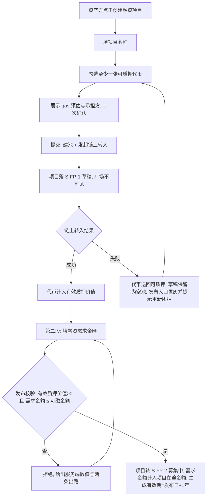
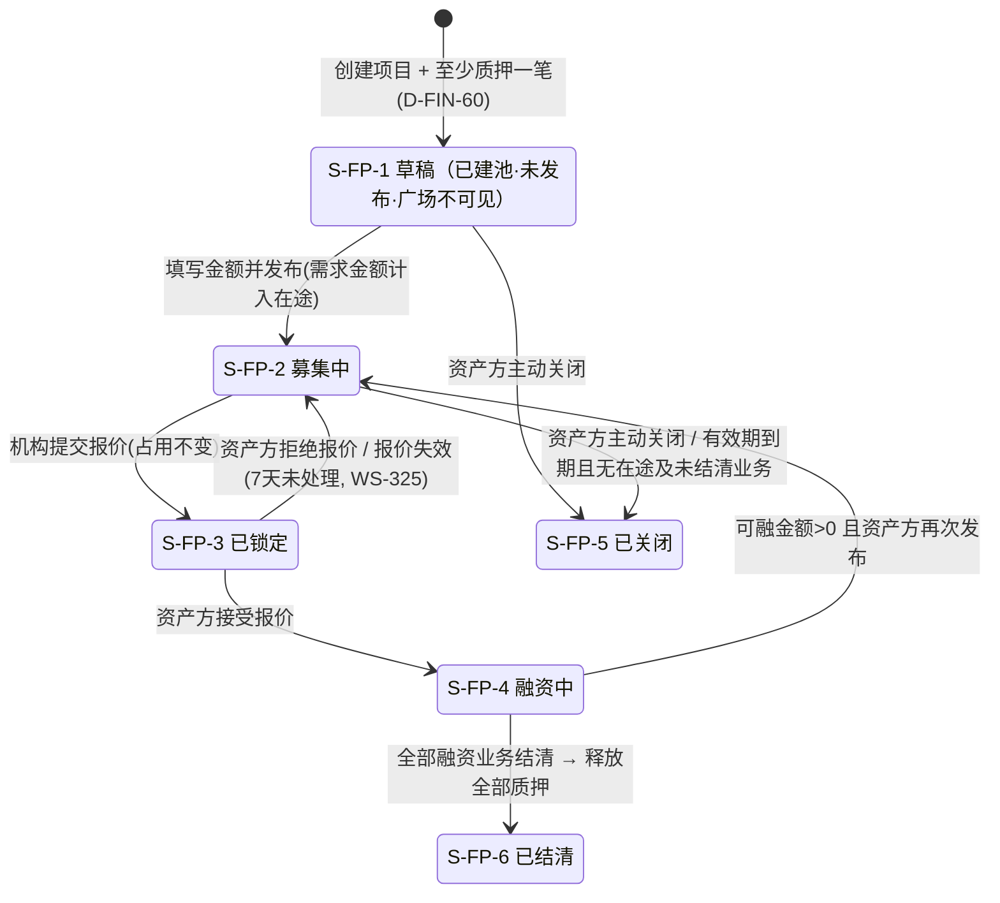
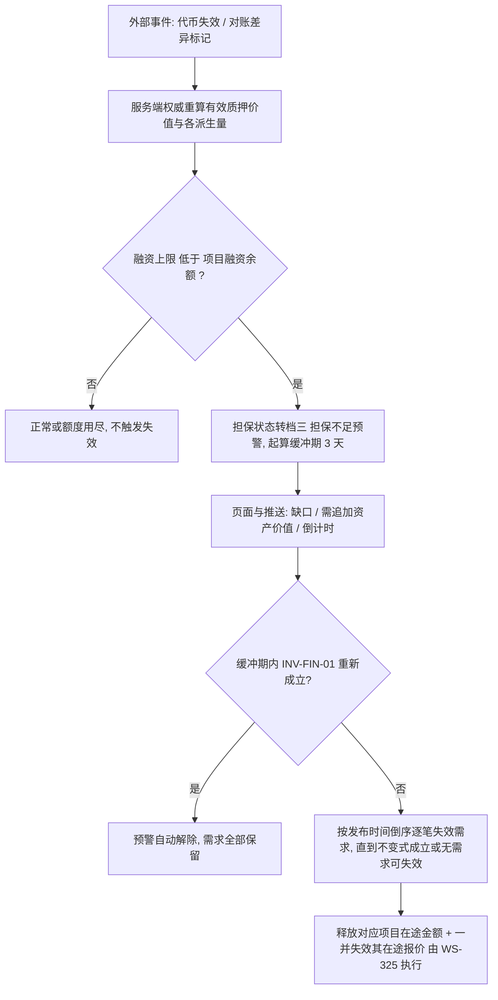
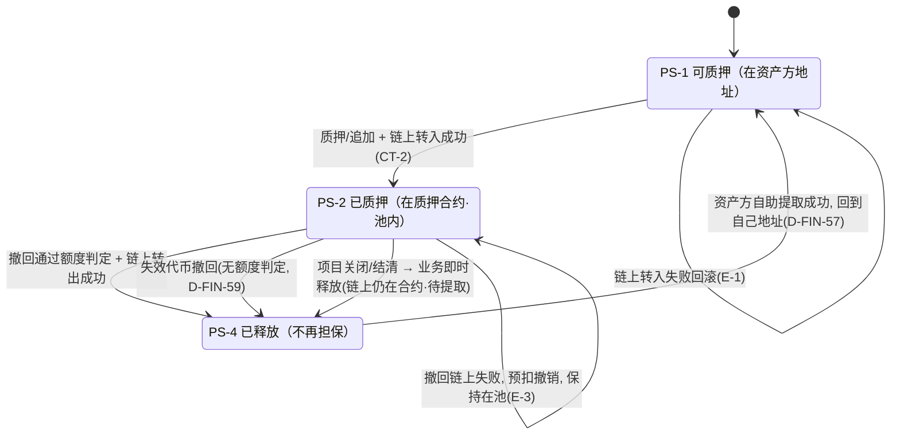

# 金融服务平台 · 金融服务端 · 借贷广场 — 融资需求与代币质押 PRD **V6.0**

> **本模块为两册。** 本册是**主文档 · 核心范围与功能规格**；对外契约（深链、链上调用）、数据字段、非功能、指标、依赖与风险、验收标准在分册。
>
> | 文件 | 内容 | 读者 |
> | --- | --- | --- |
> | `v1.0-借贷广场-融资需求与代币质押-PRD.md`（本册） | 第 1～5 章、6.1～6.5、第 12 章：背景与范围、角色与场景、流程与状态机、口径与公式、功能清单、模块详情与页面、待确认与遗留 | 需求方、设计、实现 |
> | [`01-对外契约与数据字典.md`](01-对外契约与数据字典.md) | 6.6～6.7、第 7～11 章：深链契约 H-01～H-05、**链上质押的调用说明与产品要求**（含失败与超时的界面文案）、数据与字段、非功能需求、指标、依赖与风险、**验收标准汇总**、外部缺口与上游修订请求 | 我的控制台（M-5）、WS-325 及之后、链上与后端实现方、测试 |
>
> **两册编号连续、不重复定义**：同一个编号只在一处定义，另一册引用。

## 1. 文档信息

| 项 | 内容 |
| --- | --- |
| 对应需求 | WS-324「借贷广场 · 融资需求与代币质押（PRD + 原型）」 |
| 所属平台 / 端 | 金融服务平台 · **金融服务端**（面客） |
| 模块定位 | 借贷广场第一段（WS-323 简报第 11 章 **M-1**） |
| 上游输入 | 《需求诊断简报 V6.0 定稿版》《附册 · 融资全生命周期 V5.0》（WS-323）；需求方 2026-09-11 六轮裁定（03:05 七条、03:39 八条、06:27 四条、07:01 六条、07:27 四条 · 链上范围纠正、**WS-325 08:17 七条中落在本模块的四条**） |
| 依赖文档 | WS-312《代币合约 PRD》、WS-318《资产清单与代币签发 PRD》、WS-313《可信数据同步 PRD》、WS-308『01-国际化基线.md』 |
| 编写人 | 许楚清（需求分析师） |
| 文档状态 | **V6.0**（第 12 章仅余外部事项，非本模块待定） |
| 编号空间 | 沿用上游：`D-FIN-*`（33 起）/ `AC-FIN-*`（11 起）/ `Q-FIN-*` / `D-LS-*`（10 起）/ `AC-LS-*`（02 起）/ `P-LS-*`；本模块新增 `F-LS-*`、`H-*`、`FP-*`/`PL-*`。**不回收作废号**，作废清单见 12.2 |

---

## 2. 背景与目标

### 2.1 背景

资产方在资产平台完成应收账款确权、由运营端按 WS-318 签发代币后，代币直接进入该资产方的数币地址（**平台不托管**）。此时代币只是一张"已确权债权的凭证"，没有变现通道。借贷广场是融资需求的公开撮合场所，也是融资全生命周期八个业务动作的**唯一执行场所**。本模块是这条链路的第一段。

**心智模型（需求方 2026-09-11 03:39）**：**企业创建的每个融资项目就是一个资产池**——资产方往池里质押代币，平台算出池内资产价值，资金方看到的是"池内资产 + 融资信息"；借贷广场公开展示平台上所有入驻资产方创建的融资项目。

**额度模型（需求方 2026-09-11 06:27 + 07:01）**：池内资产撑起一个**可用额度**，额度被两类东西消耗——**已发生的债务**（项目融资余额）与**在途的占用**（发布融资需求时占用，报价环节不再新增）。**冻结的是额度，不是代币**：代币不会因为有人报价而被逐张锁死，池子始终是活的，能不能撤回由额度算式说了算。

### 2.2 本期目标

| # | 目标 | 达成口径 |
| --- | --- | --- |
| G-1 | 资产方能独立完成"建池 → 质押 → 填金额 → 发布"全过程 | 两段式（6.1），中途离开可续做 |
| G-2 | 各派生量在任何入口读到的都是同一个数 | 前端预览 + 服务端权威重算（`AC-FIN-06`） |
| G-3 | 抵押物充足性在任何时刻可判定、可追溯 | 全平台只有一套校验口径（4.3 `INV-FIN-01`），撤回、报价、放款、预警全部挂在它上面 |
| G-4 | 质押是**链上事实**而不是账面标记 | 代币转入质押合约成功后才计入质押价值（`D-FIN-40`）；调用约定与缺口见分册 6.7 |
| G-5 | 资金方在一个页面内看全"池内资产 + 融资信息"，包括担保是否足额 | P-LS-02 分区按资金方决策路径（6.5.2）+ 担保状态公开（`D-FIN-56`） |
| G-6 | 游客不登录即可看完整的融资需求信息 | L1～L5 全量可见，操作入口 `⊘`（`D-LS-04`/`AC-LS-01`） |
| G-7 | 控制台（M-5）与后续环节（M-2～M-4）有稳定的对接契约 | 深链契约 H-01～H-05（分册 6.6） |

### 2.3 范围（含）

- 融资项目（资产池）的**创建（含首笔质押）**、**发布**、再次发布、主动关闭、到期处理
- **融资项目有效期**：发布时由系统按固定 1 年生成，不可编辑
- 代币质押：可质押代币筛选、质押入池、追加、**按额度判定的撤回**、释放与**自助提取**、转入/转出质押合约及失败回滚
- **在途额度占用**（唯一来源为发布占用）与担保充足性判定；**担保不足预警**
- **链上 gas 由资产方承担、平台不收费**的产品形态
- 派生量：池内资产总额、有效质押价值、融资上限、项目在途金额、可融金额、可撤回上限
- 页面：P-LS-01 融资需求列表、P-LS-02 融资需求详情、P-LS-03 建池与发布（含质押与撤回）
- 游客全量可见（L1～L5）与操作入口 `⊘` 的落地
- 对外契约：深链协议 H-01～H-05、**链上质押的调用说明与产品要求**（分册 6.7）

### 2.4 范围（不含）

| 编号 | 本期不做 | 归属 |
| --- | --- | --- |
| `X-LS-01` | 授信核定、报价、接受/拒绝报价及之后的全部环节 | WS-325（M-2）及之后 |
| `X-LS-02` | 我的控制台的页面与只读视图 | M-5 |
| `X-LS-03` | 代币的签发与代币自身字段 | WS-318（已定稿） |
| `X-MC-11` | 质押率的配置界面与差异化 | 本期硬编码 80% |
| `X-MC-08` | 逾期或失效后的质押处置 / 代币变现 / 清算 | 无承接模块（12.3） |
| `X-LS-04` | 质押代币的部分数量拆分 | 需求方裁定本期不做 |
| `X-LS-05` | 融资项目有效期的编辑、延期、提前终止 | 固定 1 年、不可编辑 |
| `X-LS-06` | **提前还款** | 本期不提供，还本金发生在融资项目到期后 |
| `X-LS-07` | **代币级的冻结、锁定、占用对应关系** | 冻结在额度层（`D-FIN-50`） |
| `X-LS-08` | **多个融资需求并发产生的在途额度** | 本期串行承载一笔，公式按通用形态写、简化只体现在取值上（`AC-FIN-24`） |
| `X-LS-09` | 平台对质押/撤回/提取**收取任何服务费**，以及平台代付 gas | gas 是链收的，平台不收费 |
| `X-LS-11` | **链上持仓查询与对账** | 需求方 2026-09-11 07:27：**后台自动进行**，不在本模块实现。本模块只消费其差异标记 |
| `X-LS-12` | **质押合约本身的设计、部署、接口、参数与权限模型；钱包连接组件** | 合约由开发负责（本 PRD 只说明"质押与解除质押需调用质押合约"以及本模块对这次调用的产品要求，分册 6.7）；签名与付费由页面**唤起外部 SDK 服务**完成，资产方侧已有该能力（`D-FIN-71`） |
| ~~`X-LS-10`~~ | ~~恶意锁仓的防范机制~~ | **作废**：需求方在 WS-325 08:17 裁定**报价 7 天未处理自动失效**，该风险已被收敛（分册 10.3） |
| `X-LS-14` | **报价对象自身的状态流转与 `授信占用额` 的释放** | 需求失效时报价一并失效（`D-FIN-75`），但报价的状态机与机构维度额度的释放由 **WS-325** 执行；本模块只输出"需求已失效"这一事实与项目维度的释放 |

### 2.5 上游口径声明（**原样保留，不得删改**）

> 本模块的质押能力与游客可见度口径以 WS-323 V6.0 简报为准；WS-318 `AC-TI-49`、WS-311 权限矩阵与跨功能约束 `X-2` 的相应条款待后续同步修订。

### 2.6 四条不可削弱的红线

| 编号 | 红线 |
| --- | --- |
| `D-MC-110`/`D-MC-111` | 质押率本期为**硬编码常量 80%**。页面**可以展示**这个数（6.5.4），但**不得以任何形式暗示可调**：无输入框、无下拉、无滑块、无"调整/设置质押率"入口与文案 |
| `D-FIN-06` | 术语一律用 **`项目融资余额`**，PRD、界面、字段、提示文案中**不得出现无限定词的"融资余额"**；**同一个量也不得有两个名字**（据此有 `D-FIN-58`、`D-LS-12` 两条术语合并条款） |
| `AC-FIN-06` | 派生量前端可即时预览，**提交时一律由服务端权威重算并校验**，不一致以服务端为准 |
| `D-LS-09` | **游客全量可见 ≠ 取消服务端过滤**。跨主体隔离、归属过滤、动作鉴权三类服务端校验全部继续成立 |

---

## 3. 用户与场景

### 3.1 角色

| 角色 | 在本模块的诉求 | 权限口径 |
| --- | --- | --- |
| **游客（未登录）** | 看市场上有哪些资产池、池里是什么抵押物、要融多少钱、担保是否足额 | L1～L5 全量可见；全部操作入口 `⊘` |
| **资产方（登录）** | 把代币变成可融资的额度，公开发布需求；随时能撤回额度允许范围内的代币 | 创建/发布/关闭项目、质押/追加/撤回/提取代币、承担 gas |
| **资金方（登录）** | 浏览资产池、评估担保是否足额，决定是否报价；作为债权人持续掌握担保状况 | 本模块内只读（报价在 WS-325）；担保不足预警对其可见 |
| **平台运营** | 本模块内无业务动作；接收链上失败、对账不一致、担保不足三类异常待办 | 无面客写入口 |

> 同一企业主体下的**任一登录员工均可代表企业执行上表全部动作**，本期不做企业内「查看 / 操作」分级（`D-MC-105`/`AC-MC-16`）。不要在验收用例里留"若分级则……"的分支。

### 3.2 用户故事

| 编号 | 故事 | 验收落点 |
| --- | --- | --- |
| `US-01` | 作为资产方，我想先把代币质押进一个资产池把池子建起来，金额想好了再填再发布 | `F-LS-01`/`F-LS-02`、6.1 |
| `US-02` | 作为资产方，我想实时看到池子值多少、能融多少 | `F-LS-07`、`AC-FIN-06` |
| `US-03` | 作为资产方，**只要担保仍然够，我就应该能把多余的代币撤回来**，不该因为有一笔报价在途就被整池锁死 | `F-LS-06`、`AC-FIN-13` |
| `US-04` | 作为资产方，已经失效的代币我想随时清出池子，它反正也不顶用 | `D-FIN-59` |
| `US-05` | 作为资产方，我想提前知道这一步要花多少 gas、失败了钱扣没扣、重试要不要再花 | `F-LS-14`、`D-FIN-46` |
| `US-06` | 作为资金方，我想在报价前和放款后都能看到这个池的担保是否足额 | 6.4.1、`D-FIN-56` |
| `US-07` | 作为游客，我不登录也想看清楚需求金额、抵押物明细和商务条款 | `F-LS-10`、`D-LS-04` |
| `US-08` | 作为资产方，我在控制台点一下就能跳到广场对应位置继续操作 | 分册 6.6 |

### 3.3 典型场景

- **S1 建池**：资产方新建项目 → 填项目名 → 勾选 3 张代币质押（共 100 万 USD）→ 确认 gas 由本企业承担 → 链上转入成功 → 项目落 `S-FP-1 草稿`（已建池、未发布，**广场不可见**）。
- **S2 发布**：资产方回到草稿项目 → 填融资需求金额 50 万 → 发布 → **项目在途金额 = 50 万**，可融金额 = 80 − 0 − 50 = 30 万，项目转 `S-FP-2 募集中`，有效期至发布日 + 1 年。
- **S3 报价不新增占用**：机构对这笔 50 万的需求报价 50 万 → **项目在途金额仍是 50 万**（占用只有发布这一个来源），可融金额仍是 30 万。
- **S4 撤回还有空间**：承 S2，可撤回上限 = 可融金额 ÷ 80% = 37.5 万。撤回 30 万的代币后池值 70 万、融资上限 56 万 ≥ 0 + 50 万，**允许**；再想撤 10 万被拒，提示"最多还可撤回 7.5 万 USD"。
- **S5 失效代币**：池内一张 10 万的代币因底层应收账款失效 → 它**本来就不计入**有效质押价值，撤回**不做任何额度判定**，直接放行。
- **S6 担保不足预警**：项目已放款 50 万（项目融资余额 50 万），随后两张代币失效，有效质押价值跌到 60 万 → 融资上限 48 万 < 50 万 → **触发预警**，缺口 2 万，广场与双方页面同时可见，资产方收到"需追加 2.5 万 USD 资产"的指引。
- **S7 释放与提取**：项目结清 → 平台即时解除全部占用与担保关系，代币置「已释放 · 待提取」→ 资产方自行发起提取、自付 gas，可批量一次提完。

---

## 4. 流程说明

### 4.1 建池与发布两段式（需求方 2026-09-11 07:01 第 1、2 条）



**两段式的三条裁定**：

| 编号 | 条款 |
| --- | --- |
| `D-FIN-60`（**新**） | **创建项目时必须至少质押一笔代币**，"空池草稿"不能由创建动作产生。创建校验的对象是**质押申请已提交**（链上 `CT-1 处理中` 或 `CT-2 成功` 均算通过），**不要求等待链上确认完成** |
| `D-FIN-61`（**新**） | **发布校验的对象才是链上事实**：`有效质押价值 > 0`（即至少一张 `CT-2`）且 `融资需求金额 ≤ 可融金额`。两个校验分处两段、层次不同，**与 `D-FIN-54` 估值保守原则不冲突**——保守原则管的是"计入不计入质押价值"，创建门槛管的是"有没有真的发起一笔质押"，两者不是同一件事 |
| `D-FIN-62`（**新**） | **允许存在空池草稿，但只能由"创建时那笔质押最终链上失败"产生**，不能由用户直接建出。此时项目保留（项目名等准备工作不丢），页面顶部常驻提示"本项目暂无有效质押，请重新质押后再发布"，**发布入口 `⊘`** |

> **为什么不是"创建即同步等待链上确认"**：链上转入是异步的，确认可能要几十秒到几十分钟，失败率不为零。若把确认作为创建的前置，用户要在页面上干等、且失败时连项目都建不出来，填过的信息全丢。把校验点放在发布，用户的等待是**可离开的**——建池后随时回来继续。

### 4.2 撤回质押的判定流程（`AC-FIN-13` 视角 C）

三步，顺序不可换：① **先看代币是否已失效**——已失效的**不做任何额度判定，直接放行**（`D-FIN-59`）；② 未失效的，由服务端权威重算 `可撤回上限 = 可融金额 ÷ 质押率`，拟撤回价值合计超过它即拒绝，并给出三个数（`AC-LS-37`）；③ 通过后发起链上转出，**处理中即按保守口径预扣**该部分价值（`D-FIN-54` ②），链上成功则移出池、失败则预扣撤销并保持在池（分册 6.8 `E-3`）。

### 4.3 融资项目状态机（承接 `S-FP-*`，一套跨模块共用）



| 编号 | 条款 |
| --- | --- |
| `D-FIN-63`（**新**） | **前段不新增状态**：`S-FP-1 草稿` 的语义收紧为"**已建池、已有至少一笔质押、尚未发布**"。理由：状态机跨模块共用（`D-FIN-28`），每多一个状态，控制台、WS-325～M-4 的枚举与文案映射都要跟着改；而"已建池未发布"与"草稿"在业务上本就是同一件事，用进度（是否已填金额）表达即可，不必升格为状态 |
| `D-FIN-64`（**新**） | **草稿项目不进广场**（承接 `AC-LS-05`）：不进列表、不可搜索、他人与游客深链直达返回"内容不存在或无权访问"，**不暴露该项目是否存在**。理由：未发布意味着资产方还没有对外要约的意思表示，提前曝光等于替他做决定；且草稿期金额未定，展示出去也无从判断 |
| `D-FIN-33` | **一个融资项目可串行承载多笔融资业务，不能并发**：同一时刻至多一笔在途融资业务；只有 `S-FP-2 募集中` 接受新报价 |
| `D-FIN-37` | **有效期 = 首次发布日 + 1 年**，系统生成、只读、不可编辑、不可延期；再次发布**不重置** |
| `D-FIN-43` | **到期两分支**：① 到期且无在途、无未结清业务 → 转 `S-FP-5`，释放全部质押；② 到期但存在在途或未结清业务 → **项目不关闭**，打「已到期 · 存量处理中」并行标记，停止接受新报价、不允许再次发布，存量走完后转 `S-FP-6` 并释放质押 |
| `D-FIN-47` | **分支②是常态路径**：本期无提前还款、还本发生在项目到期后，凡成交项目几乎必然经过这一段。该标记**必须按正常状态呈现**（中性样式 + "存量融资业务照常履约中"），**不得做成告警或红色警示** |

### 4.4 融资需求因担保不足自动失效（WS-325 08:17 裁定 2）

`INV-FIN-01` 可能被**外部事件被动打破**——最常见的是池内代币因底层应收账款到期而失效（`D-FIN-59`），与资产方的任何操作无关。此前 PRD 只有"担保不足时禁止报价与放款"的闸门，没有回答**已经发布出去的融资需求怎么收场**。本节补上。



| 编号 | 条款 |
| --- | --- |
| `D-FIN-72`【触发与时机】 | **判定分两步，不得合并**：① 收到代币失效、对账差异等外部事件后，服务端**立即重算**有效质押价值与各派生量（`AC-FIN-17` 已含该触发点；代币失效本身由 WS-318 按日判定）；② **失效判定不在重算的同一步执行**，而是在重算后评估担保档位，落入档③才起算缓冲期。合并两步会让一次日终批量失效直接连锁作废大量需求，资产方毫无反应机会 |
| `D-FIN-73`【粒度与顺序】 | **最小必要失效 + 按发布时间倒序**：逐笔作废已发布未终结的需求，**每作废一笔即重算**，`INV-FIN-01` 一旦重新成立立即停止。顺序取**后发布的先失效**——后发布的那笔是最后占用额度的，撤销它等于回到它发布之前的状态，最可解释、也最符合"先到先得"的直觉。**否决两个替代方案**：「全部失效」是惩罚性的（缺口可能只有 2 万，却作废全部要约，资产方要重走发布、机构要重新报价）；「按金额从大到小失效」虽然作废笔数最少，但让"谁被作废"与"谁先来"无关，资产方无法预期。**本期取值**：串行承载一笔（`D-FIN-33`）⇒ 至多一笔需求，顺序规则在本期不产生分歧，但规则按通用形态写（同 `AC-FIN-24`） |
| `D-FIN-74`【缓冲期】 | **有缓冲期，默认 3 个自然日**，自担保状态转入档③起算。期内：**允许追加质押**（唯一的自救手段）与**主动撤下需求**（第二条自救路径，立即释放占用）；**禁止一切新增占用**（发布、报价、放款——`AC-FIN-12` 闸门本就如此）。期内 `INV-FIN-01` 重新成立则预警自动解除、需求全部保留。**为什么要缓冲**：不给缓冲，预警就形同虚设——诱因与资产方操作无关，而追加质押要走签名、gas 与链上确认，当天完成不现实。**为什么是 3 天不是 7 天**：报价有效期已定为 7 天，缓冲期若 ≥ 7 天会出现"报价都超时失效了、需求还在缓冲"的错位。**该值为可调默认值，待需求方确认** |
| `D-FIN-75`【在途报价一并失效】 | 需求失效时，**其上的在途报价一并失效**。理由：担保已经不足，保住报价等于保住一笔抵押物撑不起的要约；且 `AC-FIN-12` 本来就禁止在担保不足时放款，保住它只会让业务卡在"能接受、不能放款"的死状态；需求是报价的载体（`D-FIN-02`），载体作废则报价无所依附。**跨模块边界**：本模块负责"需求失效"这一事实与 `项目在途金额` 的释放；**报价自身的状态流转与 `授信占用额`（机构 × 资产方）的释放由 WS-325 执行**（`X-LS-14`）。两者必须在**同一事件内**完成，不得出现"需求已失效、报价还在"的中间态被用户看到 |
| `D-FIN-76`【释放、复发布与状态落点】 | ① **失效即释放**该需求占用的 `项目在途金额`（承接 `AC-FIN-23`"需求终结即释放"）；该路径与 `AC-FIN-25`「在途 → 余额」的原子转移**互斥不重叠**：同一笔金额要么转成债务、要么随需求作废消失，不会两条都走。② **失效后可以重新发布**——失效是这一笔要约作废，不是惩罚；待 `INV-FIN-01` 重新成立（追加质押或还款降低余额）即可再次发布。③ **不新增任何状态**：需求本就不是独立对象（`D-LS-11`），项目按既有路径回落——无其他在途/未结清业务则回到"已建池未发布"的草稿语义（`D-FIN-63`），有存量业务则停留 `S-FP-4`；只在项目上记一个**本轮需求终结原因**（`FP-27`）的新枚举值 `自动失效 · 担保不足`，与既有的 `资产方撤下`/`成交`/`项目关闭` 并列 |

---

## 5. 业务对象与核心口径

### 5.1 需求方四轮裁定的口径落点

| # | 裁定 | 落点 |
| --- | --- | --- |
| ① | 「代币截止 × 质押率」 | `D-FIN-08`：**有效质押价值 = Σ(池内、链上转入成功、底层未失效的代币 `D-TI-18` 签发快照美元额)**，票面折算、永不重算 |
| ② | 「防止多家机构无效报价」 | 报价占用额度 + 项目串行锁定（`D-FIN-33`） |
| ③ | 「一个项目承载多笔融资业务」 | **串行承载**（`D-FIN-33`） |
| ④ | 「冻结金额 = 在途额度」「报价和发布占用为同一个，统一为发布占用」 | **`项目在途金额`**，唯一来源为发布占用（`D-FIN-58`、`AC-FIN-23`） |
| ⑤ | 「失效代币解除质押无限制；未失效代币按解除后池内资产 vs 融资余额 + 冻结额度判定」 | `D-FIN-59` + `AC-FIN-13` 视角 C，**判据带质押率** |
| ⑥ | 「池内资产额度小于融资余额时要有预警」 | 担保不足预警（6.4.1，`D-FIN-55`/`D-FIN-56`） |
| ⑦ | 「gas 由质押方承担，平台不收费」 | `D-FIN-46` + 释放两段式 `D-FIN-57` |
| ⑧ | 「创建时至少质押一笔；金额可后续填写发布」 | 两段式（4.1，`D-FIN-60`～`D-FIN-63`） |
| ⑨ | 「页面展示代币资产 / 质押率 / 有效代币资产」 | 三数展示口径与术语映射（6.5.4，`D-LS-12`） |
| ⑩ | ~~「本期暂不考虑恶意锁仓」~~ | **已被 WS-325 08:17 裁定 1 推翻**：报价 7 天未处理自动失效，`X-LS-10` 作废 |
| ⑫ | 「A 的项目因为代币失效导致质押额度覆盖不了融资需求，融资需求自动失效」（WS-325 08:17 裁定 2） | **4.4 融资需求因担保不足自动失效**（`D-FIN-72`～`D-FIN-76`） |
| ⑬ | 「消息通知走 WS-329，只在核心环节通知、信息不宜过多」（裁定 7） | 通知矩阵见分册 **8.1**；`DEP-08` 重写 |
| ⑭ | 「授信额度是对企业维度的，不是对融资项目维度」（裁定 3） | **本模块无需改动**：V4.0 起本 PRD 已不再声明"授信占用有效期跟随项目有效期"，全文不含 `D-MC-106`～`D-MC-108`。授信主体条款在 WS-325 |
| ⑪ | 「合约由 WS-312 / WS-318 已定好，这里只是调用」 | 调用约定 + **能力缺口清单**（分册 6.7） |

> **质押率一律参与比较**（需求方 2026-09-11 确认）：所有担保充足性判断的比较对象都是打完 80% 的 `融资上限`，不是原始资产额。不打折会与预警线自相冲突——若允许撤到"池内原值刚好等于余额"，此时融资上限已低于余额，项目当场落入担保不足预警区。**表中「」内为需求方原话引用**，其中的"融资余额""冻结额度""有效代币资产"等说法**不作为本 PRD 的术语使用**，正式术语以 5.2 为准。

### 5.2 对象模型与术语

```
融资项目 FinancingProject ＝ 资产池（资产方创建，创建时至少一笔质押）
  ├── 质押记录 Pledge[]（一条 = 一张代币在一个项目中的一次有效质押）
  ├── 派生量：池内资产总额 / 有效质押价值 / 融资上限 / 项目在途金额 / 可融金额 / 可撤回上限
  └── 融资业务 FinancingDeal[]（串行承载多笔，本模块只读引用，写在 WS-325 及之后）
```

| 编号 | 术语红线 |
| --- | --- |
| **`D-LS-11`** | **「融资项目」=「资产池」=「广场上的一条融资需求」，三个说法指同一个对象**：同一个编号、同一套状态机、同一个深链锚点，**不得派生出第二个对象、第二套编号或第二套状态**（承接 `D-FIN-02`）。界面允许按语境换称呼——资产方侧与控制台称「融资项目」，广场公开展示称「融资需求」，池内资产区块称「资产池」 |
| **`D-FIN-58`** | 需求方的"冻结金额 / 在途额度"与附册的"待确认融资金额"**不是同一个量**（5.2.1），本模块统一为 **`项目在途金额`**。**PRD、界面、字段中不再出现"冻结金额""冻结额度""在途额度""待确认融资金额"这四个说法** |
| **`D-LS-12`（新）** | **需求方口语与本 PRD 术语的映射钉死，不新造第四个词**：「代币资产」→ 视语境为 `池内资产总额`（账面、含失效）或 `有效质押价值`（参与计算、排除失效）；「**有效代币资产**」→ **`融资上限`**（= 有效质押价值 × 80%）。**界面标签一律使用本 PRD 术语**，不得出现"有效代币资产"这一称呼 |

| 术语 | 口径 | 红线 |
| --- | --- | --- |
| **池内资产总额** | Σ(池内全部代币的 `D-TI-18`)，**含已失效代币**，仅用于展示"池子里有多少张、账面多少钱" | 不参与任何校验 |
| **有效质押价值** | Σ(池内代币的 `D-TI-18`)，需同时满足：① 链上转入成功（`CT-2`）；② **底层应收账款未失效**；③ 未处于对账差异或撤回预扣（`D-FIN-54`） | **一切校验只认这个数** |
| **融资上限** | 有效质押价值 × 质押率；**质押率本期为硬编码常量 80%** | 可展示、不得暗示可调 |
| **项目融资余额** | 该项目下状态为「已确认（还款中）」「已到期」「逾期」的融资业务未偿本金合计（`AC-FIN-03`） | 不得简写为"融资余额" |
| **项目在途金额** | Σ(本项目下**已发布且未终结**的融资需求金额)。**唯一来源是发布占用**，报价环节不新增占用项（`AC-FIN-23`） | 唯一名称（`D-FIN-58`） |
| **可融金额** | `max(0, 融资上限 − 项目融资余额 − 项目在途金额)` | 为负按 0 展示 |
| **可撤回上限** | `可融金额 ÷ 质押率`（`AC-FIN-22`） | 仅对未失效代币适用 |
| **融资需求金额** | 资产方本次公开发布、希望融到的金额（USD） | 本期报价金额必须等于它（`D-FIN-19`） |

#### 5.2.1 「冻结额度」与附册「待确认融资金额」的核对结论

**不是同一个量。** 附册 `AC-FIN-04` 从**机构提交报价**起算、只含融资业务金额；需求方的冻结额度从**资产方发布融资需求**起算（其原例"质押 100 万、发布 50 万、冻结 50 万"时一笔报价都还没有），且 2026-09-11 07:01 进一步收敛为"**报价与发布占用是同一个，统一以发布占用为准**"。

| 维度 | 附册 `AC-FIN-04` | 本 PRD `项目在途金额` |
| --- | --- | --- |
| 起点 | 机构提交报价 | **资产方发布融资需求** |
| 来源 | 融资业务金额 | **只有发布占用一个来源**；报价不新增 |
| 终点 | 融资确认完成或业务终结 | 同左（`AC-FIN-25` 精确化：**放款并经资产方融资确认后**才转入项目融资余额） |

按旧口径，发布到报价之间占用为 0，**同一份质押可以被连发两笔吃满额度的需求**——`AC-FIN-04` 的立意本是防重复占用，却漏了这个口子。修订请求见 12.4。

### 5.3 唯一的一套额度口径（**不存在第二套公式**）

| 编号 | 条款 |
| --- | --- |
| **`INV-FIN-01`【唯一口径】** | **融资上限 − 项目融资余额 − 项目在途金额 ≥ 0**，即 **有效质押价值 × 80% ≥ 项目融资余额 + 项目在途金额**。任何时刻必须成立；不成立即禁止一切增加占用的动作 |
| `AC-FIN-11` | **视角 A · 展示**：`可融金额 = max(0, 融资上限 − 项目融资余额 − 项目在途金额)` |
| `AC-FIN-12` | **视角 B · 准入**：新增占用（发布需求、机构报价、放款）校验 `可融金额 ≥ 本次金额`。报价与放款时该笔金额已在在途，故其校验式即"`INV-FIN-01` 当前是否成立" |
| `AC-FIN-13` | **视角 C · 撤回**：按撤回后的池重算——`(有效质押价值 − 拟撤回代币价值) × 80% ≥ 项目融资余额 + 项目在途金额`。**已失效代币不参与本判定**（`D-FIN-59`） |
| `AC-FIN-22` | **可撤回上限 = 可融金额 ÷ 质押率**。推导：`(V − w) × r ≥ B + P ⟺ w ≤ (V×r − B − P)/r = 可融金额 ÷ r`。**不是第二条公式，是 `AC-FIN-13` 的代数变形**，用途是把"能不能撤"翻译成用户看得懂的一个数 |
| `AC-FIN-23`（**V4.0 收紧**） | **`项目在途金额` 只有"发布占用"一个来源**：融资需求发布成功时按需求金额产生占用；**报价环节不新增任何占用项**（报价只是把该需求置为"已被报价"，金额不变）；报价被拒绝或失效后占用照旧（需求还挂着）；需求撤下、项目关闭/到期关闭时释放；融资确认完成时按 `AC-FIN-25` 转入项目融资余额 |
| `AC-FIN-24` | **按通用形态定义（可容纳多笔并发在途），本期取值简化**：串行承载一笔 ⇒ 本期该值恒等于"当前那一笔已发布未终结需求的金额"或 0。**简化只写在"本期取值"说明里，不得写进公式本身**（`X-LS-08`） |
| `AC-FIN-25` | **额度在两个池子之间的转移必须原子、无空档**：融资确认完成的同一时刻，该笔金额从 `项目在途金额` 移出、计入 `项目融资余额`；业务终止/拒绝时从在途移出且不进余额。**任何时刻一笔钱只能被计入其中一个，且不得两边都不计** |
| `AC-FIN-14` | 各派生量与校验**单位统一为 USD**（`D-FIN-13`），界面须标注币种 |
| `AC-FIN-15` | 上述各条**只有服务端一个权威实现**；前端预览与控制台展示消费同一来源（`AC-MC-12`） |
| `AC-FIN-20` | **冻结/占用不参与质押价值的计算**：占用只出现在不等式右边，绝不从有效质押价值里扣减。若把占用当作"扣减池值"，会同时减分子不减分母，`INV-FIN-01` 立刻假性不成立 |

#### 5.3.1 三档担保状态

| 档 | 判据 | 含义 | 系统行为 |
| --- | --- | --- | --- |
| **① 正常** | `INV-FIN-01` 成立且可融金额 > 0 | 还有额度可用 | 正常展示与操作 |
| **② 额度用尽** | `INV-FIN-01` 成立但可融金额 = 0 | **已借的有足额担保，但不能再借** | 报价/发布入口 `⊘` 并说明原因；可撤回上限为 0；**不预警** |
| **③ 担保不足预警** | `融资上限 < 项目融资余额` | **已发生的债务本身没有足额担保** | 预警（6.4.1）+ 禁止一切新增占用 + 运营待办 |

| 编号 | 条款 |
| --- | --- |
| `D-FIN-55` | **预警线与准入闸门不是同一条线，预警不是闸门的可视化。** 闸门比较 `项目融资余额 + 项目在途金额`（管"还能不能借"）；预警只比较 `项目融资余额`（管"已借的还保得住吗"）。数学上档③ ⊂ 档②，但业务含义、受众与处置动作完全不同，**必须分别定义、分别呈现** |

---

## 6. 功能清单与模块详情

### 6.0 功能清单

| 编号 | 模块 | 功能点 | 验收口径 |
| --- | --- | --- | --- |
| `F-LS-01` | 融资项目 | **创建资产池**（项目名 + 至少一笔质押） | `D-FIN-60`、`AC-LS-54` |
| `F-LS-02` | 融资项目 | **发布融资需求**（填金额 + 发布，发布即占用） | `D-FIN-61`、`AC-FIN-23` |
| `F-LS-03` | 融资项目 | 再次发布 / 主动关闭 / 到期处理 | `D-FIN-33`、`D-FIN-43`、`D-FIN-47` |
| `F-LS-04` | 代币质押 | 可质押代币清单与筛选 | `D-FIN-38` |
| `F-LS-05` | 代币质押 | 追加质押（任何项目状态均允许，只增不减） | `D-FIN-48` |
| `F-LS-06` | 代币质押 | **按额度判定的撤回**（失效代币无限制） | `AC-FIN-13`、`AC-FIN-22`、`D-FIN-59` |
| `F-LS-07` | 派生量 | 六个派生量的前端预览与服务端权威重算 | `AC-FIN-06`、`AC-FIN-15` |
| `F-LS-08` | 链上 | 调用质押合约完成转入 / 转出、**唤起外部 SDK 完成签名与付费**、失败回滚与重试 | `D-FIN-36`、`D-FIN-71`、分册 6.7 |
| `F-LS-09` | 额度 | 在途占用的产生、保持与释放（对 WS-325 的契约） | `AC-FIN-23`、`AC-FIN-25` |
| `F-LS-10` | 页面 | P-LS-01 融资需求列表 | 游客全量可见、操作入口 `⊘` |
| `F-LS-11` | 页面 | P-LS-02 融资需求详情（池内资产 + 融资信息合一） | L1～L5 全量、不脱敏 |
| `F-LS-12` | 页面 | P-LS-03 建池与发布（两段式，含质押、撤回、提取） | 6.1、6.5.3 |
| `F-LS-13` | 契约 | 深链协议 H-01～H-05 | 分册 6.6 |
| `F-LS-14` | 费用 | gas 预估、承担方提示、二次确认、重试扣费告知、批量降费 | `D-FIN-46` |
| `F-LS-16` | 预警 | 担保不足预警的触发、解除、呈现与通知 | 6.4.1 |
| `F-LS-17` | 提取 | 已释放代币的自助提取 | `D-FIN-57` |
| `F-LS-19` | 失效 | **融资需求因担保不足自动失效**（含缓冲期、最小必要失效、占用释放） | 4.4、`D-FIN-72`～`D-FIN-76` |
| `F-LS-18` | 展示 | **三数展示**（有效质押价值 / 质押率 / 融资上限） | 6.5.4、`AC-LS-53` |

### 6.1 融资项目（资产池）的创建与发布

| 项 | 规则 |
| --- | --- |
| 谁能创建 | 已登录资产方企业主体下的任一员工（`D-MC-105`）。项目归属企业主体 |
| **第一段 · 创建** | 一次提交完成"建池 + 首笔质押"：项目名称（必填）+ 至少勾选一张可质押代币 + gas 二次确认。提交后项目落 `S-FP-1 草稿`（`D-FIN-60`/`D-FIN-63`） |
| 草稿可见性 | **对外完全不可见**（`D-FIN-64`）；仅本企业可见并可续做 |
| **第二段 · 发布** | 填融资需求金额 → 发布校验（`D-FIN-61`）→ 转 `S-FP-2 募集中`，生成有效期，需求金额计入 `项目在途金额` |
| 两段之间 | 资产方可离开页面；草稿在"我的项目"与控制台有「继续发布」入口；期间可追加、可撤回（受 `AC-FIN-13` 约束，此时余额与在途均为 0，等价于可全撤——**允许撤到空池**，但空池不能发布） |
| 发布后可改什么 | 需求金额**可在 `S-FP-2` 且该需求尚未被报价时修改**，改后重过 `AC-FIN-12`，在途占用同步调整；项目名称可改；**有效期不可改** |
| 撤下需求 | `S-FP-2` 且尚未被报价时可撤下，**释放对应的在途占用**，项目回到"已建池未发布"的草稿语义 |
| 主动关闭 | `S-FP-1`/`S-FP-2` 且无在途、无未结清业务时可关闭 → `S-FP-5`，触发全部质押释放（6.3.6） |
| 再次发布 | `S-FP-4 融资中` 且可融金额 > 0 且未到期时可再次发布剩余额度 → 回 `S-FP-2`，新需求金额计入在途 |

### 6.2 融资项目有效期

| 编号 | 规则 |
| --- | --- |
| `D-FIN-37` | 有效期 = **首次发布日 + 1 年**（自然日，按平台统一时区计算并标注，引用 WS-308『01-国际化基线.md』），系统生成，**只读、不可编辑、不可延期** |
| `AC-LS-02` | 界面**不得出现**有效期输入框、日期选择器或"修改有效期"入口 |
| `D-FIN-43`/`D-FIN-47` | 到期两分支，分支②为常态路径，按正常状态呈现（4.3） |
| `AC-LS-03` | 到期前 30 天 / 7 天在页面给出到期提醒标记；**主动推送只在届满前 7 天发一次**（走 WS-329，理由见分册 8.1） |
| `D-FIN-49` | **质押释放时点与项目终态绑定**：项目到期且从未成交 → `S-FP-5` 并释放全部；到期后存量全部结清 → `S-FP-6` 并释放全部。**不提供"某笔业务结清即释放对应代币"的部分释放**——额度语义下不存在"对应代币"；某笔结清的效果是 `项目融资余额` 下降，从而**提高可撤回上限**，由资产方自行决定撤哪几张 |

### 6.3 代币质押

#### 6.3.1 可质押代币的筛选条件（`D-FIN-38`）

| # | 条件 | 来源 |
| --- | --- | --- |
| 1 | 签发状态 = `S-TI-3 已签发` | WS-318 |
| 2 | 归属于当前登录的企业主体 | 服务端归属过滤 |
| 3 | **当前未被任何有效质押占用，且不在质押合约内**（含"已释放待提取"的代币——须先提取才能再质押） | `D-FIN-14` |
| 4 | 底层应收账款未处于「已失效」（WS-318 `D-TI-22`：失效＝对应应收账款已过到期日） | WS-305 / WS-318 |
| 5 | **代币类型 = 应收账款类**（本期实现只有该类型） | 需求方裁定 |
| 6 | **与本项目已质押代币为同一类型**（同一池内不混合类型） | 需求方裁定 |

> 条件 5 是本期能力边界，条件 6 是长期规则，**必须分开写**。
> `D-FIN-39`：**本期不支持按数量拆分，一张代币整张质押**，以"张"为单位勾选，无数量输入框。

#### 6.3.2 代币的状态模型

| 编号 | 状态 | 定义 |
| --- | --- | --- |
| `PS-1` | **可质押** | 满足 6.3.1 全部条件，未进入任何资产池，链上在资产方自己地址 |
| `PS-2` | **已质押（在池）** | 已入池、链上已转入质押合约。**是否被额度占用是项目层的事，与本状态无关** |
| `PS-4` | **已释放** | 业务上已移出资产池，不再为任何项目提供担保。链上位置由 `CT` 轴区分：已转回资产方地址（撤回路径）或**仍在合约内待提取**（系统释放路径，`D-FIN-57`） |
| ~~`PS-3`~~ | **作废** | 原「报价冻结中」。冻结在额度层不在资产层；编号保留占位、不再使用 |

**两根正交轴**（都不是第四态，参照 `D-FIN-09`「逾期是标记不是状态」）：

| 轴 | 取值 | 作用 |
| --- | --- | --- |
| **链上转移状态** | `CT-0 未发起` / `CT-1 处理中` / `CT-2 成功` / `CT-3 失败` | 回答"链上动作走到哪一步"。**只有 `CT-2` 计入有效质押价值**。该三态与 WS-318 签发状态机的 `S-TI-3 已签发`/`S-TI-4 签发失败`/`S-TI-5 结果待确认` 同构，口径直接沿用 |
| **底层资产失效标记** | `false` / `true` | 回答"这张代币还顶不顶用"。**`true` 时不计入有效质押价值**（`D-FIN-59`），界面标注「不计入担保」 |

| 编号 | 条款 |
| --- | --- |
| `D-FIN-50` | **平台不记录、不展示、不计算"哪几张代币被哪笔业务占用"。** 额度语义下占用发生在金额维度，代币之间没有区别 |
| `D-FIN-48` | **追加质押在任何项目状态下都允许**（`S-FP-1`～`S-FP-4`），池内资产只增不减地增强担保 |
| `D-FIN-59` | **底层资产已失效的代币不计入有效质押价值，其解除质押不做任何额度判定，直接放行。** 两件事互为因果：正因为它本来就不顶担保，移出它才不会削弱担保 |
| `D-FIN-54` | **估值保守原则**：① 入池处理中（`CT-1`）**不预先计入**质押价值；② 撤回处理中（`CT-1`）**立即预扣**该部分价值，失败回滚才恢复；③ 对账差异项不计入。**宁可低估不可高估**——高估会让不该通过的报价/放款通过，低估最多让资产方少借一点 |
| `D-FIN-40` | **质押是链上事实**：质押成立 = 代币转入质押合约成功；释放 = 代币从质押合约转回**质押前的原持有地址**，**不允许人工指定目的地址** |

#### 6.3.3 代币状态机



> 图中没有"冻结"这一步——**冻结发生在项目的额度维度，不发生在代币上**。

#### 6.3.4 四态 × 动作矩阵

| 动作 | `PS-1` 可质押 | `PS-2` 已质押 | `PS-4` 已释放 |
| --- | --- | --- | --- |
| **创建项目并首笔质押** | ✅ 至少一张，提交即建池（`D-FIN-60`） | ❌ | ✅ 须先提取回自己地址 |
| **追加质押** | ✅ 项目 `S-FP-1`～`S-FP-4` 均可 | ❌ 已在池中 | ✅ 同上 |
| **撤回质押** | ❌ 不在池中 | ✅ 未失效：过 `AC-FIN-13`；已失效：无限制 | ❌ |
| **转入质押合约** | ✅ 由质押/追加触发 | — 已完成 | — |
| **转出质押合约** | — | ✅ 由撤回触发（资产方付 gas） | ✅ 由**自助提取**触发（`D-FIN-57`） |
| **被额度占用** | — | **不适用**：占用在项目额度维度，不落到具体代币（`D-FIN-50`） | — |
| **释放** | — | ✅ 项目关闭/结清时 `PS-2 → PS-4`（业务即时，链上待提取） | — |

#### 6.3.5 撤回质押的规则

| 编号 | 规则 |
| --- | --- |
| `AC-FIN-13` | **未失效代币**：撤回后须满足 `(有效质押价值 − 拟撤回价值) × 80% ≥ 项目融资余额 + 项目在途金额`；等价的用户可读形式是 `拟撤回价值 ≤ 可撤回上限` |
| `D-FIN-59` | **已失效代币**：无限制，不做额度判定 |
| `AC-LS-36` | **撤回页面必须把两类代币分区展示**：「已失效 · 可随时撤回（不计入担保）」与「有效抵押物 · 受额度限制」，后者区顶部常驻显示"当前最多可撤回 X USD"，勾选时实时累计对照。不分区会让资产方以为失效代币也被限制，从而永远不去清理它们 |
| `AC-LS-37` | 撤回被拒绝时提示必须给出**三个数**：拟撤回价值、当前可撤回上限、差额，并给出两条出路（减少勾选 / 等待还款释放余额）。只说"不允许撤回"不合格 |
| 项目状态限制 | 撤回在 `S-FP-1`～`S-FP-4` 均开放，**不按项目状态一刀切**；是否放行完全由 `AC-FIN-13` 决定。`S-FP-5`/`S-FP-6` 已进入释放流程，不再有撤回动作 |

#### 6.3.6 释放与自助提取（`D-FIN-57`）

在"gas 由资产方钱包直接付链、平台不收费"的前提下，平台并不具备代付通道，因此系统触发的释放拆成两段：

| 段 | 动作 | 谁发起 / 谁付 gas |
| --- | --- | --- |
| **第一段 · 业务释放（即时、无链上动作、无费用）** | 项目进入 `S-FP-5`/`S-FP-6` 的同一时刻，平台解除该池全部占用与担保关系，池内代币置 `PS-4 已释放`，不再计入任何项目 | 平台自动，零成本 |
| **第二段 · 链上提取（异步、自助）** | 资产方在「可提取代币」入口发起提取，代币从质押合约转回原持有地址，**gas 由资产方承担**；支持**批量一次提取**；无时间限制、不过期 | 资产方发起并付费 |

| 编号 | 条款 |
| --- | --- |
| `D-FIN-57` | 释放采用上述两段式。**业务终态不依赖链上转回成功**；未提取的代币停留在质押合约内，**不属于任何池、不计入任何质押价值、也不能被再次质押** |
| `AC-LS-38` | 存在可提取代币时，项目页与资产方入口须常驻提示"您有 N 张代币（合计 X USD）可提取"，并说明需自付 gas、可批量一次提完。**不得让资产方以为代币会自动回到钱包** |

#### 6.3.7 异常分支与失败回滚

链上入池 / 撤回 / 提取的 12 条异常分支（`E-1`～`E-12`：失败回滚、部分成功、超时、重复提交、并发额度一致性、代币失效、对账差异、空池草稿等）见**分册 6.8**——它与分册 6.7.2 的失败文案表是同一批读者、同一件事，放在一起才不用两头翻。业务规则本身未变。

### 6.4 派生量的计算与担保监测

| 编号 | 规则 |
| --- | --- |
| `AC-FIN-06` | 勾选/取消勾选时**前端即时重算并预览**；**提交时服务端权威重算并校验**，不一致以服务端为准 |
| `AC-FIN-17` | 服务端重算触发点（至少）：创建 / 发布 / 修改或撤下需求 / 追加 / 撤回 / 提取 / 报价提交、拒绝、失效 / 接受报价 / 放款 / 融资确认 / 还款结清 / 项目关闭、到期、结清 / 链上结果回写 / **代币失效** / 对账差异处理 |
| `AC-FIN-18` | 展示精度统一为 **USD 保留 2 位小数**，计算过程不得提前四舍五入；可融金额为负按 0 展示并禁止新增占用 |
| `AC-FIN-19` | 质押率以常量 80% 参与计算，展示规则见 6.5.4 |

#### 6.4.1 担保不足预警

| 项 | 定义 |
| --- | --- |
| **触发条件** | `融资上限 < 项目融资余额`（5.3.1 档③）。**每次派生量重算时评估**，不是撤回动作的副产品。触发即起算 **3 天缓冲期**（`D-FIN-74`），期满仍不成立则按 4.4 自动失效已发布需求 |
| **常见触发来源** | ① **代币底层资产失效**（最常见，与资产方的任何操作无关）；② 对账差异导致的保守扣减；③ 数据异常。**正常撤回不会触发**——撤回闸门（含在途）比预警线更严 |
| **缺口口径** | `担保缺口 = 项目融资余额 − 融资上限`；**需追加资产价值 = 担保缺口 ÷ 80%**。两个数都要展示——只给缺口，资产方会误以为追加等额资产就够 |
| **解除条件** | 条件反转即自动解除（追加质押抬高融资上限，或还款降低项目融资余额），**无需人工确认**；触发与解除均留痕，并按 WS-329 接入契约各推送一次（分册 8.1） |
| **与准入闸门的关系** | **不是同一条线，也不是它的可视化**（`D-FIN-55`） |
| **对资产方** | 项目页与控制台醒目提示 + 待办 + **WS-329 推送**，给出缺口、需追加金额、**缓冲期倒计时**与追加入口；失效代币清单一并列出。倒计时是这条预警的行动抓手——没有它，资产方不知道自己还有多久 |
| **对债权机构** | **必须可见**，含缺口金额与触发时间。他是债权人，这是知情权不是可选项 |
| **对平台运营** | 待办 + 监控清单（本模块不做处置，`X-MC-08`） |

| 编号 | 条款 |
| --- | --- |
| `D-FIN-56` | **担保不足状态在广场公开，对游客与全部资金方可见；但只公开事实字段，不做评价性标签。** 理由：① 预警所依据的三个数全部在 L3 全量展示（`D-LS-04`），任何访客自己一减就能得出结论，**藏起标签只能制造"看起来没问题"的错觉，属于选择性披露**；② 资金方是潜在债权人，既有债权人更必须知情；③ 呈现克制：中性事实文案（"当前池内有效质押价值低于项目融资余额，缺口 X USD，自 YYYY-MM-DD 起"），**不使用"违约""风险企业""高危"等评价性措辞，不做排行榜或黑名单**——平台本期没有任何信用评级能力 |
| `AC-LS-39` | 预警状态下，广场的报价入口对全部资金方 `⊘` 并说明原因（与 `AC-FIN-12` 闸门同向） |
| `AC-LS-40` | 预警的触发/解除**必须留痕并可回溯**（时间、触发时的三个数、诱因分类、解除时间）——这是将来发生纠纷时"平台有没有尽到告知义务"的唯一证据 |

### 6.5 页面与游客可见度

#### 6.5.0 信息架构：融资需求与资产池合一，广场只展示一层对象

**结论：合一，不分层。** 理由（判准是体验）：

| # | 理由 |
| --- | --- |
| 1 | **分层会制造一个永远只有一条有效记录的空层**：串行承载多笔 + 不支持部分融资 + 报价金额恒等于需求金额 ⇒ 任一时刻一个池对外只有一条能被报价的需求 |
| 2 | **分层把资金方最需要的信息推到第二跳**：资金方看的是"池内资产 + 融资信息"，这是一次决策的两个输入 |
| 3 | **合一是落实附册 `D-FIN-02`**（融资需求不是独立对象，是项目已发布态对机构呈现的那一面） |
| 4 | 分层会逼出第二套状态与第二套编号，违反 `AC-MC-14`「状态枚举一处定义、两处引用」 |
| 5 | 历史融资作为**项目详情页内的"历史融资记录"区块**呈现，属同一对象的时间线 |

> **演进备注**：将来若支持多家并发报价或部分融资，"一个池 N 条并存的有效需求"才会真实出现（`AC-FIN-24` 的通用形态正好接得住），切入点是在 `H-02` 增加 `demand/{id}` 锚点并为需求单独定义状态机。**本期不预留**。

#### 6.5.1 P-LS-01 融资需求列表（广场首页）

| 项 | 内容 |
| --- | --- |
| 可见性 | **所有人**（含游客）全量可见；**草稿项目不在列表内**（`D-FIN-64`） |
| 卡片结构 | **一个项目一张卡片**。左区**池内资产**（抵押物张数、有效质押价值、资产类型、底层资产最近到期日）+ 右区**融资信息**（融资需求金额、融资上限、可融金额、有效期至、项目状态、**担保状态档位**、已收到报价数） |
| 筛选 | 池维度（资产类型、池内资产价值区间）+ 需求维度（需求金额区间、项目状态、是否可报价、有效期临近程度、是否担保不足） |
| 排序 | 默认按发布时间倒序；可切按需求金额、按池内资产价值 |
| 操作入口 | 「立即报价」：游客 `⊘` 引导登录；资产方本人 `⊘` 提示不能为自己的项目报价；**已有在途报价或担保不足时对全部资金方 `⊘`** 并说明原因 |
| 空态 | "暂无融资需求" + 指向资产平台/注册的引导 |
| 信息架构 | 线框级建议：顶部筛选条 + 卡片列表（左池右融资）+ 分页，单页 20 条 |

#### 6.5.2 P-LS-02 融资需求详情

分区顺序按资金方决策路径：**先看要融多少 → 再看池子值多少、够不够 → 再看抵押物逐张明细 → 最后看条款与历史**。

| 层 | 区块 | 内容 | 游客 |
| --- | --- | --- | --- |
| L1 | 广场壳 | 页面框架、导航、"返回我的控制台"（深链来源时，`H-05`） | ✅ |
| L2 | **融资需求摘要** | 项目名称、资产方企业名、需求金额与币种、发布时间、有效期至、项目状态、已到期标记 | ✅ |
| L3 | **池内资产与额度总览** | **三数展示区**（6.5.4）+ 池内资产总额、失效代币价值与张数、项目融资余额、项目在途金额、可融金额、**担保状态档位与缺口** | ✅ |
| L4 | **抵押物明细** | 逐张代币：编号、美元金额、底层账期、买方企业名、合同号/发票号、质押状态、**是否计入担保**、链上状态 | ✅ **全量、不脱敏、不区间化、不限行数** |
| L5 | **商务条款与历史融资记录** | 在途业务的公开商务条款 + 历史融资时间线 + **报价时的池快照**（`AC-LS-27`） | ✅ |
| L6 | 操作区 | 报价、接受/拒绝、追加质押、撤回质押等 | `⊘` 可见不可点 + 引导登录 |

| 编号 | 条款 |
| --- | --- |
| `D-LS-10` | **全量公开的范围** = 广场上展示的融资需求与融资业务信息；**不含**授信额度、他人控制台数据、运营端诊断字段、附件影像件与联系人联系方式 |
| `AC-LS-01` | L6 的不可点**校验在服务端**：游客直接调用写接口一律拒绝，前端置灰不构成校验 |
| `AC-LS-05` | **草稿项目不进广场**，深链直达返回"内容不存在或无权访问"，不暴露其是否存在 |
| `AC-LS-06` | 全量公开**不取消服务端归属过滤**：可质押代币清单、撤回/提取入口等本方数据一律按企业主体过滤 |
| `AC-LS-27` | **报价提交时保留一份池快照**（快照时间、抵押物清单、有效质押价值、融资上限、可融金额），在 L5 与实时池况并列展示。池子既可增也可减，机构必须能看到"我报价时池子是什么样"；池值下降到触发预警时须同时通知在途报价机构 |
| `AC-LS-41` | L3 必须**同时**展示池内资产总额与有效质押价值，差额标注为"失效代币不计入担保"。只展示其一在两种场景下都会误导 |

> **客观记录（承接简报 3.8）**：全量公开意味着买方企业名、合同号、发票号、精确金额对公网访客完全公开，涉及第三方权益而 WS-305 确权流程无"同意公开"授权环节。按需求方裁定执行，配套速率限制见分册第 8 章。

#### 6.5.3 P-LS-03 建池与发布（两段式页面）

| 步骤 | 区域 | 内容 |
| --- | --- | --- |
| **进度指示（常驻）** | 顶部两步进度条：**① 建池与质押 → ② 填写金额并发布**，当前步高亮，已完成步可回看 | 保证中途离开再回来时，用户一眼知道自己停在哪一步 |
| 第一段 | 基本信息区 | 项目名称（必填） |
| 第一段 | 可质押代币清单 | 按 6.3.1 筛选后的代币，逐张勾选（无数量输入）；展示代币编号、美元金额、底层账期、买方企业名；**支持批量勾选一次提交**（降 gas 的主要手段）。**未勾选任何一张时"创建"不可提交**（`D-FIN-60`） |
| 第一段 | **费用区 + 签名** | 本次链上操作笔数、预估 gas、**承担方 = 本企业**、"gas 由区块链收取、平台不收费"、"链上失败也可能已产生费用"，二次确认后**唤起外部 SDK 服务完成签名与付费**（`D-FIN-71`）；在 SDK 内取消视为一次失败，回到本页且不产生任何记录变更 |
| 第一段 | 提交反馈 | 链上处理中状态 + 结果（成功 / 部分成功 / 失败），失败项标明原因、是否已扣 gas、重试将产生新 gas |
| 第二段 | **三数展示区** | 有效质押价值 / 质押率 / 融资上限（6.5.4），下方副行标注池内资产总额与失效部分 |
| 第二段 | 需求金额 | 融资需求金额（必填，USD）、**有效期（只读，发布日 + 1 年）**；金额 > 可融金额时就地提示差额与两条出路 |
| 第二段 | 已质押清单 | 池内代币、链上状态、是否计入担保；**撤回按 `AC-LS-36` 分两区**，有效抵押物区顶部常驻"当前最多可撤回 X USD" |
| 第二段 | **可提取区** | 存在 `PS-4 待提取` 代币时展示"您有 N 张（合计 X USD）可提取"与批量提取入口 |

| 编号 | 条款 |
| --- | --- |
| `AC-LS-54`（**新**） | 两段式必须**可中断可续做**：第一段成功后项目即已持久化，用户关闭页面、断网、换设备后，从"我的项目"或控制台进入草稿可直接进入第二段；**任何一步都不得要求用户重新质押或重新付一次 gas** |
| `AC-LS-55`（**新**） | 第一段与第二段的**失败互不牵连**：第二段的发布校验失败**不回滚已完成的质押**（代币照常在池、照常计入价值），只是留在草稿态 |

#### 6.5.4 三数展示口径（需求方 2026-09-11 07:01 第 3 条）

**结论：页面展示三个数，全部复用既有术语，不引入"有效代币资产"这个新词。**

| 顺序 | 展示项 | 取值 | 说明 |
| --- | --- | --- | --- |
| 1 | **有效质押价值** | `FP-11` | 参与计算的代币资产（已排除失效、未上链、对账差异）。副行标注：`池内资产总额 X USD，其中 Y USD 因底层资产失效不计入担保` |
| 2 | **质押率** | 常量 `80%` | **纯文本展示**，旁注"本期固定，不可调整" |
| 3 | **融资上限** | `FP-12` = ① × ② | 需求方口语的"有效代币资产"即本项（`D-LS-12`） |

| 编号 | 条款 |
| --- | --- |
| `AC-LS-53`（**新**） | **三个数必须在页面上自洽可验算**：`① × ② = ③` 必须成立。**因此第一项取的是有效质押价值而不是池内资产总额**——若第一项展示含失效代币的账面总额，三个数在页面上会乘不平（实际计算排除了失效部分），用户会直接怀疑平台算错。池内资产总额以副行呈现，负责"我的池子里到底有多少张、多少钱"这个问题 |
| `AC-LS-56`（**新**） | **质押率的展示不得带任何可编辑语义**：不使用输入框、下拉、滑块、步进器或任何带焦点态的控件；不出现"调整""设置""自定义"字样；hover/focus 不得有可编辑暗示。这是 `D-MC-110`/`D-MC-111` 在界面上的落地 |
| 摆放位置 | **P-LS-03 第二段派生量区顶部**（资产方决策要用）、**P-LS-02 的 L3 顶部**（资金方决策要用）；**P-LS-01 卡片只放有效质押价值与融资上限，不放质押率**——列表里每张卡都写一遍 80% 是噪声，且本期它是全局常量，放在详情说明一次即可 |

---

## 11. 验收标准汇总

全模块的验收项（`AC-LS-*` 与承接的 `AC-FIN-*`）集中在分册 **第 11 章**——它的读者是测试与实现方，与本册的功能规格不是同一批读者，放在一起会让本册的规格主线被一张长表打断。本册正文中每条规则处标注的验收编号，均可在分册第 11 章查到完整表述。

---

## 12. 待确认与遗留事项

**本模块的待确认项：仅一条**——`D-FIN-74` 的缓冲期默认值 **3 个自然日**（短于 7 天报价有效期，理由见 4.4），请需求方确认。其余口径已由需求方六轮裁定答完（5.1）。

**作废清单**（`D-FIN-52`、`AC-FIN-21`、`PS-3`、`FP-17`/`FP-18`、`D-FIN-45`、`D-FIN-46` 的平台代付例外、`C-PL-*`、`G-PL-*`、`D-FIN-65`/`66`、`F-LS-15`，以及 **V6.0 作废的 `X-LS-10`**）、**外部缺口**（上游文档修订、失效代币处置无承接、`G-01` 运营端异议裁决台无立项）与**对上游文档的修订请求**，全部集中在分册 **10.4 / 10.5 / 10.6**。**作废号一律保留占位、不得复用指代他物。**

---

*本 PRD 由许楚清（需求分析师）基于《需求诊断简报 V6.0》《附册 · 融资全生命周期 V5.0》与需求方 2026-09-11 六轮裁定产出。链上部分只写产品要求，合约的设计与实现由开发负责（分册 6.7）。*
