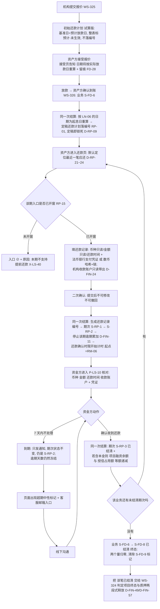
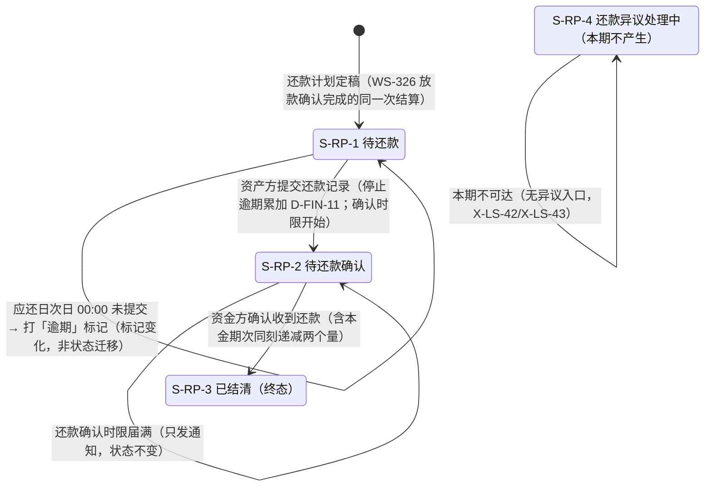

# 金融服务平台 · 金融服务端 · 借贷广场 — 还款计划与还款确认 PRD **V3.3**

> **本模块为两册。** 本册是**主文档 · 核心范围与功能规格**；页面规格、异常分支、数据字段、对外契约增量、非功能、指标、依赖与风险、消息事件、验收标准汇总在分册。
>
> | 文件 | 内容 | 读者 |
> | --- | --- | --- |
> | `v1.0-借贷广场-还款计划与还款确认-PRD.md`（本册） | 第 1～5 章、6.0～6.5、第 12 章：背景与范围、角色与场景、主流程与状态机覆盖段、**两版还款计划的关系**、**计息与期次生成口径**、**「最近一笔应还」的排序定义**、**不允许提前还款的拦截点**、**`D-FIN-11` 与「资金方确认后才算结束」的分离**、功能清单、模块详情、待裁定与遗留 | 需求方、设计、实现 |
> | [`01-数据字典与对外契约.md`](01-数据字典与对外契约.md) | 6.6～6.8、第 7～11 章：页面规格、异常分支、深链契约增量、还款计划与还款记录字段、非功能、指标、依赖与风险、消息事件登记、验收标准汇总 | 设计、我的控制台（WS-328）、消息中心（WS-329）、实现方、测试 |
>
> **两册编号连续、不重复定义**：同一个编号只在一处定义，另一册引用。
> **与上游的关系**：WS-324（**V9.1** 已入库）、WS-325（**V7.1** 已入库）、WS-326（**V3.2** 已入库，目录已改名为 `v1.0-借贷广场-放款与放款确认/`）是本模块的直接上游。**凡上游已定义的对象、公式、状态、契约，本册一律引用编号，不复述、不改写**；本册只写本模块新增的那一段。

## 1. 文档信息

| 项 | 内容 |
| --- | --- |
| 对应需求 | WS-327「借贷广场 · 还款计划与还款确认（PRD + 原型）」 |
| 所属平台 / 端 | 金融服务平台 · **金融服务端**（面客 Web，含未登录访客态；**默认英文**，`D-LS-15`） |
| 模块定位 | 借贷广场第四段（WS-323 简报第 11 章 **M-4**） |
| 上游输入 | 《需求诊断简报 V6.0》、《附册 · 融资全生命周期 V5.0》A4.3 / A5.4 / A5.5 / A5.6 / A6.1（WS-323）；**WS-324 已入库 PRD V9.1**（`cly-V1.0.0` / `ea27d1e`，主册 + 分册，含分册 6.9 / 6.9.1 / 10.5 / 10.6）；**WS-325 已入库 PRD V7.1**（同分支 / `ea27d1e`，含 `QT-15` 还款类型、`QT-16` 最终还款日两个定值字段）；**WS-326 已入库 PRD V3.2**（同分支 / `ea27d1e`，衔接点为「**放款确认**完成」）；**需求方 2026-09-11 09:39 对主流程的六条裁定**、**2026-09-14 的九条 UI／口径裁定与裁定 12（跨境手续费）**、**2026-09-15 的三条裁定（环节改名、还款类型与最终还款日定值、承载形态两分）** |
| 依赖文档 | WS-324《借贷广场 · 融资需求与代币质押 PRD **V9.1**》、WS-325《借贷广场 · 授信报价与接受拒绝 PRD **V7.1**》、WS-326《借贷广场 · **放款与放款确认** PRD **V3.2**》、WS-318《资产清单与代币签发 PRD》（汇率与哈希格式）、WS-308『01-国际化基线.md』、`docs/notification-contract/接入指南.md` |
| 编写人 | 许楚清（需求分析师） |
| 文档状态 | **V3.3**（需求方 09-15「**其他按照默认取值**」一次性裁定，**8 条开放项全部按本册默认值定稿、本模块已无开放项**；正文未改，见 12.1。旧展示名跨模块清理同轮完成，10.3 第 14 条关闭）。V3.2 修两处会误导实现的表述：① `D-FIN-24` 红线里残留的一句旧来源（改锚后仍写着「只读带出报价时的 QT-07/QT-08」，与同一行前半句自相矛盾）；② 上游版本指针滞后一版（仍写 V9.0 / V7.0 / V3.1，实际已是 **V9.1 / V7.1 / V3.2**，同一次提交 `ea27d1e`）。**业务规则、字段与编号一个未动。** V3.1 落 09-15 两条新裁定：`Q-RP-06` 关闭——打款目标改锚 WS-326 放款时登记的还款收款账户；链收敛为 ETH 常量。改动说明见 1.3）。V3.0 为承接版（承接需求方 09-15 三条裁定并对齐 WS-325 V7.0 / WS-326 V3.1，**本模块自有业务规则未重写**，改动范围见 **1.2**。`Q-RP-01`（融资到期日来源）与 `Q-RP-05`（同名不同义）**已由需求方裁定关闭**；新增 `Q-RP-06`（机构收款账户来源）为**阻塞级开放项**。V2.0 起的其余口径：`Q-FIN-17`/`26`/`27`/`28`/`29` 五项按需求方指示**带默认建议往下写**，在文中一律标 `[待裁定]`；新增 `Q-RP-01`～`Q-RP-03` 三项结构性待裁定。全部待裁定项**不阻塞开发启动**，改动代价逐条列在 12.1） |
| 编号空间 | 沿用上游、不回收作废号。**V2.0 按 `cly-V1.0.0` 现状重新选号**：WS-324 V9.0 与 WS-325 V5.0 已入库并占用 `AC-LS ≤ 119`、`D-LS ≤ 32`、`AC-FIN ≤ 28`、`D-FIN ≤ 105`、`F-LS ≤ 36`、`M-LS ≤ 29`、`R-LS ≤ 27`、`X-LS ≤ 24`、`DEP ≤ 26`、`US ≤ 20`、`FD ≤ 21`；**WS-326 V2.0 未入库、grep 不到，已手工避开**其 `AC-LS 125～130`、`AC-FIN-35`、`F-LS 45～58`、`X-LS 28～38`、`M-LS 32～40`、`R-LS 35～44`、`DEP 35～46`、`US 24～32`、`FD 30～39` 与 `D-LN-*`/`AC-LN-*`/`E-LN-*`/`Q-LN-*`/`LN-*`。本模块因此取：`AC-FIN-*`（**36 起**）/ `AC-LS-*`（**131 起**）/ `F-LS-*`（**60 起**）/ `X-LS-*`（**40 起**）/ `M-LS-*`（**42 起**）/ `R-LS-*`（**45 起**）/ `DEP-*`（**47 起**）/ `US-*`（**34 起**）。本模块专属段位：条款 `D-RP-*`、验收 `AC-RP-*`、异常 `E-RP-*`、待裁定 `Q-RP-*`、字段 `RP-*`（还款计划期次）与 `RM-*`（还款记录）、融资业务增量 `FD-40` 起。**本模块新增业务状态数 = 0**（`D-RP-01`） |

## 1.1 V2.0 对齐说明（对齐 WS-324 V9.0，**业务规则未重写**）

> **V3.0 保留本节作为历史记录**，本轮改动见 **1.2**。

本版**只改因上游变更而必须改的部分**：术语、对外状态、承载形态、编号、跨模块口径承接。两版还款计划的关系、期次生成算法与计息口径、「最近一笔应还」排序、提前还款的五个拦截点、`D-FIN-11` 与裁定 7 的分离、7 天还款确认时限与超期出口——本模块自有的业务规则**一条未动**。

| 项 | 本模块的落点 |
| --- | --- |
| **A 术语改名**（WS-324 `D-LS-17`） | 全文替换完成，旧词根零残留（`grep` 自查为 0）。**先把含旧词根的全部搭配列出来再替换**，本模块共 **4 个搭配、6 处**（数量少是因为本模块本就不做额度闸门，只是引用）：「⋯闸门」→ **覆盖闸门**（2 处）、「⋯档位」→ **质押覆盖状态**（2 处）、「⋯不足」→ **覆盖不足**（1 处）、「⋯预警」→ **覆盖不足提醒**（1 处）。本模块**没有**动词形态的那处用法（"平台不⋯合同真伪"在 WS-326 的合同核验段，本册不涉及）。反向验收 `AC-RP-22` **不复写旧词根**、改为引用 `D-LS-17` 的裁定，以便 grep 自查归零 |
| **B 对外状态五值**（WS-324 `D-LS-18` / 分册 6.9.1） | 新增 **4.4**：一律引用、不重新定义、不另立第二套展示状态。**本模块的特殊之处是一次跃迁都不驱动**——`已放款` 进入后不再退出，结清（`S-FD-8`）不转出、不新增第六个取值；还款进展按需求编号 `FP-28` 在还款流程段展示。正向条款 `D-RP-64` + 反向验收 `AC-RP-23` |
| **C 九条跨模块项** | 逐条核：① 借贷广场 —— 本册自始如此，无改动；② 合同号/发票号 —— 本册从未引用，无改动；③ **非登录态操作区只出「立即登录」** —— 已改（3.1、6.1、`D-RP-67`），与 WS-311 的偏离**只登记、不改 WS-311**；④ 取消两段式创建发布 —— 本册不涉及 `P-LS-03`，无改动；⑤ **操作区三段 + 当前环节出按钮 + 弹窗承载** —— **本版改动最大的一条**，见 4.5；⑥ 英文默认与术语表 —— 分册第 8 章新增一行、7.4 列出本模块需要对照的术语，**不自造英文**；⑦ **需求编号 `FP-28`** —— 带进弹窗、计划表、摘要与全部消息（`D-RP-66`、分册 7.4／10.4） |
| **D 编号避让** | 按仓库现状 + WS-326 V2.0 附件重选，见 1. 编号空间。实际撞上四处：`FD-28`～`35`（WS-326 V2.0 占 30～39）→ **`FD-40`～`47`**；`AC-LS-110`～`115`（WS-325 V5.0 已占到 119）→ **`AC-LS-131`～`136`**；`R-LS-40`～`50`（WS-326 占 35～44）→ **`R-LS-45`～`55`**；`DEP-40`～`51`（WS-326 占 35～46）→ **`DEP-47`～`58`**。另**引用侧同步改号**：WS-326 的放款确认时间 `FD-24`→**`FD-35`**、确认超期标记 `FD-25`→**`FD-36`**、确认时限至 `FD-26`→**`FD-37`**、剩余确认时限 `FD-27`→**`FD-38`**；倒计时验收 `AC-LS-101`→**`AC-LS-126`**；风险 `R-LS-29`→**`R-LS-36`**、`R-LS-30`→**`R-LS-37`**、WS-325 的"平台手里没有合同正文" `R-LS-20`→**`R-LS-21`**。**本模块不再自定义 `AC-FIN-30`**——WS-325 V5.0 已把"两个维度各做一次原子转移"定为 `AC-FIN-27`，本册改为引用；本模块自己的**转出**验收由 `AC-FIN-32` 上移为 **`AC-FIN-36`** |
| **E 环节名同名不同义（V2.0 登记，**V3.0 已由需求方裁定关闭**）** | 当时沿用 WS-325 `D-LS-32` / WS-326 `D-LN-46` 的同一处置，本册记为 `D-RP-65`。⚠️ **本模块比前两环更危险**：本册自己还有一个「**还款确认**」，两个"确认"会在同一张详情页上并排出现，因此本册要求**凡两者相邻处一律写全称**，不得简写为"确认" |
| **承接 WS-326 主册 5.5 / 分册 10.3 第 7 条** | 五项逐项落位：① 生成触发点 = 放款确认完成的同一次结算、本金取 `QT-03`（`D-RP-10`，未改）；② 计息基准只能取 `LN-06` 或 `FD-35`、不得用 `LN-05`（`D-RP-11`，本版只改引用号，**结论未变**：起息日取 `LN-06`）；③ **跨境手续费裁定 12** —— 本版**实质新增**，见 6.3.5 与 `D-RP-68`～`D-RP-70`；④ 两个维度的**转出**由本模块做（5.7，未改，验收号改为 `AC-FIN-36`）；⑤ 质押释放与项目终态绑定、两段式（`D-RP-39`，未改） |

## 1.2 V3.0 改动说明（承接需求方 09-15 三条裁定，**本模块自有业务规则未重写**）

基线是已入库的 V2.0（`cly-V1.0.0` / `57e7db3`）。本轮只做五项；两版还款计划的关系、期次生成与计息算法、「最近一笔应还」排序、提前还款的五个拦截点、`D-FIN-11` 与「资金方确认后才算结束」的分离、168 小时时限与超期出口**全部原样**。

| # | 改了什么 | 落点 |
| --- | --- | --- |
| **一 · 改名** | `S-FD-4` 环节展示名定为「**放款确认**」（需求方 09-15 02:19），WS-325 的接受/拒绝环节定名「**报价确认**」（06:01），**旧展示名全链路作废、不归属任何模块**。本册正文、表格、状态机、通知与验收里指 WS-326 那一步的说法全部改到位；`D-RP-65` 由"待拍板的冲突登记"**改写为已关闭记录**，`AC-RP-25` 反向验收**只引用裁定、不复写旧名** | 4.3、4.4 `D-RP-65`、5.1、5.2、5.3、分册 6.7／10.3／11 |
| **二 · 两个上游定值字段** | WS-325 V7.0 新增 `QT-15` **还款类型**（本期唯一取值 `按季付息；到期还本付息`，枚举、只读）与 `QT-16` **最终还款日**（**派生值**，恒等于项目截止日 `FP-09`，**跟随不快照**，`D-CR-53`）。本册**一律引用、不另立第二套枚举**（需求方 09-15 明示）；`Q-RP-01` 随之关闭 | 5.3 `D-RP-12`/`D-RP-13`、6.4.4、分册 7.1 `RP-12`/`RP-13`、7.3 `FD-46`、7.4 |
| **三 · 承载形态两分** | WS-325／WS-326 把承载再拆一层：**做事类走右侧抽屉 760px、提示类走居中弹窗 560px、同一时刻只有一层**（WS-326 `D-LN-48`/`D-LN-54`）。V2.0 的"三个弹窗"整条重述，本模块按**判据**归类而不是逐个列举 | 4.5（`D-RP-71`/`D-RP-72`/`D-RP-73` 重述 + 新增 `D-RP-76`）、6.1、分册 6.6／6.8 |
| **四 · 术语撞名，改本册的** | WS-325 `QT-15` 占用了「**还款类型**」这个名字（＝按季付息；到期还本付息），而本册 V2.0 的 `RP-13` 也叫「还款类型」（＝正常还款／逾期还款）。**同一个词在同一条链路上指两件事**——按"取值以 WS-325 PRD 为准、不另立第二套枚举"的指示，**改的是本册**：`RP-13` 更名为「**还款性质**」，`RP-12` 直接引用 `QT-15` 不再自定义 | 6.4.4 `D-RP-49`/`D-RP-50`、分册 7.1、7.4、`AC-RP-27` |
| **五 · 上游撤字段引发的缺口**（**V3.1 已解除**） | WS-325 09-15 06:10 撤除报价时的机构收款账户，本模块 `RP-14`/`RM-09`/`RM-10` 曾因此断源，登记为阻塞级 `Q-RP-06`。**08:10 裁定给出了替代来源**（放款时登记，WS-326 `LN-15`/`LN-16`），`Q-RP-06` 与 `R-LS-59` 一并关闭，见 1.3 | 1.3、6.3.1、分册 7.1／7.2、12.1、10.3 |

**本轮未改、需求方也未提的**：编号空间（WS-326 V3.0 的 `FD-30`～`39`、`LN-01`～`14`、`AC-LS-125`～`130` 与 V2.0 一致，本册号段无需再动）、术语（旧词根仍为零残留）、对外状态（本模块仍一次跃迁都不驱动）。

---

## 1.3 V3.1 改动说明（两条 09-15 新裁定，**业务规则未重写**）

| # | 改了什么 | 落点 |
| --- | --- | --- |
| **一 · `Q-RP-06` 关闭（原阻塞级）** | 09-15 08:10 裁定**放款时登记「还款收款账户」**，本模块的打款目标就此有了来源：**法币 WS-326 `LN-15`（户名 / 账号 / SWIFT / 开户行 / **中转行**，整组必填）、数币 `LN-16`（资金方绑定钱包地址，只读）**，不再锚在已撤除的 `QT-07`/`QT-08` 上。⚠️ **这不是那两个字段的回滚**——时点（报价 vs 放款）、用途、归属环节都不同（WS-326 `D-LN-68`）。 **连带简化**：该账户**放款后本期不可改**（WS-326 `X-LS-39`），本模块可把打款目标当**常量**消费，**不需要"改账户后同步未结清还款计划"这条路径** | `RP-14`／`RM-10` 改锚、`R-LS-59` 解除、分册 10.3 第 13 条更新、12.1 `Q-RP-06` 关闭、6.3.1 收款账户行 |
| **二 · 链收敛：本期只支持 ETH** | 链是**常量不是选项**：`RM-09` 由"必填录入 + 与 `QT-08` 一致校验"降为**系统常量 `ETH`、只展示不给选择控件**；USDT/USDC 即 ERC-20；区块浏览器取 ETH 固定前缀；**"链不一致则拒绝"（`E-RP-05`）本期不可达**，条文保留、标注、不构造用例。**口径主体在 WS-326 主册 5.6（`D-LN-60`～`D-LN-63`），本册引用、不重述** | `RM-09`／`E-RP-05`／`RM-13`、6.3.2 数币分支行、S32、对照表、分册 7.3 |

---

## 2. 背景与目标

### 2.1 背景

WS-326 把一笔融资推到了 `S-FD-6 还款中`：钱已经打了、资产方已经确认到账、两个维度的四个量已经原子转移完毕。**从这一刻起，平台欠双方的只剩一件事——把"什么时候该还多少"说清楚，并把每一笔还款如实记下来。** 本模块就是这一段，也是整条链路上**唯一一段要由平台算出一个数字、并让双方都按这个数字行事**的地方。前三段平台只是记录双方的意思表示（报价金额、放款凭证、确认动作），本模块第一次要**生成**内容：还款计划。

需求方 2026-09-11 09:39 亲自定了这条线的六步：**报价时拟定初始计划 → 放款确认时按实际放款时间重算定稿 → 不允许提前还款 → 广场默认定位最近一笔应还 → 上传还款凭证 → 资金方确认后本笔结束。** 本册严格按这六步写。

**本模块最容易出事的地方有四处**，5.2、5.4、5.5、6.3 分别对应：

1. **两版计划的关系没交代清楚**。报价期那版只能按"预计放款日"试算，定稿版按实际放款日重算——两版的日期几乎必然不同。不把"哪版有效、差异算不算条款变更、定稿后能不能再动"写死，前端就画不出报价页那张表，资产方也会拿着报价页的日期来质问为什么变了。
2. **「最近一笔应还」写成"最近"就等于没写**。资产方名下可能同时有多笔业务、多个期次，其中还夹着逾期未还的。排序规则不精确到字段级，实现方会各写各的，最后出现"资产方先还了新账，旧账利息一直滚"。
3. **「不允许提前还款」不落到拦截点就等于没拦**。只写一句"不支持"而还款入口常开，资产方照样能在第一期还完就把整笔结清。
4. **`D-FIN-11` 会在实现时被"优化"掉**。第 6 条「资金方确认后本笔还款才算结束」读起来像是"确认前这笔还款不算数"，顺手就会把停止计息的时点后移到确认时刻——**本期没有异议入口，这一条是资产方唯一的保护**。

### 2.2 本期目标

| # | 目标 | 达成口径 |
| --- | --- | --- |
| G-1 | 六步走完一笔还款，中间不出现新的业务状态 | 4.1 + `D-RP-01`，本模块新增状态数 = 0 |
| G-2 | **两版还款计划的关系写死**：哪版有效、差异怎么呈现、定稿后不可再动 | 5.2，`D-RP-04`～`D-RP-09` |
| G-3 | **计划算得出来、算得一致**：期次边界、每期金额、计息规则一次定清 | 5.3 + 5.4，`D-RP-10`～`D-RP-20` |
| G-4 | **「最近一笔应还」有唯一确定的排序结果**，任何实现跑出来都一样 | 5.5，`D-RP-21`～`D-RP-24` + `AC-RP-06` |
| G-5 | **提前还款被具体的东西挡住**，不是被一句话挡住 | 6.2，`D-RP-25`～`D-RP-28` + `AC-RP-07` |
| G-6 | **资产方不因机构的不作为而背上逾期**，且这条保护不被"确认后才算结束"吃掉 | 5.6，`D-FIN-11` 承接 + `D-RP-29`～`D-RP-31` + `AC-RP-09` |
| G-7 | 还款凭证与 WS-326 的放款凭证**严格对称**，控制台只需一套渲染 | 6.3，`RM-*` 与 `LN-*` 逐字段对照（分册 7.2） |
| G-8 | 本模块新增的跳转全部长在 WS-324 既有的契约上 | 分册 6.8，**不新开一套跳转约定**（`AC-LS-07`） |

### 2.3 范围（含）

- **初始还款计划（报价期试算版）**：基准日、展示口径、"预计"标注、接受环节的告知与留痕
- **定稿还款计划（放款确认后）**：生成触发点、起息日、期次边界、每期本息、计息规则固化、定稿即锁死
- **计息口径**（`Q-FIN-17` 剩余部分）：年化/期内、单复利、计息基数、算头不算尾 —— **均带默认建议并标 `[待裁定]`**
- **还款录入 `P-LS-09`**：法币 / 数币两分支的字段、校验、提交与留痕；**入口开窗规则**（提前还款的拦截点）
- **还款确认 `P-LS-10`**：资金方确认收到还款；**7 天还款确认时限**及其超期出口
- **「最近一笔应还」的默认定位与可自选**：排序规则、跨业务口径、字段级定义
- **逾期标记**（`Q-FIN-29`）：判定时点、逾期天数、并行标记而非状态、本期的处置边界
- **期次结清与业务结清**：`S-RP-3`、`S-FD-8`，以及 `项目融资余额` / `授信占用额` 的逐期递减
- **对外契约增量**：`available_actions` 新增取值与锚点（分册 6.8）、本模块产生的消息事件登记（分册 10.4）

### 2.4 范围（不含）

| 编号 | 本期不做 | 归属 |
| --- | --- | --- |
| `X-LS-40` | **提前还款**（含提前结清、提前还本、跳期还款） | 需求方 09:39 裁定 3，承接 `X-LS-06`/`D-FIN-47`。拦截点在 6.2，**不是一句"不支持"** |
| `X-LS-41` | **部分还款**（一期金额分两次或多次支付） | `Q-FIN-28` 剩余部分，本册取**不支持** `[待裁定]`，理由与代价见 6.2.3 |
| `X-LS-42` | **「提出异议」入口**（还款侧） | 与 WS-326 同一落法（`X-LS-28`）：确认环节只保留「确认」一个动作，异议走线下客服邮箱（6.5） |
| `X-LS-43` | **`S-RP-4 还款异议处理中` 及其裁决三值** | **本期不可达**：没有异议入口就产生不了这个状态。状态机条文保留、标注本期不产生（`D-RP-02`）；`Q-FIN-24`/`Q-FIN-25` 本期消解 |
| `X-LS-44` | **运营端还款异议裁决界面**（`G-01`） | 无立项。本期不因此阻塞——没有异议就没有待裁决对象 |
| `X-LS-45` | **罚息的计算与展示** | `Q-FIN-29` 本册取**只记逾期天数、不算罚息金额** `[待裁定]`，理由与代价见 6.4.2 |
| `X-LS-46` | **逾期触发的质押处置 / 强制平仓 / 代偿** | 处置能力本期完全不存在（承接附册 A5.6）。逾期只驱动标记与展示，**不触发任何自动处置**（`D-RP-35`） |
| `X-LS-47` | **逾期对该资产方在其他机构授信的传导** | 跨机构风险传导本期不做（承接跨主体隔离 `D-LS-09`/`D-FIN-25`）。`Q-FIN-29` 该分项的结论见 6.4.3 |
| `X-LS-48` | **还款计划的展期、重组、条款变更、期次调整** | 定稿即锁死（`D-RP-09`）。本期没有任何修改计划的入口，演进切入点见分册 `R-LS-47` |
| `X-LS-49` | **还款记录的修改与撤回；还款确认的撤销** | 与 WS-326 `X-LS-32` 同构、同理由（6.3.4、6.5.2） |
| `X-LS-50` | **交易哈希的链上核验** | 承接 `X-LS-33`/`D-LN-10`：本期只做格式校验，提供区块浏览器链接 + "平台未核验"标注 |
| `X-LS-51` | **多币种还款金额的合计展示** | 承接 `D-FIN-13` 与术语红线：**跨币种不得求和**（`D-RP-40`） |
| `X-LS-52` | **质押的释放与提取** | WS-324（`D-FIN-49`/`D-FIN-57` 两段式）。本模块只输出"该笔业务已结清"这一事实，**不释放任何质押**（5.7） |
| `X-LS-11`（承接） | 链上持仓查询与对账 | 后台自动进行，不在本模块 |

> **本模块不触达链上**：还款的链上转账发生在**平台之外**（资产方自己的钱包或银行），平台只收下哈希与链的文本记录。**本模块不发起任何链上调用、不消耗 gas**（承接 `D-FIN-67`），因此不重复 WS-324 分册 6.7 的链上章节。

### 2.5 上游口径声明（**原样保留，不得删改**）

> 本模块的额度口径、覆盖闸门、状态机、深链契约、项目到期两分支、质押释放两段式、**质押覆盖状态定名**（`D-LS-17`）、**融资需求对外状态五值**（`D-LS-18`／分册 6.9.1）与**操作区三段结构**（`D-FIN-79`／`AC-LS-85`／分册 6.9）以 **WS-324 已入库 V9.1** 为准；报价内容（融资金额、币种、利率、**还款类型 `QT-15`**、**最终还款日 `QT-16`**、机构收款账户、汇率快照）与**跨境手续费裁定 12**（`D-FIN-102`～`D-FIN-105`）以 **WS-325 已入库 V7.1** 为准；放款与放款确认的时间字段、凭证基线、确认时限口径与**承载形态两分判据**（`D-LN-48`/`D-LN-54`）以 **WS-326 已入库 V3.2** 为准。
> **关于衔接面**：本模块只承接「**放款确认**完成」这一个衔接点（`D-LN-16` 的触发事实 + `LN-06`/`FD-35` 两个权威时间字段），衔接面是**状态机与两个时间字段**，不是放款内容。**三个上游现已全部入库并同步到 09-15 两条新裁定**（WS-324 V9.1 / WS-325 V7.1 / WS-326 V3.2，同一次提交 `ea27d1e`），本册的全部跨模块引用均可在仓库内解析。

### 2.6 八条不可削弱的红线

| 编号 | 红线 |
| --- | --- |
| `D-FIN-11`（承接，**本模块是唯一落地方**） | **资产方提交还款记录的时刻即停止该期的逾期累加与计息**，资金方确认只是**对账动作**。第 6 条「资金方确认后本笔还款才算结束」指的是**还款记录与该期次的状态终结**，**不是**把停止点后移到确认时刻——两者在 5.6 分开定义、分别验收。⚠️ **本期没有异议入口**，机构拖着不确认时资产方连异议都提不了，这条是资产方唯一的保护，**绝不能被优化掉** |
| `D-FIN-24`（承接，**V3.1 改锚 · V3.2 措辞修正**） | **展示用的「机构账户 / 链和地址」只读带出，还款时不可修改、不可另填。** 可改就等于给了钓鱼的口子（`RM-10`/`AC-RP-12`）。 **来源已改锚**：由报价时的 ~~`QT-07`/`QT-08`~~（09-15 06:10 已作废）改为**放款时登记**的 WS-326 `LN-15`（法币）/ `LN-16`（数币），`Q-RP-06` 就此关闭（1.3）。**红线本身一个字没松**——变的只是「带出来的那份账户从哪儿来」，「只读、不可改」照旧 |
| `D-RP-01` | **本模块新增业务状态数 = 0。** 还款、逾期、确认超期全部落在附册 A4.2 / A4.3 已定义的 `S-FD-6` / `S-FD-8` / `S-FD-9` / `S-RP-1` / `S-RP-2` / `S-RP-3` 上。"逾期""确认已超期""还款计划生成中"**一律是标记而不是状态**，理由同 `D-LN-01`/`D-FIN-77`/`D-FIN-63` |
| `D-RP-09` | **定稿计划即锁死。** 定稿后任何人都不能修改期次、日期、金额与计息规则；可以叠加在计划之上的只有三样：**逾期标记、还款记录、结清事实**。本期不存在展期、重组与条款变更入口（`X-LS-48`） |
| `D-RP-25` | **提前还款由"入口不开"来挡，不是由一句文案来挡**（6.2）。还款入口按期次逐个开窗（`RP-15`），未开窗的期次在下拉里可见但 `⊘` + 原因；**不存在"全部结清"按钮、不存在跨期合并提交、金额只读不可改** |
| `D-FIN-47`（承接） | **「已到期 · 存量处理中」是常态路径**，必须按正常状态呈现（中性样式 + "存量融资业务照常履约中"）。**本模块的每一笔业务几乎都会在这个标记下走完全程**——还本本来就发生在项目到期之后（`X-LS-06`），因此本模块的所有页面与通知文案同受此约束（`AC-RP-18`） |
| `D-FIN-06` / `D-FIN-13`（承接） | 术语用 **`项目融资余额`**，**不得简写为"融资余额"**；记账本位币恒为 **USD**，结算币种只用于展示与支付；**跨币种不得求和**（`D-RP-40`） |
| WS-325 `D-FIN-102`（承接，**裁定 12** · V2.0 新增） | **一切计量按 `QT-03` 融资金额，不按实收计。** 跨境手续费由付款方承担 ⇒ 每一笔跨境转账的实收都少于汇出。落到本模块是三条：① **还款计划的本息、`项目融资余额` 与 `授信占用额` 的递减额，一律按 `QT-03` 派生的计划金额**，不按放款时资产方实收的那个数重算（`D-RP-68`）；② **资金方确认收到还款时不得要求实收等于应还**——把「金额一致」做成确认前置，会让 168 小时的还款确认窗口被一笔汇款手续费卡住，而**本期机构没有异议入口**（`D-RP-69`）；③ WS-326 的 `FD-39` 到账实收金额**只记录、不计量**，**本模块不得引用它做任何计算、对账或拦截**（`D-RP-70`） |

**一条本期硬约束及其代价（写进验收、不得被优化掉）**：`X-LS-42` **还款侧没有异议入口**——机构收到的钱金额不符、凭证有问题、款根本没到时，**在平台上没有任何可以表达"我不认"的动作**。它唯一能做的是不点确认，而不点确认**不会**让资产方继续背逾期（`D-FIN-11`）。这条路径必须在 PRD 与界面上完整存在（6.5.3），**不能写成一句风险提示了事**；其对称代价（业务卡在 `S-FD-6` 无法结清、质押无法释放）如实登记为分册 `R-LS-45`。

---

## 3. 用户与场景

### 3.1 角色

| 角色 | 在本模块的诉求 | 权限口径 |
| --- | --- | --- |
| **未登录访客** | 看这笔业务还了几期、还剩多少、有没有逾期 | L1～L5 全量可见（含期次数、应还日、已结清期数、逾期标记与逾期天数）；**还款凭证文件、交易哈希、机构收款账户、还款备注一律不公开**（`D-RP-41`）；**操作区只出「立即登录」一个入口**，不再逐动作 `⊘` + 独立原因（WS-324 `D-LS-14`，`D-RP-67`） |
| **资产方（登录）** | 知道下一笔什么时候还、还多少、往哪儿还；还完之后不要因为对方不确认而被算逾期 | 选择期次、提交还款记录；**还款记录提交后不可修改、不可撤回**（`X-LS-49`）；**本期没有「申请展期」「提前结清」动作**（`X-LS-40`/`X-LS-48`） |
| **资金方（登录）** | 确认钱收到了；这笔业务什么时候能结清 | 确认收到还款；**本期没有「提出异议」动作**（`X-LS-42`）；**无任何写入还款计划的权限**——计划由系统生成，机构不能改期、不能催收加码 |
| **平台运营** | 本模块内无业务动作 | 无面客写入口；**本期不产生任何裁决类待办**（`X-LS-44`）；客服邮箱的线下沟通不是系统动作（6.5.3） |

> 同一企业主体下的**任一登录员工均可代表企业执行上表全部动作**，本期不做企业内「查看 / 操作」分级（`D-MC-105`/`AC-MC-16`）。
> **跨主体隔离继续成立**（`D-FIN-25`/`D-FIN-26`）：还款凭证文件、交易哈希、机构收款账户、还款与确认备注**只对该笔业务的双方可见**（`D-RP-41`）。

### 3.2 用户故事

| 编号 | 故事 | 验收落点 |
| --- | --- | --- |
| `US-34` | 作为资产方，我在接受报价之前就想知道这笔钱以后要怎么还、分几次、每次多少 | 5.2.1、`D-RP-04` |
| `US-35` | 作为资产方，报价页那张表上的日期后来变了，我要事先就知道它会变、以及按什么规则变 | 5.2.2、`D-RP-06`/`D-RP-07`、`AC-RP-02` |
| `US-36` | 作为资产方，我一进还款页就应该看到"现在该还哪一笔"，不用自己在一堆期次里找 | 5.5、6.1、`AC-RP-06` |
| `US-37` | 作为资产方，我有一笔逾期的和一笔快到期的，系统应该让我先还逾期那笔 | 5.5、`D-RP-22`、`AC-RP-06` |
| `US-38` | 作为资产方，我手头宽裕想一次性把后面几期都还了——平台明确告诉我本期不支持，并且入口就是点不动的 | 6.2、`AC-RP-07` |
| `US-39` | 作为资产方，我按时把钱打了、凭证也传了，对方十天不点确认，我不该因此被算逾期、被算罚息 | 5.6、`D-FIN-11`、`AC-RP-09` |
| `US-40` | 作为资产方，我数币还款完想让对方自己去链上查，而不是反复解释 | 6.3.2、`RM-13` |
| `US-41` | 作为资金方，钱到账了我点一下确认，这一期就该关掉；全部还完这笔业务就该结清 | 6.5.2、5.7、`AC-RP-13` |
| `US-42` | 作为资金方，对方逾期了我要一眼看到逾期了几天、逾期的是哪一期 | 6.4、`RP-11`、`FD-44` |
| `US-43` | 作为未登录访客，我想看看这个平台上的项目到底还得上还不上 | L5 公开字段 + `M-LS-44` |

### 3.3 典型场景

- **S27 报价期看计划**：机构甲对 A 的需求报价 150 万 USD、年化 8%，提交成功的同一时刻，报价详情页与接受页出现一张**初始还款计划表**，整表带「**预计 · 未生效**」标识，日期列名为「预计还款日」，表下常驻一句"实际还款日将在放款确认后按**实际放款日**重算并定稿，届时以定稿计划为准"。A 接受报价时，这段告知的展示被留痕（`FD-40`）。
- **S28 定稿**：A 在 `P-LS-08` 点「确认到账」（WS-326 `FD-35`）。同一次结算内，系统按 **`LN-06` 放款记录提交时间的日期**作起息日重算：起息日 2026-09-15、融资到期日 2027-03-20（该项目 `FP-09`），生成 2 期——第 1 期 2026-12-15 付息、第 2 期 2027-03-20 付息并还本。计划编号 `RP20260915000001`/`...02` 落库，双方各收到通知。
- **S29 广场默认定位**：A 名下有两笔业务，业务甲的第 1 期应还日 2026-12-15、业务乙的第 2 期应还日 2026-12-15（乙已逾期的第 1 期在 2026-09-30）。A 进入还款页，**默认选中的是乙的第 1 期**（已逾期、应还日最早）；下拉里其余期次按 5.5 的顺序排列，A 可以自己改选任一**已开窗**的期次。
- **S30 同日两笔的排序**：A 的业务甲与业务丙同一天都有一期应还（2026-12-15）。甲的放款记录提交时间是 2026-09-15 10:00，丙是 2026-09-16 09:00 —— **默认选中甲**（放款早的排前面）。
- **S31 法币还款**：A 选中当期 → 币种只读 USD、金额只读 = 该期应还合计 → 机构收款账户只读带出放款时登记的 WS-326 `LN-15`（含中转行） → 填还款时间、传银行支付凭证（PDF/JPG/PNG，≤10 MB，1～5 个）→ 二次确认 → 提交。同一次结算内：生成还款记录编号、期次 `S-RP-1 → S-RP-2`、**该期停止逾期累加**（`D-FIN-11`）、**还款确认时限开始计时**（起点 = 提交成功的服务端时间 `RM-06`）。
- **S32 数币还款**：A 选中当期 → 币种只读 USDT → 链为常量 `ETH`（只展示、无选择控件） → 填哈希（`0x` + 64 位十六进制，只校验格式）→ 提交。页面给出区块浏览器链接，旁边明确标注"**平台未核验该交易，链接仅供自行查验**"。
- **S33 想提前还**：A 在第 1 期刚还完时想把第 2 期一起还掉。第 2 期在下拉里可见，但**入口 `⊘`**，原因写明"该期还款入口将于 2027-03-17 开启；本期不支持提前还款"。页面上**没有**「提前结清」「一次性还清」入口，金额框不可编辑（`AC-RP-07`）。
- **S34 逾期**：A 的第 1 期应还日 2026-12-15 当天未提交。2026-12-16 00:00（平台统一时区）判定逾期 → 该期打「逾期」标记、逾期天数每日 +1；业务打 `S-FD-9 逾期` 并行标记，**状态仍是 `S-FD-6 还款中`**（`D-FIN-09`）；双方各收一条逾期通知。**平台不计算罚息、不展示罚息金额、不把罚息并入应还金额**（`X-LS-45`）。A 在 2026-12-20 提交还款 → **逾期天数冻结在 5 天**、不再累加（`D-FIN-11`），期次进 `S-RP-2`。
- **S35 机构拖着不确认**：A 12-20 提交还款，机构甲一直不点确认。12-27（+168 小时）系统判定确认超期 → **期次状态不变，仍是 `S-RP-2`** → 双方各收一条超期通知 → 页面出现中性标记"已超过还款确认时限 N 天"与**客服邮箱**入口。**A 的逾期天数仍然冻结在 5 天，不因机构不确认而继续累加**（`AC-RP-09`）。线下沟通后甲登录点「确认收到还款」→ 走 6.5.2 的完整结算，**和没超期时一模一样**。
- **S36 结清**：A 还完最后一期、机构确认。同一次结算内：末期 `S-RP-3 已结清` → 该业务全部期次已结清 → 业务 `S-FD-6 → S-FD-8 已结清`（终态）→ `项目融资余额 −150 万`、`授信占用额 −150 万` 原子递减至 0 → 清除 `S-FD-9` 标记 → 双方各收一条结清通知。**质押不由本模块释放**：本模块只把"该笔已结清"这一事实交给 WS-324，由它按 `D-FIN-49`/`D-FIN-57` 判定项目终态并做两段式释放（5.7）。
- **S37 项目到期后才还本**：A 的项目 2027-03-20 到期，打「已到期 · 存量处理中」标记。**这是常态**：末期本金本来就在到期日当天还（`X-LS-06`）。页面一律中性呈现，**不得出现告警色或"项目已过期"的措辞**（`AC-RP-18`）。
- **S38 手续费导致机构实收偏少**：A 按应还金额 150 万 USD 打款，中间行扣了 45 USD，机构实收 1 499 955。**平台记录的是"应还金额"**，本期没有差额说明字段；机构若因此不点确认，走客服邮箱线下沟通（6.5.3），**A 的逾期天数仍然冻结**（`D-FIN-11`）。代价登记为分册 `R-LS-46`。

---

## 4. 流程说明

### 4.1 主流程六步（需求方 2026-09-11 09:39 裁定口径）

> **为什么定稿在"确认到账"而不是"放款"**：承接 `D-LN-16`/`D-FIN-05` ——确认之前这笔钱还可能被推翻（本期虽无异议入口，但 `S-FD-4` 段业务仍可能长期悬空），提前生成的计划要回滚。**生成触发点与额度原子转移是同一次结算**（`AC-LN-10` 已把"还款计划生成触发"列为其中一件事）。
> **为什么逾期不是一个状态**：一笔业务可以同时"还款中"且"逾期"（三期里第一期逾期、第三期还没到期），做成互斥状态会导致状态与事实不符（`D-FIN-09`）。理由同 `D-LN-01`/`D-FIN-77`：每多一个状态，控制台（WS-328）与消息中心（WS-329）的枚举与文案映射都要跟着改。

### 4.2 期次状态机（承接附册 A4.3，一套跨模块共用）

| 编号 | 条款 |
| --- | --- |
| `D-RP-01` | **本模块新增业务状态数 = 0**（见 2.6） |
| `D-RP-02` | **`S-RP-4 还款异议处理中` 本期不可达**：产生它的唯一入口是「提出异议」，而本期没有这个入口（`X-LS-42`）。**状态机条文保留、枚举保留**，控制台与消息中心**不得为它准备文案与筛选项**，避免出现一个永远为空的 tab。连带：`Q-FIN-24`/`Q-FIN-25` 的还款侧本期消解、不用答 |
| `D-RP-03` | **一个期次至多一条有效还款记录**（`X-LS-41` 不支持部分还款的直接推论）。期次离开 `S-RP-1` 后还款入口即不可用；**并发提交只有一笔成功**，后到者返回"该期已提交还款记录"并落详情页（`E-RP-02`） |

### 4.3 现在有三个 168 小时，必须分别命名

平台上已经有两个 168 小时（WS-326 `4.3`），本模块再加一个。**三者起算点、约束对象、到期后果全不同**：

| | **报价有效期**（WS-325 `D-CR-26`） | **放款确认时限**（WS-326 `D-LN-32`） | **还款确认时限**（本模块 `D-RP-32`） |
| --- | --- | --- | --- |
| 约束谁 | 资产方处理报价 | 资产方确认到账 | **资金方确认收到还款** |
| 起算点 | 报价提交成功的服务端时间（`QT-09`） | 放款记录提交成功的服务端时间（`LN-06`） | **还款记录提交成功的服务端时间**（`RM-06`） |
| 长度 | 168 小时，自然日，精确到秒 | 168 小时，自然日，精确到秒 | **168 小时，自然日，精确到秒**（同口径） |
| 到期后果 | **自动失效**，报价终结、额度释放 | **只发通知，状态不变** | **只发通知，状态不变；逾期天数仍然冻结** |

| 编号 | 条款 |
| --- | --- |
| `D-RP-32` | **三个时限的时间口径完全一致**（服务端提交时间起算、自然日、提交时刻 + 168 小时精确到秒、按平台统一时区展示并标注），**只有到期动作与约束对象不同**。理由同 `D-LN-18` |
| `D-RP-33`【命名红线，扩展 `D-LN-19`】 | **界面、字段、文案中不得出现无限定词的"7 天""有效期""倒计时"**。一律写全称：「报价有效期」「放款确认时限」「**还款确认时限**」。同一笔业务的详情页上三者可能先后出现，混称会让用户以为不确认就会自动作废。**另有两个不是 168 小时的时间量也必须写全称**：「还款入口开启时间」（`RP-15`）与「逾期天数」（`RP-11`），不得简称"倒计时"或"天数" |

### 4.4 融资需求对外状态：**本模块一次跃迁都不驱动**（对齐 WS-324 `D-LS-18`）

**对外 5 值定义在 WS-324 分册 6.9.1，本模块一律引用、不重新定义、不另立第二套展示状态**（WS-324 `AC-LS-93`）。它是展示层的收敛视图，内部仍只有一套 `S-FD-*`/`S-RP-*`（`D-FIN-28`）。

**本模块是四个模块里唯一一个对这张表只读不写的**：业务进入 `S-FD-6 还款中` 的那一刻，对外状态已由 WS-326 置为 `已放款`；此后本模块发生的每一件事——定稿计划、逐期还款、逾期、确认、结清——**都不改变它**。

| 本模块的事件 | 内部迁移 | 对外状态 |
| --- | --- | --- |
| 还款计划定稿 | 生成 `S-RP-1` 期次 | **不跃迁**，仍是 `已放款` |
| 资产方提交还款记录 | `S-RP-1 → S-RP-2` | **不跃迁** |
| 期次逾期 | 无迁移（仅 `RP-11`／`FD-44` 标记） | **不跃迁** |
| 资金方确认收到还款 | `S-RP-2 → S-RP-3` | **不跃迁** |
| **全部期次结清 → 业务结清** | `S-FD-6 → S-FD-8 已结清` | **不跃迁，仍是 `已放款`** |

| 编号 | 条款 |
| --- | --- |
| `D-RP-64`（**新** · V2.0） | **`已放款` 进入后不再退出，本模块不驱动任何对外状态跃迁，也不新增第六个取值。** WS-324 `D-LS-18` 明写 **"还款进展不用需求状态表达"**，并把 `S-FD-8 已结清` 一并归在 `已放款` 下——这是 5 值枚举的**刻意取舍**：资金方在**需求维度**关心的只是"钱放出去了没有"，而"还了几期、有没有逾期、结清没有"属于**还款流程段**的信息，按需求编号 `FP-28` 在那里展示（`D-RP-66`）。 **因此本模块必须做到三件事**：① **结清不转出**——`S-FD-8` 不触发任何对外状态变化；② **逾期不转出、也不做成对外状态的修饰**（不得出现"已放款 · 逾期"这类拼接标签）；③ **不新增取值**，广场列表与融资信息清单上不得因还款进展多出任何筛选项或标签。 **代价（如实记录）**：从广场列表上**看不出**一笔已放款的需求是正常履约还是已经逾期 30 天——这是上游刻意的取舍，本模块不自行弥补；需要这个信息的读者去还款流程段或我的控制台看（分册 `R-LS-56`） |
| `AC-RP-23`（**新 · V2.0，反向**） | **本模块不碰对外状态**：构造"计划定稿 → 逾期 30 天 → 还款 → 确认 → 全部结清"的完整用例，**该需求的对外状态自始至终恒为 `已放款`**；断言 ① 结清后对外状态未变；② 逾期期间未出现任何对外状态变化或标签拼接；③ 广场列表、融资信息清单、我的控制台三处读到的对外状态一致且同源（WS-324 `AC-LS-93`/`H-04`）。**界面上不存在**：还款进展派生出的第六个对外取值、"已结清"作为需求状态标签、按还款进展的广场筛选项 |
| `D-RP-65`（**V3.0 已关闭**，原为待拍板的跨模块冲突登记） | **该冲突已由需求方 2026-09-15 裁定解决，本条降为历史记录。** 原冲突是：四环节展示名与附册／WS-326 内部口径共用同一个词、指两件不同的事，照字面实现会把接受报价与确认收款接反。**裁定结果**：① 接受/拒绝报价那一环节定名「**报价确认**」（归 WS-325，09-15 06:01）；② `S-FD-4` 确认收到放款那一环节定名「**放款确认**」（归 WS-326，09-15 02:19）；③ **旧展示名全链路作废、不归属任何模块**。 **本册的落地**：正文、状态机、表格、通知与验收中凡指 WS-326 那一步的说法一律改为「放款确认」（`FD-35` 放款确认时间、`FD-37` 放款确认时限至、`S-FD-4 待放款确认`）；本册自己的「**还款确认**」（资金方确认收到还款，`S-RP-2 → S-RP-3`）**名称不变**——它与「放款确认」现在是两个不同的词，不再需要靠写全称来防混淆。 ⚠️ **仍然保留一条约束**：「放款确认」与「还款确认」只差一个字、且会在同一张详情页上并排出现（第②/④环节 vs 第③段），因此**界面、字段、消息标题与客服邮箱提示语中仍不得出现无限定词的单字「确认」**（`AC-RP-25`）。本条的反向验收**不复写已作废的旧名**，只引用裁定本身，以便 grep 自查归零 |

### 4.5 承载形态：做事走右侧抽屉、提示走居中弹窗（**V3.0 对齐 WS-325／WS-326**）

WS-324 把详情页操作区定为三段（**全局操作 / 融资流程四环节 / 还款流程**），**只有当前环节下方出按钮、按角色限定可点、操作不跳离详情页**（`D-FIN-79`/`AC-LS-85`）。**第③段"还款流程"就是本模块**——按 `FP-28` 需求编号切换、展示最近一笔还款的核心信息、「立即还款」在层内完成。

V2.0 把三个承载单元定成"弹窗"。WS-325 在 09-15 把承载再拆了一层，WS-326 V3.0 据此重述（`D-LN-48`）：**做事类走右侧抽屉、提示类走居中弹窗、同一时刻只有一层**。本册按**同一套判据**归类——判据在上，下表只是照判据推出来的结果，**新增动作按判据自行归类、不必回来改这张表**。

**判据（承接 WS-326 `D-LN-48`，本册不另立）**：

| 类别 | 判据 | 承载 |
| --- | --- | --- |
| **做事类** | 用户要在里面**录入、上传、选择、分步走完一件事**，或需要**一边看信息一边填/一边逐行核对** | **右侧抽屉，宽 760px**（`D-LN-57`：**宽度不分档**，三个承载单元同一个数） |
| **提示类** | **零录入控件**，只要求用户**表一次态或知悉一件事**后继续或退出 | **居中弹窗，宽 560px** |
| 都不是 | 就地能说清的原因、状态提示 | **内联在原位或 Toast，不开任何层** |

**本模块照判据的落点**：

| 承载单元 | 类别 | 落点 |
| --- | --- | --- |
| `P-LS-09` 还款录入（选期次 + 填还款时间 + 传凭证/填哈希） | 做事类 | **右侧抽屉 760px**，仅该项目的资产方可点 |
| `P-LS-10` 还款确认（逐项核对还款记录与本期计划后表态） | 做事类 | **右侧抽屉 760px**，仅该笔业务的资金方可点（与 WS-326 `P-LS-08` 对称） |
| 还款计划查看（两版对照 + 定稿全表） | **做事类**（见 `D-RP-72` 的归类理由） | **右侧抽屉 760px**，只读、无动作按钮。**原型侧的 `P-LS-91` 即本承载单元**，该编号是原型内部页号、不进 PRD 页面清单 |
| 提交还款前、确认收到还款前的**二次确认** | 提示类（零录入、只要一次表态） | **居中弹窗 560px** |
| 期次未开窗的 `⊘` 原因与开启日期、状态已变的提示（`AC-RP-17`/`AC-LS-135`） | 都不是 | **内联在原位或 Toast，不开任何层** |

| 编号 | 条款 |
| --- | --- |
| `D-RP-71`（**V3.0 重述**，原 V2.0 版本作废） | **`P-LS-09`／`P-LS-10` 两个编号保留，语义是"承载单元"而不是"页面"**——它们是详情页操作区第③段内的**右侧抽屉（760px）**，不是可独立寻址的页面。**编号不回收**（沿用"不回收作废号"），本册对它们的**全部字段、校验、文案与验收要求原样成立**，只是装在抽屉里。深链锚点语义随之为"落详情页 + 定位第③段 + 打开对应抽屉（并选中对应期次）"（分册 6.8） |
| `D-RP-72`（**V3.0 重述**：归类理由 + 抽屉内的滚动与分区） | **还款计划查看按"做事类"归类、走 760px 抽屉，不走 560px 弹窗。** 理由是判据本身：它虽然零录入，但**不是"知悉一件事"**——两版计划要逐行比出差在哪（`D-RP-06`/`F-LS-64`），属于判据里"一边看信息一边逐行核对"的那一类；且 560px 装不下两版各 9 列的对照表，硬塞就只能横向滚动或拆列，**那正好毁掉"同屏比出差在哪"这个唯一目的**。 **抽屉内的落法三条**（原 V2.0 要求原样成立，只是容器从弹窗换成抽屉）：① 高度受限时**整体纵向滚动**，**表头与期次序号列固定**；② **计息规则常驻条（`RP-18`）与版本标识固定在抽屉顶部**，不随表体滚走；③ 期数多时**默认只展开"定稿版 + 差异行高亮"**，初始版收在同一抽屉内的次级 tab 里，**tab 切换不离开抽屉**。**不得拆成多页、不得跳新页、不得做成分步向导、不得改为卡片式逐期展开** |
| `D-RP-76`（**新** · V3.0） | **同一时刻只有一层**（承接 WS-326 `D-LN-54`）：二次确认弹窗出现时，**其下方内容（含抽屉内容）整体被遮罩覆盖且不可交互**，关闭后回到原处继续；**不新开第三层、不出现抽屉套抽屉、不出现弹窗套弹窗**。二次确认弹窗是唯一会叠在抽屉之上的层，且它**零录入、只有两个按钮**。⚠️ 本模块有一处容易违反：资产方在还款抽屉里换选期次时，**不得为"你确定要换期次吗"再开一层**——换选是可逆的、零后果，就地切换即可 |
| `D-RP-73`（**V3.0 措辞对齐**，规则不变） | **非当前环节不出任何可点按钮**（WS-324 `AC-LS-85`）。本模块的按钮**只在业务处于 `S-FD-6 还款中` 时出现在第③段**：存在 `S-RP-1` 且已开窗的期次 → 出「立即还款」（资产方）；存在 `S-RP-2` 期次 → 出「确认收到还款」（资金方）。**业务进入 `S-FD-8 已结清` 后，第③段只保留只读的「查看还款计划」，两个动作按钮一律不再出现** |
| `D-RP-67`（承接，V2.0 不变） | **未登录时操作区只出「立即登录」**（WS-324 `D-LS-14`）：本模块的动作在未登录时**不再逐动作 `⊘` + 独立原因**。⚠️ 与 WS-311 权限矩阵的 `⊘` 语义**存在偏离**，按 WS-324 `10.5` 第 9 条**只登记、不改 WS-311**；**服务端鉴权与跨主体隔离一条不减**（WS-324 `AC-LS-86`）。登录后的 `⊘` 与原因区分照旧（`AC-RP-17`） |
| `D-RP-66`（承接，V2.0 不变） | **需求编号 `FP-28` 带进本模块的每一处**：① 操作区第③段**按 `FP-28` 切换**；② 三个承载单元的标题区、还款计划表表头、还款记录与确认记录的摘要、**本模块产生的全部消息正文**，一律带 `FP-28` 并与融资业务编号 `FD-01`、还款计划编号 `RP-01` 并列；③ **不自造第二个需求标识** |
| `D-RP-74`（承接，V2.0 不变，**两个"切换"不是同一个**） | 第③段按 `FP-28` 的切换是**项目详情页内**的切换（本项目下的各轮需求）；而 5.5 的「最近一笔应还」排序是**跨融资业务、跨融资项目**的候选集合（`D-RP-21`），它服务的是我的控制台与还款抽屉内的期次选择器。**两者并存、互不替代**：进入抽屉前按 `FP-28` 选的是"哪一轮需求"，进入抽屉后按 `D-RP-22` 排序选的是"这一轮里哪一期"（`AC-RP-24`） |

---

## 5. 业务对象与核心口径

### 5.1 本模块的入口事实与出口事实

| | 事实 | 来源 / 去向 |
| --- | --- | --- |
| **入口** | 放款确认完成（业务进 `S-FD-6`）、本金口径 `QT-03`（USD）、可用的权威时间 `LN-06` 与 `FD-35` | WS-326 `D-LN-16`/`D-LN-17` |
| **入口** | 商务条款：融资金额 `QT-03`、结算币种 `QT-02`、汇率快照 `QT-04`、年化利率 `QT-06`、**还款类型 `QT-15`**、**最终还款日 `QT-16`**；机构收款账户 **WS-326 `LN-15`/`LN-16`**（放款时登记，`Q-RP-06` 已关闭，1.3） | WS-325 **V7.1** + WS-326 **V3.2**，**一律只读引用、不改写、不另立第二套枚举** |
| **入口** | 融资项目有效期至 `FP-09`（**本册不再直接取它，改经 `QT-16` 派生**，见 `D-RP-12`） | WS-324 `D-FIN-37`（首次发布日 + 1 年，只读、不可延期、再次发布不重置） |
| **出口** | 期次结清（`S-RP-3`）→ 含本金期次同刻递减 `项目融资余额` 与 `授信占用额` | 本模块执行（5.7） |
| **出口** | 业务结清（`S-FD-8` 终态）这一事实 | 交 WS-324 判定项目终态与质押两段式释放（`D-FIN-49`/`D-FIN-57`），**本模块不释放质押** |

### 5.2 两版还款计划的关系（**本模块最容易做偏的第一处**）

#### 5.2.1 两版各是什么

| | **初始计划（试算版）** | **定稿计划** |
| --- | --- | --- |
| 产生时点 | **报价提交成功的同一时刻**（与 `QT-*` 同生同灭） | **放款确认完成的同一次结算**（`D-LN-16`） |
| 基准日（起息日） | **预计放款日** = `QT-09` 报价提交日（平台统一时区的日期部分） | **实际放款日** = `LN-06` 放款记录提交时间的日期部分（`D-RP-13`） |
| 有没有编号 | **没有**。不落 `RP-01`、不占号、不产生期次对象（承接 `D-FIN-79` 不预先占号） | **有**。每期一个 `RP-01`，全局唯一、终身稳定（`H-01`） |
| 形态 | **派生试算结果**，随 `QT-*` 实时算出来的一张表 | **落库对象**，定稿即锁死（`D-RP-09`） |
| 在哪儿出现 | 报价详情页、`P-LS-06` 接受页、广场业务详情的 L5 区（报价未终结时） | `P-LS-09` 还款页、业务详情、控制台还款信息 tab |
| 谁能看 | 与报价的公开商务条款同级——**公开**（`D-LS-10`） | 期次、应还日、金额**公开**；凭证与账户不公开（`D-RP-41`） |

| 编号 | 条款 |
| --- | --- |
| `D-RP-04` | **初始计划的基准日只能是「预计放款日」，且本期取 `QT-09` 报价提交日**。理由：报价提交那一刻商务条款固化、汇率快照锁定（`D-FIN-80`），用同一时刻做试算基准，双方在同一张表上看到的是同一套数；任何"接受日 + N 天"的口径都要凭空造一个 N，而这个 N 本期没有任何数据支撑（`S-FD-3` 段没有时限，机构什么时候放款不受约束）。**替代方案与代价见 12.1 `Q-RP-03`** |
| `D-RP-05` | **初始计划不落库、不占号、不产生期次对象。** 它是一张按当前 `QT-*` 实时算出来的表；报价被拒绝、失效或终止时它随之消失，**不留残留期次**。这样处理的代价是"报价期看到的那张表"事后不可回溯，缓解手段是接受环节的留痕（`FD-40`）记下了展示事实与展示时间 |

#### 5.2.2 三个必须回答的问题（需求方直接点名）

| 编号 | 问题与结论 |
| --- | --- |
| `D-RP-06`【**要不要标"预计"**】 | **必须标，且标三处。** ① **整表**带「**预计 · 未生效**」标识（中性样式，不是警示）；② **日期列名**为「**预计还款日**」，不得写成「还款日」；③ **表下常驻一句**："实际还款日将在放款确认后按**实际放款日**重算并定稿，届时以定稿计划为准；每期金额的计算规则不变。" **反向验收**：报价期页面上不存在无限定词的"还款日""还款计划"字样（`AC-RP-01`） |
| `D-RP-07`【**接受后日期整体后移算不算条款变更**】 | **不算。** 报价提交时固化的商务条款是**金额、币种、汇率快照、年化利率、还款方式与期次规则**（3 个月一期、先息后本、到期还本付息），**不包含具体日历日期**——日期是"起息日 = 实际放款日"这条规则的派生结果，规则本身从报价时起就没变过。**但平台必须做到两件事，否则这个结论站不住**：① **接受页必须显式告知**这条规则并留痕（`FD-40`，只留痕不要求勾选，同 `D-FIN-103` 的处理）；② **定稿时双方各收一条通知**，正文带**新旧对比**（预计起息日 → 实际起息日、期数是否变化、每期应还日与金额的前后对照）。**没有这两件事，日期变化就是一次未经告知的单方变更**（`AC-RP-02`） |
| `D-RP-08`【**日期后移会不会改变期数**】 | **会，而且必须如实呈现。** 融资到期日固定为项目 `FP-09`（`D-RP-12`），起息日越晚、实际期限越短，期数只会**减少或不变**，不会增加。定稿通知的新旧对比里**期数变化要单独一行**——期数从 4 期变 3 期意味着资产方的付息节奏整体改变，这是他最需要知道的一件事 |
| `D-RP-09`【**定稿后还能不能再动**】 | **定稿即锁死，不能再动**（红线，见 2.6）。可以叠加在计划之上的只有三样：**逾期标记**（`RP-11`）、**还款记录**（`RM-*`）、**结清事实**（`RP-17`）。**本期不存在**改期、改额、展期、重组、条款变更的任何入口（`X-LS-48`）。理由：计划是双方履约的唯一基准，而合同在**线下签署**（`D-FIN-86`），平台手里没有正文可以佐证任何一次变更是双方合意的；允许改就等于允许一方在对方不知情时换一份履约安排。**代价**：真实业务里的展期与重组本期只能靠双方线下解除合同、走客服邮箱，平台上表现为持续逾期（登记为分册 `R-LS-47`） |

### 5.3 定稿计划怎么生成（期次边界）

| 编号 | 条款 |
| --- | --- |
| `D-RP-10`【**生成触发点**】 | **放款确认完成的同一次结算内生成**（承接 `D-LN-16`/`AC-LN-10`）。生成失败**不得回滚** WS-326 的额度转移与状态迁移（`E-LN-13`）：钱已到账、债务已成立是事实。此时业务详情页展示"还款计划生成中"，**不展示错误**，生成动作可重试（`E-RP-01`） |
| `D-RP-11`【**起息日**】 | **起息日 = `LN-06` 放款记录提交时间的日期部分**（平台统一时区）。这是需求方 09:39 裁定 2「按实际放款时间计算」在本平台可取的唯一权威落法：`D-FIN-21`/`D-LN-17` 已经写死**计息基准只能从 `LN-06` 与 `FD-35` 两个服务端时间里选**，`LN-05`（提交方填写的发放时间）**不得使用**。两者之间取 `LN-06` 而不是 `FD-35`，因为 `FD-35` 是资产方点确认的时刻、可能比实际打款晚好几天，用它等于让资产方通过拖延确认来少付利息 |
| `D-RP-12`【**最终还款日**】（**V3.0 重述，`Q-RP-01` 已关闭**） | **最终还款日 = WS-325 `QT-16`**，它**恒等于所属融资项目的 `FP-09` 有效期至（项目截止日）**，本期不允许调整、界面只读（WS-325 `D-CR-52`）。 **V2.0 的推断已被裁定确认**：当时全平台没有任何期限字段，本册按 `X-LS-06`/`D-FIN-47`「还本金发生在融资项目到期之后」推断取 `FP-09` 并登记为 `Q-RP-01`；需求方 09-15 已定「最终还款日本期默认＝项目截止日、不允许调整」，**结论与本册推断一致**，`Q-RP-01` 就此关闭。 ⚠️ **但有一处必须跟着改：它是派生值，不是快照。** WS-325 `D-CR-53` 写死了「不单独存储、不单独维护，项目截止日变它就跟着变」。V2.0 的 `FD-46` 原写「定稿时固化快照」，**V3.0 改为跟随**（分册 7.3）。本期两种写法取值完全一致（`D-FIN-37`：项目有效期系统生成、只读、不可编辑、不可延期），**但将来上游一旦放开项目有效期变更，「跟随」与「快照」会分叉**——按上游口径走，本册不自留第二套。 **连带影响一处**：已定稿的还款计划「定稿即锁死」（`D-RP-09`）与「最终还款日跟随」在那种情形下会正面冲突（计划锁死、末期应还日却跟着项目变）。**本期不可能发生**（项目有效期不可变），**登记为分册 `R-LS-58`，不在本期处理** |
| `D-RP-13`【**期次边界**】（**V3.0 措辞对齐 `QT-15`，算法未改**） | 还款类型恒为 `QT-15` 的唯一取值「**按季付息；到期还本付息**」。记 起息日 `T0`（`D-RP-11`）、最终还款日 `TN`（＝`QT-16`）：① **「按季」＝自 `T0` 起每 3 个自然月**取一个**付息日**（`T0+3M`、`T0+6M`……，按「同日」取，遇当月无同日则取当月最后一日）；**⚠️ 不是自然季度**（不按 3/6/9/12 月末对齐）——需求方 09-15 只说「按季付息」，而锚在起息日才能让每期天数均匀、且与「起息日＝实际放款日」这条已定裁定自洽；按自然季会让首期短至几天，且同一天放款的两笔业务会因跨不跨季末而期数不同。② 凡**严格早于 `TN`** 的付息日各成一期「**利息期**」，本金为 0；③ **末期的应还日恒为 `TN`**，还该期利息 **+ 全部本金**（到期还本付息，与 `QT-15` 后半句一致）；④ 每期的**计息区间**为「上一边界日（首期为 `T0`）→ 本期应还日」，**算头不算尾**（`D-RP-19`）；⑤ **期数 N ≥ 1**：`TN − T0 ≤ 3 个月` 时只生成一期 |
| `D-RP-14`【**首末期不足 3 个月**】`[待裁定 Q-RP-02]` | **本册取「首期不并、末期并入」**：首期恒为完整 3 个月（`T0` 起算），不存在"首期不足"；最后一个付息日与 `TN` 之间不足 3 个月时，**该段并入末期**，与还本一次付清（末期的计息区间因此可能长于 3 个月但不超过 6 个月）。理由：另一种做法（让不足 3 个月的尾段单独成期）会产生一个只有几天、金额只有几十美元的独立期次，而每一期都要走一次"提交 → 等 168 小时确认"的完整流程，成本与金额完全不成比例。**代价**：末期金额会比其他期大（本金 + 最长 6 个月利息），必须在计划表上显式标注末期的计息区间与天数，不能让资产方以为算错了（`AC-RP-05`） |
| `D-RP-15`【**不可配置**】 | **期间长度 3 个月、还款方式「先息后本 · 到期还本付息」本期硬编码**，界面**不得暗示可调**（同质押率 80% 的处理，`D-FIN-58` 同理由）。`Q-FIN-26`/`Q-FIN-27` 的取值域结论见 6.4.4 |

### 5.4 计息口径（`Q-FIN-17` 剩余部分，**全部带默认建议、全部标 `[待裁定]`**）

> **起息日已由需求方 09:39 裁定 2 关闭**（= 实际放款日，落法见 `D-RP-11`）。以下是剩余四项。

| 编号 | 项 | **本册默认取值** | 理由与代价 |
| --- | --- | --- | --- |
| `D-RP-16` | **年化还是期内** | **年化** `[已由 QT-06 关闭]` | 不是待裁定项：WS-325 `QT-06` 已把「融资利率」定义为**年化百分比**（`0 < 利率 ≤ 100`，2 位小数）。本模块**直接消费该定义，不重新开口径**。界面上的利率必须始终带"年化"二字（`AC-RP-04`） |
| `D-RP-17` | **单利还是复利** | **单利** `[待裁定]` | 先息后本：每一期的利息在当期结清，**不存在未付利息滚入本金的情形**，复利在本期的还款方式下没有作用对象。**代价**：逾期未付的利息本期也**不计复利**（与 `X-LS-45` 不计罚息一致）——逾期的经济后果本期完全由线下合同承担 |
| `D-RP-18` | **计息基数 360 还是 365** | **实际天数 ÷ 360（ACT/360）** `[待裁定]` | 平台记账本位币是 USD（`D-FIN-13`），跨境美元融资的通行惯例是 ACT/360，机构侧的线下合同大多按此写；**平台若用 365 会与合同算出的数字不一致，而合同是线下签的、平台手里没有正文可对**（`R-LS-21`）。**代价**：ACT/360 让"年化利率 × 整年"实际略高于名义利率（一年约多 1.39%），对资产方不直观 —— 因此**计划表必须常驻计息规则全文**（`RP-18`：「年化单利，实际天数 ÷ 360，起息日计息、应还日不计息」），不能只给一个数字（`AC-RP-04`） |
| `D-RP-19` | **算头不算尾** | **起息日计息、应还日不计息** `[待裁定]` | 每期天数 = 本期应还日 − 上一边界日（首期为起息日），首尾不重复计息，全期天数之和恒等于 `TN − T0`。**不写这一条，相邻两期会在边界日重复或漏算一天** |
| `D-RP-20` | **舍入** | **每期利息独立计算、保留 2 位小数、四舍五入** | 本金一次性在末期偿还、**不拆分**，因此不存在本金尾差；利息尾差不跨期结转（每期各自四舍五入），理由是每期都要独立支付、独立对账，把尾差堆到末期会让末期金额与合同算出来的数对不上 |

**每期应还金额（本册口径）**：
- **本期应还利息**（`RP-07`）= `QT-03` 融资金额（USD） × `QT-06` 年化利率 × 本期计息天数 ÷ 360
- **本期应还本金**（`RP-06`）= 末期为 `QT-03`，其余期为 **0**
- **本期应还合计**（`RP-08`）= `RP-06` + `RP-07`（USD）
- **本期应还结算金额**（`RP-09`）= `RP-08` ÷ `QT-04` 汇率快照，按 `QT-02` 币种展示。**一律用报价时锁定的快照，还款时不得重新取汇率**（`D-FIN-80`/`D-FIN-81`/`D-LN-09` 同一口径）

### 5.5 「最近一笔应还」的精确定义（**本模块最容易做偏的第二处**）

需求方 09:39 裁定 5 只说了"默认最近一笔""同一天按放款时间排"。**"最近"必须被写成一个任何实现跑出来都一样的排序**，否则实现方会各写各的。

| 编号 | 条款 |
| --- | --- |
| `D-RP-21`【**候选集合**】 | 候选 = **当前登录资产方企业主体名下、所有处于 `S-RP-1 待还款` 的期次**，**跨融资业务、跨融资项目**（资产方在还款页看到的是"我要还的钱"，不是"这个项目要还的钱"）。已提交待确认（`S-RP-2`）与已结清（`S-RP-3`）**不进候选**——它们没有可执行的还款动作 |
| `D-RP-22`【**排序键，按序比较**】 | ① **应还日 `RP-04` 升序**（早的在前）；② 同一应还日时，**该期次所属融资业务的实际放款日升序**（早的在前），字段取 **`LN-06` 放款记录提交时间**（见 `D-RP-23`）；③ 仍相同时，**融资业务编号 `FD-01` 升序**（编号含服务端日期 + 当日序号，全局唯一、终身稳定，是天然的确定性兜底）；④ 仍相同时（同一业务内不可能，保留兜底），**期次序号 `RP-03` 升序**。**默认选中 = 排序后的第一条** |
| `D-RP-23`【**"放款时间"落到哪个字段**】 | **取 `LN-06` 放款记录提交时间（服务端），不取 `LN-05` 提交方填写的发放时间。** ⚠️ 这一条与需求方 09:39 的口头表述「凭证上的放款日期」**有意不同**，理由两条，请在裁定时一并确认：① `D-FIN-21`/`D-LN-17` 已经写死 `LN-05` **不得作为任何时效与计息基准**——它由资金方自己填、可以填任意过去日期；排序决定资产方先还哪一笔、哪一笔的旧账先停止滚动，**这是一个时效类判定**，用一个由利益相关方填写的字段等于把排序权交给机构；② 起息日已取 `LN-06`（`D-RP-11`），同一个模块里"实际放款日"**不能有两个取值**，否则会出现"按 A 字段计息、按 B 字段排序"的自相矛盾。**若需求方坚持取 `LN-05`**，代价是 `D-RP-11` 起息日也要跟着改，而那会推翻 `D-FIN-21`（详见 12.1） |
| `D-RP-24`【**逾期必须排在未到期之前**】 | **由 `D-RP-22` ① 自动保证、并单独验收**：逾期期次的应还日必然早于未到期期次的应还日，按应还日升序排，逾期天然在前。**界面另须显式区分**：逾期期次在下拉与列表里带「已逾期 N 天」中性标记并排在最上方分组，未到期的排在下方分组。**反例（必须挡住）**：按"距今最近"（绝对值）排序会把明天到期的排在逾期 30 天的前面，资产方就会先还新账、旧账一直滚（`AC-RP-06`） |

> **可自选照常成立**（裁定 5 后半句）：默认选中只是默认，资产方可以在下拉里改选**任何一个已开窗的期次**（`RP-15`）。未开窗的期次**可见但 `⊘`**，附原因与开启时间——隐藏会让资产方以为计划少了几期（承接 `H-03` 对 `⊘` 与隐藏的区分）。

### 5.6 `D-FIN-11` 与「资金方确认后才算结束」是两件事（**本模块最容易做偏的第三处**）

需求方 09:39 裁定 7「资金方确认后本笔还款才算结束」与红线 `D-FIN-11`「资产方提交即停止计息与逾期累加」读起来像是冲突，**实际上它们说的是两件不同的事**，必须分开写、分开验收。

| 编号 | 条款 |
| --- | --- |
| `D-RP-29`【**两件事的分界**】 | **裁定 7 管的是「还款记录与期次的状态终结」**：期次要走到 `S-RP-3 已结清`、`项目融资余额` 与 `授信占用额` 要递减、业务要能进 `S-FD-8`，**这些都必须等资金方确认**。**`D-FIN-11` 管的是「时间的停止」**：该期的逾期天数停止累加、该期不再产生任何新的时间性后果，**这在资产方提交成功的那一刻（`RM-06`）就发生**。一句话：**确认决定"这笔还款算不算数"，提交决定"时间停在哪一刻"。** 把后者挪到确认时刻，等于让资产方为机构的不作为买单 |
| `D-RP-30`【**具体停的是什么**】 | 在本期的还款方式下，**"停止计息"的可观察效果是三条**：① **该期的逾期天数（`RP-11`）冻结在提交时刻的值**，此后不再 +1，机构再拖多久都不变；② **该期不再产生任何新的逾期事件与逾期通知**；③ **该期的应还金额一分不变**——每期利息在定稿时已固定（`D-RP-09`），本来就不随提交早晚变化，因此"提前几天提交少付利息"或"晚几天提交多付利息"在本期**都不存在**。⚠️ 第 ③ 条是本期特有的：一旦将来引入按日计息或罚息（`X-LS-45`），`D-FIN-11` 的效力范围要相应扩大到"罚息停止累加" |
| `D-RP-31`【**若将来恢复异议**】 | `D-FIN-11` 的原文已经写明：若最终裁决还款记录无效（例如伪造凭证），**按裁决结果回补**。本期没有裁决能力（`X-LS-44`），因此**不存在任何回补路径**——已冻结的逾期天数不会因为机构事后主张而回滚。这是本期能力边界的直接后果，登记为分册 `R-LS-48` |
| `AC-RP-09`（**反向，红线验收**） | **构造用例**："资产方逾期 5 天后提交还款 → 机构 30 天不确认"。断言：`RP-11` 逾期天数**恒为 5**（不是 35）、期间**不产生任何新的逾期通知**、期次仍为 `S-RP-2`、应还金额未变。**界面上不存在**：确认后才更新逾期天数的表现、"确认前仍在计息"一类文案、任何把停止点画在确认时刻的时间线 |

### 5.7 期次结清与额度递减

| 时刻 | `项目融资余额`（项目维度） | `授信占用额`（机构 × 资产方） | `未偿本金 FD-31` |
| --- | --- | --- | --- |
| 放款确认完成（WS-326） | **+150 万** | **+150 万** | 150 万 |
| 利息期结清（本模块） | **不变** | **不变** | 不变 |
| **末期（含本金）结清（本模块）** | **−150 万** | **−150 万** | **→ 0** |
| 业务进 `S-FD-8 已结清` | 该笔已归零 | 该笔已归零 | 0 |

| 编号 | 条款 |
| --- | --- |
| `D-RP-36`【**按已偿本金递减，不按已还金额递减**】 | `项目融资余额` 与 `授信占用额` 的定义都是**未偿本金**的合计（`AC-FIN-03`/`CR-08`/`D-FIN-06`），**利息不在其中**。因此**利息期结清时两个量一动不动**；只有含本金的期次结清才递减，且递减额 = 该期已偿**本金**（`RP-06`），不是应还合计。**反例**：按 `RP-08` 递减会让每还一期利息就凭空释放一次额度，资产方可以用同一份质押再融一笔 |
| `D-RP-37`【**递减时点 = 资金方确认完成**】 | 与 `AC-FIN-25`/`AC-FIN-27` 的原子转移同构、方向相反：**确认完成的同一次结算内**，两个量等额递减，**原子、无空档**。资产方提交（`S-RP-2`）时两个量**一个都不动**——钱有没有到只有机构知道，提交只是一次陈述 |
| `AC-FIN-36`（**新，与 `AC-FIN-25`/`AC-FIN-27` 同族**） | **递减与结清在同一次结算内一致生效**：期次状态、两个量、`FD-42` 累计已还、`FD-43` 未偿本金、业务状态（末期时）整体成功或整体不发生；**不存在"已确认但额度未减"或"额度已减但期次未结清"的中间态** |
| `D-RP-38`【**业务结清**】 | **该业务全部期次进入 `S-RP-3` 的同一时刻**，业务 `S-FD-6 → S-FD-8 已结清`（终态），清除 `S-FD-9 逾期` 标记，`FD-45` 记结清时间，两个量该笔归零。**业务编号保留但作废、不回收**（承接 `D-FIN-78`/`D-LN-05`） |
| `D-RP-39`【**质押不由本模块释放**】 | 本模块**只输出"该笔业务已结清"这一事实**，项目终态的判定（`S-FP-5`/`S-FP-6`）与质押释放由 WS-324 承接（`D-FIN-49`：不提供"某笔结清即释放对应代币"的部分释放；`D-FIN-57`：两段式——业务释放即时、链上提取自助自付 gas；`AC-LS-38`：常驻"您有 N 张（合计 X USD）可提取"提示）。**本模块的页面不得出现任何"结清后代币将自动回到您的钱包"的表述**（`AC-RP-19`） |
| `D-RP-40`【**跨币种不得求和**】 | 计划表、控制台、通知中的一切金额合计**一律按 USD 记账口径给出**（`D-FIN-13`）；结算币种金额（`RP-09`）**只在单期内展示、不参与任何合计**。资产方名下多笔业务的结算币种可能不同，**把 USDT 与 USD 加在一起是错的**，界面上不得出现这样的合计行 |

---

## 6. 功能清单与模块详情

### 6.0 功能清单

| 编号 | 模块 | 功能点 | 验收口径 |
| --- | --- | --- | --- |
| `F-LS-60` | 计划 | **初始还款计划试算与"预计"呈现**（报价页 / 接受页） | 5.2、`AC-RP-01` |
| `F-LS-61` | 计划 | **接受环节的日期重算告知与留痕**（`FD-40`） | `D-RP-07`、`AC-RP-02` |
| `F-LS-62` | 计划 | **定稿计划生成**（起息日、期次边界、每期本息、计息规则固化） | 5.3 + 5.4、`AC-RP-03`/`AC-RP-04` |
| `F-LS-63` | 计划 | **定稿通知的新旧对比**（起息日、期数、每期应还日与金额） | `D-RP-07`、`AC-RP-02` |
| `F-LS-64` | 计划 | **计划表展示**：期次、计息区间与天数、本息拆分、结算金额、状态与标记 | 分册 6.6.1、`AC-RP-05` |
| `F-LS-65` | 还款 | **「最近一笔应还」默认定位与期次下拉可自选** | 5.5、`AC-RP-06` |
| `F-LS-66` | 还款 | **还款入口逐期开窗与提前还款拦截** | 6.2、`AC-RP-07` |
| `F-LS-67` | 还款 | **还款记录录入与提交**（法币 / 数币两分支） | 6.3、`AC-RP-08` |
| `F-LS-68` | 还款 | **提交即停止逾期累加**（`D-FIN-11` 的落地） | 5.6、`AC-RP-09` |
| `F-LS-69` | 还款 | 交易哈希的格式校验与区块浏览器链接（**不核验**） | 6.3.2、`AC-RP-10` |
| `F-LS-70` | 逾期 | **逾期判定、逾期天数与并行标记**（不做状态、不算罚息） | 6.4、`AC-RP-11` |
| `F-LS-71` | 确认 | **还款确认与含本金期次的额度递减** | 6.5.2、`AC-FIN-36`/`AC-RP-13` |
| `F-LS-72` | 确认 | **7 天还款确认时限：计时、倒计时呈现、到期通知（状态不变）** | 6.5.1、`D-RP-32`、`AC-RP-14` |
| `F-LS-73` | 确认 | **超期后的线下出口**（客服邮箱 → 线下沟通 → 当事方自行确认） | 6.5.3、`AC-RP-15` |
| `F-LS-74` | 结清 | **业务结清与"已结清"事实的输出** | 5.7、`AC-RP-16` |
| `F-LS-75` | 契约 | `available_actions` 新增取值与锚点 | 分册 6.8、`AC-LS-07` |
| `F-LS-76` | 通知 | 本模块产生的消息事件与登记 | 分册 10.4 |
| `F-LS-77`（**新 · V2.0**） | 承载 | **操作区第③段「还款流程」**：按 `FP-28` 切换、最近一笔还款核心信息、三个弹窗入口 | 4.5、`D-RP-66`/`D-RP-71`/`D-RP-73`、`AC-RP-24` |
| `F-LS-78`（**新 · V2.0**） | 还款 | **跨境手续费的告知与“差额不阻断确认”** | 6.3.5、`D-RP-68`～`D-RP-70`/`D-RP-75`、`AC-RP-26` |

### 6.1 进入条件（服务端判定，前端不得自行推断）

> **V2.0 语义变更**：下表三项都是**详情页操作区第③段内的承载单元（弹窗）**，不是独立页面（`D-RP-71`）。"能不能进"因此等价于"第③段出不出这个按钮、按钮可不可点"，判定方一律是服务端（`H-03`），**前端不得自行按状态或日期推断**。

| 承载单元 | 谁能打开 | 服务端判定 |
| --- | --- | --- |
| `P-LS-09` 还款录入（弹窗） | **该项目的资产方**，登录态 | 业务处于 `S-FD-6` 且该轮需求（`FP-28`）下存在至少一个 `S-RP-1` 期次。**弹窗恒可打开**（可看计划、可看未开窗期次）；**提交**另需该期次已开窗（`RP-15`）且仍为 `S-RP-1` |
| `P-LS-10` 还款确认（弹窗） | **该笔业务的报价机构**，登录态、资金方 | 该期次处于 `S-RP-2`。**超期后照常可用**（`D-RP-54`：超期不改变任何权限） |
| 还款计划查看（弹窗，只读） | **双方 + 未登录访客** | 计划已定稿。未登录访客与非当事方只见公开字段（`D-RP-41`）；**未登录时第③段只出「立即登录」**（`D-RP-67`） |

| 编号 | 条款 |
| --- | --- |
| `AC-RP-17`（**V2.0 收敛**） | **`⊘` 必须附可区分的原因**（承接 `H-03`/`AC-LS-85`）：期次未开窗（**附开启日期**）、该期已提交待确认、该期已结清、非本笔业务的当事方，**登录后四种**情形文案各异，**不存在只说"暂不可操作"的兜底文案**。⚠️ **"未登录"已从本条移除**——未登录时操作区只出「立即登录」，不再逐动作 `⊘`（`D-RP-67`） |

### 6.2 不允许提前还款：拦截点（**本模块最容易做偏的第四处**）

需求方 09:39 裁定 3 只有一句"不允许提前还款"。**只写一句而入口常开，等于没拦**——资产方照样能在第一期还完就把后面几期全还了，本金提前回到机构手里，而 `X-LS-06` 明确"还本金只发生在融资项目到期之后"。本节把它落到具体的东西上。

#### 6.2.1 开窗规则（`Q-RP-03`，**默认 + 理由**）

| 编号 | 条款 |
| --- | --- |
| `D-RP-26`【**默认取值**】`[待裁定 Q-RP-03]` | **还款入口按期次逐个开窗，开启时间 `RP-15` = 该期应还日 `RP-04` 前 3 个自然日的 00:00:00**（平台统一时区），**开启后一直保持开启直到该期结清**（逾期期次的入口必须一直开着，否则逾期就永远还不上了）。**未到开启时间的期次：下拉里可见、入口 `⊘`、附原因与开启日期。** |
| `D-RP-27`【**为什么不是"到期日当天才开"**】 | 到期日当天才开会把资产方直接推进逾期：跨境电汇到账普遍需要 1～3 个工作日，数币转账也要等区块确认，**当天才允许发起就等于要求资产方当天完成跨境支付**，而本期逾期判定在次日 00:00（`D-RP-35`），几乎所有法币还款都会被判逾期。**备选方案（若需求方选"当天开"）**：必须同时给出一个宽限期，否则逾期率会虚高到没有观测价值——那等于把一个参数换成另一个参数 |
| `D-RP-28`【**为什么 3 天不构成"提前还款"**】 | 三条同时成立：① **金额一分不少**——`RM-04` 只读等于 `RP-08`，提前 3 天提交的仍然是这一期的全额；② **经济上完全等价**——每期利息在定稿时已固定（`D-RP-09`/`D-RP-30` ③），不按日重算，提前 3 天提交**不会少付一分钱利息**，资产方没有任何提前的动机；③ **动不了别的期**——开窗是**逐期**的，第 N 期开窗不会让第 N+1 期跟着开。**真正被挡住的是**：跳期还款、多期合并提交、提前还本、一次性结清 |

#### 6.2.2 一起构成拦截的五件事（缺一件就等于没拦）

| # | 拦截点 | 落法 |
| --- | --- | --- |
| 1 | **入口按期次逐个开窗** | `RP-15`；未开窗 `⊘` + 原因 + 开启日期（`D-RP-26`） |
| 2 | **一次只能提交一个期次** | `P-LS-09` 的表单绑定单个期次；**不存在多选框、不存在"全选"**（`AC-RP-07`） |
| 3 | **金额只读** | `RM-04` = `RP-08`，**不可编辑**。这一条同时挡住了部分还款与超额还款（`D-RP-03`） |
| 4 | **没有"提前结清 / 一次性还清 / 提前还本"入口** | 界面上**不存在**这些按钮与文案；**反向验收**（`AC-RP-07`） |
| 5 | **服务端终检** | 提交时重新判定该期是否已开窗、是否仍为 `S-RP-1`、是否为本人名下；**前端 `⊘` 与隐藏均不构成校验**（`AC-LS-01` 承接，`E-RP-03`） |

#### 6.2.3 部分还款（`Q-FIN-28` 剩余部分）—— **本册取「本期不支持」** `[待裁定]`

需求方特别问了"一期利息分两次付是另一回事，本期做不做"。**本册取不做**，理由三条：

1. **`D-FIN-11` 会失去判据。** 它的触发条件是"资产方提交还款记录的时刻"——付了一半算不算已提交？若算，机构收到半数就要停止逾期累加；若不算，资产方付了一半仍在滚逾期。**这条红线是本期资产方唯一的保护，不能建立在一个两可的判据上。**
2. **期次状态机会多一个状态。** 一期对多条还款记录意味着要引入"部分结清"，而 `S-RP-1/2/3` 三态是附册已定义的一套（`D-FIN-28` 一处定义两处引用），加第四态会连累 WS-328 的枚举与 WS-329 的文案映射——正是 `D-RP-01`「新增状态数为 0」要避免的（同 `D-LN-01`/`D-FIN-77` 的理由）。
3. **与 `D-FIN-19`/`X-LS-31` 同源。** 不支持部分融资、不支持部分放款，到还款这一段允许部分，等于在链路末端把口径改了。

> **`[待裁定]` 的点与改动代价**：若需求方裁定本期要支持部分还款，需要补四样——① `RM-04` 由只读改为可填 + 一条"不得超过本期应还合计"的上限校验；② 期次增加"已还金额 / 未还金额"两个派生量与一个**部分结清**语义（可做成标记而非状态，以守住 `D-RP-01`）；③ **明确 `D-FIN-11` 的触发口径**（建议：**首次提交即停止逾期累加**，与"全额还清"解耦——这是唯一不伤害资产方的取法）；④ `Q-FIN-27` 还款类型枚举加回 `部分还款`。**期次生成算法与额度递减公式不用改**，改的是一个字段的可编辑性、一组派生量与一条触发口径。

### 6.3 还款录入（`P-LS-09`）

#### 6.3.1 字段与两分支（**与 WS-326 放款凭证严格对称**）

> **字段级口径（类型、必填、校验、默认值）在分册 7.2 `RM-*`，此处不重复。** 分册 7.2 另附一张 `RM-*` ↔ `LN-*` 的**逐字段对照表**，供 WS-328 确认两侧可以共用一套渲染。

| 项 | 规则 | 与 WS-326 的对称点 |
| --- | --- | --- |
| **币种只读** | 恒等于报价时确定的 `QT-02`，**不可临时更换**（换币种等于改商务条款，`D-CR-24`） | 对称 `LN-03` |
| **金额只读** | = 该期 `RP-08` 应还合计（USD）与 `RP-09` 结算金额；**不可编辑**（`D-RP-03`/6.2.2 第 3 条） | 对称 `LN-04` |
| **还款时间** | 由提交方填写，**可以是过去的时间**，但**不得晚于提交时刻**（`E-RP-07`）。它只是业务参考与对账依据，**任何时效与计息都不用它**（`D-FIN-21`），字段旁须明示这一点 | 对称 `LN-05`，**同一条 `D-FIN-21`** |
| **收款账户** | **只读带出 WS-326 放款时登记的还款收款账户**：法币 `LN-15`（户名 / 账号 / SWIFT / 开户行 / **中转行**）或数币 `LN-16`（资金方绑定钱包地址）。**资产方不得在此修改或另填**——可改就等于给了钓鱼的口子（`D-FIN-24` 红线）。⚠️ **V3.0 的阻塞级缺口已解除**（`Q-RP-06` 关闭，1.3）；该账户在放款后本期不可改（WS-326 `X-LS-39`），本模块按常量消费 |
| **法币分支** | 必传**银行支付凭证**：PDF / JPG / PNG，**单文件 ≤ 10 MB，1～5 个**（沿用 WS-305 第 6 节基线，**不另定一套**）。**平台不审核真伪** | **与 `LN-07` 完全一致**（格式、大小、数量） |
| **数币分支** | 必填**交易哈希**（`0x` + 64 位十六进制，沿用 WS-318 `D-TI-06`）。**链不是录入项**：本期只支持 ETH，页面**只展示「ETH」、不给任何选择控件**（`RM-09`；口径主体 WS-326 主册 5.6）。补充材料（如转账截图）选填，≤ 5 个 | **与 `LN-08`/`LN-09`/`LN-12` 完全一致** |
| **提交前二次确认** | 弹窗明示三件事：① 提交后**不可修改、不可撤回**（`X-LS-49`）；② 提交即**停止本期逾期累加**，资金方将在 **168 小时**内确认，**到期不会自动视为确认**；③ 平台不核验转账真伪（`D-FIN-22`）。**必须显式确认**才可提交 | 对称 WS-326 6.3.1，**第 ② 条本模块特有**（`D-FIN-11`） |
| **提交后的原子结算** | 同一次结算内：生成还款记录编号（`RM-01`）→ 期次 `S-RP-1 → S-RP-2` → **冻结 `RP-11` 逾期天数**（`D-FIN-11`）→ **还款确认时限开始计时**（起点 = `RM-06`）→ 通知资金方。**两个额度量一个都不动**（`D-RP-37`） | 对称 WS-326，**额度不动的理由相同** |

#### 6.3.2 哈希是否做链上校验 —— **本期否**（承接 `D-LN-10`，不重开口径）

| 编号 | 条款 |
| --- | --- |
| `D-RP-42` | **交易哈希本期只做格式校验、不做链上核验**（承接 `D-FIN-22`/`D-LN-10`，理由不重复）。**不接索引服务，不做阻断式也不做告警式。** 这意味着资产方**可以填一个格式正确但不存在的哈希**；这个风险由确认环节的人工判断兜底 |
| `D-RP-43` | **平台提供区块浏览器链接，但明确标注未核验**（对称 `D-LN-11`）：由 `RM-09` 链 + `RM-08` 哈希拼出可点击链接（`RM-13`），旁边常驻一句"**平台未核验该交易，链接仅供自行查验**"，**不得表述为"查看已确认交易"** |
| `AC-RP-10`（**反向**） | **界面上不存在**：哈希旁的"已核验 / 已确认上链 / 交易有效"标识、支付凭证的"平台已审核"字样、任何暗示平台对转账真实性背书的措辞。**全文检索验收**（与 `AC-LN-02` 同一条验收，两侧共用一套文案边界） |

#### 6.3.3 法币凭证的格式与大小 —— **与放款凭证完全一致，不另定一套**

| 项 | 取值 | 依据 |
| --- | --- | --- |
| 格式 | **PDF / JPG / PNG** | WS-305 第 6 节基线，`LN-07` 同 |
| 单文件大小 | **≤ 10 MB** | 同上 |
| 数量 | **1～5 个**（法币必传；数币补充材料选填 ≤ 5 个） | 同上 |
| 审核 | **平台不审核真伪** | `D-FIN-90` 同理 |
| 可见度 | **不公开**，仅该笔业务双方可见 | `D-RP-41` |

> `AC-RP-08`：**两分支各自完整且与放款侧对称**——法币必传凭证、数币必填哈希与链；币种与金额只读且等于计划值；还款时间可填过去、不可填未来；机构收款账户只读带出不可改。**分册 7.2 的对照表逐行为真**，任一行不对称则不通过（WS-328 因此只需一套渲染）。

#### 6.3.4 还款记录只能有一条，且提交后不可改

| 编号 | 条款 |
| --- | --- |
| `D-RP-44` | **一个期次至多一条有效还款记录**（`D-RP-03`）。期次离开 `S-RP-1` 后还款入口即不可用，**并发提交只有一笔成功**（`E-RP-02`） |
| `D-RP-45` | **提交后不可修改、不可撤回**（对称 `D-LN-30`）。还款记录是资产方对"我已经付款"的**事实陈述**，机构正是据此判断要不要确认。**代价**：填错了（例如哈希抄错一位）只能靠线下沟通 + 机构照常确认，本期没有"补充说明"入口，登记为分册 `R-LS-49` |

#### 6.3.5 跨境手续费：应还按计划、实收必然更少（**V2.0 新增，承接需求方裁定 12**）

WS-325 `D-FIN-102`～`D-FIN-105` 把跨境手续费的口径定死在**放款方向**（资产方实收少于融资金额）。**还款方向是同一件事、角色对调**：资产方按 `RP-08` 应还合计汇出，中间行逐笔扣费，**资金方实收必然更少**。本节把它落到本模块。

| 量 | 取值 | 落点 |
| --- | --- | --- |
| **应还金额（汇出）** | **恒等于 `RP-08` 本期应还合计**（USD）/ `RP-09` 结算金额；由定稿计划派生，**只读不可改**（6.2.2 第 3 条） | `RM-04`，**未改** |
| **实收金额（到账）** | **必然少于应还金额**——跨境手续费（汇出行、中转行、收款行入账费）由**付款方**承担 | **本模块不设字段**（`D-RP-70`） |

| 编号 | 条款 |
| --- | --- |
| `D-RP-68`（**新** · V2.0） | **一切计量按计划金额，不按实收计**（承接 WS-325 `D-FIN-102`）：`项目融资余额` 与 `授信占用额` 的递减额恒等于该期 `RP-06` 已偿**本金**、`FD-42` 累计已还按 `RP-06`/`RP-07` 累加、`FD-43` 未偿本金按 `RP-06` 递减。**一分手续费都不进这些量。** 反例：按机构实收递减，会让每还一期就凭空留下几十美元的未偿本金残值，**业务永远结不清**、`S-FD-8` 永远到不了、质押永远释放不了（`M-LS-49` 应恒为 0 会被打破） |
| `D-RP-69`（**新** · V2.0） | **资金方确认收到还款时，不得要求实收金额等于应还金额。** 金额差额**不是**确认的前置条件、不是校验项、不产生任何阻断或警示色。理由与放款侧同构、但后果更重：本期机构**没有异议入口**（`X-LS-42`），把"金额一致"做成前置等于给了它一个合法的不确认理由，而不确认会让**期次卡在 `S-RP-2`、业务卡在 `S-FD-6`、质押锁死**（`D-RP-57`）。⚠️ **同时注意**：即使机构确实因差额而不确认，**资产方的逾期天数仍然冻结**（`D-FIN-11`/`D-RP-30`）——这是本条与 `D-FIN-11` 的交汇点 |
| `D-RP-70`（**新** · V2.0） | **本模块不采集、不存储还款方向的实收金额，也不引用 WS-326 的 `FD-39`。** ① 本模块不新增"实收"字段——放款侧的 `FD-39` 是资产方为自己留的对账痕迹，**还款方向没有对称需求**：机构的银行流水就是它的对账依据，平台再记一份只会多出一个可以拿来争议的数；② **`FD-39` 只记录、不计量**（WS-326 `D-LN-52`），本模块**不得引用它做任何计算、对账或拦截**——它记的是放款时资产方收到多少，与资产方该还多少毫无关系。**把 `FD-39` 接进还款计划的本金口径是本模块最严重的一类实现错误**（`AC-RP-26`） |
| `D-RP-75`（**新** · V2.0，**告知**） | **还款弹窗内在提交按钮之前、不折叠不做小字**给一句："本期应还 **{RP-08} USD**（以此金额汇出）；**跨境手续费由您承担**，对方到账会少于该金额，**但不影响本期还款的成立与结清**。" **不给任何预估手续费数字**（承接 WS-325 `D-FIN-104`：中转行扣费逐笔发生且事前不告知，任何预估都是平台替银行做承诺）。确认弹窗内对资金方同样给一句："到账金额少于应还金额属正常（跨境手续费由付款方承担），**不构成拒绝确认的理由**"（`D-RP-69`） |

### 6.4 逾期（`Q-FIN-29`，**带默认建议**）

#### 6.4.1 判定与标记

| 编号 | 条款 |
| --- | --- |
| `D-RP-34`【**宽限期：不设**】`[待裁定]` | **应还日次日 00:00:00（平台统一时区）起，该期次未提交还款记录即打「逾期」标记**，逾期天数每日 +1。**不设宽限期**，理由：宽限期等于把应还日整体往后挪 N 天，合同上的应还日就不再是应还日，双方对"到底哪天算晚"会产生第二套口径；跨境到账的时间差已经由 `D-RP-26` 的 **3 天开窗**在前端消化掉了。**代价**：资产方当天打款、次日才到账的情形会被判 1 天逾期——但本期逾期**不产生任何金额后果**（`X-LS-45`），只是一个标记 |
| `D-RP-35`【**标记不是状态**】 | 逾期落在**两处**，都是**并行标记**：① 期次上的「逾期」标记 + 逾期天数（`RP-11`）；② 业务上的 `S-FD-9 逾期` 并行标记（`FD-44`，记最早逾期期次与最长逾期天数）。**业务状态仍是 `S-FD-6 还款中`**（`D-FIN-09`）。**逾期期次的还款入口必须保持开启**——关掉就等于不让人还钱 |
| `D-RP-58`【**逾期天数的冻结**】 | 提交还款记录即冻结（`D-FIN-11`/`D-RP-30`）；**若该笔还款最终被线下认定无效，本期没有回补路径**（`D-RP-31`）。期次结清后，逾期天数作为**历史事实保留**在 `RP-11` 里，不清零——它是留痕，也是 `M-LS-43` 的数据源 |

#### 6.4.2 罚息 —— **本期只记天数、不算金额** `[待裁定]`

| 编号 | 条款 |
| --- | --- |
| `D-RP-46` | **平台不计算罚息、不展示罚息金额、不把罚息并入任何应还金额。** 逾期的呈现只有两样：**逾期标记**与**逾期天数**。理由三条：① **罚息率是商务条款，平台手里没有它**——报价只采集了 `QT-06` 年化利率，没有罚息率；凭空取一个（例如"利率 × 1.5"）就是替双方定合同条款；② **合同线下签署**（`D-FIN-86`），平台一旦算出一个罚息数字，资产方会按这个数字付、机构会按合同数字要，两边对不上，而平台**没有裁决能力**（本期无异议入口、无运营端）；③ 罚息一旦入账就会牵动 `项目融资余额` 与 `授信占用额` 的定义（它们是**未偿本金**合计，`D-RP-36`），而罚息不是本金，塞进去会破坏 `AC-MC-10` 恒等式。**代价**：逾期在平台上**没有经济后果**，约束力完全来自线下合同，登记为分册 `R-LS-50` |
| `Q-FIN-29` 的改动代价 | 若需求方裁定本期要算罚息，需要补四样：① **报价表单新增「逾期罚息率」字段**（改 WS-325，已入库）；② 罚息的计息口径（基数、单复利、是否按日计）；③ 一个**不进 `项目融资余额`** 的独立金额口径与展示位；④ `D-FIN-11` 的效力范围扩大到"提交即停止罚息累加"（`D-RP-30` 已预留这句）。**期次生成算法与额度递减公式不用改** |

#### 6.4.3 质押处置与跨机构传导 —— **本期都不做**

| 编号 | 条款 |
| --- | --- |
| `D-RP-47` | **逾期不触发任何自动处置**：不处置质押代币、不强制平仓、不代偿、不提前到期（`X-LS-46`）。处置能力本期完全不存在——质押的释放时点与**项目终态**绑定（`D-FIN-49`），平台没有"把代币卖掉抵债"的任何链上或业务能力。页面**不得出现**"逾期将处置您的质押资产"一类没有兑现能力的威慑文案（`AC-RP-20`） |
| `D-RP-48` | **逾期不影响该资产方在其他机构的授信**（`X-LS-47`）。跨主体隔离继续成立（`D-LS-09`/`D-FIN-25`/`D-FIN-26`）：机构看不到该资产方在其他机构的授信与履约情况。**代价**：一家机构无法从平台得知该资产方在别处已经逾期，这是本期跨机构风险传导能力的空白，登记为分册 `R-LS-51` |

#### 6.4.4 `Q-FIN-26` / `Q-FIN-27` 取值域 —— **各只留一档 / 两值** `[待裁定]`

| 编号 | 结论 |
| --- | --- |
| `D-RP-49`（`Q-FIN-26` 还款方式）（**V3.0 改为引用 `QT-15`**） | **本模块不再自定义还款方式枚举。** 还款类型／方式由 WS-325 `QT-15` 定义，**本期唯一取值 `按季付息；到期还本付息`**（`D-CR-51`），枚举位保留供后续扩展但**本期不为其他取值预留分支逻辑**。本册**只读引用、界面只读展示、不做下拉**（给下拉等于暗示可选）。 **与 V2.0 的差别只是出处**：V2.0 本册自定义为「先息后本 · 到期还本付息」，含义与 `QT-15` 完全一致；按需求方 09-15「不要另立第二套还款类型枚举、取值以 WS-325 PRD 为准」的指示，**V3.0 删除本册的自定义枚举、改为引用**，`Q-FIN-26` 就此关闭 |
| `D-RP-50`（`Q-FIN-27`）（**V3.0 更名，避免与 `QT-15` 撞名**） | ⚠️ **本册 V2.0 的「还款类型」与 WS-325 `QT-15` 的「还款类型」是两件事**——前者区分「这一笔还款是按时还的还是逾期还的」，后者指「这笔融资按什么方式还」。`QT-15` 已占用这个词，**改的是本册**：本册该字段更名为「**还款性质**」（`RP-13`）。 **取值仍为两个：`正常还款` / `逾期还款`**，且**由系统派生、不由用户选**：提交时该期次带逾期标记的记为 `逾期还款`，否则 `正常还款`。附册建议的 `提前还款` 与 `部分还款` **本期不存在于枚举中**（`X-LS-40`/`X-LS-41`）。 **反向验收 `AC-RP-27`**：界面、字段名与消息文案中，「还款类型」一词**只用于 `QT-15`**；本册的两值枚举一律称「还款性质」，**不得出现两个「还款类型」** |

### 6.5 还款确认（`P-LS-10`）与 7 天还款确认时限

#### 6.5.1 时限口径（与 WS-326 同口径，方向相反）

| 编号 | 结论 |
| --- | --- |
| `D-RP-51` | **起算点 = 还款记录提交成功的服务端时间**（`RM-06`），**不用提交方填写的还款时间**（`D-FIN-21`），也不从通知送达或机构查看时起算 |
| `D-RP-52` | **7 个自然日，精确为提交时刻 + 168 小时，精确到秒**（口径与理由完全同 `D-LN-32`，不重复）。到期时刻按平台统一时区展示并标注 |
| `D-RP-53`（**红线**） | **到期只发通知提醒，不自动改状态、不自动视为确认、不自动递减任何额度。** 自动确认等于平台替资金方承认"钱已收到"，一旦实际没到账，责任落在平台。**这条在还款侧有一个额外理由**：自动确认会直接递减 `授信占用额`，等于平台自行释放了一家机构的授信额度 |
| `D-RP-54` | **超期不改变任何权限与任何数据**：`P-LS-10` 照常可用、确认动作照常可执行、两个额度量一个不动、期次仍是 `S-RP-2`、**资产方的逾期天数仍然冻结**（`D-FIN-11`）。超期只产生**一个中性展示标记**（`RM-17`）与**一次通知**（分册 10.4） |

#### 6.5.2 确认动作

| 项 | 规则 |
| --- | --- |
| 确认前必须看到什么 | 还款记录全文：币种、金额、**还款时间（提交方填）与提交时间（服务端，时限起点）并列展示**、本方收款账户、法币凭证（在线预览 + 下载）或数币哈希 + 链 + 区块浏览器链接（含"平台未核验"标注）；以及该期次的计划信息（期次序号、应还日、计息区间与天数、本息拆分）与**剩余还款确认时限倒计时**（`RM-16`）；该期若有逾期标记，**并列展示"逾期天数（已于 {提交时间} 冻结）"**——让机构一眼看到这个数不会再涨（`AC-RP-09` 的界面侧） |
| 动作 | **只有「确认收到还款」一个**（`X-LS-42`）。二次确认弹窗明示两件事：① 确认即表示**您已核实该笔款项确已到账**，平台不核验转账真伪；② 确认后**不可撤销**；若为含本金的末期，另明示**本笔融资业务将就此结清、您对该资产方的授信占用额将等额释放** |
| 提交后的原子结算 | 同一次结算内：期次 `S-RP-2 → S-RP-3 已结清` → 记 `RP-17` 结清时间 → **含本金期次：`项目融资余额 −本金` 且 `授信占用额 −本金`**（`AC-FIN-36`）→ 更新 `FD-42` 累计已还与 `FD-43` 未偿本金 → **全部期次已结清时**：业务 `S-FD-6 → S-FD-8`、清除 `S-FD-9` 标记、记 `FD-45`、把"已结清"事实交给 WS-324（`D-RP-39`）→ 通知资产方 |
| 确认后 | 确认**不可撤销**（同 `D-RP-45` 的理由：它是事实陈述）。发现确认错了只能走线下，代价记为分册 `R-LS-52` |

| 编号 | 条款 |
| --- | --- |
| `AC-RP-13` | **确认的结算必须整体成功或整体不发生**：期次状态、两个额度量、`FD-42`/`FD-43`、业务状态（末期时）、结清事实的输出，**不允许出现"已确认但额度未减"或"末期已结清但业务仍显示还款中"的中间态**（`E-RP-11`） |

#### 6.5.3 资金方始终不确认：**这是一条正常路径，不是风险提示**

与 WS-326 6.4.3 同构，角色对调。**但有一个本质差别必须写清**：放款侧资产方不确认时，资产方自己也在承受后果（还款计划不生成）；**还款侧机构不确认时，承受后果的主要是资产方**（业务无法结清、质押无法释放），而机构只是晚点拿到结清凭证。**`D-FIN-11` 正是为了不让这种不对称落到资产方头上。**

| 段 | 谁 | 系统做什么 | 用户做什么 |
| --- | --- | --- | --- |
| ① 到期前 24 小时 | 资金方 | 发一条临近提醒（`financing.repayment.confirm_expiring`）；页面倒计时进入加强提示 | 可正常确认 |
| ② 到期时刻 | 双方 | 发一条超期通知（`financing.repayment.confirm_overdue`，**双方各一条**）；页面打中性标记「已超过还款确认时限 N 天」；**期次状态、额度、权限全不变；资产方逾期天数仍然冻结** | 可正常确认 |
| ③ 超期之后 | 双方 | `P-LS-10` 与业务详情页**常驻客服邮箱入口**，文案写明：平台不会代为确认、不会自动确认、也不会因此判定资产方逾期；请与对方联系，需要平台协助核实时发邮件至 **`{平台客服邮箱}`**（承接 WS-326 `Q-LN-01` 的同一个占位常量，**本模块不另设一个邮箱**），并附**融资业务编号 + 还款计划编号** | **线下沟通** |
| ④ 线下达成一致后 | 资金方 | 无——**平台没有任何后台动作** | **回广场点「确认收到还款」**，走 6.5.2 的完整结算，与没超期时**完全一致** |

| 编号 | 条款 |
| --- | --- |
| `D-RP-55` | **客服邮箱是本期还款异议的唯一入口**，在 `P-LS-10`、业务详情的还款区块、超期通知**三处都必须出现**，可一键复制，附"请在邮件中注明融资业务编号 {编号} 与还款计划编号 {编号}"。**平台不承诺处理时效、不承诺处理结果**（承接 `D-LN-35`），文案**不得写成"平台将在 X 个工作日内介入处理"** |
| `D-RP-56` | **超期通知只发一次**，之后不再周期性推送（承接 `D-LN-36`）。长期未确认的观测交给 `M-LS-46`，**它是运营人工介入的依据，不是又一条推送** |
| `D-RP-57`【**后果必须写明**】 | **没有任何后台能推动这个状态。** 资金方始终不确认则：期次永久停在 `S-RP-2`；业务无法进 `S-FD-8`；`项目融资余额` 与 `授信占用额` **双双被占住**（资产方不能用这份质押再融资、机构自己的额度也回不来）；**质押无法释放**（`D-FIN-49` 要求项目终态，而业务不结清项目就到不了终态）——资产方的代币会一直留在质押合约里。**这些后果必须在超期通知与页面提示里对双方讲清楚**，它是促使双方去线下沟通的唯一动力。**同时必须写明**：资产方的逾期天数已冻结，**不会因为机构不确认而继续增加**（`D-FIN-11`） |
| `AC-RP-15` | **超期路径可走通**：构造"提交还款 → 机构不确认至超期 → 第 10 天登录 → 点确认"的完整用例，结算结果与第 1 天确认**完全相同**；客服邮箱三处均可见且可复制；**界面上不存在**"申诉""提出异议""平台介入中"等本期不存在的入口或状态字样 |

---

## 11. 验收标准汇总

全模块的验收项（`AC-RP-*`、`AC-LS-*` 与承接的 `AC-FIN-*`）集中在分册 **第 11 章**，**页面规格**（`P-LS-09`/`P-LS-10` 与对已入库页面的增量）在分册 **6.6**，**异常分支**在分册 **6.7**。本册正文中标注的每个编号，都能在分册对应章节查到完整表述。

---

## 12. 待裁定与遗留事项

### 12.1 本模块的开放项 —— **V3.3：已全部关闭**

> 需求方 2026-09-15 一次性裁定「**其他按照默认取值**」，本册 V3.2 之前挂着的 8 条开放项**全部按本册写的默认值定稿**。
> **正文一个字未改**——那些默认值本来就是按"带默认建议往下写"的指示直接写进条款与字段的，裁定确认的是它们，不是让它们改。本节因此从"待裁定清单"降为**已裁定记录**。

| 编号 | 事项 | **定稿取值**（＝原默认值，09-15 裁定确认） | 落点 |
| --- | --- | --- | --- |
| `Q-RP-02` | 首末期不足整季怎么算 | **首期不并**（自起息日恒为完整一季）、**末期并入**（尾段与还本一次付清，末期计息区间可长于一季但不超两季） | `D-RP-14` |
| `Q-RP-03` | 还款入口提前几天开 | **应还日前 3 个自然日 00:00 开窗**，开启后保持开启直到该期结清（逾期期次入口必须一直开着） | `D-RP-26`、`RP-15` |
| `Q-FIN-17`（剩余） | 单利还是复利 | **单利**——先息后本下每期利息当期结清，复利没有作用对象 | `D-RP-17` |
| `Q-FIN-17`（剩余） | 计息基数 360 还是 365 | **ACT/360**（实际天数 ÷ 360），跨境美元惯例；计划表须常驻计息规则全文以便资产方自行验算 | `D-RP-18`、`RP-18`、`AC-RP-04` |
| `Q-FIN-28`（剩余） | 是否支持部分还款 | **不支持**——金额只读，一期一条还款记录 | 6.2.3、`D-RP-03` |
| `Q-FIN-29` | 宽限期 / 罚息 / 质押处置 | **不设宽限期**（应还日次日 00:00 判逾期）；**只记逾期天数、不算罚息、不并入应还金额**；**不触发任何质押处置**；**不做跨机构传导** | `D-RP-34`/`D-RP-46`/`D-RP-47`/`D-RP-48` |
| `D-RP-23` | 「同日按放款时间早的优先」取哪个字段 | **取 `LN-06` 放款记录提交时间（服务端）**，不取提交方自填的 `LN-05`——与起息日同源，且排序权不能交给利益相关方填写的字段 | `D-RP-22`/`D-RP-23`、`AC-RP-06` |
| `Q-RP-04` | `已放款` 与项目终态在对外状态上的重叠 | **按 WS-324 `D-LS-18` 的「不再退出」执行**：结清与项目终态都不改变对外状态，本模块一次跃迁都不驱动 | `D-RP-64`、`AC-RP-23` |

> ⚠️ **`Q-RP-04` 只在本模块这一侧关闭。** 它的另一半是上游的表述问题——WS-324 分册 6.9.1 里 `已放款` 行写"不再退出"、而 `已失效／已关闭` 行的进入条件仍列着"项目 `S-FP-5 已关闭`/到期关闭"，两行在"已放款的需求随项目进终态"这一点上仍会同时命中。**本模块的行为已定（不跃迁）**，但那张映射表建议补一句话说明，已登记为分册 10.3 第 15 条。

| 编号 | 已在更早版本关闭 |
| --- | --- |
| ~~`Q-RP-06`~~ | **V3.1 关闭**（09-15 08:10 裁定）：还款打款目标改锚 WS-326 放款时登记的 `LN-15`/`LN-16`，原阻塞级风险 `R-LS-59` 一并解除 |
| ~~`Q-RP-01`~~ / ~~`Q-RP-05`~~ | **V3.0 关闭**，见 12.2 |

### 12.2 本册给出结论的上游待定项（**不是待裁定项**）

| 编号 | 结论落点 |
| --- | --- |
| `Q-FIN-18` **还款计划的期数与生成时点** | **已由需求方 09:39 裁定 1/2 关闭**。本册落法：生成时点 = 放款确认完成的同一次结算（`D-RP-10`）；期数由 `D-RP-13` 的期次边界算法确定（3 个月一期、末期并入），`N ≥ 1` |
| `Q-FIN-17` **起息日** | **已由需求方 09:39 裁定 2 关闭**：起息日 = 实际放款日，落法取 `LN-06` 的日期部分（`D-RP-11`） |
| `Q-FIN-17` **年化还是期内** | **已由 `QT-06` 关闭**：报价采集的就是年化百分比，本模块直接消费（`D-RP-16`） |
| `Q-FIN-27` **本册两值枚举的命名**（**V3.0 更名**） | 原名「还款类型」与 WS-325 `QT-15` 撞名，**已更名为「还款性质」**：`正常还款` / `逾期还款`，系统派生不由用户选（`D-RP-50`、分册 7.1 `RP-13`、`AC-RP-27`） |
| `Q-FIN-28` **提前还款** | **已由需求方 09:39 裁定 3 关闭：不支持**。本册的贡献是把它落成五个拦截点（6.2.2） |
| `Q-FIN-19` **编号规则** | 沿用 `D-LN-38`：前缀 + 服务端日期 + 当日 6 位序号。**还款计划 `RP`**（承接 WS-326 的登记）、**还款记录 `RM`**（本模块新增，见分册 7.4） |
| `Q-FIN-20` **哈希上链核验** | **本期否**，承接 `D-LN-10`，不重开口径（`D-RP-42`） |
| `Q-FIN-21`～`Q-FIN-23` **7 天时限三问** | 还款侧与放款侧**同口径**（`D-RP-51`～`D-RP-54`），理由不重复 |
| `Q-FIN-24` / `Q-FIN-25` **异议状态与裁决三值** | **还款侧本期消解、不用答**（`X-LS-42`/`X-LS-43`） |
| `Q-LN-01` **平台客服邮箱** | **本模块不另设**，共用 WS-326 登记的同一个占位常量（`D-RP-55`） |
| `Q-RP-01` **融资到期日／最终还款日的来源**（**V3.0 关闭**） | **已由需求方 2026-09-15 裁定关闭**：最终还款日本期默认＝项目截止日、不允许调整。本册 V2.0 的推断（取 `FP-09`）与裁定一致，**改的只是出处与快照语义**——现在一律引用 WS-325 `QT-16`，且**跟随不快照**（`D-CR-53`、`D-RP-12`、分册 7.3 `FD-46`） |
| `Q-RP-05` **环节名同名不同义**（**V3.0 关闭**） | **已由需求方 2026-09-15 两条裁定关闭**：接受/拒绝报价那一环节定名「报价确认」（02:19 + 06:01），`S-FD-4` 确认收到放款那一环节定名「放款确认」，**旧展示名全链路作废、不归属任何模块**。本册已全文改到位（`D-RP-65` 降为已关闭记录）；仍保留的唯一约束是「放款确认」与「还款确认」只差一字、不得出现无限定词的单字「确认」（`AC-RP-25`） |
| `Q-FIN-26` **还款方式／还款类型取值域**（**V3.0 改由上游关闭**） | **不再由本册定义**：取值以 WS-325 `QT-15` 为准（本期唯一取值 `按季付息；到期还本付息`，枚举、只读），本册只读引用、不另立第二套（`D-RP-49`） |

### 12.3 外部缺口与上游/下游修订请求

集中在分册 **10.3**。**V3.1：原第 13 条（机构收款账户，阻塞级）已解除**——替代来源为 WS-326 放款时登记的 `LN-15`/`LN-16`，`Q-RP-06` 与 `R-LS-59` 一并关闭。**V3.0 的要紧三条**：⚠️ ~~机构收款账户被上游撤下后本模块无来源**（`Q-RP-06`，阻塞级，已向 WS-325 提修订请求）；**WS-325 V7.0 的 PRD 与其原型 v1.3 在 `QT-07`/`QT-08` 上不一致**（原型已撤、PRD 未撤，WS-326 V3.0 也登记过同一条，本册再登记一次以免两边都以为对方会处理）；**旧展示名的全链路清理**——本册本轮已清零，但 WS-324（18 处）与 WS-325（30 处）仍在用，跨模块请一并推进。**V2.0 起仍开着的两条**：

---

*本 PRD 由许楚清（需求分析师）基于《需求诊断简报 V6.0》《附册 · 融资全生命周期 V5.0》、WS-324 已入库 **V9.1**、WS-325 已入库 **V7.1**、WS-326 已入库 **V3.2**，以及需求方 2026-09-11 09:39 的六步裁定、2026-09-14 的九条 UI／口径裁定与裁定 12、**2026-09-15 的三条裁定（环节改名、还款类型与最终还款日定值、承载形态两分）**产出。*

*V3.0 是**承接版**：只改环节名、两个上游定值字段的引用、承载形态与一处术语撞名，**本模块自有的业务规则一条未重写**。本模块不触达链上、不释放质押、不计算罚息、**不驱动任何对外状态跃迁**；`D-FIN-11`「提交即停止逾期累加」与裁定 7「资金方确认后才算结束」在 5.6 分开定义、分别验收。*
