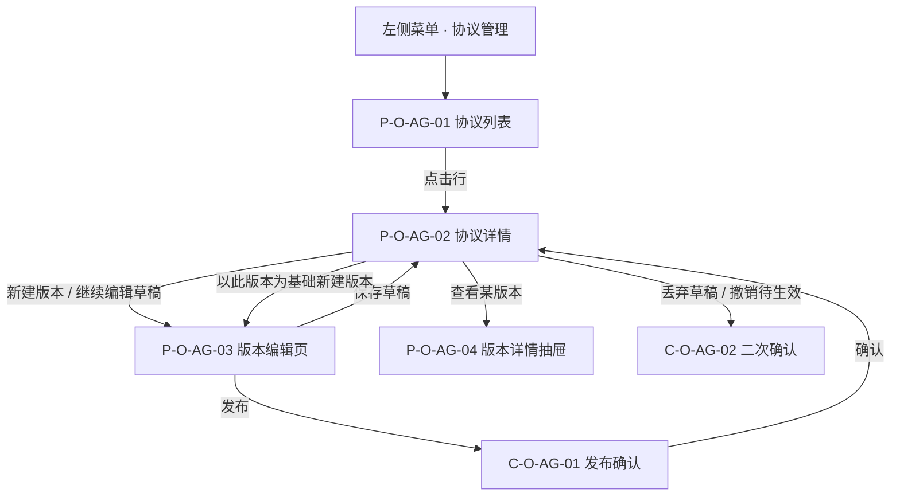
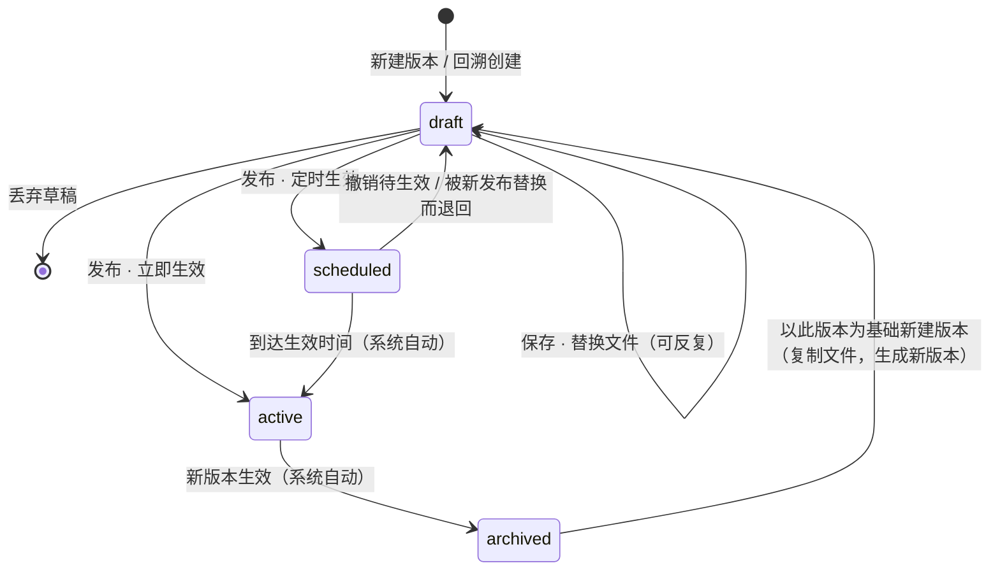
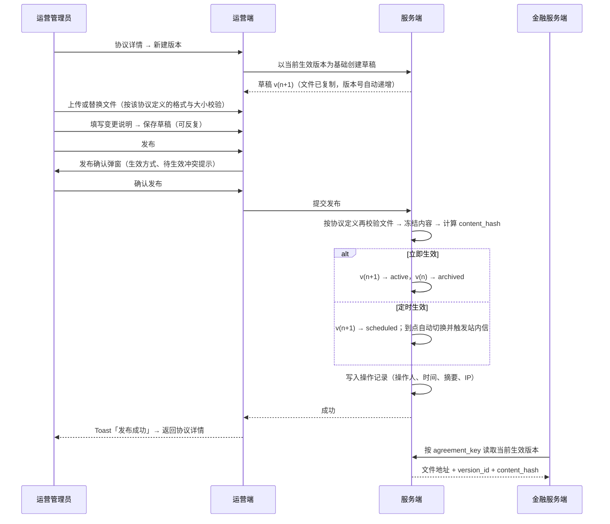

# 金融服务平台 · 运营端 · 协议管理 PRD

## 1. 文档信息

| 项目 | 内容 |
| --- | --- |
| 文档名称 | 金融服务平台 · 运营端 · 协议管理产品需求文档 |
| 对应需求 | WS-310「金融平台-运营端-协议管理」 |
| 上游输入 | 《金融服务平台 · 运营端 · 协议管理 需求诊断简报》V1.0（差异诊断，D-01～D-12 + Q1～Q10）+ 用户 2026-09-09 的三条批复 |
| 诊断基线 | `asset-platform/prd/v1.0-协议管理/v1.0-协议管理-PRD.md`（资产管理端已定稿版）。与消费端无关的能力集合、版本状态机、留痕口径、读取字段契约**直接沿用**，本文档不重新论证；差异部分逐条重写 |
| 编写人 | 许楚清（需求分析师） |
| 文档语言 | 中文（运营端界面文案给出中英对照；**协议内容本身不分语种**，见 3.1 决策 6） |
| 覆盖端 | 金融服务平台**运营端** Web（功能主体）；**金融服务端（面客端）**仅涉及「当前生效版本」的读取口径，不涉及界面 |
| 交付边界 | 协议管理 PRD + 页面框架（线框级，见第 6 章）。金融服务平台后续具体要维护哪些协议尚未确定，本文档**不预设任何协议清单** |
| 关联需求 | **WS-308**「金融平台-运营端-账号与登录」——本文档引用其运营端登录态、操作人身份、角色与权限模型、国际化基线与全局组件；**WS-309**「金融平台-运营端-消息通知」——本文档 12.3 按其数据契约声明本模块的站内信触发口径。金融服务端的协议勾选与弹窗等用户侧交互不在本文档 |
| 与资产平台的关系 | **两个平台完全独立**（3.1 决策 2）。本文档只新增 `financial-service-platform/` 下的产物，**不回改 `asset-platform/` 下任何已定稿内容**；资产平台协议管理 PRD 在本文档中只作为口径来源被引用，不构成运行时依赖 |
| 落库路径 | `financial-service-platform/prd/v1.0-协议管理/v1.0-协议管理-PRD.md` |
| 版本 | V1.0 |

> 本文档只定义「做什么」与「验收什么」，不指定数据库、框架与实现方案。
> 文中标注「目标值」的性能指标需在联调与灰度阶段校准，不影响功能逻辑与验收通过与否。
> 本版的 `[待确认]` 项集中在第 17.1 节，均**不阻塞开发启动**：它们要么是 WS-308 / WS-309 定稿后回填的字面量，要么是协议清单落地时才需要的取值。

---

## 2. 背景与目标

### 2.1 背景

金融服务平台的面客端（金融服务端）在登录、认证、业务办理等环节需要向用户展示各类协议文件，后续业务还会用到各类可下载的模版文件。这些内容如果不统一归口，会重复资产平台踩过的三个坑：协议文件散落在前端静态资源里、换一份文件就要发一次版；没有版本概念、事后无法还原用户当时同意的是哪一份；协议会持续增加而每一种在面客端的用途都不同。

资产管理端已经把这套问题解过一遍，其结论（版本化 + 内容留痕 + 定义与内容分工）在本平台同样成立，因此本模块的能力集合与资产管理端**高度同构**，本文档对这些部分直接沿用基线口径。

本文档真正要回答的是「同一套能力搬到金融服务平台运营端之后，哪里必须不一样」，共十二处，已由需求诊断简报逐条诊断（D-01～D-12），并由用户在 2026-09-09 完成关键批复。其中最贵的一条是**两个平台的协议库是否互通**：

> **用户批复：两个平台独立，互不影响，只是功能一样。**

这条决定了本文档的形态——本模块是金融服务平台**自持的一套完整实现**，不是资产平台的多租户扩展。因此本文档中不出现 `platform` 维度、不出现跨平台隔离机制、不出现跨平台批量读取的防串取规则：库本来就是分开的，两套读取服务各自只服务自己的协议库，那些机制在这里是多余复杂度。这条决策的代价（两套实现可能分叉演化、同一份协议要维护两遍）已记入风险 R-11，并给出触发升级为共享实现的条件。

由此确定本模块的分工：**协议「有哪些、用在哪、允许传什么」由研发在配置层面定义**，因为这些都伴随金融服务端适配；**协议「内容是什么、什么时候生效」由运营在运营端自助维护**，因为这是纯内容运营，不该占用研发排期。

> **为什么协议不做成运营端可自助新增的字典**：运营端能随手新增一种协议，但金融服务端没有对应的展示与同意逻辑去接住它——这种「配置得出、前台用不上」的能力反而制造隐患。金融服务端还要回答「用户要不要勾选同意、同意后如何留痕」，缺了适配的协议配出来更用不上。既然每新增一种协议前台本来就要改代码，就让定义与适配同一次发布落地。备选方案与取舍见 7.1.4。

### 2.2 本期目标

1. 金融服务平台运营端新增一级菜单「协议管理」，成为本平台**全部协议与模版文件内容的唯一维护入口**。
2. 协议的定义（标识、类型、名称、说明、**金融服务端使用环节**、允许的文件格式与大小、上线状态、排序）**由研发在配置层面定义并随部署下发，运营端只读展示**。
3. 协议内容**只支持上传文件**，且更新过程可追溯：每次更新产生一个新版本，历史版本永久可查、可回溯。
4. 版本具备**版本号、生效方式与生效时间、发布/归档状态**，同一协议在任一时刻的「当前生效版本」唯一且确定。
5. 所有内容维护与发布动作**留下操作人痕迹**，可按协议查看操作记录。
6. 向金融服务端提供稳定的**「当前生效版本」读取口径**（标识、版本号、文件、内容哈希、生效时间），字段语义在本文档一次定死。
7. 运营端**列表可直接看到每份协议用在金融服务端的哪些环节**，运营在维护内容时知道自己动的是哪个链路上的文件。
8. 按 WS-309 的契约声明三条运营端告警的触发口径（何时触发、发什么），收件箱与展示形态不在本模块。

### 2.3 本期不做（明确剔除，留待后续扩展）

| 不做项 | 说明 | 本文档的预留 |
| --- | --- | --- |
| 同意记录的查询、筛选与导出 | 后续扩展。运营端本期不出「同意记录」页面 | 版本对象提供 `version_id` 与 `content_hash`，供后续同意记录引用；见 8.2 |
| 协议更新后老用户强制重新同意的触发规则 | 后续扩展。「何为实质更新」「宽限期」「拒绝同意的后果」均不在本轮定义 | 版本对象保留 `require_reconsent` 标记位，本期只允许发布时勾选并存储、随读取接口透出，**不产生任何前台行为**；见 7.3.3 |
| 金融服务端前台的协议展示、勾选、同意提交与重新同意弹窗 | 属于面客端用户侧交互，不在运营端范围内 | 只定义面客端读取版本的接口与字段口径；见第 9 章 |
| 面向金融服务端用户的「协议需重新同意」通知 | 后续扩展，与重新同意的触发规则一并定义。本模块本期产出的通知**全部是运营端告警** | 边界声明见 12.3.5 |
| 邮件通知 | 本期不产出。邮件不属于消息通知模块，后续如需由本模块自持 | 见 12.3 章首 |
| 协议内容的多语种版本 | 本期协议内容不分语种，运营端上传什么、金融服务端展示什么 | 无。如未来需要多语种协议内容，另行立项（见 R-14） |
| 协议内容的在线富文本编辑 | 本期内容只允许上传文件 | 无 |
| **跨平台统一视图与平台切换入口** | 两平台完全独立、账号不互通，一个入口同时看两个平台的协议本期不做 | 无。见 18 章后续扩展 |
| 协议清单本身 | 平台后续要维护哪些协议尚未确定，**本文档不列举、不预设** | 第 17.2 节给出「新增一种协议时需要提供的定义清单」，作为后续逐个补充的模板 |

---

## 3. 范围与边界

### 3.1 已确认的产品决策（直接作为约束）

| # | 决策 | 来源 |
| --- | --- | --- |
| 1 | 运营端新增一级菜单「协议管理」，用于上传与维护金融服务端用到的全部协议与模版文件 | WS-310 issue |
| 2 | **两个平台完全独立、互不影响，只是功能一样**：金融服务平台自持一套协议库与一套协议定义，**不引入 `platform` 维度**、不做跨平台读取、不做跨平台统一视图；**不回改资产平台任何已定稿产物** | **用户批复 2026-09-09 第 1 条**（对简报 Q1 / D-01 取方案 A，与简报建议的方案 C 相反） |
| 3 | **`agreement_key` 在本平台内唯一即可，不加平台前缀**；与资产平台的标识空间互不相关，字面相同也不构成冲突 | 决策 2 的直接推论，见 3.4 |
| 4 | **协议类型与协议定义不可在运营端配置**：由研发以随部署下发的配置定义，运营端只读，**不提供任何新增 / 编辑 / 停用 / 删除入口**；新增一种协议 = 补一条定义 + 完成金融服务端适配 + 发布 | 简报 D-02 / Q2 建议值，用户未否决。「协议清单可扩展」指的是清单不写死，不是运营端自助建类型 |
| 5 | **协议内容只允许上传文件**，不提供在线富文本录入；允许的文件格式按协议单独定义 | 同基线决策 4 |
| 6 | **协议内容不区分语种**：一个版本对应且仅对应一个文件，运营端上传什么、金融服务端展示什么。此条只针对协议内容，运营端界面文案仍需中英对照 | 简报 D-05 / Q3 建议值，用户未否决 |
| 7 | **版本号由系统在协议内自动递增** | 同基线决策 6 |
| 8 | **上传文件的格式与大小上限不设全局值**，每新增一种协议时在其定义中单独明确 | 同基线决策 7 |
| 9 | **任一协议至多一个待生效版本** | 同基线决策 8 |
| 10 | **运营端本期只有「运营管理员」一种角色**，本模块的四个权限点全部归这一个角色；不设角色分工矩阵，不设「发布需另一角色复核」的流程 | **用户批复 2026-09-09 第 2 条** + WS-308 |
| 11 | **运营人员与资产管理端管理员不是同一批人、账号不互通**；跨平台统一视图与切换入口本期不做 | **用户批复 2026-09-09 第 3 条** + WS-308「运营端账号与资产管理端账号没有任何关联」 |
| 12 | 运营端界面**默认英文 + 中英切换**，时区与时间格式沿用 WS-308 的运营端国际化基线，本模块不自定 | WS-308（PRD 编写中，本文档写为显式依赖 + 默认值，见 3.5） |
| 13 | 运营端全部时间展示带时区标注，存储用 UTC | WS-308 国际化基线 |
| 14 | 本轮交付边界为**协议管理 PRD + 页面框架**；金融服务平台后续具体维护哪些协议尚未确定 | WS-310 issue |
| 15 | 协议内容由运营端配置，金融服务端只消费 | WS-310 issue |

### 3.2 与其他需求的接口

| 依赖方向 | 内容 | 归属 |
| --- | --- | --- |
| 本模块 ← 研发 / 配置定义 | 协议定义清单（标识、类型、名称、说明、金融服务端使用环节、允许的文件格式与大小上限、上线状态、排序） | 配置层定义，随部署下发；本模块只读消费，见 7.1 |
| 本模块 → 金融服务端 | 「当前生效版本」读取口径（标识、版本号、文件、内容哈希、生效时间）、`require_reconsent` 标记 | 本文档定义（第 9 章），金融服务端消费 |
| 本模块 ← **WS-308** | 运营端登录态、运营管理员身份（操作人留痕的来源）、角色与权限模型、国际化基线（界面语言、时区与时间格式）、全局组件（Toast / Modal / Drawer / Table） | WS-308 定义，本模块消费 |
| 本模块 → 后续「同意记录」需求 | `version_id` + `content_hash` 二元组，作为同意记录锚定的内容凭据 | 本文档定义字段，后续需求消费 |
| 本模块 → **WS-309** 消息通知 | 三条运营端站内信的完整触发口径：事件、`end` / `recipient_scope`、`category`、`biz_type`、`biz_ref`、`dedupe_key`、文案模板 key 与变量、跳转与预检（见 12.3） | 触发口径归触发方，由本文档定义；投递与展示能力由 WS-309 提供 |
| 本模块 ← **WS-309** | 站内信的投递、列表与已读、跳转渲染、消息数据契约与业务类型登记表 | WS-309 定义（复用 WS-304 契约，`end` 扩为四值并新增运营端取值，共享池 + 各自已读），本模块按其契约接入 |
| 邮件通知 | **不归消息模块**。本模块本期不产出任何邮件；后续如需邮件告警由本模块自持 | 见 12.3 章首 |
| 本模块 → 设计 / 前端 | 运营端为**控制台画布形态**，组件与布局遵循 `docs/design-system/harbour-credit-admin-components.md`（该规范按画布形态而非平台划分，覆盖资产管理端与运营端） | 既有规范，本文档不重复定义视觉 |
| 本模块 → 部署 | 本平台自持的文件存储与下载域配置；协议定义随配置发布下发，**无需初始化任何协议数据** | 见 12.2 |
| 本模块 ↔ 资产平台协议管理（WS-301） | **无运行时依赖**。仅在口径来源意义上引用其已定稿结论；两平台的数据、实现、部署、账号完全分离 | 见 3.4 |

### 3.3 本文档的编号空间

编号规则由总控在 WS-308 / WS-309 / WS-310 之间统一裁定，本文档照此执行：**采用「端 + 模块」双段字母前缀**（`O` = Operations 运营端，`AG` = Agreement 协议管理）。

| 编号族 | 本文档取值 | 说明 |
| --- | --- | --- |
| 功能编号 | **F-O-AG-01**～ | 资产平台协议管理已占 `F-40` 起的数字段，本文档不复用数字段 |
| 页面编号 | **P-O-AG-01**～**P-O-AG-04** | 资产平台已占 `P-AG-xx`，WS-308 已占 `P-O` 数字段；带模块字母的子段与两者都不冲突 |
| 组件编号 | **C-O-AG-01**～**C-O-AG-02** | 资产平台已占 `C-30` / `C-31` |
| 验收编号 | **AC-O-AG-xx** | 前缀独立，在本文档内自成一套 |
| 用户故事 | **US-01**～ | 数字段，**文档内部引用** |
| 风险 | **R-01**～ | 数字段，**文档内部引用** |
| 异常 | **E-01**～ | 数字段，**文档内部引用** |

**为什么用带模块字母的前缀**：数字段位是先到先得的约定，靠人记住「哪一段是谁的」来维持，资产平台的协议管理已经因此撞过一次号并整体迁移。前缀把归属写进编号本身，后续任何模块都不可能再和本模块撞号，也不需要每次新增页面都回去查段位表。该形态与 WS-304 数据契约 9.4.4「带模块字母的编号属于另开子段，与十位段分配等效」的口径一致。

> **跨文档引用提醒**（按 WS-301 的既有裁定执行）：本文档的 `US-`、`R-`、`E-` 三套用数字段，与资产平台多个文档的同名前缀在形态上重合。这三套都是**文档内部引用**，不进入 `page_target`、业务类型登记表等任何跨模块解析路径，因此不加前缀；**跨文档引用它们时必须写明出处**，如「WS-310 E-06」。若后续要求这三套也全平台唯一，可一次性迁到 `E-O-AG-` / `US-O-AG-` / `R-O-AG-`。

### 3.4 平台独立的边界（决策 2 的落地口径）

这一节把「两个平台完全独立」从一句话拆成可验收的约束，避免实现阶段自行发挥。

| 项 | 本模块的口径 |
| --- | --- |
| 数据 | 金融服务平台有**自己的一套**协议定义与协议版本数据。**不存在 `platform` / `tenant` 之类的平台维度字段**——没有第二个平台的数据会进入本模块的库，加一个恒定值的字段只会让人以为它是可变的 |
| 标识唯一性 | `agreement_key` **在本平台内唯一**。不加 `fsp.` / `financial.` 一类平台前缀；与资产平台的标识空间互不相关，两边出现字面相同的 key 也不构成冲突，因为它们由两套互不可达的读取服务解析 |
| 读取接口 | 本平台的读取服务**只服务本平台的协议库**。**读取接口不带平台维度入参，也不由调用方身份推导平台**——这条必须写死，不留给实现推断（简报 D-04 的必答项，在方案 A 下的答案是「不存在该维度」） |
| 类型字典 | 本平台自持一套协议类型定义。类型编码可以与资产平台看起来一样（例如都有「用户协议」），但两者是各自独立的定义，不共享、不同步、不互相校验 |
| 实现与部署 | 本平台自持一套实现与一套部署配置，含文件存储与下载域（见 12.2）。是否在基础设施层面复用同一套服务由技术决定，但**配置项、存储路径与访问控制各自独立** |
| 运营与账号 | 运营端账号与资产管理端账号没有任何关联，不互通、不单点、不互相授权（决策 11）。运营人员在本平台登录后**只看得到本平台的协议** |
| 对资产平台产物的影响 | **零**。本模块不新增、不修改、不删除 `asset-platform/` 下的任何文件与数据；资产平台的 PRD、原型、编号、契约保持原样 |
| 代价与升级条件 | 两套实现可能分叉演化、同一份内容要维护两遍。这是本期明确接受的代价，触发升级为共享实现的条件见 R-11 |

### 3.5 对 WS-308 / WS-309 的依赖处理方式

WS-308 与 WS-309 的 PRD 尚在编写中。本文档**不停等**，处理方式统一为「显式依赖 + 默认值」：

| 依赖项 | 归属 | 本文档采用的默认值 | 若最终结论不同 |
| --- | --- | --- | --- |
| 运营端登录态、操作人身份 | WS-308 | 有效登录态 + 运营管理员身份（姓名、工作邮箱）可取 | 只影响留痕字段来源，不影响本模块逻辑 |
| 角色数量 | WS-308 | **单角色「运营管理员」**（已定稿，用户批复第 2 条） | — |
| 界面默认语言与切换 | WS-308 | **默认英文 + 中英切换**；本文档第 13 章按英文为主语言列给出对照表 | 若默认语言改为中文，只调整对照表主次列，结构不变 |
| 时区与时间格式 | WS-308 | 展示带时区标注、存储 UTC | 与本模块 R-03 的强制要求叠加，不放松 |
| 站内信 `end` 的运营端取值 | WS-309 | WS-309 已把 `end` 由二值扩为四值并新增运营端取值；本文档以 **`ops`** 指代该取值，**最终字面量以 WS-309 契约为准** | 回填字面量，触发条件与字段结构不变 |
| 站内信可见范围模型 | WS-309 | **共享池 + 各自独立已读**（WS-309 已按此执行），本文档 `recipient_scope` 记为 `ops_all` | 回填字面量 |
| 站内信数据契约 | WS-309（复用 WS-304 契约） | 字段名与语义沿用 WS-304 | 回填字面量 |

> 上述回填项已汇总在 17.1，**均不阻塞开发启动**：它们是消息字段的字面量与文案主次列，不改变本模块的任何判定逻辑与页面结构。

---

## 4. 用户角色与场景

### 4.1 角色

| 角色 | 所在端 | 描述 | 本模块内的核心诉求 |
| --- | --- | --- | --- |
| **运营管理员** | 运营端 | **本期运营端唯一角色**（WS-308），本模块四个权限点全部归它 | 换一份协议文件不用找研发；改完能确定什么时候生效；出问题能查是谁改的、能退回上一版 |
| 金融服务端用户 | 金融服务端（面客端） | 协议文件的最终阅读者。**其具体身份（融资企业 / 核心企业 / 资金方等）尚无已定稿文档定义**，本模块不预设、不编造 | 看到的永远是当前生效版本 |
| 金融服务端 / 各业务模块（系统消费方） | 系统 | 按标识读取协议 | 字段口径稳定；文件地址可直接使用 |
| 研发 | 配置 / 代码层 | 定义协议清单与其元数据，并做金融服务端适配 | 有明确的定义字段清单可依循，新增协议时一次填全 |
| 技术 / 运维 | 部署层 | 本平台的文件存储与下载域配置 | 有明确的配置清单 |

> **本模块不依赖「金融服务端用户是谁」这个答案**。协议管理是框架层能力，其数据模型与读取契约与消费端的用户身份无关；用户身份只影响 `usage_scenarios` 的**取值**（本文档本就不预设）与面客端的勾选同意交互（本期不做）。该待确认项记在 17.1，不阻塞交付。
>
> **资产管理端管理员不是本模块的角色**。两平台账号不互通，资产管理端的人不会出现在本模块的任何权限、留痕或通知收件范围里。

### 4.2 用户故事

| # | 角色 | 用户故事 | 对应功能 |
| --- | --- | --- | --- |
| US-01 | 运营管理员 | 作为运营管理员，我希望在左侧菜单里有一个「协议管理」，金融服务平台在用的协议和模版都能在这里找到 | F-O-AG-01 |
| US-02 | 运营管理员 | 作为运营管理员，我希望在列表上就能看到每份协议用在金融服务端的哪些环节，改之前知道自己动的是哪条链路 | F-O-AG-02 |
| US-03 | 运营管理员 | 作为运营管理员，我希望能按名称、类型、使用环节、状态筛选协议，协议多了也能快速定位 | F-O-AG-03 |
| US-04 | 运营管理员 | 作为运营管理员，我希望上传新文件时页面直接告诉我这份协议允许什么格式、多大 | F-O-AG-04 |
| US-05 | 运营管理员 | 作为运营管理员，我希望文件传错了能在发布前反复替换，确认好了再发布 | F-O-AG-05 |
| US-06 | 运营管理员 | 作为运营管理员，我希望发布时能选立即生效或指定时间生效 | F-O-AG-06 |
| US-07 | 运营管理员 | 作为运营管理员，我希望能看到这份协议的全部历史版本、每一版的文件和是谁发布的 | F-O-AG-07 |
| US-08 | 运营管理员 | 作为运营管理员，我希望新版本发现问题时能一键退回到某个历史版本 | F-O-AG-08 |
| US-09 | 运营管理员 | 作为运营管理员，我希望能查到某份协议被谁在什么时间做了什么操作 | F-O-AG-09 |
| US-10 | 运营管理员 | 作为运营管理员，我不希望自己能误删或误改已经发布出去的内容 | F-O-AG-10 |
| US-11 | 运营管理员 | 作为运营管理员，我希望定时生效到点了、或者失败了、或者我设的定时发布被别人的新发布顶掉了，系统能给我一条可回查的通知 | 12.3 |
| US-12 | 研发 | 作为研发，我希望新增一种协议时有一份明确的定义字段清单，一次填全就能上线 | 7.1、17.2 |
| US-13 | 系统消费方 | 作为金融服务端，我希望按一个固定标识就能拿到当前生效版本的文件地址和版本号 | F-O-AG-11 |
| US-14 | 金融服务端用户 | 作为未登录就在登录页看协议的用户，我希望不用登录也能打开协议文件 | F-O-AG-11 匿名可读 |

### 4.3 典型场景

**场景 A：首次上传某份协议的内容**
研发已定义好这份协议（标识、名称、金融服务端使用环节、允许格式与大小）并完成配置发布 → 运营管理员进入协议列表，看到该协议状态为「未发布」→ 进入详情点「新建版本」→ 上传文件（页面已提示该协议允许的格式与大小）→ 填写变更说明 → 发布并选择「立即生效」→ 金融服务端对应环节立即取到这份文件。

**场景 B：协议文件修订**
法务给了新版文件 → 运营管理员在协议详情页点「新建版本」→ 上传新文件 → 填写变更说明 → 发布并指定下周一 00:00 (UTC+8) 生效 → 到点系统自动把新版本切为生效、旧版本自动归档，金融服务端读到的文件随之切换，全程无需研发介入、无需发版；到点后运营管理员收到一条「已生效」的站内信。

**场景 C：发布后发现文件有误**
新版本已生效，发现传错了文件 → 运营管理员在版本历史里找到上一版，点「以此版本为基础新建版本」→ 系统复制其文件生成新草稿 → 确认后立即发布 → 内容回到修订前的状态，且版本链上明确记录这是一次回溯（来源版本可追）。

**场景 D：业务新增一种协议**
业务要上线一种新协议 → 研发补一条协议定义（含它用在金融服务端哪个环节、允许什么格式与多大），同时完成金融服务端的展示与同意适配 → 配置发布 + 前端发版 → 该协议出现在运营端列表，状态为「未发布」→ 运营管理员上传文件并发布 → 上线完成。

**场景 E：上传可下载的模版文件**
业务需要提供可下载的模版 → 该模版已作为一条协议定义存在 → 运营管理员上传文件并发布 → 业务模块按标识取到当前生效版本的文件地址供用户下载；模版换新只需新建版本重新上传。

**场景 F：两个平台各改各的**
资产平台的法务更新了资产端的某份协议 → 该动作发生在资产管理端，走资产平台自己的协议库 → **金融服务平台运营端不受任何影响**：列表不变、版本不变、金融服务端读到的文件不变，也不会收到任何通知。反之亦然。这是决策 2 的日常表现形态。

---

## 5. 信息架构与页面流

### 5.1 菜单结构

运营端左侧新增一级菜单：

```text
协议管理 / Agreements   → P-O-AG-01（单页，无二级菜单）
```

- 本期**不设「协议类型」维护页**：类型与协议定义由配置下发，运营端没有可维护的字典，多一个只读的字典页只会让人误以为可以编辑。类型信息以列表列与详情只读区的形式呈现。
- 一级菜单图标沿用运营端图标体系，激活态遵循 `harbour-credit-admin-components.md` 第 3 节导航项规则。
- 菜单与页面文案随运营端界面语言切换即时生效（引用 WS-308 国际化基线，默认英文）。
- 菜单中**没有平台切换器**，也没有指向资产平台的任何入口（决策 2、11）。

### 5.2 页面清单

| 编号 | 页面 | 形态 | 说明 |
| --- | --- | --- | --- |
| P-O-AG-01 | 协议列表页 | 整页 | 协议管理的主入口。筛选栏 + 表格。**页面上没有「新建协议」按钮**——协议由配置定义 |
| P-O-AG-02 | 协议详情页 | 整页 + tab | 三个 tab：**基本信息**（定义元数据，全只读）、**版本历史**、**操作记录**。承载新建版本、发布、回溯等动作入口 |
| P-O-AG-03 | 版本编辑页 | 整页 | 草稿的文件上传与版本信息填写（生效方式、生效时间、变更说明） |
| P-O-AG-04 | 版本详情预览 | 抽屉（Drawer） | 只读查看某一版本的文件信息与版本元数据，可下载；浏览器可直接渲染的格式提供内嵌预览 |
| C-O-AG-01 | 发布确认弹窗 | Modal | 发布前确认生效方式与影响面 |
| C-O-AG-02 | 二次确认弹窗 | Modal | 丢弃草稿、撤销待生效等动作的统一二次确认 |

> 本模块**不提供**新增 / 编辑协议条目的弹窗，也不提供协议类型字典的列表与编辑页：协议与类型均由配置定义，运营端不提供任何新增、编辑、停用、删除入口。

### 5.3 页面流



---

## 6. 页面框架（线框级）

> 本节给出线框级的信息架构与区块划分，供页面设计直接落地；不含视觉稿，视觉遵循运营端（控制台画布）设计规范。

### 6.1 P-O-AG-01 协议列表

```text
┌ 顶栏：面包屑「协议管理」 ────────────────── 语言切换 · 账号下拉 ┐
├ 页面标题「协议管理 / Agreements」 + 说明「协议由系统预置，此处维护其内容与版本」
│                                        （标题区右侧无主操作按钮）
├ 表格卡片
│  ├ 卡片标题「协议列表」 + 次级说明「共 N 份协议」
│  ├ Filter bar：[关键词] [类型 ▾] [使用环节 ▾] [状态 ▾] [更新时间 ▾] [查询][重置]
│  ├ Table
│  │   协议名称/标识 │ 类型 │ 金融服务端使用环节 │ 当前生效版本 │ 生效时间 │ 版本数 │ 状态 │ 最近更新 │ 操作
│  │   ……（行点击进入详情；操作列仅「查看」）
│  └ 空态 / 加载 skeleton / 错误面（按状态替换）
└ 分页器：每页 20 / 50 / 100
```

### 6.2 P-O-AG-02 协议详情

```text
┌ 顶栏：面包屑「协议管理 / {协议名称}」
├ 标题区：{协议名称}  [类型 Tag]  {agreement_key}（等宽小字）
│          右侧操作：[新建版本 / 继续编辑草稿]（primary）
├ Tab：[基本信息] [版本历史] [操作记录]
│
│ Tab1 基本信息（全只读，右上角注明「以下信息由系统预置，不可在此修改」）
│   ├ 描述列表：标识 / 类型 / 名称 / 说明 / 金融服务端使用环节（Tag 组） /
│   │            允许的文件格式 / 文件大小上限 / 上线状态
│   └ 当前生效版本摘要卡：版本号 · 文件名与大小 · 生效时间 · 发布人 ·
│                          变更说明 · content_hash（等宽 + 复制） · [下载][查看]
│
│ Tab2 版本历史
│   └ Table：版本号 │ 状态 │ 文件 │ 生效时间 │ 归档时间 │ 变更说明 │ 来源版本 │ 发布人/时间 │ 操作
│
│ Tab3 操作记录
│   └ Timeline：时间（带时区，等宽）· 操作人 · 动作 · 变更摘要 · IP
└
```

### 6.3 P-O-AG-03 版本编辑页

```text
┌ 顶栏：面包屑「协议管理 / {协议名称} / 新建版本」
├ 标题区：新建版本 v{n}      右侧操作：[保存草稿] [发布]（primary）
├ 卡片一「协议文件」
│   ├ 上传区（点击或拖拽，单文件）
│   ├ helper：「本协议允许的格式：{定义值}；大小上限：{定义值}」
│   └ 已上传：文件名 · 大小 · 上传时间 · [替换][下载]
├ 卡片二「版本信息」
│   ├ 版本号：v{n}（只读，系统自动递增）
│   ├ 生效方式：( ) 立即生效   ( ) 定时生效 → [日期时间选择器（带时区标注）]
│   ├ 变更说明：[多行文本，必填，≤500]
│   └ [ ] 需重新同意（helper：触发规则将在后续需求中定义，当前不产生前台行为）
└ 底部：离开前若有未保存改动，弹出确认
```

> **上传区没有语种选择、没有语言 tab、没有「中文版 / 英文版」两个上传位**：一个版本对应且仅对应一个文件（决策 6）。

### 6.4 C-O-AG-01 发布确认弹窗

```text
┌ 发布确认（宽 400–420px）
│  协议：{协议名称}
│  版本：v{n}
│  文件：{文件名} · {大小}
│  生效：立即生效 / 2026-09-15 00:00 (UTC+8)
│  [inline alert]（仅在已有待生效版本时出现）
│      该协议已有待生效版本 v{m}，继续将撤销该版本。
│  [取消] [确认发布]（primary）
└
```

---

## 7. 功能清单与模块详情

### 7.0 功能清单

| 编号 | 模块 | 功能点 | 描述 | 验收口径 |
| --- | --- | --- | --- | --- |
| F-O-AG-01 | M1 协议列表 | 菜单与列表 | 一级菜单「协议管理」，列表展示本平台配置定义的全部协议及其当前生效版本 | 菜单可达；列表字段完整；无新增入口 |
| F-O-AG-02 | M1 协议列表 | 金融服务端使用环节展示 | 列表与详情展示该协议用在金融服务端的哪些环节 | 取自定义，只读 |
| F-O-AG-03 | M1 协议列表 | 检索与筛选 | 关键词 + 类型 + 使用环节 + 状态 + 更新时间组合筛选 | 各条件可组合，结果正确 |
| F-O-AG-04 | M2 版本内容 | 文件上传 | 单文件上传，格式与大小按该协议的定义校验 | 服务端按协议定义值校验生效 |
| F-O-AG-05 | M2 版本内容 | 草稿与覆盖更新 | 草稿可反复替换文件与保存；每个协议同时最多一个草稿 | 覆盖后旧草稿文件不保留、不产生版本记录 |
| F-O-AG-06 | M3 版本发布 | 发布与生效时间 | 立即生效或定时生效；生效时唯一 active 版本切换，旧版自动归档 | 同一协议任一时刻至多一个 active、至多一个 scheduled |
| F-O-AG-07 | M4 版本历史 | 历史版本查看 | 查看全部版本、状态、文件、生效时间、发布人、变更说明 | 已发布版本内容不可变 |
| F-O-AG-08 | M4 版本历史 | 版本回溯 | 以任一历史版本为基础生成新草稿，走正常发布流程 | 新版本记录来源版本，审计链完整 |
| F-O-AG-09 | M5 留痕 | 操作记录 | 记录对象、动作、操作人、时间、变更摘要、IP，按协议可查 | 全部写操作均有记录且不可编辑删除 |
| F-O-AG-10 | M5 留痕 | 变更约束 | 已发布版本不可编辑、不可删除；协议本身不可增删改 | 界面与接口双侧拒绝 |
| F-O-AG-11 | M6 对外口径 | 当前生效版本读取 | 按标识读取当前生效版本，匿名可读 | 字段口径与第 9 章一致 |

### 7.1 M0 · 协议定义（配置层，运营端只读）

#### 7.1.1 定位

**协议定义不是运营端的数据，而是随部署下发的配置的一部分。** 一份协议的「标识、类型、名称、说明、用在金融服务端哪些环节、允许上传什么格式多大的文件、是否上线」全部由研发定义，随配置发布下发。运营端读取这份定义并只读展示，**不提供新增、编辑、停用、删除的任何入口**。

新增一种协议的完整路径是：**研发补一条协议定义 + 完成金融服务端适配 → 配置发布（及必要的前端发版）→ 协议出现在运营端列表（状态为未发布）→ 运营管理员上传文件并发布**。

> 用户说的「具体哪些协议后续补充」指的是**清单不写死**：本文档、原型与数据模型都不预设任何具体协议，新增协议不需要改协议管理模块本身。它**不是**「运营端可以自助建协议类型」（决策 4）。

#### 7.1.2 定义字段（研发提供，运营端只读）

| 字段 | 类型 | 必填 | 口径 |
| --- | --- | --- | --- |
| `agreement_key` | string | 是 | 协议唯一标识，**金融服务端读取协议的锚点**；**在本平台内唯一**，不加平台前缀（3.4）；一经上线不得变更，否则打断引用链与历史版本归属 |
| `type_code` | string | 是 | 协议类型编码，作为分组与筛选维度；同样由定义下发，运营端只读。**本平台自持一套类型定义**，与资产平台不共享、不同步 |
| `type_name_en` / `type_name_zh` | string | 是 | 类型的中英文名称，用于运营端界面展示 |
| `name_en` / `name_zh` | string | 是 | 协议的中英文名称，用于运营端界面展示（**这是界面文案的双语，不是协议内容的双语**） |
| `description` | text | 否 | 用途说明，帮助运营管理员理解这份协议是做什么的 |
| `usage_scenarios` | list | 是 | **该协议在金融服务端的使用环节**（触点）清单，见 7.1.3 |
| `allowed_file_types` | list | 是 | 该协议允许上传的文件格式，**按协议单独定义**，见 7.1.5 |
| `max_file_size` | number | 是 | 该协议允许的文件大小上限，**按协议单独定义**，见 7.1.5 |
| `enabled` | bool | 是 | 是否上线。`false` 时该协议在运营端列表标记为「已下线」，对外读取按 9.4 返回可区分错误码 |
| `sort_order` | number | 否 | 列表默认排序值 |

> **不存在平台字段**：定义对象里没有 `platform` / `tenant` 一类维度（3.4）。本平台的配置只描述本平台的协议。

#### 7.1.3 金融服务端使用环节（F-O-AG-02）

- `usage_scenarios` 表达的是「这份协议在**金融服务端**出现在哪些触点」——**具体触点清单由各协议定义给出，本文档不预设**。金融服务端的用户身份与业务链路目前尚无已定稿文档，本文档不编造触点清单。
- 每个触点包含 `scenario_code` 与中英文展示名，展示名用于运营端列表与详情的 Tag 呈现。
- 运营端对该字段**只读**：不提供勾选、编辑、增删。
- 用途：运营在更换协议文件前，能直接看到这次改动会影响金融服务端的哪些链路，避免「改完才知道动了注册流程」。
- 一份协议可对应多个触点；列表中超过 3 个时折叠为 `+N`，hover 或点击展开完整清单。

#### 7.1.4 定义的承载形态与取舍

基线在资产平台采用的是「协议定义写在代码里」，并把「放在随部署下发的配置文件中」列为备选方案 A、把「管理端自助新增」列为备选方案 B（已否决）。**本平台是新平台，起步即采用备选方案 A（配置下发）**，理由与取舍如下：

| 方案 | 做法 | 优点 | 代价 |
| --- | --- | --- | --- |
| **本期采用：配置下发** | 协议定义放在随部署下发的配置中，运营端仍只读 | 新增协议仍需研发做金融服务端适配（安全边界不变）；但元数据微调（放宽大小上限、补一个使用环节文案、紧急下线）只需改配置、走一次配置发布，不占用发版窗口 | 需要配置的版本管理与灰度机制；配置与前端适配的一致性需要流程保证 |
| 备选：写在代码里 | 定义随代码版本下发 | 定义与适配天然同一次发版落地 | 调整任何一项元数据都要发版（资产平台的 R-04 / R-05 缺口） |
| **已否决：运营端自助新增** | 运营端可自助新增协议定义与类型 | 运营完全自助 | 金融服务端没有对应适配，配置出来的协议前台无法呈现，属于「配得出、用不上」。在金融服务平台这条更强——协议是否需要用户勾选同意、同意后如何留痕都要面客端适配 |

> 采用配置下发对运营端的界面与本文档其余章节**没有任何影响**（运营端始终只读）。它把资产平台记录的两个已知缺口（新增协议依赖发版、紧急下线依赖发版）在本平台起步阶段就缓解为「一次配置发布」，见 R-04 / R-05。

#### 7.1.5 文件格式与大小：按协议单独定义（对应决策 8）

- **本文档不给出全局统一的格式白名单与大小上限**，也不做默认值兜底。
- 每新增一种协议，研发在其定义中**必须明确该协议的 `allowed_file_types` 与 `max_file_size`**，缺任一项该协议不得上线（见 E-11）。
- 运营端在上传区下方以 helper 文本原样展示该协议的格式与大小要求，运营管理员不需要去问研发。
- **服务端按该协议的定义值校验**，而不是按全局常量校验；校验含扩展名与文件头（magic number）双重比对。
- 在线预览能力取决于格式：浏览器可直接渲染的格式提供内嵌预览，其余仅提供下载。若某份协议需要用户在金融服务端在线阅读后同意，研发在定义其允许格式时需选用可在线渲染的格式——这是定义协议时的一项显式考量，写入 17.2 的新增协议清单。

### 7.2 M1 · 协议列表（P-O-AG-01）

#### 7.2.1 页面结构

遵循运营端（控制台画布）组合：页面标题 + 说明 → 表格卡片（卡片标题 → Filter bar → Table）。本期**不放统计卡**，**标题区不设主操作按钮**——没有可新建的对象。

页面说明文案固定为：`协议由系统预置，此处维护其内容与版本。 / Agreements are predefined by the system. Manage their content and versions here.` 这句话是防止运营管理员四处找「新建」的关键提示，不可省略。

列表只展示**本平台**的协议，页面上没有平台维度的筛选项、没有平台列、也没有「查看另一个平台」的入口（3.4）。

#### 7.2.2 列表字段

| 列 | 内容 | 说明 |
| --- | --- | --- |
| 协议名称 | 主文本为当前界面语言的名称，辅助文本为 `agreement_key`（等宽小字） | 一格一层主辅层级 |
| 类型 | 类型名称（Tag，neutral） | 定义下发，只读 |
| **金融服务端使用环节** | 触点 Tag 组，超过 3 个折叠为 `+N` | 定义下发，只读；见 7.1.3 |
| 当前生效版本 | 版本号（等宽），无生效版本时展示 `—` | — |
| 生效时间 | 带时区标注的绝对时间；有待生效版本时下方追加辅助文本 `下一版本 v3 将于 2026-09-15 00:00 (UTC+8) 生效` | 时间格式引用 WS-308 国际化基线 |
| 版本数 | 数字，右对齐等宽 | 不含草稿 |
| 状态 | Tag：`已生效 / Active`（positive）、`草稿 / Draft`（neutral）、`未发布 / Unpublished`（warning）、`已下线 / Offline`（danger） | 见 7.2.3 |
| 最近更新 | 操作人姓名 + 时间（辅助小字） | 取自最近一条操作记录；从未操作过时展示 `—` |
| 操作 | `查看 / View`（进入 P-O-AG-02） | 固定为最后一列；行内不放破坏性操作 |

#### 7.2.3 协议状态口径

状态是**由版本状态派生的展示值**，不单独存储：

| 展示状态 | 判定 |
| --- | --- |
| 已生效 Active | 协议已上线且存在 `active` 版本（若同时存在 `scheduled` 版本，主状态仍为 Active，待生效信息在生效时间列的辅助文本中体现） |
| 草稿 Draft | 协议已上线，无 `active` 版本，但存在 `draft` 版本 |
| 未发布 Unpublished | 协议已上线，且还没有任何版本（新协议下发后的初始状态） |
| 已下线 Offline | 定义中 `enabled = false` |

#### 7.2.4 检索与筛选（F-O-AG-03）

| 条件 | 形态 | 说明 |
| --- | --- | --- |
| 关键词 | 输入框 | 匹配协议名称（中英任一）与 `agreement_key`，忽略大小写与前后空格，模糊匹配 |
| 类型 | 下拉多选 | 选项取自本平台定义的类型清单 |
| **金融服务端使用环节** | 下拉多选 | 选项取自本平台定义的触点清单；用于快速回答「注册环节都用到哪些协议」 |
| 状态 | 下拉多选 | 取 7.2.3 的四个展示状态 |
| 更新时间 | 日期范围 | 按最近一次操作时间过滤，按运营管理员时区解释，服务端按 UTC 比对 |
| 操作 | `查询 / Search`、`重置 / Reset` | 重置清空全部条件并回到第 1 页 |

- 条件之间为「与」关系，多选值之间为「或」关系。
- 默认排序：先按定义的 `sort_order`，再按最近更新时间倒序；生效时间与版本数列支持点击排序。
- 分页：每页 20 条，可选 20 / 50 / 100；筛选条件与分页状态写入 URL 查询参数，刷新与前进后退不丢失。
- 空态：尚未定义任何协议时展示空态，文案为 `暂无协议，协议由系统预置。 / No agreements. Agreements are predefined by the system.`，**不提供任何新建入口**；筛选无结果时文案为 `没有符合条件的协议` 并提供「重置筛选」。

### 7.3 M2 / M3 · 版本内容与发布（P-O-AG-03，F-O-AG-04～F-O-AG-06）

#### 7.3.1 版本是内容的唯一载体

**协议内容只存在于版本上。** 任何一次内容变化都对应一个版本记录，才能回答「用户当时看到的是哪一份文件」。因此「更新覆盖」分成两段，界面上必须让运营管理员清楚区分：

| 场景 | 是否允许覆盖 | 说明 |
| --- | --- | --- |
| **草稿版本**（`draft`） | **允许反复替换** | 未发布的文件可以任意替换、重传、丢弃；覆盖后旧文件不保留、不产生版本记录 |
| **已发布版本**（`scheduled` / `active` / `archived`） | **不允许就地修改** | 文件与 `content_hash` 不可变。要更新内容，必须新建版本 |

> 已发布版本一旦可以被就地覆盖，同意记录指向的内容就会在事后被改写，版本号与生效时间也随之失去意义。这是版本化的底线。界面在已发布版本上不提供任何「编辑 / 替换」入口，只提供「查看下载」与「以此版本为基础新建版本」。

#### 7.3.2 每个协议同时最多一个草稿

- 已存在草稿时，「新建版本」按钮改为 `继续编辑草稿 / Continue editing draft`，不生成第二个草稿。
- 草稿可主动丢弃（`丢弃草稿 / Discard draft`），需二次确认（C-O-AG-02）。
- 新建草稿的三个来源：
  1. **空白新建**（协议还没有任何版本时）；
  2. **以当前生效版本为基础**（默认方式，复制其文件，便于只改版本信息或替换文件）；
  3. **以任一历史版本为基础**（即版本回溯，见 7.4.3）。

#### 7.3.3 版本编辑页（P-O-AG-03）

整页表单，顶部为面包屑，右上角为 `保存草稿`、`发布`（primary）两个操作。

**协议文件区（F-O-AG-04）**

| 项 | 规则 |
| --- | --- |
| 控件 | 单文件上传，支持点击选择与拖拽 |
| 格式与大小 | **按该协议的定义值校验**（`allowed_file_types` / `max_file_size`），不使用全局统一值；上传区下方以 helper 文本原样展示这两个值 |
| 校验位置 | 前端按定义值做即时校验；**服务端按同一份定义值再校验一次**，含扩展名与文件头双重比对，前端校验不作为唯一防线 |
| 已上传呈现 | 文件名、大小、上传时间，附 `替换 / Replace` 与 `下载 / Download` 两个操作 |
| 替换 | 替换后旧文件立即失效且不保留（草稿阶段） |
| 上传失败 | 保留表单其余内容，提供重试；不清空已填的版本信息 |
| **语种** | **不适用**。一个版本挂且只挂一个文件，界面上没有语种选择、没有语言 tab、没有语种回退口径（决策 6） |

> 本期**不提供在线富文本录入**，协议内容只有「上传文件」这一条路径。

**版本信息区**

| 字段 | 类型 | 必填 | 校验与口径 | 默认值 |
| --- | --- | --- | --- | --- |
| 版本号 `version_no` | string | 是 | **系统在该协议内自动递增生成**，形如 `v1`、`v2`；界面只读，不可编辑、不可跳号（决策 7） | 自动 |
| 生效方式 `effective_mode` | enum | 是 | `immediate` 立即生效 / `scheduled` 定时生效 | `immediate` |
| 生效时间 `effective_at` | datetime | 定时生效时必填 | 分钟粒度；必须晚于当前时间至少 5 分钟；按运营管理员当前时区输入与展示，存储 UTC；控件旁展示时区标注 | 空 |
| 变更说明 `change_note` | text | 是 | ≤ 500 字符；说明本次改了什么，列在版本历史里 | 空 |
| 需重新同意 `require_reconsent` | bool | 否 | **本期仅存储并随读取接口透出，不产生任何前台行为**；控件旁 helper 注明「触发规则将在后续需求中定义」 | false |

- `保存草稿`：保存已填内容，不做必填校验（文件与变更说明均可暂缺），停留在本页并 Toast 提示。
- `发布`：先做完整校验（文件已上传且通过格式与大小校验、变更说明非空、定时生效时间合法），通过后进入 C-O-AG-01 发布确认。

#### 7.3.4 发布与生效（F-O-AG-06）

**发布确认弹窗 C-O-AG-01** 展示：协议名称、版本号、文件名与大小、生效方式与时间（带时区）、已有待生效版本时的替换提示、`require_reconsent` 取值（如为 true，提示「本期不会触发任何前台强制重新同意行为」），主操作 `确认发布 / Publish`。

| 规则 | 口径 |
| --- | --- |
| 唯一生效版本 | 同一协议在任一时刻**至多一个** `active` 版本 |
| 立即生效 | 发布瞬间：新版本 → `active`；原 `active` → `archived`；`effective_at` 记为发布时间 |
| 定时生效 | 发布后新版本 → `scheduled`；到达 `effective_at` 时系统自动切换：新版本 → `active`，原 `active` → `archived` |
| **待生效版本唯一（决策 9）** | 同一协议**至多一个** `scheduled` 版本，不允许排队 |
| **待生效冲突处理** | 已有待生效版本时再次发布：C-O-AG-01 中以 inline alert 展示 `该协议已有待生效版本 v{m}（将于 {时间} 生效），继续将撤销该版本。`，主按钮文案变为 `撤销并发布 / Cancel and publish`；确认后系统**先把原待生效版本退回 `draft` 并保留其文件，再发布新版本**（两条操作各记一条操作记录）。原待生效版本被退回后即成为该协议的草稿；若此时已存在草稿，则原草稿被新退回的版本覆盖前需二次确认（见 E-06） |
| 撤销待生效 | `scheduled` 版本在生效前可主动撤销，撤销后回到 `draft` 并保留文件；撤销动作计入操作记录并触发站内信（12.3） |
| 切换的原子性 | 生效切换必须原子完成，不允许出现「新版本已生效但旧版本仍生效」或「两版本均非生效」的中间态 |
| 时钟口径 | 定时切换以**服务端 UTC 时间**为准；界面输入与展示按运营管理员时区换算，控件旁必须带时区标注 |
| 切换延迟 | 定时生效的实际切换与 `effective_at` 的偏差 ≤ 60 秒（目标值） |
| 内容冻结 | 版本进入 `scheduled` 后文件即冻结，不可替换；需要改动只能撤销回草稿 |
| **复核** | **不设**。运营端本期单角色，同一个人可上传并发布；不引入「发布需另一角色复核」的流程（决策 10）。该缺口记为 R-09，由操作记录保证事后可追 |

#### 7.3.5 内容哈希

版本发布时，系统对文件字节计算 `content_hash`，随版本一并冻结存储，并通过读取接口对外透出。用途是让后续的同意记录可以锚定「用户同意的到底是哪一份字节」，而不只是一个版本号。本期只负责生成与透出，不负责消费。

### 7.4 M4 · 版本历史、查看与回溯（P-O-AG-02，F-O-AG-07～F-O-AG-08）

#### 7.4.1 协议详情页（P-O-AG-02）

页面标题为协议名称，副标题为 `agreement_key`（等宽）与类型 Tag。右上角只有一个操作：`新建版本 / 继续编辑草稿`（primary）。**没有编辑协议、停用协议、删除协议的按钮。**

**Tab 1 · 基本信息（全只读）**：以描述列表展示 7.1.2 的定义字段（标识、类型、名称、说明、金融服务端使用环节、允许的文件格式、文件大小上限、上线状态），区块右上角固定说明 `以下信息由系统预置，不可在此修改。 / Predefined by the system. Not editable here.`；下方为当前生效版本摘要卡（版本号、文件名与大小、生效时间、发布人、变更说明、`content_hash` 缩略 + 复制、下载与查看入口）。

**Tab 2 · 版本历史**：表格，按版本号倒序：

| 列 | 内容 |
| --- | --- |
| 版本号 | 等宽；当前生效版本行以 accent 底色高亮 |
| 状态 | Tag：`草稿 / Draft`、`待生效 / Scheduled`、`已生效 / Active`、`已归档 / Archived` |
| 文件 | 文件名（截断 + tooltip 完整名）与大小；草稿未传文件时展示 `—` |
| 生效时间 | 带时区的绝对时间；草稿展示 `—` |
| 归档时间 | 带时区的绝对时间；未归档展示 `—` |
| 变更说明 | 长文本截断，点击展开完整内容 |
| 来源版本 | 回溯生成的版本展示 `基于 v2`，可点击跳转；否则 `—` |
| 发布人 / 时间 | 姓名 + 时间（辅助小字）；草稿展示最近保存人 |
| 操作 | 按状态提供：`查看`（全状态）、`下载`（已传文件）、`编辑`（仅草稿）、`发布`（仅草稿）、`丢弃`（仅草稿）、`撤销`（仅待生效）、`以此版本为基础新建版本`（已生效 / 已归档） |

**Tab 3 · 操作记录**：见 7.5。

#### 7.4.2 版本详情预览（P-O-AG-04）

- 右侧抽屉，顶部标题为 `版本号 + 状态 Tag`。
- 内容：文件名、格式、大小、上传时间、`version_id`、`content_hash`（等宽 + 复制）、生效时间、归档时间、发布人、变更说明、来源版本。
- **文件呈现**：浏览器可直接渲染的格式提供内嵌预览；其余格式提供下载按钮并说明 `该格式不支持在线预览，请下载查看。 / This format cannot be previewed online. Please download it.`
- 抽屉可 Escape、点击遮罩、显式按钮三种方式关闭；焦点受限在抽屉内。

#### 7.4.3 版本回溯（F-O-AG-08）

**口径：回溯不是把老版本改回生效，而是以老版本的文件生成一个新版本。**

1. 在版本历史中对任一 `active` / `archived` 版本点击 `以此版本为基础新建版本`。
2. 系统复制该版本的文件生成新草稿，记录 `source_version_id`，变更说明预填 `回溯至 v{n} 的内容`（可编辑）。
3. 运营管理员确认后按正常流程发布，得到一个**版本号更大的新版本**。
4. 版本历史中该新版本的「来源版本」列展示 `基于 v{n}`。

> 直接把历史版本的状态改回 `active` 会造成版本号倒挂、生效时间线错乱、同意记录归属混乱。复制生成新版本可以让「我们回退过一次」本身成为一条可审计的事实。

#### 7.4.4 归档与下线

| 动作 | 规则 |
| --- | --- |
| 版本归档 | **只在新版本生效时由系统自动执行**，界面不提供对 `active` 版本的手动归档入口 |
| 为什么 | 手动归档唯一生效版本会让金融服务端瞬间取不到协议，属于可被一次误操作触发的线上故障 |
| 协议下线 | 由定义中的 `enabled = false` 控制，**运营端不提供停用入口**；下线后列表状态为「已下线」，详情与历史版本仍可查看，对外读取按 9.4 返回可区分错误码 |
| 紧急下线的时效 | 下线需走一次**配置发布**（7.1.4），运营无法在界面上即时执行。相比资产平台的「需发版」已明显缩短，但仍不是运营自助动作，记为 R-05 |

### 7.5 M5 · 操作留痕与变更约束（F-O-AG-09、F-O-AG-10）

#### 7.5.1 记录范围

协议定义本身由配置管理、不在运营端产生写操作，因此操作记录只覆盖**版本相关动作**，且覆盖全部：

| 对象 | 动作 |
| --- | --- |
| 协议版本 | 创建草稿、保存草稿、上传或替换文件、丢弃草稿、发布、撤销待生效、被替换退回草稿、系统自动生效、系统自动归档、回溯创建 |

#### 7.5.2 记录字段与呈现

| 字段 | 口径 |
| --- | --- |
| 操作时间 | 完整时间戳，带时区标注；存储 UTC |
| 操作人 | 运营管理员姓名 + 工作邮箱（身份来源为 WS-308 登录态）；系统自动动作（定时生效、自动归档）记为 `系统 / System` |
| 操作对象 | 协议 + 版本号 |
| 动作 | 见 7.5.1 |
| 变更摘要 | 人类可读的一句话，如 `发布 v3，定时生效于 2026-09-15 00:00 (UTC+8)`、`替换文件：terms_v2.pdf → terms_v3.pdf` |
| 来源 IP | 记录并展示 |

- **呈现形态为 Timeline**（协议详情 Tab 3），每项时间用等宽小字，与运营端组件规范中 Timeline 的用法一致。
- **操作记录只增不改**：任何角色不可编辑或删除，界面与接口均不提供入口。
- **保留期限：不主动清理**（永久保留）。如后续需要归档策略，由合规需求另行定义。

#### 7.5.3 变更约束（F-O-AG-10）

| 对象 | 可变更性 | 不可变更时的呈现 |
| --- | --- | --- |
| 协议定义（标识、类型、名称、使用环节、格式与大小、上线状态） | 运营端**完全不可变更**（新增 / 编辑 / 停用 / 删除均无入口） | 详情页基本信息区固定说明「由系统预置，不可在此修改」；接口层面同样拒绝 |
| 草稿版本 | 可反复编辑、可丢弃 | — |
| 待生效版本 | 内容冻结；可撤销回草稿 | 无编辑入口 |
| 已生效 / 已归档版本 | **内容永不可改、永不可删** | 无编辑与删除入口；接口层面拒绝 |

---

## 8. 数据对象与字段

> 仅定义业务字段与口径，不约束存储实现。**本章的三个对象都不含平台维度字段**（3.4）。

### 8.1 协议定义 AgreementDefinition（配置层，只读）

字段见 7.1.2。要点：

- 该对象**不是运营端可写的数据**，随配置下发；运营端与对外接口只读消费。
- `agreement_key` 是版本数据的归属外键，在本平台内唯一，一经上线不得变更。
- 配置中删除某条协议定义时，其历史版本数据**不得被连带删除**（见 R-06 与 E-12）。

### 8.2 协议版本 AgreementVersion

| 字段 | 类型 | 说明 |
| --- | --- | --- |
| `version_id` | id | 不可变主键，**同意记录锚定的对象** |
| `agreement_key` | string | 所属协议（对应定义） |
| `version_no` | string | 版本号，协议内唯一且自动递增 |
| `status` | enum | `draft` / `scheduled` / `active` / `archived` |
| `file_name` | string | 上传时的原始文件名 |
| `file_ext` | string | 文件格式 |
| `file_size` | number | 文件大小 |
| `file_url` | string | 文件访问地址，对金融服务端匿名可达 |
| `content_hash` | string | 文件内容哈希，发布时生成后冻结 |
| `effective_mode` | enum | `immediate` / `scheduled` |
| `effective_at` | datetime(UTC) | 生效时间；草稿为空 |
| `archived_at` | datetime(UTC) | 归档时间；未归档为空 |
| `change_note` | text | 变更说明 |
| `require_reconsent` | bool | 是否需要重新同意的标记位，**本期只存储与透出** |
| `source_version_id` | id | 回溯来源版本，可为空 |
| `published_by` / `published_at` | — | 发布人与发布时间 |
| `created_by` / `created_at` / `updated_by` / `updated_at` | — | 留痕；`updated_*` 仅在草稿阶段变化 |

> 协议内容不分语种，因此**不存在语种内容子对象**：一个版本对应且仅对应一个文件，没有 `locale` / `requested_locale` / `is_locale_fallback` 三件套。

### 8.3 操作记录 AgreementOperationLog

| 字段 | 类型 | 说明 |
| --- | --- | --- |
| `log_id` | id | 主键 |
| `agreement_key` | string | 所属协议，便于按协议聚合查询 |
| `version_id` | id | 关联版本 |
| `action` | enum | 见 7.5.1 |
| `summary` | text | 人类可读的变更摘要 |
| `operator_id` / `operator_name` / `operator_email` | — | 操作人；系统动作记为 `system` |
| `ip` | string | 来源 IP |
| `created_at` | datetime(UTC) | 操作时间；**只增不改** |

### 8.4 字段总表（运营端页面）

| 字段 | 所在页面 | 类型 | 可编辑 | 校验规则 | 默认值 |
| --- | --- | --- | --- | --- | --- |
| 协议标识 `agreement_key` | P-O-AG-01 / P-O-AG-02 | string | **否（只读）** | 定义下发；本平台内唯一 | — |
| 协议类型 `type_code` | P-O-AG-01 / P-O-AG-02 | string | **否（只读）** | 定义下发 | — |
| 协议名称 `name_en` / `name_zh` | P-O-AG-01 / P-O-AG-02 | string | **否（只读）** | 定义下发；按运营端界面语言展示对应一项 | — |
| 协议说明 `description` | P-O-AG-02 | text | **否（只读）** | 定义下发 | — |
| **金融服务端使用环节 `usage_scenarios`** | P-O-AG-01 / P-O-AG-02 | list | **否（只读）** | 定义下发；列表中超过 3 个折叠为 `+N` | — |
| 允许的文件格式 `allowed_file_types` | P-O-AG-02 / P-O-AG-03 | list | **否（只读）** | 定义下发，**按协议单独明确**；在上传区以 helper 文本展示 | — |
| 文件大小上限 `max_file_size` | P-O-AG-02 / P-O-AG-03 | number | **否（只读）** | 定义下发，**按协议单独明确** | — |
| 上线状态 `enabled` | P-O-AG-01 / P-O-AG-02 | bool | **否（只读）** | 定义下发 | — |
| 协议文件 | P-O-AG-03 | file | 是（仅草稿） | **单文件**；按该协议的 `allowed_file_types` 与 `max_file_size` 校验；服务端按扩展名 + 文件头双重比对 | 空 |
| 版本号 `version_no` | P-O-AG-03 | string | **否（系统生成）** | 协议内自动递增 | 自动 |
| 生效方式 `effective_mode` | P-O-AG-03 | enum | 是 | `immediate` / `scheduled` | `immediate` |
| 生效时间 `effective_at` | P-O-AG-03 | datetime | 是（定时生效时必填） | 分钟粒度，须晚于当前时间 ≥ 5 分钟 | 空 |
| 变更说明 `change_note` | P-O-AG-03 | text | 是（必填） | ≤ 500 字符 | 空 |
| 需重新同意 `require_reconsent` | P-O-AG-03 | bool | 是 | 仅存储与透出 | false |

---

## 9. 对金融服务端的输出口径（F-O-AG-11）

> 本章是本模块对外的**契约**。字段语义在此一次定死，金融服务端与各业务模块直接引用。
>
> **平台维度：不存在。** 本平台的读取服务只服务本平台的协议库，**接口不带平台入参，也不由调用方身份推导平台**（3.4）。这一条是本文档必须写死、不留给实现推断的三条之一。

### 9.1 读取能力清单

| 能力 | 用途 | 入参 | 鉴权 |
| --- | --- | --- | --- |
| 按标识取当前生效版本 | 金融服务端在某个环节展示某份协议 | `agreement_key` | **匿名可读**（登录页在未登录状态即需展示协议） |
| 批量按标识取当前生效版本 | 一次取多份，避免页面多次串行请求 | `agreement_key` 列表 | 匿名可读 |
| 按类型取当前生效版本列表 | 展示某一类型下的全部协议或模版（如模版下载列表） | `type_code` | 匿名可读 |
| 按 `version_id` 取指定版本 | 回看历史版本内容（供后续同意记录详情消费） | `version_id` | 匿名可读 |

- 只读取 `status = active` 的版本；`draft` 与 `scheduled` 版本**绝不对外可见**（直接指定 `version_id` 同样不可见）。
- `archived` 版本仅在按 `version_id` 直取时可见，不出现在任何列表结果中。
- 上述四个能力的返回范围**天然限定在本平台的协议库内**，不需要额外的过滤规则或防串取校验——另一个平台的数据不在这套服务的可达范围内。

### 9.2 返回字段口径

| 字段 | 类型 | 语义 |
| --- | --- | --- |
| `agreement_key` | string | 协议标识，消费方的引用锚点 |
| `type_code` | string | 协议类型编码 |
| `name` | string | 协议展示名（取定义中与请求方界面语言对应的名称；**这是名称的界面语言，与协议文件内容无关**） |
| `usage_scenarios` | list | 该协议在金融服务端的使用环节，供消费方自检取用位置是否正确 |
| `version_id` | string | 版本唯一标识，**同意记录必须记录此值** |
| `version_no` | string | 版本号，用于界面展示 |
| `file` | object | `{ name, ext, size, url }`，`url` 为可匿名访问的文件地址 |
| `content_hash` | string | 文件内容哈希，与 `version_id` 一并构成内容凭据 |
| `effective_at` | datetime(UTC) | 生效时间，展示由消费方按用户时区渲染 |
| `require_reconsent` | bool | 标记位透出，**本期消费方不得据此产生任何前台行为** |
| `updated_at` | datetime(UTC) | 版本发布时间 |

> **不返回**：`platform`（不存在平台维度）、`locale` / `requested_locale` / `is_locale_fallback`（内容不分语种）、`body`（不含富文本正文）、`description`（内部说明）。

### 9.3 内容凭据

同意记录锚定的内容凭据为 **`version_id` + `content_hash`** 二元组。协议内容不分语种，因此不含第三项语种维度。

### 9.4 异常口径

| 情形 | 返回 | 消费方建议处理 |
| --- | --- | --- |
| `agreement_key` 未定义 | 明确的「协议不存在」错误码 | 视为配置缺失，记录告警日志 |
| 协议已下线（`enabled = false`） | 明确的「协议已下线」错误码 | 同上；不得把下线当作内容为空处理 |
| 协议存在但无 `active` 版本 | 明确的「暂无生效版本」错误码 | 界面给出可解释的状态，不展示空白 |
| `version_id` 不存在或指向未发布版本 | 明确的「版本不存在」错误码 | 同上 |

- 上述四种情形必须使用**互相可区分**的错误码，不得合并为同一个「未找到」。
- 消费方在协议读取失败时**不得**以「无协议」静默放行需要用户同意的环节（R-02）。

### 9.5 缓存与一致性

| 项 | 口径 |
| --- | --- |
| 可缓存性 | 当前生效版本的信息与文件可被消费方缓存 |
| **失效窗口** | 版本切换后，消费方缓存的最长失效时间为 **5 分钟**（定稿值，本平台内统一） |
| 一致性校验 | 响应携带 `version_id`；消费方在**提交同意**这类关键动作时必须回传其展示时使用的 `version_id`，服务端据此判断是否与当前生效版本一致 |
| 不一致处理 | 回传的 `version_id` 与当前生效版本不一致时，服务端拒绝并要求消费方刷新协议后重试（该校验的前台表现归后续同意记录需求） |

> 该失效窗口是**本平台自己的口径**，与资产平台各自独立取值——两平台不共用读取服务，也就不存在「两个失效窗口维护两套一致性语义」的问题。本平台内所有消费方必须统一取 5 分钟。

---

## 10. 主流程与异常流程

### 10.1 版本状态机



| 状态 | 文件可改 | 对外可见 | 可删除 |
| --- | --- | --- | --- |
| `draft` 草稿 | 是 | 否 | 是（丢弃） |
| `scheduled` 待生效 | 否 | 否 | 否（可撤销回草稿） |
| `active` 已生效 | 否 | 是 | 否 |
| `archived` 已归档 | 否 | 仅按 `version_id` 直取可见 | 否 |

### 10.2 内容更新与发布主流程



### 10.3 异常流程总表

| # | 场景 | 系统行为 | 用户可见提示（英 / 中） |
| --- | --- | --- | --- |
| E-01 | 上传文件格式不在该协议允许的格式内 | 阻断上传 | `This agreement only accepts {formats}. / 本协议仅支持 {格式} 格式。` |
| E-02 | 上传文件超过该协议的大小上限 | 阻断上传 | `The file must not exceed {limit}. / 文件不得超过 {上限}。` |
| E-03 | 改扩展名伪装的文件 | 服务端按文件头拒绝 | `File type validation failed. Please check the file. / 文件格式校验未通过，请确认文件类型。` |
| E-04 | 文件上传中断或失败 | 保留已填表单，提供重试 | `Upload failed. Please try again. / 上传失败，请重试。` |
| E-05 | 发布时未上传文件 | 阻断发布，聚焦上传区 | `Please upload the agreement file first. / 请先上传协议文件。` |
| E-06 | 已存在待生效版本时再次发布 | C-O-AG-01 内提示并提供「撤销并发布」；若同时已存在草稿，二次确认说明原草稿将被退回的待生效版本覆盖 | `This agreement already has a scheduled version v3 (effective 2026-09-15 00:00 (UTC+8)). Continuing will cancel it. / 该协议已有待生效版本 v3（将于 2026-09-15 00:00 (UTC+8) 生效），继续将撤销该版本。` |
| E-07 | 发布时变更说明为空 | 阻断发布 | `Please provide a change note. / 请填写变更说明。` |
| E-08 | 定时生效时间早于当前时间 + 5 分钟 | 阻断发布 | `The effective time must be at least 5 minutes from now. / 生效时间需晚于当前时间至少 5 分钟。` |
| E-09 | 并发编辑同一草稿 | 后提交者被阻断，提示刷新 | `This draft has been updated by another operator. Please refresh and try again. / 该草稿已被其他运营人员更新，请刷新后重试。` |
| E-10 | 定时生效任务执行失败 | 保持原生效版本不变（不产生无生效版本的中间态），记录失败、告警并发站内信（12.3） | 详情页对该待生效版本展示 inline alert `Activation failed. Please publish again. / 生效失败，请重新发布。` |
| E-11 | 定义中缺失 `allowed_file_types` 或 `max_file_size` | 该协议**不得上线**：不出现在运营端列表，配置加载时记录明确错误日志 | 运营端不可见；错误在部署与自检环节暴露，不留给运营发现 |
| E-12 | 配置中移除了某条协议定义，但其版本数据仍存在 | 版本数据**保留不删**；该协议不出现在列表，对外读取返回「协议不存在」 | 运营端不可见；数据保留以备审计追溯 |
| E-13 | 访问已下线协议的详情页 | 页面可正常打开，历史版本与操作记录可查；顶部展示 inline alert，隐藏「新建版本」按钮 | `This agreement is offline. Content cannot be updated. / 该协议已下线，暂不可维护内容。` |
| E-14 | 运营人员尝试通过接口新增或修改协议定义 | 服务端直接拒绝 | 界面无此入口；接口返回明确的「不支持的操作」错误 |

---

## 11. 权限

### 11.1 本期口径：单角色

**运营端本期只有「运营管理员 / Operations Administrator」一种角色**（WS-308，用户批复第 2 条）。本模块的四个权限点**全部归这一个角色**，任一登录的运营管理员均可执行协议内容的上传、发布、回溯与查看操作。

**本模块不设角色分工矩阵，也不设「发布需另一角色复核」的流程**——那类流程需要第二个角色才成立，在单角色下写出来只会是一段无法实施的文字。

**本模块定义的四个权限点**（命名保留在本文档中，供将来拆角色时按此切分）：

| 权限点 | 覆盖动作 | 本期归属 |
| --- | --- | --- |
| `agreement.view` | 查看协议列表、详情、版本历史、操作记录、下载文件 | 运营管理员 |
| `agreement.version.edit` | 新建草稿、上传与替换文件、保存、丢弃草稿、以历史版本为基础新建版本 | 运营管理员 |
| `agreement.version.publish` | 发布（立即 / 定时）、撤销待生效 | 运营管理员 |
| `agreement.log.view` | 查看操作记录 | 运营管理员 |

> 权限点保留独立命名而不是合并成一个 `agreement.*`，是为了在 WS-308 将来引入多角色时**切分线已经画好**：编辑与发布分离只需把 `version.publish` 划给另一个角色，不需要回头重新拆解本模块的动作集合。这是命名上的前向兼容，不是本期要实施的分工。

**与角色无关的系统级约束**：

| 约束 | 说明 |
| --- | --- |
| 必须登录 | 运营端协议管理页面与接口需要有效登录态；未登录访问按 WS-308 的会话规则跳登录页 |
| 首登未改密不可用 | 运营管理员处于「首次登录未修改密码」状态时，服务端拒绝本模块全部写接口（口径随 WS-308） |
| **协议定义不可写** | 任何角色、任何入口都不能新增、修改、停用、删除协议定义 |
| 操作留痕不可关闭 | 任何运营管理员都不能跳过或删除操作记录 |
| 已发布内容不可变 | 与角色无关的系统级约束 |
| 金融服务端只读 | 金融服务端与业务模块只能读取 `active` 版本，无任何写能力 |
| **跨平台无授权** | 运营端账号与资产管理端账号没有任何关联，两侧不互相授权、不单点、不互看数据（决策 11） |

### 11.2 后续扩展（`[后续扩展]`，本期不实施）

- **角色分离**：当 WS-308 引入多角色时，按 11.1 的四个权限点切分，建议方向是「编辑与发布分离」——协议是合规内容，一人既能改又能发是治理缺口（R-09）。具体矩阵由届时的角色体系定义，本文档不预先写死。
- **多人审批流**：发布前的复核与审批，需与角色分离一并立项。

---

## 12. 非功能要求

### 12.1 性能（均为目标值）

| 场景 | 指标 |
| --- | --- |
| 协议列表首屏（20 条） | P95 < 1.5 s |
| 协议详情与版本历史 | P95 < 1.5 s |
| 文件上传 | 提供进度反馈；失败可重试且不丢表单 |
| **金融服务端读取当前生效版本** | **P95 < 300 ms**（该接口在登录页首屏链路上，指标要求高于运营端页面） |
| 协议文件下载首字节 | P95 < 800 ms |
| 定时生效切换偏差 | ≤ 60 s |

### 12.2 安全

| 项 | 要求 |
| --- | --- |
| 文件类型校验 | **按该协议的定义值**校验，扩展名与文件头（magic number）双重比对；校验在服务端完成，前端校验不作为唯一防线 |
| 文件存储与下载 | 上传文件不落在可执行目录；下载响应带 `Content-Disposition` 与正确的 `Content-Type`，不以 HTML 形式渲染用户上传内容；文件名做安全化处理，防路径穿越 |
| **存储与下载域的归属** | 本平台**自持一套**文件存储配置与下载域，与资产平台各自独立配置（3.4）。是否在基础设施层面复用同一套服务由技术决定，但配置项、存储路径与访问控制不共用、不互相可达 |
| 越权防护 | 全部写接口做登录态与首登改密状态校验；协议定义相关的写操作在接口层面一律拒绝 |
| 草稿隔离 | `draft` / `scheduled` 版本的文件地址**不可通过任何入参或猜测被外部访问**；未发布文件的存储路径不可枚举 |
| 匿名读取的边界 | 对外读取接口仅返回 9.2 列出的字段，**不透出** `description`（内部说明）、操作记录、草稿信息与运营人员身份 |
| 限流 | 对外读取与文件下载按 IP 限流，防止被高频抓取拖垮服务；阈值由技术设定 |
| 内容不可变 | 已发布版本的文件与 `content_hash` 在服务端层面禁止更新，不依赖界面隐藏入口 |
| 留痕不可篡改 | 操作记录只增不改，不提供任何编辑与删除接口 |

### 12.3 站内信触发口径（接入 WS-309 运营端消息通知）

> 站内信的**投递、展示、已读、跳转渲染**能力由 WS-309 提供（其复用 WS-304 的数据契约，`end` 由二值扩为四值并新增运营端取值，可见范围为共享池 + 各自独立已读）。本模块是**触发方**：只声明「哪些事件产出站内信、发给谁、什么分类、跳到哪、文案用什么模板」。触发口径归触发方，因此这些结论写在本文档，不留给消息模块推断。
>
> **渠道边界**：本模块本期**只产出站内信，不产出任何邮件通知**。若后续需要邮件（例如生效失败的告警邮件），由本模块自行定义与投递，不写成「由消息模块统一投递」。

#### 12.3.1 四个事件是否产出站内信

| 事件（即 `biz_type`） | 触发时机 | 是否产出站内信 | `end` / `recipient_scope` | `category` | 结论理由 |
| --- | --- | --- | --- | --- | --- |
| `agreement.version.published` | 版本发布成功（含定时发布提交时） | **否** | — | — | 发布是运营管理员自己刚做完的操作，结果当场可见，再发一条是噪音 |
| `agreement.version.activated` | 版本正式生效 | **是，但仅限定时生效场景** | `ops` / `ops_all` | `ops_alert` | 定时生效到点时无人在场，需要一条可回查的记录；**立即生效场景不发**——那一刻运营管理员就在页面上 |
| `agreement.version.activation_failed` | 定时生效执行失败（E-10） | **是（必发）** | `ops` / `ops_all` | `ops_alert` | 不发就没有人会知道：协议没能生效，金融服务端会继续展示旧版本，属于需要立刻有人介入的故障 |
| `agreement.version.scheduled_cancelled` | 待生效版本被主动撤销，或被新发布替换而退回草稿（7.3.4） | **是** | `ops` / `ops_all` | `ops_alert` | 「被新发布替换」时，原来设定定时发布的人可能并不知情 |

**四条判定逐条沿用基线**，理由与消费端是谁无关，只更换了端归属、收件人范围与来源模块。

**分类归属说明**：三条消息均归 `ops_alert`（运营告警），不归 `system`。`system` 的语义是「平台自身的技术状态」（维护窗口、版本、服务降级），而协议定时生效失败是**运营需要人工介入的异常**，属于待办性质，不是平台故障告知。

**接收范围说明**：运营端本期只有「运营管理员」一种角色、权限等同（11.1），协议生效状态对全体运营管理员都是需要知情的运营事实，因此统一用共享池（全体运营端账号可见、每人独立已读），不做角色定向。**收件范围内不包含任何资产管理端账号**——两平台账号不互通（决策 11）。

> `end` 与 `recipient_scope` 的字面量以 WS-309 的最终契约为准（3.5）：本文档用 `ops` 指代其四值枚举中的运营端取值，用 `ops_all` 指代运营端共享池。回填字面量不改变上述任何判定。

#### 12.3.2 消息字段声明（按 WS-309 契约逐字段给出）

三条要发的消息统一按下表填充；`published` 不产出消息，不参与本表。

| 字段 | 取值口径 |
| --- | --- |
| `event_id` | `{biz_type}:{version_id}:{attempt_seq}`。`attempt_seq` 为该事件的第几次触发（正常事件恒为 `1`；`activation_failed` 在定时任务重试时递增），保证重试不被幂等丢弃 |
| `end` | 运营端取值（本文档记为 `ops`，字面量以 WS-309 为准） |
| `recipient_scope` | 运营端共享池（本文档记为 `ops_all`，字面量以 WS-309 为准） |
| `category` | `ops_alert` |
| `biz_type` | 即事件名，已符合 `{domain}.{object}.{action}` 三段式，直接复用，不另起一套。**不加平台前缀**——本平台的消息只在本平台的收件箱里流转（3.4） |
| `biz_ref` | `{ resource_type: "agreement.version", resource_id: <version_id>, extra: { tab: "versions" } }` |
| `page_target` | 不填（与 `biz_ref` 互斥） |
| `dedupe_key` | `{biz_type}:{version_id}`——同一版本的同一事件只保留一条；`activation_failed` 重试时按此键合并并恢复未读 |
| `require_precheck` | `true`，理由见 12.3.4 |
| `source_module` | **`WS-310`** |
| `subscribable` | `false`（运营告警不可退订） |
| `expire_at` | 不设。协议是否生效是持续有效的事实，不随时间失去意义 |
| `progress` | 不适用（非业务办理进度类） |

#### 12.3.3 文案模板 key 与变量清单

按 WS-309 的默认要求使用**模板 key + 参数**，不使用成品文案快照——本模块的三条消息句式固定、可完全模板化。

| `biz_type` | `title_key` / `body_key` | `params` |
| --- | --- | --- |
| `agreement.version.activated` | `msg.agreement.version.activated.title` / `.body` | `{agreement_name}`、`{version_no}`、`{effective_time}` |
| `agreement.version.activation_failed` | `msg.agreement.version.activation_failed.title` / `.body` | `{agreement_name}`、`{version_no}`、`{scheduled_time}`、`{current_version_no}` |
| `agreement.version.scheduled_cancelled` | `msg.agreement.version.scheduled_cancelled.title` / `.body` | `{agreement_name}`、`{version_no}`、`{cancel_reason_key}`、`{operator_name}` |

**参数口径**：

- `{effective_time}` / `{scheduled_time}` 传 **UTC 原值**，由展示层按接收者时区渲染（协议生效时间跨时区必须准确，见 R-03）。
- `{agreement_name}` 传协议名称的中英两个名称字段，由展示层按接收者语言选取；`{version_no}`、`{current_version_no}` 传版本号原值。
- `{cancel_reason_key}` 传**枚举 key**（`manual_cancelled` / `replaced_by_new_publish`），由展示层渲染为对应语言的措辞——**不传中文或英文的句子片段**，避免中英语序不同导致病句。
- `{operator_name}` 为执行撤销的运营管理员姓名；系统自动触发时传 `System`。
- 本模块的消息中**不包含**文件下载地址、`content_hash` 等长字符串，也不包含任何敏感信息。

#### 12.3.4 跳转目标、路由与预检

| 项 | 结论 |
| --- | --- |
| 跳转形态 | 业务资源跳转（`biz_ref`），不是静态页面跳转 |
| 目标页面 | **P-O-AG-02 协议详情页**，落在「版本历史」tab（`extra.tab = versions`） |
| 路由模板 | `/agreements/{resource_id}?tab={extra.tab}`（登记到 WS-309 的前端业务类型登记表；本模块只声明取值口径，不定义具体路由字符串的实现形式） |
| 是否预检 | **需要**。待生效版本可能在用户点击前已被撤销或被新版本替换（10.1 状态机 `scheduled → draft`），跳过去看到的已不是消息描述的那个状态 |
| 预检接口 | 由本模块提供：入参 `version_id`，判定该版本是否仍处于消息描述的状态 |
| 预检失效原因 | 返回 `state_changed`（版本状态已流转）；版本数据不会被删除（7.5.3），因此**不会返回 `resource_deleted`**；运营端单角色、全体运营管理员均可查看，**不会返回 `no_permission`** |
| 编号唯一性 | 目标页面编号 `P-O-AG-02` 采用「端 + 模块」双段前缀（3.3），与资产平台的 `P-AG-xx`、WS-308 的 `P-O` 数字段均不冲突，跳转可正常解析，无遗留阻塞 |

#### 12.3.5 边界：本期不产出面向金融服务端用户的「协议需重新同意」通知

**本期不产出任何面向金融服务端用户的「协议已更新，请重新同意」通知。** `require_reconsent` 仅作标记位存储并随读取接口透出，不触发任何前台行为（见 9.2、2.3）；本模块对外的三条消息全部是运营端告警，没有面向面客端的消息。

这一句是**明确关闭**这个挂载点：该通知待「强制重新同意」功能正式立项时，与其触发规则一并定义。在此之前，任何模块都不应假设本模块会产出该消息——空挂载点比没有挂载点更危险，它看起来像已经有人负责了。

### 12.4 兼容性与可用性

- 桌面基准 1280 / 1440 / 1920px：无水平溢出、侧栏不重叠、表格操作列不裁切；低于 1280px 时侧栏可收纳，表格改行摘要但不隐藏关键操作。
- 浏览器：Chrome / Edge / Firefox / Safari 最新两个大版本。
- 运营端中英文文案均预留约 30% 的文本扩展空间；长标识、长文件名与哈希截断展示但保留查看完整值的入口。
- 版本编辑页离开前若有未保存改动，弹出确认；浏览器关闭 / 刷新时触发原生离开确认。

### 12.5 可访问性

- 全部交互元素键盘可达，具备可见的 `focus-visible`；状态不以颜色为唯一提示（Tag 同时带文本）。
- 图标按钮具备 `aria-label`；Modal 与 Drawer 焦点受限在浮层内，Escape 可关闭。
- 上传控件支持键盘触发文件选择，上传进度与结果对屏幕阅读器可播报。
- 表单错误信息与控件通过 `aria-describedby` 关联；错误提示为具体原因，不使用「输入有误」这类无信息文案。
- 支持 `prefers-reduced-motion`，减少动效。

---

## 13. 运营端界面文案中英对照

> 本节是**运营端界面文案**的双语对照，与「协议内容不分语种」的决策不冲突：协议文件本身上传什么就是什么，界面文案仍需中英两套。
>
> **运营端默认语言为英文，支持中英切换**（决策 12，随 WS-308）。因此本节以 **English 为主语言列**。若 WS-308 最终把默认语言定为中文，只需调整两列主次，文案内容与结构不变。

### 13.1 菜单与页面标题

| English | 中文 |
| --- | --- |
| Agreements | 协议管理 |
| Agreement list | 协议列表 |
| Agreement details | 协议详情 |
| Overview | 基本信息 |
| Version history | 版本历史 |
| Activity log | 操作记录 |
| New version | 新建版本 |
| Version details | 版本详情 |

### 13.2 字段标签

| English | 中文 |
| --- | --- |
| Agreement name | 协议名称 |
| Agreement key | 协议标识 |
| Agreement type | 协议类型 |
| Used in | 金融服务端使用环节 |
| Description | 协议说明 |
| Allowed file types | 允许的文件格式 |
| Maximum file size | 文件大小上限 |
| Availability | 上线状态 |
| Agreement file | 协议文件 |
| File name | 文件名 |
| File size | 文件大小 |
| Version | 版本号 |
| Active version | 当前生效版本 |
| Activation | 生效方式 |
| Activate immediately | 立即生效 |
| Schedule activation | 定时生效 |
| Effective time | 生效时间 |
| Archived at | 归档时间 |
| Change note | 变更说明 |
| Based on | 来源版本 |
| Published by | 发布人 |
| Operator | 操作人 |
| Last updated | 最近更新 |
| Versions | 版本数 |
| Content hash | 内容哈希 |
| Requires re-consent | 需重新同意 |
| Status | 状态 |

### 13.3 状态与标签

| English | 中文 |
| --- | --- |
| Draft | 草稿 |
| Scheduled | 待生效 |
| Active | 已生效 |
| Archived | 已归档 |
| Unpublished | 未发布 |
| Offline | 已下线 |
| System | 系统 |

### 13.4 操作按钮

| English | 中文 |
| --- | --- |
| Save draft | 保存草稿 |
| Continue editing draft | 继续编辑草稿 |
| Discard draft | 丢弃草稿 |
| Publish | 发布 |
| Confirm publish | 确认发布 |
| Cancel and publish | 撤销并发布 |
| Cancel scheduled version | 撤销待生效 |
| Create new version from this | 以此版本为基础新建版本 |
| Upload file | 上传文件 |
| Replace file | 替换文件 |
| Download | 下载 |
| View | 查看 |
| Search | 查询 |
| Reset | 重置 |
| Copy | 复制 |

### 13.5 提示与说明

| English | 中文 |
| --- | --- |
| Agreements are predefined by the system. Manage their content and versions here. | 协议由系统预置，此处维护其内容与版本。 |
| Predefined by the system. Not editable here. | 以下信息由系统预置，不可在此修改。 |
| This agreement accepts {formats} only, up to {limit}. | 本协议仅支持 {格式} 格式，文件不得超过 {上限}。 |
| Published content cannot be edited. Create a new version to update it. | 已发布的版本内容不可修改，请新建版本进行更新。 |
| This agreement already has a scheduled version {version} (effective {time}). Continuing will cancel it. | 该协议已有待生效版本 {版本号}（将于 {时间} 生效），继续将撤销该版本。 |
| This agreement is offline. Content cannot be updated. | 该协议已下线，暂不可维护内容。 |
| This format cannot be previewed online. Please download it. | 该格式不支持在线预览，请下载查看。 |
| Re-consent rules will be defined in a later release. This flag has no user-facing effect for now. | 重新同意的触发规则将在后续需求中定义，当前勾选不会产生任何前台行为。 |
| No agreements. Agreements are predefined by the system. | 暂无协议，协议由系统预置。 |
| No agreements match your filters. | 没有符合条件的协议。 |
| Published successfully. | 发布成功。 |
| Draft saved. | 草稿已保存。 |
| Copied. | 已复制。 |

> 文案规范：英文使用句首大写、不使用全大写强调；中文不使用感叹号；两种语言表达同一事实，不做单侧增删。最终措辞风格随 WS-308 的运营端文案规范收敛。

---

## 14. 指标

| 层级 | 指标 | 说明 |
| --- | --- | --- |
| **北极星** | **协议内容更新的自助完成率** | 内容更新中无需研发介入、无需发版即完成的占比，目标 100%——这是本模块存在的理由 |
| 核心 | 内容更新的平均耗时 | 从进入版本编辑页到版本生效的时长，衡量运营侧是否真的顺手 |
| 运营 | 发布成功率 | 发布动作成功次数 / 总次数 |
| 运营 | 定时生效准确率 | 实际切换时间与 `effective_at` 偏差 ≤ 60 s 的占比 |
| 运营 | 回溯操作次数 | 频繁回溯说明发布前的校对环节需要加强 |
| 运营 | 上传失败率与失败原因分布 | 格式 / 大小类失败占比过高，说明该协议的定义值与实际业务文件不匹配，需要研发调整定义 |
| 消费方 | 当前生效版本读取成功率与 P95 延迟 | 读取失败会直接影响金融服务端登录等链路可用性 |
| 消费方 | 文件下载成功率 | 文件不可达等同于协议缺失 |

> 简报第 8 章提出的「跨平台串取事故数」指标**不适用于本文档**：该指标是方案 C（共库）下衡量平台维度是否被贯彻的手段，在方案 A 下两平台不共用任何数据与服务，不存在这种故障形态。

---

## 15. 依赖与风险

### 15.1 依赖

| 依赖 | 说明 |
| --- | --- |
| 研发的协议定义 | 协议清单及其元数据（含使用环节、允许格式与大小）随配置下发；**协议定义未落地前，运营端列表为空，本模块无内容可维护** |
| **WS-308 运营端账号与登录** | 运营端登录态、运营管理员身份、首登改密拦截、角色与权限模型、国际化基线（默认英文 + 中英切换、时区与时间格式）、全局组件。**尚未定稿**，本文档按 3.5 的默认值编写，不停等 |
| **WS-309 运营端消息通知** | 三条运营端站内信的投递与展示；本模块需按其数据契约填充字段（12.3），并由 WS-309 维护方合入 `biz_type` 与业务类型登记表条目，以及把本模块的页面编号 `P-O-AG-01`～`P-O-AG-04` 登记进运营端页面路由表。**尚未定稿**，字面量按 3.5 回填 |
| 运营端设计规范 | `docs/design-system/harbour-credit-admin-components.md`（控制台画布形态，两平台共用同一份规范，不复制第二份） |
| 文件存储与下载域 | 本平台自持的部署配置项；下载地址需对金融服务端匿名可达，且草稿文件不可被匿名访问 |
| 定时任务能力 | 定时生效依赖服务端定时调度，且需具备失败告警 |
| 配置发布能力 | 协议定义随配置下发（7.1.4），需要配置的版本管理与发布机制 |

> **不依赖资产平台的任何运行时能力。** 资产平台协议管理在本文档中只是口径来源，两平台的数据、实现、部署、账号完全分离（3.4）。

### 15.2 风险

| # | 风险 | 影响 | 应对 |
| --- | --- | --- | --- |
| R-01 | 「更新覆盖」被理解为可直接改已发布内容 | 同意记录指向的内容被事后改写，合规举证失效 | 7.3.1 明确区分草稿替换与发布后新建版本；界面不提供已发布版本的编辑入口；服务端层面禁止 |
| R-02 | 协议已下线或无生效版本时金融服务端静默放行 | 用户在没有协议的情况下完成关键动作 | 9.4 要求错误码互相可区分，并明确禁止消费方静默放行 |
| R-03 | 定时生效在跨时区下被误设 | 协议在非预期时间切换 | 输入与展示强制带时区标注；发布确认弹窗二次展示换算后的时间；服务端按 UTC 判定。跨境场景下这条不因平台不同而放松 |
| R-04 | 新增协议依赖配置发布 + 前端适配发版 | 业务上线节奏受发布窗口约束 | 本轮明确接受的代价（新增协议本就需要面客端适配）。采用配置下发（7.1.4）后，元数据微调不再占用发版窗口 |
| R-05 | 紧急下线某份协议仍需一次配置发布 | 出现内容事故时运营无法在界面上即时下线 | 已知缺口。缓解手段：发布一份修正版内容（运营可即时执行）通常快于下线；配置下发已把下线链路从「发版」缩短为「配置发布」 |
| R-06 | 配置中删除协议定义导致历史版本数据孤立 | 审计链断裂 | E-12 规定版本数据保留不删；协议下线优先用 `enabled = false` 而非删除定义 |
| R-07 | 协议定义缺失格式或大小上限 | 上传无从校验，或运营不知道该传什么 | E-11 规定缺失即不得上线，并在配置加载自检中暴露；17.2 给出新增协议的必填清单 |
| R-08 | 某协议的允许格式不支持在线渲染，但金融服务端需要用户在线阅读后同意 | 用户被迫下载才能阅读，同意链路体验断裂 | 7.1.5 要求研发在定义允许格式时显式考量在线渲染能力；列入 17.2 清单 |
| R-09 | **单角色下编辑与发布不分离** | 一个人即可上传并发布协议，缺少复核 | 已知缺口，本期明确接受（决策 10）。11.1 已按四个权限点预留切分线；操作记录保证事后可追 |
| R-10 | 后续同意记录需求落地时字段不足 | 返工 | 本期即冻结 `version_id` + `content_hash` 作为内容凭据 |
| R-11 | **两平台完全独立的代价：实现分叉演化、同一份内容维护两遍** | 同一套能力两份实现，后续每个缺陷修复、每次能力增强都要改两处；两平台对「什么叫当前生效版本」可能给出不同答案；同一份法律文本若两平台都要用，运营要上传两次 | 本期明确接受（决策 2）。缓解：本文档与资产平台 PRD 的口径逐条对齐，能沿用的一律沿用，减少初始分叉面；升级为共享实现的触发条件见下 |
| R-12 | WS-308 / WS-309 未定稿即开始实施 | 权限、国际化与通知章节带默认值 | 3.5 已把两块写成显式依赖 + 默认值，17.1 列出回填项；均为字面量与文案主次，不改变判定逻辑 |
| R-13 | 金融服务端用户身份未定 | `usage_scenarios` 取值无从填写 | 不阻塞本期：本文档不预设触点清单；协议清单落地时随各协议定义补齐 |
| R-14 | **协议内容语种口径事后变更** | 若后续确定面客端需要中英两版协议正文，版本对象、读取契约与内容凭据都要重写 | 本期已按「不分语种、只传文件」定稿（决策 6）。该风险在跨境场景下真实存在，已记录；若要改，越早越便宜 |

**R-11 升级为共享实现的触发条件**（满足任意两条即应立项评估，不在本期做）：

1. 两平台需要维护**内容完全相同**的法律文本达到 3 份及以上，运营反馈重复上传是常态负担；
2. 任一侧对本模块做出**结构性能力增强**（如多语种内容、审批流、同意记录），且需要同步到另一侧；
3. 出现过因两侧口径漂移导致的线上问题或合规问询；
4. 运营团队合并为同一批人，且明确提出需要跨平台统一视图。

> 升级路径是「能力共享 + 数据按平台隔离」（简报方案 C），届时需一并解决 `agreement_key` 的全局唯一化与读取接口的平台维度。**本期不做任何为该升级预留的字段或抽象**——预留一个恒定值的平台字段既不省未来的迁移成本，又会让当下的实现者以为它是可变的。

---

## 16. 验收标准

### 16.1 菜单与列表

| # | 验收项 |
| --- | --- |
| AC-O-AG-01 | 运营端左侧存在一级菜单「协议管理 / Agreements」，进入即为协议列表 |
| AC-O-AG-02 | 菜单与页面文案随运营端界面语言切换即时生效，默认语言为英文 |
| AC-O-AG-03 | 列表展示协议名称、标识、类型、**金融服务端使用环节**、当前生效版本、生效时间、版本数、状态、最近更新与操作列 |
| AC-O-AG-04 | **页面上不存在「新建协议」按钮或任何新增协议的入口** |
| AC-O-AG-05 | 页面说明文案明确告知协议由系统预置 |
| AC-O-AG-06 | 使用环节以 Tag 组展示，超过 3 个时折叠为 `+N` 并可展开查看完整清单 |
| AC-O-AG-07 | 关键词可同时匹配中英名称与 `agreement_key`，忽略大小写与前后空格 |
| AC-O-AG-08 | 类型、**使用环节**、状态、更新时间范围可组合筛选，结果正确 |
| AC-O-AG-09 | 筛选条件与分页写入 URL，刷新与浏览器前进后退后仍保持 |
| AC-O-AG-10 | 无数据空态与筛选无结果空态文案不同，且空态中均不出现新建入口 |
| AC-O-AG-11 | 存在待生效版本时，生效时间列展示下一版本的版本号与生效时间 |
| AC-O-AG-12 | 全部时间展示带时区标注，不出现裸时间 |
| AC-O-AG-13 | 列表**只展示本平台的协议**；页面上不存在平台筛选项、平台列或指向资产平台的任何入口 |

### 16.2 协议定义只读

| # | 验收项 |
| --- | --- |
| AC-O-AG-14 | 运营端不存在新增、编辑、停用、删除协议或协议类型的任何界面入口 |
| AC-O-AG-15 | 绕过界面直接调用接口新增或修改协议定义，服务端拒绝 |
| AC-O-AG-16 | 协议详情基本信息区全部字段只读，并展示「由系统预置，不可在此修改」的说明 |
| AC-O-AG-17 | 详情基本信息区展示该协议允许的文件格式与大小上限，取值来自该协议的定义而非全局常量 |
| AC-O-AG-18 | 新增一条协议定义并完成配置发布后，该协议出现在列表且状态为「未发布」 |
| AC-O-AG-19 | 定义中缺失 `allowed_file_types` 或 `max_file_size` 的协议不出现在列表，并在配置加载自检中记录明确错误 |
| AC-O-AG-20 | 从配置中移除某条协议定义后，其历史版本数据仍保留，未被删除 |
| AC-O-AG-21 | `enabled = false` 的协议列表状态为「已下线」，详情可查看但无「新建版本」按钮 |
| AC-O-AG-22 | 协议定义对象中**不存在** `platform` / `tenant` 之类的平台维度字段 |

### 16.3 文件上传与内容

| # | 验收项 |
| --- | --- |
| AC-O-AG-23 | 版本编辑页只提供文件上传，**不存在富文本编辑器或任何在线正文录入入口** |
| AC-O-AG-24 | 上传区展示该协议允许的格式与大小上限 |
| AC-O-AG-25 | 上传不在该协议允许格式内的文件被拒绝，提示中包含该协议的实际允许格式 |
| AC-O-AG-26 | 上传超过该协议大小上限的文件被拒绝，提示中包含该协议的实际上限值 |
| AC-O-AG-27 | 两个不同协议配置不同格式与大小上限时，各自按自己的定义值校验，互不影响 |
| AC-O-AG-28 | 服务端按文件头校验类型，改扩展名伪装的文件仍被拒绝 |
| AC-O-AG-29 | 版本内**不存在语种维度**：无语言 tab、无 `locale` 字段、无中英两份内容，一个版本只挂一个文件 |
| AC-O-AG-30 | 上传失败时已填的版本信息不丢失，可直接重试 |

### 16.4 草稿与版本不可变

| # | 验收项 |
| --- | --- |
| AC-O-AG-31 | 同一协议同时最多存在一个草稿；已有草稿时按钮变为「继续编辑草稿」 |
| AC-O-AG-32 | 草稿可反复替换文件与保存，覆盖后不产生版本记录，旧文件不保留 |
| AC-O-AG-33 | 已发布版本（scheduled / active / archived）在界面上无任何编辑或替换入口 |
| AC-O-AG-34 | 绕过界面直接调用接口修改已发布版本的文件，服务端拒绝 |
| AC-O-AG-35 | 版本号由系统在协议内自动递增生成，界面只读且不可跳号 |
| AC-O-AG-36 | 已发布版本不可删除，界面与接口均不提供 |

### 16.5 发布与生效

| # | 验收项 |
| --- | --- |
| AC-O-AG-37 | 选择「立即生效」发布后，新版本状态为已生效，原生效版本自动转为已归档 |
| AC-O-AG-38 | 同一协议在任一时刻至多一个已生效版本 |
| AC-O-AG-39 | 选择「定时生效」发布后，新版本状态为待生效，到达生效时间后自动切为已生效并归档原版本 |
| AC-O-AG-40 | **同一协议在任一时刻至多一个待生效版本** |
| AC-O-AG-41 | 已存在待生效版本时再次发布，弹窗展示该版本号与其生效时间，主按钮为「撤销并发布」 |
| AC-O-AG-42 | 确认「撤销并发布」后，原待生效版本退回草稿并保留其文件，新版本按所选方式发布，两条动作各留一条操作记录 |
| AC-O-AG-43 | 定时生效时间早于当前时间 5 分钟内时，发布被拒绝 |
| AC-O-AG-44 | 生效时间输入与展示均带时区标注，服务端按 UTC 判定切换时刻 |
| AC-O-AG-45 | 待生效版本可主动撤销回草稿，文件保留 |
| AC-O-AG-46 | 定时生效执行失败时，原生效版本保持不变，不出现无生效版本的中间态，并有失败提示 |
| AC-O-AG-47 | 发布时生成文件的 `content_hash` 并冻结 |
| AC-O-AG-48 | 发布流程中**不存在**任何需要第二个角色复核或审批的环节 |

### 16.6 版本历史与回溯

| # | 验收项 |
| --- | --- |
| AC-O-AG-49 | 版本历史展示全部版本的版本号、状态、文件、生效时间、归档时间、变更说明、来源版本、发布人与时间 |
| AC-O-AG-50 | 任一版本均可查看详情并下载文件；浏览器可渲染的格式提供内嵌预览，其余给出「不支持在线预览」的说明 |
| AC-O-AG-51 | 对历史版本执行「以此版本为基础新建版本」后，生成的是**版本号更大的新草稿**，历史版本状态不变 |
| AC-O-AG-52 | 回溯生成的版本记录 `source_version_id`，版本历史中展示「基于 v{n}」并可跳转 |
| AC-O-AG-53 | 界面不提供对当前生效版本的手动归档入口 |

### 16.7 操作留痕

| # | 验收项 |
| --- | --- |
| AC-O-AG-54 | 版本相关的全部写操作（含系统自动生效与归档）均生成操作记录 |
| AC-O-AG-55 | 操作记录包含时间（带时区）、操作人姓名与邮箱、协议与版本号、动作、变更摘要与来源 IP |
| AC-O-AG-56 | 系统自动执行的定时生效与自动归档，操作人记为「系统 / System」 |
| AC-O-AG-57 | 操作记录以 Timeline 形态呈现，无编辑与删除入口，接口层面同样拒绝 |
| AC-O-AG-58 | 替换文件类记录的变更摘要包含旧文件名与新文件名 |

### 16.8 对金融服务端的输出口径

| # | 验收项 |
| --- | --- |
| AC-O-AG-59 | 未登录状态下可按 `agreement_key` 读取当前生效版本并访问其文件地址 |
| AC-O-AG-60 | 返回字段与 9.2 完全一致，含 `version_id`、`version_no`、`file`、`content_hash`、`effective_at`、`usage_scenarios`、`require_reconsent` |
| AC-O-AG-61 | 返回结果中**不存在** `locale`、`is_locale_fallback`、`body` 等语种或富文本相关字段 |
| AC-O-AG-62 | 返回结果中**不存在** `platform` 一类平台维度字段；读取接口**不接受**平台入参，也不按调用方身份推导平台 |
| AC-O-AG-63 | 草稿与待生效版本无法通过任何入参（含直接指定 `version_id`）被外部读取，其文件地址也不可匿名访问 |
| AC-O-AG-64 | 已归档版本仅在按 `version_id` 直取时可见，不出现在任何列表结果中 |
| AC-O-AG-65 | 标识未定义、协议已下线、无生效版本、版本不存在四种情形返回互相可区分的错误码 |
| AC-O-AG-66 | 对外读取接口不返回 `description`、操作记录、草稿信息与运营人员身份等内部字段 |
| AC-O-AG-67 | 支持按 `type_code` 批量读取该类型下全部已上线协议的当前生效版本 |
| AC-O-AG-68 | 本平台读取接口在任何入参下都取不到资产平台的协议数据（两套服务互不可达） |

### 16.9 权限与非功能

| # | 验收项 |
| --- | --- |
| AC-O-AG-69 | 未登录访问协议管理页面被跳转至运营端登录页 |
| AC-O-AG-70 | 运营管理员首登未改密时，本模块全部写接口被服务端拒绝 |
| AC-O-AG-71 | 登录的运营管理员可执行本模块四个权限点覆盖的全部动作，界面不因角色不同而出现差异 |
| AC-O-AG-72 | 资产管理端账号无法登录运营端，也无法通过任何入口访问本模块的页面与接口 |
| AC-O-AG-73 | 1280 / 1440 / 1920px 下无水平溢出，表格操作列可达 |
| AC-O-AG-74 | 运营端中英文界面下全部文案完整展示，无截断与错位 |
| AC-O-AG-75 | 全部交互元素键盘可达且具备可见 focus 态；状态标签不以颜色为唯一提示 |
| AC-O-AG-76 | 版本编辑页存在未保存改动时离开，弹出确认提示 |
| AC-O-AG-77 | 金融服务端读取当前生效版本接口 P95 < 300 ms（目标值） |

### 16.10 站内信触发（12.3）

| # | 验收项 |
| --- | --- |
| AC-O-AG-78 | 版本发布成功**不产出**站内信；立即生效场景的 `activated` 也**不产出** |
| AC-O-AG-79 | 定时生效到点成功、定时生效失败、待生效版本被撤销或被替换退回，三种情形各产出一条运营端站内信，全体运营管理员可见且各自独立已读 |
| AC-O-AG-80 | 三条消息的 `category` 均为 `ops_alert`，`end` 为 WS-309 的运营端取值，`recipient_scope` 为运营端共享池，`source_module` 为 `WS-310` |
| AC-O-AG-81 | 三条消息的 `biz_ref` 为 `{ resource_type: "agreement.version", resource_id: <version_id>, extra: { tab: "versions" } }`，且**不含任何 URL**，未同时填写 `page_target` |
| AC-O-AG-82 | 跳转目标为 `P-O-AG-02` 协议详情页的「版本历史」tab |
| AC-O-AG-83 | 定时生效失败重试多次时，按 `dedupe_key = {biz_type}:{version_id}` 合并为一条并恢复未读，不产生多条重复消息 |
| AC-O-AG-84 | 跳转预检在目标版本状态已流转时返回 `state_changed`；不出现 `resource_deleted` 与 `no_permission` |
| AC-O-AG-85 | 文案使用模板 key + `params`，时间类参数传 UTC 原值并按接收者时区渲染；`params` 中不含句子片段、不含文件地址与敏感信息 |
| AC-O-AG-86 | 三条消息只投递给运营端账号，**不投递给任何资产管理端账号** |
| AC-O-AG-87 | 本模块**不产出**任何面向金融服务端用户的通知，包括「协议需重新同意」 |
| AC-O-AG-88 | 本模块不产出任何邮件通知 |

---

## 17. 本版结论与新增协议时的输入清单

### 17.1 待确认项

本版共 4 项 `[待确认]`，**均不阻塞开发启动**：前两项是 WS-308 / WS-309 定稿后回填的字面量，后两项是协议清单落地时才需要的取值。

| # | 待确认项 | 归属 | 本文档采用的默认值 | 回填后受影响的范围 |
| --- | --- | --- | --- | --- |
| 1 | `[待确认]` 站内信 `end` 与 `recipient_scope` 的字面量 | WS-309 | `ops` / `ops_all`（运营端取值 + 共享池、各自已读） | 仅 12.3.1 / 12.3.2 两张表的取值列，判定逻辑不变 |
| 2 | `[待确认]` 运营端默认界面语言的最终结论 | WS-308 | **默认英文 + 中英切换** | 仅第 13 章对照表的主次列，文案内容不变 |
| 3 | `[待确认]` 金融服务端的用户类型（融资企业 / 核心企业 / 资金方 / 其他） | 尚无归属文档 | 本期不预设 | 仅影响后续各协议定义中 `usage_scenarios` 的取值，本文档本就不预设触点清单 |
| 4 | `[待确认]` 本平台文件下载域的具体取值 | 部署 | 本平台自持一套，与资产平台配置独立 | 仅部署配置项，见 12.2 |

**已在本版定稿、不再是待确认项的**（供对照简报第 10 章的 Q 清单）：

| 简报编号 | 结论 | 所在章节 |
| --- | --- | --- |
| Q1 / D-01 两平台协议库 | **完全独立**（方案 A），无平台维度、无跨平台读取 | 3.1 决策 2、3.4 |
| Q2 / D-02 「可扩展」的含义 | 清单不写死；定义由配置下发、运营端只读 | 3.1 决策 4、7.1 |
| Q3 / D-05 协议内容语种 | **不分语种、只传文件**，一个版本挂一个文件 | 3.1 决策 6、8.2 |
| Q4 / D-09 编号空间 | `P-O-AG` / `C-O-AG` / `F-O-AG` / `AC-O-AG`；`US-` / `R-` / `E-` 用数字并注明跨文档引用须带出处 | 3.3 |
| Q5 / D-06 角色体系 | 单角色「运营管理员」，四个权限点全归它，不设分工矩阵 | 3.1 决策 10、11.1 |
| Q6 / D-07 通知可见范围 | 共享池 + 各自独立已读 | 12.3.1 |
| Q7 / D-08 国际化基线 | 沿用 WS-308，默认英文 + 中英切换 | 3.1 决策 12、第 13 章 |
| Q8 / D-10 存储与下载域 | 本平台自持一套，与资产平台配置独立 | 12.2 |
| Q10 运营人员是否同一批 | **不同人员、不同团队、账号不互通**；跨平台统一视图与切换入口本期不做 | 3.1 决策 11、第 18 章 |
| D-04 读取契约 | 完全沿用基线字段与错误码结构，只换消费端归属与 `usage_scenarios` 语义；**平台维度不存在** | 第 9 章 |
| D-11 紧急下线时效 | 起步即采用配置下发，把下线链路从「发版」缩短为「配置发布」 | 7.1.4、7.4.4、R-05 |
| D-12 性能与缓存 | 沿用基线取值；缓存失效窗口 5 分钟，本平台内统一 | 12.1、9.5 |

### 17.2 新增一种协议时，研发需要提供的定义清单

> 这不是待确认项，而是一份**操作清单**：本平台后续每要维护一份新协议，就按这张表补齐一次。本文档不预设任何具体协议。

| # | 需要明确的项 | 说明 |
| --- | --- | --- |
| 1 | `agreement_key` | 唯一标识，**本平台内唯一**，上线后不可变更；不加平台前缀 |
| 2 | `type_code` 与类型中英文名称 | 用于运营端分组与筛选；本平台自持一套类型定义 |
| 3 | 协议中英文名称与说明 | 运营端界面展示用 |
| 4 | **金融服务端使用环节** | 这份协议出现在金融服务端的哪些触点，会展示在运营端列表 |
| 5 | **允许的文件格式** | 按本协议单独明确；需同时考量该格式能否在金融服务端在线阅读（见 R-08） |
| 6 | **文件大小上限** | 按本协议单独明确 |
| 7 | 上线状态与排序值 | `enabled` 与 `sort_order` |
| 8 | 金融服务端适配 | 该协议在金融服务端的展示位置、是否需要用户勾选同意、同意后的记录方式（同意记录能力归后续需求） |

> 第 5、6 项缺失时该协议不得上线（E-11）；第 8 项是「协议定义放在配置层而非运营端自助」的根本原因——定义与适配必须同一次发布落地。

---

## 18. 后续扩展

以下能力已在本轮明确剔除，待业务需要时另行立项，本模块的数据模型已预留承载位（`version_id`、`content_hash`、`require_reconsent`、12.3 的站内信触发口径）：

- 同意记录的查询、筛选与导出（合规留痕）。
- 协议更新后老用户强制重新同意的触发规则（何为实质更新、宽限期、阻断范围、拒绝同意的后果）。
- 金融服务端前台的协议展示、勾选、同意提交与重新同意弹窗。
- 面向金融服务端用户的「协议需重新同意」通知（与重新同意的触发规则一并定义，见 12.3.5）。
- 协议相关的邮件通知（邮件不属于消息通知模块，后续如需由本模块自持）。
- 运营端角色分离（编辑 / 发布 / 只读审计）与多人审批流（见 11.2、R-09）。
- 协议内容的多语种版本（本期协议内容不分语种，见 R-14）。
- **跨平台统一视图与平台切换入口**：一个入口同时看金融服务平台与资产平台的协议。本期两平台完全独立、账号不互通，该能力不做；若后续运营团队合并为同一批人再行评估，与 R-11 的升级条件一并考虑。
- **两平台协议管理能力的共享化改造**（简报方案 C：能力共享 + 数据按平台隔离）。触发条件见 R-11，届时需一并解决 `agreement_key` 的全局唯一化与读取接口的平台维度。
