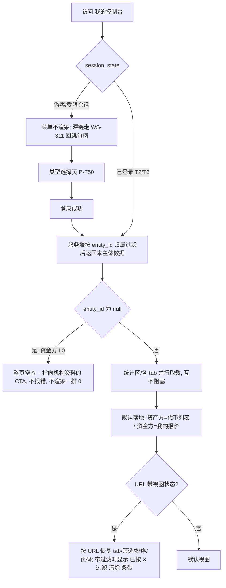
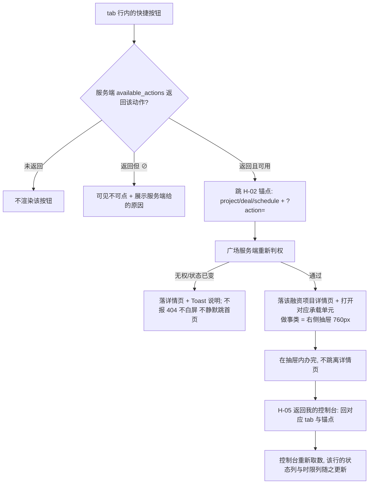
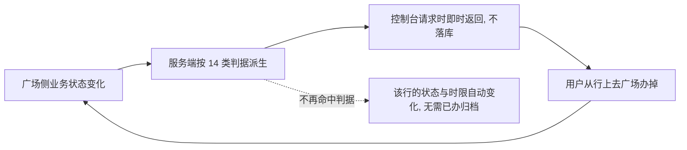

# 金融服务平台 · 金融服务端 · 我的控制台（只读） PRD **V3.0**

> **V3.0 = 待办带撤除的 PRD 侧裁定 + 两处译法同步。** 相对 V2.0（未入库附件版）：
> ① ⚠️ **需求方 2026-09-16「代办提醒布局错乱，这里不放待办」——待办提示带整块撤除。** 原型 v1.1（`ab518ec`）已执行并把编号归属留给 PRD 裁定，本版接下：`C-MC-02` 作废、`F-MC-08` 改写为「行级提醒」、**14 类判据一条不减地下沉到各 tab 行上**（分册 01 · 6.7）。**这是承载形态替换，不是能力删除。**
> ② 连带给出 **WS-329 `B-4` / `B-5` 的处置与建议改法**（分册 01 · 6.9），**本模块不改 WS-329**。
> ③ 两处译法取 WS-324 分册 7.6 已定的词：**覆盖缺口数值＝`Coverage gap`**、**对外状态「已报价待确认」＝`Awaiting quote confirmation`**。
> **口径与编号仍一条未减**：14 类判据、10/1/3 落点分布、`D-LS-18` 五值、`FP-28`、质押覆盖三档术语原样；作废的三个编号（`C-MC-02`/`D-MC-155`/`D-MC-158`）保留占位、不复用。V2.0 → V3.0 逐条变更见 **12.0**。

> **本模块为三册。**
>
> | 文件 | 内容 | 读者 |
> | --- | --- | --- |
> | `v1.0-我的控制台-PRD.md`（本册） | 第 1～6.6 章、第 12 章：背景与范围、角色与场景、页面流、只读口径、功能清单与模块详情、变更记录与遗留 | 需求方、设计、实现 |
> | [`01-快捷操作与行级提醒.md`](01-快捷操作与行级提醒.md)（**V3.0 更名**） | 6.7～6.10：**14 类行级提醒判据的逐条落点**、快捷按钮 → 锚点 → 承载全表、与面客消息中心的边界（含 `B-4`/`B-5` 处置）、异常分支、附表 A | 设计、实现方、测试 |
> | [`02-数据字段与验收标准.md`](02-数据字段与验收标准.md) | 第 7～11 章：只读消费字段总表与可见字段矩阵、非功能、指标、依赖与风险、对上下游的请求、**验收标准汇总** | 实现方、测试 |
>
> **三册编号连续、不重复定义**：同一个编号只在一处定义，另两册引用。
>
> ⚠️ **本模块零业务写操作（`AC-MC-11`），无任何例外。** 全篇每一个"去 XX"按钮都是**跳借贷广场**的深链。

## 1. 文档信息

| 项 | 内容 |
| --- | --- |
| 对应需求 | WS-328「金融服务端 · 我的控制台（只读）（PRD + 原型）」 |
| **覆盖端** | **金融服务平台 · 金融服务端（面客 Web），须登录**。单端。**本模块无未登录可见内容**——「我的控制台」菜单对游客完全隐藏、路由不进游客白名单、深链走 WS-311 回跳句柄（`D-MC-01`～`D-MC-08`）；**不含运营端任何界面**，不含资产平台任何页面 |
| 模块定位 | WS-323 简报第 11 章 **M-5**；登录后的个人数据聚合页 |
| 上游输入 | 《需求诊断简报 V7.0》《附册 · 融资全生命周期 V6.0》（WS-323）；本 issue 描述中的口径回填与 2026-09-11 08:17 / 08:51 裁定 |
| **上游版本指针**（本版对齐基准） | **WS-324 V9.3**、**WS-325 V7.2**、**WS-326 V3.2**（目录 `v1.0-借贷广场-放款与放款确认/`）、**WS-327 V3.3**、**WS-329 V2.0**；均在 `cly-V1.0.0` / **`9a457a0`**。本模块原型基线 **v1.1 `ab518ec`**（待办带已撤）。⚠️ WS-329 的对齐基准仍停在 WS-324 V9.0（见 12.3 缺口 5） |
| 其他依赖文档 | WS-308『01-国际化基线.md』、WS-311 主干三册、WS-315（资金方钱包绑定）、WS-316、WS-318 |
| 编写人 | 许楚清（需求分析师） |
| 文档状态 | **V3.0**。本模块自身开放项 1 条（12.1）；引用的外部待裁定项 1 条（12.2）；**本版新产生 1 条需 WS-329 执行的连带修订**（分册 01 · 6.9） |
| 编号空间 | 沿用上游 `D-MC-*`（115 起）/ `AC-MC-*`（20 起）/ `X-MC-*`（20 起）/ `R-MC-*`（30 起）/ `Q-MC-*`（50 起）；本模块新增 `F-MC-*`、`T-MC-01`～`T-MC-14`、`E-MC-*`、`M-MC-*`、`P-MC-01`/`C-MC-*`；依赖沿用广场链条数字段 `DEP-60` 起。**不回收作废号** |

---

## 2. 背景与目标

### 2.1 背景

借贷广场是融资全生命周期八个业务动作的**唯一执行场所**。但广场的每一页只讲**一个项目**——一个资产方名下有多少张代币、押出去多少、几个池在跑、几家机构给了多少授信、哪一期还款要到期，广场回答不了。

**我的控制台把散在四个模块里、属于"我"的事实聚合到一页**，只做三件事：**把数聚起来**（统计区）、**把该我做的事标在行上**（行级提醒）、**把人送回广场去办**（快捷按钮深链）。它不产生任何新事实。

### 2.2 本期目标

| # | 目标 | 达成口径 |
| --- | --- | --- |
| G-1 | 登录用户在一页上看清"我有什么、我欠什么、我该做什么" | 6.2 + 6.3 + 分册 01 · 6.7 |
| G-2 | 每一类行级提醒都能就地一键到达可执行它的那个位置 | 全部走 `available_actions` + `H-02` 锚点（分册 01 · 6.8） |
| G-3 | 控制台与广场读到的同一笔业务，数字、状态、文案完全一致 | 同源红线 `AC-MC-12`～`AC-MC-14`（5.2） |
| G-4 | 控制台上不存在任何业务提交入口，且可机械验收 | `AC-MC-11` + `AC-MC-33` |
| G-5 | 共享设备下会话一失效，个人数据立刻从页面消失 | `D-MC-11`（6.6.2） |

### 2.3 范围（含）

| 编号 | 功能点 | 详见 |
| --- | --- | --- |
| `F-MC-01` | 统计区（四组指标 + 剩余可用授信） | 6.2 |
| `F-MC-02` | 代币列表 tab | 6.3.1 |
| `F-MC-03` | 融资项目 tab（含质押覆盖状态、覆盖不足提醒、可提取代币提醒、逐轮需求） | 6.3.2 |
| `F-MC-04` | 授信明细 tab（资产方）/ 授信汇总 tab（资金方） | 6.3.3 |
| `F-MC-05` | 融资放款信息 tab | 6.3.4 |
| `F-MC-06` | 还款信息 tab | 6.3.5 |
| `F-MC-07` | 我的报价 tab（资金方） | 6.3.6 |
| `F-MC-08` | **行级提醒**（14 类判据下沉到各 tab 行的状态列 / 时限列 / 行内按钮） | 分册 01 · 6.7 |
| `F-MC-09` | 快捷操作按钮与深链消费 | 分册 01 · 6.8 |
| `F-MC-10` | 登录态 / 未登录态 / 空态 / 加载 / 错误 / 无权限 | 6.4、6.6 |
| `F-MC-11` | 分页、排序与 URL 视图状态 | 6.5 |
| `F-MC-12` | 中英双语 | 6.6.4 |

### 2.4 范围（不含）

| 编号 | 本期不做 | 归属 / 依据 |
| --- | --- | --- |
| **`AC-MC-11`** | **任何业务写操作** | **无例外**；八个业务动作全部在广场（`D-MC-94`） |
| `X-MC-10` | 控制台自建融资业务详情页 | 详情页统一由广场提供（`P-LS-02`） |
| `X-MC-03` | 控制台自建消息中心 / 消息列表 / 未读角标 / 已读逻辑 | 归 WS-329（6.9） |
| `X-MC-04` | 控制台自身的业务数据轮询与保活心跳 | 会话失效以 401 即时感知（`D-MC-14`）。**未读数轮询不在此列**（6.9） |
| `X-MC-20` | 控制台自建任何 `action` 取值或跳转锚点 | 一律消费 `H-01`～`H-05` 与下游已登记取值（`AC-LS-07`） |
| `X-MC-21` | 控制台自行计算任何派生量 | 全部只读引用（5.2 `D-MC-119`） |
| `X-MC-22` | 为 `S-FD-5` / `S-RP-4` 准备 tab、筛选项与文案 | 本期不产生（`D-LN-02`、`D-RP-02`） |
| `X-MC-23` | 「提出异议」入口，及"异议处理中"两类判据 | 异议走线下客服邮箱；判据因此为 **14 类** |
| `X-MC-24` | 自建第二套展示状态或第二个需求标识 | 对外状态取 `D-LS-18` 五值；需求编号取 `FP-28` |
| `X-MC-25`（**新 · V2.0**） | **为多链准备任何展示、筛选或选择控件** | 本期只支持 `ETH`（口径主体 WS-326 主册 5.6 `D-LN-60`～`D-LN-63`，本册引用不重述） |
| `X-MC-26`（**新 · V2.0**） | **展示或引用 `QT-07`/`QT-08` 机构收款账户** | 两字段已于 WS-325 V7.1 正式作废；还款去向改取 WS-326 `LN-15`/`LN-16` |
| `X-MC-27`（**新 · V3.0**） | **待办提示带，及其任何替代形态**——折叠区、浮层、红点、第六个 tab、tab 上的数字角标、统计区里的"待处理 N 件" | 需求方 2026-09-16「这里不放待办」。四种折中形态**都还是把它放在这里**（`D-MC-123` 改写，反向验收 `AC-MC-29`） |
| `X-MC-11` | 质押率的配置界面与差异化 | 本期硬编码 80%，只读展示 |
| `X-MC-08` | 失效代币的处置 / 变现 / 清算 | 无承接模块 |

### 2.5 上游口径声明（**原样保留，不得删改**）

> 本模块的可见性与归属口径以 WS-323 V7.0 简报为准；WS-311 `UC-01`（输出契约增加 `entity_id`）为前置动作 P-2，**已确认延后、上线验收前必须完成**。`X-2`（游客排序只能按区间）**不适用于控制台**，理由见 `D-MC-68`（6.5.3）。

### 2.6 六条不可削弱的红线

| 编号 | 红线 |
| --- | --- |
| **`AC-MC-11`** | **控制台零业务写操作，无任何例外**；可机械验收（反向清单 `AC-MC-33`） |
| **`AC-MC-12`～`AC-MC-14`** | **跨模块同源**：同一笔业务的状态 / 金额 / 派生量来自同一接口或同一算法；共用术语表；共用状态机枚举。控制台**只读引用、不另存、不自算** |
| **`D-LS-09`** | **广场信息全公开 ≠ 控制台可以不做服务端过滤**：归属过滤、跨主体隔离、动作鉴权三类校验全部保留 |
| **`D-MC-11`** | **会话失效瞬间，已渲染的个人数据必须从 DOM 清除**，不是弹层遮挡 |
| **`D-LS-17`（术语）** | 只用 `质押覆盖状态` / `覆盖有余` / `覆盖持平` / `覆盖不足` / `覆盖缺口` / 「覆盖不足提醒」（反向验收 `AC-MC-35`） |
| **环节名（`D-MC-122`，V2.0 新增红线）** | 只用 **「报价确认」**（接受/拒绝报价）与 **「放款确认」**（确认收到放款）；**已作废的旧展示名全链路零残留**（反向验收 `AC-MC-36`，本册刻意不复写旧名以便 grep 自查归零） |

---

## 3. 用户与场景

### 3.1 角色

| 角色 | 诉求 | 可见范围 |
| --- | --- | --- |
| **游客（未登录）** | — | 菜单完全隐藏、路由不进游客白名单；深链走 WS-311 类型选择页（`D-MC-01`～`D-MC-08`） |
| **资产方（T2/T3）** | 我有多少代币、押了多少、几个项目在跑、谁给了我授信、这月要还多少、现在该我做什么 | 本企业主体名下全部数据；五个 tab |
| **资金方（T2/T3）** | 我给谁授了多少信、还剩多少可用、哪笔该我放款、哪笔该我确认收到还款 | 本机构主体名下全部数据；四个 tab（`D-MC-124`） |
| **受限会话下的资产方** | — | 与游客同处置（`D-MC-150`） |
| **平台运营** | — | **本模块不提供任何管理视图** |

> 同一企业主体下任一登录员工看到同一份数据，本期不做企业内分级（`D-MC-105`/`AC-MC-16`）；**T2（登录未认证）照常显示、照常可点**。

### 3.2 用户故事

| 编号 | 故事 | 验收落点 |
| --- | --- | --- |
| `US-MC-01` | 作为资产方，一眼看到我一共有多少代币、押出去了多少 | 6.2、`AC-MC-21` |
| `US-MC-02` | 作为资产方，知道哪个池的质押覆盖出了问题、缺多少、要补多少资产 | 6.3.2、`AC-MC-76` |
| `US-MC-03` | 作为资产方，知道现在轮到我做什么，点一下就能去办 | 分册 01 |
| `US-MC-04` | 作为资产方，看清每家机构给了我多少额度、还剩多少可用 | 6.3.3 |
| `US-MC-05` | 作为资金方，知道我对每个资产方的敞口和剩余可用授信 | 6.2、6.3.3 |
| `US-MC-06` | 作为资金方，知道我报出去的价还剩多久失效 | 6.3.6、`AC-MC-27` |
| `US-MC-07` | 作为双方，知道这笔确认还剩多久、超期了该找谁 | 6.3.4／6.3.5、分册 01 |
| `US-MC-08` | 作为共用办公设备的资金方，会话一失效页面上的业务数据立刻消失 | 6.6.2、`AC-MC-31` |
| `US-MC-09` | 作为境外资金方，界面默认是英文 | 6.6.4、`AC-MC-81` |

### 3.3 典型场景

- **S1 早上开工**（**V3.0 改写**）：资产方登录 → 落「代币列表」→ 切到「融资项目」，该行时限列显示"剩余 2 天 6 小时"、按钮「去接受 / 拒绝报价」可点 → 点它 → 落广场详情页并**自动打开报价确认抽屉** → 办完点「返回我的控制台」→ 回到融资项目 tab 并定位到那一行，**该行的状态列与时限列已更新**。其余两件事同理长在「还款信息」与「融资放款信息」的行上。
- **S2 池子缩水**：两张代币失效 → 融资项目 tab 该项目的**质押覆盖状态**从 `覆盖有余` 变 `覆盖不足`，行内出现覆盖不足提醒（缺口 2 万 USD、需追加 2.5 万 USD）与「去追加质押」；同一时刻该项目本轮需求已**判定即失效**，`FP-28` 那行对外状态显示 `已失效／已关闭`、终结原因 `自动失效 · 覆盖不足`。**两件事分开讲**（`D-MC-135`）。
- **S3 同企业两个员工**（**V3.0 改写**）：员工甲提交了还款，员工乙登录 → **「还款信息」tab 的行上看得到"待我确认收到还款"的状态与时限**，**铃铛未读数却是 0**（WS-329 `B-5`）。**这是设计上正确的**，页面必须写明——那句说明随待办带一起挪到**各 tab 列表区顶部**（`D-MC-162` 改写）。
- **S4 资金方 L0**：`entity_id` 为 `null` → 控制台**照常可进、走空态**，CTA 跳 WS-316，**不报错**（`D-MC-116`）。
- **S5 走开四小时**：会话届满 → 401 → 页面回落游客态，统计区、各 tab 内容**全部从 DOM 移除**，菜单消失（6.6.2）。

---

## 4. 流程说明

### 4.1 进入控制台与登录态判定

### 4.2 从行上到广场再回来（深链闭环）

| 编号 | 条款（**V2.0 重写**） |
| --- | --- |
| **`D-MC-115`【深链语义与承载】** | **`P-LS-04`～`P-LS-10` 是详情页操作区内的承载单元，不是独立页面。** 承载按上游判据两分（WS-326 主册 4.5 `D-LN-48`/`D-LN-54`/`D-LN-57`、WS-327 4.5 `D-RP-71`/`D-RP-76`，本册引用不重述）：**做事类**（录入 / 上传 / 选择 / 分步走完一件事，或一边看一边填）→ **右侧抽屉 760px**；**提示类**（零录入，只要求表一次态）→ **居中弹窗 560px**；**同一时刻只有一层**。 **控制台侧的结论**：**控制台的全部深链目标都是做事类，一律落「详情页 + 右侧抽屉 760px」**（还款类再加"定位操作区第③段并选中对应期次"）；**控制台不深链到任何提示类弹窗**——二次确认只出现在做事流程内部。逐个锚点的承载见分册 01 · 6.8.2。 **不得新增** `demand/{id}`、`credit/{id}`、`disbursement/{id}`、`repayment/{id}` 四层锚点（均已被上游否决）。 |
| `D-MC-116`【`entity_id` 缺失】 | 资金方 L0 未提交机构资料时 `entity_id` 为 `null`：控制台**走整页空态**，CTA 指向 WS-316；**统计区不渲染任何数字卡片、不展示一排 0**。 |

### 4.3 行级提醒的产生与消失（不落库）

| 编号 | 条款 |
| --- | --- |
| `D-MC-117` | **判据由业务状态派生、不落库**（WS-329 `B-3`）：无已读、无删除、无历史、**不需要"已办归档"**。据此页面上**不得出现"标记已办 / 忽略 / 归档"控件**。 |
| `D-MC-118` | **判据只有一条：没有需要用户执行的动作，就不进行级提醒**（`B-2`）。只是告知的事项进消息中心。⚠️ 唯一的例外是 `T-MC-11`（等待中、无动作），理由见 12.4 ⑦ |

---

## 5. 业务对象与核心口径

### 5.1 控制台不定义任何业务对象

| 对象 | 定义方 | 控制台读它的哪个视角 |
| --- | --- | --- |
| 代币（`D-TI-*`） | WS-318 | 代币列表 tab |
| 融资项目 = 资产池 = 广场上的一条融资需求（`FP-*`/`S-FP-*`/`PL-*`/`PS-*`/`CT-*`） | WS-324 | 融资项目 tab；三个说法同一对象（`D-LS-11`），控制台侧一律称「融资项目」 |
| 融资需求对外状态（`D-LS-18` 五值）、需求编号（`FP-28`） | WS-324 | 逐轮需求行；服务端派生下发 |
| 授信额度（`CR-*`/`S-CR-*`）、报价与融资业务（`QT-*`/`FD-01`～`FD-21`/`S-FD-*`） | WS-325 | 授信 tab、我的报价 tab |
| 放款记录与放款确认时限（`LN-*`/`FD-30`～`FD-39`） | WS-326 | 融资放款信息 tab |
| 还款计划与还款记录（`RP-*`/`RM-*`/`FD-40`～`FD-47`/`S-RP-*`） | WS-327 | 还款信息 tab |
| 消息、未读数、铃铛 | WS-329 | **不读**——控制台不自建也不接管消息（6.9） |

### 5.2 只读口径：控制台读什么、绝不做什么

| 编号 | 条款 |
| --- | --- |
| `AC-MC-12`（承接） | 同一笔业务的状态、金额、派生量来自同一接口或同一算法；控制台与广场读到的同一项目的派生量、覆盖档位、状态文案完全一致（`H-04`/`AC-LS-25`） |
| `AC-MC-13`（承接） | 共用术语表，不为同一个量起第二个名字（`D-FIN-06`/`D-LS-16`） |
| `AC-MC-14`（承接） | 共用状态机枚举，不自造"处理中""进行中"这类聚合态（`D-FIN-32`） |
| **`D-MC-119`【不算】** | 以下一律取服务端下发值，**不自算、不另存**：① 授信四量 `CR-08`～`CR-11`（`AC-LS-106`）；② 质押覆盖状态 `FP-20`、覆盖缺口 `FP-21` 与需追加资产价值、有效质押价值 `FP-11`、项目融资余额 `FP-13`（`H-04`）；③ **利息与逾期天数** `RP-07`/`RP-11`（`AC-LS-136`）；④ 一切倒计时与开窗时刻（`D-MC-120`）。理由见 12.4 ① |
| **`D-MC-120`【倒计时】** | 一切倒计时**由服务端给出绝对到期时刻，前端只渲染**：报价剩余有效期取 `QT-12`、**放款确认**剩余时限取 `FD-37`、**还款确认**剩余时限取 `RM-15`、还款入口开窗时刻取 `RP-15`（`AC-LS-106`/`AC-LS-126`/`AC-LS-133`）。归零后不再倒数，改展示对应超期标记与已超期天数 |
| **`D-MC-121`【三个 168 小时分别命名】** | **报价有效期**（WS-325 `D-CR-26`，到期自动失效）、**放款确认时限**（WS-326 `D-LN-32`，到期只发通知、状态不变）、**还款确认时限**（WS-327 `D-RP-52`，同前）。控制台**不得出现无限定词的"7 天""有效期""倒计时"**；超期表述一律「**已超过放款确认时限**」/「**已超过还款确认时限**」，**不得写"已失效""已逾期"**（`AC-LS-127`） |
| **`D-MC-122`【环节名，V2.0 重写】** | 需求方 2026-09-15 已分别定名：第三环「**报价确认**」＝资产方接受/拒绝报价（06:01），第四环的确认动作「**放款确认**」＝资产方确认收到放款（02:19），`S-FD-4` 状态名随之为 `待放款确认`；**旧展示名全链路作废、不归属任何模块**。控制台的 tab 名、待办文案、按钮名、深链说明、消息标题**全部按新名**。 **同时保留 V1.0 的止血**：界面与消息标题中**不得出现无限定词的单字「确认」**——「报价确认 / 放款确认 / 还款确认」只差一个字，而**控制台的待办带是三者唯一可能并排出现在同一屏的地方**（同 WS-329 `D-F936` 对消息列表的判断）。 ⚠️ **本册刻意不复写旧名**，以便 `AC-MC-36` 的 grep 自查归零 |
| **`D-MC-167`【界面不呈现平台内部规则，V2.0 新增】** | 承接 WS-325 `D-LS-33`：控制台界面上**不得出现**判据公式、**任何条款与验收编号**、以及运行机制的解释性文字（"服务端实时重算不吃缓存""两道校验已重跑"一类）。 ⚠️ **撤的是规则，不是结果**——**必须保留**：覆盖缺口与需追加资产价值两个数、三个 168 小时的倒计时与锁定信息、额度类与时限类的差额与出路、超期后的客服邮箱指引。**判断标准：展示用户自己的数就留，展示平台怎么算的就撤**（反向验收 `AC-MC-77`） |
| **`D-MC-168`【链是常量，V2.0 新增】** | 本期**只支持 `ETH` 一条链**，口径主体在 WS-326 主册 5.6（`D-LN-60`～`D-LN-63`），**本册引用、不重述**。控制台侧：链一律**只读展示**，**不出现下拉、单选或"默认 ETH 可改"字样**；USDT / USDC 标注为 **ERC-20**；区块浏览器链接取 **ETH 固定前缀**并常驻"平台未核验该交易"（反向验收 `AC-MC-78`） |

### 5.3 术语：本模块使用的全部量，一处都不另起名字

| 术语 | 口径来源 | 控制台界面展示名 |
| --- | --- | --- |
| `项目融资余额` | `FP-13` | 「已融资余额」（**文档与字段中不得简写**） |
| `有效质押价值` | `FP-11` | 「质押代币价值」 |
| `池内资产总额` | `FP-10` | 仅用于统计区②的账面口径与失效副行 |
| `融资上限` / `可融金额` / `项目在途金额` / `可撤回上限` | `FP-12`/`FP-15`/`FP-14`/`FP-16` | **不在控制台展示**（6.2.1） |
| **`质押覆盖状态`** | `FP-20` | 三档 `覆盖有余` / `覆盖持平` / `覆盖不足` |
| **`覆盖缺口`** | `FP-21` | 与「需追加资产价值 = 覆盖缺口 ÷ 80%」**成对展示** |
| 「覆盖不足提醒」 | WS-324 6.4.1 | 提醒，判据 `融资上限 < 项目融资余额`；**不是闸门的可视化** |
| `授信占用额` / `在途报价金额` / `授信已用额` / `可用授信` | `CR-08`～`CR-11` | `授信已用额` 是前两者**合称**，展示为"合计"，不作第四个并列量 |
| `已融额度` | 统计区④ | ≡ Σ`项目融资余额` ≡ Σ`授信占用额`（`AC-MC-10`） |
| `融资需求对外状态` | `D-LS-18` | `待报价` / `已报价待确认` / `放款中` / `已放款` / `已失效／已关闭` |
| **还款类型**（`QT-15`，V2.0 新增） | WS-325 `D-CR-51` | 定值 `按季付息；到期还本付息`，**只读文本、不做下拉** |
| **最终还款日**（`QT-16`，V2.0 新增） | WS-325 `D-CR-52`/`D-CR-53` | **派生值**，恒等于项目截止日 `FP-09`，**跟随不快照**；`FD-46` 同源 |
| **还款性质**（`RP-13`，V2.0 更名） | WS-327 `D-RP-50` | 两值 `正常还款` / `逾期还款`。⚠️ **不得称「还款类型」**——该词已被 `QT-15` 占用（`AC-RP-27`） |

---

## 6. 功能清单与模块详情

### 6.0 功能点总表

> 每个功能点四件事：**做什么 / 触发条件 / 界面显示什么 / 验收编号**。字段全表在分册 02 · 7.1，本章不复述。

| 编号 | 做什么 | 触发条件 | 界面显示什么 | 验收 |
| --- | --- | --- | --- | --- |
| `F-MC-01` | 聚合展示四组指标 + 剩余可用授信 | 进入控制台且 `entity_id` 非空 | 6.2 指标表（资金方不渲染①②） | `AC-MC-10`/`21`/`43`～`47` |
| `F-MC-02` | 列出本主体名下全部代币 | 资产方进入该 tab | 代币两根轴 + 所属项目 + 可提取提醒 | `AC-MC-22`/`48`/`49` |
| `F-MC-03` | 列出本主体名下全部融资项目与逐轮需求 | 资产方进入该 tab | 五个数 + 覆盖状态 + 逐轮需求对外状态 + 覆盖不足提醒 | `AC-MC-23`/`50`～`52`/`76` |
| `F-MC-04` | 按「机构 × 资产方」二元组列出授信 | 任一角色进入该 tab | `CR-01`～`CR-11`（`CR-12` 仅本方） | `AC-MC-24`/`53`/`54` |
| `F-MC-05` | 列出放款段业务与放款记录 | 任一角色进入该 tab | 放款记录 + 还款收款账户 + 放款确认时限 | `AC-MC-25`/`58`～`61`/`79` |
| `F-MC-06` | 按业务 → `FP-28` → 期次列出还款计划与记录 | 任一角色进入该 tab | 期次全字段 + 还款记录 + 还款确认时限 | `AC-MC-26`/`55`～`57`/`80` |
| `F-MC-07` | 列出本机构提交的报价 | 资金方进入该 tab | 商务条款 + 锁定信息 + 剩余有效期 | `AC-MC-27` |
| `F-MC-08` | 派生 14 类判据并**在各 tab 行上呈现** | 业务状态命中判据 | **状态列 + 时限列 + 行内按钮**；紧迫的排在前（**无带、无分组、无计数**） | `AC-MC-28`～`30`/`62`～`65` |
| `F-MC-09` | 渲染快捷按钮并跳广场 | 服务端 `available_actions` 返回该动作 | 三态（不渲染 / 可点 / `⊘`+原因） | `AC-MC-32`/`34`/`66`～`68` |
| `F-MC-10` | 登录态判定、空态、加载、错误、无权限 | 见 6.4／6.6 | 分块骨架屏、分块降级、空态 CTA | `AC-MC-01`～`06`/`31`/`39`～`42`/`71`/`72` |
| `F-MC-11` | 分页、排序、URL 视图状态与过滤条带 | 用户切 tab / 筛选 / 排序 / 翻页 | 6.5 | `AC-MC-69`/`70` |
| `F-MC-12` | 中英双语，默认英文 | 壳层语言切换 | 6.6.4 | `AC-MC-81` |

### 6.1 页面、组件与信息架构

| 编号 | 名称 | 形态 |
| --- | --- | --- |
| `P-MC-01` | **我的控制台** | 整页，继承 WS-295「面客认证后」shell；tab 是**页内切换** |
| `C-MC-01` | 统计区 | 组件（6.2） |
| ~~`C-MC-02`~~ | ~~待办提示带~~ | **作废**（V3.0，需求方 09-16）。编号保留占位、**不复用**；判据的承接见分册 01 · 6.7 |
| `C-MC-03` | tab 容器与内容区 | 组件（6.3） |
| `C-MC-04` | 「已按 X 过滤 / 清除」条带 | 组件（6.5.2） |
| `C-MC-05` | 快捷操作按钮组 | 组件（分册 01 · 6.8） |

**自上而下两段**（**V3.0：由三段收成两段**；壳层顶栏由 WS-311 提供，铃铛属 WS-329）：**① 统计区 → ② tab 容器**（说明位 / 筛选条 / 排序 / 过滤条带 → 列表 → 分页）。
tab 集：资产方 `代币列表*` `融资项目` `授信明细` `融资放款信息` `还款信息`；资金方 `我的报价*` `授信汇总` `融资放款信息` `还款信息`（`*` = 默认落地）。

| 编号 | 条款 |
| --- | --- |
| `D-MC-123`（**V3.0 改写并加强**） | **控制台不放待办**：**不做待办带、不做折叠区、不做浮层、不做红点、不做第六个 tab**——四种折中形态都还是"把它放在这里"（`X-MC-27`，反向验收 `AC-MC-29`；理由见 12.4 ②） |
| `D-MC-124` | **两端 tab 集不同，不渲染空 tab**：资产方五个、资金方四个（**不渲染"代币列表"**）。资金方侧「我的报价」承担资产方侧「融资项目」的位置，两者读同一批融资业务对象的两个视角。「资金端 · 融资需求」不做成 tab（`Q-MC-50`） |
| `D-MC-125` | **默认落地**：资产方「代币列表」，资金方「我的报价」 |

### 6.2 统计区（`F-MC-01`）

| # | 指标 | 资产方口径 | 资金方口径 |
| --- | --- | --- | --- |
| ① | **全部代币** 数量 / 金额（USD） | 本主体名下全部代币张数与 Σ`D-TI-18` | **不适用，不渲染** |
| ② | **已质押代币** 数量 / 金额（USD） | 其中 `D-TI-24 = 已质押` 的张数与金额（**账面口径，含失效**） | **不适用，不渲染** |
| ②副行 | 其中已失效 | 失效张数与金额，标注「**不计入覆盖**」 | — |
| ③ | **总授信** 额度 / 笔数 | Σ 各机构授予本企业的 `CR-05`；授信记录条数 | Σ 本机构授出的 `CR-05`；同左 |
| ④ | **已融额度** / 笔数 | Σ`项目融资余额`；未结清融资业务笔数 | Σ`CR-08`；同左 |
| ＋ | **剩余可用授信** | Σ`CR-11` | 同左 |

| 编号 | 条款 |
| --- | --- |
| `D-MC-47`（承接） | **①与②是包含关系**，必须呈现为子集（②嵌在①内或"其中"从属版式），**不得并排两个同级卡片** |
| `D-MC-43`/`D-MC-44`（承接） | **本模块不需要实时汇率**：`D-TI-18` 是签发时已换算且永不重算的美元额，融资侧换算用 `QT-04` 快照。**不得引入第二个汇率源、不得实时折算** |
| **`D-MC-126`** | **统计区②≠有效质押价值**：②是跨项目账面口径（含失效），`FP-11` 排除失效 / 未上链 / 对账差异 / 撤回预扣。**②下必须给失效副行**；两者标签不同（②叫「已质押代币」，广场详情页那项叫「质押代币价值」）。理由见 12.4 ③ |
| **`D-MC-127`** | 剩余可用授信只回答"授信维度还剩多少"，旁边**常驻一句**："实际可融金额以发布需求时服务端当场重算的结果为准"。**不得给出"你还能融 X"的数字** |
| `AC-MC-10`（承接） | 自洽性校验 `Σ授信占用额 ≡ Σ项目融资余额 ≡ 已融额度` **在服务端执行**；控制台只展示同一份数，**不执行校验、不自行调平** |

#### 6.2.1 不展示的四个中间量

**`融资上限`、`可融金额`、`项目在途金额`、`可撤回上限` 不在控制台任何位置展示**；同时**不做**额度尺、进度条式额度可视化、「额度明细与判定口径」折叠区（同 `AC-LS-84`）。**不展示 ≠ 不校验**——`INV-FIN-01` 与 `AC-FIN-12` 在广场服务端一条不减。理由见 12.4 ④。

### 6.3 五个 tab（资金方四个）

#### 6.3.0 通用规则与各 tab 概览

| 编号 | 条款 |
| --- | --- |
| `D-MC-128` | 每个 tab 都是"我的"数据的只读列表，**服务端按 `entity_id` 归属过滤**，前端不做归属判断 |
| `D-MC-129` | **不展示对方敏感信息**：账户快照按 WS-308 第 8 节脱敏、哈希与地址按第 6 节；**盖章件、转账凭证、还款凭证只展示"有 / 无 + 上传时间 + 版本数"**，正文查看走广场 |
| `D-MC-130` | **状态标签一律用上游枚举原文**，不聚合、不改写；对外五值与 `S-FP-*`/`S-FD-*`/`S-RP-*`/`S-CR-*` **不混在同一列** |

| tab | 做什么 | 触发条件 | 界面显示什么（结构要点；字段全表见分册 02） | 验收 |
| --- | --- | --- | --- | --- |
| **6.3.1 代币列表**（资产方，`F-MC-02`，默认落地） | 列出本主体名下全部代币及其占用去向 | 资产方进入该 tab | **两根轴分列**（`D-TI-22` 代币状态 / `D-TI-24` 融资质押状态，可同时取值，失效行标注「不计入覆盖」）；已质押行给出所属融资项目（可点 → `project/{id}`）；顶部聚合**可提取代币提醒** | `AC-MC-22`/`48`/`49` |
| **6.3.2 融资项目**（资产方，`F-MC-03`） | 列出本主体名下全部融资项目（＝资产池＝广场上的一条融资需求，`D-LS-11`）及其逐轮需求 | 资产方进入该 tab | **行内五个数**（与广场详情页统计区同一组、标签一字不改）：质押代币数量 ｜ 质押代币价值 `FP-11` ｜ 融资需求 `FP-06` ｜ 已融资余额 `FP-13` ｜ 质押率常量 `80%`（无可编辑控件）。**其余**：`FP-01`/`FP-02`/`FP-29`/`FP-04`/`FP-05`/`FP-09`/`FP-22`/`FP-23`/**`FP-20`**。**展开区 · 逐轮需求**：`FP-28` ｜ 金额币种 ｜ **对外状态（五值，服务端派生）** ｜ `FP-27` ｜ 机构名与报价时间 ｜ **锁定信息**（`FD-13` + `QT-13`，到期时刻取 `QT-12`）。覆盖不足时出中性提醒 +「去追加质押」+ 失效代币清单入口 | `AC-MC-23`/`50`～`52`/`76` |
| **6.3.3 授信明细 / 授信汇总**（两端，`F-MC-04`） | 按「**机构 × 资产方**」企业二元组（`D-CR-10`）只读展示授信与占用，**不按项目拆** | 任一角色进入该 tab | `CR-01` ｜ 对方企业主体 ｜ `CR-04` ｜ `CR-05` ｜ `CR-07` ｜ `CR-08` ｜ `CR-09` ｜ **`CR-10`（呈现为"合计"）** ｜ `CR-11` ｜ `CR-06` | `AC-MC-24`/`53`/`54` |
| **6.3.4 融资放款信息**（两端，`F-MC-05`） | 只读展示一笔融资业务的放款段 | 任一角色进入该 tab | 业务标识（`FD-01` + **`FP-28`**）｜ 业务状态与三个并行标记（`FD-31`/`FD-32`+原因/`FD-36`）｜ 商务条款（含 **`QT-15`/`QT-16`，只读无编辑控件**）｜ 放款记录（`LN-13` 链接，**链为常量 `ETH` 只读**）｜ **还款收款账户 `LN-15`/`LN-16`**（脱敏只读）｜ **放款确认时限 `FD-37`/`FD-38`/`FD-36`** ｜ 终止原因与时间 | `AC-MC-25`/`58`～`61`/`79` |
| **6.3.5 还款信息**（两端，`F-MC-06`） | 按「融资业务 → `FP-28` → 期次」三层只读展示还款计划与还款记录 | 任一角色进入该 tab | 业务级 `FD-41`～`FD-47`（含 **`FD-46` 跟随 `QT-16` 不快照**、`FD-47` 起息日、`FD-44` 逾期并行标记）｜ 期次（`RP-05` 计息区间、`RP-11` 逾期标记与天数、**`RP-12` 引用 `QT-15`**、**`RP-13` 还款性质**、`RP-15` 开窗时刻、`RP-18` 计息规则摘要；**末期行显式标注"含本金 · 到期还本付息"**）｜ 还款记录 `RM-01`～`RM-18`（**与 `LN-*` 严格对称，只需一套渲染**）｜ **还款确认时限 `RM-15`/`RM-16`/`RM-17`** | `AC-MC-26`/`55`～`57`/`80` |
| **6.3.6 我的报价**（资金方，`F-MC-07`，默认落地） | 只读展示本机构提交的报价与其后续融资业务 | 资金方进入该 tab | `FD-01` + **`FP-28`** ｜ 资产方企业名与项目 ｜ 商务条款 `QT-02`～`QT-06` + **`QT-15`/`QT-16`（只读）** ｜ 业务状态 ｜ **锁定信息**（`QT-09`、`FD-13`、`QT-13`；两者相加恒为 168 小时）｜ 终结信息（`FD-11`/`FD-15`/`FD-17`）｜ `FP-20` | `AC-MC-27` |

#### 6.3.1～6.3.2 代币与融资项目的专有条款

| 编号 | 条款 |
| --- | --- |
| `D-MC-99`/`D-MC-100`（承接） | **两根轴都要展示，不得合并成一个字段、不得并排同一列** |
| `D-MC-131` | **不展示合同号与发票号**（与广场两张清单保持一致，`D-LS-10`） |
| `D-MC-132` | **可提取代币提醒**：「您有 **N 张（合计 X USD）**可提取，需自付 gas，可批量一次提完」+「去解除质押」→ `project/{id}?action=redeem`。**不得暗示代币会自动回到钱包**；**不设时限、不做倒计时** |
| `D-MC-133` | 对外五值**只作状态列展示、不做筛选标签**；控制台筛选只按项目状态与质押覆盖状态两项（6.5.1） |
| **`D-MC-134`【覆盖不足提醒】** | 文案：「当前池内有效质押价值低于项目融资余额，**覆盖缺口 X USD**，**需追加资产价值 Y USD**（缺口 ÷ 80%），自 YYYY-MM-DD 起」。**四条硬约束**：① 两个数**必须成对给**；② **中性事实描述**，不得出现"违约""高危""风险企业"等评价性措辞；③ **不得出现任何倒计时、进度条或"还来得及追加"的暗示**；④ 资金方作为债权人**同样可见**该项目的覆盖状态与缺口 |
| **`D-MC-135`【档位与失效是两条线】** | 档③ `覆盖不足` 判据 `融资上限 < 项目融资余额`（管已放款债务）；需求失效判据是逐笔口径 `AC-FIN-26`（**判定即失效、无缓冲期**），**更早触发**。**提醒挂项目行、失效结果挂逐轮需求行，两处分开呈现、文案互不引用；不得写成"覆盖不足导致需求失效"的因果句** |
| `D-MC-136` | 提醒文案须写明：它**救不回已失效的那笔需求**；能起的作用是把已放款债务的质押覆盖补回来；**失效不是惩罚、可立即重新发布、不设冷却** |

#### 6.3.3～6.3.6 授信、放款、还款、报价的专有条款

| 编号 | 条款 |
| --- | --- |
| `D-MC-92`（承接）／`AC-LS-106`（承接） | **两侧授信视图都是只读**，写入口只在广场报价流程内；**消费 `CR-08`～`CR-11`，不得自算**——尤其不得用 `CR-05 − CR-08` 算可用授信（会漏掉在途报价） |
| `D-MC-137` | **跨主体隔离（服务端过滤）**：① 资产方看得到各机构对它的额度与占用；② 机构看不到该资产方在其他机构的授信；③ `CR-12` 备注**仅机构本方可见** |
| `D-MC-138` | `S-CR-2 已到期` 文案为「已到期 · 存量业务照常履约中，如需再次报价请在报价流程内重新核定」，**不得用告警色或标"异常"**；其名下在途报价与未偿本金照常展示 |
| `D-MC-139` | 区块浏览器链接旁**常驻**「**平台未核验该交易，链接仅供自行查验**」；**不存在**"已核验 / 已确认上链 / 交易有效 / 平台已审核"任何字样 |
| **`D-MC-140`【超期表述】** | `FD-36` 为真时：「**已超过放款确认时限 N 天**」+ **客服邮箱指引**（可复制邮箱 + "请注明需求编号 `FP-28` 与融资业务编号 `FD-01`" + 平台不代为确认、不承诺时效）。**不得写"已失效""已逾期"**；**超期不改变状态、权限与任何金额**，确认入口照常可用 |
| **`D-MC-169`（新 · V2.0）** | **还款收款账户**：法币 `LN-15`（户名 / 账号 / SWIFT / 开户行 / **中转行**五项）、数币 `LN-16`（资金方绑定钱包地址）。**只读、脱敏、无任何修改入口**（放款后本期不可改，`X-LS-39`）；标注"这是资金方将来**收还款**的账户，与本次出账账户无关"。⚠️ **不是已作废的 `QT-07`/`QT-08` 的回滚**（`X-MC-26`、`D-LN-68`） |
| `AC-LS-136`（承接）／`D-MC-141` | **不得自行重算利息或逾期天数**（`RP-07`/`RP-11` 取服务端值）；**开窗取 `RP-15` 绝对时刻、逾期取 `RP-11` 标记，前端不按日期推算**。未开窗期次可见但不可点并给出开启日期；**逾期期次入口必须一直可点** |
| `D-MC-142` | `RP-16` 两版计划**必须带版本标识**；控制台不做两版同屏对照（那是 `action=view_schedule` 抽屉的事），只给「查看还款计划」按钮跳过去 |
| `D-MC-143` | `RM-17` 为真时：「**已超过还款确认时限 N 天**」+ 客服邮箱指引（注明 `FP-28` 与 `RP-01`）。**超期不解冻 `RP-11` 的逾期天数冻结**（`D-FIN-11`） |
| **`D-MC-170`（新 · V2.0）【术语撞名】** | `RP-13` **一律称「还款性质」**（`正常还款`/`逾期还款`），**不得称「还款类型」**——该词已由 `QT-15` 占用（`AC-RP-27`）。两者相邻出现时须各自带标签 |
| `AC-LS-97`（承接）／`D-MC-144` | **锁定必须可解释、可预期**：广场列表、广场详情、控制台三处都能看到"被谁锁定 / 何时起 / 已多久 / 还剩多久"，控制台不得缺倒计时；`S-FD-11` 行文中性、**对机构不产生任何负面记录**，终结的报价**保留在列表里**可按状态筛选隐藏 |
| `X-MC-22`（承接） | **不得为 `S-FD-5` / `S-RP-4` 准备 tab、筛选项与文案**；**不得为 `提前还款` / `部分还款` / 罚息准备文案与入口** |

### 6.4 空态 / 加载 / 错误 / 无权限

| 情形 | 呈现 | CTA |
| --- | --- | --- |
| 代币列表为空 | "您还没有已签发的代币" | **资产平台**（跨域，走 `D-F02` 离站告知） |
| 融资项目为空 | "您还没有创建融资项目" | 「去创建融资项目」→ `project/new` |
| 授信为空（资产方） | "还没有机构对您核定授信额度。机构在报价时会先完成授信核定" | **无 CTA**（发起方是机构） |
| 授信为空（资金方） | "您还没有对任何资产方核定授信额度" | 「去借贷广场看看」 |
| 放款 / 还款为空 | "还没有进入放款（还款）环节的业务" | 「去借贷广场」 |
| `entity_id` 为 `null` | **整页空态**，不渲染统计数字 | 「去提交机构资料」→ WS-316 |
| 加载中 | 统计区与各 tab **各自独立骨架屏** | — |
| 某一块取数失败 | 该块就地展示可重试错误态与原因，**其余块照常可用**；**不得整页 500、不得伪装成空态** | 「重试」 |
| 无权限 / 越权 | 服务端返回不含业务数据的拒绝；前端落**不存在**语义，**不区分"没权限"与"不存在"** | — |

| 编号 | 条款 |
| --- | --- |
| `D-MC-145` | **空态 CTA 一律指向借贷广场或资产平台**——控制台自己没有任何可执行动作 |
| `D-MC-146` | **分块降级**：五个 tab 数据分属四个上游模块，任一不可用只影响它那一块 |

### 6.5 分页、排序与 URL 视图状态（`F-MC-11`）

#### 6.5.1 各 tab 的筛选与排序

| tab | 筛选 | 默认排序 |
| --- | --- | --- |
| 代币列表 | 代币状态、融资质押状态、所属项目 | 签发时间倒序 |
| 融资项目 | 项目状态 `S-FP-*`、质押覆盖状态 | 创建时间倒序 |
| 授信明细 / 汇总 | 额度状态 `S-CR-*` | **可用授信升序**（先看见快用完的） |
| 融资放款信息 | 业务状态、是否已超过放款确认时限 | `LN-06` 提交时间倒序 |
| 还款信息 | 期次状态 `S-RP-*`、是否逾期 | **取服务端下发顺序**（`D-RP-22` 排序结果） |
| 我的报价 | 业务状态 | `QT-09` 提交时间倒序 |

> 单页 20 条，**每页条数可切换**（20 / 50 / 100）。与广场详情页两张清单"固定每页 5 条"不同且是有意的（理由见 12.4 ⑤）。

#### 6.5.2 URL 视图状态

| 编号 | 条款 |
| --- | --- |
| `D-MC-147` | **视图状态写入 URL**：当前 tab、筛选、排序、页码 |
| `D-MC-148` | **带过滤的跳转必须显示「已按 X 过滤 / 清除」条带**（`C-MC-04`） |
| `D-MC-149` | **URL 里不得出现 `redirect` / `return_to` / `next` / `target` 等参数**（`D-F166`）；跨页来源上下文由**服务端暂存**（`H-05`）。控制台**不自建跳转解析** |

#### 6.5.3 `X-2` 不适用于控制台（`D-MC-68`）

| 编号 | 结论 |
| --- | --- |
| **`D-MC-68`** | **`X-2`（游客排序只能按区间）不适用于我的控制台**，因此控制台**提供精确值排序**（按金额、按日期、按剩余时限），不做区间化排序。三条理由：① 控制台**对游客完全不可见**，不存在"游客排序"这一情形；② 登录后看的是**本人（本企业主体）自己的数据、本方完整口径、无字段级脱敏**，二分法想还原的值用户本来就直接看得到；③ 跨主体数据被服务端归属过滤挡在外面，排序作用不到别人的数据上。 ⚠️ **本条独立于"广场游客全量可见"成立**——即使将来广场恢复脱敏，结论不变。**不写明会被按 `X-2` 误判为冲突。** |

### 6.6 登录态、未登录态、会话与语言

#### 6.6.1 菜单与可达性

| 编号 | 条款 |
| --- | --- |
| `D-MC-01`～`D-MC-03`（承接） | **未登录时菜单完全隐藏**；出现与否**只由 `session_state` 决定，与完备度无关**；T2 照常显示、照常可点 |
| `D-MC-04`～`D-MC-08`（承接） | 游客深链走 WS-311 回跳句柄 → 类型选择页 → **登录后原路返回**；**不给 404、不白屏、不静默跳首页**；`return_to` 服务端暂存；**路由不进游客白名单** |
| `D-MC-15`～`D-MC-18`（承接） | SSO 失败回落 T1、菜单随之消失；**不得有"登录失败但菜单还在"的中间态** |
| `D-MC-150` | **受限会话与游客同处置**：菜单不渲染、深链不放行，走首登协议同意 |

#### 6.6.2 会话失效

| 编号 | 条款 |
| --- | --- |
| `D-MC-09`/`D-MC-10` | 会话 **4 小时绝对有效期、无「记住我」**；失效**回落游客态、不落登录页** |
| **`D-MC-11`（红线）** | **失效瞬间已渲染的个人数据必须从 DOM 清除**：统计数字、各 tab 列表、展开区**全部移除**，整页替换为游客态视图；**不是弹层遮挡** |
| `D-MC-13` | **不暂存任何草稿**，仅 Toast 告知 |
| `D-MC-14`/`X-MC-04` | **控制台不新建任何轮询、不做保活心跳**，失效**以 401 即时感知**。⚠️ WS-329 的 60 秒未读数轮询**不在此列**（6.9） |

#### 6.6.3 未登录态下的深链落地

| 编号 | 条款 |
| --- | --- |
| `D-MC-151` | 会话已失效时跳到广场：**详情页操作区只出「立即登录」**（`D-LS-14`），**逐动作置灰 + 独立原因已取消**。控制台不重复实现这套渲染。⚠️ 与 WS-311 权限矩阵 `⊘` 语义的偏离按 WS-324 `10.5` 第 9 条**只登记、不改 WS-311**；**服务端鉴权与跨主体隔离一条不减** |

#### 6.6.4 语言（`F-MC-12`）

| 编号 | 条款 |
| --- | --- |
| `D-LS-15`（承接） | **面客端默认英文**；中英切换沿用 WS-308『01-国际化基线.md』 |
| `D-LS-16`（承接） | **中文术语红线不变**：文档与字段用全称，界面展示名只是展示层映射，**不得反向污染文档术语** |
| `D-MC-152`（**V3.0 改写**） | **中英对照以 WS-324 分册 7.6 为唯一事实源**（其 `D-LS-21`）：**本模块只取词、不重译、不自造**；新增词**先进那张表再上界面**。本模块新增词已于 WS-324 V9.3 回填收录（我的控制台 / 统计区五项 / 各 tab 名 / 三个确认环节 / 三个时限等），**英文下三个确认与三个时限各不相同**（同 WS-329 `AC-F998`）。 **V3.0 同步的两处（取已定词，不是重译）**：① **覆盖缺口（数值）＝`Coverage gap`**——`Coverage shortfall alert` 专指「覆盖不足提醒」这条消息，两者**不再混用**；② **对外状态「已报价待确认」＝`Awaiting quote confirmation`**；内部态 `待接受 Awaiting response` **不得再当对外词用**。对外五值整组：`Awaiting quotes` / `Awaiting quote confirmation` / `Disbursing` / `Disbursed` / `Void / closed`。 ⚠️ **对照表中为待办带收录的三组名（去广场办 / 等待中 / 去其他模块）在控制台已无落点**，登记见分册 02 · 10.3 第 11 条 |
| `D-MC-153` | 时间、金额、数字、链上地址与哈希的展示与脱敏**整段引用** WS-308 第 4/5/6/8 节；三个 168 小时与两个日期类时间量（`RP-15` 开窗、`RP-04` 应还日）按平台统一时区判定并标注 |

> 6.7 行级提醒、6.8 快捷按钮与深链消费、6.9 与消息中心的边界、6.10 异常分支 → 分册 [`01-快捷操作与行级提醒.md`](01-快捷操作与行级提醒.md)。
> 第 7～11 章 → 分册 [`02-数据字段与验收标准.md`](02-数据字段与验收标准.md)。

---

## 12. 变更记录、开放项与遗留事项

### 12.0 V2.0 → V3.0 逐条变更

**A · 待办提示带撤除的 PRD 侧裁定**（需求方 2026-09-16；原型 v1.1 `ab518ec` 已执行并把归属留给 PRD）

| # | 处置 | 落点 |
| --- | --- | --- |
| A1 | **`C-MC-02` 作废**（编号保留占位、不复用）；**`F-MC-08` 改写为「行级提醒」** | 6.1 组件表、2.3 范围表、分册 01 · 6.7.1 |
| A2 | **`T-MC-01`～`T-MC-14` 全部保留**，语义由"待办条目"改为「**行级提醒判据**」——**判据一字不改**，命中后驱动该行的状态列 / 时限列 / 按钮可点性 | 分册 01 · **6.7.2 逐条行级落点表** |
| A3 | **`D-MC-123` 改写并加强** + 新增 **`X-MC-27`**：不做待办带、折叠区、浮层、红点、第六个 tab、tab 数字角标、"待处理 N 件" | 2.4、6.1、分册 01 · 6.7.3 |
| A4 | **`D-MC-154` 改写**（"终点分布"→"**落点分布**" 10/1/3）；**`D-MC-156` 改写**（分组作废、紧迫度排序下沉到各 tab 默认排序与列）；**`D-MC-157` 改写**（控制台不产生任何计数角标） | 分册 01 · 6.7.1 |
| A5 | **`D-MC-155`、`D-MC-158` 作废**（带内聚合、无待办空态——无带即无此形态），编号保留占位 | 分册 01 · 6.7.1 |
| A6 | **`D-MC-96` 保留**（`T-MC-11` 不给按钮，落我的报价 tab 行）；**`D-MC-162` 保留但换位置**（那句说明从带头部挪到各 tab 列表区顶部） | 分册 01 · 6.7.1、6.9 |
| A7 | **新增 `D-MC-172`**（三类跨模块判据在控制台不再单独设入口：`T-MC-12` 归 WS-311 壳层提示条、`T-MC-13` 归资产平台 + 消息中心、`T-MC-14` 由整页空态承接）、**`D-MC-173`**（紧迫度由"列"承担：每张表必须有状态列，有时限的还必须有时限列）、**`D-MC-174`**（页面上不得把"待办"用作功能区名字） | 分册 01 · 6.7.2／6.7.3 |
| A8 | **`AC-MC-28`～`30`、`AC-MC-62`～`65` 逐条改写为行级验收，不作废** | 分册 02 · 11.6 |
| A9 | 版式**由三段收成两段**；流程图、场景 S1/S3、空态与会话失效条款同步改写 | 3.3、4.1～4.3、6.1、6.4、6.6.2 |
| A10 | **连带给出 WS-329 `B-4` / `B-5` 的处置与建议改法**（`B-1`～`B-3` 不受影响），**本模块不改 WS-329** | 分册 01 · **6.9**、分册 02 · 10.3 第 7 条 |

**B · 两处译法同步**（取 WS-324 分册 7.6 已定的词，**不是重译**）

| # | 项 | 取值 |
| --- | --- | --- |
| B1 | 覆盖缺口（**数值**） | **`Coverage gap`**；`Coverage shortfall alert` 专指「覆盖不足提醒」这条消息，两者不再混用 |
| B2 | 对外状态「已报价待确认」 | **`Awaiting quote confirmation`**；内部态 `待接受 Awaiting response` **不得再当对外词用**。对外五值整组见 `D-MC-152` |
| B3 | 顺带按对照表原文对齐大小写（**不是重译**） | `Pledge coverage status`、`At capacity`、`Coverage gap` —— V2.0 写成了首字母大写，与 WS-324 7.6 的原文不一致 |

**C · 上游版本指针更新**：WS-324 **V9.2 → V9.3**（新增 `D-LS-21`：中英对照表为唯一事实源），仓库基线 `75aadef → 9a457a0`，原型基线 `ab518ec`。

---

### 12.0.1 V1.0 → V2.0 变更（上一版留痕）

**A · 上游对齐**（基准 `cly-V1.0.0` / `75aadef`）

| # | 上游变化 | 本 PRD 的落点 |
| --- | --- | --- |
| A1 | **环节改名 + 旧展示名全链路清零**（09-15 02:19 / 06:01） | `D-MC-122` 重写并升为红线（2.6 第 6 条）；tab 名、待办 `T-MC-03`/`T-MC-04`、按钮名、深链说明、术语表、`FD-36`～`FD-38` 的时限名全部改为「**放款确认**」；接受/拒绝报价一律称「**报价确认**」；`S-FD-4` 状态名改为 `待放款确认`；新增反向验收 `AC-MC-36`（grep 自查，**不复写旧名**） |
| A2 | **承载形态两分**（做事→右侧抽屉 760px / 提示→居中弹窗 560px / 同一时刻一层） | `D-MC-115` 重写；分册 01 · 6.8.2 按钮表**新增「承载」列逐个落**；结论：**控制台全部深链目标都是做事类抽屉**，不深链到任何提示类弹窗。V1.0 统一写的"打开对应弹窗"**已作废** |
| A3 | **链收敛为 ETH**（WS-326 主册 5.6） | 新增 `D-MC-168` + `X-MC-25` + 反向验收 `AC-MC-78`；`LN-09`/`RM-09` 降为只读常量，`LN-13`/`RM-13` 取 ETH 固定前缀 |
| A4 | **放款时登记还款收款账户**（`LN-15`/`LN-16`）；WS-327 打款目标改锚，`Q-RP-06` 关闭 | 新增 `D-MC-169` + `X-MC-26`；放款 tab 增两字段，还款 tab 的 `RP-14`/`RM-10` 改锚；`QT-07`/`QT-08` 从全文移除 |
| A5 | **WS-325 新增 `QT-15` 还款类型 / `QT-16` 最终还款日**（定值、只读） | 术语表新增两行；我的报价 tab、放款 tab 商务条款、还款 tab（`RP-12` 引用 `QT-15`、`FD-46` 跟随 `QT-16`）三处展示；验收 `AC-MC-79` |
| A6 | **WS-327 `RP-13` 更名「还款性质」**（原名与 `QT-15` 撞名） | 新增 `D-MC-170`；术语表与字段表同步；验收 `AC-MC-80` |
| A7 | **WS-325 `D-LS-33` 界面不呈现平台内部规则** | 新增 `D-MC-167` + 反向验收 `AC-MC-77`（含"撤规则不撤结果"的保留清单） |
| A8 | **WS-327 V3.3 八条开放项按默认值定稿**（ACT/360 单利、开窗 3 天、不设宽限期与罚息、不支持部分还款、首期不并末期并入、排序取 `LN-06`、`Q-RP-04` 按"不再退出"执行） | 分册 02 · 7.3 常量表**去掉全部 `[待裁定]` 标记**；12.2 相应条目关闭 |
| A9 | **WS-326 `Q-LN-02` 关闭**（放款前终止 → 退回 `待报价`） | 12.2 关闭；分册 02 · 7.2 可见字段矩阵 `S-FD-10` 行改为已定口径 |
| A10 | WS-326 目录改名 `v1.0-借贷广场-放款与放款确认/` | 全文引用路径与模块名同步 |

**B · 功能描述精简**（沿用 09:03 委派，**口径、编号、待办条数与终点分布一个未减**）

| # | 动作 |
| --- | --- |
| B1 | 第 6 章按"**做什么 / 触发条件 / 界面显示什么 / 验收编号**"重写；新增 **6.0 功能点总表**一次交代十二个功能点 |
| B2 | **字段清单不再在第 6 章复述**——6.3.x 只写结构要点，字段全表指向分册 02 · 7.1.x（这是 V1.0 最大的一处重复） |
| B3 | **论证与过程性说明全部移入 12.4**（七条），功能正文只留规则本身 |
| B4 | 分册 01 的「相对 V6.0 十六条逐条映射表」**从正文降为附表 A** |
| B5 | 合并同类条款：V1.0 的 6.2.4 收敛为 6.2.1 三行；6.1 的 `D-MC-123`～`125` 去掉论证；6.4／6.5／6.6 的条款体量各减约一半 |
| B6 | **未删除任何编号**。V1.0 的每一条 `D-MC-*` / `AC-MC-*` / `X-MC-*` 在 V2.0 中都能查到；只有表述被压缩或移位 |

### 12.1 本模块的开放项（**1 条，不阻塞开发启动**）

| 编号 | 开放项 | 本 PRD 的取值 | 改动代价 |
| --- | --- | --- | --- |
| **`Q-MC-50`** | **资金方侧是否需要一个「可报价融资需求」tab？** | **取"不做"**，资金方 tab 集为四个（`D-MC-124`）。理由：① 它不是"我的"数据；② 广场首页 `P-LS-01` 已全量承载且对游客都可见；③ 待办 `T-MC-10` 的终点本来就是广场 | 若要做，新增一个 tab 只读引用 `P-LS-01` 同一份数据即可，不产生新字段与新状态；但**筛选与排序须与广场一致** |

### 12.2 引用的外部待裁定项（**V1.0 的 6 条已关闭 5 条**）

| 编号 | 事项 | 现状 |
| --- | --- | --- |
| ~~WS-326 `Q-LN-02`~~ | 业务终止的对外状态落点 | ✅ **已关闭**（09-15 采纳 WS-326 建议）：**放款前终止 → 退回 `待报价`**；放款后的异议裁决终止本期不可达。控制台按服务端下发的对外状态展示 |
| ~~WS-326 `Q-LN-03`~~ / ~~WS-327 `Q-RP-05`~~ / ~~WS-329 `Q-F-MC-03`~~ | 环节名同名不同义 | ✅ **已关闭**（09-15 两条改名裁定）。控制台侧落点见 `D-MC-122` + `AC-MC-36` |
| ~~WS-327 `Q-RP-04`~~ | `已放款` 与项目终态在对外状态上重叠 | ✅ **本模块侧已关闭**：按 `D-LS-18` 的「不再退出」执行。⚠️ 上游 WS-324 分册 6.9.1 两行仍会同时命中，**表述问题已由 WS-327 登记**（其分册 10.3 第 15 条），控制台**按服务端下发值展示**，另有 `S-FP-*` 项目状态列回答项目终态 |
| ~~**WS-329 `Q-F-MC-02`**~~ | WS-324 的推送位没有 `biz_type` 名字 | ✅ **V3.0 核实已关闭**：`接入指南.md` 3.4 登记表已收录 WS-324 **六条**（`financing.demand.auto_voided`、`financing.project.coverage_insufficient`、`financing.project.coverage_restored`、`financing.pledge.chain_failed`、`financing.pledge.chain_pending_timeout`、`financing.project.expiring_soon`），`cly-V1.0.0` / `9a457a0`。**控制台侧无需改动**——覆盖不足提醒与失效终结原因本来就是"页面标记不依赖推送"（`D-MC-134`/`D-MC-136`），推送恢复后它只是多一层主动触达 |

### 12.3 外部缺口

| # | 缺口 | 影响 |
| --- | --- | --- |
| 1 | **`UC-01`（WS-311 增加 `entity_id`）尚未落地**（P-2，已确认延后） | 归属过滤的契约基础。**不阻塞撰写，上线验收前必须完成**；期间资金方 L0 走空态 |
| 2 | 失效代币的处置能力无任何承接（`X-MC-08`） | 覆盖不足提醒只能告知、不能挽回。本期接受 |
| 3 | `G-01` 运营端融资异议裁决台无立项 | 本期无异议入口即无待裁决对象，**不阻塞控制台** |
| 4 | WS-318 代币符号配置仍为 `[待确认]` | 代币列表"币种"列**不自造**，待其定稿后填入 |
| 5（**新 · V2.0**） | **WS-329 仍停在 V2.0，其对齐基准是 WS-324 V9.0** | 控制台的消息接入**按 WS-329 现行接入契约登记**，冲突只登记不改它（分册 02 · 10.3 第 7 条）。已知落后点：其 17.4 表内 `Q-F-MC-03` 仍记为"待拍板"，而 17.7.5 已记为"已关闭"——**同册两处不一致**，一并登记 |

### 12.4 设计取舍留痕（**从第 6 章移出的论证，规则本身在正文**）

| # | 条款 | 为什么这么定 |
| --- | --- | --- |
| ① | `D-MC-119` 不自算 | 同一个数在两处各算一遍，迟早因取数时刻、四舍五入或缓存算出两个值；用户不会认为那是"两个口径"，只会认为平台算错了钱 |
| ② | `D-MC-123`（V3.0 改写）控制台不放待办 | **需求方 2026-09-16 裁定"这里不放待办"，处置是撤除、不做折中**——折叠、浮层、红点、第六个 tab 都还是把它放在这里。撤得掉的前提是**动作本来就没在带上**：每一类判据的按钮同时长在它自己那张表的行上，带只是一个汇总视图。**汇总视图撤掉后，紧迫度必须由状态列与时限列接住**（`D-MC-173`），否则撤带就变成了能力删除 |
| ③ | `D-MC-126` 统计区②必须给失效副行 | 不写这一行，资产方会拿②去和广场详情页的「质押代币价值」对账，然后认为平台算错了 |
| ④ | 6.2.1 四个中间量不展示 | ① 与广场一致——`AC-LS-53`/`AC-LS-84` 已把它们从详情页常驻展示移除，控制台照旧展示会出现"广场不给、控制台给"的错位，而两处取数时刻不同必然对不上；② 它们是判定用的中间量不是结论，用户真正需要"还能融多少"的时刻只有发布/改额那一刻，那时服务端会当场重算 |
| ⑤ | 6.5.1 每页条数可切换 | 广场详情页是多区块长页、清单高度必须可预期；控制台的 tab 内容区是页面主体，用户在这里做的是批量查阅 |
| ⑥ | `D-MC-124` 资金方不渲染代币列表 tab | 它不持有代币，给一个永远为空的 tab 不如不给（同 `X-MC-22` 的理由） |
| ⑦ | `D-MC-96`（分册 01）`T-MC-11` 保留为待办却不给按钮 | 它表达的是一个当前还没完的状态且有明确时间边界（7 天后自动失效），资金方需要据此安排额度；但没有可执行动作，故不给任何动作按钮、视觉上与其余 13 条区分 |

---

*本 PRD 由许楚清（需求分析师）产出。上游版本指针见第 1 章；控制台零业务写操作，本册描述的每一个动作按钮都是跳借贷广场的深链。*
