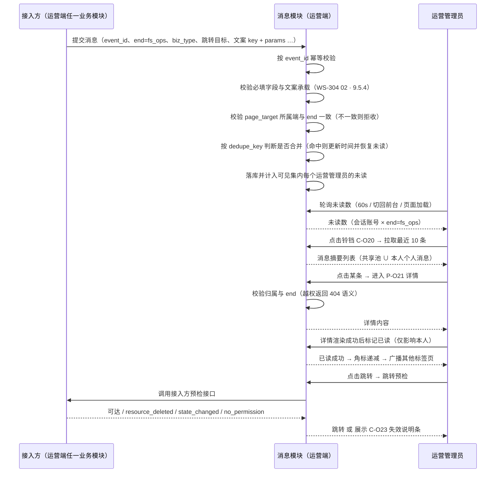
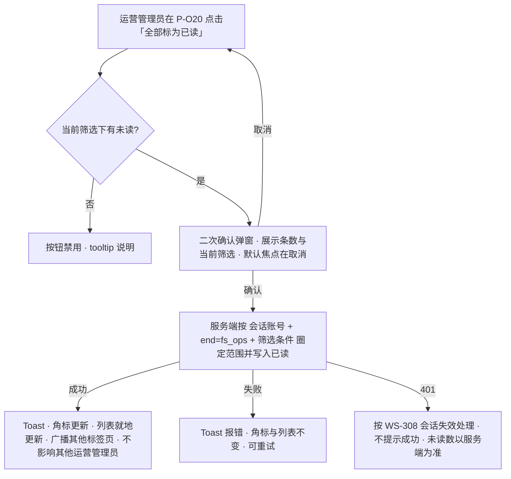
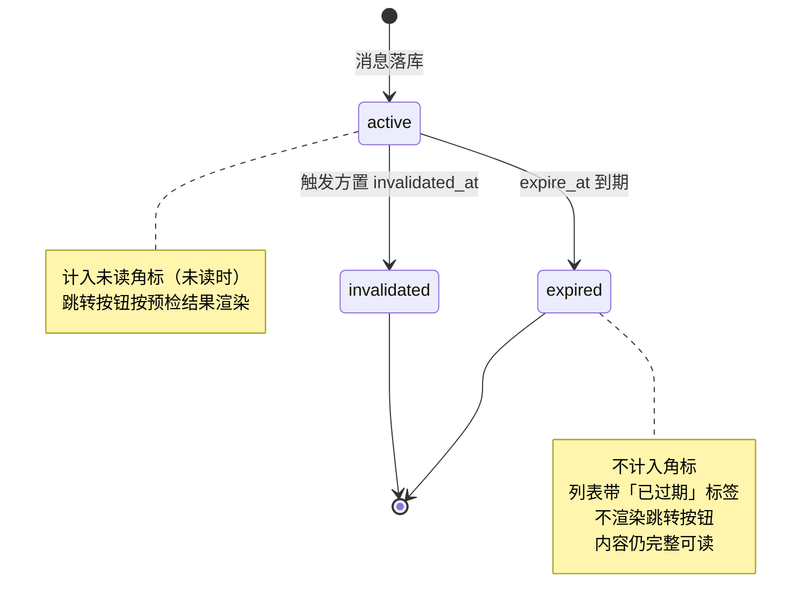
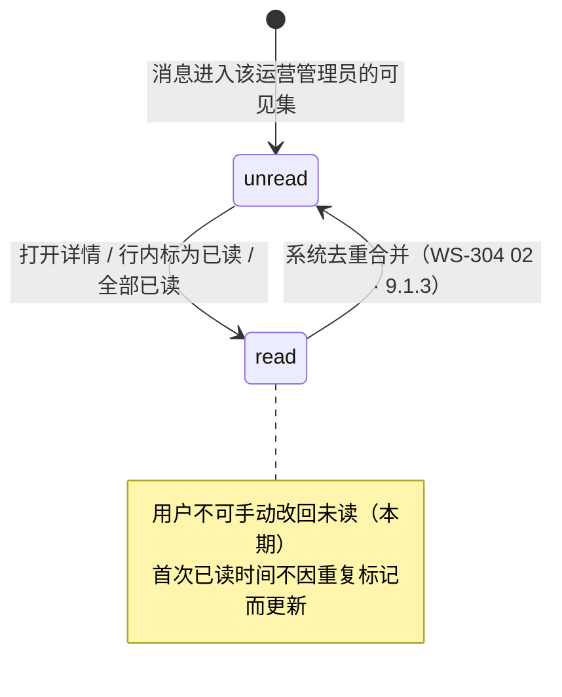

# 金融服务平台 · 运营端 · 消息通知 PRD · 01 页面与展示

> 本文件是《金融服务平台 · 运营端 · 消息通知 PRD》的分册。章节号沿用 WS-304，未做重排。
> 入口与全文导航见主文档 [`v1.0-消息通知-PRD.md`](./v1.0-消息通知-PRD.md)。

**本文件讲什么**：运营端消息通知的第 7 章模块详情（入口与角标、快捷面板、列表、详情、已读、跳转、失效、本期不适用的展示能力、保留与清理）、第 10 章主流程与异常、第 11 章状态机、第 12 章页面与字段定义。

**本文件怎么读——三条约定，读之前先看一眼：**

1. **相同的不抄，只给引用。** 判定为「与资产管理端零差异」的规则，本文件只写一行引用（例如「沿用 WS-304 `01` 7.1.2」），**不复述原文**。转述一次就多一个走样的机会。要看细则请打开被引用的那一节。
2. **差异处写全。** 凡与资产管理端不同的，一律写成三段：**资产管理端现状 → 运营端如何 → 为什么**。没有理由的差异不写。
3. **编号已换。** 运营端页面 `P-O20` / `P-O21`、组件 `C-O20`～`C-O23`（主文档 5.1）。文中出现 `P-A18` / `P-M20` / `C-20` 等编号时，一律是**在引用资产平台的规格**，不是运营端的编号。

**本文件不讲什么**：数据契约与字段口径（WS-304 [`02-数据契约与字段.md`](../../../asset-platform/prd/v1.0-消息通知/02-数据契约与字段.md) 第 9 章）、接入规范（`docs/notification-contract/接入指南.md`）、**任何通知触发口径与具体消息文案**（各业务 issue）。

**差异总览（全文只有这些地方不一样，其余全部沿用）**：

| # | 差异点 | 所在小节 |
| --- | --- | --- |
| 1 | 编号体系换成 `P-O2x` / `C-O2x` | 全文 |
| 2 | 挂载点写成对 WS-308 的依赖 + 无语言切换器时的退化口径 | 7.1.1 |
| 3 | 分页取**分页器**，不取「加载更多」 | 7.3.4 |
| 4 | 路由前缀占位，深链落点是**运营端登录页** | 7.4.1、7.4.5 |
| 5 | 「全部已读」的二次确认在运营端**不得省略** | 7.5.2 |
| 6 | 会话失效整节引用 **WS-308**（2 小时 + 30 分钟无操作），并新增「轮询不计为用户操作」 | 7.5.5、10.3 |
| 7 | **进度型列表项与详情进度区块本期不产生**，但组件与契约保留 | 7.8 |
| 8 | 保留与清理沿用不清理，但**上线即监控**、归档策略提前参数化 | 7.9 |
| 9 | 国际化引用**金融服务平台自己那份**，默认语言英文，回落语言参数化 | 12.4 |

---

## 7. 模块详情

### 7.1 M1 · 入口与未读角标（F-O01～F-O05）

#### 7.1.1 铃铛与角标的呈现

| 项 | 规则 | 判定 |
| --- | --- | --- |
| 形态、无未读 / 有未读表现、`99+` 上限、角标形状、无障碍 `aria-label` 与 `aria-live` | **逐条沿用 WS-304 `01` 7.1.1**（组件编号替换为 C-O20） | 零差异 |
| **位置** | 运营端顶部导航栏右侧，**语言切换器左侧、账号下拉之前** | **需调整：挂载点组件编号未定** |

**位置这一条为什么要单独写：**

| 项 | 内容 |
| --- | --- |
| 资产管理端现状 | 铃铛 `C-20` 位于语言切换器 `C-04` 左侧、账号下拉 `C-11` 之前 |
| 运营端如何 | **相对位置口径原样沿用**；但 `C-04` / `C-11` 是 WS-302 定义的**资产平台**组件编号，运营端不能直接引用。运营端的等价组件编号归 WS-308（主文档 Q-O02） |
| **退化口径**（必须有，不能等） | **若运营端不提供语言切换器**，位置退化为「**顶栏右侧、账号下拉之前**」；**若运营端顶栏无账号下拉**，退化为「顶栏最右侧」，同时账号下拉入口一并取消，只保留铃铛（7.1.5） |
| 为什么必须现在写退化口径 | WS-304 的首批接入方适配清单里有同类项 A-05：「入口组件不改则铃铛与消息中心入口无处挂载」。**同一个坑不要在运营端再踩一次**——先把退化路径写死，编号回填只是替换一个占位符，不是重新设计 |

#### 7.1.2 角标计数口径（强制条款）

**逐条沿用 WS-304 `01` 7.1.2**，包括：服务端计算前端不自行统计、全分类合计不做多个角标、已过期与已主动失效**不计入**、三类跳转失效**仍计入**、`99+` 上限。

**运营端的一处口径落地**（不是差异，是把通用算法代入运营端）：

> 计数范围 = 当前运营管理员的**可见集**中未读的条数。可见集 = 「`end = fs_ops` 且 `recipient_scope = admin_all` 的消息」∪「该运营管理员的个人消息」（主文档 8.1.2）。**角标逻辑不需要为新的接收方范围改动**——将来若新增 `role` scope，未读计数算法零改动（WS-304 `02` 9.1.1 规则 2）。

#### 7.1.3 实时性：刷新时机与轮询

**逐条沿用 WS-304 `01` 7.1.3**：首次加载 / 路由切换立即拉一次、每 N-O01（60 秒）轮询一次未读数、**切回前台立即拉并重置计时器**、**页面不可见时暂停轮询**、已读后乐观更新并以服务端对账、**接口失败静默保留上次数值不清零不弹提示**。

**运营端专门确认过的两条，都不改口径：**

| 问题 | 结论 | 理由 |
| --- | --- | --- |
| 运营端承担审核待办，**轮询间隔是不是该调小？** | **不调**，N-O01 保持 60 秒 | ① 待办的主入口是**各业务模块自己的列表页**（它们有自己的刷新与筛选），消息角标是**辅助提示**而非工作队列的实时看板；② WS-304 风险 15.2 第 3 项已写明「需要更强时效的事件，接入方本就应当同时走自己的站外渠道，不依赖站内信兜底」，这条在运营端同样成立。③ 它是**可调参数**——若上线后确有实时性投诉，改一个数即可，不需要改设计 |
| **要不要引入长连接？** | **本期不引入** | 同 WS-304：站内消息无秒级时效要求，长连接会引入一套连接保活与重连的复杂度，收益不匹配 |

#### 7.1.4 多标签页一致性

**逐条沿用 WS-304 `01` 7.1.4**：任一标签页的已读变更通过**浏览器本地事件广播**同步给其他标签页；广播不可用时降级为轮询同步（最长滞后 N-O01），不报错。

**一处引用换向**：该广播通道应复用 **WS-308 的跨标签页同步机制**（会话失效同步用的是同一套通道），不是 WS-302 的。

#### 7.1.5 账户下拉「消息中心」入口

| 项 | 规则 |
| --- | --- |
| 位置 | 运营端右上角账号下拉内，「账户设置」之上；**若运营端账号下拉内没有账户设置条目**，置于下拉首项 |
| 点击落点 | 直接进入 **P-O20** 消息中心，**不经快捷面板**，不带任何筛选条件 |
| 依赖 | 账号下拉的组件编号归 WS-308（Q-O02）。若运营端顶栏没有账号下拉，本入口取消，只保留铃铛——**此时消息中心仍可通过铃铛面板底部「查看全部」到达，功能不缺失** |
| 不做的 | **不在左侧菜单新增一级入口**（主文档 D-O05，理由见主文档 5.1 的注） |

---

### 7.2 M1 · 铃铛快捷面板（C-O21，F-O03）

**逐条沿用 WS-304 `01` 7.2**，包括：展开与收起方式（再次点击 / 点击面板外 / Esc）、**最近 N-O02（10）条且不区分已读未读**、单条内容结构（分类标签 + 标题单行截断 + 摘要单行截断 + 相对时间 + 未读圆点）、空态 / 加载态（3 行骨架屏）/ 失败态、每次展开重新拉取不用缓存、底部「查看全部」、无障碍（焦点进入面板、Tab 循环限制、Esc 归还焦点）。

**其中两条在运营端是强制条款，单独点名：**

| 条目 | 规则 | 运营端为什么更要守 |
| --- | --- | --- |
| **面板内不提供「全部已读」** | 全部已读是影响面广、**本期不可撤销**的操作，必须在能看清作用范围（当前筛选条件）的消息中心内执行 | 运营端的未读标记 = 待办提示。在一个只展示 10 条的浮层里误清全部未读，代价比资产端高 |
| **仅展开不算已读** | 展开面板、滚动经过都不产生已读；点击某条进入详情后才按 7.5 标记 | 同上：面板一展开就批量清未读，等于让运营人员丢掉待办 |

**一条运营端的省略**：WS-304 `01` 7.2 有一行「进度型消息在面板内同样展示节点状态标签」——**运营端本期不产生进度型消息**（7.8），该行在运营端不适用；但组件变体保留，不做删除。

---

### 7.3 M2 · 消息中心列表（P-O20，F-O06～F-O09）

#### 7.3.1 页面结构（线框级）

```
┌──────────────────────────────────────────────────────────────┐
│ 面包屑：消息中心                        （运营端面包屑组件，WS-308）│
├──────────────────────────────────────────────────────────────┤
│  消息中心                                    [全部标为已读]    │
├──────────────────────────────────────────────────────────────┤
│  [分类：全部 ▾]  [状态：全部 / 未读 / 已读]                    │
├──────────────────────────────────────────────────────────────┤
│  ● [审核待办] 有 1 笔融资申请待审核           2 小时前  [标为已读]│
│      申请编号 ……，提交于 ……                                    │
├──────────────────────────────────────────────────────────────┤
│    [运营告警] 对账任务出现差异                2026-09-08        │
│      差异笔数 ……，需人工核对。                                 │
├──────────────────────────────────────────────────────────────┤
│  ● [安全] 你的登录密码已被重置                2026-09-07        │
│      （个人消息，仅本人可见）                                   │
├──────────────────────────────────────────────────────────────┤
│         [ ‹ 1 2 3 … › ]        每页 [20 ▾] 条                 │
└──────────────────────────────────────────────────────────────┘
```

> 线框里的消息标题与摘要**只是形态示意，不是本 PRD 定义的文案**。运营端有哪些消息、标题怎么写，归各业务 issue（主文档 2.3）。

#### 7.3.2 筛选

**逐条沿用 WS-304 `01` 7.3.2**：分类筛选项由服务端返回的分类元数据**动态渲染，前端不写死清单**；**只渲染该接收者实际拥有消息的分类**（不产生必然为空的筛选项）；状态筛选三档（全部 / 未读 / 已读，默认「全部」）；两者**可叠加，是与关系**；筛选条件**写入 URL 查询参数**支持刷新保持；筛选变化时重置到第一页并回到顶部。

**运营端的分类集合**：由运营端消息池（`end = fs_ops`）实际拥有的 `category` 构成。

- **`category` 的取值空间按端独立**（WS-304 `02` 9.3.1：同一个字符串在不同端可以是不同含义），**但定义表是全平台共享的一份**——在 `docs/notification-contract/接入指南.md` 4.1 登记，运营端在其中**声明启用哪些**，不另写一张表。
- **运营端预计启用哪些分类，由各业务 issue 接入时决定，本 PRD 不预先定死。** 这是刻意的：分类是「装什么」的维度，而装什么归接入方。本 PRD 只保证一件事——**新增一个分类不需要改本模块的任何页面逻辑**，只需登记 + 研发加枚举值与中英文案 key（WS-304 D-N23）。
- 分类选项文案取分类的多语言展示名，按当前语言渲染；缺失翻译时**回落到该端的默认语言**（12.4），不展示键名。

#### 7.3.3 排序（强制条款）

**逐条沿用 WS-304 `01` 7.3.3**：按 `created_at` 倒序；**已读状态不参与排序**（未读不置顶、已读不沉底，标记已读后行位置不变）；同一时间戳以消息 ID 作稳定次级键；不做分类分组、不做优先级排序。

> **运营端会有人提出「待办应该置顶」——这条不做。** 理由与 WS-304 一致且在运营端更明显：若未读参与排序，运营人员在列表里读完一条待办后该行会立刻跳位，正在处理的上下文被打乱。需要「只看未读」时用状态筛选器，那是显式的、可预期的。**优先级排序更不做**——消息的轻重缓急是业务语义，本模块不持有这个判断，做了就等于替各业务 issue 定优先级。

#### 7.3.4 分页（**差异项**）

| 项 | 内容 |
| --- | --- |
| 资产平台现状 | 资产端 `P-A18` 用「**加载更多**」按钮；资产管理端 `P-M20` 用**分页器**（页码 + 每页条数 20/50/100） |
| **运营端如何** | **取分页器**，与资产管理端一致。每页默认 N-O04（20）条，可切换 **20 / 50 / 100** |
| 判断依据 | 这不是一个新决策，是形态归类的自然结果：WS-304 `01` 7.3.4 把分页器归为**控制台形态**，理由是「控制台端存在跳到某一页复查的诉求」；而 `docs/design-system/README.md` 已定**运营端属控制台画布形态**（与资产管理端同形态，与资产端 / 金融服务端的面客形态相对） |

**分页游标（强制条款，沿用）**：**必须基于 `created_at + message_id` 的稳定游标，不使用 offset。** 理由：列表期间可能有新消息插入顶部，offset 分页会导致翻页时重复或漏项。**这条对分页器同样适用**——分页器只是交互形态，底层游标口径不变。

#### 7.3.5 空态、加载态与失败态

**逐条沿用 WS-304 `01` 7.3.5**：

| 状态 | 沿用要点 |
| --- | --- |
| **首次空态** | 无筛选且结果为 0：插画位 + `No notifications yet / 暂无消息` + 副文案，无额外操作 |
| **筛选空态** | 有筛选且结果为 0：`No messages match these filters / 没有符合筛选条件的消息` + **「清除筛选 / Clear filters」** |
| 首屏加载态 | 5 行骨架屏，保持与列表项相同高度，避免加载完成后跳动 |
| **翻页进行中** | 分页器禁用并展示加载态；**已加载内容保持不动**（运营端的对应表述，资产端原文为「加载更多按钮变加载中态」） |
| 首屏失败 | 内容区错误态 + 原因 + 「重试 / Retry」 |
| **翻页失败** | 错误提示，**当前页内容不清空**，可重试 |
| 部分渲染失败 | 单条内容异常（如文案 key 缺失）时该行降级为「标题 + 时间」最小形态，不影响其他行，仍可进详情 |

> **两种空态必须区分**：首次空态是「一切正常，只是还没有消息」，筛选空态是「你把结果筛没了，可以退回去」。用同一套文案会让运营人员以为消息全丢了。
>
> **运营端上线初期首次空态是常态**——本期无接入方，各业务 issue 陆续接入前列表就是空的（主文档 1 「本期接入方：无」）。这不是缺陷，首次空态的文案要经得起「空很久」。

---

### 7.4 M4 · 消息详情（P-O21，F-O12、F-O13）

#### 7.4.1 详情的形态与路由

| 项 | 内容 | 判定 |
| --- | --- | --- |
| 形态 | **整页 + 独立路由 + 支持深链**，不用抽屉或弹窗 | 零差异沿用 WS-304 `01` 7.4.1 / D-N11 |
| **路由** | 列表 `{运营端路由前缀}/messages`；详情 `{运营端路由前缀}/messages/{message_id}` | **占位**：前缀归 WS-308（主文档 Q-O03），本模块**不自造** |

> 资产管理端是 `/admin/messages/{message_id}`。运营端**不复用这个前缀**——它属于资产平台的路由基线，运营端是另一个平台的另一个端。前缀确定后回填本节与主文档 5.1，**不涉及任何其他改动**。

#### 7.4.2 详情内容结构

**逐条沿用 WS-304 `01` 7.4.2**：面包屑（`消息中心 / {标题}`，上级可点击返回）、头部（分类标签 + 标题，过长换行不截断）、元信息行（**绝对时间 + 时区标注**）、正文（**纯文本 + 转义，不支持富文本 / HTML**）、失效说明条 C-O23（条件展示）、主操作（跳转按钮，文案由业务类型登记表的 `cta_label_key` 提供，缺省「查看详情 / View details」）、次操作（「返回列表 / Back to list」）。

**运营端的两点落地**：

- 面包屑组件用**运营端的面包屑组件**（WS-308），不是 WS-302 的 `C-10`。
- **进度区块本期不出现**（7.8）。区块规格保留在组件里，运营端只是不产生这类消息。

#### 7.4.3 进入详情即已读

**逐条沿用 WS-304 `01` 7.4.3**（含四条口径，一条都不改）：

| 项 | 规则 |
| --- | --- |
| 标记时机 | 详情内容**请求成功并渲染之后**才发起已读请求，**不在路由进入时就发** |
| 为什么 | 若详情加载失败（网络异常、消息不存在），用户实际没看到内容，此时标记已读会让这条消息从未读里消失且用户毫不知情 |
| 已读请求失败 | **不阻断详情展示**，不弹错；下次进入或下次同步时重试 |
| 幂等 | 重复标记不报错、不改变首次已读时间 |

#### 7.4.4 返回列表的状态同步

**逐条沿用 WS-304 `01` 7.4.4**：三种返回方式（面包屑上级 / 「返回列表」/ 浏览器后退）行为一致；**保留筛选条件**（从 URL 恢复）；**恢复滚动位置**；**已读项就地变为已读样式，不重排、不从列表中移除**；「只看未读」筛选下返回时刚读过的消息**仍留在列表中**并显示为已读样式，直到主动刷新或切换筛选才消失；角标已在详情页乐观更新。

**一处表述替换**：资产端原文是「恢复已加载的页数，不重新只加载第一页」——运营端是分页器形态，对应表述为「**恢复到进入详情前的页码与每页条数**，不跳回第 1 页」。

> 为什么已读项不立即移除：用户在「只看未读」下读完一条返回，若该行立刻消失，下面的行会整体上移，**用户接下来点的那一行很可能不是他想点的那条**。在运营端这意味着点错待办。

#### 7.4.5 未登录深链（**差异项**）

| 项 | 内容 |
| --- | --- |
| 资产管理端现状 | 未登录访问 `/admin/messages/{id}` → 跳资产管理端登录页 **P-M01**，携带原路径，登录后回跳 |
| **运营端如何** | 跳**运营端登录页**（WS-308 定义，编号未定），携带原路径（含消息 ID），登录成功后回跳该条详情 |
| 判断依据 | 运营端账号与资产管理端账号**完全无关联**（WS-308 已定，主文档 3.1-C）。两套登录页互不承接，落到 `P-M01` 是一个死路 |
| 归属不符时 | 若该消息不属于登录成功的这个账号，按主文档 8.2.2 落到「**消息不存在页**」——**不提示「你登错账号了」**，那同样会泄漏消息归属 |

---

### 7.5 M3 · 已读语义（F-O10、F-O11）

#### 7.5.1 单条已读的触发方式

**逐条沿用 WS-304 `01` 7.5.1**：以「打开详情即已读」为主，**同时**在列表行内提供显式「标为已读」，**两者并存不是二选一**。

| 触发方式 | 是否标记已读 |
| --- | --- |
| 列表点击整行 → 进入详情 | ✅ |
| 快捷面板点击某条 → 进入详情 | ✅ |
| 快捷面板 / 列表中**仅展开、仅滚动经过** | ❌ |
| 列表行悬浮出现的「标为已读」按钮 | ✅（不进详情，就地标记） |
| 详情页点击跳转按钮跳到业务页 | ✅（详情打开时已标记） |
| **手动标记为未读** | ❌ **本期不提供**（D-N08）。系统侧的去重合并可恢复未读，属系统行为 |

> 为什么两者并存：只做「显式点击才算已读」，未读数会长期虚高，角标变成永远的红点；只做「进详情才算已读」，则「看标题就知道是什么事、不想点开」的消息会永久堆在未读里。**在运营端这两种失效都直接损害待办提示的可信度。**

#### 7.5.2 全部已读的作用范围（**含一条运营端强制条款**）

**作用范围逐条沿用 WS-304 `01` 7.5.2 / D-N19**：作用于「**当前筛选条件命中的全部消息**」，不限当前页，也不是全库无差别。

| 场景 | 实际作用范围 |
| --- | --- |
| 无任何筛选 | 该运营管理员可见集内的**全部**未读消息 |
| 分类筛选 = 某分类 | **仅**该分类下的未读消息 |
| 分类 + 状态叠加 | 两个条件同时命中的未读消息 |
| 当前页只显示 20 条、实际命中 300 条 | **300 条全部标记**，不是只标记当前页的 20 条 |

**交互规则沿用**：按钮位于消息中心页头右侧（**面板内不提供**）；当前筛选下无未读时禁用并 tooltip 说明；执行成功后 Toast 提示条数、角标与列表立即更新；**执行失败时列表与角标不做任何变更**（不做乐观更新）；并发一致性以服务端执行时刻的筛选结果为准，执行期间新到达的消息保持未读。

**运营端强制条款（本 PRD 加重的一条）：**

> **二次确认不得省略，且必须明确说明作用范围与条数。**
> 确认弹窗文案：`Mark {n} notifications as read? / 将 {n} 条消息标为已读？`；有筛选条件时**追加一行说明当前筛选**，例如 `Filter: Review to-do · Unread / 当前筛选：审核待办 · 未读`。默认焦点落在「取消」上。
>
> **为什么在运营端要写成强制条款**：资产端误清未读丢的是通知，运营端误清未读丢的是**待办提示**——而本期既没有「标为未读」（D-N08），也没有认领机制可以兜底，一次误点不可撤销、不可追回。这是主文档风险 15.2 第 8 项的直接对策。

#### 7.5.3 已读后的即时反馈

**逐条沿用 WS-304 `01` 7.5.3**：角标立即递减（乐观更新，以服务端下次返回对账）；列表项未读圆点消失、标题字重回落、**行位置不变不移除**；快捷面板若同时开着一并更新；其他标签页通过本地事件广播同步；服务端失败时**回滚本地乐观更新**并 Toast 提示。

#### 7.5.4 已读状态的唯一性（强制条款）

**沿用 WS-304 `01` 7.5.4**：已读状态**存储在服务端**，按「接收者 + 消息」唯一。两个入口（铃铛面板、消息中心）、两个页面（列表、详情）读取同一份已读状态。**不得为快捷面板另建一套本地已读缓存**——这是本模块把两个入口合并的根本原因。

> **例外：系统可将已读消息恢复为未读。** `dedupe_key` 命中时消息合并为一条并更新时间；若该条此前已被读过，**恢复为未读**（它承载的是一次新发生的事件）。实现上：清除其已读记录并更新创建时间，消息重新回到列表顶部并计入角标。规则见 WS-304 `02` 9.1.3。

#### 7.5.5 会话失效对已读操作的影响（**差异项：引用换向 + 新增一条**）

| 场景 | 表现 | 来源 |
| --- | --- | --- |
| 「全部已读」执行中会话失效 | 请求 401 → 触发 **WS-308 的统一会话失效处理**；**不展示「操作成功」**；重新登录后未读数**以服务端为准**（该操作是否已生效由服务端结果决定，前端不做假设） | 主文档 8.3 |
| 未读数轮询遇 401 | 与其他接口一视同仁，触发统一的会话失效处理。**不得静默忽略 401** | 主文档 8.3 |
| **未读数轮询是否算「用户操作」** | **不算。** 轮询请求**不得**被计入 WS-308 的「30 分钟无操作」活跃度判定 | **本 PRD 新增（D-O08）** |

> **最后一条是运营端独有的，资产平台没有等价条款**——WS-302 未定义「无操作自动登出」，所以那边不需要回答这个问题。WS-308 定了 30 分钟无操作登出之后，这个问题就必须回答：**本模块有一个每 60 秒发一次的常驻请求**，如果它被计为用户活跃，无操作自动登出将**永远不会触发**，WS-308 的安全口径形同虚设。

---

### 7.6 M5 · 跳转机制（F-O14、F-O15）

> 本节是**跳转契约在运营端的落地**，不是「每类消息跳哪」。每类消息的具体目标由**各业务 issue** 在业务类型登记表中补齐（WS-304 `02` 9.4.3）。

#### 7.6.1 跳转的构成

**逐条沿用 WS-304 `01` 7.6.1 / D-N33**：三种合法形态**互斥，一条消息只能是其中之一**。

| # | 形态 | 携带字段 | 落地方式 |
| --- | --- | --- | --- |
| 1 | **业务资源目标** | `biz_type` + `biz_ref`（`resource_type` + `resource_id`） | 按 `biz_type` 查前端业务类型登记表得到路由模板，用 `resource_id` 填充 |
| 2 | **静态页面目标** | `biz_type` + `page_target`（页面编号） | 按页面编号查页面路由表直达，**不需要资源参数、不需要预检** |
| 3 | **无跳转** | 两者都不填 | 不渲染跳转按钮，**这是正常形态而非缺失** |

**共同的强制约定（沿用）**：**消息实体中不存放 URL。** URL 会随前端路由重构失效，而历史消息不可能回头批量改写。优先级：`biz_ref` 存在 → 形态 1；否则 `page_target` 存在 → 形态 2；都无 → 形态 3。**两者同时存在属接入错误，服务端拒收。**

**运营端对形态 2 的一条硬约束（强制条款）**：

> 运营端消息的 `page_target` **只能取 `P-O*` 段位内已登记的页面编号**。服务端必须校验「`page_target` 所属端与消息 `end` 一致」，**不一致时拒收**（WS-304 `02` 9.4.4）。
>
> 这条在四端下比两端下更容易踩：一个运营端消息带着 `P-M05`（资产管理端页面）会跳到一个运营人员根本无权访问的平台。**段位表是这条校验的唯一依据**，因此 `P-O20`～`P-O21` 必须登记进共享段位表（主文档 3.3）。

#### 7.6.2 跳转执行流程

**逐条沿用 WS-304 `01` 7.6.2**，流程图与四条口径全部适用：

- **静态页面目标（形态 2）一律不预检**，直接跳转。
- **业务资源目标（形态 1）是否预检由业务类型登记表声明**，默认「需要预检」，业务方可显式声明不需要。
- **预检接口本身失败时放行跳转**（超时 N-O05 = 3 秒按预检失败处理），由目标页按自己的规则处理不存在或无权限——**这是目标页本来就必须具备的能力**。
- **预检在进入详情页时执行一次**（而非点击时才执行），使失效状态能在按钮上提前体现；**列表页不做预检**（会对每行触发一次业务查询，成本不可接受）。

#### 7.6.3 映射缺失时的降级表现（强制条款）

**逐条沿用 WS-304 `01` 7.6.3 / D-N14**：

| 位置 | 降级表现 |
| --- | --- |
| **详情页** | **不渲染跳转按钮**（既不展示可点的、也不展示置灰的）；正文正常展示；正文下方以次要文案说明 `This notification has no available action in the current version. / 当前版本暂不支持该消息的跳转操作。` |
| **列表 / 快捷面板** | **正常展示该条消息**，点击正常进入详情；列表项不因映射缺失而隐藏或置灰 |
| 分类筛选 | 该消息仍归入其 `category`，不因映射缺失而被过滤掉 |
| 日志 | 前端上报一次「未知业务类型」事件（含 `biz_type`），用于发现登记遗漏 |
| **禁止的做法** | ❌ 跳 404 页；❌ 跳首页；❌ 展示一个点了没反应的按钮；❌ 隐藏整条消息 |

> **消息内容本身永远优先于跳转能力。** 即使跳不过去，运营人员也应能读到「发生了什么」——跳转是增强，不是消息的存在前提。
>
> **这条在运营端的触发概率更高**：运营端本期无接入方，业务模块是陆续接入的，灰度期与多端版本不一致时映射缺失必然发生。第 14 章的「映射缺失率」是推动各业务 issue 补齐登记的依据。

#### 7.6.4 「无跳转」是合法状态，不是缺失

**沿用 WS-304 `01` 7.6.4**：一条既无 `biz_ref` 也无 `page_target` 的消息**完全合法**，按正常消息渲染，只是详情页不出现跳转按钮，**也不展示任何「暂不支持跳转」之类的说明文案**——那句说明只用于 7.6.3 的映射缺失（那是异常），用在这里会让人以为系统出了问题。

| 情形 | 是否合法 | 详情页表现 |
| --- | --- | --- |
| 无跳转目标（形态 3） | ✅ 合法 | 不渲染按钮，**无任何额外说明** |
| 有 `biz_type` 但映射表缺失（7.6.3） | ❌ 接入 / 版本异常 | 不渲染按钮 **+ 说明文案 + 上报日志** |
| 有目标但已失效（7.7 第 2～4 类） | ✅ 业务正常状态 | **按钮禁用 + C-O23 失效说明条** |

---

### 7.7 M5 · 过期 / 失效消息（F-O14）

**逐条核对无差异，原样沿用 WS-304 `01` 7.7 / D-N15 / D-N16。** 四类失效的判定方式、判定时机、列表表现、详情表现、点击表现如下（组件编号替换为 C-O23）：

| # | 失效类型 | 判定方式 | 判定时机 | 列表表现 | 详情表现 | 点击表现 |
| --- | --- | --- | --- | --- | --- | --- |
| 1 | **已过期** `expired` | 消息自带 `expire_at`，服务端返回时标记 | 列表与详情均可判定 | 整体降低视觉权重，标题右侧带 `Expired / 已过期` 标签；**不计入未读角标** | C-O23：`This notification has expired. / 该消息已过期。` | 跳转按钮**不渲染** |
| 2 | **目标资源已删除** `resource_deleted` | 跳转预检返回 | **仅进入详情时判定** | 列表**无特殊表现**（未做预检） | C-O23：`The related record is no longer available. / 相关记录已不存在。` | 按钮**禁用**，hover tooltip 说明原因 |
| 3 | **状态已流转、不可再操作** `state_changed` | 跳转预检返回 | 仅进入详情时判定 | 列表无特殊表现 | C-O23：`This has already been handled — no action is needed. / 该业务状态已变更，无需再处理。` 预检可附带**当前状态描述**（由业务方提供），一并展示 | 按钮**禁用**，hover tooltip 说明原因 |
| 4 | **当前账号无权限** `no_permission` | 跳转预检返回 | 仅进入详情时判定 | 列表无特殊表现 | C-O23：`You no longer have access to this record. / 你当前无权访问该记录。` | 按钮**禁用** |

**三条共同规则（强制条款，沿用）**：

1. **失效不删除消息、不隐藏内容。** 四种情况下，标题、正文、时间都必须**完整展示**——用户仍有权知道当时发生过什么。失效只影响「能不能跳过去」。
2. **禁用而不是隐藏**（第 2～4 类），并通过 tooltip 说明原因。若直接隐藏按钮，用户无法区分「本来就没有跳转」与「有但现在不能用」。与之相对，**映射缺失（7.6.3）是不渲染按钮**——那种情况问题出在客户端版本，与消息本身状态无关。
3. **C-O23 形态统一**：详情页正文上方的浅底说明条，左侧信息图标，纯文本，不可关闭，**不使用错误红色**（失效是正常业务状态，不是错误）。

> **第 3 类在运营端会比在资产端高频得多**，值得实现时留意：运营端是共享池，「一条待办被同事先处理掉了」正是 `state_changed` 的典型场景。这不是缺陷——它恰恰是共享池设计要承受的那个「多人重复看到」的效率成本（主文档 8.1.3），文案「该业务状态已变更，无需再处理」正好覆盖这个场景。**预检附带的当前状态描述在这里价值最高**，建议各业务 issue 的预检实现都提供它。

> **第 4 类的边界（沿用）**：这里的「无权限」指**跳转目标资源的业务权限**，**不是消息本身的归属权限**。消息本身的归属越权在服务端就已被拦截（主文档 8.2.1），用户根本拿不到别人的消息，不会走到这一步。

---

### 7.8 运营端本期不适用的展示能力（**不等于从契约或组件里删掉**）

| # | 能力 | 运营端本期 | 依据 | 处置 |
| --- | --- | --- | --- | --- |
| 1 | **业务办理进度消息**（`business_progress` 分类、进度型列表项、详情进度区块、`progress` 结构的实际使用） | **不产生** | WS-304 `01` 7.9 已定「进度类消息面向业务办理方」。运营端是控制台端，进度的接收方是**金融服务端用户**（`end = fs`），不是运营人员 | **契约字段与组件变体全部保留不动**。运营端只是不产生这类消息；届时金融服务端接入直接可用 |
| 2 | 「同一笔业务多次更新不合并」的展示形态、进度四态标签的视觉 | 不产生 | 同上 | 同上。展示层实现仍需存在（组件是壳层共用能力） |
| 3 | 面客形态的「加载更多」分页 | 不适用 | 运营端取控制台形态的分页器（7.3.4） | 形态归类问题，不是能力裁剪 |
| 4 | 资产端「按 `account_id` 严格隔离」的具体表述 | 不适用 | 运营端走控制台端的可见范围模型（主文档 8.1） | **但服务端归属校验与 404 语义两条通用规则仍然完全适用**（主文档 8.2） |

> **「不适用」不等于「从契约里删掉」。** 以上四条都只是「运营端本期不产生 / 不使用」，契约与展示层组件**保持原样**——这正是 WS-304 通用性验收（`03` 16.9）要求的：**一个新端接进来，不修改本模块任何内容。** 运营端如果为了自己用不上就去删字段，下一个端（金融服务端）接入时又得加回来。

---

### 7.9 消息的保留与清理（**沿用口径 + 运营端加一条监控要求**）

**结论：本期不设保留期、不做自动清理、不做归档，消息长期保留**（沿用 WS-304 `01` 7.10 / D-N31）。

| 项 | 本期口径 |
| --- | --- |
| 保留期 | 无上限，消息不因时间流逝被删除或隐藏 |
| 自动清理 / 归档 | 不做 |
| 用户手动删除 | **不提供**（D-N09） |
| 已过期消息 | **仍然保留并可在列表中查到**，只是不计入未读角标、带「已过期」标签 |
| 已读消息 | 与未读同等保留 |

**沿用的理由（在运营端同样成立）**：安全与合规类消息是事后回查「我的账号什么时候发生过什么」的唯一站内通道，设保留期等于给这条记录设了个静默的失效日期；在没有偏好中心、没有按分类退订能力的前提下，清理与删除都会变成逃避通知的出口，掩盖「消息过载」这个真正该解决的问题。

**运营端额外要求的两条（本 PRD 新增，主文档 2.5.3）：**

| # | 要求 | 为什么运营端要额外加 |
| --- | --- | --- |
| 1 | **上线即监控**列表接口与未读数接口的 P95，不等出现退化趋势才建监控（AC-O65） | 运营端是全平台业务的**汇聚点**——所有用户的审核待办、对账异常、运营告警最终都落到这一个消息池，而资产管理端本期只有一条业务线接入。**同样的「不清理」策略，运营端的消息增速会高一个量级**，WS-304 风险 15.2 第 5 项在这里更早触发 |
| 2 | 把归档策略**提前写成可调参数 N-O07**（保留 365 天后归档、安全与合规类不参与、归档指不在默认列表展示但可筛选查到、**不是物理删除**），本期**不启用** | 等性能真的退化了再来设计归档语义，会赶在一个已经出问题的时间点上做决策。提前写出来、本期不启用，启用时只是把开关打开 |

---

## 10. 主流程与异常流程

### 10.1 消息从产生到被消费（主流程）



> **与资产平台主流程的唯一实质差异**是多了一步 `page_target` 的跨端校验（四端下必需）与「计入可见集内**每个**运营管理员的未读」（共享池语义）。其余步骤逐一对应 WS-304 `01` 10.1。

### 10.2 全部已读（主流程）



### 10.3 异常流程总表

**沿用 WS-304 `01` 10.3 的 16 项**，其中 3 项的引用换向或口径加强，用 **粗体** 标出：

| # | 异常场景 | 表现 | 用户可做什么 |
| --- | --- | --- | --- |
| 1 | 列表首屏请求失败 | 内容区错误态 + 重试按钮 | 重试 |
| 2 | **翻页失败** | 错误提示，**当前页内容不清空** | 重试 |
| 3 | 未读数接口失败 | **静默**保留上次数值，无提示 | 无需操作 |
| 4 | 详情请求失败 | 详情页错误态 + 重试；**不标记已读** | 重试 / 返回列表 |
| 5 | 详情返回 404（不存在、越权或 `end` 不符） | 「消息不存在」页 + 返回消息中心 | 返回列表 |
| 6 | 标记已读失败 | 不打断阅读，不弹错；下次进入时重试 | 无需操作 |
| 7 | 全部已读失败 | Toast 报错，状态不变 | 重试 |
| 8 | 跳转映射缺失 | 不渲染跳转按钮 + 说明文案（7.6.3） | 阅读消息内容 |
| 9 | 跳转预检返回失效（三类） | C-O23 说明条 + 按钮禁用（7.7） | 阅读消息内容 |
| 10 | 跳转预检接口本身失败 / 超时 | 按钮保持可用，**放行跳转**，由目标页处理 | 正常跳转 |
| 11 | 文案模板 key 缺失 | 降级为最小形态，**不展示键名**；最小形态的语言随该端默认语言（12.4） | 仍可打开详情 |
| 12 | `category` 未登记 | 分类标签展示「其他 / Other」，消息正常展示 | 正常阅读 |
| 13 | **会话在消息模块内失效**（2 小时到期或 30 分钟无操作） | 走 **WS-308** 的统一会话失效处理 | 重新登录后回跳 |
| 14 | 多标签页广播不可用 | 降级为轮询同步（最长滞后 N-O01 = 60 秒） | 无感知 |
| 15 | 触发方提交的消息缺必填字段 | 服务端拒收并返回明确错误给触发方；**不产生半成品消息** | 用户无感知 |
| 16 | 同一 `event_id` 重复提交 | 丢弃，不产生第二条 | 用户无感知 |
| **17** | **`page_target` 所属端与消息 `end` 不一致** | **服务端拒收**，返回明确错误给触发方（7.6.1） | 用户无感知 |

> 第 17 项是运营端新增的一行。它在两端下也存在（WS-304 `02` 9.4.4 已定规则），只是四端下才真正容易被触发，因此在异常总表里显式列一行。

---

## 11. 状态机

### 11.1 消息的可用性状态

**零差异沿用 WS-304 `01` 11.1**：



> **「目标资源已删除 / 状态已流转 / 无权限」不是消息的状态**，而是**跳转预检的实时结果**，**不落库**。理由：这三者是业务侧的动态状态，会随时间变化（一条今天不可操作的记录，明天可能因为业务重开而再次可操作），固化到消息上会产生永久性的错误标记。

### 11.2 单个接收者对单条消息的已读状态

**零差异沿用 WS-304 `01` 11.2**：



> **共享池语义在这张图里的读法**：一条 `admin_all` 消息对应 N 个「接收者 × 消息」的独立状态机，**彼此互不影响**。A 的状态机走到 `read`，B 的仍停在 `unread`。这正是「已读个人独立」的建模表达，也是已读必须**分表**而不是做成消息实体上一个布尔字段的原因（主文档 8.1.2）。

---

## 12. 页面与字段定义

### 12.1 列表项展示字段（C-O22）

| 字段 | 通用型列表项 | 取值 |
| --- | --- | --- |
| 未读圆点 | ✅ | 未读时展示 |
| 分类标签 | ✅ | `category` 的展示名 |
| 标题 | ✅ | 单行截断，超长 tooltip 展示完整 |
| 摘要 | ✅ | 单行截断 |
| 时间 | ✅ | 24 小时内相对时间，超过则绝对时间 |
| 「已过期」标签 | ✅ 条件展示 | `expire_at` 已到或已主动失效 |
| 行内「标为已读」 | ✅ 悬浮出现 | 已读项不展示 |

> **进度型变体本期不使用**（7.8）。组件保留该变体，运营端只是不产生带 `progress` 的消息。

### 12.2 详情页展示字段（P-O21）

| 字段 | 是否必现 | 取值 |
| --- | --- | --- |
| 面包屑 | ✅ | `消息中心 / {标题}`（运营端面包屑组件，WS-308） |
| 分类标签 | ✅ | `category` 展示名 |
| 标题 | ✅ | 渲染后的标题 |
| 时间 | ✅ | **绝对时间 + 时区标注** |
| 失效说明条 C-O23 | 条件 | 四类失效之一时展示 |
| 正文 | ✅ | 渲染后的正文，**纯文本 + 转义** |
| 跳转按钮 | 条件 | 有跳转目标且映射存在时；失效时禁用 |
| 返回列表 | ✅ | — |

> 相对 WS-304 `01` 12.2，运营端**去掉了两行**：「业务编号」与「进度区块」——两者都是进度类消息专属，运营端本期不产生（7.8）。**字段定义本身不删**，只是运营端详情页不会渲染它们。

### 12.3 界面文案

> **本模块自身的界面文案**（导航、按钮、状态、空态、提示）**逐条沿用 WS-304 `01` 12.3 的中英对照表**，本 PRD 不重抄一份——抄一份就会出现两份不同步的文案表。运营端需要替换的只有一处：面包屑与账号下拉条目所在的宿主组件归 WS-308，文案本身（`Notifications / 消息中心`）不变。
>
> **具体消息的标题与正文文案不在任何一张表里**，由各触发方在自己的 issue 中定义（主文档 2.3）。

**运营端唯一新增的一条文案**（因为运营端才有分页器 + 二次确认要说明筛选）：

| 位置 | English | 中文 |
| --- | --- | --- |
| 每页条数切换 | Per page | 每页条数 |
| 全部已读确认弹窗的筛选说明行 | Filter: {category} · {status} | 当前筛选：{分类} · {状态} |

### 12.4 时间与国际化（**差异项：引用换向**）

| 项 | 口径 | 来源 |
| --- | --- | --- |
| 存储 | 全部 UTC | **金融服务平台国际化章节**（WS-308） |
| 展示时区 | 按接收者时区渲染，**带时区标注** | 同上 |
| 列表时间 | 24 小时内相对时间（hover 展示绝对时间），超过 24 小时展示绝对时间 | 同上 |
| 详情时间 | **一律绝对时间 + 时区标注**，不用相对时间 | 本文档：详情是回查场景，需要精确时间 |
| 日期格式 | 按金融服务平台国际化章节的格式约定 | WS-308 |
| **默认语言** | **英文 `en`，不读浏览器语言**；提供中英切换 | **WS-308 已定**（理由：运营团队含非中文成员） |
| 消息语言 | **展示时**按当前语言渲染，历史消息**随语言切换实时改变** | 零差异沿用 WS-304 `02` 9.5 / D-N24 |
| **文案回落** | 缺失翻译**回落到该端的默认语言**（运营端即英文）；英文也缺失时降级为最小形态；**任何情况下绝不展示键名** | **参数化后的口径**，见下方注 |
| 金额 | 传数值 + 币种，由展示层格式化；**不由触发方拼成字符串** | 零差异沿用 WS-304 `02` 9.5 |
| 地址 / 哈希 | 若参数含链上地址或哈希，按金融服务平台的缩略规则展示 | WS-308 |

**两条必须说清的：**

> **① 为什么引用换向到金融服务平台自己那份，而不是 WS-302。**
> 诊断简报 9.2 N-O06 的建议是「直接引用 WS-302 那份，不另立」。该建议**已被推翻**：用户在 WS-308 第 10 条定了「国际化 / 金额在金融服务平台另立一份完整章节」。跨平台引 WS-302 与该裁定冲突，因此本 PRD 引用**金融服务平台自己的国际化章节**（WS-308 正在写）。
> **这个换向不改变任何机制**——承载方式（模板 key + params、展示时渲染）与 WS-304 完全一致，换的只是「时区 / 日期 / 金额格式的定义写在哪份文档里」。

> **② 回落语言参数化：对运营端是恒等变换，但仍然必须做。**
> WS-304 `02` 9.5.4 / D-N25 定的是「当前语言的翻译缺失 → **回落英文**」（硬编码）。简报 U-02 要求把它改成「**回落到该端的默认语言**」，已在 WS-304 侧派出。
> 运营端默认语言恰好就是英文，所以**对运营端而言参数化前后行为完全一样**。但这条改动仍然要做，理由是：它是**把一个常量提升为参数**，不改变任何机制；不做的话，下一个默认非英文的端接进来时，翻译缺失会让一个中文用户看到一句英文——对以英文为默认的端这是合理兜底，对以中文为默认的端就是劣化。**运营端是这条规则的第一个受益者恰好为零的端，但也是最适合顺手把它改对的时点。**
> **边界不变**：「任何情况下不展示文案键名」不变；「回落语言也缺失时降级为最小形态」不变，只是最小形态的语言随该端默认语言。
