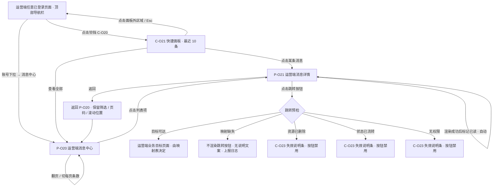

# 金融服务平台 · 运营端 · 消息通知 PRD（主文档）

> **本模块不是一个新的消息系统，而是 WS-304《平台消息推送能力 PRD》这套平台能力的第四个消费端。**
> 数据契约、`biz_type` 命名空间、`category` 定义表、接入规范**全部沿用 WS-304，本 PRD 不重写、不分叉**。本 PRD 只定义三件事：**运营端的通用权限口径**、**运营端的页面与展示层**、**运营端的验收标准**。
>
> **本 PRD 不定义任何通知触发口径**——不列事件清单、不写「某某操作后发某某消息」、不写任何一条具体文案。运营端各业务模块（审核、对账、放款、额度、运营公告……）的触发时点、事件集与文案，由**它们各自的 issue** 在自己的 PRD 里定义，按接入指南自助接入。这条边界与 WS-304 2.3 / 9.7 完全一致。

## 0. 导航索引

### 0.1 文件清单

| 文件 | 装了哪些章节 | 给谁看 |
| --- | --- | --- |
| **`v1.0-消息通知-PRD.md`**（本文件） | 1 文档信息、2 背景与目标、3 范围与边界、4 用户角色与场景、5 信息架构与页面流、6 功能清单、8 通用权限、13 非功能要求、14 指标、15 依赖与风险、17 已确认口径与可调参数、18 交付说明 | 所有人的入口。产品、项目、新加入的成员先读这一份 |
| [`01-页面与展示.md`](./01-页面与展示.md) | 7 模块详情（入口、列表、详情、已读、跳转、失效、本期不适用的展示能力、保留与清理）、10 主流程与异常、11 状态机、12 页面与字段定义 | 前端与设计 |
| [`02-验收标准.md`](./02-验收标准.md) | 16 验收标准 AC-O01～AC-O96 | 测试 |

### 0.2 本 PRD **不写**的两份文件，去哪里读

| 内容 | 去哪读 | 为什么不在这里重写 |
| --- | --- | --- |
| **数据契约与字段**（`Message` 实体、`recipient_scope`、`dedupe_key`、`category` / `biz_type`、跳转字段、多语言承载、`progress` 结构、职责分界） | WS-304 [`asset-platform/prd/v1.0-消息通知/02-数据契约与字段.md`](../../../asset-platform/prd/v1.0-消息通知/02-数据契约与字段.md) 第 9 章 | 契约必须唯一。运营端再写一份就是分叉——同一个字段两处定义，改一处必然漏一处 |
| **接入指南**（接入 Checklist、`biz_type` 申请与登记表、`dedupe_key` 构造规范与反例、文案与多语言、跳转三形态、禁止事项、最小接入示例、**页面/组件编号段位表**） | [`docs/notification-contract/接入指南.md`](../../../docs/notification-contract/接入指南.md)（**四端共用**，在仓库顶层 `docs/` 下） | 它是「全平台唯一的登记处」，四个端的业务模块都要去同一处登记。复制一份是三种处置里唯一不可逆的错误 |

> **接入指南为什么在 `docs/` 而不在某个平台目录下**：它原在资产平台的消息通知 PRD 目录下、作为其第 4 个分册（旧路径已不存在，不要再去那里找），一个自称「全平台唯一」的登记处却躺在其中一个平台的目录里。按仓库 `README.md` 的约定「两个平台共用的资料才放 `docs/`」（`docs/design-system/` 就是先例），已按 WS-309 诊断简报 U-03 在 WS-304 侧迁至 `docs/notification-contract/`，**迁移时一并去掉了 `04-` 分册序号**（它已独立成册，不再是消息通知 PRD 的第 4 个分册）。**本 PRD 一律写迁移后的路径。**

### 0.3 编号索引

| 编号 | 含义 | 定义位置 |
| --- | --- | --- |
| `F-O01`～`F-O18` | 功能点 | 本文件 第 6 章 |
| `AC-O01`～`AC-O96` | 验收标准 | [`02-验收标准.md`](./02-验收标准.md) 第 16 章 |
| `D-O01`～`D-O24` | 已确认口径 | 本文件 17.1 |
| `N-O01`～`N-O07` | 可调参数 | 本文件 17.2 |
| ~~`Q-O01`～`Q-O03`~~ | 本文档待确认项 — **已全部关闭**，编号保留为墓碑 | 本文件 17.4 |
| `P-O20`～`P-O21` | 运营端页面 | 本文件 5.1 |
| `C-O20`～`C-O23` | 运营端组件 | 本文件 5.1 |

> **两条编号命名空间说明，读前务必看一眼：**
>
> 1. **`P-*` / `C-*` 是全平台唯一编号**（WS-304 D-N40），必须去共享段位表申请；`F-*` / `AC-*` / `D-*` / `N-*` / `Q-*` **仅本文档内唯一**，本 PRD 自起一套。
> 2. **本文档的 `N-O*` / `Q-O*` 与《需求诊断简报》里的 `N-O*` / `Q-O*` 不是同一套编号。** 简报的 `N-O01`～`N-O07` 是它的「依赖 WS-308 事项」清单、`Q-O01`～`Q-O10` 是它的待确认清单，属简报内部编号；本文档的是可调参数与本文档待确认项。**跨文档引用时一律写全出处**（例如「简报 9.2 N-O06」「本文档 N-O01」），不要只写编号。

### 0.4 章节 → 文件对照

沿用 WS-304 的章节号，**未做重排**，缺号即该章整章引用 WS-304、本 PRD 不重写。

| 章节 | 所在文件 |
| --- | --- |
| 1、2、3、4、5、6 | 本文件 |
| 7、10、11、12 | [`01-页面与展示.md`](./01-页面与展示.md) |
| 8 | 本文件 |
| 9（数据契约） | **不写**，引用 WS-304 `02-数据契约与字段.md` |
| 13、14、15 | 本文件 |
| 16 | [`02-验收标准.md`](./02-验收标准.md) |
| 17、18 | 本文件 |
| （无章节号）接入指南 | **不写**，引用 `docs/notification-contract/接入指南.md` |

---

## 1. 文档信息

| 项目 | 内容 |
| --- | --- |
| 文档名称 | 金融服务平台运营端消息通知产品需求文档 |
| 对应需求 | WS-309「金融平台-运营端-消息通知」 |
| 上游输入 | 《金融服务平台 · 运营端 · 消息通知 —— 需求诊断简报（差异诊断）》V1.0（程功立），Q-O01～Q-O10 已由用户批「按照建议执行」全部取建议值，其中两条经总控裁定调整，见 3.1 |
| 编写人 | 许楚清（需求分析师） |
| 文档语言 | 中文（界面文案给出中英对照） |
| 覆盖端 | **金融服务平台 · 运营端 Web**（单端。金融服务端用户侧不在本期范围，见 2.3） |
| **文档定位** | **WS-304 平台消息能力在运营端的落地文档**：只定义运营端的通用权限口径与站内信展示层。**不定义任何平台通用规则**——契约、命名空间、分类枚举、接收方范围的定义权在 WS-304，见 3.5 |
| **规则来源** | WS-304《平台消息推送能力 PRD》（`asset-platform/prd/v1.0-消息通知/`，4 个文件；其接入指南已迁至 `docs/notification-contract/`）。本 PRD 与之的关系是「接入端」而非「平级模块」 |
| **基础能力依赖** | WS-308「金融平台-运营端-登录」提供运营端账号主体、角色模型、会话与失效口径、国际化基线、顶栏组件与路由基线。这五项是运营端的基础设施，本文档直接引用、不重复定义、**不自造** |
| 本期接入方 | **无。** 本模块可独立上线，上线后列表为空；运营端各业务模块（审核、对账、放款、额度、运营公告……）按接入指南自助接入，**接入时不需要修改本 PRD** |
| 一致性核对基线 | 仓库 `wxblockchain/Chain-Financing` 分支 `cly-V1.0.0`：`asset-platform/prd/v1.0-消息通知/`（WS-304，4 个文件）、`docs/notification-contract/接入指南.md`、`docs/design-system/README.md`、`financial-service-platform/` 三份 README、仓库根 `README.md`。WS-308 侧取其诊断简报定稿结论（2026-09-09 06:20）与用户当日批复 |

> 第 8 章的越权校验条款为**强制条款**，不可省略、不可降级。
> 文中性能类目标值标注为「目标值」，需在联调与灰度阶段校准，不影响功能逻辑与验收通过与否。

---

## 2. 背景与目标

### 2.1 背景

运营端是金融服务平台的控制台端，承担审核、对账、放款处理、额度管理、运营公告等工作。这些工作的共同特征是**「事情先发生在别处，人要被告知」**——一笔融资申请提交了、一笔对账出现差异、一个账号发生了安全事件。没有统一的站内消息入口，运营人员只能靠逐个打开业务列表页轮巡，或者靠站外渠道口头同步。

平台侧的消息能力已经存在：WS-304 已定义并入库了一整套通用数据契约、可见范围模型与站内信展示层，资产端与资产管理端已是它的两个消费端。**运营端需要的不是一套新东西，而是把这套能力接过来。** 逐条核对（诊断简报第 3 章）后，**50 条口径可原样沿用**，真正必须变的只有三处结构性调整加两处规则参数化。

### 2.2 本期目标

| # | 目标 | 达成判据 |
| --- | --- | --- |
| 1 | 运营人员在运营端**任意已登录页面**都能看到「有几件事需要我知道」 | 顶栏铃铛常驻 + 未读角标，口径与资产管理端一致（第 5 章、`01` 7.1） |
| 2 | 点进去能知道**发生了什么**，需要处理的能**一键跳到该处理的地方** | 快捷面板 + 消息中心 + 详情 + 跳转三形态与四类失效降级（`01` 7.2～7.7） |
| 3 | 运营端的消息池与资产平台**严格隔离**，不互相污染未读数 | 服务端按 `end = fs_ops` 过滤，越权按 404 语义（第 8 章） |
| 4 | 运营端各业务模块能**照着已有的一份契约接入**，不需要改本模块 | 接入方只读 `docs/notification-contract/接入指南.md`，本模块零改动（AC-O71～AC-O83） |
| 5 | 展示层与资产管理端**同一套心智** | 差异仅限本 PRD 明确列出的几项，其余逐条引用 WS-304 |

### 2.3 范围边界

**本期做：**

- 运营端的通用权限口径（可见范围模型 + 六个服务端校验点的运营端落地）。
- 运营端的站内信展示层：铃铛与角标、快捷面板、消息中心列表、消息详情、已读语义、跳转与失效降级。
- 运营端的验收标准全集。

**本期不做（各有归属，不是遗漏）：**

| 不做 | 归属 |
| --- | --- |
| **任何通知触发口径**（事件清单、发送时点、具体文案模板） | 运营端各业务 issue。本模块只提供接口 |
| 数据契约与接入指南 | WS-304（本 PRD 显式引用，见 0.2） |
| **金融服务端（用户侧）的消息通知** | 不在本 issue。WS-309 标题只写运营端；用户侧会把面客画布形态的展示层整套带进来（进度消息、加载更多分页），范围差别很大，且其账号体系尚无对应 issue 在跑（简报 Q-O01，用户已批） |
| 运营端账号主体、角色模型、登录态、会话失效、路由基线、顶栏组件 | **WS-308**。本模块不自造，只列依赖（第 15 章） |
| 邮件及其他站外触达 | 沿用 WS-304 2.4 / D-N36：归各业务模块自持，本模块不定义、不消费、不承担 |
| **运营人员「发出」公告给用户**（内容编辑、人群圈选、发布撤回、定时） | 独立业务能力「运营公告管理」，属运营端某个业务 issue，见 2.5.2 |
| 运营端各业务模块的待办语义、认领、审核流程、对账流程 | 各业务 issue |

### 2.4 本模块的边界：只做站内信

沿用 WS-304 2.4 与 D-N36 / D-N37，**逐字适用于运营端**：本模块 = 站内信。邮件、短信及其他站外渠道的模板、触发时点、投递执行、退信与退订全部归各业务模块自持，本模块不定义、不消费、不承担，也不记录站外渠道的送达结果。

### 2.5 本期取舍

#### 2.5.1 通知偏好 / 订阅开关：本期不实现，**运营端的理由比资产端更强**

| 项 | 内容 |
| --- | --- |
| 结论 | **本期不实现**，与 WS-304 2.5.1 一致。退订最小粒度为 `category`（不是 `biz_type`），契约位 `subscribable`（缺省 `false`）已留，安全 / 账户 / 认证与合规类**永不可退订** |
| 资产端不做的理由 | 「本期没有可关的东西，做出来会是一个所有选项都是灰的开关面板」 |
| **运营端更强的理由** | 运营端的消息**几乎全部是工作性质**——审核待办、运营告警、系统状态、资金对账，按 WS-304 4.1 的口径这些都属于不可退订。**运营人员能关掉审核待办通知，等于允许他关掉自己的工作提醒。** 因此运营端不但本期不做，长期看可退订的分类也会比资产端更少 |
| 展示层影响 | **零**。偏好过滤发生在落库之前，被过滤的消息对展示层等同于「从未产生」 |

#### 2.5.2 运营公告 / 广播：本期仍不实现，但**不做的理由要改写**

这是运营端相较资产管理端**唯一取舍论证不同**的一条。

| 项 | 内容 |
| --- | --- |
| WS-304 的原话 | 本期不实现，理由是「**本期没有运营后台**，也没有人群圈选能力；没有接入方的功能做出来没有验收对象」 |
| **运营端的关键不同** | **运营端本身就是 WS-304 所说的那个「没有的运营后台」。** 未来「给全平台用户发公告」这个能力的**发起界面**极可能就落在运营端。WS-304 那句不做的理由，在运营端立项之后已经不再成立 |
| **本期结论** | **仍然不实现 `broadcast`**，但理由改写为：**等「运营公告管理」业务 issue 立项**，届时按 WS-304 `02` 9.1.1 的三处改动实现——而不是「本期无接入方」。后者会让人以为这个能力没有归属 |
| **必须写清的三条边界** | ① 本模块只做「运营人员**收到**消息」这一层；② 「运营人员**发出**公告给用户」是独立业务能力，属运营端某个业务 issue，**不属于本模块**；③ 两者是标准接入关系——运营公告模块作为**接入方**，按接入指南提交 `recipient_scope = broadcast` 的消息，本模块负责投递与展示 |
| 承载已就绪 | WS-304 `02` 9.1.2 已逐项确认现有契约不会挡住广播（一条消息 N 个接收者、已读只存读过的人、`visible_from` 界定受众起算点、去重键不含账户标识、无跳转合法、`announcement` 已登记、展示层无需特殊逻辑）。**运营端不需要重做这份确认** |

#### 2.5.3 消息保留期与清理：沿用不清理，但**提前列入监控**

| 项 | 内容 |
| --- | --- |
| 结论 | **沿用 WS-304 7.10 / D-N31**：本期不设保留期、不清理、不归档，消息长期保留；已过期消息仍可查 |
| **运营端的不同** | WS-304 风险 15.2 第 5 项（消息量累积推高列表与未读数查询成本）在运营端**更早触发**——运营端是全平台业务的**汇聚点**，所有用户的审核待办、对账异常、运营告警最终都落到这一个消息池，而资产管理端本期只有一条业务线接入。同样的「不清理」策略，运营端的消息增速会高一个量级 |
| 因此本期额外要求 | ① 把 WS-304 已给的默认建议**提前写成一条可调参数**（N-O07：保留 365 天后归档、安全与合规类不参与；归档指不在默认列表展示但可筛选查到，**不是物理删除**）；② **上线即监控**列表与未读数接口 P95，不等出现退化趋势才建监控（AC-O65） |

---

## 3. 范围与边界

### 3.1 已确认的产品决策（直接作为约束）

以下结论**已定稿，不在本 PRD 内重新讨论**，直接作为设计约束。

**A. 来自用户对本 issue 诊断简报的批复（2026-09-09「按照建议执行」，Q-O01～Q-O10 全部取建议值）**

| 来源 | 结论 | 落地位置 |
| --- | --- | --- |
| 简报 Q-O01 | **只做运营端**，不含金融服务端用户侧 | 2.3、D-O01 |
| 简报 Q-O02 | **全员共享池 + 已读个人独立**；`role` 定向在契约里**留位不实现** | 8.1、D-O03 |
| 简报 Q-O03 | **不新增左侧菜单一级入口**，消息中心入口收敛在铃铛与账号下拉 | 5.1、D-O05 |
| 简报 Q-O04 | 默认语言**跟随 WS-308** | 12.4（`01` 文件）、D-O21 |
| 简报 Q-O05 | 接入指南 + `biz_type` 登记表 + 编号段位表**迁到 `docs/notification-contract/`** | **已完成**（WS-304 侧 `ac087bd`）。见 0.2、3.4 |
| 简报 Q-O06 | `end` 扩四值**在 WS-304 侧执行**，不在本 issue 分叉 | 3.5、15.1 |
| 简报 Q-O07 | 回落语言参数化与本 PRD 同批 | 12.4（`01` 文件）、D-O22 |
| 简报 Q-O09 | `broadcast` **本期仍不实现**，挂到「运营公告管理」issue 立项时 | 2.5.2、D-O09 |
| 简报 Q-O10 | 本 PRD **不等 WS-308 的 PRD**，其诊断简报定稿即可开写 | 第 15 章 |

**B. 总控对两处「按建议执行会撞车」的裁定**

| 原建议 | **改为** | 理由 |
| --- | --- | --- |
| 简报 Q-O08：运营端页面 `P-O01` 起 / 组件 `C-O01` 起 | **页面 `P-O20` 起 / 组件 `C-O20` 起** | `P-O01`～`P-O19` / `C-O01`～`C-O19` 已划给 WS-308 运营端登录。两个 issue 同时在写，照原建议值走必然从 `P-O01` 撞起。取 20 段还有一个附带好处：与资产平台铃铛 `C-20` 系列同号，好对照 |
| 简报 9.2 N-O06：国际化 / 脱敏基线**引用 WS-302 那份** | **引用金融服务平台自己那份**——[`v1.0-账户与登录/01-国际化基线.md`](../v1.0-账户与登录/01-国际化基线.md)（**已入库**） | 用户已在 WS-308 定「国际化 / 金额在金融服务平台另立一份完整章节」。跨平台引 WS-302 与该裁定冲突 |

**C. 来自 WS-308 已定稿的结论（直接采用，不再列为待确认）**

| # | WS-308 结论 | 对本模块的影响 |
| --- | --- | --- |
| 1 | 运营端是**全新平台**，账号与资产管理端**完全无关联** | 消息池天然隔离；但 8.1.4 的「按端判定归属」条款**仍然保留**，它是不随账号模型变化的强制条款 |
| 2 | **单角色「运营管理员」**，账号由部署初始化，本期无账号管理界面 | 可见范围模型可零改动沿用共享池；`role` 定向留位不实现（8.1） |
| 3 | **默认语言英文**，不读浏览器语言（运营团队含非中文成员） | 回落语言参数化对运营端是**恒等变换**（默认英文 = 回落英文），但参数化本身仍要做，见 D-O22 |
| 4 | 会话 **2 小时**，**30 分钟无操作自动登出**，不提供「记住我」 | 8.3 整节引用；轮询与「全部已读」执行中的 401 处理直接落在这套口径上 |
| 5 | WS-308 只定义「发什么、何时发」，**展示形态归本模块** | 本 PRD 是 WS-308 消息的展示层供给方（3.2） |
| 6 | **回填了本 PRD 点名等的四项**：`ops_admin_id` / `created_at`、顶栏组件 `C-O04` / `C-11` 与账户设置 `P-O05`、路由前缀 `/ops` 与登录页 `/ops/login`、脱敏基线所在文件 | 原 Q-O01～Q-O03 与 DEP-6 的「内容待补」**全部关闭**，见 15.1.1 与 17.4 |

**D. 来自 WS-304 的平台级强制条款（无条件适用，本 PRD 不复述细节）**

服务端六接口归属校验、越权 404 语义、消息 ID 不可枚举、消息实体不物化副本、已读分表建模、`biz_type` 三段式且一经登记不得更名、`category` 代码层定义、跳转三形态互斥且不存 URL、纯文本渲染不支持富文本、禁止事项 13 条——**逐条沿用**，引用位置见诊断简报第 3 章的 50 条清单。

### 3.2 与其他需求的接口

| 对方 | 关系 | 内容 |
| --- | --- | --- |
| **WS-304** | **本模块是它的第四个消费端** | 契约、命名空间、分类定义表、接入规范全部取自它；本模块不定义任何平台通用规则（3.5） |
| **WS-308**（运营端登录） | **强依赖，本模块引用它** | 账号主体、单角色模型、会话与失效、国际化基线、脱敏基线、顶栏组件、路由前缀。**其 PRD 已入库，九条依赖项全部有结论**，当前状态见 15.1.1 |
| **WS-308**（作为触发方） | **本模块是它的展示层** | WS-308 只定义运营端账号安全类消息「发什么、何时发」，怎么展示归本模块。它按接入指南提交消息即可 |
| 运营端各业务 issue（审核 / 对账 / 放款 / 额度 / 运营公告……） | **它们是接入方** | 按 `docs/notification-contract/接入指南.md` 自助接入，登记 `biz_type`、路由与预检、文案 key。**接入不需要修改本 PRD** |
| WS-302 / WS-303 | 无直接关系 | 资产平台的接入方。本 PRD **不引用**它们的国际化与组件编号（见 3.1-B 第 2 条） |

### 3.3 编号空间

| 编号类别 | 唯一性要求 | 本模块取值 |
| --- | --- | --- |
| `P-*` 页面编号 | **全平台唯一**（WS-304 D-N40），去共享段位表申请 | **`P-O20` 起**（本期用到 `P-O20`、`P-O21`） |
| `C-*` 组件编号 | **全平台唯一** | **`C-O20` 起**（本期用到 `C-O20`～`C-O23`） |
| `F-*` / `AC-*` / `D-*` / `N-*` / `Q-*` | 仅本文档内唯一 | 本 PRD 自起一套，见 0.3 |

**段位登记状态：已登记。** `P-O20` 起（本模块）与 `C-O20` 起已写入**共享的那份段位表**（[`docs/notification-contract/接入指南.md`](../../../docs/notification-contract/接入指南.md) 4.2），同一张表里 `P-O01`～`P-O19` / `C-O01`～`C-O19` 归 WS-308、`P-O40` 起与 `C-O40` 起为运营端可用段位。**本 PRD 内不另维护一张段位表**——新增运营端页面 / 组件时去那张表申请，不改本文件。

> **`P-O` / `C-O` 这种带端字母的子段是合法做法**，不算「模块前缀」：`docs/notification-contract/接入指南.md` 4.2 已明确「需要另开子段时用 `P-K01` 这类带模块字母的形式」，WS-303 已按此使用 `P-K01`。四个端全部挤在 `P-M*` 前缀下会读不出端归属，而 `page_target` 的跨端校验要靠段位表反查。

### 3.4 引用其他文档的形式

- 引用 WS-304：写「WS-304 `文件名` 章节号」，例如「WS-304 `02-数据契约与字段.md` 9.1.1」。首次出现给相对路径链接。
- 引用接入指南与登记表：**一律写迁移后的路径** `docs/notification-contract/接入指南.md`（迁移已完成，见 0.2）。注意文件名**没有 `04-` 前缀**——迁移时它已独立成册，不再是消息通知 PRD 的分册。
- 引用 WS-308：写「WS-308 对应章节」。WS-308 的 PRD 尚在编写，本 PRD 在其章节号确定前只写内容指向、不写章节号，成稿后补齐。
- **不引用 WS-302 / WS-303 的任何章节**——它们是资产平台的接入方文档，运营端的国际化与脱敏基线归金融服务平台自己那份（3.1-B）。

### 3.5 本文档**不是**平台通用规则的定义方

WS-304 D-N38 已定：**WS-304 是平台站内消息通用规则的唯一定义方**，其余 issue 按它适配。本 PRD 遵守这条，具体表现为三条硬约束：

1. **本 PRD 不自定义任何契约里不存在的字段或取值。** 运营端的 `end` 取值为 `fs_ops`——这个取值本身是 WS-304 的枚举扩展（`asset` / `admin` / `fs` / `fs_ops` 四值，原两值不动），已按简报 U-01 在 **WS-304 侧**派出执行。本 PRD 按扩展后的枚举写，**不在运营端分叉出一个私有取值**。
2. **本 PRD 不改动 `admin_all` 的既有语义。** 该取值语义是「这件事任何一个管理员都可以去处理」，已被 WS-303 引用；改语义会污染已定稿的资产管理端口径。运营端若将来需要按角色定向，一律走**新增 `recipient_scope` 取值**这条路（8.1.3）。
3. **本 PRD 不新增 `biz_type` 一级域。** 运营端各业务从已有的九个预留域里挑；确实装不下时按 `docs/notification-contract/接入指南.md` 3.3 的申请流程走，改动落在共享登记表上，不落在本 PRD 上。

> **一处术语碰撞，实现前务必确认清楚**：原型层 `_shared/registry.js` 也有一个 `end` 字段，但按 `docs/design-system/README.md` 它表达的是**画布形态**（`admin` 控制台 / `asset` 面客），并明确要求「新的端接入时先归入两种形态之一复用现有取值，不要为平台或端本身新增取值」。
>
> **契约层的 `Message.end` 与原型层的 `registry.end` 是两个不同维度的同名字段。运营端在原型层取 `admin`（控制台形态，复用现值），在契约层取 `fs_ops`（新增值）。两者都对，不冲突**——但混为一谈会导致有人去改错地方。

---

## 4. 用户角色与场景

### 4.1 角色

| 角色 | 说明 | 本模块内的权限 |
| --- | --- | --- |
| **运营管理员** | 运营端**唯一角色**（WS-308 已定：单角色，账号由部署初始化，本期无账号管理界面）。所有运营管理员权限等同 | 查看运营端消息池的全部消息 + 自己的个人消息；标记自己的已读；按消息跳转到有权访问的业务页面 |
| 运营端各业务模块的产品与研发 | **接入方**，不是本模块的界面用户 | 按接入指南提交消息、登记 `biz_type` 与跳转映射。诉求是「有一份契约照着接」——这份契约已经存在，本模块的价值在于**不让它分叉** |

> **本模块不另起角色体系**，也不定义「消息查看权限」这类模块级权限项——与 WS-304 8.2.1 同一处理方式。

### 4.2 用户故事

| # | 作为 | 我想要 | 以便于 |
| --- | --- | --- | --- |
| US-O1 | 运营管理员 | 在运营端任何页面都能一眼看到有几条未读 | 不用逐个打开业务列表页轮巡 |
| US-O2 | 运营管理员 | 点铃铛就能快速扫一眼最近发生了什么 | 判断要不要中断手头的事 |
| US-O3 | 运营管理员 | 在消息中心按分类和已读状态筛选 | 集中处理某一类事情 |
| US-O4 | 运营管理员 | 从一条待办消息一键跳到该处理的地方 | 不用自己去业务列表里找那笔单子 |
| US-O5 | 运营管理员 | 我读过的消息不影响同事的未读 | 同事不会因为我点开过就以为已经有人处理了 |
| US-O6 | 运营管理员 | 涉及我本人账号安全的消息只有我看得到 | 我的账号动作不被全组围观 |
| US-O7 | 运营管理员 | 跳不过去的时候告诉我为什么 | 不用怀疑是系统坏了 |
| US-O8 | 业务模块研发 | 按一份现成契约把我的事件发成消息 | 不用为每个模块重新设计通知 |

### 4.3 典型场景

| # | 场景 | 与资产管理端的差异 |
| --- | --- | --- |
| S-O1 | 运营人员登录后看到未读角标，点铃铛确认发生了什么 | **零差异**（沿用 WS-304 5.2 / `01` 7.1 / 7.2） |
| S-O2 | 一条运营端消息指向某笔业务，点进去处理 | 跳转契约零差异；**目标页面编号段位新分配**（3.3） |
| S-O3 | 多名运营人员同时在线，A 读了一条待办 | **零差异**：已读个人独立，该条对 B 仍是未读（8.1.2） |
| S-O4 | 同一个业务事件，金融服务端用户和运营端都需要知道 | 沿用 WS-304 D-N29：**触发方产出两条消息**，`biz_type` 相同、`end` 不同（一条 `fs`、一条 `fs_ops`）。**不存在一条消息同时投递两端** |
| S-O5 | 运营人员的账号被重置密码 / 被停用 | 走**个人投递**，不进共享池（8.1.2）。触发方是 WS-308 |

---

## 5. 信息架构与页面流

### 5.1 页面与组件清单

**运营端页面**

| 编号 | 页面 | 形态 | 说明 |
| --- | --- | --- | --- |
| **P-O20** | 运营端消息中心 | 整页 | 完整列表、分类与已读筛选、**分页器**、全部已读。路由 **`/ops/messages`** |
| **P-O21** | 运营端消息详情 | 整页 | 单条消息的完整内容与跳转操作。路由 **`/ops/messages/{message_id}`**，**支持深链** |

**运营端组件**

| 编号 | 组件 | 说明 |
| --- | --- | --- |
| **C-O20** | 通知铃铛 | 运营端顶部导航栏内，位于**语言切换器 `C-O04` 左侧、账号下拉 `C-O11` 之前**；铃铛本体承载未读角标。两个挂载点组件由 WS-308 定义并提供 |
| **C-O21** | 铃铛快捷面板 | 点击 C-O20 展开的下拉面板，展示最近 N-O02（默认 10）条消息摘要，底部「查看全部」进入消息中心 |
| **C-O22** | 消息列表项 | 列表行组件。运营端**只用通用型变体**，不用进度型变体（`01` 7.8） |
| **C-O23** | 失效说明条 | 详情页内的失效原因说明条，四种失效原因对应四套文案 |

> **为什么运营端另起 `C-O2x` 而不直接复用资产平台的 `C-20`～`C-23`**：编号的唯一性要求是「一个编号在全平台只对应一个页面 / 组件」（WS-304 D-N40），而 `page_target` 的跨端校验要靠段位表反查出这个编号属于哪个端。运营端组件是**另一套壳层内的另一个实例**，必须有自己的编号才能被唯一解析。**这只是编号层面的独立——组件的行为规格逐条沿用 WS-304，不重新设计。**
>
> **`C-O2x` 与 `C-2x` 序号对齐是有意为之**：`C-O20`↔`C-20` 铃铛、`C-O21`↔`C-21` 面板、`C-O22`↔`C-22` 列表项、`C-O23`↔`C-23` 失效说明条，便于对照阅读 WS-304 的规格。

> **不新增左侧菜单项**（D-O05）。沿用 WS-304 5.1 的处理：消息中心属账户维度功能，入口收敛在顶栏铃铛与账号下拉。
>
> **这条在运营端确有可争议之处，理由完整写在这里**：运营端是工作台，消息使用频次显著高于资产管理端，藏在铃铛里可能不够。但**运营端待办的主入口应当是各业务模块自己的列表页**（审核列表、对账列表——它们有筛选、批量操作、认领这些消息中心给不了的能力）。把消息中心提到一级菜单会造成「两个待办入口」，用户不知道该以哪个为准，而消息中心是**通知汇总**、不是**工作队列**。若上线后第 14 章的「铃铛点击率」显示入口不足，再单独评估——**加菜单项是低成本可逆动作，先做反而会固化一个错误的信息架构。**

### 5.2 两个入口的落点

| 入口 | 位置 | 点击落点 | 理由 |
| --- | --- | --- | --- |
| **顶部通知铃铛（C-O20）** | 运营端顶部导航栏右侧，**语言切换器 `C-O04` 左侧、账号下拉 `C-O11` 之前** | **展开快捷面板 C-O21**，不直接跳页 | 铃铛是高频、轻量的查看入口，多数情况下用户只想确认「是什么事」，直接跳整页会打断当前任务 |
| **账户下拉 → 消息中心** | 运营端右上角账号下拉内，「账户设置」之上（若运营端无账户设置条目，则置于下拉首项） | **直接进入 P-O20 消息中心** | 从账户菜单进入代表用户要「集中处理消息」，直达整页符合预期 |
| 快捷面板底部「查看全部」 | C-O21 面板底部 | 进入 P-O20，不带筛选条件 | — |
| 快捷面板内单条消息 | C-O21 面板内 | 进入 P-O21 消息详情 | 与列表点击行为一致，保证两个入口交互心智统一 |

> **两个入口共用同一数据源与同一已读状态**：快捷面板的消息、未读数与消息中心列表来自同一套服务端数据，任一处的已读操作在另一处立即生效（`01` 7.5.4）。**不得为快捷面板另建一套本地已读缓存。**

> **挂载点曾是本模块的一处硬依赖**（原 Q-O02 / DEP-7），**现已回填关闭**：语言切换器 `C-O04`、账号下拉 `C-O11`，均由 WS-308 定义（其 3.4 回填清单与 5.3 组件表）。本 PRD 首版写过的「若 WS-308 未提供语言切换器则退化为顶栏右侧」这条降级分支**已删除**——WS-308 已明确语言切换器是它的 P0 功能，该分支不会触发。
> WS-304 的首批接入方适配清单里有同类项 A-05「入口组件不改则铃铛与消息中心入口无处挂载」——**这个坑没有在运营端再踩一次**：占位期就写死了挂载口径，回填只是把编号填进去。

### 5.3 页面流

### 5.4 会话与登录态下的入口可见性

| 状态 | 铃铛 C-O20 | 账号下拉「消息中心」 | 深链 `/ops/messages/{id}` |
| --- | --- | --- | --- |
| 未登录 | **不展示**（未登录态无顶部账号区） | 不展示 | 跳 **`/ops/login?redirect=<原路径>`**，登录成功后回跳该详情 |
| 已登录 | ✅ 展示 | ✅ 展示 | ✅ 正常访问 |
| **会话到期（2 小时）** | 按 WS-308 的会话失效口径立即清除登录态并跳登录页 | 同左 | 同左，登录后回跳 |
| **30 分钟无操作自动登出** | 同上 | 同上 | 同上 |
| 账号被停用 | 无法登录，本模块不可达 | — | 跳登录页，提示文案走 WS-308 |

> **消息模块不设任何准入门槛**（沿用 WS-304 D-N28）：只要能登录运营端，就能查看运营端消息。本模块不定义「消息查看权限」这类模块级权限项。
>
> **深链回跳的落点是运营端登录页 `/ops/login`（`P-O01`）**，不是资产管理端的 `P-M01`。运营端与资产管理端账号完全无关联（3.1-C 第 1 条），两套登录页互不承接。携带原路径的方式是 **`?redirect=<原路径>`**，口径由 WS-308 5.4 定义（其称之为强制条款，理由正是本模块的深链依赖它）。

---

## 6. 功能清单

| 模块 | 编号 | 功能点 | 优先级 | 验收口径 |
| --- | --- | --- | --- | --- |
| M1 入口与角标 | F-O01 | 顶部通知铃铛入口（C-O20） | P0 | 已登录任意运营端页面顶栏均展示铃铛，位置固定 |
| M1 入口与角标 | F-O02 | 未读角标计数 | P0 | 角标数等于服务端口径的未读条数；超过 N-O03（99）展示 `99+` |
| M1 入口与角标 | F-O03 | 铃铛快捷面板（C-O21） | P0 | 展示最近 N-O02（10）条，点击单条进详情，底部可进消息中心 |
| M1 入口与角标 | F-O04 | 账户下拉「消息中心」入口 | P0 | 账号下拉内新增条目，点击直达 P-O20 |
| M1 入口与角标 | F-O05 | 角标刷新与多标签页一致性 | P0 | 轮询 + 焦点触发 + 本地事件广播三者共同保证角标一致 |
| M2 列表 | F-O06 | 分类筛选 | P0 | 筛选项由服务端返回的分类元数据渲染，**不写死清单**；只渲染该接收者实际拥有消息的分类 |
| M2 列表 | F-O07 | 已读 / 未读筛选 | P0 | 三档：全部 / 未读 / 已读，与分类筛选可叠加 |
| M2 列表 | F-O08 | **分页器**与排序 | P0 | 页码 + 每页条数（20/50/100）；按创建时间倒序；稳定游标不用 offset |
| M2 列表 | F-O09 | 空态、加载态、失败重试 | P0 | 首次空态与筛选空态文案与操作不同 |
| M3 已读 | F-O10 | 单条已读 | P0 | 打开详情即已读（渲染成功后）；列表行内提供显式「标为已读」 |
| M3 已读 | F-O11 | 全部已读 | P0 | 作用于**当前筛选命中的全部**消息，执行前二次确认并说明条数与筛选 |
| M4 详情 | F-O12 | 消息详情展示（P-O21） | P0 | 标题、正文、分类、时间、跳转操作、失效说明；整页 + 独立路由 + 深链 |
| M4 详情 | F-O13 | 返回列表的状态同步 | P0 | 返回后保留筛选、页码与滚动位置，已读状态就地更新不重排 |
| M5 跳转 | F-O14 | 跳转契约与降级 | P0 | 三形态各自落地；四类失效各有落地表现；映射缺失不渲染按钮 |
| M5 跳转 | F-O15 | 静态页面目标 | P0 | `page_target` 按运营端页面路由表直达，不预检；**端不一致时服务端拒收** |
| M6 权限 | F-O16 | 运营端可见范围与个人已读 | P0 | 全部运营管理员可见同一份 `end = fs_ops` 消息；已读互不影响；个人消息只对本人可见 |
| M6 权限 | F-O17 | 服务端归属校验 | P0 | 六个接口全部做归属校验，**按「账号 × 端」判定**，越权返回 404 语义 |
| M7 接入 | F-O18 | 运营端编号段位登记 | P0 | `P-O20` 起 / `C-O20` 起**已写入共享段位表**；`page_target` 能按该表唯一反查出端归属；运营端业务接入不需修改本模块 |

> **本清单里没有任何一条是「发什么消息」**。运营端有哪些事件、什么时点发、文案怎么写，全部归各业务 issue——这是本模块的边界，不是遗漏。

---

## 8. 通用权限（强制条款）

> **本章是本 PRD 必须自己写的部分**——可见范围口径是**这一端特有**的，不能靠引用解决。校验机制本身沿用 WS-304 8.1.2 / 8.1.3，本章写的是它在运营端的**落地口径**。

### 8.1 运营端：可见范围

#### 8.1.1 角色基线

运营端**只有「运营管理员」一种角色，所有运营管理员权限等同**（WS-308 已定：单角色，账号由部署初始化，本期无账号管理界面）。**本模块不另起角色体系**，也不定义「消息查看权限」这类模块级权限项。

#### 8.1.2 共享消息池 + 个人独立已读（D-O03）

| 项 | 规则 |
| --- | --- |
| 可见范围 | **所有运营管理员看到同一份全量运营端消息**（`end = fs_ops` 且 `recipient_scope = admin_all` 的全部消息），不按人分发 |
| 已读状态 | **每个运营管理员账号独立**。A 读过的消息，对 B 仍然是未读 |
| 未读数 | 按运营管理员账号各自计算 |
| 全部已读 | 只清空**当前运营管理员自己**的未读，不影响其他人 |
| 消息本身 | 不因任何人的已读而消失、归档或从列表移除 |
| 新增账号 | 新运营管理员登录后，**其账号创建时间之前的消息可见但不计未读**（沿用 WS-304 8.2.4 / D-N20，机制同 `visible_from`） |
| 「谁读过这条」 | **不在任何前台界面展示**（沿用 WS-304 8.4）。没有认领机制时，A 读过不代表 A 在处理 |

**例外：运营人员本人的个人消息（现在就实现）**

运营端并非只有共享池。**运营管理员本人的账号安全事件**（密码被重置、账号被停用、他被指派的任务）是发给某一个人的消息，**不能进共享池**：

| 项 | 共享池消息（`recipient_scope = admin_all`） | 个人消息（`recipient_scope = admin_account`） |
| --- | --- | --- |
| 典型内容 | 审核待办、运营告警、系统状态、资金对账 | 运营人员本人的账号安全事件 |
| 可见范围 | 全部运营管理员 | **仅归属字段指定的那一个运营管理员** |
| 已读状态 | 各自独立 | 仅本人 |
| 越权访问 | — | 其他运营管理员访问按 8.2.2 返回 **404 语义** |
| 未读计数 | 计入全部运营管理员 | 只计入本人 |

**为什么必须分开**：把「某运营人员刚重置了密码」推给全体运营管理员，既泄漏了同事的账号安全动作，又会让每个人的未读数被与自己无关的事件污染。

**怎么判断该用哪个**（与具体是哪个模块的哪个事件无关）：**这件事任何一个运营人员都可以去处理吗？** 可以 → `admin_all`；只跟某个人有关 → `admin_account`。判断错的代价不对称——错发成 `admin_all` 会泄漏个人信息并污染所有人的未读数，错发成 `admin_account` 只是少几个人看到，**拿不准时选 `admin_account`**。

> **实现要点**：消息实体与已读状态必须分表建模（WS-304 `02` 9.2）——消息一条、已读记录按「消息 × 运营管理员」多条。**不得把已读做成消息实体上的一个布尔字段**，那种结构无法支撑个人独立已读，后续拆分需要数据迁移。

#### 8.1.3 为什么不按角色定向（D-O04，本模块自己的判断，不推给 WS-308）

**本期结论：全员共享池，`role` 定向在契约里留位不实现。** WS-308 已定运营端单角色，这条在本期是直接成立的。但**即使将来 WS-308 引入多角色，默认建议仍是「全员可见为主 + 定向只用于个人与敏感类消息」**，而不是一上来就把消息池按角色切开。

依据是 WS-304 8.2.3 论证过、且在运营端**更成立**的那条不对称性：

> 共享池的失败模式是「多人重复看到同一条」——**效率问题**；
> 按角色定向的失败模式是「分给了一个当时没人在岗的角色，没人处理」——**业务事故**。

运营端承担审核、对账这类**不能漏**的工作，且本期不存在认领 / 转派 / 释放机制（那属于各业务模块的待办能力，不属于消息模块）。**在没有认领机制的前提下把可见范围收窄，等于把「漏处理」的风险提前引入。**

**将来要改时的判断标准**（沿用 WS-304 并补一层）：这件事任何一个运营人员都可以去处理吗？可以 → 共享池；只跟某个人有关 → 个人投递；**只有某个岗位能处理，且该岗位一定有人在岗** → 才考虑 `role`。**拿不准时选范围更小的那个。**

**将来要改时的扩展路径**（D-O06，**这条不随 WS-308 变**）：

| 项 | 规则 |
| --- | --- |
| 承接方式 | **一律新增 `recipient_scope` 取值**（`role` + 角色归属字段），与 `admin_all` / `admin_account` 三者并存 |
| **绝对禁止** | **绝不改 `admin_all` 的既有语义。** 该语义（「这件事任何一个管理员都可以去处理」）已被 WS-303 引用，改语义会污染已定稿并已入库的资产管理端口径 |
| 改动量 | 三处，且只有三处：可见集计算 / 查询条件 / 越权校验点（WS-304 `02` 9.1.1）。**展示层零改动** |
| 归属 | 若引入认领 / 分配机制，可见性口径的调整应在**运营端账户管理需求**中统一定义，**不在本模块单开一套**（沿用 WS-304 8.2.3 的原话） |

#### 8.1.4 消息池按 `end` 严格隔离（D-O07，强制条款，**不随账号模型变化**）

WS-308 已定运营端账号与资产管理端**完全无关联**，因此消息池天然隔离。**但本条款仍然保留为强制条款**，理由是它约束的是服务端的判定方式，而不是账号模型：

| 项 | 规则 |
| --- | --- |
| 池隔离 | 运营端接口**只返回 `end = fs_ops` 的消息**；四个端（`asset` / `admin` / `fs` / `fs_ops`）四个消息池，**不混池**（沿用 WS-304 D-N29） |
| 归属判定 | 已读状态的读者标识与六个接口的越权校验**必须按「账号 × 端」判定归属**，不能只按账号 |
| **若将来账号打通** | 结论不变：**`end` 隔离优先于账号互通**。一个同时持有两平台权限的人，在资产管理端只看到 `admin` 池，在运营端只看到 `fs_ops` 池，**两个铃铛两套未读数** |
| 为什么 | 把两个平台的消息汇进一个铃铛，会让「未读数」失去可操作性——用户在运营端看到 12 条未读，其中 7 条要切到另一个平台才能处理。且直接违反 D-N29 |
| 跨端事件 | 需要两端都知晓的事件，由**触发方产出两条消息**（`biz_type` 相同、`end` 不同）。**不存在一条消息同时投递两端的形态** |

### 8.2 服务端必须做的越权校验点（强制条款）

**前端不是安全边界。** 沿用 WS-304 8.1.2 的六个校验点，逐条给出运营端落地口径。以下每一个接口都必须在服务端独立做归属校验，**不得依赖前端只传自己的 ID、不得依赖列表接口已经过滤过**。

#### 8.2.1 六个校验点的运营端落地

| # | 接口 | 运营端校验内容 | 越权时的返回 |
| --- | --- | --- | --- |
| 1 | **列表接口** | 强制以会话中的 **`ops_admin_id` + `end = fs_ops`** 作为查询条件；返回「共享池消息 ∪ 本人的个人消息」的并集；**忽略请求参数中任何形式的接收者标识与 `end` 参数** | 不适用（结果集天然受限） |
| 2 | **详情接口** | ① 校验 `message.end == fs_ops`；② 校验可见性：`admin_all` 直接可见，`admin_account` 需归属字段等于会话账号 | **404 语义**，见 8.2.2 |
| 3 | **标记单条已读接口** | 同详情：**先校验消息归属与端，再写已读**；不得只按 `message_id` 写入。写入幂等，重复标记不报错、不更新已读时间 | 404 语义 |
| 4 | **全部已读接口** | 服务端按会话账号 + `end = fs_ops` + 请求中的筛选条件自行圈定范围；**不接受前端传入的消息 ID 列表** | 400（参数不合法） |
| 5 | **未读数接口** | 强制以会话账号 + `end = fs_ops` 统计；按账户与 IP 限流，防止被当作探活接口滥用 | 不适用 |
| 6 | **跳转预检接口** | ① 校验消息归属与端；② 再校验该运营账号对**目标业务资源**的访问权限（后者由业务方的预检实现负责） | 消息不属于本人 → 404 语义；消息属于本人但目标无权 → 返回 `no_permission`，走 `01` 7.7 第 4 类 |

> **第 2 条的「校验 `end`」在运营端不是形式主义**：运营端与资产管理端账号完全无关联，一个运营账号拿资产管理端的消息 ID 本就查不到；但**服务端不能靠这个事实免除校验**——账号模型是 WS-308 的口径，可能变；`end` 校验是本模块的口径，不能变。

#### 8.2.2 越权返回口径（强制条款）

**越权访问一律返回「不存在」的语义（404），不返回「无权限」（403）。**

理由：403 会泄漏「这条消息 ID 确实存在」这一事实，攻击者可通过遍历 ID 探测系统内的消息规模与分布。这是 WS-304 D-N18 的枚举防护原则，**不可区分是默认**。

| 场景 | 服务端返回 | 前端表现 |
| --- | --- | --- |
| 消息 ID 不存在 | 404 | 消息不存在页：`This notification is not available. / 该消息不存在或已不可访问。` + 「返回消息中心」 |
| 消息存在但 `end != fs_ops` | 404（与上一行**完全一致**，不可区分） | 同上 |
| 消息是别人的个人消息（`admin_account`） | 404（同上，不可区分） | 同上 |
| 未登录访问详情深链 | 401 → 前端跳 `/ops/login?redirect=<原路径>` | 见 8.3 |

#### 8.2.3 其他服务端要求

| 项 | 要求 |
| --- | --- |
| 消息 ID 形态 | 使用**不可枚举**的标识（如 UUID），不使用自增序号 |
| 批量接口 | **不提供**「按 ID 列表批量取消息」的接口。若后续需要，必须逐条做归属校验，且部分越权时**整体拒绝**，不做部分返回 |
| 日志 | 越权访问（消息存在但归属或端不符）须记入安全审计日志；字段脱敏遵循**金融服务平台的脱敏基线**（WS-308 [`01-国际化基线.md`](../v1.0-账户与登录/01-国际化基线.md) 第 8 章） |
| 已读写入幂等 | 重复标记不报错、不更新已读时间 |
| `page_target` 跨端校验 | 服务端拒收「`page_target` 所属端与消息 `end` 不一致」的消息。运营端消息的 `page_target` 只能取 `P-O*` 段位内已登记的编号 |

### 8.3 未登录态与会话失效态

> 会话失效的**规则本身**（何时失效、失效范围、跳转与提示、跨标签页同步通道）由 **WS-308** 定义，本节**不重复定义**，只说明消息模块在这些状态下的落地表现。
> WS-308 已定的三个参数直接适用：**会话 2 小时**、**30 分钟无操作自动登出**、**不提供「记住我」**。

| 场景 | 表现 |
| --- | --- |
| **未登录访问 `/ops/messages`（列表）** | 跳 `/ops/login?redirect=/ops/messages`，登录成功后回跳消息中心 |
| **未登录访问 `/ops/messages/{id}`（详情深链）** | 跳 `/ops/login?redirect=<含消息 ID 的原路径>`，登录成功后**回跳该条详情**。若该消息不属于登录成功的这个账号，按 8.2.2 落到「消息不存在页」——**不提示「你登错账号了」**，那同样会泄漏消息归属 |
| **会话到期 / 无操作超时后停留在消息中心** | 按 WS-308 的会话失效处理：清除本地登录态 → **中止进行中的请求（含未读数轮询）** → 提示 → 跳登录页并携带原路径 |
| **会话在详情页失效** | 同上，原路径为该条详情，登录后回跳 |
| **会话在「全部已读」执行中失效** | 请求返回 401 → 触发统一的会话失效处理；**不展示「操作成功」**；重新登录后未读数以服务端为准（该操作是否已生效由服务端结果决定，前端不做假设） |
| **未读数轮询遇到 401** | 与其他接口一视同仁，触发统一的会话失效处理。**不得静默忽略 401**——轮询是常驻请求，若它对 401 免疫，会出现「页面还在、角标还在刷、但登录态其实已经没了」的假活状态 |
| **30 分钟无操作判定与轮询的关系** | **未读数轮询不得被计为「用户操作」。** 它是后台常驻请求，若被计入活跃度，无操作自动登出将永远不会触发（D-O08） |
| 多标签页同时失效 | 由 WS-308 的跨标签页同步机制统一处理，消息模块**不另做一套** |
| 账号被停用 | 无法登录，本模块不可达；提示文案走 WS-308 |

> **8.3 的最后一条是运营端新增的强制条款**，资产平台没有等价条款——因为 WS-302 未定义「无操作自动登出」。运营端有了这条口径，就必须回答「常驻轮询算不算操作」，否则该口径形同虚设。

### 8.4 数据可见范围汇总

| 数据 | 谁可见 |
| --- | --- |
| 运营端共享池消息内容 | 全部运营管理员 |
| 运营端个人消息内容 | **仅归属的那一个运营管理员** |
| 某运营管理员的已读状态与未读数 | **仅本人**（其他人看不到「谁读过这条」） |
| 资产平台（`asset` / `admin` 池）的任何消息 | **运营端不可见**，运营端界面不提供任何跨平台查看入口 |
| 金融服务端用户（`fs` 池）的消息 | **运营端不可见**。运营端界面不提供任何「查看某用户收到了哪些消息」的功能；排障诉求走服务端日志与数据层，按审计流程调阅 |
| 消息中引用的业务资源详情 | 由目标业务模块的权限规则决定，**本模块不放宽** |
| 越权访问日志 | 不在任何前台界面展示，供合规按流程调阅 |

---

## 13. 非功能要求

### 13.1 性能（目标值）

**逐条沿用 WS-304 13.1**，取值不变：

| 指标 | 目标值 | 说明 |
| --- | --- | --- |
| 未读数接口响应 | P95 < 300ms | 高频轮询接口，必须轻量；只返回计数，不返回列表 |
| 列表首屏 | P95 < 1s（20 条） | — |
| 铃铛面板展开到内容可见 | P95 < 800ms（10 条） | 展开时展示骨架屏，不阻塞面板动画 |
| 详情加载 | P95 < 800ms | — |
| 全部已读 | P95 < 2s（1000 条内） | 超过时服务端异步处理并立即返回，前端乐观更新，以下一次轮询对账 |
| 跳转预检 | P95 < 500ms | 超时（N-O05，默认 3 秒）按「预检失败」处理，**放行跳转** |
| 轮询开销 | 页面不可见时为 0 | 见 `01` 7.1.3 |

> **运营端的额外要求（本 PRD 新增）**：以上指标**上线即接入监控**，不等出现退化趋势才建监控。理由见 2.5.3——运营端是全平台业务的汇聚点，消息增速比资产管理端高一个量级，风险 15.2 第 1 项在这里更早触发。

### 13.2 安全

| 项 | 要求 |
| --- | --- |
| 越权校验 | 六个接口全部在服务端做归属校验（8.2.1），**按「账号 × 端」判定**，越权返回 404 语义（8.2.2） |
| 消息 ID | 不可枚举（UUID 类），不使用自增序号 |
| **内容渲染** | 消息标题、正文、参数一律按**纯文本**渲染并转义，**不支持 HTML / 富文本 / 外链自动识别**。运营端消息的内容部分来自业务侧提交的原文（如申请人填写的说明、审核意见），富文本渲染会直接构成存储型 XSS 入口 |
| 参数脱敏 | 完整邮箱、完整钱包地址、完整 IP、证件号码不得进入 `params`，由**触发方**脱敏后传入。脱敏清单以**金融服务平台自己的脱敏基线**为准——WS-308 [`01-国际化基线.md`](../v1.0-账户与登录/01-国际化基线.md) 第 8 章（**已入库**），**不引用 WS-302 那份**（3.1-B）。其中 `ops_admin_id` **可以传**（不可枚举标识，本身不含个人信息），但**不得在界面上展示原值** |
| 深链 | 未登录访问详情深链只能落到 `/ops/login`，**不得在登录前泄漏任何消息内容或消息是否存在**（`redirect` 参数里出现消息 ID 不构成泄漏——它本就来自用户手上的那条链接，且登录后仍要过 8.2.1 的归属校验） |
| 审计 | 越权访问、全部已读操作记入安全审计日志；保留期遵循 WS-308 的审计口径 |
| **跨平台数据** | 运营端消息**不含**资产平台或金融服务端用户的敏感个人信息明文。需要查看时跳转到对应业务详情页，由该页的权限与审计规则约束 |
| 接口限流 | 未读数接口按账号与 IP 限流 |

### 13.3 兼容性与可用性

| 项 | 要求 |
| --- | --- |
| 浏览器 | Chrome / Edge / Firefox / Safari 最新两个大版本 |
| 画布形态 | **控制台形态**（`docs/design-system/README.md` 已定：运营端属控制台画布）。原型层 `registry.end` 取 `admin`，**不为运营端新增形态取值**（3.5 末注） |
| 桌面断点 | 1280 / 1440 / 1920px 无水平溢出；铃铛面板不被导航栏裁切 |
| 低于 1280px | 列表项副信息（摘要）可折行或省略，**标题、分类标签与时间不得隐藏** |
| 文案扩展 | 中英文案预留约 30% 扩展空间；分类标签宽度自适应，不截断 |
| 长内容 | 超长标题在列表截断（tooltip 展示完整），详情页换行不截断；超长正文详情页完整展示 |
| 离开确认 | 本模块无表单，不需要离开确认 |

### 13.4 可访问性

**逐条沿用 WS-304 13.4**：

| 项 | 要求 |
| --- | --- |
| 键盘可达 | 铃铛、面板内每条消息、列表项、行内「标为已读」、筛选器、分页器、跳转按钮全部可 Tab 到达，具备可见的 `focus-visible` |
| 铃铛面板 | 展开后焦点进入面板，Tab 循环限制在面板内，**Esc 关闭并把焦点还给铃铛** |
| 角标 | 通过 `aria-live="polite"` 播报未读数变化，不抢焦点、不打断屏幕阅读器当前朗读 |
| 状态不以颜色为唯一提示 | 未读用圆点 + 字重，不只用颜色 |
| 图标按钮 | 全部具备 `aria-label` |
| 列表语义 | 使用语义化列表结构，每项可被逐项导航；未读状态对屏幕阅读器可感知 |
| 动效 | 支持 `prefers-reduced-motion` |
| 确认弹窗 | 焦点受限在弹窗内，Esc 取消，**默认焦点落在「取消」上**（破坏性操作不默认聚焦确认） |

---

## 14. 指标

| 层级 | 指标 | 说明 |
| --- | --- | --- |
| 触达 | 站内信阅读率（已读数 / 投递数，按分类拆分） | 审核待办类应显著高于系统状态类；持续偏低说明消息过载或角标失效 |
| 触达 | 消息投递到首次已读的中位时长 | 运营端的这项指标同时是**待办响应速度**的间接信号 |
| 入口 | 铃铛点击率、账号下拉入口点击率 | 验证两个入口的分工假设；**同时是 5.1「不加左侧菜单」这条决策的复核依据** |
| 入口 | 铃铛面板 → 详情的转化率 | 若极低，说明摘要信息量不足或用户只是想清红点 |
| 跳转 | **跳转成功率** = 成功跳转 / 有 `biz_ref` 的详情浏览数 | 核心健康指标 |
| 跳转 | **跳转降级率**（按四类失效 + 映射缺失拆分） | 映射缺失率若不为 0，说明有运营端业务类型未登记，需推动补齐 |
| 已读 | 全部已读使用率、单次全部已读的平均条数 | 平均条数持续偏高说明消息过载，应反馈给触发方收敛推送 |
| 已读 | 行内「标为已读」使用率 | 若极高，说明标题信息量足够、正文价值低，可反馈触发方精简 |
| 稳定性 | 未读数接口错误率、列表接口错误率 | — |
| 稳定性 | 文案模板 key 缺失告警数 | 应长期为 0 |
| **运营端专项** | **消息平均未读停留时长** | 待办积压的早期信号，运营端的首要观察项 |
| **运营端专项** | **列表 / 未读数接口 P95 的时间序列** | 见 2.5.3：不清理策略下的性能退化预警，**上线即监控** |

---

## 15. 依赖与风险

### 15.1 外部依赖

#### 15.1.1 对 WS-308 的依赖清单（DEP-1～DEP-9）

诊断简报第 6 章列了九条。**WS-308 的 PRD 已定稿入库，九条全部有结论，占位表述已全部替换为实际取值**，本 PRD 无任何依赖未决项。

| # | 依赖项 | WS-308 给出的取值 | 本 PRD 的落地位置 |
| --- | --- | --- | --- |
| **DEP-1** | 账号主体标识字段名与形态 | **`ops_admin_id`**：string、账号唯一主键、**不可变**、不可枚举（UUID 类，非自增） | 8.1.2、8.2.1；已读表读者标识、个人消息归属字段、六个越权校验点一律用它 |
| **DEP-2** | 是否多角色及角色枚举 | **单角色「运营管理员」**，账号由部署初始化，本期无账号管理界面 | 8.1.1；`role` 定向留位不实现（8.1.3） |
| **DEP-3** | 账号是否与资产管理端互通 | **全新平台，完全无关联** | 8.1.4；「按账号 × 端判定」条款**仍保留**为强制条款——它约束服务端的判定方式，不随账号模型变化 |
| **DEP-4** | 账号创建时间字段 | **`created_at`**：datetime、**UTC**，账号初始化时写入，此后不改 | 8.1.2 未读起算点的基线 |
| **DEP-5** | 会话有效期与失效口径 | **2 小时 + 30 分钟无操作登出，不提供「记住我」**；到期前 2 分钟弹续期确认窗 | 8.3 整节引用；D-O08「轮询不计为用户操作」已被 WS-308 采纳为其自身的强制条款 |
| **DEP-6** | 脱敏基线 | WS-308 [`01-国际化基线.md`](../v1.0-账户与登录/01-国际化基线.md) **第 8 章**（字段清单 + 兜底规则） | 13.2；`ops_admin_id` 可传但不展示原值 |
| **DEP-7** | 顶栏组件编号 | **两者都有**：语言切换器 **`C-O04`**、账号下拉 **`C-O11`**；账户设置页 **`P-O05`** | 5.1、5.2、`01` 7.1.1 / 7.1.5。**本 PRD 首版的「无语言切换器」降级分支已删除**——WS-308 明确它是 P0 功能，分支不会触发 |
| **DEP-8** | 国际化基线 | 默认 **英文**、不读浏览器语言、提供中英切换；时区 / 日期 / 金额格式见 `01-国际化基线.md` 第 4～5 章 | `01` 12.4；回落语言参数化仍要做（D-O22） |
| **DEP-9** | 路由前缀与登录页落点 | 前缀 **`/ops`**；登录页 **`/ops/login`**（`P-O01`），未登录一律跳它并以 **`?redirect=<原路径>`** 携带原路径 | 5.1、5.4、`01` 7.4.1 / 7.4.5 |

> **回填未触发任何结构性改动**——九条全部落在「把占位符换成取值」这一层，没有一条推翻了本 PRD 的口径。这正是占位期把降级路径写死的收益：DEP-7 回填时只需删掉一个不会触发的分支，不需要重新设计入口。

#### 15.1.2 其他依赖

| 依赖 | 内容 | 影响 |
| --- | --- | --- |
| **WS-304** | 数据契约、`biz_type` 命名空间、`category` 定义表、接入规范、编号段位表 | **强依赖，全部直接引用**。本 PRD 不重写任何一条 |
| **WS-304 的 `end` 枚举扩展**（简报 U-01） | `Message.end` 扩为 `asset` / `admin` / `fs` / `fs_ops` 四值 | **硬阻塞**：不扩则运营端消息在契约层**没有合法的 `end` 取值**。已在 WS-304 侧派出，与本 PRD 并行 |
| **接入指南迁移**（简报 U-03） | 接入指南 + `biz_type` 登记表 + 编号段位表迁到 `docs/notification-contract/` | **已完成**（`ac087bd`）。本 PRD 的全部引用均已指向迁移后的路径与文件名 |
| 运营端各业务 issue | 作为触发方按契约接入；补齐 `biz_type` 登记、跳转映射与预检接口 | **未接入时本模块可独立上线**，但列表会是空的 |
| 运营端前端路由 | 跳转映射表依赖各业务页面的路由稳定 | 路由重构时同步更新登记表（**消息实体不存 URL，因此不需要数据迁移**） |
| 浏览器本地事件广播能力 | 多标签页同步 | 不可用时降级为轮询，不阻断功能 |

### 15.2 风险

| # | 风险 | 影响 | 应对 |
| --- | --- | --- | --- |
| 1 | **消息量增速比资产管理端高一个量级**——运营端是全平台业务的汇聚点，所有审核待办、对账异常、运营告警都落到这一个池 | 列表与未读数查询变慢，性能目标失守 | ① 分页游标与索引按 13.1 目标设计；② **上线即监控** P95（2.5.3、AC-O65）；③ 出现退化趋势时按 N-O07 启用归档策略（不是物理删除） |
| 2 | **`end` 扩四值在 WS-304 侧执行，与本 PRD 并行** | 若该改动未落地，运营端消息无合法 `end` 取值，本模块无法上线 | 已识别为硬阻塞并优先派出（15.1.2）；本 PRD **不自行定义替代取值**，宁可等（3.5 第 1 条） |
| 3 | ~~入口挂载点（DEP-7）未定~~ **已解除** | — | WS-308 已回填 `C-O04` / `C-O11`（15.1.1）。保留此行是为了记住 WS-304 适配清单 A-05 那个先例：**入口类依赖要在占位期就把挂载口径写死**，否则回填时会变成重新设计 |
| 4 | **跳转映射表补齐依赖各业务 issue**，本模块无法自行补全 | 用户看到消息但跳不过去 | ① 降级表现已明确定义（`01` 7.6.3），**不会出错页**；② 埋点统计「未知业务类型」作为推动补齐的依据；③ 登记是各业务需求的硬性交付项 |
| 5 | 触发方各自定义文案，风格与详略程度不一致 | 同一个列表里消息质量参差 | 契约要求模板 key + 参数，文案集中在文案资源里便于统一审校；第 14 章「行内标为已读使用率」是文案质量的间接信号 |
| 6 | **轮询实时性上限 60 秒**，而运营端承担审核待办 | 待办可能晚 1 分钟看到 | **本期不调小**（N-O01 保持 60 秒），理由见 `01` 7.1.3 的注；它是**可调参数**，改一个数即可，不需要改设计 |
| 7 | 共享池 + 个人已读，**已读记录随运营管理员数量线性增长** | 数据量与查询成本上升 | 本期运营管理员数量有限（账号由部署初始化），风险可接受；未读起算点机制已避免为历史消息全量生成已读记录 |
| 8 | 「全部已读」不可撤销，误操作无法恢复 | 丢失未读标记，在运营端等于丢失待办提示 | 二次确认 + 明确说明作用范围与条数（`01` 7.5.2）；**运营端的二次确认不得省略**——它的误操作代价比资产端高 |
| 9 | 触发方误用 `dedupe_key`，把不同事件合并 | 运营人员丢失中间待办 | 接入 Checklist 显式检查；`dedupe_key` 针对「同一事件重复触发」而非「同一业务不同节点」 |
| 10 | **运营端本身将来会成为「运营公告」的发起端** | 有人误以为公告发布功能属于本模块 | 2.5.2 已把边界写死：本模块只做「收」，「发」是独立业务 issue，两者是标准接入关系 |

---

## 17. 已确认口径、可调参数与待确认项

### 17.1 已确认口径

| 编号 | 口径 | 结论 |
| --- | --- | --- |
| D-O01 | 本 PRD 的范围 | **只做运营端**：运营端的通用权限 + 站内信展示层 + 验收标准。不含金融服务端用户侧；不定义任何触发口径、具体文案；不重写数据契约与接入指南 |
| D-O02 | 本 PRD 与 WS-304 的关系 | **本模块是 WS-304 的第四个消费端，不是平级模块。** 平台通用规则的定义权在 WS-304，本 PRD 不自定义契约字段或取值（3.5） |
| D-O03 | 运营端可见范围 | **全体运营管理员共享同一消息池，已读状态个人独立**；运营人员本人的账号安全消息走个人投递（`admin_account`），不进共享池（8.1.2） |
| D-O04 | 按角色定向 | **本期不做**，`role` 取值在契约里**留位不实现**。理由见 8.1.3（无认领机制时定向的失败模式是业务事故） |
| D-O05 | 左侧菜单 | **不新增消息中心一级入口**，入口收敛在顶栏铃铛与账号下拉（5.1） |
| D-O06 | 将来引入多角色时的承接方式 | **一律新增 `recipient_scope` 取值，绝不改 `admin_all` 的既有语义**（已被 WS-303 引用）。改动量三处，展示层零改动（8.1.3） |
| D-O07 | 消息池隔离 | **按 `end` 严格隔离，四端四池，不混池**；归属判定按「账号 × 端」。**`end` 隔离优先于账号互通**（8.1.4） |
| D-O08 | 未读数轮询与无操作登出的关系 | **轮询请求不得被计为「用户操作」**，否则 WS-308 的 30 分钟无操作自动登出永远不会触发（8.3） |
| D-O09 | `broadcast` | **本期仍不实现**；不做的理由改写为「等『运营公告管理』业务 issue 立项」，而不是「本期无接入方」。契约与展示层承载已就绪（2.5.2） |
| D-O10 | 运营公告的「发」与「收」 | **本模块只做「收」。** 内容编辑、人群圈选、发布撤回、定时属独立业务能力，归运营端某个业务 issue；两者是标准接入关系（2.5.2） |
| D-O11 | 通知偏好 / 订阅开关 | **本期不实现**；退订粒度 `category`，字段位 `subscribable` 已留。运营端长期可退订的分类会比资产端更少（2.5.1） |
| D-O12 | 消息保留与清理 | **本期不设保留期、不清理、不归档**，消息长期保留；已过期消息仍可查。但**上线即监控**，归档策略提前写为可调参数 N-O07（2.5.3） |
| D-O13 | 两个入口的落点 | **铃铛展开快捷面板**（不直接跳页）；**账号下拉「消息中心」直达整页**；两者共用同一数据源与同一已读状态（5.2） |
| D-O14 | 分页形态 | **分页器**（页码 + 每页条数 20/50/100），不用「加载更多」。依据：运营端属**控制台画布形态**，与资产管理端同形态；控制台端存在「跳到某一页复查」的诉求（`01` 7.3.4） |
| D-O15 | 角标计数口径 | 服务端计算；全分类合计、不分类；**已过期与已主动失效的消息不计入**；上限展示 `99+`（`01` 7.1.2） |
| D-O16 | 实时性方案 | **轮询（默认 60 秒）+ 页面切回前台立即拉取 + 页面不可见时暂停**；本期不引入长连接（`01` 7.1.3） |
| D-O17 | 列表排序 | 创建时间倒序；**已读状态不参与排序**，标记已读后行位置不变（`01` 7.3.3） |
| D-O18 | 单条已读的触发 | **打开详情即已读**（详情渲染成功后标记），**并**在列表行内提供显式「标为已读」；仅展开面板或列表不产生已读（`01` 7.5.1） |
| D-O19 | 全部已读的作用范围 | **当前筛选条件命中的全部消息**（不限当前页，也不是全库无差别）；执行前二次确认并说明条数与筛选（`01` 7.5.2） |
| D-O20 | 跳转与失效 | 三形态互斥（`biz_ref` / `page_target` / 无跳转），**消息实体不存 URL**；**映射缺失与无跳转都不渲染按钮、且都不给任何说明文案**（用户 2026-09-08 在 WS-304 裁定，见 `01` 7.6.3 的作废说明）；四类失效**禁用而非隐藏**（`expired` 不渲染按钮），且均完整展示消息内容（`01` 7.6、7.7） |
| D-O21 | 运营端默认语言 | **英文**，**不读浏览器语言**（WS-308 已定，理由是运营团队含非中文成员）；提供中英切换，历史消息随语言切换实时改变（`01` 12.4） |
| D-O22 | 文案回落语言 | **回落到「该端的默认语言」**，不硬编码英文。对运营端而言这是恒等变换（默认即英文），但**参数化本身仍要做**——否则下一个默认非英文的端接进来会重踩（`01` 12.4）。「任何情况下不展示文案键名」这条不变 |
| D-O23 | 国际化与脱敏基线的归属 | **引用金融服务平台自己那份**——WS-308 `01-国际化基线.md`（**已入库**），**不跨平台引 WS-302**（3.1-B） |
| D-O24 | 运营端编号段位 | 页面 **`P-O20` 起**、组件 **`C-O20` 起**；`P-O01`～`P-O19` / `C-O01`～`C-O19` 归 WS-308。**已登记在共享段位表**（`docs/notification-contract/接入指南.md` 4.2），不在本 PRD 另维护（3.3） |

### 17.2 可调参数

| 编号 | 参数 | 取值 | 说明 |
| --- | --- | --- | --- |
| N-O01 | 未读数轮询间隔 | **60 秒** | 与资产平台一致，本期不调小，理由见 `01` 7.1.3 |
| N-O02 | 铃铛快捷面板展示条数 | **10 条** | — |
| N-O03 | 角标数字上限（超出展示 `99+`） | **99** | — |
| N-O04 | 列表每页条数 | **20 条**，可切换 **20 / 50 / 100** | 控制台形态的分页器口径 |
| N-O05 | 跳转预检超时时间 | **3 秒** | 超时按预检失败处理，**放行跳转** |
| N-O06 | 列表标题 / 摘要的截断行数 | 标题 1 行、摘要 1 行 | — |
| **N-O07** | **消息归档策略**（本期**不启用**） | 保留 **365 天**后归档；**安全与合规类不参与**；归档指不在默认列表展示但可通过筛选查到，**不是物理删除** | 本期不清理（D-O12）。这条参数**提前写出来**，是因为运营端消息增速高一个量级，等出现退化再设计会来不及（2.5.3） |

### 17.3 确认汇总表

| 原编号 | 内容 | 结论 | 来源 |
| --- | --- | --- | --- |
| 简报 Q-O01～Q-O10 | 十条待确认 | **全部取建议值** | 用户 2026-09-09 批复「按照建议执行」 |
| 简报 Q-O08 | 编号段位 | **改为 `P-O20` / `C-O20` 起** | 总控裁定（与 WS-308 撞号） |
| 简报 9.2 N-O06 | 国际化 / 脱敏基线归属 | **改为引用金融服务平台自己那份** | 总控裁定（承接用户在 WS-308 的第 10 条批复） |
| 简报 DEP-2 / DEP-3 / DEP-5 / DEP-8 | 角色 / 账号互通 / 会话 / 默认语言 | **WS-308 已定**，见 3.1-C | WS-308 诊断简报定稿 + 用户批复 |

### 17.4 待确认项

**无。** 首版的 Q-O01～Q-O03 已随 WS-308 的 PRD 定稿全部关闭，本文档正文中**没有任何 `[待确认]` 标记，也没有任何占位表述**。

| 原编号 | 待确认内容 | 结论 | 来源 | 落地位置 |
| --- | --- | --- | --- | --- |
| ~~Q-O01~~ | 运营端账号主体标识与创建时间字段 | **`ops_admin_id`** / **`created_at`**（UTC） | WS-308 3.4 回填清单 DEP-1 / DEP-4 | 8.1.2、8.2.1 |
| ~~Q-O02~~ | 运营端顶栏组件编号 | 语言切换器 **`C-O04`**、账号下拉 **`C-O11`**、账户设置 **`P-O05`**；铃铛挂在 `C-O04` 左侧、`C-O11` 之前 | WS-308 3.4 DEP-7、5.3 组件表 | 5.1、5.2、`01` 7.1.1 / 7.1.5 |
| ~~Q-O03~~ | 运营端路由前缀与登录页落点 | 前缀 **`/ops`**；登录页 **`/ops/login`**，以 `?redirect=` 携带原路径 | WS-308 3.4 DEP-9、5.4 路由表 | 5.1、5.4、`01` 7.4.1 / 7.4.5 |
| （非编号项） | 脱敏基线的具体字段清单（DEP-6） | WS-308 [`01-国际化基线.md`](../v1.0-账户与登录/01-国际化基线.md) 第 8 章 | 同上 | 13.2、`01` 12.4 |

> **编号保留为墓碑，不复用。** `Q-O01`～`Q-O03` 已关闭，后续若再出现待确认项从 `Q-O04` 起编——避免同一个编号在文档历史里指两件事。

## 18. 交付说明

| 项 | 内容 |
| --- | --- |
| 本 PRD 覆盖 | **运营端的通用权限口径**（第 8 章）、**运营端的站内信展示层**（`01`）、**运营端的验收标准**（`02`） |
| 本 PRD 不覆盖 | 通知触发口径与具体文案（各业务 issue）；数据契约（引用 WS-304 `02`）；接入指南与登记表（引用 `docs/notification-contract/`）；邮件与站外渠道（各业务模块自持）；运营端账号 / 角色 / 会话 / 路由 / 国际化基线（WS-308） |
| **运营端业务模块怎么接入** | **只读 `docs/notification-contract/接入指南.md`**：Checklist、`biz_type` 与页面编号的申请与登记、`dedupe_key` 构造规范、文案与多语言、跳转三形态、禁止事项、最小完整示例。**不需要修改本 PRD，也不需要出适配清单** |
| 本 PRD 的文件构成 | **3 个文件**（不是 5 个）：`v1.0-消息通知-PRD.md`（本文件）、`01-页面与展示.md`、`02-验收标准.md`。数据契约与接入指南**显式引用、不重写**——运营端再写一份就是分叉 |
| 入库路径 | `financial-service-platform/prd/v1.0-消息通知/`，入口文件与目录同名，分册用数字前缀，主文档开头写导航索引（按 `financial-service-platform/prd/README.md` 的既有约定） |
| **入库时同批要改的两处** | ① `financial-service-platform/README.md` 补模块清单一行（含**覆盖端 = 运营端**）；② `financial-service-platform/prd/README.md` 补文档索引一行（路径 / 形态 / 对应需求 / 入口文件） |
| 段位表 | **无需本次改动**：`P-O20` 起 / `C-O20` 起已在 `docs/notification-contract/接入指南.md` 4.2 登记完毕（WS-304 侧 `ac087bd`）。本 PRD 只引用那张表，不复制、不另维护（3.3） |
| 原型 | 本 PRD 只给线框级信息架构建议，不产出视觉稿或 HTML 原型。金融服务平台的原型底座（沿用 `asset-platform/prototypes/_shared/` 还是另起一套）由 WS-308 的原型阶段先行决定，本模块跟随。**一个输入供那个决策参考**：铃铛 / 快捷面板 / 消息列表项在资产平台已经是**壳层级全局组件**（实现在 `_shared/shell.js` 与 `base.css` 里），不是模块内组件 |
| 通用性的验收方式 | 见 `02-验收标准.md` 16.8：拿一个**未在本 PRD 中出现过的虚构运营端业务模块**走一遍接入，全程不修改本模块任何内容即为通过 |
| 未改动他人文件 | 本 PRD 的入库**不修改 `asset-platform/` 与 `docs/` 下的任何文件**，也不碰 WS-308 的文件。`end` 扩四值（`363f655`）、回落语言参数化与接入指南迁移（`ac087bd`）三项已在 WS-304 侧独立执行完毕 |
