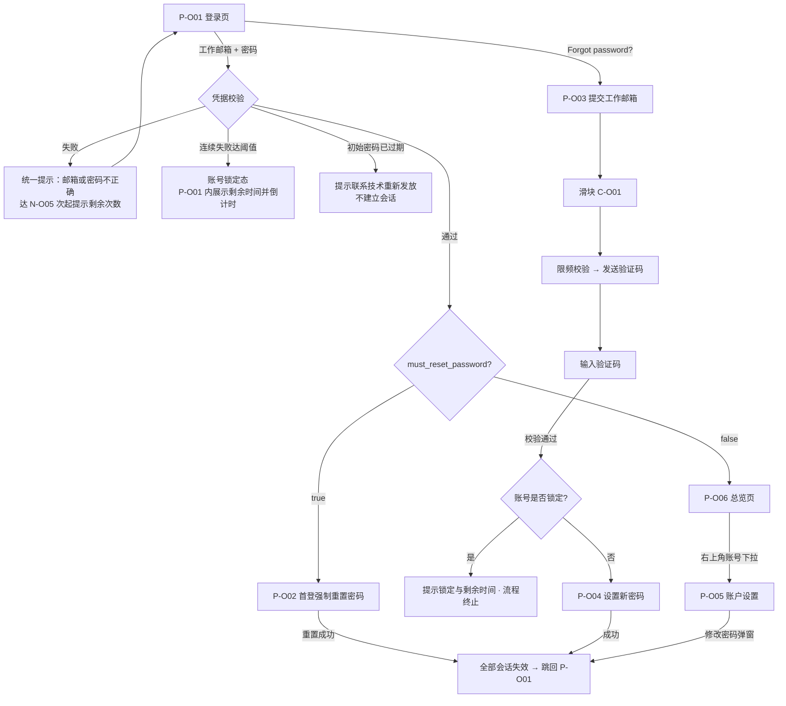
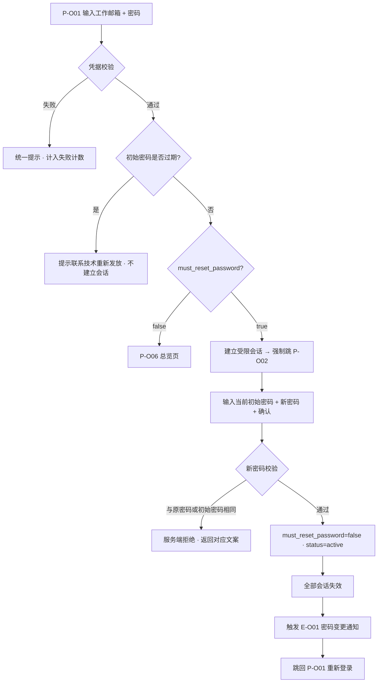
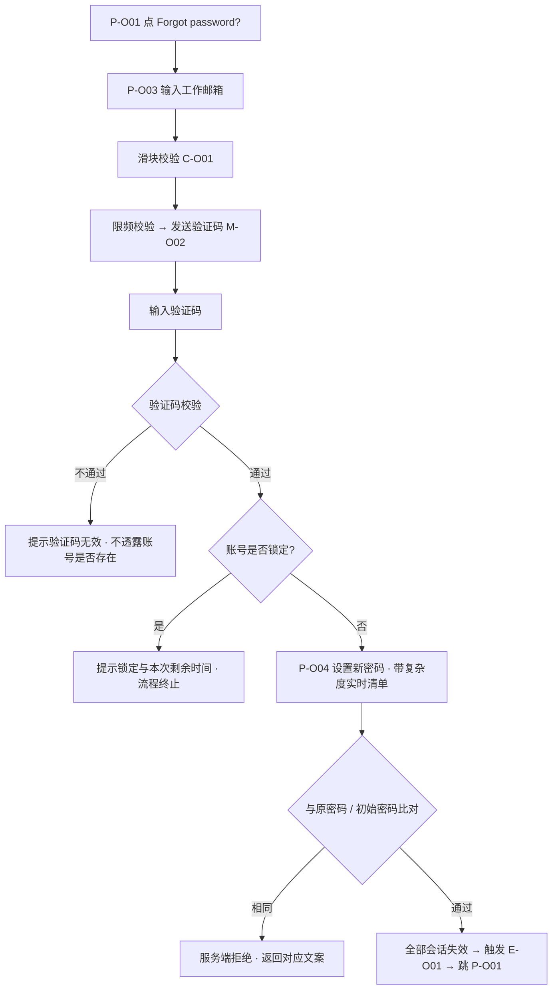
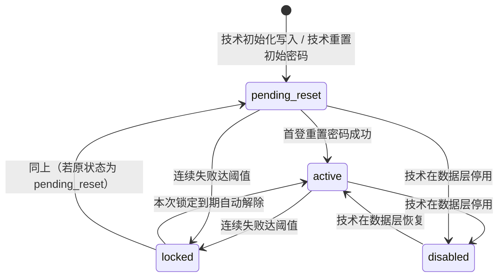
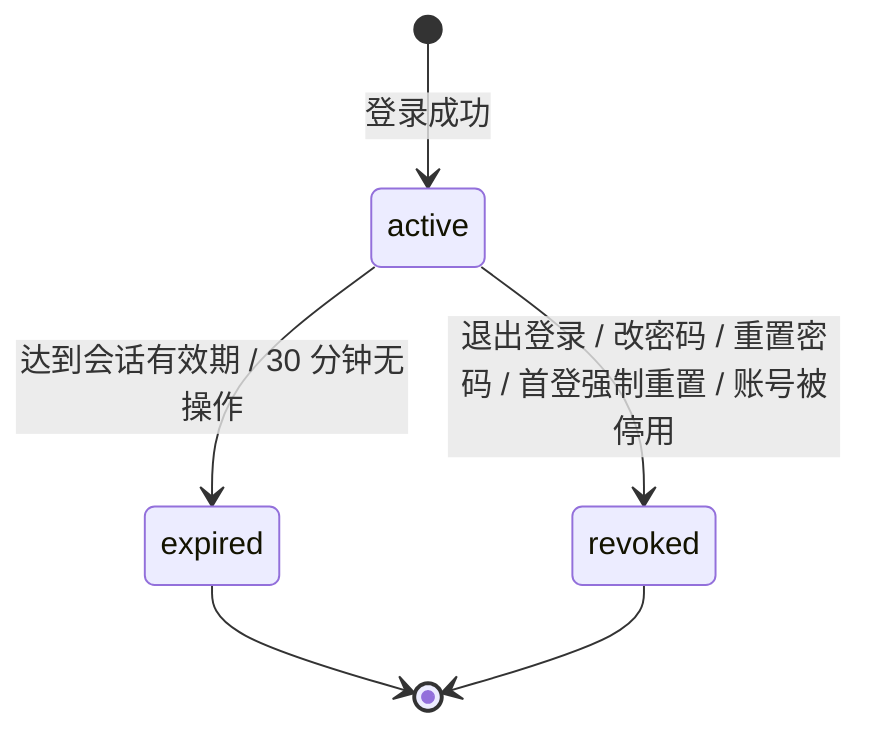

# 金融服务平台 · 运营端 · 账户与登录 PRD

> **本 PRD 是「差异型」文档，不是 WS-302 的复制件。**
> 与资产管理端一致的规则**只给编号 + 一句话 + 指向 WS-302 原文的相对路径**，不重写；只有**运营端特有**或**本轮由需求方落定**的内容才展开。唯一的例外是国际化基线——需求方明确要求在本平台另立一份完整的，见分册 [`01-国际化基线.md`](./01-国际化基线.md)。
> 因此本文档的篇幅显著短于 WS-302，这是有意的：凡是引用条目，**规则细节以 WS-302 原文为准**，本文档不做第二份定义。

## 0. 导航索引

### 0.1 文件清单

| 文件 | 装了哪些内容 | 给谁看 |
| --- | --- | --- |
| **`v1.0-账户与登录-PRD.md`**（本文件） | 1～16 全部章节：文档信息、背景目标、范围边界、角色场景、信息架构、功能清单、模块详情、页面与字段、流程与状态机、权限、安全与风控、通知与邮件、数据对象、非功能、指标、依赖与风险、验收标准、口径与参数 | 所有人的入口 |
| [`01-国际化基线.md`](./01-国际化基线.md) | 金融服务平台的**平台级**国际化与全局展示基线 + **脱敏基线**：语言、时区、日期、数字、金额、链上地址与哈希、文案规范、敏感字段的展示与传输口径 | 前端与设计；**本平台后续所有模块直接引用这一份**（WS-309 的 DEP-6 / D-O23 即指向它） |

> **为什么国际化单独成册**：需求方批复第 10 条要求在金融服务平台另立一份完整的国际化基线（不跨平台引用 WS-302 第 13 章）。既然它的适用范围是**整个金融服务平台**而不只是登录模块，就应当是一个可被独立引用的文件，而不是埋在某个模块文档的第 13 章里——后者正是 WS-302 目前的状态，也是 X-10 指出的问题。

### 0.2 编号体例

运营端**自成一套编号**，与 WS-302 的编号空间完全不重叠（同一仓库内撞号会让评审与验收无法定位）。统一采用 `-O` 后缀（O = Operations）：

| 编号 | 含义 | 定义位置 |
| --- | --- | --- |
| `P-O01`～`P-O06` | 运营端页面（段位 `P-O01`～`P-O19` 归本模块） | 5.1 |
| `C-O01`～`C-O12` | 运营端组件（段位 `C-O01`～`C-O19` 归本模块） | 5.1 |
| `F-O01`～`F-O16` | 功能点 | 第 6 章 |
| `D-O01`～`D-O24` | 已确认口径 | 16.1 |
| `N-O01`～`N-O21` | 可调参数 | 16.2 |
| `E-O01` | 通知事件 | 12.1 |
| `M-O01`、`M-O02` | 邮件模板 | 12.3 |
| `AC-O01`～`AC-O108` | 验收标准 | 第 15 章 |
| `US-O01`～`US-O07` | 用户故事 | 4.2 |

- **每个编号表都带一列「对应 WS-302」**，指出它引用或对照的是 WS-302 的哪条。日后 WS-302 改动时，按这一列即可定位本文档需要跟改的条目。
- **组件自有编号**：运营端组件从共享段位表分给 WS-308 的 `C-O01`～`C-O19` 段内取号（`docs/notification-contract/接入指南.md` 4.2）。**序号与 WS-302 的对应组件对齐**（`C-O01`↔`C-O01`、`C-O04`↔`C-O04`……），便于对照阅读其行为规格。**这只是编号层面的独立——组件的行为规格逐条沿用 WS-302，不重新设计**（与 WS-309 对 `C-O2x` 的处理是同一手法）。编号必须全平台唯一：`page_target` 的跨端校验要靠段位表反查编号属于哪个端，运营端组件是另一套壳层内的另一个实例，继续借用资产平台的 `C-xx` 会让它解析不出来。

### 0.3 引用 WS-302 时的路径基准

本文档中形如「WS-302 12.2」的引用，一律指向：

```
asset-platform/prd/v1.0-账户与登录/
├── v1.0-账户与登录-PRD.md      # 1～6、11、15～17、19
├── 01-模块详情.md               # 7
├── 02-页面字段与双语文案.md      # 8、13
├── 03-流程图与状态机.md          # 9、10、14
├── 04-安全与风控.md             # 12.1～12.4
├── 05-消息通知与邮件模板.md      # 12.5、12.6
└── 06-验收标准.md               # 18
```

从本文档所在目录出发的相对路径为 [`../../../asset-platform/prd/v1.0-账户与登录/`](../../../asset-platform/prd/v1.0-账户与登录/)。

**本文档还引用以下三处，路径与含义如下：**

| 引用对象 | 路径 | 说明 |
| --- | --- | --- |
| **平台通知契约 · 接入指南**（四端共用） | [`docs/notification-contract/接入指南.md`](../../../docs/notification-contract/接入指南.md) | 必填字段、`biz_type` 命名与登记、`category` 枚举、**编号段位表（4.2）**、`dedupe_key` 构造规范、跳转三形态、接入 Checklist。**已从消息通知 PRD 的分册独立出来**，引用一律写这个路径 |
| **WS-304《消息通知》数据契约** | [`asset-platform/prd/v1.0-消息通知/02-数据契约与字段.md`](../../../asset-platform/prd/v1.0-消息通知/02-数据契约与字段.md) | 平台站内消息通用规则的**唯一定义方**（WS-304 D-N38）。`Message.end` 已扩为 `asset` / `admin` / `fs` / `fs_ops` 四值 |
| **WS-309《金融服务平台 · 运营端 · 消息通知》** | [`financial-service-platform/prd/v1.0-消息通知/`](../v1.0-消息通知/v1.0-消息通知-PRD.md) | 运营端站内信的**展示层**：消息中心 `P-O20` / `P-O21`、铃铛 `C-O20`～`C-O23`、通用权限与越权校验、已读语义 |

**引用基准版本：分支 `cly-V1.0.0`，commit `8c8b222`。**

> **一处版本说明**：WS-302 `v1.0-账户与登录/` 的 7 个文件在 `d3602ed` → `8c8b222` 之间**没有任何改动**（已核 `git diff`）。因此本文档对 WS-302 的全部引用、以及分册抄写的第 13 章，在两个版本下内容一致。

---

## 1. 文档信息

| 项目 | 内容 |
| --- | --- |
| 文档名称 | 金融服务平台 · 运营端 · 账户与登录产品需求文档 |
| 对应需求 | WS-308「金融服务平台-运营端-用户登录」 |
| 上游输入 | 《金融服务平台 · 运营端 · 用户登录 需求诊断简报（差异诊断）》（程功立，2026-09-09）+ 需求方 2026-09-09 对 Q-01～Q-16 的批复 |
| 编写人 | 许楚清（需求分析师） |
| 文档语言 | 中文（界面文案给出中英对照） |
| 覆盖端 | **金融服务平台 · 运营端 Web**。**不含金融服务端（用户侧）** |
| 引用基线 | WS-302《资产端 / 资产管理端 · 账户与登录 PRD》，`cly-V1.0.0` @ `8c8b222`，**只引用其中的「资产管理端」部分**（该目录在 `d3602ed`→`8c8b222` 之间未变更） |
| 关联需求 | **WS-309《金融服务平台 · 运营端 · 消息通知》**（已定稿入库）——本文档只定义站内信「发什么、何时发」，展示层归 WS-309；本模块按 [`docs/notification-contract/接入指南.md`](../../../docs/notification-contract/接入指南.md) 提交消息。契约的唯一定义方是 **WS-304**（D-N38），见 12.5 |
| 平台内定位 | 本文档是金融服务平台的**第一份 PRD**；其分册 [`01-国际化基线.md`](./01-国际化基线.md) 是本平台的**平台级基线**，后续模块直接引用 |

**口径声明（消除仓库内的一词两义）**

> 本文档中「**运营端**」一律指**金融服务平台的运营端**。
> 仓库内 WS-303《实名认证与审核》把**资产管理端**的审核界面也称作「运营端」，那是另一个平台的另一个端，与本文档无关。按需求方批复（Q-16），**本期不回改 WS-303 的措辞**，只在本文档内声明口径。

---

## 2. 背景与目标

### 2.1 背景

金融服务平台是与资产平台并列的另一个平台，包含**金融服务端**（用户侧）与**运营端**（后台）两个端。需求方给出的原始输入是「运营端功能和资产管理端一样，可根据已输出的资产管理端 PRD 输出」。

**「一样」指的是规则一样，不是文档一样。** 同一套登录功能落在不同平台上，账号归属、默认语言的理由、邮件的品牌锚点、通知的展示层归属都会变。这些差异已由上游《需求诊断简报》逐条诊断（14 个差异点 X-01～X-14、16 条待确认 Q-01～Q-16），并由需求方在 2026-09-09 一次性批复完毕。**本文档中不存在任何遗留的待确认项**，唯一保持占位符形态的是品牌与合规占位符的**实际取值**（见 2.4）。

运营端在设计系统中已归入**控制台画布形态**（与资产管理端同类），直接继承 [`docs/design-system/harbour-credit-admin-components.md`](../../../docs/design-system/README.md)，不新立一套视觉规范。

### 2.2 本期目标

1. **运营端拥有一套完全独立的账号体系**：与资产管理端账号无任何关联，账号由技术在数据层初始化，应用层不提供任何账号增删改入口。
2. 运营管理员用**工作邮箱 + 密码**登录，首次登录被强制改掉初始密码后才能上岗。
3. 忘记密码可通过工作邮箱自助重置，全流程不透露该邮箱是否为有效账号。
4. 账号信息与偏好设置收敛到**一个账户设置单页**，通过右上角账号下拉进入。
5. 会话、锁定、滑块、限频四组安全能力与资产管理端**取值一致、配置源共用**，不另设一份基线。
6. **默认英文**、中英可即时切换、偏好双态持久化；时间、数字、金额、链上地址与哈希在本平台有一份**完整的、自持的**展示口径。
7. 登录相关的邮件与站内信只定义**发什么、何时发**；站内信按共享的通知契约与接入指南提交，展示层归 **WS-309**（金融服务平台自己的消息通知模块，与资产平台**四端四池、按 `end` 严格隔离**）。

### 2.3 范围边界

| 边界项 | 归属 |
| --- | --- |
| **金融服务端（用户侧）登录** | **不在本期。** 用户侧登录与运营端是完全不同的两套（对照资产端：钱包签名、自动建号、协议勾选、认证前置校验），另立 issue（需求方批复 Q-01） |
| 运营端账号管理界面（增删改、停用、重置他人密码） | **不在本期**（需求方批复 Q-12）。本期账号全部由技术在数据层维护 |
| 站内信的展示形态（消息中心页面 `P-O20`/`P-O21`、铃铛 `C-O20`、未读角标、已读语义、列表交互） | **WS-309《金融服务平台 · 运营端 · 消息通知》**（已定稿入库）。本模块只定义触发时点与消息内容，见 12.5 |
| 运营端的业务功能与左侧菜单业务项 | 运营端后续业务需求。本模块只出登录、找回、账户设置四类页面，外加一个总览页壳子（P-O06） |
| 品牌与合规占位符的实际取值 | 需求方提供，见 2.4 |
| **对已定稿文档的改造要求** | **本文档一条都不提。** 不回改 WS-302 / WS-303 的正文；不改 WS-304 的契约（`fs_ops` 是它已经扩好的合法取值，不是本 issue 提出的）；不改共享的 [`docs/notification-contract/接入指南.md`](../../../docs/notification-contract/接入指南.md) 与其中的编号段位表（本模块只在分给它的段位内取号）；不改 WS-309 的任何文件 |
| **平台自建 vs 契约分叉的边界** | **模块、消息池、页面与组件编号各自独立；契约层共用一份、定义权在 WS-304，不分叉。** 账号体系（D-O01）、国际化与脱敏基线（D-O17）是「本平台自己写一份」；**消息契约不是**——它只有一份，运营端按 `end = fs_ops` 接入 |

### 2.4 唯一保留的占位项：品牌与合规占位符

WS-302 12.6.5 定义的 7 个品牌与合规占位符，在运营端的取值规则已由需求方批复第 4 条落定（见 12.4），但**实际值尚未提供**。

- **本文档中这 7 个占位符一律保持 `{placeholder}` 形态**，标注「待需求方提供」。
- **不阻塞**：占位符只影响最终文案落地，不影响任何逻辑、流程与验收；取值到位后统一替换，不涉及改动逻辑。
- 这是本文档中**唯一**未落定实际值的内容。除此之外，正文不含任何 `[待确认]` 标记。

---

## 3. 范围与边界

### 3.1 明确不沿用的内容（防误抄清单）

以下 WS-302 内容属于**资产端**（用户侧），与运营端无关，**不得带入本文档、原型与实现**。本清单来自上游简报附录 A，逐条保留：

| WS-302 引用 | 不沿用的内容 |
| --- | --- |
| 7.1 / F-01～F-04 / D-01 | 首次登录自动建号、建号后引导页 P-A10 |
| 7.2.1 / 7.2.3 / F-01 / F-02 / F-06 / D-05 | 邮箱验证码登录、钱包签名登录、手填地址一致性校验 |
| 7.3 / F-13 / F-14 / C-02 / C-03 / D-22 | 用户协议勾选行与强制重新同意弹窗 |
| 7.4.3 / F-07 / D-04 | 按认证状态决定落地页 |
| 7.5 / F-11 / F-12 / C-08 / C-09 / D-02 / D-03 | 凭据完备性、常驻补全提示条、就地补齐弹层 |
| 7.6.3 / F-17 / P-A12 / D-07 | 修改邮箱流程（运营端工作邮箱只读，无修改入口） |
| 7.6.5 / F-19 / D-06 | 钱包地址只读展示 |
| P-A01～P-A17 | 资产端全部页面 |
| E-03 / E-09 / E-10 / M-02 / M-07 / M-09 / M-10 / M-12 | 钱包绑定、邮箱变更、登录验证码等资产端专属通知与邮件模板 |
| N-15 / N-17 | 签名 nonce 有效期、**资产端**会话 4 小时与「记住我」30 天 |
| WS-302 3.2 中与 WS-301 / WS-303 的接口 | 协议管理与实名认证的对接口径 |

> **三条特别提醒**（上游简报的基线勘误，已逐条核对仓库原文）：
> 1. WS-302 第 7 章**只到 7.7.5**，不存在 7.8 / 7.9；资产管理端的全部内容集中在 **7.7**。
> 2. 「**最后一个管理员保护**」在 WS-302 中**根本不存在**（全仓检索零命中），因为应用层没有账号增删入口。本期运营端同样不做账号管理界面，**该约束本期不适用**（D-O21）。
> 3. 「会话 4 小时 / 记住我 30 天」是**资产端**的 N-17，**不是**管理端口径。运营端要对齐的是 **N-18：会话 2 小时 + 30 分钟无操作登出、不提供「记住我」**。

### 3.2 与其他需求 / 平台的接口

| 依赖方向 | 内容 | 归属 |
| --- | --- | --- |
| 本模块 → 本平台其他模块 | `ops_admin_id`（不可变账号主键）、登录态与会话、账号状态、角色标识、语言与时区偏好 | 本文档定义 |
| 本模块 → 本平台其他模块 | **国际化与全局展示基线** | 本文档分册 [`01-国际化基线.md`](./01-国际化基线.md) 定义；本平台后续模块直接引用它，**不再引用 WS-302 第 13 章** |
| 本模块 ← WS-302 | 登录、首登重置、忘记密码、账户设置的**规则原文**；会话失效、阶梯锁定、滑块与限频的**强制条款原文**；邮件的通用结构与模板结构 | **引用，不重写。** WS-302 是权威原文，本文档只标注引用点与运营端的取值差异 |
| 本模块 → **WS-309 运营端消息通知** | 运营端账户与登录类**站内信**的事件负载（`end` / `recipient_scope` / 接收者标识 / `category` / `biz_type` / 文案 / 跳转 / `dedupe_key`） | 本文档定义**发什么、何时发**；WS-309 是展示层。本模块按接入指南提交，**不需要 WS-309 为本模块做任何定制** |
| 本模块 ← **WS-309 运营端消息通知** | 运营端的**通用权限与消息池口径**：共享池 + 个人独立已读、按 `end` 严格隔离、六个越权校验点、越权返回 404 语义 | WS-309 定义，本模块不重复定义 |
| 本模块 → **WS-309（回填）** | WS-309 点名等本模块回填的四条：账号主体标识与创建时间字段、顶栏组件编号、路由前缀与登录页落点、脱敏基线字段清单 | **本轮已全部回填**，见 3.4 |
| 本模块 ← **WS-304 消息通知（契约）** | 站内消息的数据契约、`biz_type` 命名空间、`category` 枚举、`end` 四值枚举 | **WS-304 是平台站内消息通用规则的唯一定义方**（D-N38）。本模块直接引用、**不重写、不分叉、不要求它改动**——`fs_ops` 是它已扩好的合法取值 |
| 本模块 ← **接入指南（四端共用）** | 必填字段、`biz_type` 申请与登记、编号段位表、`dedupe_key` 构造规范、跳转三形态、Checklist | [`docs/notification-contract/接入指南.md`](../../../docs/notification-contract/接入指南.md)。本模块**只读不改** |
| 本模块 → 自身邮件投递 | 邮件的模板、触发时点、发送、判空跳过与退信处理 | **本模块自持**（与 WS-302 分工一致：邮件不属于消息通知模块） |
| 本模块 → 技术 / 运维 | 运营端账号的创建、停用、初始密码发放与重置，均由技术在数据层直接维护 | 见 7.1 |
| 本模块 → 部署 | **运营端管理员账号初始化**（部署强制前置项）、邮件发信域与 SPF/DKIM/DMARC 配置、区块浏览器映射表配置 | 见 7.1、12.4、14.3 |
| 本模块 ↮ 资产平台账号体系 | **无接口。** 运营端账号与资产管理端账号**完全独立**，不共享账号数据、不跨平台单点登录、不互相同步 | 需求方批复第 1 条（Q-02） |
| 本模块 → WS-302 | **不回改。** 本期不因运营端而修改 WS-302 的账户模型、权限表或任何已定稿内容 | 需求方批复第 1 条 |

### 3.3 账号体系为什么完全独立（D-O01 的展开）

这是本轮最大的分叉点，结论由需求方批复第 1 条落定：**运营端账号与资产管理端账号没有任何关联**。落到设计上有三条：

1. **两套数据，一套实现。** 账号数据完全独立；但安全策略（锁定、限频、滑块、密码规则、会话）**共享同一套实现与同一份配置源**——「安全逻辑维护两遍」是实现层问题，靠共享服务解决，不靠共享账号数据解决。
2. **数据模型预留平台归属字段。** `OpsAdminAccount` 带 `platform` 字段（本期恒为 `financial_service`），见 13.1。预留位的作用是：将来若真要做统一账户中心，扩展路径是明确的，不必推翻重来。
3. **不回改 WS-302。** 选「独立」的直接好处就是资产平台的定稿文档一个字都不用动。

**升级条件（记入风险表 R-O06）**：一旦出现 ① 同一批运营人员需同时进入两个平台，或 ② 要做后台账号管理界面，即应升级为「同一套账号 + 按平台授权」，届时按「账户中心」独立立项，**不在登录模块内塞**。


### 3.4 对 WS-309 的回填清单（DEP-1 / DEP-4 / DEP-6 / DEP-7 / DEP-9）

WS-309 以占位表述成稿，点名等本模块回填四项（其 15.1.1 的 DEP 清单与 17.4 的 Q-O01～Q-O03）。**本轮全部回填，取值如下**；WS-309 按此替换占位符即可，不涉及其任何结构性改动。

| WS-309 编号 | 它要什么 | **本模块给出的取值** | 定义位置 |
| --- | --- | --- | --- |
| **DEP-1 / DEP-4**（Q-O01） | 运营端账号主体标识的**字段名与形态**，以及**账号创建时间字段** | 标识字段 **`ops_admin_id`**：string，账号唯一主键，**不可变**，形态为**不可枚举**标识（UUID 类，不使用自增序号）；会话对象中同名携带。<br>创建时间字段 **`created_at`**：datetime，**UTC**，由技术在数据层初始化账号时写入，此后不改。<br>WS-309 的已读表读者标识、个人消息归属字段、六个越权校验点一律用 `ops_admin_id`；未读起算点（其 8.1.2「账号创建时间之前的消息可见但不计未读」）用 `created_at` | 13.1、13.3 |
| **DEP-7**（Q-O02） | 运营端**顶栏组件编号**（是否有语言切换器、账号下拉的编号） | **两者都有。** 语言切换器 = **`C-O04`**，右上角账号下拉 = **`C-O11`**。铃铛 `C-O20` 挂在**「`C-O04` 左侧、`C-O11` 之前」**；「消息中心」条目挂在 `C-O11` 内、「账户设置」之上。<br>**WS-309 的降级分支（「若 WS-308 未提供语言切换器则退化为顶栏右侧」）不会触发**——语言切换器是本模块的 P0 功能（F-O13），必然存在 | 5.1、5.3 |
| **DEP-9**（Q-O03） | 运营端**路由前缀**与**登录页落点** | 前缀 **`/ops`**，登录页 **`/ops/login`**。消息中心即 `/ops/messages`、详情深链 `/ops/messages/{message_id}`。未登录访问任何受保护路由一律跳 `/ops/login` 并以 `?redirect=<原路径>` 携带原路径，登录成功后回跳 | 5.4 |
| **DEP-6** | 运营端**脱敏基线的字段清单** | 归属已定为金融服务平台自己那份，**内容本轮补齐**：见分册 [`01-国际化基线.md`](./01-国际化基线.md) **第 8 节「脱敏基线」**（邮箱掩码、账号标识、设备与 IP、链上地址与哈希、密码与验证码、令牌类，以及展示 / 传输 / 日志三个口径） | 分册第 8 节 |

> **回填后 WS-309 的三条待确认项（Q-O01～Q-O03）全部关闭**，DEP-6 的「内容未定」也一并关闭。本模块**不代改 WS-309 的任何文件**——替换动作由 WS-309 自己执行。

---

## 4. 用户角色与场景

### 4.1 角色

| 角色 | 描述 | 本模块内的核心诉求 |
| --- | --- | --- |
| **运营管理员**（Operations Administrator） | 使用技术直接提供的工作邮箱账号，**本期运营端唯一的角色** | 拿到账号后顺利改密上岗；忘记密码能自助重置；能查看和设置自己的账号信息与偏好 |
| 技术 / 运维 | 在数据层直接维护运营端账号（创建、停用、初始密码发放与重置） | 有明确的账号字段与状态口径可依循；部署时知道必须初始化第一个账号 |
| 非中文运营成员 | 运营团队中不使用中文的成员 | 打开就是英文；不需要先找语言开关才能干活 |

> **单角色，但权限按角色维度组织**（D-O02）。本期只有「运营管理员」一种角色，但第 10 章的权限表按「角色 → 能力」而非「所有人权限等同」来写，会话中携带角色标识（13.3）。理由：金融服务的运营场景（放款审核、对账、风控复核）比资产管理端更可能出现职责分离，但**登录模块里没有任何权限点可供分角色**——现在硬造三个角色只会得到三个权限完全相同的空壳；而把单角色写死进会话与权限模型，后续业务模块引入角色时又要回改登录模块。留扩展位是成本最低的处理。

### 4.2 用户故事

| # | 角色 | 用户故事 | 对应功能 |
| --- | --- | --- | --- |
| US-O01 | 运营管理员 | 作为拿到技术交付账号的运营管理员，我希望第一次登录就被引导改掉初始密码，改完才能干活 | F-O02 |
| US-O02 | 运营管理员 | 作为日常使用的运营管理员，我希望用工作邮箱和密码直接进后台，不必勾协议、不必装钱包 | F-O01 |
| US-O03 | 运营管理员 | 作为忘记密码的运营管理员，我希望通过工作邮箱自助重置，不必每次都找技术 | F-O03 |
| US-O04 | 运营管理员 | 作为改了密码的运营管理员，我希望其他设备上的登录立刻失效 | F-O06 |
| US-O05 | 运营管理员 | 作为在共用办公电脑上工作的运营管理员，我希望离开一段时间后系统自动把我登出 | F-O06 / N-O16 |
| US-O06 | 非中文运营成员 | 作为不使用中文的运营成员，我希望打开就是英文；切成中文后下次换台电脑登录还是我上次选的语言 | F-O11 / F-O12 |
| US-O07 | 运营管理员 | 作为账号被人尝试爆破的运营管理员，我希望系统在连续失败后锁住账号 | F-O07 |

---

## 5. 信息架构与页面流

### 5.1 页面清单

**运营端页面共 6 个**（登录相关 5 个 + 总览页壳子 1 个）：

| 编号 | 页面 | 形态 | 说明 | 对应 WS-302 |
| --- | --- | --- | --- | --- |
| **P-O01** | 运营端登录页 | 整页 | 工作邮箱 + 密码。**无协议勾选、无「记住我」、无验证码登录、无钱包登录、无注册入口**。提供「Forgot password?」入口。账号锁定时在本页内以状态态展示锁定提示与倒计时 | = P-M01 |
| **P-O02** | 首登强制重置密码页 | 整页 | 未完成重置不得访问任何其他运营端页面；**页面上无任何勾选项**；只保留「退出登录」与语言切换两个逃生出口 | = P-M02 |
| **P-O03** | 忘记密码 · 提交工作邮箱 | 整页 | 输入工作邮箱 → 滑块（C-O01）→ 发送验证码 | = P-M03 |
| **P-O04** | 忘记密码 · 设置新密码 | 整页 | 验证码校验通过后设置新密码，带复杂度实时清单 | = P-M04 |
| **P-O05** | 运营端账户设置 | 整页 + tab 锚点 | 单页分「账号信息」与「偏好信息」两区块，tab 点击整页锚点滚动；修改密码在本页内以**弹窗**完成；通过右上角账号下拉进入 | = P-M05 |
| **P-O06** | 总览页 | 整页 | **本模块只出壳子**，作为登录成功后的落地目标与左侧菜单项存在；页面内容归运营端后续业务需求。壳子中应给出简短说明文字而非完全空白 | ≈ P-A16（同为壳子处理） |

**不属于本模块的页面**

| 页面 | 归属 |
| --- | --- |
| 运营端消息中心 `P-O20` / 消息详情 `P-O21` | **WS-309《运营端 · 消息通知》**（已定稿入库）。本模块只在账号下拉（C-O11）中提供挂载位置；页面本身、编号与路由归 WS-309。`P-O20` 起在共享段位表中已登记给 WS-309，**与本模块的 `P-O01`～`P-O19` 不重叠** |

**运营端组件**（编号取自共享段位表分给本模块的 `C-O01`～`C-O19`；**行为规格逐条沿用 WS-302 的对应组件，不重新设计**，规格原文见 WS-302 [`02-页面字段与双语文案.md`](../../../asset-platform/prd/v1.0-账户与登录/02-页面字段与双语文案.md) 8.7）

| 编号 | 组件 | 在运营端的用法 | 归属 | 行为规格对照 |
| --- | --- | --- | --- | --- |
| C-O01 | 滑块人机校验弹窗 | 忘记密码发送验证码前置，自研 | WS-308 | C-01 |
| C-O04 | 语言切换器（下拉形态） | 未登录在登录页右上角，已登录在顶部导航栏右侧。**它是铃铛 C-O20 的定位锚点**（WS-309 DEP-7） | WS-308 | C-04 |
| C-O05 | 会话失效提示 | 走 Toast（C-O12） | WS-308 | C-05 |
| C-O10 | 顶部面包屑 | 位于顶部导航栏下方 | WS-308 | C-10 |
| C-O11 | 右上角账号下拉 | 展示工作邮箱与账号状态，提供「消息中心」「账户设置」「退出登录」三项。**「消息中心」条目由 WS-309 挂载**（WS-309 DEP-7） | WS-308 | C-11 |
| C-O12 | Toast 轻提示 | **顶部居中**，全站唯一轻提示载体 | WS-308 | C-12 |
| C-O20 | 通知铃铛 | 顶部导航栏内、**C-O04 语言切换器左侧、C-O11 账号下拉之前**。**本模块只提供挂载位置，形态与行为规格归 WS-309** | **WS-309** | C-20 |

> **不使用的组件**（以下是 **WS-302 的**编号，运营端不设对应实例、不占用 `C-O` 段位）：`C-02` 协议勾选行、`C-03` 强制重新同意弹窗、`C-06` 链接外部钱包面板、`C-08` 常驻补全提示条、`C-09` 凭据补齐弹层——全部为资产端专属。`C-07` 地址/哈希展示组件在本模块无场景，其展示规则作为平台基线保留在分册第 5 节。
>
> **`C-O02`/`C-O03`/`C-O06`～`C-O09`/`C-O13`～`C-O19` 本期未使用**，仍属本模块段位，后续运营端登录相关组件从中取号，**不需要再去段位表申请**。
>
> **为什么运营端组件不继续借用资产平台的 `C-xx`**：编号唯一性要求是「一个编号在全平台只对应一个页面 / 组件」（WS-304 D-N40），而 `page_target` 的跨端校验要靠段位表反查编号属于哪个端。运营端顶栏是**另一套壳层内的另一个实例**，必须有自己的编号才能被唯一解析。序号与 WS-302 对齐（`C-O01`↔`C-01` ……）是为了便于对照读它的行为规格，与 WS-309 对 `C-O2x` 的处理是同一手法。

### 5.2 运营端页面流



> **锁定判定位于验证码校验之后**，不得提前到输入邮箱或发码阶段——提前会重新打开邮箱枚举通道。完整理由见 WS-302 [`04-安全与风控.md`](../../../asset-platform/prd/v1.0-账户与登录/04-安全与风控.md) 12.2.4「防枚举处理」。

### 5.3 已登录态的信息架构

```
┌────────────────────────────────────────────────────────────┐
│  Logo    顶部导航栏              [铃铛] [语言下拉] [账号下拉] │  ← C-O20 / C-O04 / C-O11
├────────────────────────────────────────────────────────────┤
│  面包屑：账户设置                                            │  ← C-O10（导航栏下方）
├──────────────┬─────────────────────────────────────────────┤
│ 左侧菜单      │                                             │
│  · 总览       │              页面主体区域                    │
│  （业务项待补）│                                             │
└──────────────┴─────────────────────────────────────────────┘
```

- **画布形态**：控制台形态（固定侧栏、紧凑顶栏、清晰的表格边界），与资产管理端同类，直接继承设计系统 [`docs/design-system/harbour-credit-admin-components.md`](../../../docs/design-system/README.md)。
- **左侧菜单**本期只有「总览」一项（指向 P-O06 壳子）。业务菜单项由运营端后续业务模块各自登记，**本模块不预先编造菜单项**。
- **右上角账号下拉（C-O11）**

| 区块 | 内容 |
| --- | --- |
| 账号标识 | 当前账号的**工作邮箱** |
| 账号状态 | `正常` 等状态标签 |
| 操作 | 「**消息中心**」→ `P-O20`（页面归 WS-309，直达整页不展开面板）；「账户设置」→ P-O05；「退出登录」。**「消息中心」排在「账户设置」之上**——前者高频查看，后者低频维护 |

- **面包屑（C-O10）规则**沿用 WS-302 5.3：位于顶部导航栏下方通栏左对齐；最多三级；除当前页外各级可点击；单层页面仍展示；弹窗不产生面包屑层级。


### 5.4 运营端路由（DEP-9 回填）

| 路由 | 页面 | 归属 | 登录态要求 |
| --- | --- | --- | --- |
| **`/ops`** | **运营端路由前缀**（所有运营端页面的公共前缀） | — | — |
| `/ops/login` | P-O01 登录页 | WS-308 | 未登录可达 |
| `/ops/first-reset` | P-O02 首登强制重置密码页 | WS-308 | 受限会话（`must_reset_password = true`） |
| `/ops/forgot-password` | P-O03 忘记密码 · 提交工作邮箱 | WS-308 | 未登录可达 |
| `/ops/reset-password` | P-O04 忘记密码 · 设置新密码 | WS-308 | 未登录可达（凭验证码票据） |
| `/ops/account` | P-O05 账户设置 | WS-308 | 需登录且 `status = active` |
| `/ops/overview` | P-O06 总览页（壳子） | WS-308 | 需登录且 `status = active` |
| `/ops/messages` | P-O20 消息中心 | **WS-309** | 需登录且 `status = active` |
| `/ops/messages/{message_id}` | P-O21 消息详情（**支持深链**） | **WS-309** | 同上 |

**未登录与回跳口径（强制条款，WS-309 的深链依赖它）**

| 场景 | 表现 |
| --- | --- |
| 未登录访问任何 `/ops/*` 受保护路由 | 跳 **`/ops/login?redirect=<URL 编码后的原路径>`**，登录成功后回跳原路径 |
| 未登录访问 `/ops/messages/{id}` 深链 | 同上，`redirect` 含消息 ID；登录成功后回跳该条详情。**若该消息不属于登录成功的这个账号，由 WS-309 落到「消息不存在页」**——本模块不在登录环节做任何消息归属判断，也不提示「你登错账号了」 |
| `must_reset_password = true` 时的任何跳转 | **一律被 P-O02 拦截**（7.3 的双重拦截），`redirect` 保留，重置完成并重新登录后再回跳 |
| 回跳目标不是 `/ops/*` 开头 | **丢弃 `redirect`**，落到 `/ops/overview`。防开放重定向 |

> **前缀 `/ops` 与登录页落点 `/ops/login` 一经确定不得随意改动**——WS-309 的深链与回跳都挂在这两项上。其余路径段的具体命名可由技术在实现时统一调整，调整后同步本表与 WS-309。

---

## 6. 功能清单

**「引用」列的读法**：标 `= WS-302 F-xx` 的，规则原文在 WS-302，本文档不重写；标「运营端落定」的，规则在本文档展开。

| 模块 | 编号 | 功能点 | 优先级 | 验收口径 | 对应 WS-302 |
| --- | --- | --- | --- | --- | --- |
| 登录 | **F-O01** | 工作邮箱 + 密码登录 | P0 | 唯一登录方式；无协议勾选、无「记住我」、无验证码/钱包/第三方登录、无自动建号 | = F-28（7.7.2） |
| 登录 | **F-O02** | 首次登录强制重置密码 | P0 | 未完成重置不得访问任何其他运营端页面；**前端路由守卫 + 服务端接口同样拦截**；页面无勾选项 | = F-29（7.7.3） |
| 登录 | **F-O03** | 忘记密码（两步） | P0 | 工作邮箱 → 滑块 → 验证码 → 设新密码；提示不透露该邮箱是否为有效账号 | = F-30（7.7.4） |
| 账户设置 | **F-O04** | 账户设置单页 + tab 锚点滚动 | P0 | 账号信息与偏好信息同页；tab 点击整页滚动到对应区块；修改密码为弹窗 | = F-31（7.7.5） |
| 账户设置 | **F-O05** | 右上角账号下拉（C-O11） | P0 | 展示工作邮箱与账号状态，提供消息中心、账户设置、退出登录三项；**为 WS-309 提供「消息中心」条目的挂载位置** | = F-16（管理端适配） |
| 安全与风控 | **F-O06** | 会话全局失效 | P0 | 退出、改密码、重置密码、账号被停用后，该账号所有会话（**含当前设备**）失效 | = F-22（WS-302 12.1） |
| 安全与风控 | **F-O07** | 阶梯登录锁定 | P0 | 连续失败达阈值锁定；阶梯时长；锁定期间登录与找回全部不可用，无提前解除通道 | = F-23（12.2） |
| 安全与风控 | **F-O08** | 滑块人机校验（自研） | P0 | 发送验证码前置滑块，服务端校验票据与轨迹 | = F-24（12.3.2 / 12.3.3） |
| 安全与风控 | **F-O09** | 验证码发送限频 | P0 | 邮箱 / IP / 设备三维度限频 | = F-25（12.3.4） |
| 密码 | **F-O10** | 密码规则与原 / 初始密码比对 | P0 | 8–20 字符、≥1 字母 + ≥1 数字；不得与原密码相同，**另不得与初始密码相同** | = F-10（8.4） |
| 通知 | **F-O11** | 账户与登录类邮件 | P1 | 只发两类：M-O01 密码变更通知、M-O02 设置或重置密码验证码；一封信含中英两份，英前中后；HTML + 纯文本双版本 | ⊂ F-26（12.6） |
| 通知 | **F-O12** | 账户与登录类站内信 | P1 | 只发一条：E-O01 密码变更。本模块按接入指南产出事件与内容，展示层归 **WS-309** | ⊂ F-27（WS-302 12.5） |
| 国际化 | **F-O13** | 中英语言切换与即时生效（下拉形态） | P0 | 切换后当前页面不刷新即变更 | = F-32 |
| 国际化 | **F-O14** | 语言判定优先级与双态持久化 | P0 | 手动偏好 > 账号偏好 > **英文默认**；**不读浏览器语言** | = F-33（默认值同为英文） |
| 国际化 | **F-O15** | 时区偏好与时间展示口径 | P0 | 存 UTC，展示本地并带时区标注；**首次登录时推断并写入时区** | ≈ F-34（推断时点改为首次登录） |
| 全局交互 | **F-O16** | Toast 统一轻提示（顶部居中） | P0 | 全站唯一轻提示载体 | = F-37（8.7.1） |

> **不列为功能点、但作为平台基线定义的内容**：数字 / 金额 / 链上地址 / 哈希的展示口径、区块浏览器跳转（分册第 5、6 节）。**运营端登录模块没有这些场景**，把它们列成本模块的功能点会产生无法验收的条目；但它们是金融服务平台的基线能力，由本平台的业务模块在有场景时引用并验收。

---

## 7. 模块详情

> **本章只展开运营端特有或本轮落定的内容。** 与资产管理端一致的规则细节，请读 WS-302 [`01-模块详情.md`](../../../asset-platform/prd/v1.0-账户与登录/01-模块详情.md) 7.7 的对应小节——那是权威原文，本章不复述。

### 7.1 账号来源与初始化（运营端落定）

| 项 | 口径 |
| --- | --- |
| **账号体系归属** | **与资产管理端完全独立**。不共享账号数据、不跨平台单点登录、不做账号同步。同一个人若同时需要两个平台，就是两个互不相干的账号、两套独立的密码 |
| 账号来源 | **由技术直接提供**：通过部署脚本 / 数据初始化写入，应用层**不提供任何增删改入口** |
| **本期账号数量** | **仅一个**——部署时初始化的那一个运营管理员账号。本期不做账号管理界面，新增账号同样只能由技术在数据层写入 |
| 初始密码 | 由技术生成并**线下交付**给本人；系统不通过邮件、站内信或任何在线渠道下发。初始密码本身也必须满足 8.2 的密码规则 |
| 初始密码有效期 | N-O17。过期后需联系技术重新发放 |
| 界面约束 | 运营端**不提供任何绕过登录的初始化页面、安装向导或首次配置页**；未登录状态下除 P-O01 与 P-O03 / P-O04 外无任何可达页面 |
| **部署前置条件** | 「**初始化运营端管理员账号**」是系统可用的**部署前置条件**，须写入部署清单并在上线检查中确认。未执行则运营端无人可登录，且系统**不提供任何自救入口** |

> **为什么不做首次配置页**：任何「首次配置页」都是一个绕过登录的后门——它必须在无凭据的情况下可达，一旦忘记关闭或被枚举到就是完整的接管路径。「无自救入口」是有意的安全设计，不因为运营端是新平台就开这个口子。代价是部署清单必须严格执行，这条已列入依赖（14.3）与风险（14.4 R-O01）。

> **「最后一个管理员保护」本期不适用**（D-O21）：应用层没有任何账号删除、停用或授权回收的入口，产品层面不存在这个动作，为它写保护规则会产生无法验收的条目。该规则应在**账号管理界面立项时**，连同「停用最后一个管理员」「回收最后一个管理员授权」一起作为一条完整的不变量来定义。

### 7.2 登录（F-O01）

**规则原文引用**：WS-302 [`01-模块详情.md`](../../../asset-platform/prd/v1.0-账户与登录/01-模块详情.md) 7.7.2，原样沿用。要点复述如下（**只为定位，细节以原文为准**）：

| 项 | 口径 | 说明 |
| --- | --- | --- |
| 登录字段 | **工作邮箱 + 密码**（密码框带眼睛图标） | 仅此一种方式 |
| 明确不提供 | 验证码登录、钱包登录、第三方登录、自动建号、协议勾选行、「记住我」 | 见 3.1 不沿用清单 |
| 失败提示 | 统一为 `Incorrect email or password. / 邮箱或密码不正确。` | 防账号枚举 |
| 失败计数 | 计入登录失败计数，阶梯锁定规则见第 11 章 | |
| 初始密码已过期 | 提示 `Your initial password has expired. Contact technical support to have it reissued. / 初始密码已过期，请联系技术人员重新发放。` **且不建立会话** | |
| **登录成功后的落地** | `must_reset_password = true` → 立即跳 P-O02；否则 → **P-O06 总览页** | **运营端落定**：运营端**不做**「按认证状态选落地页」（那是资产端 F-07，见 3.1）。本期业务模块尚未上线，落地目标固定为总览页壳子 |

### 7.3 首次登录强制重置密码（F-O02）

**规则原文引用**：WS-302 7.7.3，原样沿用。三条不可降级的要点：

1. **判定**：账号字段 `must_reset_password = true`。
2. **双重拦截**：登录成功后立即跳转 P-O02；前端路由守卫拦截所有其他运营端路由，**且服务端对所有运营端业务接口做同样拦截**——前端拦截不可作为唯一防线。
3. **页面元素**：当前（初始）密码、新密码、确认新密码、密码规则实时校验清单；**页面上无任何勾选项**；只保留「退出登录」与语言切换两个逃生出口。

**完成后**：`must_reset_password = false`，状态置 `active` → **全部会话失效** → 跳回 P-O01 重新登录 → 触发 E-O01 密码变更通知（见 12.1）。

### 7.4 忘记密码（F-O03）

**规则原文引用**：WS-302 7.7.4，原样沿用。流程与关键约束：

1. P-O01 点「Forgot password?」→ **P-O03**，输入工作邮箱。
2. **滑块校验（C-O01）→ 限频校验 → 向该工作邮箱发送验证码（M-O02）**。提示**不透露该邮箱是否为有效运营端账号**：`If this email belongs to an operations account, a verification code has been sent. / 若该邮箱为运营端账号，验证码已发送。`
   > 忘记密码的验证码**走工作邮箱**；线下交付只针对初始密码。
3. 输入验证码 → 校验通过 → **锁定判定**（见 5.2 的说明：判定必须在此，不能提前）→ **P-O04** 设置新密码。
4. 新密码需通过 8.2 全部规则，**包含与原密码、与初始密码的双重比对**。
5. 成功 → 全部会话失效 → 跳 P-O01 → 触发 E-O01。

> **账号锁定期间本流程同样不可用**（D-O09）。锁定期间用户**仍会收到验证码邮件**，但输入正确的验证码后会被告知账号锁定——这是「防枚举」与「全通道锁死」两个要求同时成立的唯一可行组合，实现时不得为省一次发信而把锁定判定提前。

### 7.5 账户设置（P-O05，F-O04）

**规则原文引用**：WS-302 7.7.5，**字段本期不扩充**（D-O20）。

- **进入方式**：右上角账号下拉（C-O11）→「账户设置」。
- **形态**：单页 + tab 锚点滚动；修改密码在本页内以弹窗完成。

| tab | 条目 | 操作 |
| --- | --- | --- |
| 账号信息 | 工作邮箱 | **只读**（登录账号，不可自助修改，**无「修改邮箱」入口**） |
| 账号信息 | 姓名 | 只读 |
| 账号信息 | 登录密码 | 「修改」→ 弹窗内完成**再认证（当前密码）** + 设置新密码，规则同 8.2 |
| 账号信息 | 账号状态 | 只读 |
| 偏好信息 | 界面语言 | 下拉选择，即时生效并持久化（见分册第 1、3 节） |
| 偏好信息 | 时区 | 下拉选择（见分册第 4 节） |

> **为什么不加「所属部门」「岗位」这类运营字段**（D-O20）：这类字段只有在有账号管理界面、或有按部门划分的权限时才有消费方，本期两者都不存在（D-O02 / D-O21），加了就是几个无人读写的只读空位。真正需要时应随角色模型一起定义。

---

## 8. 页面与字段定义

### 8.1 字段总表

| 字段 | 所在页面 | 类型 | 必填 | 校验规则 | 默认值 |
| --- | --- | --- | --- | --- | --- |
| 工作邮箱 `work_email` | P-O01 / P-O03 | string | 是 | RFC 5322 基本格式；长度 ≤ 254；前后空格自动去除；大小写不敏感（存储小写）；**即登录账号**，全局唯一（本平台内），不可自助修改 | 空 |
| 登录密码 `password` | P-O01 / P-O02 / P-O04 / P-O05 弹窗 | string | 是 | 见 8.2；输入框右侧带**眼睛图标**切换显示/隐藏 | 空 |
| 确认新密码 `password_confirm` | P-O02 / P-O04 / P-O05 弹窗 | string | 是 | 必须与新密码完全一致；同样带眼睛图标 | 空 |
| 当前密码 `current_password` | P-O02 / P-O05 弹窗 | string | 是 | P-O02 中即初始密码；P-O05 弹窗中为再认证因子 | 空 |
| 验证码 `code` | P-O03 / P-O04 | string | 是 | 6 位数字；仅接受数字输入；粘贴自动去除空格与连字符 | 空 |
| 语言 `locale` | 全局 / P-O05 | enum | 是 | `en` / `zh-CN` | **`en`（默认英文）** |
| 时区 `timezone` | P-O05 | string | 是 | IANA 时区标识 | **首次登录时按浏览器推断，兜底 `UTC`** |

> **运营端不存在的字段**：钱包地址、签名、协议勾选 `agree_terms`、「记住我」——见 3.1。

### 8.2 密码规则

**规则原文引用**：WS-302 [`02-页面字段与双语文案.md`](../../../asset-platform/prd/v1.0-账户与登录/02-页面字段与双语文案.md) 8.4、8.4.1、8.4.2，**原样沿用**。适用于运营端全部设置密码的入口：首登强制重置、忘记密码重置、账户设置内修改密码，以及技术生成的初始密码。

要点定位：长度 8–20 字符；至少 1 个英文字母 + 1 个数字（N-O18）；前后空格自动去除、中间不接受空格；**不得与原密码相同**；**另不得与初始密码相同**（初始密码哈希单独留存、仅用于比对、不可用于登录校验）；前端展示两条实时校验清单、不展示强度分档；与原/初始密码的比对由**服务端**在提交后返回。

### 8.3 双语文案

**运营端界面文案全部沿用 WS-302 8.5** 的通用与导航、表单校验与错误、成功与状态三组，只做两处替换：

| 替换项 | WS-302 原文 | 运营端取值 |
| --- | --- | --- |
| 角色称谓 | `Administrator` / 「管理员」 | **`Operations Administrator` / 「运营管理员」** |
| 忘记密码的中性提示 | `If this email belongs to an admin account, ...` / 「若该邮箱为管理端账号，……」 | **`If this email belongs to an operations account, a verification code has been sent.` / 「若该邮箱为运营端账号，验证码已发送。」** |

> **界面默认语言为英文不改变文案工作量**：中英两份文案都必须齐备，变的只是默认呈现哪一份。

### 8.4 线框级说明

**P-O01 运营端登录页**

```
┌──────────────────────────────────────────────┐
│  Logo                       [🌐 EN ▾]        │  ← C-O04
├──────────────────────────────────────────────┤
│                 Sign in                       │
│  [ Work email                              ]  │
│  [ Password                            👁 ]  │
│                                               │
│  Forgot password?                             │  → P-O03
│  [            Sign in            ]            │
│                                               │
│  无协议勾选 · 无「记住我」· 无注册入口          │
└──────────────────────────────────────────────┘
```

**P-O01 锁定状态态**（不是独立页面，是本页内的状态）

```
│  ⚠ Your account is locked.                    │
│    All sign-in methods are unavailable        │
│    until the lock expires. Try again in       │
│    07m 42s                                    │  ← 实时倒计时，归零后表单自动恢复可用
```

**P-O02 首登强制重置密码页**：无侧边栏、无左侧菜单、无面包屑（仅语言切换与退出登录）；当前密码 + 新密码 + 确认新密码 + 规则清单；**无任何勾选项**。

**P-O05 运营端账户设置**

```
┌──────────────────────────────────────────────┐
│  Logo   顶部导航        [🔔][🌐 EN ▾] [账号▾] │  ← C-O20 / C-O04 / C-O11
├──────────────────────────────────────────────┤
│  账户设置                                      │  ← C-O10 面包屑
├──────────────────────────────────────────────┤
│  [ 账号信息 ] [ 偏好信息 ]                      │  ← tab，点击整页锚点滚动
├──────────────────────────────────────────────┤
│  账号信息                                      │
│   工作邮箱    ops@example.test                 │  ← 只读，无修改入口
│   姓名        张三                             │  ← 只读
│   登录密码    ••••••••              [修改]     │  → 弹窗（再认证 + 新密码）
│   账号状态    正常                             │  ← 只读
│                                               │
│  偏好信息                                      │
│   界面语言    [ English        ▾ ]             │
│   时区        [ Asia/Shanghai  ▾ ]             │
└──────────────────────────────────────────────┘
```

### 8.5 全局交互规范

**行为规格原样引用** WS-302 8.7：Toast（顶部居中、全站唯一轻提示载体、成功与信息 3 秒 / 失败 5 秒、最多堆叠 3 条、live region 播报）；密码眼睛图标；语言切换器下拉形态；面包屑；账号下拉；弹窗规则。**运营端不新增、不修改任何全局交互规范，只是各组件在运营端有自己的编号**（5.1）。通知铃铛的入口位置见 5.3，其形态与行为规格归 WS-309。

---

## 9. 流程与状态机

### 9.1 首登强制重置密码



> **受限会话**：首登重置期间建立的会话只能访问 P-O02、退出登录与语言切换；**服务端对所有其他运营端接口一律拒绝**，不依赖前端路由守卫。

### 9.2 忘记密码



### 9.3 异常流程总表

| 环节 | 异常 | 系统行为 | 用户可做什么 |
| --- | --- | --- | --- |
| 登录 | 邮箱不存在 / 密码错误 | **两者返回完全一致的提示**（含响应时间） | 用「Forgot password?」或联系技术 |
| 登录 | 密码错误达阈值（N-O04） | 账号锁定（阶梯时长），登录与找回全通道锁死 | 只能等待锁定到期 |
| 登录 | 初始密码已过期 | 不建立会话，提示联系技术人员重新发放 | 联系技术 |
| 登录 | 账号 `disabled` | 提示 `This account has been disabled. Contact support for help.` | 联系技术 |
| 首登重置 | 未完成重置时访问其他 URL | 前端重定向回 P-O02；直接调业务接口被服务端拒绝 | 完成重置 |
| 首登重置 | 新密码与初始密码相同 | 服务端返回 `Your new password must be different from the initial password. / 新密码不能与初始密码相同。` | 换一个新密码 |
| 发送验证码 | 滑块校验失败 | 弹窗内抖动 + 换图 + 复位，不签发票据、不发码 | 重试；连续失败达 N-O13 进入冷却 |
| 发送验证码 | 票据无效 / 已使用 / 已过期 | 服务端拒绝发码，前端重新弹出滑块 | 重新完成滑块 |
| 发送验证码 | 邮箱 / IP / 设备维度限频超限 | 不发码，返回剩余冷却秒数或提示稍后再试 | 等待 |
| 发送验证码 | 邮件服务商返回失败 | 允许立即重试 1 次且不计入限频额度 | 重试 |
| 忘记密码 | 验证码错误 / 过期 / 单码失败超上限 | Toast 提示，**不透露账号是否存在** | 重新输入或重发 |
| 忘记密码 | 验证码通过但账号处于锁定 | 提示锁定与本次剩余时间，流程终止 | 等待锁定到期 |
| 忘记密码 | 工作邮箱收不到邮件 | 流程无法继续，**运营端无替代自助途径** | 联系技术重新发放初始密码 |
| 账户设置 | 尝试修改工作邮箱 | **界面上不存在该入口**；绕过前端直接调接口，服务端拒绝或该接口不存在 | — |
| 账户设置 | 再认证的当前密码错误 | 提示错误，**计入失败计数**（与登录共用计数器） | 重试或走忘记密码 |
| 任意受保护操作 | 会话已失效 / 过期 / 30 分钟无操作 | 清本地态，跳登录页 + 原因 Toast（C-O05） | 重新登录 |
| 弱网 | 请求超时 | 按钮恢复可点，保留已填内容；倒计时以服务端剩余秒数为准 | 重试 |

### 9.4 运营端账号状态机



| 状态 | 含义 | 行为 |
| --- | --- | --- |
| `pending_reset`（初始密码未过期） | 技术已写入账号或重置初始密码 | 登录后强制跳 P-O02，其他页面与接口全部拦截 |
| `pending_reset`（初始密码已过期） | 同上，但已无法登录 | 登录被拒，需**联系技术重新发放** |
| `active` | 已完成重置 | 正常使用运营端全部功能 |
| `locked` | 连续登录失败 | 不可登录、不可找回，只能等待本次锁定到期 |
| `disabled` | 停用 | 不可登录，已有会话立即失效 |

### 9.5 会话状态机



### 9.6 验证码、滑块票据、锁定档位状态机

**原样引用** WS-302 [`03-流程图与状态机.md`](../../../asset-platform/prd/v1.0-账户与登录/03-流程图与状态机.md) 10.4（邮箱验证码状态）、10.5（滑块票据状态）、10.6（锁定档位阶梯）。运营端的状态流转与取值与之完全一致，不另绘一份。

---

## 10. 权限

**本期只有「运营管理员」一种角色**，但权限按「角色 → 能力」组织，会话中携带角色标识（`role`，见 13.3）。权限差异来自**角色 × 账号状态**两个维度；本期角色维度只有一列，后续新增角色时在本表右侧加列即可，不改结构。

| 能力 | 未登录 | 运营管理员 `pending_reset` | 运营管理员 `active` | `locked` / `disabled` |
| --- | --- | --- | --- | --- |
| 访问登录页 P-O01 | ✅ | — | — | ✅（`locked` 展示锁定态倒计时） |
| 切换语言 | ✅ | ✅ | ✅ | ✅ |
| 登录运营端 | ✅ | ✅（初始密码未过期时；登录后强制跳 P-O02） | ✅ | ❌ |
| 访问 P-O02 首登重置页 | — | ✅ | — | ❌ |
| 访问其他任何运营端页面与接口 | ❌ | **❌（前端与服务端双重拦截）** | ✅ | ❌ |
| 忘记密码（P-O03 / P-O04） | ✅ | ✅ | ✅ | **❌（锁定期间不可用）** |
| 右上角账号下拉 → 账户设置 P-O05 | — | ❌ | ✅ | ❌ |
| 修改自己的密码 | — | 通过 P-O02 完成 | ✅（P-O05 内弹窗） | ❌ |
| 设置自己的语言与时区偏好 | — | ❌ | ✅ | ❌ |
| 查看消息中心 `P-O20`（能力口径归 WS-309） | — | ❌ | ✅ | ❌ |
| 退出登录 | — | ✅ | ✅ | — |
| 运营端业务功能 | ❌ | ❌ | ✅（具体能力由各业务模块定义） | ❌ |
| **管理其他运营端账号**（增删改、停用、重置他人密码） | ❌ | ❌ | **❌ 本期无此能力，界面无入口、接口不存在** | ❌ |
| **访问资产平台的任何页面或接口** | ❌ | ❌ | **❌ 两套账号体系互不相通** | ❌ |

---

## 11. 安全与风控

> **本章整体引用 WS-302 [`04-安全与风控.md`](../../../asset-platform/prd/v1.0-账户与登录/04-安全与风控.md) 12.1～12.4，不重写规则。**
> 需求方批复第 9 / 10 条已落定：锁定、失败计数、滑块、发码限频、会话这几组**取值与资产管理端一致，且共用同一份配置来源**——不在运营端另立一份基线。分成两份的唯一后果是日后调参时两边漂移，而这类参数恰恰是最常被运维回调的。
> **三条强制条款（会话失效、登录锁定、验证码人机校验与限频）在运营端同样不可省略、不可降级。**

### 11.1 会话失效（强制条款）

**引用**：WS-302 12.1 全节。运营端的触发操作与失效范围：

| 项 | 运营端口径 | 对应 WS-302 |
| --- | --- | --- |
| 触发操作 | ① 退出登录 ② 修改密码 ③ 重置密码（**含首登强制重置**）④ 账号被停用 | 12.1.1 的 1/2/3/5 条。**第 4 条「修改邮箱」在运营端不存在**——工作邮箱只读 |
| 「首次绑定凭据不触发」的例外 | **运营端不适用**：账号由技术初始化时凭据已齐，不存在「从空变为非空」的绑定动作 | 12.1.1 例外 |
| 失效范围 | 当前设备会话、其他所有设备会话、刷新令牌、未消费的验证码、未使用的滑块票据，全部失效 | 12.1.2。**「记住我」凭证一项在运营端不存在** |
| 当前设备口径 | **当前设备同样退出登录**，用户需重新登录 | 12.1.2 |
| 被踢出设备的前端表现 | 清本地登录态（**语言偏好保留**）、中止进行中请求、Toast 提示 5 秒、跳登录页并携带原路径、多标签页同步失效 | 12.1.3 |
| 提示文案 | 原样沿用（密码被修改 / 被重置 / 在其他设备退出 / 会话过期 / 账号被停用 / 主动变更后的成功提示） | 12.1.4。**「邮箱被修改」一条在运营端不使用** |
| **会话有效期** | **2 小时**（N-O16）；**30 分钟无操作自动登出**；**不提供「记住我」** | = N-18 / 12.1.5 的管理端口径。**不是资产端的 N-17（4 小时 / 30 天）** |
| 续期 | 2 小时会话不静默续期，但**到期前 2 分钟弹出续期确认弹窗**，提供「Stay signed in / 继续保持登录」与「Sign out / 立即退出」 | 12.1.5 |
| 无操作登出提示 | `You were signed out due to inactivity. / 因长时间未操作，已自动退出登录。` | 12.1.5 |
| **「用户操作」的判定（运营端新增，强制条款）** | **后台常驻请求不得被计为「用户操作」，不重置 30 分钟无操作计时**——典型的是 WS-309 的未读数轮询（默认 60 秒一次）。若把它计入活跃度，**30 分钟无操作自动登出将永远不会触发**，该口径形同虚设。判定只认真实的用户交互（点击、键盘输入、表单提交、导航）；轮询、心跳、后台预取一律不计 | **WS-302 无等价条款**（它未定义无操作登出）。本条呼应 WS-309 D-O08 / 其 8.3 |
| 会话失效时的轮询 | 会话失效处理必须**中止进行中的请求，含未读数轮询**；轮询遇到 401 与其他接口一视同仁触发统一失效处理，**不得静默忽略**——否则会出现「页面还在、角标还在刷、但登录态已经没了」的假活状态 | 12.1.3 + WS-309 8.3 |

> **为什么运营端也不提供「记住我」**（D-O10）：运营端与资产管理端的风险画像一致——高权限内部后台、可能在共用办公电脑上使用、人员会离职。「记住我」在这类场景是净负债，它把一次登录变成 30 天的常驻凭证，而后台恰恰是最不该有长期免登录凭证的地方。资产端之所以有，是因为它面向外部用户、体验权重更高。

### 11.2 登录失败与账号锁定（强制条款）

**引用**：WS-302 12.2 全节（12.2.1 计数规则、12.2.2 计数维度、12.2.4 阶梯锁定时长与防枚举、12.2.5 剩余次数提示、12.2.6 留痕）。运营端的差异只有一处：

| 项 | 运营端口径 | 对应 WS-302 |
| --- | --- | --- |
| 触发计数的失败类型 | ① 工作邮箱 + 密码登录时密码错误 ② **账户设置内修改密码时的再认证密码错误** | 12.2.1 的第 1、3、4 条。**签名失败一路在运营端不存在** |
| 计数器 | 12.2.3「密码失败与签名失败共用同一计数器」在运营端**退化为只有密码一路**，规则本身不变 | 12.2.3 |
| 不触发计数 | 邮箱不存在时的登录尝试、验证码输错（有独立的单码失败上限）、网络异常 | 12.2.1 |
| 阈值与阶梯 | N-O04 次连续失败 → 锁定；时长按阶梯 N-O01 / N-O02，归零窗口 N-O03 | 12.2.4 / N-01～N-04 |
| 锁定范围 | **锁定期间登录与忘记密码流程全部不可用**，无提前解除通道 | 12.2.4，D-O09 |
| IP 维度 | 同一 IP 1 小时内累计失败达 N-O06 → 后续登录请求**强制先过滑块**；**不做 IP 封禁** | 12.2.2 |
| 剩余次数提示 | 达 N-O05 次失败前只提示凭据错误，达到后开始提示剩余次数；第 1 档锁定提示附带「若再次触发，锁定时间会更长」 | 12.2.5 |
| **防枚举（关键实现约束）** | **锁定判定必须置于凭据校验之后**，不得提前到输入邮箱或发码阶段 | 12.2.4 |
| **锁定通知** | **不发**（D-O13）。运营端沿用资产管理端「本端不产生锁定通知」的口径 | 见 12.1 的「明确不产生通知的事件」表与 R-O05 |
| 留痕 | 每次失败、每次锁定与解除、档位变化均写入安全审计日志，保留期 N-O19 | 12.2.6 |

### 11.3 滑块人机校验与发送限频（强制条款）

**引用**：WS-302 12.3 全节。运营端的适用范围收敛为**一个入口**：

| # | 入口 | 说明 |
| --- | --- | --- |
| 1 | **忘记密码发送验证码**（P-O03） | 运营端唯一发送邮箱验证码的入口 |
| （附） | IP 层风控触发后的登录提交 | 见 11.2，复用同一个滑块组件 |

- **滑块弹窗交互（C-O01）**、**自研滑块的 12 条服务端校验要求**、**发送限频的四个维度与阈值**、**超限提示与倒计时表达**、**验证码本身的规则**——全部原样引用 WS-302 12.3.2～12.3.6，运营端不做任何调整。
- 口径统一：只要界面上出现「Send code / 发送验证码」这个动作，就必须**先过滑块、再过限频**，不允许任何入口豁免。
- **服务端校验是唯一防线**：票据须校验存在、未过期、未使用，且绑定的邮箱与用途与本次请求完全一致。

### 11.4 其他安全要求

**引用**：WS-302 12.4 全表。运营端适用的条目：密码只存不可逆哈希；**初始密码哈希单独留存、仅用于比对、不可用于登录校验**；全站强制 HTTPS；**账号枚举防护**（运营端登录与忘记密码两处不得因账号是否存在而返回可区分的响应，含文案与响应时间）；日志脱敏（邮箱按 `a***@example.com`，验证码与密码不入日志）；审计留存 N-O19；越权防护（服务端校验操作者与目标账号一致、校验账号状态为 `active`）；邮件发送域配置 SPF / DKIM / DMARC。

**运营端不适用的条目**：签名消息规范、签名地址一致性校验、nonce、自动建号的滥用防护、钱包地址的服务端不可修改保护——对应的功能在运营端都不存在。

**运营端新增的一条**：

| 项 | 要求 |
| --- | --- |
| **不可修改项的服务端保护（工作邮箱）** | 工作邮箱是登录账号，界面上无修改入口；**服务端必须拒绝任何针对工作邮箱的修改请求**，或干脆不提供该接口，不能只靠前端隐藏入口 |

---

## 12. 通知与邮件

> **分工方式与 WS-302 完全一致**：本模块定义**发什么、何时发**；**站内信的展示形态**——消息中心页面、铃铛、未读角标、单条与全部已读、列表筛选与分页——**全部归 WS-309《运营端 · 消息通知》**（已定稿入库），本文档不定义。**邮件由本模块自持**（模板、触发、投递、判空跳过与退信处理）。
> **契约层只有一份，定义权在 WS-304**（其 D-N38）。本模块按 [`docs/notification-contract/接入指南.md`](../../../docs/notification-contract/接入指南.md) 提交消息，**不自定义契约字段或取值，也不要求任何已定稿文档为本模块改动**。「平台自建」指的是**模块、消息池、页面与组件编号各自独立**（四端四池，按 `end` 严格隔离），**不是契约分叉**。

### 12.1 通知矩阵

运营端在登录模块内**实际只触发一个通知事件**：

| # | 事件 | 触发时点（精确到某一步成功之后） | 类别 | 渠道 | 分类 | 跳转 | 对应 WS-302 |
| --- | --- | --- | --- | --- | --- | --- | --- |
| **E-O01** | **密码变更**（首登强制重置 / 忘记密码重置 / 账户设置内修改，三种情形合并） | 新密码哈希落库之后、会话批量失效之前 | 敏感变更 | **邮件 + 站内信** | 安全（`security`） | `page_target = P-O05` | = E-05 |

**明确不产生通知的事件**（列出以免被当作遗漏）：

| 事件 | 原因 |
| --- | --- |
| 运营端账号的创建、停用、初始密码发放与重置 | 由技术在数据层完成，应用层不感知，**不产生任何通知**（沿用 WS-302 12.5.2 的管理端口径） |
| **账号被锁定**（对应资产端 E-11） | **不发**（D-O13）。沿用 WS-302「管理端不产生通知」的口径。**代价**：运营管理员被锁定时只能从 P-O01 的锁定状态态得知，收不到外部告警——已记入风险 R-O05 |
| 锁定自动解除 | 时间到期的自动事件，无「是不是你本人」的告警价值；且对攻击者构成「可以继续试了」的提示 |
| 其他设备会话被强制退出 | 总是由用户自己的密码变更引起，信息**并入 E-O01 正文**（「所有设备均已退出登录」），不单独成条 |
| 登录成功 / 登录失败 | 高频事件，逐次通知是纯噪音；连续失败已由锁定机制处理 |
| 语言 / 时区偏好变更 | 非安全相关，用户当场就能看到结果 |

> **一处需要知悉的基线内部矛盾（本文档的取舍）**
> WS-302 内部对「管理端改密是否发通知」有两处相反的表述：12.5.2 写「管理端账号的创建、停用、初始密码重置、首登强制重置均不产生任何通知」，14.8 更进一步写「管理端不产生任何通知」；但 7.7.4 第 6 步明写「（忘记密码成功后）向工作邮箱发安全通知」。
> **本文档按需求方本轮的委派口径取「发」**：E-O01 在三种密码变更情形下**均触发**。理由是密码变更是账号被接管时受害者唯一的外部线索，而运营端是高权限后台，这条线索的价值高于「后台不发通知」这条惯例。
> 这不构成对 WS-302 的修改——**本期不回改 WS-302**（3.2），只在此记录两份文档在该点上的口径差异，供日后统一时定位。

### 12.2 站内信

**只有一条站内信**，内容与 WS-302 12.5.3 的 E-05 同源，措辞不变：

| # | 站内信标题（EN / 中文） | 站内信正文（EN / 中文） |
| --- | --- | --- |
| E-O01 | Your password was {password_action}<br>登录密码已{password_action} | Your password was {password_action} on {time} from {device}. All devices were signed out.<br>你的密码已于 {time} 在 {device} 上{password_action}，所有设备均已退出登录。 |

**变量占位符取值**（沿用 WS-302 12.5.5，不另起一套）：

| 占位符 | 取值 |
| --- | --- |
| `{time}` | 事件发生时间，按接收者的账号时区渲染并带时区标注，格式遵循分册第 4 节；存储仍为 UTC |
| `{device}` | 设备摘要：浏览器 + 操作系统 + IP 归属地（如 `Chrome on macOS · Shanghai, CN`）。**不含完整 IP** |
| `{password_action}` | 三种情形：`set / 设置`（本期无此分支——运营端账号初始即有密码）、`changed / 修改`、`reset / 重置`。**首登强制重置取 `reset / 重置`** |
| `{action_guidance}` | 「不是本人操作」的处置指引，仅邮件使用，取值见 12.3 |

**去重键**（按接入指南 5.2 构造，**不沿用 WS-302 的时间窗口写法**）：

```
account.password.changed:{ops_admin_id}:{password_changed_at}
```

> **为什么不用「账号 + biz_type + 5 分钟时间窗」**：接入指南 5.2 要求 `dedupe_key` **必须能区分同一对象的不同轮次**，5.3 给了一个真实反例——漏掉轮次标识会让第二条消息**就地覆盖**第一条，且全程不报错。密码变更在一个账号的生命周期里会发生多次，用时间窗构造意味着**两次真实改密若相隔小于窗口就会被合并成一条**，第一次的记录永久消失。因此这里取**本次变更的落库时间戳 `password_changed_at`** 作为轮次标识——服务重试时该值不变（幂等），两次真实改密时该值必然不同（不合并）。
>
> **N-O20 通知去重窗口只作用于邮件侧**（本模块自持的重复投递抑制），不参与站内信的 `dedupe_key` 构造。
>
> **`event_id`** 取本次密码变更写入安全审计日志的事件 ID：服务重试复用同一个，保证上游幂等。

**站内信的语言口径**：负载携带中英两份，**展示时**按用户当前语言选取，切换语言后历史消息随之变化。

### 12.3 邮件模板

运营端只发**两封**邮件。两封都**原样沿用 WS-302 的模板结构与文案**，只有品牌占位符取值不同（12.4）。

| 编号 | 模板 | 何时发 | 对应 WS-302 |
| --- | --- | --- | --- |
| **M-O01** | **密码变更通知**（对应 E-O01） | 首登强制重置 / 忘记密码重置 / 账户设置内修改，成功后 | = M-04 |
| **M-O02** | **设置或重置密码验证码** | 忘记密码流程点「Send code」，滑块与限频均通过后 | = M-11 |

**模板正文原文**：WS-302 [`05-消息通知与邮件模板.md`](../../../asset-platform/prd/v1.0-账户与登录/05-消息通知与邮件模板.md) 12.6.2 的 M-04、12.6.4 的 M-11。**本文档不复制模板正文**——复制一份等于制造第二个会漂移的版本；实现时以 WS-302 原文为准，只把 `{product_name}` 与 `{sender_address}` 替换为运营端取值。

**必须一并沿用的通用规范**（WS-302 12.6.1，原样）：

| 项 | 口径 |
| --- | --- |
| 六个组成部分 | 发件人显示名、主题行、预览文本、正文、行动指引、页脚。**每封安全类邮件都必须有行动指引**，且指引必须是当下真的做得到的事 |
| HTML + 纯文本 | 每个模板同时提供 HTML 版与纯文本兜底版，以 `multipart/alternative` 发送；纯文本版**文案不得删减**，链接写成「文字（完整 URL）」 |
| 敏感信息呈现 | 邮箱用掩码；**不出现完整 IP**；**任何情况下不出现明文密码**；**验证码只出现在正文，不出现在主题行与预览文本** |
| **双语排版** | **一封信同时含中英两份，英文在前、中文在后**，全部部分统一。**不因界面默认语言而改变顺序，也不按语言偏好择一发送** |
| 主题行格式 | `{product_name} · <English phrase> / <中文短语>`；English ≤ 32 字符、中文 ≤ 10 字、总长 ≤ 50 字符 |
| 预览文本 | 同样双语一行；English ≤ 45 字符、中文 ≤ 15 字。**不得省略**——中文读者在主题行被截断时靠它读到完整中文 |
| 退信处理 | 软退信不额外重试；硬退信记录审计但**不解绑邮箱、不改账号状态**；**任何送达失败都不阻断业务操作**（不能因为发不出邮件而让「重置密码」失败）；累计达 N-O21 后在 P-O05 的工作邮箱条目下展示告知性提示 |
| 不可退订 | 页脚**不含退订链接**——本模块邮件均为安全与事务性邮件，退订会让用户失去账号被接管时唯一的外部告警通道 |
| 验证码邮件的三条硬约束 | ① 文案不得透露该邮箱是否已有账号（措辞保持中性的「设置或重置」）② **不放一键链接**，只给验证码数字 ③ 验证码不进主题行与预览文本 |

> **`{password_action}` 在邮件里同样区分三种情形**，且 `{action_guidance}` 按情形取不同值——「重置密码」这一支要额外提示「操作者能够访问这个邮箱，请同时保护好邮箱账户本身」。取值见 WS-302 12.6.2 的 M-04。

### 12.4 品牌与合规占位符（运营端取值规则）

需求方批复第 4 条落定：**产品名与发信地址与资产平台分开配置，其余占位符结构相同、取值单独配置。**

| 占位符 | 含义 | **与资产平台的关系** | 实际值 |
| --- | --- | --- | --- |
| `{product_name}` | 产品名（发件人显示名 + 所有主题行前缀） | **必须取不同值** | **待需求方提供** |
| `{sender_address}` | 发件邮箱地址 | **必须取不同值**（同一发信域下的不同子地址即可，无需另建域名） | **待需求方提供** |
| `{support_email}` | 客服联系邮箱 | 结构相同，**单独配置**（可与资产平台同值，但配置项分开） | **待需求方提供** |
| `{company_legal_name}` | 公司主体全称 | 同上 | **待需求方提供** |
| `{company_address}` | 公司注册地址 | 同上 | **待需求方提供** |
| `{privacy_policy_url}` | 隐私政策链接 | 同上 | **待需求方提供** |
| `{terms_url}` | 服务条款链接 | 同上 | **待需求方提供** |

> **为什么产品名与发信地址必须分开**：WS-302 12.6.1.1 明确产品名前缀是**防钓鱼的识别锚点**——「安全类邮件统一使用同一个显示名与发件地址，不因事件类型变化，变化会削弱用户对『什么样的邮件是真的』的判断」。两个平台混用同一个产品名，会让收件人无法判断这封安全邮件来自哪个后台，反而削弱这条防线。而公司主体、注册地址、隐私政策与服务条款是同一家法律主体，没有分叉理由——但配置项仍**分平台维护**，避免一处改动波及另一平台。

> **部署侧前置事项**：`{sender_address}` 若使用新的子地址或子域，需**重新配置 SPF / DKIM / DMARC**。已列入依赖（14.3）。

> **统一页脚结构**沿用 WS-302 12.6.5（中英两份上下排列、英文在前），只替换上表占位符取值。

### 12.5 站内信的落点：WS-309 与共享通知契约

**模式定性**：金融服务平台的消息通知是**本平台的一个独立模块**（WS-309），有自己的消息池、页面与组件编号；**但契约层不分叉**——平台站内消息通用规则的唯一定义方是 **WS-304**（其 D-N38），运营端按 `end = fs_ops` 接入。这与账号体系（D-O01）、国际化与脱敏基线（D-O17）**不完全同构**：那两条是「本平台自己写一份」，契约这条是「只有一份，各端共用」。

| 项 | 口径 |
| --- | --- |
| 展示层归属 | **WS-309《金融服务平台 · 运营端 · 消息通知》**，已定稿入库（`financial-service-platform/prd/v1.0-消息通知/`）。消息中心 `P-O20`、消息详情 `P-O21`、铃铛 `C-O20`～`C-O23` 均归它 |
| 契约归属 | **WS-304**，四端共用一份，本模块不重写、不分叉、不要求它改动 |
| 接入方式 | 按 [`docs/notification-contract/接入指南.md`](../../../docs/notification-contract/接入指南.md)：填必填字段、登记 `biz_type` 与跳转、走 18 项 Checklist。**本模块是标准接入方，不需要 WS-309 或 WS-304 为它做任何定制** |
| 消息池隔离 | **四端四池**（`asset` / `admin` / `fs` / `fs_ops`），**按 `end` 严格隔离，不混池**；归属判定按「账号 × 端」。**运营端账号与资产管理端账号完全无关联**（D-O01），运营端界面不提供任何跨平台查看入口 |
| 通用权限与越权校验 | 归 WS-309（其第 8 章）：共享池 + 个人独立已读、六个服务端校验点、越权一律返回 **404 语义**（不返回 403，避免泄漏消息 ID 是否存在） |

**E-O01 的接入登记信息（按接入指南 3.3 第 1 步，在本 PRD 列出全集）**

本模块需要登记的 `biz_type` **共 1 条**：

| `biz_type` | `category` | `end` | `recipient_scope` | 跳转形态 | 登记方 |
| --- | --- | --- | --- | --- | --- |
| `account.password.changed` | `security` | **`fs_ops`** | **`admin_account`** | `page_target` **`P-O05`**（静态页面，**不需要预检**） | WS-308 |

> **合入方式**：按接入指南 3.3，由消息模块的需求负责人合入 [`docs/notification-contract/接入指南.md`](../../../docs/notification-contract/接入指南.md) 3.4 的共享登记表，研发同批加代码层常量。**本 PRD 不代改那张表**——本文档只负责列出全集。
>
> **几处需要说明的取值**：
> - **一级域 `account` 已登记**（接入指南 3.2「账户、凭据、登录、会话、偏好」），本模块**不新增一级域**。同一个 `biz_type` 在登记表中可以出现在多行、分属不同 `end`——`account.password.changed` 已有 `asset` 一行（WS-302），本模块新增的是 `fs_ops` 一行，两者互不影响。
> - **`recipient_scope` 取 `admin_account` 而非 `admin_all`**：密码变更只跟这一个人有关，不是「任何运营人员都可以去处理」的事。发成 `admin_all` 会把「某同事刚改了密码」推给全体运营管理员，既泄漏个人账号安全动作，又污染所有人的未读数。接收者标识填 **`recipient_admin_id = ops_admin_id`**——按接入指南 2.2，`admin_*` 里的 "admin" 指**该端的控制台账号**，由 `end` 决定是哪个端，字段名本身不带端信息。
> - **`category` 取 `security`**：管理端分类枚举中的「管理员本人的账号安全」，**永不可退订**（`subscribable = false`）。
> - **跳转取 `page_target` 而非 `biz_ref`**：目标是一个固定页面（账户设置），不是一条业务记录，因此不需要预检接口。`P-O05` 在本模块的 `P-O01`～`P-O19` 段位内、端归属为 `fs_ops`，满足接入指南 Checklist 第 7 项的跨端一致性校验。
> - **文案用模板 key + `params`**，不传拼好的字符串——否则用户切换语言后历史消息不会跟着变（12.2 的双语标题与正文即模板内容）。

**接入 Checklist 自查结论（接入指南第 8 章 18 项）**

全部通过。其中四项值得记录结论：第 2 项 `end` / `recipient_scope` 见上表；第 7 项 `page_target` 端一致性 —— `P-O05` 属 `fs_ops`，一致；第 12 项 `dedupe_key` 误合并 —— 见 12.2 的构造与理由；第 18 项脱敏 —— `params` 只含 `{time}`、`{device}`（**不含完整 IP**）、`{password_action}`，无完整邮箱、无地址、无证件号，符合分册第 8 节的脱敏基线。
第 17 项特别记一句：**站内信不承担邮件**，M-O01 / M-O02 两封邮件由本模块自持投递，契约里没有渠道字段。

---

## 13. 数据对象与字段

> 只定义业务字段与口径，不指定存储实现。

### 13.1 运营端账号 OpsAdminAccount

| 字段 | 口径 | 类型 | 必填 | 说明 | 对应 WS-302 |
| --- | --- | --- | --- | --- | --- |
| **`ops_admin_id`** | 唯一主键 | string | 是 | **不可变**；形态为**不可枚举**标识（UUID 类，不使用自增序号）。**这是 WS-309 DEP-1 / Q-O01 要的账号主体标识字段**：其已读表读者标识、个人消息归属、六个越权校验点全部用它 | = `admin_id` |
| **`platform`** | **平台归属** | enum | 是 | **本期恒为 `financial_service`。这是需求方批复第 1 条要求的预留字段**：本期不产生任何分支逻辑，作用是让将来「统一账户中心 + 按平台授权」的扩展路径明确（见 3.3）。**注意它与通知契约的 `Message.end` 是两个维度**：前者是账号的平台归属，后者是消息池的端归属（运营端取 `fs_ops`），不要互相推导 | **新增** |
| `work_email` | 工作邮箱 | string | 是 | **即登录账号**；在**本平台内**全局唯一（与资产平台不做跨平台唯一性约束）；**不可自助修改**，服务端拒绝任何修改请求 | = `work_email` |
| `display_name` | 姓名 | string | 是 | 只读展示 | = `display_name` |
| **`role`** | 角色 | enum | 是 | 本期固定为 `operations_administrator` 单一取值。**会话中携带该标识**（13.3），后续引入多角色时扩展枚举，不改登录模块结构 | ≈ `role`（取值不同） |
| `must_reset_password` | 是否需强制重置密码 | bool | 是 | 技术写入账号或重置初始密码时为 true；首登重置成功后 false | 同名 |
| `initial_password_expires_at` | 初始密码有效期 | datetime | 否 | 写入时刻起 N-O17；过期后需技术重新发放 | 同名 |
| `initial_password_hash_kept` | 初始密码哈希（留存） | string | 是 | 仅用于「不得与初始密码相同」的比对；**不可用于登录校验**；账号存续期间不删除 | 同名 |
| `status` | 状态 | enum | 是 | `pending_reset` / `active` / `locked` / `disabled` | 同名 |
| `failed_attempts` | 连续密码校验失败次数 | int | 是 | 默认 0。**运营端只有密码一路**（无签名） | 同名 |
| `locked_until` | 本次锁定截止时间 | datetime | 否 | 为空或已过期表示未锁定；到期即自动解除 | 同名 |
| `lock_tier` | 当前锁定档位 | int | 是 | 默认 0；1 = 第 1 档，2 = 第 2 档（上限） | 同名 |
| `last_locked_at` | 上一次锁定被触发的时刻 | datetime | 否 | 用于阶梯归零判定 | 同名 |
| `locale` | 语言偏好 | enum | 否 | `en` / `zh-CN`；未显式设置过时为空，按分册第 3 节判定（兜底英文） | 同名 |
| `locale_set_at` | 语言偏好设置时间 | datetime | 否 | 用于双态持久化的冲突处理 | 同名 |
| **`timezone`** | 时区偏好 | string | 否 | IANA 标识。**运营端口径**：账号初始化时**为空**（无浏览器上下文）；**首次登录成功时**按浏览器推断写入，推断失败兜底 `UTC` | ≈ 同名（写入时点不同） |
| `last_login_at` | 最近登录时间 | datetime | 否 | | 同名 |
| **`created_at`** / `updated_at` | 创建 / 更新时间 | datetime | 是 | UTC。**`created_at` 是 WS-309 DEP-4 要的账号创建时间字段**：其未读起算点机制（「账号创建时间之前的消息可见但不计未读」）用它。由技术在数据层初始化账号时写入，此后不改 | — |

> **本对象的全部写操作**（新建、停用、恢复、初始密码发放与重置）由技术在数据层完成。应用层只读取本对象用于登录、首登重置、忘记密码与账户设置，并在首登重置与修改密码时更新密码相关字段、在首次登录时写入 `timezone`。
> **本期不新增运营场景字段**（部门、岗位等），理由见 7.5。

### 13.2 复用的数据对象

以下对象**结构与口径原样引用** WS-302 [`03-流程图与状态机.md`](../../../asset-platform/prd/v1.0-账户与登录/03-流程图与状态机.md) 第 14 章，运营端不另定义：

| 对象 | 引用 | 运营端的差异 |
| --- | --- | --- |
| 验证码 `VerificationCode` | 14.4 | `purpose` 在运营端**只有一个取值**：设置或重置密码 |
| 滑块挑战与票据 `CaptchaChallenge` / `CaptchaTicket` | 14.5 | 无差异 |
| 安全审计日志 `SecurityAuditLog` | 14.7 | `event_type` 在运营端收敛为：登录成功 / 登录失败 / 锁定触发 / 锁定到期解除 / 锁定档位变化 / 密码变更 / 密码重置 / 会话失效。**不含**自动建号、邮箱绑定与变更、钱包绑定、签名地址不一致拒绝 |
| 签名挑战 `SignChallenge` | 14.6 | **运营端不使用**（无钱包路径） |

### 13.3 会话 Session

| 字段 | 说明 | 对应 WS-302 |
| --- | --- | --- |
| `session_id` | 会话唯一标识 | 同名 |
| `ops_admin_id` | 所属账号 | ≈ `admin_id` |
| **`platform`** | 平台归属，恒为 `financial_service` | **新增**，与 13.1 一致 |
| **`role`** | **会话携带的角色标识**，本期恒为 `operations_administrator` | **新增**（D-O02 的落地点） |
| `issued_at` / `expires_at` | 签发与过期时间（UTC）；有效期 **2 小时**（N-O16） | 同名 |
| `last_active_at` | 最近活跃时间，用于 **30 分钟无操作登出**判定 | 同名 |
| `device_summary` | User-Agent 摘要 + IP 归属地，仅用于安全通知与审计 | 同名 |
| `revoked_at` / `revoke_reason` | 失效时间与原因，枚举对应 11.1 的文案分支 | 同名 |
| ~~`remember_me`~~ | **运营端不存在该字段**——不提供「记住我」 | 移除 |

### 13.4 通知事件负载 NotificationEvent

本模块在 12.1 定义的触发时点产出该对象。**站内信部分交由 WS-309 投递与展示**（见 12.5），**邮件部分由本模块自行发送**。

> **字段契约直接引用 WS-304**（[`02-数据契约与字段.md`](../../../asset-platform/prd/v1.0-消息通知/02-数据契约与字段.md)），字段名与取值格式**一律沿用，不自定义、不分叉**。下表只说明本模块各字段填什么值，填法依据 [`docs/notification-contract/接入指南.md`](../../../docs/notification-contract/接入指南.md) 第 2 章。
> **本表不要求 WS-304 做任何改动**——运营端要用的 `end = fs_ops` 是它**已经扩好并入库**的合法取值（`asset` / `admin` / `fs` / `fs_ops` 四值），不是本模块提出的扩展，也不是本平台的私有取值。

| 字段 | 本模块填什么 | 备注 |
| --- | --- | --- |
| `event_id` | 本次密码变更写入安全审计日志的事件 ID，**幂等键**；服务重试复用同一个 | 站内信侧由 WS-309 / 契约去重；邮件侧的幂等由本模块保证 |
| `biz_type` | `account.password.changed` | 三段式，一级域 `account` 已登记。同名取值在登记表中已有 `asset` 一行（WS-302），本模块新增 `fs_ops` 一行，两者互不影响 |
| **`end`** | **`fs_ops`**（运营端，控制台） | **WS-304 契约里的合法取值之一**（四值：`asset` / `admin` / `fs` / `fs_ops`）。四端四池，服务端按 `end` 单值处理、**不混池**。⚠️ 与原型层 `_shared/registry.js` 的 `end`（画布形态，运营端取 `admin`）是**两个不同维度的同名字段**，改错地方很常见 |
| **`recipient_scope`** | **`admin_account`** | 契约里的既有取值，**不是运营端私有值**。按接入指南 2.2，`admin_*` 里的 "admin" 指**该端的控制台账号**，由 `end` 决定是哪个端。密码变更只跟本人有关 → `admin_account`，**不得用 `admin_all`**（会泄漏同事的账号安全动作并污染全体未读数） |
| **`recipient_admin_id`** | 接收者的 **`ops_admin_id`** | 契约里的既有字段，**不新增 `recipient_ops_admin_id`**。字段名不带端信息，端由 `end` 决定 |
| ~~`channels`~~ / ~~`channel_targets`~~ | **契约里没有渠道字段**（接入指南 Checklist 第 17 项）。邮件收件地址由本模块的邮件投递自持，**不放进消息负载** | 站内信与邮件是两条独立通道，本模块各发各的 |
| （邮件收件地址） | 账号的 `work_email`，**只在本模块的邮件投递内部使用** | **运营端 `work_email` 必填**，不存在 WS-302 12.5.7 那种「账号无邮箱、邮件静默跳过」的情形 |
| `category` | `security`（管理端分类：管理员本人的账号安全） | **永不可退订**，`subscribable = false` |
| `title_key` / `body_key` + `params` | 模板 key + 参数（**推荐形态**，不传拼好的字符串），内容见 12.2 | 传成品字符串会导致用户切换语言后历史消息不跟着变 |
| `params` 的取值 | `{time}`（UTC）、`{device}`（浏览器 + 系统 + **IP 归属地，不含完整 IP**）、`{password_action}` | 时间传 UTC 由展示层按接收者时区渲染；**已按分册第 8 节脱敏** |
| `page_target` | `P-O05`（账户设置） | 静态页面形态，**不填 `biz_ref`**（两者互斥），**不需要预检**。`P-O05` 属 `fs_ops` 段位，满足跨端一致性校验 |
| `dedupe_key` | `account.password.changed:{ops_admin_id}:{password_changed_at}`，构造理由见 12.2 | |
| `created_at` | 事件发生时间，**UTC** | 展示时由 WS-309 按接收者时区渲染并带时区标注（分册第 4 节） |
| `source_module` | 运营端账户与登录模块的模块标识（随实现在登记表中确定） | 必填字段之一 |
| `subscribable` | `false` | `security` 分类**永不可退订** |

---

## 14. 非功能要求、指标、依赖与风险

### 14.1 非功能要求

**整体引用** WS-302 第 15 章，剔除资产端专属项（钱包、建号、认证），并补充运营端的部署前置：

| 维度 | 要求 |
| --- | --- |
| 性能 - 页面 | 登录页首屏可交互 ≤ 2s（正常网络，目标值） |
| 性能 - 接口 | 登录、发码、滑块校验接口 P95 ≤ 800ms（目标值） |
| 性能 - 邮件 | 验证码邮件 P90 在 30s 内送达（目标值） |
| 性能 - 语言切换 | 切换后界面完成重渲染 ≤ 300ms，不出现整页白屏 |
| 性能 - tab 锚点滚动 | P-O05 的 tab 点击后滚动动画 ≤ 400ms，滚动结束时目标区块标题贴合视口顶部安全区 |
| 可用性 | 登录相关服务可用性 ≥ 99.9%（目标值） |
| 浏览器兼容 | Chrome / Edge / Firefox / Safari 最近两个大版本 |
| 响应式 | **桌面优先**（控制台画布形态）；≥ 768px 完整布局，< 768px 单列布局；登录、首登重置、找回、账户设置全流程在移动端可完成；滑块弹窗适配触屏拖动；面包屑在窄屏折叠为「返回上级」 |
| 弱网 | 请求超时后按钮恢复可点、已填内容不丢失；倒计时以服务端剩余秒数为准 |
| 国际化完整性 | 界面上不得出现未翻译的硬编码文案；构建期检查文案键完整性 |
| 安全 | 见第 11 章 |
| 可观测 | 登录成功率、发码成功率、邮件送达率、**锁定触发量与档位分布**、滑块通过率需可监控 |
| **部署前置** | **初始化运营端管理员账号是系统可用的部署前置条件**，须写入部署清单并在上线检查中确认 |
| **部署前置** | **运营端发信地址的 SPF / DKIM / DMARC 配置**须在首次发信前完成，与资产平台的发信配置分开维护 |
| 运维前置 | 运营端账号的维护由技术在数据层操作，需在运维手册中明确操作方式与审批要求，**并明确它与资产管理端账号是两套、互不影响** |

**可访问性**：整体引用 WS-302 15.1（表单 label 关联、键盘全流程可达、WCAG AA 对比度、图标按钮 `aria-label`、Toast live region 播报、tab 锚点语义化、面包屑 `aria-current`、滑块支持键盘操作）。

**已知无障碍缺口**（引用 WS-302 15.2，运营端的影响范围不同，需单独说明）：

- **缺口**：滑块人机校验**不提供无障碍替代校验方案**。
- **运营端的受影响范围**：只有**忘记密码**一个入口（WS-302 中是 8 个入口）。
- **影响程度**：**运营端比资产端更严重**——资产端受影响用户还有「链接外部钱包」这条不过滑块的完整替代路径，**运营端没有任何替代路径**。依赖屏幕阅读器的运营管理员一旦忘记密码，**无法自助找回**。
- **缓解**：滑块弹窗支持键盘方向键（覆盖「不能用鼠标但能看见画面」的用户）；对视障用户，运营端有一条资产端没有的兜底——**联系技术在数据层重新发放初始密码**，这是一条真实可用的人工通道，须写入运维手册。滑块弹窗内同样提供「联系客服 / 技术支持」入口，**不静默失败**。

### 14.2 指标

| 层级 | 指标 | 目标值 |
| --- | --- | --- |
| 上岗 | **首登改密完成率** | 观测指标；持续偏低说明初始密码线下交付环节有问题 |
| 上岗 | **因初始密码过期需技术重新发放的次数** | 观测指标；直接反映技术侧的运维负担与 N-O17 是否合适 |
| 登录 | 登录成功率 | 由业务设定 |
| 找回 | 忘记密码流程的发起量与完成率 | 观测指标；发起量偏高说明会话时长或密码规则给运营团队造成了实际困扰 |
| 安全 | 锁定触发量、**锁定档位分布**（第 1 档 vs 第 2 档占比） | 观测指标；第 2 档占比偏高说明第 1 档时长不足以让用户停下来核对 |
| 安全 | 滑块一次通过率 | ≥ 90%（目标值） |
| 安全 | 验证码发送量与限频拦截量 | 观测指标 |
| 通知 | 密码变更邮件送达率、硬退信次数 | 观测指标 |
| 国际化 | 语言切换成功率、**中英用户占比** | 观测指标；中文占比若接近 100%，说明「运营团队含非中文成员」这一前提需要复核，届时可重议默认语言 |

### 14.3 外部依赖

| 依赖 | 说明 | 风险与缓解 |
| --- | --- | --- |
| **部署环节** | **运营端管理员账号初始化** | 未执行则运营端完全不可用且**无自救入口**。缓解：写入部署清单强制前置项 + 上线检查单列一项 |
| **技术 / 运维** | 运营端账号的创建、停用、初始密码发放与重置 | 应用层无入口，全部依赖技术手工操作；响应速度取决于技术人员在岗情况。缓解：操作方式与审批要求写入运维手册 |
| 邮件服务商 | 验证码与安全通知通道 | 送达不稳定。缓解：可信发件域 + SPF/DKIM/DMARC、提示查看垃圾箱、支持重发、监控送达率 |
| **邮件发信配置** | 运营端的 `{sender_address}` 需**单独**配置 SPF / DKIM / DMARC | 若沿用资产平台的发信配置，防钓鱼锚点失效（12.4）。缓解：列为部署前置项 |
| **WS-309 运营端消息通知** | 站内信的投递与展示层：消息中心 `P-O20` / `P-O21`、铃铛 `C-O20`～`C-O23`、通用权限与越权校验、已读语义 | **PRD 已定稿入库**（`financial-service-platform/prd/v1.0-消息通知/`）。本模块是它的标准接入方，按接入指南提交消息即可，**不需要它为本模块做任何定制**。风险只剩实现排期（R-O11） |
| **WS-304 消息通知契约** | 站内消息的数据契约、`biz_type` 命名空间、`category` 枚举、`end` 四值 | **强依赖，全部直接引用，不重写**。`Message.end` 扩四值已在 WS-304 侧完成并入库，运营端的 `fs_ops` 有合法取值 |
| **接入指南（四端共用）** | 必填字段、`biz_type` 与编号的申请登记、`dedupe_key` 构造、跳转三形态、Checklist | [`docs/notification-contract/接入指南.md`](../../../docs/notification-contract/接入指南.md)。**本模块只读不改**；需要登记的 1 条 `biz_type` 已在 12.5 列出，由消息模块需求负责人合入 |
| 需求方（品牌信息） | 7 个品牌与合规占位符的实际值（12.4） | 不阻塞 PRD、原型与开发；上线前必须到位，否则邮件里会出现字面占位符。缓解：列入上线检查单 |

### 14.4 风险

| # | 风险 | 影响 | 缓解 |
| --- | --- | --- | --- |
| **R-O01** | **部署时忘记初始化运营端管理员账号** | 运营端完全不可用，**无自举入口**，只能由技术补写数据 | 写入部署清单强制前置项 + 上线检查单列一项。这是「无自救入口」这个安全设计的必然代价，不做「首次配置页」来消除它（7.1） |
| **R-O02** | **本期只有一个运营端账号，且无账号管理界面** | 该账号一旦被锁定、停用或密码彻底丢失，**整个运营端无人可进**；账号持有者离职或休假会直接阻塞运营 | 忘记密码可自助（走工作邮箱）；彻底不可用时由技术在数据层重新发放初始密码。**若运营团队多于一人，应在部署时初始化多个账号**——这不需要账号管理界面，只需要部署脚本多插几条记录 |
| **R-O03** | 锁定期间无任何解除通道 | 真实用户被误锁后只能等待 | 阶梯设计本身就是主要缓解（第 1 档时长短）；第 N-O05 次失败起提示剩余次数；第 1 档提示中告知「再次触发时间会更长」 |
| **R-O04** | **锁定可被用于骚扰**（拒绝服务） | 知道运营管理员工作邮箱的人，用错误密码连提若干次即可锁住账号；配合 R-O02，等于能让整个运营端短时间不可用 | 密码登录不需要发码，滑块与限频不构成阻碍，这条路径客观存在。IP 层强制人机校验可抬高单 IP 成本，换 IP 即可绕过。**根治需要「锁定来源而非锁定账号」等策略，本期不做**；实操上的缓解是不对外公开运营端登录地址与工作邮箱，以及按 R-O02 初始化多个账号 |
| **R-O05** | **账号被锁定时不发任何通知** | 运营管理员只能从登录页的锁定状态态得知；若是被人爆破锁的，**没有任何外部告警** | 这是沿用「管理端不产生通知」口径的直接代价（D-O13）。审计日志有完整留痕，安全侧可通过 14.2 的「锁定触发量」指标监控。**若需求方希望运营管理员被锁定时收到邮件告警，这是一条清晰的增项**——沿用 WS-302 的 M-08 模板即可，工作量很小 |
| **R-O06** | **两套账号体系将来需要合并** | 同一批人同时运营两个平台、或要做账号管理界面时，独立账号会变成负担 | `platform` 字段已预留（13.1）；升级路径明确（3.3）：按「统一账户中心」独立立项，不在登录模块内塞 |
| **R-O07** | **国际化基线另立一份后与 WS-302 漂移** | WS-302 第 13 章日后修改，本平台不会自动跟随，两份口径缓慢分叉 | 这是需求方明确接受的代价。缓解：分册开头标明来源与版本（`WS-302 第 13 章 @ d3602ed`，已核该章在 `8c8b222` 仍未变更）与逐条差异表，比对时可直接 diff。**同步靠人，不靠引用** |
| **R-O08** | **视障运营管理员无法自助找回密码** | 滑块无无障碍替代，且运营端没有资产端那条「钱包路径」可绕 | 人工通道兜底：联系技术在数据层重新发放初始密码，须写入运维手册；滑块弹窗内提供技术支持入口，不静默失败 |
| **R-O09** | 默认英文与实际使用习惯不符 | 若运营团队实际上全是中文使用者，默认英文会让每个人第一次登录都要先切语言 | 切换即时生效且双态持久化，切一次就记住，一次性成本；14.2 的「中英用户占比」指标可用于事后复核这个前提 |
| **R-O10** | 国际化文案漏翻 | 界面中英混杂 | 构建期文案完整性检查 + 缺失回落英文且不显示键名 |
| **R-O11** | **WS-309 的实现排期滞后于本模块** | PRD 已定稿，但若展示层实现晚于运营端登录上线，站内信投递出去无处可看 | **核心价值不丢**——E-O01 更关键的那一半是邮件（账号被接管时唯一的外部告警通道），它由本模块自持、不依赖 WS-309。本模块的接入是**标准接入**（12.5 已给出全部登记信息与 Checklist 结论），WS-309 上线即生效，**不需要本模块再改一行**。**不因排期把口径写成「本期不发站内信」**——那会在 WS-309 上线后留下一份与实现不符的 PRD |

---

## 15. 验收标准

> 规则细节以引用的 WS-302 原文为准；本章只给运营端口径下的可验收条目。

### 15.1 账号来源与初始化

| # | 验收项 |
| --- | --- |
| AC-O01 | 运营端账号与资产管理端账号**完全独立**：用资产管理端账号无法登录运营端，反之亦然 |
| AC-O02 | 运营端**不存在任何绕过登录的初始化页面、安装向导或首次配置页** |
| AC-O03 | 未初始化管理员账号时，运营端无任何可登录账号，且系统不提供自救入口 |
| AC-O04 | **运营端界面不存在任何账号管理入口**：除本人账户设置外，无法对任何运营端账号执行增删改操作 |
| AC-O05 | 绕过前端直接调用账号管理类接口，服务端拒绝或该接口不存在 |
| AC-O06 | 初始密码不通过邮件、站内信或任何在线渠道下发 |
| AC-O07 | 初始密码过期后登录被拒绝，提示联系**技术人员**重新发放，且不建立会话 |
| AC-O08 | 账号记录中 `platform` 字段值为 `financial_service` |

### 15.2 登录（P-O01）

| # | 验收项 |
| --- | --- |
| AC-O09 | 登录页使用**工作邮箱**作为登录账号字段 |
| AC-O10 | 登录页**无协议勾选、无注册入口、无「记住我」** |
| AC-O11 | 运营端**不提供**验证码登录、钱包登录与第三方登录 |
| AC-O12 | 运营端**不存在自动建号**：未知邮箱登录不会创建账号 |
| AC-O13 | 邮箱不存在与密码错误两种情形返回**完全一致**的提示，且响应时间不可区分 |
| AC-O14 | 密码框带眼睛图标，可切换显示/隐藏，图标有 `aria-label` |
| AC-O15 | `status = disabled` 的账号登录被拒并提示联系客服 |
| AC-O16 | 登录成功且 `must_reset_password = false` 时落地到 P-O06 总览页 |
| AC-O17 | 首次登录成功时按浏览器推断并写入 `timezone`；推断失败写入 `UTC` |

### 15.3 首登强制重置（P-O02）

| # | 验收项 |
| --- | --- |
| AC-O18 | 新账号首次登录后**立即**跳转 P-O02 |
| AC-O19 | 未完成重置时，手工输入任何运营端 URL 均被重定向回 P-O02 |
| AC-O20 | 未完成重置时，**直接调用运营端业务接口被服务端拒绝**（不依赖前端拦截） |
| AC-O21 | **P-O02 上不存在任何勾选项** |
| AC-O22 | P-O02 只保留「退出登录」与语言切换两个出口，无左侧菜单、无面包屑 |
| AC-O23 | 新密码与初始密码相同时被服务端拒绝，提示 `Your new password must be different from the initial password. / 新密码不能与初始密码相同。` |
| AC-O24 | 重置成功后 `must_reset_password = false`、`status = active`、**所有会话失效**并跳回登录页 |
| AC-O25 | 重置成功后触发 E-O01（邮件 + 站内信），`{password_action}` 取「重置 / reset」 |

### 15.4 忘记密码（P-O03 / P-O04）

| # | 验收项 |
| --- | --- |
| AC-O26 | 忘记密码的验证码发送至**工作邮箱** |
| AC-O27 | 提示文案**不透露该邮箱是否为有效运营端账号**，已注册与未注册邮箱得到完全一致的响应 |
| AC-O28 | 点击「Send code」必先弹出滑块（C-O01），滑块通过后才发码 |
| AC-O29 | 未携带有效滑块票据的发码请求被**服务端**拒绝 |
| AC-O30 | 滑块票据与目标邮箱、用途绑定，跨邮箱或跨用途使用被拒绝 |
| AC-O31 | 验证码校验通过后才做锁定判定；锁定期间用户仍能收到验证码邮件，但输入正确验证码后被告知账号锁定 |
| AC-O32 | 新密码需同时通过「不得与原密码相同」与「不得与初始密码相同」两项比对 |
| AC-O33 | 重置成功后所有会话失效并跳回登录页，触发 E-O01 |
| AC-O34 | 页面标题在发码阶段保持中性文案，不因该邮箱是否存在而变化 |

### 15.5 密码规则

| # | 验收项 |
| --- | --- |
| AC-O35 | 密码长度限制为 8–20 字符 |
| AC-O36 | 密码必须至少包含 1 个英文字母和 1 个数字 |
| AC-O37 | 前后空格自动去除，中间空格不被接受 |
| AC-O38 | 用户开始输入后展示两条实时校验清单，全绿方可提交；**不展示强弱分档** |
| AC-O39 | 与原密码 / 初始密码的比对由**服务端**在提交后返回，前端不做预判 |
| AC-O40 | 初始密码哈希单独留存，**不可用于登录校验** |
| AC-O41 | 任何界面、日志、邮件中都不出现明文密码 |

### 15.6 账户设置（P-O05）

| # | 验收项 |
| --- | --- |
| AC-O42 | 右上角账号下拉（C-O11）可进入账户设置，下拉内「消息中心」排在「账户设置」之上 |
| AC-O43 | 账户设置为**单页 + tab 锚点**，点击 tab 整页滚动到对应区块 |
| AC-O44 | 账号信息区块展示工作邮箱、姓名、登录密码、账号状态四项，**除密码外全部只读** |
| AC-O45 | **界面上不存在「修改邮箱」入口**；绕过前端直接调接口，服务端拒绝或该接口不存在 |
| AC-O46 | 修改密码在本页内以**弹窗**完成，弹窗内先做当前密码再认证 |
| AC-O47 | 再认证的当前密码输错**计入登录失败计数**（与登录共用同一计数器） |
| AC-O48 | 修改密码成功后所有会话失效并触发 E-O01 |
| AC-O49 | 偏好信息区块可设置界面语言与时区，设置后即时生效并持久化 |
| AC-O50 | **账号信息中不存在部门、岗位等运营场景字段** |

### 15.7 会话与安全

| # | 验收项 |
| --- | --- |
| AC-O51 | 会话有效期为 **2 小时**，**30 分钟无操作自动登出** |
| AC-O52 | **不存在「记住我」**：界面无该选项，会话数据中无 `remember_me` 字段 |
| AC-O53 | 会话到期前 2 分钟弹出续期确认弹窗，提供「继续保持登录」与「立即退出」 |
| AC-O54 | 30 分钟无操作登出后 Toast 提示 `You were signed out due to inactivity. / 因长时间未操作，已自动退出登录。` |
| AC-O55 | 退出登录、修改密码、重置密码、首登强制重置、账号被停用后，**该账号所有会话（含当前设备）全部失效** |
| AC-O56 | 会话失效后本地登录态被清除，但**语言偏好保留** |
| AC-O57 | 同一浏览器多标签页中任一标签检测到失效后，其余标签页一并跳登录页 |
| AC-O58 | 会话中携带 `role` 标识，本期取值为 `operations_administrator` |
| AC-O59 | 连续密码失败达阈值后账号锁定，**登录与忘记密码流程全部不可用**，无提前解除通道 |
| AC-O60 | 锁定时长按阶梯递进，档位在距上次触发满归零窗口后回到第 1 档 |
| AC-O61 | 达 N-O05 次失败前不提示剩余次数；达到后开始提示；第 1 档锁定提示附带「若再次触发，锁定时间会更长」 |
| AC-O62 | 锁定状态在登录页内展示剩余时间并实时倒计时，归零后表单自动恢复可用，无需刷新 |
| AC-O63 | 同一 IP 1 小时内累计失败达阈值后，该 IP 的后续登录提交强制先过滑块；**不做 IP 封禁** |
| AC-O64 | 验证码发送在邮箱 / IP / 设备三个维度均受限频约束，超限提示不区分该邮箱是否已有账号 |
| AC-O65 | 全站强制 HTTPS；日志中邮箱脱敏，验证码与密码不入日志 |
| AC-O66 | 安全审计日志记录登录成功/失败、锁定触发与解除、档位变化、密码变更与会话失效，保留期符合 N-O19 |

### 15.8 通知与邮件

| # | 验收项 |
| --- | --- |
| AC-O67 | **运营端在登录模块内只发两类邮件**：M-O01 密码变更通知、M-O02 设置或重置密码验证码。不存在任何其他邮件 |
| AC-O68 | E-O01 在首登强制重置、忘记密码重置、账户设置内修改密码三种情形下**均触发**，`{password_action}` 取值正确区分 |
| AC-O69 | E-O01 的触发时点为**新密码哈希落库之后、会话批量失效之前** |
| AC-O70 | 账号的创建、停用、初始密码发放与重置、账号被锁定、锁定自动解除，**均不产生任何通知** |
| AC-O71 | 每封邮件都是**一封信含中英两份，英文在前、中文在后**；不因界面默认语言而改变顺序 |
| AC-O72 | 每封邮件同时提供 HTML 与纯文本双版本，纯文本版**同样含中英两份且文案不删减** |
| AC-O73 | **验证码不出现在主题行与预览文本中**；邮件内**不含一键登录链接** |
| AC-O74 | 邮件主题行前缀 `{product_name}` 与发件地址 `{sender_address}` 与资产平台**取不同值** |
| AC-O75 | 邮件页脚**不含退订链接** |
| AC-O76 | 邮件发送失败**不阻断业务操作**（例如不能因为发不出邮件而让重置密码失败） |
| AC-O77 | 硬退信累计达阈值后，在 P-O05 的工作邮箱条目下展示告知性提示 |
| AC-O78 | 站内信负载中 `end = fs_ops`、`recipient_scope = admin_account`、`recipient_admin_id = ops_admin_id`、`category = security`、`biz_type = account.password.changed`、`page_target = P-O05`，且**不填 `biz_ref`** |
| AC-O79 | `dedupe_key` 为 `account.password.changed:{ops_admin_id}:{password_changed_at}`：**服务重试不产生第二条消息**，**两次真实改密产生两条独立消息、第一条不被覆盖** |
| AC-O80 | 运营端消息只落 `fs_ops` 池：运营端界面看不到 `asset` / `admin` / `fs` 任一池的消息，也不提供任何跨平台查看入口 |

### 15.9 国际化与全局交互

| # | 验收项 |
| --- | --- |
| AC-O81 | 全新浏览器（无手动偏好）首次访问界面为**英文** |
| AC-O82 | **浏览器语言不影响界面语言**：把浏览器语言设为中文后，全新访问仍为英文 |
| AC-O83 | 手动切换语言后，后续访问以手动选择为准 |
| AC-O84 | 切换语言后当前页面不刷新即完成全部文案替换，含面包屑、左侧菜单、Toast、弹窗与倒计时 |
| AC-O85 | 切换语言后已填写的表单内容不丢失 |
| AC-O86 | 未登录态切换的语言，关闭浏览器重开后仍生效 |
| AC-O87 | 已登录态切换的语言，在另一台设备登录后仍生效 |
| AC-O88 | 本地手动偏好与账号偏好冲突时，以设置时间较晚的一方为准并回写另一侧 |
| AC-O89 | 退出登录后本地语言偏好保留 |
| AC-O90 | 界面上所有时间点均带时区标注，中英日期格式分别符合分册第 4 节定义，均为 24 小时制 |
| AC-O91 | **Toast 位置为顶部居中**，是全站唯一的操作反馈载体；多条时纵向堆叠，最多同时展示 3 条，不阻断页面点击 |
| AC-O92 | Toast 通过 live region 播报，失败类为 assertive |
| AC-O93 | 界面上不出现 `Sign up` / `Register` / `Create account` 等注册类术语 |
| AC-O94 | 角色称谓统一为 `Operations Administrator` / 「运营管理员」，界面上不出现「管理端」这一资产平台的称谓 |
| AC-O95 | 界面上无未翻译的硬编码文案；缺失翻译回落英文而非显示键名 |
| AC-O96 | 中英两种语言下按钮与标签均不出现文字截断或溢出 |

### 15.10 范围边界

| # | 验收项 |
| --- | --- |
| AC-O97 | **运营端页面总数为 6 个**：登录、首登重置、忘记密码两步、账户设置、总览页壳子 |
| AC-O98 | 运营端不存在建号引导页、协议勾选、重新同意弹窗、凭据补齐提示条与弹层、钱包相关任何界面 |
| AC-O99 | 运营端不存在「按认证状态选落地页」的逻辑 |
| AC-O100 | 本 PRD 的实现**不修改** `asset-platform/`、`docs/`（含共享接入指南与编号段位表）、以及 WS-309 的任何文件；也不改动资产平台的账号数据与消息池 |

### 15.11 编号、路由与对 WS-309 的接口

| # | 验收项 |
| --- | --- |
| AC-O101 | 运营端路由前缀为 **`/ops`**，登录页为 **`/ops/login`**；本模块的六个页面路由与 5.4 表一致 |
| AC-O102 | 未登录访问任何 `/ops/*` 受保护路由，跳 `/ops/login?redirect=<原路径>`，登录成功后回跳原路径；**深链 `/ops/messages/{id}` 同样回跳** |
| AC-O103 | `redirect` 不是 `/ops/*` 开头时被丢弃，落到 `/ops/overview`（防开放重定向） |
| AC-O104 | `must_reset_password = true` 时，携带 `redirect` 的访问一律被 P-O02 拦截；重置并重新登录后再回跳 |
| AC-O105 | 运营端界面实现使用的组件编号**全部落在 `C-O01`～`C-O19`**（本模块）与 `C-O20`～`C-O23`（WS-309）之内；**不出现资产平台的 `C-01`～`C-12`、`C-20`～`C-23`** |
| AC-O106 | 通知铃铛 `C-O20` 渲染在**语言切换器 `C-O04` 左侧、账号下拉 `C-O11` 之前**；「消息中心」条目在 `C-O11` 内、「账户设置」之上 |
| AC-O107 | **未读数轮询不重置无操作计时**：只发生轮询、无任何用户交互时，30 分钟后仍会自动登出 |
| AC-O108 | 未读数轮询遇到 401 时触发统一的会话失效处理（清本地态 + Toast + 跳登录页），**不被静默忽略** |

---

## 16. 已确认口径与可调参数

### 16.1 已确认口径

**全部 24 条均已落定，无待确认项。**「来源」列标出该结论来自需求方 2026-09-09 的第几条批复，或引用自 WS-302。

| 编号 | 口径 | 结论 | 来源 | 对应 WS-302 |
| --- | --- | --- | --- | --- |
| **D-O01** | 账号体系归属 | **与资产管理端完全独立**：不共享账号数据、不跨平台登录、不做同步；数据模型预留 `platform` 字段；**不回改 WS-302** | 批复第 1 条（Q-02） | 新增（WS-302 无平台维度） |
| **D-O02** | 角色模型 | **本期单角色「运营管理员 / Operations Administrator」**；权限表按角色维度组织、会话携带 `role` 标识，留扩展位 | 批复第 2 条（Q-05） | ≈ D-19（取值与组织方式不同） |
| **D-O03** | 账号来源 | **由技术在数据层直接提供**，应用层无任何增删改入口；初始密码线下交付 | = WS-302 D-20 | = D-20 |
| **D-O04** | 第一个账号如何产生 | **部署脚本 / 数据初始化写入**，「初始化运营端管理员账号」为部署强制前置项；**不提供首次配置页**，未执行则无人可登录且无自救入口 | 批复第 2 条（Q-11） | = 7.7.1 |
| **D-O05** | 本期账号数量 | **仅部署时初始化的那一个**。若运营团队多于一人，由部署时多插记录解决，**不做账号管理界面** | 批复第 2 条 | 新增 |
| **D-O06** | 账号管理界面 | **本期不做**（增删改、停用、重置他人密码全部没有） | 批复第 2 条（Q-12） | = 3.2「后期其他 issue」 |
| **D-O07** | 登录方式 | **工作邮箱 + 密码，唯一方式**；无验证码登录、无钱包登录、无第三方登录、无自动建号、无协议勾选 | = WS-302 D-21 / 7.7.2 | = F-28 |
| **D-O08** | 首登强制重置 | 未完成不得访问任何其他页面；**前端路由守卫 + 服务端接口双重拦截**；页面无勾选项 | = WS-302 7.7.3 | = F-29 |
| **D-O09** | 锁定范围 | **锁定期间登录与忘记密码流程全部不可用**，只能等待本次锁定到期，无提前解除通道 | = WS-302 D-11 | = D-11 |
| **D-O10** | 会话与「记住我」 | **会话 2 小时 + 30 分钟无操作自动登出；不提供「记住我」**；到期前 2 分钟弹续期确认窗 | 批复其余按建议（Q-10） | = N-18 / 12.1.5（**不是** N-17） |
| **D-O11** | 会话失效的触发 | 退出登录、修改密码、重置密码、首登强制重置、账号被停用；**当前设备也退出** | = WS-302 D-15 / D-16 | = D-15 / D-16 |
| **D-O12** | 账号枚举防护 | 登录与忘记密码两处保持不可区分的响应（含文案与响应时间）；**锁定判定必须置于凭据校验之后** | = WS-302 D-17 | = D-17 |
| **D-O13** | 账号被锁定的通知 | **不发任何通知**（沿用「管理端不产生通知」口径）。代价记入 R-O05 | 批复委派口径 | ≠ D-33（资产端发邮件） |
| **D-O14** | 密码规则 | 8–20 字符，至少 1 个英文字母 + 1 个数字；**不得与原密码相同，另不得与初始密码相同** | = WS-302 D-18 | = D-18 |
| **D-O15** | 安全参数基线 | 锁定 / 失败计数 / 滑块 / 发码限频**整组复用资产管理端取值，且共用同一份配置来源**，不在运营端另设一份 | 批复其余按建议（Q-09） | = N-04～N-14、N-16、N-19～N-23 |
| **D-O16** | 默认语言 | **英文 `en`**，**不读浏览器语言**；中英仍可切换，判定三级机制与双态持久化沿用基线 | **批复第 3 + 6 条（Q-03 / Q-04）** | = D-23（取值相同，理由不同） |
| **D-O17** | 国际化基线归属 | **在金融服务平台另立一份完整的**（分册 `01-国际化基线.md`），**不跨平台引用 WS-302 第 13 章**；标明来源版本 `WS-302 第 13 章 @ d3602ed`（`8c8b222` 下该章未变更）；同步靠人。**运营端脱敏基线（WS-309 DEP-6）也归这一份**，见分册第 8 节 | **批复第 10 条（Q-13）** | ≠ WS-302 第 13 章的「全局引用」定位 |
| **D-O18** | 邮件品牌隔离 | `{product_name}` 与 `{sender_address}` **与资产平台取不同值**（防钓鱼锚点）；其余 5 个占位符结构相同、**取值单独配置** | 批复第 4 条（Q-06） | ≈ 12.6.5（取值分叉） |
| **D-O19** | 邮件双语排版 | **一封信含中英两份，英前中后**，不因界面默认语言而变，也不按语言偏好择一发送 | 批复第 4 条备注 | = D-39 / 12.6.1.4 |
| **D-O20** | 通知的分工与落点 | 本模块只定义**发什么、何时发**；站内信展示层归 **WS-309**（已定稿入库），契约层引用 **WS-304**（其 D-N38：平台站内消息通用规则的唯一定义方），接入按共享的 `docs/notification-contract/接入指南.md`。**「平台自建」= 模块 / 消息池 / 页面与组件编号各自独立（四端四池、按 `end` 严格隔离），不等于契约分叉**；`fs_ops` 是契约里的合法取值，**本模块不自定义契约字段或取值、不要求任何已定稿文档为它改动** | 批复第 5 条（Q-08）+ 2026-09-09 的模式定性 | = D-37（分工相同，落点不同） |
| **D-O21** | 账号信息字段 | **本期不扩充**，沿用工作邮箱 / 姓名 / 登录密码 / 账号状态四项 | 批复其余按建议（Q-15） | = 7.7.5 |
| **D-O22** | 「最后一个管理员保护」 | **本期不适用**（应用层无账号增删改入口，产品层面不存在该动作）；作为已知约束记入未来的账号管理需求 | 批复第 2 条的连带结论 | WS-302 中**本就不存在**该规则 |
| **D-O23** | 编号与术语 | 页面用 `P-O` 前缀，功能 / 口径 / 参数 / 验收编号自成一套并标 WS-302 对照；文档内「运营端」专指金融服务平台运营端，**不回改 WS-303 的措辞** | 批复其余按建议（Q-14 / Q-16） | 新增 |
| **D-O24** | 编号段位 | 页面 **`P-O01`～`P-O19`**、组件 **`C-O01`～`C-O19`** 归本模块；`P-O20` 起与 `C-O20` 起归 **WS-309**。段位登记在**共享的** [`docs/notification-contract/接入指南.md`](../../../docs/notification-contract/接入指南.md) 4.2，**本文档只在段位内取号，不改那张表**。运营端组件序号与 WS-302 的对应组件对齐（`C-O01`↔`C-01` ……），只为便于对照读其行为规格 | 共享段位表 + WS-309 D-O24 | 新增（WS-302 的 `C-01`～`C-12` 归它自己） |

### 16.2 可调参数

**取值与配置源与资产管理端共用同一份**（D-O15）。本表**只做编号映射，不复制数值**——复制一份等于制造第二个会漂移的基线，而这组参数恰恰是最常被运维回调的。

> **数值原文**：WS-302 [`v1.0-账户与登录-PRD.md`](../../../asset-platform/prd/v1.0-账户与登录/v1.0-账户与登录-PRD.md) 19.2。调参时改一处，两平台同时生效。

| 编号 | 参数 | 对应 WS-302 |
| --- | --- | --- |
| N-O01 | 首次锁定时长（第 1 档） | N-01 |
| N-O02 | 再次锁定时长（第 2 档，上限） | N-02 |
| N-O03 | 锁定档位归零窗口 | N-03 |
| N-O04 | 触发锁定的连续失败次数 | N-04 |
| N-O05 | 开始提示剩余次数的失败次数 | N-05 |
| N-O06 | IP 维度：1 小时失败次数 → 强制人机校验 | N-06 |
| N-O07 | 同一邮箱验证码发送最小间隔 | N-07 |
| N-O08 | 同一邮箱 1 小时 / 24 小时发送上限 | N-08 |
| N-O09 | 同一 IP 1 小时 / 24 小时发送上限 | N-09 |
| N-O10 | 同一设备 1 小时 / 24 小时发送上限 | N-10 |
| N-O11 | 验证码有效期 | N-11 |
| N-O12 | 单个验证码最大错误验证次数 | N-12 |
| N-O13 | 滑块连续失败进入冷却的次数 / 冷却时长 | N-13 |
| N-O14 | 滑块票据有效期 | N-14 |
| N-O15 | 再认证有效期 | N-16 |
| **N-O16** | **运营端会话有效期 / 无操作登出** | **N-18**（管理端口径。**不是 N-17**——那是资产端的 4 小时 / 记住我 30 天，运营端不适用） |
| N-O17 | 初始密码有效期 | N-19 |
| N-O18 | 密码长度 / 复杂度 | N-20 |
| N-O19 | 安全审计日志保留期 | N-21 |
| N-O20 | 通知去重窗口 | N-22 |
| N-O21 | 硬退信提示阈值 | N-23 |

**运营端不使用的参数**：`N-15`（签名 nonce 有效期）、`N-17`（资产端会话 / 「记住我」）——对应功能在运营端不存在。
