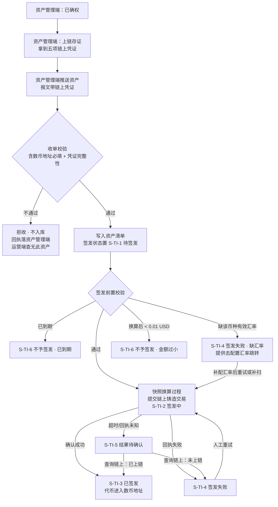
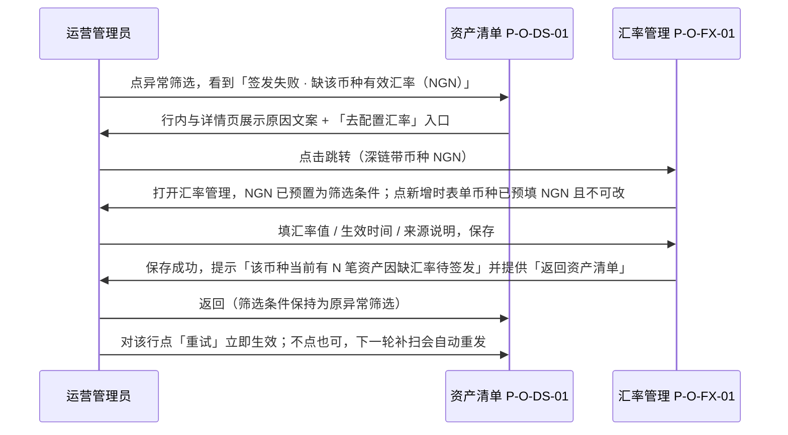
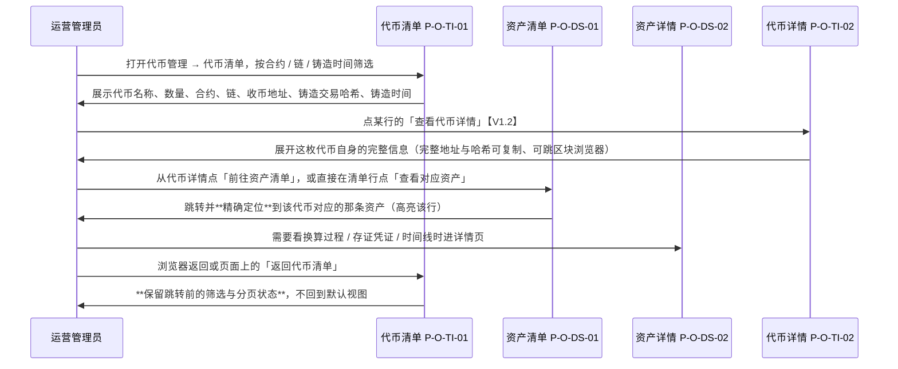

# 资产清单与代币签发 · PRD（主文档）

> 本文件是《资产清单与代币签发 PRD》的主文档，也是本模块的入口文件。
> 包含第 1～7 章：文档信息、背景与目标、对上游简报的修正与本版调整、用户与权限、信息架构、功能清单、流程与状态机。
> 分册见 0.1 导航索引。

---

## 0. 导航索引

### 0.1 分册

| 文件 | 章节 | 内容 |
| --- | --- | --- |
| **本文档** `v1.0-资产清单与代币签发-PRD.md` | 1～7 | 文档信息、背景与目标、对简报 V1.1 的修正与本版调整、用户角色与权限、信息架构与菜单、功能清单、流程与状态机 |
| [`01-模块详情与签发流程.md`](01-模块详情与签发流程.md) | 8～11 | 收单准入与数币地址、资产清单与代币清单、资产详情与代币详情、自动签发与异常处置 |
| [`02-汇率管理与金额换算.md`](02-汇率管理与金额换算.md) | 12～13 | 汇率管理模块详情、金额换算与代币数量规则 |
| [`03-数据字段与非功能需求.md`](03-数据字段与非功能需求.md) | 14～16 | 数据与字段、原因码、非功能需求 |
| [`04-依赖风险与验收标准.md`](04-依赖风险与验收标准.md) | 17～20 | 依赖、风险、验收标准（含反向验收）、入库说明 |

### 0.2 标记约定

| 标记 | 含义 |
| --- | --- |
| **【修正·简报】** | 该条与上游《需求诊断简报 V1.1》的结论不一致，以本 PRD 为准。修正依据见 3.1～3.3 |
| **【V1.1 新增】** | 文档 V1.1 相对首版新增或改写的内容，依据见 3.5 |
| **【V1.2 新增】** | 本版（文档 V1.2）相对 V1.1 新增或改写的内容，依据见 3.6 |
| **【红线】** | 违反即验收不通过，无例外 |
| **【反向】** | 反向验收项，用于确认本期"没有多做" |

> 本 PRD **不存在** `[待确认]` 项。简报 V1.1 第 7 章的 Q-A～Q-G 已全部按需求方 2026-09-10 的裁定落为定值，见第 3 章。

---

## 1. 文档信息

| 项 | 内容 |
| --- | --- |
| 文档名称 | 资产清单与代币签发 PRD |
| 对应需求 | WS-318「金融服务平台-运营端-资产清单」 |
| 所属项目 | 跨境链融 |
| 覆盖端 | 金融服务平台 · **运营端** Web（单端）。**不含金融服务端（面客端），不含资产平台任何页面** |
| 版本 | **V1.2** |
| 编写人 | 许楚清（需求分析师） |
| 上游输入 | ①《资产清单与代币签发 功能边界 需求诊断简报 V1.1》（程功立，WS-318 附件）；② 需求方 2026-09-10 02:38 的 11 条业务定论；③ 需求方 2026-09-10 03:02 的 3 条最终裁定；④ **需求方 2026-09-10 关于数币地址取值维度的裁定：币归公司，取【企业维度】**——即 WS-313 `D-DS-05` 已写明的「取该资产方企业下最初完成企业认证的那位成员绑定的钱包地址」（同日 06:13 曾一度裁定为账号维度，**已被本条覆盖**）；⑤ **需求方 2026-09-10 05:53 原型评审要求「代币管理菜单下应有代币清单」**；⑥ **WS-313《可信数据同步 PRD》**（上链前置链路、钱包地址必填、存证范围）；⑦ **需求方 2026-09-10 要求「代币管理下要有代币详情页」** |
| 依赖文档 | **WS-313《可信数据同步 PRD》V1.3.1**（上链存证与推送链路、收单与资产清单基线、链上凭证字段）、WS-312《代币合约 PRD》（合约只读与配置下发模式）、WS-308『01-国际化基线.md』（时间/金额/链上地址/脱敏基线）、`docs/notification-contract/接入指南.md` 4.2（页面与组件编号登记） |
| 读者 | 设计（原型与交互）、开发（前后端）、测试（验收）、运营（使用方） |

---

## 2. 背景与目标

### 2.1 背景

资产平台的应收账款经"资产方发起 → 资产管理端确权 → **资产管理端上链存证** → 资产管理端推送"进入金融服务平台运营端（WS-313 V1.3.1 已定义至"收单成功、落入资产清单"为止）。**【V1.1 新增】上链是推送的硬前置：未上链的资产推不出来，因此运营端资产清单里的每一条资产都自带一组链上存证凭证**（存证哈希、交易哈希、区块高度、链 ID、存证时间），运营人员可据此到区块浏览器独立核查这笔债权数据没有被改过。**本模块接的是这条链路的下游**：这些已确权资产要按约定规则铸造成代币，代币铸造完成后直接进入该笔应收账款对应的数币地址。

三个事实决定了本模块的形态：

1. **一份资产只签发一次**——资产与代币是 1:1，代币的全部信息可以作为资产记录上的一组属性存在，不需要第二条业务记录。
2. **签发默认自动、无需审核**——正常路径上没有人工操作，页面不是为正常路径而设的，而是为**监控、异常诊断、兜底重试、对外应答**四件事而设的。
3. **运营端不托管代币**——铸造完成即进入资产方数币地址，运营端留下的只是一条结果记录；结果记录归属它所描述的那个对象，也就是资产。

因此本模块采用**合并式**：**资产清单是唯一的业务操作面**，一条记录承载资产本身与它的签发结果。

**【V1.1 新增】** 首版曾写「WS-312 已有的『代币管理 → 智能合约』菜单本期一个字不动」，**该表述本版作废**：需求方在原型评审时要求代币管理菜单下增加一个**代币清单**，其后又明确要求配一个**代币详情页**（【V1.2 新增】）。两者都是**只读视图**——按代币这个视角把已铸造出来的代币列出来、点开看单枚代币自身的完整信息，供对外应答与台账查阅；**一切签发相关的业务操作面仍然只在资产清单**，代币管理菜单下的这两个页面都没有任何写操作入口。合并式主结论不受影响，理由见 IA-03。

同时，"铸造数量 = 应收账款金额换算成美元后 1 美元 = 1 代币"这条硬规则需要一张可人工维护、可追溯的汇率表来支撑，因此本期**新增一个与签发正交的配置模块「汇率管理」**。

### 2.2 本期目标

| # | 目标 | 达成的判断依据 |
| --- | --- | --- |
| G-01 | 已确权资产进入运营端后，在无人干预的情况下自动完成代币签发 | 满足条件的资产从收单到进入「已签发」全程无人工动作 |
| G-02 | 任何一笔"没发出去"的资产，运营人员能在**同一屏**看到结果与原因 | 签发状态、拦截/失败原因、以及诊断该原因所需的资产字段同页可见 |
| G-03 | 铸造数量的得出过程完全可自证 | 详情页可还原「原金额+币种 → 汇率值+生效时间+来源 → 美元金额 → 代币数量 → 被截断部分」整组快照 |
| G-04 | 同一份资产在任何情况下不会被铸造两次 | 见 AC-TI-40【红线】 |
| G-05 | 汇率由运营人员自行维护，且改动不会追溯性地影响已签发记录 | 见第 12 章与 AC-FX-14【红线】 |
| G-06 | 运营端的任何签发动作不对资产管理端产生副作用 | 见 AC-TI-46【反向】 |

### 2.3 本期不做

| # | 不做的事 | 依据 |
| --- | --- | --- |
| N-01 | **不做人工发起签发**，界面不出现「批量签发」「立即签发」等主动签发入口 | 定论 7（默认自动、无需审核）。批量只存在于人工兜底重试，见 7.3 |
| N-02 | **不做签发数量的人工调整**，界面不提供任何代币数量输入框 | 定论 4（不可人工调整） |
| N-03 | **不做代币销毁**——销毁由资产方发起，不在运营端 | 定论 10 |
| N-04 | 不做代币冻结/解冻、质押、赎回、二级市场 | 发起方未确认；按"动作由谁发起，落点就在谁的端"原则，不默认堆进运营端 |
| N-05 | 不做合约的新增/编辑/部署，合约按**已部署存在**处理 | 定论 1；WS-312「零写操作」对合约模块继续有效 |
| N-06 | 不做实时读链的动态数值（总发行量、实时余额） | 沿用 WS-312 决策 3，余额与流水走区块浏览器跳转 |
| N-07 | **不产出任何站内信与邮件**，不申请任何 `biz_type` | 简报 Q-D 默认值，需求方"其他按建议执行" |
| N-08 | **不对资产管理端产生任何调用或写回** | 定论 3（两平台独立，运营端操作不影响资产管理端） |
| N-09 | 不在运营端提供数币地址的人工补录 | 铸错地址不可逆；且第 3 章修正一之后不存在缺地址的在库资产 |
| N-10 | 不做外部行情源实时取价 | 价格波动会让同一资产在不同时刻铸出不同数量，而铸造不可逆、事后无法解释 |

---

## 3. 相对《需求诊断简报 V1.1》的修正与定值

本 PRD 全面采信简报 V1.1 的方案结论（合并式 A′）与已定死的规则。以下三处**与简报 V1.1 不一致，以本 PRD 为准**。

### 3.1 【修正·简报】修正一：数币地址缺失即拒收，不保留重推补齐路径

| 项 | 简报 V1.1 的写法 | **本 PRD 的口径** |
| --- | --- | --- |
| 字段定性 | 沿用 WS-313 D-DS-05：选填，缺失不阻断推送 | **必填**。收单环节即校验，缺失或格式非法**直接拒收**，该条资产**根本进不来资产清单** |
| 缺地址资产的落点 | 简报 5.2：落独立状态 **S-7「待补充数币地址」** | **S-7 状态取消，从状态机中移除。** 签发状态机由 7 态收敛为 **6 态** |
| 补齐路径 | 简报 5.3 / Q-A：建议"幂等命中时允许刷新数币地址字段" | **不采纳。** 运营端的幂等规则维持 WS-313 8.2 原文不改（不新增、不更新已有记录）——因为收单失败的资产**不入库**，资产方补齐地址后由资产端重推时不会撞上幂等，会正常入库并带上地址。补齐路径天然成立，不需要动幂等 |
| 连带处理 | — | ① WS-313 `D-DS-05` / `V-DS-05` 及其连带条款需同步修订——**该修订说明已交付并被 WS-313 V1.3 吸收，两边现已一致，本 PRD 不重复**；② 存量脏数据口径见 3.4（定义已合并到 WS-313 `DEP-DS-07`）；③ 防御性兜底见 11.6 |

**依据**：需求方 2026-09-10 03:02 第 1 条「数币地址缺失时不应推送成功，这条不保留重推路径」。

### 3.2 【修正·简报】修正二：新增一级菜单「汇率管理」

| 项 | 简报 V1.1 的写法 | **本 PRD 的口径** |
| --- | --- | --- |
| 汇率来源 | 简报 4.1 推荐选项乙：运营端**系统配置**汇率表，随配置下发，页面只读 | **升格为独立功能模块**：新增一级菜单「汇率管理」，运营人员在页面上人工增删改，带生效时间、启用/停用与历史版本 |
| 新增导航项 | 简报 3.4 / 6.1：**0 个** | **1 个（汇率管理）** |
| 缺汇率的处置 | 简报 2.2 仅将"缺该币种汇率"列为失败原因之一，未定义状态与动线 | **「缺该币种有效汇率」是一条独立的签发拦截原因**，有明确的状态落点、页面提示文案，以及"从提示跳到汇率管理补配置"的完整动线（见 7.5） |
| 方案选型 | 合并式 A′ | **不变。** 汇率管理是与签发正交的**配置模块**，它的加入不改变"资产清单是唯一业务操作面"这一主结论 |

简报已定的换算硬规则**保留不变**：保留 2 位小数、向下截断、截断部分显式展示、换算后 < 0.01 USD 不予签发、签发时把换算过程整组快照并在详情页展示（见第 13 章）。

**依据**：需求方 2026-09-10 03:02 第 2 条。

### 3.3 修正三：简报 Q-C～Q-G 全部落为定值，不再保留待确认

需求方 2026-09-10 03:02 第 3 条「其他按照建议执行」。以下五条按简报默认值写死：

| 简报编号 | 问题 | **本 PRD 的定值** | 落点 |
| --- | --- | --- | --- |
| Q-C | 自动签发触发时机 | **收单成功即触发 + 定时补扫兜底**，补扫周期 10 分钟 | 11.1 / 11.2 |
| Q-D | 是否发站内信 | **不做。** 不申请 `biz_type`，靠汇总条 + 异常筛选覆盖 | N-07 / AC-TI-47【反向】 |
| Q-E | 到期日当天是否可签发 | **可以。** 判定为 `当前 UTC 日期 ≤ 到期日`，页面按账户时区渲染并带时区标注 | 11.3 |
| Q-F | 合约 `decimals` 是否 ≥ 2 | **按 ≥ 2 撰写。** 若开发确认为 0，仅第 13 章「保留位数」一行改为"取整到整数、向下截断"，页面结构与其余规则均不变。这是技术输入，不阻塞设计与开发启动 | 13.2 / R-TI-05 |
| Q-G | 重试是否限次 | **不限次，每次留痕**，详情页与列表展示重试次数 | 11.4 |

简报 Q-A 已由 3.1 关闭（不采纳），Q-B 已由 3.2 关闭（升格为汇率管理模块）。

### 3.4 存量脏数据口径（**【V1.1 修订】定义已合并到 WS-313，本节只保留引用与本模块的不变量**）

修正一把"缺地址"从一种运行时状态变成了一条准入校验，因此必须回答：**修订生效之前可能已经入库的、没有数币地址的资产怎么办。**

首版在本节写过一整套一次性数据体检流程。**WS-313 V1.3 已把同一件事吸收为它自己的 `DEP-DS-07`（上线前的一次性存量数据体检）、`R-DS-11`（存量无地址记录靠重推补不上）与 `AC-DS-78`（体检后无地址记录数为 0）。** 同一个清理动作在两份 PRD 里各写一遍，日后必然漂移，因此本版**删除本模块的重复定义，改为单一引用**：

| 项 | 口径 |
| --- | --- |
| **定义方（唯一）** | **WS-313 `DEP-DS-07`**——导出全部无地址记录 → 交资产方在资产平台补齐 → 由资产管理端重推（走修订后的校验，仍缺地址的直接拒收）→ 确认无地址记录归零。执行位置、为什么不能靠重推自愈、为什么不放宽幂等、为什么不加补录入口，全部见 WS-313 `DEP-DS-07` / `R-DS-11`，**本 PRD 不复述** |
| 本模块的依赖 | 该体检是**本模块的上线前置条件**：体检未完成，本模块不上线。见 `DEP-TI-02` |
| **本模块的不变量** | 资产清单中**不存在**数币地址为空或非 `0x` + 40 位十六进制的记录。这一条是本模块自己要守的，保留在本 PRD，见 `AC-TI-44`【红线】。它与 WS-313 `AC-DS-78` 是同一事实从两侧各验一次，不是两套定义 |
| 未清理的兜底 | 不作为产品路径，仅作防御：签发前置校验会再查一次地址，命中即落 `S-TI-6 不予签发 · 数币地址缺失` 并记服务日志告警，不自动重试、不提供页面补录入口。见 11.6 |

### 3.5 【V1.1】V1.1 相对首版（commit `8127653`）的四处调整

| # | 调整 | 依据 | 落点 |
| --- | --- | --- | --- |
| ① | **`R-TI-01` 关闭：数币地址取【企业维度】——币归公司。** 取值规则**不在本 PRD 另写措辞**，直接引用 WS-313 已入库的 `D-DS-05` 原文：「取该资产方企业下最初完成企业认证的那位成员绑定的钱包地址」。对本模块的实质含义是：**同一企业的所有资产，铸出来的代币都进同一个地址**；运营端仍然是拿到哪个用哪个，不解析、不查表。**注意**：同日 06:13 曾裁定为「账号维度」，需求方随后改判为企业维度，**以企业维度为准**；本 PRD 不保留账号维度的任何表述 | 需求方 2026-09-10「币归公司，按认证企业的那个账号的钱包地址」 | 8.1 / 10.3 / 11.3 / 14.1a / `DEP-TI-06` / `R-TI-01` |
| ② | **补进 WS-313 V1.3.1 的上链前置链路。** 资产在推送前必须已完成上链存证，报文带五项链上凭证；本模块据此在资产详情页增加**链上存证凭证**的展示与区块浏览器核查入口，并明确它与本模块**铸造交易凭证**是两笔不同的链上交易 | WS-313 V1.3.1（`D-DS-20`～`D-DS-24`、`D-DS-36`、`F-DS-22`、`AC-DS-71`） | 2.1 / 8.5 / 10.1 / 10.5 / 14.0 / `AC-TI-59`～`AC-TI-62` |
| ③ | **新增代币清单（`P-O-TI-01`），只读。** 首版「代币管理菜单一个字不动」的表述作废；边界写死在 IA-03 与 `F-TI-19`【反向】 | 需求方 2026-09-10 05:53 原型评审 | 2.1 / 5.1 / 5.2 / IA-03 / 6.1 / 7.6 / 9.6～9.9 / `AC-TI-54`～`AC-TI-58` |
| ④ | **「上线前置一次性数据体检」去重。** 该定义已由 WS-313 `DEP-DS-07` 承担，本 PRD 删除重复定义、改为引用 | 避免两份定义漂移 | 3.4 / 11.6 / `DEP-TI-02` |

> **不在本版调整范围内**：方案选型（仍是合并式 A′）、6 态签发状态机、汇率管理的全部口径、换算规则、`S-TI-4` 承载缺汇率的处置方式——这些均未改动。
> **WS-313「存证范围不含钱包地址」对本模块无影响**：那是资产平台侧计算存证哈希时的取值范围，属后端口径；本模块既不计算存证、也不展示"某字段是否参与存证"，因此无需落地任何内容。


### 3.6 【V1.2 新增】本版相对 V1.1（commit `00c33b4`）的调整

**本版只改一件事及其连带项**：新增代币详情页。范围之外一律未动。

| # | 调整 | 依据 | 落点 |
| --- | --- | --- | --- |
| ① | **新增代币详情页 `P-O-TI-02`（只读）。** 入口是「代币管理 → 代币清单 → 查看代币详情」，是它的唯一入口。页面只讲**代币自身**：名称、数量、合约、链、收币地址、铸造交易哈希、铸造时间、本笔铸造的链上结果 | 需求方 2026-09-10 要求代币管理下要有代币详情页 | 2.1 / 5.1 / 5.2 / IA-03 / 6.1 `F-TI-21` / 7.6 / 分册一 10.6～10.8 / `AC-TI-63`～`AC-TI-68` |
| ② | **`AC-TI-58` 改写：只作废「也不存在代币详情页」这半句**，**「代币管理下不存在任何写操作入口」这条边界保留且范围扩大**——现在它同时约束代币清单与代币详情两个页面。整条验收项不删 | 同上 | 分册四 19.5 |
| ③ | **划清代币详情与资产详情的职责边界。** 应收金额、贸易背景、确权信息等**资产属性一条都不放**在代币详情页，签发过程（状态、拦截原因、重试次数、时间线）同样不放；要看这些走「前往资产清单」定位对应资产、再进资产详情。**跳转仍是单向的**，逐层返回时代币清单的筛选与分页必须保留 | 避免代币详情变成资产详情的第二个副本、两边口径漂移 | 分册一 10.6 / 10.8 / `T-04` / `T-06` |
| ④ | **限定词红线在单一凭证场景下的适用性写死。** **本 PRD 裁定：代币详情页只有铸造凭证，不出现链上存证凭证**（存证凭证描述的是债权数据没被改过，是资产属性，按 ③ 的边界不属于这一页）。**即便本页只有一组凭证，`AC-TI-60` 的限定词规则仍然适用**——该字段必须写「铸造交易哈希」，不得因为没有第二个哈希就退回裸称「交易哈希」。限定词是**全局词汇约定**，不是同页有歧义才加的局部消歧手段 | 运营人员在多个页面间切换，同一个词在不同页面指不同交易才是最危险的 | 分册一 10.5 `B-02` / 10.7 / `AC-TI-60` / `AC-TI-66` |
| ⑤ | **编号与登记**：申请 `P-O-TI-02`；入库时补 `docs/notification-contract/接入指南.md` 4.2，并更正 `financial-service-platform/README.md` 模块清单里「改动仅限新增只读的代币清单」那句 | 该 README 自己的维护规则要求改 PRD 时一并核对 | 5.2 / 分册四第 20 章 |
| ⑥ | **代币清单与代币详情上新增三样东西：代币编号、代币 logo、代币的两根状态轴。** 代币编号定为**业务编号**（`TK`+日期+序列，与来源资产 ID 严格 1:1，**不是链上 tokenId、不得用作判重依据**）；logo 按**平台配置下发 + 首字母块兜底**，运营端不做管理入口；状态拆成**代币状态**（有效/失效/已销毁，**失效＝对应应收账款已过到期日**）与**融资质押状态**（未质押/已质押，**本期恒为未质押、属预留展示**）**两根独立的轴** | 需求方 2026-09-10 提出三个字段并定下状态口径 | 6.1 `F-TI-22`～`F-TI-24` / 分册一 9.7 / 9.10～9.12 / 10.6～10.8 / 分册三 14.1 / 14.2a / `AC-TI-69`～`AC-TI-78` |

> **不在本版调整范围内**：方案选型（仍是合并式 A′）、**6 态签发状态机（未改动，代币状态是另一根轴，不是它的扩展）**、汇率管理与换算规则、数币地址的企业维度口径、上链存证凭证的处理——这些均未改动。
> **只读边界与合并式主结论均未松动**：代币详情页多的是「把一行展开成一页」，不是多了一种能力；代币管理菜单下两个页面加起来，仍然一个写操作都没有。

> **背景澄清（不影响规格，仅记录来由）**：更早的一版由其他团队产出的原型里本来就画了代币详情页，是本 PRD 首版明确定为不做（原 `TL-01`）。现在需求方明确要，以需求方为准，PRD 补上——**顺序是先改 PRD 再画原型**，不是反过来。

---

## 4. 用户、角色与权限

### 4.1 角色

| 角色 | 所在端 | 在本模块中的诉求 |
| --- | --- | --- |
| **运营管理员** | 金融服务平台运营端 | 本模块唯一的人类使用者。承担 J-1 监控、J-2 异常处理、J-3 兜底重试、J-4 对外应答四项职责；并维护汇率表 |
| **系统（自动签发）** | 运营端服务 | 正常路径的实际执行者：收单成功即判定条件、触发铸造、跟踪链上回执、落状态 |
| 资产方 | 资产平台 / 金融服务端 | **不在本端操作**。代币铸造完成后直接进入其数币地址；对签发结果有知情诉求，本期通过运营人员的 J-4 对外应答满足，不做面客页面 |
| 资产管理端操作员 | 资产平台资产管理端 | **不在本端操作**。仅作为上游推送方出现；本模块不对其发起任何调用 |

### 4.2 运营人员的四项真实职责

| # | 职责 | 触发时机 | 他此刻在找什么 | 本 PRD 的支撑功能 |
| --- | --- | --- | --- | --- |
| J-1 | **监控** | 每天例行 | 今天进来多少资产、自动签了多少、失败几笔 | F-TI-03 签发概况汇总条 |
| J-2 | **异常处理** | 出现失败或拦截 | **"这份资产为什么没发出去"** | F-TI-01 状态列、F-TI-04 异常筛选、F-TI-12 原因展示与跳转 |
| J-3 | **兜底重试** | 确认未上链之后 | 哪几笔可以重试，选中重试 | F-TI-05 链上状态查询、F-TI-06 人工重试 |
| J-4 | **对外应答** | 资产方或内部问询 | 这笔资产发了没、数量多少、哈希是什么 | F-TI-08 代币与链上凭证、F-TI-09 换算过程、F-TI-11 签发时间线 |

> **J-2 是本模块存在的主要理由，它决定了信息架构。** 详见 7.4。

### 4.3 权限点

| 编号 | 权限点 | 授予范围 | 说明 |
| --- | --- | --- | --- |
| PM-TI-01 | `asset_inventory.view` | 运营管理员 | **沿用 WS-313 已有权限点**，不新增。资产清单与详情的查看权 |
| PM-TI-02 | `asset_inventory.issue_retry` | 运营管理员 | **新增**。人工重试（单条 / 批量）与链上状态查询两个签发运维动作。无此权限时按钮不渲染 |
| PM-FX-01 | `fx_rate.view` | 运营管理员 | **新增**。汇率管理列表与历史版本的查看权 |
| PM-FX-02 | `fx_rate.manage` | 运营管理员 | **新增**。汇率版本的新增、编辑（仅未生效版本）、启用/停用。无此权限时页面为只读态 |

**不新增独立的 token 权限族**——本模块没有独立的代币对象，签发结果是资产的属性。见 AC-TI-48【反向】。

### 4.4 用户故事

| 编号 | 角色 | 故事 | 对应功能 |
| --- | --- | --- | --- |
| US-01 | 运营管理员 | 作为运营管理员，我希望每天打开资产清单就能看到"今天进来多少、签了多少、几笔要我管"，这样我不用逐页翻 | F-TI-03 |
| US-02 | 运营管理员 | 作为运营管理员，我希望一键筛出所有需要我介入的资产，这样我知道今天的工作量边界在哪 | F-TI-04 |
| US-03 | 运营管理员 | 作为运营管理员，当一笔资产没签出去时，我希望在同一屏就看到原因和判断原因所需的资产字段，而不是跨菜单找 | F-TI-01 / F-TI-12 |
| US-04 | 运营管理员 | 作为运营管理员，当失败原因是"缺该币种汇率"时，我希望能从提示直接跳到汇率管理把汇率补上，回来就能让它发出去 | F-TI-12 / F-FX-02 / 7.5 |
| US-05 | 运营管理员 | 作为运营管理员，当链上超时、结果未知时，我希望系统**拦着我别乱点重试**，先查清链上到底有没有这笔交易 | F-TI-05 / 7.2【红线】 |
| US-06 | 运营管理员 | 作为运营管理员，我希望能一次勾选多笔失败资产重试，并且一笔失败不影响其他笔 | F-TI-06 |
| US-07 | 运营管理员 | 作为运营管理员，当资产方问"我这笔怎么只到了 1234.56 个币"时，我希望详情页能一屏还原整个换算过程，包括被截掉的那部分 | F-TI-09 |
| US-08 | 运营管理员 | 作为运营管理员，我希望自己就能维护汇率表，而不是每次都提工单等研发改配置 | F-FX-01～F-FX-05 |
| US-09 | 运营管理员 | 作为运营管理员，我希望改汇率时能预约生效时间，并且**不会把已经发出去的记录改掉** | F-FX-03 / F-FX-08 |
| US-10 | 运营管理员 | 作为运营管理员，我希望能查到"上个月那笔用的是哪个版本的汇率、谁配的、什么时候生效的" | F-FX-06 / F-FX-07 |

### 4.5 典型场景

| 编号 | 场景 | 走向 |
| --- | --- | --- |
| SC-01 | **正常路径（无人参与）** | 资产收单成功 → 未到期、地址齐备、该币种有有效汇率 → 自动触发铸造 → 链上确认 → 代币进入数币地址 → 状态「已签发」。运营人员次日在汇总条看到笔数 +1，不需要任何动作 |
| SC-02 | **缺汇率被拦截** | 一笔 NGN 资产收单成功，但汇率表里 NGN 无有效版本 → 签发前置校验不通过 → 落「签发失败 · 缺该币种有效汇率」→ 运营人员在异常筛选中看到 → 点「去配置汇率」跳到汇率管理 → 新增 NGN 汇率并立即生效 → 返回资产行点「重试」（或等 10 分钟补扫自动重发）→ 签发成功 |
| SC-03 | **链上超时** | 交易已提交但回执超时 → 落「结果待确认」→ 该行**没有重试按钮**，只有「查询链上状态」→ 查得未上链 → 转「签发失败」，此时才出现重试按钮 → 重试成功 |
| SC-04 | **已到期** | 资产在 S-TI-1 停留期间到期 → 转「不予签发 · 应收账款已到期」（终态），不再自动触发，也不提供重试 |
| SC-05 | **极小额** | 一笔 NGN 资产换算后为 0.004 USD → 代币数量为 0 → 落「不予签发 · 换算后金额小于 0.01 USD」（终态），详情页展示完整换算过程与截断值 |
| SC-06 | **地址不合格的资产根本不出现** | 资产方未绑定数币地址 → 资产管理端推送时该条被剔除、无法提交；即便绕过前端，运营端收单也直接拒收，运营端**任何页面查不到这条资产**。运营人员对此无感知，处置发生在资产平台侧 |
| SC-07 | **对外应答** | 资产方问询某笔资产 → 运营人员按来源资产 ID 检索 → 一次命中，详情页给出签发状态、代币数量、合约、链、交易哈希、实际收币地址、换算过程与时间线 |

---

## 5. 信息架构与菜单

### 5.1 菜单结构（**新增一级导航项 1 个；另在既有的代币管理菜单下新增 2 个只读页：代币清单【V1.1】与代币详情【V1.2】**）

```text
金融服务平台 · 运营端 (/ops)
├─ 总览                     P-O06         （已有）【本模块新增：当日签发概况摘要卡片，服务 J-1】
├─ 资产清单                 P-O-DS-01     （WS-313 已有）★ 本模块唯一的业务操作面
│   └─ 资产详情             P-O-DS-02     （WS-313 已有）
│        └─ 本模块新增三个区块：代币与铸造凭证 / 换算过程 / 签发时间线
│           （另有 WS-313 已定义的「链上存证凭证区」，两者是两笔不同的链上交易，见 10.5）
├─ 汇率管理  FX Rates       P-O-FX-01     ★★ 本期新增的唯一一级导航项
│   └─ 汇率历史版本         P-O-FX-02
├─ 代币管理  Token Management              （WS-312 已有的一级菜单，本模块在其下新增一个子页）
│   ├─ 智能合约  Smart Contracts            （WS-312 已有，只读，**本模块一个字不动**）
│   └─ 代币清单  Token List   P-O-TI-01     ★★【V1.1 新增】只读视图，无任何写操作入口
│        └─ 代币详情  Token Detail  P-O-TI-02  ★★【V1.2 新增】同样只读，入口只有代币清单
├─ 协议管理                 P-O-AG-01     （已有）
└─ 账户设置 / 消息通知                      （壳层既有）
```

**三条信息架构决策：**

| # | 决策 | 理由 |
| --- | --- | --- |
| IA-01 | **资产清单与资产详情不新建页面编号**，沿用 WS-313 已登记的 `P-O-DS-01` / `P-O-DS-02`；本模块在这两个页面上新增的是列、筛选项、汇总条与详情区块 | `docs/notification-contract/接入指南.md` 4.2 的唯一性规则是"一个编号在全平台只对应一个页面"。资产清单只有一个，给它第二个编号会让 `page_target` 跳转出现两种写法。**【V1.1 修订】首版据此写过「`TI` 只挂组件子段、不挂页面子段」，本版作废**——代币清单是一个全新的、此前不存在的页面，它按规则应当申请自己的编号 `P-O-TI-01`。IA-01 的约束仅适用于「已存在的页面不重复取号」，不适用于新页面 |
| IA-02 | 汇率管理放**一级菜单**，与代币管理平级，不挂在资产清单下 | 汇率是与签发正交的平台级配置：它按币种维护、生命周期独立于任何一笔资产、被所有资产共享。挂在资产清单下会暗示"某笔资产的汇率"，与"一张全局汇率表"的语义相反 |
| **IA-03【V1.1 新增，V1.2 扩充】** | **代币清单及其下的代币详情页都挂在既有的「代币管理」一级菜单下，且都是纯只读视图**；不新增一级导航项，也不承载任何签发动作 | ① 它按代币视角组织，与同菜单下的「智能合约」同属代币域，挂这里语义自洽，不必为它多开一级菜单；② **它不推翻合并式主结论**——合并式解决的是"签发结果该归谁"（归资产），代币清单不改变归属，它只是同一份数据的第二个只读切面；③ 判断边界很清楚：**凡是会改变资产或签发状态的动作（触发、重试、查询链上状态、改汇率）一律只在资产清单侧**，代币清单与代币详情只有查看与跳转。见 F-TI-19【反向】。**【V1.2】代币详情页的加入不改变这条判断**：它多的是「把一行展开成一页」，不是多了一种能力——两页放在一起，仍然一个写操作都没有 |

### 5.2 页面、组件与模块字母登记

入库时须同步补登进 `docs/notification-contract/接入指南.md` 4.2 登记表。

| 类别 | 编号 | 名称 | 说明 |
| --- | --- | --- | --- |
| 模块字母 | **`TI`** | Token Issuance（WS-318 代币签发） | 运营端子段 `P-O-TI-xx` / `C-O-TI-xx`。**【V1.1 修订】** 首版登记为「只挂组件子段、不挂页面子段」，V1.1 因新增代币清单页面而改为两者都挂；**【V1.2】页面子段扩到 `P-O-TI-01`～`P-O-TI-02`** |
| 模块字母 | **`FX`** | FX Rate（WS-318 汇率管理） | 运营端子段 `P-O-FX-xx` / `C-O-FX-xx` |
| 页面 | **`P-O-TI-01`** | **代币清单** | **【V1.1 新增】** 挂在代币管理菜单下，只读 |
| 页面 | **`P-O-TI-02`** | **代币详情** | **【V1.2 新增】** 入口只有代币清单，只读 |
| 页面 | `P-O-FX-01` | 汇率管理列表 | 新增 |
| 页面 | `P-O-FX-02` | 汇率历史版本 | 新增，支持按币种深链 |
| 页面 | `P-O-DS-01` | 资产清单 | **复用 WS-313**，本模块扩展列/筛选/汇总 |
| 页面 | `P-O-DS-02` | 资产详情 | **复用 WS-313**，本模块新增三个区块 |
| 组件 | `C-O-TI-01` | 签发概况汇总条 | 资产清单顶部 |
| 组件 | `C-O-TI-02` | 批量重试确认弹层 | 含影响面提示 |
| 组件 | `C-O-TI-03` | 逐条重试结果面板 | 沿用 WS-313 F-DS-06 的回执模型 |
| 组件 | `C-O-TI-04` | 链上状态查询结果弹层 | S-TI-5 唯一可做的动作的承载体 |
| 组件 | `C-O-FX-01` | 汇率新增 / 编辑表单弹层 | — |
| 组件 | `C-O-FX-02` | 停用二次确认弹层 | 含影响面提示 |

> 编号段位说明：本模块采用带模块字母的运营端子段，与 WS-310 `AG`、WS-312 `TC`、WS-313 `DS` 同一手法；**主动避开 `P-O40` / `C-O40` 起的数字十位段与 WS-305 待批的 `P-M4x` 段位**。

---

## 6. 功能清单

### 6.1 资产清单与代币签发（`TI`）

**资产清单列表页（P-O-DS-01）**

| 编号 | 功能 | 说明 | 验收 |
| --- | --- | --- | --- |
| F-TI-01 | 签发状态列 | 值域为 `S-TI-1`～`S-TI-6`（7.2），并作为主要筛选维度。**与 WS-313 的"同步状态"是两个独立字段、两根轴，互不写** | AC-TI-01 |
| F-TI-02 | 代币数量列 | 已签发资产展示铸造数量；未签发展示 `—`，不展示预估值 | AC-TI-02 |
| F-TI-03 | 签发概况汇总条（`C-O-TI-01`） | 服务 J-1：当期各状态笔数（已签发 / 待签发 / 签发中 / 签发失败 / 结果待确认 / 不予签发）。**金额类汇总仍按币种分组，不跨币种求和**（沿用 WS-313 CU-01～CU-05） | AC-TI-03 |
| F-TI-04 | 异常筛选快捷入口 | 一键筛出 `S-TI-4 签发失败` + `S-TI-5 结果待确认` 两类需人工介入的资产，服务 J-2 | AC-TI-04 |
| F-TI-05 | 链上状态查询 | 对 `S-TI-5` 资产提供「查询链上状态」动作。**这是 S-TI-5 唯一可做的动作** | AC-TI-05 / AC-TI-42 |
| F-TI-06 | 人工重试（单条 / 批量） | **仅对 `S-TI-4` 开放**；批量为 **N 笔独立交易**，逐条独立成败、部分成功不整体回滚 | AC-TI-06～09 |
| F-TI-07 | 【反向】无「批量签发」入口 | 默认路径为自动逐笔，界面不得出现任何主动发起签发的按钮 | AC-TI-45【反向】 |

**资产详情页（P-O-DS-02，在 WS-313 已有字段基础上新增三个区块）**

| 编号 | 功能 | 说明 | 验收 |
| --- | --- | --- | --- |
| F-TI-08 | 代币与链上凭证区块 | 铸造数量、所属合约（默认应收账款铸币合约）、链、交易哈希、区块浏览器跳转、**实际收币地址**。展示口径整段引用 WS-308『01-国际化基线.md』第 5/6/8 节，本模块不另定义 | AC-TI-13～14 |
| F-TI-09 | **换算过程区块** | 原金额 + 币种 → 汇率值 + 生效时间 + 来源 → 美元金额 → 代币数量 → **被截断部分**。**这是本模块可追溯性的核心** | AC-TI-15～17 |
| F-TI-10 | 数币地址区块 | 展示推送来的数币地址（脱敏缩略 + 可复制取完整值）；已签发后与链上实际收币地址并列展示，便于事后核对 | AC-TI-18 |
| F-TI-11 | 签发时间线 | 只增不改、按时间正序：收单 → 触发 → 提交 → 确认 / 失败 / 超时 → 查询链上 → 重试。形态沿用 WS-313 8.3「同步链路时间线」 | AC-TI-19～20 |
| F-TI-12 | 拦截原因展示与跳转 | 列表行与详情页展示具体原因码文案；**「缺该币种有效汇率」附带「去配置汇率」跳转** | AC-TI-21～23 / AC-FX-13 |

**平台能力**

| 编号 | 功能 | 说明 | 验收 |
| --- | --- | --- | --- |
| F-TI-13 | 自动签发触发 | 收单成功即触发 + 每 10 分钟定时补扫兜底 | AC-TI-24～26 |
| F-TI-14 | 【红线】防超发唯一约束 | 「来源资产 ID」唯一，一份资产至多一条成功签发记录 | AC-TI-40【红线】 |
| F-TI-15 | 【反向】不回写资产端 | 运营端的任何签发动作**不产生对资产管理端的任何调用** | AC-TI-46【反向】 |
| F-TI-16 | 【红线】数币地址收单必填校验 | 缺失或格式非法即拒收，不入库；地址按**企业维度**取值，规则见 WS-313 `D-DS-05`（3.5 ①） | AC-TI-43～44【红线】 |
| **F-TI-20**【V1.1 新增】 | 链上存证凭证的展示与核查 | 资产详情页展示 WS-313 随报文带来的五项凭证，交易哈希可跳区块浏览器；**运营端只存储、展示与跳转，不调链、不比对哈希** | AC-TI-59～62 |

**代币清单（`P-O-TI-01`）【V1.1 新增】**

| 编号 | 功能 | 说明 | 验收 |
| --- | --- | --- | --- |
| F-TI-17 | 代币清单列表 | **只展示已铸造成功的代币**（对应 `S-TI-3` 的资产）：代币名称、数量、所属合约、链、收币地址、铸造交易哈希、铸造时间。支持筛选与分页 | AC-TI-54～55 |
| F-TI-18 | 「查看对应资产」跳转 | 每行提供入口，跳到资产清单并**精确定位**到该代币对应的那条资产；从资产侧返回时**保留代币清单的筛选与分页状态** | AC-TI-56～57 |
| F-TI-19 | 【反向】代币清单与代币详情只读 | **两个页面上都不存在**任何写操作入口：无签发、无重试、无查询链上状态、无编辑、无删除、无导出。签发相关的业务操作面**只在资产清单**。**【V1.2】范围由代币清单扩为代币管理菜单下的全部页面** | AC-TI-58【反向】 |
| **F-TI-22**【V1.2 新增】 | 代币编号（`D-TI-21`） | 铸造成功时生成的业务编号，与来源资产 ID 严格 1:1；代币清单独立一列并作为检索键，代币详情概览区可复制。**不是链上 tokenId，且不得用作任何判重依据** | AC-TI-69～70 |
| **F-TI-23**【V1.2 新增】 | 代币 logo（`D-TI-23`） | 按平台下发的「合约标识 → logo」映射展示，缺失走首字母块兜底；清单 24×24、详情 48×48，不可点击。**运营端不做上传/替换/裁剪** | AC-TI-71～73 |
| **F-TI-24**【V1.2 新增】 | 代币状态与融资质押状态（`D-TI-22` / `D-TI-24`） | **两根独立的轴**：代币状态（有效/失效/已销毁，失效＝对应应收账款已过到期日，系统按日判定，可筛选）与融资质押状态（未质押/已质押，本期恒为未质押，不做筛选）。两页均展示，**均只读** | AC-TI-74～78 |
| **F-TI-21**【V1.2 新增】 | 代币详情页（`P-O-TI-02`） | 从代币清单某行「查看代币详情」进入，只读展示这枚代币自身：名称、数量、合约、链、收币地址、**铸造**交易哈希、铸造时间、本笔铸造的链上结果。**资产属性与签发过程一律不在这一页**，走「前往资产清单」再进资产详情。规格见分册一 10.6～10.8 | AC-TI-63～68 |

### 6.2 汇率管理（`FX`）

| 编号 | 功能 | 说明 | 验收 |
| --- | --- | --- | --- |
| F-FX-01 | 汇率列表 | 按币种展示当前生效版本、下一个待生效版本、启用状态、最近修改人与时间 | AC-FX-01～03 |
| F-FX-02 | 新增汇率版本 | 选择币种 + 填写汇率值 + 生效时间 + 来源说明；支持从资产清单深链带入币种 | AC-FX-04～07 |
| F-FX-03 | 编辑汇率版本 | **只允许编辑尚未生效的版本**；已生效版本不可编辑 | AC-FX-08～09 |
| F-FX-04 | 启用 / 停用 | 停用后该币种进入"无有效汇率"，二次确认时展示影响面 | AC-FX-10～12 |
| F-FX-05 | 删除待生效版本 | **仅**未生效版本可删除；已生效版本永不可删 | AC-FX-09 |
| F-FX-06 | 历史版本可追溯 | 同币种全部版本按生效时间倒序，含操作人、操作时间、变更前后值；只增不改 | AC-FX-15～17 |
| F-FX-07 | 操作留痕 | 新增 / 编辑 / 启用 / 停用 / 删除全部留痕，不可编辑不可删除 | AC-FX-16 |
| F-FX-08 | 【红线】改动不影响已签发记录 | 汇率的任何改动只对**之后**的签发生效；已签发记录的换算快照永不重算 | AC-FX-14【红线】 |
| F-FX-09 | USD 内置只读行 | USD → USD 恒为 `1.000000`，系统内置，不可编辑、不可停用、不可删除 | AC-FX-18 |

---

## 7. 流程与状态机

### 7.1 端到端主流程

> **【V1.1 新增】** 图中前两步为 WS-313 V1.3.1 定义的上游链路，本模块不实现、只消费其结果；**未上链的资产推不到运营端**，因此进入资产清单的每一条都带齐五项链上存证凭证。



### 7.2 签发状态机（**6 态**，本模块自有，不回写资产端）

【修正·简报】相对简报 3.2 的 7 态，**移除 S-7「待补充数币地址」**（该状态在"缺地址即拒收"之下不可达），其余 6 态编号与语义不变。

| 编号 | 状态 | 含义 | 可做的动作 | 终态 |
| --- | --- | --- | --- | --- |
| S-TI-1 | 待签发 | 已收单，等待自动触发 | 无（正常应停留极短，最长不超过一个补扫周期） | 否 |
| S-TI-2 | 签发中 | 链上交易已提交，等待确认 | 无 | 否 |
| S-TI-3 | 已签发 | 链上确认成功，代币已进入数币地址 | 查看凭证 | **是** |
| S-TI-4 | 签发失败 | 明确失败：**前置校验不通过**（缺汇率）**或链上回执失败** | **允许人工重试**（补配汇率后可自动补扫，见 11.2） | 否 |
| S-TI-5 | 结果待确认 | 超时或回执未知 | **禁止直接重试**；只能「查询链上状态」 | 否 |
| S-TI-6 | 不予签发 | 已到期 / 换算后 < 0.01 USD / （防御）数币地址缺失 | 无 | **是** |

```text
收单成功（数币地址已在收单环节校验通过）
   └─ 写入清单 ─────────────────→ S-TI-1 待签发
S-TI-1 ──(已到期 | 换算后 < 0.01 USD)──→ S-TI-6 不予签发（终态）
S-TI-1 ──(缺该币种有效汇率)──────────→ S-TI-4 签发失败
S-TI-1 ──(前置校验通过，自动触发)────→ S-TI-2 签发中
S-TI-2 ──(链上确认成功)──────────────→ S-TI-3 已签发（终态）
S-TI-2 ──(链上回执失败)──────────────→ S-TI-4 签发失败
S-TI-2 ──(超时 / 回执未知)───────────→ S-TI-5 结果待确认
S-TI-4 ──(人工重试 | 校验类失败被补扫)→ S-TI-2 签发中
S-TI-5 ──(查询链上：已上链)──────────→ S-TI-3 已签发（终态）
S-TI-5 ──(查询链上：未上链)──────────→ S-TI-4 签发失败（此时才开放重试）
```

**【红线】`S-TI-5 → S-TI-2` 这条边不存在。** 超时后不查链上状态就重试等于超发。界面上 `S-TI-5` 的行**不渲染重试按钮**，服务端对 `S-TI-5` 的重试请求一律拒绝，绕过前端也不行。反向验收见 AC-TI-42。

**【红线】终态不可逆。** `S-TI-3` 与 `S-TI-6` 不存在任何出边，界面与接口均不提供把终态资产改回其他状态的手段。

**防超发幂等**：1:1 之下最直接——「来源资产 ID」唯一，一份资产至多一条成功签发记录。合并式下这个约束就是资产记录本身，天然成立。

**与 WS-313 同步状态的关系**：同步状态（WS-313 D-DS-31，运营端内恒为「已推送」）与签发状态（本模块 D-TI-01）是**两根轴、两个字段、互不写**，与 WS-313 处理 D-DS-40 与 WS-305 D-15 的方式同构。本模块**不修改、不覆盖**同步状态字段。

**【V1.2】与代币侧两根状态轴的关系**：本章这 6 个态是**签发过程**的状态，挂在资产侧。代币侧另有两根轴——**代币状态**（`D-TI-22`，存续）与**融资质押状态**（`D-TI-24`，占用），定义在分册一 9.10。**三者互不写、互不派生**，且**分页承载**：签发状态只在资产侧出现，代币两轴只在代币侧出现（分册一 9.12 `ST-01`【红线】）。**本章的 6 态状态机没有因此改动，代币状态不是它的扩展。**

### 7.3 自动签发与「批量 N 笔交易」如何并存

**结论：自动＝逐笔；批量只存在于人工兜底重试。**

| 路径 | 触发者 | 粒度 | 链上形态 |
| --- | --- | --- | --- |
| **默认路径** | 系统 | **逐笔**——每份资产满足条件即独立触发一次铸造 | 1 笔交易 |
| **兜底路径** | 运营人员 | 可勾选多条 `S-TI-4` 资产一次性重试 | **N 笔独立交易** |

- 界面上**不存在「批量签发」入口**，只存在「批量重试」。
- 批量重试逐条独立成败、**部分成功不整体回滚**、逐条给出结果与原因（回执模型沿用 WS-313 F-DS-06）。
- 无论自动还是重试，**一笔资产在任一时刻只允许存在一笔在途交易**（`S-TI-2` 期间不接受任何新的触发或重试）。

### 7.4 异常处置动线（J-2，本模块的信息架构依据）

一笔资产"没发出去"共四类原因，其中**三类的诊断字段在资产侧**：

| 失败/拦截原因 | 诊断需要看的字段 | 字段归属 | 落点状态 |
| --- | --- | --- | --- |
| 应收账款已到期 | 到期日（WS-313 D-DS-10） | **资产** | S-TI-6 |
| 换算后金额过小 | 金额 + 币种（D-DS-08 / D-DS-07） | **资产** | S-TI-6 |
| 缺该币种有效汇率 | 币种（D-DS-07）+ 汇率表 | **资产** + 配置 | S-TI-4 |
| 链上交易失败 / 超时 | 交易哈希、链上状态 | 签发结果 | S-TI-4 / S-TI-5 |

把签发结果搬到另一个菜单，等于让运营人员在 A 菜单看到"失败"、去 B 菜单找"为什么"。**这就是本模块采用合并式、把签发结果放在资产记录上的直接理由。**

标准动线：`资产清单 → 点异常筛选 → 看状态列与原因文案 → 进详情页看诊断字段 → 执行该状态允许的动作（重试 / 查链上 / 去配汇率）→ 回到清单确认状态已变`。全程不跨菜单，唯一的跨菜单跳转是 7.5。

### 7.5 「缺汇率 → 汇率管理」跳转动线

【修正·简报】这是本模块**唯一**跨菜单的处置动线，必须做成闭环。



**动线的四条硬要求：**

| # | 要求 |
| --- | --- |
| L-01 | 「去配置汇率」入口**仅在原因码为「缺该币种有效汇率」时出现**，其他原因不出现，避免变成通用装饰 |
| L-02 | 跳转必须**带币种深链**，落地后无需运营人员再次选择币种；从新增表单进入时币种预填且**不可修改**（防止配错币种） |
| L-03 | 无 `fx_rate.manage` 权限的账号，该入口**渲染为不可点击并给出说明**（"需汇率配置权限，请联系管理员"），而不是直接隐藏——隐藏会让他误以为这笔资产没有出路 |
| L-04 | 返回资产清单时**保留跳转前的筛选与分页状态**，不回到默认视图 |

### 7.6 【V1.1 新增，V1.2 扩充】代币侧 → 资产侧的跳转动线

代币清单与代币详情回答的是「**这个代币是什么**」，资产清单与资产详情回答的是「**它背后那笔债权是什么、为什么是这个数**」。两者是同一份数据的两个只读切面，动线必须闭环，且方向是**单向的**——从代币看回资产，不反过来在代币侧做事。

**【V1.2】代币侧现在是两层**：代币清单 `P-O-TI-01` → 代币详情 `P-O-TI-02`。跨到资产侧的入口在这两层上**各有一个**，落点相同（都定位到资产清单的对应行），区别只是从哪一层跳出去。



**动线的六条硬要求：**

| # | 要求 |
| --- | --- |
| T-01 | 代币清单**只收录 `S-TI-3 已签发` 的资产所对应的代币**。未签发、签发中、失败、结果待确认、不予签发的资产在代币清单里**不出现**——它们还没有代币 |
| T-02 | 「查看对应资产」必须**精确定位**到具体那一条（按来源资产 ID 深链 + 目标行高亮），不是只跳到列表首页让人自己找 |
| T-03 | 返回时保留代币清单的筛选与分页状态。这与 L-04 是同一条原则的两次应用：**任何跳转都不许把人的上下文丢掉** |
| T-04 | 跳转是**单向的**：资产清单不需要、也不提供「查看对应代币」的反向入口——资产详情页本来就有代币与铸造凭证区块（F-TI-08），再加一个跳转是绕远路 |
| T-05 | 代币清单**与代币详情**页面上**都没有任何写操作入口**（F-TI-19【反向】）。运营人员如果想对这笔做点什么，路径是「回到资产侧操作」 |
| **T-06【V1.2 新增】** | **逐层返回，每一层都保留状态。** 从代币详情跳到资产侧后返回，路径是「资产清单 → 代币详情 → 代币清单」，且**代币清单的筛选与分页必须保留**；浏览器后退同样保留。多了一层页面不等于可以丢一层上下文 |
