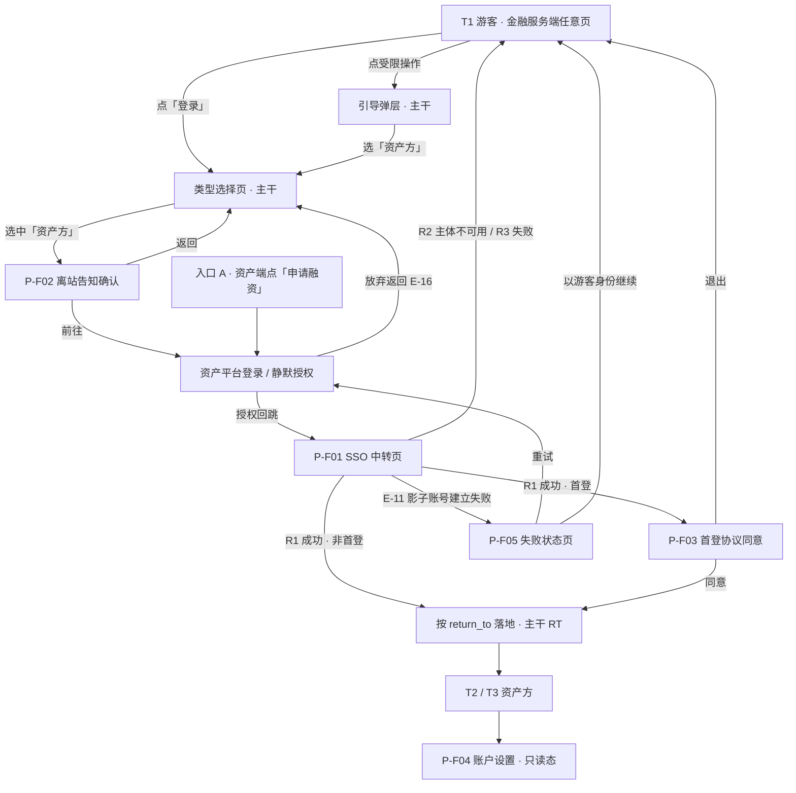
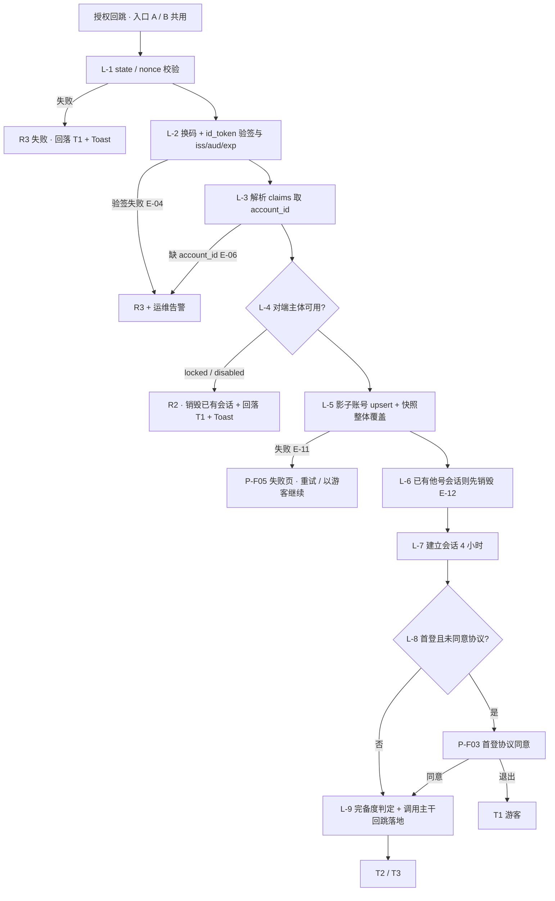
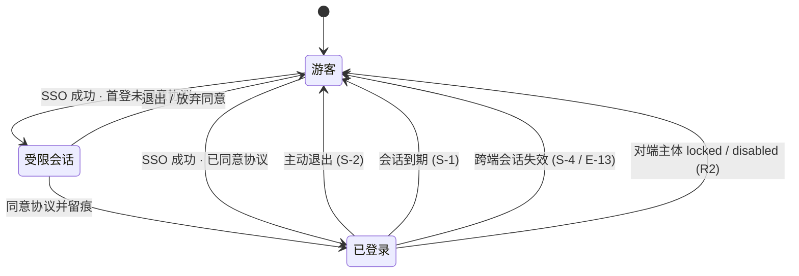

# 金融服务平台 · 金融服务端 · 资产方登录（资产平台 SSO 与双入口）PRD
## 册一 · SSO 与会话

> **本 PRD 是「差异型 + 机制型」文档，不是需求诊断简报的复制件。**
> 与基线一致的规则**只给编号 + 一句话 + 指向原文的相对路径**，不重写；只有**本 issue 特有**或**本轮需要落地成规格**的内容才展开。
> **本轮不写具体功能清单的可见性逐条枚举**——用户已明确「具体哪些功能哪些权限可见不在本 issue 确定」。权限矩阵（**册二 8.6**）**结构定稿、行留空**，由各功能 issue 填入。

## 0. 导航索引

### 0.1 本册在 WS-311 中的位置

本 PRD 覆盖 WS-314（拆分建议 2.A1），**分为三册交付**（见 0.4）。**父 issue WS-311 只产出《需求诊断简报》，不产出 PRD 入口文件**——因此本三册**自解释、不依赖也不引用任何父 issue PRD**。相关方边界如下：

| 相关方 | 管什么 | 本册与它的关系 |
| --- | --- | --- |
| **父 issue WS-311** | 《需求诊断简报 V4.0》——本三册的唯一上游输入 | 只作为输入引用；**WS-311 不出 PRD，本册不等它、不引用它、也不代它建入口文件** |
| **共用主干**（回跳 RT-1～RT-5、用户类型选择页、权限矩阵持表、受限操作引导弹层、三态模型与接口契约 5.2） | 三条登录链路共同经过的路径 | **规格归属已裁决（Q-F01，2026-09-10）：由本 issue（WS-314）以独立的**主干三册** `00-登录主干-01`～`03` 承接**，与本三册同目录。本册**只调用、不实现、不改定义**；本册需要主干提供什么，见 **3.2 外部依赖契约表**，该表即本册对主干分册的验收要求 |
| **WS-315 · 资金方登录与账户体系** | 本端凭据体系（密码、邮箱验证码、钱包连接与签名）、锁定与计数 | **完全不沾。** 资产方在本端**没有任何本地凭据**——这是两者最干净的一条分界 |
| **WS-316 · 资金方机构认证审核** | 入驻申请、机构资料模版、审核状态机 | 无交集 |
| **WS-303 · 实名认证与审核（资产平台）** | 资产方的实名认证流程与综合状态计算 | **本端只消费 `verification_status`，不自建认证**（见册二 8.2） |

### 0.2 编号体例与段位

本模块统一用 `-F` 后缀（F = Financial service end），与资产平台的 `D-##` / `N-##` / `P-A##`、运营端的 `-O` 均不重叠。主干分册与三个子 issue 共用这一套编号空间，**因此必须分段位，否则撞号**。

> **全模块的段位分配以《登录模块 · 统一编号段位分配表（裁决稿）》为唯一权威**（WS-311 持有，见 0.3 引用路径基准）。**本册只列自己占用的段位，不再复述其他册的段位** —— 原先写在这里的「建议留给」一列已删除，避免同一张地图在两处各自演进。本册的段位经该表核定为**零改动**，下表数值与该表一致。

| 前缀 | 含义 | 本 PRD（WS-314）段位 |
| --- | --- | --- |
| `P-F##` | 页面 / 界面单元 | **`P-F01`～`P-F09`**（本册实际用到 `P-F01`～`P-F05`） |
| `F-F##` | 功能点 | **`F-F01`～`F-F19`** |
| `D-F##` | 已确认口径 | **`D-F80`～`D-F99`**（简报已占用 `D-F01`～`D-F79`，本 PRD 只**引用**不重定义） |
| `N-F##` | 可调参数 | **`N-F10`～`N-F19`**（简报已占用 `N-F02` / `N-F03`） |
| `US-F##` | 本 PRD 新增用户故事 | **`US-F01`～`US-F09`**（简报第 4 章的 `US-01`～`US-15` 沿用原号） |
| `AC-F###` | 验收标准 | **`AC-F001`～`AC-F199`**（本册实际用到 `AC-F001`～`AC-F059`） |
| `E-##` | **异常分支** | **`E-35`～`E-49`**（简报已占用 `E-01`～`E-34`，本册只引用不重定义） |
| `EV-F##` | **通知事件** | **`EV-F30`～`EV-F49`**（本册当前未使用） |

**`E-##` / `EV-F##` 的硬性口径（统一段位表第 6 章裁决）**：`E-##` 在本模块内**只表示异常分支**；通知事件一律用 `EV-F##`；**引用 WS-302 的通知事件时必须写全称 `WS-302 E-03`，禁止写裸 `E-03`** —— `E-03` / `E-05` / `E-09`～`E-11` 五个号在两套体系里都有定义且含义完全不同，裸写会同时指两个东西。

**沿用不改号的编号**：`SSO-1`～`SSO-5`、`D-F01`～`D-F05`、`D-F70` / `D-F77`、`D-F71`～`D-F76`、`S-1`～`S-6`、`E-01`～`E-17`、`RT-1`～`RT-5`、`ST-1` / `ST-2`、`X-1` / `X-2`、`M-01`～`M-24`、`K-01`～`K-15`、`N-02`（不做项）、`N-F02` / `N-F03`。

### 0.3 引用路径基准

| 引用写法 | 指向 |
| --- | --- |
| 「简报 6.2」等 | 《需求诊断简报 V4.1》`financial-service-portal-login-requirements-brief.md`（WS-311 附件，Phase 1 定稿；V4.1 的 `0.5` 为编号勘误节，不改任何口径） |
| 「统一段位分配表」 | 《登录模块 · 统一编号段位分配表（裁决稿）》`financial-service-portal-login-numbering-allocation.md`（WS-311 附件）——**全模块编号段位的唯一权威**，见 0.2 |
| 「主干分册」 | [`00-登录主干-01-回跳与类型选择.md`](./00-登录主干-01-回跳与类型选择.md)（主干三册的入口册；同目录，承接 3.2 DEP-M1～DEP-M5 的本体规格） |
| 「WS-302 7.x / 12.x / 13.x」 | [`asset-platform/prd/v1.0-账户与登录/`](../../../asset-platform/prd/v1.0-账户与登录/)（7 → `01-模块详情.md`，12 → `04-安全与风控.md`，13 → `02-页面字段与双语文案.md`） |
| 「WS-303 11.1 / 综合状态表」 | [`asset-platform/prd/v1.0-实名认证与审核/03-流程与状态机.md`](../../../asset-platform/prd/v1.0-实名认证与审核/03-流程与状态机.md) |
| 「WS-310」 | [`financial-service-platform/prd/v1.0-协议管理/v1.0-协议管理-PRD.md`](../v1.0-协议管理/v1.0-协议管理-PRD.md) |
| 「国际化基线」 | [`financial-service-platform/prd/v1.0-账户与登录/01-国际化基线.md`](../v1.0-账户与登录/01-国际化基线.md)（平台级，默认语言 `en`） |

引用基准：分支 `cly-V1.0.0`。

> **过期内容警告（简报 R-24）**：撤回机制已整段删除。任何材料中出现「撤回按钮 / 撤回状态 / 24 小时最多 2 次」一律为过期内容，本 PRD 不含、也不得被回填。

### 0.4 三册导航

本 PRD 分三册交付，**按读者切，不按章节序号切**；章节号与全部编号跨册连续，内容不重复、不缺漏。**本模块没有独立的 PRD 入口文件**——父 issue 只产出诊断简报、不产出 PRD——因此**三册各自自解释**，本册（册一）同时承担总导航。

| 册 | 文件 | 装了哪些章节 | 给谁看 |
| --- | --- | --- | --- |
| **册一（本册）** | `01-资产方登录-SSO与会话.md` | 0～7、9.1～9.2、10～14、16～17 | **登录链路的实现方**：SSO 协议形态、影子账号、三类结果、双入口与统一落地、首登协议、会话与跨端登出、账户设置只读、流程图、数据字段、异常分支、非功能、指标、依赖风险、口径与参数、未决项 |
| **册二** | `02-资产方三态权限机制.md` | 8、9.3 | **权限实现方 + 各功能 issue 的填表方**：三态二维判定、`verification_status` 消费与刷新、降级表达三形态、唯一硬卡点、引导弹层调用契约、权限矩阵（结构定稿 / 行留空） |
| **册三** | `03-资产方登录-验收标准.md` | 15 | **测试**：AC-F01～AC-F52，含 issue 6 条验收口径的逐条对照表 |

**跨册定位**：章节 0～7、9.1～9.2、10～14、16～17 在册一；**第 8 章与 9.3 在册二**；**第 15 章（AC-F01～AC-F52）在册三**。正文中的裸章节号按此表定位，跨册引用写作「册二 8.2」「册三 AC-F18」。三册在同一目录下交付，未决项集中登记在册一第 17 章。

---

## 1. 文档信息

| 项目 | 内容 |
| --- | --- |
| 文档名称 | 金融服务平台 · 金融服务端 · 资产方登录（资产平台 SSO 与双入口）PRD |
| 对应需求 | WS-314（隶属 WS-311 金融服务端登录） |
| 撰写人 | 许楚清（需求分析师） |
| 上游输入 | 《需求诊断简报 V4.0 收口版》、《子 issue 拆分建议 V2.0》2.A1 |
| 覆盖端 | 金融服务端（面客 Web） |
| 文档语言 | 中文；产品文案给中英双语 |
| 入库落点 | `financial-service-platform/prd/v1.0-金融服务端登录/`，分支 `cly-V1.0.0` |

---

## 2. 背景与目标

### 2.1 背景

金融服务平台与资产平台是**两个独立平台**。资产方的身份权威在资产平台，金融服务端不为资产方建立任何本地凭据，只通过单点登录把对端身份带进来。同时，金融服务端**未登录也可以进**——登录是能力升级，不是准入门槛。

### 2.2 本期目标

1. 资产方能从**两条入口**（资产端直达 / 本端发起）进入金融服务端，且**回跳之后的落地处理完全一致**。
2. 对端身份在本端落成**影子账号**，映射键不可变，主体字段本端只读。
3. SSO 的**任何失败都有出口**——回落游客态继续浏览，不产生错误死胡同。
4. 资产平台侧登出后，本端会话**联动失效**。
5. 三态（游客 / 已登录未认证 / 已登录已认证）有一套**统一的判定与降级机制**，各功能只消费结论、不各自解释状态。

### 2.3 本期不做

| # | 不做项 | 理由 / 归属 |
| --- | --- | --- |
| N-01 | 资产方在本端设置本地密码 | 会产生第二套凭据，瓦解 SSO 价值（简报 16.3） |
| **N-02** | **资产方在本端修改邮箱 / 钱包 / 企业信息** | **权威在资产平台，本端只读 + 跳链（见 7.7）** |
| N-08 | 本端自建实名认证 | 资产方复用对端结论（WS-303） |
| — | 具体功能的可见性 / 可操作性逐条枚举 | 用户本轮明确移出本 issue，见册二 8.6 |
| — | 协议正文、版本、强制重新同意的前台行为 | WS-310；`require_reconsent` 本期不产生任何前台行为 |
| — | RISK-01（账号失联）缓解文案 | **本 issue 不涉及**：资产方邮箱与钱包权威在对端，风险不在本端 |
| — | RISK-02 监控指标 | 用户明确本期不考虑 |

---

## 3. 范围与边界

### 3.1 本 PRD 负责 / 不负责

| # | 负责 | 不负责 |
| --- | --- | --- |
| 1 | 「被选中『资产方』之后」的全部分支 | 类型选择页本身、任何新的入口页 |
| 2 | 发起授权时**写入** return_to、回跳后**消费** return_to | `return_to` 的参数解析、跳转、同源白名单校验（**主干侧统一实现**，见 3.2 DEP-M1） |
| 3 | 资产方两列的取值与降级表达 | 权限矩阵的行定义、四档取值语义 |
| 4 | 资产方分支的引导**文案** | 引导弹层组件与常驻提示条组件的形态定义 |
| 5 | 三态的**判定机制**与 `verification_status` 的消费机制 | 三态模型本身的定义（简报第 2 章，见 3.2 DEP-M5） |

> **本册明确不做的实现（反向验收见册三 AC-F52）**：不解析 `return_to` 参数、不实现跳转、不自建同源白名单校验、不新建类型选择页或任何入口页、不定义引导弹层与提示条组件、不改动权限矩阵的行与取值语义。

### 3.2 共用主干的外部依赖契约

> **为什么写成契约表而不是「由某某 issue 定义」**：回跳、类型选择页、权限矩阵、引导弹层、三态契约这五项是三条登录链路共用的主干，**本 issue 不实现、不定义**；它们的**规格归属已裁决（Q-F01）：由本 issue 以独立的**主干三册** `00-登录主干-01`～`03` 承接**。下表写的是**本册需要主干提供什么**，本体规格写在主干分册里，**这张表就是本册对主干分册的验收要求**。

| 编号 | 依赖项 | 本册需要主干提供（入参 / 返回） | 本册的调用点 | 主干侧必须满足的强制要求 |
| --- | --- | --- | --- | --- |
| **DEP-M1** | **回跳 return_to（RT-1～RT-5）** | ① **生成句柄**：入参「目标路径 + 触发能力标识」，返回**不透明句柄**；② **消费句柄**：入参句柄，返回最终落地路径，失效时返回该身份的默认落地页；③ 句柄的生命周期管理与作废 | 入口 B 发起授权前生成并置入 `state`（D-F98）；L-9 落地时消费；引导弹层跳转前生成 | **RT-2 同源白名单校验必须在主干侧统一做**——三条链路各写一套，漏掉的那一处就是**开放重定向漏洞**，可直接用于钓鱼；**RT-1 句柄不得出现在可见 URL 参数里**；RT-5 失效时落默认落地页 + Toast，**不报错**；RT-4 跨域回跳须对端配合并做同样校验 |
| **DEP-M2** | **用户类型选择页**（简报第 7 章） | 页面与弹层两种等价载体（D-F07）、两张身份卡片与说明文案、记忆上次选择（D-F08）、「切换身份」返回路径 | 用户选中「资产方」后本册接管（自 P-F02 起） | **不得实现「输邮箱自动判定身份并路由」**（D-F09 否决：等于确认该邮箱在资产平台存在，违反 WS-302 D-17 账户枚举防护）；「资产方」卡片文案见册二 8.5.4 的建议 |
| **DEP-M3** | **受限操作引导弹层 + 常驻补全提示条组件** | 组件形态（与类型选择页同组件的两种呈现）、五条文案原则 D-F71～D-F75、按册二 8.5.1 入参渲染并返回 `dismissed` / `navigated` | 册二 8.4 硬卡点、8.3 置灰能力被点击时 | 提示条可折叠、**不可永久关闭**（D-F75）；弹层**不改变任何账户状态**；跨平台跳转必须显式离站告知（D-F74） |
| **DEP-M4** | **权限矩阵总表与取值语义** | 行清单（能力）、列定义、✅ / ◐ / ⊘ / ❌ 四档语义、D-F77 服务端强制总口径 | 本册按册二 8.6 填 `T2 资产方` / `T3 资产方` 两列 | **⊘ 与 ❌ 一律服务端强制**，前端隐藏不构成防线；不得新增第五档取值 |
| **DEP-M5** | **三态模型与接口契约 5.2 四字段** | `session_state` / `identity_type` / `completeness_level` / `account_id` 的定义与语义 | 本册按册二 8.1 产出资产方分支下的取值规则 | 展示类功能**不得绕过契约直读 `verification_status` 等原始状态字段**（D-F70）；不新增第五个字段 |

| 编号 | 口径 |
| --- | --- |
| **D-F99** | 上表五项的**实现必须唯一**。归属已裁决（Q-F01）：本体规格由主干三册 `00-登录主干-01`～`03` 承接，本册只调用、不实现，调用契约不变、无需改写。**三个子 issue 各自实现一套 RT-2 同源白名单校验是明确禁止的**——这是本表里后果最严重的一条 |

### 3.3 外部接口

| 对象 | 本 PRD 消费 | 本 PRD 产出 |
| --- | --- | --- |
| 资产平台 IdP（对端） | OIDC 授权端点、`id_token` claims、`verification_status`、**全局会话失效事件** | 授权请求（PKCE `S256`）、静默模式请求 |
| WS-303 实名认证 | 综合状态 `verification_status` 的四值枚举与语义 | 无 |
| WS-310 协议管理 | 按 `agreement_key` 取当前生效版本（匿名可读）、`version_id`、`content_hash` | 同意记录（见 7.5） |
| WS-304 / WS-309 通知契约 | 站内信下发能力 | 「已认证状态被收回」降级通知事件（ST-1） |

---

## 4. 角色与用户故事

| 角色 | 态 | 核心诉求 |
| --- | --- | --- |
| 游客 | T1 | 先看清楚平台有什么，再决定要不要登录 |
| 资产方（未认证） | T2 | 能浏览、知道缺什么、一键回资产平台补 |
| 资产方（已认证） | T3 | 直接发起融资 |

| 编号 | 用户故事 | 落在 |
| --- | --- | --- |
| US-03 | 作为已登录资产端的资产方，从资产端点过来直接是已登录态 | 7.4 入口 A |
| US-04 | 作为先打开了金融服务端的资产方，我点「登录」选「资产方」后被带去资产平台登录，登录完**原路回来** | 7.4 入口 B |
| US-05 | 作为未实名认证的资产方，我照样能进来逛，只在发起融资时被拦并告知去哪补 | 册二 8.4 |
| US-15 | 作为在资产端登出所有设备的用户，金融服务端也失效——失效后**回到游客态继续浏览**，而不是被弹到登录页 | 7.6 S-4 |
| **US-F01** | 作为第一次进入金融服务端的资产方，我要清楚知道自己同意的是**本平台**的服务协议，而不是又被要求同意一遍资产平台的 | 7.5 |
| **US-F02** | 作为 SSO 出错的用户，我不想看到一个只有「出错了」三个字、没有任何出口的页面 | 7.3 / 第 11 章 |
| **US-F03** | 作为资产方，我在账户设置里看到邮箱和企业信息是灰的，我要知道**为什么不能改**以及**去哪改** | 7.7 |
| **US-F04** | 作为刚在资产平台完成认证的资产方，我回到金融服务端应该**很快**就是已认证态，不用退出重登 | 册二 8.2 刷新时机 |

---

## 5. 信息架构与页面流

### 5.1 界面单元清单

本 issue 界面单元少但非界面规格重，**原型只出中转页与状态页**，不硬凑完整原型集。

| 编号 | 名称 | 形态 | 说明 |
| --- | --- | --- | --- |
| **P-F01** | SSO 中转页 | 整页 | 授权回跳后的处理中状态；承载 7.4 的统一落地处理链 L-1～L-9 |
| **P-F02** | 离站告知确认 | 弹层 | 入口 B 跳转前的显式告知（D-F02） |
| **P-F03** | 首登协议同意 | 整页（受限会话下唯一可达页） | FL-2 系列 |
| **P-F04** | 资产方账户设置 · 只读态 | 整页区块 | 主体字段只读 + 「前往资产平台修改」跳链（N-02） |
| **P-F05** | SSO 失败状态页 | 整页 | **仅用于 E-11 影子账号建立失败**；其余失败一律回落游客态，不进此页（见 D-F80） |
| C-08′ | 常驻补全提示条 | 组件（**主干提供**，见 3.2 DEP-M3） | 本册只提供资产方文案（册二 8.5.4） |
| C-09′ | 受限操作引导弹层 | 组件（**主干提供**，见 3.2 DEP-M3） | 本册只提供调用方式（册二 8.5）与资产方文案 |

> 失败回落的提示一律走**顶部居中 Toast**（同构 WS-302 C-12 / D-25），Toast 不是页面，不占 `P-F` 编号。

### 5.2 页面流

---

## 6. 功能清单

| 编号 | 模块 | 功能点 | 验收（AC 全部在**册三**；F-F15～F-F18 的规格在**册二**） |
| --- | --- | --- | --- |
| F-F01 | SSO 协议 | OIDC Authorization Code + PKCE 授权发起与回调校验（SSO-1～SSO-4） | AC-F01～AC-F06 |
| F-F02 | SSO 协议 | `prompt=none` 静默授权与回退（SSO-5） | AC-F07～AC-F08 |
| F-F03 | 影子账号 | 以不可变 `account_id` 为映射键建号 | AC-F09～AC-F11 |
| F-F04 | 影子账号 | claims 快照写入与刷新，主体字段本端只读 | AC-F12～AC-F14 |
| F-F05 | SSO 结果 | 三类结果判定与失败回落游客态 + Toast | AC-F15～AC-F18 |
| F-F06 | SSO 结果 | 配置类错误的运维告警 | AC-F19 |
| F-F07 | 双入口 | 入口 A 落地 | AC-F20 |
| F-F08 | 双入口 | 入口 B：离站告知 + 授权发起 + 放弃返回兜底 | AC-F21～AC-F24 |
| F-F09 | 双入口 | 统一落地处理链 L-1～L-9 | AC-F25～AC-F26 |
| F-F10 | 协议 | 首登本端服务协议勾选与留痕（FL-2） | AC-F27～AC-F30 |
| F-F11 | 会话 | 会话建立、有效期、退出回落游客态（S-1～S-3） | AC-F31～AC-F32 |
| F-F12 | 会话 | **跨端会话联动失效（强制条款，S-4）** | AC-F33～AC-F35 |
| F-F13 | 会话 | 会话失效时的表单提示与审计留痕（S-5、S-6） | AC-F36 |
| F-F14 | 账户设置 | 只读表达 + 「前往资产平台修改」跳链，服务端拒写 | AC-F37～AC-F39 |
| F-F15 | 权限机制 | 三态二维判定与契约四字段输出 | AC-F40～AC-F41 |
| F-F16 | 权限机制 | `verification_status` 消费与刷新时机 | AC-F42～AC-F44 |
| F-F17 | 权限机制 | 降级表达三形态与引导弹层调用 | AC-F45～AC-F46 |
| F-F18 | 权限机制 | 唯一硬卡点「发起融资申请」 | AC-F47～AC-F48 |
| F-F19 | 异常 | E-01～E-17 全分支 | AC-F49 |

---

## 7. 模块详情：登录链路

### 7.1 SSO 协议形态（F-F01 / F-F02）

协议形态：**OIDC Authorization Code + PKCE**。五条协议层硬要求**全部为强制条款**，服务端实现，前端不构成防线。

| 编号 | 硬要求 | 落地细节 | 不满足时 |
| --- | --- | --- | --- |
| **SSO-1** | 回调白名单**精确匹配** | `redirect_uri` 与预登记值做完整字符串精确比对；**不做前缀匹配、不做通配符、不接受任何查询参数变体** | 拒绝，不发起授权；E-01 |
| **SSO-2** | `state` 与 `nonce` **一次性校验** | 授权发起时各生成一次性随机值并与会话绑定；回调时校验后**立即作废**，重复出现视为重放 | E-02 / E-03 |
| **SSO-3** | 授权码一次性 + `id_token` 验签与 `iss` / `aud` / `exp` 校验 | 授权码用过即作废；`id_token` 按对端 JWKS 验签，逐项校验签发方、受众、过期时间；时钟偏移容忍 `N-F13` | E-01 / E-04 / E-07 |
| **SSO-4** | PKCE **`S256`** | `code_challenge_method` 只接受 `S256`；**明文 `plain` 一律拒绝**；`code_verifier` 与会话绑定 | 拒绝发起 |
| **SSO-5** | 支持 `prompt=none` 静默模式 | 入口 B 首选静默；对端返回 `login_required` / `interaction_required` 时**回退为一次完整授权**，回退**最多一次**（`N-F10`），防止授权循环 | 回退后仍失败 → R3 |

**D-F98（本 PRD 新增，编号见 16.1）**：`state` 同时承载 return_to 句柄（RT-1「不放在可见 URL 参数里」）。**本 PRD 只负责把主干生成的句柄放进 `state`、回调后把它交还给主干的回跳实现**，不解析其内容。

> **不得以 `Referer` 或来源域名作为信任依据**判断「这是从资产端来的」。信任只来自 SSO-1～SSO-4 的校验结果。入口 A 与入口 B 在服务端**不可区分也不需要区分**（D-F01）。

### 7.2 影子账号（F-F03 / F-F04）

#### 7.2.1 映射键

| 项 | 口径 |
| --- | --- |
| 映射键 | claims 中的 **`account_id`**，落为本端 `asset_account_id`，**不可变、唯一索引** |
| 建号时点 | 首次 SSO 成功回跳（L-4）时创建；失败按 E-11 处理 |
| **禁止** | **禁止以邮箱或钱包地址作为映射键**；服务端必须拒绝任何以邮箱 / 钱包做主键或唯一索引的实现 |

**为什么不能用邮箱**（必须显式论证，简报交接提示第 8 条）：资产平台 D-07 允许用户修改邮箱。一旦以邮箱做映射键，用户在对端改一次邮箱，本端就会把同一个人识别成两个账户——历史融资记录、协议同意记录、消息全部分裂，且无法自动合并。
**为什么不能用钱包**：对端 D-02 规定钱包只在发起个人认证时才必须具备，**未认证用户的钱包可能为空**——用空值做映射键会让所有未认证资产方塌缩成同一个账号。

#### 7.2.2 快照与权威值分离

| 字段类别 | 字段 | 权威方 | 本端 |
| --- | --- | --- | --- |
| 映射键 | `asset_account_id` | 资产平台 | 只读、不可变 |
| **主体字段快照** | `email`、`wallet_address`、企业名称、机构标识 | **资产平台** | **只读**，本端**不提供任何修改入口，服务端拒绝任何写请求** |
| 状态快照 | `verification_status`、`account_status` | 资产平台 | 只读，按 8.2 刷新 |
| **本端权威字段** | `agreement_version_accepted`、本端会话、本端消息已读态 | **金融服务端** | 可写 |

| 编号 | 口径 |
| --- | --- |
| **D-F81** | 快照字段**整体覆盖式刷新**：每次 SSO 成功回跳（含静默）用最新 claims 覆盖全部快照字段并更新 `last_synced_at`；**不做字段级合并**，避免本端留下对端已删除的旧值 |
| **D-F82** | 快照字段在界面上必须标注来源（「来自资产平台」），并与本端权威字段在视觉上可区分；**不得让用户误以为这是本端可维护的资料** |
| — | 快照字段**不得进入任何唯一索引**（简报 D-F16）：资产方的邮箱 / 钱包是对端快照，资金方的是本端权威，语义不同 |

### 7.3 SSO 三类结果（F-F05 / F-F06）

| 结果 | 判定 | 处理 | 出口 |
| --- | --- | --- | --- |
| **R1 成功** | SSO-1～SSO-4 全部通过，且 claims 含 `account_id`，且对端主体可用 | 进入统一落地处理链 L-4 起 | 落地页 |
| **R2 主体不可用** | 对端账户 `locked` / `disabled`（E-09 / E-10） | **不建会话**；**已有的本端会话立即失效**；Toast 含预计解除时间或客服入口 | **回落 T1 游客态** |
| **R3 失败** | 协议校验失败、IdP 不可达 / 超时、claims 缺失、时钟偏移（E-01～E-07） | 不建会话；Toast 用可复述的中性文案 + 错误码 | **回落 T1 游客态** |

| 编号 | 口径 |
| --- | --- |
| — | **全部失败分支一律回落 T1 游客态 + Toast，不进错误页、不产生错误死胡同**（简报 6.3）。用户回落后**停在原本要去的页面的游客视图**，而不是被送到首页 |
| — | **配置类错误另触发运维告警**：验签失败（E-04）、claims 缺 `account_id`（E-06）、回调白名单不匹配（E-01 中的配置成因）、JWKS 拉取失败。这类错误用户重试多少次都不会好，属于对端或本端配置问题，必须有人被叫醒 |
| **D-F80** | **「一律回落」的唯一例外是 E-11（影子账号建立失败）**：此时对端身份**已验证通过**，回落游客态会让用户以为登录失败并反复重试，且用户手上没有任何可复述给客服的线索。因此 E-11 落 **P-F05 失败状态页**，页面必须同时给**两个出口**——「重试」与「以游客身份继续浏览」——从而仍然满足「无错误死胡同」。**除 E-11 外不得新增第二个失败页** |
| — | 用户可见文案**不得暴露内部原因**（是验签失败还是对端不可达），只给中性说明 + 错误码；细节进服务端日志（脱敏按 WS-302 12.4） |

### 7.4 双入口与统一落地处理链（F-F07 ～ F-F09）

| | **入口 A：资产端发起** | **入口 B：本端发起** |
| --- | --- | --- |
| 触发 | 资产端点「申请融资」等入口 | 游客在本端点「登录」→ 选「资产方」；或受限操作引导弹层 |
| 授权发起方 | 资产平台 | **金融服务端** |
| 用户是否已登录资产端 | 通常是 | **未知**——本入口的核心差异，因此必须支持 SSO-5 静默与完整授权两条路 |
| return_to 来源 | 资产端指定的落地页 | **游客原本在看的页面 / 操作**（主干 RT-1～RT-5） |
| 离站告知 | 不适用（离站动作发生在对端） | **必须有**（D-F02） |

**统一落地处理链（D-F01 的落地表达）**——两条入口从 L-1 起**共用同一实现**，PRD 与代码中都不存在第二套：

| 步骤 | 动作 | 失败去向 |
| --- | --- | --- |
| L-1 | 回调参数与 `state` / `nonce` 校验（SSO-1、SSO-2） | E-01 / E-02 / E-03 → R3 |
| L-2 | 换取并校验 `id_token`（SSO-3、SSO-4） | E-01 / E-04 / E-07 → R3 |
| L-3 | 解析 claims，取 `account_id` | E-06 → R3 + 告警 |
| L-4 | 对端主体可用性判定 | E-09 / E-10 → R2 |
| L-5 | 影子账号 upsert + 快照整体覆盖（D-F81） | E-11 → P-F05 |
| L-6 | **会话冲突处理**：本端已有**另一账号**会话时，**先销毁旧会话再建新会话**（E-12，防串台） | — |
| L-7 | 建立会话（S-1） | — |
| L-8 | 首登协议同意判定（FL-2.1） | 未同意 → P-F03 |
| L-9 | 完备度判定（8.1）→ **调用主干回跳实现落地**（RT-1～RT-5） | 目标失效 → RT-5 默认落地页 + Toast，不报错（E-15） |

| 编号 | 口径 |
| --- | --- |
| **D-F02** | 入口 B **跳转前必须显式告知即将离开本平台，并展示目标平台名称**。载体为 **P-F02 弹层**（不用 Toast——Toast 出现即消失，用户来不及读就已经跳走）；主按钮「前往资产平台登录」，次按钮「返回」 |
| **D-F05** | 用户在资产平台登录页放弃并返回时，本端须回到**类型选择页或原触发点**，**不得白屏或报错**（E-16） |
| **D-F83** | **放弃返回的识别方式**：授权发起时在服务端记一条 `pending_authorization`（含 return_to 句柄与发起时点）；用户经浏览器后退回到本端且无回调参数时，按该记录恢复原触发点并清除。跨域返回是最容易白屏 + 后退失效的位置，不能只靠前端历史栈 |
| **D-F84** | `pending_authorization` 与登录流程**同生命周期**（RT-3）：完成、放弃或超过 `N-F14` 即清除 |

### 7.5 首登协议同意（FL-2 系列，F-F10）

> 协议正文、版本号、生效时间、语种由 **WS-310** 定义。**本模块只做勾选与留痕的挂载点**，不写死协议清单、不定义协议内容。
> **出处说明（已确认）**：简报只给了「FL-2 系列」这个标题，未列条目。FL-2.1～FL-2.7 按简报其余口径（WS-302 7.3、17.2 的「本端协议由 WS-310 承接」、附录 A 的 `agreement_version_accepted`、WS-310 的 `require_reconsent` 本期无前台行为）条目化展开，**不新增口径**；本节为**定稿口径**（用户 2026-09-10 回复「按照建议执行」，见 17 章 Q-F03）。

| 编号 | 口径 |
| --- | --- |
| **FL-2.1** | **触发**：L-8 判定 `agreement_version_accepted` 为空（或不覆盖当前必需的 `agreement_key` 集合）→ 进入 **P-F03**。未完成同意前，会话为**受限会话**：除 P-F03、协议正文、退出外**不放行任何本端页面与接口** |
| **FL-2.2** | **协议清单来源**：按 `agreement_key` 从 WS-310 的读取接口取当前生效版本（匿名可读），**清单可扩展，本模块不写死** |
| **FL-2.3** | **交互**：正文可就地查看 / 下载；**只有一个复选框**，不提供任何其他可选勾选项（同构 WS-302 7.3）；未勾选时主按钮不可提交 |
| **FL-2.4** | **留痕**：服务端记录 `asset_account_id`、`agreement_key`、`version_id`、`content_hash`、语种、时间、IP / 设备摘要。锚定 `version_id` + `content_hash` 二元组，而不只是版本号——否则日后无法证明用户当时同意的是哪一份字节 |
| **D-F85** | **与 WS-302 7.3 的一处差异，必须写明**：资产端是「协议同意记录与账户在同一次提交内一并写入」，因而不存在没有同意记录的账户。**SSO 链路做不到**——影子账号在 L-5 就必须先建立（否则无处挂会话与留痕）。本端的等价保证改为：**影子账号可以先于同意记录存在，但在同意记录写入前会话为受限会话，不放行任何业务**。实现不得据此认为「可以先放行再补同意」 |
| **FL-2.5** | **不同意 / 关闭**：提供「退出并以游客身份继续浏览」出口——销毁会话、回落 T1，**不得白屏、不得死循环回 P-F03** |
| **FL-2.6** | **老用户强制重新同意本期不触发**：WS-310 的 `require_reconsent` 本期只存储与透出、**不产生任何前台行为**。本模块只判定「首登是否已同意」，不实现重新同意弹窗 |
| **FL-2.7** | 入口 A 与入口 B **完全一致**——FL-2 挂在统一落地链 L-8 上，不是入口特有步骤 |

### 7.6 会话与登出（S-1～S-6，F-F11 ～ F-F13）

> **出处说明（已确认）**：简报 V4.0 收口时把 6.5 压缩为一行「S-1～S-6；S-4 跨端会话联动失效为强制条款」，未给出六条的具体内容。以下六条按简报其余章节的既定口径（D-F31～D-F35、ST-2、E-13、E-14、K-15、N-F02、N-21）条目化展开，**不新增口径**；本节为**定稿口径**（用户 2026-09-10 回复「按照建议执行」，见 17 章 Q-F03）。

| 编号 | 口径 |
| --- | --- |
| **S-1** | 会话有效期 **4 小时**（`N-F02`），**不提供「记住我」**（D-F31，明确不沿用 WS-302 N-17 的 30 天） |
| **S-2** | **退出登录一律回落 T1 游客态**，不落到登录页（ST-2）。退出只销毁本端会话，**不触发资产平台侧登出** |
| **S-3** | 资产方在本端**无本地凭据**，因此本端不存在改密码 / 改邮箱这类会触发会话失效的动作（D-F32 在资产方链路上的实际取值）。本端会话失效来源**只有四个**：用户主动退出、会话到期、跨端失效（S-4）、对端主体变为 `locked` / `disabled`（R2） |
| **S-4** | **跨端会话联动失效（强制条款）**：资产平台触发全局会话失效后，本端会话须在 `N-F11` 内失效；失效后**回落 T1 游客态并给出说明，不弹登录页**（E-13）。实现须两条腿并存：① **推**——接收对端登出 / 会话失效事件；② **拉**——本端在会话校验点按 `N-F12` 的新鲜度阈值向对端复核。只做推会在事件丢失时静默失效，只做拉会让时限受轮询间隔限制。安全指标 K-15 目标 **100%** |
| **S-5** | 会话失效跳转时**不暂存表单草稿**，仅 Toast 提示内容未保存（D-F33 / E-14） |
| **S-6** | **审计留痕**：SSO 发起与三类结果、影子账号创建、快照刷新、协议同意、会话建立与失效（含失效原因）、跨端失效事件的收发，保留 **180 天**（N-21）；日志脱敏按 WS-302 12.4（邮箱 `a***@example.com`、地址缩略；**`id_token`、授权码、`code_verifier` 一律不入日志**） |

### 7.7 账户设置只读态与跳链（N-02，F-F14）

**P-F04 资产方账户设置**：

| 区块 | 表达 | 说明 |
| --- | --- | --- |
| 邮箱 / 钱包地址 / 企业名称 / 机构标识 | **只读展示 + 「来自资产平台」标注** | **不提供编辑入口、不提供置灰的编辑按钮**——一个点了没反应的按钮比没有按钮更糟 |
| 认证状态 | 只读展示 `verification_status` 的用户可读表达 | 未认证时附「前往资产平台完成认证」 |
| 「前往资产平台修改」 | 跳链，**跨平台跳转须显式离站告知**（D-F02 / D-F74） | 目标为资产平台用户中心；带回跳（RT-4，主干实现） |
| 语言偏好、通知偏好 | **本端权威**，可写 | 与只读区块视觉分区 |
| 退出登录 | 可用 | S-2 |

| 编号 | 口径 |
| --- | --- |
| **D-F86** | 只读**必须服务端强制**：本端对资产方的 `email` / `wallet_address` / 企业信息的任何写请求一律拒绝（403），**不是靠前端不画入口**。这是本 issue 6 条验收口径中的第 6 条 |
| **D-F87** | 只读区块须一句话说明**为什么不能改**（「这些信息由资产平台维护」），而不是只给一个灰色输入框（D-F71：不写不含信息的文案） |

---

## 9. 流程与状态机

### 9.1 统一落地处理链

### 9.2 会话状态机

> **所有失效路径的终点都是「游客」，没有一条通向登录页。** 这是 ST-2 与 S-4 的共同要求，也是「无错误死胡同」在会话层的体现。**9.3 三态判定（二维）见册二**——它属于权限机制，与会话流程分开给不同读者。

---

## 10. 数据与字段

### 10.1 AssetPartyShadowAccount

| 字段 | 类型 | 来源 | 本端可写 | 说明 |
| --- | --- | --- | --- | --- |
| `asset_account_id` | string | 对端 claims `account_id` | **否（不可变）** | **唯一索引、映射键**；禁止用邮箱 / 钱包替代 |
| `email` | string | claims 快照 | **否** | 只读；写请求一律 403（D-F86）；**不得进唯一索引**（D-F16） |
| `wallet_address` | string | claims 快照 | **否** | 同上；对端未认证用户可能为空 |
| `enterprise_name` | string | claims 快照 | **否** | 同上 |
| `enterprise_identifier` | string | claims 快照 | **否** | 机构标识 |
| `verification_status` | enum | 对端 | 否 | `unverified` / `partially_verified` / `action_required` / `verified`；**只有 `verified` 参与放行**（8.2） |
| `account_status` | enum | 对端 | 否 | 用于 R2 判定（`locked` / `disabled`） |
| `last_synced_at` | datetime | 本端记录 | 是 | 快照新鲜度，驱动 R-2 刷新 |
| `agreement_version_accepted` | 关联 | **本端权威** | 是 | 见 10.3 |
| `created_at` / `last_login_at` | datetime | 本端 | 是 | 审计 |

### 10.2 Session

| 字段 | 说明 |
| --- | --- |
| `session_id` / `asset_account_id` | 会话主键与归属 |
| `state` | `restricted`（未同意协议）/ `active` |
| `expires_at` | 建立时点 + `N-F02`（4 小时）；**无「记住我」延长** |
| `idp_session_ref` | 对端会话引用，供 S-4 的推 / 拉复核使用 |
| `last_verified_at` | 上次向对端复核会话有效性的时点（S-4 拉取腿） |
| `invalidated_reason` | `logout` / `expired` / `cross_end_logout` / `subject_unavailable`，进审计（S-6） |

### 10.3 AgreementConsent（本端权威）

| 字段 | 说明 |
| --- | --- |
| `asset_account_id` | 归属 |
| `agreement_key` / `version_id` / `content_hash` | **锚定用户当时同意的那一份字节**（WS-310） |
| `locale` / `consented_at` / `ip_digest` / `device_digest` | 留痕（FL-2.4） |

### 10.4 只读约束总表（服务端拒写清单）

| 对象 | 字段 | 拒绝方式 |
| --- | --- | --- |
| AssetPartyShadowAccount | `asset_account_id`、`email`、`wallet_address`、`enterprise_name`、`enterprise_identifier`、`verification_status`、`account_status` | **403**，不提供任何写接口；即使前端构造请求也拒绝 |
| 权限矩阵 ⊘ / ❌ 的能力 | — | **403**（D-F77） |

---

## 11. 异常分支（E-01～E-17，F-F19）

| 编号 | 场景 | 处理 | 出口 | 运维告警 |
| --- | --- | --- | --- | --- |
| **E-01** | 授权码无效 / 已使用 / `redirect_uri` 不匹配 | R3；中性文案 + 错误码 | 回落 T1 | 白名单不匹配时**是** |
| **E-02** | `state` 不匹配或已作废 | R3（视为重放） | 回落 T1 | 否 |
| **E-03** | `nonce` 重复 | R3（视为重放） | 回落 T1 | 否 |
| **E-04** | **`id_token` 验签失败** | R3 | 回落 T1 | **是（配置类）** |
| **E-05** | IdP 不可达 / 超时 | R3；文案提示稍后重试 | 回落 T1 | 连续失败达阈值时**是** |
| **E-06** | **claims 缺 `account_id`** | R3 | 回落 T1 | **是（配置类）** |
| **E-07** | 时钟偏移导致 `exp` / `iat` 校验失败 | 在 `N-F13` 容忍内放行，超出则 R3 | 回落 T1 | 持续出现时**是** |
| E-08 | **（简报未定义，保留空号，不得重新分配）** | — | — | — |
| **E-09** | 对端账户 `locked` | R2；Toast 含预计解除时间 | 回落 T1，已有会话立即失效 | 否 |
| **E-10** | 对端账户 `disabled` | R2；Toast 含客服入口 | 回落 T1，已有会话立即失效 | 否 |
| **E-11** | **影子账号建立失败** | **P-F05 失败页**：可复述错误码 + 「重试」+「以游客身份继续浏览」两个出口；**不得白屏、不得静默跳回**（D-F80） | P-F05 | **是** |
| **E-12** | 回跳时本端已有**另一账号**的会话 | **先销毁旧会话再建新会话**（防串台），并在落地后 Toast 告知已切换账号 | 正常落地 | 否 |
| **E-13** | 资产端触发全局会话失效 | 本端会话在 `N-F11` 内失效（S-4） | **回落 T1**，页面就地降级为游客视图，不弹登录页 | 事件通道异常时**是** |
| **E-14** | 会话到期时正在填表 | Toast 提示内容未保存，**不暂存草稿**（S-5 / D-F33） | 回落 T1 | 否 |
| **E-15** | 回跳目标校验不通过 / 已失效 | 落该身份默认落地页 + Toast，**不报错**（RT-5，主干实现） | 默认落地页 | 否 |
| **E-16** | 入口 B：用户在资产平台登录页放弃返回 | 按 `pending_authorization` 恢复类型选择页或原触发点（D-F83），**不得白屏或报错** | 类型选择页 / 原触发点 | 否 |
| **E-17** | 入口 B：用户选错类型，在资产平台建出空账号 | **本端无法撤销**；以 D-F03 的卡片文案预防为主；本端不提供任何「清理对端账号」入口 | — | 否 |

> **E-01～E-10 的用户可见文案统一为中性表述 + 错误码**，不区分内部成因；成因进服务端日志（S-6）。

---

## 12. 非功能要求

| 类别 | 要求 |
| --- | --- |
| **性能** | P-F01 中转页须在回跳后立即可见并展示处理中状态，不得白屏；静默授权（SSO-5）全链路 P95 ≤ `N-F15`；会话校验不得阻塞游客态浏览 |
| **安全（强制条款）** | ① SSO-1～SSO-5 全部服务端实现；② 映射键只能是 `account_id`，服务端拒绝其他实现；③ 主体字段只读，写请求 403（D-F86）；④ 权限矩阵 ⊘ / ❌ 服务端强制（D-F77）；⑤ 硬卡点服务端实时复核，不凭快照（R-3）；⑥ 跨端失效（S-4）；⑦ **回跳的同源白名单校验必须在主干侧统一实现，本模块不得自建**（3.2 DEP-M1）；⑧ `id_token` / 授权码 / `code_verifier` 不入日志；⑨ 不得以 `Referer` 作为信任依据 |
| **可用性** | **无错误死胡同**：每一个失败态都必须有出口（回落游客态或 P-F05 的两个按钮）；跨平台跳转前必有离站告知 |
| **可访问性** | 置灰控件可聚焦、可读屏，并读出受限原因（D-F90）；离站告知不依赖颜色单独表意；中转页处理中状态对读屏可播报 |
| **兼容性** | 桌面优先；跨域回跳须在浏览器后退、第三方 Cookie 受限、页面被恢复三种情况下均不白屏（D-F83） |
| **国际化** | 引用平台级[国际化基线](../v1.0-账户与登录/01-国际化基线.md)，默认语言 `en`，不读浏览器语言；本模块不另立一份 |

---

## 13. 指标

| 编号 | 指标 | 与本 PRD 的关系 |
| --- | --- | --- |
| K-01 | T1 → T2 转化率 | 登录链路整体 |
| K-02 | T2 → T3 转化率 | 降级引导是否有效 |
| K-03 | 受限操作触发引导后的 7 日补全转化率 | 8.5 文案与跳链质量 |
| K-06 | **入口 B 的完成率与中位耗时**（与入口 A 分开统计） | 入口 B 是新增路径，必须单独看 |
| K-07 | 类型选择页选错率 | 检验 D-F03 文案（主干页面，本 PRD 提供文案） |
| **K-15** | **跨端登出联动生效率，目标 100%** | S-4 是安全指标，不是体验指标 |
| **K-F01** | SSO 三类结果分布（R1 / R2 / R3），R3 按 E-01～E-07 细分 | 配置类错误应长期接近 0 |
| **K-F02** | 静默授权（`prompt=none`）命中率与回退率 | 命中率过低说明 SSO-5 未生效，入口 B 体验会明显变差 |
| **K-F03** | E-11 发生率 | 唯一保留失败页的分支，应长期接近 0 |

---

## 14. 依赖与风险

| 编号 | 依赖 | 说明 |
| --- | --- | --- |
| DEP-1 | 资产平台 IdP 提供 OIDC 授权端点、JWKS、`prompt=none` 支持 | 缺 `prompt=none` 则入口 B 每次都要用户手动登录一遍，K-06 会明显劣化 |
| DEP-2 | 对端 claims 稳定提供 `account_id`（不可变）与 `verification_status` | 缺 `account_id` 直接触发 E-06 + 告警 |
| **DEP-3** | **对端提供全局会话失效事件或可复核的会话状态查询** | **已定稿口径**：S-4 是强制条款，本册按「推 + 拉两条腿并存」写规格，两条腿至少要有一条可用。**对端具体提供哪一条仍需与资产平台侧对接落实**——这是实施依赖，不是口径未定；只能轮询时的后果见 RISK-F02 |
| DEP-4 | 对端跨域回跳配合与**对端侧的同源白名单校验**（RT-4） | 只做一边的校验就是开放重定向 |
| DEP-5 | 共用主干交付 DEP-M1～DEP-M5 五项 | 本册全部为调用方；本体规格见主干三册 `00-登录主干-01`～`03`（Q-F01 已裁决） |
| DEP-6 | WS-310 协议读取接口（匿名可读）与 `version_id` / `content_hash` | FL-2.4 留痕锚点 |

| 编号 | 风险 | 缓解 |
| --- | --- | --- |
| **RISK-F01** | **对端 IdP 不可用时，资产方在本端完全无法登录**——本端刻意不为资产方保留任何本地凭据（N-01） | 游客态不受影响，用户仍可浏览；E-05 文案明确指向对端并提示稍后重试。**不以「加一套本地密码」缓解**，那会瓦解 SSO 价值 |
| **RISK-F02**（口径已定，**风险仍在登记中**） | 若 DEP-3 只能拿到轮询式复核，S-4 的实际时限受 `N-F12` 限制，K-15 的 100% 目标难以稳定达成 | 需与资产平台确认事件推送能力；确认前 `N-F11` / `N-F12` 取保守值，并在关键动作前强制复核。**口径定了不等于风险消失**：S-4 能否达标最终取决于对端能力，须持续跟踪 |
| **RISK-F03** | 快照与权威值分离后，用户在对端改了信息但本端仍显示旧值 | R-1 / R-2 刷新机制 + D-F82 来源标注；账户设置页提供「前往资产平台修改」跳链，用户改完回来即刷新 |
| — | **RISK-01（账号失联）本 issue 不涉及**；**RISK-02 本期不考虑** | 简报既定口径 |

---

## 16. 本 PRD 新增口径与可调参数

### 16.1 新增已确认口径

| 编号 | 口径 | 出处 |
| --- | --- | --- |
| D-F80 | 「失败一律回落游客态」的**唯一例外**是 E-11，落 P-F05 且必须给两个出口 | 7.3 |
| D-F81 | 快照字段**整体覆盖式刷新**，不做字段级合并 | 7.2.2 |
| D-F82 | 快照字段界面标注来源，与本端权威字段视觉可区分 | 7.2.2 |
| D-F83 | 放弃返回以服务端 `pending_authorization` 记录恢复，不依赖前端历史栈 | 7.4 |
| D-F84 | `pending_authorization` 与登录流程同生命周期，超 `N-F14` 即清除 | 7.4 |
| D-F85 | 影子账号可先于同意记录存在，但同意前会话为**受限会话**，不放行任何业务 | 7.5 |
| D-F86 | 主体字段只读**服务端强制**（403），不靠前端不画入口 | 7.7 |
| D-F87 | 只读区块须说明**为什么不能改** | 7.7 |
| D-F88 | 三态必须二维判定，不得压成一维状态机 | 8.1 |
| D-F89 | `verification_status` 的细分**只用于文案分流**，不进入放行判定 | 8.2.1 |
| D-F90 | ⊘ 的「不可点」是不执行原操作，控件仍须可点并唤起引导 | 8.3 |
| D-F91 | 降级默认取 ⊘；取 ❌ 须写明理由 | 8.3 |
| D-F92 | T2 全局常驻补全提示条，可折叠、不可永久关闭 | 8.3 |
| D-F93 | 功能 issue 不得自行新增第二个硬卡点，须回权限矩阵持表方 | 8.4 |
| D-F94 | 矩阵每行由该功能所属 issue 填，持表方合并裁决 | 8.6 |
| D-F95 | 「降级表达方式」列必填 | 8.6 |
| D-F96 | ⊘ / ❌ 的「服务端强制」列必须为「是」并写明拒绝方式 | 8.6 |
| D-F97 | 取 ❌ 的行须写明理由；新增硬卡点须回持表方 | 8.6 |
| D-F98 | `state` 承载主干生成的 return_to 句柄，本模块不解析其内容 | 7.1 |
| D-F99 | 共用主干五项**实现必须唯一**；归属已裁决为主干分册（Q-F01）；三个子 issue 各写一套 RT-2 白名单校验属明确禁止 | 3.2 |

### 16.2 新增可调参数

| 编号 | 参数 | 建议取值 | 说明 |
| --- | --- | --- | --- |
| N-F10 | `prompt=none` 失败后的完整授权回退次数 | **1 次** | 防授权循环 |
| N-F11 | 跨端会话失效生效时限（S-4） | **≤ 60 秒** | K-15 目标 100%，取值须与 DEP-3 的能力匹配 |
| N-F12 | 快照新鲜度阈值（R-2 触发刷新） | **5 分钟** | 同时是 S-4 拉取腿的复核间隔上限 |
| N-F13 | `id_token` 时钟偏移容忍 | **±120 秒** | 超出即 E-07 |
| N-F14 | `pending_authorization` 有效期 | **15 分钟** | 超时按放弃处理 |
| N-F15 | 静默授权全链路 P95 | **≤ 2 秒** | 入口 B 体验指标 |

> 沿用简报既定参数：`N-F02` 会话有效期 4 小时、`N-21` 审计保留 180 天。`N-F01` 已随撤回机制删除（R-24），**不得重新启用**。

---

## 17. 口径确认记录与未决项

> **Q-F02 / Q-F03 / Q-F04 已确认，转为既定口径**（用户 2026-09-10 在本 issue 回复「Q-F02 / Q-F03 / Q-F04；按照建议执行」），正文对应位置的待确认标记已清除，编号 **D-F80 / DEP-3 / RISK-F02 保留不动**。**Q-F01 已由父 issue WS-311 裁决（2026-09-10）：共用主干五项归本 issue，以独立的**主干三册** `00-登录主干-01`～`03` 承接**，正文对应位置的待确认标记已清除。

| 编号 | 状态 | 议题与定稿口径 | 落在 |
| --- | --- | --- | --- |
| **Q-F02** | **已确认**（用户 2026-09-10） | E-11（影子账号建立失败）**是「SSO 失败一律回落游客态」的唯一例外**（**D-F80**）：走 P-F05 失败页 + 可复述错误码 + **「重试」/「以游客身份继续浏览」双出口**，仍满足「无错误死胡同」；**除 E-11 外不得新增第二个失败页** | 7.3 D-F80、5.1 P-F05、5.2、9.1、第 11 章 E-11、册三 AC-F18 |
| **Q-F03** | **已确认**（用户 2026-09-10） | S-1～S-6 与 FL-2 系列**按 7.5 / 7.6 的条目化重建定稿**（简报 V4.0 收口时把两处压成了标题行），出处见两节的说明块，**不新增口径** | 7.5 FL-2.1～FL-2.7、7.6 S-1～S-6、册三 AC-F27～AC-F36 |
| **Q-F04** | **已确认**（用户 2026-09-10） | 跨端会话联动失效（S-4）**按「推 + 拉两条腿并存」定稿**（**DEP-3**）；`N-F11` / `N-F12` 取保守值，关键动作前强制复核。**口径定了不等于风险消失**——K-15 的 100% 目标仍取决于对端提供哪一条腿，**RISK-F02 保留在 14 章风险登记中持续跟踪** | 7.6 S-4、DEP-3、RISK-F02、册三 AC-F33～AC-F35 |
| **Q-F01** | **已裁决 · 转为既定口径** | **共用主干五项（DEP-M1～DEP-M5）的规格归属已定：归本 issue（WS-314），以独立的**主干三册** `00-登录主干-01`～`03` 承接**，与本三册同目录、自解释、有独立段位。本册维持 **3.2 外部依赖契约表**，只调用、不实现，该表即对主干分册的验收要求，本册无需改写 | 3.2、5.2、7.4、册二 8.5 / 8.6 |

> **Q-F01 已结，且从未阻塞本三册的任何内容。** **D-F99** 与 3.2 契约表在归属定下来之前就已把「**实现必须唯一**、三个子 issue 不得各写一套 RT-2 同源白名单校验」锁死；归属落定后，RT-2 的具体判定规则写在主干三册 `00-登录主干-01`～`03` 的对应章节。
