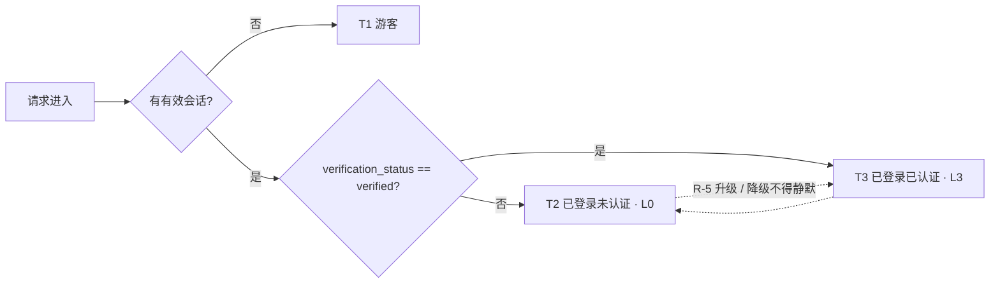

# 金融服务平台 · 金融服务端 · 资产方登录 PRD
## 册二 · 三态权限机制

> **本册读者**：权限的实现方，以及**各功能 issue 的填表方**。
> **本册只写机制，不写功能清单**——用户已明确「具体哪些功能哪些权限可见不在本 issue 确定」。8.6 的权限矩阵**结构定稿、行留空**，功能行由各功能 issue 按 D-F94～D-F97 的规则填入，**不得凭空臆造功能行把表填满**。

### 本册在三册中的位置

| 册 | 文件 | 装了哪些章节 | 给谁看 |
| --- | --- | --- | --- |
| 册一 | `01-资产方登录-SSO与会话.md` | 0～7、9.1～9.2、10～14、16～17 | 登录链路实现方；**编号体例（0.2）、引用路径基准（0.3）、共用主干外部依赖契约（3.2）、未决项登记（17）在册一** |
| **册二（本册）** | `02-资产方三态权限机制.md` | **8、9.3** | 权限实现方 + 各功能 issue 的填表方 |
| 册三 | `03-资产方登录-验收标准.md` | 15 | 测试；本册对应的验收条目为 **AC-F40～AC-F48、AC-F50** |

本模块**没有 PRD 入口文件**（父 issue 只产诊断简报），三册各自自解释。

### 本册必须先知道的四条前提（摘自册一，不重复定义）

| # | 前提 | 出处 |
| --- | --- | --- |
| 1 | 三态定义：**T1 游客**（无会话）/ **T2 已登录未认证**（有会话、完备度未达标）/ **T3 已登录已认证**（有会话、完备度达标） | 简报第 2 章 |
| 2 | 资产方的完备度权威在**资产平台**，本端只持 `verification_status` 快照；本端**不自建实名认证** | 册一 3.3、7.2 |
| 3 | **权限矩阵总表、引导弹层组件、三态模型与接口契约 5.2 属共用主干**，规格归属已裁决（Q-F01）：本体规格由主干三册 `00-登录主干-01`～`03` 承接，本册**只调用、不实现、不改定义**，调用契约不变 | 册一 3.2 DEP-M3～DEP-M5、17 章 Q-F01 |
| 4 | 跨平台跳转一律**先离站告知**（D-F02 / D-F74）；回跳一律调用主干实现，**本册不自行拼 URL** | 册一 3.2 DEP-M1、7.4 |

---

## 8. 三态权限机制层

> **本章只写机制，不写功能清单。** 具体哪些功能在哪一态可见 / 可操作，由各功能 issue 按 8.6 的表结构填入。

### 8.1 三态定义与二维判定（F-F15）

三态由**两个独立维度**共同判定，**不是一维状态机**：

| 维度 | 取值 | 变化来源 |
| --- | --- | --- |
| **会话态** `session_state` | `guest` / `authenticated` | 本端：SSO 成功、退出、到期、跨端失效 |
| **完备度** `completeness_level` | 资产方：`L0`（未认证）/ `L3`（`verified`） | **对端**：资产平台的认证结论，可升可降 |

| 会话态 | 完备度 | 态 | 说明 |
| --- | --- | --- | --- |
| `guest` | —（`null`） | **T1 游客** | 无会话 |
| `authenticated` | `L0` | **T2 已登录未认证** | 有会话，完备度未达标 |
| `authenticated` | `L3` | **T3 已登录已认证** | 有会话，完备度达标 |

**D-F88（为什么必须是二维，不能压成一维状态机）**：两个维度的**变化源不同且互不通知**——会话可能因跨端登出在任意时刻消失，完备度可能因对端认证被驳回而在会话存续期间从 L3 掉回 L0。压成一维后：① 「会话有效但认证被收回」和「认证有效但会话已失效」这两个真实组合会被迫塞进同一个状态或被漏掉；② 每加一个身份或一档完备度，状态迁移边按乘积增长；③ 每个功能模块都会各自补一套 if 分支来还原被丢掉的那一维，口径必然漂移。

**契约输出（主干接口契约 5.2 的资产方取值规则）**：

| 字段 | T1 | T2 资产方 | T3 资产方 |
| --- | --- | --- | --- |
| `session_state` | `guest` | `authenticated` | `authenticated` |
| `identity_type` | `null` | `asset_party` | `asset_party` |
| `completeness_level` | `L0` | `L0` | `L3` |
| `account_id` | `null` | `asset_account_id` | `asset_account_id` |

> 资产方**不使用 `L1` / `L2`**——这两档是资金方申请单的「审核中」「被驳回」，资产方链路上不存在（简报 2.1）。

### 8.2 `verification_status` 的消费方式与刷新时机（F-F16）

#### 8.2.1 消费方式

| 项 | 口径 |
| --- | --- |
| 权威方 | **WS-303**，本端只持快照 |
| 枚举 | `unverified` / `partially_verified` / `action_required` / `verified`（WS-303 综合状态表） |
| **放行判定** | **只消费 `verified` 这一个信号**：`verified` → `L3`，其余一律 `L0`。**本端不自行拼装个人认证 / 企业认证子状态**（WS-303 已明令业务模块不得拼装） |
| **D-F89 · 文案分流** | 引导文案**允许**区分 `action_required`（已被驳回 → 「去查看驳回原因」）与 `unverified` / `partially_verified`（→「去完成认证」）。**分流只作用于文案，不得进入放行判定**——放行永远只看 `verified` |
| 对外 | 展示类功能**不得直接读 `verification_status`**，一律消费 8.1 的契约四字段（D-F70） |

#### 8.2.2 刷新时机

| 编号 | 时机 | 说明 |
| --- | --- | --- |
| **R-1** | 每次 SSO 成功回跳（含静默） | 随快照整体覆盖（D-F81） |
| **R-2** | 会话内进入受限判定点前，`last_synced_at` 超过 `N-F12` | 触发一次异步刷新；刷新失败**沿用旧快照**并不阻塞浏览 |
| **R-3** | **硬卡点执行前（服务端）** | **必须实时向对端复核，不得凭快照放行**。这是安全侧要求：快照可能是陈旧的 `verified` |
| **R-4** | 收到对端认证状态变更事件时 | 若对端提供推送则即时刷新；不作为唯一手段 |
| **R-5** | **降级不得静默**（ST-1） | `verified` → 非 `verified` 时：发站内信 + **下次进入时显式说明**；界面从 T3 表达切回 T2 表达，且**不得表现为「功能凭空消失」** |

> **US-F04 的落地**：用户在对端刚完成认证后返回本端，`N-F12` 到期即刷新为 T3，**不需要退出重登**。若用户走的是入口 A / 入口 B 再次进入，R-1 立即生效。

### 8.3 降级表达形式（F-F17）

未认证（T2）的降级只有**三种表达形式**，不得发明第四种：

| 形态 | 语义 | 何时用 | 服务端 |
| --- | --- | --- | --- |
| **⊘ 置灰 + 点击后引导** | 能力可见，但不执行原操作；**点击唤起引导弹层** | **默认取值**——让用户看得见「补全后能做什么」 | **403** |
| **❌ 隐藏** | 入口完全不出现，接口不返回 | 展示本身即泄露信息（X-1 服务端脱敏要求），或该能力对未认证者完全无意义 | **403** |
| **◐ 脱敏** | 可见但按脱敏基线处理 | 字段级，由展示类功能按脱敏基线执行 | 服务端脱敏，**不返回原值** |

| 编号 | 口径 |
| --- | --- |
| **D-F90** | **⊘ 的「不可点」指的是不执行原业务操作，不是不响应点击**。置灰控件仍必须可聚焦、可点击并唤起引导弹层，且对读屏可读出受限原因。一个点了毫无反应的灰按钮把用户留在原地，直接违反 D-F72「给出可点的去处」 |
| **D-F91** | **默认取 ⊘**；仅当 X-1 要求或展示即泄露时才取 ❌。**取 ❌ 的行必须在矩阵里写明理由**——❌ 会让用户完全不知道平台有这个能力，是有代价的选择 |
| **D-F77** | **⊘ 与 ❌ 全部由服务端强制**：⊘ 只表示「前端仍画着这个按钮」，服务端收到请求照样 403（简报 13 章） |
| **D-F92** | T2 全局展示**常驻补全提示条**（组件同构 C-08，主干提供，见册一 3.2 DEP-M3）：可折叠、**不可永久关闭**，直到认证完成（D-F75） |
| — | **不做全局封锁**（同构 WS-302 D-03）：T2 可正常浏览、进账户设置、看消息中心。唯一硬卡点见 8.4 |

### 8.4 唯一硬卡点：发起融资申请（D-F04，F-F18）

| 项 | 内容 |
| --- | --- |
| **定义** | 硬卡点 = 前端不放行 + **服务端 403** + 唤起引导弹层，且**在资产方链路上有且只有这一处** |
| 触发点 | 「发起融资申请」入口 |
| 校验时点 | **两次**：① 前端点击时（体验）；② 服务端受理时（防线，按 R-3 实时复核，不凭快照） |
| 未通过 | 唤起引导弹层（8.5），主按钮跨平台跳转到资产平台用户中心，**带回跳（RT-4）+ 离站告知（D-F02）** |
| **为什么只设一处** | 业务本就以「认证通过」为前置条件——未认证用户即使不被提前封锁也做不成业务。把封锁提前到进门处并没有多挡住任何真正的业务操作，代价却是用户刚进来就撞墙（同构 WS-302 D-03 的论证） |
| **D-F93** | **任何功能 issue 不得自行新增第二个硬卡点。** 需要新增时必须回到权限矩阵的持表方修改矩阵并说明理由。硬卡点数量是产品口径，不是各功能可以自行决定的实现细节 |

### 8.5 受限操作引导弹层的调用方式

> 组件形态与文案原则（D-F71～D-F76）归**主干**（册一 3.2 DEP-M3）。本节只定义**调用方式**与本 issue 提供的**文案内容**。

#### 8.5.1 调用入参

| 字段 | 说明 |
| --- | --- |
| `trigger_capability` | 被拦截的能力标识，由各功能 issue 定义，用于埋点（K-03）与文案选取 |
| `session_state` / `identity_type` / `completeness_level` | 直接取自契约四字段，**调用方不得自行推断** |
| `missing` | 缺什么：`identity`（T1 游客，无身份）/ `verification`（T2 资产方，缺对端认证） |
| `verification_detail` | 可选，取 `action_required` / `unverified` / `partially_verified`，**仅用于文案分流**（D-F89） |
| `return_to` | **主干回跳实现生成的句柄**（册一 3.2 DEP-M1），不是 URL 字符串——调用方不得自行拼 URL（RT-1） |
| `copy_key` | 文案键；本 issue 提供 `asset_party.*` 一组 |

#### 8.5.2 调用时点与返回

- **前端**：能力入口被点击时调用；弹层**不改变任何账户状态**，关闭即回原页面。
- **服务端**：独立执行 403 判定，**不依赖弹层是否被调用过**——弹层是引导，不是防线。
- 返回 `dismissed`（关闭）/ `navigated`（跳走，回跳句柄已交给主干的实现）。

#### 8.5.3 本 issue 提供的文案（逐条满足 D-F71～D-F75）

| 场景 | 文案（EN / 中文） | 满足 |
| --- | --- | --- |
| T2 · 发起融资申请（硬卡点） | `Complete identity verification on the asset platform to submit a financing request. / 在资产平台完成实名认证后即可发起融资申请。` 主按钮 `Go to asset platform / 前往资产平台` | D-F71 说清缺什么；D-F72 给去处；D-F73 说明补完能做什么 |
| T2 · 其他置灰能力（通用） | `This is available after your identity verification is approved on the asset platform. / 该功能在资产平台实名认证通过后开放。` | D-F71 / D-F73 |
| T2 · 已被驳回（`action_required`） | `Your verification was not approved. Review the reasons on the asset platform and resubmit. / 你的实名认证未通过，请前往资产平台查看原因并重新提交。` | D-F89 文案分流 |
| T2 · 常驻补全提示条 | `Complete identity verification on the asset platform to unlock financing. / 在资产平台完成实名认证后即可使用融资功能。` + `Complete now / 立即前往` | D-F75 可折叠不可永久关闭 |
| **离站告知（P-F02 / 跳链共用）** | 标题 `You are leaving the financial service platform / 即将离开金融服务平台`；正文 `You will be redirected to the asset platform to continue. / 我们将带你前往「资产平台」继续操作。`；主按钮 `Continue / 继续前往`，次按钮 `Cancel / 返回` | **D-F02 / D-F74 必须展示目标平台名称** |

> 文案不得写「无权限」「请先登录」这类不含信息的表述（D-F71）。默认语言 `en`，中英取值见国际化基线。

#### 8.5.4 对主干类型选择页的文案建议（D-F03，主干侧定稿）

- 「资产方」卡片说明：`For enterprises already registered on the asset platform / 已在资产平台注册的企业用户`。
- 卡片内并列提供「我是资金方」返回路径。
- **理由**：选错类型的代价不是回退一步，而是**在资产平台建出一个空账号**（对端首登即建号，E-17 在本端无法撤销）。文案是唯一的预防手段。

### 8.6 权限矩阵（结构定稿，行留空）

> **本轮只定结构，不定内容。** 用户已明确「具体哪些功能哪些权限可见不在本 issue 确定」。下表的**列与取值语义定死**，功能行**由各功能 issue 填入**，由权限矩阵的持表方合并。**不得凭空臆造功能行把表填满。**

取值：**✅ 完整** ｜ **◐ 脱敏** ｜ **⊘ 置灰（可见、可点、点击后引导）** ｜ **❌ 不可见 / 服务端 403**

| 能力 | T1 游客 | T2 已登录未认证 | T3 已登录已认证 | 降级表达方式 | 服务端强制 | 填表 issue |
| --- | --- | --- | --- | --- | --- | --- |
| **发起融资申请**（样例，口径已定 D-F04） | ⊘ → 引导 | **⊘ 硬卡点** | ✅ | 置灰 + 点击唤起引导弹层，主按钮跨平台跳转 | **是（403）** | 本 PRD |
| **账户设置**（样例，口径已定 N-02） | ❌ | ✅（主体字段只读） | ✅（主体字段只读） | 只读展示 + 「前往资产平台修改」跳链 | **是（拒写）** | 本 PRD |
| *（功能行）* | — | — | — | — | — | **由各功能 issue 填入** |

**填表规则**：

| 编号 | 规则 |
| --- | --- |
| **D-F94** | 每一行由**该功能所属的 issue** 填，持表方只做合并与冲突裁决；同一行不得在两个 issue 里各写一版 |
| **D-F95** | 取值只能取 ✅ / ◐ / ⊘ / ❌ 四档；**「降级表达方式」列必填**，不允许留空——只填一个 ⊘ 而不说怎么表达，等于把设计决定推给实现 |
| **D-F96** | 凡 ⊘ 或 ❌，**「服务端强制」列必须为「是」**并写明拒绝方式（403 / 不返回字段）。前端隐藏在 F12 面前等于没有（X-1） |
| **D-F97** | 取 ❌ 的行必须写明理由（D-F91）；新增硬卡点必须回持表方（D-F93） |
| — | 资金方两列（T2 / T3 资金方）在**权限矩阵总表**上由 WS-315 / WS-316 填，本 PRD 不涉及 |

---

---

## 9.3 三态判定（二维）

---

