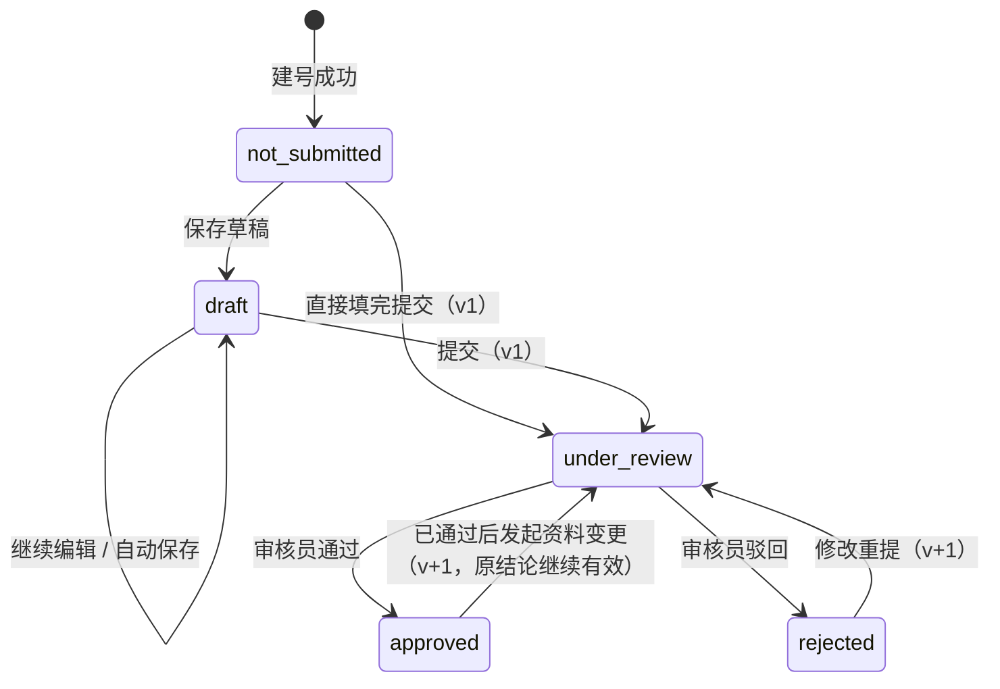
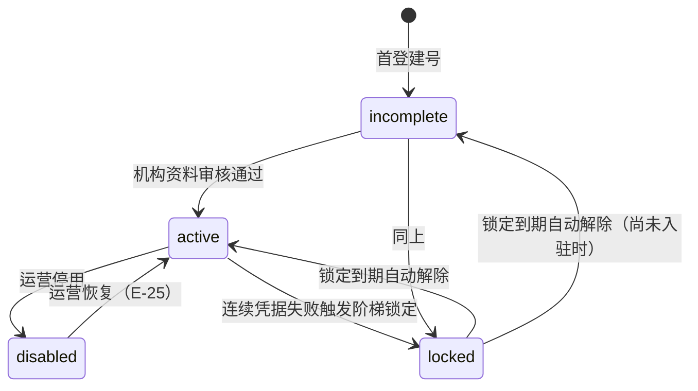
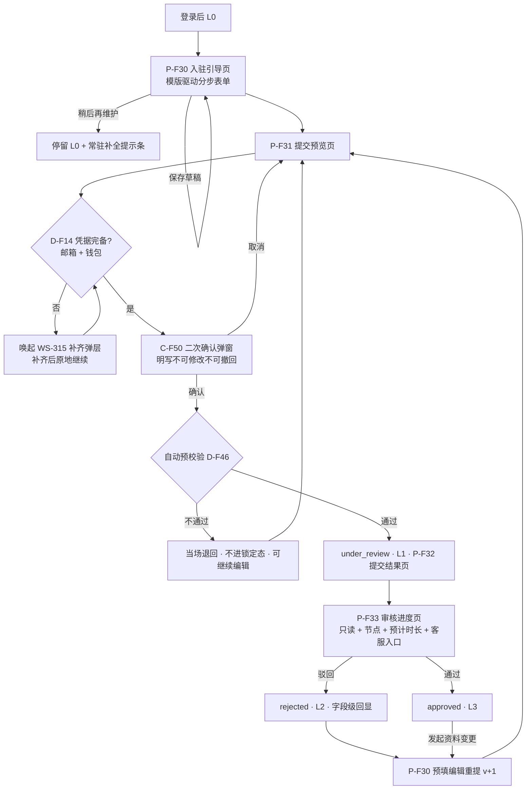

# 金融服务端登录 PRD · 03-1 资金方机构认证审核 · 主体
# Financial Service Portal Login PRD · 03-1 Funder Institution Onboarding Review · Core

> 本文件是《金融服务平台 · 金融服务端登录 PRD》（WS-311）下 **WS-316（拆分建议 2.A3）** 的第 1 册，共 3 册。**章节号跨三册连续，未做重排。**
> **父 issue WS-311 只产出《需求诊断简报》，不产出 PRD 入口文件**——本目录**没有** `v1.0-金融服务端登录-PRD.md`，本册不引用、也不代它创建；三册自解释，本册（03-1）同时承担导航。
> 三态模型、类型选择页、回跳、权限矩阵定义、受限引导弹层组件属**共用主干**，规格归属已由 WS-311 裁决（`Q-F01`）：由 **WS-314 以独立分册** [`00-登录主干-01-回跳与类型选择.md`](./00-登录主干-01-回跳与类型选择.md)（主干三册的入口册） 承接，与本三册同目录。本册一律引用、不自建。

**本册导航 / Volume Navigation**

| 册 | 文件 | 内容 |
| --- | --- | --- |
| **03-1（本册）** | `03-1-资金方机构认证审核-主体.md` | 第 1～8 章 + 第 12 章：文档信息、背景与目标、术语与命名对照、用户与场景、功能清单、状态机、主流程、模块详情、依赖与边界 |
| 03-2 | [`03-2-资金方机构认证审核-模版与数据.md`](./03-2-资金方机构认证审核-模版与数据.md) | 第 9 章机构信息模版机制、第 11 章数据与字段 |
| 03-3 | [`03-3-资金方机构认证审核-分档与验收.md`](./03-3-资金方机构认证审核-分档与验收.md) | 第 10 章完备度分档与权限框架、第 13～18 章差异对照 / 非功能 / 指标 / 异常 / 验收 / 待确认 |

**本册讲什么**：资金方**登录之后**的机构入驻申请全链路——入驻引导页与草稿、提交前预览与二次确认、**提交即锁定**、审核中只读进度、纠错与客服兜底、驳回与重提、通过后变更重审、降级通知，以及本册与其他 issue 的依赖与边界。

**本册不讲什么**：

| 你在找 | 去这里 |
| --- | --- |
| 登录、首登建号、三种凭据校验、改邮箱 / 改密码、锁定与计数 | 分册 02（WS-315 · 资金方登录与账户体系） |
| **凭据完备性硬门槛 D-F14 的定义、就地补齐弹层** | 分册 02（WS-315）；本册只写**调用方契约**（8.2） |
| 资产方 SSO、双入口、影子账号 | 分册 01（WS-314 · 资产方登录） |
| 用户类型选择页、回跳 RT-1～RT-5、权限矩阵**定义**、受限引导弹层**组件** | 主干分册 [`00-登录主干-01-回跳与类型选择.md`](./00-登录主干-01-回跳与类型选择.md)（主干三册的入口册；WS-314 承接） |
| 机构信息模版机制、模版版本化、机构唯一标识、数据与字段 | [`03-2`](./03-2-资金方机构认证审核-模版与数据.md) 第 9、11 章 |
| 完备度分档框架、与资产端差异对照、非功能、指标、异常、验收标准 | [`03-3`](./03-3-资金方机构认证审核-分档与验收.md) 第 10、13～18 章 |
| 运营端审核列表 / 详情 / 通过驳回**操作界面** | WS-308《金融服务平台 · 账户与登录》运营端部分 |
| 机构资料的**业务字段口径**（该收哪些字段、风控依据） | 不在本期范围。用户口径「按需自定义模版，后续完善」，本 PRD 只做承载机制 |
| 国际化、时区、日期、金额、脱敏的展示口径 | 本平台平台级基线 [`v1.0-账户与登录/01-国际化基线.md`](../v1.0-账户与登录/01-国际化基线.md)（**不跨平台引用资产平台的同类章节**） |

---

## 1. 文档信息 / Document Info

| 项 | 内容 |
| --- | --- |
| 文档名称 | 金融服务端登录 PRD · 03 资金方机构认证审核（本册为 03-1 主体册） |
| 版本 / 日期 | V1.1 / 2026-09-10 |
| 对应需求 | WS-316（父需求 WS-311，拆分建议 2.A3） |
| 上游输入 | 《需求诊断简报 V4.1》（Phase 1 定稿 + `0.5` 编号勘误节）、《子 issue 拆分建议 V2.0》、《登录模块 · 统一编号段位分配表（裁决稿）》——均为 WS-311 评论附件 |
| 参考基线 | `asset-platform/prd/v1.0-实名认证与审核/`（WS-303）@ 分支 `cly-V1.0.0`，重点 `02-企业认证与模板.md`、`03-流程与状态机.md`、`04-管理端审核.md` |
| 文档语言 | **中英对照**：章节标题、字段名、状态枚举、按钮与提示文案、错误文案、验收标准均给中英两版；论证性说明以中文为准 |
| 英文命名口径 | 与资产端共用的概念**沿用资产端已有英文名**，不另起译法；本册新增概念的英文名在 3.4 术语表登记 |
| 编写人 | 许楚清（需求分析师） |

**编号前缀与段位（跨三册统一）**

> 全模块的段位分配以《登录模块 · 统一编号段位分配表（裁决稿）》（WS-311 附件 `financial-service-portal-login-numbering-allocation.md`）为**唯一权威**。本 PRD 原用的 `F-A3-##` / `D-A3-##` / `C-A3-##` / `E-A3-##` / `N-A3-##` 体例**已按该表整体切换为与兄弟册一致的 `-F` 体例**（顺序映射，**正文规则一个字未改，只换标识符**）；本 PRD 尚未入库，切换零成本。

| 类别 | 本 PRD 段位 | 原用前缀 | 说明 |
| --- | --- | --- | --- |
| 页面 | **`P-F30`～`P-F49`** | `P-F30`～ | ✅ **确认保留、不平移**——该段位本就在段位表的地图内（原 `Q-02` 据此关闭） |
| 组件 / 界面单元 | **`C-F50`～`C-F79`** | `C-A3-01`～`C-A3-03` | 本 PRD 实际用到 `C-F50`～`C-F52` |
| 功能点 | **`F-F55`～`F-F79`** | `F-A3-01`～`F-A3-16` | 本 PRD 实际用到 `F-F55`～`F-F70` |
| 本 PRD 细化口径 | **`D-F130`～`D-F159`** | `D-A3-01`～`D-A3-15` | 本 PRD 实际用到 `D-F130`～`D-F144`。**简报已有的 `D-F01`～`D-F79` 一律直接引用，不重新编号、不改口径** |
| 参数 | **`N-F40`～`N-F49`** | `N-A3-01` | 本 PRD 实际用到 `N-F40`。简报已有参数沿用其原号、资产端沿用 `N-K##`，不改数值 |
| 异常分支 | **`E-70`～`E-89`** | `E-A3-01`～`E-A3-05` | 本 PRD 实际用到 `E-70`～`E-74`。简报 15.2 已占 `E-01`～`E-34`，本 PRD 引用时沿用原号、不重定义 |
| 通知事件 | **`EV-F50`～`EV-F69`** | — | 本 PRD 当前未使用 |
| 用户故事 | **`US-F40`～`US-F49`** | `US-01`～`US-09` | 本 PRD 实际用到 `US-F40`～`US-F48`。原用的 `US-01`～`US-09` 与**简报第 4 章的 `US-01`～`US-15` 直接重号且含义完全不同**，本轮一并改掉。`US-F##` 前缀在统一段位分配表初版中未登记，父 issue 已于 2026-09-10 **补裁决四方段位**：WS-314 `US-F01`～`US-F09`、WS-315 `US-F20`～`US-F29`、**本 PRD `US-F40`～`US-F49`**、主干 `US-F60`～`US-F69`，四段互不重叠。本段位**已生效，非暂行** |
| 验收标准 | **`AC-F401`～`AC-F599`** | `AC-1`～`AC-13` | 本 PRD 实际用到 `AC-F401`～`AC-F413`，见 [`03-3`](./03-3-资金方机构认证审核-分档与验收.md) 第 17 章 |

**`E-##` / `EV-F##` 的硬性口径（统一段位表第 6 章裁决 `X-N1`）**：`E-##` 在本模块内**只表示异常分支**；通知事件一律用 `EV-F##`；**引用 WS-302 的通知事件时必须写全称 `WS-302 E-03`，禁止写裸 `E-03`**——`E-03` / `E-05` / `E-09`～`E-11` 五个号在两套体系里都有定义且含义完全不同，裸写会同时指两个东西。

---

## 2. 背景与目标 / Background & Goals

### 2.1 背景 / Context

金融服务端的资金方用「与资产端同一套账户体系」自助建号（分册 02）。建号只解决「能进来」，**能不能出资取决于机构主体是否通过平台的入驻审核**。本 PRD 即这条从「登录后什么都还没填」到「已入驻」的链路。

用户在诊断阶段把一条关键口径反转：**审核中不允许撤销更改**（简报 R-24，撤回机制整段删除）。提交因此从流程中的普通一步变成**不可逆的单向门**——这是本 PRD 全部设计权重的来源。

> **过期内容识别**：任何材料中出现「撤回按钮」「撤回状态」「24 小时最多撤回 2 次」「撤回时间字段」，一律为 V3.0 遗留，**本 PRD 不得复活**（R-24 / N-12' / I-09）。

### 2.2 本期做什么 / In Scope

| # | 目标 | 对应 |
| --- | --- | --- |
| 1 | 资金方能在引导页按**模版驱动**的表单填写机构资料，支持分步与草稿，可「稍后再维护」 | D-F62、D-F66～D-F68 |
| 2 | 提交前必须看到**完整预览**并经**二次确认**；确认文案明写不可修改不可撤回 | D-F51'、D-F52' |
| 3 | 提交后进入「审核中」**锁定态**：界面无编辑入口，**系统层面拒绝一切编辑 / 撤回 / 删除** | D-F53' |
| 4 | 锁定期间用户仍可**只读查看**已提交内容、当前节点、预计时长，并有**客服入口** | D-F54'、D-F56'、E-34 |
| 5 | 驳回**字段级回显**，可直接编辑重提，版本 +1，不整份重填 | D-F48、D-F59～D-F61 |
| 6 | 机构信息**模版化 + 版本化**，模版中有且仅有一个字段为机构唯一标识 | D-F63～D-F65 |
| 7 | 审核结论驱动资金方一侧的**完备度分档 L0～L3**，分档框架与降级表达就位 | D-F47、D-F77 |
| 8 | 联系邮箱与登录邮箱**解耦** | D-F69 |

### 2.3 本期不做 / Out of Scope

| # | 不做项 | 归属 / 理由 |
| --- | --- | --- |
| 1 | 登录、首登建号、凭据校验、改邮箱 / 改密码 | 分册 02（WS-315）。**本 PRD 的用户一定已登录** |
| 2 | 凭据完备性硬门槛 D-F14 的**定义**与**就地补齐弹层** | 分册 02（WS-315）。本 PRD 只**调用**（8.2） |
| 3 | 运营端审核列表 / 详情 / 通过驳回界面 | WS-308。**参考了资产端 `04-管理端审核.md` 也不把审核界面收进本 PRD** |
| 4 | 机构资料具体收哪些字段、各字段的风控依据 | 用户口径「按需自定义模版，后续完善」。[`03-2`](./03-2-资金方机构认证审核-模版与数据.md) 第 9 章只做承载机制，9.4 字段组为占位示例，**不作为验收项** |
| 5 | 审核期自助撤回 / 编辑 | N-12'（用户口径），后续迭代 I-09 |
| 6 | 账户恢复通道 | N-13'，后续迭代 I-08；本 PRD 只承担 RISK-01 的一条文案缓解（8.1.4） |
| 7 | 权限矩阵的**具体功能行清单** | 只给分档判定与**留空骨架**（[`03-3`](./03-3-资金方机构认证审核-分档与验收.md) 第 10 章）；行的取值由各功能 issue 填入，表的定义归父 issue |
| 8 | 回跳目标的解析、跳转与同源白名单校验 | **主干分册唯一实现**，本 PRD 只调用（12.3）。**各处各写一套，校验必然有遗漏，那就是可被利用的跳转漏洞** |
| 9 | 一账号多机构、机构内子账号与角色 | I-02 / I-03 |

---

## 3. 术语与命名对照 / Terminology & Naming

> **全文唯一命名**：同一概念不允许出现两套叫法，也不允许两种英文译法。

### 3.1 会话态与完备度分档 / Session State & Completeness Level

用户口径的三态与简报的 T1 / T2 / T3 是**同一组概念的两种写法**。本 PRD 对外一律用中文称谓 + 下表英文名，`T1/T2/T3` 仅作内部代号，不再引入第三套叫法。

| 对外称谓（本 PRD 标准） | English | 内部代号 | 会话状态 | 身份类型 | 资金方完备度 | 本 PRD 是否覆盖 |
| --- | --- | --- | --- | --- | --- | --- |
| **游客** | Guest | T1 | `guest` | `null` | 不适用（无账号即无申请单） | 否——只作为引导起点（12.3 回跳） |
| **登录（未入驻）** | Signed in (not onboarded) | T2 | `authenticated` | `funder` | **L0 / L1 / L2** | **是，本 PRD 主体** |
| **登录（已入驻）** | Signed in (onboarded) | T3 | `authenticated` | `funder` | **L3** | 是（通过后的变更重审，8.7） |

> 「入驻 / Onboarded」= 机构资料审核通过（D-F45）。因此「登录（已入驻）」严格等价于完备度 = L3，两者不是两个判定，是同一个判定的两种说法。

### 3.2 L0～L3 的判定依据与切换时机 / Level Definition & Transitions

| 档 | 判定依据（平台侧唯一真源） | 进入时机 | 离开时机 | 用户可执行动作 |
| --- | --- | --- | --- | --- |
| **L0** | 申请单**现行有效结论**为空，且当前状态 ∈ {`not_submitted`, `draft`}（含从未填写、有草稿未提交、凭据未齐） | 建号成功（唯一入口）；**被驳回不回落 L0**，见 L2 | 提交成功 → L1 | 填写、保存草稿、稍后再维护、提交 |
| **L1** | 申请单当前状态 = `under_review` **且**无现行有效通过结论 | 提交成功（含驳回后重提 v+1） | 审核出结论 → L3 / L2 | **仅查看进度**（只读）+ 联系客服 |
| **L2** | 申请单**现行有效结论**为 `rejected` | 审核员驳回 | 重新提交 → L1 | 查看驳回原因、编辑重提 |
| **L3** | 申请单**现行有效结论**为 `approved` | 审核通过 | 变更重审的新结论为驳回 → L2；账号被停用 → 8.8 | 出资类能力（行由各功能 issue 填）；发起资料变更（触发重审） |

**D-F130（强制）**：完备度按**现行有效结论**判定，**不是**申请单当前状态的直译。唯一分歧点在「已通过后发起变更重审」：此时状态为 `under_review`，但现行有效结论仍为 `approved`，**档位保持 L3、权限不中断**（D-F50）。同构资产端 [`03-流程与状态机.md`](../../../asset-platform/prd/v1.0-实名认证与审核/03-流程与状态机.md) 11.2 对综合状态判定条件的同一处修正。

**D-F131（强制）**：完备度只由平台侧计算，并按简报 5.2 的对外契约输出四项（会话状态 / 身份类型 / 完备度 / 账号标识）；展示类功能**不得自行读取申请单或账号的原始状态字段**做判定（D-F70）。否则每个模块各解释一遍状态，口径必然漂移。

### 3.3 状态枚举 / Status Enumeration（沿用资产端命名）

| 枚举值 | English label | 中文标签 | 含义 |
| --- | --- | --- | --- |
| `not_submitted` | Not submitted | 未提交 | 从未填写 |
| `draft` | Draft saved | 草稿已保存 | 填了一半，未提交 |
| `under_review` | Under review | 审核中 | 已提交，等待结论 |
| `under_review`（版本 > 1） | Under review (resubmission {n}) | 审核中（第 {n} 次提交） | 重提后的审核中 |
| `approved` | Approved | 已通过 | 审核通过 |
| `rejected` | Rejected | 已驳回 | 审核驳回 |
| 已通过 + 变更重审中 | Onboarded · update under review (resubmission {n}) | 已入驻 · 更新审核中（第 {n} 次提交） | 同构资产端「已认证 · 更新审核中」，**仅把「已认证」换成本端语义的「已入驻」** |

### 3.4 术语表 / Glossary

| 中文 | English | 来源 | 说明 |
| --- | --- | --- | --- |
| 入驻申请（申请单） | Onboarding application | 本 PRD 新增 | 资金方提交的机构资料及其审核载体；与资产端「认证申请 / Verification」同构但主体不同 |
| 入驻 / 已入驻 | Onboarding / Onboarded | 本 PRD 新增 | 机构资料审核通过的状态；对应资产端「已认证 / Verified」 |
| 完备度分档 | Completeness level | 简报 2.1 | L0～L3，见 3.2 |
| 提交即锁定 | Lock on submission | 本 PRD 新增 | 提交后至结论出来前不可修改、不可撤回 |
| 预览页 | Review-before-submit page | 本 PRD 新增 | 提交前的完整核对页；对应资产端「核对提交」步骤 |
| 审核进度页 | Application status page | 本 PRD 新增 | 锁定期间用户唯一可执行的页面 |
| 字段级驳回回显 | Field-level rejection feedback | 资产端 7.5.2 | 沿用资产端译法 |
| 重新提交 | Resubmission | 资产端 7.5.3 | 是**动作**不是状态 |
| 机构信息模版 | Institution form template | 本 PRD 新增 | 驱动表单字段的配置，见 [`03-2`](./03-2-资金方机构认证审核-模版与数据.md) 第 9 章 |
| 模版版本 | Template version | 本 PRD 新增 | 申请单记录提交时所用的模版版本 |
| 机构唯一标识 | Institution unique identifier | 对应资产端「企业唯一标识 / Enterprise unique identifier」 | 查重依据，见 [`03-2`](./03-2-资金方机构认证审核-模版与数据.md) 9.3 |
| 唯一键 | Unique key | 资产端 9.2 | `{作用域}:{归一化标识}` |
| 联系邮箱 | Contact email | 本 PRD 新增 | 申请单上的业务联系方式，**与登录邮箱解耦** |
| 登录邮箱 | Login email | 分册 02 | 账号凭据 |
| 客服入口 | Support contact entry | 本 PRD 新增 | 兜底纠错路径唯一可见起点 |
| 常驻补全提示条 | Persistent completion banner | 资产端 C-08 | 主干分册组件，本 PRD 只调用 |
| 就地补齐弹层 | Inline completion dialog | 资产端 C-09 | WS-315 组件，本 PRD 只调用 |
| 受限操作引导 | Restricted-action guidance | 简报第 14 章 | 主干分册组件，本 PRD 只提供文案 |

---

## 4. 用户与场景 / Users & Scenarios

### 4.1 角色 / Roles

| 角色 | English | 档位 | 核心诉求 |
| --- | --- | --- | --- |
| 资金方经办人（L0） | Funder operator (L0) | 登录（未入驻） | 先逛；决定出资时清楚知道还差什么、要填多久 |
| 资金方经办人（L1） | Funder operator (L1) | 登录（未入驻） | **看得到进度与预计时长**；资料填错时知道找谁 |
| 资金方经办人（L2） | Funder operator (L2) | 登录（未入驻） | 看清被驳回的**具体项**，改一次就过 |
| 资金方经办人（L3） | Funder operator (L3) | 登录（已入驻） | 正常出资；机构信息变更时业务不中断 |
| 运营审核员 | Reviewer | 运营端（WS-308） | 明确的状态流转与完整留痕 |
| 平台客服 | Support | 线下 | 接住「提交后发现填错」的用户，触发审核员主动驳回 |

### 4.2 用户故事 / User Stories

| # | 故事 | 验收锚点 |
| --- | --- | --- |
| US-F40 | 作为 L0 用户，我想先看到要填哪些内容、能中途保存，这样不必一次填完 | F-F55、F-F57 |
| US-F41 | 作为 L0 用户，我想在按下提交前看到我填的全部内容，这样不会带着错误提交 | F-F60 |
| US-F42 | 作为 L0 用户，我想在确认弹窗里被明确告知「提交后改不了」，而不是提交完才发现 | F-F61 |
| US-F43 | 作为 L1 用户，我想知道审核到哪一步、大概还要多久，这样不必反复刷新或找客服 | F-F63 |
| US-F44 | 作为 L1 用户，我提交后发现填错了，我想知道**现在到底能做什么** | F-F64 |
| US-F45 | 作为 L2 用户，我想直接看到哪个字段错了、为什么错，改完就交，不想整份重填 | F-F65、F-F66 |
| US-F46 | 作为 L3 用户，我更新机构资料期间业务不应被掐断 | F-F67 |
| US-F47 | 作为经办人换人的机构，我想改联系邮箱而不被迫重新登录 | F-F59 |
| US-F48 | 作为平台，我想新增一个机构资料字段时不用改登录与状态流转规则 | F-F68 |

### 4.3 典型场景 / Key Scenarios

| 场景 | 路径 |
| --- | --- |
| S-1 顺利入驻 | 登录 → 引导页填写（草稿） → 预览 → 二次确认 → 审核中（只读） → 通过 → L3 |
| S-2 稍后再维护 | 登录 → 引导页 →「稍后再维护」 → 停留 L0 + 常驻补全提示条 → 后续被受限操作引导拉回 |
| S-3 凭据未齐 | 引导页填完点提交 → 命中 D-F14 → 唤起 WS-315 补齐弹层 → 原地补齐 → **原地继续提交**，不跳走 |
| S-4 预校验退回 | 点提交 → 自动预校验不通过 → 当场退回，**不进入锁定态**、不进人工队列，可继续编辑 |
| S-5 被驳回重提 | 审核中 → 驳回（字段级） → 详情页 / 表单高亮回显 → 改动 → 再次预览确认 → v+1 审核中 |
| S-6 提交后发现填错 | 审核中 → 进度页无编辑入口 → 点客服入口 → 运营核实 → 审核员主动驳回 → 走 S-5 |
| S-7 通过后变更 | L3 → 发起资料变更 → v+1 审核中（**档位保持 L3**） → 新结论通过则更新；驳回则降级 L2 |

---

## 5. 功能清单 / Feature List

| 编号 | 模块 | 功能点 / Feature | 验收口径 |
| --- | --- | --- | --- |
| F-F55 | 入驻引导 | 模版驱动的分步表单（P-F30）/ Template-driven stepped form | 字段、分组、必填、校验、材料槽位全部来自模版配置 |
| F-F56 | 入驻引导 | 「稍后再维护」跳过 / Complete later | 跳过后停留 L0，配常驻补全提示条 |
| F-F57 | 入驻引导 | 草稿与分步保存 / Draft & step-wise save | 平台侧保存、跨设备可续填；保存草稿不做必填校验 |
| F-F58 | 入驻引导 | 并发编辑保护 / Concurrent edit protection | 最后一次保存为准；发现更新的草稿时提示刷新 |
| F-F59 | 入驻引导 | 联系邮箱与登录邮箱解耦 / Contact email decoupling | 改联系邮箱不触发会话失效、不走验旧邮箱流程 |
| F-F60 | 提交 | 提交预览页（P-F31）/ Review before submit | 汇总全部已填字段与已上传材料，逐区块可回改 |
| F-F61 | 提交 | 二次确认弹窗（C-F50）/ Submission confirmation | 文案明写「提交后在审核结论出来前无法修改或撤回」 |
| F-F62 | 提交 | 自动预校验 / Automatic pre-check | 必填与材料完整性、标识码格式、查重、牌照编号格式；不通过当场退回且不进入锁定态 |
| F-F63 | 审核中 | 只读进度页（P-F33）/ Read-only status page | 已提交内容只读 + 当前节点 + 预计时长 + 客服入口 |
| F-F64 | 审核中 | 编辑 / 撤回 / 删除的硬拒绝 / Hard lock during review | 界面无入口 **且** 平台侧拒绝任何编辑类请求 |
| F-F65 | 驳回 | 字段级驳回回显（P-F34）/ Field-level rejection feedback | 详情页顶部问题项列表 + 对应字段就地标红 |
| F-F66 | 驳回 | 编辑重提 v+1 / Resubmission | 以上一版预填，不整份重填；版本 +1 重新入队 |
| F-F67 | 变更 | 通过后资料变更重审 / Update after approval | 重审期间原结论有效、权限不中断，新结论为驳回才降级 |
| F-F68 | 模版 | 模版机制与版本化 / Template & versioning | 字段增减不动登录与状态流转规则；申请单记录模版版本 |
| F-F69 | 模版 | 机构唯一标识指定与查重 / Unique identifier & duplicate check | 模版中有且仅有一个字段被指定为唯一标识 |
| F-F70 | 分档 | 完备度分档输出与降级表达 / Level output & downgrade | 按 5.2 契约输出；降级不得静默（ST-1） |

**页面与界面单元清单 / Pages & UI Units**

| 编号 | 名称 | English | 说明 |
| --- | --- | --- | --- |
| P-F30 | 入驻引导页（机构资料填写） | Onboarding form page | 分步 + 草稿；L0 / L2 共用同一表单，L2 带驳回高亮 |
| P-F31 | 提交预览页 | Review-before-submit page | 只读核对，提交入口**只在这里** |
| P-F32 | 提交结果页 | Submission result page | 提交成功后的确认与去向 |
| P-F33 | 审核进度页 | Application status page | L1 的唯一可执行页面（只读） |
| P-F34 | 申请详情页 | Application detail page | 只读展示历次版本、结论、驳回原因全文；L2 / L3 均可进 |
| C-F50 | 提交二次确认弹窗 | Submission confirmation dialog | D-F52' 的载体 |
| C-F51 | 本 PRD 的三条受限引导文案 | Restricted-action guidance copy (L0 / L1 / L2) | **填入主干分册的引导弹层**，不另建组件 |
| C-F52 | 客服入口 | Support contact entry | 进度页与详情页常驻；兜底路径唯一可见起点 |

> 共 5 个页面 + 3 个界面单元，与拆分建议「约 6～8 个界面单元 + 一套状态机」的体量判断一致。凭据补齐弹层（同构 C-09）与常驻补全提示条（同构 C-08）**由 WS-315 / 父 issue 提供，本 PRD 只调用，不计入本清单**。

---

## 6. 状态机 / State Machines（双层）

### 6.1 第一层：入驻申请状态 / Application Status（决定完备度分档）



| 状态 | 定义 | 档位 | 用户可做的事 | 是否占用机构唯一键 |
| --- | --- | --- | --- | --- |
| `not_submitted` | 从未填写 | L0 | 开始填写 | 否 |
| `draft` | 有草稿未提交 | L0 | 继续填写、提交、稍后再维护 | **否** |
| `under_review` | 已提交，等待结论 | **L1**（变更重审时为 L3，见 D-F130） | **只读查看进度** | **是** |
| `approved` | 审核通过 | L3 | 只读查看、发起资料变更 | 是（变更重审期间**不释放**） |
| `rejected` | 审核驳回 | L2 | 查看原因、编辑重提 | 否（释放） |

**与资产端的对齐声明**：本状态机与资产端 [`03-流程与状态机.md`](../../../asset-platform/prd/v1.0-实名认证与审核/03-流程与状态机.md) 11.1 **完全同构**（同一组状态、同一条 `rejected → under_review` 的 v+1 重提、同一条「`approved` 不是终态」语义），唯一键占用 / 释放规则直接引用资产端 [`02-企业认证与模板.md`](../../../asset-platform/prd/v1.0-实名认证与审核/02-企业认证与模板.md) 9.4.3，**不重写、不改口径**。差异见 [`03-3`](./03-3-资金方机构认证审核-分档与验收.md) 第 13 章。

**D-F132**：`not_submitted` 与 `draft` 权限完全相同（同属 L0），保留两态**只为界面区分空态引导与「继续填写」**，不得据此产生任何权限差异。

**D-F133（强制）**：「重新提交」是**动作而非状态**——不新增第五个稳定状态，界面用版本号表达「审核中（第 2 次提交）/ Under review (resubmission 2)」（D-F48，同构资产端 11.1 与 DK-23）。若把它建成第五个状态，它与「审核中」在行为上完全一致，却要在每处判断里多一个分支，日后必然出现两个状态处理不一致。

### 6.2 第二层：账号状态 / Account Status（决定能否登录）



| 编号 | 口径 |
| --- | --- |
| D-F49 | `locked`（Locked / 锁定）与 `disabled`（Disabled / 停用）**必须分开**：前者自动、限时、等待即解；后者人为、无限期、只能运营恢复 |
| D-F134 | **两层互不代替**：账号停用时申请单状态不回滚（留痕保真），但完备度对外一律按「不可用」处理，登录即被拦（拦截规则在分册 02）；账号恢复后申请单结论原样生效（E-25） |

> 锁定计数、阶梯参数（N-01～N-05）、验证码错误不计入锁定（D-F24）等**全部属于分册 02**，本 PRD 不重复定义。

---

## 7. 主流程 / Main Flow



---

## 8. 模块详情 / Module Details

### 8.1 P-F30 入驻引导页 / Onboarding Form Page

#### 8.1.1 页面结构（线框级）/ Page Structure (wireframe level)

```
┌──────────────────────────────────────────────────────────┐
│ 步骤条  ① 机构主体 → ② 资质与牌照 → ③ 联系人 → ④ 核对提交 │  ← 分组数量与名称由模版配置决定
├──────────────────────────────────────────────────────────┤
│ [常驻补全提示条：缺邮箱 / 缺钱包]  ← 主干分册组件，本 PRD 只引用 │
├──────────────────────────────────────────────────────────┤
│  字段区（由模版渲染）                                     │
│   · 文本 / 枚举 / 日期 / 金额 / 文件上传槽位              │
│   · 联系邮箱字段下方常驻提示（RISK-01 文案，见 8.1.4）     │
├──────────────────────────────────────────────────────────┤
│ [稍后再维护]              [保存草稿]        [下一步 ▸]    │
└──────────────────────────────────────────────────────────┘
```

#### 8.1.2 步骤与草稿规则 / Steps & Draft Rules（F-F55、F-F57、F-F58）

| 项 | 规则 | 来源 |
| --- | --- | --- |
| 分步 | 步骤分组**由模版配置决定**，不固定写在页面里；已完成步骤可点击回改，未开始步骤不可跳入 | D-F62、同构资产端 7.4.1 |
| 自动保存 | 字段失焦后保存；文件上传成功后立即保存；切换步骤时保存 | D-F66、同构资产端 7.4.2 |
| 手动保存 | 每步提供「保存草稿 / Save draft」，成功以 Toast 提示 | D-F66 |
| 保存位置 | **保存在平台侧**（跟随账号），换设备、换浏览器可继续填写 | 同构资产端 7.4.2 |
| 草稿校验 | 保存草稿**不做必填与格式校验**；校验只在「下一步」与「提交」执行 | 同构资产端 7.4.2 |
| 保留期 | 提交前长期保留，不设自动清理；提交成功后草稿冻结为该版本的已提交内容 | 同构资产端 7.4.2 |
| 并发编辑 | 以**最后一次保存**为准；发现平台侧草稿比本地新时提示刷新：`This draft was updated elsewhere. Reload to get the latest version. / 草稿已在其他设备更新，请刷新获取最新内容。` | **D-F68** |
| 丢失保护 | 有未保存变更时离开页面，浏览器原生二次确认 | 同构资产端 7.4.2 |
| 稍后再维护 | 任意步骤可「稍后再维护 / Complete later」退出，停留 L0，草稿保留，配常驻补全提示条 | **D-F67** |

#### 8.1.3 联系邮箱与登录邮箱解耦 / Contact Email Decoupling（F-F59，**必须显式论证**）

| 项 | 口径 |
| --- | --- |
| 归属 | 联系邮箱（Contact email）是**申请单上的业务字段**；登录邮箱（Login email）是**账号凭据**。两者**分属不同对象，不共用同一个值、不互相同步** |
| 界面 | 引导页的联系邮箱字段旁标注 `Used for business contact only; independent from your login email. / 仅用于业务联系，与登录邮箱相互独立。`；账户设置里的登录邮箱不出现在本表单中 |
| 修改路径 | 联系邮箱**可随草稿或重提自由修改**，与普通业务字段无异，**不触发会话失效、不需要验证旧邮箱**；登录邮箱变更走分册 02 的完整流程（验旧邮箱 + 会话失效） |
| **为什么必须解耦** | 机构对接人换人时改的是**联系邮箱**。若两者共用一个值，一次普通的联系人变更就会触发「验证旧邮箱 → 全部会话失效 → 重新登录」——而旧邮箱恰恰是离职员工的邮箱，用户根本改不动，直接卡死。这是 D-F69 被列为「最容易写错的十条」之一的原因 |

**D-F135**：审核中期间联系邮箱**同样不可修改**——它是申请单字段，受 D-F53' 锁定约束，不因「它只是个联系方式」而开口子。资料有误一律走 8.5 的纠错路径。

#### 8.1.4 RISK-01 缓解文案 / Risk Mitigation Copy（本 PRD 承担的一条，用户已确认按建议执行）

| 位置 | 文案 |
| --- | --- |
| 入驻引导页的**联系邮箱字段**处（常驻，非悬浮提示） | `Please use a long-term corporate mailbox. Avoid personal mailboxes or accounts tied to an individual who may leave. / 请使用长期有效的企业邮箱，避免使用个人邮箱或离职风险高的个人账号。` |

> 配套的「钱包绑定前提示」落在分册 02（钱包绑定环节），本 PRD 不重复承担。

### 8.2 D-F14 凭据完备性的调用方契约 / Caller Contract（**边界章节，不重新定义组件**）

D-F14 的定义、就地补齐弹层、补齐成功后「原地继续」的回调约定**全部归 WS-315**。本 PRD 只写「提交机构资料」这一动作上的调用：

| 项 | 本 PRD 的责任 |
| --- | --- |
| **前置校验点** | 用户在 P-F31 点击「提交」时，**先**检查邮箱与钱包地址是否均已具备；未具备则**唤起 WS-315 提供的补齐弹层**（按缺钱包 / 缺邮箱 / 两项都缺三种形态），**不跳走、不丢失已填内容** |
| **补齐后行为** | 补齐成功后**原地继续**原提交流程（回到二次确认这一步），不要求用户重新走一遍表单 |
| **平台侧二次校验（强制）** | 提交动作**必须由平台侧独立校验**邮箱 + 钱包完备性并在不满足时拒绝创建申请。**界面弹层不是防线**——绕过界面直接发起的提交必须同样被拦住 |
| **不做的事** | 不重新定义门槛口径、不自建补齐弹层、不改「密码不参与判定」这条 |
| **接缝风险** | 两边并行推进时最典型的失败是「WS-315 认为门槛是本 PRD 的事、本 PRD 认为凭据是 WS-315 的事」，结果**没人实现这道校验**，用户带着缺失的钱包地址提交，直到审核环节才被发现（拆分建议 3.6） |

> **[待确认 Q-03]** WS-315 的 PRD 与本 PRD 并行产出。补齐弹层的回调约定（成功 / 取消 / 失败三种结果、是否带回最新凭据状态）以 WS-315 定稿为准，若与本节表述有出入，**以 WS-315 为准并回改本节**。

### 8.3 P-F31 提交预览页与二次确认 / Review & Confirm Before Submit（**整条链路最关键的交互点**）

#### 8.3.1 预览页 / Review Page（D-F51'）

| 项 | 规则 |
| --- | --- |
| 入口 | **提交入口只在预览页**，其他任何步骤不出现「提交」按钮 |
| 内容 | 汇总**全部**已填字段与已上传材料：按模版分组逐项只读展示；材料展示文件名 + 缩略图 / 可点开预览，不只显示「已上传」 |
| 回改 | 每个分组右上角提供「编辑 / Edit」，回到对应步骤并保留其余内容 |
| 空缺提示 | 存在未填必填项时，预览页顶部汇总错误项并可点击定位；**提交按钮置灰**（不隐藏） |
| 设计权重 | 本页与登录页同级，不作为流程中的普通一步 |

```
┌──────────────────────────────────────────────────────────┐
│  核对并提交 / Review and submit                           │
│  ⚠ 提交后在审核结论出来前无法修改或撤回                    │  ← 页面级提示，与弹窗同源文案
├──────────────────────────────────────────────────────────┤
│  ① 机构主体                                     [编辑]    │
│     机构名称 …  机构唯一标识 …  注册国家或地区 …          │
│  ② 资质与牌照                                   [编辑]    │
│     营业执照 business-license.pdf  ▣            有效期 …  │
│  ③ 业务联系人                                   [编辑]    │
├──────────────────────────────────────────────────────────┤
│                            [返回修改]      [提交申请]     │
└──────────────────────────────────────────────────────────┘
```

#### 8.3.2 二次确认弹窗 / Confirmation Dialog · C-F50（D-F52'）

| 项 | 内容 |
| --- | --- |
| 触发 | 点击「提交申请 / Submit application」后**必弹**，不提供「不再提示」选项 |
| 标题 | `Confirm submission / 确认提交入驻申请` |
| 正文（**必含原句**） | `Once submitted, you will not be able to edit or withdraw this application until a review decision is made. If anything is wrong, you will need to wait for the decision (you can edit and resubmit after a rejection) or contact support.` / **「提交后在审核结论出来前，你将无法修改或撤回本次申请。** 如资料有误，需等待审核结论（被驳回后可修改重提），或通过客服联系平台。」 |
| 按钮 | 主按钮 `Submit / 确认提交`；次按钮 `Back to edit / 返回修改`（默认焦点在**次按钮**） |
| 禁止 | **不得出现**「可稍后撤回」「如需修改请撤回」等任何暗示可自助撤销的表述（R-24 / D-F76） |

**D-F136**：确认弹窗的文案与预览页顶部提示**同源同措辞**，不允许一处说「不可修改」另一处说「建议核对」——用户只会记住更弱的那一句。

#### 8.3.3 自动预校验 / Automatic Pre-check（F-F62，D-F46 / D-F55'）

点击「确认提交」后、申请正式创建前，平台侧执行：

| 序 | 校验项 | 不通过时 |
| --- | --- | --- |
| 1 | D-F14 凭据完备性（8.2） | 唤起补齐弹层，**不创建申请** |
| 2 | 必填与材料完整性（按**当前生效模版版本**） | 当场退回预览页，错误项定位到对应步骤字段 |
| 3 | 机构唯一标识格式（按 [`03-2`](./03-2-资金方机构认证审核-模版与数据.md) 9.3 归一化后判定） | 同上 |
| 4 | **重复申请查重**（同一机构主体只允许一个有效资金方账户） | 拦截提交，提示 + 客服入口（E-20） |
| 5 | 牌照编号格式 | 同上；**境外编号一律宽松校验**（字符集 + 长度区间），不符时提示但不阻断，最终以人工审核为准（引用资产端 8.4.3） |

| 编号 | 强制口径 |
| --- | --- |
| **D-F55'** | 预校验不通过时**不进入锁定态**：申请停留 `draft`，草稿完整保留，用户可继续编辑。**格式错不该消耗一次不可逆的提交机会** |
| **D-F46** | 预校验不通过**不进人工队列**，不产生审核成本 |
| D-F137 | 预校验全部通过才创建申请并置 `under_review`。提交成功这一刻，**申请单记录、唯一标识占用、审核留痕三者必须同时成立**；不允许出现「占用了唯一标识却查不到申请单」这类中间结果 |

#### 8.3.4 P-F32 提交结果页 / Submission Result Page

展示：申请编号、提交时间、当前状态「审核中 / Under review」、**预计审核时长**、主按钮「查看进度 / View status」（→ P-F33）、次按钮「返回首页 / Back to home」。**不出现**任何编辑 / 撤回入口。

### 8.4 P-F33 审核进度页 / Application Status Page（L1 的唯一可执行页面）

| 编号 | 口径 |
| --- | --- |
| **D-F54'** | 审核中用户**唯一可执行的动作是查看进度**：只读展示已提交内容 + 当前节点 + 预计时长 |
| **D-F56'** | 进度页必须提供**客服入口**（C-F52），这是兜底纠错路径唯一的可见起点 |
| **E-34** | 超出预计时长时展示「已超出预计时长」提示 + 客服入口，**不得让页面停在一个没有出口的等待态** |

**页面内容**

| 区块 | 内容 |
| --- | --- |
| 状态头 | 「审核中 / Under review」或「审核中（第 {n} 次提交）/ Under review (resubmission {n})」+ 申请编号 + 提交时间（本地时间 + 时区标注，按平台级国际化基线） |
| 节点条 | `Submitted → Under review → Decision` / `已提交 → 平台审核中 → 出具结论`，高亮当前节点；节点粒度**不暴露运营端内部环节**（是否被认领、审核员是谁一律不展示） |
| 预计时长 | `Estimated decision within {N} business days. / 预计 {N} 个工作日内出结论。`，`N` 为可配置参数 **N-F40**；超出后追加 `Taking longer than expected. Contact support if you have questions. / 已超出预计时长，如有疑问请联系客服。` |
| 已提交内容 | **只读**展示本次提交的全部字段与材料（字段顺序与填写时一致），材料可预览 |
| 客服入口 | 常驻可见，展示联系方式与「资料有误怎么办 / What if my information is wrong」的说明（8.5） |
| **禁止出现** | 编辑、撤回、删除、取消申请、重新提交等任何入口 |

**D-F138（与资产端的显式差异，详见 [`03-3`](./03-3-资金方机构认证审核-分档与验收.md) Δ-7）**：资产端 DK-33 明确**不对用户承诺审核时长**，界面不出现任何时限文案；本 PRD **必须展示预计时长**。理由：资产端用户在审核中虽同样不可编辑，但其状态并非本端这种「用户已知资料有误却无任何自助出口」的锁定态；本端删除撤回后，**审核时长直接等于用户被锁在等待里的时长**（RISK-02），不给预期管理就只能转化为客服工单。**这是有意偏离，不是遗漏**；若用户要求与资产端一致，改动点仅为本节「预计时长」一行与 E-34。

### 8.5 资料有误时的唯一纠错路径 / The Only Correction Path（**必须显式论证**）

| 路径 | 说明 | 编号 |
| --- | --- | --- |
| **主路径：等待驳回** | 审核员发现问题 → 字段级驳回 → 用户修改重提（v+1）。**这是唯一的产品内路径** | 简报 11.4 |
| **兜底路径：线下客服** | 用户自己发现填错 → 进度页客服入口联系平台 → 运营核实后由审核员**主动驳回** → 回到主路径 | **D-F56'** |

| 编号 | 口径 |
| --- | --- |
| **D-F57'** | 兜底路径**不需要运营端新增任何功能**——审核员本就有「驳回」动作，客服只是触发它。**本 PRD 对 WS-308 没有新增功能要求** |
| **D-F58'** | 给 WS-308 的**建议性**输入：对「资料有误但不构成拒绝理由」的申请**应当驳回而非通过**。用户无法自助修改，带错通过后会停在一个错误的已入驻状态，纠正成本更高 |
| D-F139 | 进度页与 L1 引导文案统一为 `Your application is under review and cannot be edited. If any information is wrong, please contact support. / 审核中无法修改，如资料有误请联系客服。`，并给出客服入口。**不得写「如需修改请撤回」**（D-F76，过期文案） |

**为什么审核中不可编辑（D-F53' 的论证）**：审核是对「某一份确定材料」的判断。若允许审核中编辑，审核员看到的材料与最终留痕的材料可能不是同一份，结论与证据脱钩，事后无法复现当时审的是什么；同时会引出「审到一半材料变了要不要重审」的连锁口径。用户口径已明确「审核中不允许撤销更改」，本设计以**提交前预览 + 二次确认**降低错误提交率、以**驳回 + 客服兜底**提供出口来承担代价，而不是靠放开编辑。

### 8.6 驳回与重提 / Rejection & Resubmission（P-F34 / P-F30）

| 编号 | 口径 |
| --- | --- |
| D-F59 | 驳回时审核员须选择问题项（≥1 项）+ 补充说明；申请人侧**字段级高亮回显** |
| D-F60 | 驳回后可**直接编辑重提**，v+1 重新入队，**不需整份重填** |
| D-F61 | 驳回原因必须**可读、可操作**——写清哪个字段、为什么不合格、该怎么改 |
| D-F48 | 重提是动作不是状态，版本 +1，界面用版本号表达 |

**驳回结论的结构**（同构资产端 [`03-流程与状态机.md`](../../../asset-platform/prd/v1.0-实名认证与审核/03-流程与状态机.md) 7.5.2，**结构不重写**）：

```
驳回结论 = [问题项 1, 问题项 2, …] + 审核员补充说明（对用户可见）
问题项   = { 目标（模版字段或材料槽位）, 原因分类, 原因文案 }
```

| 展示位置 | 呈现 |
| --- | --- |
| 完备度提示条 / 受限引导弹层 | 问题项条数 + 第一条摘要 + `View all reasons / 查看全部原因` |
| P-F34 申请详情页 | 顶部完整问题项列表（含补充说明）；对应字段 / 材料旁就地标红并展示该项原因 |
| P-F30 重提表单 | 被驳回的字段与材料**高亮标注** `Needs update / 需修改` 并在其下展示原因；页面顶部提供 `Jump to next issue / 跳到下一个问题项` |

**重提规则**

| 项 | 规则 |
| --- | --- |
| 预填 | 以上一版已提交内容预填全部字段与材料 |
| 可改范围 | **全部字段与材料均可改**，不限于被驳回项（用户可能主动更正未被指出的错误） |
| 版本 | 每次重提版本 +1；**历史版本与其结论全部保留可查**（P-F34 版本切换） |
| 模版版本 | 重提时按**当时生效的模版版本**渲染；若模版已升级，见 [`03-2`](./03-2-资金方机构认证审核-模版与数据.md) 9.2 的迁移口径 |
| 唯一标识 | 驳回时已释放，重提时**重新执行查重**；若此间已被他人占用则拦截（E-20） |
| 提交路径 | 与首次提交完全一致：预览页 → 二次确认 → 预校验 → 审核中。**不因为是重提就跳过确认** |
| 进行中的审核 | 处于审核中时重提入口不可用（界面置灰并说明原因，平台侧同样拒绝） |
| **提交限频（N-K05，本轮确认沿用）** | **同一账号 24 小时滑动窗内最多 5 次成功提交**；总量不设上限。窗口为滑动窗，不按自然日清零 |
| 限频的计数范围 | **仅成功创建申请的提交计数**；被表单校验拦下、被自动预校验拦下、被查重拦截的尝试**不计数**——用户不该为一次没有产生审核成本的失败尝试付出额度。保存草稿不计数 |
| 触发限频时 | 拒绝本次提交，**不创建申请、草稿完整保留**；停留预览页，展示可再次提交的**具体时间点**（滑动窗内最早那次提交 + 24 小时，本地时间 + 时区标注），**不使用「还剩 N 小时」这类模糊表述**；主按钮置灰但**不隐藏** |
| 限频提示文案 | `You have reached the submission limit (5 submissions per 24 hours). You can submit again after {time}. / 24 小时内最多提交 5 次，已达上限。你可以在 {time} 之后再次提交。` |
| 限频与审核的关系 | 限频只约束用户侧提交，**不影响运营端对已入队申请的审核** |

> 限频口径与数值**整体引用资产端 [`03-流程与状态机.md`](../../../asset-platform/prd/v1.0-实名认证与审核/03-流程与状态机.md) 7.5.4 / N-K05，不改数值**。简报未定义本端限频，按「通用口径引用资产端」处理。

> **本 PRD 不定义驳回原因目录的具体条目**：资产端的预置问题项绑定六套固定法域模板；本端字段由**可自定义模版**驱动，因此问题项目录必须**随模版配置一同下发并绑定到模版字段**（D-F140，见 [`03-2`](./03-2-资金方机构认证审核-模版与数据.md) 第 9 章）。目录的具体条目属于「机构资料业务字段口径」，按用户口径后续完善。

### 8.7 通过后的资料变更 / Update After Approval（F-F67）

| 项 | 规则 | 编号 |
| --- | --- | --- |
| 入口 | L3 用户在申请详情页发起「更新机构资料 / Update details」 | — |
| 流转 | `approved → under_review`（v+1），走与重提相同的预览 + 确认 + 预校验链路 | 6.1 |
| **档位** | **保持 L3，权限不中断**；界面表达「已入驻 · 更新审核中（第 {n} 次提交）」 | **D-F50**、D-F130 |
| 锁定 | 变更重审期间**同样不可编辑不可撤回**（D-F53' 对任何审核中状态生效） | D-F53' |
| 唯一标识 | **占用不释放**（引用资产端 9.4.3） | — |
| 新结论为通过 | 新版本成为现行有效版本，机构信息随之更新，唯一键不变 | — |
| **新结论为驳回** | 现行有效结论变为 `rejected` → **降级 L2，出资类能力被收回** | D-F50 |
| 提交前告知 | C-F50 在此场景**追加一句**：`Your current onboarding stays valid while the update is reviewed. If the update is rejected, your onboarded status will be revoked. / 更新审核期间当前入驻状态仍然有效；若更新被驳回，已入驻状态将被收回。` | 同构资产端 7.5.3.3 |
| 唯一标识变更 | 若变更中把机构换成了另一家（唯一标识变化），按**新提交**处理：新唯一键须通过查重；原唯一键在新结论为通过时释放，驳回时维持原绑定 | 引用资产端 7.5.3.3 |

> 为什么原结论继续有效：更新资料是被鼓励的行为（牌照换发、机构改名都属正常业务）。如果一发起更新就立刻失去已入驻状态、业务被掐断，用户就会选择不更新——那才是真正的风险。把风险收敛在「新结论为驳回时才收回」这一点上。

### 8.8 降级与通知 / Downgrade & Notification（F-F70）

| 编号 | 口径 |
| --- | --- |
| **ST-1** | **L3 → 更低档的降级不得静默**：变更重审被驳回、入驻被撤销、账号被停用时，须发**站内信** + **下次进入时显式说明**，不能让用户自己发现按钮没了 |
| ST-2 | 退出登录一律回落游客态，不落到登录页（主干分册实现，本 PRD 只声明不冲突） |
| D-F141 | 降级说明必须写清**发生了什么 + 现在能做什么**，并给出去处（编辑重提 / 联系客服），不得只显示 `Permission denied / 权限不足` |

> 通知的具体模板、触发时点与文案由本平台消息通知模块承接；本 PRD 只声明触发点（提交成功、通过、驳回、变更重审结论、停用与恢复）与「不得静默」这条强制口径。

---

## 12. 依赖与边界 / Dependencies & Boundaries

### 12.1 上游依赖 / Upstream

| 依赖 | 提供方 | 本 PRD 的用法 |
| --- | --- | --- |
| 会话与身份、资金方账号标识 | 分册 02（WS-315） | 本 PRD 全部页面的前置条件（用户一定已登录） |
| **D-F14 凭据完备性 + 补齐弹层** | 分册 02（WS-315） | 只在「提交」动作上调用（8.2）；**[待确认 Q-03]** 约定以 WS-315 定稿为准 |
| 回跳承载 / 同源白名单校验 / 失效兜底（RT-1～RT-5） | **主干分册**（WS-314）`00-登录主干-01`～`03` | 引导跳转与补齐后回原地时调用，**不自行实现解析与跳转** |
| 权限矩阵定义、受限引导弹层、常驻提示条 | **主干分册**（WS-314） | 只填自己那几行与三条文案（[`03-3`](./03-3-资金方机构认证审核-分档与验收.md) 第 10 章） |
| 三态模型、5.2 输出契约、游客态路由白名单 | **主干分册**（WS-314） | 本 PRD 按契约输出完备度 |
| 审核执行界面（列表 / 详情 / 通过驳回） | **WS-308** | 本 PRD **不实现**；只提供 D-F58' 建议与通过前二次查重要求 |
| 通知模板与发送 | 本平台消息通知模块 | 本 PRD 只声明触发点与「不得静默」 |
| 国际化、时区、日期、脱敏展示口径 | 本平台 [`v1.0-账户与登录/01-国际化基线.md`](../v1.0-账户与登录/01-国际化基线.md) | 全部时间展示按本地时间 + 时区标注 |

### 12.2 下游输出 / Downstream

| 输出 | 消费方 |
| --- | --- |
| 完备度分档（L0～L3） | 所有展示类与业务功能（按 5.2 契约消费，不自行读原始状态） |
| 入驻结论与机构唯一标识 | 出资类业务功能；运营端 |
| D-F58'「资料有误应驳回而非通过」 | WS-308（建议性，非功能要求） |

### 12.3 明令禁止（越界即返工）/ Hard Boundaries

1. 不自行实现回跳目标的解析、跳转或同源白名单校验——**三处各写一套，校验大概率只有一处做到位，那就是可被利用的跳转漏洞**。
2. 不新建用户类型选择页 / 入口页。
3. 不改动权限矩阵的定义，不另建引导弹层。
4. 不重新定义 D-F14 与补齐弹层。
5. 不把运营端审核界面收进本 PRD。
6. 不复活撤回相关的任何按钮、状态、字段与参数。
