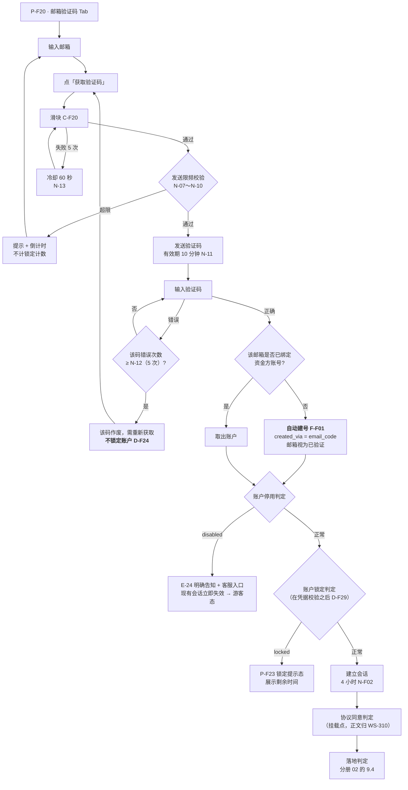
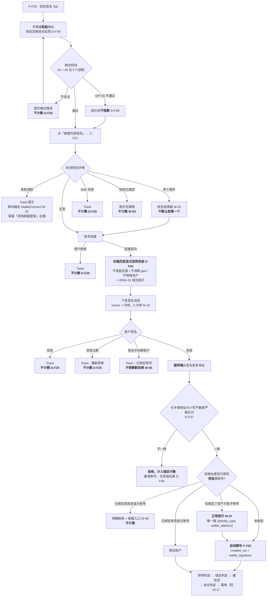
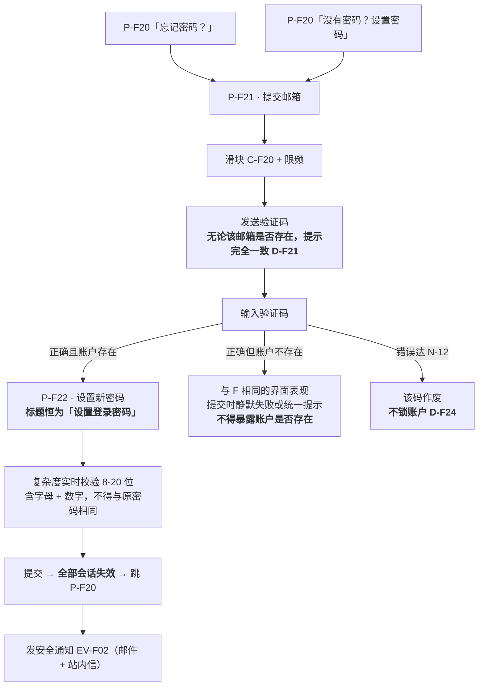
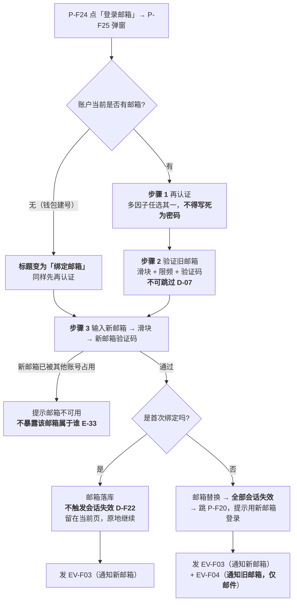
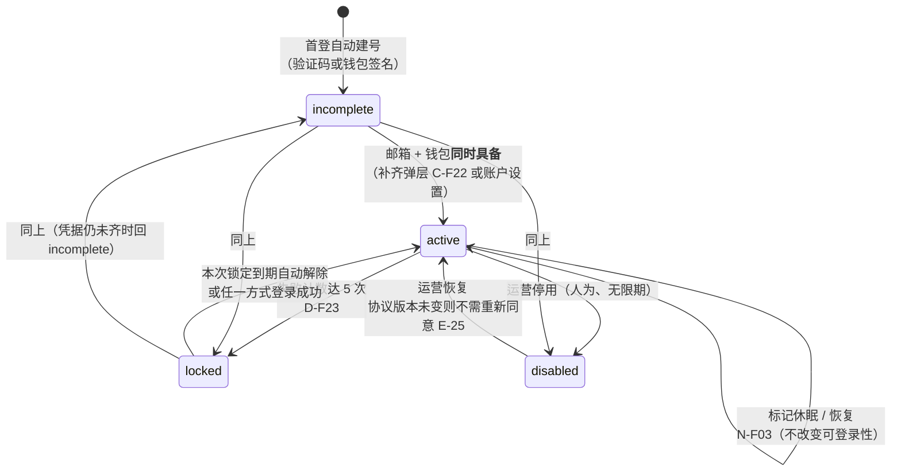

# 资金方登录与账户体系 PRD · 03 钱包、安全与流程

> **本文件是《金融服务平台 · 金融服务端 · 资金方登录与账户体系 PRD》的分册。**
> 入口与全文导航见主文档 [`资金方登录与账户体系.md`](./资金方登录与账户体系.md)。
> 本册装第 **14～18** 章：钱包连接与签名全链路、安全与风控、流程图与状态机、异常分支、数据对象。
>
> **引用约定与主文档一致**：`WS-302 x.x` 指向 [`../../../asset-platform/prd/v1.0-账户与登录/`](../../../asset-platform/prd/v1.0-账户与登录/)；脱敏口径指向 [`../v1.0-账户与登录/01-国际化基线.md`](../v1.0-账户与登录/01-国际化基线.md) 第 8 节。

---

## 14. 钱包连接与签名全链路

### 14.1 基线已覆盖的部分（**引用，不重写**）

`WS-302 7.2.3` 与第 12 章已完整定义以下内容，**本册全部沿用，一个字都不重写**——抄一遍意味着日后两处各自漂移：

| 内容 | 引用 |
| --- | --- |
| **13 条钱包状态的中英 Toast 文案**（未检测到钱包 / 连接成功 / 拒绝连接 / 请求签名中 / 拒绝签名 / 消息过期 / 验签失败 / 地址不一致 / 钱包内切换账户 / 网络不受支持 / 切换成功 / SDK 加载失败等） | `WS-302 7.2.3`、`8.5` |
| 所有钱包提示**统一走顶部居中 Toast** | `WS-302 D-25`、`8.7.1`（组件 `C-F25`） |
| 钱包连接的**能力要求**（连接 / 断开 / 感知账户切换 / 感知与切换网络 / 链上消息签名） | `WS-302 D-29` |
| **断开只影响前端连接态，不解绑账户** | `WS-302 7.2.3` |
| **签名消息必含字段**：域名、账户地址、链 ID、nonce、签发时间、有效期、用途声明，并明确说明不发起交易 / 不转移资产 / 不涉及授权 | `WS-302 7.2.3` |
| **nonce 一次性 + 5 分钟有效** | `WS-302 N-15` |
| 服务端验签与地址一致性校验的位置 | `WS-302 7.2.3`、`8.3` |
| 地址格式校验规则（`0x` + 40 位十六进制、前后空格自动去除、大小写不敏感比对、EIP-55 不通过时提示但不阻断） | `WS-302 8.3` |

> **`D-F38` / `D-F39` 是对基线的重申，不是新增。** 简报把「支持粘贴、前后空格自动去除、EIP-55 提示但不阻断」单列成条，是因为它们在实现中最容易被漏掉；但它们在 `WS-302 8.3` 里本来就有，**数值与规则一律不改**。

### 14.2 手工填写地址的语义（本册必须显式写出）

| 编号 | 口径 |
| --- | --- |
| **`D-F36`** | **保留手工填写钱包地址**，其语义为**账户选择器**（指定登录 / 绑定哪个账户），**不具备身份证明效力**；真正的身份证明始终是钱包消息签名 |
| **`D-F37`** | **服务端必须从签名中恢复签名者地址，与手填地址做大小写不敏感的严格比对，不一致一律拒绝**；前端可先行比对以便快速反馈，但**前端比对不构成防线** |
| `D-F38` | **支持粘贴**：允许从剪贴板粘贴，前后空格自动去除，大小写混合可接受 |
| `D-F39` | 格式校验：`0x` + 40 位十六进制、字符集 `0-9a-fA-F`、必填；**EIP-55 校验和不通过时提示但不阻断**（用户很可能是从区块浏览器复制的全小写地址） |
| **`D-F40`** | **填错地址的后果是「什么也不会发生」**：签名恢复地址必然不符，请求被直接拒绝——**既不会登录到错误账户，也不会用错误地址建出新账户**，重填即可 |

> `D-F40` 是 `D-F36` + `D-F37` 的推论，单列出来是因为评审时最常见的质疑是「让用户手填地址不会填错吗」。答案是会填错，但**填错不产生任何后果**——这正是一致性校验存在的意义。

### 14.3 请求签名前的用途说明（`D-F44`，**本端新增**）

| 编号 | 口径 |
| --- | --- |
| **`D-F44`** | 基线已要求签名消息内含用途声明，但那是**钱包内**文案。**本端页面在请求签名之前须再显式说明一次**：「该签名不会发起交易、不消耗 gas、不会转移任何资产」 |

- **位置**：`C-F21` 面板内、「签名」按钮的**正上方**，钱包签名弹窗弹出**之前**。
- **文案**：见分册 01 的 8.3.3。紧随其后展示 RISK-01 第 2 条（分册 01 的 7.10）。
- **为什么是差异点**（主文档差异 D-9）：钱包内文案要等弹窗弹出来才看得到，那时犹豫的人已经点了取消。零技术成本，直接作用于机构用户的签名完成率（`K-04`）。

### 14.4 链范围与绑定规则

| 编号 | 口径 |
| --- | --- |
| **`D-F41`** | **仅支持 EVM 系列。** 多链需要三套互不相同的验签实现与三套异常文案，在登录环节无对应收益（多链支持转后续迭代 `I-06`） |
| `D-F42` | 钱包清单与连接 SDK **不在 PRD 锁定**，只写能力要求；选型由技术决定（`WS-302 D-29`） |
| **`D-F43`** | 地址与账号**一对一**；**绑定后不可自助更换**，须运营人工核验后在数据层处理并留痕；**服务端必须拒绝任何修改钱包地址的请求，不能只靠前端隐藏入口** |

### 14.5 基线未覆盖的钱包异常（`W-01`～`W-07`）

| 编号 | 场景 | 处理 | 是否计入锁定计数 |
| --- | --- | --- | --- |
| `W-01` | 装了**多个钱包插件**、provider 互相覆盖 | 提供钱包选择器（由 SDK 承担），**不默认取第一个** | — |
| `W-02` | **移动端无插件环境** | 走 WalletConnect 类方案；页面**必须保留「改用邮箱登录」的出路** | — |
| `W-03` | **钱包已锁定**（用户未解锁钱包） | 提示先解锁钱包 | **否** |
| `W-04` | **硬件钱包签名慢** | **不设短超时**；以 nonce 的 5 分钟有效期（`WS-302 N-15`）为准，**UI 不得提前自行超时** | — |
| `W-05` | 签名过程中在钱包里**切换了账户** | 基线已有 Toast；**本册补充**：已绑定账号的用户切到别的地址时**不得静默改绑**，须明确拒绝并说明地址不可更换（`D-F43`） | **否** |
| `W-06` | 该地址**已被另一资金方账号绑定** | 明确拒绝 + 客服入口 | **否** |
| `W-07` | 该地址是某**资产方**在资产平台绑定的地址 | 按 `D-F15` 允许并存，**正常放行** | — |

> **关于 `W-06` 的枚举面**：明确告知「该地址已被占用」会泄漏「这个地址在本平台注册过资金方账号」。此处**接受该泄漏**——钱包地址本就是链上公开信息，且不告知会让用户完全无法理解为什么登不进去。这与邮箱路径的防枚举口径（`D-F13`）不冲突：邮箱是私密标识，地址不是。

---

## 15. 安全与风控

### 15.1 会话与会话失效（强制条款）

| 编号 | 口径 | 引用 |
| --- | --- | --- |
| **`D-F31`** | 会话有效期 **4 小时**（`N-F02`），**不提供「记住我」**（主文档差异 D-1） | 不沿用 `WS-302 N-17` |
| **`D-F32`** | **退出、改密码、设密码、重置密码、改邮箱、账号停用后，该账户的旧会话全部失效（含当前设备）**；**首次绑定凭据（从无到有）不触发** | `WS-302 D-15` / `D-16` / `12.1`（**简报此处并列的 `D-10` 有误，见主文档 0.4 第 3 条**） |
| `D-F33` | 会话失效跳转时**不暂存表单草稿**，仅 Toast 提示内容未保存 | `WS-302 D-31` |
| **`ST-2`** | 会话失效后**回落游客态**，不弹登录框、不进错误页（分册 02 的 9.2） | 本端特有 |

失效范围、被踢出设备的前端表现、失效提示文案、续期与过期提示，**全部沿用 `WS-302 12.1.2`～`12.1.5`**。

### 15.2 登录失败与账户锁定（强制条款）

> **这是全册最容易实现错的一节。`D-F23` 与 `D-F24` 必须一起读：前者说哪三种失败共用一个计数器，后者说哪一种失败不进这个计数器。**

#### 15.2.1 计数规则

| 编号 | 口径 | 引用 |
| --- | --- | --- |
| **`D-F23`** | **账户锁定计数 = 密码登录失败 + 钱包验签失败 + 再认证失败**，三者共用同一计数器，相加满 **5 次**（`N-04`）即锁定 | `WS-302 12.2.1` / `12.2.3` / `D-13` |
| **`D-F24`** | **邮箱验证码输错不计入账户锁定计数**，走独立的 **`N-12`「单个验证码最大错误验证次数 5 次」**，**错满即该码作废、需重新获取，账户不锁定** | `WS-302 12.2.1`「不触发计数的情况」 |
| **`D-F25`** | 其他**不计数**的情形：邮箱不存在或未设密码时的密码登录尝试、用户主动拒绝连接、主动拒绝签名、签名消息过期、钱包未连接、SDK 加载失败、钱包已锁定（`W-03`）、地址格式不合法、网络异常 | `WS-302 12.2.1` |
| `D-F30` | **清零条件**：任一方式登录成功；本次锁定到期自动解除 | `WS-302 12.2.1` |
| **`D-F29`** | **锁定判定必须置于凭据校验之后**；计数与否**不得体现在响应上** | `WS-302 D-17` / `12.2.1` |

**计入计数的三种失败（穷举）**：

| # | 失败 | 出现位置 |
| --- | --- | --- |
| 1 | 邮箱密码登录：**账户存在且已设密码**但密码错误 | `P-F20` 密码 Tab |
| 2 | 钱包消息签名验证失败：验签不通过、**签名恢复地址与手填地址不一致**、消息被篡改 | `P-F20` 钱包 Tab、`C-F21`、`C-F22` |
| 3 | 敏感操作**再认证**时的密码错误与签名验证失败 | `P-F25`、`P-F26` |

> **`D-F29` 的落地含义**：账户已锁定时，**仍要先跑完凭据校验再返回锁定提示**。如果先判锁定，攻击者只要看到「已锁定」就知道这个邮箱对应的账户是存在的——防枚举在这一步破功。

#### 15.2.2 计数维度与阶梯

| 编号 | 口径 | 引用 |
| --- | --- | --- |
| **`D-F26`** | **阶梯锁定**：首次 **10 分钟**（`N-01`）、再次 **30 分钟**（`N-02`）、第 3 次及以后维持 30 分钟；距上次触发满 **24 小时**（`N-03`）未再触发则回首档 | `WS-302 D-12` / `12.2.4` |
| **`D-F27`** | **锁定期间所有登录方式与设置 / 重置密码流程全部不可用**，无提前解除通道；**锁定期间不再下发签名消息** | `WS-302 D-11` |
| `D-F28` | **IP 层并行计数**：同 IP 1 小时失败 **20 次**（`N-06`）→ 后续登录**强制先过滑块**；**不做 IP 封禁**，两层不叠加 | `WS-302 D-14` / `12.2.2` |

剩余次数与阶梯的提示口径（第 3 次起提示剩余次数，`N-05`）沿用 `WS-302 12.2.5`；锁定通知见分册 01 的 7.8（`EV-F05`，**仅邮件**，`WS-302 D-33`）。

### 15.3 滑块人机校验与发送限频（强制条款）

**全部沿用 `WS-302 12.3`，适用范围、交互、服务端校验要求与全部阈值一律不改。** 本册只重申两点：

- **适用范围无例外**：`P-F20` 验证码 Tab、`P-F21` 提交邮箱、`P-F25` 旧邮箱与新邮箱验证、`C-F22` 缺邮箱形态、再认证的邮箱验证码因子——**所有发送邮箱验证码的入口**都要前置滑块 `C-F20`。
- 限频三维度（邮箱 `N-07`/`N-08`、IP `N-09`、设备 `N-10`）与验证码本身的规则（有效期 `N-11`、单码错误上限 `N-12`）沿用基线。

### 15.4 安全审计与日志脱敏

| 编号 | 口径 | 引用 |
| --- | --- | --- |
| **`D-F34`** | **安全审计留痕**，保留 **180 天**（`N-21`） | `WS-302 12.4`、`N-21` |
| **`D-F35`** | **日志脱敏**：邮箱按 `a***@example.com`、钱包地址按缩略格式；**验证码、密码明文与签名内容一律不入日志** | 口径引用[国际化基线](../v1.0-账户与登录/01-国际化基线.md) 第 8 节（主文档差异 D-12） |

**必须留痕的事件（本册范围内）**：

| # | 事件 | 关键留痕内容 |
| --- | --- | --- |
| 1 | 登录成功 / 登录失败 | 方式、时间、IP、设备摘要、失败原因分类（**不含凭据本身**） |
| 2 | 自动建号 | `created_via`、时间 |
| 3 | 账户锁定触发与档位变化 | `lock_tier`、`locked_until` |
| 4 | 密码设置 / 修改 / 重置 | 时间、来源入口（**不含新旧密码**） |
| 5 | 登录邮箱绑定 / 变更 | 新旧邮箱（**脱敏后**）、时间 |
| 6 | 钱包绑定 | 地址、时间 |
| 7 | 钱包地址修改请求**被拒绝** | 请求来源、时间（`D-F43` 的取证依据） |
| 8 | 账号停用 / 恢复 | 操作人、原因、时间 |
| 9 | 空壳账号休眠标记 / 恢复 | 时间（`N-F03`） |

> 第 7 条容易被漏：**被拒绝的请求也要留痕**。`D-F43` 说服务端必须拒绝改绑，但如果拒绝之后什么都不记，就无法发现有人在持续尝试。

---

## 16. 流程图与状态机

### 16.1 邮箱验证码登录（含首次自动建号）

### 16.2 钱包签名登录（手填地址 + 一致性校验，含首次建号）

### 16.3 设置 / 重置密码（同一套流程，两个入口）

### 16.4 修改 / 绑定登录邮箱

### 16.5 账户状态机（`FunderAccount.status`）

> **本状态机只管「能不能登录」。「入驻到哪一步了」是另一层（`FunderApplication.status`），归 WS-316，本册不定义**（主文档差异 D-8）。

| 编号 | 口径 |
| --- | --- |
| **`D-F49`** | **`locked` 与 `disabled` 必须分开**：前者**自动、限时、等待即解**；后者**人为、无限期、只能运营恢复**。合并成一个状态会让「等 10 分钟」和「联系客服」两条完全不同的出路挤进同一句提示 |

### 16.6 凭据完备性状态（**决定 `incomplete` / `active`**）

| 邮箱 | 钱包 | `FunderAccount.status` | 常驻提示条 `C-F23` | 能否提交机构资料（`D-F14`） |
| --- | --- | --- | --- | --- |
| ❌ | ❌ | `incomplete` | 展示「两项都缺」 | ❌ |
| ✅ | ❌ | `incomplete` | 展示「缺钱包」 | ❌ |
| ❌ | ✅ | `incomplete` | 展示「缺邮箱」 | ❌ |
| ✅ | ✅ | `active` | 不展示 | ✅ |

> **密码不出现在这张表里**，因为它不参与判定（`D-F14`）。

---

## 17. 异常分支

**本册只承担登录侧异常**（简报 15.2 中的 `E-24`、`E-26`、`E-27`、`E-29`～`E-33`）。资产方 SSO 异常 `E-01`～`E-17` 归 **WS-314**；入驻与审核异常 `E-20`～`E-23'`、`E-28`、`E-34` 归 **WS-316**。

| 编号 | 场景 | 处理 | 是否计入锁定计数 |
| --- | --- | --- | --- |
| **`E-24`** | 账号被停用（`disabled`） | **凭据校验通过后**明确告知 + 客服入口；现有会话立即失效；**回落游客态**（`ST-2`） | — |
| `E-25` | 停用后恢复 | 回 `active`；**协议版本未变则不需重新同意** | — |
| **`E-26`** | 连续凭据失败触发锁定 | 阶梯锁定（`D-F26`）；`P-F23` 展示本次剩余时间；发 `EV-F05`（**仅邮件**） | **是**（`D-F23`） |
| **`E-27`** | 申请邮箱与已有**资产方影子账号**邮箱相同 | **各自独立，正常放行**（`D-F15` / `D-F16`）；两条记录互不影响 | — |
| `E-28` | 通过后机构信息变更 | 归 **WS-316**，本册不写 | — |
| **`E-29`** | 钱包类异常 `W-01`～`W-07` | 见 14.5；**拒绝连接 / 拒签 / 消息过期 / SDK 失败 / 钱包已锁定均不计数**（`D-F25`） | **否** |
| **`E-30`** | 邮箱验证码连续输错 | 达 `N-12`（5 次）该码作废、需重新获取；**不锁账户**（`D-F24`） | **否** |
| **`E-31`** | 密码登录时「邮箱不存在 / 未设密码 / 密码错误」 | 三者返回**完全一致**的提示（分册 01 的 8.3.2）；**前两者不计数** | 仅第三种计数 |
| **`E-32`** | 「登录（已入驻）」→「登录（未入驻）」降级 | 站内信 + 下次进入时显式说明，**不得静默**（`ST-1`）；结论由 WS-316 产出，本册刷新会话态 | — |
| **`E-33`** | 改邮箱时新邮箱已被其他账号占用 | 明确提示邮箱不可用；**不暴露该邮箱属于谁** | — |
| `E-14` | 会话到期时正在填表 | Toast 提示内容未保存（`D-F33`），**不暂存草稿** | — |

**两条补充异常（本册新增登记）**：

| 编号 | 场景 | 处理 |
| --- | --- | --- |
| **`E-35`** | 用户直接调接口尝试**修改已绑定的钱包地址** | **服务端拒绝**并留痕（15.4 第 7 条）；前端不提供入口。不能只靠前端隐藏（`D-F43`） |
| **`E-36`** | 用户在 `C-F22` 补齐过程中关闭弹层 | **不改变任何状态**，回到原页面原状态；**不触发继续回调**（分册 01 的 7.4.4） |

---

## 18. 数据对象与字段

**只列本册定义的对象。** `FunderApplication`（申请单）与 `InstitutionFormTemplate`（机构信息模版）归 **WS-316**；`AssetPartyShadowAccount`（资产方影子账号）归 **WS-314**；`Session`、`VerificationCode`、`CaptchaTicket`、`SignChallenge`、`SecurityAuditLog` 的结构沿用 `WS-302 14.3`～`14.7`，本册不重复定义。

### 18.1 `FunderAccount`（资金方账户，**本册权威**）

| 字段 | 类型 | 必填 | 口径 | 业务意义 |
| --- | --- | --- | --- | --- |
| `funder_account_id` | 标识 | 是 | **不可变主键** | 账户的唯一身份。**任何映射与外键都用它**，不用邮箱（邮箱可改）、不用钱包（可能为空） |
| `identity_type` | 枚举 | 是 | 恒为 `funder` | 与资产方影子账号区分；参与两组复合唯一键（`D-F15`） |
| `email` | 字符串 | 否 | 唯一键 **`(identity_type, email)`**；可修改，**须验旧邮箱** | **登录邮箱**。与机构资料的业务联系邮箱**是两个字段**（`D-F69`） |
| `email_verified_at` | 时间 | 否 | 验证码校验通过时写入 | |
| `wallet_address` | 字符串 | 否 | 唯一键 **`(identity_type, wallet_address)`**；**绑定后不可自助更换**；服务端统一按小写归一化存储 | 身份标识 + 链上业务主体 |
| `wallet_bound_at` | 时间 | 否 | 绑定落库时写入 | |
| `password_hash` | 哈希 | 否 | **可为空**——密码是可选凭据 | 为空表示该账户从未设过密码。**再认证时不得因此卡死**（分册 01 的 7.6.1） |
| `created_via` | 枚举 | 是 | `email_code` / `wallet_signature` | 建号路径。**不会是 `email_password`**（密码路径不建号） |
| `status` | 枚举 | 是 | `incomplete` / `active` / `disabled` / `locked` | **只表示能否登录**，不表示入驻进度（16.5） |
| `failed_attempts` | 整数 | 是 | 密码失败 + 验签失败 + 再认证失败之和（`D-F23`）；**不含验证码错误** | 锁定计数器 |
| `lock_tier` | 整数 | 是 | 锁定档位；距上次触发满 24 小时回首档 | 阶梯锁定（`D-F26`） |
| `locked_until` | 时间 | 否 | 本次锁定的解除时间 | `P-F23` 展示剩余时间的依据 |
| `agreement_version_accepted` | 字符串 | 否 | 已同意的**本端**协议版本 | 挂载点，语义归 **WS-310** |
| `last_active_at` | 时间 | 是 | 空壳账号休眠判定（`N-F03`） | 180 天无活跃且未提交资料 → 标记休眠 |
| `dormant_at` | 时间 | 否 | 休眠标记时间；**再次登录自动清空** | **标记而非删除**，保留审计（`N-F03`） |
| `disabled_at` / `disabled_by` / `disabled_reason` | — | 否 | 停用留痕 | `E-24` 的告知依据 |

### 18.2 本册**不**定义的字段（防止被顺手加进来）

| 字段 | 归属 | 为什么不能放在 `FunderAccount` |
| --- | --- | --- |
| `contact_email`（业务联系邮箱） | **WS-316**（机构资料） | 与登录邮箱解耦是硬要求（`D-F69`）。放进本对象，两者迟早会被同一个更新接口一起改掉 |
| `application.status` / `version` / `template_version` | **WS-316** | 入驻进度与账户可用性是两层（差异 D-8）。合并会让「审核被驳回」误伤成「账号不能登录」 |
| `institution_identifier`（机构唯一标识） | **WS-316** | 查重依据属申请单，不属账户 |
| `verification_status` | **WS-314**（资产方影子账号） | 资金方不做实名认证（简报 16.3 `N-08`） |

---
