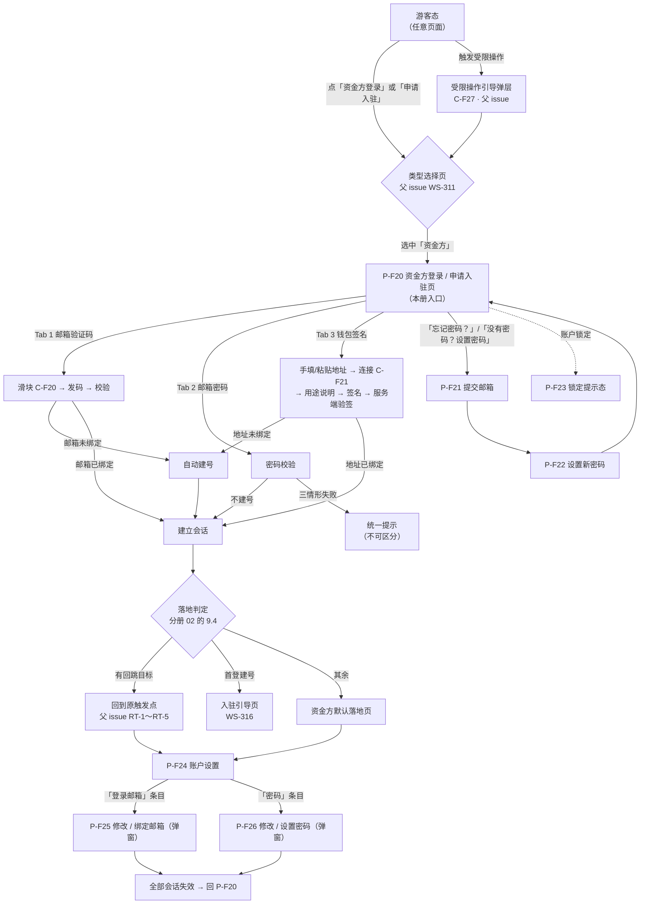

# 金融服务平台 · 金融服务端 · 资金方登录与账户体系 PRD

> **本 PRD 是「差异型 + 引用型」文档，不是 WS-302 的复制件。**
> 与资产端（WS-302《资产端 / 资产管理端 · 账户与登录 PRD》）一致的规则**只给编号 + 一句话 + 指向原文的相对路径**，不重写、不改数值。只有**资金方特有**、**由需求方本轮落定**、或**必须与资产端不同**的内容才展开，且每一处不同都在 [3.6](#36-与资产端的差异点逐条说明) 逐条写明「差异点 + 为什么」。
> 凡是引用条目，**规则细节以被引用的原文为准**，本文档不做第二份定义——抄一遍意味着日后两处各自漂移。

## 0. 导航索引

### 0.1 文件清单

| 文件 | 装了哪些章节 | 给谁看 |
| --- | --- | --- |
| **`资金方登录与账户体系.md`**（本文件） | **0** 导航 ｜ **1** 文档信息 ｜ **2** 背景与目标 ｜ **3** 范围、边界与三处接缝 ｜ **4** 角色与用户故事 ｜ **5** 信息架构与页面清单 ｜ **6** 功能清单 ｜ **10** 非功能 ｜ **11** 指标 ｜ **12** 依赖与风险 ｜ **13** 口径与参数汇总 ｜ **附录 A** 口径确认与未定项清单 | 所有人的入口 |
| [`资金方登录-01-模块详情与页面字段.md`](./资金方登录-01-模块详情与页面字段.md) | **7** 模块详情（M1～M10）｜ **8** 页面字段与双语文案增量 | 设计与前端；写登录、密码、改邮箱、账户设置时以本册为准 |
| **[`资金方登录-02-三态与权限框架.md`](./资金方登录-02-三态与权限框架.md)** | **9** 三态与权限框架：判定依据、切换时机、落地与回跳的表达、引导文案口径、**留空的权限矩阵骨架与填表规则** | **父 issue、兄弟 issue 与所有展示类功能**。本轮需求方新增口径的落点，单独成册以便被独立引用 |
| [`资金方登录-03-钱包、安全与流程.md`](./资金方登录-03-钱包、安全与流程.md) | **14** 钱包连接与签名全链路 ｜ **15** 安全与风控（会话 / 锁定与计数 / 限频 / 审计与脱敏）｜ **16** 流程图与状态机 ｜ **17** 异常分支 ｜ **18** 数据对象 | 开发与测试；做钱包交互与风控时以本册为准 |
| [`资金方登录-04-验收标准.md`](./资金方登录-04-验收标准.md) | **19** 验收标准 `AC-F201`～`AC-F296` | 测试与验收；每条可独立执行 |

**章节 → 文件对照**

| 章节 | 所在文件 |
| --- | --- |
| 0～6、10～13、附录 A | 本文件 |
| 7、8 | [`资金方登录-01-模块详情与页面字段.md`](./资金方登录-01-模块详情与页面字段.md) |
| **9** | **[`资金方登录-02-三态与权限框架.md`](./资金方登录-02-三态与权限框架.md)** |
| 14～18 | [`资金方登录-03-钱包、安全与流程.md`](./资金方登录-03-钱包、安全与流程.md) |
| 19 | [`资金方登录-04-验收标准.md`](./资金方登录-04-验收标准.md) |

> **为什么拆册**：正文合计已超过 `prd-generation` 的 600 行硬门槛，且四块内容面向的读者明显不同（框架口径 / 设计与前端 / 风控实现 / 测试）。**拆分只改文件边界，不改内容、不改编号**——章节号 0～19 跨四个文件连续且不重复，编号体系与交叉引用完整保留。

### 0.2 编号体例与段位

金融服务端（面客侧）自成一套编号，统一采用 **`-F` 后缀**（F = Financial service end / 面客侧），与资产平台的 `-A` / `-M`、金融服务平台运营端的 `-O` 三套编号空间**完全不重叠**。同一仓库内撞号会让评审与验收无法定位。

本模块（WS-315 / 拆分建议 A2）在 `-F` 空间内占用以下段位。

> ### ⚠️ 全表为**暂定值，待父 issue WS-311 裁决**
>
> 需求方 2026-09-10 答复第 3 条：**编号段位「等会让父 issue 定」**。因此下表**不是已生效的分配结果**，而是本册先行占用并如实登记的暂定值。
>
> - **裁决之前**：本版编号即现行编号，**其他册（WS-314 / WS-316）引用本册条目时以本版为准**，不要另猜一套。
> - **裁决之后**：若父 issue 另有分配，本册**整体平移到新段位，规则与内容一个字不改**。
> - 本轮**刻意不动任何编号**——在裁决前后各改一次等于返工两次。

| 编号 | 含义 | 定义位置 | 状态 |
| --- | --- | --- | --- |
| `P-F20`～`P-F29` | 页面 | 5.1 | **暂定，待 WS-311 裁决** |
| `C-F20`～`C-F29` | 组件 | 5.1 | **暂定，待 WS-311 裁决** |
| `F-F01`～`F-F25` | 功能点 | 第 6 章 | **暂定，待 WS-311 裁决** |
| `D-F01`～`D-F76` | 已确认口径（简报既有） | 简报第 19 章 | **已定**——沿用，不重编 |
| `D-F81`～`D-F99` | 已确认口径（本册 PRD 阶段新落定） | 13.3 | **暂定，待 WS-311 裁决** |
| `N-F04`～`N-F09` | 本模块可调参数 | 13.2 | **暂定**（本册未实际使用；简报已用 `N-F02` / `N-F03`，`N-F01` 已作废，见 `R-24`） |
| `EV-F01`～`EV-F05` | **通知事件** | 7.8 | **暂定，待 WS-311 裁决**——本编号是为规避 `X-N1` 冲突而新起的，见 0.2.1 |
| `E-##` | **异常分支** | 第 17 章 | **暂定**——沿用简报 15.2 的既有编号，但该前缀存在 `X-N1` 冲突，见 0.2.1 |
| `AC-F201`～`AC-F296` | 验收标准 | 第 19 章 | **暂定，待 WS-311 裁决** |

**本册向父 issue 提交的三方切分建议**（供裁决参考，非结论）：

| 子 issue | 页面 / 组件 | 验收标准 |
| --- | --- | --- |
| A1 · WS-314 资产方登录 | `P-F01`～`P-F19` / `C-F01`～`C-F19` | `AC-F001`～`AC-F199` |
| **A2 · WS-315 本册** | `P-F20`～`P-F39` / `C-F20`～`C-F39` | `AC-F201`～`AC-F399` |
| A3 · WS-316 机构认证审核 | `P-F40`～`P-F59` / `C-F40`～`C-F59` | `AC-F401`～`AC-F599` |

> 建议的依据只有一条：**段位要留出余量**。本册实际只用到 `P-F20`～`P-F26`、`C-F20`～`C-F28`、`AC-F201`～`AC-F296`，按 20 个页面号 / 200 个验收号切分，是为了让后续补条目不必再申请一次段位。

#### 0.2.1 两处编号冲突（**暂定处理，待父 issue WS-311 裁决**）

这两处不是本册可以单方面解决的——冲突的另一半在简报与 WS-302 里，改法要由持表方定。写在这里是为了不让它们在实现期才被发现。**下表第 4 列是本册的暂定处理，不是结论。**

| # | 冲突 | 说明 | 本册暂定处理（**待 WS-311 裁决**） |
| --- | --- | --- | --- |
| **X-N1** | **`E-##` 被同时用于两种对象** | 简报 15.2 用 `E-01`～`E-34` 表示**异常分支**；WS-302 12.5.2 用 `E-03` / `E-05` / `E-09`～`E-11` 表示**通知事件**。两套编号在本模块同时出现，且 `E-03` / `E-05` / `E-09` / `E-10` / `E-11` **五个号在两套里都有定义、含义完全不同** | **暂定**：通知事件另起 `EV-F##`，每条标注它对应的 WS-302 事件号（写作 `WS-302 E-03`，不写裸 `E-03`）；异常分支沿用简报的 `E-##`。**裁决前请勿在本模块范围内出现裸 `E-03` 这类写法**——它同时指两个东西 |
| **X-N2** | **`D-F70` 被用了两次** | 简报 5.2 的 `D-F70`（展示类功能不得自读原始状态字段）与 13 章的 `D-F70'`（矩阵 ⊘ 与 ❌ 由服务端强制）是两条不同口径，**共用一个号，仅靠一个撇号区分** | **暂定**：本册引用这两条时一律写全称而非裸编号。两条口径本身都归**父 issue**（接口契约 + 权限矩阵），因此**重新编号也应由父 issue 执行**，本册不擅自改简报的号 |

> **为什么现在只标注、不动手**：`X-N1` 与 `X-N2` 的号都不是本册发的——`E-##` 来自简报，`D-F70` 的两条口径都归父 issue。本册单方面改，会让本册与简报、与兄弟册对不上，比冲突本身更难查。

#### 0.2.2 与兄弟册 WS-314 的实际撞号（**入库时已发生，非假设**）

WS-314《资产方登录》的三分册于 2026-09-10 先于本册入库到**同一目录**，其 0.2 也自取了一套 `-F` 段位。两套段位是各自独立拟定的，**已经真实撞上**。下表是入库时逐条比对的结果，供父 issue WS-311 裁决时直接使用。

| 前缀 | WS-314 自取 | WS-314 建议给 WS-315 | 本册实际使用 | 结果 |
| --- | --- | --- | --- | --- |
| `P-F##` | `P-F01`～`P-F09` | `P-F10`～`P-F29` | `P-F20`～`P-F26` | ✅ **不撞**（本册落在其建议区间内） |
| `AC-F##` | `AC-F01`～`AC-F59` | `AC-F60`～ | `AC-F201`～`AC-F296` | ✅ **不撞**（区间不同，但双方对起点的设想不一致） |
| `N-F##` | `N-F10`～`N-F19` | `N-F20`～ | 段位声明为 `N-F04`～`N-F09`，**实际一个未用** | ✅ **不撞**（本册无实际取号） |
| **`F-F##`** | **`F-F01`～`F-F19`** | `F-F20`～`F-F49` | **`F-F01`～`F-F25`** | ❌ **硬撞**：`F-F01`～`F-F19` 共 19 个号在两册中都有定义、含义完全不同 |
| **`D-F##`（PRD 阶段新增）** | **`D-F80`～`D-F99`** | `D-F100`～ | **`D-F81`～`D-F86`** | ❌ **硬撞**：`D-F81`～`D-F86` 六个号两册各有一套定义 |
| **`US-F##`** | **`US-F01`～`US-F09`** | 简报原号沿用 | **`US-F01`～`US-F10`** | ❌ **硬撞**：`US-F01`～`US-F09` 九个号两册各有一套用户故事 |

**本册不单方面改号的理由**：需求方 2026-09-10 已裁定段位「等会让父 issue 定」。此时任一册自行让号，都会让**另一册连带失效**（引用它的兄弟册、验收清单、原型标注全部要跟改），而且谁让号本身就是需要持表方决定的事。**两册各自的编号在裁决前均以本版为准**（见 0.2 开头）。

**给裁决的一条建议**：撞号集中在 `F-F` / `D-F8x` / `US-F` 三处，且都是**纯标识符、不含口径**——裁决只需指定「谁平移到哪一段」，两册的正文内容与规则都不必动。本册按新段位平移的成本是一次全文替换。

### 0.3 引用基准与路径

**引用基准：仓库 `wxblockchain/Chain-Financing`，分支 `cly-V1.0.0`。**

| 引用对象 | 写法 | 路径（从本文件所在目录出发） |
| --- | --- | --- |
| **WS-302《资产端 / 资产管理端 · 账户与登录 PRD》** | `WS-302 7.2.3`、`WS-302 D-17`、`WS-302 N-04` | [`../../../asset-platform/prd/v1.0-账户与登录/`](../../../asset-platform/prd/v1.0-账户与登录/) |
| **金融服务平台 · 国际化与全局展示基线（含脱敏基线）** | `国际化基线 5` | [`../v1.0-账户与登录/01-国际化基线.md`](../v1.0-账户与登录/01-国际化基线.md) |
| **平台通知契约 · 接入指南**（四端共用） | `接入指南 4.2` | [`../../../docs/notification-contract/接入指南.md`](../../../docs/notification-contract/接入指南.md) |
| 父 issue WS-311 主干（类型选择页、回跳、权限矩阵、接口契约） | `父 issue 5.2` | 同目录主文档 |
| 兄弟册 A3（WS-316 资金方机构认证审核） | `WS-316` | 同目录 |

WS-302 的章节 → 文件对照（本册引用时按此定位）：

```
asset-platform/prd/v1.0-账户与登录/
├── v1.0-账户与登录-PRD.md      # 1～6、11、15～17、19（含 D-01～D-46、N-01～N-23、F-01～F-37）
├── 01-模块详情.md               # 7
├── 02-页面字段与双语文案.md      # 8、13
├── 03-流程图与状态机.md          # 9、10、14
├── 04-安全与风控.md             # 12.1～12.4
├── 05-消息通知与邮件模板.md      # 12.5、12.6（E-03…、M-02…）
└── 06-验收标准.md               # 18
```

#### 0.3.1 一处刻意的例外：国际化与脱敏不引用资产端

需求方本轮口径是「与平台无关的通用口径一律引用资产端编号」。**国际化与脱敏是这条规则唯一的例外**，理由不是本册的偏好，而是仓库既有约定：

- [`financial-service-platform/prd/README.md`](../README.md) 的「平台级基线」段落明确写着本平台的国际化与脱敏基线**不跨平台引用资产平台的同类章节**，已在 WS-308 落定为独立分册 [`../v1.0-账户与登录/01-国际化基线.md`](../v1.0-账户与登录/01-国际化基线.md)，适用范围是**金融服务平台全平台（金融服务端 + 运营端）**。
- 该分册的第 1～7 节本身就是 WS-302 第 13 章的整章抄写（源版本 `d3602ed`），取值一致；第 8 节脱敏基线是本平台新增，WS-302 没有对应章节。
- 因此本册引用它，**取到的数值与引用 WS-302 第 13 章完全相同**，同时不违反仓库约定，还额外拿到了 WS-302 没有的脱敏基线。

> 若需求方希望本册改为直接引用 WS-302 第 13 章，请明示——那将与 `prd/README.md` 的既定约定冲突，需要同时修订该 README。

### 0.4 对上游引用编号的校正（**不改口径，只改编号指向**）

《需求诊断简报 V4.0》有 4 处引用了错误的 WS-302 编号。**简报的口径结论全部正确且不变**，错的只是「去哪查」的指针。本册按下表使用正确编号，实现与评审时以本表为准。

| # | 简报原文 | 问题 | 正确指向 |
| --- | --- | --- | --- |
| 1 | 8.1 / 17.1「**D-05** / 7.1.2 密码路径不建号，三情形返回完全一致的提示」 | WS-302 `D-05` 实为「钱包地址的输入方式（手工填写 + 服务端一致性校验）」 | 密码路径不建号 → **`WS-302 D-01`**（其结论含「邮箱密码登录不参与建号」）与功能点 **`F-03`**；三情形提示一致 → **`WS-302 D-17`**。章节 **7.1.2** 引用正确 |
| 2 | 8.1 / 17.1「**D-04** / 7.2.4 三方式同账户」 | WS-302 `D-04` 实为「登录后的落地规则」 | 三方式同账户 → 功能点 **`WS-302 F-05`**，规则见 **7.2.4**；该结论在 WS-302 中**没有对应的 D 编号** |
| 3 | 17.1「**D-10** / D-15 / D-16 会话失效语义与首次绑定例外」 | WS-302 `D-10` 实为「导航结构」 | 会话失效语义与首次绑定例外 → **`WS-302 D-15` / `D-16`** 与 **12.1**；`D-10` 应删去 |
| 4 | 8.2「发送前过滑块（**D-12** / D-27）」 | WS-302 `D-12` 实为「锁定时长阶梯」 | 滑块 → **`WS-302 D-27`** 与 **12.3**。（`D-12` 在简报 `D-F26` 阶梯锁定处的引用是**正确**的，只有 8.2 这一处用错） |

> 另有一条**不是错误、但容易被漏引**：简报 `D-F23`「密码失败与验签失败共用同一计数器」除 12.2.1 / 12.2.3 外，还对应 **`WS-302 D-13`**；简报未列出该编号。

---

## 1. 文档信息

| 项目 | 内容 |
| --- | --- |
| 文档名称 | 金融服务平台 · 金融服务端 · 资金方登录与账户体系产品需求文档 |
| 对应需求 | **WS-315**「金融服务端 · 资金方登录与账户体系」（父 issue **WS-311**「金融平台-金融服务端-登录」；对应《子 issue 拆分建议 V2.0》的 **A2**） |
| 上游输入 | 《金融服务平台 · 金融服务端 · 登录与身份 需求诊断简报 **V4.0**（收口版 · Phase 1 定稿）》（程功立，2026-09-09）+《子 issue 拆分建议 V2.0》2.A2 + WS-315 issue 描述的范围边界 + 需求方 2026-09-09 的三条收窄口径 |
| 编写人 | 许楚清（需求分析师） |
| 文档语言 | 中文（界面文案给出中英对照） |
| 覆盖端 | **金融服务平台 · 金融服务端（面客 Web）**，且**只覆盖「被选中『资金方』之后」的分支**。不含资产方链路、不含运营端 |
| 引用基线 | **WS-302**《资产端 / 资产管理端 · 账户与登录 PRD》，`cly-V1.0.0`，**只引用其中的「资产端」部分**（管理端部分见 [3.5](#35-明确不沿用的基线内容)）；**国际化与脱敏**引用本平台基线（见 [0.3.1](#031-一处刻意的例外国际化与脱敏不引用资产端)） |
| 关联需求 | **父 issue WS-311**（类型选择页、回跳实现、权限矩阵持表、接口契约）；**WS-314 / A1**（资产方 SSO 与影子账号）；**WS-316 / A3**（入驻引导页、机构资料表单、申请单状态机、人工审核）；**WS-310**（协议正文与版本策略）；**WS-304 / 接入指南**（站内信数据契约） |
| 交付形态 | 独立 PRD（本册 + 2 个分册）+ 完整原型（原型另行交付，不在本文档内） |
| 入库落点 | `financial-service-platform/prd/v1.0-金融服务端登录/`，分支 `cly-V1.0.0`（**本轮先只交附件，不推送**） |

---

## 2. 背景与目标

### 2.1 背景

金融服务端是跨境链融平台的面客 Web，同时服务两类身份：**资产方**从资产平台带身份进来（SSO + 影子账号，归 WS-314），**资金方**在本端自助建号（归本册）。需求方已明确「资金方登录可参考资产平台资产端的用户登录，规则一样」「邮箱和钱包地址是并列的」。

因此本模块的产品事实是一句话：**资金方账户体系 = 把资产端那套账户与登录原样复制一份到金融服务端——规则一致，数据独立，账号独立。**

这决定了本 PRD 的写法：**核心工作是「引用 + 标差异」，不是「新写一套」**。凡是本册展开写的内容，都应当能在 [3.6](#36-与资产端的差异点逐条说明) 找到它为什么必须不同。

### 2.2 本期目标

| # | 目标 | 检验方式 |
| --- | --- | --- |
| G-1 | 资金方能用**三种方式中的任意一种**登入同一个账号，且验证码 / 钱包签名首登自动建号 | `AC-F201`～`AC-F215` |
| G-2 | 「申请入驻」与「资金方登录」是**同一条链路的两个入口标签**，代码与文档中不存在两套流程 | `AC-F216`～`AC-F220` |
| G-3 | 凭据完备性硬门槛与就地补齐弹层组件**在本册定义完整、可被 WS-316 直接调用**，两侧服务端都校验 | `AC-F236`～`AC-F244` |
| G-4 | 锁定与计数的口径**准确落地**：密码失败 + 验签失败 + 再认证失败共用计数器；验证码输错走独立上限、不锁账户 | `AC-F260`～`AC-F272` |
| G-5 | 钱包连接与签名全链路可用，且**填错地址不会造成任何错误后果** | `AC-F245`～`AC-F259` |
| G-6 | **三态（游客 / 登录（未入驻）/ 登录（已入驻））的判定规则与切换时机明确、由服务端输出**，展示类功能不再各自解释状态 | `AC-F285`～`AC-F292` |
| G-7 | 账户失联风险的两条零成本缓解文案**上线即在位** | `AC-F293`、`AC-F294` |

### 2.3 本期明确不做

沿用简报 16.3，与本册相关的条目：

| # | 不做项 | 理由 |
| --- | --- | --- |
| N-03 | 资金方走 SSO | 资金方不在资产平台，无身份源 |
| N-04 | 短信验证码 / UKey / CA | 跨境短信成本与到达率不划算；UKey 依赖驱动与插件 |
| N-05 | 强制双因素登录 | `D-F11`；需要时只对敏感动作要求再认证（后续迭代 I-01） |
| N-06 | 输邮箱自动判定身份并路由 | 构成账户枚举，违反 `WS-302 D-17`。**否决论证见 [3.7.1](#371-d-f09-输邮箱自动判定身份的否决为什么必须写进-prd)**（判定页本身归父 issue，但否决理由与本册的防枚举口径同源，必须一并留档） |
| N-07 | 「记住我」 | `D-F31` |
| N-09 | 多链钱包 | `D-F41`，仅支持 EVM 系列 |
| N-10 | 自助修改钱包地址 | `D-F43` |
| N-13' | 账户恢复通道 | 需求方裁定本期不做；风险登记见 [12.2 RISK-01](#122-已知风险) |

---

## 3. 范围与边界

### 3.1 本册包含

| 内容 | 简报位置 | 关键编号 | 本册章节 |
| --- | --- | --- | --- |
| 与资产端同构的账户体系总口径 | 8.1 | — | 2.1、3.6 |
| 三种登录方式并列（邮箱验证码 / 邮箱密码 / 钱包签名） | 8.2 | `D-F11` | 7.2 |
| 「申请入驻」与「资金方登录」同链路双入口 | 8.3 | `D-F12`、`D-F13` | 7.3 |
| 凭据完备性硬门槛与就地补齐弹层（**组件定义由本册提供**） | 8.4 | `D-F14` | 7.4 |
| 唯一键与双身份并存 | 8.5 | `D-F15`、`D-F16` | 7.9 |
| 密码：复杂度、设置 / 重置 / 修改 | 9.1、9.2 | `D-F17`～`D-F21` | 7.5 |
| 改邮箱与再认证 | 9.3 | `D-F22` | 7.6 |
| 锁定与计数 | 9.4 | `D-F23`～`D-F30` | 15.2（分册 03） |
| 会话与安全、审计留痕、日志脱敏 | 9.5 | `D-F31`～`D-F35` | 15.1、15.4（分册 03） |
| 钱包连接与签名全链路 | 第 10 章 | `D-F36`～`D-F44`、`W-01`～`W-07` | 第 14 章（分册 03） |
| 资金方账户设置页 | 13 章资金方列 | — | 7.7 |
| 登录侧异常分支 | 15.2 | `E-24`、`E-26`、`E-27`、`E-29`～`E-33` | 第 17 章（分册 03） |
| **三态权限框架（只给框架，不给清单）** | 需求方本轮口径 | — | 第 9 章（分册 02） |
| RISK-01 两条缓解文案 | 20.2 | — | 7.10 |

### 3.2 本册明确不含（含归属）

| 不含项 | 归属 | 本册与它的关系 |
| --- | --- | --- |
| **类型选择页本身**（含防枚举 `D-F09` 的落点） | **父 issue WS-311** | 本册只负责「被选中『资金方』之后」的表单；本册**不新建入口页** |
| **回跳 `return_to` 的实现**（`RT-1`～`RT-5`） | **父 issue WS-311，唯一实现** | 本册**只调用不实现**；同源白名单校验只做一边就是开放重定向漏洞 |
| **权限与降级矩阵的定义与持表** | **父 issue WS-311** | 本册只提供**三态判定规则 + 留空骨架**，**不列举功能项**（第 9 章，分册 02） |
| **受限操作引导弹层组件的定义** | **父 issue WS-311** | 本册只提供「凭据未齐」这一种情形的文案与就地补齐弹层组件 |
| **接口契约 5.2 的四字段定义** | **父 issue WS-311** | 本册是该契约中 `identity_type = funder` 部分的**生产方之一**，只声明本册负责输出哪几项 |
| **入驻引导页、机构资料表单、申请单状态机、人工审核** | **WS-316 / A3** | 本册**不写**；接缝见 3.3 |
| **资产方的 SSO、影子账号、跨端会话联动 `S-4`** | **WS-314 / A1** | 本册**不写**；资产方在本端**没有任何本地凭据**，这是两册最干净的一条分界 |
| **协议正文、版本策略、强制重新同意弹窗细则** | **WS-310** | 本册只做勾选与留痕的**挂载点**（7.2.5） |
| **站内信的展示形态**（消息中心、铃铛、未读角标） | WS-304 / 接入指南 | 本册只定义**触发时点与消息内容**（7.8） |

### 3.3 与 WS-316（A3）的显式接缝：凭据完备性硬门槛 `D-F14`

**这是 3 分法下新出现的真实接缝。不切清楚的后果不是重复实现，而是两边都不做**——本册认为门槛属 A3、A3 认为凭据属本册，最终没人实现这道校验，用户带着缺失的钱包地址一路提交到审核环节才被发现。

| 项 | 归属 |
| --- | --- |
| **凭据的定义与状态**（邮箱、钱包各自是否具备） | **本册**（7.4.1） |
| **就地补齐弹层组件 `C-F22`**（缺钱包 / 缺邮箱 / 两项都缺三种形态） | **本册**（7.4.3） |
| **补齐成功后「原地继续」的回调契约** | **本册**（7.4.4） |
| **在「提交机构资料」这一动作上调用该校验** | **WS-316** |
| **未通过时唤起 `C-F22`、补齐后原地继续提交流程（不跳走）** | **WS-316** 调用本册组件 |
| **服务端校验** | **两侧都要做**：本册在凭据变更接口上维护状态，WS-316 在提交接口上拒绝不满足门槛的请求。前端弹层不是唯一防线 |

### 3.4 公共约束（三个子 issue 共同适用，本册不得改写）

| # | 约束 |
| --- | --- |
| 1 | 回跳一律调用父 issue 定义的统一实现（`RT-1`～`RT-5`），本册**不得自行实现 `return_to` 的参数解析或跳转**，也不得自行做同源白名单校验 |
| 2 | 用户类型选择页归父 issue。**防枚举 `D-F09`（不得输邮箱自动判定身份）挂在类型选择页上，归父 issue**；本册负责 `D-F13` / `D-F21`（登录路径三情形提示一致、标题中性） |
| 3 | 权限与降级矩阵、受限操作引导弹层组件的定义归父 issue，本册**只提供自己那部分文案与判定规则，不得改动定义或另建组件** |
| 4 | 上游输入是《需求诊断简报 **V4.0**》。**第 0 章修订点清单必读，尤其 `R-24`：撤回机制已整段删除。** 任何过程材料中出现的撤回按钮、撤回状态、「24 小时最多 2 次」一律为过期内容 |

### 3.5 明确不沿用的基线内容

| 引用 | 内容 | 说明 |
| --- | --- | --- |
| `WS-302 7.7.x` / `D-19`～`D-22` / `N-19` | 管理端分配账号、首登强制重置、初始密码 7 天、单角色 | 属**管理端**；金融服务平台的对应内容归 **WS-308**（已定稿） |
| `WS-302 P-A01`～`P-A17` / `P-M01`～`P-M05` | 资产平台的**全部页面** | **只复用规则，不复用页面**。本册页面另行编号（5.1） |
| `WS-302 N-17`「记住我」30 天 | 「记住我」 | `D-F31` 不提供（差异 D-1） |
| `WS-302 7.3` / `D-22` | 资产端协议勾选与强制重新同意弹窗细则 | 本端协议由 **WS-310** 承接；本册只做勾选与留痕的挂载点 |
| `WS-302 7.4.1` `P-A10` 建号后引导页 | 建号后的整页引导 | 本端建号后的引导页承载「入驻引导」，**页面归 WS-316**；本册只定义移交点与凭据保管须知文案（7.2.6） |
| `WS-302 D-04` 落地规则 | 认证未完成 → 用户中心 / 企业认证通过 → 总览页 | 本端有回跳机制，落地规则不同（差异 D-6，见分册 02 的 9.4） |

### 3.6 与资产端的差异点（逐条说明）

需求方口径：与平台无关的通用规则**只引用编号、不重写、不改数值**；**确需不同的地方逐条写明「差异点 + 为什么」**。以下是全部差异，**没有列在这张表里的规则一律与资产端一致**。

| # | 项 | 资产端（WS-302） | 本册（资金方） | 为什么必须不同 |
| --- | --- | --- | --- | --- |
| **D-1** | 会话有效期与「记住我」 | `N-17`：会话 4 小时 / 「记住我」30 天 | 会话 **4 小时**（`N-F02`），**不提供「记住我」** | `D-F31`。资金方是机构账户，办公设备常被多人共用或流转；30 天长会话把「设备被别人用到」变成默认风险，而资金方账户直接关联出资动作 |
| **D-2** | 凭据硬门槛拦截的动作 | `7.5.2`：拦「发起个人认证」 | 拦「**提交机构入驻资料**」（`D-F14`） | 本端不做实名认证（简报 16.3 N-08），资金方对应的准入动作是机构入驻。**规则形状完全一致，只换了被拦的那个动作** |
| **D-3** | 硬门槛的实现归属 | 同一模块内定义 + 调用 | **定义与组件在本册，调用点在 WS-316，两侧服务端都校验** | 3 分法下的接缝（3.3）。资产端不存在这个问题，因为它没有被拆开 |
| **D-4** | 登录入口的标签 | 单一「登录」入口（`P-A01`） | **「资金方登录」与「申请入驻」两个入口标签，同一条链路、同一套凭据校验与建号逻辑**（`D-F12`） | 需求方描述的入驻路径与基线 `WS-302 D-01`「首登即建号」是同一套机制。不写清楚会被拆成两套并行维护，页面数与状态数直接翻倍 |
| **D-5** | 建号后的引导 | `P-A10` 引导页：补另一项凭据 + 设密码 | 建号后移交 **WS-316 的入驻引导页**；本册只定义移交点、凭据保管须知文案与「稍后再维护」的回落 | 本端建号后的下一步是机构入驻而不是个人认证；引导页的内容主体属 A3 |
| **D-6** | 登录后落地规则 | `D-04`：认证未完成 → 用户中心；企业认证通过 → 总览页 | **回跳目标优先**（父 issue `RT-1`～`RT-5`）；无回跳目标时落资金方默认落地页 | 本端有游客态与回跳机制，资产端没有。用户是从某条资产上被引导来登录的，把他丢到用户中心等于让他重新找一遍 |
| **D-7** | 唯一键 | `email` / `wallet_address` 各自单列唯一 | **`(identity_type, email)` 与 `(identity_type, wallet_address)` 两组复合唯一键** | `D-F15` / `D-F16`：同一钱包地址允许同时是资产方与资金方。资产方凭据是对端快照（只读），资金方凭据是本端权威，语义不同，**放进同一张唯一索引会让合法的双身份用户被误判为重复** |
| **D-8** | 账户状态的层数 | 单层 `Account.status` | **双层**：`FunderAccount.status`（能否登录，本册）+ `FunderApplication.status`（权限等级，**归 WS-316**） | 资金方的准入结论来自机构审核，与账户可用性是两件事：审核被驳回不等于账号不能登录 |
| **D-9** | 请求签名前的用途说明 | 签名消息内含用途声明（**钱包内**文案，`12.x`） | **额外**在本端页面、请求签名**之前**显式说明「不发起交易、不消耗 gas、不转移任何资产」（`D-F44`） | 机构用户对钱包签名的戒备显著高于个人用户，而钱包内文案要等弹窗弹出来才看得到——那时犹豫的人已经点了取消。零技术成本，直接作用于签名完成率（`K-04`） |
| **D-10** | 空壳账号 | 无对应机制 | `N-F03`：**180 天**无活跃且未提交资料 → 标记休眠（**不删除**，保留审计），再次登录自动恢复 | 本端「申请入驻」是公开入口，会沉淀大量只建号不入驻的空壳账号；资产端的建号总是伴随实名认证意图 |
| **D-11** | 凭据丢失的告知 | `7.5.4`：两处告知（引导页须知、账户设置说明） | 沿用两处，**并新增两条 RISK-01 缓解文案**：建号引导与账户设置处的企业邮箱建议、钱包绑定处的长期可访问提示（7.10） | 触发条件对机构客户是**常态而非边缘场景**：对接人离职、企业邮箱域名变更、员工邮箱被 IT 回收。且资金方两条凭据都不可自助恢复，等于两条腿都断了 |
| **D-12** | 国际化与脱敏基线 | `WS-302` 第 13 章 | 引用**本平台**基线 [`../v1.0-账户与登录/01-国际化基线.md`](../v1.0-账户与登录/01-国际化基线.md) | 仓库 [`prd/README.md`](../README.md) 明令本平台不跨平台引用同类章节；该基线本身即 WS-302 第 13 章的整章抄写，**取值相同**，另含 WS-302 没有的脱敏基线。详见 [0.3.1](#031-一处刻意的例外国际化与脱敏不引用资产端) |
| **D-13** | 默认语言的理由 | 英文 `en`，理由「平台面向国际资产参与方」 | 英文 `en`（**取值相同**），理由：跨境链融的资金方以境外机构为主 | 取值一致，仅落定依据不同。**刻意不同于 WS-308 对运营端的表述，不是笔误** |

### 3.7 五处必须显式论证的口径中，归本册的三处

简报 21.8 点名五处必须在 PRD 中显式论证。其中 ② 映射键为何不能用邮箱归 WS-314、④ 审核中为何不可编辑归 WS-316。归本册的是以下三处。

#### 3.7.1 `D-F09` 输邮箱自动判定身份的否决（为什么必须写进 PRD）

**判定页本身归父 issue，但否决理由与本册的防枚举口径同源，必须在本册留档**——因为最容易在评审中重新提出这个方案的，正是看到本册登录表单的人。

- **方案**：用户输入邮箱后，由系统判断「这是资产方账户还是资金方账户」并自动路由，省掉一次类型选择。
- **否决理由**：系统回答「这是资产方账户」，等于**确认该邮箱在资产平台存在**——直接违反 `WS-302 D-17` 账户枚举防护。
- **为什么风险比看上去大**：类型选择现在**同时存在于登录页与受限操作引导弹层**，出现频率是全站级的。一旦做成自动判定，枚举面随之全站化，攻击者可以用任意邮箱列表批量探测哪些企业已经在资产平台注册。
- **结论**：维持否决（简报 16.3 `N-06`）。**登录时必须显式选择用户类型，不可跳过、不可由系统推断**（`D-F06`）。

#### 3.7.2 `D-F24` 为什么邮箱验证码输错不计入账户锁定

- **口径**：账户锁定计数 = 密码登录失败 + 钱包验签失败 + 再认证失败（`D-F23`）。**邮箱验证码输错走独立的 `WS-302 N-12`「单个验证码最大错误验证次数 5 次」，错满即该码作废、需重新获取，不锁账户**。
- **理由**：验证码是**一次性**的，且 10 分钟即失效（`WS-302 N-11`），**没有被爆破的价值**——攻击者猜中一个即将过期的一次性码所需的尝试次数，远超发送限频（`N-07`～`N-10`）允许他拿到的码数。
- **反面代价**：并入账户锁定，只会让手滑输错两次的正常用户被锁 10 分钟——而验证码路径恰恰是新用户建号的主路径。
- **这条极易被重新合并**：看起来「都是登录失败，为什么分两套」。分两套的依据是**凭据的可爆破性不同**，不是场景不同。检验指标 `K-09`（账户锁定触发率）在本口径下应显著低于把验证码计入的方案。

#### 3.7.3 `D-F69` 联系邮箱与登录邮箱为什么必须解耦

- **口径**：机构资料中的**业务联系邮箱**可自由修改、不触发会话失效；**登录邮箱**的变更必须走 7.6 的完整流程（再认证 → 验旧邮箱 → 新邮箱验证码 → 全部会话失效 → 双向安全通知）。
- **理由**：机构对接人换人时改的通常是**联系邮箱**。若两者共用一个字段，一次普通的通讯录维护就会触发「验证旧邮箱 + 全部会话失效 + 全员重新登录」，而旧对接人已经离职、旧邮箱大概率进不去——这个流程**直接走不通**，机构会卡死在一个纯业务字段上。
- **落地要求**：两者在**数据模型与界面上都必须分开**。登录邮箱的定义与流程在本册（7.6 / 18.1）；联系邮箱作为机构资料字段归 **WS-316**。本册在账户设置页对登录邮箱条目加一行说明，指明它不是业务联系邮箱（7.7.2）。

---

## 4. 用户角色与用户故事

### 4.1 角色

本册只覆盖资金方与游客中「选择了资金方」的分支。

| 角色 | 三态 | 核心诉求 | 本册覆盖 |
| --- | --- | --- | --- |
| 游客（选择资金方入口） | 游客 | 想注册 / 想登录，先进得来 | ✅ |
| 资金方 · 未入驻 | 登录（未入驻） | 先逛；想动手时知道要补什么 | ✅（凭据侧）；入驻资料侧归 WS-316 |
| 资金方 · 已入驻 | 登录（已入驻） | 正常使用，账户可自助维护 | ✅ |
| 资产方（任一态） | — | — | ❌ 归 WS-314 |
| 运营审核员 | — | — | ❌ 归 WS-308 |

### 4.2 用户故事

| # | 用户故事 | 本册章节 | 简报对应 |
| --- | --- | --- | --- |
| `US-F01` | 作为潜在资金方，我点「申请入驻」，填邮箱收验证码就进来了，不用先注册再登录 | 7.2.1、7.3 | US-06 |
| `US-F02` | 作为已有账号的资金方，**密码、验证码、钱包签名任一种**都能登进同一个账号 | 7.2 | US-07 |
| `US-F03` | 作为忘了密码的资金方，我能用邮箱自助重置，且不需要先知道自己有没有设过密码 | 7.5 | US-08 |
| `US-F04` | 作为换了对接人的资金方，我能修改账号登录邮箱，且改的时候平台会同时通知新旧两个邮箱 | 7.6 | US-09 |
| `US-F05` | 作为连钱包的用户，我希望在点「签名」之前就清楚知道它**不花 gas、不动资产**，且地址能**粘贴** | 14.2、14.3 | US-13 |
| `US-F06` | 作为在钱包里拒签了的用户，我能重来而不被锁账户 | 15.2 | US-14 |
| `US-F07` | 作为凭据没填全的资金方，我在被拦下时能**在当前页面就地补齐**，补完继续原来的操作，而不是被丢到另一个页面重来 | 7.4 | 8.4 / `D-F14` |
| `US-F08` | 作为从某条资产上被引导来登录的游客，我登完要**回到那条资产**，而不是被丢到首页 | 分册 02 的 9.4 | US-02 |
| `US-F09` | 作为资金方，我在账户设置里能看清自己的账号状态、绑了什么、还缺什么，以及**哪些东西以后改不了** | 7.7、7.10 | 13 章资金方列 |
| `US-F10` | 作为退出登录的资金方，我希望回到**能继续浏览的游客态**，而不是被摔到一个只有登录框的页面 | 9.3 | ST-2 |

---

## 5. 信息架构与页面清单

### 5.1 页面与组件清单

**页面（本册段位 `P-F20`～`P-F29`）**

| 编号 | 页面 | 形态 | 说明 | 同构基线 |
| --- | --- | --- | --- | --- |
| **`P-F20`** | **资金方登录 / 申请入驻页** | 整页 | **本册唯一入口页**。三种登录方式在同一页面切换；验证码与钱包两条路径承担首次建号。**两个入口标签共用本页**（`D-F12`，见 7.3）。密码 Tab 下提供「忘记密码？」与「没有密码？设置密码」两个入口 | `P-A01` |
| `P-F21` | 设置 / 重置密码 · 提交邮箱 | 整页 | 输入邮箱 → 滑块 → 发验证码。「忘记密码」与「设置密码」两个入口**复用本页** | `P-A03` |
| `P-F22` | 设置 / 重置密码 · 设置新密码 | 整页 | 验证码校验通过后设置密码，带复杂度实时提示 | `P-A04` |
| `P-F23` | 账户锁定提示态 | `P-F20` 内的状态态 | 锁定状态下的统一提示，展示本次锁定的剩余等待时间 | `P-A07` |
| **`P-F24`** | **资金方账户设置（单页）** | 整页 + tab 锚点 | 页内分「账号信息」与「偏好信息」两个区块。承载登录邮箱、密码、钱包地址、账户状态的查看与设置，以及语言、时区 | `P-A11` |
| `P-F25` | 修改 / 绑定邮箱 | **弹窗** | 在 `P-F24` 内点「登录邮箱」条目唤起 | `P-A12` |
| `P-F26` | 修改 / 设置密码 | **弹窗** | 在 `P-F24` 内点「密码」条目唤起 | `P-A13` |

**组件（本册段位 `C-F20`～`C-F29`）**

| 编号 | 组件 | 归属 | 说明 | 同构基线 |
| --- | --- | --- | --- | --- |
| `C-F20` | 滑块人机校验弹窗 | **本册定义** | 所有发送邮箱验证码的入口前置，自研，无例外 | `C-01` |
| `C-F21` | 链接外部钱包面板 | **本册定义** | 连接 / 签名 / 感知账户切换 / 感知与切换网络；所有状态提示统一走 Toast | `C-06` |
| **`C-F22`** | **凭据补齐弹层** | **本册定义，WS-316 调用** | 缺凭据时的就地补齐，分缺钱包 / 缺邮箱 / 两项都缺三种形态；补完**原地继续**。**这是 3.3 接缝的实物** | `C-09` |
| `C-F23` | 常驻补全提示条 | **本册定义** | 凭据未齐时全局展示，可折叠、**不可永久关闭**，不封锁功能 | `C-08` |
| `C-F24` | 地址 / 哈希展示组件 | **本册定义** | 缩略、复制、区块浏览器跳转 | `C-07` |
| `C-F25` | Toast 轻提示 | **父 issue 持有**（全站壳层） | 全站唯一轻提示载体，位置固定顶部居中。本册**只声明沿用，不另建** | `C-12` |
| `C-F26` | 右上角账号下拉 | **父 issue 持有**（全站壳层） | 本册只登记「账户设置」与「退出登录」两个入口的存在与行为 | `C-11` |
| `C-F27` | 受限操作引导弹层 | **父 issue 持有** | 本册**只提供「凭据未齐」这一种情形的文案**（9.5），不改组件定义 | 简报 14 章 |
| `C-F28` | 语言切换器 | **父 issue 持有** | 形态与判定见国际化基线 1、3 | `C-04` |

> **组件编号必须全平台唯一**：`page_target` 的跨端校验要靠段位表反查编号属于哪个端。金融服务端的组件是另一套壳层内的另一个实例，**继续借用资产平台的 `C-xx` 会让它解析不出来**（同 WS-308 / WS-309 对 `C-O2x` 的处理）。**编号独立不等于行为重新设计**——上表标了「同构基线」的组件，行为规格逐条沿用被同构的那一个。

### 5.2 本册页面流



> **图中虚线与灰色节点是本册边界之外的对象**，画出来只为说明衔接关系：类型选择页、受限操作引导弹层、回跳实现归**父 issue**；入驻引导页归 **WS-316**。

### 5.3 已登录态的信息架构（本册负责的部分）

本册**不定义业务导航**（左侧菜单、总览页等归父 issue 与各业务模块）。本册只登记三个挂载点：

| 挂载点 | 位置 | 本册的责任 |
| --- | --- | --- |
| 账户设置入口 | 右上角账号下拉 `C-F26` | 入口存在、点击进入 `P-F24`；下拉内展示当前账号标识（邮箱或钱包缩略）与账户状态 |
| 退出登录 | 右上角账号下拉 `C-F26` | 点击后销毁会话并**回落游客态**（`ST-2`，见 9.3），不落到登录页 |
| 常驻补全提示条 | 全局，登录后所有页面 | 凭据未齐时展示 `C-F23`（7.4.5） |

---

## 6. 功能清单

| 模块 | 编号 | 功能点 | 优先级 | 验收口径 | 同构基线 |
| --- | --- | --- | --- | --- | --- |
| 首登建号 | `F-F01` | 邮箱验证码首次登录自动建号 | P0 | 验证码通过且邮箱未绑定 → 建号并登录，邮箱视为已验证 | `WS-302 F-01` |
| 首登建号 | `F-F02` | 钱包签名首次登录自动建号 | P0 | 手填地址 + 验签通过且地址一致且未绑定 → 建号并登录 | `WS-302 F-02` |
| 首登建号 | `F-F03` | 邮箱密码登录不参与建号 | P0 | 邮箱不存在或未设密码时不建号，返回不可区分的统一提示 | `WS-302 F-03` |
| 登录 | `F-F04` | 三方式指向同一账户 | P0 | 同一 `funder_account_id` 下任一凭据登录后数据一致 | `WS-302 F-05` |
| 登录 | **`F-F05`** | **「申请入驻」与「资金方登录」同链路双入口** | **P0** | 两个入口进入同一页面、同一套凭据校验与建号逻辑；差异只在入口文案与建号后的引导 | 无（本端特有，`D-F12`） |
| 登录 | `F-F06` | 钱包地址手填 + 粘贴 + 签名一致性校验 | P0 | 服务端从签名恢复地址与手填地址大小写不敏感严格比对，不一致拒绝 | `WS-302 F-06`、`D-05` |
| 登录 | **`F-F07`** | **请求签名前的用途说明** | **P0** | 点「签名」之前，本端页面显式说明不发起交易 / 不消耗 gas / 不转移资产 | 无（本端特有，`D-F44`） |
| 密码 | `F-F08` | 设置 / 重置密码（同一套流程，两个入口） | P0 | 邮箱 → 滑块 → 验证码 → 设置密码；标题与提示中性 | `WS-302 F-08`、`D-08` |
| 密码 | `F-F09` | 密码为可选凭据 | P0 | 任何流程都不因未设密码而阻塞；不参与凭据门槛判定 | `WS-302 F-09` |
| 密码 | `F-F10` | 修改 / 设置密码（弹窗 `P-F26`） | P0 | 再认证 → 新密码 + 确认 → 全部会话失效 → 跳登录页 → 发安全通知 | `WS-302 F-18` |
| 邮箱 | `F-F11` | 修改 / 绑定登录邮箱（弹窗 `P-F25`） | P0 | 再认证 → 验旧邮箱（不可跳过）→ 新邮箱验证码 → 全部会话失效 → 双向安全通知 | `WS-302 F-17`、`D-07` |
| 邮箱 | `F-F12` | 再认证（多因子任选其一） | P0 | 展示该账户全部可用因子供自选；**不得写死为必须输密码**；通过后 10 分钟内不重复要求 | `WS-302 7.6.2` |
| 凭据管理 | **`F-F13`** | **凭据完备性校验与就地补齐弹层 `C-F22`** | **P0** | 邮箱与钱包缺任一项则拦截，弹层就地补齐，补完**原地继续**；**两侧服务端都校验** | `WS-302 F-12`、`7.5.2` |
| 凭据管理 | `F-F14` | 常驻补全提示条 `C-F23` | P0 | 凭据未齐时全局展示，可折叠、不可永久关闭，**不做全局封锁** | `WS-302 F-11`、`D-03` |
| 账户设置 | `F-F15` | 资金方账户设置单页 `P-F24` | P0 | 账号信息与偏好信息同页，tab 点击整页锚点滚动 | `WS-302 F-15`、`D-09` |
| 账户设置 | `F-F16` | 钱包地址只读展示与**服务端拒改** | P0 | 绑定后无任何修改 / 解绑入口；**服务端拒绝任何修改请求** | `WS-302 F-19`、`D-06` |
| 安全与风控 | `F-F17` | 阶梯登录锁定与计数 | P0 | 密码失败 + 验签失败 + 再认证失败共用计数器，满 5 次锁定；**验证码输错走独立上限、不锁账户** | `WS-302 F-23`、`D-12`/`D-13`（按 `D-F23`/`D-F24` 校准） |
| 安全与风控 | `F-F18` | 滑块人机校验与发送限频 | P0 | 所有邮箱验证码发送入口前置滑块；邮箱 / IP / 设备三维度限频 | `WS-302 F-24`、`F-25`、`D-27` |
| 安全与风控 | `F-F19` | 会话全局失效 | P0 | 触发操作成功后该账户所有会话（含当前设备）失效；**首次绑定凭据不触发** | `WS-302 F-22`、`D-15`/`D-16` |
| 安全与风控 | `F-F20` | 安全审计留痕与日志脱敏 | P0 | 指定事件留痕并保留 180 天；验证码、密码、签名不入日志 | `WS-302 12.4`、`N-21`；脱敏见国际化基线 8 |
| 三态 | **`F-F21`** | **三态判定与输出** | **P0** | 服务端按分册 02 的 9.1 判定并通过父 issue 的接口契约输出；展示类功能只消费契约字段 | 无（本端特有） |
| 通知 | `F-F22` | 登录 / 凭据类通知与邮件 | P1 | 按 7.8 的 5 个事件在指定时点产出站内信与邮件；模板沿用 `WS-302 12.6` | `WS-302 F-26`、`F-27` |
| 账户模型 | `F-F23` | 唯一键与双身份并存 | P0 | 同一邮箱 / 地址可同时存在资产方与资金方两条记录，互不影响 | 无（本端特有，`D-F15`/`D-F16`） |
| 账户模型 | `F-F24` | 空壳账号休眠标记 | P2 | 180 天无活跃且未提交资料 → 标记休眠（不删除），再次登录自动恢复 | 无（本端特有，`N-F03`） |
| 风险缓解 | **`F-F25`** | **RISK-01 两条缓解文案** | **P0** | 企业邮箱建议、钱包长期可访问提示，两处均在位 | 无（本端特有，简报 20.2） |

---


## 10. 非功能要求

| 类别 | 要求 |
| --- | --- |
| **安全（强制条款）** | 以下五项**必须服务端实现**，前端隐藏不构成防线：① 签名恢复地址与手填地址的一致性比对（`D-F37`）；② 钱包地址修改的拒绝（`D-F43`）；③ 锁定判定置于凭据校验之后（`D-F29`）；④ 凭据完备性硬门槛（`D-F14`，**本册与 WS-316 两侧都要校验**）；⑤ 权限矩阵的 ⊘ 与 ❌（分册 02 的 9.6 R-3） |
| 安全（其余） | 会话失效语义（`WS-302 12.1`）、阶梯锁定（`12.2`）、滑块与限频（`12.3`）全部沿用，数值不改 |
| 隐私与脱敏 | 展示 / 传输 / 日志三个口径统一引用[国际化基线](../v1.0-账户与登录/01-国际化基线.md) 第 8 节。**验证码、密码明文、签名内容一律不入日志**（`D-F35`） |
| 审计 | 安全审计留痕保留 **180 天**（`WS-302 N-21`），事件清单见分册 03 的 15.4 |
| 性能 | 登录相关接口无特殊性能要求，按平台通用口径；**钱包签名不设短超时**——以 nonce 的 5 分钟有效期为准，UI 不得提前自行超时（`W-04`，硬件钱包签名慢） |
| 兼容性 | 桌面优先。**移动端无插件环境**须走 WalletConnect 类方案，且页面必须保留「改用邮箱登录」的出路（`W-02`） |
| 国际化 | 中英双语，默认英文 `en`；语言判定、时区、数字与地址展示引用[国际化基线](../v1.0-账户与登录/01-国际化基线.md) 1～7 |
| 可访问性 | 沿用 `WS-302 15.1`。**已知缺口同样继承**：自研滑块本期不提供无障碍替代方案（`WS-302 D-28` / `15.2`）；钱包路径不过滑块，仍完整可用，因此不构成「无法登录」 |
| 可用性 | 三种登录方式互为备份：任一方式不可用（邮件延迟、钱包插件故障）时，用户仍有其他路径进入 |

---

## 11. 指标

**北极星：游客 → 登录（已入驻）的漏斗转化率。** 本册负责其中「游客 → 登录（未入驻）」这一段以及全部凭据相关环节。

| # | 指标 | 检验什么 | 归属 |
| --- | --- | --- | --- |
| `K-01` | 游客 → 登录（未入驻）转化率 | 本册整体 | **本册** |
| `K-04` | **钱包签名步骤完成率** | `D-F44` 的用途说明是否真的降低了签名犹豫 | **本册** |
| `K-05` | 钱包环节流失原因分布（拒绝连接 / 拒签 / 消息过期 / SDK 失败 / 地址不一致） | `W-01`～`W-07` 的处理是否到位 | **本册** |
| `K-08` | 三种登录方式的使用占比与各自成功率 | `D-F11` 三方式并列是否真的都可用 | **本册** |
| `K-09` | **账户锁定触发率** | `D-F24` 校准后**应显著低于**把验证码计入的方案。该值居高不下即说明计数口径被实现错了 | **本册** |
| `K-03` | 受限操作触发引导后的 7 日补全转化率 | 引导文案与就地补齐 | 本册（凭据部分）+ WS-316 |
| `K-14` | 身份 / 权限相关客服工单占比 | 整体 | 本册 + WS-316 |
| `K-15` | 会话失效联动生效率（目标 100%） | 安全指标 | 本册（本端部分）；跨端部分归 WS-314 |
| `K-02` / `K-12` / `K-13` | 登录（未入驻）→ 登录（已入驻）转化率、机构资料一次通过率、审核时长 | 入驻与审核 | **WS-316**，本册不承担 |

---

## 12. 依赖与风险

### 12.1 依赖

| # | 依赖对象 | 依赖内容 | 未就绪时的影响 |
| --- | --- | --- | --- |
| `DEP-1` | **父 issue WS-311** | 类型选择页、回跳实现（`RT-1`～`RT-5`）、权限矩阵持表、接口契约四字段、全站壳层组件（`C-F25`～`C-F28`） | 本册的入口、落地与三态输出都接不上。**本册必须在父 issue 主干之后交付** |
| `DEP-2` | **WS-316（A3）** | 入驻结论（决定「已入驻 / 未入驻」）、入驻引导页 | 三态只能停在「登录（未入驻）」；本册其余功能不受影响 |
| `DEP-3` | **WS-310** | 协议正文与版本策略 | 登录后处理顺序的「协议同意判定」一步空转；挂载点先留 |
| `DEP-4` | **WS-304 / 通知契约接入指南** | 站内信数据契约、`biz_type` 登记、`category` 枚举、编号段位 | 7.8 的站内信无法提交；邮件不受影响 |
| `DEP-5` | 金融服务平台**国际化与脱敏基线** | 语言、时区、数字、地址展示与脱敏口径 | 已定稿入库，无风险 |
| `DEP-6` | 钱包连接 SDK | 连接 / 断开 / 感知账户切换 / 感知与切换网络 / 消息签名五项能力 | 钱包登录路径不可用；**选型由技术决定，本 PRD 不锁定**（`D-F42`） |
| `DEP-7` | 邮件服务 | 验证码与安全通知邮件的送达 | 验证码路径不可用；**送达失败不阻断业务操作**（`WS-302 D-45`） |

> **本册对 WS-308（运营端）没有新增接口要求**（`D-F57'`）。撤回机制删除后，`N-Q1`（撤回是否受「审核员已认领」限制）随之消解。

### 12.2 已知风险

#### `RISK-01` · 资金方账号两条凭据均不可自助恢复，存在彻底失联的可能

| 项 | 内容 |
| --- | --- |
| **风险描述** | 两条身份凭据**都不可自助恢复**：① 改邮箱**必须验证旧邮箱且不可跳过**（7.6.3）；② 钱包地址**绑定后不可自助更换**（`D-F43`）。两者同时失效时，账号无产品内恢复路径 |
| **为何对资金方比资产端更严重** | 资产平台能接受这个设计，是因为个人用户丢了邮箱**还有钱包作为第二条自助通道**。资金方的钱包同样被锁死，等于两条腿都断了。而触发条件对机构客户是**常态而非边缘场景**：对接人离职、企业邮箱域名变更、员工邮箱被 IT 回收 |
| **发生后果** | 该机构无法登录，已入驻资质、历史出资记录、进行中的业务全部失联，只能新建账号重走入驻审核 |
| **承担方式** | **本期接受**（需求方 2026-09-09 决定）。账户恢复通道转后续迭代 `I-08` |
| **临时兜底（线下，非产品功能）** | 机构联系客服 → 运营核验机构身份 → 由技术在数据层改绑 → **全程留痕并计入审计日志**。该路径**无界面入口、不承诺 SLA**，本 PRD 不将其实现为功能 |
| **本期实质缓解** | **7.10 的两条文案**（`F-F25`）。这是本期唯一可做的实质性缓解，**上线即须在位** |

#### `RISK-02` · 审核时长直接决定用户被锁在等待里的时长

**需求方已明确本期不考虑监控指标**，本册不承担 `RISK-02` 的任何范围。风险本身归 WS-316 的审核链路，此处仅登记存在，**不设指标、不设缓解措施**。

#### `RISK-03` · 编号段位与两处编号冲突未在父 issue 收口（**本册新增登记**）

| 项 | 内容 |
| --- | --- |
| **风险描述** | `P-F` / `C-F` / `F-F` / `AC-F` 的三方段位分配尚未由父 issue 持表落定；且存在两处编号冲突（`E-##` 一号两义、`D-F70` 一号两条，见 0.2.1） |
| **发生后果** | A1 / A2 / A3 三册各自取号，**评审与验收时无法通过编号定位**；`page_target` 的跨端校验会解析不出组件属于哪个端 |
| **缓解** | 本册已如实登记所占段位并给出三方切分建议（0.2），两处冲突已提请父 issue 裁决。**发现越早成本越低——一旦进入实现期，改号要动代码、测试用例和已提交的原型** |

---

## 13. 已确认口径与可调参数

### 13.1 本册最容易被写错的十条

| 编号 | 口径 | 写错的后果 |
| --- | --- | --- |
| `D-F12` | 「申请入驻」与「资金方登录」共用同一套建号逻辑，**不是两套流程** | 页面数与状态数翻倍，两套流程各自漂移 |
| `D-F14` | 「邮箱 + 钱包」是**提交机构资料**的硬门槛；**密码不参与** | 把密码算进门槛，钱包建号的用户永远交不上资料 |
| `D-F16` | 资产方凭据是对端快照（只读），资金方凭据是本端权威，**不得放进同一张唯一索引** | 合法的双身份用户被判为重复注册 |
| `D-F23` | 锁定计数 = 密码失败 + **验签失败** + **再认证失败** | 漏掉后两项，攻击者在多条路径间横跳获得数倍机会 |
| **`D-F24`** | **邮箱验证码输错不计入锁定计数**，走独立的 `WS-302 N-12` | 手滑两次的正常用户被锁 10 分钟，而验证码正是新用户主路径 |
| `D-F25` | 拒绝连接 / 拒签 / 消息过期 / SDK 失败 / 邮箱不存在 / 未设密码，**均不计数** | 用户在钱包里点了取消就被锁账户 |
| `D-F36` | 手填地址是**账户选择器**，**不具身份证明效力** | 把手填地址当身份，任何人填别人的地址就能登进去 |
| `D-F43` | 钱包地址不可自助更换，**服务端拒绝**而非前端隐藏 | 直接调接口即可改绑，等于没做 |
| `D-F69` | **联系邮箱与登录邮箱解耦** | 换对接人要走「验旧邮箱 + 全员重新登录」，而旧邮箱已经进不去 |
| **7.6.1** | 再认证是**多因子任选其一**，**不得写死为必须输密码** | 钱包建号且从未设密码的账号被永久锁在账户设置之外 |

### 13.2 参数汇总

**沿用 `WS-302 19.2` 的参数（数值一律不改）**：

`N-01` 首次锁定 10 分钟 ｜ `N-02` 再次锁定 30 分钟 ｜ `N-03` 档位归零窗口 24 小时 ｜ `N-04` 触发锁定 5 次 ｜ `N-05` 第 3 次起提示剩余次数 ｜ `N-06` IP 层 1 小时 20 次 → 强制滑块 ｜ `N-07` 同邮箱发码最小间隔 60 秒 ｜ `N-08` 同邮箱 5 次/时、10 次/日 ｜ `N-09` 同 IP 20 次/时、100 次/日 ｜ `N-10` 同设备 10 次/时、30 次/日 ｜ `N-11` 验证码有效期 10 分钟 ｜ **`N-12` 单码最大错误 5 次** ｜ `N-13` 滑块连续失败 5 次 / 冷却 60 秒 ｜ `N-14` 滑块票据 2 分钟 ｜ **`N-15` 签名 nonce 5 分钟** ｜ `N-16` 再认证有效期 10 分钟 ｜ `N-20` 密码 8–20 字符 ｜ `N-21` 审计保留 180 天 ｜ `N-22` 通知去重 5 分钟 ｜ `N-23` 硬退信提示阈值 3 次

**不沿用**：`N-17`「记住我」30 天（`D-F31` 不提供）；`N-18`、`N-19` 属管理端。

**本模块的可调参数**：

| 编号 | 参数 | 取值 | 来源 |
| --- | --- | --- | --- |
| `N-F02` | 金融服务端会话有效期 | **4 小时**（无「记住我」） | 简报 19.3 |
| `N-F03` | 空壳账号休眠阈值 | **180 天**无活跃且未提交资料 → 标记休眠（**不删除**，保留审计）；再次登录自动恢复 | 简报 19.3 |

> `N-F01`（「24 小时内最多撤回 2 次」）**已作废**，随撤回机制整段删除（简报 `R-24`）。**本册未新增任何 `N-F` 参数**，`N-F04`～`N-F09` 段位保留未用。

### 13.3 本册在 PRD 阶段新落定的口径

需求方与总控本轮的收窄口径落成条目，取 `D-F81` 起（0.2 的段位申请）。

| 编号 | 口径 | 依据 |
| --- | --- | --- |
| **`D-F81`** | **权限的产品口径为三态：游客 / 登录（未入驻）/ 登录（已入驻）**。三态取代简报的「会话态 × 完备度」二维矩阵作为权限层唯一口径；`L0`/`L1`/`L2` 在**权限**上合并为「登录（未入驻）」，文案与可执行动作的差异归 WS-316 | 需求方 2026-09-10 答复第 2 条 + `D-F47`；见分册 02 的 9.1.1 |
| **`D-F82`** | **本轮不确定任何具体权限条目。** 权限矩阵在本册只交付骨架与填表规则，**不预填任何一行** | 需求方本轮口径 |
| **`D-F83`** | 「登录」的范围**含与登录同源的凭据维护**：设 / 重置 / 改密码、改邮箱、钱包连接与绑定、资金方账户设置页。这些在资产端同属「账户与登录」一册 | 需求方 2026-09-10 答复第 1 条（保留账户设置页）；见附录 A 第 1 条 |
| **`D-F84`** | **国际化与脱敏引用本平台基线，不引用 WS-302 第 13 章**，是「引用资产端编号」这条规则的唯一例外 | 仓库 `prd/README.md` 既定约定；见 0.3.1 |
| **`D-F85`** | 回跳命中时，落地是**重新执行被拦下的那个操作**，不是「回到那个页面」 | 分册 02 的 9.4；`US-F08` |
| **`D-F86`** | 通知事件在金融服务端另起 `EV-F##` 编号，异常分支沿用 `E-##`；引用 WS-302 通知事件时一律带 `WS-302` 前缀 | 0.2.1 `X-N1` |

---

## 附录 A · 口径确认与未定项清单

**需求方已于 2026-09-10 答复全部五条。** 第 1、2、4 条确认的正是本册首版已写成的口径，**正文一字未改**；第 3 条交父 issue WS-311 裁决，本册按「暂定值 + 待裁决」标注（0.2、0.2.1），**未改动任何编号**；第 5 条已执行入库。

本清单保留下来是为了留痕：**每一条的结论以及它当初为什么这么取，都能在这里一次看完**，不必回翻评论。

| # | 事项 | 结论（**2026-09-10 需求方答复**） | 备注 |
| --- | --- | --- | --- |
| **1** | **「本轮只做登录」的边界** | **已确认：保留资金方账户设置页。** 「登录」含与登录同源的凭据维护——设 / 重置 / 改密码、改邮箱、钱包连接与绑定、账户设置页（`D-F83`） | 与本册首版一致，**正文未改**。当初提出这条是因为：删掉账户设置页会让 `D-F14` 的凭据补齐入口只剩 `C-F22` 弹层，用户没有常规路径把凭据补齐 |
| **2** | **三态与完备度分档的关系** | **已确认：「未提交 / 审核中 / 驳回」在权限上统一算「登录（未入驻）」**，审核通过才是「登录（已入驻）」（`D-F81`） | 与本册首版一致，**正文未改**。三档在**文案与可执行动作**上的差异仍然保留，归 **WS-316**。若日后要让「审核中」与「未提交」权限不同，三态就不足以表达，需回到需求方重新裁决（分册 02 的 9.1.1、9.6 R-4） |
| **3** | **编号段位与两处编号冲突** | **需求方 2026-09-10 已答复：「等会让父 issue 定」。** 因此本册占用的 `P-F20`～`P-F29`、`C-F20`～`C-F29`、`F-F01`～`F-F25`、`D-F81`～`D-F99`、`AC-F201`～`AC-F296` 与 0.2.1 的两处冲突处理，**全部为暂定值，已在 0.2 与 0.2.1 显式标注「待父 issue WS-311 裁决」**；本轮**未改动任何编号** | 裁决前本版即现行编号，其他册引用本册以本版为准；裁决后本册整体平移，**规则与内容不变** |
| **4** | **资金方默认落地页** | **已确认：按平台首页写。** 无回跳目标时落平台首页（分册 02 的 9.4） | 与本册首版一致，**正文未改**。若父 issue 后续定出资金方专属落地页，替换取值即可，**落地优先级的三条规则不变** |
| **5** | **入库落点、命名与目录结构** | **已确认并已执行**：五个文件带 `资金方登录-` 前缀平铺进 `financial-service-platform/prd/v1.0-金融服务端登录/`，分支 `cly-V1.0.0`；入口文件 `v1.0-金融服务端登录-PRD.md` 归**父 issue**，本册不创建 | 前缀是为了避免与 A1（WS-314）/ A3（WS-316）的分册撞名。已同步补 `financial-service-platform/prd/README.md` 的文档索引。若父 issue 改用别的组织方式（例如按子 issue 建子目录），本册整体平移，**内容与编号不变** |

> **本册现存的唯一未定项是第 3 条（编号段位与两处编号冲突），已交父 issue WS-311 裁决。** 其余四条均已收口。简报 V4.0 第 20 章本身无未定项，本册未引入新的。

---
