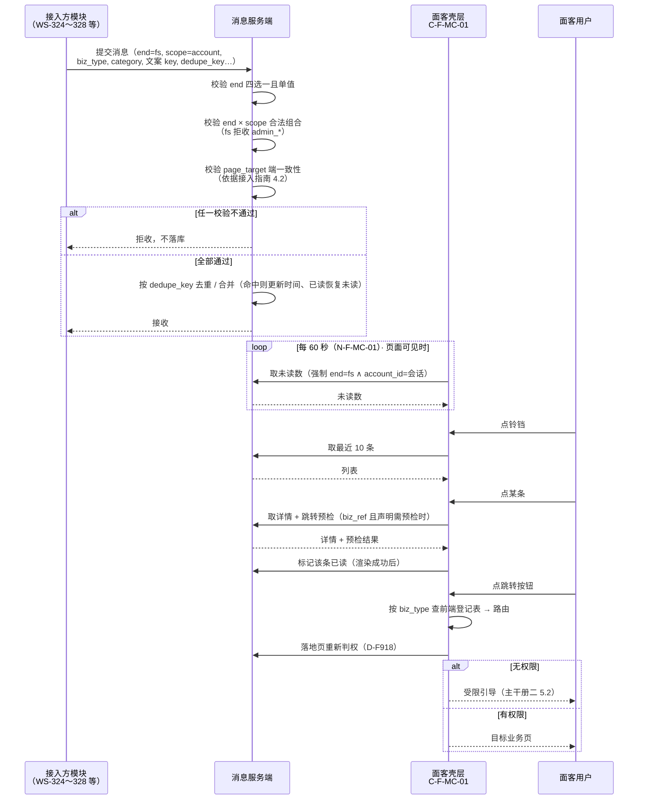
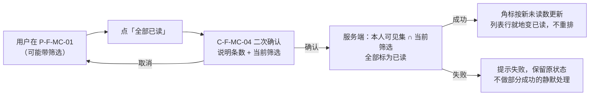
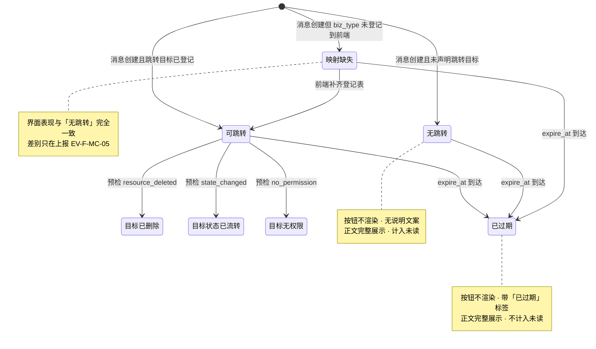
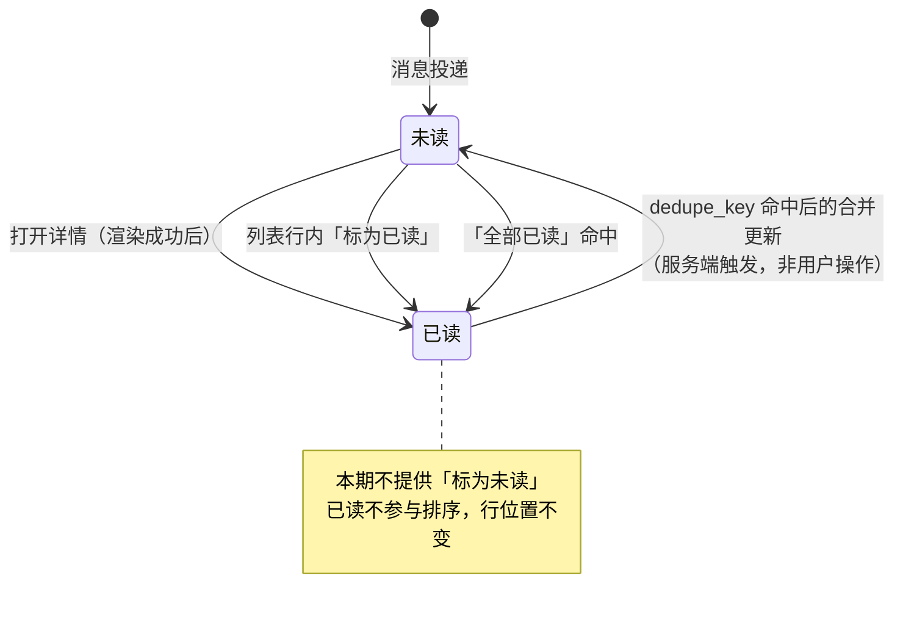
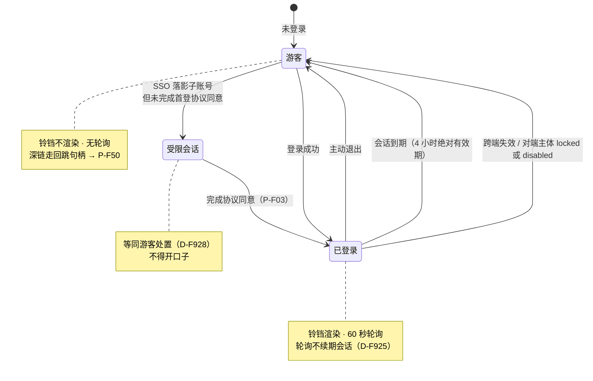

# 金融服务平台 · 金融服务端 · 面客消息中心 PRD · 01 页面与展示

> 本文件是《金融服务平台 · 金融服务端 · 面客消息中心 PRD》的分册。
> 入口与全文导航见主文档 [`v1.0-面客消息中心-PRD.md`](./v1.0-面客消息中心-PRD.md)。

**本文件讲什么**：第 7 章模块详情（两个入口与未读角标、铃铛快捷面板、消息中心列表、消息详情、已读语义、跳转机制、过期与失效、业务办理进度、保留与清理）、第 10 章主流程与异常流程、第 11 章状态机、第 12 章页面与字段定义。

**本文件不讲什么**：

- **任何触发口径**。本文件里不会出现任何一个具体的 `biz_type`、任何一个业务事件、任何一个发送时点、任何一条业务消息的文案。凡示意处一律用占位形态（`{domain}.{object}.{action}`）。
- 数据契约本身（字段定义、枚举、必填性）——在 WS-304 [`02-数据契约与字段.md`](../../../asset-platform/prd/v1.0-消息通知/02-数据契约与字段.md) 第 9 章。
- 接入方要做什么——在 [`03-接入登记与文案模板规范.md`](./03-接入登记与文案模板规范.md)。

---

## 7. 模块详情

### 7.1 M1 · 入口与未读角标（`F-F-MC-01`～`F-F-MC-05`）

#### 7.1.1 两个入口与铃铛位置

| 入口 | 形态 | 位置 |
| --- | --- | --- |
| **铃铛 `C-F-MC-01`** | 顶栏常驻图标 + 未读角标 | **顶栏右侧，语言切换器左侧、账号下拉之前**（沿用 WS-304 / WS-309 `01` 7.1.1 的相对位置口径） |
| **账号下拉「消息中心」条目** | 下拉菜单项 | 账号下拉内，与账户设置等条目并列 |

> **本模块不占顶栏主导航位**（主文档 5.1）。面客侧壳层顶栏主导航只有首页，消息中心入口收敛在铃铛与账号下拉——这与面客壳层现状一致，也与 WS-309 `D-O05` 同一处置。
>
> **顶栏语言切换器与账号下拉的组件编号由登录模块提供**，本 PRD 不自取号（`DEP-MC-06`）。若面客侧顶栏最终不提供语言切换器，铃铛位置退化为「顶栏右侧、账号下拉之前」——**两种情况下位置都必须固定且可预期**。

#### 7.1.2 未读角标计数口径（**引用，不重写**）

逐条沿用 WS-304 `01` 7.1.2 / WS-309 `D-O15`：

| 项 | 口径 |
| --- | --- |
| 计算方 | **服务端**。前端不自行推导未读数 |
| 范围 | **全分类合计**，角标不分分类；分类维度通过列表筛选表达 |
| 不计入 | **已过期**的消息、**已主动失效**的消息 |
| 仍计入 | 「目标资源已删除 / 状态已流转 / 无权限」三类跳转失效的未读消息（这三类是预检的实时结果，不做全量预检）；**映射缺失**的消息（映射缺失不是失效） |
| 上限 | 超过 `N-F-MC-03`（99）展示 `99+`，且 `99+` 状态下不展示精确数字 |
| 零值 | 无未读时**不展示角标，也不展示 `0`** |

**面客侧代入的唯一一处**：可见集 = `{ m : m.end = fs ∧ m.recipient_account_id = 会话 account_id }`（主文档 8.1.3）。**算法本身一个字不改。**

#### 7.1.3 实时性方案（**引用，不重写**）

沿用 WS-304 `01` 7.1.3 / WS-309 `D-O16`：**轮询 `N-F-MC-01`（60 秒）+ 切回前台立即拉一次并重置计时器 + 页面不可见时暂停轮询**。本期不引入长连接。

**面客侧补充的三条强制条款**（主文档 8.3.3，此处只列落点）：

| # | 条款 | 在展示层的落点 |
| --- | --- | --- |
| a | 轮询**不得续期或保活会话** | 轮询请求不得携带任何会话续期语义；4 小时绝对有效期到点即失效，与页面是否开启无关 |
| b | 将来引入无操作自动登出时，轮询**不计入活跃度判定** | 预置条款，当前触发条件为空 |
| c | 轮询遇 **401 不得静默忽略** | 与其他接口一视同仁，立即触发 7.1.5 的统一回落处理 |

**接口失败时**：角标**保留上一次数值**（`N-F-MC-06`），**不清零、不弹错误提示**——一次网络抖动把角标清成 0，用户会以为消息被读掉了。

#### 7.1.4 多标签页一致性（**引用，不重写**）

沿用 WS-304 `01` 7.1.4：**本地事件广播同步已读**；广播不可用时**降级为轮询同步**。在一个标签页把某条标为已读，其他标签页的角标与列表行状态应随之更新。

#### 7.1.5 会话失效时入口的处理（**面客侧特有**）

> 这是与运营端的**根本差异**：运营端跳走登录页、组件树自然卸载；面客侧**留在原页**，不主动清就会残留。

| # | 失效瞬间必须发生的事 | 对应口径 |
| --- | --- | --- |
| 1 | 未读角标数字**从 DOM 移除**（不是置 0、不是隐藏样式） | `D-F921` |
| 2 | 铃铛 `C-F-MC-01` **不再渲染** | `D-F921` |
| 3 | 快捷面板若展开，**内容清空并收起** | `D-F921` |
| 4 | **停止轮询计时器并中止进行中的请求** | `D-F922` |
| 5 | 游客态下**不得发起任何未读数请求** | `D-F922` |

**不得出现「已回落游客态但铃铛还在」的中间态。** 这一条与 WS-323 `D-MC-15`～`D-MC-18`（SSO 失败后菜单必须随之消失）同构——面客侧顶栏在游客态仍然存在，所以必须显式处理，不能指望组件树卸载。

---

### 7.2 M1 · 铃铛快捷面板（`C-F-MC-02`，`F-F-MC-03`）

沿用 WS-304 `01` 7.2：

| 项 | 规格 |
| --- | --- |
| 条数 | 最近 `N-F-MC-02`（**10**）条 |
| 是否区分已读未读 | **不区分**。未读条目有视觉标识，但已读条目同样展示 |
| 已读行为 | **仅展开不产生任何已读**；滚动经过也不产生已读；点击面板内某条进入详情后该条才转已读 |
| 「全部已读」 | ❌ **面板内不提供**（范围不一致必然被误解，主文档 5.2） |
| 底部 | 「查看全部」→ `P-F-MC-01`，无筛选 |
| 收起方式 | 再次点击铃铛、点击面板外区域、按 **Esc** |
| 空态 | 面板内展示空态文案，**不隐藏面板** |
| 进度型消息 | 在面板内同样展示节点状态标签（7.8.2），但**省略业务名称之外的次要信息** |

---

### 7.3 M2 · 消息中心列表（`P-F-MC-01`，`F-F-MC-06`～`F-F-MC-09`）

**路由：`/messages`**（`D-F903`）。

#### 7.3.1 页面结构（线框级）

```
┌──────────────────────────────────────────────────────────────┐
│  顶栏（首页导航 · [语言切换器] · 🔔 C-F-MC-01 · 账号下拉）      │
├──────────────────────────────────────────────────────────────┤
│  消息中心                                    [ 全部已读 ]      │
│                                                              │
│  分类：[ 全部 ][ …服务端返回的分类… ]   状态：[全部|未读|已读]   │
├──────────────────────────────────────────────────────────────┤
│  ● [分类标签]  消息标题                        2026-09-11      │
│                消息正文摘要…                    [标为已读]     │
├──────────────────────────────────────────────────────────────┤
│    [分类标签]  消息标题                        2026-09-10      │
│                消息正文摘要…                                  │
├──────────────────────────────────────────────────────────────┤
│                      [ 加载更多 ]                             │
└──────────────────────────────────────────────────────────────┘
```

> 上图中的「消息标题」「消息正文摘要」「分类标签」均为**占位**，不是任何一条具体消息的文案（主文档 2.3.2 框架形态要求）。

#### 7.3.2 分类筛选（`F-F-MC-06`）

| 项 | 规则 |
| --- | --- |
| 选项来源 | **由服务端返回的分类元数据渲染**。**前端代码中不存在写死的分类清单** |
| 渲染范围 | 「全部」+ **当前接收者实际拥有消息的分类**。给一个从没收到过某类消息的用户展示那个筛选项，点进去只会是空结果 |
| 未登记的 `category` | 消息**仍然展示**，分类标签回落为「其他 / Other」，**不隐藏消息**（`D-F931`）——与映射缺失同一原则：**内容永远优先于分类** |
| 新增分类要改什么 | 代码层枚举 + 一对中英文案 key，**不需要改展示层任何页面逻辑**（WS-304 `02` 9.3.3） |

> **`fs` 组七个 `category` 的定义表不在本 PRD 里**，在接入指南 4.1（`D-F930`）。本文件只定义「展示层如何消费它」。

#### 7.3.3 已读 / 未读筛选（`F-F-MC-07`）

三档：**全部 / 未读 / 已读**，默认「全部」。与分类筛选**可叠加**，结果为两者的与关系。

**筛选条件写入 URL 查询参数**，刷新后筛选态保持；切换筛选时回到首屏并把滚动位置带回顶部。

#### 7.3.4 **加载更多**与排序（`F-F-MC-08`）

> **这是与运营端的形态差异。** 运营端取控制台画布的**分页器**（WS-309 `D-O14`，理由是「跳到某一页复查」的诉求）；金融服务端是**面客画布**，该诉求不成立。

| 项 | 规格 |
| --- | --- |
| 翻页形态 | **「加载更多」按钮**，**不是分页器**（`D-F910`）。无页码、无每页条数切换器 |
| 单次条数 | `N-F-MC-04`（20） |
| 排序 | **创建时间倒序**。已读状态**不参与排序**，标记已读后该行**位置不变、不被移除**（未读不置顶、已读不沉底）（`D-F911`） |
| 稳定次序 | 同一创建时间戳的多条以消息 ID 作稳定次级排序键 |
| 游标 | 基于 `created_at + message_id`，**不使用 offset**。加载期间有新消息插入顶部时**不出现重复项或漏项** |
| 已加载内容 | 「加载更多」**追加**在已有列表之后，**不替换**已加载内容 |
| 到底 | 没有更多时按钮替换为「没有更多了」的终止态，**不再可点** |

#### 7.3.5 空态、加载态与失败（`F-F-MC-09`）

| 状态 | 表现 |
| --- | --- |
| **首次空态** | 「还没有任何消息」类文案，**不提供「清除筛选」** |
| **筛选空态** | 与首次空态**文案不同**，且提供「清除筛选」，可一键回到无筛选状态 |
| 首屏加载中 | 骨架屏或加载态，不闪烁空态 |
| 首屏失败 | 错误态 + 重试 |
| **「加载更多」失败** | **当前已加载内容不清空**，按钮回到可点状态并提示可重试 |
| 单条内容异常 | 该行降级为「分类 + 时间 + 通用标题」最小形态（20.5），**不影响同列表其他行**，且仍可点击进入详情 |

---

### 7.4 M4 · 消息详情（`P-F-MC-02`，`F-F-MC-12`、`F-F-MC-13`）

**路由：`/messages/{id}`**（`D-F903`）。

#### 7.4.1 形态：**整页**，不是抽屉、不是弹层

| # | 理由 |
| --- | --- |
| 1 | **详情是深链的落点**——外部渠道、其他消息都可能直接指向某条消息。抽屉形态在直接打开时没有「背后的列表」可依附，刷新与回退行为割裂 |
| 2 | 详情内可能包含较长的正文与业务上下文（尤其进度类） |
| 3 | **会话失效时详情必须整页卸载**（`D-F923`）。抽屉／弹层形态天然诱导「盖一层」的实现，而共用办公设备下「弹个框盖住」等于没登出 |

#### 7.4.2 页面结构（线框级）

```
┌──────────────────────────────────────────────────────────────┐
│  顶栏                                                         │
├──────────────────────────────────────────────────────────────┤
│  ← 返回列表                                                   │
│                                                              │
│  [分类标签]  消息标题                                          │
│  2026-09-11 14:30 (UTC+08:00)                                │
│  ── 进度区块（仅进度类消息，见 7.8.3）─────────────           │
│                                                              │
│  消息正文（纯文本，转义渲染）                                   │
│                                                              │
│  ── 失效说明条（仅失效时，见 7.7）─────────────                │
│  [ 跳转按钮 ]    [ 返回列表 ]                                  │
└──────────────────────────────────────────────────────────────┘
```

#### 7.4.3 返回列表的状态同步（`F-F-MC-13`）

返回后**保留筛选条件、已加载条数与滚动位置**；刚读过那条的已读状态**就地更新，不重排、不移除**。

> **「已加载条数」是面客形态特有的一条**：分页器形态只需记住页码，「加载更多」形态必须记住**已加载到第几批**，否则用户加载了 5 批、点进一条详情、返回后只剩第 1 批——这是面客形态最容易漏掉的返回态。

---

### 7.5 M3 · 已读语义（`F-F-MC-10`、`F-F-MC-11`）

#### 7.5.1 已读状态建模（**引用，不重写**）

沿用 WS-304 `02` 9.2：**消息与已读分表**；**只记录读过的人，不预生成未读记录**。

#### 7.5.2 单条已读（`F-F-MC-10`，`D-F912`）

| 触发 | 规格 |
| --- | --- |
| **打开详情即已读** | 详情**渲染成功后**才转已读；请求失败或渲染失败**不转已读** |
| **列表行内「标为已读」** | 显式操作，**不进入详情**；操作后该行就地变为已读态，**位置不变** |
| 快捷面板内展开 | ❌ **不产生已读**（7.2） |
| 滚动经过 | ❌ 不产生已读 |
| 已读不可撤销 | 本期**不提供「标为未读」**。唯一的未读恢复路径是 `dedupe_key` 命中后的合并更新（接入指南 5），由服务端触发，不是用户操作 |

#### 7.5.3 全部已读（`F-F-MC-11`，`D-F913`）

| 项 | 规格 |
| --- | --- |
| 作用范围 | **当前筛选命中的全部消息**，不是「当前已加载的那些」，也不是「全部消息」 |
| 二次确认 | 经 `C-F-MC-04` 弹层确认，**必须说明条数与当前筛选**（例如「将把当前筛选下的 N 条标为已读」） |
| 位置 | 列表页 `P-F-MC-01` 顶部；**快捷面板内不提供**（7.2） |
| 执行后 | 角标按服务端返回的新未读数更新；列表行就地变为已读态，**不重排、不移除** |
| 失败 | 提示失败并保留原状态，**不做部分成功的静默处理** |

> **为什么必须说明筛选**：用户在「未读 + 某分类」筛选下点「全部已读」，若不说明，会以为清掉的是全部消息；反过来在无筛选下点，也可能以为只清掉了眼前这一屏。

---

### 7.6 M5 · 跳转机制（`F-F-MC-15`～`F-F-MC-17`）

> **本节只定义「跳转怎么执行、失败怎么降级」，不定义「哪条消息跳哪里」**——后者由接入方在登记表里声明（第 19 章）。

#### 7.6.1 三形态互斥（**引用，不重写**）

沿用 WS-304 `01` 7.6 与接入指南 7：跳转是**三选一互斥**的，消息实体**不存 URL**（`D-N33`、接入指南 10-①）。

| 形态 | 承载 | 解析方式 |
| --- | --- | --- |
| **业务资源目标** | `biz_type` + `biz_ref`（`resource_type` + `resource_id`） | 按 `biz_type` 查**前端业务类型登记表**得到路由模板，用 `resource_id` 填充参数 |
| **静态页面目标** | `page_target`（页面编号） | 按面客侧页面路由表直达 |
| **无跳转** | 三者都不填 | 合法状态，见 7.6.5 |

**同时填两个 → 服务端拒收；填 URL → 禁止。**

##### 7.6.1.1 落点可以是**详情页内的弹窗**，不只是「一个页面」（V2.0 新增，`D-F937`）

> **对齐 WS-324 V9.0：广场的操作承载形态已从独立页面改为详情页内的弹窗。**

| 项 | 口径 |
| --- | --- |
| 事实 | 借贷广场的 `P-LS-04`～`P-LS-10` **现在都是详情页操作区内的弹窗承载单元，不是独立页面**（WS-324 `D-FIN-79` / `AC-LS-85`；WS-325 `D-LS-30`、WS-326 `D-LN-48`、WS-327 `D-RP-71`）。**编号保留，语义由「页面」改为「承载单元」** |
| **跳转语义** | 因此目标为这类承载单元时，跳转的语义是「**落详情页 + 打开对应弹窗**」，**不是「落到某一个独立页面」** |
| 锚点怎么传 | 写在 `biz_ref` 的**路由模板**里，形如 `deal/{id}?action=<锚点>` / `schedule/{id}?action=<锚点>`；锚点取值由接入方在登记表里声明（`03-` 19.2） |
| **不得做的事** | ❌ **不得为一个弹窗申请独立的 `page_target` 编号**——弹窗不是页面，不占页面段位（守 7.6.2 与接入指南 4.2 的「一个编号在全平台只对应一个页面」）；❌ 不得把锚点拼进消息实体存成 URL（`D-N33`） |
| 锚点不可用时 | 锚点未登记、或目标弹窗在当前业务状态下不该打开时，**落详情页即可，不报错**——详情页本身永远是合法落点。弹窗打不开不构成跳转失败 |
| 本模块要不要理解锚点 | **不需要。** 本模块只负责把路由模板填好参数后交给前端路由，**不解析锚点语义、不校验锚点取值**——那是目标页的职责（同 7.6.3「由目标页按自己的规则处理」） |

#### 7.6.2 静态页面目标的端一致性（`F-F-MC-16`，`D-F905`）

服务端校验「`page_target` 所属端与消息 `end` 一致」，**不一致拒收**（沿用 WS-309 `01` 7.6.1 / 8.2.3）。

| 项 | 面客侧口径 |
| --- | --- |
| 合法取值 | **只能是 `fs` 端已登记段位内的编号**（本模块的 `P-F-MC-*`、登录模块家族的 `P-F*`） |
| 非法取值 | `P-A*`（资产端）、`P-M*`（资产管理端）、`P-O*`（运营端）→ **服务端拒收** |
| **校验依据** | **接入指南 4.2 段位表是这条校验的唯一依据**。`fs` 行不补登 → 所有 `page_target = P-F-MC-*` 的消息被判端不一致而拒收，**面客侧静态页面跳转整体不可用**（`DEP-MC-04`） |
| 预检 | **静态页面目标一律不预检，直接跳转**（WS-304 `01` 7.6.2） |

#### 7.6.3 跳转预检（`F-F-MC-17`，同端部分）

| 项 | 规则 |
| --- | --- |
| 谁要预检 | **业务资源目标（`biz_ref`）**。是否预检由**业务类型登记表**声明，**缺省视为「需要预检」** |
| 时机 | **进入详情页时执行一次**（不是点击时），使失效状态能提前体现在按钮上 |
| 列表页 | **不做预检**（不做全量预检） |
| 超时 | `N-F-MC-05`（3 秒）。**超时按预检失败处理，放行跳转**，由目标页按自己的规则处理 |
| 返回值 | `resource_deleted` / `state_changed` / `no_permission` **三选一**（接入指南 7） |
| 安全 | 预检本身**不得泄漏目标资源的存在性**（主文档 8.2 第 6 条） |

#### 7.6.4 **落地时必须重新判权**（面客侧补充，`D-F918`）

> **这一条运营端没有，面客侧必须补。**

| 项 | 规则 |
| --- | --- |
| 规则 | **预检通过不等于跳过去就有权限。** 落地页必须重新执行一次权限判定（主干册一 3.6 `D-F177`），且矩阵 `⊘` / `❌` 由服务端强制（主干册二 `D-F77`） |
| 为什么面客侧必须补 | 运营端是单角色、权限等同，预检通过基本等于可进入；面客侧有**三态 × 两身份**，一个用户点开一条消息时，目标能力可能正好是权限矩阵上的硬卡点。**不补这一条，用户会跳进一个立刻报 403 的页面** |

**被拦下时的表现分两种，不要混为一谈（V2.0 修订，`D-F938`）：**

| 落地时的会话态 | 落地页的表现 | 依据 |
| --- | --- | --- |
| **已登录但权限不足**（`⊘` / `❌`） | **转入主干册二 5.2 的受限引导**，**不是 403 错误页、不是报错 Toast** | 主干 `D-F77` / `D-F177`（口径不变） |
| **非登录态落地**（会话在点击与落地之间失效，或用户从外部渠道直接打开该链接） | **落地页操作区只出「立即登录」**——**不再逐动作置灰、不再给每个动作单独的受限原因** | **WS-324 V9.0 新口径**（需求方 09-14 第 9 条第 3 项） |

> **为什么本模块会碰到非登录态落地**：本模块自己的页面在会话失效瞬间就整页回落游客态（7.1.5），按说点不到跳转按钮。但有两条路径绕过它——① 会话在**预检通过之后、路由跳转完成之前**失效，落地时已是游客；② 用户把详情页里的跳转链接复制出去、或从外部渠道直接打开。**这两条都会落在广场详情页的非登录态上**，所以本册必须与 WS-324 的新口径对齐，否则实现方会照旧口径做成逐动作 `⊘`。
>
> ⚠️ **这与 WS-311 权限矩阵的语义存在偏离**（矩阵对游客是逐能力给 `❌` / `⊘`，而广场详情页现在收敛为单一的「立即登录」）。按 WS-324 `10.5` 第 9 条的处置：**只登记、不要去改 WS-311**。本 PRD 在主文档 17.6 `PMC-C-04` 登记，**不修改主干任何文件**。
>
> **本模块的边界**：落地页长什么样归广场（WS-324～327），**本模块不实现、不校验、不兜底**。本条写在这里只为一件事——**消息的跳转按钮不得因为"可能落到非登录态"而提前置灰或隐藏**，跳转照常发起，落地态由落地页自己表达。

#### 7.6.5 **跨平台跳转本期不做**（`D-F914`）

| 项 | 本期口径 |
| --- | --- |
| 结论 | 需要用户去**资产平台**办的事项，在 `fs` 池里产出的消息一律是**形态 3「无跳转」** |
| 界面表现 | 内容照常完整展示；详情页**只留「返回列表」**；**不给任何说明文案**（`D-F915`，沿用 WS-304 `01` 7.6.4） |
| 用户的去向由谁承载 | **WS-328 控制台的待办带**（WS-323 3.9 已定 14 条待办中有 3 条跳其他模块，跨域走 `D-F02` / `D-F172` 离站告知） |
| 为什么契约接不住 | `page_target` 是**页面编号、全平台唯一**，资产平台的页面是 `P-A*`，一条 `end = fs` 的消息带 `P-A*` 会被服务端按端不一致**直接拒收**；`biz_ref` 解析的是**本端**业务类型登记表；契约里也**没有**第四种「外部 / 跨端目标」形态（接入指南 7 明确是「三选一」） |
| 演进路径 | 登记为 `PMC-U-01` 交 WS-304（主文档 17.5），**不在本 issue 内分叉** |
| **一条现在就写死的约束** | **跨平台跳转将来无论走哪条路，执行一律复用主干册一 3.4 的对端白名单机制与离站告知弹层 `C-F04`，本模块不自建一套**（`D-F919`）。现行白名单（3.4.1）只登记了一个对端「资产平台」，且允许的对端路径前缀只有登录与授权路径 + `/user-center`——**即使今天就实现了，能跳过去的也只有用户中心一个落点**（`DEP-MC-08`） |

> **这是本期能力边界，不是缺陷**（`R-MC-02`）。PRD 正面写出来，否则会被按不存在的能力验收。

#### 7.6.6 映射缺失时的降级（`D-F916`）

规则沿用 WS-304 `01` 7.6.3 / `D-N14`，**本模块不改口径，只补面客侧的两条判定**。

| 位置 | 降级表现 |
| --- | --- |
| **详情页** | **不渲染跳转按钮**——既不展示可点的、也不展示置灰的；标题、正文、时间、分类标签**完整展示**；**不展示任何说明文案**；操作区只留「返回列表」 |
| **列表 / 快捷面板** | 该条消息**正常展示、正常可点进详情**；列表项**不因映射缺失而隐藏、置灰或改变样式** |
| **分类筛选** | 该消息仍归入其 `category`，**不被过滤掉** |
| **未读角标** | **仍然计入未读**（映射缺失不是失效） |
| **日志** | 前端上报一次 `EV-F-MC-05`「未知业务类型」事件（含 `biz_type` 字符串），用于发现登记遗漏 |
| **禁止** | ❌ 跳 404 页；❌ 跳首页；❌ 展示一个点了没反应的按钮；❌ 隐藏整条消息；❌ 任何「暂不支持跳转」类文案 |

**面客侧补充的两条判定：**

| # | 条款 |
| --- | --- |
| **i** | **「映射缺失」与「无跳转」在界面上完全一致**，区别只在要不要上报 `EV-F-MC-05`。这条在面客侧比运营端更要守——面客侧同时有「广场四段陆续上线」与「本模块只做收」两个条件，**灰度期映射缺失必然发生**（`R-MC-06`） |
| **ii** | **不要在前端为「端不一致」写降级分支**（`D-F917`）。`page_target` 端不一致 = 接入错误，**在服务端就被拒收，前端不会遇到**。前端的映射缺失只可能来自「`biz_type` 未登记」或「前端版本落后于登记表」两种情形。写一条端不一致的降级分支，会掩盖一个本该在接入侧暴露的错误 |

---

### 7.7 M5 · 过期与失效消息（`F-F-MC-15`）

四类失效的表现沿用 WS-304 `01` 7.7 / WS-309 `01` 7.7，**一字不改**：

| 类型 | 跳转按钮 | 说明条 | 正文 | 计入角标 |
| --- | --- | --- | --- | --- |
| **已过期**（`expire_at` 已到） | **不渲染** | 列表带「已过期」标签 | **完整展示** | ❌ 不计入 |
| 目标资源已删除（`resource_deleted`） | **禁用而非隐藏** | ✅ 有说明条 | **完整展示** | ✅ 计入 |
| 目标状态已流转（`state_changed`） | **禁用而非隐藏** | ✅ 有说明条 | **完整展示** | ✅ 计入 |
| 无权限（`no_permission`） | **禁用而非隐藏** | ✅ 有说明条 | **完整展示** | ✅ 计入 |

| 项 | 口径 |
| --- | --- |
| **内容一律完整展示** | 失效影响的只是「能不能跳过去」，不影响「能不能读」 |
| 禁用态的可访问性 | 禁用状态与**禁用原因**须可被键盘与读屏获取，不能只靠视觉置灰（主文档 13.4） |
| 已过期消息仍可查到 | 列表中正常可见、可进详情，只是不计入角标（7.9） |

> **「已过期」与另外三类的差别**：过期是消息自身的属性（服务端已知），三类失效是**预检的实时结果**——所以过期不计入角标、三类失效计入。

---

### 7.8 M6 · 业务办理进度消息（`F-F-MC-14`）

> **这一条不是差异，是 WS-309 早已替本模块预留的位置。** WS-309 `01` 7.8 第 1 条写明「业务办理进度消息（`business_progress`）运营端不产生，**其接收方是金融服务端用户（`end = fs`）**」。也就是说，进度型列表项与详情进度区块**在面客侧是本期就要实现的展示能力**，组件变体已在壳层保留，**直接启用即可**。

#### 7.8.1 本节的边界

**本节只定义展示层如何承载进度类消息，不定义有哪些业务节点、也不定义推送时机**——那由各业务需求在自己的 PRD 里定义（第 19 章）。

**本 PRD 不列举任何一条业务线。** 展示层**不因本期尚无接入方而做任何简化**：分类筛选、进度型列表项、节点状态标签全部按通用形态实现——这正是把进度信息结构化进契约（WS-304 `02` 9.6）而不是写死某业务专用字段的原因。

#### 7.8.2 列表中的进度型列表项（`C-F-MC-03` 进度变体）

```
┌──────────────────────────────────────────────────────────────┐
│ ● [业务办理进度]  {业务名称}                    2026-09-11     │
│                   {当前节点} · [节点状态标签]     第 2/5 步     │
└──────────────────────────────────────────────────────────────┘
```

| 位置 | 取自 | 说明 |
| --- | --- | --- |
| 分类标签 | `category` | 固定为「业务办理进度 / Business progress」 |
| 标题位 | `progress.biz_name_key` | **文案 key，展示时渲染**。本 PRD 不列举任何业务名称 |
| 节点 | `progress.node_key` | 同上 |
| 节点状态标签 | `progress.node_status` | **封闭四态**：`in_progress` / `action_required` / `succeeded` / `failed`。**不得扩展**；业务侧的细分状态由 `node_key` 的文案表达 |
| 步骤 | `progress.node_index` / `node_total` | **两者同时提供时**展示「第 2/5 步」，**缺任一则不展示** |

#### 7.8.3 详情中的进度区块

进度类消息在详情页的正文**之上**增加一个进度区块：业务名称、业务编号（`progress.biz_no`，可选，**支持复制**）、当前节点、节点状态标签。

#### 7.8.4 每次进度更新是一条独立消息，**不做同业务合并**

| 项 | 口径 |
| --- | --- |
| 展示 | 同一笔业务的多次节点更新在列表中是**多条独立消息**，按时间倒序各占一行 |
| **`dedupe_key` 硬约束** | 进度类消息的 `dedupe_key` **必须同时包含业务标识与节点标识**（建议形如 `{biz_type}:{resource_id}:{node_key}`）。**本模块只以 `dedupe_key` 为唯一去重依据，不会自行按「事件类型 + 时间窗」推导去重键**——若接入方对同一业务的不同节点复用同一个 key，**第二个节点的更新会把第一条就地覆盖，用户永久丢失中间进度** |
| 不冲突 | 「不合并」说的是**不同节点**；「去重」说的是**同一节点被重复推送**（例如接入方重试） |

#### 7.8.5 本期不做的进度能力

| 不做 | 为什么 |
| --- | --- |
| **完整进度条 / 步骤条**（展示全部节点与已完成节点） | 需要业务方提供**全量节点定义与顺序**，而本 PRD 明确不定义业务节点。等业务需求定义了节点模型，这属于**业务详情页**的能力，不是消息模块的 |
| 进度类消息的单独角标 / 单独入口 | 角标不分分类（7.1.2），分类维度通过列表筛选表达 |

---

### 7.9 消息的保留与清理

**结论：本期不设保留期、不做自动清理、不做归档，消息长期保留**（沿用 WS-304 `01` 7.10 / `D-N31` / WS-309 `D-O12`）。

| 项 | 本期口径 |
| --- | --- |
| 保留期 | 无上限，消息不因时间流逝被删除或隐藏 |
| 自动清理 / 归档 | 不做 |
| **用户手动删除** | **不提供** |
| 已过期消息 | **仍然保留并可在列表中查到**，只是不计入未读角标、带「已过期」标签 |
| 已读消息 | 与未读同等保留 |
| 归档策略 | 提前写成可调参数 `N-F-MC-08`，**本期不启用** |

**沿用的理由（在面客侧同样成立）**：安全与合规类消息是事后回查「我的账号什么时候发生过什么」的唯一站内通道，设保留期等于给这条记录设了个静默的失效日期；在没有偏好中心、没有按分类退订能力的前提下，清理与删除都会变成逃避通知的出口，掩盖「消息过载」这个真正该解决的问题。

> **面客侧的一条额外要求**：**上线即监控**列表接口与未读数接口的 P95（`EV-F-MC-07`），不等出现退化趋势才建监控。面客侧的消息增速由**接入方数量**决定，而本模块上线时接入方为零、随后广场四段与控制台会陆续接入——增速曲线是**阶跃**的，不是平滑的。

---

## 10. 主流程与异常流程

### 10.1 消息从产生到被消费（主流程）



### 10.2 全部已读（主流程）



### 10.3 异常流程总表

| # | 异常 | 表现 | 口径 |
| --- | --- | --- | --- |
| 1 | 未读数接口失败 | 角标**保留上一次数值**，不清零、不弹错误 | `N-F-MC-06` |
| 2 | 列表首屏失败 | 错误态 + 重试 | 7.3.5 |
| 3 | 「加载更多」失败 | **已加载内容不清空**，可重试 | 7.3.5 |
| 4 | 单条内容异常（文案 key 缺失等） | 该行降级最小形态，**不影响同列表其他行** | 20.5 |
| 5 | 详情不存在 / 不属于本人 | **404 语义**，不可与「消息确实不存在」相区分，**不返回 403** | 主文档 8.2 |
| 6 | `biz_type` 未登记（映射缺失） | 内容照常展示、不渲染跳转按钮、**无说明文案**、计入未读、上报 `EV-F-MC-05` | 7.6.6 |
| 7 | 预检超时（> 3 秒） | 按预检失败处理，**放行跳转**，由目标页处理 | 7.6.3 |
| 8 | 预检返回三类失效 | 按钮**禁用而非隐藏** + 说明条 + 正文完整展示 | 7.7 |
| 9 | 跳转落地重判权不通过 | **受限引导**，不是 403 错误页 | `D-F918` |
| 10 | 轮询遇 401 | **不得静默忽略**，立即触发回落游客态 | `D-F927` |
| 11 | 会话失效（任意页面） | 回落游客态：DOM 清除、入口消失、轮询停止 | 7.1.5 |
| 12 | 游客访问 `/messages` 或 `/messages/{id}` | 走回跳句柄 → `P-F50`，**不给 404 / 白屏 / 静默跳首页** | `D-F924` |
| 13 | 受限会话访问消息中心 | **不放行**，走首登协议同意 `P-F03` | `D-F928` |
| 14 | 池中出现 `end ≠ fs` 的记录 | **不渲染、不计入未读、不可打开**，上报 `EV-F-MC-06` | 主文档 2.3.2 |
| 15 | `category` 未登记 | 消息**仍展示**，标签回落「其他 / Other」 | `D-F931` |
| 16 | 当前语言文案缺失 | 回落 `en` → 再缺失降最小形态；**绝不显示文案 key** | 20.5 |

---

## 11. 状态机

### 11.1 消息的可用性状态



> 「目标已删除 / 状态已流转 / 无权限」三态：**按钮禁用而非隐藏 + 说明条 + 正文完整展示 + 计入未读**（7.7）。

### 11.2 单个接收者对单条消息的已读状态



### 11.3 会话态与消息中心可达性



> **所有失效路径的终点都是「游客」，没有一条通向登录页**（`D-F920`）。

---

## 12. 页面与字段定义

> 本章定义**展示层消费哪些字段、怎么渲染**。字段本身的定义、类型、必填性在 WS-304 `02-数据契约与字段.md` 第 9 章，**本 PRD 不重写**。

### 12.1 列表项展示字段（`C-F-MC-03`）

| 位置 | 取自 | 渲染规则 |
| --- | --- | --- |
| 未读标识 | 该接收者的已读状态 | 未读时展示圆点；已读时不展示。**须可被读屏获取**，不是纯视觉 |
| 分类标签 | `category` | 按接入指南 4.1 的展示名渲染；**未登记取值回落「其他 / Other」** |
| 标题 | `title_key` + `params`，或 `title_snapshot_i18n` | 展示时按当前语言渲染（20.1） |
| 正文摘要 | `body_key` + `params`，或快照 | 单行截断；**纯文本渲染并转义**，不支持富文本 |
| 时间 | `created_at`（UTC 原值） | 按**接收者时区**渲染；列表可用相对时间（`N-F-MC-07`），**不得出现裸时间** |
| 进度信息 | `progress`（仅进度类） | 见 7.8.2 |
| 行内操作 | — | 未读行展示「标为已读」；已读行不展示 |
| 「已过期」标签 | `expire_at` | 已过期时展示 |

### 12.2 详情页展示字段（`P-F-MC-02`）

| 位置 | 取自 | 渲染规则 |
| --- | --- | --- |
| 分类标签 | `category` | 同 12.1 |
| 标题 | `title_key` / 快照 | 完整展示，不截断 |
| 元信息行 | `created_at` | **一律绝对时间 + 时区标注**（`N-F-MC-07`），不用相对时间 |
| 进度区块 | `progress` | 仅进度类，见 7.8.3 |
| 正文 | `body_key` / 快照 | **纯文本渲染并转义**；换行保留 |
| 失效说明条 | 预检结果 | 仅三类失效时展示；已过期与无跳转**不展示说明条** |
| 跳转按钮 | `biz_ref` / `page_target` | 见 7.6；**无跳转与映射缺失时不渲染** |
| 返回列表 | — | **恒常展示**，是无跳转 / 映射缺失 / 已过期时操作区的唯一元素 |

### 12.3 本模块自有界面文案

> **本节是本模块自有界面的静态文案，不是任何一条消息的文案。** 全表**零业务事件、零 `biz_type`、零触发口径**——它只包含消息中心这个壳自己的按钮、标签与空态文字。每条业务消息叫什么、写什么，由接入方在自己的 PRD 里登记（第 19 章、第 20 章）。

| 位置 | 中文 | English |
| --- | --- | --- |
| 页面标题 | 消息中心 | Notifications |
| 铃铛可访问名称 | 通知 | Notifications |
| 快捷面板底部 | 查看全部 | View all |
| 分类筛选「全部」 | 全部 | All |
| 未登记分类回落 | 其他 | Other |
| 状态筛选三档 | 全部 / 未读 / 已读 | All / Unread / Read |
| 行内操作 | 标为已读 | Mark as read |
| 顶部操作 | 全部已读 | Mark all as read |
| 二次确认（`C-F-MC-04`） | 将把当前筛选下的 {count} 条消息标为已读。 | {count} message(s) under the current filter will be marked as read. |
| 翻页 | 加载更多 | Load more |
| 翻页终止态 | 没有更多了 | No more messages |
| 首次空态 | 还没有任何消息 | You have no messages yet |
| 筛选空态 | 当前筛选下没有消息 | No messages match the current filter |
| 筛选空态操作 | 清除筛选 | Clear filters |
| 失效说明条 · 目标已删除 | 相关内容已被删除 | The related item has been deleted |
| 失效说明条 · 状态已流转 | 相关内容的状态已变化 | The status of the related item has changed |
| 失效说明条 · 无权限 | 你当前没有查看该内容的权限 | You do not have permission to view this item |
| 「已过期」标签 | 已过期 | Expired |
| 详情返回 | 返回列表 | Back to list |
| 加载失败 | 加载失败，请重试 | Failed to load. Please try again |
| 文案完全缺失时的通用标题 | 通知 | Notification |

> **没有「暂不支持跳转」这类文案，也不会有。** 无跳转与映射缺失时**不展示任何说明文案**（`D-F915` / `D-F916`），这是刻意的——给用户看一句「暂不支持」，等于把一个正常状态做成了缺陷提示。

### 12.4 时间与国际化

| 项 | 口径 |
| --- | --- |
| 界面默认语言 | **`en`**，判定三级：**手动偏好 > 账户偏好 > 英文默认**；**判定链中不存在读取 `Accept-Language` / `navigator.language` 这一级**（`D-F929`） |
| 依据 | 本平台 [`01-国际化基线.md`](../v1.0-账户与登录/01-国际化基线.md) 1 / 3.1 + WS-315 `D-13`。**这是本平台独立落定的结论，不是从 WS-308 对运营端的理由继承，也不跨平台引用 WS-302** |
| 站内信文案回落语言 | **`fs` 端默认语言 = `en`**（WS-304 `02` 9.5.4 参数化后的口径，其 `fs` 行的 `[待确认]` 由 `PMC-U-03` 回填） |
| 历史消息随语言切换 | **实时改变**——模板 key 在**展示时**渲染，切换语言后历史消息的标题与正文立即随之改变（WS-304 `02` 9.5 / `D-N24`；国际化基线 2 同一口径） |
| 时区 | 列表与详情的时间**全部按接收者时区渲染并带时区标注**，**界面上不出现裸时间** |
| 时区口径空档 | 国际化基线 4 的默认时区一行标着「运营端口径」（建号时无浏览器上下文、首次登录成功时推断）。面客侧是**自助建号**，触发点不同。**本模块不定义它**（`DEP-MC-05`），先按基线兜底 `UTC` + 必须带时区标注处理（`R-MC-03`） |
| 数字、金额、链上地址与哈希 | 按国际化基线 5 渲染。**接入方传原值，不自己格式化、不自己缩略**（20.3） |
| 脱敏 | 按国际化基线 8 的字段清单（**本平台自己那份**） |
| 富文本 | **不支持**，一律纯文本渲染并转义（WS-304 `01` 13.2） |
