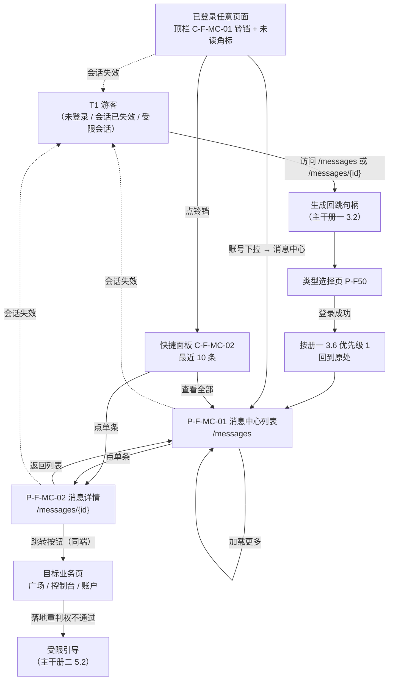

# 金融服务平台 · 金融服务端 · 面客消息中心 PRD（主文档）

> **本模块不是一个新的消息系统，而是 WS-304《平台消息推送能力 PRD》这套平台能力的第五个消费端。**
> 数据契约、`biz_type` 命名空间、`category` 定义表、接入规范**全部沿用 WS-304，本 PRD 不重写、不分叉**。本 PRD 只定义四件事：**金融服务端面客侧的可见范围与端隔离口径**、**面客侧的页面与展示层**、**面客侧的验收标准**、**面客侧接入方的登记规则与文案模板规范**。
>
> **本 PRD 是一份框架 PRD，正文里不存在任何触发口径**——不列事件清单、不写「某某操作后发某某消息」、不写任何一条具体消息的文案、不出现任何一个具体的 `biz_type`。借贷广场四段（WS-324～327）、我的控制台（WS-328）以及后续任何面客业务模块，产生什么消息、叫什么 `biz_type`、什么时点发，由**它们各自的 issue** 在自己的 PRD 里定义，按 [`docs/notification-contract/接入指南.md`](../../../docs/notification-contract/接入指南.md) 自助接入。
>
> **接入本模块的唯一动作是「往共享登记表加一行」，不改本 PRD 正文。** 这是本 PRD 的硬性验收项（第 19 章 19.6、`AC-F975`～`AC-F979`）。

## 0. 导航索引

### 0.1 文件清单

| 文件 | 装了哪些章节 | 给谁看 |
| --- | --- | --- |
| **`v1.0-面客消息中心-PRD.md`**（本文件） | 1 文档信息、2 背景与目标、3 范围与边界、4 用户角色与场景、5 信息架构与页面流、6 功能清单、8 通用权限与端隔离、13 非功能要求、14 指标、15 依赖与风险、17 已确认口径与可调参数、18 交付说明 | 所有人的入口。产品、项目、新加入的成员先读这一份 |
| [`01-页面与展示.md`](./01-页面与展示.md) | 7 模块详情（入口、列表、详情、已读、跳转、失效、进度展示、保留与清理）、10 主流程与异常、11 状态机、12 页面与字段定义 | 前端与设计 |
| [`02-验收标准.md`](./02-验收标准.md) | 16 验收标准 `AC-F900`～`AC-F999` | 测试 |
| [`03-接入登记与文案模板规范.md`](./03-接入登记与文案模板规范.md) | 19 接入登记表与填表规则（含 **19.2.1 已登记内容只读快照**）、20 双语文案模板规范（含 **20.6 借贷广场业务消息的术语与必备变量**） | **接入方**：WS-324～327、WS-328 及后续任何面客业务模块 |

> **为什么拆出 `03-`**：它的读者与前三册完全不同——前三册给本模块的实现方（前端、设计、测试）看，`03-` 给**别的 issue 的负责人**看。把「别人要照着做什么」和「我自己要实现什么」混在一份文件里，接入方会被迫读完整篇展示层规格才能找到自己那几行。WS-309 不需要这一册，因为运营端的接入方读接入指南即可；面客侧有五个已知接入方同期在写 PRD，需要一份写明面客侧口径的入口。

### 0.2 本 PRD **不写**的三份文件，去哪里读

| 内容 | 去哪读 | 为什么不在这里重写 |
| --- | --- | --- |
| **数据契约与字段**（`Message` 实体、`recipient_scope`、`dedupe_key`、`category` / `biz_type`、跳转字段、多语言承载、`progress` 结构、职责分界） | WS-304 [`asset-platform/prd/v1.0-消息通知/02-数据契约与字段.md`](../../../asset-platform/prd/v1.0-消息通知/02-数据契约与字段.md) 第 9 章 | 契约必须唯一。面客侧再写一份就是分叉——同一个字段两处定义，改一处必然漏一处 |
| **接入指南与两张共享登记表**（接入 Checklist、`biz_type` 申请与登记表 3.4、分类枚举表 4.1、**页面 / 组件编号段位表 4.2**） | [`docs/notification-contract/接入指南.md`](../../../docs/notification-contract/接入指南.md)（**四端共用**，在仓库顶层 `docs/` 下） | 它是「全平台唯一的登记处」，四个端的业务模块都要去同一处登记。**本 PRD 第 19 章只放指针与填表规则，不复制表内容、不另维护一张** |
| **国际化与脱敏基线**（语言、时区、日期、数字、金额、链上地址与哈希、文案规范、敏感字段口径） | [`../v1.0-账户与登录/01-国际化基线.md`](../v1.0-账户与登录/01-国际化基线.md)（**本平台自己那份**，适用范围写明是金融服务平台全平台） | 基线已入库且适用本端。**不跨平台引用资产平台 WS-302 的同类章节** |

### 0.3 编号索引与**两套命名空间的关系**（**先读这一节**）

#### 0.3.1 本 PRD 的编号

| 编号 | 含义 | 定义位置 | 唯一性 |
| --- | --- | --- | --- |
| `P-F-MC-01`～`P-F-MC-02` | 面客侧**页面** | 本文件 5.1 | **全平台唯一**，须登记进接入指南 4.2 |
| `C-F-MC-01`～`C-F-MC-04` | 面客侧**组件** | 本文件 5.1 | **全平台唯一**，同上 |
| `F-F-MC-01`～`F-F-MC-22` | 功能点 | 本文件 第 6 章 | 仅本 PRD 内唯一 |
| `US-F-MC-01`～`US-F-MC-08` | 用户故事 | 本文件 4.2 | 仅本 PRD 内唯一 |
| `EV-F-MC-01`～`EV-F-MC-07` | 埋点与监控事件 | 本文件 第 14 章 | 仅本 PRD 内唯一 |
| `N-F-MC-01`～`N-F-MC-08` | 可调参数 | 本文件 17.2 | 仅本 PRD 内唯一 |
| **`D-F900`～`D-F938`** | 已确认口径 | 本文件 17.1 | 仅本 PRD 内唯一（**数字段，见 0.3.3**）。`D-F933`～`D-F938` 为 V2.0 对齐 WS-324 V9.0 新增 |
| **`AC-F900`～`AC-F999`** | 验收标准 | [`02-验收标准.md`](./02-验收标准.md) 第 16 章 | 仅本 PRD 内唯一（**数字段，见 0.3.3**）。V2.0 用掉 `AC-F996`～`AC-F999`，**该段已用尽** |
| `Q-F-MC-01`～`Q-F-MC-03` | 本 PRD 待确认项 | 本文件 17.4 | 仅本 PRD 内唯一。`Q-F-MC-02` / `Q-F-MC-03` 为 V2.0 新增 |
| `B-1`～`B-5` | **消息 / 待办边界判据** | 本文件 3.3 | **跨 issue 引用点**，WS-328 直接引用本节 |

#### 0.3.2 与《需求诊断简报》`PMC-*` 的关系（**别读串**）

上游《需求诊断简报 V1.0（差异诊断稿）》（程功立）自起了一套 `PMC-` 前缀的编号，**与本 PRD 的编号是两套东西，互不对应、不可按序号映射**。WS-309 那轮出现过一次读者串号（简报的 `N-O*` 是依赖项、PRD 的 `N-O*` 是可调参数），本节把关系一次讲清：

| 简报前缀 | 简报里指什么 | 在本 PRD 里变成了什么 |
| --- | --- | --- |
| `PMC-X-01`～`PMC-X-07` | **差异点**（运营端 → 面客侧必须不一样的地方） | 逐条落成本 PRD 的**正文口径 + `D-F9xx` 条款 + `AC-F9xx` 验收**。差异点编号本身**不进 PRD 正文**，只在 17.1 的「来源」列标注 |
| `PMC-S-01`～`PMC-S-04` | 编号段位核定与申请项 | 落成 3.3 编号空间 + 15.1 依赖 `DEP-MC-04` |
| `PMC-U-01`～`PMC-U-06` | 对 WS-304 的**跨 issue 规则升级项** | **原样保留编号**，登记在 17.5。这是本 PRD 唯一原样沿用简报编号的地方——因为它们要被 WS-304 按编号领走 |
| `PMC-C-01`～`PMC-C-03` | 对其他 issue 的**跨 issue 变更请求** | **原样保留编号**，登记在 17.6。同上，要被 WS-311 / WS-328 / WS-324～327 按编号领走 |
| `PMC-DEP-01`～`PMC-DEP-09` | 依赖项 | 本 PRD 重编为 `DEP-MC-01`～`DEP-MC-09`（第 15.1 章），**逐条标注对应的简报编号** |
| `PMC-Q-01`～`PMC-Q-05` | 待确认项 | **全部已由用户裁定**，落成 3.1 的已确认产品决策。**本 PRD 不再把它们列为待确认** |
| `PMC-R-01`～`PMC-R-06` | 风险 | 本 PRD 重编为 `R-MC-01`～`R-MC-06`（15.2） |

> **两条引用纪律：**
>
> 1. **跨文档引用一律写全出处**——写「简报 `PMC-X-01`」或「本 PRD `D-F901`」，不要只写裸编号。
> 2. **不要把简报的 `PMC-X-01` 与 WS-323《需求诊断简报 V6.0》的 `X-MC-01` 弄混**：后者是 WS-323「本期不做清单」的编号，字母顺序相反，两套互不引用。本 PRD 引用 WS-323 的编号一律写全（如 `D-MC-105`、`X-MC-04`）。

#### 0.3.3 为什么六个前缀用字母子段、两个前缀用数字段

按 `PMC-Q-04` 的裁定（简报 `PMC-S-03`）：

| 前缀 | 本模块取号 | 理由 |
| --- | --- | --- |
| `P-F` / `C-F` / `F-F` / `N-F` / `EV-F` / `US-F` | **模块字母子段 `-MC-01` 起**（`MC` = Message Center） | 这六个前缀在 WS-311 统一段位分配表里是**两位位宽**（`F-F90`～、`N-F90`～、`EV-F90`～、`US-F` 四方段位均为两位）。若本模块取 `F-F900` 这类三位号，`F-F900` 与预留的 `F-F90` 在**字符串前缀层面相含**；而该表的历次段位平移是**全文顺序替换**执行的（WS-315 那轮三次平移均如此），一旦并存，平移会把 `F-F900` 静默改成 `F-F<新号>0` 且改完仍能跑通。字母子段与数字段永不相交，一次解决 |
| **`D-F`** / **`AC-F`** | **数字段 `D-F900` / `AC-F900` 起** | 按产品工坊 2026-09-11 裁定保持不动。**⚠️ 但 `D-F900` 的前提须复核，见 17.4 `Q-F-MC-01`** |

> **`P-F-MC` / `C-F-MC` 的合法性**：接入指南 4.2 已定「需要另开子段时用 `P-K01` 这类**带模块字母**的形式」，并已有五个先例（`DS` / `AG` / `TC` / `TI` / `FX`）。带模块字母的子段**不属于被禁止的「模块前缀」**。已核 `-F` 空间现用 `P-F01`～`P-F06`、`P-F20`～`P-F27`、`P-F30`～`P-F34`、`P-F50`～`P-F53`，字母子段与之天然不相交。
>
> **本 PRD 不另维护任何段位表**（简报 `PMC-R-04`）。`-F` 空间的模块间取号以 WS-311《登录模块 · 统一编号段位分配表（裁决稿）》为准，`page_target` 的端归属反查以接入指南 4.2 为准，**两处都要登记，本 PRD 只引用**。

### 0.4 章节 → 文件对照

沿用 WS-304 / WS-309 的章节号，**未做重排**，缺号即该章整章引用上游、本 PRD 不重写。

| 章节 | 所在文件 |
| --- | --- |
| 1、2、3、4、5、6 | 本文件 |
| 7、10、11、12 | [`01-页面与展示.md`](./01-页面与展示.md) |
| 8 | 本文件 |
| 9（数据契约） | **不写**，引用 WS-304 `02-数据契约与字段.md` |
| 13、14、15 | 本文件 |
| 16 | [`02-验收标准.md`](./02-验收标准.md) |
| 17、18 | 本文件 |
| **19、20**（**本 PRD 新增**，WS-304 / WS-309 章节体系中无对应） | [`03-接入登记与文案模板规范.md`](./03-接入登记与文案模板规范.md) |
| （无章节号）接入指南、两张共享登记表 | **不写**，引用 `docs/notification-contract/接入指南.md` |

---

## 1. 文档信息

| 项目 | 内容 |
| --- | --- |
| 文档名称 | 金融服务平台金融服务端面客消息中心产品需求文档 |
| 对应需求 | WS-329「金融服务端 · 面客消息中心」（父 issue WS-323） |
| 上游输入 | 《金融服务端 · 面客消息中心 —— 需求诊断简报 V1.0（差异诊断稿）》（程功立，2026-09-11）。其 `PMC-Q-01`～`PMC-Q-05` 五条待确认项**已由用户全部裁定**，取值见 3.1 |
| **版本** | **V2.0**（2026-09-14）—— 对齐 WS-324 **V9.0**。V1.0（2026-09-11）为首版框架 PRD。**本轮不改任何业务规则**，只动文案层用词、跳转落点语义与接入登记快照，逐条核对记录见 **17.7** |
| 编写人 | 许楚清（需求分析师） |
| 文档语言 | 中文（本模块自有界面文案给出中英对照，见 `01` 12.4） |
| 覆盖端 | **金融服务平台 · 金融服务端面客侧 Web（`end = fs`）**。单端，见 2.3 |
| **文档定位** | **框架 PRD**：只定义面客侧的可见范围与端隔离口径、展示层、验收标准、接入规则。**不定义任何触发口径**，**不定义平台通用规则**——契约、命名空间、分类枚举、接收方范围的定义权在 WS-304，见 3.5 |
| **规则来源** | WS-304《平台消息推送能力 PRD》（`asset-platform/prd/v1.0-消息通知/`），接入指南已迁至 `docs/notification-contract/`。本 PRD 与之的关系是「接入端」而非「平级模块」 |
| **主参照** | WS-309《金融服务平台 · 运营端 · 消息通知 PRD》三册。本 PRD 与之是**同一套平台能力在另一个端的落地**，简报第 3 章已逐条核出 **17 条零差异口径**，本 PRD **直接引用、不重写** |
| **基础能力依赖** | WS-311 金融服务端登录主干三册提供三态、对外契约四字段、回跳句柄机制、权限矩阵总表、跨域对端白名单与离站告知；WS-314 / WS-315 提供资产方影子账号与资金方本地账号、会话口径。这些是面客侧的基础设施，本模块直接引用、不重复定义、**不自造** |
| 本期接入方 | **无。** 本模块可独立上线，上线后列表为空；面客侧各业务模块（借贷广场四段 WS-324～327、我的控制台 WS-328 等）按第 19 章与接入指南自助接入，**接入时不需要修改本 PRD** |
| **V2.0 对齐基准** | 全部取自 `cly-V1.0.0` **已入库版本**：**WS-324 V9.0**（`fa40d1e`，PRD 部分 `1f67971`）、**WS-325 V5.0**（`1cef278`）、**WS-326 V2.0**（`86620bf`）、**WS-327 V2.0**（`57e7db3`）。统一对齐清单取自 WS-325 2026-09-14 08:58 的回复第一节。 *（V2.0 定稿时 WS-326 / WS-327 尚只在 issue 附件上、按附件核对；本模块入库前已按其入库版本逐条复核，结论一致——见 18.4。）* |
| 一致性核对基线（V1.0） | 仓库 `wxblockchain/Chain-Financing` 分支 `cly-V1.0.0`，HEAD **`c9d4207`**：`financial-service-platform/prd/v1.0-消息通知/`（WS-309 三册）、`docs/notification-contract/接入指南.md`、`asset-platform/prd/v1.0-消息通知/02-数据契约与字段.md`、`financial-service-platform/prd/v1.0-金融服务端登录/00-登录主干-01/02/03`、`01-资产方登录-SSO与会话.md`、`资金方登录与账户体系.md`、`financial-service-platform/prd/v1.0-账户与登录/01-国际化基线.md`、`financial-service-platform/prototypes/_shared/registry.js` |

> 第 8 章的可见范围、端隔离与越权校验条款为**强制条款**，不可省略、不可降级。
> 文中性能类目标值标注为「目标值」，需在联调与灰度阶段校准，不影响功能逻辑与验收通过与否。

---

## 2. 背景与目标

### 2.1 背景

金融服务端的面客用户有两类：**资产方**（从资产平台 SSO 过来的影子账号）与**资金方**（本地账号，以境外机构为主）。他们在平台上办的各类业务有一个共同特征：**「事情先发生在别处，人要被告知」**——状态在后台流转、结论在别人那里产生，而用户无从知晓。没有统一的站内消息入口，用户只能逐个打开业务列表页轮巡。

> **本节刻意不列举任何业务事件。** 哪些事会发消息、什么时候发，由各接入方在自己的 PRD 里定义（第 19 章）——这是本 PRD 作为**框架**的第一条纪律，从背景章节就开始遵守。

平台侧的消息能力已经存在并入库：WS-304 定义了一整套通用数据契约、可见范围模型与站内信展示层，资产端、资产管理端、运营端（WS-309）已是它的三个消费端。**面客侧需要的不是一套新东西，而是把这套能力接过来。** 逐条核对后（简报第 3 章），**17 条口径可原样沿用**，真正必须变的是七处差异，其中只有一处（可见范围模型）触及口径本身。

同时，本模块的开工时点比它的接入方更早：借贷广场四段与我的控制台还在写各自的 PRD。**因此本轮交付的是框架，不是成品**——把「收」这一侧的规则、边界、登记方式一次定死，让后续模块接进来时只需往共享登记表加一行。

### 2.2 本期目标

| # | 目标 | 达成判据 |
| --- | --- | --- |
| 1 | 面客用户在**任意已登录页面**都能看到「有几件事需要我知道」 | 顶栏铃铛常驻 + 未读角标，口径与其他三端一致（第 5 章、`01` 7.1） |
| 2 | 点进去能知道**发生了什么**，需要处理的能**一键跳到该处理的地方** | 快捷面板 + 消息中心 + 详情 + 跳转三形态与四类失效降级（`01` 7.2～7.7） |
| 3 | 面客侧的消息池与资产平台、运营端**严格隔离**，不互相污染未读数 | 服务端按 `end = fs` 过滤并拒收非法端 × scope 组合，越权按 404 语义（第 8 章） |
| 4 | 面客侧各业务模块能**照着已有的一份契约接入**，不需要改本模块 | 接入方只读接入指南 + 本 PRD 第 19 章，**本模块零改动**（`AC-F975`～`AC-F979`） |
| 5 | 会话失效时**不残留任何消息内容** | 失效一律回落游客态，DOM 清空、轮询停止（第 8 章 8.3、`01` 7.1.5） |
| 6 | 展示层与其他三端**同一套心智** | 差异仅限本 PRD 明确列出的七项，其余逐条引用 WS-304 / WS-309 |

### 2.3 范围边界

#### 2.3.1 本期做

- 面客侧的可见范围与端隔离口径（`recipient_scope = account` 的落地 + 端 × scope 合法组合校验 + 六个服务端越权校验点的面客侧落地）。
- 面客侧的站内信展示层：铃铛与角标、快捷面板、消息中心列表（`P-F-MC-01`）、消息详情（`P-F-MC-02`）、已读语义、跳转与失效降级、业务办理进度展示。
- 会话失效回落游客态的五条边界行为。
- 面客侧的验收标准全集。
- **接入登记规则（空表 + 填表规则）与双语文案模板规范。**

#### 2.3.2 **范围硬约束：本模块只承接 `end = fs` 的消息**（**强制条款**）

> **这一条是本期范围的第一条，不是脚注。**

| 项 | 口径 |
| --- | --- |
| **消息池** | 本模块的消息池里**只有 `end = fs` 一种消息**，一条都不多 |
| 资产平台的消息（`end = asset`） | **不承接。** 留在资产平台自己的消息中心 |
| 运营端的消息（`end = fs_ops`） | **不承接。** 留在 WS-309 运营端消息中心 |
| 资产管理端的消息（`end = admin`） | **不承接。** 留在资产管理端 |
| **跨端聚合** | **不做。** 本模块不提供、不预留、不开关控制任何形式的跨端消息聚合或跨端未读数合计 |
| 跳转目标 | 因此只剩**金融服务端站内**（借贷广场 / 我的控制台 / 账户相关页面）。**跨域跳资产平台本期不做**，见 3.1 `PMC-Q-02` |

**这条约束有一个后果，正面写在这里，不藏进风险章节：**

> **资产方是同一个人，在资产平台和金融服务端会有两个消息中心、两个未读数，本期不合并。**
>
> 这是「只承接本端」的**必然结果，不是漏做**。`end` 隔离**优先于**账号互通：一个人在资产平台和金融服务端是两个铃铛、两套未读数、两份已读状态（`D-F906`）。要合并就是另一个量级的**跨端聚合需求**，需要重新定义跨端可见集、跨端未读数口径与跨端已读同步，不在框架层，也不在本期。产品与客服沟通口径应按「两个平台各自有自己的消息中心」讲，**不要讲成「正在做合并」**。

**反向验收（`AC-F940`～`AC-F944`）**：

| # | 收到非 `fs` 端消息应当如何处置 |
| --- | --- |
| 1 | **提交侧**：消息落哪个池由 `end` 决定，本模块不参与路由。一条 `end ≠ fs` 的消息**根本不会进入本模块的池**，不存在「被本模块接收后再过滤掉」这条路径 |
| 2 | **查询侧**：本模块的**每一个**消息接口（列表、详情、未读数、标已读、全部已读、跳转预检）在服务端强制以 `end = fs` 为查询条件，**忽略请求参数里任何形式的 `end` 取值**——包括缺省、空值、数组与多值形态 |
| 3 | **异常数据**：若因故障或数据错误，池中出现 `end ≠ fs` 的记录，本模块**不渲染、不计入未读数、不可经由详情深链打开**，并上报一次数据异常事件（`EV-F-MC-06`）。**不做兼容展示、不做降级展示** |
| 4 | **反向检索**：全文检索本 PRD 与实现代码，`fs` 消息的查询路径上**不存在**按 `end` 分支的聚合逻辑，**不存在**任何「合并其他端消息」「跨端未读数」「全平台消息」的入口、菜单、开关、配置项或请求参数 |
| 5 | **端 × scope 组合**：一条 `end = fs` 且 `recipient_scope ∈ {admin_all, admin_account}` 的消息提交，**服务端拒收且不落库**（第 8 章 8.1.2） |

#### 2.3.3 **本模块只做「收」不做「发」**（**强制条款**）

| 项 | 归属 |
| --- | --- |
| **收**：消息列表、详情、未读角标、已读语义、分类筛选、加载更多、空态、跳转执行与降级、失效表现、双语渲染、进度区块展示 | **本模块（WS-329）** |
| **发**：哪些业务事件产生消息、什么时点发、每条叫什么 `biz_type`、文案写什么、发给谁 | **各接入方**（WS-324～327、WS-328、WS-314 / 315 / 316 等），照第 19 章与接入指南自助接入 |
| 消息内容的编辑、人群圈选、发布与撤回、定时发送 | **不在本模块**，也不在本期（与 WS-309 `D-O10` 同一处置） |
| 站外触达（邮件 / 短信） | **不在本模块**。契约里没有渠道字段（接入指南 1、10-⑩） |
| 通知偏好 / 订阅开关 | 本期不实现，`subscribable` 字段已留位（WS-304 `02` 2.5.1） |

**反向验收（`AC-F945`～`AC-F947`）**：本 PRD 与原型、实现中**不得出现任何「发消息」「新建通知」「通知设置」「消息偏好」入口**；本模块的全部界面动作只有**六个**：看、筛、加载更多、标已读、跳过去、返回。

#### 2.3.4 本期不做（各有归属，不是遗漏）

| 不做 | 归属 |
| --- | --- |
| **任何通知触发口径**（事件清单、发送时点、具体 `biz_type`、具体文案） | 面客侧各业务 issue。本模块只提供表与规则（第 19 章） |
| 数据契约与接入指南 | WS-304（本 PRD 显式引用，见 0.2） |
| **待办**（待办带、待办计数、待办的已办归档） | **WS-328 我的控制台**。待办由业务状态派生、不落库，不是消息的一种，见 3.3 |
| 资产平台消息（WS-304）、运营端消息（WS-309）、资产管理端消息 | 各自 issue，且**本模块不承接**，见 2.3.2 |
| **跨域跳转到资产平台** | 本期落「无跳转」，演进形态登记为 `PMC-U-01`，见 3.1 |
| **同企业其他员工可见同一条消息**（`recipient_scope = enterprise`） | 本期不实现，企业维度由 WS-328 控制台待办承担，见 3.1 与 8.1.4 |
| 面客侧账号主体、三态、会话失效口径、路由基线、顶栏组件、跨域对端白名单 | **WS-311 / WS-314 / WS-315**。本模块不自造，只列依赖（第 15 章） |
| 消息的用户手动删除、保留期与自动清理、归档 | 沿用 WS-304 `01` 7.10：本期不做（`01` 7.9） |

### 2.4 本期取舍（**代价正面写出来**）

| # | 取舍 | 本期结论 | 代价（**已由用户看见并接受**） |
| --- | --- | --- | --- |
| 1 | 消息按自然人账号定向，还是按企业主体定向 | **按自然人账号**（`recipient_scope = account`） | **同企业其他员工看不到同一条消息。** 一条纯告知型消息只有发起那个员工收到，同企业其他人的铃铛不会有数字。企业维度的感知由**控制台待办带**承担——待办由业务状态派生、天然按 `entity_id` 归属 |
| 2 | 需要去资产平台办的事，消息里能不能点过去 | **本期不能**，落「无跳转」 | 一条纯告知型的跨平台消息点不过去。用户的跨平台去向由控制台待办带承载（WS-323 3.9 已定 3 条待办跳其他模块，跨域走离站告知）。**这是本期能力边界，不是缺陷** |
| 3 | 两个平台的消息中心合不合并 | **不合并**（2.3.2） | 资产方有两个消息中心、两个未读数 |
| 4 | 列表翻页形态 | **加载更多** | 不支持「跳到第 N 页复查」。面客画布形态，与运营端的分页器相对 |

---

## 3. 范围与边界

### 3.1 已确认的产品决策（**直接作为约束，不再讨论**）

简报第 12 章的五条待确认项已由用户于 2026-09-11 全部裁定。**本 PRD 按结论写，不列为待确认。**

| 简报编号 | 问题 | **裁定结论** | 落在本 PRD 哪里 |
| --- | --- | --- | --- |
| **`PMC-Q-01`** | 同企业其他员工要不要看到同一条消息？ | **`recipient_scope = account`，按人不按企业。** 同企业其他员工**看不到**同一条消息；企业维度由 WS-328 控制台待办承担 | 8.1、`D-F901`、2.4 第 1 条 |
| **`PMC-Q-02`** | 跳资产平台本期做不做？ | **不做。** 这类事项在 `fs` 池里一律落**「无跳转」**形态；演进路径登记为 `PMC-U-01` 交 WS-304 | `01` 7.6.5、`D-F914`、17.5 |
| **`PMC-Q-03`** | 列表用「加载更多」还是分页器？ | **「加载更多」**，不用分页器 | `01` 7.3.4、`D-F910` |
| **`PMC-Q-04`** | `900` 段还是模块字母子段？ | **`P-F` / `C-F` / `F-F` / `N-F` / `EV-F` / `US-F` 六个前缀采用模块字母子段 `-MC-01` 起**；**`D-F900` 起、`AC-F900` 起保持数字段** | 0.3.3、3.3 |
| **`PMC-Q-05`** | 面客侧消息中心的路由 | **`/messages`（列表）+ `/messages/{id}`（详情）** | 5.1、`D-F903` |

**另有三条是已定、不重开的结论**（简报第 12 章末），列在这里防止评审期被重新讨论：

| 已定 | 出处 |
| --- | --- |
| 消息中心对游客不可见（权限矩阵第 15 行 `T1 游客 = ❌`，四个已登录列均为 ✅） | `00-登录主干-02` 6.3 |
| 绝不改 `admin_all` 的既有语义；要新语义就新增取值 | WS-309 `D-O06` |
| `biz_type` 命名空间全平台共用一套，不按平台分家 | WS-304 `D-N29`、接入指南 3.4 |

### 3.2 与其他需求的接口

| 对方 | 本模块提供什么 | 本模块需要什么 |
| --- | --- | --- |
| **WS-304**（平台消息能力） | 面客侧的落地反馈与六条规则升级项（17.5） | 数据契约、`biz_type` 命名空间、`category` 定义表、接入指南与两张共享登记表 |
| **WS-311 主干** | 权限矩阵第 15 行的填表方更正请求（`PMC-C-01`，17.6） | 三态与对外契约四字段、回跳句柄机制、权限矩阵总表、跨域对端白名单与离站告知组件 |
| **WS-314 / WS-315** | — | 资产方影子账号与资金方本地账号主键、会话口径、受限会话定义、账户设置侧的默认时区判定（`DEP-MC-05`） |
| **WS-328**（我的控制台） | **3.3 的五条边界判据 `B-1`～`B-5`，供其直接引用**；未读数轮询的归属澄清（`PMC-C-02`） | 待办的最终条数与终点分布（**不影响本模块**，待办不归本模块） |
| **WS-324～327**（借贷广场四段） | **第 19 章的空表与填表规则、第 20 章的文案模板规范** | 无。**它们不必等本 issue**，可与本模块并行按接入指南自助登记（`PMC-C-03`） |

### 3.3 **消息与待办的边界（`B-1`～`B-5`）——可被引用的形态**

> **本节是跨 issue 引用点。** WS-328 开工时**直接引用本节**（`WS-329 PRD 主文档 3.3 B-1～B-5`），**不重新讨论、不各写一版**（`D-F94` 同一条精神：同一件事不得在两个 issue 里各写一版）。

| # | 判据 | 展开 |
| --- | --- | --- |
| **`B-1`** | **消息 = 告知，待办 = 当前状态** | 消息记录**发生过的事**，读过就完了，读完仍然保留在列表里；待办表达**当前还没做完的事**，业务状态一变自动消失 |
| **`B-2`** | **没有需要用户执行的动作，就不是待办** | 只是告知的事项**进消息、不进待办带**。判定问的是「用户现在能点什么把它做掉」，不是「用户想不想知道」 |
| **`B-3`** | **待办由业务状态派生、不落库，不需要「已办归档」** | 待办没有自己的存储与生命周期，因此**不存在待办的已读、待办的删除、待办的历史**。要回看历史只能看消息 |
| **`B-4`** | **未读数与待办计数分开显示、分别计数，不合并成一个红点** | 合并后用户清掉红点却发现事情没办完 |
| **`B-5`** | **两个计数的归属维度不同：未读数按 `account_id`（自然人账号）计，待办按 `entity_id`（企业主体）计** | 由 3.1 `PMC-Q-01` 与 8.1 直接推出。**不点明会产生一类必然客诉**：同企业的员工甲发起某个动作、员工乙登录后**看到待办带上有事、铃铛却是 0**——这在设计上是正确的，但必须是**写明了的正确**，否则会被当成 bug 反复上报（`R-MC-01`） |

**两条互不侵入的边界：**

| 方向 | 条款 |
| --- | --- |
| 消息 → 待办 | 本模块**不产生待办、不计算待办、不渲染待办带**。待办带是控制台页面内的组件，不是壳层组件 |
| 待办 → 消息 | 控制台**不自建消息中心**（WS-323 `X-MC-03` 已列为本期不做），也不自建消息列表 / 未读角标 / 已读逻辑（接入指南 10-⑨ 禁止事项） |

### 3.4 编号空间

见 0.3。三条纪律：

1. **`P-F-MC-*` / `C-F-MC-*` 是全平台唯一编号**，必须去接入指南 4.2 与 WS-311 段位表**两处**登记；`F-F-MC-*` / `US-F-MC-*` / `EV-F-MC-*` / `N-F-MC-*` / `D-F9xx` / `AC-F9xx` / `Q-F-MC-*` **仅本 PRD 内唯一**。
2. **本 PRD 不另维护段位表**，也不另维护 `biz_type` 登记表与分类枚举表。
3. 简报的 `PMC-*` 与本 PRD 的编号是两套，见 0.3.2。

### 3.5 本文档**不是**平台通用规则的定义方

| 规则 | 定义方 | 本 PRD 的角色 |
| --- | --- | --- |
| `Message` 实体与全部字段、`recipient_scope` 五种取值的语义、可见集两条贯穿规则 | **WS-304** | 消费方。本 PRD 只写「面客侧取哪一种、可见集怎么代入」 |
| `biz_type` 三段式命名与一级域清单、全平台唯一登记表 | **WS-304 / 接入指南 3.2～3.4** | 消费方。**不申请新的一级域、不新建登记表** |
| `category` 分类枚举定义表 | **WS-304 / 接入指南 4.1** | 消费方。`fs` 组**逐字复用资产端那七个取值**，增补在同一张表里，**不在本 PRD 里另写一份分类表**（见 19.3） |
| 页面 / 组件编号段位表 | **接入指南 4.2** | 申请方。本模块申请 `P-F-MC` / `C-F-MC` 与模块字母 `MC` |
| 三态、对外契约四字段、回跳句柄、权限矩阵、跨域白名单与离站告知 | **WS-311 主干三册** | 消费方。**不自建一套**，`01` 7.6.5 明确禁止自建跨域跳转 |
| 国际化与脱敏基线 | **`v1.0-账户与登录/01-国际化基线.md`** | 消费方 |

> **若发现「要接进来必须让消息模块改点什么」，那不是接入方的问题，是规则没做到通用**——按接入指南第 11 章提给 WS-304，**不在本 issue 内分叉**，也不在本 PRD 里写一条本地例外。

---

## 4. 用户角色与场景

### 4.1 角色

| 角色 | 在本模块里是谁 | 可见范围 |
| --- | --- | --- |
| **T1 游客** | 未登录访问者 | **消息中心不可见**：铃铛不渲染、账号下拉无「消息中心」条目、`/messages` 深链走回跳句柄（权限矩阵第 15 行） |
| **T2 / T3 资产方** | 从资产平台 SSO 过来的影子账号 | 仅自己名下 `end = fs` 的消息。**与其在资产平台的消息中心完全隔离** |
| **T2 / T3 资金方** | 金融服务端本地账号（以境外机构为主） | 仅自己名下 `end = fs` 的消息 |
| **受限会话下的资产方** | 影子账号已存在但未完成首登协议同意 | **消息中心不可达**（等同游客处置），见 8.3.2 |

> **本模块不区分 T2 / T3。** 权限矩阵第 15 行四个已登录列均为 ✅，完备度档位不影响消息中心的可达性与可见范围。档位只影响**跳转落地页**的权限判定（`01` 7.6.4）。

### 4.2 用户故事

| 编号 | 作为 | 我想要 | 以便 |
| --- | --- | --- | --- |
| `US-F-MC-01` | 已登录的面客用户 | 在任意页面的顶栏看到未读数 | 不用逐个打开业务页轮巡也知道有事发生 |
| `US-F-MC-02` | 已登录的面客用户 | 点开铃铛快速扫一眼最近几条 | 不打断当前正在做的事 |
| `US-F-MC-03` | 已登录的面客用户 | 打开完整的消息中心并按分类、已读状态筛选 | 在消息变多之后仍能找到想看的那一类 |
| `US-F-MC-04` | 已登录的面客用户 | 从一条消息一键跳到它讲的那件事 | 不用自己回忆该去哪个页面找 |
| `US-F-MC-05` | 已登录的面客用户 | 看到一笔业务当前办到哪一步、是什么状态 | 不用点进业务详情页才知道进度 |
| `US-F-MC-06` | 境外资金方用户 | 界面与消息内容都是英文，切中文时历史消息也跟着变 | 不用在两种语言之间猜 |
| `US-F-MC-07` | 共用办公设备的资金方用户 | 会话一失效，页面上的消息内容立刻消失 | 下一个使用这台设备的人看不到我的业务信息 |
| `US-F-MC-08` | **接入方模块的负责人**（WS-324～327 / WS-328） | 只读一份接入指南加一张表就能把自己的消息接进来 | 不用等消息模块改代码、不用去改消息模块的 PRD |

### 4.3 典型场景

| # | 场景 | 走到哪 |
| --- | --- | --- |
| 1 | 用户在某个业务页工作时收到新消息 | 角标在下一次轮询后（`N-F-MC-01`，60 秒内）更新；不打断当前操作、不弹层、不抢焦点 |
| 2 | 用户点铃铛扫一眼，发现一条需要处理 | 快捷面板 → 点该条 → 详情页（该条转已读）→ 跳转按钮 → 目标业务页 |
| 3 | 用户攒了一批消息，集中处理 | 账号下拉「消息中心」→ `P-F-MC-01` → 按分类筛选 → 加载更多 → 逐条查看 → 「全部已读」 |
| 4 | 用户从外部渠道拿到一条消息详情链接，当时未登录 | 访问 `/messages/{id}` → 生成回跳句柄 → 类型选择页 `P-F50` → 登录成功 → **回到该条详情** |
| 5 | 用户收到一条指向资产平台事项的告知 | 消息内容完整展示，**详情页无跳转按钮、无任何说明文案**，只有「返回列表」；用户的去向由控制台待办带承载 |
| 6 | 用户开着标签页离开工位，4 小时后回来 | 会话已失效（轮询未续期）→ 页面回落游客态、消息内容从 DOM 清除、铃铛消失、轮询停止 |
| 7 | 广场某一段刚上线，其 `biz_type` 尚未登记到前端 | 消息**正常展示、正常可点进详情、正常计入未读**；详情页不渲染跳转按钮、不展示任何说明文案；前端上报一次未知业务类型事件 |

---

## 5. 信息架构与页面流

### 5.1 页面与组件清单

| 编号 | 名称 | 形态 | 路由 | 说明 |
| --- | --- | --- | --- | --- |
| **`P-F-MC-01`** | 消息中心列表 | 整页 | **`/messages`** | 已在主干册一 3.3.1 允许回跳前缀清单 `N-F30` 内 |
| **`P-F-MC-02`** | 消息详情 | **整页**（非抽屉、非弹层） | **`/messages/{id}`** | 深链落点，理由见 `01` 7.4.1 |
| **`C-F-MC-01`** | 顶栏通知铃铛（含未读角标） | 壳层组件 | — | 顶栏右侧，语言切换器左侧、账号下拉之前 |
| **`C-F-MC-02`** | 铃铛快捷面板 | 浮层 | — | 最近 `N-F-MC-02`（10）条 |
| **`C-F-MC-03`** | 消息列表项（含**进度变体**） | 组件 | — | 列表页与快捷面板共用 |
| **`C-F-MC-04`** | 「全部已读」二次确认弹层 | 弹层 | — | 执行前说明条数与当前筛选 |

> **本模块不新增顶栏导航位。** 面客侧壳层顶栏主导航只有首页（`CF.NAV.asset = ['P-F51']`），账户设置与机构信息挂在账号下拉里；**消息中心同样不占导航位**，入口收敛在铃铛与账号下拉（与 WS-309 `D-O05` 同一处置）。
>
> **顶栏的语言切换器与账号下拉组件编号由登录模块提供**（运营端等价物是 `C-O04` / `C-O11`），本 PRD 不自取号，见 `DEP-MC-06`。

### 5.2 两个入口的落点

| 入口 | 点击后 | 是否产生已读 |
| --- | --- | --- |
| **铃铛 `C-F-MC-01`** | 展开快捷面板 `C-F-MC-02`，展示最近 `N-F-MC-02`（10）条、**不区分已读未读** | ❌ 仅展开不算已读；滚动经过也不算 |
| **账号下拉「消息中心」条目** | **直达 `P-F-MC-01`**（不经快捷面板、不带筛选条件） | ❌ |
| 快捷面板底部「查看全部」 | 进入 `P-F-MC-01`，无筛选 | ❌ |
| 快捷面板内单条 | 进入 `P-F-MC-02` | ✅ 详情渲染成功后该条转已读 |

> **快捷面板内不提供「全部已读」**（沿用 WS-304 `01` 7.2）：面板只展示最近 10 条，而「全部已读」作用于当前筛选命中的全部消息，两者范围不一致，放在一起必然被误解为「把这 10 条标掉」。

### 5.3 页面流

> **注意流程图里没有的两样东西**：① 没有「跳资产平台」这条边（本期不做，3.1 `PMC-Q-02`）；② 没有任何「发消息」入口（2.3.3）。

### 5.4 会话与登录态下的入口可见性

| 登录态 | 铃铛 `C-F-MC-01` | 账号下拉「消息中心」 | `/messages` 深链 | 未读数轮询 |
| --- | --- | --- | --- | --- |
| **T1 游客** | ❌ 不渲染 | ❌ 无此条目 | 走回跳句柄 → `P-F50` | ❌ **不得发起任何请求** |
| **受限会话**（首登未同意协议） | ❌ 不渲染 | ❌ 无此条目 | **不放行**，按受限会话统一处理走首登协议同意 `P-F03` | ❌ 不发起 |
| **T2 / T3 已登录** | ✅ 渲染 | ✅ 有 | ✅ 正常落地 | ✅ 按 `N-F-MC-01` 轮询 |
| **会话失效瞬间** | ❌ **立即消失** | ❌ 立即消失 | — | ❌ **立即停止并中止进行中的请求** |

> **不得出现「已回落游客态但铃铛还在」的中间态**（`D-F921`）。

---

## 6. 功能清单

| 模块 | 编号 | 功能点 | 优先级 | 验收口径 |
| --- | --- | --- | --- | --- |
| M1 入口与角标 | `F-F-MC-01` | 顶栏通知铃铛入口（`C-F-MC-01`） | P0 | 已登录任意面客页面顶栏均展示铃铛，位置固定；游客态与受限会话不渲染 |
| M1 入口与角标 | `F-F-MC-02` | 未读角标计数 | P0 | 角标数等于服务端口径的未读条数；超过 `N-F-MC-03`（99）展示 `99+` |
| M1 入口与角标 | `F-F-MC-03` | 铃铛快捷面板（`C-F-MC-02`） | P0 | 展示最近 `N-F-MC-02`（10）条、不区分已读未读，仅展开不算已读 |
| M1 入口与角标 | `F-F-MC-04` | 账号下拉「消息中心」入口 | P0 | 点击直达 `P-F-MC-01`，不带筛选条件 |
| M1 入口与角标 | `F-F-MC-05` | 角标刷新与多标签页一致性 | P0 | 轮询 + 切回前台立即拉 + 本地事件广播三者共同保证角标一致；广播不可用降级为轮询同步 |
| M2 列表 | `F-F-MC-06` | 分类筛选 | P0 | 筛选项由服务端返回的分类元数据渲染，**不写死清单**；只渲染该接收者实际拥有消息的分类 |
| M2 列表 | `F-F-MC-07` | 已读 / 未读筛选 | P0 | 三档：全部 / 未读 / 已读，与分类筛选可叠加 |
| M2 列表 | `F-F-MC-08` | **加载更多**与排序 | P0 | 面客形态「加载更多」，**不是分页器**；按创建时间倒序；稳定游标不用 offset |
| M2 列表 | `F-F-MC-09` | 空态、加载态、失败重试 | P0 | 首次空态与筛选空态文案与操作不同 |
| M3 已读 | `F-F-MC-10` | 单条已读 | P0 | 打开详情即已读（渲染成功后）；列表行内提供显式「标为已读」 |
| M3 已读 | `F-F-MC-11` | 全部已读 | P0 | 作用于**当前筛选命中的全部**消息，执行前经 `C-F-MC-04` 二次确认并说明条数与筛选 |
| M4 详情 | `F-F-MC-12` | 消息详情展示（`P-F-MC-02`） | P0 | 标题、正文、分类、时间、跳转操作、失效说明；**整页** + 独立路由 + 深链 |
| M4 详情 | `F-F-MC-13` | 返回列表的状态同步 | P0 | 返回后保留筛选、已加载条数与滚动位置，已读状态就地更新不重排 |
| M4 详情 | `F-F-MC-14` | **业务办理进度展示** | P0 | 进度型列表项 + 详情进度区块，承载 `progress` 结构的四态；**本模块不定义任何业务节点** |
| M5 跳转 | `F-F-MC-15` | 跳转契约与降级 | P0 | 三形态各自落地；四类失效各有表现；**映射缺失不渲染按钮、不展示任何说明文案** |
| M5 跳转 | `F-F-MC-16` | 静态页面目标 | P0 | `page_target` 按面客侧页面路由表直达，不预检；**端不一致时服务端拒收** |
| M5 跳转 | `F-F-MC-17` | 跳转预检与**落地重判权** | P0 | 进详情时预检一次、超时 `N-F-MC-05`（3 秒）放行；**落地时服务端重新判权，被拦下转受限引导而非 403 错误页** |
| M6 权限与端隔离 | `F-F-MC-18` | 面客侧可见范围与归属主键 | P0 | 可见集 = `end = fs` ∧ `recipient_account_id` = 会话 `account_id`；归属主键取对外契约四字段的 `account_id` |
| M6 权限与端隔离 | `F-F-MC-19` | 服务端端 × scope 校验与越权校验 | P0 | `end = fs` 拒收 `admin_*` scope；六个接口全部做归属校验，越权返回 404 语义 |
| M6 权限与端隔离 | `F-F-MC-20` | 会话失效回落游客态 | P0 | 五条边界行为全部成立：DOM 清除、入口消失、轮询停止、详情整页卸载、深链走句柄 |
| M7 接入 | `F-F-MC-21` | 编号段位登记与通用接入 | P0 | `P-F-MC` / `C-F-MC` **已写入接入指南 4.2**；`page_target` 能按该表唯一反查出端归属；**接入方接入不需修改本模块** |
| M7 接入 | `F-F-MC-22` | 双语文案模板渲染与缺失回落 | P0 | 模板 key 展示时渲染、随语言切换实时改变；缺失按 20.5 回落；**任何情况下不显示文案 key** |

> **本清单里没有任何一条是「发什么消息」。** 面客侧有哪些消息、什么时点发、文案怎么写，全部归各业务 issue——这是本模块的边界，不是遗漏。

---

## 8. 通用权限与端隔离（**强制条款**）

> **本章是本 PRD 必须自己写的部分**——可见范围口径是**这一端特有**的，不能靠引用解决。校验机制本身沿用 WS-304 8.1.2 / 8.1.3，本章写的是它在面客侧的**落地口径**。

### 8.1 面客侧：可见范围

#### 8.1.1 取值：一律 `account`，**不新增取值、不改语义、不自造**

`recipient_scope = account` 在契约里本就是「投递给指定账户」，本期已实现（WS-304 `02` 9.1.1）。面客侧直接取用，归属字段 `recipient_account_id`。

#### 8.1.2 端 × scope 合法组合（**服务端拒收表**）

契约已澄清「`admin_*` 里的 admin 读作**该端的控制台账号**，由 `end` 决定是哪个端」。`fs` 是**面客端**，不存在「该端的控制台账号」这个主体，因此这三个取值在 `fs` 下没有可指代的对象。

| `end` | 合法的 `recipient_scope` | **非法（服务端拒收且不落库）** |
| --- | --- | --- |
| `asset` | `account`（`enterprise` / `broadcast` 本期未实现） | `admin_all`、`admin_account` |
| `admin` | `admin_account`、`admin_all` | `account` |
| **`fs`（本模块）** | **`account`** | **`admin_account`、`admin_all`** |
| `fs_ops` | `admin_account`、`admin_all` | `account` |

> **为什么必须拒收而不是忽略**：失败代价不对称。一条 `end = fs` + `admin_all` 的消息若被放行，可见集计算会落到一个空主体上——要么谁都看不到（**静默丢消息**），要么被实现方按「全体 `fs` 用户」理解（**把一条个人消息广播给全平台**）。两种结果都比拒收糟得多。

**端本身的校验（本模块补充，`D-F905`）**：除端 × scope 组合外，服务端还须独立校验 `end` 字段本身——

| # | 校验 |
| --- | --- |
| 1 | `end` **必填**，取值只能是契约四选一（`asset` / `admin` / `fs` / `fs_ops`）；缺省、空值、未知取值一律拒收，**不得按任何默认值兜底** |
| 2 | 一条消息**只能有一个 `end`**。不支持数组、多值、通配。多个端都要知道时，**每端产出一条**（接入指南 2.1） |
| 3 | 本模块的**查询侧**强制 `end = fs`，**忽略请求参数里任何形式的 `end` 取值**（2.3.2 反向验收第 2 条） |
| 4 | `page_target` 所属端与消息 `end` 必须一致，不一致拒收（沿用 WS-309 `01` 7.6.1 / 8.2.3），**依据是接入指南 4.2 段位表** |

#### 8.1.3 未读数口径：算法一个字不改，变的只是可见集的定义

未读数 = **可见集条数 − 该接收者的已读条数**（WS-304 `02` 9.1.1 规则 2，对五种 scope 完全一致）。

| 端 | 可见集定义 |
| --- | --- |
| 运营端（WS-309） | `{ m : m.end = fs_ops ∧ (m.recipient_scope = admin_all ∨ m.recipient_admin_id = 会话账号) }` |
| **面客侧（本模块）** | **`{ m : m.end = fs ∧ m.recipient_account_id = 会话 account_id }`** |

**角标逻辑、已读表结构、展示层全部零改动。**

#### 8.1.4 企业主体维度：本期按人不按企业（**代价正面写出来**）

| 项 | 本期口径 |
| --- | --- |
| 消息归属 | **按自然人账号** `account_id` |
| 同企业其他员工 | **看不到同一条消息。** 一条消息只会进发起那个动作的员工的铃铛 |
| 企业维度由谁承担 | **WS-328 控制台待办带**——待办由业务状态派生、天然按 `entity_id` 归属（`B-5`） |
| `recipient_scope = enterprise` | 契约里有这个取值，**本期不启用**。演进路径登记为 `PMC-U-04`，**不阻塞本期** |

> **这不是「暂不支持」，是本期确定的产品形态。** 分工是自洽的：**消息按人，待办按企业**。
>
> **附带收益**：资金方 L0 未提交机构资料时 `entity_id` 为 `null`（WS-323 3.6 边界情形）。若消息按企业归属，这类账号的消息将无处可挂；按 `account_id` 归属则完全不受影响。**本模块因此不依赖上游变更 `UC-01`**（`DEP-MC-03`）。

#### 8.1.5 归属主键：取对外契约四字段的 `account_id`

主干册三 7.2 已定义 `account_id` = 「影子账号或资金方账号主键；游客为 `null`」。**平台已经替这个问题给出唯一答案，本模块只要消费它。**

| 主体 | `account_id` 的实际来源 | 本模块要不要知道 |
| --- | --- | --- |
| 资产方 | 影子账号主键 | **不需要知道，也不应该读它** |
| 资金方 | 资金方本地账号主键 | 同上 |

**三条硬约束：**

| # | 约束 |
| --- | --- |
| 1 | **`recipient_account_id` 一律填 `account_id`**，不得填 `asset_account_id` 原值、不得填邮箱、不得填钱包地址。理由：资金方的唯一键是 `(identity_type, email)` 与 `(identity_type, wallet_address)` 两组复合唯一键（WS-315 `D-F15` / `D-F16`，同一钱包地址允许同时是资产方与资金方）——**用邮箱或钱包做归属会让合法的双身份用户串池** |
| 2 | **服务端归属判定按「`account_id` × `end`」**。跨平台账号是否互通不影响这条：**`end` 隔离优先于账号互通** |
| 3 | **本模块不得自行读取账户原始状态字段**（`verification_status`、`application.status` 等）来推导归属或可见性——主干 `D-F70` 的既定边界，展示类功能一律消费四字段 |

#### 8.1.6 `visible_from` 在面客侧恒不触发，但**不要删**

`visible_from`（新账号不被历史消息淹没）是为 `admin_all` / `broadcast` 这类**共享可见集**设计的。面客侧每条消息都有唯一收件人，账号创建之前不可能存在指向它的消息，**该机制恒不触发**。按 WS-309 `01` 7.8 的既定处置：**恒不触发 ≠ 从契约里删掉**，字段保留原样。

### 8.2 服务端必须做的越权校验点（**强制条款**）

逐条沿用 WS-304 8.1.2 与 WS-309 8.2.1 / 8.2.2，代入面客侧口径：

| # | 接口 | 校验 |
| --- | --- | --- |
| 1 | 列表 | 强制 `end = fs` ∧ `recipient_account_id` = 会话 `account_id` |
| 2 | 详情 | 同上；不属于本人的消息按 404 语义 |
| 3 | 未读数 | 强制以「会话 `account_id` + `end = fs`」为查询条件，**忽略请求参数里任何形式的接收者标识与 `end`** |
| 4 | 标记单条已读 | 同 2 |
| 5 | 全部已读 | 作用范围强制收敛到本人可见集 ∩ 当前筛选 |
| 6 | 跳转预检 | 同 2；预检本身不得泄漏目标资源的存在性 |

**两条语义硬约束：**

| # | 条款 |
| --- | --- |
| 1 | **越权一律返回「不存在」，不返回 403**，且不可与「消息确实不存在」相区分 |
| 2 | **消息 ID 不可枚举**；**不提供批量取消息接口** |

### 8.3 未登录态与会话失效态（**面客侧的根本差异**）

#### 8.3.1 会话失效一律回落 T1 游客态，**不落登录页**

主干 `ST-2`、WS-314 册一 `S-2` / 9.2 状态机（**所有失效路径的终点都是「游客」，没有一条通向登录页**）、WS-315 `AC-F213`（超时后前端回落游客态 + Toast，不弹登录框、不进错误页）三处口径一致。

**连带五条边界行为（逐条都是运营端没有的，`D-F920`～`D-F924`）：**

| # | 边界行为 | 面客侧规格 |
| --- | --- | --- |
| 1 | **已渲染的消息必须从 DOM 清除** | 失效瞬间，消息列表、详情正文、快捷面板内容、未读角标数字**全部从 DOM 移除**，不是用弹层盖住。整页替换为游客态视图 |
| 2 | **铃铛与消息入口同步消失** | 铃铛、账号下拉里的「消息中心」条目随登录态一起消失，**不得出现「已回落游客态但铃铛还在」的中间态** |
| 3 | **未读数轮询必须立即停止** | 回落的同时中止进行中的请求并**停止轮询计时器**；游客态**不得发起任何未读数请求** |
| 4 | **详情页是整页卸载，不是弹层遮挡** | 会话在详情页失效时，详情内容整体移除。共用办公设备下「弹个框盖住」等于没登出 |
| 5 | **深链回跳必须走主干的句柄机制，不得自己拼 `?redirect=`** | 游客访问 `/messages` 或 `/messages/{id}` → **不给 404、不白屏、不静默跳首页**，走主干册一 3.2 生成回跳句柄 → 类型选择页 `P-F50` → 登录成功后按册一 3.6 优先级 1 回到原处。**主干 `D-F166` 明确禁止目标查询串里出现 `redirect` / `return_to` / `next` / `target` 等参数**（`N-F31` 有完整清单）；照运营端的 `?redirect=` 写法做会被白名单判定直接拒绝 |

> **`/messages` 已经在主干册一 3.3.1 的允许回跳前缀清单 `N-F30` 里**（说明列写着「降级通知里的跳链」）。消息深链回跳**不需要新申请白名单条目**，本模块只消费句柄机制，**不自建解析**（主干册三 7.5 明确要求「不要自己解析跳转」）。

#### 8.3.2 受限会话不等于「已登录」

资产方的影子账号可以先于协议同意记录存在，此时是**受限会话**，「不放行任何业务」（WS-314 册一 `D-F85`）。

> **受限会话下铃铛不渲染、未读数不轮询、`/messages` 深链不放行**（按受限会话的统一处理走首登协议同意 `P-F03`）。**不得因为「消息中心又不是业务」而开一个口子**——消息内容本身就是业务数据，且 `D-F85` 明确要求实现方「不得据此认为可以先放行再补同意」。

#### 8.3.3 `D-O08` 在面客侧前提不存在，**换成三条等价强度条款**

面客侧**没有「无操作自动登出」**。会话规则是 `S-1` / `D-F31`：**会话有效期 4 小时绝对有效期，不提供「记住我」**；WS-314 册一 `S-3` 把资产方的失效来源穷举为四个（主动退出、会话到期、跨端失效 `S-4`、对端主体 `locked` / `disabled`），**其中没有一条是无操作超时**。因此 WS-309 `D-O08`（未读数轮询不得被计为用户操作）**照抄会指向一个不存在的机制**。

**替代条款（强度等价，`D-F925`～`D-F927`）：**

| # | 面客侧条款 | 为什么要有 |
| --- | --- | --- |
| **a** | **未读数轮询不得用于续期或保活会话。** 4 小时是**绝对有效期**，任何后台常驻请求都不得延长它 | 不写这条，一个 60 秒轮询会把绝对会话悄悄变成滑动会话——用户开着标签页就永不登出，而这正是 `D-F31` 不给「记住我」想避免的风险（资金方办公设备常被多人共用） |
| **b** | **预置条款**：将来若引入「无操作自动登出」，未读数轮询**一律不计入活跃度判定** | 把 `D-O08` 的**结论**保留下来，只是触发条件当前为空。等真引入时不必重新讨论 |
| **c** | **轮询遇 401 / 会话失效不得静默忽略**，与其他接口一视同仁，立即触发统一的回落游客态处理 | 轮询是常驻请求，若对 401 免疫，会出现「页面还在、角标还在刷、登录态其实已经没了」的假活状态 |

#### 8.3.4 未读数轮询与 WS-323 `X-MC-04` 不冲突（**两边都要写明**）

WS-323 `X-MC-04`「本期不做前端轮询 / 保活心跳」与本模块的 60 秒轮询字面上看是打架的。若不处理，WS-328 写 PRD 时会把本模块的轮询判成违规。

| 项 | 结论 |
| --- | --- |
| `X-MC-04` 约束的是什么 | **控制台自身**的业务数据轮询与保活心跳（WS-323 3.1 `D-MC-09`～`14`：控制台「以 401 即时感知、不做轮询」） |
| 未读数轮询归谁 | **壳层能力，归本模块（WS-329）**，与控制台的数据加载策略无关 |
| 两条如何共存 | ① 未读数轮询**明确不是保活心跳**（8.3.3-a 已禁止其续期会话）；② 控制台**不新建**任何轮询，其会话失效仍以 401 即时感知；③ 两者在同一个壳里并存时，**未读数轮询事实上成为面客侧唯一的常驻会话探针**——这是它必须遵守 8.3.3-c 的额外理由 |
| 落点 | `PMC-C-02`：请 WS-328 在其 PRD 里**引用本节**，避免两边各写一版 |

### 8.4 数据可见范围汇总

| 数据 | 谁能看到 |
| --- | --- |
| 一条 `end = fs` 消息 | **仅 `recipient_account_id` 指向的那一个账号** |
| 同企业其他员工 | ❌ 看不到（8.1.4） |
| 同一自然人在资产平台的消息 | ❌ 看不到（2.3.2，`end` 隔离） |
| 同一自然人在金融服务端的另一个身份（双身份钱包） | ❌ 看不到（8.1.5 约束 1） |
| 运营人员 | ❌ 看不到（本模块不提供任何管理视图） |
| 游客 / 受限会话 | ❌ 看不到（8.3） |

---

## 13. 非功能要求

### 13.1 性能（目标值）

| 项 | 目标值 | 说明 |
| --- | --- | --- |
| 未读数接口 P95 | ≤ 300 ms | 常驻轮询，是面客侧调用量最大的接口 |
| 列表首屏 P95 | ≤ 800 ms | 含分类元数据 |
| 「加载更多」单次 P95 | ≤ 600 ms | |
| 详情页 P95 | ≤ 600 ms | 不含跳转预检 |
| 跳转预检超时 | `N-F-MC-05`（3 秒） | 超时按预检失败处理，**放行跳转**，由目标页按自己的规则处理 |
| 轮询间隔 | `N-F-MC-01`（60 秒） | 页面不可见时暂停；切回前台立即拉一次并重置计时器 |

> **上线即监控**列表接口与未读数接口的 P95，不等出现退化趋势才建监控（`EV-F-MC-07`）。本期不设保留期与清理（`01` 7.9），消息只增不减。

### 13.2 安全

| 项 | 要求 |
| --- | --- |
| 越权 | 第 8.2 章六个校验点为强制条款；越权一律 404 语义 |
| 端隔离 | 第 8.1.2 章端 × scope 拒收表 + 端本身的四条校验，强制条款 |
| 富文本 | **不支持**，一律纯文本渲染并转义（WS-304 `01` 13.2） |
| 脱敏 | 完整邮箱、完整钱包地址、完整 IP、证件号**不得**进入消息 `params` 或正文。字段清单以 `v1.0-账户与登录/01-国际化基线.md` 第 8 章为准（**本平台自己那份，不引 WS-302**） |
| 消息实体不存 URL | 只存业务类型 + 资源标识，或页面编号（WS-304 `D-N33`、接入指南 10-①） |
| 共用设备 | 会话失效必须清 DOM（8.3.1 第 1、4 条） |

### 13.3 兼容性与可用性

| 项 | 要求 |
| --- | --- |
| 多标签页一致性 | 本地事件广播同步已读；广播不可用降级为轮询同步（WS-304 `01` 7.1.4） |
| 接口失败 | 未读数接口失败时角标**保留上一次数值**，不清零、不弹错误提示；列表首屏失败展示错误态与重试；**「加载更多」失败时已加载内容不清空** |
| 单条内容异常 | 单条降级为「分类 + 时间 + 通用标题」最小形态，**不影响同列表其他行**，仍可点进详情（20.5） |
| 时间展示 | 列表与详情的时间**全部按接收者时区渲染并带时区标注**，**界面上不出现裸时间**（`R-MC-03`） |

### 13.4 可访问性

| 项 | 要求 |
| --- | --- |
| 铃铛与角标 | 未读数须可被读屏获取（不是纯视觉红点）；铃铛有可聚焦、可键盘触发的语义 |
| 快捷面板 | 键盘可打开 / 关闭（Esc 收起）、焦点可进入面板并循环、关闭后焦点回到铃铛 |
| 禁用的跳转按钮 | 禁用状态与**禁用原因**须可被键盘与读屏获取，不能只靠视觉置灰 |
| 列表 | 「加载更多」是可聚焦按钮；新加载内容须有可被读屏感知的状态播报 |
| 对比度与焦点可见 | 按 `docs/design-system/` 的既有基线，本 PRD 不另定义 |

---

## 14. 指标

> 本章定义**本模块自己的**埋点与监控事件。**不包含任何业务事件**——业务事件归各接入方。

| 编号 | 事件 | 用途 |
| --- | --- | --- |
| `EV-F-MC-01` | 铃铛点击 / 快捷面板展开 | 入口有效性 |
| `EV-F-MC-02` | 进入消息中心列表（区分来源：账号下拉 / 快捷面板「查看全部」 / 深链） | 两个入口的相对价值 |
| `EV-F-MC-03` | 消息详情打开（携带 `category`，**不携带具体业务内容**） | 各分类的实际消费情况 |
| `EV-F-MC-04` | 跳转按钮点击与跳转结果（成功 / 落地重判权被拦） | 跳转链路健康度；被拦比例高说明接入方预检声明缺失 |
| **`EV-F-MC-05`** | **「未知业务类型」上报**（携带 `biz_type` 字符串） | **发现登记遗漏的唯一通道**，是推动各业务 issue 补齐登记的依据（`R-MC-06`） |
| **`EV-F-MC-06`** | **「非 `fs` 端消息出现在面客池」数据异常上报** | 端隔离的运行时防线（2.3.2 反向验收第 3 条） |
| `EV-F-MC-07` | 列表接口与未读数接口的 P95 监控 | 上线即建，不等退化（13.1） |

| 观测指标 | 口径 |
| --- | --- |
| 未读消息中位停留时长 | 从创建到被读的时间；过长说明入口不够显眼或消息过载 |
| 「全部已读」使用率 | 显著偏高说明消息过载，用户在用清空代替阅读 |
| 映射缺失率 | `EV-F-MC-05` 触发数 / 详情打开数。**灰度期必然大于 0**，应随各接入方登记完成而收敛到 0 |

---

## 15. 依赖与风险

### 15.1 外部依赖

> 本表由简报第 11 章 `PMC-DEP-01`～`PMC-DEP-09` 重编而来，编号对应关系见 0.3.2。

| 编号 | 依赖 | 依赖谁 | 当前状态 | **拿不到会怎样** |
| --- | --- | --- | --- | --- |
| `DEP-MC-01` （`PMC-DEP-01`） | **对外契约四字段**（`session_state` / `identity_type` / `completeness_level` / `account_id`） | WS-311 主干册三 7.2 / 7.4 | ✅ **已入库** | — |
| `DEP-MC-02` （`PMC-DEP-02`） | **回跳句柄机制**（生成 / 消费 / 落地优先级） | 主干册一 3.2 / 3.6 | ✅ **已入库**，且 `/messages` 已在 `N-F30` 允许前缀清单内 | 消息深链退化为「落首页 + Toast」（册一 3.7 兜底）——用户点开一条消息链接后**回不到那条消息**。不致命，但「从外部点进来看消息」这条路径失效 |
| `DEP-MC-03` （`PMC-DEP-03`） | `entity_id`（企业主体标识，上游变更 `UC-01`） | WS-311 主干 5.2 输出契约 | ❌ **尚未落地**（WS-323 前置动作 P-2） | **本模块不依赖它**（8.1.5 取 `account_id`）。**这是本期取「按人不按企业」的直接收益**：本 issue 不被 `UC-01` 阻塞。仅当将来改走 `PMC-U-04` 时才成为强依赖 |
| **`DEP-MC-04`** （`PMC-DEP-04`） | **`fs` 页面 / 组件段位登记进接入指南 4.2** | WS-304 侧（登记表维护方） | ❌ **未登记**（`fs` 行仍写「尚无模块，段位未分配」） | **`page_target` 的端归属反查落空 → 服务端按「端不一致」拒收 → 面客侧静态页面跳转整体不可用。** **这是九条依赖里唯一一条会直接导致功能不可用的**，必须在本 PRD 入库前闭合（`PMC-U-06`，已获产品工坊授权随本 PRD 一并补登，见 18.2） |
| `DEP-MC-05` （`PMC-DEP-05`） | **面客侧的默认时区判定口径** | 国际化基线 4（现为「运营端口径」，面客侧触发点不同） | ⚠️ **口径空档** | 新建账号 `timezone` 为空时，消息时间**无法确定按哪个时区渲染**。兜底可按基线的「推断失败兜底 UTC」处理，但中国大陆用户会看到每条消息差 8 小时。**本模块不定义它**，应由 WS-314 / WS-315 在各自账户设置章节落定（`R-MC-03`） |
| `DEP-MC-06` （`PMC-DEP-06`） | **面客壳层的铃铛挂载点与组件编号** | WS-311 登录模块（顶栏组件）+ 原型层 registry | ⚠️ **部分缺失** | `financial-service-platform/prototypes/_shared/registry.js` 只登记了 `CF.MSG_PAGE = { admin: 'P-O20' }`，**面客画布（`end:'asset'`）没有条目**，而铃铛按 `CF.MSG_PAGE[S.end]` 解析——**不补挂载点，面客侧铃铛根本不会渲染**。另：顶栏语言切换器与账号下拉的组件编号需由登录模块提供（运营端等价物 `C-O04` / `C-O11`）。**Phase 3 原型本期不开，此条在开原型前闭合即可** |
| `DEP-MC-07` （`PMC-DEP-07`） | **国际化与脱敏基线** | `v1.0-账户与登录/01-国际化基线.md` | ✅ **已入库**，适用范围写明「金融服务平台全平台」 | — |
| `DEP-MC-08` （`PMC-DEP-08`） | **跨域对端白名单与离站告知** | 主干册一 3.4 / 3.4.1、`D-F172`、组件 `C-F04` | ✅ **已入库**（对端「资产平台」已由 WS-321 书面确认同等强度校验） | **本期不成为依赖**（跳资产平台不做）。仅当将来走 `PMC-U-01` 时才是强依赖。**注意现行白名单只允许对端的登录与授权路径 + `/user-center`**——即使实现了跨端跳转，可达落点也只有一个 |
| `DEP-MC-09` （`PMC-DEP-09`） | **待办清单的最终条数与终点分布** | WS-328 | ⚠️ **已收窄但未入库**（16 → 14 条） | **不影响本模块**——待办不归本模块。仅影响引用方：谁引用 WS-323 V6.0 3.9 的「16 条」都要按 WS-328 的收窄改写 |

### 15.2 风险

| 编号 | 风险 | 缓解 |
| --- | --- | --- |
| `R-MC-01` （`PMC-R-01`） | **「消息按人、待办按企业」被当成 bug** —— 同企业员工乙看到待办带有事、铃铛是 0 | `B-5` 已写进 3.3 与验收（`AC-F933`）；控制台待办带旁给一句说明。**这是本期取「按人」的显性代价，用户已在确认时看见** |
| `R-MC-02` （`PMC-R-02`） | **跨平台跳转的落差** —— 需要去资产平台办的事，消息里点不过去 | 本期由控制台待办带兜住；`PMC-U-01` 登记演进路径。**2.4 已写明这是本期能力边界，不是缺陷**——否则会被按不存在的能力验收 |
| `R-MC-03` （`PMC-R-03`） | **面客侧默认时区口径空档** —— 消息时间可能整体偏移 | `DEP-MC-05` 推给 WS-314 / WS-315；本 PRD 先按「基线兜底 UTC + **必须带时区标注**」写，保证界面上不会出现裸时间 |
| `R-MC-04` （`PMC-R-04`） | **两套段位表各自演进** —— `-F` 空间同时由 WS-311 段位表与接入指南 4.2 登记 | 两处用途不同（前者管模块间取号，后者管 `page_target` 端归属反查），**都必须登记**。0.3.3 已写明「本 PRD 不另维护段位表」 |
| `R-MC-05` （`PMC-R-05`） | **未读数轮询成为面客侧唯一的常驻会话探针** —— 若它对 401 免疫或被停用，会话失效将失去即时感知通道 | 8.3.3-c 写成强制条款；`PMC-C-02` 让 WS-328 在其 PRD 里一并确认这条依赖关系 |
| `R-MC-06` （`PMC-R-06`） | **映射缺失在面客侧必然发生** —— 广场四段陆续上线，灰度期与版本不一致 | 降级规格已写成可验收形态（`01` 7.6.6）；`EV-F-MC-05` 上报未知业务类型，作为推动各业务 issue 补齐登记的依据 |
| **`R-MC-07`**（本 PRD 新增） | **两个消息中心被当成产品缺陷反复上报** —— 资产方在两个平台各有一个铃铛 | 2.3.2 已把它写成**本期确定的产品形态**并给出理由；**客服口径按「两个平台各自有自己的消息中心」讲，不要讲成「正在做合并」** |

---

## 17. 已确认口径、可调参数、升级项与待确认项

### 17.1 已确认口径（`D-F900`～`D-F932`）

> 「来源」列标注该条出自简报的哪个差异点或哪条裁定，便于回溯。

| 编号 | 口径 | 来源 |
| --- | --- | --- |
| `D-F900` | **本模块只承接 `end = fs` 的消息**，不承接其他任何端，不做跨端聚合 | 用户裁定（范围硬约束） |
| `D-F901` | 面客侧 `recipient_scope` **一律 `account`**，按自然人账号定向；同企业其他员工看不到同一条消息 | `PMC-Q-01` |
| `D-F902` | `end = fs` 下 `admin_all` / `admin_account` **非法，服务端拒收且不落库** | `PMC-X-01` |
| `D-F903` | 路由 **`/messages` + `/messages/{id}`** | `PMC-Q-05` |
| `D-F904` | 未读数 = 可见集条数 − 已读条数；**算法零改动**，仅可见集定义代入 `end = fs` ∧ `recipient_account_id` | `PMC-X-01` |
| `D-F905` | **端本身须独立校验**：`end` 必填、四选一、单值、查询侧强制 `fs`、`page_target` 端一致 | 用户裁定（补端校验） |
| `D-F906` | **`end` 隔离优先于账号互通**：同一人在资产平台与金融服务端是两个铃铛、两套未读数、两份已读状态，**本期不合并** | `PMC-X-02` + 用户裁定 |
| `D-F907` | 归属主键取主干册三 7.2 对外契约的 **`account_id`**；不取 `asset_account_id` 原值、不取邮箱、不取钱包地址 | `PMC-X-02` |
| `D-F908` | 本模块**不读取账户原始状态字段**推导归属或可见性，一律消费四字段 | 主干 `D-F70` |
| `D-F909` | `visible_from` 在面客侧**恒不触发，但不从契约里删** | `PMC-X-01` |
| `D-F910` | 列表翻页形态为**「加载更多」**，不是分页器 | `PMC-Q-03` |
| `D-F911` | 列表按**创建时间倒序**；已读状态不参与排序，标记已读后行位置不变 | WS-309 `D-O17` |
| `D-F912` | 单条已读触发：**打开详情即已读** + 列表行内显式「标为已读」 | WS-309 `D-O18` |
| `D-F913` | 「全部已读」作用于**当前筛选命中的全部**，执行前二次确认并说明条数与筛选 | WS-309 `D-O19` |
| `D-F914` | **跳资产平台本期不做**，这类消息一律落**「无跳转」**形态；演进登记为 `PMC-U-01` | `PMC-Q-02` |
| `D-F915` | 「无跳转」是**合法状态**：不渲染按钮、**不给任何说明文案** | WS-304 `01` 7.6.4 |
| `D-F916` | **映射缺失与「无跳转」界面表现完全一致**，区别只在要不要上报 `EV-F-MC-05` | `PMC-X-04` |
| `D-F917` | **不得在前端为「端不一致」写降级分支**——那是接入错误，已在服务端拒收，前端不会遇到 | `PMC-X-04` |
| `D-F918` | 跳转**落地时必须重新做一次权限判定**；被拦下时转**受限引导**，不是 403 错误页 | 主干 `D-F177` / `D-F77` |
| `D-F919` | 跨平台跳转若将来实现，**一律复用主干册一 3.4 对端白名单与离站告知 `C-F04`，本模块不自建** | `PMC-X-04` |
| `D-F920` | 会话失效**一律回落 T1 游客态，不跳登录页** | `PMC-X-03` |
| `D-F921` | 失效瞬间消息内容**全部从 DOM 移除**；铃铛与入口同步消失，**不得有中间态** | `PMC-X-03` |
| `D-F922` | 失效瞬间**停止轮询并中止进行中的请求**；游客态不得发起任何未读数请求 | `PMC-X-03` |
| `D-F923` | 详情页失效是**整页卸载**，不是弹层遮挡 | `PMC-X-03` |
| `D-F924` | 深链回跳**走主干句柄机制**，地址栏与请求中**不得出现** `redirect` / `return_to` / `next` / `target` | 主干 `D-F166` / `N-F31` |
| `D-F925` | **未读数轮询不得用于续期或保活会话**（4 小时绝对有效期） | `PMC-X-03` 结论 2-a |
| `D-F926` | **预置条款**：将来引入无操作自动登出时，轮询不计入活跃度判定 | `PMC-X-03` 结论 2-b |
| `D-F927` | **轮询遇 401 不得静默忽略**，立即触发统一回落处理 | `PMC-X-03` 结论 2-c |
| `D-F928` | **受限会话下消息中心不可达**，等同游客处置 | WS-314 `D-F85` |
| `D-F929` | 面客侧默认语言 **`en`**，判定三级（手动偏好 > 账户偏好 > `en`），**不读浏览器语言**；依据是本平台国际化基线 + WS-315 `D-13`，**不是从 WS-308 继承** | `PMC-X-06` |
| `D-F930` | `category` **`fs` 组逐字复用资产端七值**，不新造、不改拼写；**登记在接入指南 4.1 同一张表里增补一组**，不另写一份 | `PMC-X-07` |
| `D-F931` | 遇到未登记的 `category`：列表**仍展示该消息**，标签回落「其他 / Other」，**不隐藏** | WS-304 `02` 9.3.1 |
| `D-F932` | 本模块**只做「收」不做「发」**；界面动作只有看、筛、加载更多、标已读、跳过去、返回 | 简报 1.2 |
| **`D-F933`**（V2.0） | 凡消息提及融资需求状态，**一律用 WS-324 分册 6.9.1 的对外五值**（`待报价` / `已报价待确认` / `放款中` / `已放款` / `已失效／已关闭`），**不得自造第二套说法**；取值由服务端派生下发，本 PRD **不复述映射表** | WS-324 `D-LS-18` / `D-LS-19` |
| **`D-F934`**（V2.0） | 融资类消息的 `params` **必须带需求编号 `FP-28`** 并在文案中展示；`FP-28` / `FD-01` / `RP-01` 三个编号并列、不互相替代，**不得自造第二个需求标识** | WS-324 `D-LS-13`；WS-326 `D-LN-49`；WS-327 `D-RP-62` / `D-RP-66` |
| **`D-F935`**（V2.0） | 面客端默认英文；**中英术语一律以 WS-324 分册 7.6 的对照表与设计师 v1.3 产出为准，不自造英文**。接入方新增模板须回 7.6 取词；本 PRD **不复制对照表** | WS-324 `D-LS-15` / `D-LS-17` |
| **`D-F936`**（V2.0） | ⚠️ **三个「确认」同名不同义**（接受/拒绝报价、确认收到放款、确认收到还款）。消息**标题与摘要不得出现无限定词的单字「确认」**，须写全是哪一种；英文下三者不得共用一个词；**本模块不单方面改名**，等需求方拍板 | WS-325 `D-LS-32`；WS-326 `D-LN-46`；WS-327 `D-RP-65` |
| **`D-F937`**（V2.0） | 跳转落点**可以是详情页内的弹窗承载单元**，语义是「**落详情页 + 打开对应弹窗**」，锚点写在 `biz_ref` 路由模板的 `?action=` 里；**弹窗不是页面，不得为其申请 `page_target` 编号**；锚点不可用时落详情页即可、不报错 | WS-324 `D-FIN-79`；WS-325 `D-LS-30`；WS-326 `D-LN-48`；WS-327 `D-RP-71` |
| **`D-F938`**（V2.0） | 跳转落地被拦下分两种：**已登录权限不足** → 主干册二 5.2 受限引导（口径不变）；**非登录态落地** → 落地页操作区**只出「立即登录」**，不再逐动作置灰。落地页表现归广场，本模块**不实现、不校验、不兜底**，且**跳转按钮不得因"可能落到非登录态"而提前置灰或隐藏** | WS-324 V9.0（需求方 09-14 第 9 条第 3 项） |

### 17.2 可调参数（`N-F-MC-01`～`N-F-MC-08`）

| 编号 | 参数 | 本期取值 | 说明 |
| --- | --- | --- | --- |
| `N-F-MC-01` | 未读数轮询间隔 | 60 秒 | 页面不可见时暂停；切回前台立即拉一次并重置计时器 |
| `N-F-MC-02` | 快捷面板条数 | 10 | 不区分已读未读 |
| `N-F-MC-03` | 角标上限 | 99（超出展示 `99+`） | `99+` 状态下不展示精确数字 |
| `N-F-MC-04` | 「加载更多」单次条数 | 20 | 面客形态 |
| `N-F-MC-05` | 跳转预检超时 | 3 秒 | 超时按预检失败处理，**放行跳转** |
| `N-F-MC-06` | 未读数接口失败时角标保留策略 | 保留上一次数值 | 不清零、不弹错误提示 |
| `N-F-MC-07` | 列表时间展示形态 | 列表可用相对时间，**详情一律绝对时间 + 时区标注** | 两处都不得出现裸时间 |
| `N-F-MC-08` | 归档策略（**本期不启用**） | 保留 365 天后归档；安全 / 账户 / 认证与合规不参与；归档指不在默认列表展示但可筛选查到，**不是物理删除** | 提前写出来、本期不启用，启用时只是把开关打开 |

### 17.3 确认汇总表

| 项 | 状态 |
| --- | --- |
| 简报 `PMC-Q-01`～`PMC-Q-05` 五条 | ✅ **全部已裁定**，见 3.1 |
| 范围硬约束「只承接 `end = fs`」 | ✅ 用户裁定，见 2.3.2 |
| 框架形态要求（正文零 `biz_type` / 零事件 / 零文案；登记表空表 + 规则） | ✅ 用户裁定，见 19.6 自检 |
| 目标仓库与分支 | ✅ `wxblockchain/Chain-Financing` / `cly-V1.0.0`（已确认） |
| 本 PRD 待确认项 | **1 条**，见 17.4 |

### 17.4 本 PRD 待确认项

| 编号 | 待确认 | 建议值 | 不确认会怎样 |
| --- | --- | --- | --- |
| **`Q-F-MC-03`**（V2.0） | **三个「确认」同名不同义，改名与否须需求方拍板。** 消息列表是三者唯一并排出现的地方（17.7.5）。本模块已按 `D-F936` 做了止血（写全限定词），但**名字本身没改** | 维持现状 + 限定词；若需求方决定改名，四个模块（WS-325/326/327/329）与附册同批改，**本模块只改 `03-` 20.6.4 一处** | 前三环各自登记了一次、都没改，**再往后拖就是四份 PRD 同时带着一个已知歧义上线** |
| ~~**`Q-F-MC-02`**~~（V2.0） | ✅ **已关闭（2026-09-16）。** WS-324 已在 **V9.3 分册 8.1.1**（`D-LS-20` / `AC-LS-96`）为这些推送位定稿命名，本模块已按 19.2.1 把六个取值合入 `docs/notification-contract/接入指南.md` 3.4。**注意是 6 个不是 5 个**——原「链上失败 / 超时未决」一个推送位拆成了 `financing.pledge.chain_failed` 与 `financing.pledge.chain_pending_timeout` 两条（`D-FIN-70`：超时态不给重试按钮、须先查链上，用户可执行动作不同） | —— | —— |
| **`Q-F-MC-01`** | **`D-F900` 数字段的前提须复核。** 裁定 `D-F900` / `AC-F900` 保持数字段的理由是「三位无歧义」，但**本 PRD 已逐行核到 `D-F90`～`D-F99` 十个号全部在用**（`D-F94`、`D-F99` 等在登录家族多处被引用）。因此 **`D-F900` 与 `D-F90` 在字符串前缀层面相含**，正是 `F-F900` 被否掉的那个问题。`AC-F900` 目前**无歧义**（`AC-F90` 未占用），但两位空间 `AC-F01`～`AC-F60` 在用且未封口，将来发到 `AC-F90` 会重演 | **二选一**：① `D-F` 改走模块字母子段 `D-F-MC-01`（与其余六个前缀同一手法，一次解决）；② 保持 `D-F900`，但由 WS-311 持表方补一条硬性口径「`D-F` / `AC-F` 空间的全文替换式平移一律使用词边界匹配，不得用裸前缀替换」。**本 PRD 当前按裁定原样使用 `D-F900` / `AC-F900`，未自行改号** | 下一次 `D-F9x` 段位平移会把 `D-F900` 静默改成 `D-F<新号>0`，**且改完仍能跑通、没人会发现**——与 `P-M10` 那次撞号同类 |

### 17.5 对 WS-304 的规则升级项登记（**不在本 issue 内分叉**）

> 六条**原样保留简报编号**，因为它们要被 WS-304 按编号领走。**本 PRD 只登记，不执行**（`PMC-U-06` 除外，已获授权随本 PRD 入库补登，见 18.2）。

| 编号 | 升级项 | 建议改为 | 本期是否阻塞 |
| --- | --- | --- | --- |
| `PMC-U-01` | **跨端 / 跨平台跳转目标形态**在契约里无法表达（跳转「三选一」+ 端一致性拒收） | 新增第四种形态 `external_target`（登记制：对端标识 + 对端路径前缀，**不存完整 URL**），执行时强制走各端对端白名单与离站告知 | ❌ 不阻塞（本期落「无跳转」） |
| `PMC-U-02` | **`account` scope 的措辞把它绑死在资产端**（9.1.1「投递给指定资产端账户」、接入指南 2.1「资产端隔离」） | 照 `admin_*` 那条注释的做法补一句：**「`account` 读作『该端的面客账户』，由 `end` 决定是哪个端的账户」**。**字段名与语义一个字不改**，纯措辞澄清 | ⚠️ 建议本期做。不改不会有功能问题，但会让每个 `fs` 实现方重新论证一遍「我能不能用 `account`」 |
| `PMC-U-03` | **9.5.4 逐端默认语言表的 `fs` 行**写着 `[待确认]` | 回填为 **`en`**，依据「金融服务平台国际化基线 1（本平台独立落定，不读浏览器语言）」。**本 PRD `D-F929` 即是那个定稿依据** | ✅ 本期可闭合（一行文字，零机制改动） |
| `PMC-U-04` | **`enterprise` scope 的不实现理由已失效**（原因写的是「企业下的多个账户在数据上还不存在」，该理由在 `fs` 端不成立） | 把「不实现」的理由改写为**排期原因**，并登记「`fs` 端是 `enterprise` 的第一个真实需求方」 | ❌ 不阻塞。但**理由写错比结论写错更危险**——下一个人会照着一个不成立的理由继续推迟 |
| `PMC-U-05` | **4.1 分类枚举表的分组标题**是「资产端」「管理端」两组，两端时代的写法 | 改为按 `end` 分组（`asset` / `admin` / `fs` / `fs_ops`），并增补 `fs` 组七值 | ⚠️ 建议与本 PRD 同批。不改的话「管理端」会被读成「资产管理端」，运营端那组无处安放 |
| **`PMC-U-06`** | **4.2 段位表 `fs` 行与现状不符**（写「尚无模块，段位未分配」，而 `P-F01`～`P-F69` / `C-F` 早已在用） | 补登现用段位 + 本模块申请的 `P-F-MC` / `C-F-MC` + 模块字母 `MC` | ✅ **本期必须闭合**（`DEP-MC-04`）。**已获产品工坊授权随本 PRD 入库执行，仅改 `fs` 那一行**，见 18.2 |

> **六条里没有一条是「为了接入去改消息模块的规则」**（接入指南 10-⑬ 禁止事项）。`U-01` / `U-04` 是规则在四端下确实装不下；其余四条是**两端时代写法的登记滞后**，改的是表述与登记，不是机制。

### 17.6 对其他 issue 的变更请求登记

| 编号 | 对谁 | 内容 | 为什么不在本 issue 内做 |
| --- | --- | --- | --- |
| **`PMC-C-01`** | **WS-311 主干**（`00-登录主干-02` 6.3 权限矩阵第 15 行） | **更正填表方**：现写「⬜ 消息通知模块（**WS-309**）」，而 WS-309 是**运营端**模块，面客侧这一行的填表方应为 **WS-329**。 **一处对简报的事实更正**：简报写该行「取值待填」，但逐行核对 HEAD `c9d4207` 的结果是**四个已登录列的取值已经填好了**（`T1 游客 = ❌`，`T2/T3 资产方`、`T2/T3 资金方` 四列均为 `✅`），且与本 PRD 4.1 的结论完全一致。**因此该条变更请求只剩「填表方」一项，取值一项无需改动** | 主干 `A-3` 已定：**任何册不得自行往总表加行**；行已存在、归属已定但写错了，须由**持表方（WS-311 / WS-314）**更正。**本 PRD 不动那个文件** |
| **`PMC-C-02`** | **WS-328 我的控制台** | 在其 PRD 里引用本 PRD **8.3.4**（未读数轮询归 WS-329 壳层能力，不违反 `X-MC-04`）与 **3.3 的 `B-1`～`B-5`**（含 `B-5` 两个计数归属维度不同） | `D-F94` 同一条精神：同一件事不得在两个 issue 里各写一版 |
| **`PMC-C-03`** | **WS-324～327 借贷广场四段** | 各自 PRD 里按本 PRD **第 19 章**登记自己产生的消息，**不必等本 issue**。**截至 2026-09-16：四段全部登记完毕并已合入接入指南 3.4**——WS-324 六条、WS-325 五条、WS-326 六条、WS-327 八条，**合计 25 条** | 接入指南 3.3 的既定流程。本模块只提供表与规则 |
| **`PMC-C-04`**（V2.0） | **WS-311 主干**（权限矩阵） | **只登记不修改**：广场详情页的非登录态操作区已收敛为单一「立即登录」（WS-324 V9.0），与权限矩阵「逐能力给 `❌` / `⊘`」的语义**存在偏离**。本 PRD 按 WS-324 新口径写落地表现（`D-F938`），**不修改主干任何文件** | 与 `PMC-C-01` 同一条理由（主干 `A-3`），且 WS-324 `10.5` 第 9 条已定「不要去改 WS-311，登记即可」 |
| ~~**`PMC-C-05`**~~（V2.0） | **WS-324 融资需求与代币质押** | ✅ **已闭环（2026-09-16）。** WS-324 于 V9.3 分册 8.1.1 自行完成命名（`D-LS-20` 定稿、`AC-LS-96` 要求逐字一致），本模块随后把六条合入接入指南 3.4。**全程未代取名**，命名权始终在接入方 | —— |

---

### 17.7 对齐 WS-324 V9.0 的逐条核对记录（**V2.0 新增**）

> 对齐基准：`cly-V1.0.0` 上的 **WS-324 V9.0**（`fa40d1e`，PRD 部分 `1f67971`）、**WS-325 V5.0**（`1cef278`）、**WS-326 V2.0**（`86620bf`）、**WS-327 V2.0**（`57e7db3`），**四者均已入库**，本节结论已按入库版本复核。
> **不受影响的条目同样留痕**——本表存在的意义就是让"没改"也有凭据。

#### 17.7.1 A · 术语改名

| 项 | 核对结果 |
| --- | --- |
| 旧词根（WS-324 `D-LS-17` 改名裁定里被废止的那两个字）在四册的出现次数 | **0** —— 按该裁定的词表逐词 grep，四个文件全部返回 0 |
| 该词根的各种搭配（状态 / 档位 / 缺口 / 不足 / 足额 / 闸门 / 校验等后缀） | **0** |
| ⚠️ 本表**刻意不复写旧词根本身** | 否则这一行自己就会成为 grep 自查的命中项，**自查永远归不了零**。改名裁定的完整词表在 WS-324 `D-LS-17`，需要复核时去那里取词再 grep——**这与 WS-325 对同一问题的处置一致** |
| 结论 | **扫描零命中、无需改动。** 框架 PRD 正文本就不写业务术语（`AC-F977`），这是零命中的结构性原因，不是巧合 |
| 新词根（`质押覆盖状态` 等）要不要主动引入正文 | **不引入。** 引入即等于在正文写业务术语，会破 `AC-F977`。它只作为**接入方写文案时的取词约束**出现在 `03-` 20.6.3 |

#### 17.7.2 B · 融资需求对外状态五值

| 项 | 核对结果 |
| --- | --- |
| 受影响吗 | **受影响，但落点不在正文，在文案层** |
| 落点 | `03-` **20.6.1** + `D-F933` + `AC-F996` |
| 做法 | **只写"一律用这五个取值、不得自造第二套说法"这条约束**，**不复述五值 ↔ `S-FP-*`/`S-FD-*` 的映射表**——映射是 WS-324 的内容，抄进来就是分叉（守 3.5） |

#### 17.7.3 C · WS-324 V8.0 九条里跨模块的部分

| # | 条目 | 对本模块 | 落点 |
| --- | --- | --- | --- |
| ① | 广场模块改名为「借贷广场」（旧名见 WS-324 V8.0 九条第 1 条） | **未出现旧名，零命中，无需改动** | 已 grep 确认。**本行刻意不复写旧名**，理由同 17.7.1 末行 |
| ② | 合同号 / 发票号不在广场展示 | **未引用，不受影响** | 本模块不展示任何广场字段 |
| ③ | 非登录态操作区只出「立即登录」 | ⚠️ **受影响** —— 落地页在两条路径下会是非登录态 | `01-` **7.6.4** 改写 + `D-F938` + `AC-F999`；与 WS-311 的偏离**只登记**（`PMC-C-04`），**不改 WS-311** |
| ④ | 取消两段式创建发布 | **不涉及** | 本模块无创建流程（`D-F932` 只收不发） |
| ⑤ | 操作区三段 + 弹窗承载 | ⚠️ **受影响** —— 跳转目标语义要改 | `01-` **7.6.1.1**（新增）+ `D-F937` + `AC-F999`；`03-` 19.2 新增「弹窗锚点」列 |
| ⑥ | 英文默认、术语以分册 7.6 为准 | ⚠️ **受影响最大** —— `03-` 整册是文案模板规范 | `03-` **20.6.3** + `D-F935` + `AC-F997` |
| ⑦ | 需求编号 `FP-28` | ⚠️ **受影响** —— 融资类消息的必备变量 | `03-` **20.6.2** + `D-F934` + `AC-F997` |

#### 17.7.4 D · 编号避让

| 项 | 核对结果 |
| --- | --- |
| 四册是否引用 `AC-LS` / `D-LS` / `AC-FIN` / `D-FIN` / `F-LS` / `M-LS` / `R-LS` / `X-LS` / `D-LN` / `D-RP` 等跨模块编号 | 初版 **0 处**；V2.0 **新增了若干处引用**（在 `D-F933`～`D-F938` 与 `03-` 20.6 的「依据」列），**全部是只读引用、不发新号** |
| 本模块是否需要改号 | **不需要。** 本 PRD 用的是自有命名空间 `P-F-MC` / `C-F-MC` / `F-F-MC` / `N-F-MC` / `EV-F-MC` / `US-F-MC` / `D-F9xx` / `AC-F9xx` / `Q-F-MC`，与 `-LS` / `-FIN` / `-LN` / `-RP` 那几套**没有任何交集** |
| 引用点是否按现状核过 | ✅ 已逐个核：`D-LS-13` / `D-LS-15` / `D-LS-17` / `D-LS-18` / `D-LS-19` / `D-LS-30` / `D-LS-32` / `D-FIN-79` / `AC-LS-85` / `AC-LS-93` / `AC-LS-94` / `AC-LS-109` 取自入库的 WS-324 V9.0 与 WS-325 V5.0；`D-LN-43` / `D-LN-46` / `D-LN-48` / `D-LN-49` / `D-RP-62` / `D-RP-65` / `D-RP-66` / `D-RP-71` 取自 WS-326 / WS-327 的 **V2.0 附件** |

#### 17.7.5 E · 三个「确认」的区分（原同名不同义，**09-15 已裁定改名**）

| 项 | 处置 |
| --- | --- |
| 为什么在本模块最致命 | **消息列表是这三个词唯一并排出现的地方。** 页面上有上下文兜底（用户已经在某一笔业务的详情页里），消息列表里没有——三条消息前后脚躺在一起，用户点进去才发现不是那件事 |
| 处置 | **需求方 2026-09-15 已分别定名**：接受/拒绝报价＝「**报价确认**」（06:01）、确认收到放款＝「**放款确认**」（02:19）、确认收到还款＝「**还款确认**」（本模块沿用 WS-327）。**旧展示名全链路作废、不归属任何模块**；WS-324/325/326/327 与本册均已改到位（WS-325 `D-LS-32` / WS-326 `D-LN-46` / WS-327 `D-RP-65` 同为已关闭记录） |
| 本模块额外加的一条 | `D-F936`：消息**标题与摘要不得出现无限定词的单字「确认」**，英文下三者不得共用一个词（`03-` 20.6.4、`AC-F998`）。**这是零成本止血，且改名落地后仍然正确** |
| 状态 | **已关闭**（09-15 裁定）。`D-F936` 那条限定词约束**继续成立**——三个新名只差一个字，消息列表仍是它们唯一并排出现的地方 |

#### 17.7.6 接入登记表

| 项 | 处置 |
| --- | --- |
| 初版形态 | **空表**，理由是需求方原话「**不替** WS-324～327、WS-328 **预填**内容」——禁止的是**替别人做决定** |
| 现状 | WS-325 / 326 / 327 已在各自 PRD 里登记完毕，**内容来源已经是它们本身，预填的前提不复存在** |
| V2.0 做法 | `03-` 新增 **19.2.1 只读快照**，收录 **19 条**已命名的 `biz_type`，并立**三条同步纪律**（不是变更入口 / 入库时逐行追加进接入指南 3.4 / 不一致以 3.4 为准），且**只收展示与跳转必需的列**，触发时点与文案内容不进本 PRD |
| `AC-F978` 随之修订 | 由「不含任何已填内容」改为「**不含任何未经接入方 PRD 登记的内容**」——即**禁止预填的语义保留，允许只读引用已登记内容** |
| 逐段核对的三处差异 | 见 18.4 |

---

## 18. 交付说明

### 18.1 本轮交付

| 项 | 内容 |
| --- | --- |
| 形态 | **框架 PRD**，四册：主文档 + `01-页面与展示.md` + `02-验收标准.md` + `03-接入登记与文案模板规范.md` |
| 覆盖 | 面客侧可见范围与端隔离口径、展示层全规格、验收标准 `AC-F900`～`AC-F999`（100 条）、接入登记规则 + **19 条已登记 `biz_type` 的只读快照**、双语文案模板规范、**39 条**已确认口径、8 个可调参数、9 条依赖、7 条风险、6 条升级项登记、**5 条**变更请求登记 |
| **不覆盖** | **任何触发口径**（哪些事件发消息、何时发、发什么文案、任何一个具体 `biz_type`）；数据契约正文；线框图；原型 |
| 本轮仓库改动 | **零。** 本轮（V2.0）同样只作为 issue 评论附件交付，**不推库**——与 WS-326 / WS-327 同一口径，等需求方明确 |
| Phase 3 原型 | **本期不开。** 若将来要开，须先闭合 `DEP-MC-06`（补 `CF.MSG_PAGE` 的面客条目，否则铃铛不会渲染） |

### 18.2 入库时的两件事（**待用户确认后执行**）

| # | 动作 | 边界 |
| --- | --- | --- |
| 1 | ✅ **已执行（2026-09-16）**：补登 `docs/notification-contract/接入指南.md` 4.2 的 `fs` 行（`PMC-U-06` / `DEP-MC-04`） | **改动限于 `fs` 那一行**：登记 `P-F01`～`P-F69` / `C-F01`～`C-F79`（登录模块家族）、`P-F-MC-01`～`02` / `C-F-MC-01`～`04`（本模块）、`P-LS-01`～`P-LS-10` 与 `P-LS-91`（借贷广场四段），模块字母 `MC` / `LS`。**未动其他端的任何一行、未重排表格** |
| 2 | **不改 `00-登录主干-02` 的权限矩阵** | 第 15 行填表方写成 WS-309 是错的（应为 WS-329），但按主干 `A-3` 须由持表方改。**本 PRD 只登记为 `PMC-C-01`**（17.6） |

### 18.3 入库路径

| 项 | 内容 |
| --- | --- |
| 目标仓库 | `wxblockchain/Chain-Financing`（本 issue 所属项目「跨境链融」绑定的 GitHub 仓库资源） |
| 目标分支 | `cly-V1.0.0`（已确认） |
| 目录 | `financial-service-platform/prd/v1.0-面客消息中心/` |
| 入口文件 | `v1.0-面客消息中心-PRD.md`（与目录同名，遵循 `financial-service-platform/prd/README.md` 的约定） |
| 同时要做 | 在 `financial-service-platform/prd/README.md` 的文档索引表补一行（路径 / 形态 / 对应需求 / 入口文件） |
| **入库时额外一步**（V2.0） | ✅ **已执行（2026-09-16）**：`03-` 19.2.1 的行已逐行追加进 `docs/notification-contract/接入指南.md` 3.4（同步纪律第 2 条），连同 WS-324 V9.3 的六条**共 25 条**。此后本节即只读导读，**以 3.4 为准** |

### 18.4 V2.0 逐段核对时发现的三处差异（**如实登记，未自行取舍**）

> 派工口径给的是「WS-325 登记 8 个、WS-326 登记 6 个、WS-327 登记 8 个、WS-324 占 4 类推送位，合计 26 个 `biz_type`」。逐份核对到的实际数字与之不同，差异如下。**三处都按各接入方 PRD 的现状写入本 PRD，未按派工口径写。**

| # | 差异 | 派工口径 | **核到的现状** | 依据 |
| --- | --- | --- | --- | --- |
| 1 | **WS-325 的条数** | 8 个（`credit.line.*` 三个 + `financing.quote.*` 五个） | **5 个，只有 `financing.quote.*`** | WS-325 分册 10.4 明写「**V1.0 的 6 条收敛为 5 条**」，并把 `credit.line.created` / `increased` / `expired` 三条列进「砍掉的三条与理由」；更硬的是它立了**反向验收 `AC-LS-109`：「不存在 `credit.*` 消息」**。**若按派工口径把三条 `credit.line.*` 填进登记表，会直接违反 WS-325 自己的反向验收** |
| 2 | **WS-324 的推送位数** | 4 类 | **4 类 + 1 条低频 = 5 个**（低频那条是「项目有效期届满前 7 天」） | WS-324 分册 8.1 原文：「本模块合计占用 **4 类推送位**……**+ 1 条低频（到期前 7 天）**」。本 PRD 按 5 个登记为缺口 |
| 3 | **WS-324 的 `biz_type` 可填性** | 「可以填了」 | 当时**一个名字都没有，填不了**；**现已解决** | WS-324 V9.3 分册 8.1.1 完成命名（`D-LS-20`），2026-09-16 六条已合入接入指南 3.4。当时登记为 `PMC-C-05` / `Q-F-MC-02`，**本模块全程未代取名**，两条均已关闭 |

**修正后的合计**：已命名并可登记 **19** 条（5 + 6 + 8），**待 WS-324 命名 5** 个推送位；`credit.*` 一级域在 `fs` 端**零占用**。

> 另有一处**措辞级**的小出入，不影响结论、一并留痕：派工口径把 WS-326 的那条写成 `financing.deal.reupload_required`，其 PRD 里实际是 **`financing.contract.reupload_required`**（一级域是 `financing.contract`）。本 PRD 按其 PRD 原值收录。
