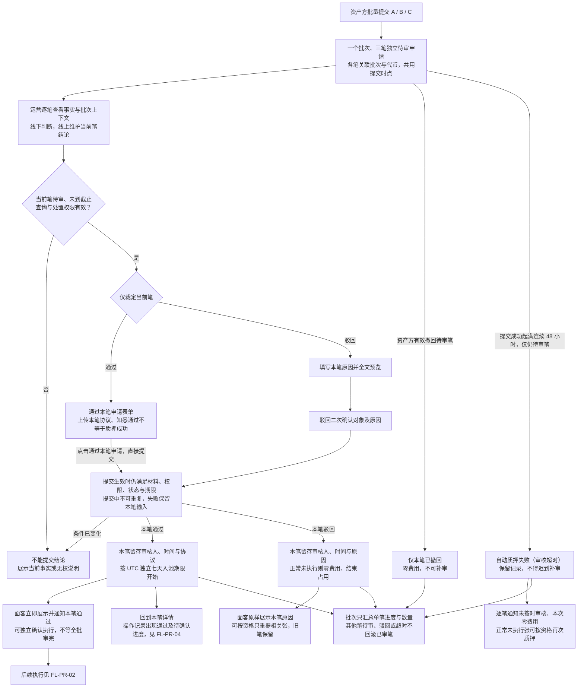
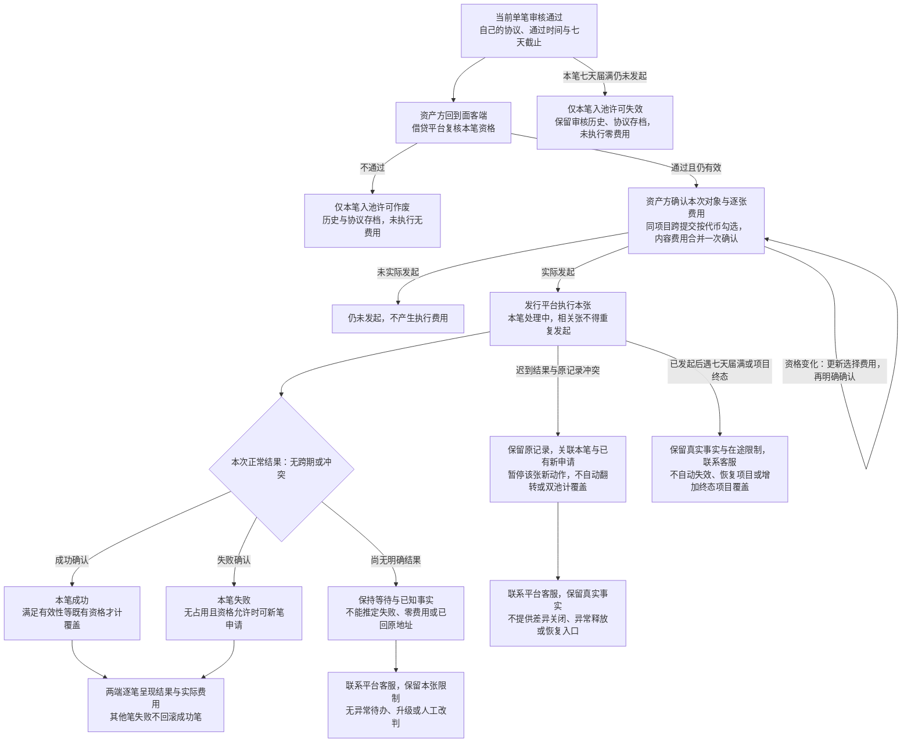
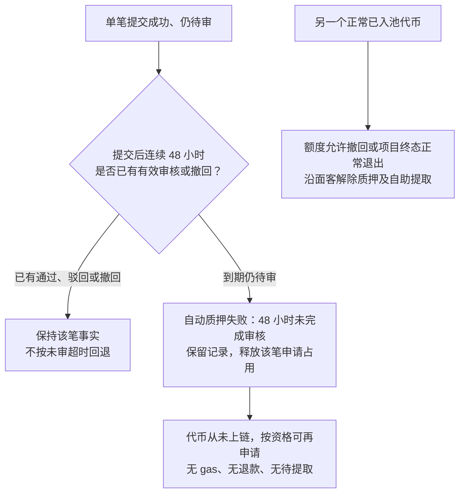
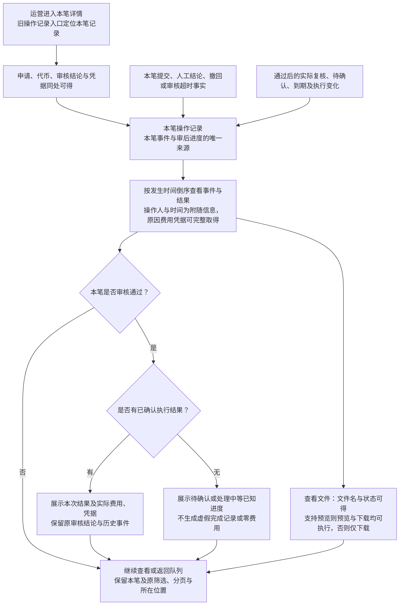
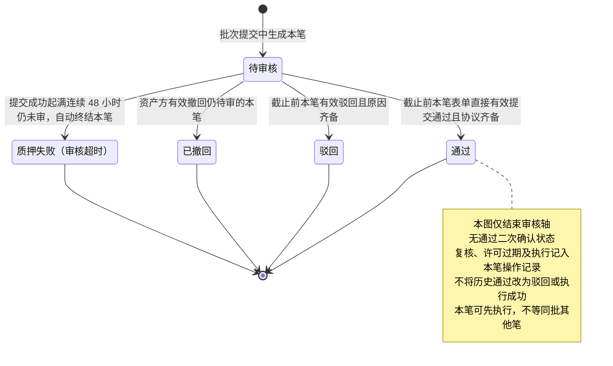
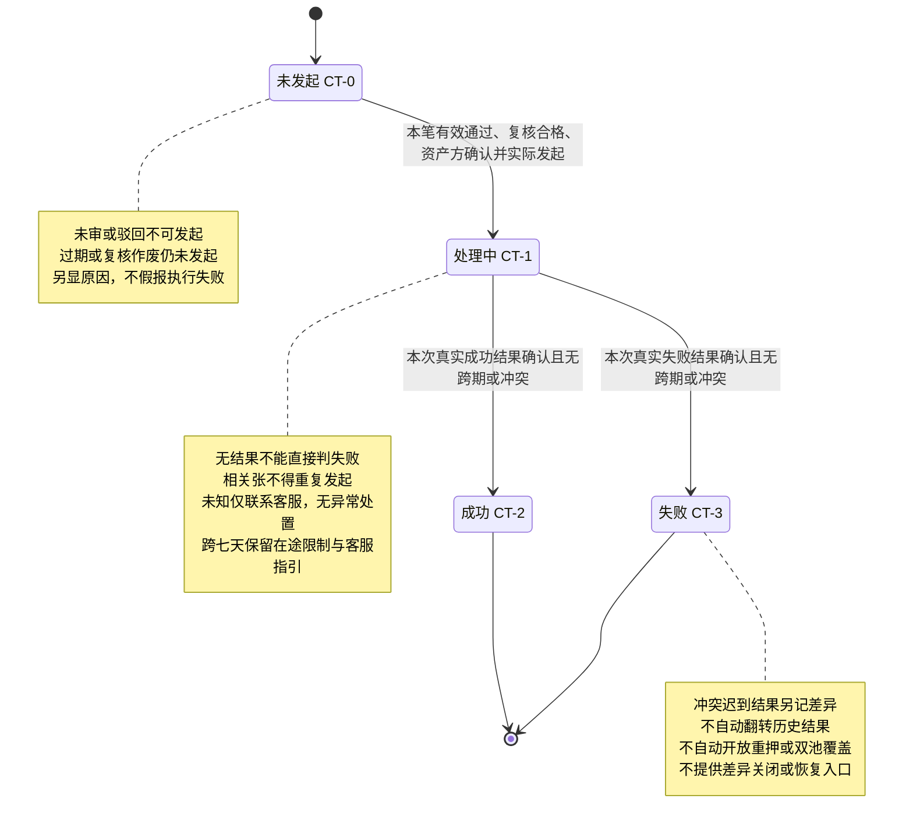

# 代币质押审核 · 流程图与状态机

2026-09-23｜需求评审稿｜配套本模块当前[主 PRD](01-代币质押审核-PRD.md#entry)与[消息通知](03-代币质押审核-消息通知.md)。

开发、测试、设计共同参考。业务规则与同序验收见主 PRD，通知事件见消息通知册。本册只表达角色、用户路径和业务状态，不表示页面或组件，承载形式由设计决定（见[统一条款](01-代币质押审核-PRD.md#design-boundary)）；与正文不一致时以正文为准。

每笔是一张代币的一次申请，重新提交形成新笔，历史与协议不覆盖。连线为已确认业务分支：执行异常仅提示联系平台客服，不画工单、升级、改判或释放流程；审核 48 小时不等于执行期限。日期判定与统计统一 UTC，时点按偏好时区显示并标注；入池七天从本笔通过时点按 UTC 增加七个自然日，不按当地日末。

| 图号 | 名称 | 关联需求与正文 |
| --- | --- | --- |
| [`FL-PR-01`](#fl-pr-01) | 批量提交、逐笔审核及两端结果 | `F-PR-01`～`17`、`D-PR-29`～`31`、`35`～`36`；[3.1 队列](01-代币质押审核-PRD.md#m1)～[3.5 时限](01-代币质押审核-PRD.md#m5)、[3.7 留痕与通知](01-代币质押审核-PRD.md#m7) |
| [`FL-PR-02`](#fl-pr-02) | 已通过代币批量确认、执行及未知结果 | `F-PR-18`、`D-PR-32`～`33`、`37`～`38`；[3.6 执行结果](01-代币质押审核-PRD.md#m6) |
| [`FL-PR-03`](#fl-pr-03) | 审核失败释放占用与正常退出边界 | `F-PR-11`、`D-PR-32`～`33`；[3.4 驳回](01-代币质押审核-PRD.md#m4)、[3.6 执行结果](01-代币质押审核-PRD.md#m6) |
| [`FL-PR-04`](#fl-pr-04) | 操作记录与审后进度的查看 | `F-PR-06`、`08`、`13`、`18`、`D-PR-34`、`36`；[3.2 单笔事实](01-代币质押审核-PRD.md#m2)、[3.6 执行结果](01-代币质押审核-PRD.md#m6) |
| [`ST-PR-01`](#st-pr-01) | 单笔审核轴 `RV-20` | `F-PR-09`、`11`～`12`、`14`～`15`；[2.4 状态与汇总](01-代币质押审核-PRD.md#states) |
| [`ST-PR-02`](#st-pr-02) | 单笔转入执行结果 | `F-PR-18`、`D-PR-32`～`33`、`37`～`38`；[3.6 执行结果](01-代币质押审核-PRD.md#m6) |

## FL-PR-01 批量提交、逐笔审核及两端结果

规则回查：[单笔审核队列](01-代币质押审核-PRD.md#m1)、[单笔事实与批次历史](01-代币质押审核-PRD.md#m2)、[逐笔通过与协议维护](01-代币质押审核-PRD.md#m3)、[逐笔驳回与唯一结论](01-代币质押审核-PRD.md#m4)、[逐笔时限与撤回](01-代币质押审核-PRD.md#m5)、[留痕与通知触发](01-代币质押审核-PRD.md#m7)。

同批可以 A 通过、B 驳回、C 待审；不同运营可分别办理不同笔，同一笔只有一个生效结果。共用协议须确实覆盖各笔并逐笔明确选用，不自动通过。切换当前笔不能携带上一笔未提交材料或原因。

48 小时审核时钟自批次提交成功起算，局部审核、上传、进入办理均不延长期限。超时只影响未审笔，不把同批已执行费用改为零。每笔通知独立定位，不以批次及结论类型合并掉另一笔。批次统计只供追溯，面客清单始终按代币；同项目跨提交勾选，不按批次要求分别确认，见正文[面客按代币组织与批量确认](01-代币质押审核-PRD.md#d-pr-33)。

## FL-PR-02 已通过代币批量确认、执行及未知结果

规则回查：[单笔执行结果与释放边界](01-代币质押审核-PRD.md#m6)、[逐笔时限与撤回](01-代币质押审核-PRD.md#m5)。运营在本笔操作记录中只读追踪，详见 [`FL-PR-04`](#fl-pr-04)；后续变化不改写人工"通过"。

两笔先后通过有各自七天截止；后通过 B 不改变 A 的截止。普通晚到且无跨期 / 冲突的真实结果按本次执行归属呈现；跨期、冲突或仍待核实笔仅保留事实、保护并联系客服。本期没有执行自动失败、自动放开重押分支。混合结果按张保留，已知成功不被整批改写。

## FL-PR-03 审核失败释放占用与正常退出边界

规则回查：[逐笔时限与撤回](01-代币质押审核-PRD.md#m5)、[释放语义与本期范围](01-代币质押审核-PRD.md#d-pr-32)。异常释放不在本期，不画补偿或处置流程。

仅查看、上传或编辑不算审核完成，不重置 48 小时。同批其他笔不受影响。正常退出使用面客既有规则；本图不将审核失败说成从合约转回。审核与真实转入冲突后的异常释放入口、待办、进度及费用均不在本期。

## FL-PR-04 操作记录与审后进度的查看

规则回查：[操作记录与进度的统一来源](01-代币质押审核-PRD.md#d-pr-34)、[已上传文件的信息与动作要求](01-代币质押审核-PRD.md#d-pr-36)、[单笔执行结果与释放边界](01-代币质押审核-PRD.md#m6)、[留痕与通知触发](01-代币质押审核-PRD.md#m7)。本图是查看和呈现流程，不新增审核或执行状态。

操作记录只记录本笔事实，同一事件重复到达不重复生成记录；当前进度不覆盖历史。无权、加载中、暂无记录及读取失败按正文分别说明。冲突迟到事实保留差异保护，不因展示在操作记录中视为已关闭，不新增异常释放或手工完成入口。文件预览失败、不可得及访问权限按[已上传文件的信息与动作要求](01-代币质押审核-PRD.md#d-pr-36)，不把不支持预览与本次预览失败混为一类。

## ST-PR-01 单笔审核轴 RV-20

规则回查：[逐笔通过与协议维护](01-代币质押审核-PRD.md#m3)～[逐笔时限与撤回](01-代币质押审核-PRD.md#m5)、[状态、汇总与外部状态](01-代币质押审核-PRD.md#states)。面客单笔审核状态与本轴同源，面客单笔申请标识对应 `RV-19`。

撤回、审核超时没有人工审核人或伪造的人工结论。重新申请生成新笔，不回到原待审核。七天未发起失效、复核不通过只影响本笔入池许可及凭据关联，保留原人工审核事实。

批次无"整批通过 / 驳回"状态机。全部待审＝待审核；部分待审且已有笔终结审核＝审核进行中；没有待审＝审核已结束。审核五类数量之和等于总笔数；执行摘要独立汇总已通过笔的未发起 / 处理中 / 成功 / 失败，差异标记不重复加入总数。详见正文[批次汇总](01-代币质押审核-PRD.md#d-pr-31)。

## ST-PR-02 单笔转入执行结果

规则回查：[单笔执行结果与释放边界](01-代币质押审核-PRD.md#m6)。本轴不替代审核结论、质押事实或差异标记；发生后的进度按 [`FL-PR-04`](#fl-pr-04) 展示，不因合入操作记录而改变流转条件。

成功张不因同批其他张失败回滚；未知费用标待核实；新笔新执行不覆盖旧记录。本图只确定实际结果的正常流转，不存在"执行两天＝失败"的阈值。冲突迟到事实遵循 [`FL-PR-02`](#fl-pr-02) 的差异保护，本期仅联系客服，不建设异常关闭或恢复流程。

返回 [PRD 正文](01-代币质押审核-PRD.md)；[同序验收](01-代币质押审核-PRD.md#acceptance)；[依赖、风险与待决](01-代币质押审核-PRD.md#open-items)。
