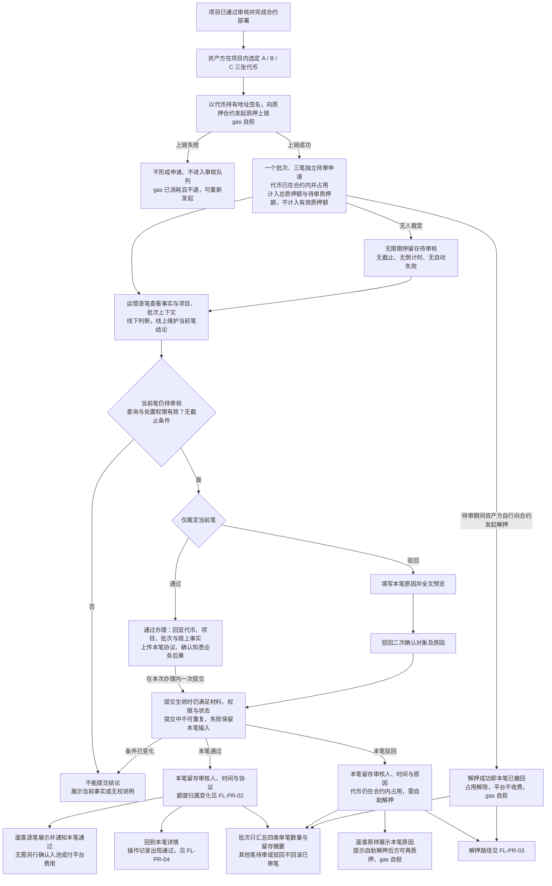
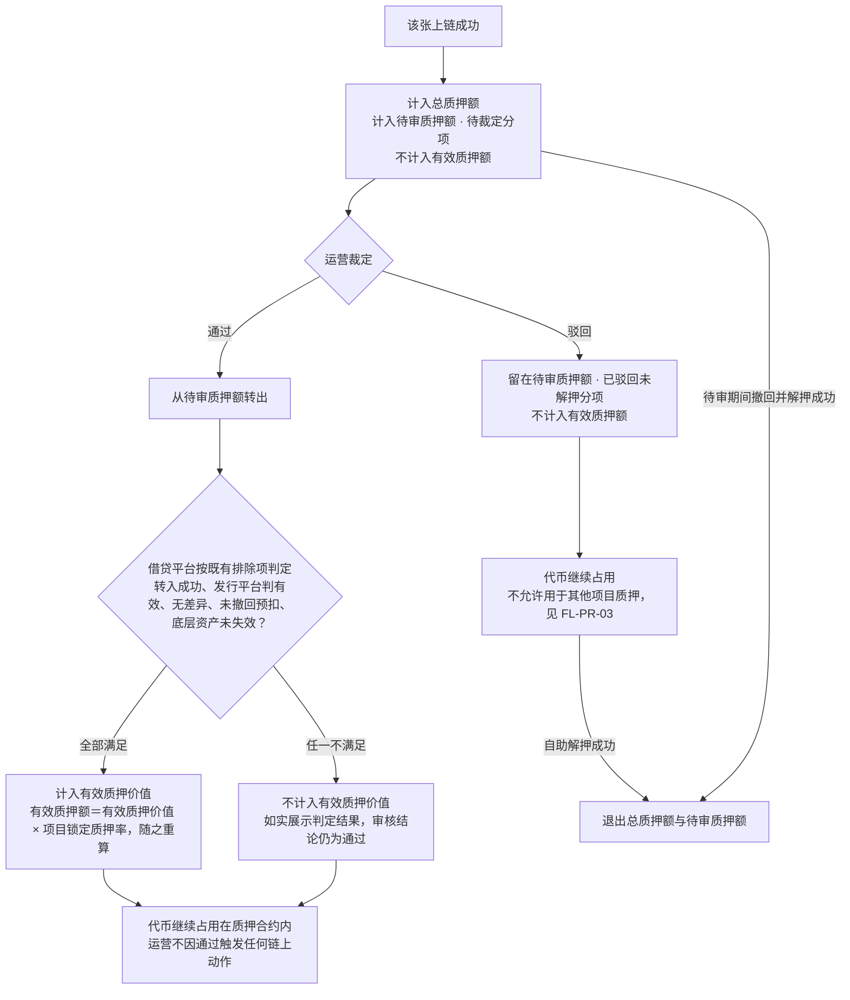
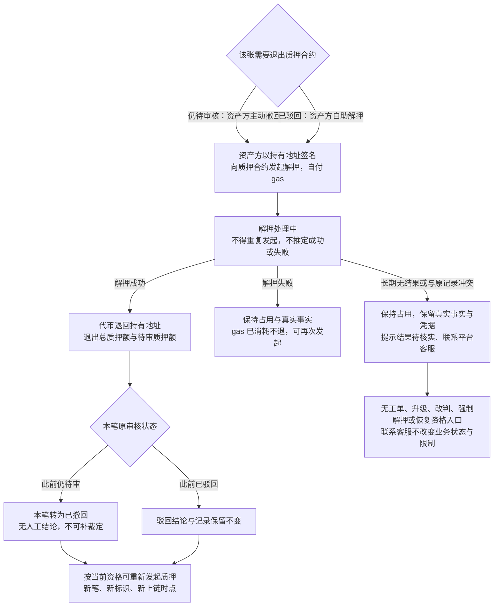
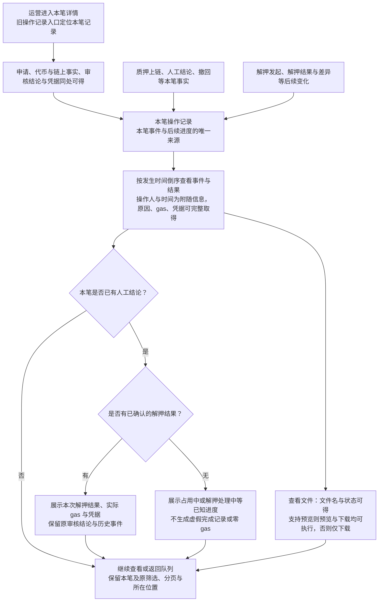
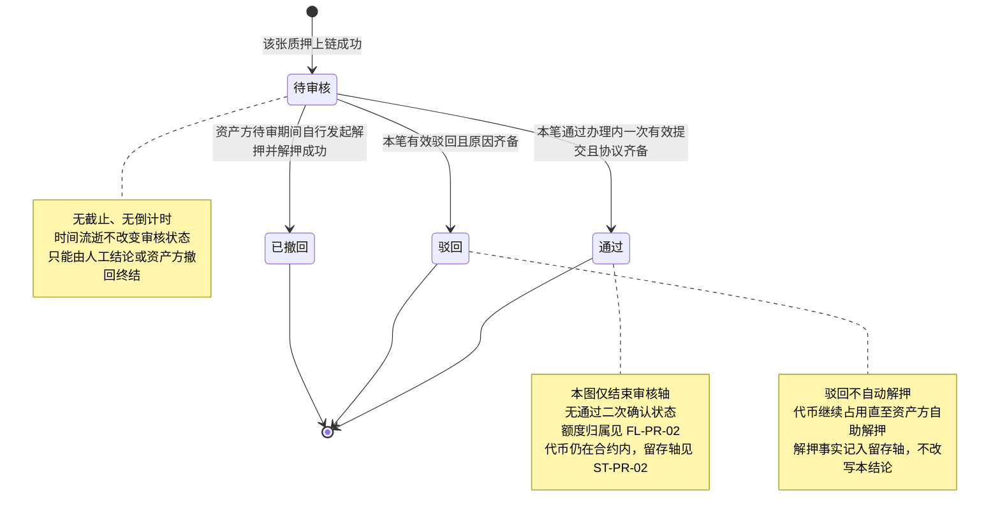
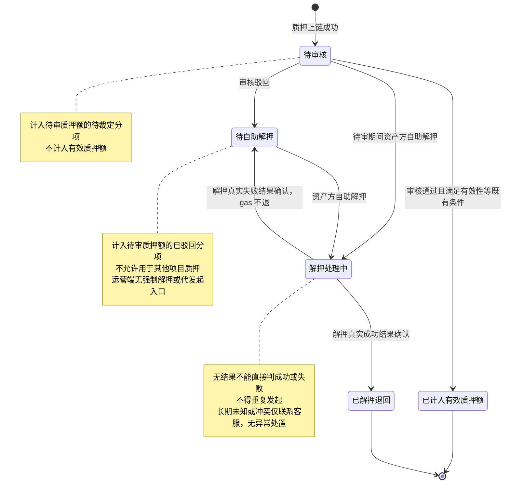

# 代币质押审核 · 流程图与状态机

2026-09-24｜需求评审稿｜配套本模块当前[主 PRD](01-代币质押审核-PRD.md#entry)与[消息通知](03-代币质押审核-消息通知.md)。

开发、测试、设计共同参考。业务规则与同序验收见主 PRD，通知事件见消息通知册。本册只表达角色、用户路径和业务状态，不表示页面或组件，承载形式由设计决定（见[统一条款](01-代币质押审核-PRD.md#design-boundary)）；与正文不一致时以正文为准。

本批链路已反转：**代币先由资产方以持有地址签名上链进入质押合约，上链成功才形成待审申请**；运营审核**无时效**，通过才计入有效质押额；驳回或撤回后由资产方自助解押，解押成功前代币持续占用。每笔是一张代币的一次质押申请，重新质押形成新笔，历史与协议不覆盖。连线为已确认业务分支：链上异常仅提示联系平台客服，不画工单、升级、改判或强制解押流程。日期判定与统计统一 UTC，时点按偏好时区显示并标注。原按 48 小时定义的截止与自动超时分支、入池确认与七天入池期限分支已随本批废止，不再出现在任何图中（废止清单见[主 PRD 5.4 节](01-代币质押审核-PRD.md#retired)）。

| 图号 | 名称 | 关联需求与正文 |
| --- | --- | --- |
| [`FL-PR-01`](#fl-pr-01) | 质押上链、逐笔审核及两端结果 | `F-PR-01`～`13`、`16`～`17`、`D-PR-29`～`31`、`35`～`36`；[3.1 队列](01-代币质押审核-PRD.md#m1)～[3.4 驳回](01-代币质押审核-PRD.md#m4)、[3.7 留痕与通知](01-代币质押审核-PRD.md#m7) |
| [`FL-PR-02`](#fl-pr-02) | 通过后的额度归属与占用延续 | `F-PR-18`、`D-PR-13`、`D-PR-16`、`D-PR-27`、`D-PR-32`；[2.4 额度口径](01-代币质押审核-PRD.md#quota)、[3.6 链上事实](01-代币质押审核-PRD.md#m6) |
| [`FL-PR-03`](#fl-pr-03) | 撤回与驳回后的自助解押 | `D-PR-23`、`D-PR-24`、`D-PR-26`、`D-PR-38`；[3.5 等待与解押](01-代币质押审核-PRD.md#m5)、[3.6 链上事实](01-代币质押审核-PRD.md#m6) |
| [`FL-PR-04`](#fl-pr-04) | 操作记录与后续进度的查看 | `F-PR-06`、`08`、`13`、`18`、`D-PR-34`、`36`；[3.2 单笔事实](01-代币质押审核-PRD.md#m2)、[3.6 链上事实](01-代币质押审核-PRD.md#m6) |
| [`ST-PR-01`](#st-pr-01) | 单笔审核轴 `RV-20` | `F-PR-09`、`11`～`12`、`D-PR-23`；[2.4 状态与汇总](01-代币质押审核-PRD.md#states) |
| [`ST-PR-02`](#st-pr-02) | 本笔当前去向与自助解押 | `F-PR-18`、`D-PR-25`、`D-PR-27`、`D-PR-32`、`D-PR-38`；[3.6 链上事实](01-代币质押审核-PRD.md#m6) |

## FL-PR-01 质押上链、逐笔审核及两端结果

规则回查：[单笔审核队列](01-代币质押审核-PRD.md#m1)、[单笔事实与批次历史](01-代币质押审核-PRD.md#m2)、[逐笔通过与协议维护](01-代币质押审核-PRD.md#m3)、[逐笔驳回与唯一结论](01-代币质押审核-PRD.md#m4)、[留痕与通知触发](01-代币质押审核-PRD.md#m7)。

同批可以 A 通过、B 驳回、C 待审；不同运营可分别办理不同笔，同一笔只有一个生效结果。共用协议须确实适用各笔并逐笔明确选用，不自动通过。切换当前笔不能携带上一笔未提交材料或原因。

**审核不设时效**：等待时长只作事实陈述，任何时间流逝都不改变审核状态，也不产生催办或超时通知。每笔通知独立定位，不以批次及结论类型合并掉另一笔。批次统计只供追溯，面客清单始终按代币。

## FL-PR-02 通过后的额度归属与占用延续

规则回查：[三项额度与审核动作的关系](01-代币质押审核-PRD.md#quota)、[质押上链事实与解押追踪](01-代币质押审核-PRD.md#m6)。本图只描述额度归属的业务变化，公式与派生的权威定义归融资需求与代币质押。

总质押额含失效代币，只作展示、不参与准入。**审核通过是计入有效质押价值的必要条件而非充分条件**：是否实际计入仍由借贷平台按既有排除项判定，本模块如实展示判定结果、不预告。待审质押额的两个分项对额度影响相同，但下一步动作不同，明细须能区分，不能只给合计数。

## FL-PR-03 撤回与驳回后的自助解押

规则回查：[终结方式收敛](01-代币质押审核-PRD.md#d-pr-23)、[驳回后的自助解押与再质押](01-代币质押审核-PRD.md#d-pr-24)、[链上异常与客服边界](01-代币质押审核-PRD.md#d-pr-38)。运营端在本流程中只读追踪，没有任何发起、重试或强制退回的动作。

未解押的代币一直留在质押合约内，**不允许用于其他项目质押**；平台侧没有任何动作能替资产方解押。若资产方长期不解押，该张持续占用并持续计入待审质押额的已驳回分项——这是用户裁定后的既定结果，按[既定业务限制](01-代币质押审核-PRD.md#limits)理解，不判为缺陷。撤回与人工裁定竞合只生效一个结果：人工结论先生效则本笔按结论处理，链上解押另按其真实结果记录。

## FL-PR-04 操作记录与后续进度的查看

规则回查：[操作记录与进度的统一来源](01-代币质押审核-PRD.md#d-pr-34)、[已上传文件的信息与动作要求](01-代币质押审核-PRD.md#d-pr-36)、[质押上链事实与解押追踪](01-代币质押审核-PRD.md#m6)、[留痕与通知触发](01-代币质押审核-PRD.md#m7)。本图是查看和呈现流程，不新增审核或留存状态。

操作记录只记录本笔事实，同一事件重复到达不重复生成记录；当前进度不覆盖历史。无权、加载中、暂无记录及读取失败按正文分别说明。冲突迟到事实保留差异保护，不因展示在操作记录中视为已关闭，不新增强制解押或手工完成入口。文件预览失败、不可得及访问权限按[已上传文件的信息与动作要求](01-代币质押审核-PRD.md#d-pr-36)，不把不支持预览与本次预览失败混为一类。

## ST-PR-01 单笔审核轴 RV-20

规则回查：[逐笔通过与协议维护](01-代币质押审核-PRD.md#m3)～[等待时长、待审撤回与解押](01-代币质押审核-PRD.md#m5)、[状态、额度与外部口径](01-代币质押审核-PRD.md#states)。面客单笔审核状态与本轴同源，面客单笔申请标识对应 `RV-19`。

撤回没有人工审核人或伪造的人工结论。重新质押生成新笔，不回到原待审核。解押结果只改变留存轴，不把历史结论改写为其他值。

批次无"整批通过 / 驳回"状态机。全部待审＝待审核；部分待审且已有笔终结审核＝审核进行中；没有待审＝审核已结束。审核四类数量之和等于总笔数；留存摘要独立汇总占用中 / 解押处理中 / 已退回，差异标记不重复加入总数。详见正文[批次汇总](01-代币质押审核-PRD.md#d-pr-31)。

## ST-PR-02 本笔当前去向与自助解押

规则回查：[质押上链事实与解押追踪](01-代币质押审核-PRD.md#m6)、[占用与解除的语义边界](01-代币质押审核-PRD.md#d-pr-32)。本轴取面客[本笔当前去向 `PA-15`](../v1.0-借贷广场-融资需求与代币质押/01-融资需求与代币质押-PRD.md#pa-15) 的取值，与审核轴并列记录，不替代审核结论、不改写额度公式。质押状态（`PL-06`）与链上执行状态（`PL-07`）同样由融资需求与代币质押定义，本册只读消费。

已计入有效质押额与已解押退回是本轴的两个终态，互不转化；解押成功的张不因同批其他张失败而回滚，退回后按当前资格可重新发起质押，新笔新上链不覆盖旧记录。未知 gas 标待核实。本图只确定真实结果的正常流转，不存在任何基于时长的自动失败或自动放开。冲突迟到事实遵循 [`FL-PR-03`](#fl-pr-03) 的差异保护，本期仅联系客服，不建设异常关闭或恢复流程。

返回 [PRD 正文](01-代币质押审核-PRD.md)；[同序验收](01-代币质押审核-PRD.md#acceptance)；[依赖、既定限制与待决](01-代币质押审核-PRD.md#open-items)。
