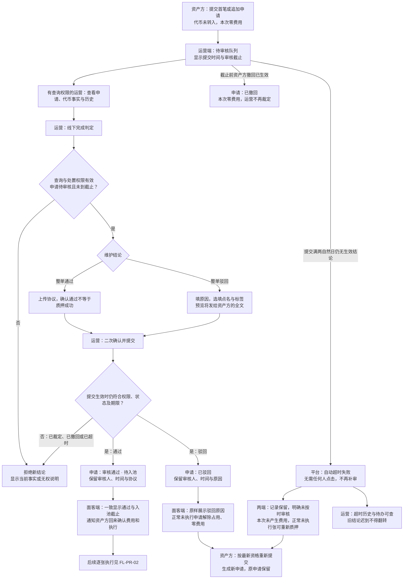
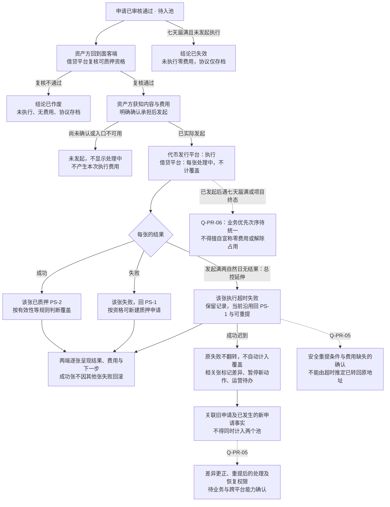
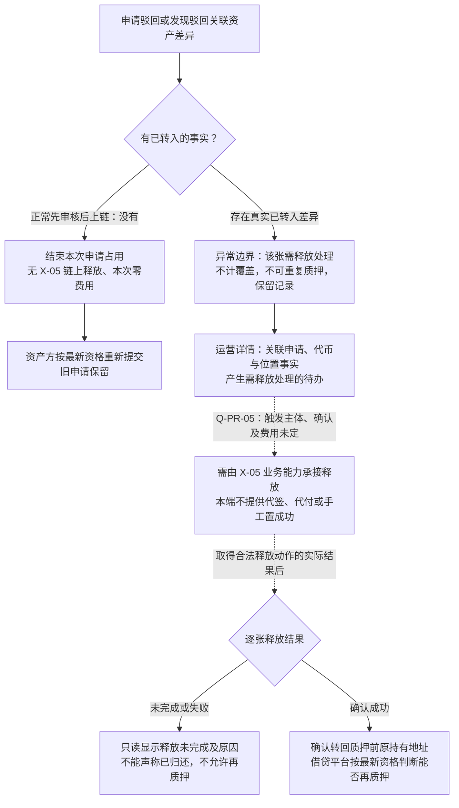
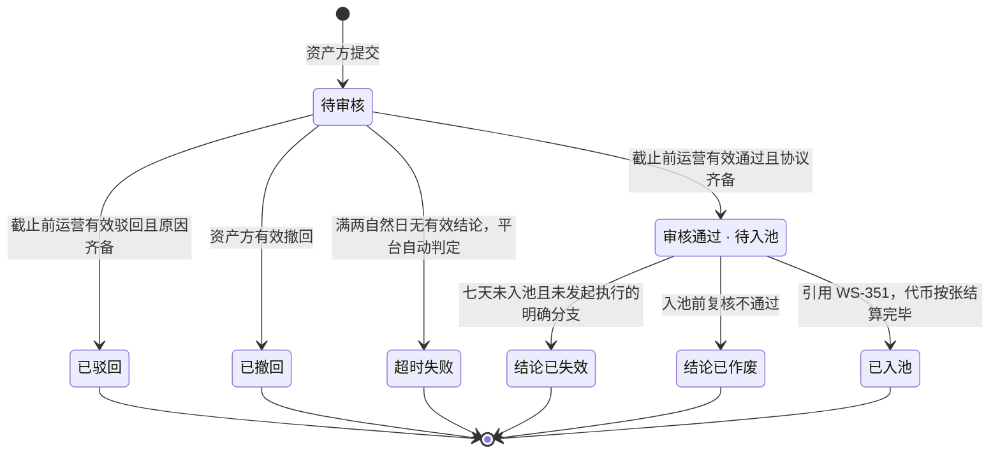
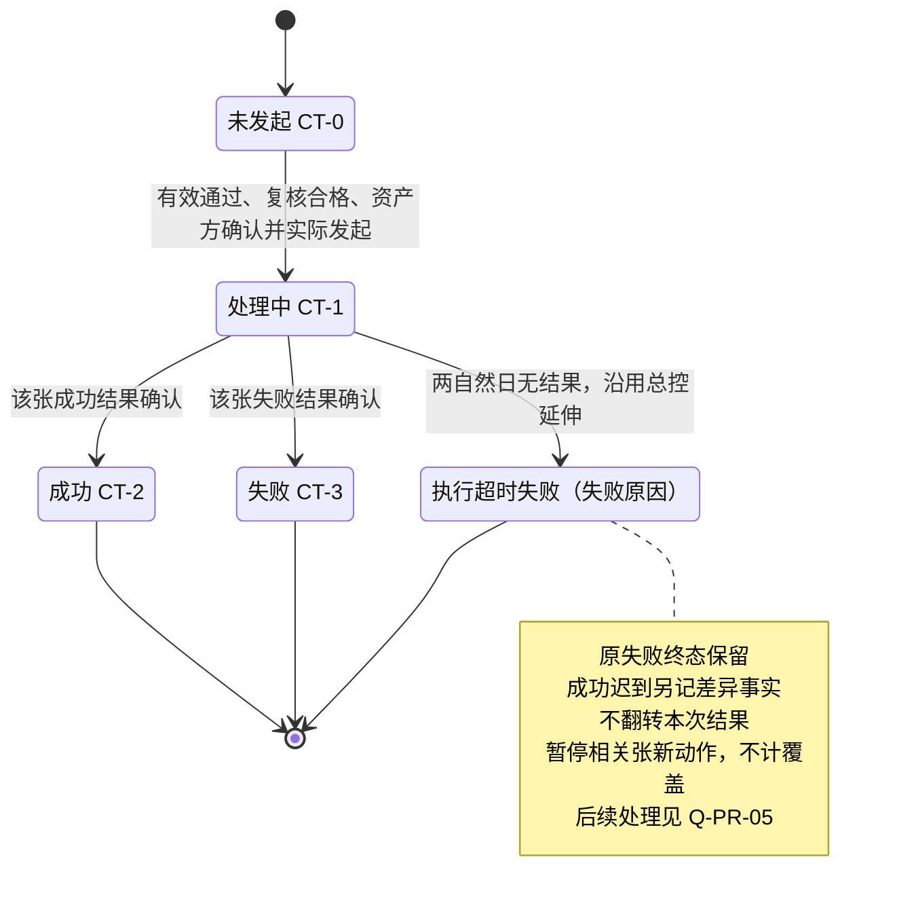

# 运营管理平台 · 代币质押审核 · 流程图与状态机 V1.0

与[PRD 正文](v1.0-代币质押审核-PRD.md)同批交付。开发、测试与设计共同参考；正文定义规则，本册只画业务角色、流程与状态，不定义协议或实现。所有“执行两天超时”均为 WS-351 **总控延伸的当前衔接口径，非用户直接确认**；跨平台未决项见正文[第 9 章](v1.0-代币质押审核-PRD.md#open-items)。

| 图号 | 内容 | 关联需求 | 正文与验收 |
| --- | --- | --- | --- |
| FL-PR-01 | 审核与两端结论闭环 | F-PR-01～17 | [M1～M5](v1.0-代币质押审核-PRD.md#m1)、[M7](v1.0-代币质押审核-PRD.md#m7)；AC-PR-01～43、49～50 |
| FL-PR-02 | 通过后的逐张执行、超时及迟到结果 | F-PR-18、19 | [M6](v1.0-代币质押审核-PRD.md#m6)；AC-PR-44～47 |
| FL-PR-03 | 标准驳回与已转入异常释放的边界 | F-PR-11、19 | [M4](v1.0-代币质押审核-PRD.md#m4)、[M6](v1.0-代币质押审核-PRD.md#m6)；AC-PR-48 |
| ST-PR-01 | PA 申请状态的运营视角 | F-PR-09、11、12、14、15、18 | [状态表](v1.0-代币质押审核-PRD.md#states)；AC-PR-21～24、29、41～45 |
| ST-PR-02 | 一张代币的一次转入执行结果 | F-PR-18、19 | [M6](v1.0-代币质押审核-PRD.md#m6)；AC-PR-44～47 |

图例：实线为已明确的业务流转；虚线为后续依赖或未闭合边界；“待确认”节点不是可执行按钮。PS / CT 标识仅用于文档对应，产品界面展示语义标签。

## FL-PR-01 审核与两端结论闭环

规则回查：[M1 队列](v1.0-代币质押审核-PRD.md#m1)、[M2 详情](v1.0-代币质押审核-PRD.md#m2)、[M3 通过](v1.0-代币质押审核-PRD.md#m3)、[M4 驳回](v1.0-代币质押审核-PRD.md#m4)、[M5 到期](v1.0-代币质押审核-PRD.md#m5)、[M7 权限留痕](v1.0-代币质押审核-PRD.md#m7)。

到期不以是否有人打开页面为条件；弹层打开、上传完成、线下已判定都不能延长截止。正常驳回无链上释放；实际已转入差异另见 FL-PR-03。消息失败不改变已经生效的业务结论。

## FL-PR-02 逐张执行、超时与迟到结果

规则回查：[M6](v1.0-代币质押审核-PRD.md#m6)，承接 WS-351 D-LS-30～33、47；验收 AC-PR-44～47。运营端在以下流程均只读追踪，不代签名、发起或更正。

审核是整单结论，执行是逐张结果；本图的成功、失败、超时可在同一申请中并存。审核两天自申请提交起算；执行两天自该张实际发起起算；入池七天自通过结论起算。该张的终态不代表整单审核变成失败。

## FL-PR-03 驳回与异常释放的适用边界

规则回查：[M4](v1.0-代币质押审核-PRD.md#m4)、[M6 D-PR-27](v1.0-代币质押审核-PRD.md#m6)；验收 AC-PR-48。此图不新增自动释放授权。

正常通过后的撤回及项目终态业务释放归 WS-351，不走审核驳回。已经通过的申请不可改成驳回来启动本图；旧流程存量是否存在没有被本册预设。虚线仅表示需承接能力，未决前不把它做成可操作的释放按钮。

## ST-PR-01 质押申请 PA-05 的运营视角

规则回查：[M3～M5](v1.0-代币质押审核-PRD.md#m3)、[正文状态表](v1.0-代币质押审核-PRD.md#states)。这里引用 WS-351 申请状态，不另定义代币状态。

“已入池”引用输入现名，必须附逐张结果，不表示全部成功；全失败 / 混合执行超时汇总状态及已执行跨七天边界有歧义，见 Q-PR-06，未在图中擅定。Timeout 专指审核自动超时，不把某张执行失败串成整单驳回。所有重新提交都是另一份申请，不画回到原 Pending 的箭头。

## ST-PR-02 一张代币的一次转入执行结果

规则回查：[M6 D-PR-25～26](v1.0-代币质押审核-PRD.md#m6)；验收 AC-PR-44～47。状态主体是一张代币的一次执行，审核结论、PS 质押事实、差异标记分别保留，不能合并成一个审核状态。

成功张不因其他张失败回滚；处理中只限制该张，不锁整个项目。执行超时后回 PS-1 是 WS-351 当前衔接口径，不能解读为已证明链上资产位置。新申请、新执行不覆盖旧记录；不得从 TimedOut 直接画回 Succeeded 来表示迟到成功。

回到[PRD 正文](v1.0-代币质押审核-PRD.md)；测试入口：[验收需求说明](v1.0-代币质押审核-PRD.md#acceptance)；未决入口：[依赖与待确认](v1.0-代币质押审核-PRD.md#open-items)。
