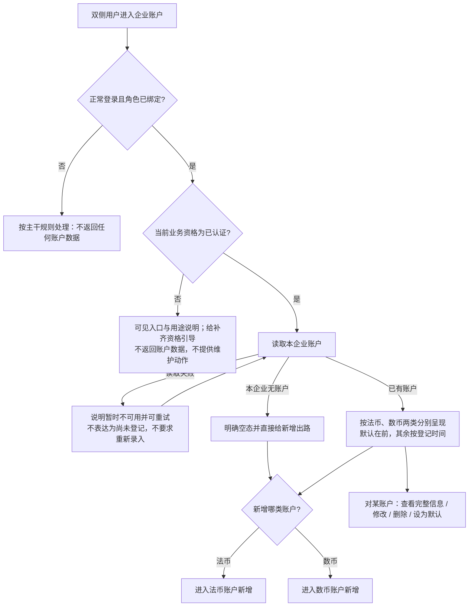
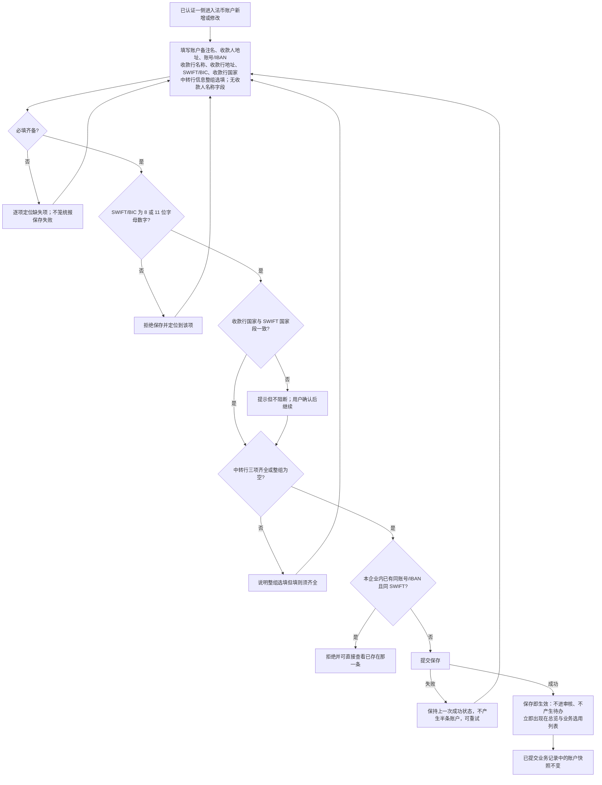
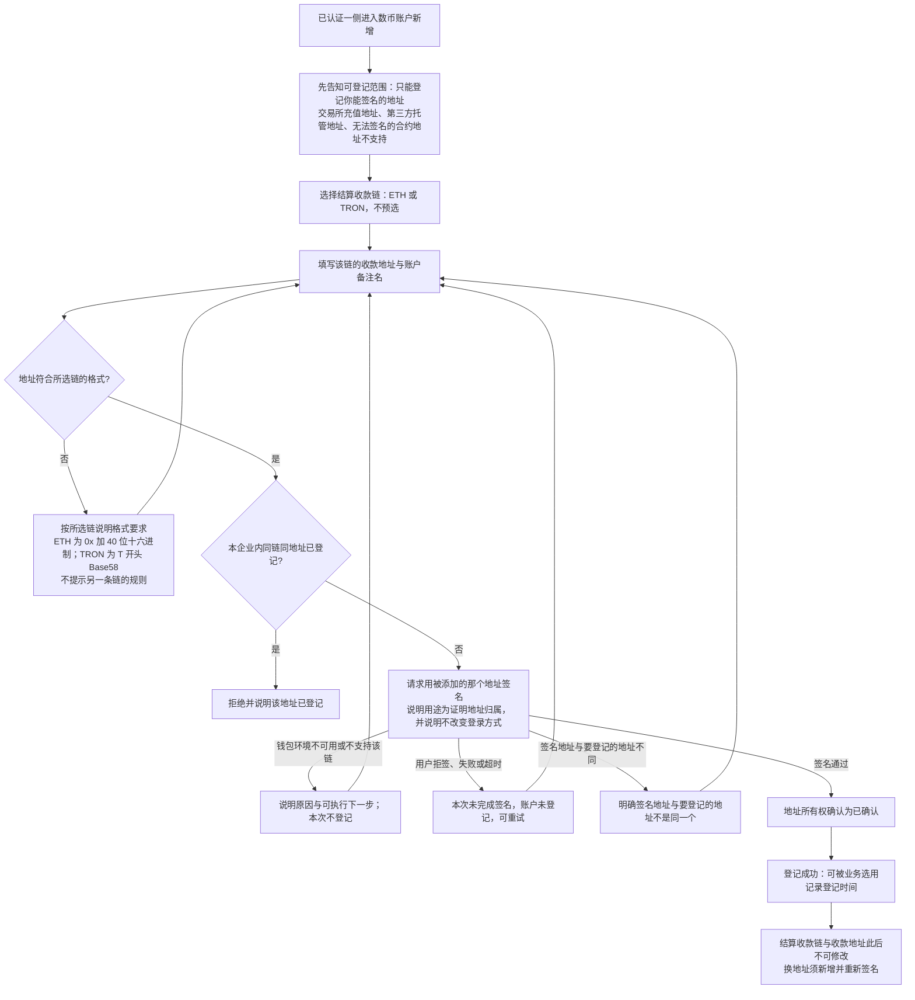
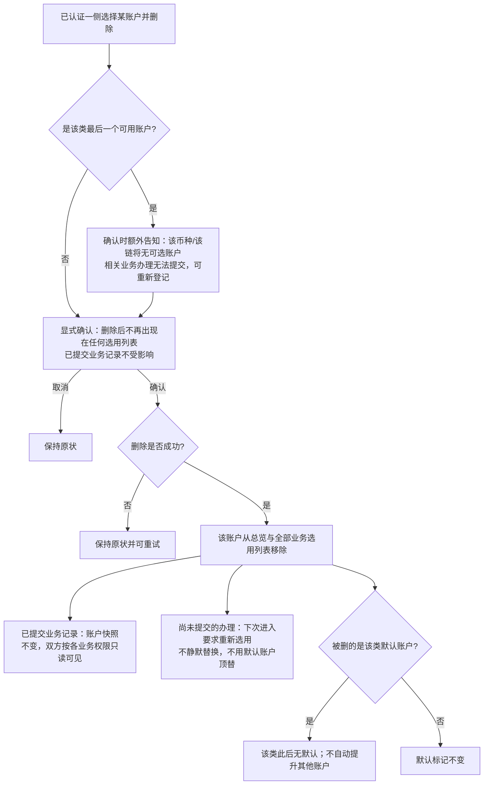
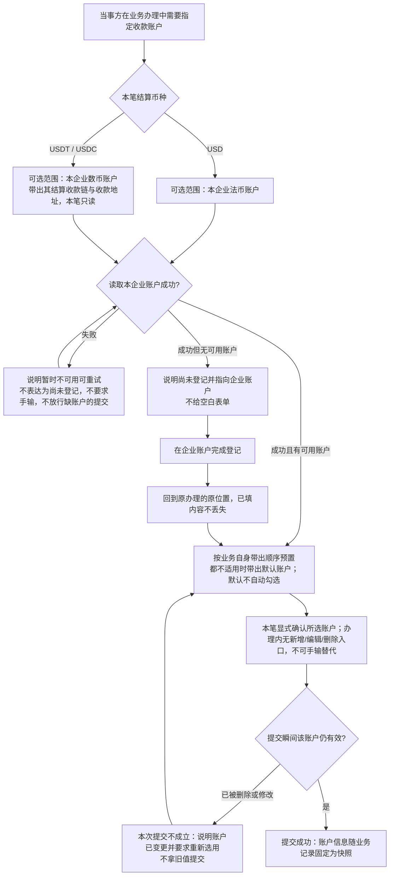
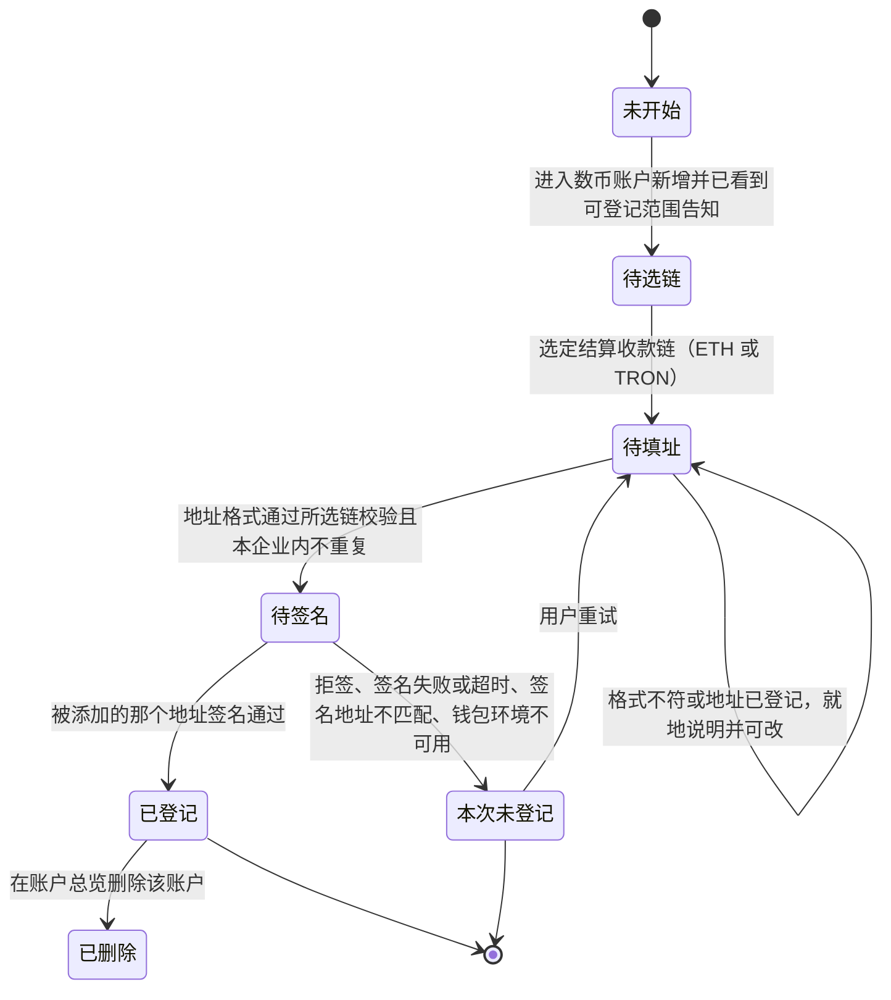
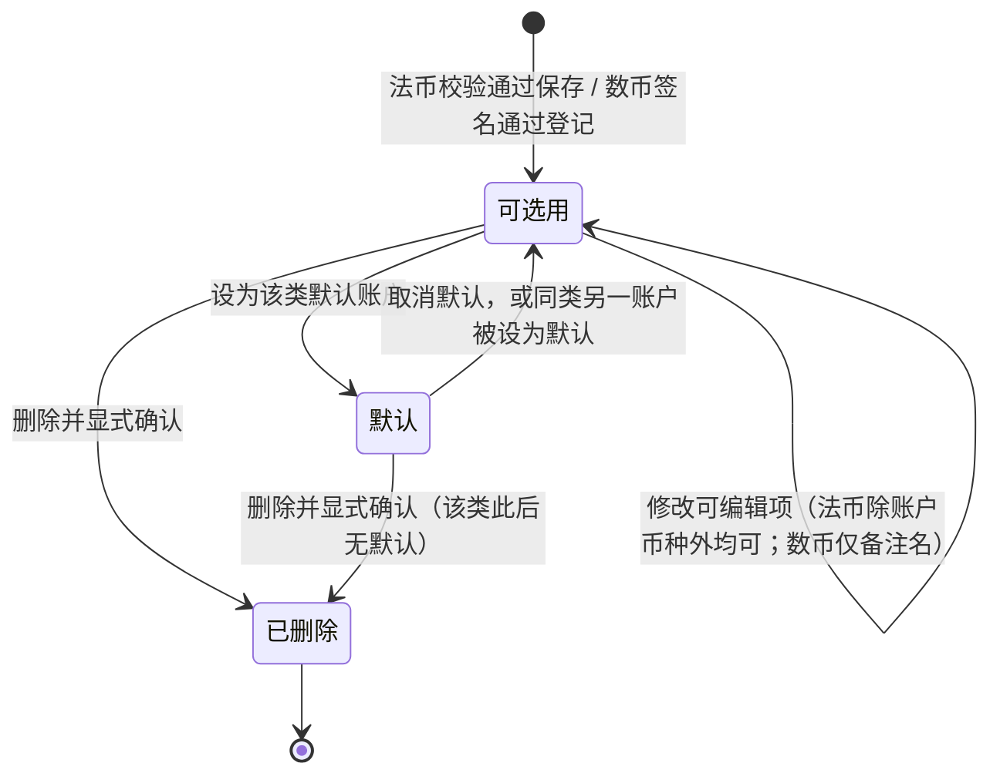

# 企业账户 · 流程图与状态机

版本：2026-09-24。需求：企业账户（WS-386）。与[主 PRD](./01-企业账户-PRD.md)及[消息通知](./03-企业账户-消息通知.md)共同使用。图中只表达角色、业务条件、结果和状态；字段、校验、权限与异常的完整定义在主 PRD，不在图册另建一套口径。

本册只定义信息需求与业务行为；页面布局、组件形态、层级与视觉由 Hallmark 设计决定。本册措辞与设计稿冲突时以设计稿为准，业务口径仍以本册为准。图中节点是业务环节与信息域，不表示页面或组件。

实线表示业务推进或状态变化。本册共 5 张业务流程图与 2 张状态机；各图通过业务名称链接到主 PRD 的对应功能。**数币账户登记**与**收款账户生命周期**是两个独立业务对象，状态不混用。资产方与资金方走同一套流程，图中不分两条线；差别只在账户的资金用途，见[双侧同规则、用途按业务区分（D-EA-02）](./01-企业账户-PRD.md#d-ea-02)。

## 账户总览与新增入口（图 1）

对应[企业账户入口与账户总览（F-EA-01）](./01-企业账户-PRD.md#f-ea-01)。

运营人员与 SPV 不出现在本图任何分支：任何入口与直接请求都被拒绝，见[运营端不新增权限项（P-EA-02）](./01-企业账户-PRD.md#p-ea-02)。

## 法币账户新增与修改（图 2）

对应[新增法币收款账户（F-EA-02）](./01-企业账户-PRD.md#f-ea-02)与[修改账户（F-EA-04）](./01-企业账户-PRD.md#f-ea-04)。

修改与新增走同一套校验；账户币种本期定值 USD 且只读，不提供选择。取消或离开不保留未提交内容，本模块不设草稿。

## 数币账户新增与地址所有权签名（图 3）

对应[新增数币收款账户（F-EA-03）](./01-企业账户-PRD.md#f-ea-03)。

签名不建立登录会话、不切换登录钱包、不参与登录地址匹配、不改变角色绑定，也不改绑登录凭据；被添加地址可与登录地址不同、可在另一条链上。与主干登录条款的关系见[Q-EA-05](./01-企业账户-PRD.md#q-ea-05)。任何失败分支都不改变当前登录、不产生半条账户，也没有“稍后验证”“跳过验证”或运营代确认的出路。

## 删除账户与已提交记录的关系（图 4）

对应[删除账户（F-EA-05）](./01-企业账户-PRD.md#f-ea-05)与[已选用账户的快照（D-EA-06）](./01-企业账户-PRD.md#d-ea-06)。

删除不可撤销，无回收站；需要恢复时重新登记，数币账户须重新完成地址所有权签名。

## 业务办理侧选用与回流（图 5）

对应[业务办理侧的选用与回流（F-EA-07）](./01-企业账户-PRD.md#f-ea-07)。本图只画本模块与办理侧的衔接，办理动作本身的完整规则在相应业务模块。

## 数币账户登记状态机

对象：一次数币账户的登记过程。初始状态为未开始，终态为已登记或本次未登记。

只有已登记才产生可被选用的账户；待选链、待填址、待签名都不是账户，不落入总览、不占用去重判断、不可被业务选用。结算收款链与收款地址在进入已登记后不可修改；换地址须重新从待选链开始。

## 收款账户生命周期状态机

对象：一个已登记的收款账户（法币与数币共用）。

可选用与默认都属“可被业务选用”，默认只影响带出兜底顺序，不影响是否可选。已删除是终态：不出现在总览与任何选用列表，不可撤销、不可恢复；但已提交业务记录中的账户快照不随之变化，仍按各业务权限只读可见。本期不设“停用”这一中间状态——停止使用某账户的唯一方式是删除它。

完整规则见[共同规则（主 PRD 第 2 章）](./01-企业账户-PRD.md#common)、[完整功能（第 3 章）](./01-企业账户-PRD.md#features)、[与相邻模块的接口口径（第 4 章）](./01-企业账户-PRD.md#interfaces)与[同序验收（第 7 章）](./01-企业账户-PRD.md#acceptance)。
