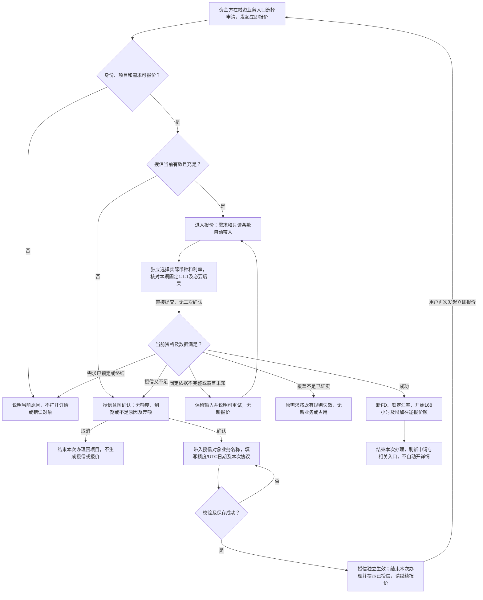
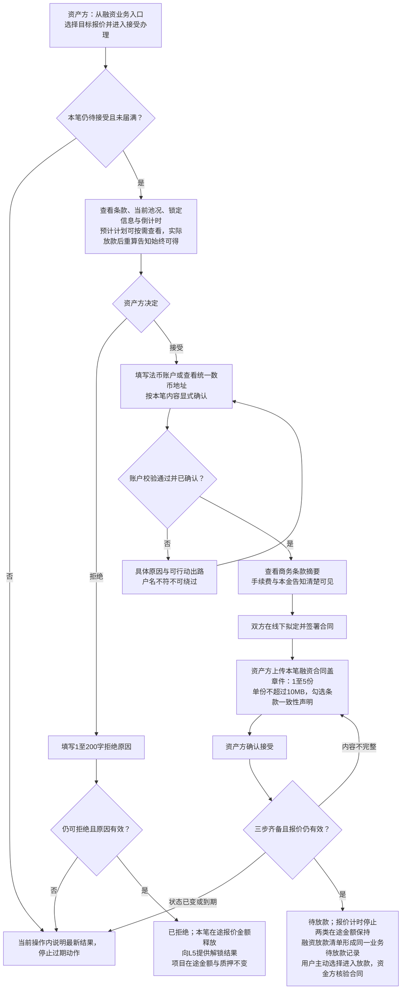
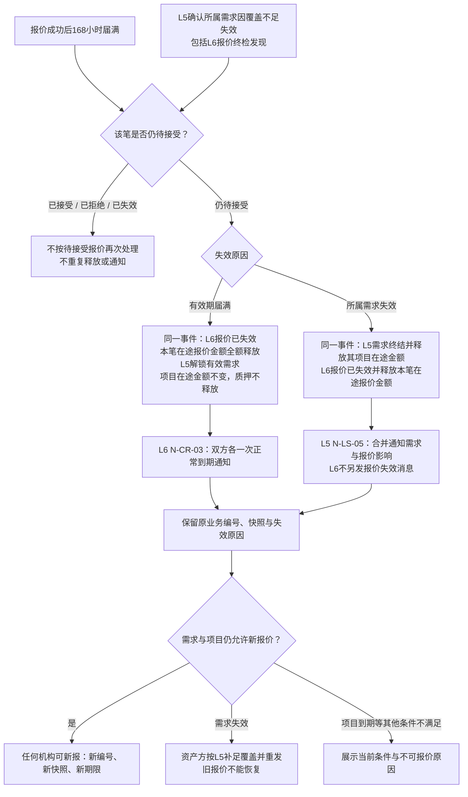
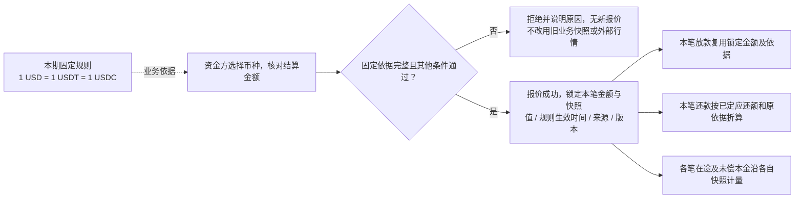
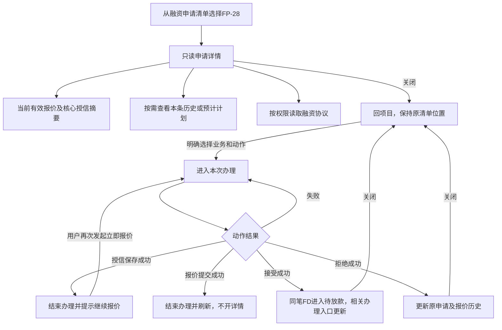
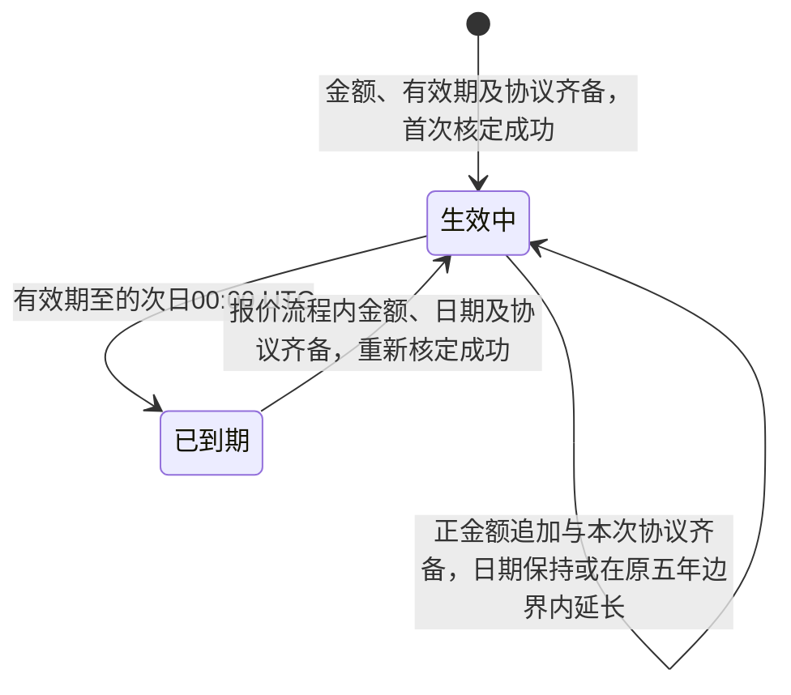
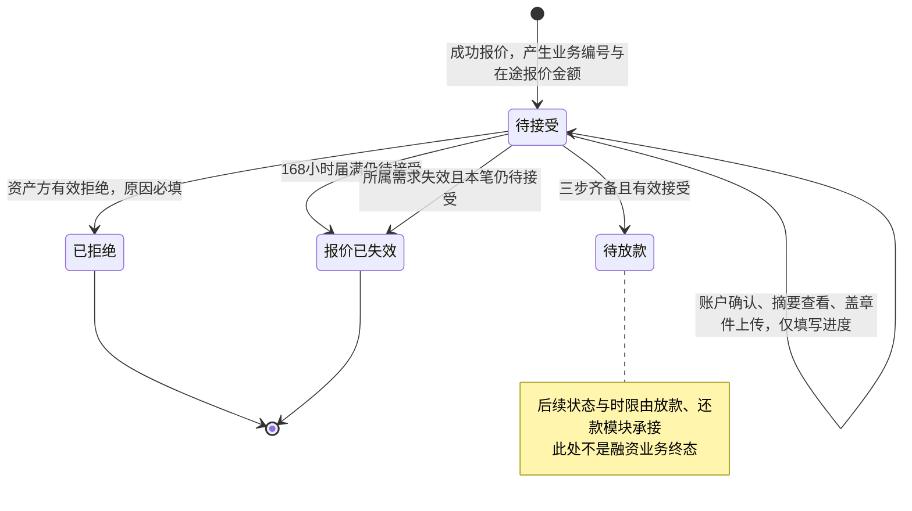
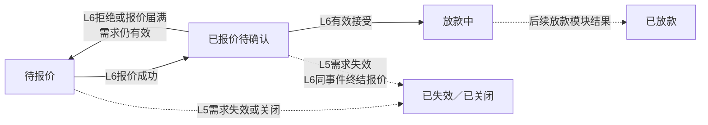

# 授信报价与接受拒绝 · 流程图与状态机

与[主 PRD](01-授信报价与接受拒绝-PRD.md)共用。图中节点是业务环节与信息域，不表示页面或组件，承载形式由设计决定（见[统一条款](01-授信报价与接受拒绝-PRD.md#design-boundary)）。实线为业务动作/状态变化，菱形为判断，虚线为依据或相邻模块结果；“终结”针对本笔对象，不代表项目、授信和债务全部结束。

[授信与报价](#fl-cr-01) · [接受与拒绝](#fl-cr-02) · [两类失效及释放](#fl-cr-03) · [固定折算与逐笔沿用](#fl-cr-04) · [查看记录与办理交接](#fl-cr-05) · [授信生命周期](#st-cr-01) · [融资业务本模块状态](#st-cr-02) · [对外状态协作](#st-cr-03)

## FL-CR-01 授信与报价

关联需求：F-LS-20～F-LS-26、F-LS-36。 [功能正文](01-授信报价与接受拒绝-PRD.md#credit-entry) · [验收](01-授信报价与接受拒绝-PRD.md#accept-credit)

覆盖未知与已证实不足走不同出口；授信保存独立生效，之后报价取消/失败不回滚。完整文件、金额和UTC校验见正文。

## FL-CR-02 接受与拒绝

关联需求：F-LS-28～F-LS-30。 [功能正文](01-授信报价与接受拒绝-PRD.md#respond) · [验收](01-授信报价与接受拒绝-PRD.md#accept-respond)

三步是待接受内的填写进度，计时不停；拒绝无需完成三步，授信协议不替代融资合同。已失效报价不能接受，有效接受先成立后的覆盖由放款承接。

## FL-CR-03 两类失效及释放

关联需求：F-LS-27、F-LS-34、F-LS-35。 [功能正文](01-授信报价与接受拒绝-PRD.md#demand-invalid) · [验收](01-授信报价与接受拒绝-PRD.md#accept-lifecycle)

届满记原截止，需求失效记实际发生时间；只有一个正式结果，重复不再释放或发信。发送归属见[通知](03-授信报价与接受拒绝-消息通知.md#ownership)。

## FL-CR-04 固定折算与逐笔沿用

关联需求：F-LS-26。 [功能正文](01-授信报价与接受拒绝-PRD.md#quote-rate) · [验收](01-授信报价与接受拒绝-PRD.md#accept-quote)

固定比率不代表数币精度已定，Q-CR-09保持；每笔沿原快照，不改历史。

## FL-CR-05 查看记录与办理交接

关联需求：F-LS-32、F-LS-33。 [功能正文](01-授信报价与接受拒绝-PRD.md#records) · [验收](01-授信报价与接受拒绝-PRD.md#accept-presentation)

详情只读；查看历史、计划和文件不改变当前办理对象。失败保留内容，关闭后回到来源；成功后的结束行为按正文。

## ST-CR-01 授信生命周期

关联需求：F-LS-21、F-LS-22。 [功能正文](01-授信报价与接受拒绝-PRD.md#credit-term) · [验收](01-授信报价与接受拒绝-PRD.md#accept-credit)

生效中/已到期分别沿S-CR-1/S-CR-2；追加不重置五年起点，到期只阻止新报价，不动存量。

## ST-CR-02 融资业务本模块状态

关联需求：F-LS-25、F-LS-27～F-LS-30、F-LS-34、F-LS-35。 [功能正文](01-授信报价与接受拒绝-PRD.md#lifecycle) · [验收](01-授信报价与接受拒绝-PRD.md#accept-lifecycle)

待接受、已拒绝、待放款、报价已失效分别沿S-FD-1/2/3/11；拒绝/失效不能恢复，待放款继续计入机构在途。后续待放款确认/异议处理沿S-FD-4/5，转本金以放款确认结果为准。

## ST-CR-03 对外状态协作

关联需求：F-LS-31、F-LS-32。 [功能正文](01-授信报价与接受拒绝-PRD.md#records) · [验收](01-授信报价与接受拒绝-PRD.md#accept-presentation)

五值唯一来源为[L5项目状态](../v1.0-借贷广场-融资需求与代币质押/01-融资需求与代币质押-PRD.md)。L6只提供报价、接受、拒绝/失效事实，不能从简图重建派生规则。项目已到期不因解锁恢复新融资；单笔终止不释放整池。

[返回主 PRD](01-授信报价与接受拒绝-PRD.md)
