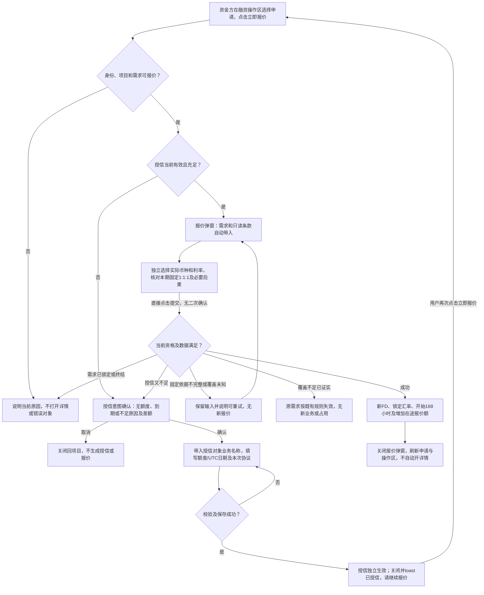
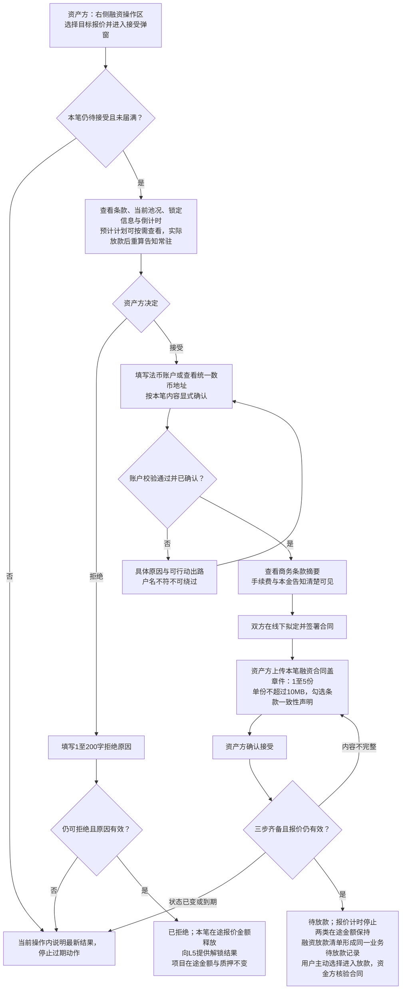
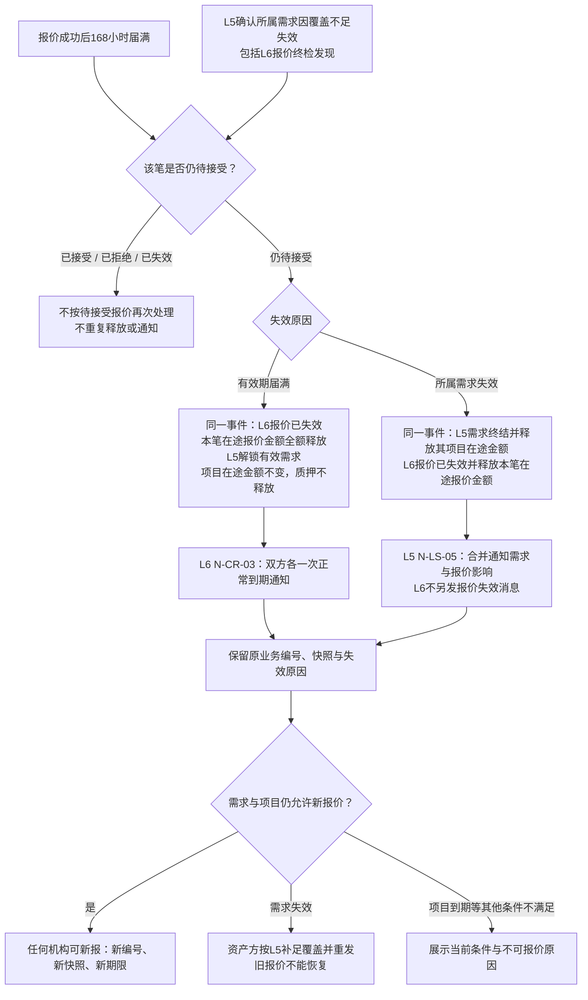
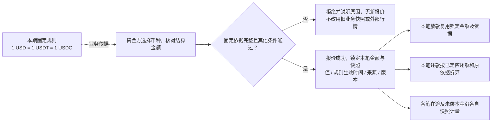
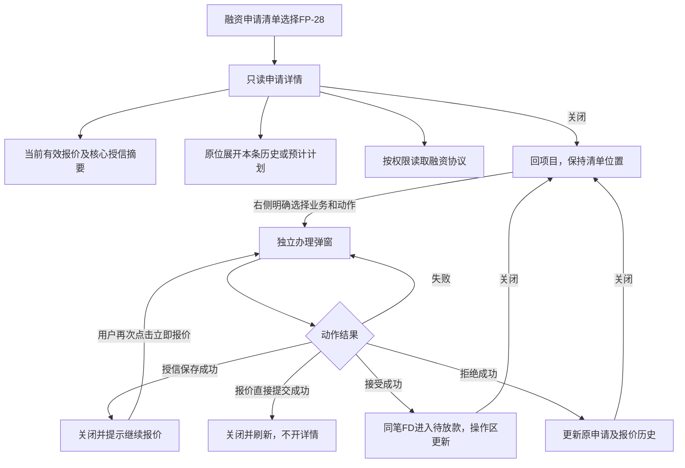
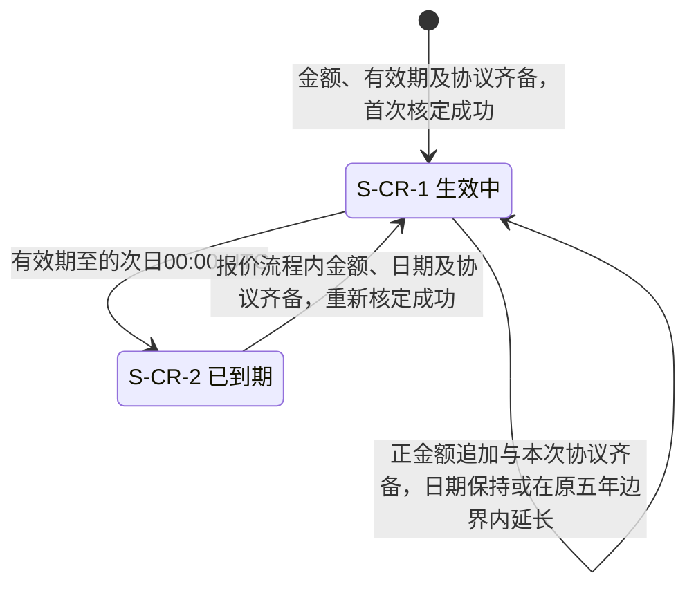
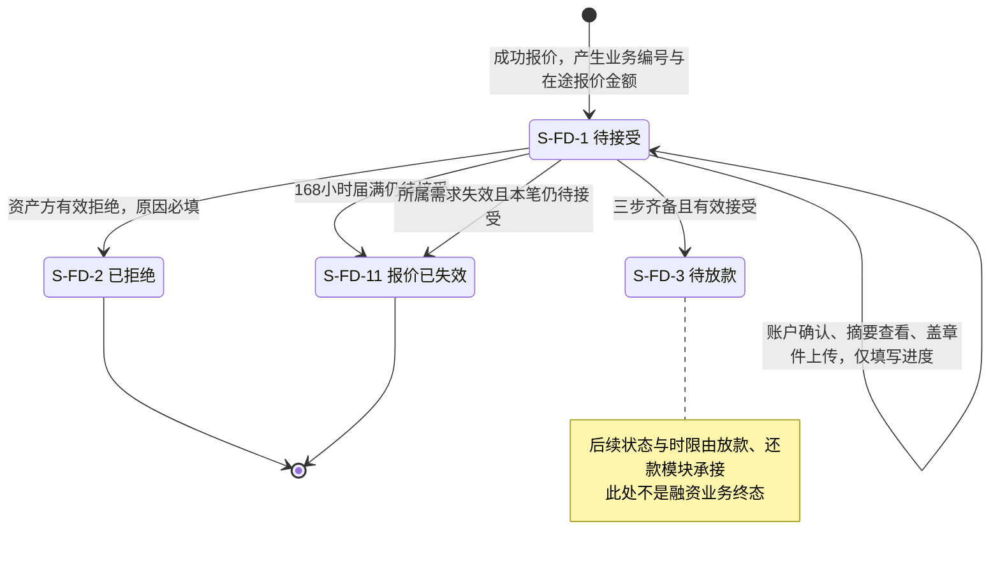
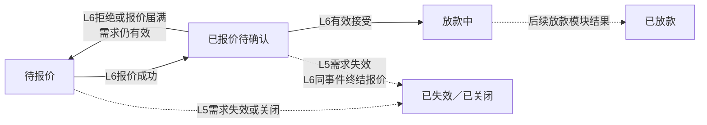

# 借贷广场 · 授信报价与接受拒绝 — 流程图与状态机 V1.4

开发、测试与设计共同参考。[主册](v1.0-借贷广场-授信报价与接受拒绝-PRD.md)给范围与来源，[功能册](01-功能需求说明.md)是规则正文，[验收册](02-验收需求说明.md)给可观察结果。图仅表达已定义的业务角色、流程和状态，不画接口调用、报文或内部实现。

| 图号 | 对象 / 功能 | 关联需求 |
| --- | --- | --- |
| `FL-CR-01` | 资金方授信与报价 | `F-LS-20`～`26`、`F-LS-36`、`D-CR-54`～`57`、`AC-CR-33`～`39`、`AC-CR-03`/`04`/`13`/`20`～`22` |
| `FL-CR-02` | 资产方接受或拒绝 | `F-LS-28`～`30`、`AC-CR-12`、`AC-LS-100`/`102`/`111` |
| `FL-CR-03` | 两种失效及金额联动 | `F-LS-27`/`34`/`35`、`D-CR-30`/`31`、`AC-CR-09`/`15`/`18`/`19`、L5 `D-FIN-75` |
| `FL-CR-04` | 汇率来源与业务沿用 | `F-LS-26`、`D-FIN-17`/`80`/`81`、`E-CR-18` |
| `FL-CR-05` | 申请详情、历史与放款交接 | `F-LS-32`/`33`、`D-CR-58`～`61`、`AC-CR-41`～`47` |
| `ST-CR-01` | 授信对象生命周期 | `F-LS-21`/`22`、`D-CR-10`～`15`/`19`/`20`/`42`、`D-CR-55`～`57` |
| `ST-CR-02` | 融资业务本模块覆盖段 | `F-LS-25`/`27`/`28`/`29`/`30`/`34`/`35`、`D-FIN-77`/`78`/`92` |
| `ST-CR-03` | L5对外状态的协作视图 | `F-LS-31`/`32`、`D-LS-28`～`32`、`AC-LS-117`/`118`、L5 `AC-LS-93` |

图例：实线为业务动作或状态变化，菱形为业务判断；虚线为业务依据或其他模块结果。L5项目额度与状态图不在本册复制。本册“终结”只指对应对象，不代表项目、授信与债务同时结束。

## FL-CR-01 资金方授信与报价

关联需求：`F-LS-20`～`F-LS-26`、`F-LS-36`、`D-CR-54`～`57`、`AC-CR-33`～`39`、`AC-CR-03`/`04`/`13`/`20`～`22`。正文：[功能一](01-功能需求说明.md#credit)、[功能二](01-功能需求说明.md#quote)；验收：[一](02-验收需求说明.md#credit)、[二](02-验收需求说明.md#quote)。

仅带入本笔必要业务信息，对方账户档案不可查看；可选信息缺项不新增准入条件，归属无法确认仍不可提交。额度充足的直接报价分支不强制补交历史授信协议。上传失败/处理中不新增授信状态。

授信提交成功后是独立事实，后续报价取消或失败不回滚。图中数据不可得与覆盖不足已证实是不同出口，前者不得触发需求失效。

## FL-CR-02 资产方接受或拒绝

关联需求：`F-LS-28`～`F-LS-30`、`AC-CR-12`、`AC-LS-100`/`102`/`111`。正文：[功能三](01-功能需求说明.md#respond)；验收：[三](02-验收需求说明.md#respond)。

授信协议属于资金方授信操作，不能代替本图的融资合同盖章件；最多10份的授信要求不改变本图5份上限。三步可中断续做，但状态一直待接受、计时不停。拒绝不要求先完成三步。接受不新增覆盖准入，已失效报价仍不可接受；并发判定按正文 `E-CR-19`。

## FL-CR-03 两种失效与金额联动

关联需求：`F-LS-27`/`34`/`35`、`D-CR-30`/`31`、`AC-CR-09`/`15`/`18`/`19`，L5 `D-FIN-75`。正文：[功能四](01-功能需求说明.md#lifecycle)；验收：[四](02-验收需求说明.md#lifecycle)。

到期及之后不得接受；到期前接受已成功则不再按报价期限终结。需求先失效时其待接受报价不能随后成功接受。重复事件不改变已确定结果，不能产生半完成的状态和金额展示。

## FL-CR-04 汇率来源与业务沿用

关联需求：`F-LS-26`、`D-FIN-17`/`80`/`81`、`E-CR-18`。正文：[功能二2.2](01-功能需求说明.md#quote)；验收：[二·汇率业务验收](02-验收需求说明.md#quote)。

关联 `D-CR-63`、`AC-CR-51`/`54`。固定比例不是数币精度规则；Q-CR-09未闭合部分仍须同源验收。历史快照不回写，外部行情不改变本期新报价。没有人工汇率维护、审核发布或等待行情更新分支。

## FL-CR-05 申请详情、历史与放款交接

关联需求：`F-LS-32`/`33`、`D-CR-58`～`61`、`AC-CR-41`～`47`。正文：[功能五](01-功能需求说明.md#presentation)；验收：[五](02-验收需求说明.md#presentation)。记录区与办理区布局及跨模块交互引用 [L5 功能9.2、11.7](../v1.0-借贷广场-融资需求与代币质押/01-功能需求说明.md)。

只读详情不提供办理或跨业务快捷跳转；文件下载与展开不改变当前报价。授信保存和报价成功后的关闭按正文执行，未提交编辑在本操作弹窗确认放弃。权限、预计与定稿计划规则不变，本图不新增业务状态。

## ST-CR-01 授信对象生命周期

关联需求：`F-LS-21`/`22`、`D-CR-10`～`15`/`19`/`20`/`42`、`D-CR-55`～`57`。正文：[功能一](01-功能需求说明.md#credit)；验收：[一](02-验收需求说明.md#credit)。

一条授信关系对应机构×资产方，与单个项目无关。到期只关新增，不动存量；无冻结、停用、审核中状态。重新核定不覆盖历史，不因报价失败回滚。P06上限取首次或最近正式重新核定UTC日+5年，追加不重置；日期按 `D-CR-62`，验收 `AC-CR-49`/`50`。

## ST-CR-02 融资业务的本模块覆盖段

关联需求：`F-LS-25`/`27`～`30`/`34`/`35`、`D-FIN-77`/`78`/`92`。正文：[功能三](01-功能需求说明.md#respond)、[功能四](01-功能需求说明.md#lifecycle)；验收：[三](02-验收需求说明.md#respond)、[四](02-验收需求说明.md#lifecycle)。

已拒绝与报价已失效是不同终态，均保留编号且不能恢复。填写进度不是新状态；待放款仍属于在途报价金额，放款确认完成才转成授信占用额。

## ST-CR-03 L5对外五值的本模块协作视图

关联需求：`F-LS-31`/`32`、`D-LS-28`～`32`、`AC-LS-117`/`118`，L5 `AC-LS-93`。正文：[功能四](01-功能需求说明.md#lifecycle)、[功能五](01-功能需求说明.md#presentation)；验收：[四](02-验收需求说明.md#lifecycle)、[五](02-验收需求说明.md#presentation)。

**这不是另一套需求状态机。** 五值与派生规则唯一来源为[L5功能册11.6](../v1.0-借贷广场-融资需求与代币质押/01-功能需求说明.md)；图只标本模块提供哪些事实。单笔终止后项目资格仍取L5 `D-LS-64`，不据本图自动恢复募集中或释放整池（`AC-CR-53`）。

仅两个向前跃迁属于L6：成功报价与有效接受；回退与连带终结按正文对应结果协作。页面消费L5下发值，不能以这张简图重新推导完整映射。项目已到期时是否可新增报价仍受L5约束，回退标签不取消到期限制。

覆盖失效与正常到期的通知细则见[独立通知册](03-授信报价与接受拒绝-消息通知.md)，发送归属与FL-CR-03一致。

> [返回主册](v1.0-借贷广场-授信报价与接受拒绝-PRD.md) · [功能需求说明](01-功能需求说明.md) · [验收需求说明](02-验收需求说明.md)
