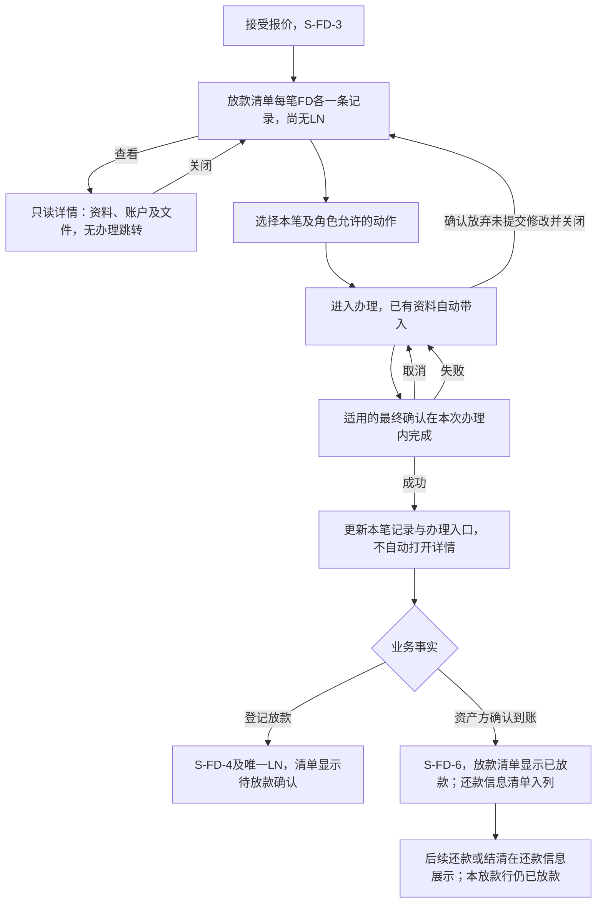
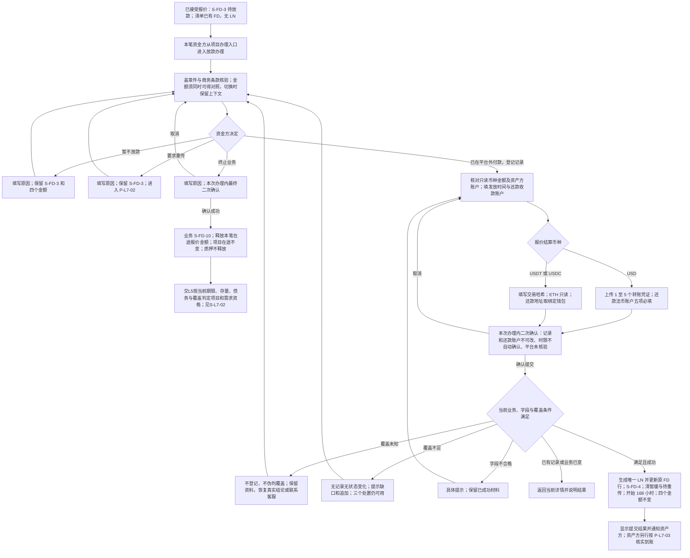
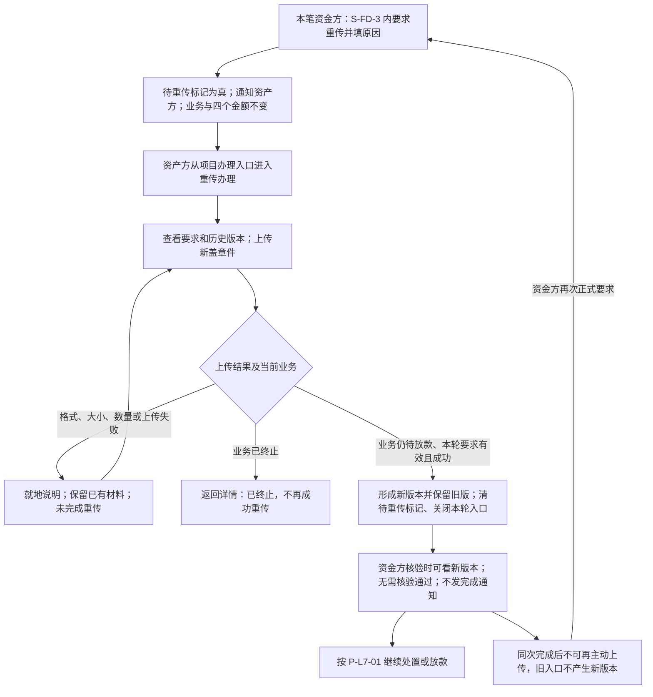
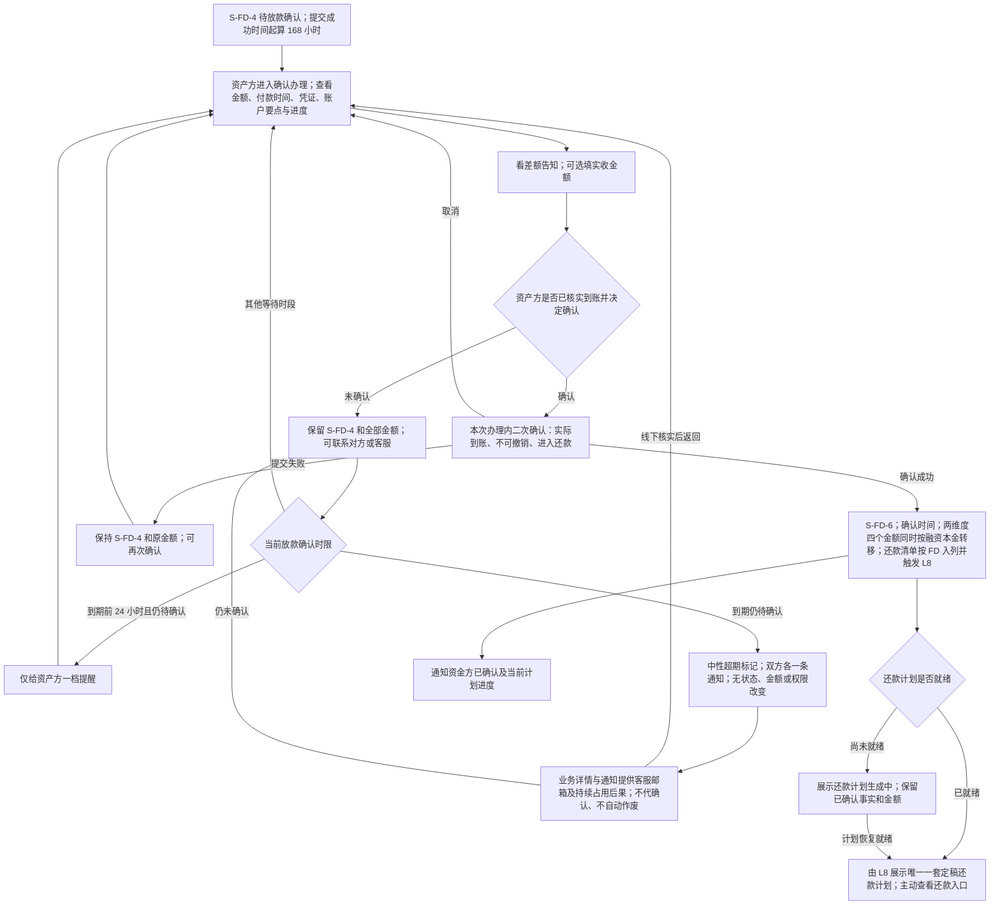
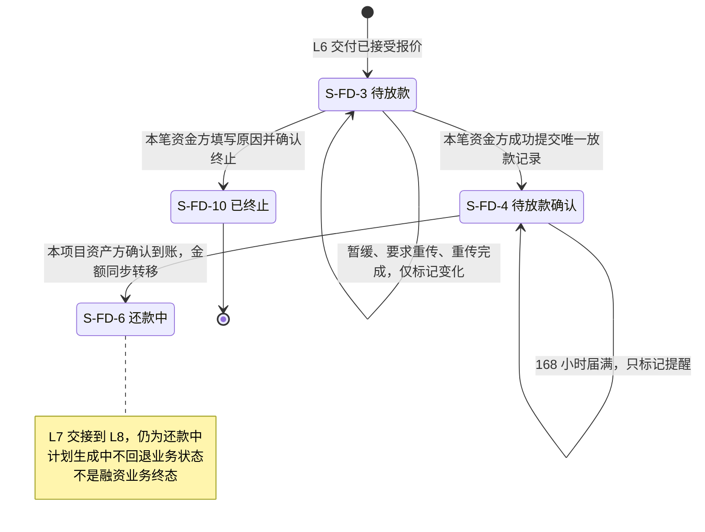
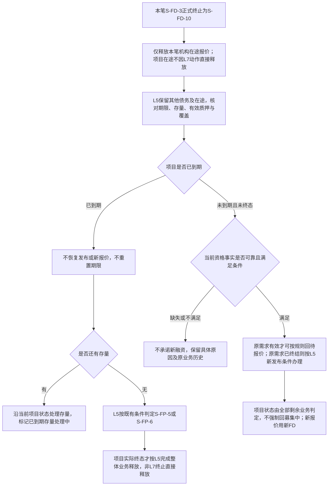

# 借贷平台 · L7 放款与放款确认 · 流程图与状态机

2026-09-23｜配套当前 PRD。

与 [PRD 正文](01-放款与放款确认-PRD.md#reading) 同批使用；完整规则、字段、权限及验收以正文为准。图中节点是业务环节与信息域，不表示页面或组件，承载形式由设计决定（见[统一条款](01-放款与放款确认-PRD.md#design-boundary)）。图示只表达已确定业务流程，不表达实现方式。虚线只表示范围提示，不是已生效业务转换。P04已明确SPV与运营一致，无新增资金动作，不添加角色泳道或占位状态。通知同步读[消息通知](03-放款与放款确认-消息通知.md)。

| 图号 | 业务对象 / 覆盖 | 正文规则入口 |
| --- | --- | --- |
| P-L7-00 | 放款清单、详情、办理与返回 | F-LS-56 |
| P-L7-01 | 资金方核验、处置、提交放款 | F-LS-45/46/48/49/50/51/56 |
| P-L7-02 | 要求重传与资产方重传 | F-LS-47 |
| P-L7-03 | 资产方确认、超期与还款交接 | F-LS-52/53/54/55/57/58 |
| S-L7-01 | 融资业务状态片段 | F-LS-46/47/48/49/52/53 |
| S-L7-02 | 融资项目状态片段与需求展示映射 | F-LS-48/50/52 |

## P-L7-00 · 放款清单、只读详情与办理

规则回链：[F-LS-56](01-放款与放款确认-PRD.md#f-ls-56)。跨模块入口遵循 [项目查看与办理](../v1.0-借贷广场-融资需求与代币质押/01-融资需求与代币质押-PRD.md#interaction)；本图表达查看、办理及结果返回的业务路径，不创造融资业务状态。

清单在接受后已存在，成功登记才产生LN-01；终止历史不冒充成功放款。详情只读，办理与必要确认在本次办理内完成，不再叠加下一层办理。放款清单以资产方确认到账作为“已放款”的展示终点，后续还款事实不反向改变此展示；各业务状态机与放款记录编号不变。

## P-L7-01 · 资金方核验、处置与放款

规则回链：[入口 F-LS-56](01-放款与放款确认-PRD.md#f-ls-56)、[核验 F-LS-45](01-放款与放款确认-PRD.md#f-ls-45)、[暂缓 F-LS-46](01-放款与放款确认-PRD.md#f-ls-46)、[终止 F-LS-48](01-放款与放款确认-PRD.md#f-ls-48)、[放款 F-LS-49](01-放款与放款确认-PRD.md#f-ls-49)、[覆盖 F-LS-50](01-放款与放款确认-PRD.md#f-ls-50)、[哈希 F-LS-51](01-放款与放款确认-PRD.md#f-ls-51)。

核验不是审核状态；资金转账发生在平台外。覆盖校验只挡放款提交，不挡处置；重传等待不额外挡放款。覆盖未知不登记放款；执行异常联系客服，不建设异常处置流程。缺绑定钱包回既有企业账户入口，不手输替代；地区格式、精度及真实供给依赖见正文第7章。付款资料按本笔当事方受控完整读取，个人/企业档案不随之开放；金额复用L6固定1:1:1本笔快照，不重新取价。

## P-L7-02 · 要求重传与重传闭环

规则回链：[F-LS-47](01-放款与放款确认-PRD.md#f-ls-47)。

重传等待期间，资金方可以改为放款或终止；重传先完成不阻止之后终止。再次独立要求可再次触发此图；历史版本始终保留。

## P-L7-03 · 到账确认、超期出口与还款交接

规则回链：[确认 F-LS-52](01-放款与放款确认-PRD.md#f-ls-52)、[实收 F-LS-58](01-放款与放款确认-PRD.md#f-ls-58)、[时限 F-LS-53](01-放款与放款确认-PRD.md#f-ls-53)、[线下出口 F-LS-54](01-放款与放款确认-PRD.md#f-ls-54)、[交接 F-LS-55](01-放款与放款确认-PRD.md#f-ls-55)、[通知 F-LS-57](01-放款与放款确认-PRD.md#f-ls-57)。

覆盖不足、项目到期、确认超期均不阻断资产方确认。实收空值或差额不阻断、不改变本金；填写值仍须符合有限金额类型与已批准精度。时限为连续168小时，业务日期UTC，展示时区不改截止。长期未确认持续等待，不自动流向还款或终止。图中回到等待不表示周期推送；计划就绪不自动打开还款办理，预计计划不能充作定稿计划。

## S-L7-01 · 融资业务状态片段

规则回链：[F-LS-46](01-放款与放款确认-PRD.md#f-ls-46)、[F-LS-47](01-放款与放款确认-PRD.md#f-ls-47)、[F-LS-48](01-放款与放款确认-PRD.md#f-ls-48)、[F-LS-49](01-放款与放款确认-PRD.md#f-ls-49)、[F-LS-52](01-放款与放款确认-PRD.md#f-ls-52)、[F-LS-53](01-放款与放款确认-PRD.md#f-ls-53)。

初始箭头仅表示进入 L7 的边界，不是业务编号在此新建。S-FD-4 没有终止、撤回、驳回出边。S-FD-5 本期不可达，不画成可执行状态；SPV视同运营，本期无资金代理或审批动作。

## S-L7-02 · 融资项目状态片段及融资需求展示映射

规则回链：[终止F-LS-48](01-放款与放款确认-PRD.md#f-ls-48)、[覆盖F-LS-50](01-放款与放款确认-PRD.md#f-ls-50)。项目终态仍由L5判定，本图说明本笔终止后如何消费项目结果，不新增项目状态。

S-FP-2募集中只在L5当前事实满足该状态条件时出现；同项目仍有其他业务时不因本笔终止改掉其状态。原需求失效、项目在途释放或项目终态是各自独立事实，不能借图中终止节点清零整池。S-FD-4以后无终止路径。

| 业务事件 | 融资业务 | 融资需求对外显示 |
| --- | --- | --- |
| 接受报价后/暂缓/要求重传/重传完成 | S-FD-3 | 放款中 |
| 放款提交后/确认超期 | S-FD-4 | 放款中 |
| 资产方确认到账 | S-FD-6 | 已放款 |
| 放款前终止 | 原业务S-FD-10 | 由L5判定原需求是否仍有效；满足可报价条件才回待报价，不无条件重开 |

项目、需求、业务分别表达，不增第六个需求状态。放款清单确认到账后仍显示已放款，后续还款状态只在还款信息承接。项目整体业务释放与链上提取不是同一结果，L7不执行两者。
