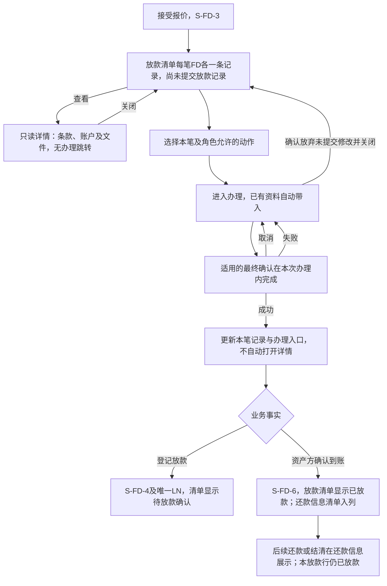
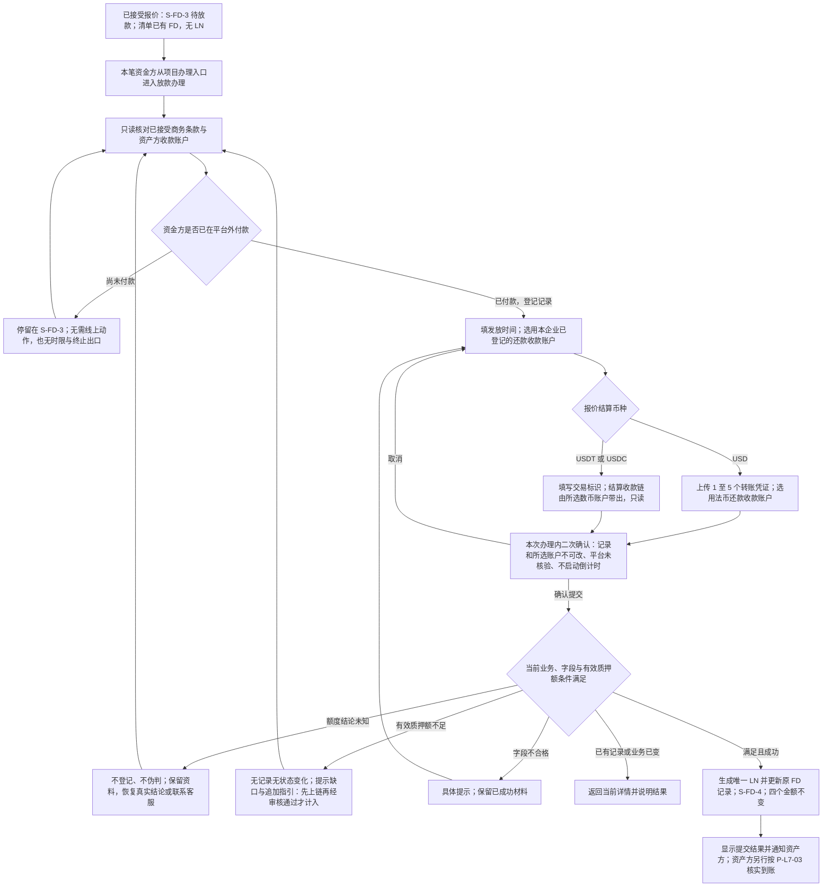
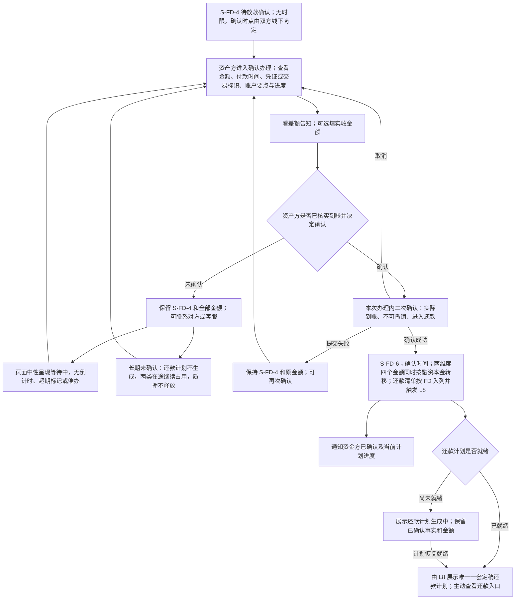
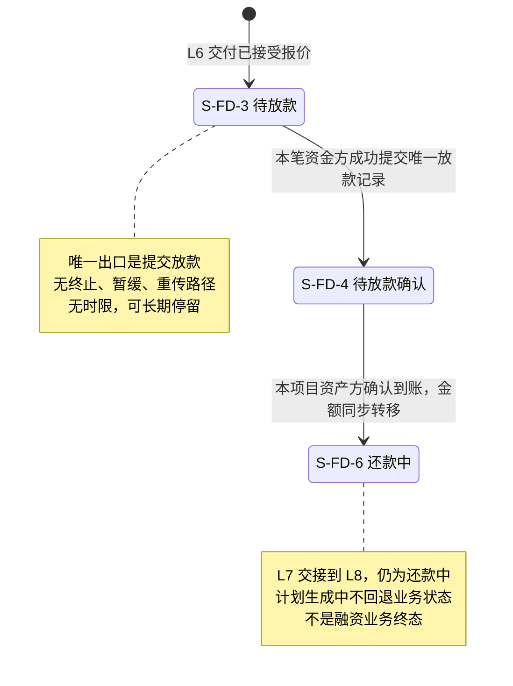

# 借贷平台 · L7 放款与放款确认 · 流程图与状态机

2026-09-24｜配套当前 PRD。

与 [PRD 正文](01-放款与放款确认-PRD.md#reading) 同批使用；完整规则、字段、权限及验收以正文为准。图中节点是业务环节与信息域，不表示页面或组件，承载形式由设计决定（见[统一条款](01-放款与放款确认-PRD.md#design-boundary)）。图示只表达已确定业务流程，不表达实现方式。虚线只表示范围提示，不是已生效业务转换。P04 已明确 SPV 与运营一致，无新增资金动作，不添加角色泳道或占位状态。通知同步读[消息通知](03-放款与放款确认-消息通知.md)。

**本批（2026-09-24）重画说明。** 盖章件核验、要求重传、暂不放款、放款前终止与放款确认时限全部取消：原 `P-L7-02`（重传闭环）与 `S-L7-02`（终止后项目状态片段）整图废止，编号保号不再分配新含义，见[主册第 8 章](01-放款与放款确认-PRD.md#retired)；`P-L7-01` 只剩登记放款一条主路径，`S-L7-01` 去掉 `S-FD-10` 终态与全部标记自环。

| 图号 | 业务对象 / 覆盖 | 正文规则入口 |
| --- | --- | --- |
| P-L7-00 | 放款清单、详情、办理与返回 | F-LS-56 |
| P-L7-01 | 资金方登记放款与闸门校验 | F-LS-49/50/51/56 |
| P-L7-03 | 资产方确认到账与还款交接 | F-LS-52/54/55/57/58 |
| S-L7-01 | 融资业务状态片段 | F-LS-49/52 |

## P-L7-00 · 放款清单、只读详情与办理

规则回链：[F-LS-56](01-放款与放款确认-PRD.md#f-ls-56)。跨模块入口遵循 [项目查看与办理](../v1.0-借贷广场-融资需求与代币质押/01-融资需求与代币质押-PRD.md#interaction)；本图表达查看、办理及结果返回的业务路径，不创造融资业务状态。

清单在接受后已存在，成功登记才产生 `LN-01`。详情只读，办理与必要确认在本次办理内完成，不再叠加下一层办理。放款清单以资产方确认到账作为“已放款”的展示终点，后续还款事实不反向改变此展示。资金方在 `S-FD-3` 只有“提交放款”一个写动作，资产方在 `S-FD-4` 只有“确认到账”一个写动作；本模块没有终止、暂缓或重传路径。

## P-L7-01 · 资金方登记放款

规则回链：[入口 F-LS-56](01-放款与放款确认-PRD.md#f-ls-56)、[放款 F-LS-49](01-放款与放款确认-PRD.md#f-ls-49)、[闸门 F-LS-50](01-放款与放款确认-PRD.md#f-ls-50)、[交易标识 F-LS-51](01-放款与放款确认-PRD.md#f-ls-51)。

资金转账发生在平台外，平台不审核合同真伪与法律效力。闸门只挡放款提交，不影响查看本笔资料；结论未知不登记放款，执行异常联系客服，不建设异常处置流程。还款收款账户只能从企业账户模块已登记的账户中选用，办理内不新增、不手输；缺失时回该模块登记后返回本笔。付款资料按本笔当事方受控完整读取，个人 / 企业档案不随之开放；金额复用 L6 固定 1:1:1 本笔快照，不重新取价。

## P-L7-03 · 到账确认与还款交接

规则回链：[确认 F-LS-52](01-放款与放款确认-PRD.md#f-ls-52)、[实收 F-LS-58](01-放款与放款确认-PRD.md#f-ls-58)、[线下出口 F-LS-54](01-放款与放款确认-PRD.md#f-ls-54)、[交接 F-LS-55](01-放款与放款确认-PRD.md#f-ls-55)、[通知 F-LS-57](01-放款与放款确认-PRD.md#f-ls-57)。

有效质押额不足或项目到期均不阻断资产方确认；本阶段没有任何到期判定。实收空值或差额不阻断、不改变本金；填写值仍须符合有限金额类型与已批准精度。业务日期按 UTC，展示时区只影响显示。长期未确认持续等待，不自动流向还款、不自动确认、不终止；计划就绪不自动打开还款办理，预计计划不能充作定稿计划。

## S-L7-01 · 融资业务状态片段

规则回链：[F-LS-49](01-放款与放款确认-PRD.md#f-ls-49)、[F-LS-52](01-放款与放款确认-PRD.md#f-ls-52)。

初始箭头仅表示进入 L7 的边界，不是业务编号在此新建。`S-FD-3` 与 `S-FD-4` 都没有终止、撤回或驳回出边，也没有到期自环——本模块不再产生任何业务标记。`S-FD-5 放款异议处理中` 本期不可达，不画成可执行状态；`S-FD-10 已终止` 随放款前终止取消而废止，不再出现在本模块状态机。SPV 视同运营，本期无资金代理或审批动作。

| 业务事件 | 融资业务 | 融资需求对外显示 |
| --- | --- | --- |
| 接受报价后、等待资金方付款 | S-FD-3 | 放款中 |
| 放款提交后 | S-FD-4 | 放款中 |
| 资产方确认到账 | S-FD-6 | 已放款 |

项目、需求、业务分别表达，不增第六个需求状态。放款清单确认到账后仍显示已放款，后续还款状态只在还款信息承接。项目整体业务释放与链上提取不是同一结果，L7 不执行两者。
