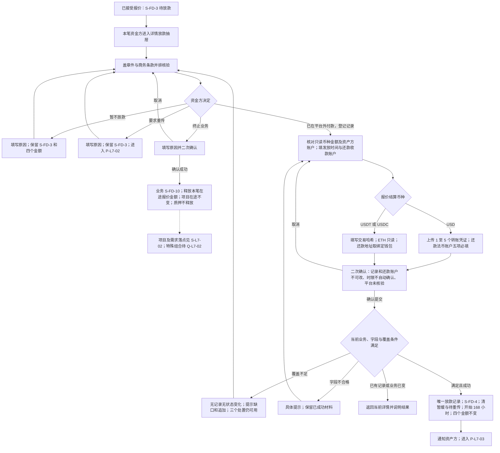
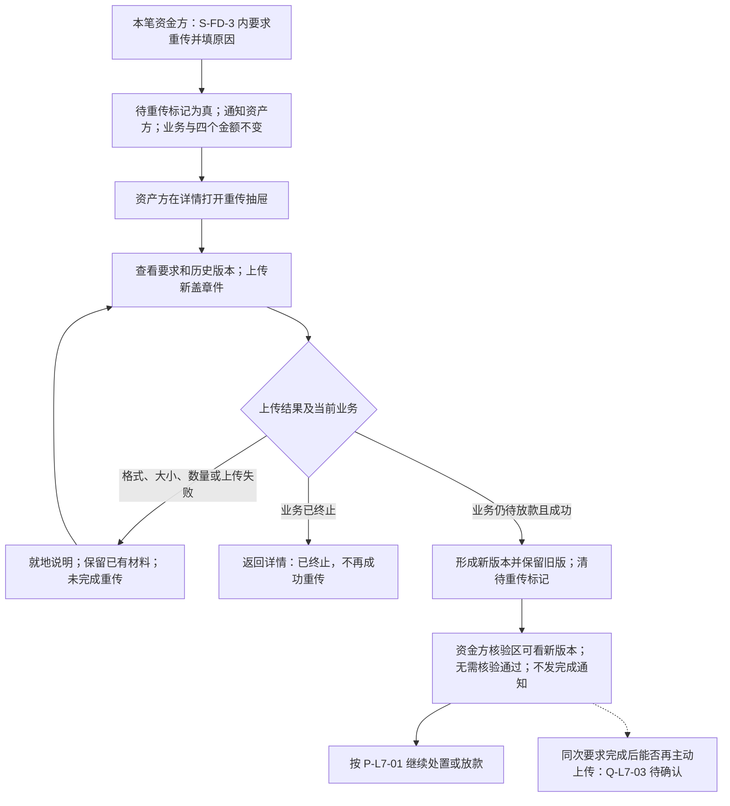
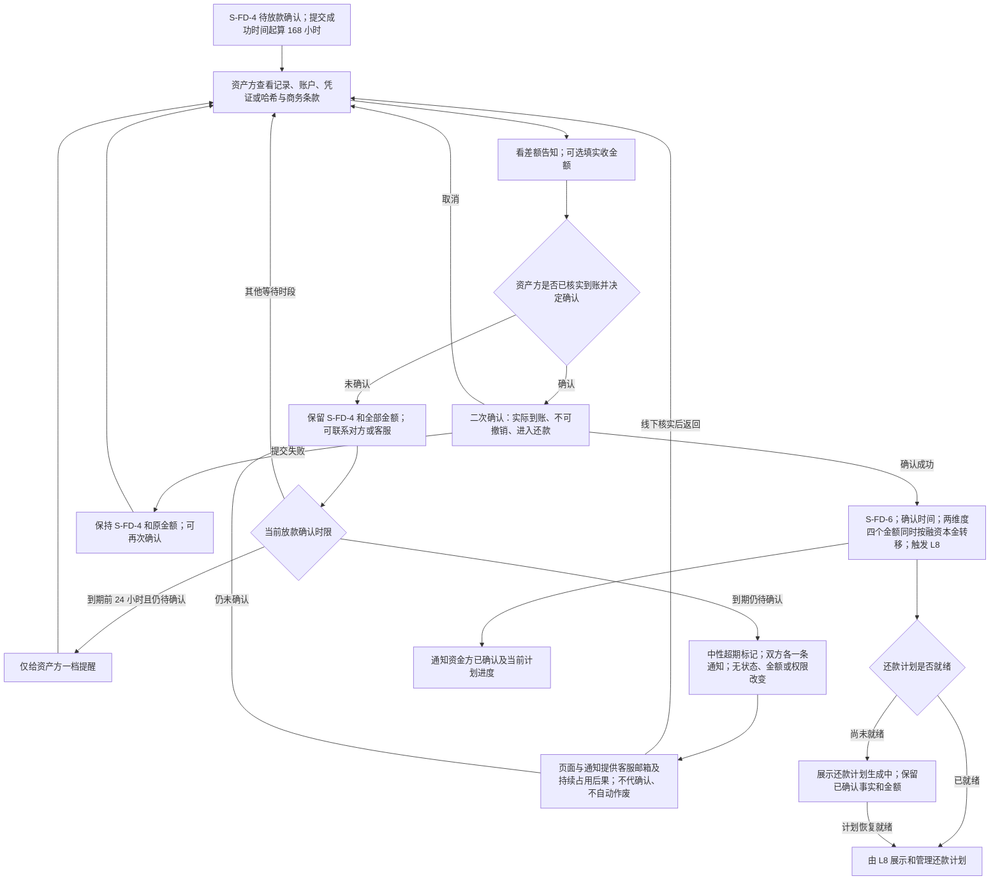
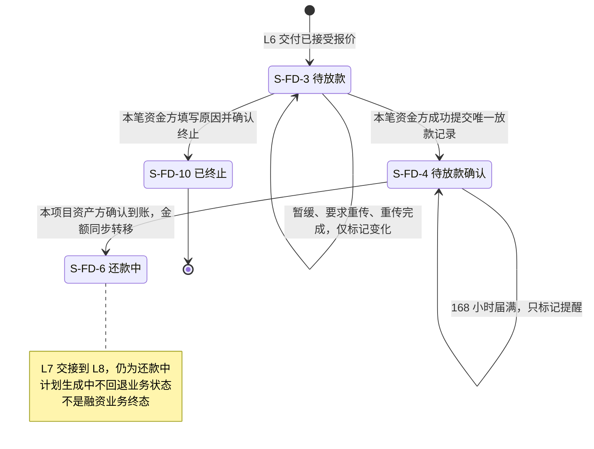
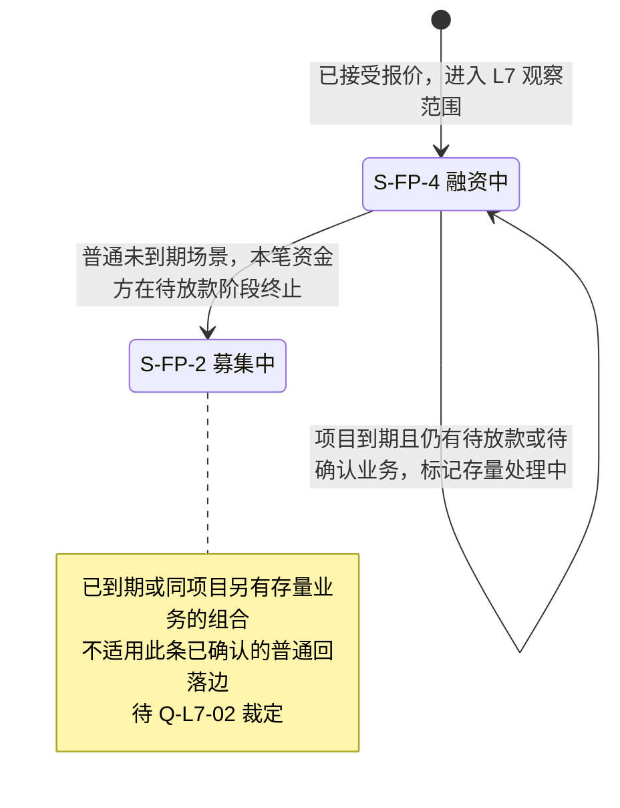

# 借贷平台 · L7 放款与放款确认 · 流程图与状态机

版本：L7 V1.0（入库版）｜业务基线日期：2026-09-18｜入库日期：2026-09-20｜WS-353。

与 [PRD 正文](v1.0-借贷广场-放款与放款确认-PRD.md#reading) 同批使用；完整规则、字段、权限及验收以正文为准。图示只表达已确定业务流程，不表达实现方式。虚线只表示范围提示，不是已生效业务转换。SPV 参与尚未裁定，不添加角色泳道或占位业务状态。

| 图号 | 业务对象 / 覆盖 | 正文规则入口 |
| --- | --- | --- |
| P-L7-01 | 资金方核验、处置、提交放款 | F-LS-45/46/48/49/50/51/56 |
| P-L7-02 | 要求重传与资产方重传 | F-LS-47 |
| P-L7-03 | 资产方确认、超期与还款交接 | F-LS-52/53/54/55/57/58 |
| S-L7-01 | 融资业务状态片段 | F-LS-46/47/48/49/52/53 |
| S-L7-02 | 融资项目状态片段与需求展示映射 | F-LS-48/50/52 |

## P-L7-01 · 资金方核验、处置与放款

规则回链：[入口 F-LS-56](v1.0-借贷广场-放款与放款确认-PRD.md#f-ls-56)、[核验 F-LS-45](v1.0-借贷广场-放款与放款确认-PRD.md#f-ls-45)、[暂缓 F-LS-46](v1.0-借贷广场-放款与放款确认-PRD.md#f-ls-46)、[终止 F-LS-48](v1.0-借贷广场-放款与放款确认-PRD.md#f-ls-48)、[放款 F-LS-49](v1.0-借贷广场-放款与放款确认-PRD.md#f-ls-49)、[覆盖 F-LS-50](v1.0-借贷广场-放款与放款确认-PRD.md#f-ls-50)、[哈希 F-LS-51](v1.0-借贷广场-放款与放款确认-PRD.md#f-ls-51)。

核验不是审核状态；资金转账发生在平台外。覆盖校验只挡放款提交，不挡处置；重传等待不额外挡放款。依赖未知与账户缺失等未定恢复路径见正文第 7 章，图中不假定其能成功。

## P-L7-02 · 要求重传与重传闭环

规则回链：[F-LS-47](v1.0-借贷广场-放款与放款确认-PRD.md#f-ls-47)。

重传等待期间，资金方可以改为放款或终止；重传先完成不阻止之后终止。再次独立要求可再次触发此图；历史版本始终保留。

## P-L7-03 · 到账确认、超期出口与还款交接

规则回链：[确认 F-LS-52](v1.0-借贷广场-放款与放款确认-PRD.md#f-ls-52)、[实收 F-LS-58](v1.0-借贷广场-放款与放款确认-PRD.md#f-ls-58)、[时限 F-LS-53](v1.0-借贷广场-放款与放款确认-PRD.md#f-ls-53)、[线下出口 F-LS-54](v1.0-借贷广场-放款与放款确认-PRD.md#f-ls-54)、[交接 F-LS-55](v1.0-借贷广场-放款与放款确认-PRD.md#f-ls-55)、[通知 F-LS-57](v1.0-借贷广场-放款与放款确认-PRD.md#f-ls-57)。

覆盖不足、项目到期、确认超期均不阻断资产方确认。实收差额不阻断、不改变本金。长期未确认持续等待，不自动流向还款或终止。图中回到等待不表示周期推送。

## S-L7-01 · 融资业务状态片段

规则回链：[F-LS-46](v1.0-借贷广场-放款与放款确认-PRD.md#f-ls-46)、[F-LS-47](v1.0-借贷广场-放款与放款确认-PRD.md#f-ls-47)、[F-LS-48](v1.0-借贷广场-放款与放款确认-PRD.md#f-ls-48)、[F-LS-49](v1.0-借贷广场-放款与放款确认-PRD.md#f-ls-49)、[F-LS-52](v1.0-借贷广场-放款与放款确认-PRD.md#f-ls-52)、[F-LS-53](v1.0-借贷广场-放款与放款确认-PRD.md#f-ls-53)。

初始箭头仅表示进入 L7 的边界，不是业务编号在此新建。S-FD-4 没有终止、撤回、驳回出边。S-FD-5 本期不可达，不画成可执行状态；SPV 新动作须裁定后再扩图。

## S-L7-02 · 融资项目状态片段及融资需求展示映射

规则回链：[终止 F-LS-48](v1.0-借贷广场-放款与放款确认-PRD.md#f-ls-48)、[覆盖与到期 F-LS-50](v1.0-借贷广场-放款与放款确认-PRD.md#f-ls-50)、[确认 F-LS-52](v1.0-借贷广场-放款与放款确认-PRD.md#f-ls-52)、[Q-L7-02](v1.0-借贷广场-放款与放款确认-PRD.md#open)。

这里只画 L7 相关片段，不声明项目如何首次创建或最终关闭；两个项目状态都不是本图所定义的终态。

| 业务事件 | 融资业务 | 融资需求对外显示 |
| --- | --- | --- |
| 接受报价后 / 暂缓 / 要求重传 / 重传完成 | S-FD-3 | 放款中 |
| 放款提交后 / 确认超期 | S-FD-4 | 放款中 |
| 资产方确认到账 | S-FD-6 | 已放款 |
| 普通放款前终止 | 原业务 S-FD-10 | 原需求回待报价，业务终止不等于需求失效 |

项目、需求、业务分别表达；待重传、暂缓、确认超期及项目到期都是各自对象的标记，不生成新的对外状态。L7 全程不释放质押。
