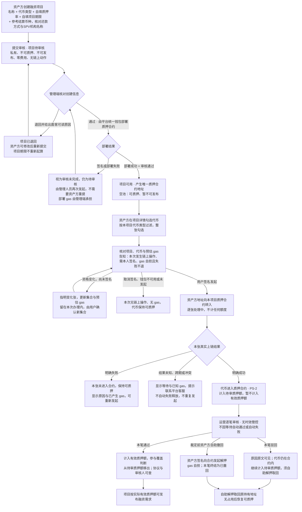
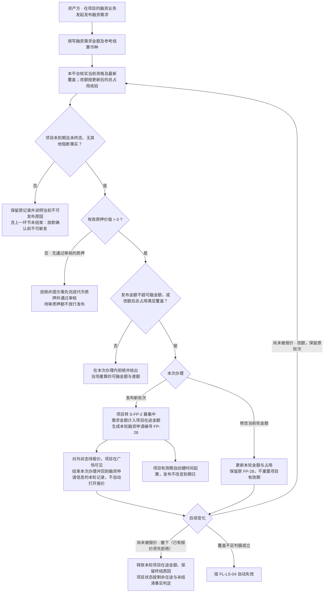
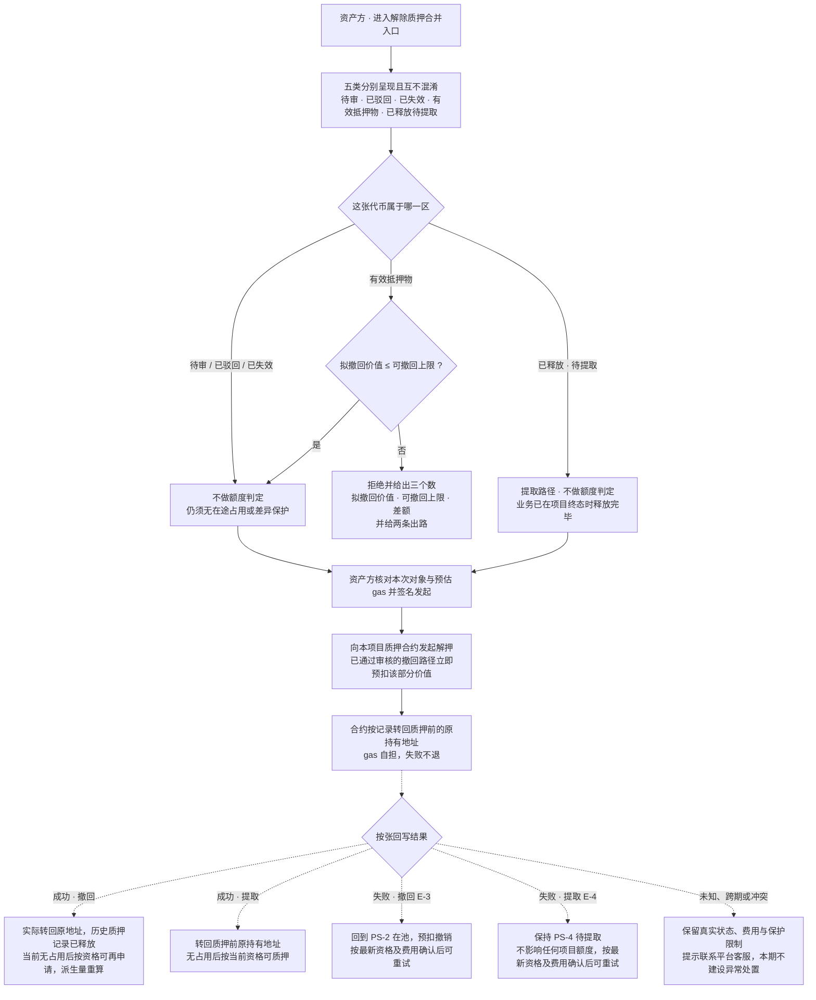
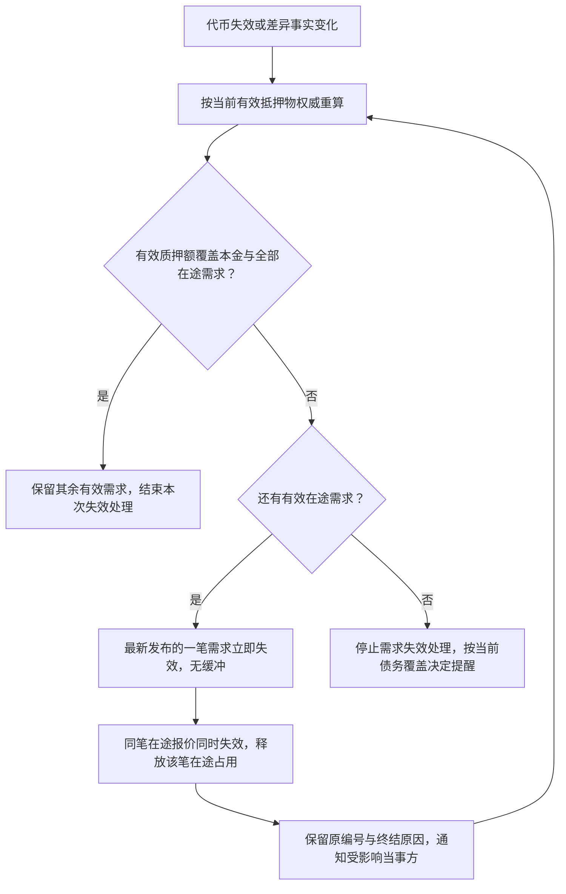
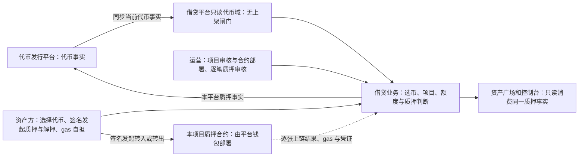
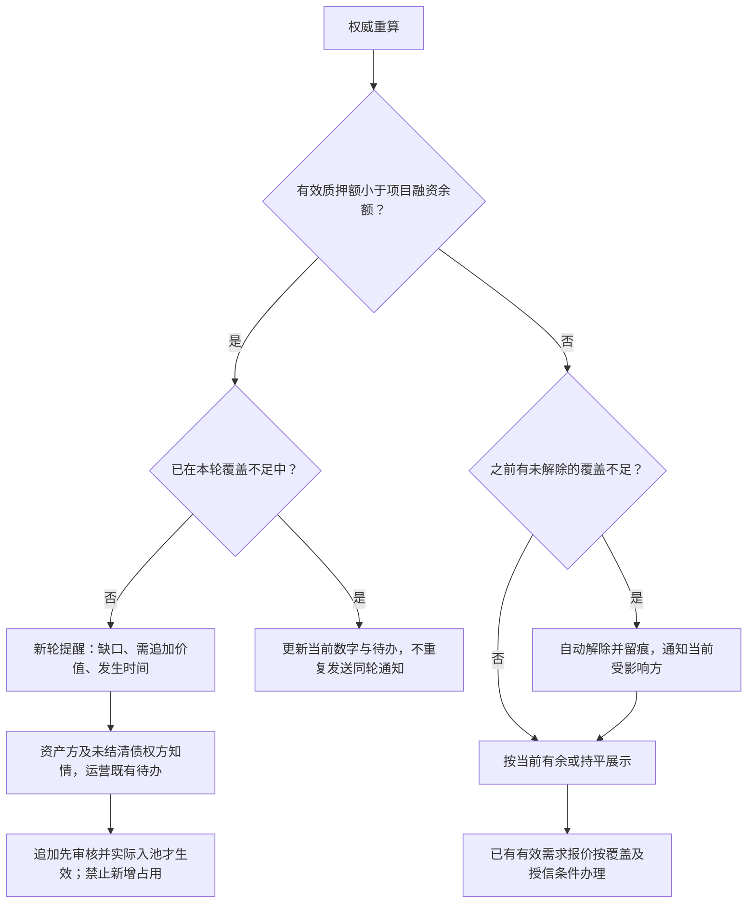
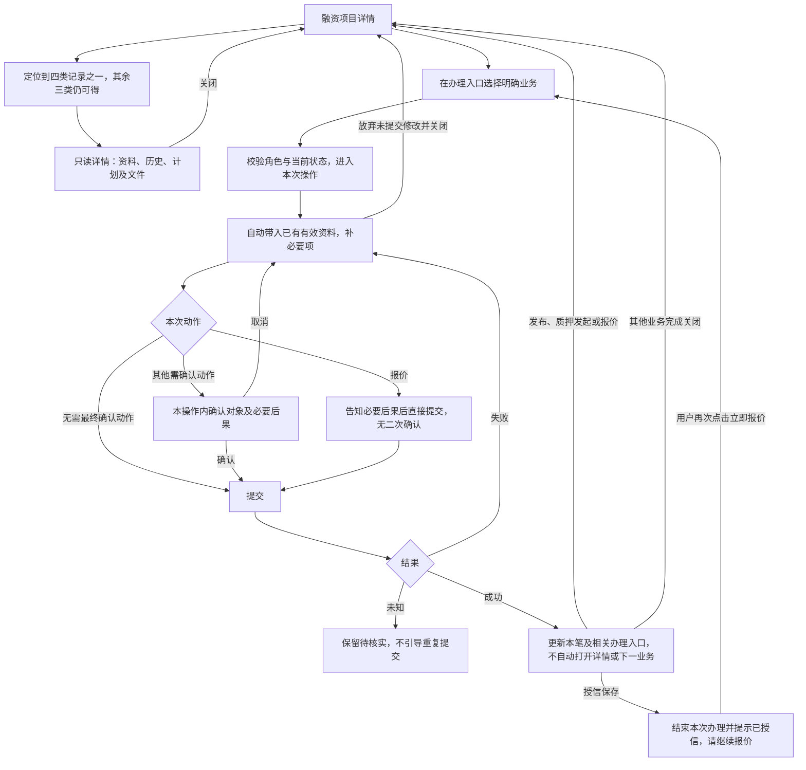
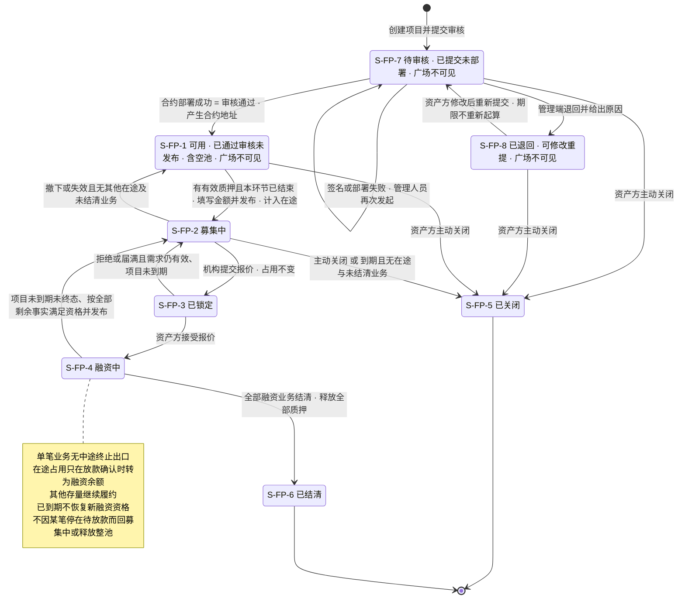
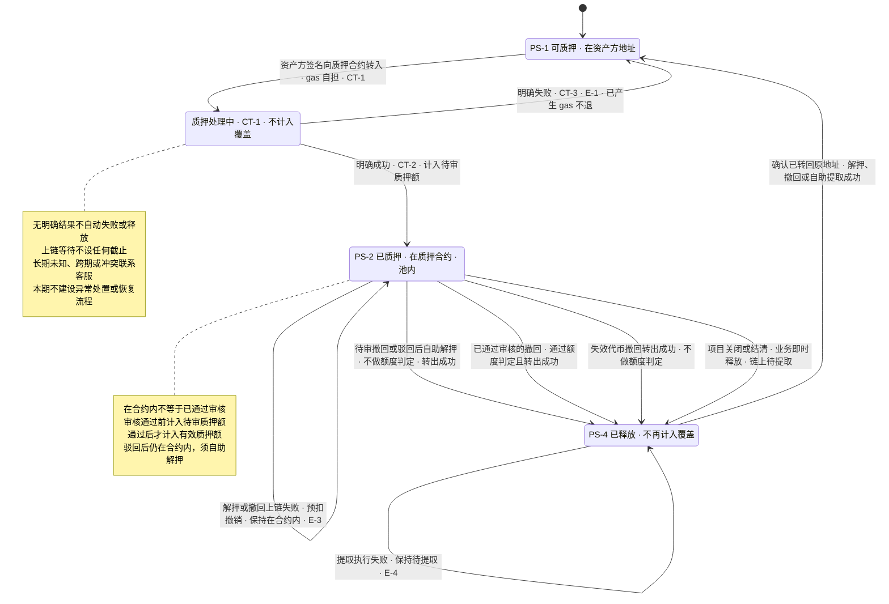
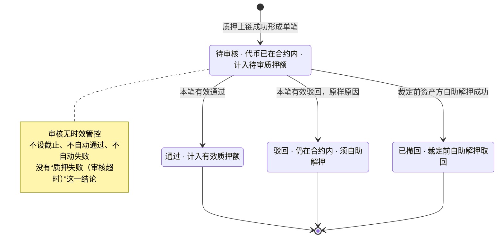

# 融资需求与代币质押 · 流程图与状态机

配套[主 PRD](01-融资需求与代币质押-PRD.md)。每张图只表达业务角色、主流程与状态分支；字段及验收在主PRD，通知细节在[通知册](03-融资需求与代币质押-消息通知.md)。图中节点是业务环节与信息域，不表示页面或组件，承载形式由设计决定。

实线表示办理或状态变化，虚线表示结果/事实传递；处理中和待核实不代表失败。项目审核、质押上链、逐笔质押审核分别判断，不能用一种状态代替另一种；创建项目本身不产生任何链上事实，代币在合约内也不等于已通过审核。图号保留用于定位。

| 图 | 阅读主题 | 规则正文 |
| --- | --- | --- |
| [创建项目、项目审核与逐笔质押](#fl-ls-01) | FL-LS-01 | [对应功能](01-融资需求与代币质押-PRD.md#pledge) |
| [发布、改额与撤下需求](#fl-ls-02) | FL-LS-02 | [对应功能](01-融资需求与代币质押-PRD.md#publish) |
| [撤回与自助提取](#fl-ls-03) | FL-LS-03 | [对应功能](01-融资需求与代币质押-PRD.md#withdraw) |
| [需求因覆盖不足失效](#fl-ls-04) | FL-LS-04 | [对应功能](01-融资需求与代币质押-PRD.md#invalidation) |
| [角色与平台职责](#fl-ls-05) | FL-LS-05 | [对应功能](01-融资需求与代币质押-PRD.md#scope) |
| [覆盖不足触发与解除](#fl-ls-06) | FL-LS-06 | [对应功能](01-融资需求与代币质押-PRD.md#coverage) |
| [查询记录与独立办理](#fl-ls-07) | FL-LS-07 | [对应功能](01-融资需求与代币质押-PRD.md#interaction) |
| [融资项目状态](#st-ls-01) | ST-LS-01 | [对应功能](01-融资需求与代币质押-PRD.md#project-state) |
| [质押与执行状态](#st-ls-02) | ST-LS-02 | [对应功能](01-融资需求与代币质押-PRD.md#execution) |
| [单笔审核状态](#st-ls-03) | ST-LS-03 | [对应功能](01-融资需求与代币质押-PRD.md#review) |

## 创建项目、项目审核与逐笔质押 · FL-LS-01

关联功能：[F-LS-01](01-融资需求与代币质押-PRD.md#f-ls-01)、[F-LS-12](01-融资需求与代币质押-PRD.md#f-ls-12)、[F-LS-22](01-融资需求与代币质押-PRD.md#f-ls-22)、[F-LS-05](01-融资需求与代币质押-PRD.md#f-ls-05)、[F-LS-08](01-融资需求与代币质押-PRD.md#f-ls-08)、[F-LS-21](01-融资需求与代币质押-PRD.md#f-ls-21)。

规则见[主PRD对应功能](01-融资需求与代币质押-PRD.md#pledge)。

三条判断相互独立：项目审核决定项目能不能用，上链结果决定代币在不在合约里，逐笔审核决定这张算不算有效质押额。全链路没有任何时限——项目审核与逐笔质押审核都不因等待自动改变结论，上链等待也不设截止。空池项目数量本期不设上限，不做创建拦截。未知或冲突保留事实与保护并联系客服；不据晚到转入恢复终态项目或有效覆盖。

## 发布、改额与撤下需求 · FL-LS-02

关联功能：[F-LS-02](01-融资需求与代币质押-PRD.md#f-ls-02)、[F-LS-03](01-融资需求与代币质押-PRD.md#f-ls-03)、[F-LS-09](01-融资需求与代币质押-PRD.md#f-ls-09)。

规则见[主PRD对应功能](01-融资需求与代币质押-PRD.md#publish)。

## 撤回与自助提取 · FL-LS-03

关联功能：[F-LS-06](01-融资需求与代币质押-PRD.md#f-ls-06)、[F-LS-17](01-融资需求与代币质押-PRD.md#f-ls-17)。

规则见[主PRD对应功能](01-融资需求与代币质押-PRD.md#withdraw)。

## 需求因覆盖不足失效 · FL-LS-04

关联功能：[F-LS-19](01-融资需求与代币质押-PRD.md#f-ls-19)。

规则见[主PRD对应功能](01-融资需求与代币质押-PRD.md#invalidation)。

## 角色与平台职责 · FL-LS-05

关联功能：[F-LS-04](01-融资需求与代币质押-PRD.md#f-ls-04)、[F-LS-08](01-融资需求与代币质押-PRD.md#f-ls-08)。

规则见[主PRD对应功能](01-融资需求与代币质押-PRD.md#scope)。

## 覆盖不足触发与解除 · FL-LS-06

关联功能：[F-LS-16](01-融资需求与代币质押-PRD.md#f-ls-16)。

规则见[主PRD对应功能](01-融资需求与代币质押-PRD.md#coverage)。

## 查询记录与独立办理 · FL-LS-07

关联功能：[F-LS-11](01-融资需求与代币质押-PRD.md#f-ls-11)、[F-LS-20](01-融资需求与代币质押-PRD.md#f-ls-20)。

规则见[主PRD对应功能](01-融资需求与代币质押-PRD.md#interaction)。

## 融资项目状态 · ST-LS-01

关联功能：[F-LS-03](01-融资需求与代币质押-PRD.md#f-ls-03)。

规则见[主PRD对应功能](01-融资需求与代币质押-PRD.md#project-state)。

可用状态包含尚未质押的空池项目；空池不自动转移状态，也不自动关闭。待审核与已退回都不出现在广场、不可质押、不可发布，且都可由资产方主动关闭。项目有效期自创建时间起算，退回重提不重新起算。到期是并行标记，存量继续履约。单笔业务没有中途终止出口，其在途占用只在放款确认时转为项目融资余额；全部剩余事实满足资格才可再发布，终态不恢复。

## 质押与执行状态 · ST-LS-02

关联功能：[F-LS-08](01-融资需求与代币质押-PRD.md#f-ls-08)、[F-LS-17](01-融资需求与代币质押-PRD.md#f-ls-17)。

规则见[主PRD对应功能](01-融资需求与代币质押-PRD.md#execution)。

历史质押记录“已释放”与当前可质押资格分别表达；仅真实已转回且无其他占用才可再申请，不要求正常撤回成功后再转一次。项目业务释放但尚未提取，仍保留唯一真实持有地址。质押合法取值为PS-1/PS-2/PS-4，PS-3不复用、PS-0非法；链上执行取值为CT-0未发起、CT-1处理中、CT-2成功、CT-3失败，面客显示业务文案。质押与解押都由资产方签名发起、gas 自担且失败不退；项目合约部署由管理端承担。

## 单笔审核状态 · ST-LS-03

关联功能：[F-LS-21](01-融资需求与代币质押-PRD.md#f-ls-21)。

规则见[主PRD对应功能](01-融资需求与代币质押-PRD.md#review)。

本状态机只表达审核结论：通过即计入有效质押额并持续有效，不再有审后许可或二次确认。驳回与撤回都要由资产方自助解押才真正取回代币，链上结果另见质押与执行状态。重新发起生成新笔，旧笔保留。
