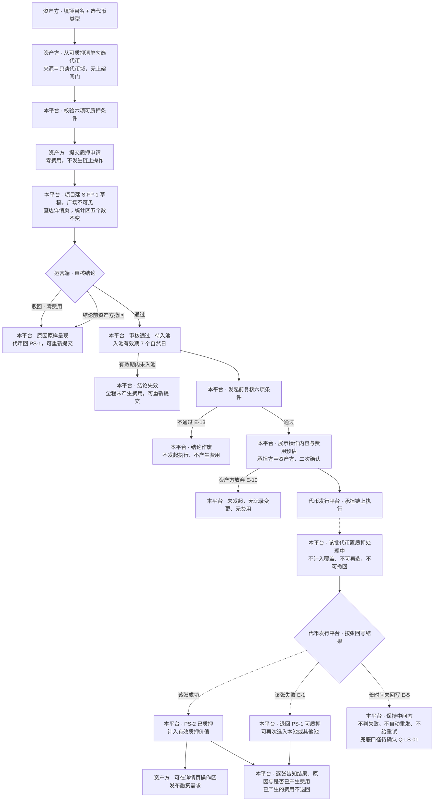
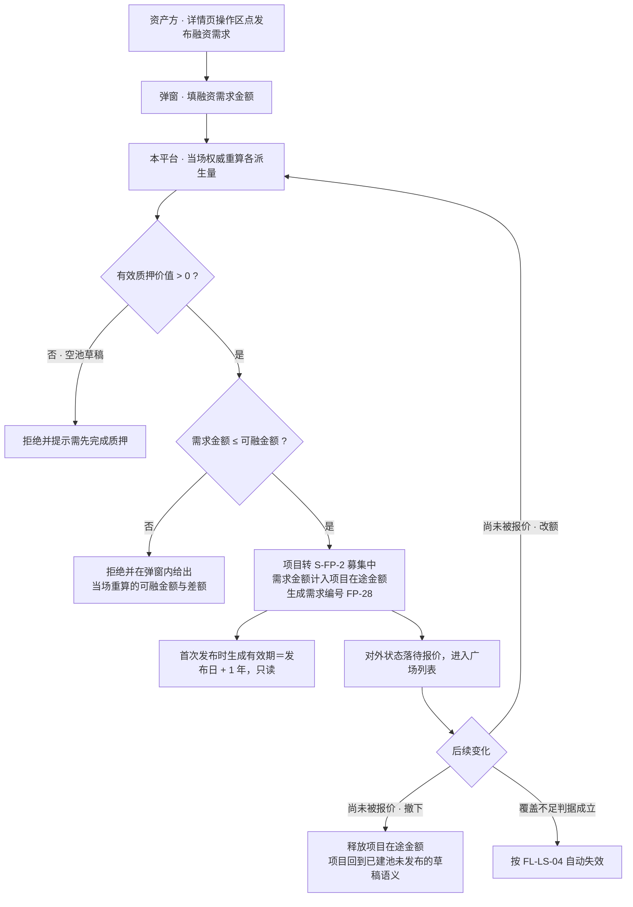
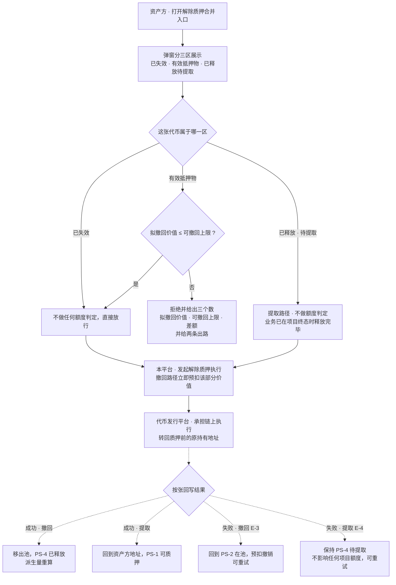
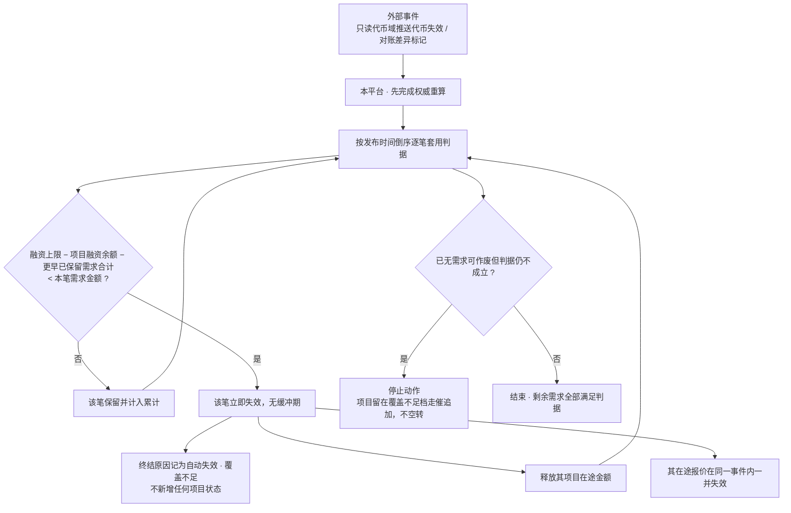
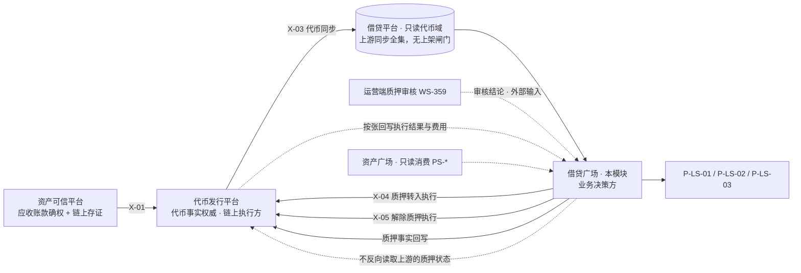
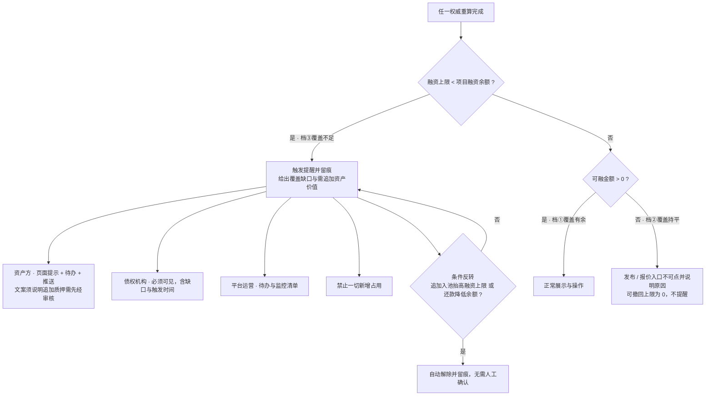
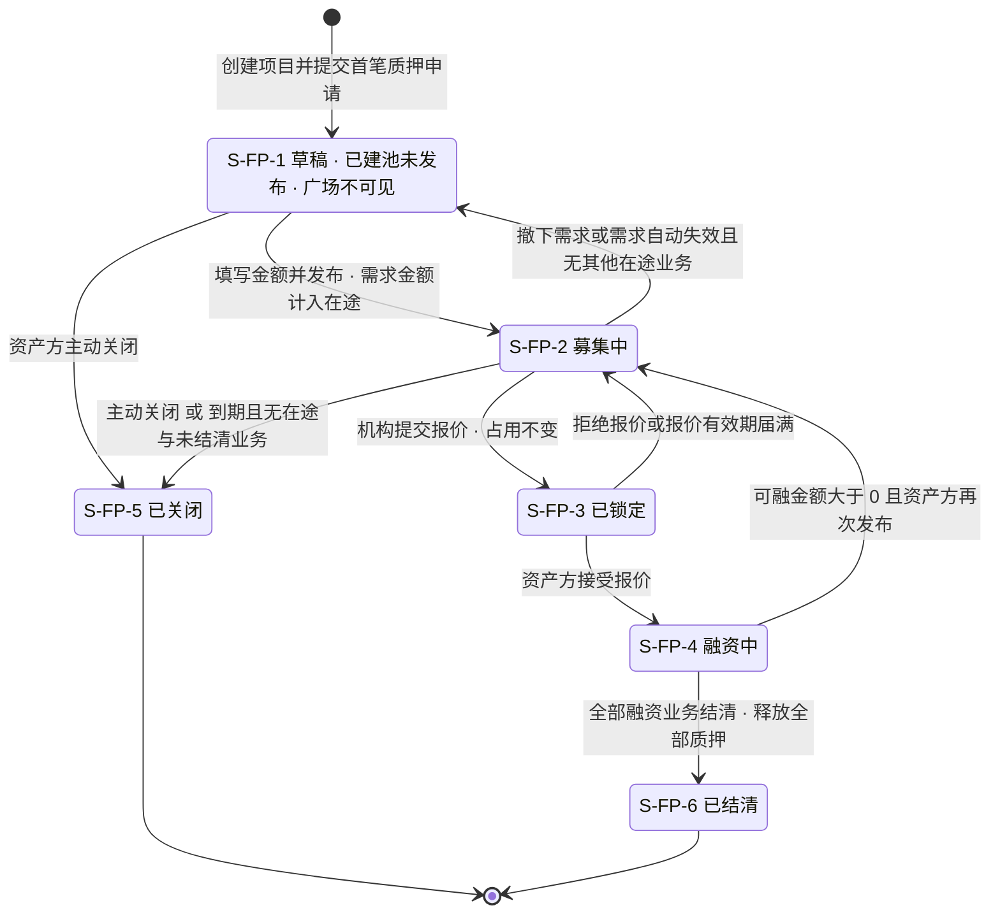
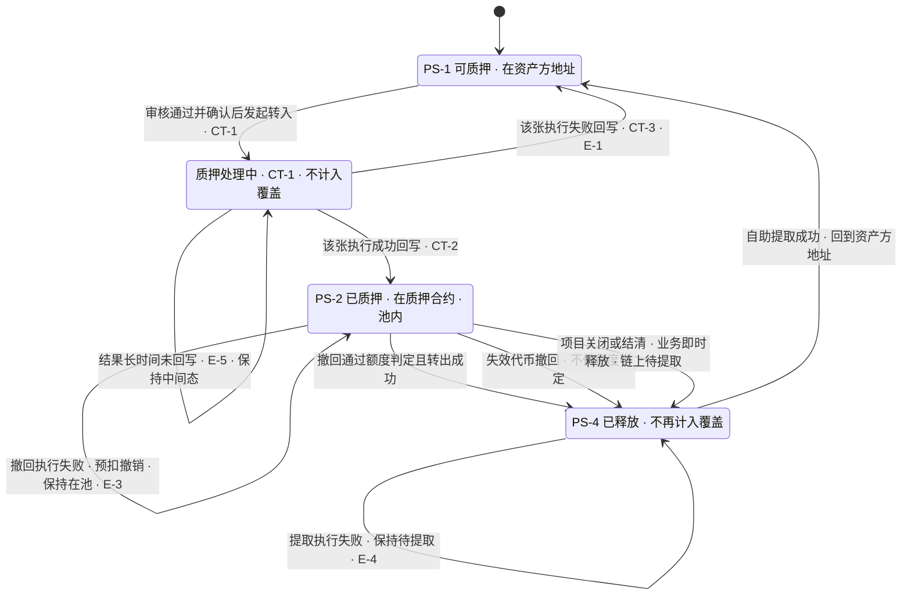
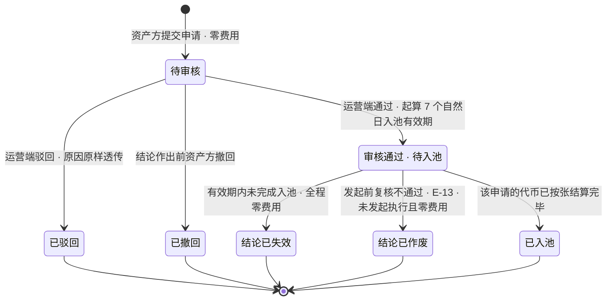

# 借贷广场 · 融资需求与代币质押 — 流程图与状态机 **V1.0**

> 本册是 [`v1.0-借贷广场-融资需求与代币质押-PRD.md`](v1.0-借贷广场-融资需求与代币质押-PRD.md) 的图册，**开发与测试共同参考**，设计师同批取用。
>
> **本册不另造业务口径**：每张图只表达已在主册第 5～7 章与分册 01 第 9 章定义的流程、角色与状态；规则原文、字段口径与验收条款不在本册重复。图与正文不一致时**以正文为准**，并按变更同步修订本册。
>
> | 图号 | 图名 | 关联需求编号 | 正文出处 |
> | --- | --- | --- | --- |
> | `FL-LS-01` | 建池与首笔质押（跨平台） | `F-LS-01`、`F-LS-21`、`D-FIN-80`～`D-FIN-84`、`D-LS-29`～`D-LS-33` | 主册 7 章；分册 01 9.1、9.4 |
> | `FL-LS-02` | 发布融资需求 | `F-LS-02`、`D-FIN-61`、`AC-FIN-12` | 主册 5.5；分册 01 9.2.2 |
> | `FL-LS-03` | 解除质押（撤回 / 提取） | `F-LS-06`、`F-LS-17`、`AC-FIN-13`、`D-FIN-57` | 分册 01 9.5 |
> | `FL-LS-04` | 融资需求因覆盖不足自动失效 | `F-LS-19`、`AC-FIN-26`、`D-FIN-72`～`D-FIN-76` | 分册 01 9.6 |
> | `FL-LS-05` | 跨平台职责边界 | `D-LS-26`、`D-LS-29`、`IF-LS-01`～`IF-LS-10` | 主册 5.2、5.3；分册 01 第 10 章 |
> | `FL-LS-06` | 覆盖不足提醒的触发与解除 | `F-LS-16`、`D-FIN-55`、`D-FIN-56`、`D-LS-39` | 分册 01 9.6 |
> | `ST-LS-01` | 融资项目状态机 `S-FP-*` | `S-FP-1`～`S-FP-6`、`D-FIN-43`、`D-FIN-47` | 主册 6.3；分册 01 11.2 |
> | `ST-LS-02` | 质押状态机 `PS-*` 与链上执行轴 `CT-*` | `PS-1`/`PS-2`/`PS-4`、`CT-0`～`CT-3`、`D-LS-30` | 主册 5.1、5.3；分册 01 9.4.5 |
> | `ST-LS-03` | 质押申请状态机 `PA-05` | `PA-*`、`D-FIN-81`、`D-FIN-84`、`E-13` | 分册 01 9.4.3、11.3 |
>
> **通用图例**：实线箭头＝状态流转或主流程；虚线箭头＝跨平台的结果回写或提示性关系；菱形＝判定；标注 `本平台` 的节点由借贷平台执行，标注 `代币发行平台` 的节点由对方执行，标注 `运营端` 的节点属 WS-359。**图中不画协议交互、报文、重试与去重机制**——那些不属产品需求范围。

---

## 1. 流程图

### `FL-LS-01` 建池与首笔质押（跨平台）

> 关联：`F-LS-01`、`F-LS-12`、`F-LS-21`、`D-FIN-60`、`D-FIN-80`～`D-FIN-82`、`D-LS-29`～`D-LS-33`、`E-1`/`E-2`/`E-5`/`E-13`。正文见分册 01 [9.1](01-功能需求说明.md#91-p-ls-03-创建融资项目建池) 与 [9.4](01-功能需求说明.md#94-代币质押面客端全链路)。追加质押走同一条链路，区别只在入口与 `PA-04` 申请类型。

**这张图要读出来的三件事**：① **审核在前、链上执行在后**，驳回与撤回都是零费用；② **执行结果按张分叉**（`Q` 与 `R` 是同一次申请内可以同时发生的两条出口）；③ **中间态 `O`/`S` 只锁那一张代币，不锁项目**。

### `FL-LS-02` 发布融资需求

> 关联：`F-LS-02`、`F-LS-03`、`D-FIN-61`、`AC-FIN-12`、`AC-FIN-23`、`AC-LS-53`。正文见分册 01 [9.2.2](01-功能需求说明.md#922-操作区三段自上而下)。

### `FL-LS-03` 解除质押（撤回 / 提取）

> 关联：`F-LS-06`、`F-LS-17`、`AC-FIN-13`、`AC-FIN-22`、`D-FIN-57`、`D-FIN-59`、`E-3`/`E-4`。正文见分册 01 [9.5](01-功能需求说明.md#95-解除质押撤回--失效清出--释放与自助提取)。**三步顺序不可换。**

### `FL-LS-04` 融资需求因覆盖不足自动失效

> 关联：`F-LS-19`、`AC-FIN-26`、`D-FIN-72`～`D-FIN-76`、`AC-LS-76`～`AC-LS-81`。正文见分册 01 [9.6](01-功能需求说明.md#96-派生量覆盖监测与需求自动失效)。**判定即失效，无缓冲期。**

### `FL-LS-05` 跨平台职责边界

> 关联：`D-LS-26`～`D-LS-33`、`IF-LS-01`～`IF-LS-10`、`X-LS-13`～`X-LS-16`。正文见主册 5.2、5.3 与分册 01 第 10 章。

| 谁 | 负责什么 | **不负责什么** |
| --- | --- | --- |
| **借贷平台（本模块）** | 业务决策：谁能质押、哪几张、进哪个池、算不算进覆盖、额度够不够、结果怎么呈现；质押事实的权威与回写 | 不执行链上动作、不持有代币事实、不托管代币、不自建上架闸门 |
| **代币发行平台** | 代币事实；审核通过后的链上执行与**按张回写** | 不改代币清单、不部分通过、不指定其他目的地址、不代作业务决策 |
| **运营端 WS-359** | 质押申请的审核结论与留痕 | 不代发起链上执行、不改清单、不部分通过 |
| **只读代币域（资产广场）** | 代币候选来源与代币事实展示 | 不判定可质押性、不持有质押状态 |

### `FL-LS-06` 覆盖不足提醒的触发与解除

> 关联：`F-LS-16`、`D-FIN-55`、`D-FIN-56`、`D-LS-39`、`AC-LS-40`。正文见分册 01 [9.6](01-功能需求说明.md#96-派生量覆盖监测与需求自动失效)。**提醒线与准入闸门不是同一条线。**

---

## 2. 状态机

> 三张状态机分属**三个不同的业务对象**，互不覆盖、不合并：项目（`S-FP-*`）、代币在本平台的质押（`PS-*` + `CT-*`）、质押申请（`PA-05`）。

### `ST-LS-01` 融资项目状态机 `S-FP-*`

> 关联：`F-LS-01`～`F-LS-03`、`D-FIN-33`、`D-FIN-43`、`D-FIN-47`、`D-FIN-63`、`FP-04`。正文见主册 6.3 与分册 01 11.2。**一套跨模块共用的项目状态机，本模块是唯一写入方。**

| 说明 | 口径 |
| --- | --- |
| **并行标记不是状态** | 「已到期 · 存量处理中」是 `FP-05` 并行标记，不新增状态；该标记必须**按正常状态呈现**（中性样式），不得做成告警（`D-FIN-47`） |
| **终态仍有动作** | `S-FP-5`/`S-FP-6` 下「追加质押」「关闭项目」不可点，但**「解除质押」仍可用**——未提取的代币还在合约里（`D-FIN-57`） |
| **需求不是独立对象** | 融资需求没有自己的状态机；对外 5 值是同一批事实的展示视角，映射由本平台派生下发（分册 01 11.6） |

### `ST-LS-02` 代币在本平台的质押状态机 `PS-*` 与链上执行轴 `CT-*`

> 关联：`PS-1`/`PS-2`/`PS-4`、`CT-0`～`CT-3`、`D-LS-22`～`D-LS-25`、`D-LS-30`～`D-LS-33`、`D-FIN-54`、`E-1`～`E-5`。正文见主册 5.1、5.3 与分册 01 9.4.5。
>
> **两根正交轴**：`PS-*` 回答"这张在不在池里"（权威在本平台）；`CT-*` 回答"链上这一步走到哪"（由代币发行平台按张回写）。**审核态不在这张图上**——它挂在质押申请上（`ST-LS-03`）。**代币自身是否失效是第三根独立的轴，取只读代币域的代币状态，不在本图。**

| 说明 | 口径 |
| --- | --- |
| **计入覆盖的充要条件** | **审核通过 且 转入执行成功回写**（`D-FIN-82`）。处理中、审核期、失败、对账差异、撤回预扣一律不计入 |
| **按张独立结算** | 同一次申请的多张代币各自沿本图走，**互不牵连**：一张走到 `PS-2`、另一张回到 `PS-1` 是正常结果（`D-LS-30`） |
| **`PS-0` 非法** | 值域只有 `PS-1`/`PS-2`/`PS-4`，`PS-3` 作废占位（`D-LS-23`）；编号不透出对外面（`D-LS-25`） |
| **图中没有"冻结"** | 冻结发生在项目的额度维度，不发生在代币上 |

### `ST-LS-03` 质押申请状态机 `PA-05`

> 关联：`PA-01`～`PA-10`、`D-FIN-80`～`D-FIN-84`、`E-13`、`AC-LS-99`。正文见分册 01 9.4.3 与 11.3。**申请是审核的对象，代币不是。**

| 说明 | 口径 |
| --- | --- |
| **`已入池` 是申请的终结，不是"全部成功"** | 按张独立结算下，一条申请可以"2 张成功、1 张失败"后即告终结；逐张结论记在 `PA-10`，**申请层不设整体成功 / 失败**（`D-LS-30`） |
| **重新提交是新申请** | 驳回、撤回、结论失效、结论作废后重新提交，生成**新的申请编号**，原申请留档可回溯 |
| **与代币两轴互不覆盖** | 申请上的审核态与代币上的 `PS-*`/`CT-*` 分属两个对象，界面上天生分得开（`D-FIN-84`） |

---

> 总览与业务规则：见 [`v1.0-借贷广场-融资需求与代币质押-PRD.md`](v1.0-借贷广场-融资需求与代币质押-PRD.md)。
> 页面与模块详情、跨平台业务要求、数据与字段：见 [`01-功能需求说明.md`](01-功能需求说明.md)。
> 验收标准：见 [`02-验收需求说明.md`](02-验收需求说明.md)。
