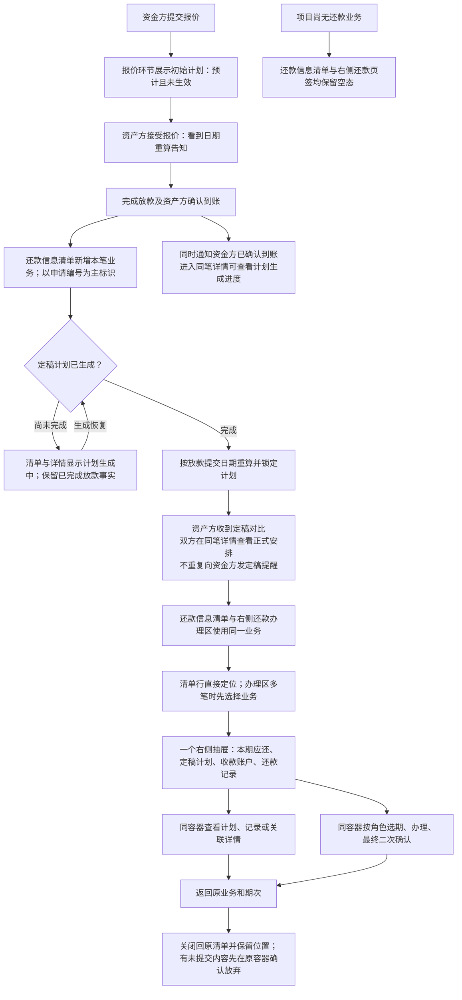
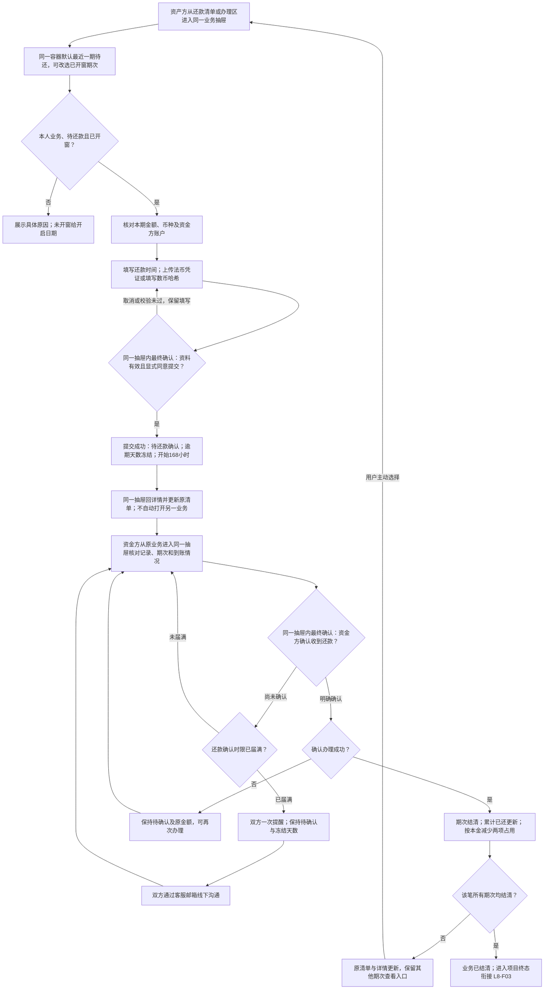
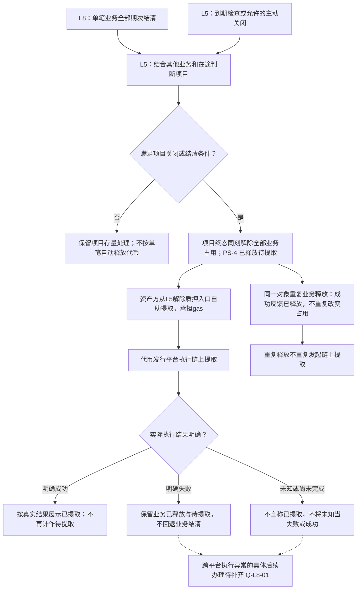
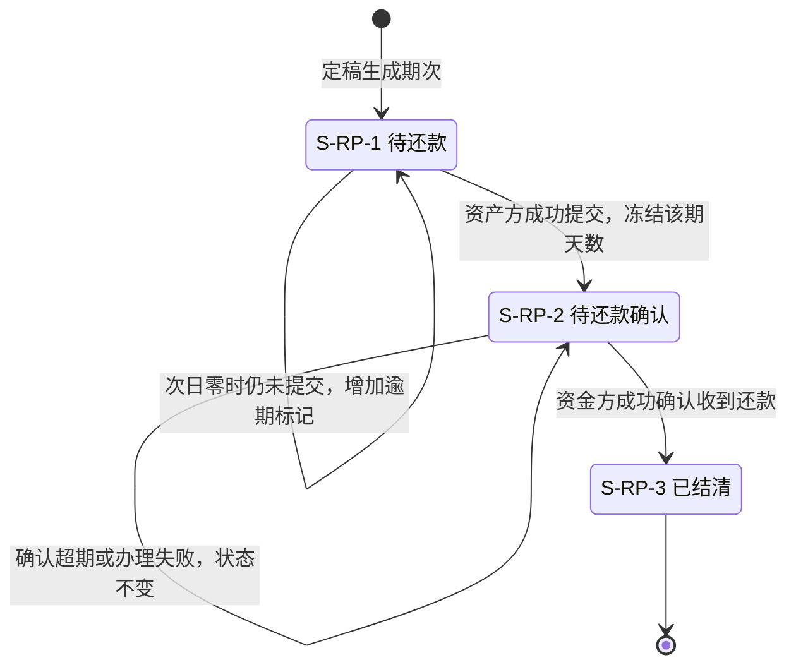
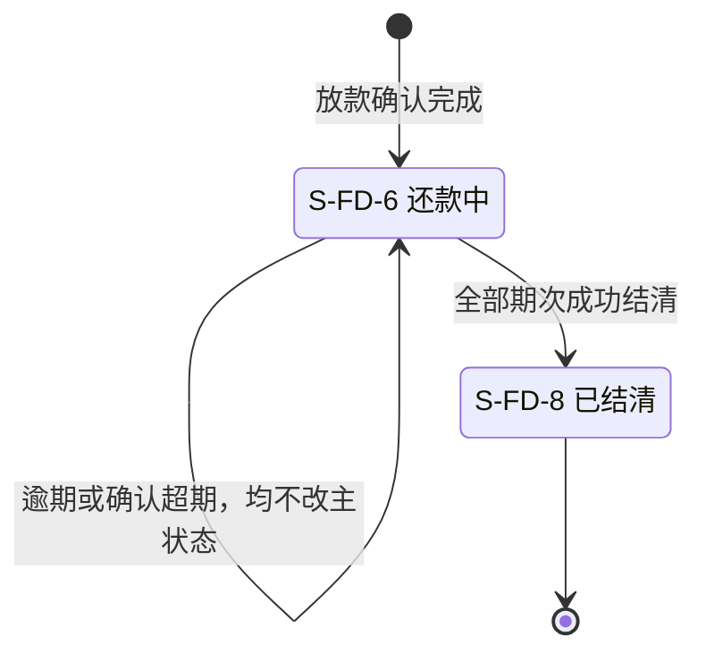
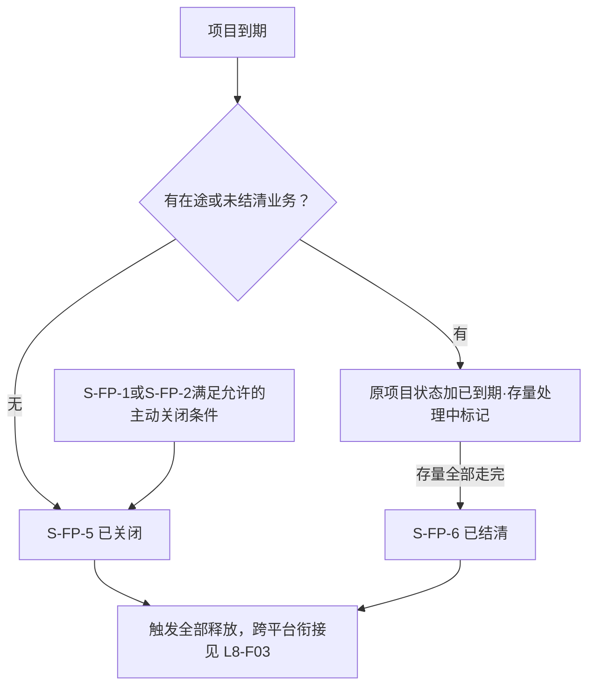
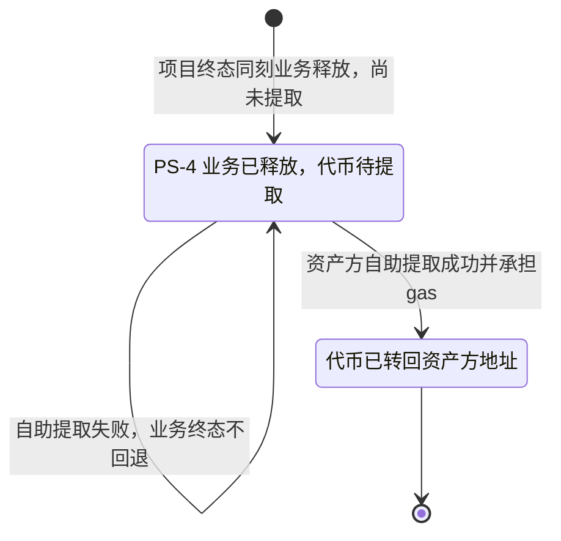

# 借贷平台 · L8 还款计划与还款确认 — 流程图与状态机

版本：V2.1 · 全流程调整稿｜统筹任务：WS-351；模块任务：WS-354｜日期：2026-09-21

## 阅读入口

配套主文件：[L8 还款计划与还款确认 PRD](l8-repayment-prd.md#entry)。完整规则、字段和验收以主文件为准；本册只表达业务流程和对象状态。节点中的“生成中”“逾期”“确认超期”是展示标记，不新增业务状态。虚线只表示待确认的跨平台衔接，不表示已定状态转换。

| 图号 | 内容 | 对应需求/正文 |
| --- | --- | --- |
| L8-F01 | 从初始计划到选定业务查看 | F-LS-60～64/75/77/79；[§3.1](l8-repayment-prd.md#f-entry)、[§3.2](l8-repayment-prd.md#f-plan) |
| L8-F02 | 资产方还款与资金方确认 | F-LS-65～73/78；[§3.3](l8-repayment-prd.md#f-repay)、[§3.4](l8-repayment-prd.md#f-overdue)、[§3.5](l8-repayment-prd.md#f-confirm) |
| L8-F03 | 业务结清、项目终态和跨平台释放 | F-LS-74、L8-REL-01；[§3.6](l8-repayment-prd.md#f-release) |
| L8-S01 | 还款期次三态 | F-LS-67/68/70～72；[§3.3](l8-repayment-prd.md#f-repay)、[§3.5](l8-repayment-prd.md#f-confirm) |
| L8-S02 | 融资业务状态 | F-LS-71/74；[§3.6](l8-repayment-prd.md#f-release) |
| L8-S03 | 项目终态范围与已释放后的提取关系 | L8-REL-01；[§3.6](l8-repayment-prd.md#f-release)、[§5](l8-repayment-prd.md#questions) |

## L8-F01 · 计划形成与阅读入口

返回：[功能 §3.1/§3.2](l8-repayment-prd.md#f-plan)。计划未生成时不回退放款事实；初始计划不进入还款区。

访客只读公开信息，操作区仅“立即登录”；非当事方不能读取双方私有资料。全部已结清的业务保留清单行与只读详情、计划入口。未到期、待确认或计划生成中也可查看对应事实，无待还期次不虚构应还金额；待确认记录可与下一待还期并存。

## L8-F02 · 还款提交、确认及超期出口

返回：[功能 §3.3](l8-repayment-prd.md#f-repay)、[§3.5](l8-repayment-prd.md#f-confirm)。适用资产方与本业务资金方。

资产方提交不减少本金占用；利息期确认也不减少本金占用。确认超期不是还款逾期。失败、取消、重复提交均不能凭空生成第二条有效还款记录。末期窗口的跨条款冲突见 Q-L8-03，本图不裁定例外。

## L8-F03 · 结清、关闭与跨平台质押释放

返回：[功能 §3.6](l8-repayment-prd.md#f-release)。项目终态同刻业务释放采用 L5 D-FIN-49/57；虚线仅表示跨平台执行异常后续办理仍待补齐，不影响已定释放时点。

X-05 受理不代表链上提取成功；项目终态的本平台业务释放已确定，不能混同为跨平台转回成功。未知执行结果不能伪装失败或成功；具体执行异常反馈及后续办理见 Q-L8-01，不重新裁定业务释放时点。

## L8-S01 · 还款期次状态机

返回：[§3.3](l8-repayment-prd.md#f-repay)、[§3.4](l8-repayment-prd.md#f-overdue)、[§3.5](l8-repayment-prd.md#f-confirm)。每一期独立适用。

逾期天数结清后作为历史保留，不归零。无撤回、撤销、自动确认或异议状态迁移；S-RP-4 本期不可达，不绘成可操作分支。

## L8-S02 · 融资业务状态机

返回：[§3.6](l8-repayment-prd.md#f-release)。只覆盖 L8 负责的状态段。

S-FD-9 是业务并行标记，其提交后清除边界待 Q-L8-03；业务终态时清除已确定。需求对外状态“已放款”在整个图中不变。业务结清不直接等于项目结清。

## L8-S03 · 项目终态与释放后的提取

返回：[§3.6](l8-repayment-prd.md#f-release)、[待确认项](l8-repayment-prd.md#questions)。项目状态由 L5 定义，本图只引用会触发释放的局部段，不新增项目状态号。

以下从**项目终态同刻完成业务释放且资产仍在合约**的事实开始，引用 L5 D-FIN-57 两段式约束；业务释放时点不依赖链上提取结果。本平台 PS 值域采用 L5 主册 §5.1：PS-1 可质押、PS-2 已质押、PS-4 已释放，PS-0 非法；采用已定编号不代表跨平台执行已经联验。

未提取代币不计入任何池覆盖且不能再次质押；提取可批量且无时限。未知链上执行结果不改变已定业务释放事实，也不能被标为“已转回资产方地址”。图示用于产品评审，未宣称本轮完成浏览器或 Mermaid 渲染验收。
