# 借贷平台 · 我的控制台 · 流程图与状态机

2026-09-24｜需求评审稿，与[PRD正文](01-我的控制台-PRD.md)同批使用。本批按需求诊断简报 V4 重画：报价有效期、放款确认时限、还款确认时限三处 168 小时取消，待放款的暂缓、重传与终止分支取消，放款段不再有终态。仅表达用户流程和业务结果；业务字段、完整规则及验收均以正文为准。图中节点是业务环节与信息域，不表示页面或组件，承载形式由设计决定（见[统一条款](01-我的控制台-PRD.md#design-boundary)）。图号稳定，图中不定义接口、身份协议、任务调度或内部计算。配套[消息通知](03-我的控制台-消息通知.md#notify-entry)定义零独立发送及三方归属，不新增通知状态机。

| 图号 | 内容 | 关联功能与正文 |
| --- | --- | --- |
| FL-MC-01 | 准入与聚合视图 | [F-MC-01](01-我的控制台-PRD.md#f-mc-01)、[F-MC-10](01-我的控制台-PRD.md#f-mc-10) |
| FL-MC-02 | 从列表经详情到对应广场项目并返回 | [F-MC-03](01-我的控制台-PRD.md#f-mc-03)、[F-MC-09](01-我的控制台-PRD.md#f-mc-09)、[F-MC-11](01-我的控制台-PRD.md#f-mc-11) |
| FL-MC-03 | 行级提醒与消息边界 | [F-MC-08](01-我的控制台-PRD.md#f-mc-08) |
| FL-MC-04 | 六类详情的访问与返回 | [F-MC-13](01-我的控制台-PRD.md#f-mc-13) |
| FL-MC-05 | 申请、放款、还款入列与期次定位 | [F-MC-03](01-我的控制台-PRD.md#f-mc-03)、[F-MC-05](01-我的控制台-PRD.md#f-mc-05)、[F-MC-06](01-我的控制台-PRD.md#f-mc-06) |
| FL-MC-06 | 项目资格与执行结果阅读 | [F-MC-03](01-我的控制台-PRD.md#f-mc-03)、D-MC-200、AC-MC-110 |
| ST-MC-01 | 代币生命周期结果 | [F-MC-02](01-我的控制台-PRD.md#f-mc-02) |
| ST-MC-02 | 质押对外展示状态 | [F-MC-02](01-我的控制台-PRD.md#f-mc-02) |
| ST-MC-03 | 还款期次业务状态 | [F-MC-06](01-我的控制台-PRD.md#f-mc-06) |
| ST-MC-04 | 控制台视图可用状态 | [F-MC-10](01-我的控制台-PRD.md#f-mc-10)、[F-MC-11](01-我的控制台-PRD.md#f-mc-11) |
| ST-MC-05 | 单个详情的可用状态 | [F-MC-13](01-我的控制台-PRD.md#f-mc-13) |

## 准入与聚合视图（FL-MC-01）

关联 `F-MC-01`、`F-MC-10`、`D-MC-11`、`D-MC-179`、`D-MC-180`；验收 `AC-MC-31`、`AC-MC-41`、`AC-MC-42`、`AC-MC-47`、`AC-MC-86`、`AC-MC-87`。规则回查[正文3.10](01-我的控制台-PRD.md#f-mc-10)。

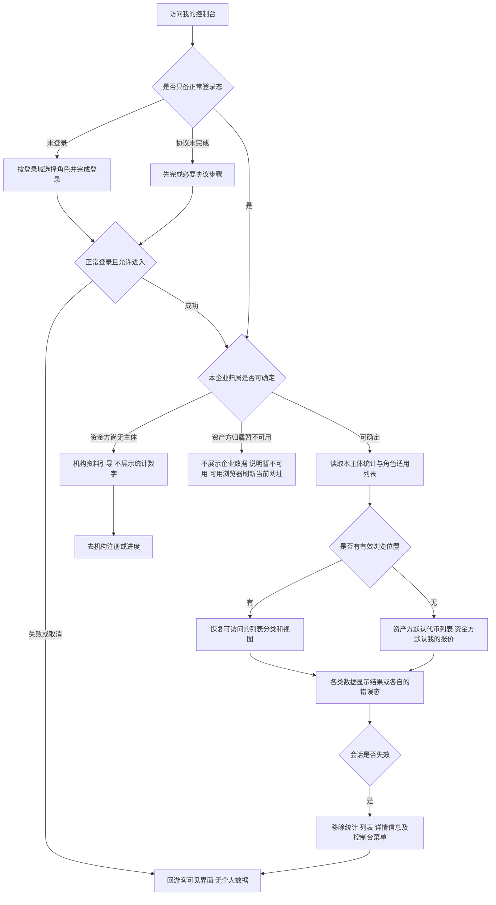

图例：未认证不等于未登录；只读菜单不因此消失。两角色会话规则引用各自登录域，不统一时长。资料被驳回但仍有企业主体时，保留允许查看的业务，用对应引导承接。

## 从列表经详情到对应广场项目并返回（FL-MC-02）

关联 `F-MC-03`、`F-MC-05`、`F-MC-06`、`F-MC-07`、`F-MC-09`、`F-MC-11`、`F-MC-13`；验收 `AC-MC-32`、`AC-MC-34`、`AC-MC-38`、`AC-MC-66`～`AC-MC-68`、`AC-MC-92`、`AC-MC-93`。回查[正文3.9](01-我的控制台-PRD.md#f-mc-09)。

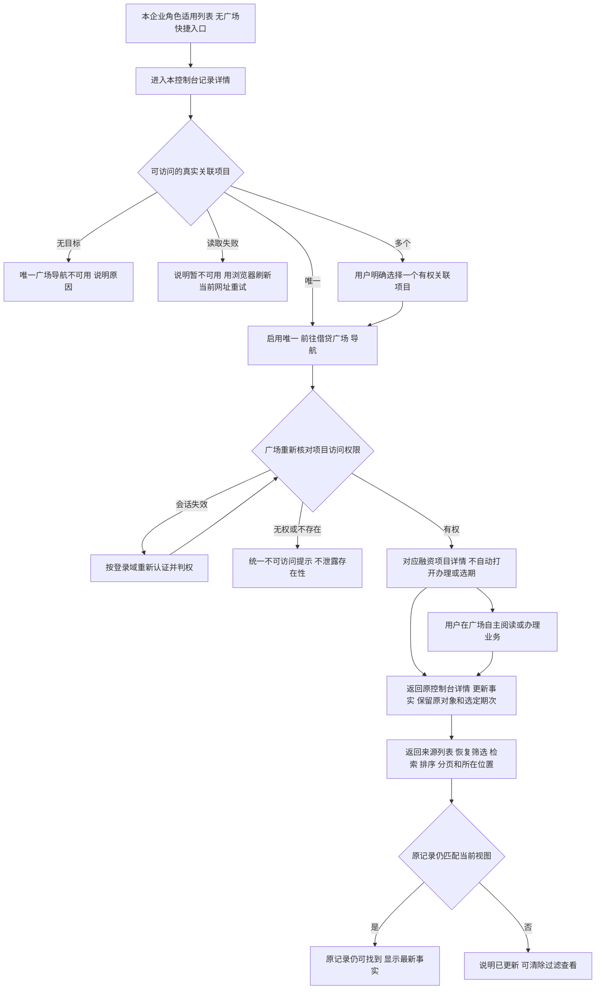

规则 `D-MC-194`、`D-MC-196`、`D-MC-197`；验收 `AC-MC-106/107`。可读项目的导航不受当前是否有可执行业务限制；无关联不能兜底普通广场或创建流程，多关联不得自动选择首项。列表、详情均无业务提交。广场内部查看和办理依其最新已确认方案。完整规则见[正文3.9](01-我的控制台-PRD.md#f-mc-09)及[正文3.13](01-我的控制台-PRD.md#f-mc-13)。

## 行级提醒与消息边界（FL-MC-03）

关联 `F-MC-08`、`T-MC-01`～`T-MC-14`、`D-MC-117`、`D-MC-162`、`D-MC-173`；验收 `AC-MC-28`～`AC-MC-30`、`AC-MC-62`～`AC-MC-65`、`AC-MC-73`～`AC-MC-75`、`AC-MC-82`。回查[正文3.8](01-我的控制台-PRD.md#f-mc-08)。

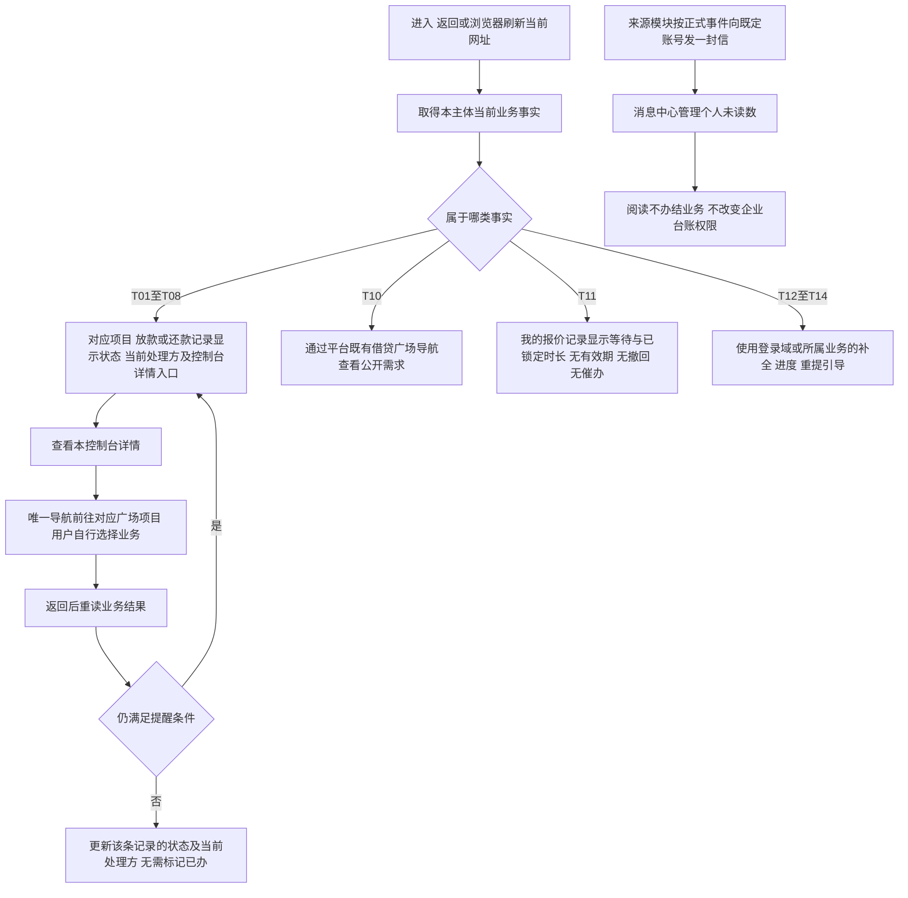

D-MC-205、AC-MC-116及[通知册MC-NR-01～06](03-我的控制台-消息通知.md#notify-entry)：控制台不产生独立通知，行级提醒出现/消失、刷新及读信不触发第二封；来源模块旧称待办不恢复本页已撤除的待办对象。

独立两条事实线不互相加总：业务按企业共享，消息未读按个人；本页不设置待办对象、任务计数或已办归档。列表默认排序按正文3.11；还款主列表按业务归并，待还和待确认提醒可同时存在，控制台详情定位原期次，前往广场只到对应项目，不自动办理，不新增待办对象。

## 代币生命周期结果（ST-MC-01）

关联 `F-MC-02`、`D-MC-175`、`D-MC-178`；验收 `AC-MC-48`、`AC-MC-83`～`AC-MC-85`。回查[正文3.2](01-我的控制台-PRD.md#f-mc-02)。

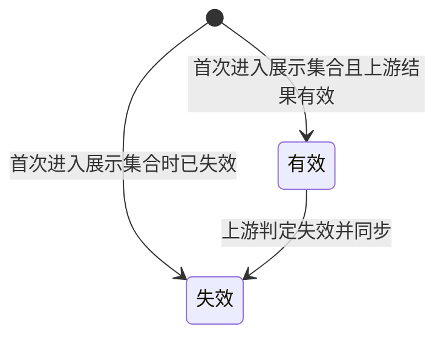

`D-MC-195`、`AC-MC-105`：有效与失效均属于本企业全部可展示代币的覆盖范围；无项目、未质押不能成为隐藏条件，完整性和主体权限仍按正文3.2。

状态权威为代币发行平台；控制台读取本平台快照，不按本机日期迁移。失效后记录仍保留并纳入账面统计，不代表销毁或自动解除质押。本期没有已销毁展示状态，不画无依据的恢复有效边。

## 质押对外展示状态（ST-MC-02）

关联 `F-MC-02`、`D-MC-176`、`D-MC-177`；验收 `AC-MC-48`、`AC-MC-83`。回查[正文3.2](01-我的控制台-PRD.md#f-mc-02)。

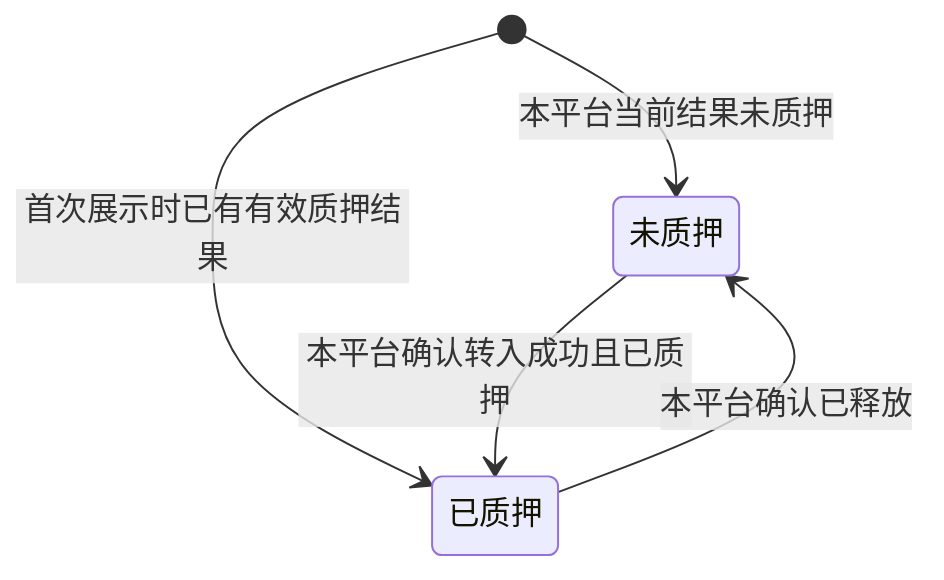

这是对外二元视图，不是内部执行状态机。入池处理中、失败或已释放未提取都不新增可见状态；仍显示未质押。与ST-MC-01正交，一枚代币可为“失效＋已质押”。本页不因状态标签推断是否可再次质押，操作资格由对应业务判定。

## 还款期次业务状态（ST-MC-03）

关联 `F-MC-06`、`F-MC-08`、`T-MC-05`、`T-MC-06`、`T-MC-08`、`T-MC-09`；验收 `AC-MC-55`～`AC-MC-61`、`AC-MC-80`。回查[正文3.6](01-我的控制台-PRD.md#f-mc-06)。

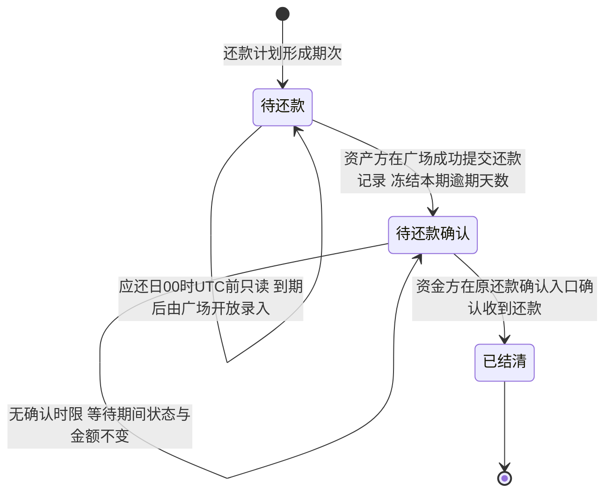

D-MC-203、AC-MC-113/114：普通利息期与末期均到应还日00:00 UTC才开放信息录入；前三日只是来源通知的准备提醒。未到期、已到期、逾期是业务条件或标记，不是额外期次状态。本期利息在定稿时已固定，提交后冻结本期期次逾期天数；**还款确认不设时限**，提交后一直停留在待还款确认直到资金方在原确认入口确认，等待时间不产生超期标记、不自动结清、不恢复逾期累加。提交不清当前业务逾期：未结清的逾期期次含待还与待确认，全部确认后才清当前业务标记；未来正常期可仍未结清，历史天数保留。最早期和最长天数仅取未结清逾期集合，等待确认的时长不增加被冻结天数。此图不定义项目或代币的状态变化。

## 控制台视图可用状态（ST-MC-04）

关联 `F-MC-10`、`F-MC-11`；验收 `AC-MC-31`、`AC-MC-47`、`AC-MC-69`～`AC-MC-72`、`AC-MC-86`、`AC-MC-88`。回查[正文3.10](01-我的控制台-PRD.md#f-mc-10)与[正文3.11](01-我的控制台-PRD.md#f-mc-11)。

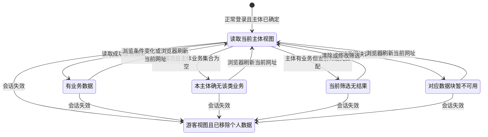

`D-MC-198`、`AC-MC-108`：本图刷新均指浏览器刷新当前网址，不提供页内重新取数动作，按正文3.11恢复浏览视图。

本图按单项统计或单个列表分类表达加载与失败，不能推导为某一项失败就清空全部内容。无主体或主体不可确定先走FL-MC-01，不进入“真空集合”。会话失效清除全部已显示数据，覆盖所有分类；上游同步不可用但本平台快照可读时仍属于有数据状态。

## 六类详情的访问与返回（FL-MC-04）

关联 `F-MC-02`～`F-MC-07`、`F-MC-09`、`F-MC-10`、`F-MC-11`、`F-MC-13`，页面 `P-MC-02`～`P-MC-07`，规则 `D-MC-182`～`D-MC-188`；验收 `AC-MC-89`～`AC-MC-96`。对象、核心信息与单一项目导航回查[正文3.13](01-我的控制台-PRD.md#f-mc-13)，实际业务操作闭环见[FL-MC-02](#fl-mc-02)。

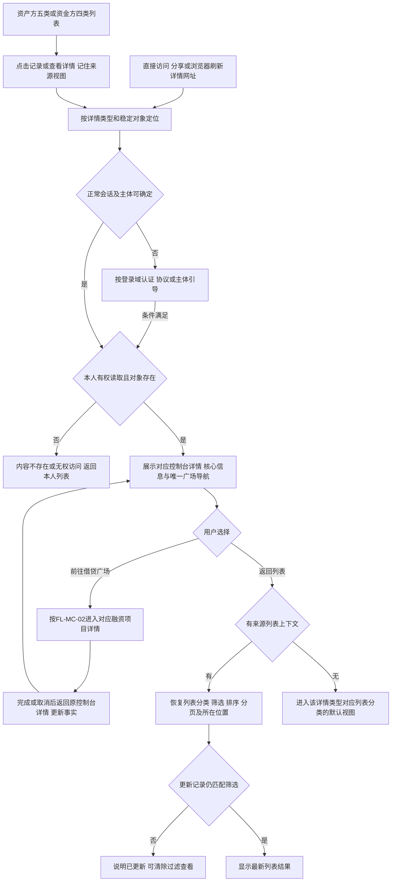

图中I包含代币、项目、授信、放款、还款业务及其选定期次、报价六种阅读对象；没有把资金方无权使用的代币／项目列表补出来。复制等独立浏览操作不触发B。切换对象、读取错误及会话失效按ST-MC-05；失败不能假装成无业务。授信仍为机构×企业；无关联项目不跳普通广场，多关联由用户选择有权目标后，通过同一导航前往。

## 单个详情的可用状态（ST-MC-05）

关联 `F-MC-13`、`F-MC-10`、`D-MC-184`、`D-MC-186`、`D-MC-187`；验收 `AC-MC-90`、`AC-MC-94`、`AC-MC-95`。回查[正文3.13](01-我的控制台-PRD.md#f-mc-13)。本图描述可读性，不改变项目、代币、融资或还款的业务状态。

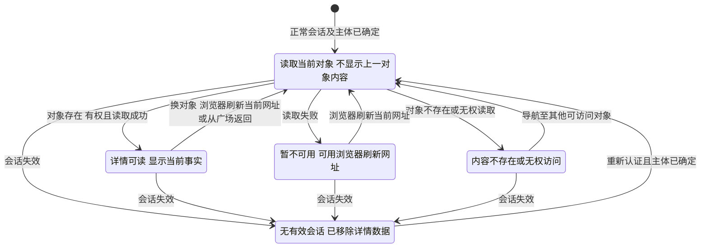

`D-MC-198`、`AC-MC-108`：详情及其局部错误、计划生成中均不提供页内重新取数动作，浏览器刷新保持原对象及选定申请/期次、已有来源视图。

Ready可以包含“尚无放款记录”等局部空内容；正常已终结记录仍属于Ready。可读但业务动作失效时留在Ready并说明当前结果；只有对象本身不可读才进入Unavailable。重新登录不直接恢复旧详情内容，必须重新确认当前主体可读。

## 申请、放款、还款入列与期次定位（FL-MC-05）

关联 `F-MC-03`、`F-MC-05`、`F-MC-06`、`F-MC-07`、`F-MC-09`，规则 `D-MC-189`～`D-MC-194`；验收 `AC-MC-97`～`AC-MC-104`。完整信息口径见[项目与申请3.3](01-我的控制台-PRD.md#f-mc-03)、[放款3.5](01-我的控制台-PRD.md#f-mc-05)、[还款3.6](01-我的控制台-PRD.md#f-mc-06)、[跨模块入口3.9](01-我的控制台-PRD.md#f-mc-09)。各节点是用户能读取的业务事实，不表示控制台执行这些操作。

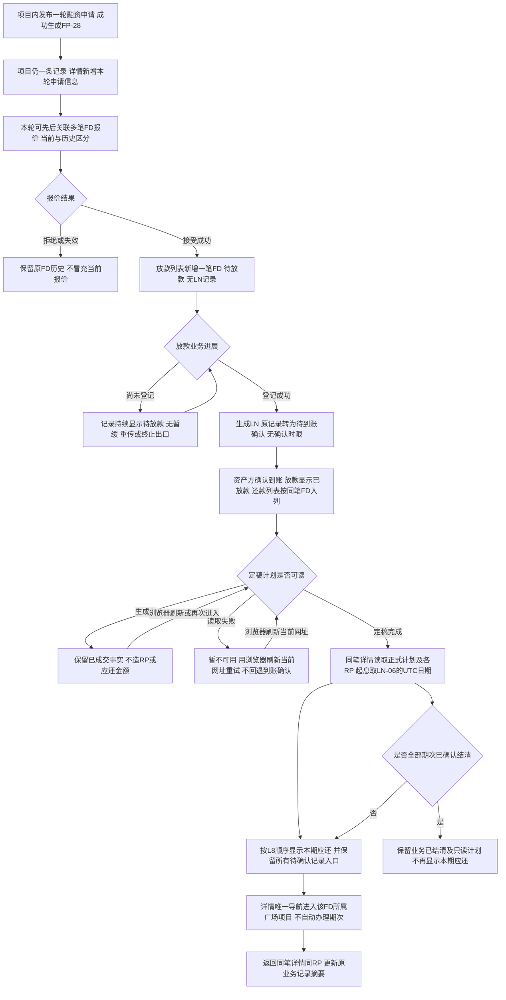

控制台不新增申请类列表分类，项目内申请独立编号可定位；放款与还款各自一条记录一笔FD，不能把LN、RP、RM混作融资业务。无待还但仍有待确认时不结清；旧期次链接始终查看原期最新结果。单笔业务结清不自动等于项目终态或代币提取到账，仍由L5/L8给出各自结果。**待放款与待放款确认都没有时限和终止出口**：业务可无限期停留在该节点，控制台如实呈现当前处理方与后果，不画自动失效、超期或终止边，见[正文既定业务限制](01-我的控制台-PRD.md#limits)。

## 项目资格与执行结果阅读（FL-MC-06）

关联F-MC-03、D-MC-199/200/206、AC-MC-109/110/117；回查[正文3.3](01-我的控制台-PRD.md#f-mc-03)。各节点为已授权用户可读事实，不由控制台执行业务判定或释放。

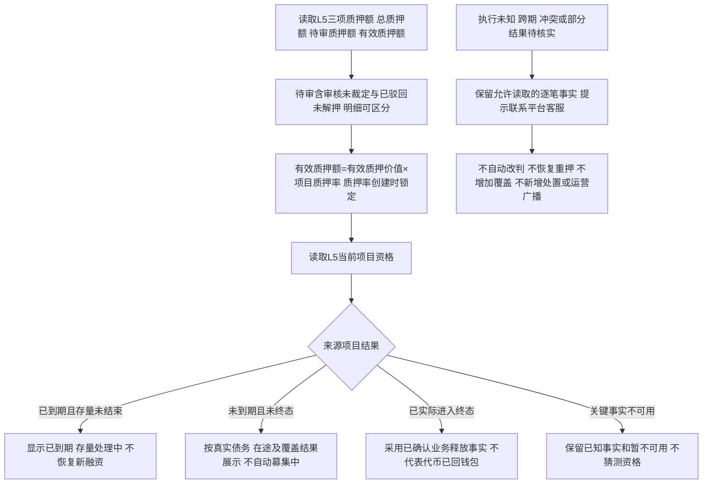

单笔还款结清同样不直接推导整个项目终态；放款段已无终止出口，不存在可读的单笔终止结果。代币列表仍按本企业完整展示集合及两条既定状态轴呈现，已质押不代表已通过审核；当前链上地址不替代企业归属。来源数据失败按既定浏览器刷新恢复，控制台不增加重新取数或异常处理动作。
