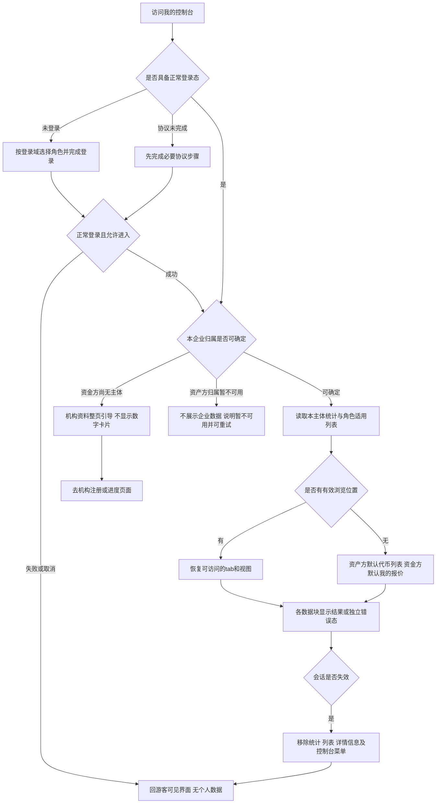
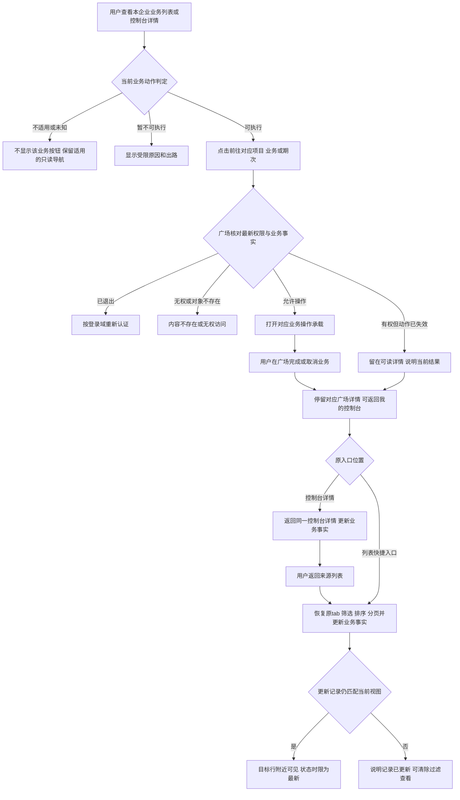
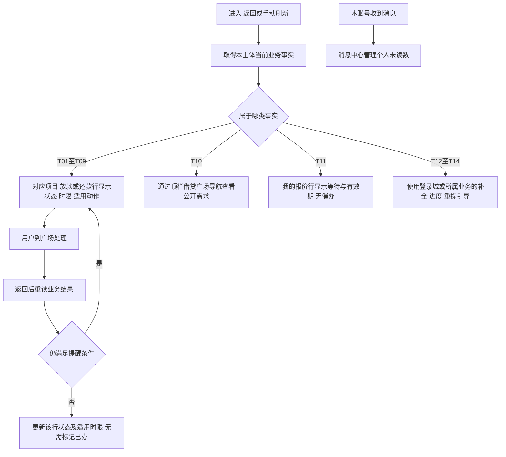
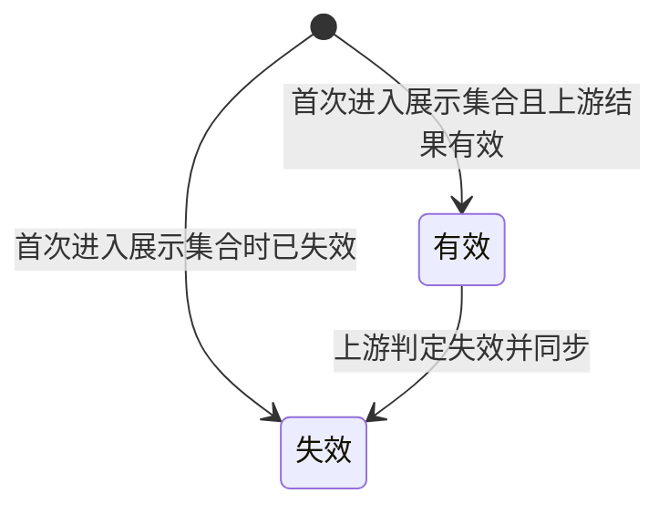
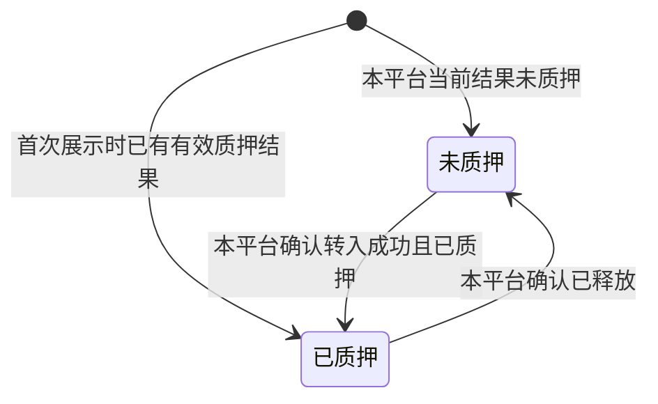
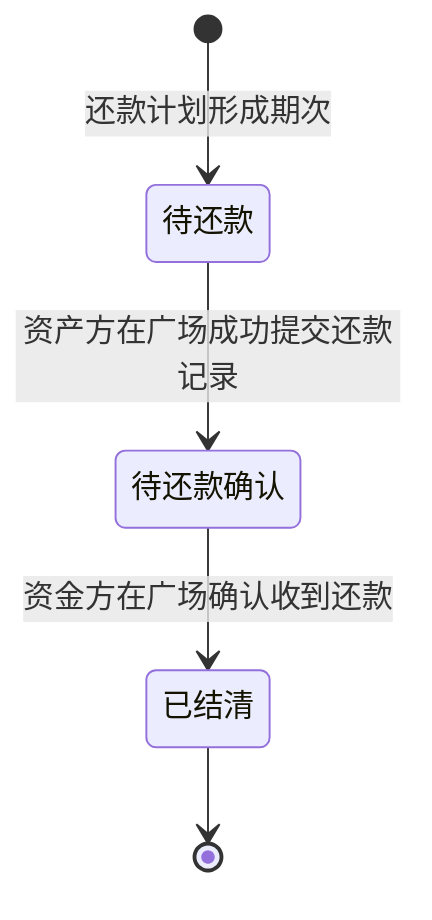
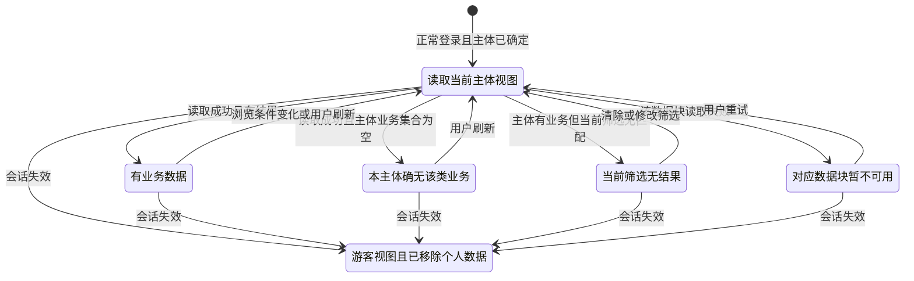
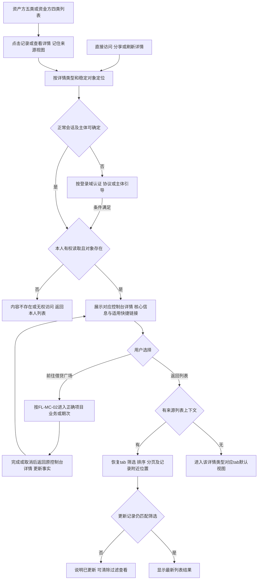
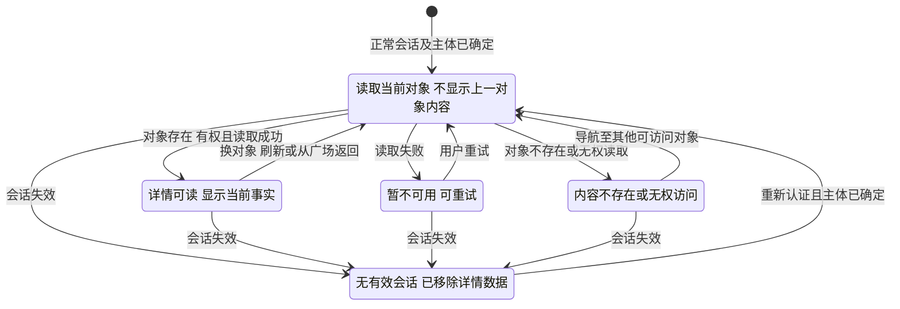

# 借贷平台 · 我的控制台 · 流程图与状态机 V1.1

对应WS-355，日期2026-09-20，与[PRD正文](v1.0-我的控制台-PRD.md)同批使用。仅表达用户流程和业务结果；业务字段、完整规则及验收均以正文为准。图号稳定，图中不定义接口、身份协议、任务调度或内部计算。

| 图号 | 内容 | 关联功能与正文 |
| --- | --- | --- |
| FL-MC-01 | 准入与聚合视图 | [F-MC-01](v1.0-我的控制台-PRD.md#f-mc-01)、[F-MC-10](v1.0-我的控制台-PRD.md#f-mc-10) |
| FL-MC-02 | 从列表或详情到广场并返回 | [F-MC-03](v1.0-我的控制台-PRD.md#f-mc-03)、[F-MC-09](v1.0-我的控制台-PRD.md#f-mc-09)、[F-MC-11](v1.0-我的控制台-PRD.md#f-mc-11) |
| FL-MC-03 | 行级提醒与消息边界 | [F-MC-08](v1.0-我的控制台-PRD.md#f-mc-08) |
| FL-MC-04 | 六类详情的访问与返回 | [F-MC-13](v1.0-我的控制台-PRD.md#f-mc-13) |
| ST-MC-01 | 代币生命周期结果 | [F-MC-02](v1.0-我的控制台-PRD.md#f-mc-02) |
| ST-MC-02 | 质押对外展示状态 | [F-MC-02](v1.0-我的控制台-PRD.md#f-mc-02) |
| ST-MC-03 | 还款期次业务状态 | [F-MC-06](v1.0-我的控制台-PRD.md#f-mc-06) |
| ST-MC-04 | 控制台视图可用状态 | [F-MC-10](v1.0-我的控制台-PRD.md#f-mc-10)、[F-MC-11](v1.0-我的控制台-PRD.md#f-mc-11) |
| ST-MC-05 | 单个详情的可用状态 | [F-MC-13](v1.0-我的控制台-PRD.md#f-mc-13) |

## FL-MC-01 准入与聚合视图

关联 `F-MC-01`、`F-MC-10`、`D-MC-11`、`D-MC-179`、`D-MC-180`；验收 `AC-MC-31`、`AC-MC-41`、`AC-MC-42`、`AC-MC-47`、`AC-MC-86`、`AC-MC-87`。规则回查[正文3.10](v1.0-我的控制台-PRD.md#f-mc-10)。

图例：未认证不等于未登录；只读菜单不因此消失。两角色会话规则引用各自登录域，不统一时长。资料被驳回但仍有企业主体时，保留允许查看的业务，用对应引导承接。

## FL-MC-02 从列表或详情到广场并返回

关联 `F-MC-03`、`F-MC-05`、`F-MC-06`、`F-MC-07`、`F-MC-09`、`F-MC-11`、`F-MC-13`；验收 `AC-MC-32`、`AC-MC-34`、`AC-MC-38`、`AC-MC-66`～`AC-MC-68`、`AC-MC-92`、`AC-MC-93`。回查[正文3.9](v1.0-我的控制台-PRD.md#f-mc-09)。

控制台全程无业务提交。具体抽屉／弹窗形态属于 `Q-MC-53` 的待统一内容，图不将其中一个画成已定。关闭业务操作后停留广场详情；“返回我的控制台”回到原发起位置。控制台详情是独立只读页面，不能混同为广场操作页或嵌入业务表单。详情完整规则见[正文3.13](v1.0-我的控制台-PRD.md#f-mc-13)。

## FL-MC-03 行级提醒与消息边界

关联 `F-MC-08`、`T-MC-01`～`T-MC-14`、`D-MC-117`、`D-MC-162`、`D-MC-173`；验收 `AC-MC-28`～`AC-MC-30`、`AC-MC-62`～`AC-MC-65`、`AC-MC-73`～`AC-MC-75`、`AC-MC-82`。回查[正文3.8](v1.0-我的控制台-PRD.md#f-mc-08)。

独立两条事实线不以箭头互相加总：业务按企业共享，消息未读按个人；本页不设置待办带、任务计数或已办归档。默认紧迫度排序仍待 `Q-MC-51`，图只确定提醒落点。

## ST-MC-01 代币生命周期结果

关联 `F-MC-02`、`D-MC-175`、`D-MC-178`；验收 `AC-MC-48`、`AC-MC-83`～`AC-MC-85`。回查[正文3.2](v1.0-我的控制台-PRD.md#f-mc-02)。

状态权威为代币发行平台；控制台读取本平台快照，不按本机日期迁移。失效后记录仍保留并纳入账面统计，不代表销毁或自动解除质押。本期没有已销毁展示状态，不画无依据的恢复有效边。

## ST-MC-02 质押对外展示状态

关联 `F-MC-02`、`D-MC-176`、`D-MC-177`；验收 `AC-MC-48`、`AC-MC-83`。回查[正文3.2](v1.0-我的控制台-PRD.md#f-mc-02)。

这是对外二元视图，不是内部执行状态机。入池处理中、失败或已释放未提取都不新增可见状态；仍显示未质押。与ST-MC-01正交，一枚代币可为“失效＋已质押”。本页不因状态标签推断是否可再次质押，操作资格由对应业务判定。

## ST-MC-03 还款期次业务状态

关联 `F-MC-06`、`F-MC-08`、`T-MC-05`、`T-MC-06`、`T-MC-08`、`T-MC-09`；验收 `AC-MC-55`～`AC-MC-61`、`AC-MC-80`。回查[正文3.6](v1.0-我的控制台-PRD.md#f-mc-06)。

未开窗、已开窗、逾期是待还款阶段的业务条件或标记，不是额外期次状态。提交后停止该期计息与逾期累加；确认时限到期只增加超期标记，仍为待还款确认，不自动结清，不恢复逾期累加。此图不定义融资业务、项目或代币的状态变化。

## ST-MC-04 控制台视图可用状态

关联 `F-MC-10`、`F-MC-11`；验收 `AC-MC-31`、`AC-MC-47`、`AC-MC-69`～`AC-MC-72`、`AC-MC-86`、`AC-MC-88`。回查[正文3.10](v1.0-我的控制台-PRD.md#f-mc-10)与[正文3.11](v1.0-我的控制台-PRD.md#f-mc-11)。

本图按一个统计或列表数据块表达加载与失败，不能推导为某块失败就清空整页。无主体或主体不可确定先走FL-MC-01，不进入“真空集合”。会话失效是整页数据清除，覆盖所有块；上游同步不可用但本平台快照可读时仍属于有数据状态。

## FL-MC-04 六类详情的访问与返回

关联 `F-MC-02`～`F-MC-07`、`F-MC-09`、`F-MC-10`、`F-MC-11`、`F-MC-13`，页面 `P-MC-02`～`P-MC-07`，规则 `D-MC-182`～`D-MC-188`；验收 `AC-MC-89`～`AC-MC-96`。对象、核心信息与快捷入口矩阵回查[正文3.13](v1.0-我的控制台-PRD.md#f-mc-13)，实际业务操作闭环见[FL-MC-02](#fl-mc-02)。

图中I包含代币、项目、授信、放款、还款期次、报价六种阅读对象；没有把资金方无权使用的代币／项目tab补出来。复制及独立快捷入口不触发B。切换对象、读取错误及会话失效按ST-MC-05；失败不能假装成无业务。授信没有唯一项目时，广场链接仅为普通导航，不标成精准业务入口。

## ST-MC-05 单个详情的可用状态

关联 `F-MC-13`、`F-MC-10`、`D-MC-184`、`D-MC-186`、`D-MC-187`；验收 `AC-MC-90`、`AC-MC-94`、`AC-MC-95`。回查[正文3.13](v1.0-我的控制台-PRD.md#f-mc-13)。本图描述可读性，不改变项目、代币、融资或还款的业务状态。

Ready可以包含“尚无放款记录”等局部空内容；正常已终结记录仍属于Ready。可读但业务动作失效时留在Ready并说明当前结果；只有对象本身不可读才进入Unavailable。重新登录不直接恢复旧详情内容，必须重新确认当前主体可读。

图示交付为Mermaid源文；正文编号、图号与相对链接进行静态核对，未做图形渲染验收。既有默认排序及对方操作承载的待对齐项不在图中伪装成已确定规则。
