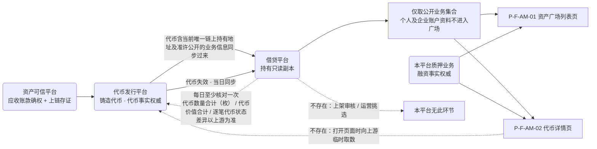
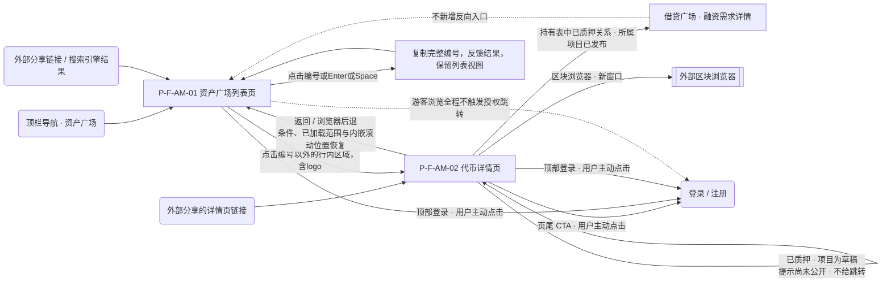
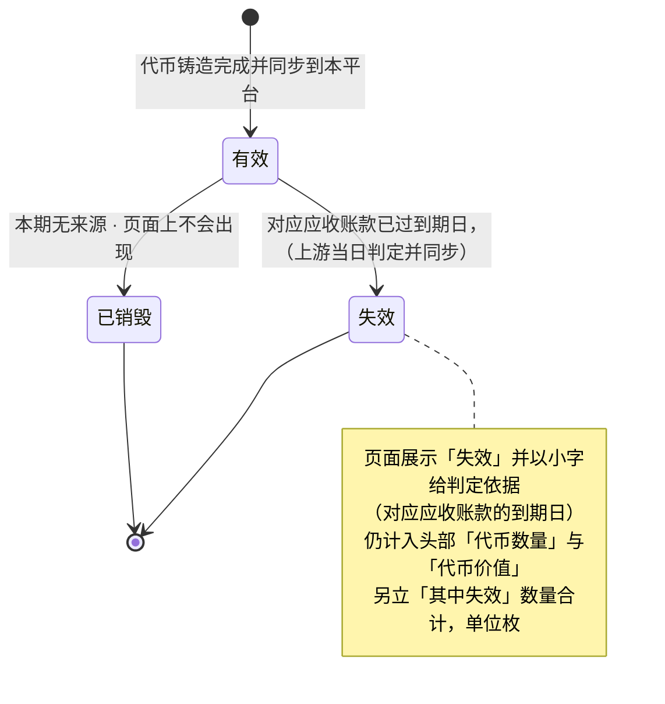
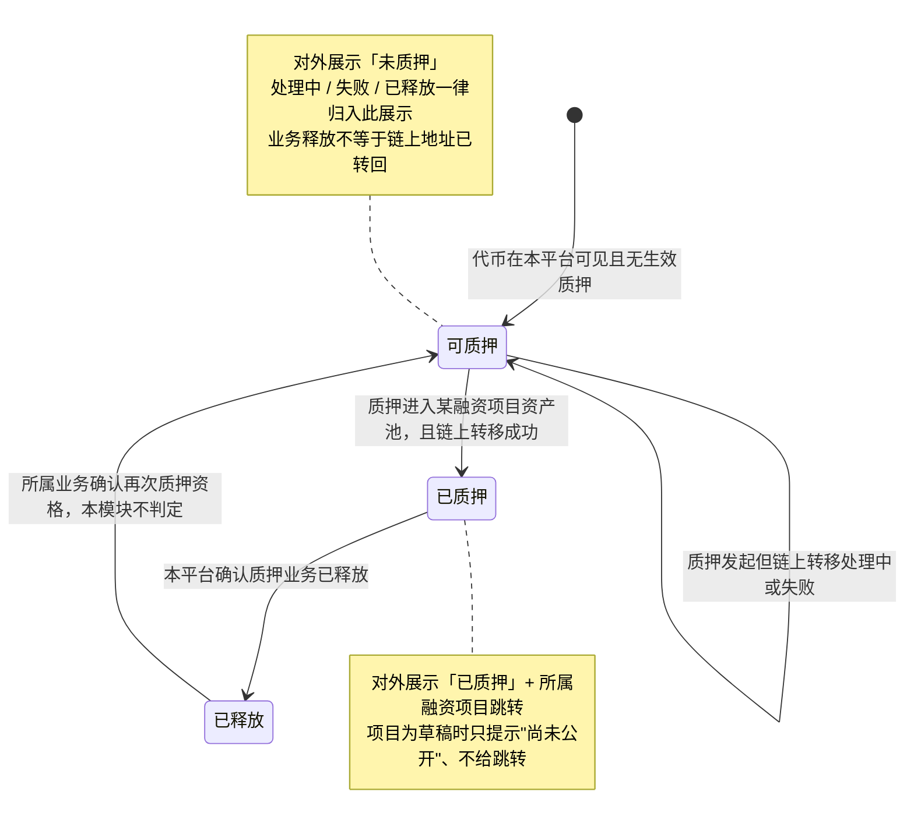
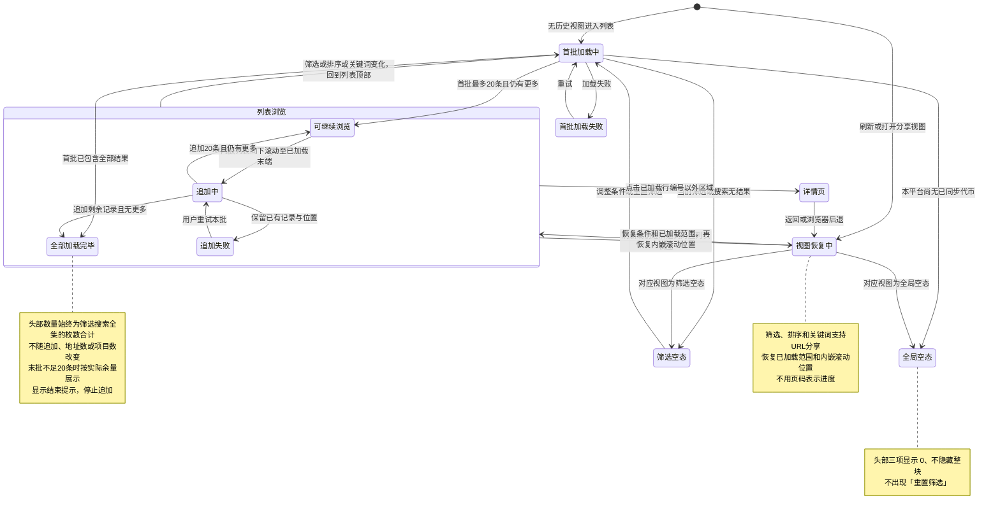
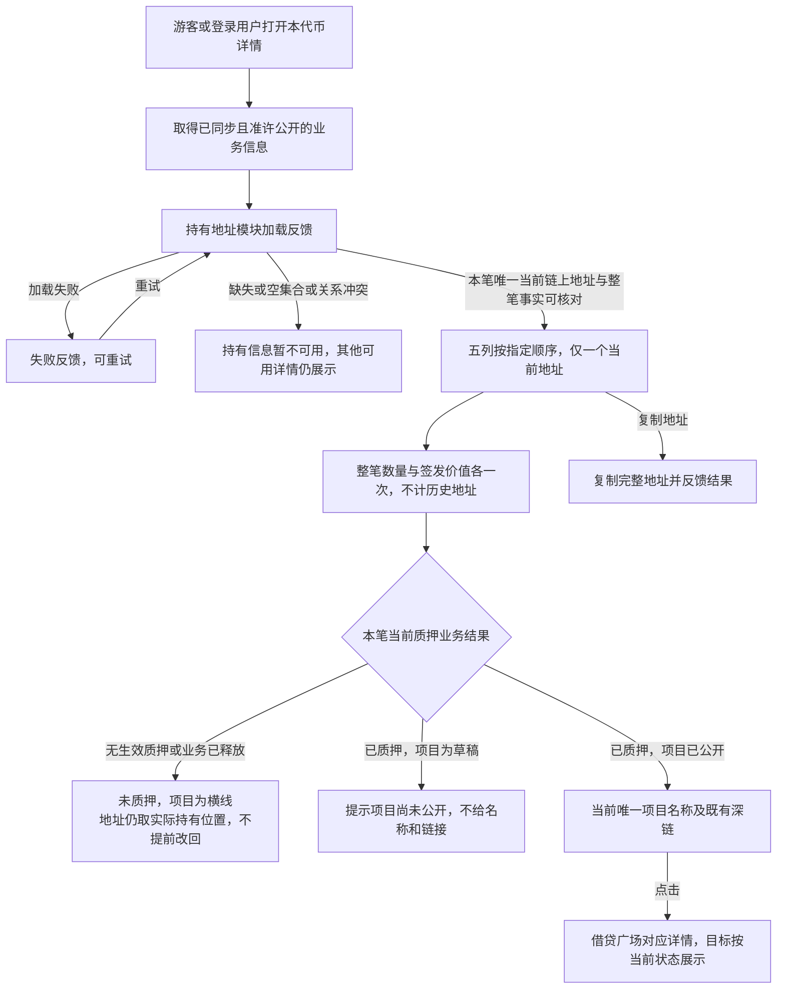

# 资产广场 — 流程图与状态机 **V2.2**

> 本册集中本模块的全部流程图（`FL-AM-*`）与状态机（`ST-AM-*`），**开发与测试共同参考**，设计师据此理解页面流与状态呈现。
>
> **图册不另造业务口径**：每张图的完整规则在正文，图只表达角色、流程、分支与状态转换。正文入口 —— 总览与硬口径见 [`v1.0-资产广场-PRD.md`](v1.0-资产广场-PRD.md)，页面与字段见 [`01-功能需求说明.md`](01-功能需求说明.md)，验收见 [`02-验收需求说明.md`](02-验收需求说明.md)。

## 图索引

| 图号 | 名称 | 对象 / 视角 | 关联需求 | 正文出处 |
| --- | --- | --- | --- | --- |
| `FL-AM-01` | 代币从确权到在资产广场可见 | 跨平台数据来路（业务视角） | `F-AM-13`、`D-AM-47`～`D-AM-49`、`D-AM-57`～`D-AM-62` | 主册 7.1、分册 01 第 10 章 |
| `FL-AM-02` | 访客浏览与跳出路径 | 游客 / 登录用户 | `F-AM-01`、`F-AM-06`～`F-AM-10`、`X-AM-10` | 主册 7.2、分册 01 9.1～9.3 |
| `FL-AM-03` | 持有地址表与项目关系浏览【持有地址要求】 | 详情访客 | `F-AM-14`、`D-AM-65`～`D-AM-68` | 分册 01 9.2.4、11.7 |
| `ST-AM-01` | 代币状态轴 | 业务对象：**代币** | `D-AM-11`、`D-AM-16`、`D-AM-58`、`L-AM-07` | 主册 5.4、分册 01 11.2 |
| `ST-AM-02` | 质押状态轴与对外二元映射 | 业务对象：**质押记录** | `D-AM-12`、`D-AM-13`、`F-AM-09`、`L-AM-08` | 主册 5.5～5.6、分册 01 9.2.3、11.5 |
| `ST-AM-03` | 列表页视图状态 | 页面视图 | `D-AM-22`、`F-AM-04`～`F-AM-06`、`E-AM-01`、`E-AM-02` | 分册 01 9.1.3 |

**图例**：实线 = 正常路径；虚线 = 明确不存在的路径或对外不呈现的信息；方括号节点 = 页面；圆角节点 = 平台或业务动作。

---

## `FL-AM-01` 代币从确权到在资产广场可见

关联：`F-AM-13`、`D-AM-47`（本平台只持副本、不做代币权威）、`D-AM-48`（无上架闸门）、`D-AM-57`（新代币同步到即可见、失效当日可见）、`D-AM-58`（失效判定不在本平台）、`D-AM-59`（每日至少核对一次、差异以上游为准）。

> 两条标注「不存在」的虚线是显式声明：本平台**没有上架闸门**（`D-AM-48`、`X-AM-11`），页面**不向上游临时取数**（`D-AM-49`、`X-AM-13`）。核对虚线是本平台对自身数据的日常校准，**不是用户可见的页面动作**，核对状态也不对外展示（`D-AM-59`、`D-AM-54`）。

---

## `FL-AM-02` 访客浏览与跳出路径

关联：`F-AM-01`（入口）、`F-AM-06`（可寻址）、`F-AM-08`（自行查验）、`F-AM-09`（所属融资项目）、`F-AM-10`（登录/非登录一致与授权边界 `D-AM-52`）、`X-AM-10`（无反向入口）。

> 游客与登录用户走**同一条路径、看同一套信息**（`AC-AM-10`）；页尾 CTA 两种身份都展示，文案可不同（`AC-AM-15`）。

---

## `ST-AM-01` 代币状态轴（业务对象：代币）

关联：`D-AM-11`（状态取上游、本平台只呈现）、`D-AM-58`（失效判定不在本平台）、`D-AM-16`（与质押状态正交、不合并）、`L-AM-07`。权威方：代币发行平台。

---

## `ST-AM-02` 质押状态轴与对外二元映射（业务对象：质押记录）

关联：`D-AM-12`（质押状态业务定义以本平台为准）、`D-AM-13`（对外收敛为二元）、`D-AM-14`（链上转移过程不对外）、`F-AM-09`、`L-AM-08`。权威方：借贷平台。

> 对外只有 `未质押` / `已质押` 两个取值；链上转移状态、待提取、对账差异、gas、失败原因、撤回预扣**一律不对外**（`D-AM-15`）。一笔代币记录可以同时是「失效 + 已质押」，两个标签各自成列（`D-AM-16`、`AC-AM-43`）。

---

## `ST-AM-03` 列表页视图状态（页面视图）

关联：`D-AM-22`（条件、已加载范围与内嵌滚动位置恢复）、`F-AM-04`～`F-AM-06`、`E-AM-01`（全局空态）、`E-AM-02`（筛选空态）、`E-AM-08`（加载失败）。完整规则见[分册 01 9.1.3](01-功能需求说明.md#913-筛选排序搜索与内嵌滚动加载)，验收见 `AC-AM-18`、`AC-AM-19`、`AC-AM-30`、`AC-AM-47`。

---

## `FL-AM-03` 持有地址表与项目关系浏览（持有地址要求）

关联：`F-AM-14`、`D-AM-65`～`D-AM-69`、`E-AM-12`、`AC-AM-68`～`AC-AM-77`。完整规则见分册 01 9.2.4、11.7、12.1a。Q-AM-55 已关闭，Q-AM-56 仅保留事实供给核对依赖，不是让访客选择的页面步骤。

当前唯一地址可以是实际持币合约。业务释放与实际转回是不同事实，不因“未质押”就把地址改回企业；上游提供实际转回后的当前事实时，当前行更新，不保留原地址为第二行。地址不代表账户或企业资料访问权。多当前地址、多有效项目不作为正常路径；事实缺失不当零、不默认未质押。主列表全集数量价值不随地址迁移增减。本流程不产生站内信，见独立通知册；运营察觉数据异常的责任仍保留。

---

> 需求变更时同步更新正文、图示与验收要求；状态名称、转换条件、角色与编号以正文为准。
