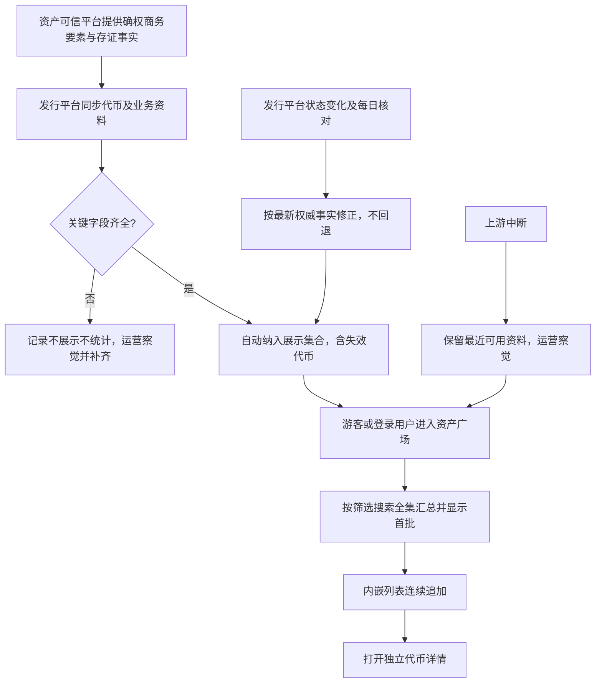
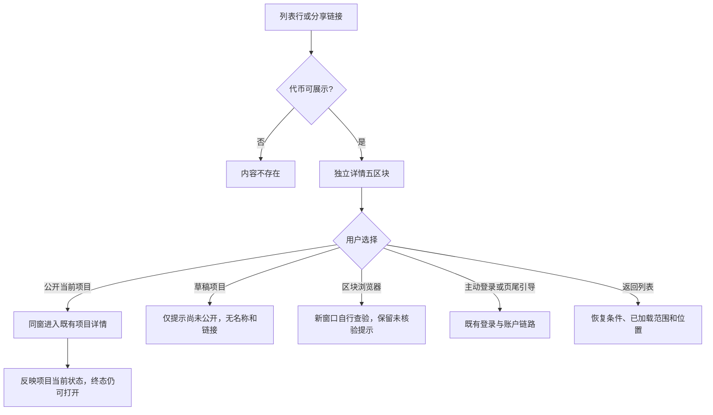
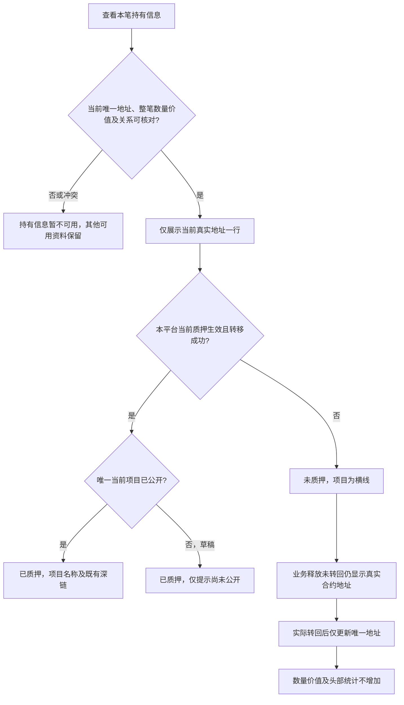
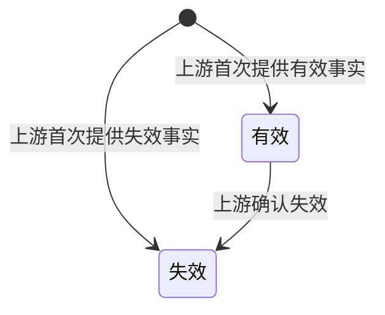
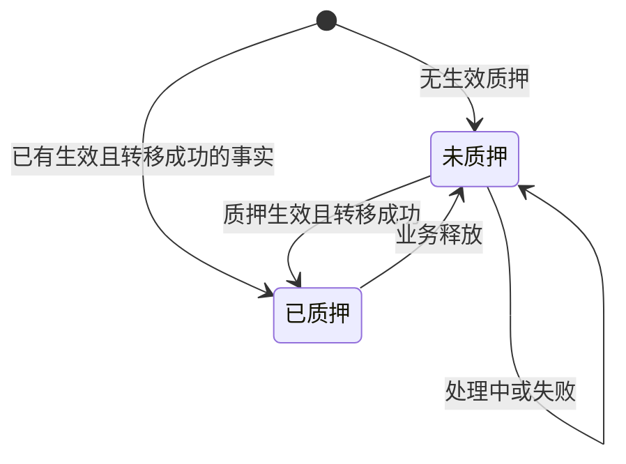
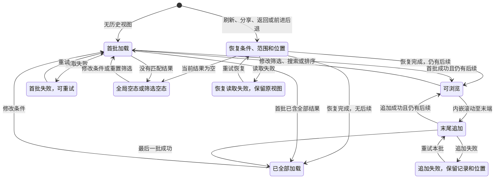

# 资产广场 · 流程图与状态机 · V2.3

配套[主 PRD](v1.0-资产广场-PRD.md)。图只表达业务流转；字段、权限、异常与验收由正文定义。阅读顺序为同步浏览、详情跳转、当前持有事实，再查看两类业务状态与列表视图。

## 同步与公开浏览

打开页面只读本平台已同步数据及本平台质押事实，不临时读链或向上游取数；同步故障不对外显示，页面自身读取失败仍可重试。业务规则见[数据更新](v1.0-资产广场-PRD.md#data)。

## 查看详情与跳转

公开浏览不触发登录或授权；主动登录后的引导、权限与回跳归登录模块。对应[进入广场](v1.0-资产广场-PRD.md#entry)、[详情](v1.0-资产广场-PRD.md#detail)与[项目去向](v1.0-资产广场-PRD.md#pledge)。

## 当前持有事实与项目

加载失败可重试；无数据、历史零余额、多个当前地址/有效项目不能当正常空表。关系不明走不可用，不能走草稿分支。图中地址不是用户身份或企业归属。详见[持有信息](v1.0-资产广场-PRD.md#holding)。

## 代币状态：跟随发行平台

这里只表达本期已确认的状态；本地日期不能触发转换，失效后仍展示并统计，不新增销毁或恢复流程。同步修正始终取上游最新事实，详见[数据更新](v1.0-资产广场-PRD.md#data)。

## 质押结果：只呈现二元

这是本平台质押结果的对外呈现，不是新建质押流程。地址留在合约不表示仍已质押，未质押也不表示已到账或能再次质押；代币失效不替代这一维度。见[质押去向](v1.0-资产广场-PRD.md#pledge)。

## 列表视图状态

更换条件始终从新条件首批顶部开始，旧结果不混入；每批 20 条不改变全集汇总范围。无页码、无常规加载按钮，具体规则及恢复失败后应保留的原条件见[列表视图](v1.0-资产广场-PRD.md#view)。
