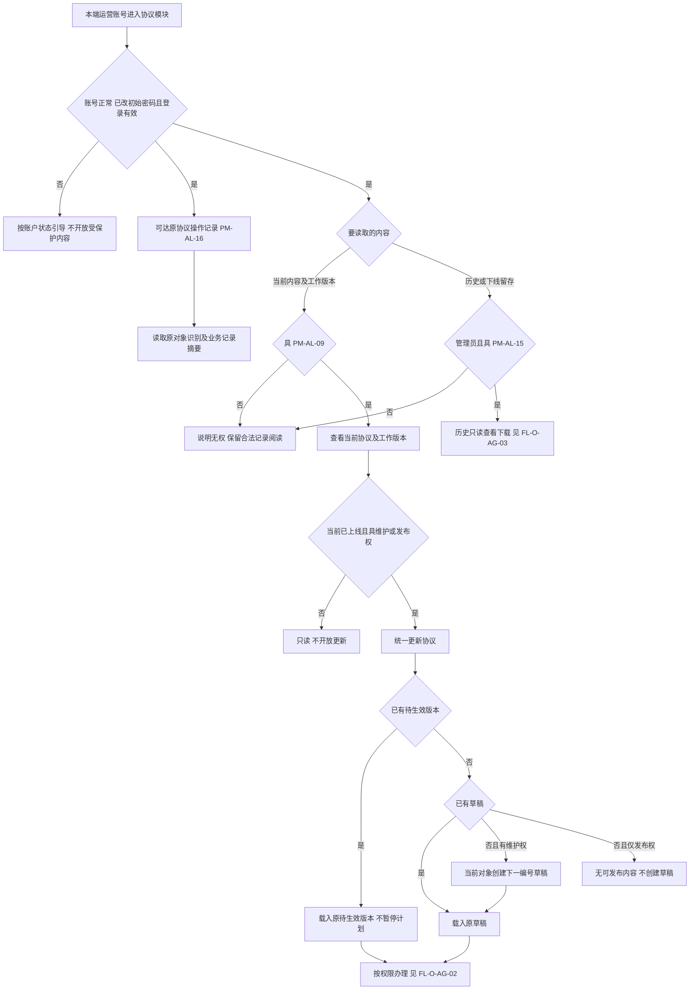
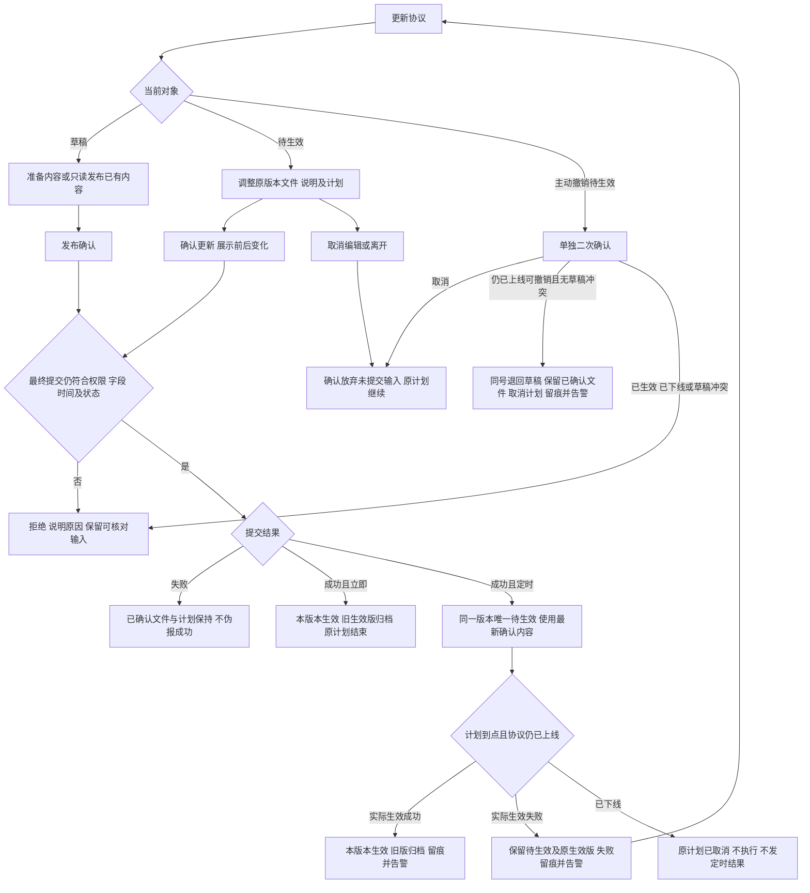
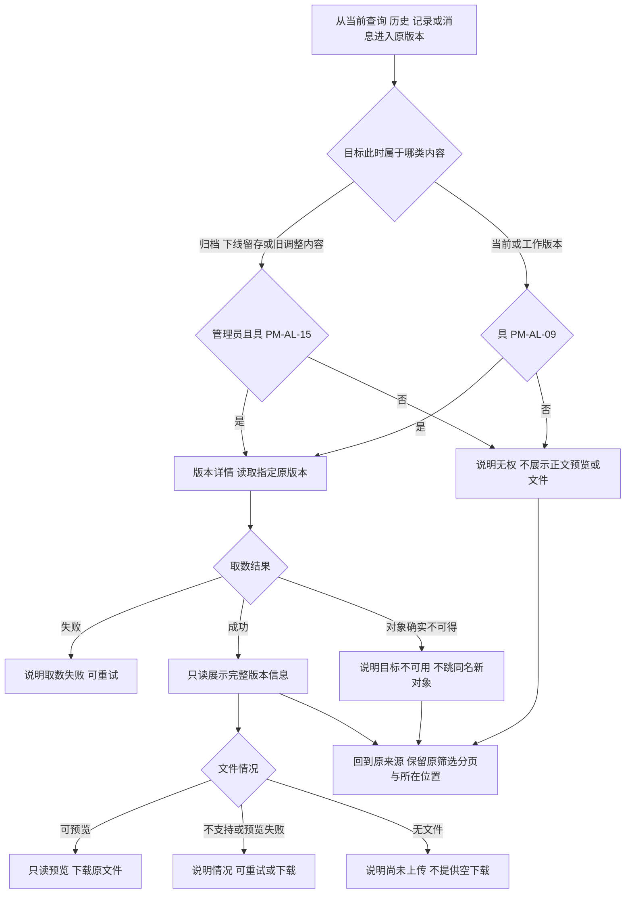
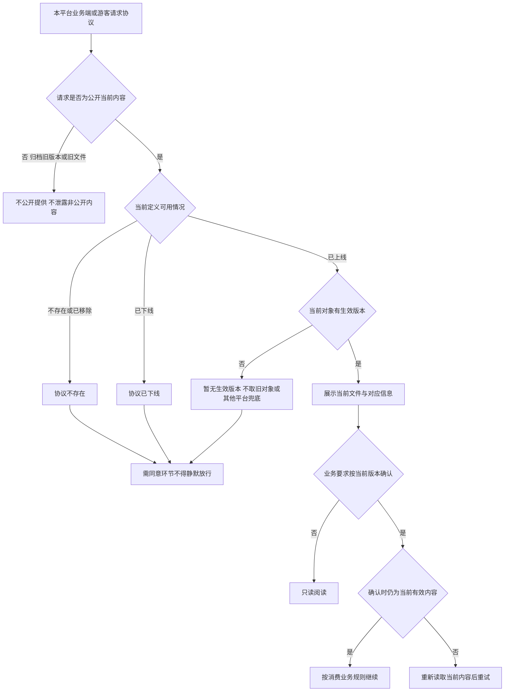
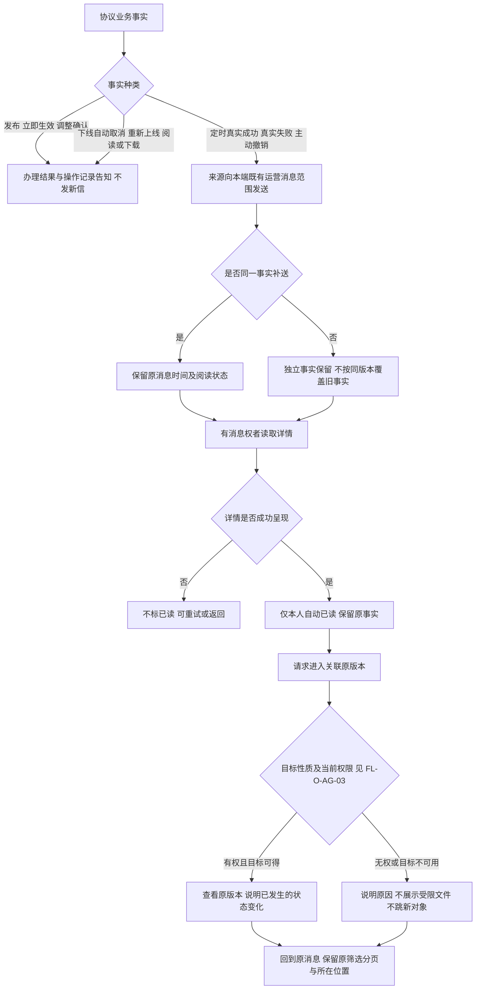
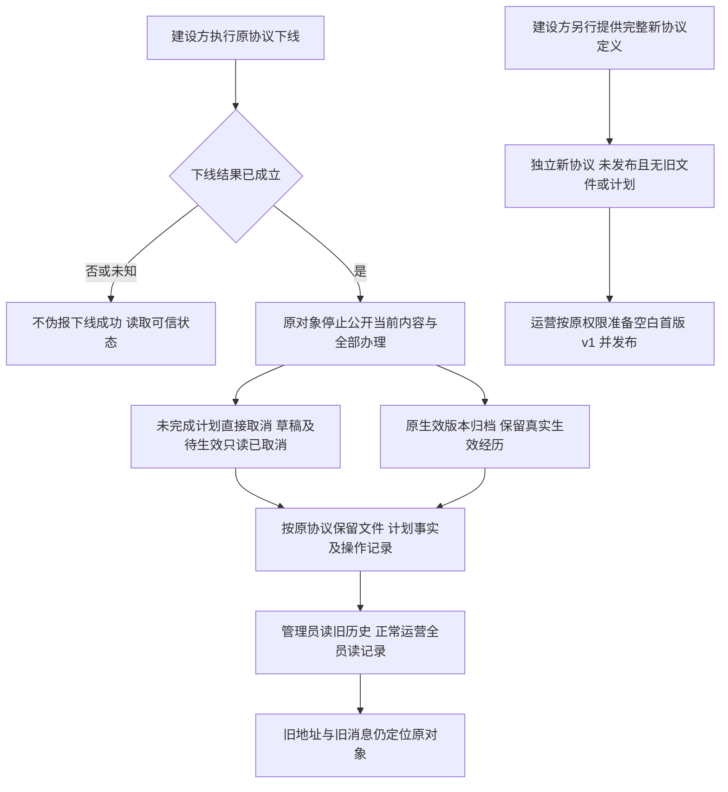
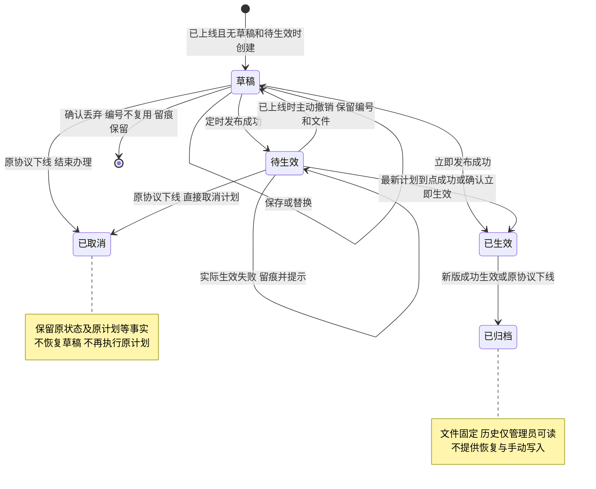
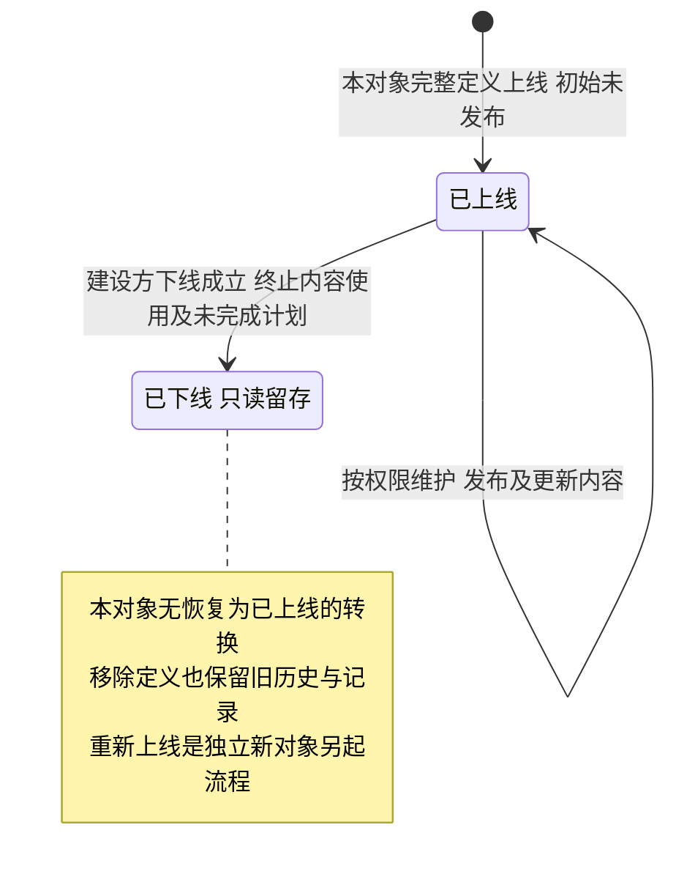

# 运营端协议管理 · 流程图与状态机

2026-09-24｜需求评审稿，与[主 PRD](01-运营端协议管理-PRD.md)的功能与验收同源；业务名称按[字段命名与术语对照表](../00-字段命名与术语对照表.md)第 7 节使用，编号锚点不变。

与[消息通知](03-运营端协议管理-消息通知.md)共同使用。本册只表达业务角色、操作结果及对象状态，完整规则以主 PRD 为准。各平台独立运行，不共享版本与消息。图中节点是业务环节与信息域，不表示页面或组件，承载形式由设计决定（见[统一条款](01-运营端协议管理-PRD.md#design-boundary)）；图中不画协议、接口或存储实现。

| 图号 | 主题 | 关联功能与验收 |
| --- | --- | --- |
| [FL-O-AG-01](#fl-o-ag-01) | 按对象读取与统一更新入口 | [协议定义、列表与检索](01-运营端协议管理-PRD.md#f-o-ag-01)、[更新协议与内容维护](01-运营端协议管理-PRD.md#f-o-ag-04)、[操作进度与留痕](01-运营端协议管理-PRD.md#f-o-ag-09)；验收 [4.1](01-运营端协议管理-PRD.md#ac-1)、[4.2](01-运营端协议管理-PRD.md#ac-2)、[4.6](01-运营端协议管理-PRD.md#ac-6) |
| [FL-O-AG-02](#fl-o-ag-02) | 草稿发布与原待生效版本调整 | [发布、待生效调整与生效](01-运营端协议管理-PRD.md#f-o-ag-06)；验收 [4.3](01-运营端协议管理-PRD.md#ac-3) |
| [FL-O-AG-03](#fl-o-ag-03) | 当前查询、管理员历史与原来源返回 | [版本历史与版本详情](01-运营端协议管理-PRD.md#f-o-ag-07)；验收 [4.5](01-运营端协议管理-PRD.md#ac-5) |
| [FL-O-AG-04](#fl-o-ag-04) | 公开当前版本读取 | [当前生效版本与公开读取](01-运营端协议管理-PRD.md#f-o-ag-11)；验收 [4.7](01-运营端协议管理-PRD.md#ac-7) |
| [FL-O-AG-05](#fl-o-ag-05) | 事件告知、阅读及目标权限 | [协议事件告知](01-运营端协议管理-PRD.md#d-o-ag-03)、[消息通知册](03-运营端协议管理-消息通知.md)；验收 [4.8](01-运营端协议管理-PRD.md#ac-8) |
| [FL-O-AG-06](#fl-o-ag-06) | 下线、旧对象留存与全新上线 | [协议下线、留存与重新上线](01-运营端协议管理-PRD.md#offline)；验收 [4.4](01-运营端协议管理-PRD.md#ac-4) |
| [ST-O-AG-01](#st-o-ag-01) | 单个版本状态机 | [更新协议与内容维护](01-运营端协议管理-PRD.md#f-o-ag-04)、[发布、待生效调整与生效](01-运营端协议管理-PRD.md#f-o-ag-06)；验收 [4.2](01-运营端协议管理-PRD.md#ac-2)、[4.3](01-运营端协议管理-PRD.md#ac-3)、[4.4](01-运营端协议管理-PRD.md#ac-4) |
| [ST-O-AG-02](#st-o-ag-02) | 协议对象的上线与下线 | [协议下线、留存与重新上线](01-运营端协议管理-PRD.md#offline)；验收 [4.1](01-运营端协议管理-PRD.md#ac-1)、[4.4](01-运营端协议管理-PRD.md#ac-4) |

## FL-O-AG-01 按对象读取与统一更新入口

回指[协议定义、列表与检索](01-运营端协议管理-PRD.md#f-o-ag-01)、[更新协议与内容维护](01-运营端协议管理-PRD.md#f-o-ag-04)、[操作进度与留痕](01-运营端协议管理-PRD.md#f-o-ag-09)。记录、当前内容和历史权限分开判定；正常专员无内容查询权也能读取记录。

协议定义与操作进度同属基本信息、须同时可得且先定义后进度。仅记录可读时不带出完整定义、正文和文件。新上线对象无旧内容可复制，从空白 v1 起；同一已上线对象的常规下一版仍沿原更新规则。

## FL-O-AG-02 草稿发布与原待生效版本调整

回指[发布、待生效调整与生效](01-运营端协议管理-PRD.md#f-o-ag-06)。确认待生效调整需查询、维护和发布权；发布已保存草稿或撤销计划可仅具查询及发布权。

取消确认、失败或未提交修改不改变已确认文件和计划。办理期间如到点生效先成功，旧内容不可覆盖已生效内容；下线已成立则旧的办理提交不可继续。调整成功后只按新计划运行，版本历史不增加另一个待生效版本。图中三处告警分别对应[定时生效成功告警](03-运营端协议管理-消息通知.md#nt-o-ag-01)、[定时生效失败告警](03-运营端协议管理-消息通知.md#nt-o-ag-02)、[待生效计划撤销告警](03-运营端协议管理-消息通知.md#nt-o-ag-03)。

## FL-O-AG-03 当前查询、管理员历史与原来源返回

回指[版本历史与版本详情](01-运营端协议管理-PRD.md#f-o-ag-07)。历史版本回溯创建（`F-O-AG-08`）已取消，本图只表达现行只读流程；“版本详情”是信息域，不指定其承载形式。

版本历史仅管理员可进入，只承载版本号、状态、生效时间与查看/下载动作，完整信息在独立只读的版本详情；全部写权限也不能在版本历史中恢复、发布或删除。专员合法当前查询不经过版本历史。原来源为消息或记录时回到该来源并保留所在位置，不能把无历史权者带入版本历史；旧地址始终指向旧对象。

## FL-O-AG-04 公开当前版本读取

回指[当前生效版本与公开读取](01-运营端协议管理-PRD.md#f-o-ag-11)。公开读取只服务本平台当前生效内容，历史由管理侧单独授权。

重新上线的新协议未发布时不继承旧内容。显示更新窗口不允许关键确认使用失效版本。需重新同意标记仅是保留的业务标记，本期不由此新增面客流程或通知。

## FL-O-AG-05 事件告知、阅读及目标权限

回指[协议事件告知](01-运营端协议管理-PRD.md#d-o-ag-03)与[消息通知册](03-运营端协议管理-消息通知.md)。本模块确认事实并发送，运营端消息通知承接共享消息阅读；记录开放不增加收信范围。

旧消息不迁到重新上线的新协议；下线不是主动撤销，取消不冒报定时失败。目标的承载形式由设计决定，本图只约束能否进入与回到哪里。一次计划失败的反复发现不恢复未读，后续新确认计划真实失败才是独立事实。唯一共享登记、真实时效和目标能力继续保留依赖。

## FL-O-AG-06 下线、旧对象留存与全新上线

回指[协议下线、留存与重新上线](01-运营端协议管理-PRD.md#offline)。由建设/研发侧执行上下线，运营端没有新增的上下线办理动作。

两条流程之间没有“恢复原计划”的箭头。原协议下线后的终态不返回已上线；新对象单独开始。到点先生效则先记录真实生效，再下线归档；下线先成立则旧计划不再执行。移除定义仍保留历史与记录可达性，权限不因同名新协议而改变。

## ST-O-AG-01 单个版本状态机

回指[更新协议与内容维护](01-运营端协议管理-PRD.md#f-o-ag-04)、[发布、待生效调整与生效](01-运营端协议管理-PRD.md#f-o-ag-06)。图中是同一协议内的同一版本，不把调整记录画作另一版本。

| 状态 | 允许的业务动作（另需权限且协议已上线） | 内容读取 |
| --- | --- | --- |
| 草稿 | 编辑、保存、发布、确认丢弃 | 工作查询按 `PM-AL-09`；不公开 |
| 待生效 | 原版本调整并确认，或主动撤销 | 工作查询按 `PM-AL-09`；旧调整文件仅管理员；不公开 |
| 已生效 | 原对象不可改；统一更新入口准备后续版本 | 当前查询按 `PM-AL-09`，当前公开内容可读 |
| 已归档 | 无写动作 | 仅管理员历史权，不公开 |
| 已取消 | 无写动作、不可恢复；仅用于下线终止未生效版本 | 仅管理员历史权，不公开 |

正常账号读取操作记录不随版本状态丧失，也不据此取得上述内容。每条状态的呈现方式由设计决定。每个当前协议最多一个草稿、一个待生效、一个已生效；有待生效时不新建并行草稿。取消编辑、并发拒绝和失败提示不是新版本状态。

## ST-O-AG-02 协议对象的上线与下线

回指[协议下线、留存与重新上线](01-运营端协议管理-PRD.md#offline)。与单版本状态分开：协议列表中的草稿/待生效等是按当前版本派生的协议状态。

新对象单独从初始状态进入已上线、未发布；不从旧对象连线、不携带旧版本、计划或记录。旧历史与操作记录分别按管理员历史权和本端全员记录权保留，不形成公开访问能力。
