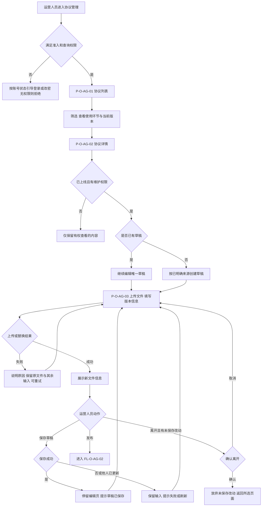
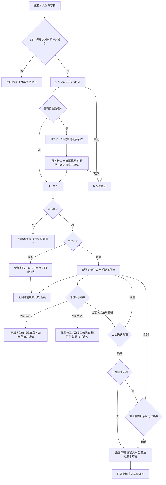
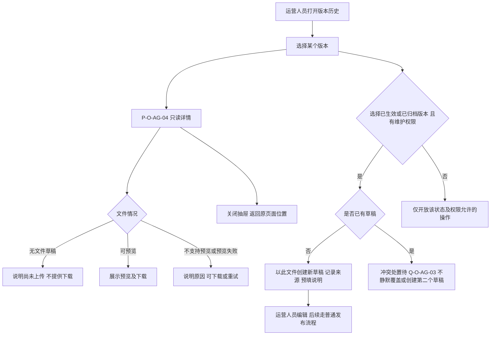
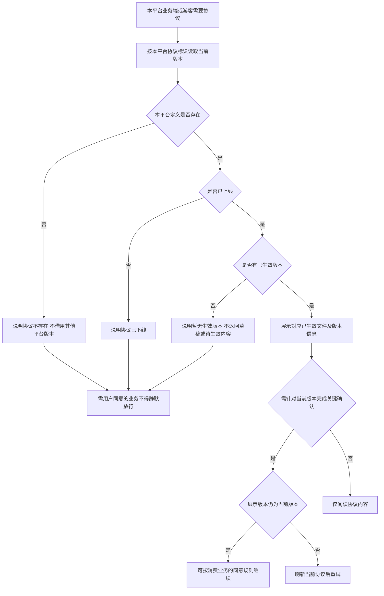
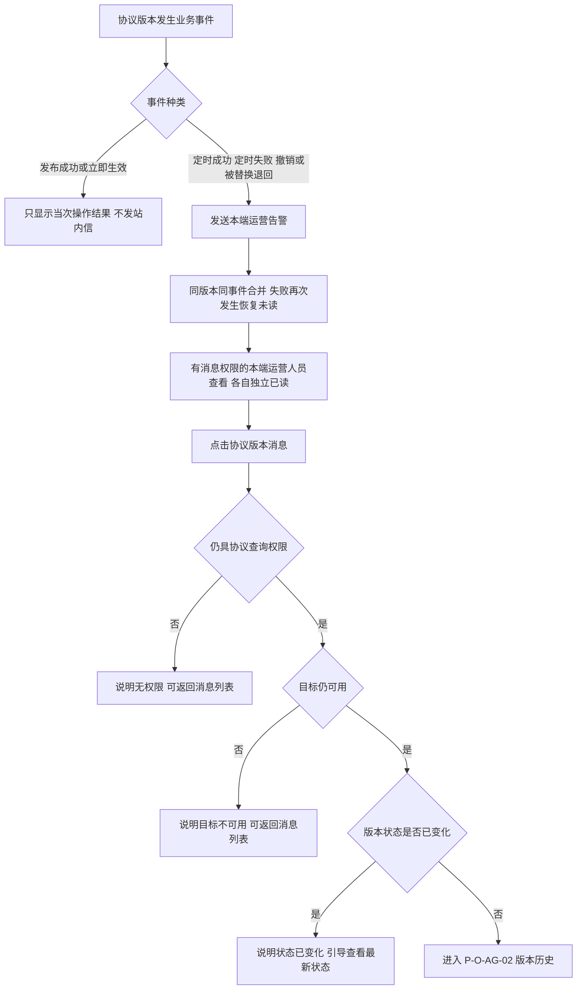
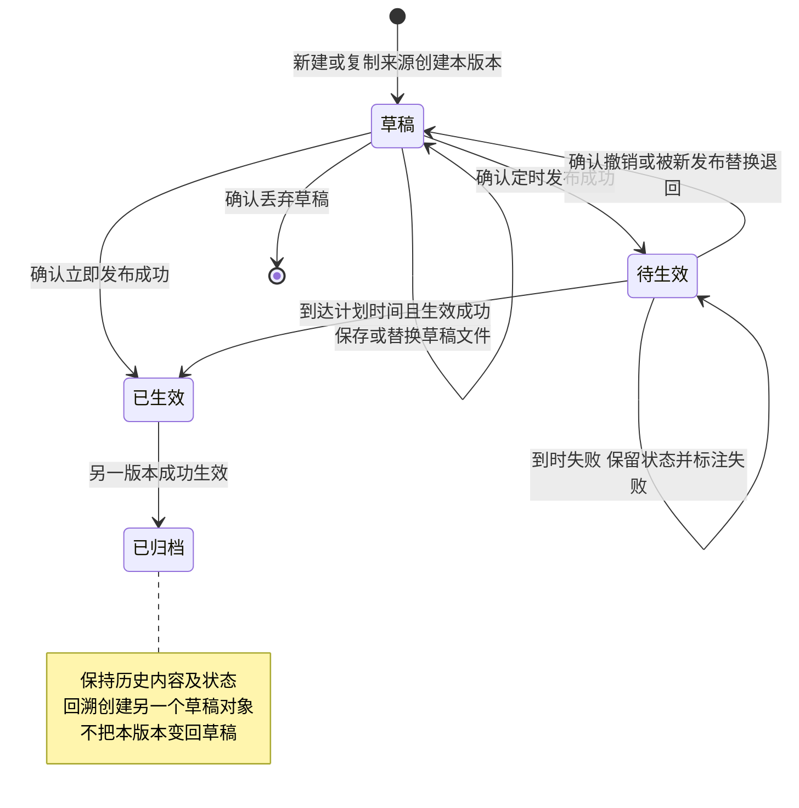

# 运营管理平台 · L15 协议管理 · 流程图与状态机

本图册与 [《运营端协议管理 PRD》](./v1.0-运营端协议管理-PRD.md#overview) V1.0（2026-09-18）同批交付。仅表达运营人员动作、业务结果及版本状态；完整字段、权限、异常及验收以正文为准。运营人员均须满足正文准入及相应功能权限，不将 SPV 单独画成可操作角色。各平台分别运行以下业务流程，互不改变版本。

| 图号 | 主题 | 对应需求 | 正文 |
| --- | --- | --- | --- |
| FL-O-AG-01 | 列表、编辑与保存 | F-O-AG-01～05 | [3.1～3.2](./v1.0-运营端协议管理-PRD.md#m1) |
| FL-O-AG-02 | 发布、撤销与定时结果 | F-O-AG-06 | [3.3](./v1.0-运营端协议管理-PRD.md#m3) |
| FL-O-AG-03 | 历史查看与回溯 | F-O-AG-07～08 | [3.4](./v1.0-运营端协议管理-PRD.md#m4) |
| FL-O-AG-04 | 当前版本读取 | F-O-AG-11 | [3.6](./v1.0-运营端协议管理-PRD.md#m6) |
| FL-O-AG-05 | 通知与目标访问 | D-O-AG-03、F-O-AG-06 | [3.7](./v1.0-运营端协议管理-PRD.md#notifications) |
| ST-O-AG-01 | 单个协议版本状态 | F-O-AG-05～08、10 | [3.2～3.4](./v1.0-运营端协议管理-PRD.md#m2) |

## FL-O-AG-01 列表、编辑与保存

回指 [正文 M1](./v1.0-运营端协议管理-PRD.md#m1)、[M2](./v1.0-运营端协议管理-PRD.md#m2)；验收 AC-O-AG-01～36、76、89～91。无权限、未登录及首登未改密均不能绕过准入。

只有待生效版本时新草稿的默认来源待 Q-O-AG-02；图中“按已明确来源”仅指空白首建、复制当前生效版本和正文已确定的回溯场景。保存草稿不返回详情，发布成功才返回版本历史。

## FL-O-AG-02 发布、撤销与定时结果

回指 [正文 M3](./v1.0-运营端协议管理-PRD.md#m3)；验收 AC-O-AG-37～48、92～93。图中的发布者须具查询与发布权限；内容修改另需维护权限。

新发布替换旧待生效的成功结果包含“旧待生效退回唯一草稿”，并分别留痕及产生撤销通知，详见正文。任一确认取消或发布失败不得先丢失旧状态。首版无旧生效版本时，定时等待或失败均仍无当前生效版本。下线与定时计划相遇、退回版本再次发布编号待 Q-O-AG-03～04，不在图中画成已确定分支。

## FL-O-AG-03 历史查看与回溯

回指 [正文 M4](./v1.0-运营端协议管理-PRD.md#m4)；验收 AC-O-AG-49～53。回溯创建的是另一个版本，历史状态不倒退。

## FL-O-AG-04 当前生效版本读取

回指 [正文 M6](./v1.0-运营端协议管理-PRD.md#m6)及 [D-O-AG-01](./v1.0-运营端协议管理-PRD.md#scope)；验收 AC-O-AG-59～68、94～97。这里只画“读取当前版本”；指定历史版本是独立能力，不借此图裁定下线历史回看。

“需重新同意”标记不触发新流程。公开版本信息不包含运营身份或内部记录。其他平台执行同样规则，取得的是各自实例的当前版本。

## FL-O-AG-05 通知与目标访问

回指 [正文通知](./v1.0-运营端协议管理-PRD.md#notifications)及 [准入规则](./v1.0-运营端协议管理-PRD.md#scope)；验收 AC-O-AG-78～88、99。

通知仅在所属平台，不跨平台投递；消息可见不能替代业务授权。邮箱等敏感信息按共享脱敏基线展示，全部通知不包含文件下载地址。本轮未新增独立通知状态机，已读状态由 WS-360 定义。

## ST-O-AG-01 单个协议版本的状态机

回指 [正文 M2](./v1.0-运营端协议管理-PRD.md#m2)、[M3](./v1.0-运营端协议管理-PRD.md#m3)、[M4](./v1.0-运营端协议管理-PRD.md#m4)；验收 AC-O-AG-31～48、51～53。一个图只描述一个版本对象，回溯创建的新草稿在 FL-O-AG-03 表达。

| 状态 | 运营端允许动作（另需权限） | 对外读取 | 结束或后续 |
| --- | --- | --- | --- |
| 草稿 | 查看、有文件则下载、维护、发布、丢弃 | 不可见 | 可发布或丢弃；丢弃后对象结束 |
| 待生效 | 查看、下载、撤销 | 不可见 | 到时生效或退回草稿；失败仍待生效 |
| 已生效 | 查看、下载、作为新草稿来源 | 当前版本可读 | 仅另一版本生效时自动归档 |
| 已归档 | 查看、下载、作为新草稿来源 | 仅按指定历史版本回看 | 永久保留，不画删除终态 |

同一协议同时至多一个草稿、一个待生效、一个已生效版本；归档版本可有多个。协议列表“已下线/未发布”等是定义与版本共同派生的展示值，不与上述版本状态混为同一个状态机。Q-O-AG-02～04 所列主标签、重新编号、下线交叉分支仍待裁定；本图未替这些问题给出新结论。
