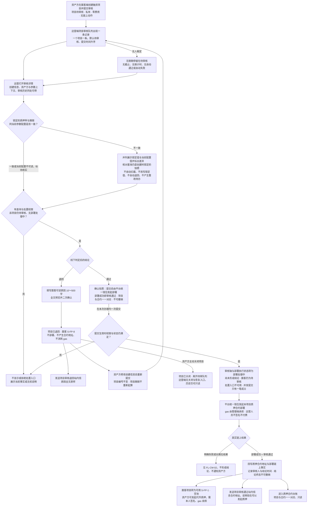
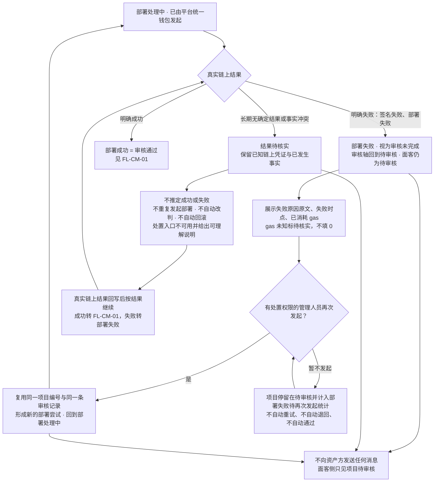
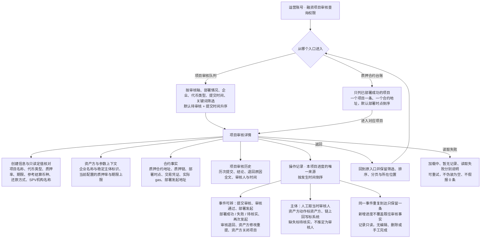
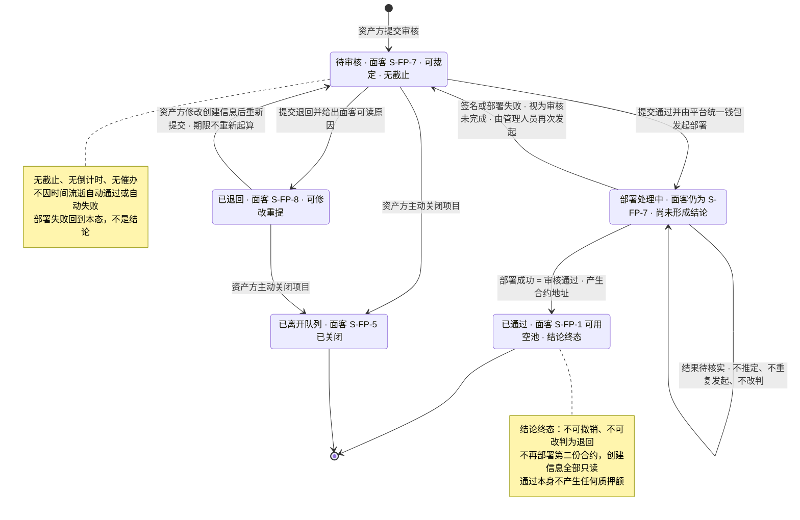
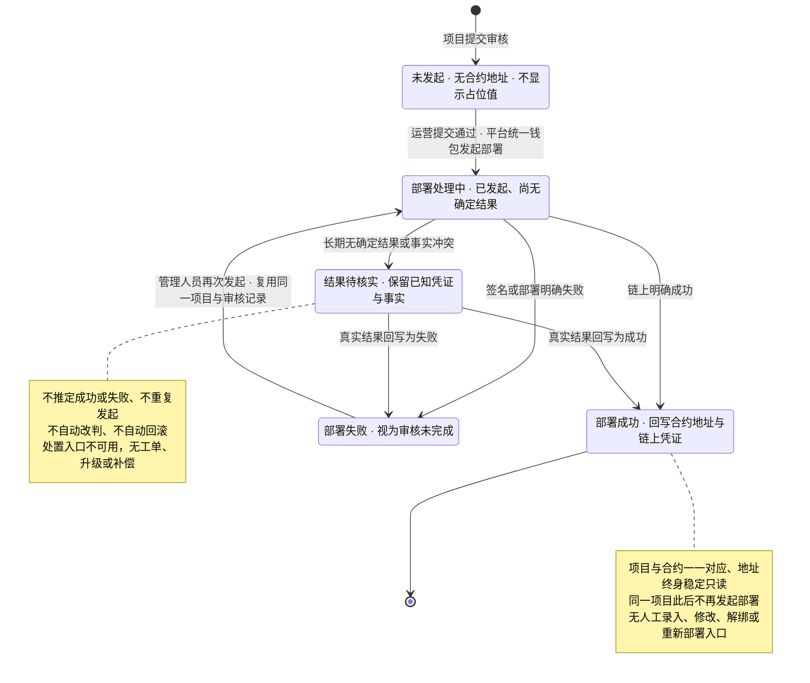

# 运营端合约管理 · 流程图与状态机

2026-09-24｜需求评审稿｜配套本模块当前[主 PRD](01-运营端合约管理-PRD.md#entry)与[消息通知](03-运营端合约管理-消息通知.md)。

开发、测试、设计共同参考。业务规则与同序验收见主 PRD，通知事件见消息通知册。本册只表达角色、用户路径和业务状态，不表示页面或组件，承载形式由设计决定（见[统一条款](01-运营端合约管理-PRD.md#design-boundary)）；与正文不一致时以正文为准。

本模块的核心是一条链路：**资产方提交审核 → 运营核对创建信息 → 通过即由平台统一钱包发起质押合约部署 → 部署成功就是审核通过**。审核结论只有通过与退回两种；签名或部署失败不是结论，项目回到待审核由管理人员再次发起。全链路**无任何时限**，不因等待自动通过或自动失败。连线为已确认业务分支：部署异常只保留真实事实与保护，不画工单、升级、改判或强制回滚流程。日期判定与统计统一 UTC，时点按偏好时区显示并标注。项目状态的权威定义归[融资项目状态 `ST-LS-01`](../v1.0-借贷广场-融资需求与代币质押/02-融资需求与代币质押-流程图与状态机.md#st-ls-01)，本册只读消费并标出对应关系，不另造一套。

| 图号 | 名称 | 关联需求与正文 |
| --- | --- | --- |
| [`FL-CM-01`](#fl-cm-01) | 项目审核与合约部署 | `F-CM-01`～`13`、`D-CM-03`～`09`、`D-CM-19`～`20`；[3.1 队列](01-运营端合约管理-PRD.md#m1)、[3.2 审核详情](01-运营端合约管理-PRD.md#m2)、[3.3 通过并部署](01-运营端合约管理-PRD.md#m3)、[3.4 退回](01-运营端合约管理-PRD.md#m4) |
| [`FL-CM-02`](#fl-cm-02) | 部署失败、结果待核实与再次发起 | `F-CM-14`～`15`、`D-CM-07`、`D-CM-16`；[3.5 部署失败与再次发起](01-运营端合约管理-PRD.md#m5) |
| [`FL-CM-03`](#fl-cm-03) | 审核历史、操作记录与合约台账的查看 | `F-CM-07`～`08`、`F-CM-16`～`18`、`D-CM-18`；[3.2 审核详情](01-运营端合约管理-PRD.md#m2)、[3.6 合约台账](01-运营端合约管理-PRD.md#m6) |
| [`ST-CM-01`](#st-cm-01) | 运营端项目审核轴 `CF-03` | `F-CM-09`～`15`、`D-CM-04`；[2.4 状态与项目口径](01-运营端合约管理-PRD.md#states) |
| [`ST-CM-02`](#st-cm-02) | 合约部署执行状态 `CF-07` | `F-CM-10`～`11`、`F-CM-14`～`15`、`D-CM-07`；[2.4 状态与项目口径](01-运营端合约管理-PRD.md#states) |

## FL-CM-01 项目审核与合约部署

规则回查：[项目审核队列](01-运营端合约管理-PRD.md#m1)、[审核详情与创建信息核对](01-运营端合约管理-PRD.md#m2)、[通过并部署合约](01-运营端合约管理-PRD.md#m3)、[退回与唯一结论](01-运营端合约管理-PRD.md#m4)。

三条判断相互独立：**权限与状态**决定能不能裁定，**线下判定**决定通过还是退回，**真实链上结果**决定通过是否成立。审核核对的对象始终是资产方提交创建时锁定的快照，审核期间运营调整融资参数配置不改变在审项目的核对结论，也不改变退回后重提的核对基准（沿[运营端融资参数配置 `D-O-FC-03`](../v1.0-运营端融资参数配置/01-运营端融资参数配置-PRD.md#d-o-fc-03)）。通过办理在本次办理内一次提交，没有第二步确认、没有第二位审核人。退回是运营端唯一能让项目回到资产方手上的结论；运营端没有修改创建信息、代提交与关闭项目的入口。项目审核不产生任何质押额——项目通过只是允许发起质押。

## FL-CM-02 部署失败、结果待核实与再次发起

规则回查：[部署失败、结果待核实与再次发起](01-运营端合约管理-PRD.md#m5)、[合约部署执行状态](01-运营端合约管理-PRD.md#d-cm-07)。

失败与待核实都**不是审核结论**：不改变项目期限起算点、不要求资产方重新提交、不产生第二个项目、不产生第二份合约。再次发起次数本期不设上限。本期没有工单、异常待办、自动升级、人工改判或补记、强制回滚、补偿与手工录入合约地址的能力；无法自行处理时联系建设方核实链上与配置，产品内不编造处理时限或工单流程。

## FL-CM-03 审核历史、操作记录与合约台账的查看

规则回查：[审核详情与创建信息核对](01-运营端合约管理-PRD.md#m2)、[质押合约台账](01-运营端合约管理-PRD.md#m6)、[留痕与通知触发](01-运营端合约管理-PRD.md#m7)。

审核历史与操作记录范围分开：历史按"提交—结论"组织，操作记录按"事件—时间"组织，两者同源同事实，不各自补记。台账只呈现合约与项目的对应关系，不承载逐笔代币质押、额度与覆盖事实。无权身份不展示入口且不泄露项目存在性。

## ST-CM-01 运营端项目审核轴 `CF-03`

规则回查：[状态、项目口径与外部只读事实](01-运营端合约管理-PRD.md#states)。

审核轴只有这四个业务态加一个离队事实，**没有第三种结论**，也没有驳回终结、作废、冻结、暂缓。部署处理中是过渡态不是结论，此时界面不得展示"已通过"，也不得引导资产方发起质押。项目状态的权威定义与其余转换归[融资项目状态 `ST-LS-01`](../v1.0-借贷广场-融资需求与代币质押/02-融资需求与代币质押-流程图与状态机.md#st-ls-01)；已通过之后的募集中、已锁定、融资中、已结清等转换不由本模块驱动。

## ST-CM-02 合约部署执行状态 `CF-07`

规则回查：[合约部署执行状态](01-运营端合约管理-PRD.md#d-cm-07)、[部署失败与再次发起](01-运营端合约管理-PRD.md#m5)。

部署执行状态是**链上执行事实**，与审核轴是两条独立的轴：部署成功同时推动审核轴到已通过，部署失败把审核轴退回待审核，结果待核实则两条轴都不变更结论。部署 gas 由管理端承担，运营人员全程不签名、不付费；平台统一钱包的取值在代码层面维护、随版本发布，本模块与全平台都不提供其维护、配置、切换、余额或充值入口。历次部署尝试与结果全部保留在审核历史与操作记录中，不被覆盖。

返回[正文阅读入口](01-运营端合约管理-PRD.md#entry)、[同序验收](01-运营端合约管理-PRD.md#acceptance)、[消息通知](03-运营端合约管理-消息通知.md)。
