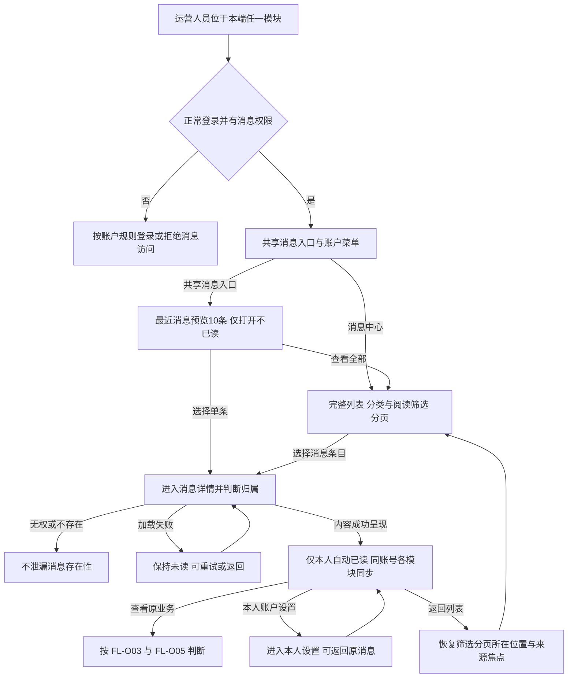
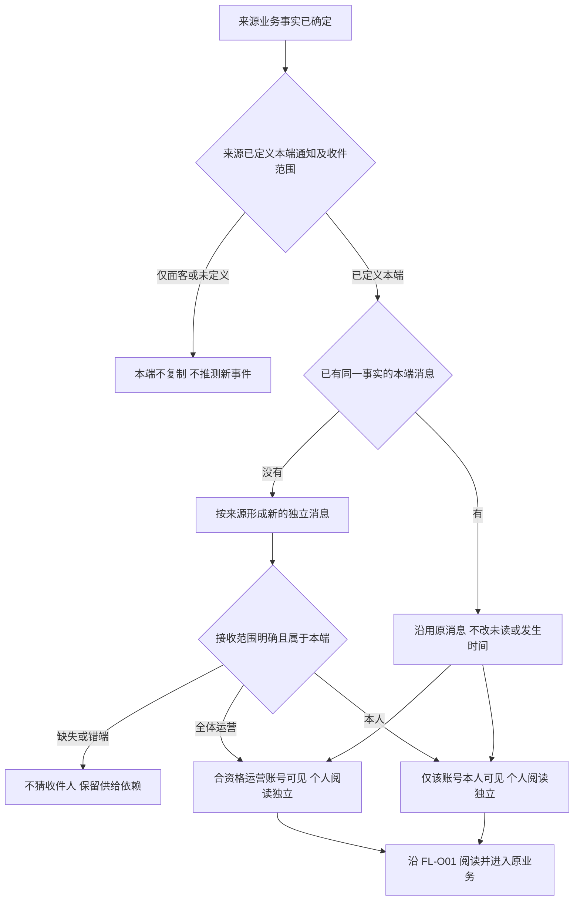
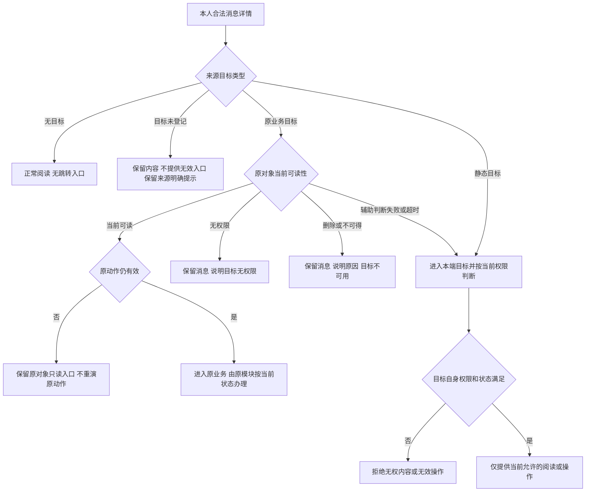
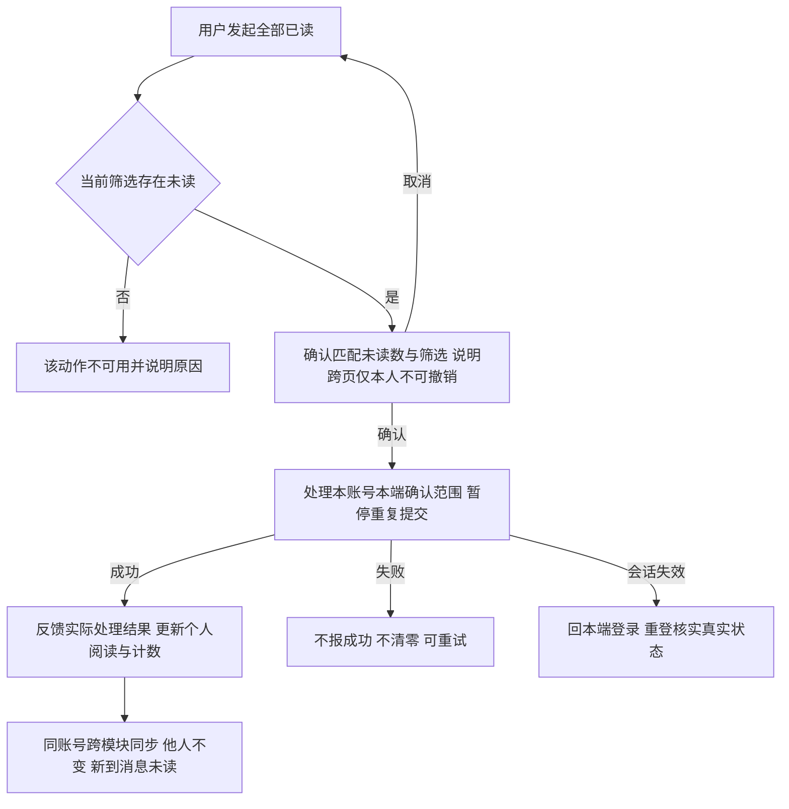
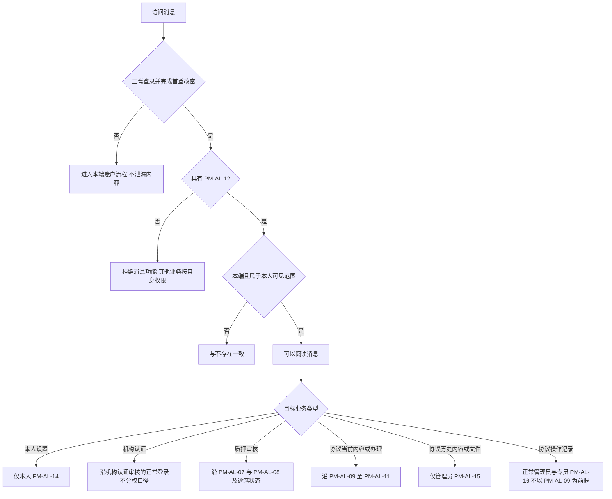
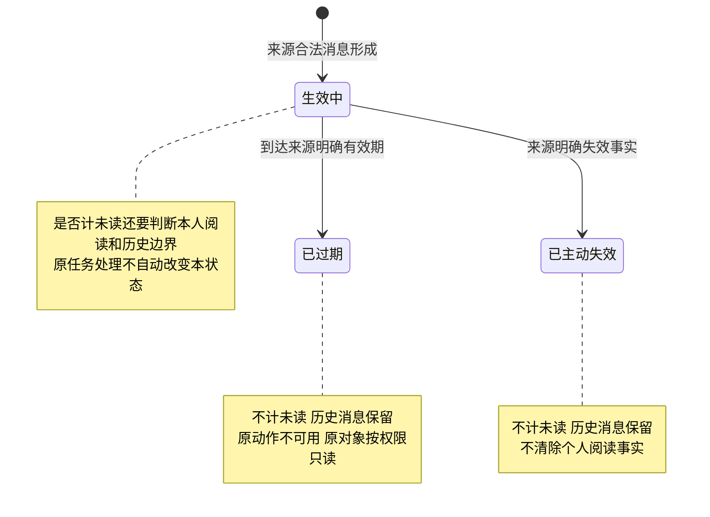
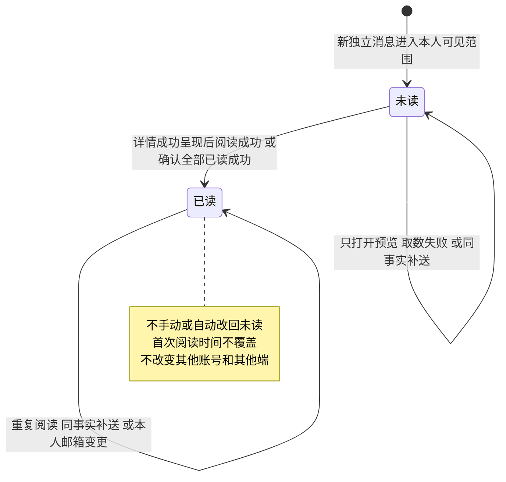

# 运营端消息通知 · 流程图与状态机

2026-09-24｜需求评审稿，与[主 PRD](01-运营端消息通知-PRD.md)的功能与验收同源。

与[消息通知与来源衔接](03-运营端消息通知-消息通知.md)共同使用。本册只表达业务角色、阅读与权限结果，不画协议、接口或存储实现。图中节点是业务环节与信息域，不表示页面或组件，承载形式由设计决定（见[统一条款](01-运营端消息通知-PRD.md#design-boundary)）。来源的真实触发条件回查[消息通知与来源衔接](03-运营端消息通知-消息通知.md)及各来源自己的通知册。

| 图 | 关联功能 | 规则入口 |
| --- | --- | --- |
| [共享入口、阅读与返回（FL-O01）](#fl-o01) | `F-O01`～`F-O13` | [共享消息入口、未读计数与最近消息预览](01-运营端消息通知-PRD.md#f-o01)、[消息中心列表、筛选与分页](01-运营端消息通知-PRD.md#f-o06)、[消息详情、阅读已读与全部已读](01-运营端消息通知-PRD.md#f-o10) |
| [已有来源与本端接收（FL-O02）](#fl-o02) | `F-O16`～`F-O18` | [接收范围、准入与端隔离](01-运营端消息通知-PRD.md#f-o16)、[来源承接与既有编号](01-运营端消息通知-PRD.md#f-o18) |
| [原业务目标、历史查看与动作失效（FL-O03）](#fl-o03) | `F-O14`、`F-O15` | [业务目标、动作失效与原对象可读](01-运营端消息通知-PRD.md#f-o14) |
| [当前筛选跨页全部已读（FL-O04）](#fl-o04) | `F-O11` | [消息详情、阅读已读与全部已读](01-运营端消息通知-PRD.md#f-o10) |
| [消息准入与目标权限分别判断（FL-O05）](#fl-o05) | `F-O16`、`F-O17` | [接收范围、准入与端隔离](01-运营端消息通知-PRD.md#f-o16) |
| [单条消息的有效性（ST-O01）](#st-o01) | `F-O02`、`F-O14` | [业务目标、动作失效与原对象可读](01-运营端消息通知-PRD.md#f-o14)、[非功能目标与保留策略](01-运营端消息通知-PRD.md#quality) |
| [一个账号对一条消息的阅读状态（ST-O02）](#st-o02) | `F-O10`、`F-O11` | [消息详情、阅读已读与全部已读](01-运营端消息通知-PRD.md#f-o10) |

## FL-O01 共享入口、阅读与返回

验收：[入口在本端各页可用（AC-O01）](01-运营端消息通知-PRD.md#ac-o01)～[自动更新暂停与失败保值（AC-O10）](01-运营端消息通知-PRD.md#ac-o10)、[分类取自真实来源（AC-O11）](01-运营端消息通知-PRD.md#ac-o11)～[单条降级不影响同页（AC-O21）](01-运营端消息通知-PRD.md#ac-o21)、[详情有独立地址（AC-O22）](01-运营端消息通知-PRD.md#ac-o22)～[全部已读失败与不可用（AC-O33）](01-运营端消息通知-PRD.md#ac-o33)、[跨模块与多上下文一致（AC-O105）](01-运营端消息通知-PRD.md#ac-o105)～[详情地址刷新与设置往返（AC-O109）](01-运营端消息通知-PRD.md#ac-o109)。

列表不提供逐条标为已读的动作，预览不承载全部已读。刷新详情地址后同会话的来源仍可恢复；切换账号不能恢复前一人的内容。各模块共用个人已读，不意味着跨端或跨人共享。

## FL-O02 已有来源与本端接收

验收：[来源复用同一框架（AC-O71）](01-运营端消息通知-PRD.md#ac-o71)～[不新增平台级业务板块（AC-O83）](01-运营端消息通知-PRD.md#ac-o83)、[两端分别通知的边界（AC-O100）](01-运营端消息通知-PRD.md#ac-o100)、[账户类来源归属正确（AC-O112）](01-运营端消息通知-PRD.md#ac-o112)～[证据分别提供（AC-O116）](01-运营端消息通知-PRD.md#ac-o116)。

本端当前的全体运营来源是机构资料待审核与协议三类运营告警（`NT-O-AG-01`～`NT-O-AG-03`），本人来源是密码变更通知（`NT-AL-01`）；发送责任各归其来源模块。机构审核结果、质押审核结果、项目审核结果与借贷广场面客事件不复制给运营；运营端合约管理与运营端融资参数配置均无运营端事件，企业账户也不向运营端产生消息或待办，图中“仅面客或未定义”分支即涵盖这几类。框架无独立事件、模板或邮件发送；共享登记与真实时效未完成时不能标注为已接入。

## FL-O03 原业务目标、历史查看与动作失效

验收：[目标须已登记（AC-O34）](01-运营端消息通知-PRD.md#ac-o34)～[失败分支保留正文（AC-O43）](01-运营端消息通知-PRD.md#ac-o43)、[过期说明与历史只读（AC-O91）](01-运营端消息通知-PRD.md#ac-o91)、[旧提交只读不重演（AC-O110）](01-运营端消息通知-PRD.md#ac-o110)。

消息过期或主动失效后不计未读，原动作不恢复；来源明确可留存的原对象仍按当前权限只读。旧的机构提交不跳作新提交，不提供旧材料下载。协议目标按其当前性质重新判权：当前或工作版本凭 `PM-AL-09`，历史与下线留存仅管理员凭 `PM-AL-15`，操作记录凭 `PM-AL-16`，分支见 [FL-O05](#fl-o05)。辅助判断超时绝不免除目标权限。

## FL-O04 当前筛选跨页全部已读

验收：[全部已读跨页范围（AC-O31）](01-运营端消息通知-PRD.md#ac-o31)～[全部已读失败与不可用（AC-O33）](01-运营端消息通知-PRD.md#ac-o33)、[总数与确认数含义不同（AC-O87）](01-运营端消息通知-PRD.md#ac-o87)、[确认信息完整（AC-O93）](01-运营端消息通知-PRD.md#ac-o93)～[已读操作不夺取焦点（AC-O95）](01-运营端消息通知-PRD.md#ac-o95)、[补送与新事实区分（AC-O108）](01-运营端消息通知-PRD.md#ac-o108)。

列表总条数包含已读，确认数仅为匹配未读。处理过程中到达的新消息不自动纳入范围，在同账号其他浏览上下文已读过的消息不重复计算。执行结果与业务是否办结无关。

## FL-O05 消息准入与目标权限分别判断

验收：[改写标识不越权（AC-O44）](01-运营端消息通知-PRD.md#ac-o44)～[自动更新不续期（AC-O64）](01-运营端消息通知-PRD.md#ac-o64)、[无消息权限即拒绝（AC-O101）](01-运营端消息通知-PRD.md#ac-o101)～[页面组件编号沿用（AC-O104）](01-运营端消息通知-PRD.md#ac-o104)、[目标权限组合正确（AC-O111）](01-运营端消息通知-PRD.md#ac-o111)。

无 `PM-AL-12` 的账号仍可从原业务入口读取 `PM-AL-16` 允许的操作记录，但不因记录可读而恢复消息准入。机构认证的不分权口径不扩展到质押或协议；该口径与运营端权限矩阵登记的 `PM-AL-05`／`PM-AL-06` 的文档接缝按 [`Q-O07`](01-运营端消息通知-PRD.md#q-o07) 保留，不从消息侧恢复分权。所有分支仍受本人私人资料边界约束，不能把“管理员”称谓当作查看他人个人消息的权限。

## ST-O01 单条消息的有效性

验收：[失效消息不计未读计数（AC-O05）](01-运营端消息通知-PRD.md#ac-o05)、[目标状态不改消息状态（AC-O06）](01-运营端消息通知-PRD.md#ac-o06)、[失效原因分别说明（AC-O42）](01-运营端消息通知-PRD.md#ac-o42)、[失败分支保留正文（AC-O43）](01-运营端消息通知-PRD.md#ac-o43)、[过期说明与历史只读（AC-O91）](01-运营端消息通知-PRD.md#ac-o91)。

来源没有有效期时不自设天数。本期不清理归档，因此过期或失效后仍保留可查状态；目标无权、对象删除、业务已处理都不是此状态机的转换条件。

## ST-O02 一个账号对一条消息的阅读状态

验收：[成功呈现才已读（AC-O25）](01-运营端消息通知-PRD.md#ac-o25)～[全部已读失败与不可用（AC-O33）](01-运营端消息通知-PRD.md#ac-o33)、[个人已读互不影响（AC-O51）](01-运营端消息通知-PRD.md#ac-o51)～[历史可查不计未读（AC-O53）](01-运营端消息通知-PRD.md#ac-o53)、[全体消息阅读独立（AC-O75）](01-运营端消息通知-PRD.md#ac-o75)、[补送与新事实区分（AC-O108）](01-运营端消息通知-PRD.md#ac-o108)。

新的真实业务事实有自己的状态机，不把旧消息改回未读。已读不完成审核、不改变资金状态、不关闭异常。失去消息资格期间不得使用阅读功能，资格恢复后沿用原阅读事实；SPV 不另有独立的阅读状态。
